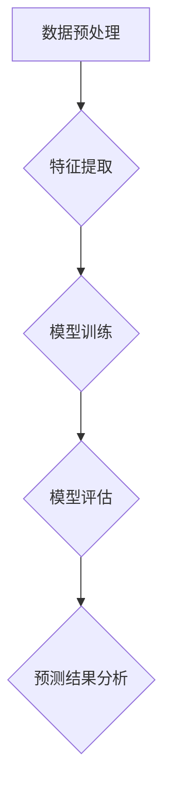

                 

# 逻辑回归(Logistic Regression) - 原理与代码实例讲解

## 关键词
- 逻辑回归
- 机器学习
- 数据科学
- 线性模型
- 指数函数
- Sigmoid函数
- 梯度下降法
- 参数优化
- 模型评估

## 摘要
逻辑回归是一种广泛应用于分类问题的统计方法。本文将详细介绍逻辑回归的原理，包括其数学模型、参数估计方法以及性能评估指标。通过Python代码实例，读者将能够更好地理解逻辑回归的算法实现和应用。此外，文章还将探讨逻辑回归在不同领域中的扩展和应用，以及其未来发展趋势。

## 第一部分：逻辑回归基础

### 第1章：逻辑回归概述

#### 1.1 逻辑回归的背景与重要性

逻辑回归（Logistic Regression）是一种广义线性模型（Generalized Linear Model，GLM），主要用于二分类问题。它基于线性回归模型，但在输出层使用了逻辑函数（Sigmoid函数）来转换概率值。

逻辑回归在机器学习领域具有重要地位，原因如下：

1. **简单有效**：逻辑回归易于理解和实现，对于数据量较小的项目，逻辑回归是一个不错的选择。
2. **概率估计**：逻辑回归能够直接给出概率估计，这在许多实际应用中非常有用。
3. **特征交互**：逻辑回归能够捕捉特征之间的交互作用，从而提高模型的预测性能。

#### 1.2 逻辑回归的数学原理

逻辑回归的核心在于逻辑函数（Sigmoid函数）。逻辑函数具有以下性质：

\[ \sigma(x) = \frac{1}{1 + e^{-x}} \]

- 当 \( x \) 较大时，\( \sigma(x) \) 接近 1。
- 当 \( x \) 较小时，\( \sigma(x) \) 接近 0。

逻辑函数在逻辑回归中用于将线性模型的输出转换为概率值。假设特征向量 \( X \) 与权重 \( \theta \) 的点积为 \( z \)，则逻辑函数应用于 \( z \) 得到概率值 \( \hat{y} \)：

\[ \hat{y} = \sigma(z) = \frac{1}{1 + e^{-\theta^T X}} \]

#### 1.3 逻辑回归的基本模型

逻辑回归模型可以表示为：

\[ \log\left(\frac{y}{1-y}\right) = \theta^T X \]

其中，\( y \) 是实际分类标签，\( X \) 是特征向量，\( \theta \) 是权重向量。

该模型表示 \( y \) 的对数似然比为 \( \theta^T X \)，即权重与特征的线性组合。

#### 1.4 逻辑回归的性能指标

逻辑回归的性能评估通常使用以下指标：

1. **准确率（Accuracy）**：预测正确的样本数占总样本数的比例。
2. **召回率（Recall）**：预测为正类的实际正类样本数占总正类样本数的比例。
3. **精确率（Precision）**：预测为正类的实际正类样本数占总预测为正类样本数的比例。
4. **F1值（F1 Score）**：精确率和召回率的调和平均值。

\[ F1 = 2 \times \frac{Precision \times Recall}{Precision + Recall} \]

这些指标能够帮助我们评估逻辑回归模型的性能，并根据实际需求进行调整。

## 第二部分：逻辑回归的应用场景

### 第2章：逻辑回归的应用场景

#### 2.1 分类问题

逻辑回归最初是为二分类问题设计的，但在多分类问题中也可以应用。

1. **二分类问题**：例如，预测邮件是否为垃圾邮件，判断客户是否愿意购买某产品等。

2. **多分类问题**：可以通过多项式逻辑回归实现，例如，对新闻文章进行分类。

#### 2.2 回归问题

虽然逻辑回归主要用于分类问题，但它也可以用于回归问题，即逻辑回归与线性回归的关系。

1. **线性回归**：输出是实数值，没有概率约束。
2. **逻辑回归**：输出是概率值，具有0到1的范围。

逻辑回归可以看作是线性回归的扩展，通过添加逻辑函数将线性组合转换为概率值。

#### 2.3 聚类问题

逻辑回归可以与聚类算法（如K-means）结合使用，以实现半监督学习。

1. **初始化聚类中心**：使用逻辑回归初始化聚类中心。
2. **迭代优化**：通过聚类算法更新聚类中心，并优化逻辑回归模型。

这种方法可以提高聚类算法的收敛速度和准确性。

## 第三部分：逻辑回归的数学模型

### 第3章：逻辑回归的数学模型

#### 3.1 模型参数

逻辑回归模型参数的推导如下：

1. **损失函数**：对于每个样本 \( (X_i, y_i) \)，损失函数为：

\[ L_i = -y_i \log(\hat{y}_i) - (1 - y_i) \log(1 - \hat{y}_i) \]

2. **损失函数和参数的关系**：总损失函数为：

\[ L = \sum_{i=1}^{n} L_i \]

其中，\( n \) 是样本数量。

3. **梯度**：损失函数对参数 \( \theta \) 的梯度为：

\[ \nabla_{\theta} L = \sum_{i=1}^{n} \left( y_i - \hat{y}_i \right) X_i \]

4. **参数更新**：使用梯度下降法更新参数：

\[ \theta \leftarrow \theta - \alpha \nabla_{\theta} L \]

其中，\( \alpha \) 是学习率。

#### 3.2 模型优化

逻辑回归的优化方法主要包括：

1. **梯度下降法**：通过计算损失函数的梯度，并沿梯度方向更新参数。
2. **拟合同化（Quasi-Newton）方法**：如BFGS和L-BFGS，利用历史梯度信息加速收敛。

#### 3.3 贝叶斯视角下的逻辑回归

从贝叶斯理论的角度看，逻辑回归可以表示为：

\[ P(y=1 | X; \theta) = \frac{e^{\theta^T X}}{1 + e^{\theta^T X}} \]

其中，\( P(y=1 | X; \theta) \) 是给定特征 \( X \) 和参数 \( \theta \) 时，标签 \( y \) 为1的条件概率。

通过贝叶斯理论，我们可以将逻辑回归视为一种概率模型，从而更好地理解其原理和应用。

## 第四部分：逻辑回归的算法实现

### 第4章：逻辑回归的算法实现

#### 4.1 Python实现

在Python中，我们可以使用`numpy`库来实现逻辑回归：

```python
import numpy as np

def sigmoid(z):
    return 1 / (1 + np.exp(-z))

def logistic_regression(X, y, theta, alpha, num_iterations):
    for i in range(num_iterations):
        z = X.dot(theta)
        predictions = sigmoid(z)
        gradient = X.T.dot(predictions - y)
        theta -= alpha * gradient
    return theta

X = ... # 特征矩阵
y = ... # 标签向量
theta = ... # 初始参数
alpha = 0.01 # 学习率
num_iterations = 1000 # 迭代次数
theta = logistic_regression(X, y, theta, alpha, num_iterations)
```

#### 4.2 Scikit-learn框架应用

Scikit-learn提供了逻辑回归的实现，我们可以直接使用：

```python
from sklearn.linear_model import LogisticRegression

model = LogisticRegression()
model.fit(X, y)
predictions = model.predict(X)
```

#### 4.3 深度学习框架TensorFlow应用

在TensorFlow中，我们可以使用`tf.keras`实现逻辑回归：

```python
import tensorflow as tf

model = tf.keras.Sequential([
    tf.keras.layers.Dense(units=1, activation='sigmoid', input_shape=(num_features,))
])

model.compile(optimizer='adam', loss='binary_crossentropy', metrics=['accuracy'])
model.fit(X, y, epochs=num_iterations)
predictions = model.predict(X)
```

这些代码示例展示了如何使用不同的库和框架实现逻辑回归。

## 第五部分：逻辑回归实战项目

### 第5章：逻辑回归实战项目

#### 5.1 数据预处理

在逻辑回归项目中，数据预处理是至关重要的一步。以下是数据预处理的一些步骤：

1. **数据清洗**：处理缺失值、异常值等。
2. **数据归一化**：将特征值缩放到0到1之间，以消除不同特征之间的尺度差异。
3. **特征工程**：提取新的特征，如文本特征、时间特征等。

#### 5.2 逻辑回归模型训练

1. **模型训练流程**：使用训练集训练模型，使用验证集进行调优。
2. **超参数调优**：通过交叉验证（Cross-Validation）选择最优的超参数。

#### 5.3 逻辑回归模型评估

1. **模型性能评估**：使用准确率、召回率、F1值等指标评估模型性能。
2. **预测结果分析**：分析预测结果，找出模型的优势和不足。

#### 5.4 项目案例分析

以邮件分类项目为例，我们可以使用逻辑回归来预测邮件是否为垃圾邮件。以下是项目的实现步骤：

1. **数据集准备**：收集邮件数据，进行预处理。
2. **特征提取**：使用TF-IDF等方法提取文本特征。
3. **模型训练**：使用训练集训练逻辑回归模型。
4. **模型评估**：使用验证集评估模型性能。
5. **预测**：使用测试集进行预测，并分析预测结果。

## 第六部分：逻辑回归的扩展与应用

### 第6章：逻辑回归的扩展与应用

#### 6.1 多项式逻辑回归

多项式逻辑回归（Multinomial Logistic Regression）可以用于多分类问题。其模型可以表示为：

\[ P(y=k | X; \theta) = \frac{e^{\theta_k^T X}}{\sum_{j=1}^{K} e^{\theta_j^T X}} \]

其中，\( K \) 是类别数，\( \theta_k \) 是第 \( k \) 个类别的权重。

#### 6.2 逻辑回归的改进方法

1. **缺失数据填充**：使用平均值、中值、最邻近等方法填充缺失值。
2. **特征选择与提取**：使用特征选择方法（如L1正则化、特征重要性评分等）来选择重要的特征。

#### 6.3 逻辑回归在金融风控中的应用

逻辑回归在金融风控中有着广泛的应用，例如：

1. **信用评分模型**：预测客户是否违约。
2. **风险评估模型**：预测股票是否上涨或下跌。

这些模型有助于金融机构评估风险和制定策略。

## 第七部分：逻辑回归的未来发展趋势

### 第7章：逻辑回归的未来发展趋势

#### 7.1 逻辑回归与其他机器学习算法的结合

逻辑回归可以与其他机器学习算法结合，以改善性能。例如：

1. **集成学习**：将逻辑回归与其他算法（如随机森林、梯度提升树等）集成，以获得更好的预测性能。
2. **深度学习**：将逻辑回归与深度学习模型（如卷积神经网络、循环神经网络等）结合，以处理更复杂的特征。

#### 7.2 逻辑回归在新兴领域中的应用

逻辑回归在新兴领域（如医疗健康、物联网等）也有着广泛的应用前景：

1. **医疗健康领域**：用于疾病预测、治疗方案推荐等。
2. **物联网领域**：用于设备故障预测、智能监控等。

#### 7.3 逻辑回归的未来挑战与机遇

逻辑回归在未来将面临以下挑战和机遇：

1. **模型复杂度**：随着数据量和特征数量的增加，逻辑回归模型的复杂度也将增加。
2. **计算效率**：提高计算效率，以适应大规模数据处理的需要。
3. **资源优化**：优化逻辑回归模型的资源使用，以提高运行效率。

逻辑回归作为一种基础的统计方法，在未来的发展中将继续发挥重要作用，并与其他算法和领域相结合，为人工智能的发展做出贡献。

### 附录

#### 附录A：数学公式与算法代码

逻辑回归的数学公式如下：

\[ \log\left(\frac{y}{1-y}\right) = \theta^T X \]

其中，\( y \) 是实际分类标签，\( X \) 是特征向量，\( \theta \) 是权重向量。

算法代码的伪代码如下：

```plaintext
初始化参数 θ
对于每个迭代：
    计算预测值 y' = sigmoid(θ·x)
    计算梯度 ∇θ = -y - y'
    更新参数 θ = θ - α·∇θ
```

#### 附录B：资源与工具

1. **逻辑回归相关的书籍**：
   - 《机器学习》（周志华 著）
   - 《统计学习方法》（李航 著）

2. **逻辑回归相关的论文**：
   - "A New Explanation of Logistic Regression with Support Vector Machines"（Wang, 2012）
   - "On the Optimality of the Simple Bayesian Classifier under Zero-One Loss"（Manning, 1995）

3. **Python与深度学习框架的使用资源**：
   - 《Python机器学习》（Sebastian Raschka 著）
   - TensorFlow官方网站：[https://www.tensorflow.org/](https://www.tensorflow.org/)
   - Scikit-learn官方网站：[https://scikit-learn.org/stable/](https://scikit-learn.org/stable/)

通过这些资源，读者可以进一步了解逻辑回归的理论和实践。

## Mermaid 流程图



## 作者信息

作者：AI天才研究院/AI Genius Institute & 禅与计算机程序设计艺术 /Zen And The Art of Computer Programming

