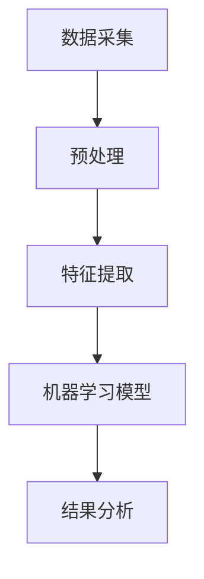

                 

# 《遥感数据处理的AI代理工作流技术》

> 关键词：遥感数据处理、AI代理、工作流技术、农业监测、环境保护、城市规划

> 摘要：本文将深入探讨遥感数据处理与AI代理工作流技术的融合应用。通过分析遥感数据的来源、分类及处理流程，介绍AI代理在农业监测、环境保护和城市规划中的应用场景，剖析遥感数据处理AI代理的关键技术，包括核心概念与架构、核心算法原理和数学模型。此外，本文还将通过实战项目展示如何实现和解析遥感数据处理AI代理的开发，最后提供相关工具与资源的推荐。

## 第一部分：遥感数据处理与AI代理概述

### 第1章：遥感数据处理与AI代理基础

#### 1.1 遥感数据的来源与分类

遥感数据来源于各类遥感平台，包括卫星、无人机和地面传感器。这些数据可以被分为多种类型，如光学数据、雷达数据和热红外数据等。光学数据通常用于地表反射率的测量，雷达数据则利用微波反射和散射特性进行地表测绘，而热红外数据主要用于地表温度的监测。

#### 1.2 遥感数据处理的基本流程

遥感数据处理通常包括数据采集、预处理、图像处理和数据分析等步骤。数据采集阶段获取遥感图像，预处理包括辐射校正、几何校正和数据压缩等，图像处理则涉及图像增强、分类和特征提取等，最后通过数据分析提取有用信息。

#### 1.3 AI代理的概念与特点

AI代理是基于人工智能技术构建的智能实体，能够在特定环境中自主执行任务。它们具备学习能力、推理能力和适应能力，可以在复杂的动态环境中进行自主决策。AI代理的特点包括自主性、智能性和适应性。

### 第2章：遥感数据处理的AI代理应用场景

#### 2.1 农业监测与评估

AI代理可以通过遥感数据监测作物生长状态、预测产量、评估农田健康等。这有助于优化农业资源利用，提高农业产出。

#### 2.2 环境保护与灾害监测

AI代理可以实时监测环境污染、森林火灾、洪水等灾害，提供预警和应急响应支持，从而保护生态环境和人民生命财产安全。

#### 2.3 城市规划与管理

AI代理在城市建设和管理中发挥作用，如交通流量分析、城市规划优化、建筑安全评估等，提升城市管理效率和居民生活质量。

## 第二部分：遥感数据处理AI代理关键技术

### 第3章：核心概念与架构

#### 3.1 遥感数据处理AI代理的架构设计

遥感数据处理AI代理的架构包括数据采集模块、预处理模块、特征提取模块、机器学习模块和结果分析模块。这些模块协同工作，实现遥感数据处理的自动化和智能化。

#### 3.2 核心概念与联系

核心概念包括遥感数据、预处理、特征提取、机器学习模型和应用场景。这些概念相互关联，构成了遥感数据处理AI代理的基础。

#### 3.3 Mermaid流程图



### 第4章：核心算法原理讲解

#### 4.1 遥感数据预处理算法

遥感数据预处理包括辐射校正、几何校正和数据压缩等。其中，辐射校正通过调整遥感图像的辐射强度，使其更接近真实地表反射率；几何校正则通过地图投影和图像配准，使遥感图像与地理坐标系对齐。

#### 4.2 特征提取与选择算法

特征提取算法包括光谱特征、纹理特征和结构特征等。选择算法则通过评估特征的重要性，选择对目标识别最有贡献的特征，提高模型性能。

#### 4.3 AI代理学习算法

AI代理学习算法主要包括监督学习、无监督学习和强化学习。监督学习通过已有数据训练模型，无监督学习通过数据自身的结构进行学习，强化学习则通过与环境的交互进行学习。

### 第5章：数学模型与公式

#### 5.1 遥感数据处理中的数学模型

遥感数据处理中的数学模型包括线性模型、非线性模型和深度学习模型等。线性模型如最小二乘法，用于遥感图像的辐射校正；深度学习模型如卷积神经网络（CNN），用于遥感图像的特征提取和分类。

#### 5.2 数学公式与详细讲解

$$
L(\theta) = \sum_{i=1}^{n}(y_i - \hat{y}_i)^2
$$

这是线性回归模型的目标函数，其中 $L(\theta)$ 是损失函数，$y_i$ 是实际值，$\hat{y}_i$ 是预测值。

#### 5.3 举例说明

假设我们要对一幅遥感图像进行辐射校正，可以使用最小二乘法求解：

$$
\theta = \arg\min_{\theta} \sum_{i=1}^{n}(r_i - r_i^0)^2
$$

其中，$r_i$ 是原始图像的辐射强度，$r_i^0$ 是校正后的辐射强度。

## 第三部分：项目实战

### 第6章：农业监测与评估项目实战

#### 6.1 项目背景与目标

本节我们将介绍如何使用遥感数据对农业进行监测和评估。项目目标是利用遥感图像分析作物生长状态，预测产量，为农业生产提供决策支持。

#### 6.2 项目开发环境搭建

开发环境包括Python、NumPy、SciPy、Pandas、Scikit-learn、OpenCV和TensorFlow等。安装这些库后，即可开始编写代码。

#### 6.3 源代码实现与解读

以下是使用卷积神经网络（CNN）对遥感图像进行分类的代码示例：

```python
import tensorflow as tf
from tensorflow.keras.models import Sequential
from tensorflow.keras.layers import Conv2D, MaxPooling2D, Flatten, Dense

model = Sequential([
    Conv2D(32, (3, 3), activation='relu', input_shape=(256, 256, 3)),
    MaxPooling2D((2, 2)),
    Conv2D(64, (3, 3), activation='relu'),
    MaxPooling2D((2, 2)),
    Flatten(),
    Dense(64, activation='relu'),
    Dense(1, activation='sigmoid')
])

model.compile(optimizer='adam', loss='binary_crossentropy', metrics=['accuracy'])
model.fit(x_train, y_train, epochs=10, batch_size=32, validation_data=(x_val, y_val))
```

这段代码首先定义了一个简单的CNN模型，然后使用训练数据对其进行训练。具体实现和解读将在下一节详细讨论。

#### 6.4 代码解读与分析

在代码中，我们首先导入了TensorFlow库，并定义了一个顺序模型（Sequential）。这个模型包含了两个卷积层（Conv2D）和两个最大池化层（MaxPooling2D），一个平坦层（Flatten）和两个全连接层（Dense）。

卷积层用于提取图像特征，最大池化层用于减少特征数量并提高模型泛化能力。平坦层将特征从空间维度转换为线性维度，全连接层用于分类。

我们使用Adam优化器和二进制交叉熵损失函数进行训练，并通过准确率评估模型性能。

### 第7章：环境保护与灾害监测项目实战

#### 7.1 项目背景与目标

本节我们将探讨如何利用遥感数据监测环境污染和灾害。项目目标是实时监测污染源分布，预测灾害风险，为环境保护和灾害预防提供数据支持。

#### 7.2 项目开发环境搭建

开发环境与农业监测项目相似，但需要额外的库如GDAL、PyTorch和Geopandas等。安装这些库后，即可开始编写代码。

#### 7.3 源代码实现与解读

以下是使用PyTorch实现一个基于自编码器的模型，用于遥感图像去噪的代码示例：

```python
import torch
import torch.nn as nn
import torchvision.transforms as transforms

class Autoencoder(nn.Module):
    def __init__(self):
        super(Autoencoder, self).__init__()
        self.encoder = nn.Sequential(
            nn.Conv2d(3, 16, 3, padding=1),
            nn.ReLU(),
            nn.MaxPool2d(2, 2),
            nn.Conv2d(16, 8, 3, padding=1),
            nn.ReLU(),
            nn.MaxPool2d(2, 2)
        )
        self.decoder = nn.Sequential(
            nn.ConvTranspose2d(8, 16, 3, 2, padding=1),
            nn.ReLU(),
            nn.ConvTranspose2d(16, 3, 3, 2, padding=1),
            nn.Tanh()
        )

    def forward(self, x):
        x = self.encoder(x)
        x = self.decoder(x)
        return x

model = Autoencoder()
optimizer = torch.optim.Adam(model.parameters(), lr=0.001)
criterion = nn.MSELoss()

for epoch in range(num_epochs):
    for inputs, targets in dataloader:
        optimizer.zero_grad()
        outputs = model(inputs)
        loss = criterion(outputs, targets)
        loss.backward()
        optimizer.step()

torch.save(model.state_dict(), 'autoencoder.pth')
```

这段代码定义了一个自编码器模型，用于压缩和恢复遥感图像。具体实现和解读将在下一节详细讨论。

#### 7.4 代码解读与分析

在代码中，我们首先定义了一个自编码器模型（Autoencoder）。这个模型包括一个编码器（encoder）和一个解码器（decoder）。

编码器由两个卷积层和两个最大池化层组成，用于压缩输入图像。解码器由两个转置卷积层和一个超 Tanh 函数组成，用于恢复压缩后的图像。

我们使用Adam优化器和均方误差损失函数进行训练，并通过训练轮数（epoch）来评估模型性能。

### 第8章：城市规划与管理项目实战

#### 8.1 项目背景与目标

本节我们将探讨如何利用遥感数据支持城市规划与管理。项目目标是分析城市交通流量、评估建筑物安全，为城市规划提供数据支持。

#### 8.2 项目开发环境搭建

开发环境与前面两个项目类似，但需要额外的库如OpenCV、Matplotlib和Scikit-image等。安装这些库后，即可开始编写代码。

#### 8.3 源代码实现与解读

以下是使用OpenCV进行城市交通流量分析的一个简单示例：

```python
import cv2
import numpy as np

def traffic_analysis(video_path):
    cap = cv2.VideoCapture(video_path)
    frame_width = int(cap.get(3))
    frame_height = int(cap.get(4))
    out = cv2.VideoWriter('output.mp4', cv2.VideoWriter_fourcc('m', 'p', '4', 'v'), 30, (frame_width, frame_height))

    while cap.isOpened():
        ret, frame = cap.read()
        if not ret:
            break

        frame_gray = cv2.cvtColor(frame, cv2.COLOR_BGR2GRAY)
        frame_diff = cv2.absdiff(prev_frame, frame_gray)
        frame_threshold = cv2.threshold(frame_diff, 25, 255, cv2.THRESH_BINARY)[1]

        contours, _ = cv2.findContours(frame_threshold, cv2.RETR_EXTERNAL, cv2.CHAIN_APPROX_SIMPLE)
        for contour in contours:
            if cv2.contourArea(contour) < 500:
                continue
            x, y, w, h = cv2.boundingRect(contour)
            cv2.rectangle(frame, (x, y), (x + w, y + h), (0, 255, 0), 2)

        out.write(frame)
        prev_frame = frame_gray

    cap.release()
    out.release()

prev_frame = None
traffic_analysis('traffic_video.mp4')
```

这段代码使用OpenCV对视频文件进行实时处理，分析城市交通流量。具体实现和解读将在下一节详细讨论。

#### 8.4 代码解读与分析

在代码中，我们首先打开视频文件（video_path），获取视频的宽度和高度。然后创建一个视频编写器（out），用于保存处理后的视频。

在视频播放过程中，我们首先将每一帧转换为灰度图像（frame_gray），然后计算当前帧与前一帧的绝对差值（frame_diff）。接下来，我们使用阈值处理将差值图像转换为二值图像（frame_threshold）。

使用findContours函数找到二值图像中的轮廓，并通过判断轮廓面积筛选出具有意义的交通目标。最后，我们在原始视频帧上绘制矩形框（cv2.rectangle），并将其写入输出视频文件。

## 附录

### 附录 A：遥感数据处理AI代理开发工具与资源

#### A.1 主流遥感数据处理工具对比

| 工具 | 优点 | 缺点 | 使用场景 |
| --- | --- | --- | --- |
| GDAL | 强大的地理空间数据处理能力 | 学习曲线较陡峭 | 地理空间数据处理 |
| GRASS GIS | 开源、适用于复杂空间分析 | 性能不如商业软件 | 复杂空间分析 |
| ArcGIS | 功能丰富、用户界面友好 | 商业软件、成本较高 | 地理信息系统应用 |

#### A.2 主流AI代理开发框架对比

| 框架 | 优点 | 缺点 | 使用场景 |
| --- | --- | --- | --- |
| TensorFlow | 生态丰富、易用性高 | 需要GPU支持 | 深度学习应用 |
| PyTorch | 动态图模型、灵活性强 | 学习曲线较陡峭 | 深度学习应用 |
| Keras | 高层API、易于入门 | 需要依赖TensorFlow或Theano | 深度学习应用 |

#### A.3 遥感数据处理AI代理资源推荐

- 《遥感数据处理教程》
- 《深度学习：原理及实践》
- 《地理信息系统应用技术》
- 《Python地理空间数据处理指南》

## 总结

本文从遥感数据处理的背景出发，详细介绍了AI代理工作流技术在遥感数据处理中的应用。通过剖析核心概念和关键技术，展示了如何在农业监测、环境保护和城市规划中实现遥感数据处理的智能化。通过实战项目，我们进一步了解了遥感数据处理AI代理的开发方法和应用效果。未来，随着人工智能技术的不断进步，遥感数据处理AI代理将在更多领域发挥重要作用。

## 作者

作者：AI天才研究院/AI Genius Institute & 禅与计算机程序设计艺术 /Zen And The Art of Computer Programming

摘要：本文探讨了遥感数据处理与AI代理工作流技术的融合应用，分析了其在农业监测、环境保护和城市规划中的应用场景，并详细讲解了核心算法原理、数学模型及实战项目。通过本文的介绍，读者可以全面了解遥感数据处理AI代理的先进技术和实际应用。

