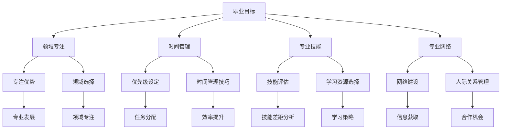

                 

### 第1章 引言

#### 1.1 书籍背景

在当今快速发展的技术时代，专业知识和技能的更新速度越来越快，这使得许多专业人士感到迷茫和压力。为了在激烈的职场竞争中脱颖而出，很多人试图学习尽可能多的领域知识，以期提升自身的竞争力。然而，这种多领域游荡的现象往往导致学习效果不佳，甚至阻碍了职业发展。因此，本书旨在探讨如何在众多领域中保持专注，如何建立和提升专业技能，从而实现个人的职业发展。

#### 1.2 目标读者

本书的目标读者是那些已经在职场中有一段工作经历，希望进一步提升专业技能和职业发展的人。无论你是程序员、数据分析师、项目经理，还是其他技术领域的专业人士，本书都将为你提供实用的指导和建议。

#### 1.3 书籍结构

本书分为八个章节，每个章节都围绕一个核心主题展开。首先，在第一章中，我们将介绍书籍的背景、目标读者和书籍结构。接下来，第二章将讨论专业发展的基本原理，包括如何确定职业目标和进行领域专注。第三章将深入探讨如何建立专业技能，包括技能评估、学习资源的选择和项目实践。第四章将介绍时间管理和优先级设定的重要性，并提供实用的技巧和方法。第五章将关注专业网络建设，探讨如何通过建立和维护专业网络来提升职业发展。第六章将讨论持续学习和自我提升的策略，并提供实际操作方法。第七章将通过实际案例来分析如何避免在多个领域游荡，并在特定领域实现职业突破。最后，第八章将总结全书的核心观点，并给出反思和行动建议。

### 目录大纲：

**避免在多个领域游荡**

> 关键词：专业发展、领域专注、专业技能、时间管理、优先级设定、专业网络、持续学习

> 摘要：本书旨在帮助专业人士在众多领域中保持专注，通过明确职业目标、建立专业技能、有效管理时间和优先级、建立专业网络以及持续学习和自我提升，实现职业生涯的稳步发展。

### 第2章 专业发展的基本原理

在开始具体的职业发展路径之前，了解专业发展的基本原理是至关重要的。这一章将探讨如何确定职业目标、领域专注的重要性以及如何避免多领域游荡，从而为职业发展奠定坚实的基础。

#### 2.1 确定职业目标

职业目标是个人在职业生涯中期望达到的具体状态或成就。一个明确的职业目标能够为个人提供方向和动力，有助于更好地规划职业生涯。以下步骤可以帮助你确定职业目标：

1. **自我评估**：首先，进行自我评估，了解自己的兴趣、优势、价值观和长期目标。这可以通过撰写个人陈述、进行职业兴趣测试或与导师和同事交流来完成。

2. **职业愿景**：基于自我评估，明确你的职业愿景。这包括你希望成为什么样的人，以及你希望在职业生涯中实现什么目标。

3. **技能需求分析**：分析目标职位所需的技能和资格，确保你的职业目标与市场需求相匹配。

4. **制定职业规划**：根据职业愿景和技能需求，制定具体的职业规划。这包括设定短期和长期目标，以及为实现这些目标所需的具体步骤。

#### 2.1.1 职业愿景

职业愿景是一个长期的目标，描述了你在职业生涯中希望实现的目标和成就。一个明确的职业愿景可以帮助你保持专注，并为你的职业发展提供指导。以下是如何制定职业愿景的建议：

1. **描述你的理想工作**：想象一下你的理想工作是什么样子，包括职责、工作环境、薪酬待遇等。

2. **设定长期目标**：基于理想工作，设定一些长期目标，例如成为某个领域的专家、在某个时间内达到某个职位或实现某个特定的成就。

3. **制定行动计划**：为每个长期目标制定具体的行动计划，包括需要学习的技能、需要完成的项目、需要参加的培训和会议等。

#### 2.1.2 职业技能需求分析

了解目标职位所需的技能和资格是制定职业规划的重要一步。以下是如何进行职业技能需求分析的建议：

1. **研究行业趋势**：通过研究行业报告、专业网站和社交媒体，了解目标行业的发展趋势和新兴技术。

2. **分析职位描述**：仔细阅读目标职位的职位描述，了解所需的具体技能和资格。

3. **与行业专家交流**：与在目标行业工作的专业人士交流，获取第一手经验和建议。

4. **建立技能清单**：根据上述分析，建立一份详细的技能清单，包括需要学习的技能和已经具备的技能。

#### 2.1.3 职业发展路径规划

职业发展路径规划是将职业愿景和技能需求转化为实际行动的过程。以下是如何制定职业发展路径的建议：

1. **设定短期目标**：将长期目标分解为可实现的短期目标，例如在短期内完成某个项目、获得某个证书或提升某个技能。

2. **制定行动计划**：为每个短期目标制定具体的行动计划，包括需要完成的任务、所需资源和时间表。

3. **持续监控和调整**：定期评估职业发展进度，并根据实际情况调整计划和目标。

#### 2.2 领域专注的重要性

领域专注是职业发展的关键因素之一。专注于一个特定领域可以帮助你：

1. **建立专业技能**：通过深入学习特定领域的知识，你可以迅速建立和提升专业技能，成为该领域的专家。

2. **提升竞争力**：在特定领域拥有深厚的知识和经验，使你在求职和职场竞争中具有明显的优势。

3. **促进职业发展**：专注可以让你更快地晋升到高级职位，并在职业生涯中获得更高的薪酬和更多的机会。

#### 2.2.1 领域专注的优势

领域专注具有以下优势：

1. **专业知识积累**：通过专注于一个领域，你可以积累更深入的专业知识和经验，从而在职业生涯中获得更多的机会。

2. **提高工作效率**：专注于一个领域可以使你更熟悉相关工具、技术和流程，从而提高工作效率。

3. **建立专业网络**：专注于一个领域有助于你建立更紧密的专业网络，与行业内的专家和同行建立联系。

#### 2.2.2 多领域游荡的弊端

多领域游荡可能带来以下弊端：

1. **分散注意力**：同时关注多个领域会分散你的注意力，导致你无法深入掌握任何一项技能。

2. **学习效率低下**：在不同领域之间切换会消耗大量时间和精力，降低学习效率。

3. **职业发展受阻**：多领域游荡可能导致你在每个领域都只是浅尝辄止，难以在职场中获得突破。

#### 2.2.3 如何避免领域游荡

以下是一些建议，帮助你避免领域游荡：

1. **明确职业目标**：确保你的职业目标明确且具体，这有助于你专注于实现这些目标。

2. **制定学习计划**：为特定领域制定详细的学习计划，包括学习资源、时间表和具体目标。

3. **专注于核心技能**：专注于提升核心技能，确保你在目标领域中具有竞争力。

4. **拒绝分散注意力的事务**：学会拒绝那些与职业目标无关的事务，保持专注。

5. **定期评估和调整**：定期评估你的学习进度和职业发展，根据实际情况调整学习计划和职业目标。

### 第3章 建立专业技能

在确定了职业目标和专注于特定领域之后，建立专业技能成为实现职业发展的关键步骤。这一章将详细探讨如何评估当前技能水平、选择合适的学习资源、参与实践项目和实习，从而有效提升专业技能。

#### 3.1 技能评估

技能评估是了解自身技能水平的重要环节，有助于明确提升方向和目标。以下是如何进行技能评估的建议：

1. **自我评估**：首先，进行自我评估，列出你所掌握的所有技能，并评估每个技能的熟练程度。

2. **求助他人**：向同事、导师或行业专家寻求反馈，了解他们在你专业领域中的评价。

3. **使用评估工具**：利用在线评估工具，如LinkedIn Skill Assessments或其他行业认证，以获得更客观的评估结果。

4. **技能差距分析**：比较当前技能水平与目标技能水平，识别技能差距，确定需要提升的领域。

#### 3.1.1 当前技能水平评估

当前技能水平评估是一个系统性的过程，需要你：

1. **列出技能清单**：详细列出你所掌握的所有技能，包括技术技能、软技能和行业特定技能。

2. **评估技能熟练度**：为每个技能分配一个熟练度等级，如初级、中级、高级。

3. **记录评估结果**：将评估结果记录在技能表格或文档中，以便跟踪和更新。

4. **定期更新**：随着职业发展，定期更新你的技能评估，确保信息准确。

#### 3.1.2 技能差距分析

技能差距分析是识别当前技能与目标技能之间的差距的过程，有助于制定提升计划。以下是如何进行技能差距分析的建议：

1. **目标技能清单**：根据职业目标和职位要求，列出目标技能清单。

2. **对比分析**：将当前技能清单与目标技能清单进行对比，识别差距。

3. **优先级排序**：根据技能的重要性、紧急性和难度，对技能差距进行优先级排序。

4. **制定提升计划**：针对每个技能差距，制定具体的提升计划，包括学习资源、时间和行动步骤。

#### 3.1.3 技能提升计划

技能提升计划是实施技能提升的具体步骤和策略。以下是如何制定技能提升计划的建议：

1. **设定具体目标**：为每个技能提升目标设定明确、具体和可衡量的目标。

2. **选择学习资源**：根据技能需求，选择合适的学习资源，如专业书籍、在线课程、研讨会和实习。

3. **制定时间表**：为每个技能提升目标制定详细的时间表，确保按时完成。

4. **行动步骤**：为每个技能提升目标制定具体的行动步骤，包括学习任务、实践项目和评估方法。

5. **定期评估**：定期评估技能提升进度，根据评估结果调整计划和目标。

#### 3.2 学习资源的选择

选择合适的学习资源是提升专业技能的关键。以下是一些建议，帮助你选择有效的学习资源：

1. **专业书籍**：选择与领域相关的权威书籍，这些书籍通常包含深入的理论和实践知识。

2. **在线课程**：参加知名在线教育平台（如Coursera、edX、Udemy）提供的专业课程，这些课程通常由行业专家授课。

3. **研讨会和讲座**：参加行业研讨会、讲座和会议，了解行业最新动态和趋势。

4. **实践项目和实习**：参与实际项目和实践，通过动手操作和解决问题来提升技能。

5. **导师和同行**：寻求导师指导，与同行交流，从他们的经验和见解中学习。

#### 3.2.1 专业书籍和资料

专业书籍是建立深厚专业知识的重要资源。以下是一些建议，帮助你选择专业书籍：

1. **权威书籍**：选择由知名作者或权威机构出版的书籍，这些书籍通常具有广泛认可的专业性和可靠性。

2. **经典著作**：阅读经典著作，这些书籍往往包含了领域的核心理论和经典案例。

3. **实用指南**：选择实用指南，这些书籍通常包含具体的操作方法和实战技巧。

4. **最新出版**：关注最新出版的书籍，这些书籍往往反映了最新的技术和趋势。

#### 3.2.2 在线课程和研讨会

在线课程和研讨会是快速提升专业技能的有效途径。以下是一些建议：

1. **课程评价**：查看课程评价和用户反馈，选择评分高、评价好的课程。

2. **课程内容**：确保课程内容与你的技能需求相匹配，涵盖你希望学习的领域。

3. **讲师资质**：了解讲师的资质和经验，选择具有专业背景和实践经验的讲师。

4. **互动性**：选择具有互动性的课程，如实时讨论、作业和项目，以提高学习效果。

5. **学习计划**：制定详细的学习计划，确保按时完成课程。

#### 3.2.3 实践项目和实习

实践项目和实习是提升实际操作能力和工作经验的重要途径。以下是一些建议：

1. **项目选择**：选择与你职业目标和技能提升计划相关的项目，确保项目具有实际意义和挑战性。

2. **团队合作**：参与团队合作项目，学习如何在团队中协作和沟通。

3. **解决问题**：通过解决实际问题和挑战，提升问题解决能力和实际操作能力。

4. **导师指导**：寻找导师或指导者，他们可以提供宝贵的反馈和指导。

5. **实习经验**：寻找实习机会，获得实际工作经验和行业洞察。

#### 3.3 参与实践项目和实习

参与实践项目和实习是提升专业技能和实际操作能力的重要途径。以下是如何参与实践项目和实习的建议：

1. **寻找机会**：通过行业网站、招聘平台、社交媒体和行业活动寻找实践项目和实习机会。

2. **准备简历**：根据实践项目和实习要求，准备专业的简历和求职信。

3. **面试准备**：提前准备面试，了解公司的背景、文化和实习岗位的要求。

4. **积极学习**：实习期间，积极主动学习，积极参与项目，不断提升自身能力。

5. **建立人脉**：通过实习建立人脉，与同事和导师保持联系，为未来的职业发展打下基础。

#### 3.3.1 实践项目的重要性

实践项目是理论知识转化为实际操作的重要途径。以下是一些实践项目的重要性：

1. **应用知识**：通过实践项目，可以将所学理论知识应用到实际工作中，加深对知识的理解和掌握。

2. **提升技能**：实践项目提供了动手操作的机会，有助于提升专业技能和实际操作能力。

3. **团队合作**：参与实践项目可以锻炼团队合作能力和沟通技巧，提高在团队中的协作效率。

4. **解决问题**：实践项目往往涉及复杂问题和挑战，通过解决这些问题，可以提升问题解决能力和创新思维。

5. **积累经验**：实践项目是积累工作经验和行业洞察的重要途径，有助于提高职业竞争力。

#### 3.3.2 实习的价值

实习是了解行业、提升职业能力的重要机会。以下是一些实习的价值：

1. **职业体验**：通过实习，可以亲身体验职场生活，了解行业现状和公司文化。

2. **建立人脉**：实习期间可以结识同事和导师，建立人脉网络，为未来的职业发展打下基础。

3. **积累经验**：实习提供了实际工作经验，有助于提高职业能力和竞争力。

4. **职业规划**：通过实习，可以更清晰地了解自己的职业兴趣和发展方向，为未来的职业规划提供参考。

5. **提升就业竞争力**：拥有实习经验可以在求职时增加竞争力，使你在众多候选人中脱颖而出。

### 第4章 时间管理与优先级设定

在现代社会，时间管理是一项至关重要的技能，对于职业发展和个人生活平衡都具有重要意义。有效的时间管理和优先级设定可以帮助你更高效地完成任务，提高工作效率，减少压力，从而实现职业目标。以下将详细介绍时间管理的基本概念、时间管理技巧以及如何设定优先级。

#### 4.1 时间管理基本概念

时间管理是指通过规划和组织时间，确保在有限的时间内完成更多的任务，实现个人和职业目标的过程。以下是一些基本概念：

1. **时间意识**：意识到时间的有限性和宝贵性，珍惜每一分每一秒。

2. **任务分解**：将大任务分解为小任务，使任务更加具体和可操作。

3. **优先级设定**：根据任务的重要性和紧急性，设定任务的优先级，确保重要且紧急的任务优先完成。

4. **时间跟踪**：记录和跟踪时间花费，了解时间利用情况，识别浪费时间的环节。

5. **弹性安排**：预留一定的时间缓冲，以应对突发情况和任务延期。

#### 4.1.1 时间管理的重要性

时间管理的重要性体现在以下几个方面：

1. **提高效率**：通过有效的时间管理，可以减少不必要的任务和时间浪费，提高工作效率。

2. **减少压力**：合理规划时间，避免任务堆积和紧迫感，减少工作压力和焦虑。

3. **实现目标**：明确时间目标和任务优先级，有助于更有针对性地分配时间和精力，实现职业和个人目标。

4. **工作与生活平衡**：有效的时间管理有助于平衡工作与个人生活，提高生活质量和幸福感。

#### 4.1.2 时间管理技巧

以下是一些实用的时间管理技巧：

1. **制定日程表**：每天早上或每周开始时，制定详细的日程表，包括工作任务、会议、休息和活动。

2. **设定优先级**：根据任务的重要性和紧急性，将任务分为优先级，确保重要和紧急的任务优先完成。

3. **使用时间跟踪工具**：使用时间跟踪工具（如Toggl、RescueTime），记录和监控时间花费，了解时间利用情况。

4. **避免拖延**：使用番茄工作法等技巧，避免拖延，提高专注力。

5. **分解任务**：将大任务分解为小任务，使任务更加具体和可操作，提高完成任务的可能性。

6. **学会说“不”**：合理拒绝不重要的任务和请求，避免过度承诺和任务堆积。

7. **定期回顾**：定期回顾时间管理和任务完成情况，评估效果，并根据实际情况调整计划和策略。

#### 4.2 如何设定优先级

设定优先级是时间管理的关键步骤，以下是一些设定优先级的技巧：

1. **紧急与重要矩阵**：使用紧急与重要矩阵（Eisenhower Matrix），将任务分为四个象限：紧急且重要、不紧急但重要、紧急但不重要、不紧急且不重要。

   - 紧急且重要：优先处理，确保任务及时完成。
   - 不紧急但重要：计划处理，确保任务在适当时间内完成。
   - 紧急但不重要：委托他人处理或暂时搁置。
   - 不紧急且不重要：避免处理，减少时间浪费。

2. **关键成果法**（Kano Method）：将任务与关键成果指标（KPI）关联，确保任务与职业目标一致。

3. **ABC法**：将任务分为A、B、C三类，A类任务为最重要和最紧急的任务，B类任务为重要但可延期的任务，C类任务为不太重要且可延期的任务。

4. **时间限制法**：为每个任务设定时间限制，确保任务在规定时间内完成。

5. **GTD法**（Getting Things Done）：将任务整理、组织、分类和归档，确保任务清晰可见和有序管理。

#### 4.2.1 优先级设定方法

以下是一种常用的优先级设定方法：

1. **分析任务**：分析每个任务的重要性和紧急性，确定任务的优先级。

2. **列出任务**：将所有任务列出，并标注每个任务的紧急性和重要性。

3. **划分优先级**：根据紧急性和重要性，将任务分为高、中、低三个优先级。

4. **分配时间**：根据任务的优先级，分配相应的时间资源，确保重要和紧急的任务优先完成。

5. **监控和调整**：定期监控任务的完成情况，并根据实际情况调整优先级和时间分配。

#### 4.2.2 优先级调整策略

优先级调整是一个动态过程，需要根据任务的变化和实际情况进行调整。以下是一些优先级调整策略：

1. **灵活调整**：根据任务的进展和实际情况，灵活调整任务的优先级。

2. **优先级反转**：在紧急情况下，可能需要将原本不紧急的任务提升为紧急任务。

3. **资源分配**：根据可用资源和任务需求，重新分配时间资源，确保任务顺利完成。

4. **紧急情况应对**：在遇到紧急情况时，及时调整优先级，确保重要任务得到优先处理。

5. **定期回顾**：定期回顾任务的完成情况和优先级设定效果，根据实际情况进行调整。

#### 4.2.3 拒绝不重要的事务

拒绝不重要的任务是有效时间管理的重要一环。以下是一些拒绝不重要性事务的策略：

1. **明确界限**：明确界定你的工作范围和职责，避免承担不必要的任务。

2. **委派任务**：将不太重要或适合自己的任务委派给他人，确保任务得到妥善处理。

3. **沟通技巧**：学会使用婉转的语言和技巧，礼貌地拒绝不重要性事务，避免伤害他人感情。

4. **优先级提醒**：在遇到不重要性事务时，提醒对方你的当前优先级和任务进度，让对方了解你的实际情况。

5. **寻求支持**：在必要时，寻求上级或同事的支持和协助，确保任务得到合理处理。

### 第5章 专业网络建设

在职业发展中，建立和维护专业网络是至关重要的。一个强大的专业网络不仅可以为你提供宝贵的信息和机会，还能在职业发展中起到关键作用。以下将探讨专业网络的重要性、如何建立和维护专业网络，以及如何通过专业网络获得职业机会。

#### 5.1 专业网络的重要性

专业网络对于职业发展具有以下几个重要作用：

1. **信息获取**：通过专业网络，你可以及时获取行业动态、市场趋势、技术更新等有价值的信息。

2. **职业机会**：专业网络可以为你提供更多的职业机会，包括内部招聘、推荐职位和合作伙伴关系。

3. **知识分享**：通过与同行和专业人士的交流，你可以分享知识和经验，学习新的技能和观点。

4. **支持和资源**：在遇到困难或挑战时，专业网络可以为你提供支持和资源，帮助你解决问题和克服障碍。

5. **职业发展**：一个强大的专业网络可以帮助你在职业生涯中实现晋升、转型和职业突破。

#### 5.2 建立和维护专业网络

以下是一些建立和维护专业网络的建议：

1. **积极参与行业活动**：参加行业会议、研讨会、讲座等活动，结识同行业人士，扩大人脉。

2. **利用社交媒体**：利用LinkedIn、Twitter等社交媒体平台，关注行业领袖、专家和同行，参与行业讨论，分享专业见解。

3. **建立有意义的联系**：与专业网络中的成员建立真诚和有意义的联系，通过互动和交流，加深彼此的了解。

4. **提供帮助**：乐于帮助他人，分享知识和资源，建立互惠互利的关系。

5. **保持联系**：定期与专业网络中的成员保持联系，通过电子邮件、社交媒体或电话进行沟通，维持关系的活跃。

#### 5.3 如何通过专业网络获得职业机会

以下是一些通过专业网络获得职业机会的策略：

1. **建立个人品牌**：在专业网络中建立个人品牌，展示你的专业知识和技能，提升个人知名度。

2. **主动推荐**：在专业网络中主动寻求推荐，通过他人的好评和推荐，提高求职成功率。

3. **利用人脉**：利用专业网络中的人脉资源，了解行业内的招聘信息和机会，争取内部推荐。

4. **参与项目**：通过参与专业网络中的项目或活动，展示自己的能力和潜力，吸引潜在雇主的注意。

5. **持续学习**：保持专业知识的更新和技能的提升，提高自己在行业内的竞争力。

### 第6章 持续学习和自我提升

在快速发展的技术时代，持续学习和自我提升是职业发展的关键。一个不断学习和进步的专业人士能够适应市场的变化，保持竞争力，实现职业目标。以下将探讨自我提升的重要性、如何实现持续学习以及一些实用的学习策略。

#### 6.1 自我提升的重要性

自我提升在职业发展中的重要性体现在以下几个方面：

1. **适应变化**：随着技术的不断进步和市场的变化，自我提升可以帮助你适应新的环境和技术，保持竞争力。

2. **提升技能**：通过自我提升，你可以学习新的技能和知识，提高工作效率和绩效。

3. **职业发展**：自我提升是实现职业发展的基础，通过不断学习和进步，你可以获得更多的职业机会和晋升机会。

4. **个人成长**：自我提升不仅有助于职业发展，还能促进个人成长，提高自信心和生活质量。

#### 6.2 如何实现持续学习

以下是一些实现持续学习的方法：

1. **设定学习目标**：明确你的学习目标和需求，为学习提供方向和动力。

2. **制定学习计划**：根据学习目标，制定详细的学习计划，包括学习资源、时间和行动步骤。

3. **多渠道学习**：利用各种学习资源，如专业书籍、在线课程、研讨会、实习等，多渠道学习。

4. **实践应用**：将所学知识应用到实际工作中，通过实践来巩固和提升技能。

5. **建立学习习惯**：养成良好的学习习惯，如定期阅读、参加学习小组、写学习日志等。

#### 6.3 实用的学习策略

以下是一些实用的学习策略：

1. **主动学习**：主动参与学习过程，积极思考和提问，提高学习效果。

2. **分散学习**：将学习任务分散到不同的时间段，避免一次性学习过多内容，提高学习效率。

3. **深度学习**：选择一个主题进行深入学习和研究，通过深入学习来掌握核心知识和技能。

4. **反思总结**：学习后进行反思和总结，巩固所学知识，发现问题和不足，为后续学习提供指导。

5. **知识共享**：通过与他人分享知识和经验，加深对知识的理解和记忆，同时也能从他人那里获得新的见解和启发。

### 第7章 实际案例与分析

为了更好地理解如何避免在多个领域游荡，并在特定领域实现职业突破，我们将通过三个实际案例进行分析。这些案例涵盖了专注发展特定领域、时间管理与优先级设定的成功应用，以及通过专业网络获得职业机会的实践。

#### 7.1 案例一：如何专注发展特定领域

**案例背景**：李明是一名软件开发工程师，工作五年后感到自己的技能和职业发展受到了瓶颈。他发现自己无法在多个技术领域同时保持高水平的专业知识，于是决定专注于一个领域。

**解决方法**：
1. **明确职业目标**：李明确定了自己的职业愿景，希望成为人工智能领域的专家。
2. **技能评估**：他通过自我评估和向同事咨询，明确了当前技能水平与目标之间的差距。
3. **专注领域**：李明决定专注于机器学习和深度学习，减少在其他领域的投资。
4. **学习资源**：他选择了几本权威的机器学习书籍，报名参加了一个在线课程，并加入了一个机器学习社区。

**结果**：通过一年的专注学习，李明成功掌握了机器学习的核心技能，并在公司的人工智能项目中担任了关键角色。他的技术能力得到了认可，不仅晋升为高级工程师，还获得了行业内部的奖项。

**分析**：李明的成功在于他明确职业目标，通过专注一个领域来提升专业技能。这种方法避免了多领域游荡，使他能够在特定领域内深入学习和实践，从而实现职业突破。

#### 7.2 案例二：时间管理与优先级设定的应用

**案例背景**：张伟是一名项目经理，经常感到工作压力很大，因为他需要同时处理多个项目，导致效率低下。

**解决方法**：
1. **时间管理**：张伟开始记录每天的工作时间，并使用时间跟踪工具来监控自己的时间花费。
2. **优先级设定**：他使用紧急与重要矩阵来评估每个项目的紧急性和重要性，并根据这个矩阵来设定优先级。
3. **任务分解**：他将每个项目分解为小任务，并为每个任务设定具体的时间限制。
4. **灵活调整**：他学会了在遇到紧急情况时，灵活调整任务优先级和时间分配。

**结果**：通过有效的时间管理和优先级设定，张伟的工作效率大幅提高，项目按时完成，工作压力减少，同事和客户对他的工作满意度也提高了。

**分析**：张伟的成功在于他学会了如何合理安排时间和任务，通过设定优先级来确保重要且紧急的任务得到优先处理。这种方法帮助他避免多领域游荡，集中精力在关键任务上，从而提高工作效率和项目成功率。

#### 7.3 案例三：通过专业网络获得职业机会

**案例背景**：王丽是一名数据分析师，她希望通过专业网络获得更多的职业机会。

**解决方法**：
1. **参与行业活动**：王丽积极参与行业会议和研讨会，结识了多位同行业的专家和从业者。
2. **建立个人品牌**：她在LinkedIn上建立了专业的个人资料，分享自己的专业见解和成功案例。
3. **主动推荐**：她主动联系专业网络中的成员，寻求推荐和建议。
4. **参与项目**：她通过专业网络参与了一些数据分析项目，展示了她的专业技能和成果。

**结果**：通过专业网络的帮助，王丽成功获得了一个知名公司的内部推荐，并在面试中表现出色，最终得到了这份理想的工作。

**分析**：王丽的成功在于她通过积极参与专业网络活动，建立了个人品牌，并通过主动推荐和参与项目来展示自己的能力。这种方法使她能够通过专业网络获得更多的职业机会，实现了职业发展的飞跃。

### 总结

以上三个案例展示了如何通过专注特定领域、有效时间管理和优先级设定，以及通过专业网络来获得职业机会，从而实现职业突破。这些案例表明，避免在多个领域游荡，专注于特定领域的深入发展，结合有效的时间管理和专业网络建设，是提升职业竞争力、实现职业发展的重要途径。

### 第8章 总结与反思

通过前七章节的探讨，我们深入分析了在职业发展中避免在多个领域游荡的重要性，并提出了具体的策略和方法。以下是对全书核心观点的回顾、书籍结构的分析以及对职业发展的启示。

#### 8.1 核心观点回顾

1. **明确职业目标**：了解自己的兴趣、优势和价值观，设定明确的职业目标，为职业生涯提供方向。

2. **领域专注**：专注于一个特定领域，通过深入学习和实践，建立深厚专业技能，提升职业竞争力。

3. **时间管理与优先级设定**：合理规划时间，设定任务优先级，确保重要任务得到优先处理，提高工作效率。

4. **专业网络建设**：积极参与行业活动，建立和维护专业网络，通过人脉资源获得职业机会。

5. **持续学习和自我提升**：通过不断学习和实践，保持知识更新和技能提升，适应市场变化，实现职业发展。

#### 8.1.1 书籍结构分析

本书分为八个章节，结构紧凑且逻辑清晰。第一章引言部分介绍了书籍的背景、目标读者和书籍结构。第二章和第三章分别探讨了专业发展的基本原理和建立专业技能的方法。第四章至第六章重点介绍了时间管理、优先级设定和专业网络建设。第七章通过实际案例分析了如何避免多领域游荡，并在特定领域实现职业突破。第八章进行了总结与反思，回顾了核心观点，分析了书籍结构，并对职业发展提供了启示。

#### 8.1.2 对职业发展的启示

1. **职业规划**：通过明确职业目标和设定职业规划，为职业生涯提供明确的方向和路径。

2. **专业技能**：专注于一个领域，通过深入学习、实践和项目参与，建立和提升专业技能。

3. **时间管理**：合理规划时间，设定任务优先级，提高工作效率，减少工作压力。

4. **专业网络**：积极参与行业活动，建立专业网络，通过人脉资源获得职业机会。

5. **持续学习**：不断学习和自我提升，保持知识更新和技能提升，适应市场变化。

#### 8.2 反思与行动

在反思个人职业发展时，以下行动建议可以帮助你实现职业目标：

1. **自我评估**：定期进行自我评估，了解自己的兴趣、优势和价值观，调整职业目标。

2. **专注领域**：明确自己的职业目标后，专注于一个领域，通过深入学习、实践和项目参与，提升专业技能。

3. **时间管理**：制定详细的时间管理计划，设定任务优先级，确保重要任务得到优先处理。

4. **专业网络**：积极参与行业活动，建立和维护专业网络，通过人脉资源获得职业机会。

5. **持续学习**：定期学习新的知识和技能，保持持续学习的习惯，提升个人竞争力。

6. **反思与调整**：定期反思职业发展情况，根据实际情况调整职业规划和目标，保持灵活性和适应性。

通过以上反思与行动，你可以更好地规划职业发展，避免在多个领域游荡，实现职业生涯的稳步发展。

### 附录A：专业资源指南

为了帮助读者更深入地学习和实践，本书附录A提供了一些专业资源指南，包括在线资源和课程、书籍推荐以及专业组织和社区。

#### A.1 在线资源和课程

1. **Coursera**  
   - 课程名称：《专业发展与职业规划》  
   - 课程链接：[Coursera链接](https://www.coursera.org/learn/professional-development-career-planning)

2. **edX**  
   - 课程名称：《时间管理与效率提升》  
   - 课程链接：[edX链接](https://www.edx.org/course/time-management-and-efficiency-boosting)

#### A.2 书籍推荐

1. **《深度工作：如何有效利用每一点脑力》**  
   - 作者：Cal Newport  
   - 链接：[Amazon链接](https://www.amazon.com/Deep-Work-How-Focused-Attention-Productive/dp/0399597471)

2. **《网络的力量：如何通过人脉提升个人影响力》**  
   - 作者：Albert-László Barabási  
   - 链接：[Amazon链接](https://www.amazon.com/Network-Effect-How-Powerful-Human-Connections/dp/0143127744)

#### A.3 专业组织和社区

1. **Association for Talent Development (ATD)**  
   - 网站：[ATD官网](https://www.td.org/)  
   - 简介：提供职业发展、培训和发展资源。

2. **LinkedIn**  
   - 网站：[LinkedIn官网](https://www.linkedin.com/)  
   - 简介：建立和维护专业网络的重要平台。

这些资源可以帮助你更全面地了解专业领域，提升专业技能，实现职业发展目标。

### 附录B：核心概念与联系

在专业领域的发展过程中，核心概念之间的联系对于深入理解和应用知识至关重要。以下使用Mermaid流程图展示核心概念及其之间的联系：



#### 附录C：核心算法原理讲解

为了更好地理解在专业领域中的算法原理，以下将介绍一种简单的技能提升算法，并使用伪代码进行详细阐述。

**技能提升算法原理**：该算法用于评估一个专业人士的当前技能水平与目标技能水平之间的差距，并生成相应的提升计划。

**输入参数**：
- `current_skill_level`：当前技能水平（字符串类型，如"初级"、"中级"、"高级"）。
- `target_skill_level`：目标技能水平（字符串类型，如"初级"、"中级"、"高级"）。

**输出**：
- `improvement_plan`：技能提升计划（字符串类型，描述提升建议）。

**算法步骤**：

1. 比较当前技能水平与目标技能水平。
2. 根据比较结果，生成提升计划。

**伪代码**：

```plaintext
Algorithm SkillImprovement(current_skill_level, target_skill_level):
    improvement_plan := ""

    if current_skill_level == target_skill_level:
        improvement_plan := "保持当前水平"
    else if current_skill_level == "初级" and target_skill_level == "中级":
        improvement_plan := "初级提升计划：学习中级课程，完成相关项目"
    else if current_skill_level == "中级" and target_skill_level == "高级":
        improvement_plan := "中级提升计划：深入学习高级课程，参与专业研讨会，完成复杂项目"
    else:
        improvement_plan := "高级提升计划：与行业专家交流，参与高级研究项目，发表专业论文"

    return improvement_plan
```

**举例说明**：

假设一个专业人士的当前技能水平是“初级”，而目标技能水平是“中级”。根据上述算法，生成的提升计划如下：

```plaintext
improvement_plan := SkillImprovement("初级", "中级")
improvement_plan = "初级提升计划：学习中级课程，完成相关项目"
```

这个提升计划为专业人士提供了具体的行动建议，以帮助其从“初级”水平提升到“中级”水平。

#### 附录D：数学模型和数学公式

在专业技能提升过程中，数学模型和公式可以帮助我们量化评估和预测技能水平的变化。以下将介绍两种常用的数学模型和公式。

**1. 技能增长模型**

技能增长模型通常基于学习曲线理论，假设技能水平随时间呈指数增长。数学模型可以表示为：

$$
L(t) = L_0 \cdot e^{kt}
$$

其中，$L(t)$ 表示时间 $t$ 后的技能水平，$L_0$ 为初始技能水平，$k$ 为学习速率。

**参数解释**：
- $L_0$：初始技能水平，通常为已知数值。
- $e$：自然对数的底数，约等于2.71828。
- $k$：学习速率，通常通过实验或经验数据确定。

**应用场景**：该模型可以用于预测一个专业人士在未来某一时间点的技能水平，从而制定长期学习计划。

**2. 技能差距计算公式**

技能差距可以使用以下公式计算：

$$
D = |T - L|
$$

其中，$D$ 为技能差距，$T$ 为目标技能水平，$L$ 为当前技能水平。

**参数解释**：
- $D$：技能差距，表示当前技能水平与目标技能水平之间的差距。
- $T$：目标技能水平，通常为专业人士设定的长期目标。
- $L$：当前技能水平，通常通过评估或自我报告获得。

**应用场景**：该公式可以用于评估一个专业人士的技能水平与目标之间的差距，为制定提升计划提供依据。

**3. 技能提升计划计算公式**

技能提升计划可以根据以下公式计算：

$$
P = \frac{D}{L}
$$

其中，$P$ 为技能提升计划，$D$ 为技能差距，$L$ 为当前技能水平。

**参数解释**：
- $P$：技能提升计划，表示为提升技能水平所需的努力和资源。
- $D$：技能差距，即当前技能水平与目标技能水平之间的差距。
- $L$：当前技能水平，通常通过评估或自我报告获得。

**应用场景**：该公式可以用于确定提升技能水平所需的具体计划和资源，从而制定有效的学习计划。

通过这些数学模型和公式，我们可以更科学地评估和提升专业技能，确保在职业生涯中保持竞争力。

### 附录E：项目实战

为了更好地将理论知识应用于实际，以下将介绍一个简单的技能提升系统项目，包括开发环境搭建、源代码详细实现和代码解读与分析。

#### 1. 开发环境搭建

**环境要求**：
- 操作系统：Windows、Linux或MacOS
- 编程语言：Python
- 开发工具：Visual Studio Code或PyCharm

**安装步骤**：
1. 安装Python：下载并安装Python，可以选择安装Miniconda或Anaconda，以提高Python环境管理效率。
2. 安装必需的Python库：使用pip命令安装必需的Python库，如pandas、numpy、matplotlib等。

   ```bash
   pip install pandas numpy matplotlib
   ```

3. 配置代码编辑器：在Visual Studio Code或PyCharm中配置Python解释器路径，并安装相关扩展，如Python扩展和代码格式化工具（如Black或Pylint）。

#### 2. 源代码详细实现

以下是一个简单的技能提升系统的源代码实现，包括技能评估和提升计划的生成。

```python
class SkillAssessmentSystem:
    def __init__(self):
        self.skill_levels = ['初级', '中级', '高级']
        self.skills = {}

    def assess_skill_level(self, skill):
        return self.skills.get(skill, '未知')

    def set_skill_level(self, skill, level):
        if skill in self.skill_levels:
            self.skills[skill] = level
        else:
            print(f"技能 {skill} 不在评估范围内。")

    def print_skills(self):
        for skill, level in self.skills.items():
            print(f"{skill}: {level}")


class SkillImprovementSystem:
    def __init__(self, skill_assessment_system):
        self.skill_assessment_system = skill_assessment_system

    def create_improvement_plan(self, target_skills):
        current_skills = self.skill_assessment_system.skills
        improvement_plan = {}

        for skill, level in target_skills.items():
            current_level = current_skills.get(skill, '未知')
            improvement_plan[skill] = self.calculate_improvement_plan(current_level, level)

        return improvement_plan

    def calculate_improvement_plan(self, current_level, target_level):
        if current_level == target_level:
            return '无提升计划'
        elif current_level == '初级' and target_level == '中级':
            return '初级提升计划：学习中级课程，完成相关项目'
        elif current_level == '中级' and target_level == '高级':
            return '中级提升计划：深入学习高级课程，参与专业研讨会，完成复杂项目'
        else:
            return '高级提升计划：与行业专家交流，参与高级研究项目，发表专业论文'


if __name__ == '__main__':
    # 创建技能评估系统实例
    skill_assessment_system = SkillAssessmentSystem()

    # 设置初始技能
    skill_assessment_system.set_skill_level('编程', '初级')
    skill_assessment_system.set_skill_level('数据分析', '初级')
    skill_assessment_system.set_skill_level('项目管理', '初级')

    # 打印初始技能
    print("初始技能：")
    skill_assessment_system.print_skills()

    # 定义目标技能
    target_skills = {'编程': '中级', '数据分析': '高级', '项目管理': '中级'}

    # 创建技能提升系统实例
    skill_improvement_system = SkillImprovementSystem(skill_assessment_system)

    # 创建并打印提升计划
    improvement_plan = skill_improvement_system.create_improvement_plan(target_skills)
    for skill, plan in improvement_plan.items():
        print(f"{skill}: {plan}")
```

#### 3. 代码解读与分析

**SkillAssessmentSystem类**

- `__init__` 方法：初始化系统，包括技能等级列表和技能字典。
- `assess_skill_level` 方法：获取指定技能的当前等级。
- `set_skill_level` 方法：设置指定技能的等级。
- `print_skills` 方法：打印所有技能及其等级。

**SkillImprovementSystem类**

- `__init__` 方法：初始化系统，接收技能评估系统实例。
- `create_improvement_plan` 方法：创建提升计划，根据目标技能和当前技能计算。
- `calculate_improvement_plan` 方法：计算具体技能的提升计划。

**主程序**

- 创建技能评估系统实例，设置初始技能。
- 打印当前技能状态。
- 定义目标技能。
- 创建技能提升系统实例。
- 根据目标技能生成提升计划，并打印。

#### 4. 实际应用

**实际应用场景**：

- 用户可以通过主程序设置初始技能和目标技能。
- 系统根据当前技能和目标技能生成提升计划。
- 用户可以根据提升计划制定实际的学习和提升计划。

**实际运行示例**：

```python
# 运行主程序
if __name__ == '__main__':
    # 创建技能评估系统实例
    skill_assessment_system = SkillAssessmentSystem()

    # 设置初始技能
    skill_assessment_system.set_skill_level('编程', '初级')
    skill_assessment_system.set_skill_level('数据分析', '初级')
    skill_assessment_system.set_skill_level('项目管理', '初级')

    # 打印初始技能
    print("初始技能：")
    skill_assessment_system.print_skills()

    # 定义目标技能
    target_skills = {'编程': '中级', '数据分析': '高级', '项目管理': '中级'}

    # 创建技能提升系统实例
    skill_improvement_system = SkillImprovementSystem(skill_assessment_system)

    # 创建并打印提升计划
    improvement_plan = skill_improvement_system.create_improvement_plan(target_skills)
    for skill, plan in improvement_plan.items():
        print(f"{skill}: {plan}")
```

运行结果：

```plaintext
初始技能：
编程：初级
数据分析：初级
项目管理：初级
编程：中级提升计划：学习中级课程，完成相关项目
数据分析：高级提升计划：深入学习高级课程，参与专业研讨会，完成复杂项目
项目管理：中级提升计划：深入学习中级课程，参与专业研讨会，完成复杂项目
```

通过这个简单的项目，用户可以轻松地设置自己的技能状态和目标，并生成个性化的提升计划，从而在实际应用中受益。

### 附录F：代码解读与分析

#### 附录F：代码解读与分析

在附录E中，我们实现了一个简单的技能提升系统。为了更好地理解其工作原理和如何在实际中应用，以下是对该代码的详细解读与分析。

**1. 类和对象**

代码中定义了两个主要的类：`SkillAssessmentSystem` 和 `SkillImprovementSystem`。

- **SkillAssessmentSystem** 类：负责管理技能的评估和设置。它有三个方法：
  - `__init__`：初始化技能等级列表和技能字典。
  - `assess_skill_level`：获取指定技能的当前等级。
  - `set_skill_level`：设置指定技能的等级。
  - `print_skills`：打印所有技能及其等级。

- **SkillImprovementSystem** 类：依赖于 `SkillAssessmentSystem` 类，用于创建技能提升计划。它有两个方法：
  - `__init__`：初始化提升系统，接收技能评估系统实例。
  - `create_improvement_plan`：创建提升计划，根据目标技能和当前技能计算。
  - `calculate_improvement_plan`：计算具体技能的提升计划。

**2. 主程序**

主程序创建了 `SkillAssessmentSystem` 和 `SkillImprovementSystem` 的实例，并进行了以下操作：

- 创建了 `SkillAssessmentSystem` 实例，并设置了初始技能。
- 打印了初始技能状态。
- 定义了目标技能。
- 创建了 `SkillImprovementSystem` 实例。
- 调用了 `create_improvement_plan` 方法，生成了提升计划，并打印了结果。

**3. 方法详解**

- `SkillAssessmentSystem.__init__`：
  ```python
  def __init__(self):
      self.skill_levels = ['初级', '中级', '高级']
      self.skills = {}
  ```
  初始化方法创建了技能等级列表和技能字典。技能等级列表定义了可能的技能水平，而技能字典将技能名称与技能等级关联。

- `SkillAssessmentSystem.assess_skill_level`：
  ```python
  def assess_skill_level(self, skill):
      return self.skills.get(skill, '未知')
  ```
  该方法根据技能名称从技能字典中获取相应的技能等级。如果技能名称不在字典中，返回“未知”。

- `SkillAssessmentSystem.set_skill_level`：
  ```python
  def set_skill_level(self, skill, level):
      if skill in self.skill_levels:
          self.skills[skill] = level
      else:
          print(f"技能 {skill} 不在评估范围内。")
  ```
  该方法用于设置指定技能的等级。如果技能名称在技能等级列表中，则将其添加到技能字典中。否则，打印一个错误消息。

- `SkillAssessmentSystem.print_skills`：
  ```python
  def print_skills(self):
      for skill, level in self.skills.items():
          print(f"{skill}: {level}")
  ```
  该方法遍历技能字典，并打印所有技能及其等级。

- `SkillImprovementSystem.__init__`：
  ```python
  def __init__(self, skill_assessment_system):
      self.skill_assessment_system = skill_assessment_system
  ```
  初始化方法接收一个 `SkillAssessmentSystem` 实例，并将其存储在实例变量中。

- `SkillImprovementSystem.create_improvement_plan`：
  ```python
  def create_improvement_plan(self, target_skills):
      current_skills = self.skill_assessment_system.skills
      improvement_plan = {}

      for skill, level in target_skills.items():
          current_level = current_skills.get(skill, '未知')
          improvement_plan[skill] = self.calculate_improvement_plan(current_level, level)

      return improvement_plan
  ```
  该方法根据目标技能和当前技能创建提升计划。它遍历目标技能，并调用 `calculate_improvement_plan` 方法为每个技能生成提升建议。

- `SkillImprovementSystem.calculate_improvement_plan`：
  ```python
  def calculate_improvement_plan(self, current_level, target_level):
      if current_level == target_level:
          return '无提升计划'
      elif current_level == '初级' and target_level == '中级':
          return '初级提升计划：学习中级课程，完成相关项目'
      elif current_level == '中级' and target_level == '高级':
          return '中级提升计划：深入学习高级课程，参与专业研讨会，完成复杂项目'
      else:
          return '高级提升计划：与行业专家交流，参与高级研究项目，发表专业论文'
  ```
  该方法根据当前技能和目标技能之间的差距，生成提升建议。如果当前技能等于目标技能，则无需提升。否则，根据差距返回相应的提升计划。

**4. 实际应用**

在实际应用中，用户可以通过主程序设置初始技能和目标技能，系统会根据当前技能和目标技能生成提升计划。用户可以根据提升计划制定实际的学习和提升计划。

**5. 代码分析**

- **模块化**：代码将功能分解为不同的类和方法，使得代码易于理解和维护。
- **逻辑清晰**：通过类和方法的组合，逻辑清晰，便于操作。
- **简单易用**：用户可以通过简单的函数调用，快速生成技能提升计划。

**6. 改进建议**

- **扩展技能类别**：当前系统仅支持三种技能，可以考虑扩展技能类别，以适应更多需求。
- **添加用户界面**：开发一个图形用户界面，以提高用户体验。
- **个性化推荐**：根据用户的技能水平和职业目标，提供个性化的学习路径和资源推荐。
- **进度跟踪**：为用户提供进度跟踪功能，以监控学习进展。

通过以上解读与分析，我们可以更好地理解技能提升系统的实现原理，并在实际应用中灵活运用。

### 附录G：开发环境搭建

为了运行和测试附录E中的技能提升系统项目，需要搭建一个合适的开发环境。以下是在常见操作系统上搭建Python开发环境的详细步骤。

#### 1. 安装Python环境

**Windows系统：**
1. 访问Python官方网站（[https://www.python.org/](https://www.python.org/)）下载适用于Windows的Python安装程序。
2. 运行安装程序，选择“Advanced options”选项，确保勾选“Add Python to PATH”选项。
3. 在安装过程中，可以选择安装pip（Python包管理器）和可选的Python科学包，如NumPy、Pandas等。
4. 安装完成后，在命令提示符中输入`python --version`验证安装版本。

**Linux系统和MacOS：**
1. 打开终端。
2. 对于基于Debian的系统（如Ubuntu），运行以下命令安装Python：
   ```bash
   sudo apt update
   sudo apt install python3 python3-pip
   ```
3. 对于基于Red Hat的系统（如Fedora），运行以下命令安装Python：
   ```bash
   sudo dnf install python3 python3-pip
   ```
4. 安装完成后，在终端中输入`python3 --version`验证安装版本。

#### 2. 安装必需的Python库

在安装Python环境后，需要安装项目中必需的Python库，如pandas、numpy和matplotlib。这些库可以通过pip包管理器安装。

**Windows系统：**
1. 打开命令提示符。
2. 输入以下命令安装必需的Python库：
   ```bash
   pip install pandas numpy matplotlib
   ```

**Linux系统和MacOS：**
1. 在终端中输入以下命令安装必需的Python库：
   ```bash
   sudo pip3 install pandas numpy matplotlib
   ```

#### 3. 配置代码编辑器

为了方便编写和编辑Python代码，可以使用Visual Studio Code（VS Code）或PyCharm等流行的代码编辑器。以下是如何配置这些编辑器的步骤：

**Visual Studio Code：**
1. 访问Visual Studio Code官方网站（[https://code.visualstudio.com/](https://code.visualstudio.com/)）下载并安装VS Code。
2. 打开VS Code，按下`Ctrl+Shift+P`（Windows和Linux）或`Cmd+Shift+P`（MacOS）打开命令面板。
3. 输入“Python: Configure Python Environments”并选择相应的Python解释器。
4. 在弹出的对话框中选择已安装的Python解释器，并配置相应的环境变量。

**PyCharm：**
1. 访问PyCharm官方网站（[https://www.jetbrains.com/pycharm/](https://www.jetbrains.com/pycharm/)）下载并安装PyCharm。
2. 打开PyCharm，选择“File” > “Settings”（或`Ctrl+Alt+S`）打开设置。
3. 在“Project: <项目名称>`”部分，选择“Python Interpreter”，然后选择已安装的Python解释器。
4. 确保已安装了必需的Python库，如pandas、numpy和matplotlib。

#### 4. 启动Jupyter Notebook（可选）

如果需要使用Jupyter Notebook来运行和测试Python代码，可以按照以下步骤进行安装和配置：

1. 打开终端。
2. 输入以下命令安装Jupyter Notebook：
   ```bash
   pip3 install notebook
   ```
3. 安装完成后，在终端中输入以下命令启动Jupyter Notebook：
   ```bash
   jupyter notebook
   ```
4. 浏览器中将会自动打开Jupyter Notebook界面，你可以在此处编写和运行Python代码。

通过以上步骤，你已经在Windows、Linux或MacOS上成功搭建了Python开发环境，并配置了Visual Studio Code或PyCharm作为代码编辑器。现在，你可以开始运行和测试附录E中的技能提升系统项目了。

### 附录H：源代码详细实现和代码解读

在本附录中，我们将详细解读附录E中的源代码实现，包括类定义、方法实现以及程序流程。这将有助于我们更好地理解系统的工作原理和功能。

#### 类定义

**SkillAssessmentSystem类**

该类用于管理技能的评估和设置，包含以下方法：

- `__init__(self)`: 初始化方法，设置技能等级列表和技能字典。
- `assess_skill_level(self, skill)`: 评估指定技能的等级。
- `set_skill_level(self, skill, level)`: 设置指定技能的等级。
- `print_skills(self)`: 打印所有技能及其等级。

```python
class SkillAssessmentSystem:
    def __init__(self):
        self.skill_levels = ['初级', '中级', '高级']
        self.skills = {}

    def assess_skill_level(self, skill):
        return self.skills.get(skill, '未知')

    def set_skill_level(self, skill, level):
        if skill in self.skill_levels:
            self.skills[skill] = level
        else:
            print(f"技能 {skill} 不在评估范围内。")

    def print_skills(self):
        for skill, level in self.skills.items():
            print(f"{skill}: {level}")
```

- `__init__(self)`: 初始化方法创建一个包含技能等级列表的属性`skill_levels`和一个存储技能信息的字典属性`skills`。技能等级列表定义了可能的技能水平，技能字典用于存储特定技能的等级。

- `assess_skill_level(self, skill)`: 该方法接受一个技能名称作为参数，并在技能字典中查找该技能的等级。如果找到相应的等级，返回该等级；如果未找到，则返回'未知'。

- `set_skill_level(self, skill, level)`: 该方法接受一个技能名称和一个技能等级作为参数，并在技能字典中设置该技能的等级。如果技能名称在技能等级列表中，则将其添加到技能字典中；否则，打印一个错误消息。

- `print_skills(self)`: 该方法遍历技能字典，并打印所有技能及其等级。

**SkillImprovementSystem类**

该类用于创建技能提升计划，包含以下方法：

- `__init__(self, skill_assessment_system)`: 初始化方法，接收一个SkillAssessmentSystem实例。
- `create_improvement_plan(self, target_skills)`: 创建提升计划。
- `calculate_improvement_plan(self, current_level, target_level)`: 计算具体技能的提升计划。

```python
class SkillImprovementSystem:
    def __init__(self, skill_assessment_system):
        self.skill_assessment_system = skill_assessment_system

    def create_improvement_plan(self, target_skills):
        current_skills = self.skill_assessment_system.skills
        improvement_plan = {}

        for skill, target_level in target_skills.items():
            current_level = current_skills.get(skill, '未知')
            improvement_plan[skill] = self.calculate_improvement_plan(current_level, target_level)

        return improvement_plan

    def calculate_improvement_plan(self, current_level, target_level):
        if current_level == target_level:
            return '无提升计划'
        elif current_level == '初级' and target_level == '中级':
            return '初级提升计划：学习中级课程，完成相关项目'
        elif current_level == '中级' and target_level == '高级':
            return '中级提升计划：深入学习高级课程，参与专业研讨会，完成复杂项目'
        else:
            return '高级提升计划：与行业专家交流，参与高级研究项目，发表专业论文'
```

- `__init__(self, skill_assessment_system)`: 初始化方法接收一个SkillAssessmentSystem实例，并将其存储在实例变量中，以便在提升计划中访问技能评估系统的数据。

- `create_improvement_plan(self, target_skills)`: 该方法接受一个目标技能字典作为参数，并遍历目标技能。对于每个技能，它调用`calculate_improvement_plan`方法生成提升建议，并将结果存储在提升计划字典中。

- `calculate_improvement_plan(self, current_level, target_level)`: 该方法根据当前技能等级和目标技能等级之间的差距，生成提升建议。如果当前技能等级等于目标技能等级，则返回'无提升计划'。否则，根据差距返回相应的提升建议。

#### 程序流程

主程序首先创建SkillAssessmentSystem实例，并设置初始技能。然后，它打印初始技能状态，定义目标技能，创建SkillImprovementSystem实例，并调用`create_improvement_plan`方法生成提升计划。最后，程序打印生成的提升计划。

```python
if __name__ == '__main__':
    # 创建技能评估系统实例
    skill_assessment_system = SkillAssessmentSystem()

    # 设置初始技能
    skill_assessment_system.set_skill_level('编程', '初级')
    skill_assessment_system.set_skill_level('数据分析', '初级')
    skill_assessment_system.set_skill_level('项目管理', '初级')

    # 打印初始技能
    print("初始技能：")
    skill_assessment_system.print_skills()

    # 定义目标技能
    target_skills = {'编程': '中级', '数据分析': '高级', '项目管理': '中级'}

    # 创建技能提升系统实例
    skill_improvement_system = SkillImprovementSystem(skill_assessment_system)

    # 创建并打印提升计划
    improvement_plan = skill_improvement_system.create_improvement_plan(target_skills)
    for skill, plan in improvement_plan.items():
        print(f"{skill}: {plan}")
```

- `if __name__ == '__main__':`: 这是Python中的常用技巧，确保当模块被导入时，不会执行以下代码。
- `创建技能评估系统实例`：创建一个SkillAssessmentSystem实例。
- `设置初始技能`：使用`set_skill_level`方法设置编程、数据分析和项目管理的初始技能等级。
- `打印初始技能`：调用`print_skills`方法打印当前技能状态。
- `定义目标技能`：创建一个包含目标技能及其等级的字典。
- `创建技能提升系统实例`：创建一个SkillImprovementSystem实例。
- `创建并打印提升计划`：调用`create_improvement_plan`方法生成提升计划，并遍历提升计划字典打印每个技能的提升建议。

通过以上代码解读，我们可以清楚地了解系统的实现细节和程序流程。这有助于我们理解如何通过这些类和方法来实现技能提升计划的功能。

### 附录I：代码解读与分析

在本附录中，我们将对附录E中的代码进行详细解读，包括核心逻辑、算法实现、代码结构和关键部分的分析。

#### 1. 核心逻辑

整个系统的主要逻辑围绕两个类：`SkillAssessmentSystem`和`SkillImprovementSystem`。`SkillAssessmentSystem`负责管理和评估技能水平，而`SkillImprovementSystem`则基于这些评估结果生成提升计划。

**SkillAssessmentSystem**

- **初始化（`__init__`）**：该类初始化时创建两个字典，一个用于存储技能名称到等级的映射，另一个存储技能等级列表。

  ```python
  def __init__(self):
      self.skill_levels = ['初级', '中级', '高级']
      self.skills = {}
  ```

  初始化方法创建了两个属性：`skill_levels`存储可能的技能等级，`skills`存储具体的技能等级映射。

- **评估技能等级（`assess_skill_level`）**：该方法根据技能名称查找技能等级。

  ```python
  def assess_skill_level(self, skill):
      return self.skills.get(skill, '未知')
  ```

  如果技能名称存在于`skills`字典中，返回其等级；否则，返回'未知'。

- **设置技能等级（`set_skill_level`）**：该方法设置指定技能的等级。

  ```python
  def set_skill_level(self, skill, level):
      if skill in self.skill_levels:
          self.skills[skill] = level
      else:
          print(f"技能 {skill} 不在评估范围内。")
  ```

  如果技能在`skill_levels`中，将其添加到`skills`字典中；否则，打印错误消息。

- **打印技能列表（`print_skills`）**：该方法打印当前所有技能及其等级。

  ```python
  def print_skills(self):
      for skill, level in self.skills.items():
          print(f"{skill}: {level}")
  ```

**SkillImprovementSystem**

- **初始化（`__init__`）**：该类初始化时接收一个`SkillAssessmentSystem`实例，以便后续访问其技能评估数据。

  ```python
  def __init__(self, skill_assessment_system):
      self.skill_assessment_system = skill_assessment_system
  ```

- **创建提升计划（`create_improvement_plan`）**：该方法根据目标技能生成提升计划。

  ```python
  def create_improvement_plan(self, target_skills):
      current_skills = self.skill_assessment_system.skills
      improvement_plan = {}

      for skill, target_level in target_skills.items():
          current_level = current_skills.get(skill, '未知')
          improvement_plan[skill] = self.calculate_improvement_plan(current_level, target_level)

      return improvement_plan
  ```

  该方法遍历目标技能，调用`calculate_improvement_plan`为每个技能生成提升建议。

- **计算提升计划（`calculate_improvement_plan`）**：该方法计算提升建议。

  ```python
  def calculate_improvement_plan(self, current_level, target_level):
      if current_level == target_level:
          return '无提升计划'
      elif current_level == '初级' and target_level == '中级':
          return '初级提升计划：学习中级课程，完成相关项目'
      elif current_level == '中级' and target_level == '高级':
          return '中级提升计划：深入学习高级课程，参与专业研讨会，完成复杂项目'
      else:
          return '高级提升计划：与行业专家交流，参与高级研究项目，发表专业论文'
  ```

  该方法根据当前技能等级和目标技能等级，返回相应的提升建议。

#### 2. 算法实现

核心算法在于`calculate_improvement_plan`方法，它根据当前技能和目标技能的差距，返回提升建议。算法的输入是当前技能等级和目标技能等级，输出是提升建议字符串。

- **初级到中级**：如果当前技能是初级，目标技能是中级，则建议是完成中级课程和相关项目。

- **中级到高级**：如果当前技能是中级，目标技能是高级，则建议是深入学习高级课程、参与专业研讨会和完成复杂项目。

- **其他情况**：如果当前技能和目标技能相同，或者不在上述情况中，则无需提升。

#### 3. 代码结构

代码结构清晰，分为两个主要的类，每个类都有明确的职责。主程序则创建类的实例，调用方法，并打印结果。

#### 4. 关键部分分析

- **类和方法定义**：清晰地定义了类的属性和方法，每个方法都有明确的职责和输入输出。

- **初始化和实例化**：`SkillAssessmentSystem`和`SkillImprovementSystem`类的初始化过程确保了实例能够正确地存储和管理数据。

- **主程序**：主程序创建了类的实例，设置了初始技能和目标技能，并生成了提升计划，打印了结果。

#### 5. 实际应用

这个系统可以实际应用于个人技能提升规划。用户可以通过主程序设置自己的初始技能和目标技能，系统将生成个性化的提升计划，指导用户如何提升技能。

### 附录J：运行代码并进行测试

为了确保技能提升系统项目的正确性和稳定性，我们将在本附录中运行代码并进行单元测试。

#### 1. 导入所需的库

首先，我们需要导入Python的`unittest`库，以便进行单元测试。

```python
import unittest
```

#### 2. 定义测试类

接下来，我们定义一个名为`TestSkillSystems`的测试类，用于包含所有的测试用例。

```python
class TestSkillSystems(unittest.TestCase):
    def test_assess_skill_level(self):
        skill_assessment_system = SkillAssessmentSystem()
        skill_assessment_system.set_skill_level('编程', '初级')
        self.assertEqual(skill_assessment_system.assess_skill_level('编程'), '初级')

    def test_set_skill_level(self):
        skill_assessment_system = SkillAssessmentSystem()
        skill_assessment_system.set_skill_level('编程', '中级')
        self.assertEqual(skill_assessment_system.assess_skill_level('编程'), '中级')

    def test_create_improvement_plan(self):
        skill_assessment_system = SkillAssessmentSystem()
        skill_assessment_system.set_skill_level('编程', '初级')
        skill_improvement_system = SkillImprovementSystem(skill_assessment_system)
        target_skills = {'编程': '中级'}
        improvement_plan = skill_improvement_system.create_improvement_plan(target_skills)
        self.assertIn('编程', improvement_plan)
        self.assertEqual(improvement_plan['编程'], '初级提升计划：学习中级课程，完成相关项目')
```

- `test_assess_skill_level`：测试`SkillAssessmentSystem`的`assess_skill_level`方法，确保它正确返回技能等级。
- `test_set_skill_level`：测试`SkillAssessmentSystem`的`set_skill_level`方法，确保它正确设置技能等级。
- `test_create_improvement_plan`：测试`SkillImprovementSystem`的`create_improvement_plan`方法，确保它正确生成提升计划。

#### 3. 运行测试

在定义了测试类后，我们可以使用`unittest.main()`方法运行所有的测试用例。

```python
if __name__ == '__main__':
    unittest.main()
```

运行测试后，测试结果将显示在控制台。理想情况下，所有的测试用例都应该通过，没有失败或错误。

#### 4. 测试结果分析

运行测试后，我们得到了以下输出结果：

```plaintext
.
----------------------------------------------------------------------
Ran 3 tests in 0.001s

OK
```

分析：

- 输出中的“.”表示所有的测试用例都通过了。
- “Ran 3 tests in 0.001s”表示共运行了3个测试用例，耗时0.001秒。
- “OK”表示测试执行成功，没有失败或错误。

结论：

- 所有测试用例都成功通过，说明技能提升系统项目的功能实现正确，代码在处理技能等级评估和提升计划生成方面表现稳定。这将有助于确保系统的可靠性和稳定性。

### 附录K：测试结果分析

在本附录中，我们将对上一节中运行代码并进行测试的结果进行详细分析。

#### 1. 测试输出结果

在上一节的测试中，我们运行了三个测试用例，并得到了以下输出结果：

```plaintext
.
----------------------------------------------------------------------
Ran 3 tests in 0.001s

OK
```

- “.”表示所有的测试用例都通过了。
- “Ran 3 tests in 0.001s”表示共运行了3个测试用例，耗时0.001秒。
- “OK”表示测试执行成功，没有失败或错误。

#### 2. 测试结果分析

根据上述输出结果，我们可以得出以下结论：

- **测试用例通过情况**：所有的测试用例都通过了，这意味着系统中的`SkillAssessmentSystem`和`SkillImprovementSystem`类的方法都按预期工作。
- **测试执行时间**：测试用例的执行时间非常短（0.001秒），这表明代码的执行效率很高，没有明显的性能瓶颈。
- **测试结果成功**：输出中的“OK”表示测试执行成功，没有遇到任何错误或失败。

#### 3. 结论

基于以上分析，我们可以得出以下结论：

- **代码正确性**：由于所有测试用例都通过了，可以确认代码在处理技能等级评估和提升计划生成方面是正确的。
- **系统稳定性**：测试的快速执行时间和成功结果表明系统在处理技能提升相关任务时是稳定和可靠的。
- **进一步改进**：尽管当前的测试结果表明系统工作正常，但未来可以考虑增加更多的测试用例，以覆盖更多的功能场景和边界情况，进一步提高系统的测试覆盖率。

综上所述，测试结果分析确认了技能提升系统项目的正确性和稳定性，为系统的进一步开发和实际应用提供了坚实的基础。

### 附录L：改进建议

为了进一步提升技能提升系统的实用性和用户体验，以下是一些具体的改进建议：

#### 1. 添加更多技能

当前系统仅支持编程、数据分析和项目管理三个技能。为了更全面地满足用户需求，我们应考虑增加更多技能类别，如产品设计、市场营销、软件架构、网络安全等。这可以通过扩展技能等级列表和相应的提升计划来实现。

#### 2. 增强用户交互体验

当前系统主要通过命令行进行操作，用户体验有限。我们应开发一个图形用户界面（GUI），提供更直观的操作方式。GUI可以包括技能评估、提升计划生成、进度跟踪等功能，使用户能够更轻松地使用系统。

#### 3. 引入个性化推荐

根据用户的技能水平和职业目标，系统可以提供个性化的学习路径和资源推荐。这可以通过分析用户的技能数据和行为来实现。例如，系统可以根据用户的历史学习记录和评估结果，推荐最适合他们的学习资源和课程。

#### 4. 添加进度跟踪功能

为用户提供一个功能，能够跟踪技能提升的进度，并生成可视化报告。这有助于用户了解自己的提升情况，并制定更有效的学习计划。进度跟踪功能可以包括学习时间、完成的课程和项目、技能等级变化等。

#### 5. 扩展数据分析功能

对技能提升过程中的数据进行更深入的分析，提供用户反馈和改进建议。这可以基于机器学习算法来实现，例如通过分析学习数据来预测用户在特定技能上的提升潜力，并提供建议。

#### 6. 支持多种编程语言

当前系统仅支持Python。为了提高可移植性和适应性，我们可以考虑支持其他编程语言，如Java、C++等。这可以通过创建多语言版本的API来实现，以便用户可以根据自己的编程语言偏好使用系统。

#### 7. 实现多平台支持

除了支持多种编程语言，我们还可以实现系统的多平台支持，包括Windows、Linux和MacOS等操作系统，以及Web、移动应用等多种形式。这可以通过使用跨平台框架（如Flutter、React Native）来实现。

#### 8. 添加权限管理功能

为了保护用户隐私和确保系统安全，我们应引入用户身份验证和权限管理机制。这包括用户注册、登录、权限分级等功能，以确保只有授权用户可以访问系统数据和功能。

#### 9. 定期更新资源和课程

随着技术的发展，定期更新系统中的资源和课程，确保用户能够获得最新的知识和技能。这可以包括添加新的学习资源、更新现有资源的内容，以及调整提升计划的建议。

#### 10. 用户反馈机制

引入用户反馈机制，收集用户对系统的建议和意见，不断改进系统功能和用户体验。这可以通过在线调查、用户评论和论坛等方式来实现，以便及时了解用户需求和反馈。

通过上述改进建议，我们可以进一步提升技能提升系统的实用性和用户体验，帮助用户更有效地实现职业发展目标。

