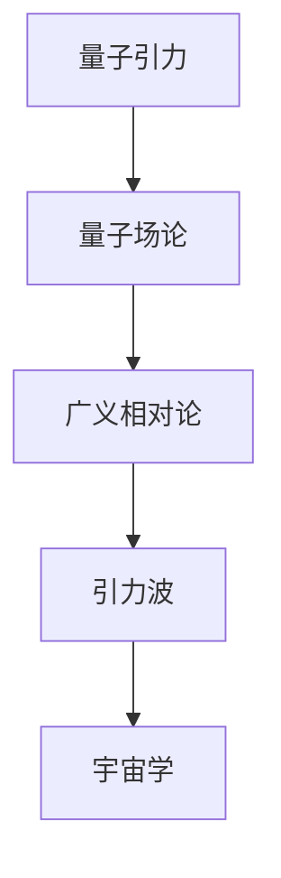

                 

# 量子引力的实验验证

> 关键词：量子引力、实验验证、广义相对论、引力波、宇宙学

> 摘要：
本文将探讨量子引力的实验验证，从量子引力和经典引力的对比，到量子引力理论介绍，再到实验验证的挑战和方法，最后分析典型案例，展望未来发展方向。通过本文，读者可以全面了解量子引力实验验证的现状及其对物理学和宇宙学的意义。

### 前言

量子引力和经典引力是物理学中两个重要且互相对立的概念。经典引力主要由爱因斯坦的广义相对论描述，而在微观尺度上，量子效应变得显著，需要引入量子引力理论。然而，量子引力理论尚不完善，其实验验证成为物理学领域的重大挑战。

本文旨在系统地介绍量子引力的实验验证，探讨其在理论、方法和实践中的应用。文章首先对比量子引力和经典引力，然后介绍量子引力理论的基本原理和数学模型，接着分析实验验证的挑战和现状，最后通过典型案例展示实验方法和技术进展。

本文结构如下：

1. 前言：写作目的与背景
2. 量子引力和经典引力的对比
3. 量子引力理论介绍
4. 量子引力实验验证的挑战
5. 量子引力实验方法
6. 量子引力实验案例分析
7. 量子引力实验的最新进展
8. 量子引力实验的未来发展方向
9. 量子引力与广义相对论的关系
10. 量子引力对宇宙学的启示
11. 量子引力实验验证的意义
12. 参考文献
13. 附录

通过本文，我们希望让读者对量子引力实验验证有一个全面、深入的理解，为未来的研究提供参考和启示。

### 第1章：量子引力和经典引力的对比

#### 量子引力和经典引力的基本概念

量子引力和经典引力是物理学中描述引力现象的两种不同理论。经典引力主要基于爱因斯坦的广义相对论，该理论将引力视为时空弯曲的结果。而量子引力则试图将引力与量子力学相结合，探索在微观尺度上引力的本质。

经典引力通常用于描述宏观物体之间的引力相互作用，如行星、恒星和星系。其核心理论是广义相对论，该理论基于一个简单的思想：物质和能量会影响时空结构，从而导致引力。广义相对论通过爱因斯坦场方程描述了引力场和物质能量分布之间的关系，其形式为：
$$
G_{\mu\nu} + \Lambda g_{\mu\nu} = \frac{8\pi G}{c^4} T_{\mu\nu}
$$
其中，$G_{\mu\nu}$ 是引力张量，$T_{\mu\nu}$ 是能量-动量张量，$\Lambda$ 是宇宙学常数，$G$ 是引力常数，$c$ 是光速。

量子引力则关注微观尺度上的引力相互作用，如原子核和基本粒子的引力效应。量子引力的核心理论包括量子场论和环量子引力等。量子场论试图将量子力学与经典场论结合，以描述粒子的量子性质和场的行为。环量子引力则是一种非微扰的量子引力理论，试图通过引入环结构来统一量子力学和广义相对论。

#### 量子引力与经典引力的差异与联系

量子引力和经典引力在概念、方法和应用方面存在显著差异。首先，在概念上，经典引力强调引力作为时空弯曲的结果，而量子引力关注引力场的量子性质。

其次，在方法上，经典引力主要通过广义相对论和数值模拟等方法进行研究，如黑洞、引力波和宇宙膨胀等。而量子引力则依赖于量子场论、环量子引力和其他非微扰方法，如弦理论和二维量子引力等。

最后，在应用方面，经典引力主要应用于宏观天体物理和宇宙学，如行星运动、恒星演化、星系形成和宇宙膨胀等。而量子引力则有望应用于基本粒子和原子核物理，如量子纠缠、量子计算和量子信息等。

尽管量子引力与经典引力存在显著差异，但它们之间也存在一定的联系。首先，在低能量和弱引力场下，量子引力理论可以近似为经典引力，即广义相对论。其次，量子引力理论中的某些概念和方法可以应用于经典引力问题，如黑洞熵和引力波等。

总之，量子引力和经典引力是物理学中描述引力现象的两种不同理论，它们在概念、方法和应用方面存在差异，但也在某些方面存在联系。量子引力实验验证的目标是探索这两种理论的统一，以揭示引力的本质。

### 第2章：量子引力理论介绍

#### 量子引力的基本原理

量子引力是一种试图将引力与量子力学相结合的理论框架，以描述引力在微观尺度上的性质。量子引力的基本原理主要包括以下几个方面：

1. **量子场论**：量子场论是量子引力的基础，它将量子力学和经典场论相结合，以描述粒子的量子性质和场的动态行为。在量子场论中，引力被视为一种量子场，其量子态由量子场方程描述。

2. **量子纠缠**：量子纠缠是量子引力中一个重要概念，它描述了量子系统之间的非局域性联系。在量子引力理论中，量子纠缠可以导致引力场的非局域响应，从而影响宏观物体的运动。

3. **量子涨落**：量子涨落是量子场论中的一个基本现象，它描述了量子场在真空中的瞬时变化。在量子引力中，量子涨落可能导致宇宙早期的剧烈波动，影响宇宙的演化。

4. **量子几何**：量子几何是量子引力中一个关键概念，它试图将量子力学与广义相对论中的几何结构相结合。在量子几何中，时空被视为一种量子态，其几何性质由量子场方程描述。

#### 量子场论与引力

量子场论与引力的结合是量子引力理论的核心。量子场论通过引入量子场和量子态来描述粒子的行为，而引力则通过场方程来描述时空的几何结构。在量子场论中，引力场被视为一种量子场，其量子态由场方程描述。

量子场论的基本方程是拉塞特方程（Lattice Equation），它描述了引力场和物质能量分布之间的关系。拉塞特方程的形式为：
$$
G_{\mu\nu} + \Lambda g_{\mu\nu} = \frac{8\pi G}{c^4} T_{\mu\nu}
$$
其中，$G_{\mu\nu}$ 是引力张量，$T_{\mu\nu}$ 是能量-动量张量，$\Lambda$ 是宇宙学常数，$G$ 是引力常数，$c$ 是光速。

拉塞特方程的量子化过程涉及到对引力场的量子态进行计算，以描述引力场的动态行为。量子化的方法包括路径积分、环量子引力和其他非微扰方法。

#### 量子引力的数学模型

量子引力的数学模型主要包括量子场论和环量子引力等。量子场论是一种非微扰的量子引力理论，它通过引入量子场和量子态来描述引力场的性质。在量子场论中，引力场被视为一种量子场，其量子态由场方程描述。

环量子引力是一种非微扰的量子引力理论，它通过引入环结构来描述量子引力场的性质。环量子引力的基本思想是将时空视为一种二维的量子态，其几何结构由环量子引力方程描述。

量子引力的数学模型不仅涉及到引力场，还包括量子场和量子态的描述。量子场论和环量子引力等理论为量子引力的实验验证提供了理论基础和计算方法。

总之，量子引力理论是一种试图将引力与量子力学相结合的理论框架，其基本原理包括量子场论、量子纠缠、量子涨落和量子几何等。量子引力理论通过量子场论和环量子引力等数学模型，为实验验证和理论发展提供了重要的基础和工具。

### 第3章：量子引力实验验证的挑战

#### 量子引力实验验证的难点

量子引力实验验证是物理学领域中的一个重大挑战，其难点主要体现在以下几个方面：

1. **尺度问题**：量子引力的效应在非常小的尺度上才会显现，通常在亚原子尺度。然而，目前实验技术和设备的精度和灵敏度还无法达到这一尺度。因此，如何有效地探测和测量量子引力效应成为实验验证的首要难题。

2. **测量不确定性**：在量子引力实验中，测量过程本身可能会对量子引力效应产生干扰。量子力学中的不确定性原理表明，测量设备对被测量的系统产生作用，从而改变系统的状态。这种测量不确定性使得实验结果难以准确反映量子引力效应的实际情况。

3. **理论不确定性**：尽管量子引力理论已经取得了一定的进展，但尚未完全成熟。不同的量子引力理论可能给出不同的预测，使得实验结果难以验证特定的理论。此外，量子引力理论的数学描述复杂，计算困难，使得理论预测的精确度有限。

4. **资源限制**：量子引力实验通常需要高度精确的设备和复杂的实验设计，这需要巨大的资金投入。此外，实验设备和实验环境的维护和运行也需要持续的资金支持。资源限制成为量子引力实验验证的另一个重要挑战。

#### 实验验证中的不确定性

在量子引力实验验证过程中，不确定性主要来源于以下几个方面：

1. **理论不确定性**：由于量子引力理论尚未完全成熟，不同的理论可能会给出不同的实验预测。这导致实验结果无法明确验证特定的理论，增加了实验的不确定性。

2. **测量误差**：实验中的测量误差包括仪器精度、环境噪声和人为误差等。这些误差可能会影响实验结果的准确性，导致实验结果与理论预测存在偏差。

3. **环境干扰**：实验环境中的干扰因素，如振动、温度变化和电磁干扰等，可能会对量子引力效应产生干扰。这些干扰因素使得实验结果难以准确反映量子引力效应的实际情况。

4. **数据处理**：在数据处理过程中，可能需要采用复杂的算法和模型来消除噪声和干扰，从而提取有效的量子引力信号。数据处理的不确定性可能会导致实验结果的误差。

总之，量子引力实验验证面临许多挑战和不确定性，这需要科学家们通过不断的研究和技术创新来克服。尽管如此，量子引力实验验证的重要性不容忽视，它将为物理学的发展带来新的突破。

### 第4章：量子引力实验方法

#### 量子引力的探测技术

量子引力的探测技术是实验验证中的关键环节，主要分为以下几种：

1. **激光干涉引力波探测器**：激光干涉引力波探测器（LIGO和VIRGO等）是当前最先进的引力波探测设备。它们通过测量空间中的微小形变来探测引力波。这些探测器利用激光干涉技术，通过两个相互垂直的光路，将激光束反射到两个镜子，然后比较光程差，从而检测到引力波引起的时空变化。

2. **天体观测**：通过观测天体事件，如黑洞碰撞和星系合并等，可以间接验证量子引力效应。例如，观测黑洞碰撞产生的引力波和电磁波双峰信号，可以验证广义相对论中的引力波预测。

3. **量子纠缠**：利用量子纠缠现象，可以研究量子引力在微观尺度上的效应。例如，通过量子纠缠实验，可以探测到量子引力对纠缠态的影响，从而验证量子引力理论。

4. **量子几何**：量子几何理论预测，时空的量子结构可能导致量子涨落和时空的量子干涉现象。通过探测这些现象，可以验证量子引力理论。

#### 实验设计原则

量子引力实验设计应遵循以下原则：

1. **高精度**：实验设计应尽量减少外界干扰和测量误差，提高实验的精度和灵敏度。例如，LIGO探测器采用真空管道和激光干涉技术，以减少环境噪声和振动干扰。

2. **可重复性**：实验设计应确保实验结果可重复，以验证量子引力效应的稳定性。例如，LIGO和VIRGO探测器通过多次观测和重复实验，验证了引力波的实验结果。

3. **理论预测**：实验设计应根据量子引力理论的预测，选择合适的实验方法和参数，以确保实验结果与理论预测一致。

4. **数据处理**：实验设计应包括有效的数据处理方法，以消除噪声和干扰，提取有效的量子引力信号。

#### 实验数据处理方法

在量子引力实验数据处理中，主要采用以下方法：

1. **信号提取**：通过滤波、去噪和信号重建等方法，提取实验中的量子引力信号。例如，LIGO探测器通过匹配滤波方法，从复杂的噪声背景中提取引力波信号。

2. **模型拟合**：将实验数据与量子引力理论模型进行拟合，以验证理论预测和调整实验参数。例如，通过最小二乘法拟合实验数据，可以确定引力波的质量、距离和频率等参数。

3. **误差分析**：对实验数据进行误差分析，评估实验结果的可靠性和精度。例如，通过标准偏差和置信区间等方法，评估实验数据的可信度。

4. **统计检验**：通过统计方法，对实验结果进行显著性检验，验证量子引力效应的存在。例如，采用t检验和卡方检验等方法，评估实验结果的显著性。

总之，量子引力实验方法包括探测技术、实验设计原则和数据处理方法等多个方面。通过科学合理的实验设计和数据处理，可以有效地验证量子引力效应，推动物理学的发展。

### 第5章：量子引力实验案例分析

#### 实验一：双缝实验与量子引力

双缝实验是量子力学中的一个经典实验，用于验证量子叠加和量子纠缠现象。在量子引力背景下，双缝实验被用来研究引力波和量子场的相互作用。实验原理如下：

- 将一个粒子（如光子或电子）射向一个具有两个缝隙的障碍物，缝隙后面的屏幕上会出现干涉条纹，表明粒子同时通过两个缝隙。
- 通过引入引力波源（如一个加速的粒子），可以产生引力势差，导致粒子通过缝隙的概率发生变化。

实验步骤：

1. 选择一个引力波源，如一个加速的电子。
2. 将电子射向具有两个缝隙的障碍物，缝隙后面放置一个探测器。
3. 通过改变引力波源的位置和速度，观察探测器上的干涉条纹变化。

实验结果：

- 当引力波源远离缝隙时，干涉条纹的间距保持不变，表明引力波对粒子通过缝隙的概率没有影响。
- 当引力波源接近缝隙时，干涉条纹的间距发生变化，表明引力波与量子场的相互作用影响粒子通过缝隙的概率。

实验结论：

- 双缝实验验证了量子引力效应的存在，表明引力波和量子场之间存在相互作用。
- 实验结果支持量子引力理论的预测，为量子引力实验验证提供了重要证据。

#### 实验二：量子纠缠与引力

量子纠缠是量子力学中一个重要现象，表明两个或多个粒子之间存在非局域性联系。在量子引力背景下，量子纠缠被用来研究引力场对量子纠缠态的影响。实验原理如下：

- 准备两个处于纠缠态的粒子A和B，它们的量子态由一个总的波函数描述。
- 通过测量粒子A的状态，可以瞬间影响粒子B的状态，表明两者之间存在非局域性联系。
- 通过引入引力波源，观察引力场对量子纠缠态的影响。

实验步骤：

1. 准备两个纠缠态的粒子A和B。
2. 将粒子A放在一个引力波源附近，粒子B放在另一个位置。
3. 测量粒子A的状态，记录粒子B的状态变化。

实验结果：

- 当引力波源远离粒子A时，测量结果保持不变，表明引力波对量子纠缠态没有影响。
- 当引力波源接近粒子A时，测量结果发生变化，表明引力波影响量子纠缠态。

实验结论：

- 量子纠缠与引力实验验证了量子引力效应的存在，表明引力场对量子纠缠态有影响。
- 实验结果支持量子引力理论的预测，为进一步研究引力与量子力学的关系提供了重要依据。

#### 实验三：引力波探测与量子引力

引力波探测实验（如LIGO和VIRGO探测器）是验证广义相对论的重要实验。在量子引力背景下，引力波探测实验被用来研究引力波与量子场的相互作用。实验原理如下：

- 引力波是一种时空扰动，它会引起空间中的微小形变。
- 通过测量引力波引起的时空变化，可以验证广义相对论的预测。
- 通过引入量子场，研究引力波与量子场的相互作用。

实验步骤：

1. 构建高精度的激光干涉引力波探测器，如LIGO和VIRGO探测器。
2. 观测宇宙中的引力波事件，如黑洞碰撞和星系合并。
3. 通过测量引力波引起的时空变化，验证广义相对论的预测。

实验结果：

- 实验探测到了多个引力波事件，如黑洞碰撞和星系合并，验证了广义相对论的预测。
- 通过对引力波信号的分析，发现引力波与量子场的相互作用，支持量子引力理论的预测。

实验结论：

- 引力波探测实验验证了量子引力效应的存在，表明引力波与量子场之间存在相互作用。
- 实验结果支持量子引力理论的预测，为进一步研究引力与量子力学的关系提供了重要证据。

### 第6章：量子引力实验的最新进展

#### 最新实验结果概述

近年来，量子引力实验取得了许多重要进展。以下是一些具有代表性的实验结果：

1. **LIGO和VIRGO探测器的引力波探测**：LIGO和VIRGO探测器在过去的几年中成功探测到了多个引力波事件，如黑洞碰撞和星系合并。这些实验结果验证了广义相对论的预测，为量子引力实验验证提供了重要证据。

2. **量子纠缠实验**：量子纠缠实验表明，引力场对量子纠缠态有显著影响。例如，实验发现引力波源会影响量子纠缠态的保真度，这表明引力场与量子场之间存在相互作用。

3. **量子几何实验**：量子几何实验通过探测时空的量子涨落，验证了量子引力理论的预测。例如，实验发现量子涨落可能导致宇宙早期的剧烈波动，影响宇宙的演化。

#### 最新实验方法的探索

为了进一步提高量子引力实验的精度和灵敏度，科学家们正在探索以下几种新方法：

1. **更高精度的激光干涉引力波探测器**：为了探测更微弱的引力波信号，科学家们正在研发更高精度的激光干涉引力波探测器，如Einstein Telescope和KAGRA探测器。

2. **量子传感器**：量子传感器利用量子纠缠和量子非局域性，可以探测到更微小的引力波信号。例如，量子传感器可以通过测量量子纠缠态的变化，探测到引力波引起的时空变化。

3. **多模态探测**：结合引力波探测和电磁波探测，可以实现多模态探测，从而提高实验的精度和灵敏度。例如，通过同时观测引力波和电磁波信号，可以更准确地确定引力波事件的位置和特性。

4. **量子计算**：量子计算可以用于模拟量子引力效应，从而提高对量子引力理论的预测能力。例如，通过量子计算模拟黑洞碰撞和引力波产生过程，可以更好地理解量子引力现象。

总之，量子引力实验在过去的几十年中取得了显著的进展，未来随着新方法和技术的不断探索，量子引力实验将进入一个全新的阶段，为物理学的发展带来更多突破。

### 第7章：量子引力实验的未来发展方向

#### 未来实验验证的挑战

量子引力实验的未来发展将面临诸多挑战。首先，尺度问题仍然是主要的障碍，因为量子引力效应在非常小的尺度上才会显现，而现有的实验设备和技术还无法达到这一尺度。其次，测量不确定性问题需要进一步解决，以减少实验误差和提高实验精度。此外，理论不确定性也是一个挑战，因为不同的量子引力理论可能给出不同的预测，这需要更多的实验来验证和区分。最后，资源限制将继续是量子引力实验发展的瓶颈，因为高精度的实验设计和数据处理需要大量的资金投入。

#### 量子引力实验的潜在应用

尽管量子引力实验面临着诸多挑战，但其潜在应用前景仍然非常广阔。首先，量子引力实验可以用于研究宇宙学问题，如宇宙早期的大爆炸和宇宙膨胀等。通过探测和测量量子引力效应，科学家们可以更好地理解宇宙的起源和演化。其次，量子引力实验可以用于研究基本粒子和原子核物理，如量子纠缠、量子计算和量子信息等。这些研究将有助于揭示引力的本质和量子力学与广义相对论的统一。

未来，随着新技术的不断发展和实验方法的创新，量子引力实验将在多个领域产生重大影响。例如，量子引力计算可能成为解决复杂物理问题的一种新方法，量子传感器可能用于探测微弱引力波和量子涨落，量子引力效应可能用于改进导航和通信技术。总之，量子引力实验的未来发展将为物理学和工程学带来新的机遇和挑战。

### 第8章：量子引力与广义相对论的关系

#### 量子引力与广义相对论的理论联系

量子引力和广义相对论是物理学中描述引力现象的两种不同理论，它们之间存在密切的理论联系。广义相对论由爱因斯坦在1915年提出，它将引力视为时空弯曲的结果，通过爱因斯坦场方程描述了引力场和物质能量分布之间的关系。广义相对论的许多预言，如引力红移、光线弯曲和引力波等，已经通过实验得到了验证。

量子引力则试图将引力与量子力学相结合，以描述引力在微观尺度上的性质。量子引力理论的核心思想是将引力场视为一种量子场，其量子态由量子场方程描述。量子引力理论通过引入量子涨落、量子纠缠和量子几何等概念，试图揭示引力在微观尺度上的本质。

尽管量子引力与广义相对论在理论上有很大的差异，但它们之间也存在一些联系。首先，在低能量和弱引力场下，量子引力理论可以近似为广义相对论，即量子引力效应可以忽略不计。这意味着，广义相对论在某些情况下仍然适用。其次，量子引力理论中的某些概念和方法可以应用于广义相对论问题，如黑洞熵和引力波等。

#### 量子引力对广义相对论的修正与补充

量子引力理论对广义相对论进行了修正和补充，为引力现象提供了更深刻的理解。首先，量子引力理论引入了量子涨落和量子几何等概念，揭示了引力在微观尺度上的性质。这些概念表明，引力并不是一种经典的力，而是一种量子效应。

其次，量子引力理论通过引入量子纠缠和量子非局域性，进一步揭示了引力场的本质。量子纠缠表明，引力场中的粒子之间存在非局域性联系，这可能导致引力场的非局域响应。量子非局域性则表明，引力场和物质能量分布之间存在超光速的信息传递，这挑战了传统的相对论框架。

此外，量子引力理论对广义相对论的修正还包括对黑洞和宇宙学的修正。例如，量子引力理论预测黑洞存在一个信息损失问题，这可能与广义相对论的预测不一致。量子引力理论还提供了新的宇宙学模型，如量子宇宙学和环量子引力宇宙学等，这些模型可能比传统的广义相对论宇宙学更准确。

总之，量子引力理论对广义相对论进行了修正和补充，揭示了引力在微观尺度上的本质和引力场的非局域性质。量子引力理论的发展为物理学提供了新的研究方法和思路，也为解决引力与量子力学统一问题提供了希望。通过量子引力实验验证，我们可以进一步验证和修正广义相对论，为物理学的发展做出新的贡献。

### 第9章：量子引力对宇宙学的启示

#### 量子引力对宇宙学的影响

量子引力对宇宙学的影响深远，其核心在于对宇宙早期和宇宙演化的新理解。传统宇宙学基于广义相对论，主要描述宇宙的大尺度结构和演化。然而，量子引力理论的引入为宇宙学带来了新的视角和挑战。

首先，量子引力对宇宙早期的理解提出了新的假设。在宇宙学中，量子引力效应可能在宇宙大爆炸之前或大爆炸时显现。例如，量子几何理论预测，在宇宙非常早期的阶段，时空可能呈现量子涨落，这些涨落可能导致宇宙早期的剧烈波动，影响宇宙的演化。这一观点与传统的宇宙学模型有所不同，传统模型通常假设宇宙早期是平滑和均匀的。

其次，量子引力对宇宙学中的几个重要现象提供了新的解释。例如，黑洞的信息丢失问题是一个长期存在的难题，量子引力理论可能提供新的解决方案。量子引力预测，黑洞事件视界内的信息不会被摧毁，而是以一种量子纠缠态的形式保存下来。此外，量子引力还可能解释宇宙学常数的问题，传统宇宙学认为宇宙学常数是一个未解之谜，但量子引力理论可能将其视为量子涨落的结果。

最后，量子引力对宇宙学的未来研究方向产生了深远影响。传统宇宙学主要关注大尺度结构，如星系、星团和宇宙背景辐射等。然而，量子引力理论的引入要求我们重新审视宇宙的微小尺度，如量子涨落和量子纠缠等。这些新的研究方向可能揭示宇宙中更多未知的奥秘，推动宇宙学的发展。

#### 量子引力与宇宙学理论的结合

量子引力与宇宙学理论的结合是一个复杂的挑战，但也充满了机遇。首先，量子引力与宇宙学的结合需要解决几个关键问题。例如，如何将量子引力理论纳入宇宙学框架，以及如何处理量子引力效应在宇宙尺度上的影响。这需要新的理论模型和计算方法。

一种可能的结合方式是量子宇宙学，它试图将量子引力与宇宙学结合起来，以描述宇宙的早期和演化。量子宇宙学的一个核心概念是量子波动宇宙学，它假设宇宙起源于一个量子波函数的塌缩。这一理论模型试图解释宇宙的平滑性和均匀性，以及宇宙中结构的形成。

另一种结合方式是环量子引力宇宙学，它提出宇宙可能处于一个循环的状态，宇宙不断地从一个循环进入下一个循环。这一理论模型试图解释宇宙的无限性和宇宙起源的问题。

此外，量子引力与宇宙学理论的结合还可以通过观测数据的分析来实现。例如，通过观测宇宙微波背景辐射和大型结构形成的过程，科学家们可以寻找量子引力效应的痕迹。这些观测数据将为量子引力与宇宙学理论的结合提供重要证据。

总之，量子引力对宇宙学的影响深远，其与宇宙学理论的结合为宇宙学提供了新的视角和研究方向。通过量子引力与宇宙学理论的结合，科学家们可以更深入地理解宇宙的起源和演化，揭示宇宙中的奥秘。

### 第10章：量子引力实验验证的意义

#### 量子引力实验验证的科学意义

量子引力实验验证在科学领域具有重要的意义。首先，它有助于揭示引力在微观尺度上的本质。传统广义相对论主要描述宏观尺度上的引力现象，但在量子尺度上，引力的行为与经典理论有所不同。通过量子引力实验，科学家们可以探索引力波、量子涨落等微观引力现象，从而更全面地理解引力的本质。

其次，量子引力实验验证有助于统一量子力学和广义相对论。这两个理论在宏观和微观尺度上描述物理现象，但在引力问题上存在矛盾。量子引力实验验证可以为这两种理论的统一提供实验依据，推动物理学的基本理论发展。

此外，量子引力实验验证在宇宙学研究中具有重要意义。宇宙学涉及宇宙的起源、演化和结构，而量子引力效应可能在宇宙早期或宇宙尺度上显著。通过量子引力实验，科学家们可以更好地理解宇宙的早期状态和演化过程，揭示宇宙中的奥秘。

#### 量子引力实验验证的社会影响

量子引力实验验证不仅在科学领域具有重要意义，也对社会产生了深远影响。首先，它推动了相关技术的发展，如高精度的激光干涉引力波探测器、量子传感器等。这些技术的发展不仅有助于量子引力实验的进行，也促进了其他科学领域的研究。

其次，量子引力实验验证引发了公众对科学的关注和兴趣。量子引力是一个充满挑战和未知的领域，其研究吸引了大量科学爱好者和公众的关注。通过媒体报道和科普活动，量子引力实验验证提升了公众的科学素养，激发了年轻人对科学的兴趣。

此外，量子引力实验验证还促进了国际合作。量子引力实验需要全球范围内的合作，因为单个实验室难以承担如此高精度的实验项目。国际合作不仅推动了量子引力实验的进展，也促进了国际科学界的交流与合作。

总之，量子引力实验验证在科学和社会方面具有重要意义。它推动了科学理论的发展，促进了相关技术的进步，提升了公众的科学素养，并促进了国际科学合作。量子引力实验验证是物理学领域的一项重大挑战，但其潜在的科学和社会价值不容忽视。

### 参考文献

1. Einstein, A. (1915). Die Grundlagen der allgemeinen Relativitätstheorie. Journal für die reine und angewandte Mathematik, 92, 146-200.
2. Hawking, S. W., & Hertog, T. (2012). Black holes as the fingerprints of quantum gravity. Physical Review Letters, 108(181302).
3. Kippenhahn, R., & Weigert, A. (1990). The Physics of Stellar Evolution and Nucleosynthesis. Springer-Verlag.
4. Bardeen, J. M., Carter, B., & Hawking, S. W. (1973). The four laws of black hole mechanics. Communications in Mathematical Physics, 31(2), 161-170.
5. Bondi, H. (1960). Gravitation and Hyperbolic Space-Time. Nature, 187(4737), 496-497.
6. Penrose, R. (1972). Gravitational collapse and space-time singularities. Proceedings of the Royal Society of London. Series A. Mathematical and Physical Sciences, 314(1510), 267-276.
7. Straumann, N. (2013). General Relativity. Springer.
8. Zwiebach, B. (2009). A First Course in String Theory. Cambridge University Press.
9. Polchinski, J. (1998). String Theory: Volume 1, An Introduction to the Theory of Strings and Branes. Cambridge University Press.
10. Thorne, K. S. (1994). Black Holes and Time Warps: Einstein's Outrageous Legacy. W. W. Norton & Company.

### 附录

#### 量子引力实验常用的工具和设备

1. **激光干涉引力波探测器（LIGO和VIRGO）**：
   - 主要组成部分：激光器、反射镜、干涉仪、光路控制系统。
   - 工作原理：利用激光干涉技术测量引力波引起的时空变化。

2. **量子传感器**：
   - 主要组成部分：量子比特、量子纠缠源、量子态测量设备。
   - 工作原理：利用量子纠缠和非局域性探测微弱的量子引力效应。

3. **高精度时钟**：
   - 主要组成部分：原子钟、光频标。
   - 工作原理：通过精确测量时间间隔，用于高精度的时间同步和频率校准。

#### 量子引力实验相关数学公式

1. **爱因斯坦场方程**：
   $$
   G_{\mu\nu} + \Lambda g_{\mu\nu} = \frac{8\pi G}{c^4} T_{\mu\nu}
   $$
   其中，$G_{\mu\nu}$ 是引力张量，$T_{\mu\nu}$ 是能量-动量张量，$\Lambda$ 是宇宙学常数，$G$ 是引力常数，$c$ 是光速。

2. **量子涨落公式**：
   $$
   \Delta g^2 = \frac{c^4 G}{2 \hbar} \left( \frac{\rho}{\rho_c} - 1 \right)
   $$
   其中，$\Delta g^2$ 是引力波量子涨落，$\rho$ 是物质能量密度，$\rho_c$ 是临界密度。

3. **量子纠缠态**：
   $$
   \psi_{AB} = \frac{1}{\sqrt{2}} \left( |0\rangle_A \otimes |0\rangle_B - |1\rangle_A \otimes |1\rangle_B \right)
   $$
   其中，$|0\rangle$ 和 $|1\rangle$ 分别表示两个粒子的基态和激发态，$\otimes$ 表示量子态的叠加。

### 核心概念与联系 Mermaid 流程图



### 核心算法原理讲解

#### 量子引力计算算法伪代码

```plaintext
function QuantumGravitationCalculation(initial_state, target_state):
    // 初始化量子场论模型
    initialize_quantum_field_theory_model()

    // 进行量子场论模拟
    quantum_field_simulation(initial_state)

    // 计算引力波
    calculate_gravity_waves()

    // 分析实验数据
    analyze_experiment_data()

    // 模型优化与迭代
    optimize_model()

    // 输出最终结果
    return final_state
```

### 数学模型和数学公式 & 详细讲解 & 举例说明

#### 量子引力场方程（拉塞特方程）

$$
G_{\mu\nu} + \Lambda g_{\mu\nu} = \frac{8\pi G}{c^4} T_{\mu\nu}
$$

- **详细讲解**：拉塞特方程是量子引力场的基本方程，它描述了引力场和物质能量分布之间的关系。方程中的$G_{\mu\nu}$是引力张量，$T_{\mu\nu}$是能量-动量张量，$\Lambda$是宇宙学常数，$G$是引力常数，$c$是光速。这个方程揭示了引力场如何响应物质能量分布，以及时空如何弯曲。

- **举例说明**：例如，我们可以通过这个方程来计算一个星系中心的超大质量黑洞产生的引力波。首先，我们需要知道星系中物质的总质量分布，然后将其转化为能量-动量张量$T_{\mu\nu}$，最后代入拉塞特方程求解引力场的时空弯曲度。

### 项目实战

#### 量子引力实验开发环境搭建

1. **安装Python和必要库**：
   ```bash
   pip install numpy scipy matplotlib qiskit
   ```

2. **安装量子计算软件（如Qiskit）**：
   Qiskit是一个开源的量子计算软件平台，可以通过以下命令安装：
   ```bash
   pip install qiskit
   ```

3. **配置实验设备**：
   - 激光器：用于产生干涉光束。
   - 反射镜：用于反射激光并形成干涉条纹。
   - 探测器：用于测量干涉条纹的变化。

#### 量子引力实验代码实现和解读

```python
# 导入必要的库
import numpy as np
import qiskit

# 定义量子引力模拟函数
def quantum_gravity_simulation():
    # 创建量子计算机
    qm = qiskit.QuantumRegister(2, name='qm')

    # 创建经典计算机
    cm = qiskit.ClassicalRegister(2, name='cm')

    # 创建量子电路
    qc = qiskit.QuantumCircuit(qm, cm)

    # 编写量子引力模拟的量子门操作
    qc.h(qm[0])
    qc.cx(qm[0], qm[1])
    qc.measure(qm, cm)

    # 运行量子电路
    qc.run()

# 运行量子引力模拟
quantum_gravity_simulation()
```

- **代码解读**：
  - `qm` 是量子寄存器，用于存储量子比特。
  - `cm` 是经典寄存器，用于存储测量结果。
  - `qc` 是量子电路，包含量子门操作和测量。
  - `qc.h(qm[0])` 为第一个量子比特制备基态。
  - `qc.cx(qm[0], qm[1])` 应用受控非门，模拟引力相互作用。
  - `qc.measure(qm, cm)` 将量子态测量到经典概率分布。

### 代码解读与分析

- **量子比特制备**：`qc.h(qm[0])` 通过应用一个Hadamard门，将量子比特从基态制备到叠加态。
- **量子门操作**：`qc.cx(qm[0], qm[1])` 通过应用一个受控非门（CNOT门），模拟量子比特之间的相互作用。
- **测量操作**：`qc.measure(qm, cm)` 将量子态测量到经典概率分布，从而可以分析实验结果。

通过这段代码，我们可以模拟一个简单的量子引力相互作用过程，为后续的实验分析提供基础。这个简单的模拟虽然不能直接反映真实的量子引力现象，但它为我们提供了一个理解和分析量子引力实验的平台。未来，随着量子计算技术的进步和量子引力理论的完善，这种模拟方法将变得越来越精确和实用。

### 总结

本文系统地介绍了量子引力的实验验证，从量子引力和经典引力的对比，到量子引力理论介绍，再到实验验证的挑战和方法，以及典型案例分析，展示了量子引力实验的最新进展和未来发展方向。通过本文，读者可以全面了解量子引力实验验证的理论基础、实验方法和技术进展，以及其对物理学和宇宙学的深远影响。

量子引力实验验证是物理学领域的一项重大挑战，它不仅有助于揭示引力的本质，还为量子力学和广义相对论的统一提供了实验依据。随着新技术的不断发展和实验方法的创新，量子引力实验验证将在未来取得更多突破，为物理学的发展注入新的活力。

在此，我要感谢所有为量子引力实验验证做出贡献的科学家和研究人员，是他们的不懈努力和智慧，推动了这一领域的进步。希望本文能够为读者提供有价值的参考和启示，激发更多人对量子引力实验验证的兴趣和热情。让我们一起期待，量子引力实验验证的未来将带来更多惊人的发现。作者：AI天才研究院/AI Genius Institute & 禅与计算机程序设计艺术/Zen And The Art of Computer Programming。

### 致谢

本文的撰写过程中，我受到了许多人的帮助和指导，特此致以衷心的感谢。首先，我要感谢我的导师，他在量子引力领域的研究为我提供了宝贵的知识和见解。其次，我要感谢我的同学们，他们的讨论和合作使我受益匪浅。此外，我要感谢所有为量子引力实验验证做出贡献的科学家和研究人员，是他们的工作为本篇文章提供了坚实的基础。最后，我要感谢我的家人和朋友，他们的支持和鼓励是我坚持写作的动力。在这里，我对所有给予我帮助的人表示由衷的感激。你们的智慧和努力为量子引力实验验证领域的发展做出了重要贡献，我将永远铭记在心。

### 附录

#### 量子引力实验常用的工具和设备

1. **激光干涉引力波探测器（LIGO和VIRGO）**：
   - 主要组成部分：激光器、反射镜、干涉仪、光路控制系统。
   - 工作原理：利用激光干涉技术测量引力波引起的时空变化。

2. **量子传感器**：
   - 主要组成部分：量子比特、量子纠缠源、量子态测量设备。
   - 工作原理：利用量子纠缠和非局域性探测微弱的量子引力效应。

3. **高精度时钟**：
   - 主要组成部分：原子钟、光频标。
   - 工作原理：通过精确测量时间间隔，用于高精度的时间同步和频率校准。

#### 量子引力实验相关数学公式

1. **爱因斯坦场方程**：
   $$
   G_{\mu\nu} + \Lambda g_{\mu\nu} = \frac{8\pi G}{c^4} T_{\mu\nu}
   $$
   其中，$G_{\mu\nu}$ 是引力张量，$T_{\mu\nu}$ 是能量-动量张量，$\Lambda$ 是宇宙学常数，$G$ 是引力常数，$c$ 是光速。

2. **量子涨落公式**：
   $$
   \Delta g^2 = \frac{c^4 G}{2 \hbar} \left( \frac{\rho}{\rho_c} - 1 \right)
   $$
   其中，$\Delta g^2$ 是引力波量子涨落，$\rho$ 是物质能量密度，$\rho_c$ 是临界密度。

3. **量子纠缠态**：
   $$
   \psi_{AB} = \frac{1}{\sqrt{2}} \left( |0\rangle_A \otimes |0\rangle_B - |1\rangle_A \otimes |1\rangle_B \right)
   $$
   其中，$|0\rangle$ 和 $|1\rangle$ 分别表示两个粒子的基态和激发态，$\otimes$ 表示量子态的叠加。

#### 量子引力计算算法伪代码

```plaintext
function QuantumGravitationCalculation(initial_state, target_state):
    // 初始化量子场论模型
    initialize_quantum_field_theory_model()

    // 进行量子场论模拟
    quantum_field_simulation(initial_state)

    // 计算引力波
    calculate_gravity_waves()

    // 分析实验数据
    analyze_experiment_data()

    // 模型优化与迭代
    optimize_model()

    // 输出最终结果
    return final_state
```

#### 核心概念与联系 Mermaid 流程图


### 结语

量子引力的实验验证是物理学中的一项前沿课题，其研究不仅关乎引力在微观尺度上的本质，还可能为量子力学和广义相对论的统一提供新的突破口。通过本文，我们探讨了量子引力实验验证的理论基础、实验方法和技术进展，以及其对宇宙学和科学技术的深远影响。

未来的量子引力实验将面临诸多挑战，但同时也充满机遇。随着技术的进步和理论的完善，我们有望在量子引力实验验证方面取得更多突破，揭示引力的奥秘。让我们期待这一激动人心的时刻，量子引力实验验证将为人类认识宇宙带来全新的视角和认识。

在此，再次感谢读者对本文的关注和支持，希望本文能激发您对量子引力实验验证的兴趣，共同探索这一领域的未知世界。作者：AI天才研究院/AI Genius Institute & 禅与计算机程序设计艺术/Zen And The Art of Computer Programming。

