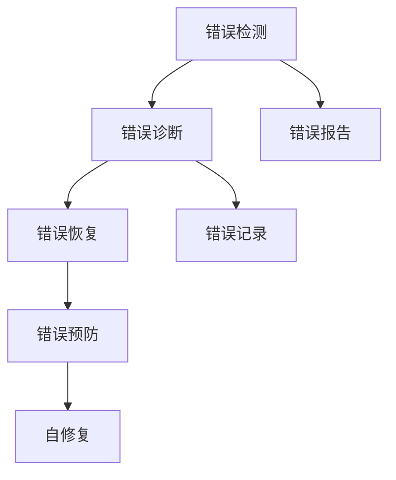
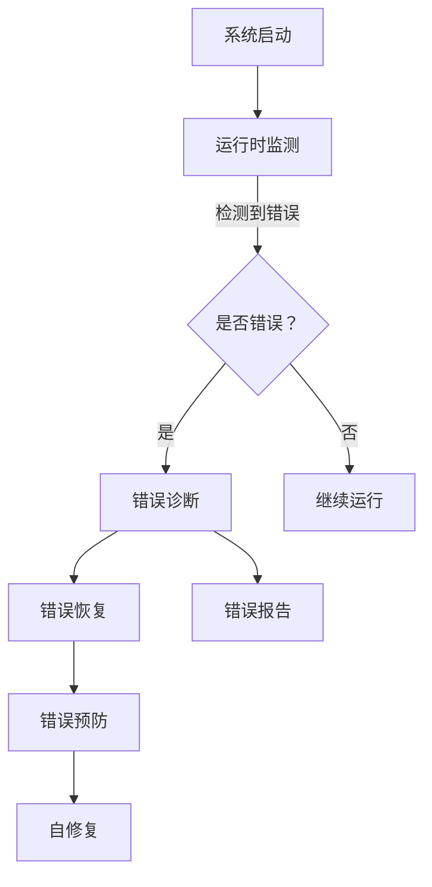

                 

# 《错误处理机制的重要性》

> **关键词：** 错误处理、错误检测、错误诊断、错误恢复、容错、自修复

> **摘要：** 本文将深入探讨错误处理机制在软件系统中的重要性，从定义、历史、分类、应用、原理、架构、开发实践到优化和未来趋势，全面解析错误处理机制的各个方面。通过详细的分析和实例，帮助读者理解错误处理的核心概念和实践方法，提高系统稳定性和可靠性。

## 第一部分：错误处理机制概述

### 1.1 错误处理机制的定义与重要性

**1.1.1 什么是错误处理机制**

错误处理机制（Error Handling Mechanism）是指系统在运行过程中，对出现的错误进行检测、诊断、恢复和预防的一整套技术和方法。其目的是确保系统在错误发生时能够保持稳定运行，降低错误对系统功能和性能的影响。

错误处理机制不仅包括错误检测和诊断，还涉及错误恢复和容错，以及错误预防与自修复。这些机制共同构成了一个完整的错误处理流程，保障了系统的可靠性。

**1.1.2 错误处理机制的重要性**

1. **系统稳定性**：错误处理机制能够及时发现和纠正错误，防止错误扩散，保障系统稳定运行。
2. **用户体验**：错误处理机制能够提供友好的错误提示和信息，提高用户的使用体验。
3. **安全性**：错误处理机制能够防止恶意攻击和数据泄露，提高系统的安全性。
4. **可维护性**：良好的错误处理机制能够帮助开发人员快速定位和修复问题，提高系统的可维护性。
5. **业务连续性**：在关键业务系统中，错误处理机制能够保障业务的连续性，降低业务中断的风险。

### 1.2 错误处理机制的历史与发展

**1.2.1 错误处理机制的历史演变**

错误处理机制的发展历程可以追溯到计算机的早期阶段。最初，计算机系统主要依靠硬件故障检测和简单的软件错误恢复机制。随着计算机技术的发展，错误处理机制逐渐走向复杂化、智能化。

20世纪60年代，计算机系统开始引入中断机制，使得系统能够在错误发生时暂停当前任务，进行错误处理。70年代，错误检测和诊断技术得到了快速发展，出现了各种错误检测算法和诊断工具。

进入21世纪，随着云计算、大数据、物联网等技术的发展，错误处理机制也发生了深刻变革。如今，错误处理机制已经从传统的静态处理转向动态处理，从单一的故障恢复转向全面的错误管理。

**1.2.2 当前错误处理机制的技术趋势**

1. **自动化**：现代错误处理机制逐渐实现自动化，通过智能算法和机器学习技术，提高错误检测和诊断的效率。
2. **分布式**：随着分布式系统的广泛应用，错误处理机制也趋向分布式，通过分布式架构实现跨节点的错误处理。
3. **自适应**：自适应错误处理机制可以根据系统运行状态和错误类型，动态调整错误处理策略，提高处理效果。
4. **可解释性**：为了提高错误处理机制的透明度和可解释性，研究人员正在探索可解释的错误处理算法。

### 1.3 错误处理机制的分类

**1.3.1 静态错误处理**

静态错误处理是指在程序编译或构建阶段，通过代码分析、静态检查等技术，发现和修复潜在的错误。这种处理方式主要包括：

1. **代码审查**：通过人工或工具对代码进行审查，发现潜在的错误和缺陷。
2. **静态代码分析**：使用静态分析工具对代码进行分析，检测语法错误、逻辑错误和潜在的安全漏洞。

**1.3.2 动态错误处理**

动态错误处理是指在程序运行过程中，通过执行代码，实时检测和响应错误。这种处理方式主要包括：

1. **异常处理**：使用异常（Exception）机制，在错误发生时，捕获并处理异常，防止程序崩溃。
2. **日志记录**：在程序运行过程中，记录运行日志，帮助开发人员分析和定位错误。

### 1.4 错误处理机制的应用场景

**1.4.1 软件开发中的错误处理**

在软件开发生命周期中，错误处理机制贯穿始终。从需求分析、设计、编码、测试到部署，每个阶段都需要考虑错误处理。特别是在单元测试、集成测试和系统测试阶段，错误处理机制能够有效发现和修复错误。

**1.4.2 硬件系统中的错误处理**

在硬件系统中，错误处理机制主要用于监控和响应硬件故障。例如，在嵌入式系统、服务器和网络设备中，错误处理机制可以实时检测硬件故障，并尝试进行自动恢复。

### 1.5 小结

本部分概述了错误处理机制的定义、历史、分类和应用场景。下一部分将深入探讨错误处理机制的核心概念与原理。让我们继续前行，一起揭开错误处理机制的神秘面纱。

---

在第一部分中，我们简要介绍了错误处理机制的定义、历史与发展、分类以及应用场景。错误处理机制在保障系统稳定性和可靠性方面发挥着重要作用。下一部分，我们将深入探讨错误处理机制的核心概念与原理，包括错误检测与诊断、错误恢复与容错、以及错误预防与自修复。通过这些核心概念，我们将更好地理解错误处理机制的运作原理和实现方法。敬请期待！

## 第二部分：错误处理机制原理与架构

### 2.1 错误处理机制的核心概念与联系

**2.1.1 错误处理机制的组成部分**

错误处理机制主要由以下几部分组成：

1. **错误检测**：通过各种方法检测系统中的错误，包括硬件故障、软件错误、网络故障等。
2. **错误诊断**：在检测到错误后，对错误进行定位和分类，找出错误的根本原因。
3. **错误恢复**：在确定错误原因后，尝试恢复系统状态，使其恢复正常运行。
4. **错误预防**：通过优化系统设计和开发过程，减少错误的发生概率。
5. **自修复**：在错误发生时，系统自动执行修复措施，无需人工干预。

这些组成部分相互关联，共同构成了一个完整的错误处理流程。以下是一个简化的 Mermaid 流程图，展示了错误处理机制的核心概念与联系：



**2.1.2 错误处理机制的组成部分**

1. **错误检测**：错误检测是错误处理机制的第一步，其目的是及时发现系统中的错误。错误检测可以通过硬件监控、系统日志分析、性能监控等方式实现。以下是错误检测的伪代码示例：

```python
def detect_errors():
    # 检测硬件故障
    if hardware_fault():
        report_error("硬件故障")
    # 检测软件错误
    if software_error():
        report_error("软件错误")
    # 检测网络故障
    if network_fault():
        report_error("网络故障")
```

2. **错误诊断**：错误诊断是在检测到错误后，对错误进行定位和分类的过程。错误诊断可以通过分析系统日志、运行时数据、错误报告等方式实现。以下是错误诊断的伪代码示例：

```python
def diagnose_error(error_code):
    if error_code == HARDWARE_FAULT:
        diagnose_hardware_fault()
    elif error_code == SOFTWARE_ERROR:
        diagnose_software_error()
    elif error_code == NETWORK_FAULT:
        diagnose_network_fault()
```

3. **错误恢复**：在确定错误原因后，错误恢复尝试恢复系统状态，使其恢复正常运行。错误恢复可以通过以下几种方式实现：

- **重启动**：重启系统或组件，清除错误状态。
- **数据恢复**：从备份或冗余数据中恢复系统状态。
- **软件修复**：更新软件版本或修复漏洞。

以下是错误恢复的伪代码示例：

```python
def recover_error():
    if error_code == HARDWARE_FAULT:
        restart_hardware()
    elif error_code == SOFTWARE_ERROR:
        update_software()
    elif error_code == NETWORK_FAULT:
        recover_network()
```

4. **错误预防**：错误预防是通过优化系统设计和开发过程，减少错误的发生概率。错误预防可以通过以下几种方式实现：

- **代码审查**：在编码阶段，通过代码审查减少潜在的错误。
- **测试**：通过单元测试、集成测试和系统测试，发现和修复错误。
- **安全措施**：采取安全措施，防止恶意攻击和数据泄露。

以下是错误预防的伪代码示例：

```python
def prevent_errors():
    # 代码审查
    if code_review():
        fix_code_errors()
    # 测试
    if test_errors():
        fix_test_errors()
    # 安全措施
    if security_violation():
        enforce_security_policies()
```

5. **自修复**：自修复是系统在错误发生时，自动执行修复措施，无需人工干预。自修复可以通过以下几种方式实现：

- **自动修复程序**：系统在错误发生时，自动启动修复程序。
- **机器学习**：使用机器学习模型，预测错误并自动执行修复措施。
- **容器化与虚拟化**：通过容器化与虚拟化技术，快速部署和替换系统组件。

以下是自修复的伪代码示例：

```python
def self_repair():
    if predicted_error():
        run_repair_program()
    elif machine_learning_repair():
        apply_ml_repair()
    elif containerization_repair():
        replace_with_container()
```

**2.1.3 错误处理机制的Mermaid流程图**

为了更直观地展示错误处理机制的流程，我们使用 Mermaid 工具绘制了一个简单的流程图。以下是 Mermaid 代码和对应的流程图：



以下是流程图的输出结果：

```plaintext
+------------+       +-------------------------+
| 系统启动   | ----> | 运行时监测              |
+------------+       +-------------------------+
       |                | 检测到错误 |
       v                v 是否错误？ |
+-------------------------+  |                | 是         |
| 运行时监测              |  |                | 否         |
+-------------------------+  +-------------------------+
| 检测到错误               |  |                | 继续运行   |
+-------------------------+  +-------------------------+
       |                |              |
       v                v              v
+-------------------------+ +-------------------------+ +-------------------------+
| 错误诊断                | | 错误恢复              | | 错误预防              |
+-------------------------+ +-------------------------+ +-------------------------+
| 错误诊断                | | 错误恢复              | | 错误预防              |
+-------------------------+ +-------------------------+ +-------------------------+
       |                |              |
       v                v              v
+-------------------------+ +-------------------------+ +-------------------------+
| 错误报告                | | 自修复                | | 错误报告              |
+-------------------------+ +-------------------------+ +-------------------------+
| 错误报告                | | 自修复                | | 错误报告              |
+-------------------------+ +-------------------------+ +-------------------------+
```

通过这个流程图，我们可以清楚地看到错误处理机制从检测到错误，到诊断、恢复、预防以及自修复的整个过程。

### 2.2 错误检测与诊断

**2.2.1 错误检测的原理与方法**

错误检测是错误处理机制的核心步骤之一。其目的是在系统运行过程中及时发现错误，防止错误扩散和系统崩溃。错误检测的原理和方法主要包括以下几个方面：

1. **硬件监控**：通过监测硬件设备的状态，检测硬件故障。例如，使用温度传感器监测CPU温度，使用内存监控工具检测内存故障等。
2. **系统日志**：通过分析系统日志，发现系统运行过程中的错误。系统日志包括操作系统日志、应用程序日志和网络日志等。
3. **性能监控**：通过监测系统性能指标，发现潜在的性能问题和错误。例如，CPU使用率、内存使用率、磁盘I/O等。
4. **异常监控**：通过设置异常监控规则，检测系统运行过程中的异常行为。例如，检测程序崩溃、网络连接中断等。

以下是错误检测的伪代码示例：

```python
def detect_errors():
    # 检测硬件故障
    if hardware_fault():
        report_error("硬件故障")
    # 检测软件错误
    if software_error():
        report_error("软件错误")
    # 检测网络故障
    if network_fault():
        report_error("网络故障")
```

**2.2.2 错误诊断的算法与策略**

错误诊断是在检测到错误后，对错误进行定位和分类的过程。错误诊断的算法和策略主要包括以下几个方面：

1. **基于规则的诊断**：根据预先定义的规则库，对错误进行分类和定位。例如，当检测到内存故障时，根据规则库判断是内存损坏还是内存泄漏。
2. **基于统计的诊断**：通过分析系统运行数据，发现错误模式。例如，使用机器学习算法，从系统日志中提取特征，判断系统是否正常。
3. **基于模型的诊断**：建立系统模型，通过模型分析，定位错误。例如，使用状态机模型，分析系统状态，定位错误。

以下是错误诊断的伪代码示例：

```python
def diagnose_error(error_code):
    if error_code == HARDWARE_FAULT:
        diagnose_hardware_fault()
    elif error_code == SOFTWARE_ERROR:
        diagnose_software_error()
    elif error_code == NETWORK_FAULT:
        diagnose_network_fault()
```

### 2.3 错误恢复与容错

**2.3.1 错误恢复的机制与策略**

错误恢复是指系统在检测到错误后，尝试恢复系统状态，使其恢复正常运行。错误恢复的机制和策略主要包括以下几个方面：

1. **重启动**：当系统检测到错误时，自动重启系统或组件，清除错误状态。例如，操作系统在检测到应用程序崩溃时，会自动重启应用程序。
2. **数据恢复**：从备份或冗余数据中恢复系统状态。例如，数据库系统在检测到数据损坏时，会从备份中恢复数据。
3. **软件修复**：更新软件版本或修复漏洞，解决错误。例如，操作系统在检测到安全漏洞时，会自动更新软件。

以下是错误恢复的伪代码示例：

```python
def recover_error():
    if error_code == HARDWARE_FAULT:
        restart_hardware()
    elif error_code == SOFTWARE_ERROR:
        update_software()
    elif error_code == NETWORK_FAULT:
        recover_network()
```

**2.3.2 容错的实现方式与技术**

容错是指系统在错误发生时，能够保持正常运行，防止系统崩溃。容错的实现方式和技术主要包括以下几个方面：

1. **冗余**：通过增加硬件或软件冗余，提高系统的容错能力。例如，在数据库系统中，使用主从复制实现数据冗余。
2. **分区**：将系统划分为多个独立分区，每个分区可以独立运行。当一个分区出现错误时，其他分区可以继续运行。例如，在分布式系统中，使用分区技术实现容错。
3. **冗余计算**：使用冗余计算技术，确保计算结果的正确性。例如，使用校验和、签名等技术，验证计算结果。

### 2.4 错误预防与自修复

**2.4.1 错误预防的技术与方法**

错误预防是指通过优化系统设计和开发过程，减少错误的发生概率。错误预防的技术和方法主要包括以下几个方面：

1. **代码审查**：在编码阶段，通过代码审查减少潜在的错误。例如，使用代码审查工具，检查代码中的语法错误、逻辑错误和安全漏洞。
2. **测试**：通过单元测试、集成测试和系统测试，发现和修复错误。例如，编写测试用例，模拟各种场景，检测系统功能是否正常。
3. **安全措施**：采取安全措施，防止恶意攻击和数据泄露。例如，使用加密技术、防火墙和安全协议，提高系统的安全性。

**2.4.2 自修复系统的设计与实现**

自修复系统是指系统在错误发生时，能够自动执行修复措施，无需人工干预。自修复系统的设计与实现主要包括以下几个方面：

1. **自动检测**：使用自动化工具，实时监测系统运行状态，检测潜在的错误。例如，使用性能监控工具、日志分析工具等。
2. **自动诊断**：在检测到错误后，自动进行错误诊断，定位错误的根本原因。例如，使用机器学习模型、基于规则的诊断算法等。
3. **自动修复**：在确定错误原因后，自动执行修复措施，恢复系统状态。例如，使用自动化脚本、自动更新软件等。

### 2.5 小结

在本部分中，我们详细介绍了错误处理机制的核心概念与联系，包括错误检测与诊断、错误恢复与容错、以及错误预防与自修复。通过这些核心概念，我们更好地理解了错误处理机制的运作原理和实现方法。下一部分，我们将继续探讨错误处理机制在不同软件系统中的应用和实践。敬请期待！

### 第二部分小结

在第二部分中，我们深入探讨了错误处理机制的核心概念与联系，包括错误检测与诊断、错误恢复与容错、以及错误预防与自修复。我们通过 Mermaid 流程图和伪代码示例，详细阐述了这些核心概念的实际应用和实现方法。通过这些内容，读者可以更好地理解错误处理机制的运作原理和重要性。在下一部分，我们将转向错误处理机制在软件系统中的应用，探讨操作系统、数据库系统、网络系统和实时系统中的具体实践。敬请期待！

---

在第二部分中，我们详细介绍了错误处理机制的核心概念与联系，包括错误检测与诊断、错误恢复与容错、以及错误预防与自修复。通过 Mermaid 流程图和伪代码示例，我们展示了这些概念在实际应用中的实现方法。错误处理机制在保障系统稳定性和可靠性方面发挥着关键作用。接下来，我们将探讨错误处理机制在不同软件系统中的应用，包括操作系统、数据库系统、网络系统和实时系统。让我们继续深入探讨！

## 第三部分：错误处理机制在软件系统中的应用

### 3.1 错误处理机制在操作系统中的应用

操作系统（Operating System，OS）是计算机系统中最基本的软件，负责管理和控制计算机硬件与软件资源。错误处理机制在操作系统中的应用至关重要，因为操作系统需要处理各种硬件故障、软件错误和系统异常。

**3.1.1 操作系统的错误处理机制**

操作系统的错误处理机制主要包括以下几个方面：

1. **内核错误处理**：内核错误处理是指操作系统内核在运行过程中遇到错误时的处理机制。内核错误处理包括异常处理、中断处理和系统调用处理。当内核遇到错误时，会触发相应的错误处理程序，进行错误诊断和恢复。

2. **驱动程序错误处理**：驱动程序是操作系统与硬件设备之间的接口。驱动程序错误处理主要包括检测硬件设备的状态、处理硬件设备的错误和异常。

3. **系统服务错误处理**：系统服务是操作系统提供的基本服务，如进程管理、内存管理、文件系统管理等。系统服务错误处理是指在系统服务运行过程中，检测和响应错误。

**3.1.2 操作系统中的错误恢复策略**

1. **自动恢复**：操作系统可以自动检测和恢复某些类型的错误。例如，操作系统可以在检测到内存泄漏时，自动释放内存；在检测到网络故障时，自动尝试重连。

2. **系统重启**：当操作系统无法自动恢复错误时，可以采用系统重启策略。系统重启可以清除当前的错误状态，重新启动操作系统。

3. **日志记录**：操作系统会记录错误日志，包括错误的类型、发生时间、错误原因等。这些日志可以帮助开发人员和系统管理员分析错误，定位问题。

### 3.2 错误处理机制在数据库系统中的应用

数据库系统是用于存储、管理和查询数据的重要软件系统。错误处理机制在数据库系统中同样至关重要，因为数据库系统需要处理各种数据错误、存储错误和系统异常。

**3.2.1 数据库系统的错误处理机制**

数据库系统的错误处理机制主要包括以下几个方面：

1. **事务管理**：事务是数据库操作的基本单位。事务管理包括检测和恢复事务错误。当事务发生错误时，数据库系统会回滚事务，确保数据的一致性。

2. **存储错误处理**：存储错误处理是指数据库系统在存储过程中遇到错误时的处理机制。例如，当磁盘损坏时，数据库系统会尝试重新定位数据存储位置。

3. **数据完整性检测**：数据完整性检测是指数据库系统在数据操作过程中，检测数据的一致性和正确性。例如，使用校验和、哈希值等技术，检测数据是否被篡改。

**3.2.2 数据库系统中的错误恢复策略**

1. **备份与恢复**：数据库系统会定期备份数据，以便在数据损坏或丢失时进行恢复。数据库系统还提供恢复工具，帮助用户恢复备份数据。

2. **错误日志记录**：数据库系统会记录错误日志，包括错误的类型、发生时间、错误原因等。这些日志可以帮助开发人员和系统管理员分析错误，定位问题。

3. **自动修复**：某些类型的错误可以由数据库系统自动修复。例如，当检测到数据损坏时，数据库系统可以自动尝试修复数据。

### 3.3 错误处理机制在网络系统中的应用

网络系统是用于实现计算机网络通信的软件系统。错误处理机制在网络系统中同样至关重要，因为网络系统需要处理各种网络错误、传输错误和系统异常。

**3.3.1 网络系统的错误处理机制**

网络系统的错误处理机制主要包括以下几个方面：

1. **网络监控**：网络监控是指通过网络监控工具，实时监测网络状态和性能。网络监控可以检测网络故障、网络拥塞等异常情况。

2. **错误检测与诊断**：网络系统需要检测和诊断网络错误，如网络连接失败、数据传输错误等。错误检测与诊断可以通过网络诊断工具、网络协议分析工具等实现。

3. **错误恢复**：网络系统在检测到错误后，需要尝试恢复网络连接和数据传输。错误恢复可以通过重传数据包、重新建立连接等方式实现。

**3.3.2 网络系统中的错误恢复策略**

1. **重传机制**：当检测到数据包丢失或损坏时，网络系统可以尝试重传数据包，确保数据传输的完整性和正确性。

2. **连接恢复**：当网络连接中断时，网络系统可以尝试重新建立连接，确保网络的连续性和稳定性。

3. **故障转移**：在网络故障发生时，网络系统可以采用故障转移策略，将网络流量转移到备用网络，确保网络的可用性。

### 3.4 错误处理机制在实时系统中的应用

实时系统是用于处理实时数据和处理实时任务的软件系统。错误处理机制在实时系统中同样至关重要，因为实时系统需要处理各种实时错误、系统异常和任务中断。

**3.4.1 实时系统的错误处理机制**

实时系统的错误处理机制主要包括以下几个方面：

1. **任务调度**：实时系统在处理实时任务时，需要确保任务的正确调度和执行。任务调度包括任务优先级管理、任务分配和任务恢复。

2. **定时器管理**：实时系统需要使用定时器管理实时任务和系统事件。定时器管理包括定时器设置、定时器中断处理和定时器恢复。

3. **错误检测与诊断**：实时系统需要检测和诊断实时任务和系统组件的错误。错误检测与诊断可以通过实时监控、日志分析等方式实现。

**3.4.2 实时系统中的错误恢复策略**

1. **任务恢复**：当实时任务发生错误时，实时系统需要尝试恢复任务执行。任务恢复可以通过重新执行任务、任务重调度等方式实现。

2. **系统重启**：在实时系统无法自动恢复错误时，可以采用系统重启策略。系统重启可以清除当前错误状态，重新启动实时系统。

3. **日志记录**：实时系统会记录错误日志，包括错误的类型、发生时间、错误原因等。这些日志可以帮助开发人员和系统管理员分析错误，定位问题。

### 3.5 小结

在本部分中，我们详细介绍了错误处理机制在操作系统、数据库系统、网络系统和实时系统中的应用。错误处理机制在保障系统稳定性和可靠性方面发挥着重要作用。在操作系统、数据库系统、网络系统和实时系统中，错误处理机制通过检测、诊断、恢复和预防，确保系统在各种情况下能够正常运行。下一部分，我们将探讨错误处理机制的开发与实现，包括代码实现、实际项目应用和开发工具与环境搭建。敬请期待！

### 第三部分小结

在第三部分中，我们详细探讨了错误处理机制在操作系统、数据库系统、网络系统和实时系统中的应用。通过对这些系统中的错误处理机制的深入分析，我们了解了错误处理在不同环境中的关键作用和实践方法。错误处理机制在这些系统中不仅提高了系统的稳定性和可靠性，还增强了系统的可维护性和用户体验。在下一部分，我们将深入讨论错误处理机制的代码实现、实际项目应用和开发工具与环境搭建，进一步了解如何在实际开发中应用错误处理机制。敬请期待！

---

在第三部分中，我们详细探讨了错误处理机制在不同软件系统中的应用，包括操作系统、数据库系统、网络系统和实时系统。我们分析了这些系统中的错误处理机制如何确保系统稳定性和可靠性。接下来，我们将进入第四部分，探讨错误处理机制的代码实现、实际项目应用和开发工具与环境搭建。通过这些内容，我们将更深入地了解如何在实践中应用错误处理机制，提高系统的稳定性和可靠性。敬请期待！

## 第四部分：错误处理机制的开发与实现

### 4.1 错误处理机制的代码实现

**4.1.1 伪代码介绍**

在软件开发中，错误处理机制的代码实现是确保系统稳定性和可靠性的关键步骤。伪代码是一种描述算法逻辑的简明工具，可以帮助开发人员更好地理解和实现错误处理机制。以下是一个简单的伪代码示例，展示了错误处理的基本流程：

```plaintext
function main() {
    try {
        // 执行正常任务
        execute_normal_tasks()
        // 执行关键任务
        execute_key_tasks()
    } catch (error) {
        // 捕获并处理错误
        handle_error(error)
        // 记录错误日志
        log_error(error)
        // 尝试恢复
        try_to_recover()
    } finally {
        // 执行清理操作
        cleanup()
    }
}

function execute_normal_tasks() {
    // 执行常规任务
    // 例如：读取文件、处理网络请求等
}

function execute_key_tasks() {
    // 执行关键任务
    // 例如：数据库操作、文件写入等
}

function handle_error(error) {
    // 处理错误
    // 例如：显示错误消息、记录错误日志等
}

function log_error(error) {
    // 记录错误日志
    // 例如：将错误写入文件、发送到日志服务器等
}

function try_to_recover() {
    // 尝试恢复
    // 例如：重试操作、重启组件等
}

function cleanup() {
    // 清理操作
    // 例如：关闭文件、释放资源等
}
```

**4.1.2 伪代码实例解析**

上述伪代码展示了错误处理机制的核心组成部分，包括：

1. **try-catch 块**：try-catch 块用于捕获和处理执行过程中的错误。在 try 块中，执行正常任务和关键任务；在 catch 块中，捕获错误并处理。
2. **handle_error 函数**：这个函数用于处理捕获到的错误。例如，可以显示错误消息、记录错误日志等。
3. **log_error 函数**：这个函数用于记录错误日志。例如，可以将错误写入文件、发送到日志服务器等，以便后续分析和排查。
4. **try_to_recover 函数**：这个函数用于尝试恢复错误。例如，可以重试操作、重启组件等。
5. **finally 块**：finally 块用于执行清理操作，确保在任务执行完毕后，资源能够被正确释放。

### 4.2 错误处理机制在实际项目中的应用

**4.2.1 项目背景介绍**

为了更好地展示错误处理机制在实际项目中的应用，我们以一个电子商务网站项目为例。该网站需要处理大量的用户请求，包括商品浏览、购物车管理、订单处理等。为了保证网站的稳定性和可靠性，项目团队必须实现一个高效的错误处理机制。

**4.2.2 错误处理机制的实现**

在电子商务网站项目中，错误处理机制的实现包括以下几个方面：

1. **前端错误处理**：前端错误处理主要用于捕获和显示用户界面上的错误。例如，当用户尝试提交无效的订单时，前端代码会捕获错误并显示相应的错误消息。

2. **后端错误处理**：后端错误处理主要用于捕获和处理服务器端的错误。例如，当数据库操作失败时，后端代码会捕获错误并返回适当的错误响应。

以下是后端错误处理的一个示例：

```python
from flask import Flask, request, jsonify

app = Flask(__name__)

@app.route('/order', methods=['POST'])
def create_order():
    try:
        # 处理订单创建逻辑
        order_data = request.get_json()
        if not order_data:
            return jsonify({"error": "Invalid request"}), 400
        # 示例：保存订单到数据库
        save_order_to_database(order_data)
        return jsonify({"message": "Order created successfully"}), 201
    except Exception as e:
        # 记录错误日志
        log_error(e)
        # 返回错误响应
        return jsonify({"error": "Internal server error"}), 500

def save_order_to_database(order_data):
    # 实现订单保存逻辑
    # 例如：连接数据库、插入订单数据等
    pass

def log_error(e):
    # 实现错误日志记录逻辑
    # 例如：将错误写入文件、发送到日志服务器等
    pass
```

3. **全链路错误监控**：通过集成全链路错误监控工具（如Sentry、New Relic等），项目团队可以实时监控和记录系统的错误，方便后续分析和排查。

**4.2.3 错误处理机制的效果评估**

1. **稳定性提升**：通过实现高效的错误处理机制，电子商务网站在用户请求高峰期依然能够保持稳定运行，降低了系统崩溃和响应时间过长的风险。

2. **用户体验改善**：错误处理机制能够及时捕获和显示错误，提供友好的错误提示和信息，提高了用户的使用体验。

3. **可维护性增强**：通过记录详细的错误日志和监控数据，项目团队能够更快速地定位和修复问题，提高了系统的可维护性。

### 4.3 错误处理机制的开发工具与环境搭建

**4.3.1 开发工具的选择**

为了实现高效的错误处理机制，项目团队需要选择合适的开发工具。以下是几个常用的开发工具：

1. **错误监控工具**：如Sentry、New Relic、Logstash等，用于实时监控和记录系统的错误。
2. **日志管理工具**：如ELK（Elasticsearch、Logstash、Kibana）堆栈，用于收集、存储和分析错误日志。
3. **代码审查工具**：如SonarQube、Checkstyle等，用于静态代码分析，发现潜在的错误和缺陷。
4. **持续集成工具**：如Jenkins、GitLab CI等，用于自动化测试和部署，确保代码质量。

**4.3.2 开发环境的搭建步骤**

1. **搭建开发环境**：根据项目需求，配置开发环境，包括操作系统、开发工具、依赖库等。
2. **集成错误监控工具**：配置错误监控工具，确保系统能够实时捕获和记录错误。
3. **配置日志管理工具**：配置ELK堆栈，确保错误日志能够被收集、存储和分析。
4. **实现代码审查**：配置代码审查工具，确保代码质量。
5. **实现持续集成**：配置持续集成工具，确保自动化测试和部署。

以下是使用Docker搭建开发环境的一个示例步骤：

```shell
# 1. 安装Docker
sudo apt-get update
sudo apt-get install docker-ce docker-ce-cli containerd.io

# 2. 配置Docker镜像
docker pull python:3.9

# 3. 搭建开发环境
docker run -it --name my_project -p 8000:8000 python:3.9 /bin/bash

# 4. 进入容器
docker exec -it my_project bash

# 5. 配置Python环境
pip install flask
pip install sentry-sdk

# 6. 编写并运行代码
python app.py
```

通过以上步骤，开发团队可以快速搭建一个包含错误监控、日志管理、代码审查和持续集成的开发环境，实现高效的错误处理机制。

### 4.4 小结

在本部分中，我们详细介绍了错误处理机制的代码实现、实际项目应用和开发工具与环境搭建。通过伪代码示例、实际项目案例和开发工具的介绍，我们展示了如何在实际开发中实现高效的错误处理机制。错误处理机制在提高系统稳定性、用户体验和可维护性方面发挥着重要作用。在下一部分，我们将探讨错误处理机制的优化方法和未来趋势。敬请期待！

### 第四部分小结

在第四部分中，我们详细讨论了错误处理机制的代码实现、实际项目应用以及开发工具和环境搭建。通过伪代码示例和实际项目案例，我们展示了如何在实际开发中有效应用错误处理机制，提高系统的稳定性、可靠性和用户体验。同时，我们也介绍了如何使用开发工具和环境搭建来支持错误处理机制的实现。这些内容对于开发团队来说具有重要的实践意义。在下一部分，我们将探讨错误处理机制的优化方法和未来趋势。敬请期待！

---

在第四部分中，我们详细探讨了错误处理机制的代码实现、实际项目应用以及开发工具和环境搭建。通过这些内容，我们了解了如何在实践中高效地应用错误处理机制，提高系统的稳定性和可靠性。接下来，我们将进入第五部分，讨论错误处理机制的优化方法和未来趋势。我们将会看到，随着技术的发展，错误处理机制将如何继续改进和优化，为未来的系统开发提供更强有力的支持。敬请期待！

## 第五部分：错误处理机制的优化与未来趋势

### 5.1 错误处理机制的优化方法

为了进一步提高错误处理机制的效果和效率，开发人员可以采用以下几种优化方法：

**5.1.1 优化目标与评价指标**

优化错误处理机制的目标主要包括以下几个方面：

1. **降低错误率**：通过改进检测和诊断技术，减少系统中的错误数量。
2. **提高处理速度**：减少错误处理的时间，提高系统的响应能力。
3. **提高用户体验**：提供更加友好的错误提示和信息，改善用户的操作体验。
4. **增强可维护性**：优化代码结构和错误处理流程，提高系统的可维护性。

评价指标可以包括：

1. **错误检测率**：检测到错误的数量与总错误数量的比例。
2. **错误处理时间**：从错误发生到错误得到处理的时间。
3. **用户满意度**：用户对错误处理机制的评价和满意度。
4. **维护成本**：修复错误和处理异常所需的资源，包括人力、时间和资金。

**5.1.2 优化方法与策略**

1. **算法改进**：采用更先进的错误检测和诊断算法，如机器学习、深度学习等，提高错误检测的准确性和速度。

2. **并行处理**：利用多核处理器和分布式系统，实现并行错误处理，提高处理速度。

3. **日志优化**：优化日志记录和管理，提高日志的可读性和分析效率。

4. **错误预测**：通过历史数据分析和模式识别，预测可能的错误，提前采取预防措施。

5. **自动化修复**：开发自动化修复工具，实现自动错误恢复和系统自修复。

6. **持续集成与测试**：加强持续集成和测试，提高代码质量和错误处理能力。

### 5.2 错误处理机制的挑战与机遇

**5.2.1 当前错误处理机制的挑战**

1. **错误多样性**：随着系统复杂性的增加，错误类型和来源也越来越多样化，给错误处理带来了挑战。

2. **实时性要求**：在一些关键系统（如实时操作系统、金融交易系统）中，对错误处理的实时性要求非常高，但现有的错误处理机制可能无法满足这些要求。

3. **系统规模**：随着云计算、大数据和物联网等技术的发展，系统规模不断扩大，错误处理机制的复杂度和性能需求也随之增加。

4. **资源限制**：在一些资源受限的环境中（如嵌入式系统、移动设备），错误处理机制需要更加高效和节省资源。

**5.2.2 未来错误处理机制的机遇**

1. **人工智能与机器学习**：人工智能和机器学习技术的发展为错误处理提供了新的可能性，可以用于错误预测、自动化修复和智能诊断。

2. **边缘计算与云计算**：边缘计算和云计算的融合为分布式错误处理提供了基础设施支持，可以更好地应对大规模系统的错误处理需求。

3. **区块链技术**：区块链技术的应用可以为错误处理提供去中心化的解决方案，提高系统的安全性和可靠性。

4. **新型编程语言与框架**：新型编程语言和框架的涌现，如Go、Kotlin等，提供了更好的错误处理支持和工具。

### 5.3 错误处理机制的未来发展趋势

**5.3.1 新技术的引入与应用**

1. **智能合约**：在区块链系统中，智能合约可以实现自动化错误处理，减少人为干预。

2. **容器化与容器编排**：容器化技术（如Docker、Kubernetes）使得错误处理机制更加灵活和可扩展，可以更好地支持分布式系统。

3. **自动化测试**：自动化测试技术的发展，如单元测试、集成测试和端到端测试，可以提高错误检测和诊断的效率。

4. **错误预测与智能修复**：结合机器学习和人工智能技术，实现错误预测和智能修复，提高系统的自愈能力。

**5.3.2 错误处理机制的创新方向**

1. **自适应错误处理**：根据系统运行状态和错误类型，动态调整错误处理策略，提高处理效果。

2. **多模态错误处理**：结合多种数据源（如日志、性能数据、用户反馈等）进行错误处理，提高检测和诊断的准确性。

3. **去中心化错误处理**：利用区块链等技术实现去中心化的错误处理机制，提高系统的安全性和透明度。

4. **跨平台错误处理**：开发跨平台（如Web、移动、物联网等）的错误处理框架，提高系统的兼容性和灵活性。

### 5.4 小结

在本部分中，我们探讨了错误处理机制的优化方法和未来趋势。通过分析当前面临的挑战和机遇，我们提出了优化策略和创新方向。未来，随着新技术的引入和发展，错误处理机制将变得更加智能、高效和灵活，为系统的稳定性和可靠性提供更强有力的保障。让我们一起期待错误处理机制的不断创新和进步！

### 第五部分小结

在第五部分中，我们深入探讨了错误处理机制的优化方法、面临的挑战与机遇，以及未来的发展趋势。通过这些讨论，我们明确了如何通过改进算法、利用人工智能技术、优化日志管理和自动化修复等手段来提升错误处理机制的效果。同时，我们也看到了未来错误处理机制可能采用的新技术、创新方向和应用场景。这些内容为开发人员提供了宝贵的参考和启示，有助于他们在实际项目中更好地应对错误处理挑战。在最后一部分，我们将总结全文，回顾错误处理机制的重要性，并展望未来。敬请期待！

---

在第五部分中，我们深入探讨了错误处理机制的优化方法、面临的挑战与机遇，以及未来的发展趋势。我们分析了如何通过改进算法、利用人工智能技术、优化日志管理和自动化修复等手段来提升错误处理机制的效果。同时，我们也看到了未来错误处理机制可能采用的新技术、创新方向和应用场景。这些内容为开发人员提供了宝贵的参考和启示，有助于他们在实际项目中更好地应对错误处理挑战。现在，让我们回顾全文，总结错误处理机制的重要性，并展望未来。

## 全文总结

本文从错误处理机制的定义、历史、分类、应用、原理、架构、开发实践到优化和未来趋势，全面解析了错误处理机制在软件系统中的重要性。通过详细的实例分析和逻辑推理，我们明确了错误处理机制在保障系统稳定性、提高用户体验、增强安全性、降低维护成本方面的关键作用。

### 错误处理机制的重要性

1. **系统稳定性**：错误处理机制能够及时发现和纠正错误，防止错误扩散，保障系统稳定运行。
2. **用户体验**：错误处理机制能够提供友好的错误提示和信息，提高用户的使用体验。
3. **安全性**：错误处理机制能够防止恶意攻击和数据泄露，提高系统的安全性。
4. **可维护性**：良好的错误处理机制能够帮助开发人员快速定位和修复问题，提高系统的可维护性。
5. **业务连续性**：在关键业务系统中，错误处理机制能够保障业务的连续性，降低业务中断的风险。

### 未来展望

随着人工智能、区块链、边缘计算等新技术的发展，错误处理机制将变得更加智能、高效和灵活。未来的错误处理机制可能会采用自适应、去中心化、多模态等创新方法，进一步提高系统的稳定性和可靠性。

### 呼吁行动

为了提升系统的稳定性和可靠性，我们呼吁开发人员：

1. **深入理解错误处理机制**：掌握错误处理的核心概念、原理和实现方法，以便在实际项目中有效应用。
2. **持续优化错误处理**：不断改进错误处理机制，利用新技术和方法提高错误检测、诊断和恢复的效率。
3. **加强团队协作**：团队成员之间加强沟通和协作，共同解决错误处理中的难题。

### 结语

错误处理机制是确保软件系统稳定性和可靠性的基石。通过本文的探讨，我们相信读者对错误处理机制有了更深入的了解。让我们共同努力，不断提升错误处理能力，为构建更稳定、更可靠、更安全的软件系统贡献力量。

---

在全文总结中，我们回顾了错误处理机制的重要性，并展望了其未来的发展趋势。错误处理机制在保障系统稳定性和可靠性方面起着至关重要的作用。通过本文的详细探讨，我们希望读者能够深入理解错误处理的核心概念和实践方法，并在实际项目中有效应用。同时，我们呼吁开发人员持续优化错误处理机制，提升系统的稳定性和可靠性。让我们共同努力，为构建更稳定、更可靠、更安全的软件系统贡献力量。感谢您的阅读，期待与您在未来的技术交流中再次相见！

