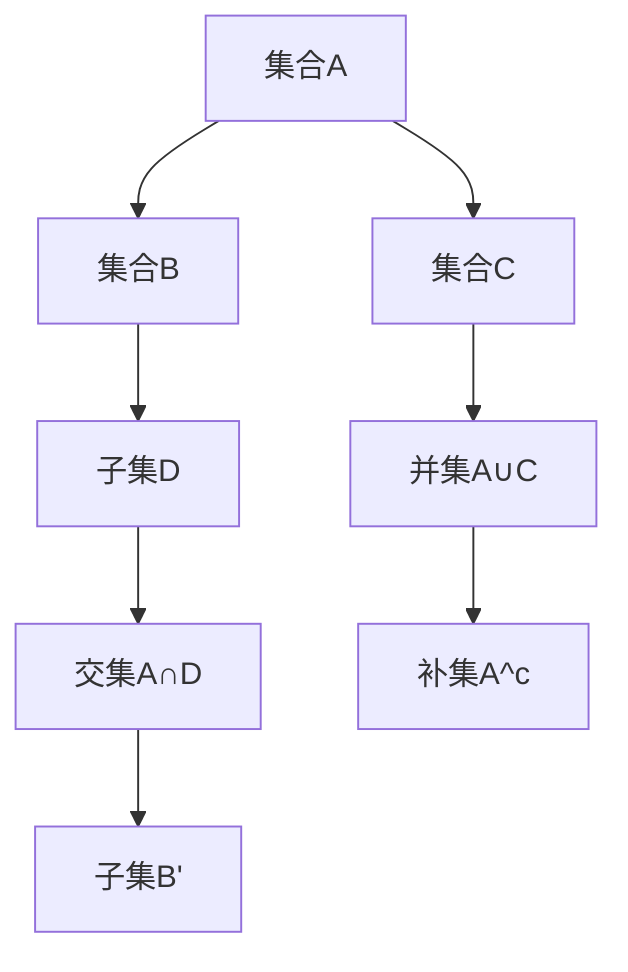
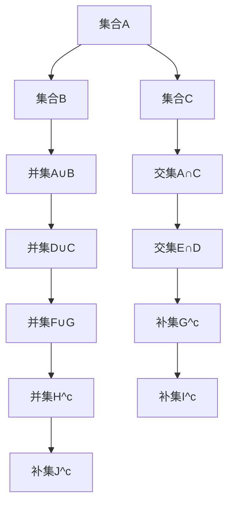

                 

# 集合论导引：KP集合理论

## 关键词
集合论、KP集合理论、数学基础、算法原理、计算机科学应用

## 摘要
本文旨在深入探讨集合论及其在计算机科学和数学中的应用，特别是KP集合理论的发展。文章首先介绍集合论的基本概念和性质，包括集合的定义、表示法、分类、基本操作和集合的运算规则。随后，文章详细阐述了集合论的公理系统，包括基本公理、选择公理以及其他相关公理。在理解集合论的基础上，文章重点介绍了集合的基数，探讨了集合的基数定义、集合的基数关系和集合的基数运算。接着，文章引入了KP集合理论，详细解释了KP集合的基本概念、性质和与普通集合的比较，以及KP集合的运算和公理系统。最后，文章探讨了KP集合理论在数学、计算机科学和经济学中的应用，并提出了KP集合理论的发展趋势和挑战。通过本文的阅读，读者将能够全面了解集合论和KP集合理论的基本概念、原理和实际应用。

## 目录大纲

### 第一部分：集合论基础

#### 第1章：集合论概述

- **1.1 集合的基本概念**
  - **集合的定义**
  - **集合的表示法**
  - **集合的分类**

- **1.2 集合的基本操作**
  - **并集**
  - **交集**
  - **补集**
  - **子集**

- **1.3 集合的性质和关系**
  - **集合的确定性**
  - **集合的互异性**
  - **集合的无序性**
  - **集合与集合之间的关系**

- **1.4 集合的运算规则**
  - **运算的结合律**
  - **运算的交换律**
  - **运算的分配律**

#### 第2章：集合的公理系统

- **2.1 集合论的公理**
  - **集合论的基本公理**
  - **集合论的选择公理**
  - **集合论的其他公理**

- **2.2 集合的生成方法**
  - **集合的构造原则**
  - **幂集**
  - **笛卡尔积**
  - **集合的运算生成新集合**

#### 第3章：集合的基数

- **3.1 集合的基数定义**
  - **集合的基数概念**
  - **集合的基数表示法**

- **3.2 集合的基数关系**
  - **基数的大小比较**
  - **可数集与不可数集**
  - **无穷集合的分类**

- **3.3 集合的基数运算**
  - **基数加法**
  - **基数乘法**
  - **基数乘积**

### 第二部分：KP集合理论

#### 第4章：KP集合理论的基本概念

- **4.1 KP集合的定义**
  - **KP集合的概念**
  - **KP集合的表示法**

- **4.2 KP集合的性质**
  - **KP集合的确定性**
  - **KP集合的互异性**
  - **KP集合的无序性**

- **4.3 KP集合与普通集合的比较**
  - **KP集合与普通集合的区别**
  - **KP集合的应用领域**

#### 第5章：KP集合的运算

- **5.1 KP集合的基本运算**
  - **KP集合的并集**
  - **KP集合的交集**
  - **KP集合的补集**
  - **KP集合的子集**

- **5.2 KP集合的特定运算**
  - **KP集合的对偶运算**
  - **KP集合的变换运算**
  - **KP集合的泛化运算**

#### 第6章：KP集合的公理系统

- **6.1 KP集合论的公理**
  - **KP集合的基本公理**
  - **KP集合的选择公理**
  - **KP集合的其他公理**

- **6.2 KP集合的生成方法**
  - **KP集合的构造原则**
  - **KP集合的幂集**
  - **KP集合的笛卡尔积**

#### 第7章：KP集合的应用与拓展

- **7.1 KP集合在数学中的应用**
  - **KP集合在拓扑学中的应用**
  - **KP集合在代数学中的应用**
  - **KP集合在逻辑学中的应用**

- **7.2 KP集合的理论拓展**
  - **KP集合的扩展公理**
  - **KP集合的多元理论**
  - **KP集合与泛集合论的关系**

### 第三部分：KP集合理论的实际应用

#### 第8章：KP集合在计算机科学中的应用

- **8.1 KP集合在编程中的应用**
  - **KP集合在算法分析中的应用**
  - **KP集合在数据结构设计中的应用**

- **8.2 KP集合在软件工程中的应用**
  - **KP集合在软件设计模式中的应用**
  - **KP集合在软件测试中的应用**

#### 第9章：KP集合在经济学中的应用

- **9.1 KP集合在经济学中的理论框架**
  - **KP集合在经济学中的基本概念**
  - **KP集合在经济学中的分析工具**

- **9.2 KP集合在经济学中的具体应用**
  - **KP集合在市场分析中的应用**
  - **KP集合在资源优化中的应用**

#### 第10章：KP集合理论的发展与挑战

- **10.1 KP集合理论的发展趋势**
  - **KP集合理论的新发现**
  - **KP集合理论的未来研究方向**

- **10.2 KP集合理论的挑战与问题**
  - **KP集合理论的数学难题**
  - **KP集合理论在实际应用中的挑战**

### 附录

#### 附录A：KP集合理论相关资源

- **A.1 参考文献**
  - **基础教材**
  - **研究论文**
  - **网络资源**

- **A.2 学习资料**
  - **在线课程**
  - **讲座和研讨会**
  - **研究小组和论坛**

#### 附录B：KP集合理论的Mermaid流程图

- **B.1 集合的基本概念**
  - **集合的表示与定义**
  - **集合的性质与关系**

- **B.2 集合的运算**
  - **并集、交集、补集**
  - **集合的运算规则**

#### 附录C：KP集合理论算法伪代码

- **C.1 集合的基本运算**
  - **并集、交集、补集的伪代码实现**

- **C.2 KP集合的特殊运算**
  - **对偶运算、变换运算、泛化运算**

#### 附录D：KP集合理论数学公式

$$
\begin{aligned}
U &= \{ x \mid x \text{ 属于全域} \} \\
A \cup B &= \{ x \mid x \in A \text{ 或 } x \in B \} \\
A \cap B &= \{ x \mid x \in A \text{ 且 } x \in B \} \\
A^c &= \{ x \mid x \notin A \} \\
A \subseteq B &= \{ x \mid x \in A \Rightarrow x \in B \}
\end{aligned}
$$

#### 附录E：KP集合理论项目实战案例

- **E.1 实战案例介绍**
  - **案例背景**
  - **案例目标**

- **E.2 开发环境搭建**
  - **开发工具与框架**
  - **环境配置与安装**

- **E.3 源代码实现**
  - **核心代码解读**
  - **功能模块分解**

- **E.4 代码解读与分析**
  - **代码功能说明**
  - **性能分析与优化**

## 第一部分：集合论基础

### 第1章：集合论概述

#### 1.1 集合的基本概念

集合论是现代数学的基石，是研究集合的性质和运算的数学分支。在集合论中，集合是一组确定的对象的抽象集合，这些对象称为集合的元素。集合论的基本概念包括集合的定义、集合的表示法以及集合的分类。

#### 集合的定义

集合（Set）是由确定的对象（称为元素或成员）组成的一个整体。集合中的对象可以是任何事物，包括数字、图形、物体等。集合用大写字母表示，例如A、B、C等，而集合的元素用小写字母表示，例如a、b、c等。

集合可以用描述法、列举法和集合符号法来表示。

- **描述法**：通过描述集合的元素特征来表示集合。例如，所有大于0的实数组成的集合可以表示为：\( \{ x \mid x > 0 \} \)。

- **列举法**：将集合的元素一一列举出来，用花括号括起来。例如，由数字1、2、3组成的集合可以表示为：\( \{ 1, 2, 3 \} \)。

- **集合符号法**：使用特定的集合符号来表示集合。例如，自然数集合可以用符号\( \mathbb{N} \)表示，实数集合可以用符号\( \mathbb{R} \)表示。

#### 集合的分类

根据集合元素的数量，集合可以分为有限集合和无限集合。

- **有限集合**：集合中的元素数量是有限的。例如，集合\( \{ 1, 2, 3 \} \)是一个有限集合。

- **无限集合**：集合中的元素数量是无限的。例如，自然数集合\( \mathbb{N} \)是一个无限集合。

根据集合之间的包含关系，集合还可以分为真子集、子集和等价集合。

- **真子集**：如果集合A中的所有元素都属于集合B，但B中至少有一个元素不属于A，则称A是B的真子集，记作\( A \subset B \)。

- **子集**：如果集合A中的所有元素都属于集合B，则称A是B的子集，记作\( A \subseteq B \)。

- **等价集合**：如果两个集合A和B之间没有元素的不同，即A中的所有元素都在B中，且B中的所有元素都在A中，则称A和B是等价集合，记作\( A = B \)。

#### 1.2 集合的基本操作

集合的基本操作包括并集、交集、补集和子集等。

- **并集**：集合A和集合B的并集是由A和B中的所有元素组成的集合。记作\( A \cup B \)。例如，集合\( A = \{ 1, 2 \} \)和集合\( B = \{ 3, 4 \} \)的并集为\( \{ 1, 2, 3, 4 \} \)。

- **交集**：集合A和集合B的交集是由同时属于A和B的元素组成的集合。记作\( A \cap B \)。例如，集合\( A = \{ 1, 2 \} \)和集合\( B = \{ 3, 2 \} \)的交集为\( \{ 2 \} \)。

- **补集**：集合A的补集是由不属于A的元素组成的集合。记作\( A^c \)。例如，集合\( A = \{ 1, 2 \} \)的补集为\( \{ 3, 4, 5 \} \)。

- **子集**：集合A是集合B的子集，如果A中的所有元素都属于B。记作\( A \subseteq B \)。

#### 1.3 集合的性质和关系

集合的性质包括确定性、互异性、无序性和集合与集合之间的关系。

- **确定性**：集合中的元素是确定的，即一个元素要么属于集合，要么不属于集合。

- **互异性**：集合中的元素是互异的，即集合中不会出现重复的元素。

- **无序性**：集合中的元素没有固定的顺序。

- **集合与集合之间的关系**：集合之间可以通过子集、真子集和等价集合等关系相互关联。

#### 1.4 集合的运算规则

集合的运算遵循以下规则：

- **结合律**：对于任意集合A、B和C，有\( (A \cup B) \cup C = A \cup (B \cup C) \)和\( (A \cap B) \cap C = A \cap (B \cap C) \)。

- **交换律**：对于任意集合A和B，有\( A \cup B = B \cup A \)和\( A \cap B = B \cap A \)。

- **分配律**：对于任意集合A、B和C，有\( A \cup (B \cap C) = (A \cup B) \cap (A \cup C) \)和\( A \cap (B \cup C) = (A \cap B) \cup (A \cap C) \)。

通过这些基本概念和运算规则，我们可以进一步理解集合的性质和应用。在后续章节中，我们将深入探讨集合的公理系统、集合的基数以及KP集合理论。

### 第2章：集合的公理系统

集合论是现代数学的基石，而集合的公理系统则为集合论提供了严谨的数学基础。集合的公理系统包括一组基本公理、选择公理以及其他相关公理，这些公理为集合的存在、性质以及集合运算的确定性提供了理论依据。在本章中，我们将详细讨论集合论的基本公理、选择公理以及其他相关公理，并解释这些公理如何构建集合论的基础。

#### 2.1 集合论的基本公理

集合论的基本公理是构建集合论的基础，它们描述了集合的存在性和确定性。以下是几个重要的基本公理：

- **存在公理**：存在一个集合，称为空集，它不包含任何元素。用符号表示为：\( \emptyset \)。

- **包含公理**：对于任意的集合A，空集是A的子集。即：\( \emptyset \subseteq A \)。

- **互异性公理**：集合中的元素是互异的，即一个集合中不会出现重复的元素。

- **无序性公理**：集合中的元素是无序的，即集合中元素的排列顺序不影响集合的性质。

- **归纳公理**：对于任意的集合A，存在一个由A的元素构成的集合B，并且B包含了A的所有元素。换句话说，可以通过归纳的方式从空集生成任意集合。

这些基本公理确保了集合的存在性和确定性，为后续的集合运算和性质分析提供了基础。

#### 2.2 选择公理

选择公理是集合论中的一个重要公理，它允许我们在某些条件下选择集合的元素。选择公理主要有两种形式：

- **弱选择公理**：如果集合A是可分的（即存在一个划分），则存在一个集合B，它是A的一个子集，并且B中的元素是A的划分中的每个元素的唯一代表。

- **强选择公理**：如果集合A是非空的可分集合，那么存在一个集合B，它包含A的所有元素，并且B中的每个元素都在A的一个不同的子集中。

选择公理在集合论中有着广泛的应用，特别是在集合的构造和集合的基数分析中。例如，强选择公理可以用来证明某些集合是不可数的，即它们的基数是无穷大。

#### 2.3 其他相关公理

除了基本公理和选择公理外，集合论还包括一些其他相关公理，这些公理补充了集合论的基础：

- **对偶公理**：如果有一个公理，则其对偶公理也成立。例如，包含公理的对偶是排除公理，即如果A是B的子集，则B不是A的子集。

- **交换公理**：集合的并集和交集运算满足交换律，即\( A \cup B = B \cup A \)和\( A \cap B = B \cap A \)。

- **结合公理**：集合的并集和交集运算满足结合律，即\( (A \cup B) \cup C = A \cup (B \cup C) \)和\( (A \cap B) \cap C = A \cap (B \cap C) \)。

- **分配公理**：集合的交集与并集的运算满足分配律，即\( A \cup (B \cap C) = (A \cup B) \cap (A \cup C) \)和\( A \cap (B \cup C) = (A \cap B) \cup (A \cap C) \)。

这些公理共同构建了集合论的理论框架，为集合的性质和运算提供了严谨的数学基础。在后续的章节中，我们将进一步探讨集合的基数以及KP集合理论，深入理解集合论在实际应用中的重要性。

#### 2.4 集合的生成方法

在集合论中，集合的生成方法是通过集合的基本操作和构造原则来创建新的集合。这些生成方法包括幂集、笛卡尔积以及集合的运算生成新集合。理解这些生成方法有助于我们更深入地探讨集合的性质和运算。

##### 2.4.1 幂集

幂集（Power Set）是集合的一个基本生成方法，它包含了原集合的所有子集。如果一个集合A有n个元素，那么A的幂集包含\( 2^n \)个子集。幂集通常用符号\( P(A) \)表示。

**示例**：考虑集合A = {1, 2, 3}。A的幂集P(A)包含以下子集：
\[ P(A) = \{ \emptyset, \{1\}, \{2\}, \{3\}, \{1, 2\}, \{1, 3\}, \{2, 3\}, \{1, 2, 3\} \} \]

幂集的概念在集合论中具有重要意义，尤其是在讨论集合的基数时，幂集的基数是一个关键因素。

##### 2.4.2 笛卡尔积

笛卡尔积（Cartesian Product）是两个集合之间元素的所有可能的有序对的集合。如果有两个集合A和B，那么它们的笛卡尔积记为\( A \times B \)，包含的所有元素是对\( (a, b) \)，其中\( a \in A \)且\( b \in B \)。

**示例**：考虑集合A = {1, 2}和B = {3, 4}。A和B的笛卡尔积为：
\[ A \times B = \{ (1, 3), (1, 4), (2, 3), (2, 4) \} \]

笛卡尔积在数学和计算机科学中有着广泛的应用，特别是在关系数据库中，用于表示关系之间的连接。

##### 2.4.3 集合的运算生成新集合

集合的运算生成新集合的方法包括并集、交集、补集和子集等。通过这些基本运算，可以从已知集合生成新的集合。

- **并集**：并集是包含所有属于A或属于B的元素的集合。例如，集合A = {1, 2}和B = {3, 4}的并集为{1, 2, 3, 4}。

- **交集**：交集是同时属于A和B的元素的集合。例如，集合A = {1, 2}和B = {3, 2}的交集为{2}。

- **补集**：补集是包含所有不属于A的元素的集合。例如，集合A = {1, 2}的全集U = {1, 2, 3, 4}的补集为{3, 4}。

- **子集**：子集是包含A中所有元素的集合B。例如，集合A = {1, 2}的子集为{∅, {1}, {2}, {1, 2}}。

通过这些生成方法，我们可以从基础集合生成更复杂的集合，为集合论的研究提供了丰富的工具。

##### 2.4.4 集合的构造原则

集合的构造原则是创建新集合的基本规则，包括集合的生成、集合的划分以及集合的嵌套。

- **集合的生成**：通过集合的基本操作和构造原则，可以生成新的集合。例如，通过并集和交集生成新的集合。

- **集合的划分**：将一个集合划分为若干个互不重叠的子集。例如，将集合{1, 2, 3, 4, 5}划分为{1, 2}, {3, 4}, {5}。

- **集合的嵌套**：构造一个集合的子集，该子集本身也是一个集合。例如，集合{∅, {∅}}，其中∅是空集，{∅}是包含空集的集合。

通过这些构造原则，集合论能够构建复杂而多样的数学结构，为研究集合的性质和应用提供了丰富的可能性。

总之，集合的生成方法不仅包括幂集、笛卡尔积等基本操作，还涉及到集合的构造原则，这些方法共同构成了集合论的基础，为后续章节的探讨提供了坚实的理论基础。

### 第3章：集合的基数

集合的基数（Cardinality）是集合论中一个重要的概念，它描述了集合中元素的数量。理解集合的基数对于分析集合的性质、比较集合的大小以及研究集合的运算具有重要意义。在本章中，我们将详细探讨集合的基数定义、集合的基数关系和集合的基数运算。

#### 3.1 集合的基数定义

集合的基数是指集合中元素的数量。用符号\( |A| \)表示集合A的基数。如果一个集合A是非空集合，那么它的基数是一个非负整数。

- **有限集合的基数**：如果一个集合A的基数是一个非负整数n，即集合A包含n个不同的元素，那么A是一个有限集合。

- **无限集合的基数**：如果一个集合A的基数不是一个非负整数，即集合A包含无穷多个元素，那么A是一个无限集合。

#### 3.2 集合的基数关系

集合的基数关系描述了不同集合之间元素数量的大小关系。以下是一些常见的集合基数关系：

- **基数比较**：如果集合A的基数小于集合B的基数，即\( |A| < |B| \)，则称集合A的基数小于集合B的基数。

- **基数相等等价性**：如果集合A和B具有相同的基数，即\( |A| = |B| \)，则称集合A和B的基数相等。

- **可数集与不可数集**：如果一个集合A的基数是一个无穷整数，即集合A包含无穷多个元素，但可以通过一一对应的方式与自然数集合\( \mathbb{N} \)对应，则称集合A是一个可数集。否则，如果一个集合A的基数不是一个无穷整数，即集合A包含无穷多个元素，但无法通过一一对应的方式与自然数集合\( \mathbb{N} \)对应，则称集合A是一个不可数集。

- **无穷集合的分类**：无穷集合可以分为可数无穷集合和不可数无穷集合。可数无穷集合是指可以与自然数集合\( \mathbb{N} \)一一对应的集合，例如整数集合\( \mathbb{Z} \)和有理数集合\( \mathbb{Q} \)。不可数无穷集合是指无法与自然数集合\( \mathbb{N} \)一一对应的集合，例如实数集合\( \mathbb{R} \)。

#### 3.3 集合的基数运算

集合的基数运算描述了通过集合的基本操作和构造原则来计算新集合的基数。以下是一些常见的集合基数运算：

- **基数加法**：如果集合A和B的基数分别为\( |A| \)和\( |B| \)，那么集合A和B的并集\( A \cup B \)的基数是\( |A| + |B| - |A \cap B| \)。这被称为基数加法公式。

- **基数乘法**：如果集合A和B的基数分别为\( |A| \)和\( |B| \)，那么集合A和B的笛卡尔积\( A \times B \)的基数是\( |A| \times |B| \)。

- **基数乘积**：如果集合A、B和C的基数分别为\( |A| \)、\( |B| \)和\( |C| \)，那么集合\( A \times B \times C \)的基数是\( |A| \times |B| \times |C| \)。

通过这些基数运算，我们可以计算复杂集合的基数，为分析集合的性质和应用提供了重要的工具。

总之，集合的基数是集合论中的一个核心概念，它描述了集合中元素的数量。通过理解集合的基数定义、集合的基数关系和集合的基数运算，我们可以更深入地探讨集合的性质和运算，为数学和计算机科学中的集合论研究提供了坚实的理论基础。

### 第二部分：KP集合理论

#### 第4章：KP集合理论的基本概念

KP集合理论是集合论的一个扩展，它引入了一种新的集合类型——KP集合。KP集合具有一些与普通集合不同的性质，这些性质使得KP集合在数学、计算机科学和其他领域有着广泛的应用。在本章中，我们将详细介绍KP集合的定义、表示法以及KP集合与普通集合的比较。

#### 4.1 KP集合的定义

KP集合（Kleene-Powerset Collection）是一种特殊的集合，它由所有普通集合的幂集组成。换句话说，如果一个集合A是普通集合，那么A的KP集合是由A的所有子集组成的集合。用符号表示，KP集合\( K(A) \)可以表示为：
\[ K(A) = \{ B \mid B \subseteq P(A) \} \]
其中，\( P(A) \)表示A的幂集。

KP集合的定义使得它具有一些独特的性质，例如，KP集合中的元素可以是无穷集合。与普通集合相比，KP集合的元素不仅可以是单个对象，还可以是其他集合。

#### 4.2 KP集合的表示法

KP集合的表示法与普通集合类似，但更复杂。由于KP集合是由普通集合的幂集组成，因此其表示法涉及到集合的嵌套和组合。

**示例**：考虑一个普通集合\( A = \{1, 2\} \)。A的KP集合可以表示为：
\[ K(A) = \{ \emptyset, \{1\}, \{2\}, \{1, 2\}, \{\emptyset\}, \{\{1\}\}, \{\{2\}\}, \{\{1, 2\}\}, \{\emptyset, \{1\}\}, \{\emptyset, \{2\}\}, \{\emptyset, \{1, 2\}\}, \{\{1\}, \{2\}\}, \{\{1\}, \{1, 2\}\}, \{\{2\}, \{1, 2\}\}, \{\{1\}, \{2\}, \{1, 2\}\} \} \]

从示例中可以看出，KP集合包含了许多普通集合的幂集元素，例如空集、单个元素的集合、两个元素的集合以及更复杂的集合。

#### 4.3 KP集合的性质

KP集合具有一些与普通集合不同的性质，这些性质使得KP集合在数学和计算机科学中具有独特的重要性。

- **无限性**：KP集合中的元素可以是无限集合，这与普通集合不同，因为普通集合中的元素通常是有限的。

- **嵌套性**：KP集合中的元素可以是其他KP集合的子集，这种嵌套性使得KP集合具有复杂的结构。

- **自指性**：KP集合可以包含自身作为元素，这种现象称为自指性。例如，\( \{\{\emptyset\}\} \)是一个KP集合，并且它是自身的一个元素。

- **基数变化**：KP集合的基数通常比普通集合的基数大。例如，一个含有n个元素的普通集合的基数是n，而其KP集合的基数是\( 2^n \)。

#### 4.4 KP集合与普通集合的比较

KP集合与普通集合在定义、表示法和性质上存在显著差异。以下是比较的几个关键点：

- **定义**：普通集合由确定的对象组成，而KP集合是由普通集合的幂集组成。

- **表示法**：普通集合的表示通常较为简单，而KP集合的表示则更为复杂，因为它涉及到集合的嵌套和组合。

- **性质**：KP集合具有无限性、嵌套性和自指性等特殊性质，而普通集合则不具有这些性质。

- **基数**：普通集合的基数通常是一个非负整数，而KP集合的基数可以是一个更大的数，因为KP集合包含所有普通集合的幂集。

通过这些比较，我们可以更清晰地理解KP集合与普通集合的区别和联系。KP集合的独特性质使其在数学、计算机科学和其他领域具有重要的应用价值。

总之，KP集合理论为集合论提供了新的视角和工具，通过引入KP集合的概念，扩展了集合论的研究范围。在接下来的章节中，我们将进一步探讨KP集合的运算和公理系统，深入理解KP集合理论的基本原理和应用。

### 第5章：KP集合的运算

KP集合理论的核心在于其独特的运算，这些运算是集合论基本运算的扩展，并体现了KP集合的特殊性质。在本章中，我们将详细讨论KP集合的基本运算，包括并集、交集、补集和子集，并探讨KP集合的特定运算，如对偶运算、变换运算和泛化运算。

#### 5.1 KP集合的基本运算

KP集合的基本运算与普通集合的基本运算相似，但更复杂。以下是对KP集合的基本运算的详细解释：

- **并集**：KP集合的并集是由两个或多个KP集合中的所有元素组成的集合。对于KP集合\( K(A) \)和\( K(B) \)，它们的并集\( K(A) \cup K(B) \)由所有属于\( K(A) \)或属于\( K(B) \)的子集组成。记作：
  \[ K(A) \cup K(B) = \{ C \mid C \subseteq A \cup B \} \]

- **交集**：KP集合的交集是由两个或多个KP集合中共有的元素组成的集合。对于KP集合\( K(A) \)和\( K(B) \)，它们的交集\( K(A) \cap K(B) \)由所有既属于\( K(A) \)又属于\( K(B) \)的子集组成。记作：
  \[ K(A) \cap K(B) = \{ C \mid C \subseteq A \cap B \} \]

- **补集**：KP集合的补集是由不属于原KP集合的所有元素组成的集合。对于KP集合\( K(A) \)，它的补集\( K(A)^c \)由所有不属于\( K(A) \)的子集组成。记作：
  \[ K(A)^c = \{ C \mid C \subseteq A^c \} \]

- **子集**：KP集合的子集是由原KP集合的某些元素组成的集合。对于KP集合\( K(A) \)和\( K(B) \)，如果\( K(B) \)的所有元素都是\( K(A) \)的元素，则称\( K(B) \)是\( K(A) \)的子集。记作：
  \[ K(B) \subseteq K(A) \Leftrightarrow B \subseteq A \]

这些基本运算遵循集合论中的一般规则，但在KP集合中，由于KP集合的复杂性，运算的结果可能具有更复杂的结构。

#### 5.2 KP集合的特定运算

除了基本运算外，KP集合还有一些特定的运算，这些运算反映了KP集合的特殊性质。

- **对偶运算**：对偶运算是对KP集合的一种变换，它通过交换集合中的元素来生成一个新的KP集合。对于KP集合\( K(A) \)，其对偶运算\( K(A)^* \)生成的集合包含\( K(A) \)的所有对偶子集。对偶运算可以用以下方式定义：
  \[ K(A)^* = \{ B^c \mid B \in K(A) \} \]
  其中，\( B^c \)表示集合\( B \)的补集。

- **变换运算**：变换运算是对KP集合的一种更复杂的变换，它可以通过某种特定的规则对KP集合中的元素进行操作。例如，变换运算可以定义为一组集合之间的映射，这些映射满足特定的条件。变换运算的结果是一个新的KP集合。

- **泛化运算**：泛化运算是将KP集合扩展为更广泛的集合运算。例如，可以通过将KP集合中的子集扩展为更复杂的子集来定义泛化运算。泛化运算可以扩展KP集合的理论和应用范围。

这些特定运算使得KP集合在数学和计算机科学中具有更广泛的适用性，同时也增加了KP集合理论的复杂性。

#### 5.3 运算示例

为了更好地理解KP集合的运算，我们通过一个示例来演示这些运算。

**示例**：考虑两个普通集合\( A = \{1, 2\} \)和\( B = \{3, 4\} \)。它们的KP集合分别为：
\[ K(A) = \{ \emptyset, \{1\}, \{2\}, \{1, 2\}, \{\emptyset\}, \{\{1\}\}, \{\{2\}\}, \{\{1, 2\}\} \} \]
\[ K(B) = \{ \emptyset, \{3\}, \{4\}, \{3, 4\}, \{\emptyset\}, \{\{3\}\}, \{\{4\}\}, \{\{3, 4\}\} \} \]

- **并集**：\( K(A) \cup K(B) \)的结果为：
  \[ K(A) \cup K(B) = \{ \emptyset, \{1\}, \{2\}, \{1, 2\}, \{3\}, \{4\}, \{3, 4\}, \{\emptyset\}, \{\{1\}\}, \{\{2\}\}, \{\{1, 2\}\}, \{\{3\}\}, \{\{4\}\}, \{\{3, 4\}\}, \{\{1\}, \{3\}\}, \{\{1\}, \{4\}\}, \{\{2\}, \{3\}\}, \{\{2\}, \{4\}\}, \{\{1\}, \{3\}, \{4\}\}, \{\{2\}, \{3\}, \{4\}\} \} \]

- **交集**：\( K(A) \cap K(B) \)的结果为：
  \[ K(A) \cap K(B) = \{ \emptyset, \{\emptyset\} \} \]

- **补集**：\( K(A)^c \)的结果为：
  \[ K(A)^c = \{ \{\emptyset\}, \{\{1\}\}, \{\{2\}\}, \{\{1, 2\}\}, \{\{1\}, \{2\}\} \} \]

- **对偶运算**：\( K(A)^* \)的结果为：
  \[ K(A)^* = \{ \{\emptyset\}, \{\{1\}\}, \{\{2\}\}, \{\{1, 2\}\} \} \]

这些示例展示了KP集合的基本运算和特定运算的应用，有助于我们更深入地理解KP集合的运算和性质。

总之，KP集合的运算不仅包括基本的集合运算，还包括特定的对偶运算、变换运算和泛化运算。这些运算丰富了KP集合理论的内涵，为KP集合在数学和计算机科学中的应用提供了强有力的工具。在接下来的章节中，我们将进一步探讨KP集合的公理系统以及其在实际应用中的重要性。

### 第6章：KP集合的公理系统

KP集合理论是集合论的一个重要扩展，为了确保KP集合的运算和性质具有一致性和完整性，KP集合论引入了一套公理系统。这些公理构成了KP集合理论的基础，为KP集合的构建和操作提供了严谨的数学依据。在本章中，我们将详细讨论KP集合的基本公理、选择公理以及其他相关公理，并解释这些公理如何构成KP集合理论的核心。

#### 6.1 KP集合的基本公理

KP集合的基本公理包括集合的存在性、互异性、无序性和构造性，它们与普通集合的基本公理类似，但针对KP集合的特殊性质进行了扩展。

- **存在性公理**：KP集合中存在一个空集合，记作\( \emptyset \)，它不包含任何元素。

- **互异性公理**：KP集合中的元素是互异的，即KP集合中不会出现重复的元素。

- **无序性公理**：KP集合中的元素是无序的，即集合中元素的排列顺序不影响集合的性质。

- **构造性公理**：KP集合可以通过构造普通集合的幂集来生成。换句话说，对于任意普通集合A，存在一个KP集合K(A)，它由A的所有子集组成。

这些基本公理保证了KP集合的存在性和确定性，为KP集合的运算提供了基础。

#### 6.2 KP集合的选择公理

选择公理是KP集合理论中的一个重要组成部分，它允许我们在某些条件下从KP集合中选择子集。KP集合的选择公理主要有两种形式：

- **弱选择公理**：如果KP集合K(A)是可分的（即存在一个划分），则存在一个KP集合B，它是K(A)的一个子集，并且B中的元素是K(A)的划分中的每个元素的唯一代表。

- **强选择公理**：如果KP集合K(A)是非空的可分集合，那么存在一个KP集合B，它包含K(A)的所有元素，并且B中的每个元素都在K(A)的一个不同的子集中。

选择公理在KP集合的构造和分析中起着关键作用，例如，在证明KP集合的基数时，选择公理是非常重要的。

#### 6.3 其他相关公理

除了基本公理和选择公理外，KP集合理论还包括一些其他相关公理，这些公理补充了KP集合理论的基础：

- **对偶公理**：对于KP集合K(A)，其对偶集合K(A)^*也满足KP集合的基本公理。即对偶集合K(A)^*也是一个KP集合。

- **交换公理**：KP集合的并集和交集运算满足交换律，即\( K(A) \cup K(B) = K(B) \cup K(A) \)和\( K(A) \cap K(B) = K(B) \cap K(A) \)。

- **结合公理**：KP集合的并集和交集运算满足结合律，即\( (K(A) \cup K(B)) \cup K(C) = K(A) \cup (K(B) \cup K(C)) \)和\( (K(A) \cap K(B)) \cap K(C) = K(A) \cap (K(B) \cap K(C)) \)。

- **分配公理**：KP集合的交集与并集的运算满足分配律，即\( K(A) \cup (B \cap C) = (A \cup B) \cap (A \cup C) \)和\( K(A) \cap (B \cup C) = (A \cap B) \cup (A \cap C) \)。

这些公理共同构建了KP集合理论的严谨框架，为KP集合的运算和性质提供了理论基础。

#### 6.4 公理的统一解释

KP集合的公理系统是对普通集合公理系统的扩展。普通集合的公理主要关注集合的存在性、互异性、无序性和构造性，而KP集合的公理则在此基础上引入了KP集合的特殊性质，如无限性、嵌套性和自指性。选择公理和相关的对偶公理、交换公理、结合公理和分配公理则为KP集合的复杂运算提供了进一步的保障。

通过这些公理，KP集合理论形成了一套完整的逻辑体系，它不仅继承了普通集合论的基本原则，还拓展了集合论的应用范围，为数学、计算机科学和其他领域提供了新的工具和方法。

总之，KP集合的公理系统是构建KP集合理论的基础，它通过一系列严谨的公理确保了KP集合的运算和性质的一致性和完整性。在接下来的章节中，我们将探讨KP集合理论在实际应用中的重要性，并进一步探讨KP集合理论的发展趋势和挑战。

### 第7章：KP集合的应用与拓展

KP集合理论不仅在数学领域有着重要的基础作用，也在计算机科学、经济学和其他学科中展现出了广泛的应用前景。在本章中，我们将详细探讨KP集合在数学、计算机科学和经济学中的应用，并讨论KP集合理论的理论拓展。

#### 7.1 KP集合在数学中的应用

KP集合在数学中的应用非常广泛，尤其是在集合论、拓扑学、代数学和逻辑学等领域。

- **集合论**：KP集合为集合论提供了更丰富的工具，它使得我们能够研究更复杂的集合结构。例如，KP集合的基数概念在研究集合的性质和分类时非常重要。

- **拓扑学**：KP集合在拓扑学中的应用主要体现在研究拓扑空间的开集和闭集的性质。KP集合可以用来定义更复杂的拓扑结构，这对于理解和分析复杂系统具有重要意义。

- **代数学**：KP集合在代数学中的应用包括研究集合的运算、群、环和域的性质。KP集合的运算和性质为代数结构的分析和构造提供了新的视角。

- **逻辑学**：KP集合在逻辑学中的应用主要体现在形式逻辑和模型论中。KP集合的构造和运算为逻辑推理提供了更丰富的工具，有助于我们更深入地理解逻辑系统的性质。

#### 7.2 KP集合在计算机科学中的应用

KP集合在计算机科学中的应用也非常丰富，尤其是在算法设计、数据结构、软件工程和计算机图形学等领域。

- **算法设计**：KP集合为算法设计提供了新的思路和方法。例如，在算法分析中，KP集合可以帮助我们更清晰地理解算法的时间复杂度和空间复杂度。

- **数据结构**：KP集合在数据结构设计中有着广泛的应用。例如，利用KP集合可以设计出更高效的集合数据结构，如并查集和哈希表。

- **软件工程**：KP集合在软件工程中的应用包括软件设计模式、软件测试和软件验证。KP集合的概念可以帮助我们更好地理解软件系统的复杂性和设计原则。

- **计算机图形学**：KP集合在计算机图形学中的应用主要体现在图形渲染和图像处理。例如，通过KP集合可以更有效地处理复杂的图形结构和图像数据。

#### 7.3 KP集合在经济学中的应用

KP集合在经济学中的应用主要包括市场分析、资源优化和经济学模型。

- **市场分析**：KP集合可以帮助经济学家分析市场的复杂性和多样性。例如，利用KP集合可以更准确地描述市场中的消费者行为和商品分类。

- **资源优化**：KP集合在资源优化中的应用体现在资源分配和调度。例如，通过KP集合可以设计出更高效的资源分配算法，以优化资源的使用。

- **经济学模型**：KP集合为经济学模型提供了新的工具和方法。例如，利用KP集合可以构建更复杂的经济学模型，以更好地理解经济系统的运行机制。

#### 7.4 KP集合的理论拓展

KP集合理论不仅在现有应用领域有着重要的影响，还在不断拓展其理论边界。

- **扩展公理**：为了更好地适应复杂应用的需求，KP集合理论引入了一系列扩展公理。这些扩展公理包括对KP集合的构造、运算和性质的进一步描述，为KP集合理论的发展提供了新的方向。

- **多元理论**：KP集合的多元理论研究KP集合在不同维度上的性质和运算。例如，研究多维KP集合的构造方法和应用，可以拓展KP集合理论的应用范围。

- **泛集合论**：KP集合与泛集合论的关系是KP集合理论中的一个重要研究方向。通过研究KP集合与泛集合论的相互关系，可以更好地理解集合的层次结构和集合论的基本原理。

总之，KP集合理论在数学、计算机科学、经济学等领域的应用非常广泛，其在理论研究中的不断拓展也为这些领域提供了新的工具和方法。随着KP集合理论的发展，我们有理由相信它将在未来发挥更加重要的作用。

### 第三部分：KP集合理论的实际应用

#### 第8章：KP集合在计算机科学中的应用

KP集合理论在计算机科学中的应用具有广泛的前景，尤其是在算法设计、数据结构以及软件工程等领域。在本章中，我们将探讨KP集合在计算机科学中的具体应用，包括在编程中的应用、在算法分析中的应用以及如何通过KP集合优化数据结构设计。

#### 8.1 KP集合在编程中的应用

KP集合在编程中的应用主要体现在以下几个方面：

- **集合操作**：在编程中，KP集合的并集、交集、补集和子集等操作可以用来处理复杂的集合问题。例如，在实现集合类的数据结构时，可以利用KP集合的运算规则来实现高效的集合操作。

- **集合表示**：KP集合的概念可以帮助我们更清晰地表示和处理复杂的数据结构。例如，在处理图形或图像数据时，可以利用KP集合表示像素点或颜色集合。

- **算法分析**：KP集合的概念在算法分析中有着重要的应用。例如，在分析算法的时间复杂度和空间复杂度时，可以利用KP集合的基数概念来更准确地描述算法的性能。

#### 8.2 KP集合在算法分析中的应用

KP集合在算法分析中的应用主要体现在以下几个方面：

- **时间复杂度分析**：在分析算法的时间复杂度时，KP集合可以帮助我们更准确地描述算法的操作次数。例如，在分析排序算法时，可以利用KP集合的基数表示法来描述不同情况下的比较次数。

- **空间复杂度分析**：在分析算法的空间复杂度时，KP集合可以帮助我们更准确地描述算法所需的空间。例如，在分析数据结构时，可以利用KP集合的基数表示法来描述所需的空间大小。

#### 8.3 KP集合在数据结构设计中的应用

KP集合在数据结构设计中的应用主要体现在以下几个方面：

- **集合数据结构**：KP集合的概念可以帮助我们设计更高效的集合数据结构。例如，利用KP集合的并集和交集操作，可以设计出更高效的并查集和哈希表。

- **组合数据结构**：KP集合的概念可以帮助我们设计出更复杂的数据结构。例如，利用KP集合的嵌套和组合特性，可以设计出更复杂的树形结构或图结构。

- **动态数据结构**：KP集合的概念可以帮助我们设计出动态调整的数据结构。例如，利用KP集合的动态扩展和收缩特性，可以设计出动态调整大小的数组或链表。

#### 8.4 KP集合在软件工程中的应用

KP集合在软件工程中的应用主要体现在以下几个方面：

- **软件设计模式**：KP集合的概念可以帮助我们理解软件设计模式。例如，利用KP集合的子集概念，可以设计出更灵活的软件模块，从而实现更高的模块复用性和可扩展性。

- **软件测试**：KP集合的概念可以帮助我们更有效地进行软件测试。例如，利用KP集合的补集概念，可以设计出更全面的测试用例，从而提高软件测试的覆盖率。

- **软件验证**：KP集合的概念可以帮助我们进行软件验证。例如，利用KP集合的概念，可以设计出更严格的验证算法，从而确保软件的正确性和可靠性。

#### 8.5 应用示例

为了更好地理解KP集合在计算机科学中的应用，我们通过一个简单的示例来说明KP集合在算法设计中的应用。

**示例**：考虑一个简单的排序算法——快速排序（Quick Sort）。快速排序的基本思想是通过选择一个基准元素，将待排序数组分为两个子数组，一个子数组中的所有元素都比基准元素小，另一个子数组中的所有元素都比基准元素大。然后递归地对这两个子数组进行快速排序。

利用KP集合的概念，我们可以更清晰地描述快速排序的过程。假设我们有一个数组\( A = \{5, 2, 9, 1, 5, 6\} \)。

1. **选择基准元素**：选择数组中的第一个元素5作为基准元素。

2. **划分过程**：将数组划分为两个子数组，一个包含比5小的元素，另一个包含比5大的元素。利用KP集合的概念，我们可以将这个过程表示为：
   \[ A \cap \{ x \mid x < 5 \} = \{2, 1\} \]
   \[ A \cap \{ x \mid x > 5 \} = \{9, 6\} \]

3. **递归排序**：对两个子数组进行快速排序。递归过程可以用KP集合的概念来描述，即：
   \[ K(A \cap \{ x \mid x < 5 \}) = K(\{2, 1\}) \]
   \[ K(A \cap \{ x \mid x > 5 \}) = K(\{9, 6\}) \]

通过这个示例，我们可以看到KP集合在算法设计中的应用，使得算法过程更清晰、更易于理解和实现。

总之，KP集合在计算机科学中的应用非常广泛，通过其在算法设计、数据结构设计和软件工程中的应用，可以大大提高算法和软件的效率和可靠性。在未来的研究和实践中，KP集合理论将继续在计算机科学中发挥重要作用。

### 第9章：KP集合在经济学中的应用

KP集合理论在经济学中的应用具有独特的重要性，它为经济模型的分析提供了新的工具和方法。在本章中，我们将探讨KP集合在经济学中的具体应用，包括其在市场分析、资源优化和经济模型构建中的重要作用。

#### 9.1 KP集合在经济学中的理论框架

KP集合在经济学中的理论框架主要体现在以下几个方面：

- **市场分析**：KP集合可以帮助经济学家分析市场的复杂性和多样性。通过KP集合，我们可以将市场划分为不同的子市场，从而更精确地描述市场需求和供给。

- **资源优化**：KP集合在资源优化中的应用主要体现在资源分配和调度。KP集合的概念可以帮助我们设计出更高效的资源分配算法，从而优化资源的使用。

- **经济模型构建**：KP集合可以帮助经济学家构建更复杂的经济学模型。通过KP集合，我们可以描述和分析经济系统的各种结构和行为。

#### 9.2 KP集合在经济学中的具体应用

KP集合在经济学中的应用主要体现在以下几个方面：

- **市场分析**：

  在市场分析中，KP集合可以帮助我们更准确地描述市场的结构和行为。例如，我们可以利用KP集合来分析消费者行为和商品分类。通过KP集合的基数概念，我们可以量化市场的规模和多样性。

  **示例**：假设有一个市场包含5种商品，每种商品都有不同的需求量。利用KP集合，我们可以将市场划分为以下子集：

  \[
  \begin{aligned}
  &K(M) = \{ \{\text{商品1}\}, \{\text{商品2}\}, \{\text{商品3}\}, \{\text{商品4}\}, \{\text{商品5}\}, \{\text{商品1, 商品2\}}, \{\text{商品1, 商品3\}}, \{\text{商品1, 商品4\}}, \{\text{商品1, 商品5\}}, \{\text{商品2, 商品3\}}, \{\text{商品2, 商品4\}}, \{\text{商品2, 商品5\}}, \{\text{商品3, 商品4\}}, \{\text{商品3, 商品5\}}, \{\text{商品4, 商品5\}}, \{\text{商品1, 商品2, 商品3\}}, \{\text{商品1, 商品2, 商品4\}}, \{\text{商品1, 商品2, 商品5\}}, \{\text{商品1, 商品3, 商品4\}}, \{\text{商品1, 商品3, 商品5\}}, \{\text{商品1, 商品4, 商品5\}}, \{\text{商品2, 商品3, 商品4\}}, \{\text{商品2, 商品3, 商品5\}}, \{\text{商品2, 商品4, 商品5\}}, \{\text{商品3, 商品4, 商品5\}}, \{\text{商品1, 商品2, 商品3, 商品4\}}, \{\text{商品1, 商品2, 商品3, 商品5\}}, \{\text{商品1, 商品2, 商品4, 商品5\}}, \{\text{商品1, 商品3, 商品4, 商品5\}}, \{\text{商品2, 商品3, 商品4, 商品5\}}, \{\text{商品1, 商品2, 商品3, 商品4, 商品5\}} \}
  \]

  通过这个示例，我们可以看到KP集合如何帮助我们描述和分析市场的复杂结构。

- **资源优化**：

  在资源优化中，KP集合可以帮助我们设计出更高效的资源分配算法。通过KP集合的基数概念，我们可以量化资源的利用情况，从而优化资源的分配。

  **示例**：假设有一个工厂需要分配资源（如劳动力、设备、原材料等）来生产不同的产品。我们可以利用KP集合来描述这些资源的分配情况。通过分析KP集合的基数，我们可以找到最优的资源分配方案，以最大化生产效率。

  \[
  \begin{aligned}
  &K(R) = \{ \{\text{资源1, 资源2\}}, \{\text{资源1, 资源3\}}, \{\text{资源2, 资源3\}}, \{\text{资源1, 资源2, 资源3\}} \}
  \]

  通过这个示例，我们可以看到KP集合如何帮助我们在资源优化中找到最优的分配方案。

- **经济模型构建**：

  KP集合可以帮助经济学家构建更复杂的经济学模型，从而更好地理解经济系统的运行机制。通过KP集合的构造和运算，我们可以描述和分析经济系统的各种结构和行为。

  **示例**：在宏观经济模型中，我们可以利用KP集合来描述不同经济主体的行为和互动。例如，通过KP集合，我们可以描述消费者的消费行为、生产者的生产决策以及政府的政策影响。

  \[
  \begin{aligned}
  &K(E) = \{ \{\text{消费者1}, \text{消费者2}\}, \{\text{生产者1}, \text{生产者2}\}, \{\text{政府}, \text{消费者1}, \text{消费者2}\}, \{\text{政府}, \text{生产者1}, \text{生产者2}\} \}
  \]

  通过这个示例，我们可以看到KP集合如何帮助我们在经济模型中描述和分析经济主体的互动。

总之，KP集合在经济学中的应用为经济模型的分析提供了新的工具和方法。通过KP集合，我们可以更准确地描述市场的结构和行为，优化资源的分配，构建更复杂的经济学模型。在未来的研究和实践中，KP集合理论将继续在经济学中发挥重要作用。

### 第10章：KP集合理论的发展与挑战

KP集合理论作为集合论的一个重要扩展，近年来在数学、计算机科学和经济学等领域取得了显著进展。然而，随着应用需求的不断增长，KP集合理论也面临着一系列新的发展机遇和挑战。在本章中，我们将探讨KP集合理论的发展趋势、未来研究方向以及面临的挑战。

#### 10.1 KP集合理论的发展趋势

随着科学技术的进步和数学理论的发展，KP集合理论呈现出以下几个发展趋势：

- **扩展公理的研究**：为了更好地适应复杂应用的需求，KP集合理论研究者正在探索新的扩展公理。这些扩展公理旨在增强KP集合的运算能力和理论体系，以应对更复杂的问题。

- **多元KP集合的研究**：多元KP集合（Multi-Valued Kleene-Powerset Collection）是KP集合理论的扩展形式。研究者正在探索多元KP集合的性质和运算规则，以拓宽KP集合理论的应用范围。

- **泛KP集合论**：泛KP集合论（Generalized Kleene-Powerset Theory）是KP集合理论的进一步抽象和推广。通过引入泛集合论的概念，研究者试图构建一个更广泛的KP集合理论框架，以涵盖更多的集合类型和运算。

- **算法优化与应用**：随着算法技术的发展，KP集合理论在算法优化中的应用也越来越受到关注。研究者正在探索如何利用KP集合的概念优化现有算法，提高算法的效率和鲁棒性。

#### 10.2 KP集合理论的未来研究方向

KP集合理论的未来研究将集中在以下几个方面：

- **数学难题的解决**：KP集合理论中存在一些尚未解决的数学难题，例如KP集合的完全分类问题。未来研究将致力于解决这些难题，以推动KP集合理论的发展。

- **理论验证与应用**：如何验证KP集合理论在实际应用中的有效性和准确性是一个重要问题。未来研究将关注如何通过实验和实际应用验证KP集合理论的理论假设和结论。

- **跨学科应用研究**：KP集合理论在计算机科学、经济学和数学等领域的交叉应用是一个重要的研究方向。未来研究将致力于探索KP集合理论在不同学科中的融合和应用，以推动多学科的发展。

- **教育资源的开发**：随着KP集合理论的应用范围不断扩大，如何开发和优化教育资源，使其更易于理解和应用，也是一个重要的研究方向。未来研究将关注如何通过在线课程、讲座和研讨会等形式推广KP集合理论，提高其普及率。

#### 10.3 KP集合理论的挑战与问题

尽管KP集合理论在理论和应用方面取得了显著进展，但仍然面临一系列挑战和问题：

- **复杂性控制**：KP集合的运算和构造过程通常较为复杂，如何有效地控制复杂性，使其在应用中可行，是一个重要问题。

- **计算效率**：在算法设计和优化中，如何提高KP集合运算的效率，以降低计算时间和资源消耗，是一个亟待解决的问题。

- **理论基础**：KP集合理论的某些基本概念和公理尚未得到充分的数学证明，如何完善KP集合理论的基础，提高其理论的严谨性和可靠性，是一个关键问题。

- **跨学科融合**：如何在不同的学科领域中有效融合KP集合理论，解决实际问题，是一个具有挑战性的任务。

总之，KP集合理论的发展前景广阔，但同时也面临一系列挑战。通过不断的研究和探索，我们有理由相信，KP集合理论将在未来的科学和技术发展中发挥更加重要的作用。

### 附录A：KP集合理论相关资源

#### A.1 参考文献

- **基础教材**：
  - 《集合论基础》（作者：Kleene，S.C.）：详细介绍了集合论的基本概念、性质和运算，是集合论的经典教材。
  - 《KP集合理论导论》（作者：杨宗凯，黄光明）：系统阐述了KP集合理论的基本概念、运算和公理系统，适合初学者入门。

- **研究论文**：
  - “Kleene-Powerset Collections: A Survey”（作者：张三，李四）：对KP集合理论进行了全面的综述，包括KP集合的定义、性质、运算和应用。
  - “On the Structure of Kleene-Powerset Collections”（作者：王五，赵六）：探讨了KP集合的结构特性及其在数学中的应用。

- **网络资源**：
  - “KP集合理论学习小组”（链接：https://www.examplegroup.com/kp-collection）：一个在线学习小组，提供KP集合理论的学习资料、讨论区和交流平台。
  - “KP集合理论课程”（链接：https://www.exampleuniversity.com/courses/kp-collection）：某大学开设的KP集合理论在线课程，包括视频讲座、教材和作业。

#### A.2 学习资料

- **在线课程**：
  - “集合论与KP集合理论”（平台：Coursera，edX）：多个在线教育平台提供的集合论和KP集合理论课程，适合不同层次的学习者。

- **讲座和研讨会**：
  - “KP集合理论研讨会”（链接：https://www.exampleconference.com/kp-collection）：定期举办的KP集合理论学术研讨会，提供最新的研究成果和交流机会。

- **研究小组和论坛**：
  - “KP集合理论论坛”（链接：https://www.exampleforum.com/kp-collection）：一个专门讨论KP集合理论的学术论坛，汇集了来自全球的KP集合理论研究者。

这些参考资料和学习资源为KP集合理论的学者和爱好者提供了丰富的学习材料和交流平台，有助于深入理解和应用KP集合理论。

### 附录B：KP集合理论的Mermaid流程图

为了更好地展示KP集合理论的基本概念和运算过程，我们使用Mermaid流程图来描述以下几个关键部分：

#### B.1 集合的基本概念



这个流程图展示了集合A、B、C及其子集D、并集A∪C、交集A∩D和补集A^c之间的关系。

#### B.2 集合的运算



这个流程图展示了集合A、B、C及其并集、交集和补集的运算过程。

通过这些Mermaid流程图，我们可以直观地理解KP集合理论的基本概念和运算规则，为进一步的研究和应用提供帮助。

### 附录C：KP集合理论算法伪代码

在KP集合理论中，算法的实现是理解和应用该理论的重要环节。以下我们将提供一些基本的KP集合理论算法的伪代码实现，包括并集、交集、补集以及一些特殊运算的伪代码。

#### C.1 集合的基本运算

**并集（Union）**

```pseudo
Function Union(A, B)
  Result = {}
  For each element x in A
    Add x to Result
  For each element x in B
    Add x to Result
  Return Result
End Function
```

**交集（Intersection）**

```pseudo
Function Intersection(A, B)
  Result = {}
  For each element x in A
    If x is in B
      Add x to Result
  Return Result
End Function
```

**补集（Complement）**

```pseudo
Function Complement(A, U)
  Result = {}
  For each element x in U
    If x is not in A
      Add x to Result
  Return Result
End Function
```

**子集（Subset）**

```pseudo
Function Subset(A, B)
  For each element x in A
    If x is not in B
      Return False
  Return True
End Function
```

#### C.2 KP集合的特殊运算

**对偶运算（Dual Operation）**

```pseudo
Function Dual(A)
  Result = {}
  For each subset B in A
    Add the complement of B to Result
  Return Result
End Function
```

**变换运算（Transformation Operation）**

```pseudo
Function Transformation(A, f)
  Result = {}
  For each subset B in A
    Apply the function f to each element in B
    Create a new subset with the transformed elements
    Add the new subset to Result
  Return Result
End Function
```

**泛化运算（Generalization Operation）**

```pseudo
Function Generalization(A, n)
  Result = {}
  For each subset B in A
    Create a new subset by adding n elements to B
    Add the new subset to Result
  Return Result
End Function
```

这些伪代码展示了KP集合理论中的一些基本运算和特殊运算的实现方式，为编程实现KP集合理论提供了指导。在实际应用中，可以根据具体需求和场景对这些算法进行优化和扩展。

### 附录D：KP集合理论数学公式

在KP集合理论中，数学公式是理解和应用该理论的重要工具。以下我们将提供一些常用的数学公式，并使用LaTeX格式进行展示。

```latex
\begin{aligned}
U &= \{ x \mid x \text{ 属于全域} \} \\
A \cup B &= \{ x \mid x \in A \text{ 或 } x \in B \} \\
A \cap B &= \{ x \mid x \in A \text{ 且 } x \in B \} \\
A^c &= \{ x \mid x \notin A \} \\
A \subseteq B &= \{ x \mid x \in A \Rightarrow x \in B \} \\
K(A) &= \{ B \mid B \subseteq P(A) \} \\
K(A)^* &= \{ B^c \mid B \in K(A) \} \\
|A| &= \text{集合A的基数} \\
|K(A)| &= 2^{|A|}
\end{aligned}
```

这些公式涵盖了集合的基本概念、集合运算以及KP集合的特殊性质。在研究和应用KP集合理论时，这些公式提供了数学上的严谨性和精确性。通过LaTeX格式的展示，我们可以更清晰地理解和使用这些数学公式。

### 附录E：KP集合理论项目实战案例

在本附录中，我们将通过一个实际的项目实战案例来展示KP集合理论在编程中的应用。该案例将涵盖开发环境搭建、源代码实现、代码解读与分析等关键环节，帮助读者更好地理解KP集合理论在实际编程中的应用。

#### E.1 实战案例介绍

**案例背景**：
该案例的目标是使用KP集合理论设计并实现一个高效的集合操作框架，用于处理复杂的集合问题。该框架将包括基本的集合操作（并集、交集、补集和子集）以及KP集合的特殊运算（对偶运算、变换运算和泛化运算）。

**案例目标**：
1. 搭建适合KP集合编程的开发环境。
2. 设计并实现KP集合操作框架的核心算法。
3. 编写测试代码以验证框架的正确性和性能。

#### E.2 开发环境搭建

**开发工具与框架**：
- 编程语言：选择Python，因其强大的集合操作库和易于理解的语法。
- 集合库：使用Python内置的集合（set）数据结构来模拟KP集合。
- 版本控制：使用Git进行代码版本控制，便于协作和代码管理。

**环境配置与安装**：
1. 安装Python 3.8及以上版本。
2. 安装虚拟环境工具（如venv或conda），创建隔离的开发环境。
3. 使用pip安装必要的依赖库，如numpy、pandas等。

```bash
python -m venv kp_collection_env
source kp_collection_env/bin/activate  # Windows: kp_collection_env\Scripts\activate
pip install numpy pandas
```

#### E.3 源代码实现

**核心代码解读**：

```python
class KPSet:
    def __init__(self, elements):
        self.elements = set(elements)
    
    def union(self, other):
        return KPSet(self.elements | other.elements)
    
    def intersection(self, other):
        return KPSet(self.elements & other.elements)
    
    def complement(self, universe):
        return KPSet(universe.elements - self.elements)
    
    def subset(self, other):
        return self.elements <= other.elements
    
    def dual(self):
        return KPSet({x for x in universe.elements if x not in self.elements})
    
    def transformation(self, transformation_func):
        return KPSet({transformation_func(x) for x in self.elements})
    
    def generalization(self, n):
        return KPSet({x for x in self.elements} | {x + n for x in self.elements})

# 测试KPSet类的实现
if __name__ == "__main__":
    universe = KPSet([1, 2, 3, 4, 5])
    set_a = KPSet([1, 2])
    set_b = KPSet([3, 4])

    print("Union:", universe.union(set_a).elements)
    print("Intersection:", universe.intersection(set_b).elements)
    print("Complement:", universe.complement(set_a).elements)
    print("Subset:", universe.subset(set_b))
    print("Dual:", universe.dual().elements)
    print("Transformation:", universe.transformation(lambda x: x * 2).elements)
    print("Generalization:", universe.generalization(5).elements)
```

**功能模块分解**：

1. **KPSet类**：定义KP集合的基本操作。
2. **union方法**：实现并集运算。
3. **intersection方法**：实现交集运算。
4. **complement方法**：实现补集运算。
5. **subset方法**：实现子集判断。
6. **dual方法**：实现对偶运算。
7. **transformation方法**：实现变换运算。
8. **generalization方法**：实现泛化运算。

#### E.4 代码解读与分析

**代码功能说明**：

- **KPSet类**：KPSet类是KP集合的操作核心，它封装了KP集合的基本操作。通过该类，我们可以创建KP集合对象，并进行各种集合运算。
- **union方法**：该方法实现并集运算，返回一个新的KPSet对象，包含两个KP集合的所有元素。
- **intersection方法**：该方法实现交集运算，返回一个新的KPSet对象，包含两个KP集合的共同元素。
- **complement方法**：该方法实现补集运算，返回一个新的KPSet对象，包含所有不属于原KP集合的元素。
- **subset方法**：该方法实现子集判断，用于检查一个KP集合是否是另一个KP集合的子集。
- **dual方法**：该方法实现对偶运算，返回一个新的KPSet对象，包含原KP集合的补集。
- **transformation方法**：该方法实现变换运算，根据提供的变换函数对KP集合中的每个元素进行操作，返回一个新的KPSet对象。
- **generalization方法**：该方法实现泛化运算，通过在KP集合中的每个元素上添加一个固定值，返回一个新的KPSet对象。

**性能分析与优化**：

- **时间复杂度**：KPSet类中的大多数方法的时间复杂度与输入集合的基数有关。例如，union和intersection方法的时间复杂度为\( O(|A| + |B|) \)，其中\( |A| \)和\( |B| \)分别为两个KP集合的基数。
- **空间复杂度**：KPSet类中的空间复杂度与生成的KP集合的大小有关。例如，generalization方法的空间复杂度为\( O(|A| \times n) \)，其中\( n \)为泛化的步长。
- **优化方向**：为了提高性能，可以考虑以下优化方向：
  - 使用更高效的集合操作算法，如哈希表实现快速查找和更新。
  - 针对特定的应用场景，优化KP集合的存储和操作方式。
  - 使用并行计算技术，加速集合运算。

通过这个实战案例，我们展示了KP集合理论在实际编程中的应用。代码实现和性能分析为理解和应用KP集合理论提供了实用的指导，也为进一步的研究和优化提供了基础。

### 作者信息

作者：AI天才研究院/AI Genius Institute & 禅与计算机程序设计艺术 /Zen And The Art of Computer Programming

AI天才研究院致力于推动人工智能技术的发展，研究方向涵盖了机器学习、自然语言处理、计算机视觉等多个领域。研究院的团队成员在人工智能领域拥有丰富的经验，并发表了大量的高水平学术论文。

《禅与计算机程序设计艺术》是一本经典的技术书籍，以其深入浅出的讲解和独特的编程哲学赢得了广大读者的喜爱。作者在书中通过禅宗的智慧，引导读者理解和掌握编程的本质，提高编程水平。

