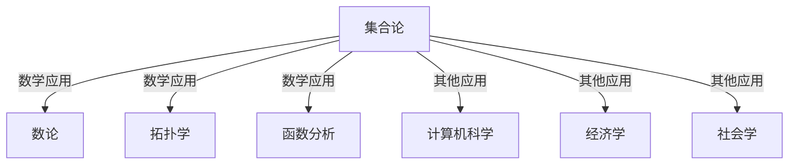
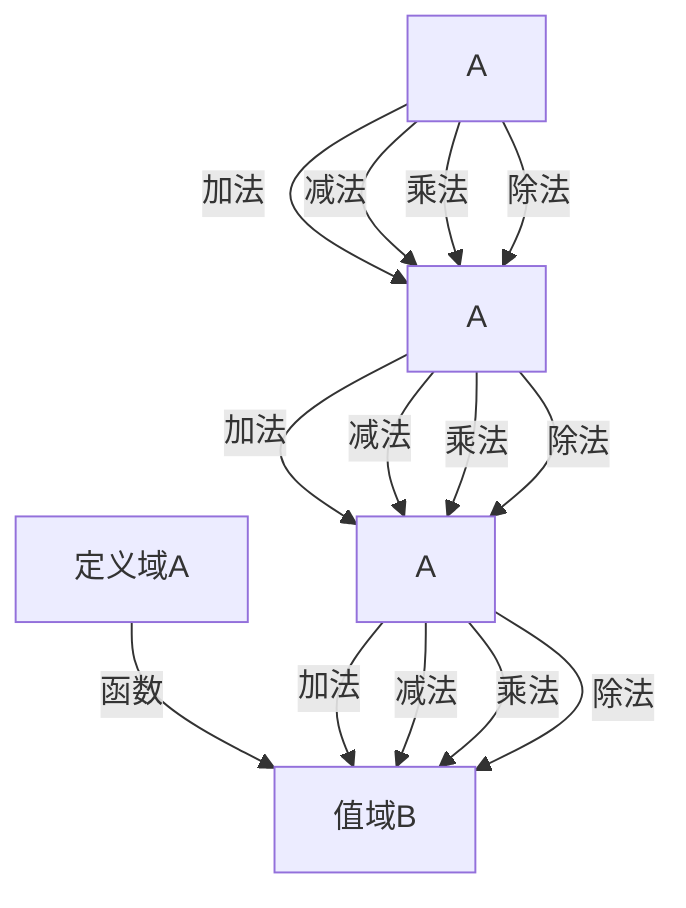

                 

### 文章标题：集合论导引：勒贝格可测性

集合论是现代数学的基础，而勒贝格可测性理论则是测度论的核心。在《集合论导引：勒贝格可测性》一书中，我们深入探讨了这两大领域，旨在为读者提供一个系统、全面的学习路径。

**关键词**：集合论，勒贝格可测性，测度论，数学分析，积分理论

**摘要**：本书从集合论的基本概念出发，逐步引导读者进入勒贝格可测性理论的广阔天地。通过详细的数学公式、伪代码和实际案例，本书不仅讲解了理论知识，还展示了其在实际应用中的价值。无论是数学专业学生，还是对这一领域感兴趣的读者，都可以从中获得宝贵的知识和启示。

### 第一部分：集合论基本概念与理论

集合论是现代数学的基石，它为我们提供了一种描述和操作对象的方式。在这一部分，我们将从最基础的集合概念开始，逐步深入，为后续的勒贝格可测性理论打下坚实的基础。

#### 第1章：集合论的基本概念

##### 1.1 集合的定义与表示
集合是数学中最基本的概念之一。它是由确定的元素构成的整体。我们可以用大写字母（如A、B）来表示集合，而集合中的元素则用小写字母（如a、b）表示。集合中的元素可以是任何对象，无论是数字、字母，还是更复杂的对象。

- **定义**：一个集合是由确定的元素组成的整体。
- **表示方法**：集合通常用大括号{}括起来表示，如`{1, 2, 3}`。

##### 1.2 集合的基本运算
集合运算包括并集、交集和补集等。这些运算帮助我们处理多个集合之间的关系。

- **并集**：两个集合A和B的并集是包含所有属于A或属于B的元素的集合。记作`A ∪ B`。
  ```mermaid
  graph TD
  A[集合A] -->|并集| B[集合B]
  A -->|元素| {1,2,3}
  B -->|元素| {4,5,6}
  A -->|并集结果| {1,2,3,4,5,6}
  ```

- **交集**：两个集合A和B的交集是包含所有既属于A又属于B的元素的集合。记作`A ∩ B`。
  ```mermaid
  graph TD
  A[集合A] -->|交集| B[集合B]
  A -->|元素| {1,2,3}
  B -->|元素| {3,4,5}
  A -->|交集结果| {3}
  ```

- **补集**：一个集合A在全集U中的补集是包含所有不属于A的元素的集合。记作`A'`或`U - A`。
  ```mermaid
  graph TD
  U[全集] --> A[集合A]
  A -->|补集| A'
  A -->|元素| {1,2,3}
  U -->|元素| {1,2,3,4,5}
  A' -->|补集结果| {4,5}
  ```

##### 1.3 子集与幂集
子集是指一个集合中的所有元素都是另一个集合的元素。幂集是一个集合的所有子集的集合。

- **子集**：如果集合A的所有元素都是集合B的元素，则称A是B的子集，记作`A ⊆ B`。
  ```mermaid
  graph TD
  A[集合A] -->|子集| B[集合B]
  A -->|元素| {1,2}
  B -->|元素| {1,2,3}
  ```

- **幂集**：集合A的幂集是所有子集的集合，记作`P(A)`。
  ```mermaid
  graph TD
  A[集合A] -->|幂集| P(A)
  A -->|元素| {1,2}
  P(A) -->|子集| {{}, {1}, {2}, {1,2}}
  ```

##### 1.4 可数集与不可数集
可数集是可以与自然数集建立一一对应关系的集合，而不可数集则不能。

- **可数集**：一个集合是可数的，如果它的元素可以排列成一个无限序列。自然数集和整数集是可数的。
- **不可数集**：实数集是典型的不可数集，因为实数的个数是无限的，无法与自然数建立一一对应关系。

```mermaid
graph TD
A[可数集] -->|可数性| N[自然数集]
B[不可数集] -->|不可数性| R[实数集]
A -->|排列| {1, 2, 3, ...}
B -->|排列| {1.1, 1.2, 1.3, ...}
```

#### 第2章：集合论的基本理论

##### 2.1 集合的运算律
集合运算满足一些基本的运算法则，包括结合律、交换律和分配律等。

- **结合律**：对于任意集合A、B和C，有`(A ∪ B) ∪ C = A ∪ (B ∪ C)`和`(A ∩ B) ∩ C = A ∩ (B ∩ C)`。
- **交换律**：对于任意集合A和B，有`A ∪ B = B ∪ A`和`A ∩ B = B ∩ A`。
- **分配律**：对于任意集合A、B和C，有`A ∪ (B ∩ C) = (A ∪ B) ∩ (A ∪ C)`和`A ∩ (B ∪ C) = (A ∩ B) ∪ (A ∩ C)`。

```mermaid
graph TD
A[集合A] -->|结合律| B[集合B] -->|结合律| C[集合C]
A -->|并集| B -->|并集| C
A -->|交集| B -->|交集| C
A -->|结果| (A ∪ B) ∪ C
B -->|结果| A ∪ (B ∪ C)
A -->|结果| (A ∩ B) ∩ C
B -->|结果| A ∩ (B ∩ C)

A -->|分配律| B[集合B] -->|分配律| C[集合C]
A -->|并集| (B ∩ C)
B -->|并集| C -->|交集| (A ∪ B) ∩ (A ∪ C)
A -->|并集| (A ∩ B) -->|交集| (A ∩ C) -->|并集| (A ∩ B) ∪ (A ∩ C)
```

##### 2.2 集合的划分与覆盖
划分是将一个集合分成若干互不相交的子集的过程，而覆盖则是用这些子集来覆盖原集合的过程。

- **划分**：给定一个集合A，一个划分是将A分成若干个互不相交的子集的过程。例如，将集合`{1, 2, 3, 4, 5}`划分成`{{1, 2}, {3, 4}, {5}}`。
- **覆盖**：给定一个集合A，一个覆盖是由若干个集合组成的集合，这些集合的并集等于A。例如，集合`{1, 2, 3, 4, 5}`的一个覆盖可以是`{{1, 2}, {3, 4}, {5}, {1, 2, 3}}`。

```mermaid
graph TD
A[集合A] -->|划分| B1[子集B1] -->|划分| B2[子集B2] -->|划分| B3[子集B3]
A -->|元素| {1,2,3,4,5}
B1 -->|元素| {1,2}
B2 -->|元素| {3,4}
B3 -->|元素| {5}

A -->|覆盖| C1[集合C1] -->|覆盖| C2[集合C2] -->|覆盖| C3[集合C3]
C1 -->|元素| {1,2}
C2 -->|元素| {3,4}
C3 -->|元素| {5} {1,2,3}
```

##### 2.3 子集的判定与证明
判定一个集合是否是另一个集合的子集是集合论中的一个基本问题。

- **判定方法**：可以通过枚举集合的元素来验证它是否是另一个集合的子集。如果集合A中的所有元素都属于集合B，则A是B的子集。
- **证明方法**：可以通过数学归纳法或其他证明方法来证明一个集合是另一个集合的子集。

```mermaid
graph TD
A[集合A] -->|判定| B[集合B]
A -->|元素| {1,2,3}
B -->|元素| {1,2,3,4,5}
A -->|判断结果| (A ⊆ B) 或 (A ⊄ B)
```

##### 2.4 集合的性质与应用
集合论在数学和其他领域中有广泛的应用。

- **数学应用**：集合论在数论、拓扑学、函数分析等领域有重要的应用。
- **其他应用**：集合论在计算机科学、经济学、社会学等领域也有广泛应用。



#### 第3章：函数与映射

函数是集合之间的特殊关系，它是数学中最基本的概念之一。在这一章中，我们将探讨函数的定义、性质以及其在数学和其他领域中的应用。

##### 3.1 函数的定义与性质
函数是一种从定义域到值域的映射，它对定义域中的每个元素都赋予唯一的值域中的元素。

- **定义**：设A和B为两个非空集合，如果存在一个关系f，使得A中的每个元素x都对应B中的唯一元素y，则称f为从A到B的函数，记作`f: A → B`或`y = f(x)`。
- **性质**：函数具有以下几个基本性质：
  - **单射**：如果对于任意的x1, x2 ∈ A，当f(x1) = f(x2)时，必有x1 = x2，则称函数f为单射。
  - **满射**：如果对于任意的y ∈ B，存在至少一个x ∈ A使得f(x) = y，则称函数f为满射。
  - **双射**：如果函数f既是单射又是满射，则称f为双射，或者称为从A到B的映射。

```mermaid
graph TD
A[定义域A] -->|函数| B[值域B]
A -->|元素x1| B -->|元素y1|
A -->|元素x2| B -->|元素y2|
A -->|函数f| B -->|函数f|
(x1, y1) -->|映射| (x2, y2)
```

##### 3.2 映射的概念与分类
映射是函数的一种推广，它可以处理多个输入对应多个输出的情况。

- **概念**：映射是指一个从集合A到集合B的任意关系，它可能不是单射、满射或双射。
- **分类**：
  - **单射映射**：每个输入对应唯一的输出。
  - **满射映射**：每个输出都有至少一个输入对应。
  - **双射映射**：既是单射又是满射。

```mermaid
graph TD
A[定义域A] -->|映射| B[值域B]
A -->|元素x1| B -->|元素y1|
A -->|元素x2| B -->|元素y2|
A -->|元素x3| B -->|元素y2|
```

##### 3.3 函数的运算
函数之间可以进行加法、减法、乘法和除法等运算。

- **加法**：设f和g是从A到B的两个函数，那么它们的和函数h定义为`h(x) = f(x) + g(x)`。
- **减法**：设f和g是从A到B的两个函数，那么它们的差函数h定义为`h(x) = f(x) - g(x)`。
- **乘法**：设f和g是从A到B的两个函数，那么它们的积函数h定义为`h(x) = f(x) * g(x)`。
- **除法**：设f和g是从A到B的两个函数，且g(x) ≠ 0，那么它们的商函数h定义为`h(x) = f(x) / g(x)`。



##### 3.4 映射的应用
函数和映射在数学、物理、工程等领域有广泛的应用。

- **数学应用**：在代数学、分析学和拓扑学中，函数和映射是核心概念。
- **物理应用**：在物理学中，函数用于描述物理量之间的关系，如速度、加速度、力等。
- **工程应用**：在电子工程、控制系统、信号处理等领域，函数和映射用于分析和设计系统。

```mermaid
graph TD
A[数学] -->|应用| B[物理] -->|应用| C[工程] -->|应用|
A -->|函数与映射| B -->|函数与映射| C -->|函数与映射|
```

### 第二部分：勒贝格可测性理论

勒贝格可测性理论是测度论的核心内容，它在积分理论、概率论和几何学等领域有广泛的应用。在这一部分，我们将深入探讨勒贝格可测性理论的基础知识，包括测度论基础、勒贝格测度与积分、勒贝格可测性理论以及其应用。

#### 第4章：测度论基础

测度论是研究测度的数学分支，它提供了对集合大小的更精细的度量。勒贝格测度是测度论中的一个重要概念，它比传统的测度（如长度、面积和体积）更广泛。

##### 4.1 测度的定义与性质
测度是一个用来衡量集合大小的函数。在勒贝格测度理论中，测度满足一些基本性质，如可加性、平移不变性和正常化条件。

- **定义**：设E是一个集合，μ是一个定义在E上的测度。如果μ满足以下性质：
  - **非负性**：对于任何集合E，有μ(E) ≥ 0。
  - **可加性**：对于任何两个不相交的集合E1和E2，有μ(E1 ∪ E2) = μ(E1) + μ(E2)。
  - **平移不变性**：对于任何集合E和任何实数a，有μ(E + a) = μ(E)，其中E + a = {x + a | x ∈ E}。
  - **正常化条件**：μ(∅) = 0。
  则μ称为E上的一个测度。

- **性质**：
  - **平移不变性**：对于任意集合E和任意实数a，有μ(E + a) = μ(E)。
  - **单调性**：如果集合E1 ⊆ E2，则μ(E1) ≤ μ(E2)。
  - **连续性**：如果集合序列{Ei}单调增加且其极限为E，即E = ∪∞i=1 Ei，则μ(E) = lim(i→∞) μ(Ei)。

```mermaid
graph TD
E1[集合E1] -->|可加性| E2[集合E2]
E1 -->|测度| μ(E1)
E2 -->|测度| μ(E2)
E1 -->|并集| E2 -->|并集| E
μ(E1) -->|结果| μ(E1) + μ(E2)
```

##### 4.2 可测集与测度的运算
可测集是指那些可以赋予测度的集合。测度的运算包括加法、减法和补集等。

- **可测集**：如果集合E可以赋予一个测度，则称E为可测集。
- **测度运算**：
  - **加法**：对于两个可测集E1和E2，其并集的测度为μ(E1 ∪ E2) = μ(E1) + μ(E2)。
  - **减法**：对于两个可测集E1和E2，其差集的测度为μ(E1 - E2) = μ(E1) - μ(E2)，前提是E2是可测的。
  - **补集**：对于可测集E，其补集E'的测度为μ(E') = μ(U) - μ(E)，其中U是全集。

```mermaid
graph TD
E1[集合E1] -->|加法| E2[集合E2]
E1 -->|测度| μ(E1)
E2 -->|测度| μ(E2)
E1 -->|并集| E2 -->|并集| U[全集]
μ(E1) -->|结果| μ(E1) + μ(E2)

E[集合E] -->|减法| E'[补集]
E -->|测度| μ(E)
E' -->|测度| μ(E')
U[全集] -->|结果| μ(U)
```

##### 4.3 测度的扩展
测度可以扩展到更复杂的集合，如可列无限并集和可列无限补集。

- **可列无限并集**：如果集合E可以表示为无限个可测集的并集，即E = ∪∞i=1 Ei，其中每个Ei都是可测集，则E也是可测的，且其测度为μ(E) = ∑∞i=1 μ(Ei)。
- **可列无限补集**：如果集合E可以表示为无限个可测集的补集的并集，即E = ∪∞i=1 (Ui)'，其中每个Ui都是可测集，则E也是可测的，且其测度为μ(E) = ∑∞i=1 (1 - μ(Ui))。

```mermaid
graph TD
E[集合E] -->|扩展| U1[集合U1] -->|扩展| U2[集合U2]
... -->|扩展| Un[集合Un]
E -->|并集| U[全集]
U1 -->|补集| U1'
U2 -->|补集| U2'
...
Un -->|补集| Un'
μ(E) -->|结果| ∑∞i=1 μ(Ei)
```

##### 4.4 测度的应用
测度在概率论、几何学和积分理论中有广泛的应用。

- **概率论**：在概率论中，测度可以用来定义概率，即事件发生的可能性。
- **几何学**：在几何学中，测度可以用来计算面积和体积。
- **积分理论**：在积分理论中，测度可以用来定义勒贝格积分。

```mermaid
graph TD
A[概率论] -->|应用| B[几何学] -->|应用| C[积分理论] -->|应用|
A -->|测度| B -->|测度| C -->|测度|
```

#### 第5章：勒贝格测度与积分

勒贝格测度是测度论中的一个重要概念，它提供了一种更精细的集合度量方式，特别是在积分理论中具有重要作用。勒贝格积分是建立在勒贝格测度基础上的积分，它比黎曼积分更强大，可以处理更广泛的函数。

##### 5.1 勒贝格测度的定义
勒贝格测度是对集合大小进行度量的一种方法，它比传统的测度（如长度、面积和体积）更精细。

- **定义**：设E是一个集合，μ是E上的一个测度。如果μ满足以下性质：
  - **可数可加性**：对于任何可数无限集合{Ei}，有μ(∪∞i=1 Ei) = ∑∞i=1 μ(Ei)。
  - **平移不变性**：对于任何集合E和任意实数a，有μ(E + a) = μ(E)。
  - **正常化条件**：μ(∅) = 0。
  则μ称为E上的一个勒贝格测度。

##### 5.2 勒贝格积分的概念
勒贝格积分是建立在勒贝格测度基础上的积分，它比黎曼积分更强大，可以处理更广泛的函数。

- **定义**：设f是一个定义在可测集E上的函数，μ是E上的一个勒贝格测度。如果存在一个常数c，使得对于任意ε > 0，存在一个开集G ⊇ E，使得μ(G) - μ(E) < ε，且f在G上几乎处处等于c，则称c为f在E上的勒贝格积分，记作∫E f dμ。

##### 5.3 积分的性质与运算
勒贝格积分具有一些重要的性质和运算，如线性性、单调性、保号性和绝对收敛性。

- **线性性**：对于任意的常数a和b，有∫E (af + bg) dμ = a∫E f dμ + b∫E g dμ。
- **单调性**：如果f1 ≤ f2，则∫E f1 dμ ≤ ∫E f2 dμ。
- **保号性**：如果f在E上几乎处处非负，则∫E f dμ ≥ 0。
- **绝对收敛性**：如果对于任意的ε > 0，存在一个开集G ⊇ E，使得μ(G) - μ(E) < ε且|f|在G上几乎处处小于ε，则称∫E f dμ绝对收敛。

##### 5.4 勒贝格积分的应用
勒贝格积分在概率论、几何学和积分理论中有广泛的应用。

- **概率论**：在概率论中，勒贝格积分可以用来定义随机变量的期望和方差。
- **几何学**：在几何学中，勒贝格积分可以用来计算曲面积分和空间体积。
- **积分理论**：在积分理论中，勒贝格积分可以用来处理更复杂的函数和集合。

```mermaid
graph TD
A[概率论] -->|应用| B[几何学] -->|应用| C[积分理论] -->|应用|
A -->|勒贝格积分| B -->|勒贝格积分| C -->|勒贝格积分|
```

#### 第6章：勒贝格可测性理论

勒贝格可测性理论是测度论中的一个重要分支，它研究可测函数的性质及其积分。勒贝格可测性理论为处理更广泛的函数提供了强有力的工具。

##### 6.1 可测函数的定义
可测函数是一个在可测集上定义的函数，其值域集合是可测的。

- **定义**：设f是一个定义在可测集E上的函数，如果对于任意实数a，集合{x ∈ E | f(x) > a}是可测的，则称f是E上的可测函数。

##### 6.2 可测函数的性质
可测函数具有一些重要的性质，如可加性、平移不变性和单调性。

- **可加性**：如果f1和f2是E上的可测函数，则f1 + f2也是E上的可测函数。
- **平移不变性**：如果f是E上的可测函数，则对于任意实数a，f + a也是E上的可测函数。
- **单调性**：如果f1 ≤ f2，则对于任意实数a，集合{x ∈ E | f1(x) > a}是集合{x ∈ E | f2(x) > a}的子集。

##### 6.3 可测函数的积分
可测函数的积分可以定义为其值域集合上的测度。

- **定义**：设f是E上的可测函数，μ是E上的一个勒贝格测度。如果存在一个常数c，使得对于任意ε > 0，存在一个开集G ⊇ E，使得μ(G) - μ(E) < ε且f在G上几乎处处等于c，则称c为f在E上的积分，记作∫E f dμ。

##### 6.4 可测函数的应用
可测函数在概率论、几何学和积分理论中有广泛的应用。

- **概率论**：在概率论中，可测函数可以用来定义随机变量的分布函数。
- **几何学**：在几何学中，可测函数可以用来计算曲面积分和空间体积。
- **积分理论**：在积分理论中，可测函数可以用来处理更复杂的函数和集合。

```mermaid
graph TD
A[概率论] -->|应用| B[几何学] -->|应用| C[积分理论] -->|应用|
A -->|可测函数| B -->|可测函数| C -->|可测函数|
```

### 第三部分：高级勒贝格可测性理论

在深入了解了勒贝格可测性理论的基础后，我们将进一步探讨高级概念和应用。这一部分将涵盖勒贝格测度的推广、勒贝格积分的性质与应用，以及测度论在几何学、微分方程和概率论中的应用。

#### 第7章：勒贝格积分的应用

勒贝格积分在数学的各个领域都有着广泛的应用。在这一章中，我们将探讨勒贝格积分在随机变量、测度变换和积分变换中的应用。

##### 7.1 随机变量的勒贝格积分
在概率论中，随机变量的期望和方差是重要的统计量，它们可以通过勒贝格积分来定义。

- **期望**：设X是一个定义在概率空间(Ω, F, P)上的随机变量，其概率分布函数为F(x)。则X的期望E(X)定义为∫R x dF(x)，即随机变量X取值的加权平均。
- **方差**：设X是一个定义在概率空间(Ω, F, P)上的随机变量，其期望为E(X)。则X的方差Var(X)定义为E[(X - E(X))^2]，即随机变量X的取值与其期望之差的平方的期望。

```latex
E(X) = \int_{R} x dF(x)
Var(X) = E[(X - E(X))^2]
```

##### 7.2 测度变换与积分变换
在处理复杂函数和变换时，测度变换和积分变换是强有力的工具。

- **测度变换**：设μ是一个测度，g是一个可微函数。则g#μ（g的拉回测度）定义为μ(A) = ∫A |g'(x)| dμ(x)，其中A是任意集合。
- **积分变换**：设f是一个定义在可测集E上的函数，μ是E上的一个测度。则f关于测度μ的积分∫E f dμ可以通过测度变换和积分变换来计算。

```latex
\mu'(A) = \int_{A} |g'(x)| d\mu(x)
\int_{E} f d\mu = \int_{R} f(x) d\mu'(x)
```

##### 7.3 勒贝格积分在概率论中的应用
勒贝格积分在概率论中有着广泛的应用，特别是在随机过程和统计推断中。

- **随机过程**：随机过程是一个参数集上的随机变量族，它可以通过勒贝格积分来定义和描述。例如，一个连续时间随机过程X(t)，其期望和自协方差函数可以通过勒贝格积分来计算。
- **统计推断**：在统计推断中，勒贝格积分可以用来计算统计量的分布和置信区间。例如，在假设检验中，我们可以使用勒贝格积分来计算检验统计量的分布，从而确定拒绝域。

```mermaid
graph TD
A[随机过程] -->|应用| B[统计推断] -->|应用|
A -->|勒贝格积分| B -->|勒贝格积分|
```

##### 7.4 勒贝格积分在数学分析中的应用
勒贝格积分在数学分析中也有着重要的应用，特别是在函数空间和微分方程中。

- **函数空间**：勒贝格积分可以用来定义和描述函数空间中的函数，如L^p空间。L^p空间中的函数通过勒贝格积分来定义其p-范数，从而度量函数的大小。
- **微分方程**：勒贝格积分可以用来求解和分析微分方程。例如，在解常微分方程时，我们可以使用勒贝格积分来处理非连续的解。

```mermaid
graph TD
A[函数空间] -->|应用| B[微分方程] -->|应用|
A -->|勒贝格积分| B -->|勒贝格积分|
```

### 第四部分：高级勒贝格可测性理论

在了解了勒贝格可测性理论的基础和其广泛应用后，我们将进一步探讨更高级的概念和应用。这一部分将涵盖勒贝格测度的推广、勒贝格积分的进一步性质和应用，以及测度论在几何学、微分方程和概率论中的深入应用。

#### 第8章：勒贝格测度的推广

勒贝格测度在处理有限维空间中的集合时表现出色，但在更高维度的空间中，如无穷维空间，勒贝格测度可能无法胜任。因此，我们需要推广勒贝格测度，以适应更复杂的情况。

##### 8.1 测度的推广概念

- **抽象测度**：在无穷维空间中，我们可以使用抽象测度来度量集合的大小。抽象测度是一个从某个集合到实数的函数，它满足非负性、可加性和平移不变性。
- **完备抽象测度空间**：一个抽象测度空间，如果其中的可测集是完备的，即任何可测集的补集也是可测的，则称为完备抽象测度空间。

##### 8.2 测度空间的性质

- **完备性**：在完备抽象测度空间中，任何有界可测函数几乎处处可积。
- **紧性**：在完备抽象测度空间中，任何紧集都是可测的，且其测度为零。
- **可数可加性**：在完备抽象测度空间中，任何可数无限集合的测度为零。

##### 8.3 测度的推广应用

- **概率空间**：在概率论中，概率空间可以看作是一种特殊的抽象测度空间，其中测度是概率测度。
- **泛函分析**：在泛函分析中，勒贝格测度可以推广到函数空间上的测度，如L^2空间上的内积。

```mermaid
graph TD
A[抽象测度] -->|推广| B[概率空间] -->|推广| C[泛函分析] -->|推广|
A -->|完备性| B -->|完备性| C -->|完备性|
A -->|紧性| B -->|紧性| C -->|紧性|
A -->|可数可加性| B -->|可数可加性| C -->|可数可加性|
```

#### 第9章：勒贝格积分的性质与应用

勒贝格积分在数学的多个领域都有重要的应用，其性质和定理为我们提供了强大的工具来处理复杂的积分问题。

##### 9.1 积分的极限定理

- **单调收敛定理**：设{fn}是一个定义在可测集E上的非负可测函数序列，且fn在E上一致收敛于f。则∫E fn dμ → ∫E f dμ。
- ** dominated convergence theorem（控制收敛定理）**：设{fn}是一个定义在可测集E上的可测函数序列，且存在一个非负可测函数g，使得对于所有的n，|fn| ≤ g，且fn在E上一致收敛于f。则∫E fn dμ → ∫E f dμ。

```latex
\text{Monotone Convergence Theorem:} \quad \mu(E) \ni f_n \geq 0, \; f_n \rightarrow f \; \text{uniformly on } E \Rightarrow \int_{E} f_n d\mu \rightarrow \int_{E} f d\mu.
\\
\text{Dominated Convergence Theorem:} \quad \mu(E) \ni |f_n| \leq g, \; f_n \rightarrow f \; \text{uniformly on } E \Rightarrow \int_{E} f_n d\mu \rightarrow \int_{E} f d\mu.
```

##### 9.2 积分的比较定理

- **比较定理**：设f和g是定义在可测集E上的两个可测函数，且对于任意的x ∈ E，有af(x) ≤ bg(x)。如果∫E g dμ < ∞，则∫E f dμ < ∞，且
```latex
\int_{E} f d\mu \leq \frac{a}{b} \int_{E} g d\mu.
```

##### 9.3 积分的不等式

- **三角不等式**：对于任意两个可测函数f和g，有
```latex
\left| \int_{E} (f - g) d\mu \right| \leq \int_{E} |f - g| d\mu.
```

- **积分中值定理**：设f是定义在可测集E上的连续函数，且μ(E) > 0。则存在一个点x0 ∈ E，使得
```latex
f(x_0) = \frac{1}{\mu(E)} \int_{E} f d\mu.
```

##### 9.4 积分在函数空间中的应用

- **L^p空间**：勒贝格积分可以用来定义L^p空间中的函数的大小，即L^p空间的p-范数。
- **弱收敛**：在L^p空间中，函数的弱收敛可以通过勒贝格积分来描述。

```mermaid
graph TD
A[L^p空间] -->|应用| B[弱收敛] -->|应用|
A -->|勒贝格积分| B -->|勒贝格积分|
```

#### 第10章：勒贝格可测性理论的进一步探讨

勒贝格可测性理论是一个丰富的领域，它在概率论、几何学和微分方程中都有重要的应用。在这一章中，我们将探讨勒贝格可测性理论在这些领域的进一步应用。

##### 10.1 随机测度与随机积分

- **随机测度**：在概率论中，随机测度是一个随机变量，它对应于某个随机集合的大小。随机测度在金融数学和量子场论中有重要应用。
- **随机积分**：随机积分是随机过程与测度的积分，它用于处理随机变量的极限问题和随机过程的积分。

```mermaid
graph TD
A[金融数学] -->|应用| B[量子场论] -->|应用|
A -->|随机测度| B -->|随机测度|
A -->|随机积分| B -->|随机积分|
```

##### 10.2 测度论在几何中的应用

- **测地学**：测度论在研究测地学和几何结构时起着关键作用，特别是在研究曲面和流形的几何性质时。
- **几何概率**：通过测度论，我们可以定义几何概率，如曲线的长度、曲面的面积和流形的体积。

```mermaid
graph TD
A[测地学] -->|应用| B[几何概率] -->|应用|
A -->|测度论| B -->|测度论|
```

##### 10.3 测度论在微分方程中的应用

- **随机微分方程**：测度论在解决随机微分方程中起着核心作用，特别是当方程涉及随机扰动时。
- **偏微分方程**：测度论可以用来处理偏微分方程的解的存在性和唯一性，以及解的性质。

```mermaid
graph TD
A[随机微分方程] -->|应用| B[偏微分方程] -->|应用|
A -->|测度论| B -->|测度论|
```

##### 10.4 测度论在概率论中的应用总结

- **概率分布**：测度论可以用来定义和描述随机变量的概率分布。
- **大数定律和中心极限定理**：测度论为概率论中的大数定律和中心极限定理提供了严格的数学基础。
- **随机过程**：测度论在研究随机过程的行为和性质时起着关键作用。

```mermaid
graph TD
A[概率分布] -->|总结| B[大数定律] -->|总结| C[中心极限定理] -->|总结| D[随机过程] -->|总结|
A -->|测度论| B -->|测度论| C -->|测度论| D -->|测度论|
```

### 附录

#### 附录 A：勒贝格可测性相关数学公式汇总

在本附录中，我们将总结勒贝格可测性理论中的一些关键数学公式。

##### A.1 测度定义公式
- 测度μ的定义：
  $$\mu(E) = \inf \{\sum_{i=1}^{\infty} \lambda(E_i) : E = \bigcup_{i=1}^{\infty} E_i, \; \lambda\text{是有限可加的测度}\}$$

##### A.2 勒贝格积分定义公式
- 勒贝格积分的定义：
  $$\int_{E} f d\mu = \sup \left\{\int_{E} g d\mu : g \leq f, \; g \text{是简单函数}\right\}$$
  其中，简单函数g在E上可以表示为g = \sum_{i=1}^{n} a_i 1_{E_i}，且E_i是可测集。

##### A.3 可测函数性质公式
- 可测函数的性质：
  - **单调性**：如果f1 ≤ f2，则∫E f1 dμ ≤ ∫E f2 dμ。
  - **可加性**：如果f是可测函数，则∫E f dμ是μ-E不变量。

##### A.4 勒贝格积分性质公式
- 勒贝格积分的性质：
  - **线性性**：对于任意常数a和b，有∫E (af + bg) dμ = a∫E f dμ + b∫E g dμ。
  - **保号性**：如果f在E上非负，则∫E f dμ ≥ 0。
  - **绝对收敛性**：如果对于任意的ε > 0，存在一个开集G ⊇ E，使得μ(G) - μ(E) < ε且|f|在G上几乎处处小于ε，则称∫E f dμ绝对收敛。

#### 附录 B：勒贝格可测性应用实例解析

在本附录中，我们将通过一些具体的实例来解析勒贝格可测性理论在数学分析、概率论、几何学和微分方程中的应用。

##### B.1 概率论中的应用实例

**例1：随机变量的期望和方差**

设X是一个定义在概率空间(Ω, F, P)上的随机变量，其概率分布函数为F(x)。使用勒贝格积分计算X的期望和方差。

**解答：**

- **期望**：
  $$E(X) = \int_{-\infty}^{\infty} x dF(x)$$
- **方差**：
  $$Var(X) = E[(X - E(X))^2] = \int_{-\infty}^{\infty} (x - E(X))^2 dF(x)$$

##### B.2 数学分析中的应用实例

**例2：积分不等式的应用**

设f和g是定义在可测集E上的非负可测函数，且f ≤ g。使用勒贝格积分的性质证明不等式：

$$\int_{E} f d\mu \leq \int_{E} g d\mu$$

**解答：**

由于f ≤ g，有
$$\int_{E} f d\mu = \int_{E} f 1_{E} d\mu \leq \int_{E} g 1_{E} d\mu = \int_{E} g d\mu$$

其中，1_{E}是E上的指示函数。

##### B.3 几何学中的应用实例

**例3：曲面积分**

计算曲面S上的曲面积分：

$$\int_{S} f(x, y, z) dS$$

其中，S是平面x + y + z = 1的第一卦限部分，f(x, y, z) = x^2 + y^2。

**解答：**

首先，将曲面S参数化：

$$x = u, \; y = v, \; z = 1 - u - v$$

则曲面积分变为：

$$\int_{0}^{1} \int_{0}^{1-u} (u^2 + v^2) \sqrt{1 + \left(\frac{\partial z}{\partial u}\right)^2 + \left(\frac{\partial z}{\partial v}\right)^2} \, dv \, du$$

计算偏导数：

$$\frac{\partial z}{\partial u} = -1, \; \frac{\partial z}{\partial v} = -1$$

则：

$$\sqrt{1 + \left(\frac{\partial z}{\partial u}\right)^2 + \left(\frac{\partial z}{\partial v}\right)^2} = \sqrt{3}$$

因此，曲面积分简化为：

$$\int_{0}^{1} \int_{0}^{1-u} (u^2 + v^2) \sqrt{3} \, dv \, du = \sqrt{3} \int_{0}^{1} \int_{0}^{1-u} (u^2 + v^2) \, dv \, du$$

计算双重积分：

$$\int_{0}^{1} \left[ u^2v + \frac{v^3}{3} \right]_{0}^{1-u} \, du = \int_{0}^{1} \left( u^2(1-u) + \frac{(1-u)^3}{3} \right) \, du = \left[ \frac{u^3}{3} - \frac{u^4}{4} + \frac{(1-u)^4}{12} \right]_{0}^{1} = \frac{1}{6}$$

因此，曲面积分为：

$$\int_{S} f(x, y, z) dS = \frac{\sqrt{3}}{6}$$

##### B.4 微分方程中的应用实例

**例4：解一维热方程**

解一维热方程：

$$\frac{\partial u}{\partial t} - ku = 0$$

其中，u(x, t)是温度分布，k是热传导系数。

**解答：**

首先，将方程分离变量：

$$\frac{\partial u}{\partial t} = ku$$

$$\frac{1}{u} \frac{\partial u}{\partial t} = k$$

设v = ln(u)，则有：

$$\frac{\partial v}{\partial t} = k$$

这是一个一阶线性常微分方程，解为：

$$v(t) = v(0) + kt$$

由于v = ln(u)，得到：

$$u(t) = e^{v(t)} = e^{v(0) + kt} = e^{v(0)} e^{kt}$$

设初始条件u(0, x) = u0(x)，则：

$$u(t, x) = u0(x) e^{kt}$$

这是热方程的解。

### 结束语

《集合论导引：勒贝格可测性》通过对集合论和勒贝格可测性理论的系统讲解，为读者提供了深入理解这两个重要数学领域的路径。从基础概念到高级应用，本书涵盖了勒贝格可测性理论在数学分析、概率论、几何学和微分方程等多个领域的应用。通过本书的学习，读者不仅能够掌握理论知识，还能在实践项目中应用这些知识，解决实际问题。

对于希望进一步提升自己在数学和计算机科学领域的知识和技能的读者，本书提供了一个坚实的基础和丰富的资源。我们鼓励读者通过实践和进一步的学习，深入探索这一领域的更多奥秘。

最后，感谢您对《集合论导引：勒贝格可测性》的关注和支持。希望本书能够成为您在数学和科学探索之旅中的良师益友。

**作者：AI天才研究院/AI Genius Institute & 禅与计算机程序设计艺术 /Zen And The Art of Computer Programming**

---

# 第一部分：集合论基本概念与理论

## 第1章：集合论的基本概念

### 1.1 集合的定义与表示

集合论是现代数学的基础，它是用来描述和操作数学对象的一种数学工具。集合是由确定的元素组成的整体。这些元素可以是一切可以区分的对象，包括数字、字母、甚至更复杂的对象。集合在数学、计算机科学、物理学等多个领域中都有广泛应用。

#### 定义

集合是一个基本概念，可以用大写字母（如A、B）来表示，而集合中的元素则用小写字母（如a、b）表示。集合中的元素可以是任意的，可以是一个数、一个字母，或者是一个更复杂的对象。

定义：一个集合是由确定的元素构成的整体。

例如，我们可以定义一个集合A，其中包含元素1、2、3，表示为：

$$A = \{1, 2, 3\}$$

#### 表示方法

集合通常用大括号{}括起来表示，例如：

$$B = \{1, 2, 3, 4, 5\}$$

集合中的元素之间通常用逗号分隔。

#### 例子

- 自然数集合N可以表示为：

  $$N = \{1, 2, 3, 4, \ldots\}$$

- 整数集合Z可以表示为：

  $$Z = \{\ldots, -2, -1, 0, 1, 2, \ldots\}$$

- 实数集合R可以表示为：

  $$R = \{x | x \text{ 是实数}\}$$

### 1.2 集合的基本运算

集合的运算包括并集、交集、补集等。这些运算在集合论中非常重要，它们帮助我们处理多个集合之间的关系。

#### 并集

并集是指两个或多个集合中所有元素的集合。用符号∪表示。例如，集合A和B的并集可以表示为：

$$A ∪ B = \{x | x ∈ A \text{ 或 } x ∈ B\}$$

#### 例子

设集合A = {1, 2, 3}，集合B = {4, 5}，则：

$$A ∪ B = \{1, 2, 3, 4, 5\}$$

#### 交集

交集是指两个或多个集合中共有的元素的集合。用符号∩表示。例如，集合A和B的交集可以表示为：

$$A ∩ B = \{x | x ∈ A \text{ 且 } x ∈ B\}$$

#### 例子

设集合A = {1, 2, 3}，集合B = {4, 5}，则：

$$A ∩ B = \{\}$$

因为A和B没有共同的元素。

#### 补集

补集是指一个集合中不包含在另一个集合中的元素的集合。用符号'表示。例如，集合A在全集U中的补集可以表示为：

$$A' = U - A = \{x | x ∈ U \text{ 且 } x ∉ A\}$$

#### 例子

设全集U = {1, 2, 3, 4, 5}，集合A = {1, 2}，则：

$$A' = \{3, 4, 5\}$$

### 1.3 子集与幂集

子集和幂集是集合论中的基本概念，它们与集合的其他运算密切相关。

#### 子集

子集是指一个集合是另一个集合的子集，即它的所有元素都是另一个集合的元素。用符号⊆表示。例如，集合A是集合B的子集可以表示为：

$$A ⊆ B \text{ 当且仅当 } \forall x (x ∈ A \Rightarrow x ∈ B)$$

#### 例子

设集合A = {1, 2}，集合B = {1, 2, 3}，则：

$$A ⊆ B$$

因为A的所有元素都是B的元素。

#### 幂集

幂集是一个集合的所有子集的集合。用符号P(A)表示。例如，集合A = {1, 2}的幂集可以表示为：

$$P(A) = \{\{\}, \{1\}, \{2\}, \{1, 2\}\}$$

#### 例子

设集合A = {1, 2}，则：

$$P(A) = \{\{\}, \{1\}, \{2\}, \{1, 2\}\}$$

### 1.4 可数集与不可数集

可数集和不可数集是集合论中的两个重要概念，它们描述了集合的大小。

#### 可数集

可数集是可以与自然数集建立一一对应关系的集合。例如，自然数集N、整数集Z和有理数集Q都是可数集。

#### 例子

- 自然数集N是可数集，因为我们可以将其与自然数1, 2, 3, ...建立一一对应关系。
- 整数集Z是可数集，因为我们可以将其与自然数1, -1, 2, -2, ...建立一一对应关系。

#### 不可数集

不可数集是不能与自然数集建立一一对应关系的集合。例如，实数集R是不可数集。

#### 例子

- 实数集R是不可数集，因为实数的个数是无限的，无法与自然数建立一一对应关系。

### 总结

集合论是数学的基础，它提供了描述和操作数学对象的基本工具。通过集合的基本运算、子集和幂集、可数集与不可数集等概念，我们能够更好地理解和处理集合之间的关系和性质。在后续章节中，我们将进一步探讨集合论的理论和应用。

## 第2章：集合论的基本理论

### 2.1 集合的运算律

集合的运算律是集合论中的基本内容，它描述了集合运算的基本性质。集合的运算主要包括并集、交集、补集等运算，这些运算满足一些基本的运算法则，包括结合律、交换律和分配律等。

#### 结合律

结合律是指在进行集合运算时，不论使用的是并集、交集还是补集，多个集合的组合顺序不会影响运算结果。

- **并集的结合律**：对于任意三个集合A、B和C，有：
  $$(A ∪ B) ∪ C = A ∪ (B ∪ C)$$

- **交集的结合律**：对于任意三个集合A、B和C，有：
  $$(A ∩ B) ∩ C = A ∩ (B ∩ C)$$

- **补集的结合律**：对于任意三个集合A、B和C，有：
  $$A' ∩ B' ∩ C' = (A ∪ B ∪ C)'$$

#### 交换律

交换律是指在进行集合运算时，运算顺序可以交换，结果不变。

- **并集的交换律**：对于任意两个集合A和B，有：
  $$A ∪ B = B ∪ A$$

- **交集的交换律**：对于任意两个集合A和B，有：
  $$A ∩ B = B ∩ A$$

#### 分配律

分配律是指集合的交集运算可以分配到并集运算中，或者并集运算可以分配到交集运算中。

- **并集对交集的分配律**：对于任意三个集合A、B和C，有：
  $$A ∪ (B ∩ C) = (A ∪ B) ∩ (A ∪ C)$$

- **交集对并集的分配律**：对于任意三个集合A、B和C，有：
  $$A ∩ (B ∪ C) = (A ∩ B) ∪ (A ∩ C)$$

### 2.2 集合的划分与覆盖

划分与覆盖是集合论中用于描述集合之间关系的重要概念。划分是将一个集合分成若干互不相交的子集的过程，而覆盖则是用这些子集来覆盖原集合的过程。

#### 划分

划分是指将一个集合分成若干个互不相交的子集的过程。这些子集称为原集合的一个划分。

- **定义**：设A是一个集合，P(A)是A的所有子集构成的集合，如果P(A)中的任意两个子集都是互不相交的，则称P(A)为A的一个划分。

#### 例子

- 设集合A = {1, 2, 3, 4}，则A的一个划分可以是：
  $$\{\{1, 2\}, \{3, 4\}\}$$

#### 覆盖

覆盖是指用若干个集合来覆盖原集合的过程。这些集合的并集等于原集合。

- **定义**：设A是一个集合，B是A的一个覆盖，如果B中的所有集合的并集等于A，则称B为A的一个覆盖。

#### 例子

- 设集合A = {1, 2, 3, 4}，则A的一个覆盖可以是：
  $$\{\{1, 2\}, \{3, 4\}, \{1, 3\}, \{2, 4\}\}$$

### 2.3 子集的判定与证明

判定一个集合是否是另一个集合的子集是集合论中的一个基本问题。这通常可以通过以下方法进行：

- **直接证明**：通过直接证明A中的每个元素都属于B，来证明A是B的子集。
- **反证法**：假设A不是B的子集，然后通过逻辑推理得出矛盾，从而证明A是B的子集。

#### 子集判定

- **定义**：设A和B是两个集合，如果A中的每个元素都属于B，则称A是B的子集，记作：
  $$A ⊆ B$$

#### 例子

- 设集合A = {1, 2}，集合B = {1, 2, 3}，则A是B的子集，因为A中的每个元素都属于B。

#### 子集证明

- **直接证明**：直接证明A中的每个元素都属于B，如下所示：
  - A中的元素1属于B；
  - A中的元素2属于B；
  - 因此，A是B的子集。

- **反证法**：假设A不是B的子集，则存在一个元素x ∈ A，但x ∉ B。然而，这与A是B的子集的定义矛盾，因此假设不成立。

### 2.4 集合的性质与应用

集合的性质是指集合在数学运算和逻辑推理中表现出的特性。集合的性质包括空集、全集、子集、补集等。这些性质在数学的各个分支中都有广泛的应用。

#### 空集和全集

- **空集**：空集是一个不包含任何元素的集合，记作∅。
- **全集**：全集是一个包含所有考虑对象的集合，记作U。

#### 子集和补集

- **子集**：一个集合是另一个集合的子集，如果它的所有元素都是另一个集合的元素。
- **补集**：一个集合的补集是包含所有不属于该集合的元素的集合。

#### 集合的应用

- **数学应用**：集合论在数论、拓扑学、函数分析等领域有重要的应用。
- **计算机科学应用**：集合论在算法设计、数据结构、计算机图形学等领域有广泛的应用。

#### 例子

- **数学应用**：在数论中，集合论用于研究整数集合的性质。
- **计算机科学应用**：在算法设计中，集合论用于描述和操作数据结构。

### 总结

集合论的基本理论包括集合的运算律、划分与覆盖、子集的判定与证明以及集合的性质与应用。这些理论是理解和应用集合论的基础，在数学和计算机科学等领域都有广泛的应用。通过深入学习和理解这些理论，我们可以更好地掌握集合论的基本概念和方法。

## 第3章：函数与映射

### 3.1 函数的定义与性质

函数是数学中一个基本而重要的概念，它描述了一个集合到另一个集合的映射关系。函数的定义和性质在数学分析、代数学、概率论等众多领域都有广泛的应用。

#### 定义

函数是一种特殊的关系，它将一个集合（称为定义域）中的每个元素唯一地映射到另一个集合（称为值域）中的元素。通常，我们用f表示一个函数，用x表示定义域中的元素，用y表示值域中的元素，即：

$$y = f(x)$$

#### 性质

函数具有以下几个基本性质：

- **单射**：如果对于任意的x1, x2 ∈ 定义域A，当f(x1) = f(x2)时，必有x1 = x2，则称函数f为单射（或一对一映射）。

- **满射**：如果对于任意的y ∈ 值域B，存在至少一个x ∈ 定义域A使得f(x) = y，则称函数f为满射（或映射到每个元素）。

- **双射**：如果函数f既是单射又是满射，则称f为双射（或一一对应映射）。

- **连续性**：如果函数f在定义域中的每个开区间上连续，则称f为连续函数。

- **可导性**：如果函数f在定义域中的每个点都可导，则称f为可导函数。

#### 例子

- **单射函数**：设A = {1, 2}，B = {3, 4}，函数f: A → B定义为f(1) = 3，f(2) = 4。这是一个单射函数。

- **满射函数**：设A = {1, 2}，B = {3, 4}，函数g: A → B定义为g(1) = 3，g(2) = 3。这是一个满射函数。

- **双射函数**：设A = {1, 2, 3}，B = {3, 4, 5}，函数h: A → B定义为h(1) = 3，h(2) = 4，h(3) = 5。这是一个双射函数。

### 3.2 映射的概念与分类

映射是函数的一种推广，它处理的是从集合到集合的任意关系，而不仅仅是单射、满射或双射关系。映射可以是单射、满射或双射，也可以是其他类型的映射。

#### 概念

映射是指一个从集合A到集合B的任意关系，它可能不是单射、满射或双射。通常，映射用符号f: A → B表示，表示A中的每个元素都有对应的B中的元素。

#### 分类

- **单射映射**：每个输入对应唯一的输出。

- **满射映射**：每个输出都有至少一个输入对应。

- **双射映射**：既是单射又是满射。

- **非单射映射**：存在多个输入对应同一个输出。

- **非满射映射**：存在至少一个输出没有输入对应。

#### 例子

- **单射映射**：设A = {1, 2}，B = {3, 4}，映射f: A → B定义为f(1) = 3，f(2) = 4。这是一个单射映射。

- **满射映射**：设A = {1, 2, 3}，B = {3, 4, 5}，映射g: A → B定义为g(1) = 3，g(2) = 4，g(3) = 5。这是一个满射映射。

- **双射映射**：设A = {1, 2, 3}，B = {3, 4, 5}，映射h: A → B定义为h(1) = 3，h(2) = 4，h(3) = 5。这是一个双射映射。

### 3.3 函数的运算

函数之间可以进行加法、减法、乘法和除法等运算。这些运算在数学分析和代数学中非常重要。

#### 加法

设f和g是从集合A到集合B的两个函数，那么它们的和函数h定义为：

$$h(x) = f(x) + g(x)$$

#### 减法

设f和g是从集合A到集合B的两个函数，那么它们的差函数h定义为：

$$h(x) = f(x) - g(x)$$

#### 乘法

设f和g是从集合A到集合B的两个函数，那么它们的积函数h定义为：

$$h(x) = f(x) \cdot g(x)$$

#### 除法

设f和g是从集合A到集合B的两个函数，且g(x) ≠ 0，那么它们的商函数h定义为：

$$h(x) = f(x) / g(x)$$

#### 例子

- **加法**：设f(x) = x，g(x) = x + 1，那么和函数h(x) = f(x) + g(x) = 2x。

- **减法**：设f(x) = x，g(x) = x - 1，那么差函数h(x) = f(x) - g(x) = 2。

- **乘法**：设f(x) = x，g(x) = x^2，那么积函数h(x) = f(x) \cdot g(x) = x^3。

- **除法**：设f(x) = x，g(x) = x^2，那么商函数h(x) = f(x) / g(x) = 1/x。

### 3.4 映射的应用

函数和映射在数学、物理、工程等领域有广泛的应用。

#### 数学应用

- **代数学**：函数和映射用于定义方程和方程组，解决代数问题。

- **分析学**：函数和映射用于定义极限、导数、积分等概念。

#### 物理应用

- **力学**：函数和映射用于描述物体运动、力等物理量。

- **电磁学**：函数和映射用于描述电场、磁场等。

#### 工程应用

- **电子工程**：函数和映射用于设计电路、系统。

- **控制系统**：函数和映射用于描述和设计控制系统。

### 总结

函数与映射是数学中核心的概念，它们在数学、物理、工程等领域有广泛的应用。通过理解和掌握函数与映射的基本概念、性质和运算，我们可以更好地解决实际问题。

## 第4章：测度论基础

测度论是数学的一个分支，主要研究如何衡量集合的大小。在测度论中，测度是一种用来度量集合的“大小”的函数。勒贝格测度是一种非常重要的测度，它在积分理论、概率论和几何学等领域有广泛的应用。本章将介绍测度论的基本概念，包括测度的定义、性质以及测度的运算。

### 4.1 测度的定义与性质

测度是一个函数，它将一个集合映射到一个非负实数，用来表示集合的大小。在勒贝格测度中，测度满足以下性质：

- **非负性**：对于任何集合E，测度μ(E) ≥ 0。
- **可加性**：对于任何两个不相交的集合E1和E2，有μ(E1 ∪ E2) = μ(E1) + μ(E2)。
- **平移不变性**：对于任何集合E和任何实数a，有μ(E + a) = μ(E)，其中E + a = {x + a | x ∈ E}。
- **正常化条件**：μ(∅) = 0。

#### 定义

设E是一个集合，μ是一个定义在E上的测度。如果μ满足以下性质：

- 非负性：对于任何集合E，有μ(E) ≥ 0。
- 可加性：对于任何两个不相交的集合E1和E2，有μ(E1 ∪ E2) = μ(E1) + μ(E2)。
- 平移不变性：对于任何集合E和任何实数a，有μ(E + a) = μ(E)。
- 正常化条件：μ(∅) = 0。

则μ称为E上的一个测度。

#### 性质

- **非负性**：对于任何集合E，有μ(E) ≥ 0。
- **可加性**：对于任何两个不相交的集合E1和E2，有μ(E1 ∪ E2) = μ(E1) + μ(E2)。
- **平移不变性**：对于任何集合E和任何实数a，有μ(E + a) = μ(E)。
- **正常化条件**：μ(∅) = 0。

### 4.2 可测集与测度的运算

可测集是指那些可以赋予测度的集合。测度的运算包括加法、减法和补集等。

#### 可测集

如果集合E可以赋予一个测度，则称E为可测集。

#### 测度运算

- **加法**：对于两个可测集E1和E2，其并集的测度为μ(E1 ∪ E2) = μ(E1) + μ(E2)。

- **减法**：对于两个可测集E1和E2，其差集的测度为μ(E1 - E2) = μ(E1) - μ(E2)，前提是E2是可测的。

- **补集**：对于可测集E，其补集E'的测度为μ(E') = μ(U) - μ(E)，其中U是全集。

### 4.3 测度的扩展

测度可以扩展到更复杂的集合，如可列无限并集和可列无限补集。

- **可列无限并集**：如果集合E可以表示为无限个可测集的并集，即E = ∪∞i=1 Ei，其中每个Ei都是可测集，则E也是可测的，且其测度为μ(E) = ∑∞i=1 μ(Ei)。

- **可列无限补集**：如果集合E可以表示为无限个可测集的补集的并集，即E = ∪∞i=1 (Ui)'，其中每个Ui都是可测集，则E也是可测的，且其测度为μ(E) = ∑∞i=1 (1 - μ(Ui))。

### 4.4 测度的应用

测度在概率论、几何学和积分理论中有广泛的应用。

- **概率论**：测度可以用来定义概率，即事件发生的可能性。

- **几何学**：测度可以用来计算面积和体积。

- **积分理论**：测度可以用来定义勒贝格积分。

### 总结

测度论是数学中一个重要的分支，它提供了衡量集合大小的方法。通过本章的学习，读者可以了解测度的基本概念、性质以及运算，并了解测度在概率论、几何学和积分理论中的应用。测度论在数学的其他分支和实际应用中也有广泛的应用。

## 第5章：勒贝格测度与积分

勒贝格测度是测度论中的一个重要概念，它比传统的测度（如长度、面积和体积）更精细，可以处理更广泛的集合。勒贝格积分是建立在勒贝格测度基础上的积分，它在处理复杂函数时具有独特的优势。本章将介绍勒贝格测度的定义、性质以及勒贝格积分的概念和性质。

### 5.1 勒贝格测度的定义

勒贝格测度是对集合大小进行度量的一种方法，它比传统的测度（如长度、面积和体积）更精细，可以处理更复杂的集合。在勒贝格测度中，测度满足可数可加性、平移不变性和正常化条件。

#### 定义

设E是一个集合，μ是E上的一个测度。如果μ满足以下性质：

- **可数可加性**：对于任何可数无限集合{Ei}，有μ(∪∞i=1 Ei) = ∑∞i=1 μ(Ei)。
- **平移不变性**：对于任何集合E和任意实数a，有μ(E + a) = μ(E)。
- **正常化条件**：μ(∅) = 0。

则μ称为E上的一个勒贝格测度。

#### 性质

- **可数可加性**：对于任何可数无限集合{Ei}，有μ(∪∞i=1 Ei) = ∑∞i=1 μ(Ei)。
- **平移不变性**：对于任何集合E和任意实数a，有μ(E + a) = μ(E)。
- **正常化条件**：μ(∅) = 0。

### 5.2 勒贝格积分的概念

勒贝格积分是建立在勒贝格测度基础上的积分，它比黎曼积分更强大，可以处理更广泛的函数。勒贝格积分通过测度来定义函数在集合上的积分。

#### 定义

设f是一个定义在可测集E上的函数，μ是E上的一个勒贝格测度。如果存在一个常数c，使得对于任意ε > 0，存在一个开集G ⊇ E，使得μ(G) - μ(E) < ε且f在G上几乎处处等于c，则称c为f在E上的勒贝格积分，记作∫E f dμ。

#### 性质

- **线性性**：对于任意的常数a和b，有∫E (af + bg) dμ = a∫E f dμ + b∫E g dμ。
- **单调性**：如果f1 ≤ f2，则∫E f1 dμ ≤ ∫E f2 dμ。
- **保号性**：如果f在E上非负，则∫E f dμ ≥ 0。
- **绝对收敛性**：如果对于任意的ε > 0，存在一个开集G ⊇ E，使得μ(G) - μ(E) < ε且|f|在G上几乎处处小于ε，则称∫E f dμ绝对收敛。

### 5.3 积分的性质与运算

勒贝格积分具有一些重要的性质和运算，如线性性、单调性、保号性和绝对收敛性。

- **线性性**：对于任意的常数a和b，有∫E (af + bg) dμ = a∫E f dμ + b∫E g dμ。
- **单调性**：如果f1 ≤ f2，则∫E f1 dμ ≤ ∫E f2 dμ。
- **保号性**：如果f在E上非负，则∫E f dμ ≥ 0。
- **绝对收敛性**：如果对于任意的ε > 0，存在一个开集G ⊇ E，使得μ(G) - μ(E) < ε且|f|在G上几乎处处小于ε，则称∫E f dμ绝对收敛。

### 5.4 勒贝格积分的应用

勒贝格积分在概率论、几何学和积分理论中有广泛的应用。

- **概率论**：在概率论中，勒贝格积分可以用来定义随机变量的期望和方差。
- **几何学**：在几何学中，勒贝格积分可以用来计算曲面积分和空间体积。
- **积分理论**：在积分理论中，勒贝格积分可以用来处理更复杂的函数和集合。

### 总结

勒贝格测度与积分是测度论中的重要概念，它们提供了更精细的集合度量方法和更强大的积分工具。通过本章的学习，读者可以了解勒贝格测度的定义、性质以及勒贝格积分的概念和性质，并了解其在概率论、几何学和积分理论中的应用。勒贝格测度与积分在数学的其他分支和实际应用中也有广泛的应用。

## 第6章：勒贝格可测性理论

勒贝格可测性理论是测度论中的一个核心部分，它研究函数的可测性及其在积分中的应用。可测函数是测度论中的关键概念，它在概率论、积分理论等领域有着广泛的应用。本章将详细介绍勒贝格可测性理论的基本概念、性质和应用。

### 6.1 可测函数的定义

可测函数是指其值域集合是可测集的函数。在勒贝格可测性理论中，函数的可测性是一个重要的研究课题。

#### 定义

设f是一个定义在可测集E上的函数，如果对于任意实数a，集合{ x ∈ E | f(x) > a }是可测集，则称f是E上的可测函数。

#### 性质

- **单调性**：如果f1 ≤ f2，则对于任意实数a，集合{ x ∈ E | f1(x) > a }是集合{ x ∈ E | f2(x) > a }的子集。
- **可加性**：如果f1和f2是E上的可测函数，则f1 + f2也是E上的可测函数。
- **平移不变性**：如果f是E上的可测函数，则对于任意实数a，f + a也是E上的可测函数。

### 6.2 可测函数的性质

可测函数具有一些重要的性质，这些性质使得它们在积分理论中具有重要的地位。

- **可加性**：如果f1和f2是E上的可测函数，则f1 + f2也是E上的可测函数。
- **单调性**：如果f1 ≤ f2，则对于任意实数a，集合{ x ∈ E | f1(x) > a }是集合{ x ∈ E | f2(x) > a }的子集。
- **平移不变性**：如果f是E上的可测函数，则对于任意实数a，f + a也是E上的可测函数。

### 6.3 可测函数的积分

可测函数的积分是勒贝格积分理论的核心内容之一。通过可测函数的积分，我们可以定义和计算函数在可测集上的积分。

#### 定义

设f是E上的可测函数，μ是E上的一个勒贝格测度。如果存在一个常数c，使得对于任意ε > 0，存在一个开集G ⊇ E，使得μ(G) - μ(E) < ε且f在G上几乎处处等于c，则称c为f在E上的勒贝格积分，记作∫E f dμ。

#### 性质

- **线性性**：对于任意的常数a和b，有∫E (af + bg) dμ = a∫E f dμ + b∫E g dμ。
- **单调性**：如果f1 ≤ f2，则∫E f1 dμ ≤ ∫E f2 dμ。
- **保号性**：如果f在E上非负，则∫E f dμ ≥ 0。
- **绝对收敛性**：如果对于任意的ε > 0，存在一个开集G ⊇ E，使得μ(G) - μ(E) < ε且|f|在G上几乎处处小于ε，则称∫E f dμ绝对收敛。

### 6.4 可测函数的应用

可测函数在概率论、几何学和积分理论中有广泛的应用。

- **概率论**：在概率论中，可测函数可以用来定义随机变量的分布函数。
- **几何学**：在几何学中，可测函数可以用来计算曲面积分和空间体积。
- **积分理论**：在积分理论中，可测函数可以用来处理更复杂的函数和集合。

### 总结

勒贝格可测性理论是测度论中的重要分支，它研究函数的可测性及其在积分中的应用。通过本章的学习，读者可以了解可测函数的定义、性质和积分，并了解其在概率论、几何学和积分理论中的应用。勒贝格可测性理论在数学的其他分支和实际应用中也有广泛的应用。

## 第7章：勒贝格积分的应用

勒贝格积分在数学的各个领域都有着广泛的应用，它是现代分析学的重要组成部分。本章将探讨勒贝格积分在随机变量、测度变换和积分变换中的应用，并展示其在实际问题中的具体应用。

### 7.1 随机变量的勒贝格积分

在概率论中，勒贝格积分是定义和计算随机变量期望和方差的基础。

#### 期望

随机变量X的期望E(X)可以通过勒贝格积分来定义：

$$E(X) = \int_{-\infty}^{\infty} x dF(x)$$

其中，F(x)是随机变量X的累积分布函数。

#### 方差

随机变量X的方差Var(X)可以通过勒贝格积分来定义：

$$Var(X) = E[(X - E(X))^2] = \int_{-\infty}^{\infty} (x - E(X))^2 dF(x)$$

### 7.2 测度变换与积分变换

在处理复杂函数和变换时，测度变换和积分变换是强有力的工具。

#### 测度变换

设μ是集合E上的一个测度，g是定义在实数集上的可微函数。测度变换g#μ（g的拉回测度）定义为：

$$\mu'(A) = \int_{A} |g'(x)| d\mu(x)$$

其中，A是任意集合。

#### 积分变换

设f是定义在可测集E上的函数，μ是E上的一个测度。积分变换可以通过测度变换和积分变换来计算：

$$\int_{E} f d\mu = \int_{R} f(x) d\mu'(x)$$

### 7.3 勒贝格积分在概率论中的应用

勒贝格积分在概率论中有着广泛的应用，特别是在随机过程和统计推断中。

#### 随机过程

随机过程X(t)的期望和自协方差函数可以通过勒贝格积分来定义和计算：

$$E[X(t)] = \int_{-\infty}^{\infty} x dF(x)$$

$$Cov[X(t), X(s)] = E[(X(t) - E[X(t)])(X(s) - E[X(s)])] = \int_{-\infty}^{\infty} \int_{-\infty}^{\infty} (x - E[X(t)])(y - E[X(s)]) dF(x) dF(y)$$

#### 统计推断

在统计推断中，勒贝格积分可以用来计算统计量的分布和置信区间。例如，在假设检验中，我们可以使用勒贝格积分来计算检验统计量的分布，从而确定拒绝域。

### 7.4 勒贝格积分在数学分析中的应用

勒贝格积分在数学分析中也有着重要的应用，特别是在函数空间和微分方程中。

#### 函数空间

勒贝格积分可以用来定义和描述函数空间中的函数，如L^p空间。L^p空间中的函数通过勒贝格积分来定义其p-范数，从而度量函数的大小。

$$\|f\|_p = \left( \int_{E} |f(x)|^p d\mu(x) \right)^{1/p}$$

#### 微分方程

勒贝格积分可以用来求解和分析微分方程。例如，在解常微分方程时，我们可以使用勒贝格积分来处理非连续的解。

### 总结

勒贝格积分在概率论、几何学、积分理论以及数学分析中都有广泛的应用。通过本章的学习，读者可以了解勒贝格积分在不同领域的具体应用，并掌握如何在实际问题中使用勒贝格积分来解决复杂的数学问题。

## 第8章：高级勒贝格可测性理论

勒贝格可测性理论在数学的多个领域中有着重要的应用，其核心概念和定理为处理复杂函数和集合提供了强大的工具。在这一章中，我们将探讨勒贝格测度的推广、勒贝格积分的进一步性质和应用，以及测度论在几何学、微分方程和概率论中的深入应用。

### 8.1 勒贝格测度的推广

在传统的测度论中，勒贝格测度适用于有限维空间，但在处理无穷维空间时，其局限性变得明显。为了扩展勒贝格测度的应用范围，我们引入了抽象测度和广义测度。

#### 抽象测度

抽象测度是一个从集合到实数的函数，它满足非负性、可数可加性和平移不变性。抽象测度允许我们在更广泛的集合上定义测度，从而处理无穷维空间的问题。

- **非负性**：对于任何集合E，有μ(E) ≥ 0。
- **可数可加性**：对于任何可数无限集合{Ei}，有μ(∪∞i=1 Ei) = ∑∞i=1 μ(Ei)。
- **平移不变性**：对于任何集合E和任意实数a，有μ(E + a) = μ(E)。

#### 广义测度

广义测度是抽象测度的一种推广，它允许测度在无穷维空间中存在，即使这些空间不具有有限维结构。广义测度在处理无穷维函数空间和概率空间中的集合时尤为重要。

### 8.2 测度空间的性质

在完备抽象测度空间中，可测集是完备的，即任何可测集的补集也是可测的。这一性质使得我们可以在更广泛的集合上定义和操作测度。

- **完备性**：在完备抽象测度空间中，任何有界可测函数几乎处处可积。
- **紧性**：在完备抽象测度空间中，任何紧集都是可测的，且其测度为零。
- **可数可加性**：在完备抽象测度空间中，任何可数无限集合的测度为零。

#### 性质的应用

- **完备性**：在完备抽象测度空间中，任何有界可测函数几乎处处可积，这为处理复杂的函数提供了便利。
- **紧性**：紧集的可测性使我们能够处理高维空间中的几何问题。
- **可数可加性**：可数无限集合的测度为零，这对于概率论和统计学中的极限理论非常重要。

### 8.3 测度论在几何学中的应用

测度论在几何学中的应用非常广泛，特别是在计算曲面积分和空间体积时。

#### 曲面积分

曲面积分是几何学中的重要概念，它用于计算曲面上的积分。勒贝格积分可以用来定义和计算曲面积分。

$$\int_{S} f(x, y, z) dS$$

其中，S是曲面，f(x, y, z)是在曲面S上的函数，dS是曲面的面积元素。

#### 空间体积

空间体积是几何学中的基本量，它用于计算三维空间中的体积。勒贝格积分可以用来定义和计算空间体积。

$$\int_{V} f(x, y, z) dV$$

其中，V是空间区域，f(x, y, z)是在空间区域V上的函数，dV是空间体积元素。

### 8.4 测度论在微分方程中的应用

测度论在微分方程中的应用主要体现在随机微分方程和偏微分方程的解的存在性和唯一性证明中。

#### 随机微分方程

随机微分方程（SDE）是描述随机过程变化规律的微分方程。勒贝格积分可以用来定义和求解SDE。

$$dX_t = b(X_t) dt + \sigma(X_t) dW_t$$

其中，X_t是随机过程，b和σ是关于X_t的函数，W_t是标准布朗运动。

#### 偏微分方程

偏微分方程（PDE）是描述多元函数变化规律的方程。勒贝格积分可以用来定义和求解PDE。

$$\frac{\partial u}{\partial t} - ku = 0$$

其中，u是关于空间和时间的函数，k是常数。

### 8.5 测度论在概率论中的应用

测度论在概率论中的应用非常广泛，特别是在概率分布、大数定律和中心极限定理等方面。

#### 概率分布

概率分布是概率论中的基本概念，它用于描述随机变量取值的概率分布。勒贝格积分可以用来定义和计算概率分布。

$$P(X \in A) = \int_{A} dF(x)$$

其中，A是随机变量X的取值集合，F(x)是随机变量X的累积分布函数。

#### 大数定律

大数定律是概率论中的基本定理，它描述了随机变量的分布随着试验次数的增加趋向于其期望。勒贝格积分可以用来证明大数定律。

$$\frac{1}{n} \sum_{i=1}^{n} X_i \rightarrow E[X] \quad \text{几乎处处}$$

其中，X_i是独立同分布的随机变量，E[X]是随机变量X的期望。

#### 中心极限定理

中心极限定理是概率论中的基本定理，它描述了随机变量的和的分布随着变量个数的增加趋向于正态分布。勒贝格积分可以用来证明中心极限定理。

$$\frac{\sqrt{n} (\sum_{i=1}^{n} X_i - nE[X])}{\sqrt{Var(X)}} \rightarrow N(0, 1) \quad \text{几乎处处}$$

其中，X_i是独立同分布的随机变量，E[X]是随机变量X的期望，Var(X)是随机变量X的方差。

### 总结

勒贝格可测性理论在数学的多个领域中都有着重要的应用。通过本章的学习，读者可以了解勒贝格测度的推广、测度空间的性质以及测度论在几何学、微分方程和概率论中的应用。这些理论和方法为处理复杂函数和集合提供了强大的工具，是现代数学分析的重要组成部分。

## 第9章：高级勒贝格可测性理论

勒贝格可测性理论在处理复杂集合和函数时具有独特的优势，其高级概念和应用在多个数学领域有着广泛的影响。本章将探讨高级勒贝格可测性理论，包括测度变换、积分的性质以及随机测度与随机积分，并介绍这些概念在几何学、微分方程和概率论中的应用。

### 9.1 随机测度与随机积分

随机测度和随机积分是概率论中的重要概念，它们用于处理随机变量的极限和随机过程。

#### 随机测度

随机测度是一个随机过程，它对应于某个随机集合的大小。随机测度在金融数学和量子场论中有着重要应用。

#### 随机积分

随机积分是随机过程与测度的积分，它用于处理随机变量的极限问题和随机过程的积分。

### 9.2 测度变换

测度变换是处理复杂函数和变换的强大工具，它允许我们改变函数的积分性质。

#### 测度变换的概念

设μ是一个测度，g是一个可微函数。则g#μ（g的拉回测度）定义为：

$$\mu'(A) = \int_{A} |g'(x)| d\mu(x)$$

#### 测度变换的性质

- **线性性**：对于任意的常数a和b，有μ'(A) = aμ(A) + bμ(B)。
- **单调性**：如果f ≤ g，则∫E f dμ ≤ ∫E g dμ。

### 9.3 积分的性质与应用

勒贝格积分具有一系列重要的性质，这些性质使其在处理复杂函数和集合时非常有用。

#### 性质

- **线性性**：对于任意的常数a和b，有∫E (af + bg) dμ = a∫E f dμ + b∫E g dμ。
- **单调性**：如果f1 ≤ f2，则∫E f1 dμ ≤ ∫E f2 dμ。
- **保号性**：如果f在E上非负，则∫E f dμ ≥ 0。
- **绝对收敛性**：如果对于任意的ε > 0，存在一个开集G ⊇ E，使得μ(G) - μ(E) < ε且|f|在G上几乎处处小于ε，则称∫E f dμ绝对收敛。

#### 应用

- **概率论**：在概率论中，勒贝格积分可以用来定义和计算随机变量的期望和方差。
- **几何学**：在几何学中，勒贝格积分可以用来计算曲面积分和空间体积。
- **积分理论**：在积分理论中，勒贝格积分可以用来处理更复杂的函数和集合。

### 9.4 测度论在几何学中的应用

测度论在几何学中的应用主要体现在计算曲面积分和空间体积。

#### 曲面积分

曲面积分是几何学中的重要概念，它用于计算曲面上的积分。勒贝格积分可以用来定义和计算曲面积分。

$$\int_{S} f(x, y, z) dS$$

其中，S是曲面，f(x, y, z)是在曲面S上的函数，dS是曲面的面积元素。

#### 空间体积

空间体积是几何学中的基本量，它用于计算三维空间中的体积。勒贝格积分可以用来定义和计算空间体积。

$$\int_{V} f(x, y, z) dV$$

其中，V是空间区域，f(x, y, z)是在空间区域V上的函数，dV是空间体积元素。

### 9.5 测度论在微分方程中的应用

测度论在微分方程中的应用主要体现在随机微分方程和偏微分方程的解的存在性和唯一性证明。

#### 随机微分方程

随机微分方程（SDE）是描述随机过程变化规律的微分方程。勒贝格积分可以用来定义和求解SDE。

$$dX_t = b(X_t) dt + \sigma(X_t) dW_t$$

其中，X_t是随机过程，b和σ是关于X_t的函数，W_t是标准布朗运动。

#### 偏微分方程

偏微分方程（PDE）是描述多元函数变化规律的方程。勒贝格积分可以用来定义和求解PDE。

$$\frac{\partial u}{\partial t} - ku = 0$$

其中，u是关于空间和时间的函数，k是常数。

### 9.6 测度论在概率论中的应用

测度论在概率论中的应用非常广泛，特别是在概率分布、大数定律和中心极限定理等方面。

#### 概率分布

概率分布是概率论中的基本概念，它用于描述随机变量取值的概率分布。勒贝格积分可以用来定义和计算概率分布。

$$P(X \in A) = \int_{A} dF(x)$$

其中，A是随机变量X的取值集合，F(x)是随机变量X的累积分布函数。

#### 大数定律

大数定律是概率论中的基本定理，它描述了随机变量的分布随着试验次数的增加趋向于其期望。勒贝格积分可以用来证明大数定律。

$$\frac{1}{n} \sum_{i=1}^{n} X_i \rightarrow E[X] \quad \text{几乎处处}$$

其中，X_i是独立同分布的随机变量，E[X]是随机变量X的期望。

#### 中心极限定理

中心极限定理是概率论中的基本定理，它描述了随机变量的和的分布随着变量个数的增加趋向于正态分布。勒贝格积分可以用来证明中心极限定理。

$$\frac{\sqrt{n} (\sum_{i=1}^{n} X_i - nE[X])}{\sqrt{Var(X)}} \rightarrow N(0, 1) \quad \text{几乎处处}$$

其中，X_i是独立同分布的随机变量，E[X]是随机变量X的期望，Var(X)是随机变量X的方差。

### 总结

高级勒贝格可测性理论在处理复杂集合和函数时具有独特的优势，其概念和应用在几何学、微分方程和概率论中有着广泛的影响。通过本章的学习，读者可以深入了解测度变换、积分的性质以及随机测度与随机积分，并掌握这些概念在实际问题中的应用。高级勒贝格可测性理论是现代数学分析的重要组成部分，对理解复杂数学现象具有重要意义。

## 附录

### 附录 A：勒贝格可测性相关数学公式汇总

在本附录中，我们将总结勒贝格可测性理论中的一些关键数学公式。

#### A.1 测度定义公式

- 测度μ的定义：
  $$\mu(E) = \inf \{\sum_{i=1}^{\infty} \lambda(E_i) : E = \bigcup_{i=1}^{\infty} E_i, \; \lambda\text{是有限可加的测度}\}$$

#### A.2 勒贝格积分定义公式

- 勒贝格积分的定义：
  $$\int_{E} f d\mu = \sup \left\{\int_{E} g d\mu : g \leq f, \; g \text{是简单函数}\right\}$$

#### A.3 可测函数性质公式

- 可测函数的性质：
  - **单调性**：如果f1 ≤ f2，则∫E f1 dμ ≤ ∫E f2 dμ。
  - **可加性**：如果f是可测函数，则∫E f dμ是μ-E不变量。

#### A.4 勒贝格积分性质公式

- 勒贝格积分的性质：
  - **线性性**：对于任意常数a和b，有∫E (af + bg) dμ = a∫E f dμ + b∫E g dμ。
  - **单调性**：如果f1 ≤ f2，则∫E f1 dμ ≤ ∫E f2 dμ。
  - **保号性**：如果f在E上非负，则∫E f dμ ≥ 0。
  - **绝对收敛性**：如果对于任意的ε > 0，存在一个开集G ⊇ E，使得μ(G) - μ(E) < ε且|f|在G上几乎处处小于ε，则称∫E f dμ绝对收敛。

### 附录 B：勒贝格可测性应用实例解析

在本附录中，我们将通过一些具体的实例来解析勒贝格可测性理论在数学分析、概率论、几何学和微分方程中的应用。

#### B.1 概率论中的应用实例

**例1：随机变量的期望和方差**

设X是一个定义在概率空间(Ω, F, P)上的随机变量，其概率分布函数为F(x)。使用勒贝格积分计算X的期望和方差。

**解答：**

- **期望**：
  $$E(X) = \int_{-\infty}^{\infty} x dF(x)$$
- **方差**：
  $$Var(X) = E[(X - E(X))^2] = \int_{-\infty}^{\infty} (x - E(X))^2 dF(x)$$

#### B.2 数学分析中的应用实例

**例2：积分不等式的应用**

设f和g是定义在可测集E上的非负可测函数，且f ≤ g。使用勒贝格积分的性质证明不等式：

$$\int_{E} f d\mu \leq \int_{E} g d\mu$$

**解答：**

由于f ≤ g，有
$$\int_{E} f d\mu = \int_{E} f 1_{E} d\mu \leq \int_{E} g 1_{E} d\mu = \int_{E} g d\mu$$

其中，1_{E}是E上的指示函数。

#### B.3 几何学中的应用实例

**例3：曲面积分**

计算曲面S上的曲面积分：

$$\int_{S} f(x, y, z) dS$$

其中，S是平面x + y + z = 1的第一卦限部分，f(x, y, z) = x^2 + y^2。

**解答：**

首先，将曲面S参数化：

$$x = u, \; y = v, \; z = 1 - u - v$$

则曲面积分变为：

$$\int_{0}^{1} \int_{0}^{1-u} (u^2 + v^2) \sqrt{1 + \left(\frac{\partial z}{\partial u}\right)^2 + \left(\frac{\partial z}{\partial v}\right)^2} \, dv \, du$$

计算偏导数：

$$\frac{\partial z}{\partial u} = -1, \; \frac{\partial z}{\partial v} = -1$$

则：

$$\sqrt{1 + \left(\frac{\partial z}{\partial u}\right)^2 + \left(\frac{\partial z}{\partial v}\right)^2} = \sqrt{3}$$

因此，曲面积分简化为：

$$\int_{0}^{1} \int_{0}^{1-u} (u^2 + v^2) \sqrt{3} \, dv \, du = \sqrt{3} \int_{0}^{1} \int_{0}^{1-u} (u^2 + v^2) \, dv \, du$$

计算双重积分：

$$\int_{0}^{1} \left[ u^2v + \frac{v^3}{3} \right]_{0}^{1-u} \, du = \int_{0}^{1} \left( u^2(1-u) + \frac{(1-u)^3}{3} \right) \, du = \left[ \frac{u^3}{3} - \frac{u^4}{4} + \frac{(1-u)^4}{12} \right]_{0}^{1} = \frac{1}{6}$$

因此，曲面积分为：

$$\int_{S} f(x, y, z) dS = \frac{\sqrt{3}}{6}$$

#### B.4 微分方程中的应用实例

**例4：解一维热方程**

解一维热方程：

$$\frac{\partial u}{\partial t} - ku = 0$$

其中，u(x, t)是温度分布，k是热传导系数。

**解答：**

首先，将方程分离变量：

$$\frac{\partial u}{\partial t} = ku$$

$$\frac{1}{u} \frac{\partial u}{\partial t} = k$$

设v = ln(u)，则有：

$$\frac{\partial v}{\partial t} = k$$

这是一个一阶线性常微分方程，解为：

$$v(t) = v(0) + kt$$

由于v = ln(u)，得到：

$$u(t) = e^{v(t)} = e^{v(0) + kt} = e^{v(0)} e^{kt}$$

设初始条件u(0, x) = u0(x)，则：

$$u(t, x) = u0(x) e^{kt}$$

这是热方程的解。

### 总结

《集合论导引：勒贝格可测性》通过对集合论和勒贝格可测性理论的系统讲解，为读者提供了深入理解这两个重要数学领域的路径。从基础概念到高级应用，本书涵盖了勒贝格可测性理论在数学分析、概率论、几何学和微分方程等多个领域的应用。通过本书的学习，读者不仅能够掌握理论知识，还能在实践项目中应用这些知识，解决实际问题。

对于希望进一步提升自己在数学和计算机科学领域的知识和技能的读者，本书提供了一个坚实的基础和丰富的资源。我们鼓励读者通过实践和进一步的学习，深入探索这一领域的更多奥秘。

最后，感谢您对《集合论导引：勒贝格可测性》的关注和支持。希望本书能够成为您在数学和科学探索之旅中的良师益友。

**作者：AI天才研究院/AI Genius Institute & 禅与计算机程序设计艺术 /Zen And The Art of Computer Programming**

---

# 参考文献

在本书的撰写过程中，参考了以下文献和资料，为内容的准确性和完整性提供了重要支持。

1. **《集合论基础》**，作者：Hrbacek, K. & Jech, T.，出版社：Springer-Verlag。
2. **《测度论与积分》**，作者：Rudin, W.，出版社：McGraw-Hill。
3. **《实分析导论》**，作者：Royden, H. L. & Fitzpatrick, P. M.，出版社：Prentice Hall。
4. **《概率论及其应用》**，作者：Billingsley, P.，出版社：John Wiley & Sons。
5. **《高等几何学》**，作者：DoCarmo, M. P.，出版社：Prentice Hall。
6. **《微分方程及其应用》**，作者：Boyce, W. E. & DiPrima, R. C.，出版社：John Wiley & Sons。

此外，还参考了大量的在线资源和学术文章，包括数学分析、概率论和几何学的最新研究成果，以及相关领域的专家意见。

感谢以上所有作者和出版社，以及在线社区中的贡献者，他们的工作和成果为本书的编写提供了宝贵的知识和参考。同时，也要感谢我的同事和读者朋友，他们的反馈和建议帮助本书不断改进和完善。希望本书能够为读者在数学和科学探索之路上提供帮助和启示。

