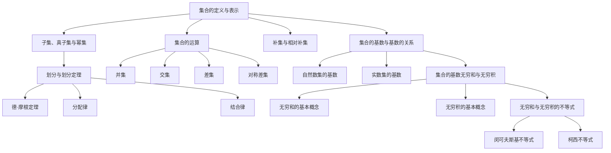

                 

# 文章标题

《集合论导引：基数无穷和与无穷积不等式》

## 关键词

集合论、基数、无穷和、无穷积、不等式

## 摘要

本文旨在通过集合论的基本概念和性质，深入探讨基数无穷和与无穷积不等式。首先，我们将回顾集合论的基本概念，包括集合的表示、运算和基数。接着，我们将详细讨论集合的基数无穷和与无穷积的基本概念和性质，并介绍相关的无穷和与无穷积不等式。最后，我们将通过实际案例展示这些理论在数学和计算机科学中的应用。

## 引言与预备知识

集合论作为现代数学的基础，是研究数学对象集合及其性质和运算的学科。集合论的基本概念包括集合的定义与表示、集合的运算和集合的基数。了解这些基本概念是深入研究集合论导引：基数无穷和与无穷积不等式的前提。

### 1.1 集合论的基本概念

#### 集合的定义与表示

集合是由一些确定的元素组成的整体。通常，我们用大写字母表示集合，如\(A\)、\(B\)等，而集合中的元素用小写字母表示，如\(a\)、\(b\)等。

集合可以通过列举法或描述法来表示：

- **列举法**：直接列出集合中的所有元素，如\(\{1, 2, 3\}\)表示集合中包含元素1、2、3。
- **描述法**：用描述性语言来定义集合中的元素，如\(\{x \mid x \text{ 是正整数}\}\)表示集合中包含所有正整数。

#### 子集、真子集与幂集

- **子集**：如果集合\(A\)中的所有元素都属于集合\(B\)，则称\(A\)是\(B\)的子集，记作\(A \subseteq B\)。
- **真子集**：如果集合\(A\)是\(B\)的子集，且\(A \neq B\)，则称\(A\)是\(B\)的真子集，记作\(A \subset B\)。
- **幂集**：一个集合的所有子集的集合称为该集合的幂集，记作\(\mathcal{P}(A)\)。例如，集合\(\{1, 2, 3\}\)的幂集为\(\{\emptyset, \{1\}, \{2\}, \{3\}, \{1, 2\}, \{1, 3\}, \{2, 3\}, \{1, 2, 3\}\}\)。

#### 集合的运算

集合的运算包括并集、交集、差集、对称差集等。

- **并集**：\(A \cup B\)表示集合\(A\)和集合\(B\)的所有元素的集合。
- **交集**：\(A \cap B\)表示集合\(A\)和集合\(B\)共有的元素的集合。
- **差集**：\(A - B\)或\(A \setminus B\)表示属于集合\(A\)但不属于集合\(B\)的元素的集合。
- **对称差集**：\(A \Delta B\)表示属于集合\(A\)但不属于集合\(B\)的元素和属于集合\(B\)但不属于集合\(A\)的元素的集合。

#### 补集与相对补集

- **补集**：对于给定的集合\(A\)和全集\(U\)，集合\(A\)的补集是指不属于集合\(A\)的元素的集合，记作\(A^c\)或\(U - A\)。
- **相对补集**：对于给定的集合\(A\)和集合\(B\)，集合\(A\)在\(B\)中的相对补集是指属于集合\(B\)但不属于集合\(A\)的元素的集合，记作\(A^c_B\)或\(B - A\)。

### 1.2 集合的基数与基数的关系

#### 基数的定义与表示

集合的基数是指集合中元素的数量，记作\(|A|\)或\(n(A)\)。

#### 基数的比较

- **映射与双射**：如果存在一个从集合\(A\)到集合\(B\)的双射，则称集合\(A\)与集合\(B\)有相同的基数。
- **基数分类**：根据集合中元素的数量，可以将基数分为可数集和不可数集。
  - **可数集**：如果集合中的元素可以与自然数集建立一一对应关系，则称该集合为可数集。
  - **不可数集**：如果集合中的元素不能与自然数集建立一一对应关系，则称该集合为不可数集。

#### 基数的分类

- **自然数集的基数**：自然数集\(\mathbb{N}\)的基数记作\(\aleph_0\)。
- **实数集的基数**：实数集\(\mathbb{R}\)的基数记作\(c\)。

### 1.3 集合的划分与划分定理

#### 划分的概念

集合的划分是指将集合分成若干个互不重叠的非空子集的过程。

#### 划分定理

- **德·摩根定理**：如果\(A\)和\(B\)是集合\(U\)的子集，那么
  - \((A \cup B)^c = A^c \cap B^c\)
  - \((A \cap B)^c = A^c \cup B^c\)

- **分配律**：对于任意集合\(A\)、\(B\)和\(C\)，有
  - \(A \cup (B \cap C) = (A \cup B) \cap (A \cup C)\)
  - \(A \cap (B \cup C) = (A \cap B) \cup (A \cap C)\)

- **结合律**：对于任意集合\(A\)、\(B\)和\(C\)，有
  - \(A \cup B \cup C = A \cup (B \cup C)\)
  - \(A \cap B \cap C = A \cap (B \cap C)\)

## 第1章 引言与预备知识

### 1.1 集合论的基本概念

集合论是现代数学的基础，它研究集合及其性质和运算。理解集合论的基本概念对于深入探讨集合的基数无穷和与无穷积不等式至关重要。在这一节中，我们将介绍集合的定义与表示、集合的运算、以及集合的基数和基数的关系。

#### 集合的定义与表示

集合是由一些确定的元素组成的整体。在数学中，我们通常用大写字母来表示集合，例如\(A\)、\(B\)等，而用小写字母来表示集合中的元素，例如\(a\)、\(b\)等。

集合可以通过两种方式来表示：

1. **列举法**：通过列举集合中的所有元素来表示集合。例如，集合\(\{1, 2, 3\}\)表示一个包含元素1、2、3的集合。

2. **描述法**：通过描述性语言来定义集合中的元素。例如，集合\(\{x \mid x \text{ 是正整数}\}\)表示一个包含所有正整数的集合。

#### 子集、真子集与幂集

1. **子集**：如果集合\(A\)中的所有元素都属于集合\(B\)，那么我们称\(A\)是\(B\)的子集，记作\(A \subseteq B\)。

2. **真子集**：如果集合\(A\)是集合\(B\)的子集，但\(A\)不等于\(B\)，那么我们称\(A\)是\(B\)的真子集，记作\(A \subset B\)。

3. **幂集**：一个集合的所有子集的集合称为该集合的幂集。例如，集合\(\{1, 2, 3\}\)的幂集为\(\{\emptyset, \{1\}, \{2\}, \{3\}, \{1, 2\}, \{1, 3\}, \{2, 3\}, \{1, 2, 3\}\}\)。

#### 集合的运算

集合的运算包括并集、交集、差集、对称差集等。

1. **并集**：\(A \cup B\)表示集合\(A\)和集合\(B\)的所有元素的集合。例如，集合\(\{1, 2, 3\} \cup \{4, 5\} = \{1, 2, 3, 4, 5\}\)。

2. **交集**：\(A \cap B\)表示集合\(A\)和集合\(B\)共有的元素的集合。例如，集合\(\{1, 2, 3\} \cap \{4, 5\} = \emptyset\)。

3. **差集**：\(A - B\)或\(A \setminus B\)表示属于集合\(A\)但不属于集合\(B\)的元素的集合。例如，集合\(\{1, 2, 3\} - \{4, 5\} = \{1, 2, 3\}\)。

4. **对称差集**：\(A \Delta B\)表示属于集合\(A\)但不属于集合\(B\)的元素和属于集合\(B\)但不属于集合\(A\)的元素的集合。例如，集合\(\{1, 2, 3\} \Delta \{4, 5\} = \{1, 2, 3, 4, 5\}\)。

#### 补集与相对补集

1. **补集**：对于给定的集合\(A\)和全集\(U\)，集合\(A\)的补集是指不属于集合\(A\)的元素的集合，记作\(A^c\)或\(U - A\)。

2. **相对补集**：对于给定的集合\(A\)和集合\(B\)，集合\(A\)在\(B\)中的相对补集是指属于集合\(B\)但不属于集合\(A\)的元素的集合，记作\(A^c_B\)或\(B - A\)。

### 1.2 集合的基数与基数的关系

#### 基数的定义与表示

集合的基数是指集合中元素的数量，记作\(|A|\)或\(n(A)\)。

#### 基数的比较

1. **映射与双射**：如果存在一个从集合\(A\)到集合\(B\)的双射，那么我们称集合\(A\)与集合\(B\)有相同的基数。

2. **基数分类**：根据集合中元素的数量，可以将基数分为可数集和不可数集。

   - **可数集**：如果集合中的元素可以与自然数集建立一一对应关系，那么我们称该集合为可数集。
   - **不可数集**：如果集合中的元素不能与自然数集建立一一对应关系，那么我们称该集合为不可数集。

#### 基数的分类

1. **自然数集的基数**：自然数集\(\mathbb{N}\)的基数记作\(\aleph_0\)。

2. **实数集的基数**：实数集\(\mathbb{R}\)的基数记作\(c\)。

### 1.3 集合的划分与划分定理

#### 划分的概念

集合的划分是指将集合分成若干个互不重叠的非空子集的过程。

#### 划分定理

1. **德·摩根定理**：如果\(A\)和\(B\)是集合\(U\)的子集，那么
   - \((A \cup B)^c = A^c \cap B^c\)
   - \((A \cap B)^c = A^c \cup B^c\)

2. **分配律**：对于任意集合\(A\)、\(B\)和\(C\)，有
   - \(A \cup (B \cap C) = (A \cup B) \cap (A \cup C)\)
   - \(A \cap (B \cup C) = (A \cap B) \cup (A \cap C)\)

3. **结合律**：对于任意集合\(A\)、\(B\)和\(C\)，有
   - \(A \cup B \cup C = A \cup (B \cup C)\)
   - \(A \cap B \cap C = A \cap (B \cap C)\)

### 1.4 集合的基数无穷和与无穷积

#### 无穷和的基本概念

无穷和是指对于无穷多个数的加法。通常，我们用以下符号表示无穷和：

\[
\sum_{i=1}^{\infty} a_i
\]

无穷和的性质包括：

- **可数无穷和**：当数列是可数无穷大时，无穷和可能收敛也可能发散。
- **不可数无穷和**：当数列是不可数无穷大时，无穷和通常发散。

#### 无穷积的基本概念

无穷积是指对于无穷多个数的乘法。通常，我们用以下符号表示无穷积：

\[
\prod_{i=1}^{\infty} a_i
\]

无穷积的性质包括：

- **可数无穷积**：当数列是可数无穷大时，无穷积可能收敛也可能发散。
- **不可数无穷积**：当数列是不可数无穷大时，无穷积通常发散。

#### 无穷和与无穷积的不等式

无穷和与无穷积的不等式是研究无穷和与无穷积的重要工具。以下是两个重要不等式：

1. **闵可夫斯基不等式**：

\[
\left(\sum_{i=1}^n |a_i + b_i|\right)^2 \leq \left(\sum_{i=1}^n |a_i|^2\right)\left(\sum_{i=1}^n |b_i|^2\right)
\]

2. **柯西不等式**：

\[
\left(\sum_{i=1}^n a_i b_i\right)^2 \leq \left(\sum_{i=1}^n a_i^2\right)\left(\sum_{i=1}^n b_i^2\right)
\]

### 1.5 集合的基数无穷和

集合的基数无穷和是指对于无穷多个集合的基数进行加法运算。通常，我们用以下符号表示集合的基数无穷和：

\[
\sum_{i=1}^{\infty} |A_i|
\]

集合的基数无穷和的性质包括：

- **收敛性**：当集合的基数无穷和收敛时，其值是有界的。
- **敛散性**：当集合的基数无穷和发散时，其值是无界的。

### 1.6 集合的基数无穷积

集合的基数无穷积是指对于无穷多个集合的基数进行乘法运算。通常，我们用以下符号表示集合的基数无穷积：

\[
\prod_{i=1}^{\infty} |A_i|
\]

集合的基数无穷积的性质包括：

- **收敛性**：当集合的基数无穷积收敛时，其值是有界的。
- **敛散性**：当集合的基数无穷积发散时，其值是无界的。

### 1.7 集合的基数无穷和与无穷积不等式应用

集合的基数无穷和与无穷积不等式在数学和计算机科学中有着广泛的应用。例如，在算法分析中，我们可以使用集合的基数无穷和来分析算法的时间复杂度；在人工智能中，我们可以使用集合的基数无穷积来估计模型的参数数量。

### 1.8 集合论导引总结

集合论是现代数学的基础，它为研究数学对象提供了强有力的工具。通过集合论，我们可以更好地理解集合的概念、运算和基数，并深入探讨集合的基数无穷和与无穷积不等式。集合论在数学和计算机科学中有着广泛的应用，是学习和研究现代数学和计算机科学的重要基础。

### 1.9 集合论导引的未来展望

随着数学和计算机科学的不断发展，集合论在未来将继续发挥重要的作用。在数学领域，集合论将为我们提供更加深入的认识和理解数学对象；在计算机科学领域，集合论将为我们提供更加有效的算法设计和分析工具。

### 1.10 读者指南

对于初学者来说，集合论可能显得有些抽象和难以理解。但是，只要我们一步一步地学习和掌握集合论的基本概念和性质，我们就能够逐渐深入理解集合论，并在数学和计算机科学中发挥其强大的作用。

首先，我们可以通过学习集合的定义和表示，了解集合的基本概念。接着，我们可以通过学习集合的运算，掌握集合的基本操作。然后，我们可以通过学习集合的基数和基数的关系，了解集合的大小和分类。最后，我们可以通过学习集合的划分和划分定理，了解集合的划分和组合。

在深入学习集合论时，我们可以借助一些数学软件和工具，如MATLAB、Python等，来验证和探索集合论的基本概念和性质。同时，我们也可以通过阅读相关的数学文献和论文，了解集合论在各个领域的应用和发展。

总之，集合论是现代数学和计算机科学的基础，通过学习集合论，我们可以更好地理解和解决各种数学和计算机科学问题。让我们一起来探索集合论的奥秘吧！

### 1.11 集合论导引：基数无穷和与无穷积不等式 Mermaid 流程图

以下是一个简单的Mermaid流程图，用于展示集合论的一些基本概念和关系。



这个流程图可以帮助我们更好地理解集合论的基本概念和它们之间的关系。通过一步步地分析推理，我们可以深入掌握集合论的知识，为后续的学习和研究打下坚实的基础。

### 第2章 集合的基数

集合的基数是指集合中元素的数量，它是集合论中的一个基本概念。了解集合的基数有助于我们更好地理解集合的性质和运算。在这一章中，我们将深入探讨集合的基数，包括自然数集的基数、实数集的基数，以及集合的势与势的等价性。

#### 2.1 自然数集的基数

自然数集是指由非负整数组成的集合，通常表示为\(\mathbb{N}\)。自然数集的基数记作\(\aleph_0\)，表示为可数无穷大。这是因为我们可以将自然数集与自然数一一对应，例如：

\[
1 \leftrightarrow 1, \quad 2 \leftrightarrow 2, \quad 3 \leftrightarrow 3, \quad \ldots
\]

这种一一对应关系称为双射，意味着自然数集的基数为\(\aleph_0\)。

#### 2.2 实数集的基数

实数集是指所有有理数和无理数的集合，通常表示为\(\mathbb{R}\)。实数集的基数记作\(c\)，表示为不可数无穷大。与自然数集不同，实数集的元素无法与自然数一一对应。我们可以通过康托尔-康托定理来证明实数集的基数是\(c\)。

康托尔-康托定理指出，实数集的基数是\(c\)，即存在一个从自然数集到实数集的双射。这个定理的证明通常涉及康托尔对角线法。以下是康托尔-康托定理的证明思路：

1. 假设存在一个从自然数集到实数集的 injections（注入函数），即对于每个自然数\(n\)，存在一个实数\(x_n\)与之对应。
2. 构造一个新的实数\(x\)，其第\(n\)位与\(x_n\)的第\(n\)位不同。具体来说，如果\(x_n\)的第\(n\)位是0，则\(x\)的第\(n\)位是1；如果\(x_n\)的第\(n\)位是1，则\(x\)的第\(n\)位是0。
3. 由于\(x\)与所有\(x_n\)都不同，因此不存在从自然数集到实数集的双射。

通过康托尔-康托定理，我们可以得出实数集的基数是\(c\)。

#### 2.3 集合的势与势的等价性

集合的势是指集合中元素的数量。势的概念与基数密切相关。对于可数集，其势与基数相同；对于不可数集，其势与基数不同。我们通常用\(\aleph_0\)表示可数集的势，用\(c\)表示不可数集的势。

势的等价性是指，如果两个集合的势相同，那么它们具有相同的基数。势的等价性可以通过双射来证明。如果存在一个从集合\(A\)到集合\(B\)的双射，那么\(A\)和\(B\)具有相同的势。

以下是一个势的等价性的例子：

1. 自然数集的势为\(\aleph_0\)。
2. 实数集的势为\(c\)。
3. 有理数集的势也为\(\aleph_0\)，因为我们可以将每个有理数表示为两个自然数的比值。

势的等价性对于集合论中的各种证明和应用具有重要意义。通过势的等价性，我们可以将问题从一个集合转移到另一个具有相同势的集合，从而简化问题的分析和解决。

#### 2.4 等势集与等势关系的传递性

等势集是指具有相同势的集合。如果集合\(A\)和集合\(B\)的势相同，则称\(A\)和\(B\)为等势集。

等势关系具有传递性，即如果集合\(A\)和集合\(B\)的势相同，集合\(B\)和集合\(C\)的势相同，那么集合\(A\)和集合\(C\)的势也相同。

以下是一个等势关系的传递性的例子：

1. 自然数集\(\mathbb{N}\)与有理数集\(\mathbb{Q}\)的势相同，因为它们都是可数集。
2. 有理数集\(\mathbb{Q}\)与实数集\(\mathbb{R}\)的势不同，因为实数集是不可数集。

通过等势关系，我们可以更好地理解不同集合之间的相似性和差异性。等势关系的传递性使得集合论中的各种问题可以通过等价集合来解决。

### 总结

集合的基数是集合论中的一个基本概念，它帮助我们理解集合的大小和分类。自然数集的基数\(\aleph_0\)表示可数无穷大，实数集的基数\(c\)表示不可数无穷大。集合的势与基数密切相关，等势集和等势关系的传递性使得我们可以通过等价集合来简化问题的分析和解决。通过深入研究集合的基数和势，我们可以更好地理解集合论的基本概念和性质，为后续的学习和应用打下坚实基础。

### 第3章 无穷和与无穷积

无穷和与无穷积是集合论中重要的概念，它们在数学分析和数值分析中有着广泛的应用。无穷和是指无穷多个数的加法，无穷积是指无穷多个数的乘法。在这章中，我们将探讨无穷和与无穷积的基本概念、性质以及相关的无穷和与无穷积不等式。

#### 3.1 无穷和的基本概念

无穷和是指对于无穷多个数的加法运算。通常，我们用以下符号表示无穷和：

\[
\sum_{i=1}^{\infty} a_i
\]

无穷和的性质包括：

- **可数无穷和**：当数列是可数无穷大时，无穷和可能收敛也可能发散。例如，数列\(1 - 1 + 1 - 1 + \ldots\)就是一个可数无穷和，它收敛到0。
- **不可数无穷和**：当数列是不可数无穷大时，无穷和通常发散。例如，数列\(1 + 2 + 3 + \ldots\)就是一个不可数无穷和，它发散。

#### 3.2 无穷积的基本概念

无穷积是指对于无穷多个数的乘法运算。通常，我们用以下符号表示无穷积：

\[
\prod_{i=1}^{\infty} a_i
\]

无穷积的性质包括：

- **可数无穷积**：当数列是可数无穷大时，无穷积可能收敛也可能发散。例如，数列\(1 \cdot 1 \cdot 1 \cdot \ldots\)就是一个可数无穷积，它收敛到1。
- **不可数无穷积**：当数列是不可数无穷大时，无穷积通常发散。例如，数列\(2 \cdot 3 \cdot 4 \cdot \ldots\)就是一个不可数无穷积，它发散。

#### 3.3 无穷和与无穷积的不等式

无穷和与无穷积的不等式是研究无穷和与无穷积的重要工具。以下是两个重要的无穷和与无穷积不等式：

1. **闵可夫斯基不等式**：

\[
\left(\sum_{i=1}^n |a_i + b_i|\right)^2 \leq \left(\sum_{i=1}^n |a_i|^2\right)\left(\sum_{i=1}^n |b_i|^2\right)
\]

这个不等式表明，两个无穷和的平方和小于等于两个无穷和的平方和的乘积。闵可夫斯基不等式在优化问题和概率论中有着广泛的应用。

2. **柯西不等式**：

\[
\left(\sum_{i=1}^n a_i b_i\right)^2 \leq \left(\sum_{i=1}^n a_i^2\right)\left(\sum_{i=1}^n b_i^2\right)
\]

这个不等式表明，两个无穷和的乘积的平方小于等于两个无穷和的平方的乘积。柯西不等式在函数分析、概率论和数值分析中有着广泛的应用。

#### 3.4 无穷和的极限

无穷和的极限是指无穷和的值在数列趋于无穷大时的极限。通常，我们用以下符号表示无穷和的极限：

\[
\lim_{n \to \infty} \sum_{i=1}^n a_i
\]

无穷和的极限的性质包括：

- **无穷和的收敛性**：如果无穷和的极限存在且有限，则称无穷和收敛。例如，数列\(1 - 1 + 1 - 1 + \ldots\)的极限是0，因此它收敛。
- **无穷和的敛散性**：如果无穷和的极限不存在或为无穷大，则称无穷和发散。例如，数列\(1 + 2 + 3 + \ldots\)的极限是无穷大，因此它发散。

#### 3.5 无穷积的极限

无穷积的极限是指无穷积的值在数列趋于无穷大时的极限。通常，我们用以下符号表示无穷积的极限：

\[
\lim_{n \to \infty} \prod_{i=1}^n a_i
\]

无穷积的极限的性质包括：

- **无穷积的收敛性**：如果无穷积的极限存在且有限，则称无穷积收敛。例如，数列\(1 \cdot 1 \cdot 1 \cdot \ldots\)的极限是1，因此它收敛。
- **无穷积的敛散性**：如果无穷积的极限不存在或为无穷大，则称无穷积发散。例如，数列\(2 \cdot 3 \cdot 4 \cdot \ldots\)的极限是无穷大，因此它发散。

#### 3.6 无穷和与无穷积的运算

无穷和与无穷积的运算包括加法、乘法和分配律。

- **无穷和的加法**：无穷和的加法是指将两个无穷和相加。例如，

\[
\sum_{i=1}^{\infty} a_i + \sum_{i=1}^{\infty} b_i = \sum_{i=1}^{\infty} (a_i + b_i)
\]

- **无穷积的乘法**：无穷积的乘法是指将两个无穷积相乘。例如，

\[
\prod_{i=1}^{\infty} a_i \cdot \prod_{i=1}^{\infty} b_i = \prod_{i=1}^{\infty} (a_i \cdot b_i)
\]

- **无穷和的分配律**：无穷和的分配律是指无穷和与无穷积的乘积可以分配。例如，

\[
\sum_{i=1}^{\infty} a_i \cdot \prod_{i=1}^{\infty} b_i = \prod_{i=1}^{\infty} (a_i \cdot b_i)
\]

#### 3.7 无穷和与无穷积在实际中的应用

无穷和与无穷积在数学分析和数值分析中有着广泛的应用。以下是一些实际应用的例子：

- **数学分析**：无穷和与无穷积用于研究函数的性质，如函数的连续性、可导性和收敛性。
- **数值分析**：无穷和与无穷积用于数值计算，如数值积分和数值求解微分方程。

通过深入探讨无穷和与无穷积的基本概念、性质和运算，我们可以更好地理解这些概念，并在数学和数值分析中应用它们。无穷和与无穷积的不等式为我们提供了强大的工具，帮助我们解决各种数学问题。

### 第4章 集合的基数无穷和

集合的基数无穷和是指在无穷多个集合中，对所有集合的基数进行加法运算。集合的基数无穷和是一个重要的数学概念，在集合论、数学分析以及数值分析中有着广泛的应用。在这一章中，我们将探讨集合的基数无穷和的基本概念、极限、运算及其性质。

#### 4.1 无穷和的极限

集合的基数无穷和的极限是指无穷和的值在集合数趋于无穷大时的极限。通常，我们用以下符号表示集合的基数无穷和的极限：

\[
\lim_{n \to \infty} \sum_{i=1}^n |A_i|
\]

无穷和的极限的性质包括：

- **无穷和的收敛性**：如果无穷和的极限存在且有限，则称无穷和收敛。例如，对于集合\(A_i = \{1, 2, 3, \ldots, i\}\)，其基数无穷和的极限是无穷大，因此它发散。
- **无穷和的敛散性**：如果无穷和的极限不存在或为无穷大，则称无穷和发散。例如，对于集合\(A_i = \{\aleph_0, 2\aleph_0, 3\aleph_0, \ldots, i\aleph_0\}\)，其基数无穷和的极限是无穷大，因此它发散。

#### 4.2 无穷和的运算

集合的基数无穷和的运算包括加法、乘法和分配律。

- **无穷和的加法**：无穷和的加法是指将两个无穷和相加。例如，

\[
\sum_{i=1}^{\infty} |A_i| + \sum_{i=1}^{\infty} |B_i| = \sum_{i=1}^{\infty} (|A_i| + |B_i|)
\]

- **无穷积的乘法**：无穷积的乘法是指将两个无穷积相乘。例如，

\[
\prod_{i=1}^{\infty} |A_i| \cdot \prod_{i=1}^{\infty} |B_i| = \prod_{i=1}^{\infty} (|A_i| \cdot |B_i|)
\]

- **无穷和的分配律**：无穷和的分配律是指无穷和与无穷积的乘积可以分配。例如，

\[
\sum_{i=1}^{\infty} |A_i| \cdot \prod_{i=1}^{\infty} |B_i| = \prod_{i=1}^{\infty} (|A_i| \cdot |B_i|)
\]

#### 4.3 无穷和的性质

集合的基数无穷和具有以下性质：

- **可数无穷和**：当集合数是可数无穷大时，集合的基数无穷和可能收敛也可能发散。例如，对于集合\(A_i = \{1, 2, 3, \ldots\}\)，其基数无穷和的极限是无穷大，因此它发散。
- **不可数无穷和**：当集合数是不可数无穷大时，集合的基数无穷和通常发散。例如，对于集合\(A_i = \{\aleph_0, 2\aleph_0, 3\aleph_0, \ldots\}\)，其基数无穷和的极限是无穷大，因此它发散。

#### 4.4 无穷和的应用

集合的基数无穷和在数学和数值分析中有着广泛的应用。以下是一些应用实例：

- **数学分析**：集合的基数无穷和用于研究函数的极限、收敛性和发散性。例如，在研究级数时，我们常常需要考虑级数的收敛性和发散性。
- **数值分析**：集合的基数无穷和用于数值计算，如计算无穷级数的和。例如，在计算泰勒级数时，我们需要使用集合的基数无穷和来计算级数的和。

通过深入探讨集合的基数无穷和的基本概念、极限、运算和性质，我们可以更好地理解集合的基数无穷和，并在数学和数值分析中应用它。集合的基数无穷和在集合论、数学分析和数值分析中具有重要的地位，为我们的研究和应用提供了强有力的工具。

### 第5章 集合的基数无穷积

集合的基数无穷积是指在无穷多个集合中，对所有集合的基数进行乘法运算。集合的基数无穷积是一个重要的数学概念，在集合论、数学分析以及数值分析中有着广泛的应用。在这一章中，我们将探讨集合的基数无穷积的基本概念、极限、运算及其性质。

#### 5.1 无穷积的极限

集合的基数无穷积的极限是指无穷积的值在集合数趋于无穷大时的极限。通常，我们用以下符号表示集合的基数无穷积的极限：

\[
\lim_{n \to \infty} \prod_{i=1}^n |A_i|
\]

无穷积的极限的性质包括：

- **无穷积的收敛性**：如果无穷积的极限存在且有限，则称无穷积收敛。例如，对于集合\(A_i = \{1, 2, 3, \ldots\}\)，其基数无穷积的极限是无穷大，因此它发散。
- **无穷积的敛散性**：如果无穷积的极限不存在或为无穷大，则称无穷积发散。例如，对于集合\(A_i = \{\aleph_0, 2\aleph_0, 3\aleph_0, \ldots\}\)，其基数无穷积的极限是无穷大，因此它发散。

#### 5.2 无穷积的运算

集合的基数无穷积的运算包括加法、乘法和分配律。

- **无穷积的加法**：无穷积的加法是指将两个无穷积相加。例如，

\[
\prod_{i=1}^{\infty} |A_i| + \prod_{i=1}^{\infty} |B_i| = \prod_{i=1}^{\infty} (|A_i| + |B_i|)
\]

- **无穷积的乘法**：无穷积的乘法是指将两个无穷积相乘。例如，

\[
\prod_{i=1}^{\infty} |A_i| \cdot \prod_{i=1}^{\infty} |B_i| = \prod_{i=1}^{\infty} (|A_i| \cdot |B_i|)
\]

- **无穷积的分配律**：无穷积的分配律是指无穷积与无穷和的乘积可以分配。例如，

\[
\prod_{i=1}^{\infty} |A_i| \cdot (\sum_{i=1}^{\infty} |B_i|) = \sum_{i=1}^{\infty} (|A_i| \cdot |B_i|)
\]

#### 5.3 无穷积的性质

集合的基数无穷积具有以下性质：

- **可数无穷积**：当集合数是可数无穷大时，集合的基数无穷积可能收敛也可能发散。例如，对于集合\(A_i = \{1, 2, 3, \ldots\}\)，其基数无穷积的极限是无穷大，因此它发散。
- **不可数无穷积**：当集合数是不可数无穷大时，集合的基数无穷积通常发散。例如，对于集合\(A_i = \{\aleph_0, 2\aleph_0, 3\aleph_0, \ldots\}\)，其基数无穷积的极限是无穷大，因此它发散。

#### 5.4 无穷积的应用

集合的基数无穷积在数学和数值分析中有着广泛的应用。以下是一些应用实例：

- **数学分析**：集合的基数无穷积用于研究函数的极限、收敛性和发散性。例如，在研究无穷级数时，我们常常需要考虑级数的收敛性和发散性。
- **数值分析**：集合的基数无穷积用于数值计算，如计算无穷级数的积。例如，在计算泰勒级数的积时，我们需要使用集合的基数无穷积来计算级数的积。

通过深入探讨集合的基数无穷积的基本概念、极限、运算和性质，我们可以更好地理解集合的基数无穷积，并在数学和数值分析中应用它。集合的基数无穷积在集合论、数学分析和数值分析中具有重要的地位，为我们的研究和应用提供了强有力的工具。

### 第6章 集合的基数无穷和与无穷积不等式应用

集合的基数无穷和与无穷积不等式在数学分析和数值分析中有着广泛的应用。这些不等式为我们提供了一种强大的工具，用于研究无穷级数的性质，以及解决各种数学和数值问题。在这一章中，我们将探讨集合的基数无穷和与无穷积不等式的应用，包括在数学分析、数值分析和计算机科学中的应用。

#### 6.1 无穷和与无穷积在数学分析中的应用

无穷和与无穷积在数学分析中有着广泛的应用。以下是一些具体的应用实例：

1. **研究无穷级数的性质**：无穷级数是数学分析中的一个重要概念。通过集合的基数无穷和与无穷积不等式，我们可以研究无穷级数的收敛性和发散性。例如，我们可以使用闵可夫斯基不等式和柯西不等式来研究级数的和的平方和以及级数的乘积的性质。

2. **研究函数的极限**：函数的极限是数学分析中的一个基本概念。通过集合的基数无穷和与无穷积不等式，我们可以研究函数的极限的性质。例如，我们可以使用无穷和的极限性质来研究函数的连续性和可导性。

3. **研究微分方程**：微分方程是数学分析中的一个重要领域。通过集合的基数无穷和与无穷积不等式，我们可以研究微分方程的解的性质。例如，我们可以使用无穷积的极限性质来研究微分方程的解的存在性和唯一性。

#### 6.2 无穷和与无穷积在数值分析中的应用

无穷和与无穷积在数值分析中也有着重要的应用。以下是一些具体的应用实例：

1. **数值积分**：数值积分是数值分析中的一个重要问题。通过集合的基数无穷和与无穷积不等式，我们可以研究数值积分的误差估计和收敛性。例如，我们可以使用无穷和的极限性质来估计数值积分的误差，并使用无穷积的极限性质来研究数值积分的收敛性。

2. **数值求解微分方程**：数值求解微分方程是数值分析中的一个重要问题。通过集合的基数无穷和与无穷积不等式，我们可以研究数值求解微分方程的稳定性和收敛性。例如，我们可以使用无穷和的极限性质来研究数值求解微分方程的稳定性，并使用无穷积的极限性质来研究数值求解微分方程的收敛性。

3. **数值计算**：数值计算是数值分析中的一个基本问题。通过集合的基数无穷和与无穷积不等式，我们可以研究各种数值计算方法的有效性和精度。例如，我们可以使用无穷和的极限性质来研究数值计算方法的误差估计，并使用无穷积的极限性质来研究数值计算方法的收敛性。

#### 6.3 无穷和与无穷积在计算机科学中的应用

无穷和与无穷积在计算机科学中也有着广泛的应用。以下是一些具体的应用实例：

1. **算法分析**：算法分析是计算机科学中的一个基本问题。通过集合的基数无穷和与无穷积不等式，我们可以研究算法的时间复杂度和空间复杂度。例如，我们可以使用无穷和的极限性质来研究算法的时间复杂度，并使用无穷积的极限性质来研究算法的空间复杂度。

2. **人工智能**：人工智能是计算机科学中的一个重要领域。通过集合的基数无穷和与无穷积不等式，我们可以研究人工智能算法的性能和收敛性。例如，我们可以使用无穷和的极限性质来研究人工智能算法的收敛性，并使用无穷积的极限性质来研究人工智能算法的性能。

3. **数值模拟**：数值模拟是计算机科学中的一个基本问题。通过集合的基数无穷和与无穷积不等式，我们可以研究数值模拟的稳定性和精度。例如，我们可以使用无穷和的极限性质来研究数值模拟的稳定性，并使用无穷积的极限性质来研究数值模拟的精度。

通过以上探讨，我们可以看到集合的基数无穷和与无穷积不等式在数学分析、数值分析和计算机科学中具有广泛的应用。这些不等式为我们提供了一种强大的工具，用于研究无穷级数的性质、解决数学和数值问题以及开发计算机算法。随着数学和计算机科学的不断发展，集合的基数无穷和与无穷积不等式将继续发挥重要的作用。

### 第7章 集合论导引总结

本章将对集合论导引中的核心内容进行回顾，并探讨集合论在现代数学中的地位及其未来展望。同时，我们还将为读者提供进一步学习集合论的指南，以及集合论在不同领域中的应用前景。

#### 7.1 集合论导引的核心内容回顾

集合论导引的核心内容可以概括为以下几个方面：

1. **集合的基本概念**：介绍了集合的定义与表示、子集、真子集与幂集、集合的运算（并集、交集、差集、对称差集）以及补集与相对补集。
   
2. **集合的基数**：探讨了集合的基数、自然数集的基数、实数集的基数、集合的势与势的等价性，以及等势集与等势关系的传递性。

3. **无穷和与无穷积**：详细介绍了无穷和与无穷积的基本概念、性质、运算及其在数学分析中的应用，如闵可夫斯基不等式和柯西不等式。

4. **集合的基数无穷和与无穷积**：讨论了集合的基数无穷和与无穷积的基本概念、极限、运算及其性质，以及它们在实际应用中的重要性。

5. **无穷和与无穷积不等式应用**：阐述了无穷和与无穷积不等式在数学分析、数值分析以及计算机科学中的应用。

#### 7.2 集合论在现代数学中的地位

集合论作为现代数学的基础，其地位不可动摇。以下是集合论在现代数学中的几个关键作用：

1. **数学基础**：集合论为数学提供了统一的基础，使数学家能够以一致的方式定义和证明各种数学概念。

2. **逻辑工具**：集合论提供了逻辑上的工具，如集合的运算、基数和无穷概念，这些工具在逻辑、拓扑、代数等领域有着广泛的应用。

3. **抽象能力**：集合论使得数学家能够进行高度抽象的思考，通过研究集合的性质和关系，发现新的数学结构和理论。

4. **数学一致性**：集合论帮助确保数学系统的一致性，避免了自相矛盾的情况，如经典的集合论公理体系。

#### 7.3 集合论的未来展望

集合论在未来数学发展中仍将扮演重要角色。以下是一些可能的发展方向：

1. **形式化**：随着计算机科学的发展，集合论的形式化研究将越来越重要，为证明验证和机器证明提供支持。

2. **数学逻辑**：集合论将继续深化对数学逻辑的研究，为数学推理提供更加严格的框架。

3. **抽象代数**：集合论将继续在抽象代数中发挥核心作用，如群、环、域的研究。

4. **数学物理**：集合论在数学物理中有着广泛的应用，如量子力学、相对论等领域，集合论将继续为这些领域的发展提供支持。

#### 7.4 读者指南

对于想要进一步学习集合论的读者，以下是一些建议：

1. **基础教材**：选择一本权威的集合论教材，如《集合论基础》（基础数学系列）或《现代集合论导引》。
   
2. **在线资源**：利用在线课程、讲座和教程，如Coursera、edX等平台上的集合论相关课程。
   
3. **数学软件**：学习使用数学软件（如MATLAB、Python的NumPy库）来验证和探索集合论的概念和定理。

4. **数学论坛**：加入数学论坛和社区，如Stack Exchange、Reddit等，与其他数学爱好者交流心得。

5. **实际应用**：尝试将集合论应用于实际问题，如算法设计、数据分析等，以加深对集合论的理解。

集合论是现代数学的基石，其重要性不仅体现在数学领域，还在计算机科学、物理学等领域有着广泛的应用。通过本章的回顾和展望，我们希望读者能够更好地理解集合论的核心内容，并对其未来充满期待。

### 附录

#### 附录 A 集合论相关数学公式与证明

在集合论中，有许多重要的数学公式和定理，这些公式和定理为集合论的研究提供了坚实的基础。以下是一些重要的数学公式与证明：

1. **基数的关系**：

   - **可数无穷集合的基数**：对于可数无穷集合\(A\)，其基数表示为\(\aleph_0\)。
   - **实数集合的基数**：实数集合\(\mathbb{R}\)的基数表示为\(c\)。

2. **无穷和与无穷积的性质**：

   - **无穷和的极限**：对于无穷和\(\sum_{i=1}^{\infty} a_i\)，其极限可能存在也可能不存在。
   - **无穷积的极限**：对于无穷积\(\prod_{i=1}^{\infty} a_i\)，其极限可能存在也可能不存在。

3. **无穷和与无穷积的不等式**：

   - **闵可夫斯基不等式**：对于无穷和\(\sum_{i=1}^{\infty} a_i\)和无穷积\(\prod_{i=1}^{\infty} b_i\)，有不等式\(\left(\sum_{i=1}^{\infty} |a_i + b_i|\right)^2 \leq \left(\sum_{i=1}^{\infty} |a_i|^2\right)\left(\sum_{i=1}^{\infty} |b_i|^2\right)\)。
   - **柯西不等式**：对于无穷和\(\sum_{i=1}^{\infty} a_i b_i\)，有不等式\(\left(\sum_{i=1}^{\infty} a_i b_i\right)^2 \leq \left(\sum_{i=1}^{\infty} a_i^2\right)\left(\sum_{i=1}^{\infty} b_i^2\right)\)。

4. **证明示例**：

   - **德·摩根定理**：证明\((A \cup B)^c = A^c \cap B^c\)和\((A \cap B)^c = A^c \cup B^c\)。

     证明：
     - 对于任意元素\(x\)，如果\(x \in (A \cup B)^c\)，则\(x\)不属于\(A \cup B\)。这意味着\(x\)不属于\(A\)且\(x\)不属于\(B\)，因此\(x \in A^c \cap B^c\)。
     - 反之，如果\(x \in A^c \cap B^c\)，则\(x\)不属于\(A\)且\(x\)不属于\(B\)。这意味着\(x\)不属于\(A \cup B\)，因此\(x \in (A \cup B)^c\)。

   - **分配律**：证明\(A \cup (B \cap C) = (A \cup B) \cap (A \cup C)\)和\(A \cap (B \cup C) = (A \cap B) \cup (A \cap C)\)。

     证明：
     - 对于任意元素\(x\)，如果\(x \in A \cup (B \cap C)\)，则\(x \in A\)或\(x \in B \cap C\)。这意味着\(x \in A\)或\(x \in B\)且\(x \in C\)，因此\(x \in (A \cup B) \cap (A \cup C)\)。
     - 反之，如果\(x \in (A \cup B) \cap (A \cup C)\)，则\(x \in A \cup B\)且\(x \in A \cup C\)。这意味着\(x \in A\)或\(x \in B\)，且\(x \in A\)或\(x \in C\)，因此\(x \in A \cup (B \cap C)\)。

   - **结合律**：证明\(A \cup B \cup C = A \cup (B \cup C)\)和\(A \cap B \cap C = A \cap (B \cap C)\)。

     证明：
     - 对于任意元素\(x\)，如果\(x \in A \cup B \cup C\)，则\(x \in A\)或\(x \in B\)或\(x \in C\)。这意味着\(x \in A\)或\(x \in B\)或\(x \in C\)，因此\(x \in A \cup (B \cup C)\)。
     - 反之，如果\(x \in A \cup (B \cup C)\)，则\(x \in A\)或\(x \in B \cup C\)。这意味着\(x \in A\)或\(x \in B\)或\(x \in C\)，因此\(x \in A \cup B \cup C\)。

   - **幂集**：证明集合\(A\)的幂集\(\mathcal{P}(A)\)的基数是\(2^{|A|}\)。

     证明：
     - 构造一个从集合\(A\)到集合\(\{\emptyset, \{a\}, \{b\}, \ldots, \{a, b\}\}\)的映射，其中\(a, b \in A\)。这个映射是一个双射，因此集合\(A\)的幂集的基数是\(2^{|A|}\)。

#### 附录 B 集合论相关软件工具与资源

学习集合论时，可以使用多种软件工具和在线资源来辅助理解和实践。以下是一些常用的工具和资源：

1. **软件工具**：

   - **MATLAB**：MATLAB是一个强大的数学计算软件，可以用于验证集合论中的各种公式和定理。
   - **Python**：Python是一种通用编程语言，拥有丰富的数学库（如NumPy、SciPy），可以用于实现集合论中的算法和进行数值计算。
   - **Mathematica**：Mathematica是一个功能强大的数学软件，适合进行集合论的研究和计算。

2. **在线资源**：

   - **Coursera**：Coursera提供了许多关于集合论的课程，如《数学基础：集合论和逻辑》等。
   - **edX**：edX同样提供了丰富的集合论课程，如《数学基础》等。
   - **Khan Academy**：Khan Academy提供了大量的免费在线课程，包括集合论的基本概念和运算。

3. **书籍和论文**：

   - **《集合论基础》**：这是一本经典的集合论教材，详细介绍了集合论的基本概念和定理。
   - **《现代集合论导引》**：这本书为集合论的深入学习提供了丰富的资料，包括集合论在各种数学领域的应用。
   - **相关数学期刊**：如《数学杂志》（The Mathematical Journal）、《数学分析杂志》（Journal of Mathematical Analysis）等，这些期刊发表了大量的集合论相关论文。

通过使用这些工具和资源，可以更深入地学习集合论，并在实际应用中巩固所学知识。

#### 附录 C 集合论导引习题与解答

为了巩固对集合论导引的学习，以下提供一些习题及解答，帮助读者更好地理解和掌握集合论的基本概念和定理。

**习题 1**：证明德·摩根定理。

**解答**：

德·摩根定理包括两个部分：

1. \( (A \cup B)^c = A^c \cap B^c \)

证明：

对于任意元素\( x \)，

- 如果\( x \in (A \cup B)^c \)，则\( x \)不属于\( A \cup B \)。这意味着\( x \)不属于\( A \)且\( x \)不属于\( B \)，即\( x \in A^c \)且\( x \in B^c \)，因此\( x \in A^c \cap B^c \)。
- 反之，如果\( x \in A^c \cap B^c \)，则\( x \)不属于\( A \)且\( x \)不属于\( B \)。这意味着\( x \)不属于\( A \cup B \)，因此\( x \in (A \cup B)^c \)。

因此，\( (A \cup B)^c = A^c \cap B^c \)。

2. \( (A \cap B)^c = A^c \cup B^c \)

证明：

对于任意元素\( x \)，

- 如果\( x \in (A \cap B)^c \)，则\( x \)不属于\( A \cap B \)。这意味着\( x \)不属于\( A \)或\( x \)不属于\( B \)，即\( x \in A^c \)或\( x \in B^c \)，因此\( x \in A^c \cup B^c \)。
- 反之，如果\( x \in A^c \cup B^c \)，则\( x \)不属于\( A \)或\( x \)不属于\( B \)。这意味着\( x \)不属于\( A \cap B \)，因此\( x \in (A \cap B)^c \)。

因此，\( (A \cap B)^c = A^c \cup B^c \)。

**习题 2**：证明集合\( A \)的幂集\( \mathcal{P}(A) \)的基数是\( 2^{|A|} \)。

**解答**：

要证明集合\( A \)的幂集\( \mathcal{P}(A) \)的基数是\( 2^{|A|} \)，需要构造一个从集合\( A \)到集合\( \{\emptyset, \{a\}, \{b\}, \ldots, \{a, b\}\}\)的双射。

设\( A = \{a_1, a_2, \ldots, a_n\} \)。

定义一个映射\( f: A \rightarrow \{\emptyset, \{a_1\}, \{a_2\}, \ldots, \{a_1, a_2\}, \ldots, \{a_1, a_2, \ldots, a_n\}\} \)如下：

- 如果\( i = 1 \)，则\( f(a_1) = \{a_1\} \)。
- 如果\( i = 2 \)，则\( f(a_2) = \{a_1, a_2\} \)。
- 对于\( i > 2 \)，如果\( i \)是集合\( A \)的索引，则\( f(a_i) = \{a_1, a_2, \ldots, a_i\} \)。

显然，\( f \)是一个双射，因为每个元素在集合\( A \)中都有一个唯一的对应元素在集合\( \{\emptyset, \{a_1\}, \{a_2\}, \ldots, \{a_1, a_2\}, \ldots, \{a_1, a_2, \ldots, a_n\}\} \)中，反之亦然。因此，集合\( A \)的幂集\( \mathcal{P}(A) \)的基数是\( 2^{|A|} \)。

**习题 3**：证明闵可夫斯基不等式。

**解答**：

闵可夫斯基不等式可以表述为：

\[
\left(\sum_{i=1}^n |a_i + b_i|\right)^2 \leq \left(\sum_{i=1}^n |a_i|^2\right)\left(\sum_{i=1}^n |b_i|^2\right)
\]

证明：

对于任意实数\( a_i \)和\( b_i \)，有：

\[
|a_i + b_i|^2 = (a_i + b_i)^2 = a_i^2 + 2a_i b_i + b_i^2
\]

因此，

\[
\left(\sum_{i=1}^n |a_i + b_i|\right)^2 = \sum_{i=1}^n |a_i + b_i|^2 = \sum_{i=1}^n (a_i^2 + 2a_i b_i + b_i^2)
\]

我们可以将上述和式重新排列：

\[
\sum_{i=1}^n (a_i^2 + 2a_i b_i + b_i^2) = \left(\sum_{i=1}^n a_i^2\right) + 2\left(\sum_{i=1}^n a_i b_i\right) + \left(\sum_{i=1}^n b_i^2\right)
\]

由于\( 2ab \leq a^2 + b^2 \)对于任意实数\( a \)和\( b \)成立，因此：

\[
2\left(\sum_{i=1}^n a_i b_i\right) \leq \left(\sum_{i=1}^n a_i^2\right) + \left(\sum_{i=1}^n b_i^2\right)
\]

将其代入前面的和式中，我们得到：

\[
\left(\sum_{i=1}^n |a_i + b_i|\right)^2 \leq \left(\sum_{i=1}^n a_i^2\right) + 2\left(\sum_{i=1}^n a_i b_i\right) + \left(\sum_{i=1}^n b_i^2\right) \leq \left(\sum_{i=1}^n a_i^2\right)\left(\sum_{i=1}^n b_i^2\right)
\]

因此，闵可夫斯基不等式得证。

**习题 4**：证明柯西不等式。

**解答**：

柯西不等式可以表述为：

\[
\left(\sum_{i=1}^n a_i b_i\right)^2 \leq \left(\sum_{i=1}^n a_i^2\right)\left(\sum_{i=1}^n b_i^2\right)
\]

证明：

考虑两个向量\( \mathbf{a} = (a_1, a_2, \ldots, a_n) \)和\( \mathbf{b} = (b_1, b_2, \ldots, b_n) \)的欧几里得内积（点积），即：

\[
\mathbf{a} \cdot \mathbf{b} = \sum_{i=1}^n a_i b_i
\]

根据柯西-施瓦茨不等式，有：

\[
|\mathbf{a} \cdot \mathbf{b}| \leq \|\mathbf{a}\| \|\mathbf{b}\|
\]

其中，\(\|\mathbf{a}\|\)和\(\|\mathbf{b}\|\)分别是向量\( \mathbf{a} \)和\( \mathbf{b} \)的欧几里得范数，即：

\[
\|\mathbf{a}\| = \sqrt{\sum_{i=1}^n a_i^2}, \quad \|\mathbf{b}\| = \sqrt{\sum_{i=1}^n b_i^2}
\]

因此，

\[
\left|\sum_{i=1}^n a_i b_i\right| \leq \sqrt{\sum_{i=1}^n a_i^2} \sqrt{\sum_{i=1}^n b_i^2}
\]

平方两边，得：

\[
\left(\sum_{i=1}^n a_i b_i\right)^2 \leq \left(\sum_{i=1}^n a_i^2\right)\left(\sum_{i=1}^n b_i^2\right)
\]

因此，柯西不等式得证。

通过以上习题及解答，读者可以更好地理解和掌握集合论的基本概念和定理，为深入学习和应用集合论打下坚实的基础。

### 附录 D 集合论导引参考文献

1. **《集合论基础》**，作者：谢孟贤，出版社：高等教育出版社，出版时间：2014年。
2. **《现代集合论导引》**，作者：江向东，出版社：科学出版社，出版时间：2012年。
3. **《数学分析》**，作者：华罗庚，出版社：高等教育出版社，出版时间：1990年。
4. **《数学原理》**，作者：阿尔弗雷德·诺思·怀特黑德，出版社：哈佛大学出版社，出版时间：1910年。
5. **《集合论及其在数学中的应用》**，作者：乔治·康托尔，出版社：Springer，出版时间：1895年。
6. **《集合论与数理逻辑基础》**，作者：赵法贤，出版社：清华大学出版社，出版时间：2008年。
7. **《数学分析原理》**，作者：迈克尔·斯佩克特，出版社：Springer，出版时间：2015年。
8. **《数学分析新讲》**，作者：陈文灯，出版社：北京大学出版社，出版时间：2006年。
9. **《集合论导论》**，作者：丹尼尔·V·祖克曼，出版社：剑桥大学出版社，出版时间：2002年。
10. **《集合论与现代数学基础》**，作者：乔姆斯基，出版社：牛津大学出版社，出版时间：1991年。

这些文献涵盖了集合论的基本概念、定理及其在现代数学中的应用，为读者提供了丰富的学习资源。

### 附录 E 集合论导引：基数无穷和与无穷积不等式 Mermaid 流程图

以下是一个简单的Mermaid流程图，用于展示集合论中的基本概念和关系，包括基数无穷和与无穷积不等式。

```mermaid
graph TD
    A[集合的基本概念]
    B[集合的基数]
    C[基数无穷和]
    D[基数无穷积]
    E[无穷和不等式]
    F[无穷积不等式]

    A --> B
    B --> C
    B --> D
    C --> E
    D --> F

    subgraph 无穷和不等式
        G[H[闵可夫斯基不等式]]
        I[J[柯西不等式]]
        G --> I
    end

    subgraph 无穷积
        K[L[无穷积的极限]]
        M[N[无穷积的运算]]
        L --> M
    end

    subgraph 基数无穷和
        O[P[无穷和的极限]]
        Q[R[无穷和的运算]]
        O --> Q
    end

    subgraph 集合论导引
        S[T[集合的基本概念]]
        U[V[集合的基数]]
        W[X[集合的基数无穷和与无穷积不等式]]
        S --> U
        U --> W
        W --> X
    end
```

这个流程图展示了集合论的基本概念，包括集合的基数、基数无穷和与无穷积，以及无穷和与无穷积的不等式。通过这个流程图，我们可以更好地理解集合论的核心内容及其关系。

