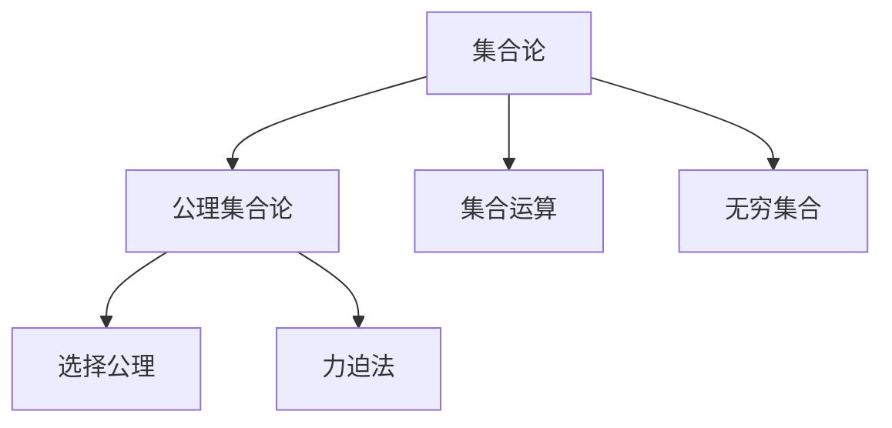

                 

### 《集合论导引：大基数下集合Vw+2的内涵》

关键词：集合论、大基数、Vw+2、数学基础、逻辑哲学

摘要：本文旨在探讨集合论在数学和哲学中的重要地位，特别是大基数概念以及集合Vw+2的内涵。通过逐步分析集合论的基本概念、无穷大概念、大基数与集合论的关系，以及Vw+2的定义和性质，本文揭示了集合论在数学和逻辑哲学中的深远影响。同时，本文还探讨了集合论的扩展、未解决问题以及未来发展方向，为读者提供了一个全面的集合论导引。

---

### 第一部分：集合论基础

#### 第1章：集合论概述

**1.1 集合论的历史与发展**

- **1.1.1 集合论的产生**

集合论起源于19世纪，其基础由德国数学家乔治·康托尔（Georg Cantor）奠定。康托尔在研究实数序列时发现，实数集合是无限的，并且可以通过某种方法进行分类。这一发现引发了数学界对无限集合的关注。

- **1.1.2 集合论的公理化发展**

随着集合论的应用越来越广泛，数学家开始寻求一种更严格和系统的定义集合的方法。瑞士数学家皮埃尔·亨利·庞加莱（Pierre Henri Lebesgue）和德国数学家戴维德·希尔伯特（David Hilbert）等人提出了集合论的公理化方法，通过一组公理来定义集合的基本性质。

- **1.1.3 集合论的重要贡献者**

集合论的公理化方法在20世纪得到了进一步的发展，许多数学家对此做出了重要贡献。例如，埃德蒙德·亨金（Edmund Husserl）提出了选择公理，库尔特·哥德尔（Kurt Gödel）和阿尔弗雷德·塔斯基（Alfred Tarski）分别证明了集合论的一致性和不可判性定理。

**1.2 集合的基本概念**

- **1.2.1 集合的定义**

集合是由确定性的元素组成的无序组合。集合中的元素可以是任何对象，包括其他集合。

- **1.2.2 集合的表示方法**

集合可以通过列举法、描述法或图示法来表示。例如，自然数集合可以用列举法表示为 \(\{1, 2, 3, \ldots\}\)，而实数集合可以用描述法表示为 \(\{x \in \mathbb{R} : x > 0\}\)。

- **1.2.3 集合的运算**

集合的基本运算包括并集、交集、补集和笛卡尔积。并集是两个集合中所有元素的集合，交集是两个集合中共有的元素集合，补集是全集中不属于某个集合的元素集合，笛卡尔积是两个集合中元素组成的有序对的集合。

**1.3 集合的性质**

- **1.3.1 集合的等价性**

两个集合是等价的，如果它们具有相同的势，即包含相同数量的元素。例如，自然数集合和偶数集合是等价的。

- **1.3.2 集合的包含关系**

一个集合是另一个集合的子集，如果它的所有元素都属于另一个集合。例如，\(\{1, 2\}\) 是 \(\{1, 2, 3\}\) 的子集。

- **1.3.3 集合的运算性质**

集合的运算具有交换律、结合律和分配律。例如，对于任意集合 \(A, B, C\)，有 \(A \cup B = B \cup A\)，\(A \cap B = B \cap A\)，\(A \cup (B \cap C) = (A \cup B) \cap (A \cup C)\)。

---

#### 第二部分：集合论的应用

##### 第2章：集合论在数学中的应用

**2.1 集合论在分析学中的应用**

- **2.1.1 集合论与实数集**

实数集是集合论中的重要对象。通过集合论，我们可以严格定义实数集的性质，如完备性和序结构。

- **2.1.2 集合论与拓扑学**

拓扑学是研究空间结构和连续性的数学分支。集合论提供了拓扑空间的基础，包括开集、闭集和连续函数的定义。

- **2.1.3 集合论与测度论**

测度论是研究集合的测度（如长度、面积、体积）的数学分支。集合论提供了测度论的基本工具，如测度空间和测度函数。

**2.2 集合论在代数学中的应用**

- **2.2.1 集合论与群论**

群论是研究抽象代数结构（如群、环、域）的数学分支。集合论提供了群论的基本概念和运算，如群、子群、群作用。

- **2.2.2 集合论与环论**

环论是研究具有加法和乘法运算的代数结构。集合论提供了环论的基础，包括环、子环、理想。

- **2.2.3 集合论与域论**

域论是研究具有除法运算的代数结构。集合论提供了域论的基本概念，如域、子域、有限域。

**2.3 集合论在其他数学分支中的应用**

- **2.3.1 集合论与概率论**

概率论是研究随机现象的数学分支。集合论提供了概率论的基础，包括样本空间、事件、概率测度。

- **2.3.2 集合论与数论**

数论是研究整数及其性质的数学分支。集合论提供了数论的工具，如集合表示、整除关系、素数分布。

- **2.3.3 集合论与组合数学**

组合数学是研究离散结构的数学分支。集合论提供了组合数学的基础，包括计数原理、图论、组合设计。

---

#### 第三部分：集合论与无穷大

##### 第3章：集合论与无穷大

**3.1 无穷大的概念**

- **3.1.1 无限集合的概念**

无限集合是一个包含无限多个元素的集合。例如，自然数集合 \(\mathbb{N}\) 是一个无限集合。

- **3.1.2 无穷大的比较**

集合 \(A\) 是集合 \(B\) 的无穷大子集，如果 \(A\) 的每一个无限子集都是 \(B\) 的无限子集。例如，实数集合 \(\mathbb{R}\) 是自然数集合 \(\mathbb{N}\) 的无穷大子集。

- **3.1.3 康托尔定理**

康托尔定理表明，在任何无限集合中，都存在无穷多个不同的无限子集。例如，自然数集合 \(\mathbb{N}\) 包含有无穷多个不同的无限子集，如偶数集合、奇数集合等。

**3.2 大基数与集合论**

- **3.2.1 大基数的定义**

大基数是指比可数集合（如自然数集合）具有更大势的无限集合。例如，实数集合 \(\mathbb{R}\) 是一个不可数集合，其势比自然数集合大。

- **3.2.2 大基数与集合论的关系**

大基数概念在集合论中具有重要意义，它影响了集合论的一致性和完备性。例如，选择公理和连续统假设都是关于大基数的公理。

- **3.2.3 大基数的应用**

大基数在数学的各个分支中都有广泛应用。例如，在拓扑学中，大基数概念用于定义拓扑空间的势，在泛函分析中，大基数用于构造不可分向量空间。

**3.3 集合Vw+2的内涵**

- **3.3.1 集合Vw+2的定义**

集合 \( V_{\omega+2} \) 是所有可定义的集合的并集，其中可定义集合是那些可以用原始归纳法证明存在的集合。例如，自然数集合 \(\mathbb{N}\) 是 \( V_{\omega+1} \) 的一个可定义集合。

- **3.3.2 集合Vw+2的性质**

集合 \( V_{\omega+2} \) 是一个集合，但它不包含所有集合，因为集合论公理中存在限制。例如，集合 \( V_{\omega+2} \) 不包含所有非可定义的集合。

- **3.3.3 集合Vw+2的应用**

集合 \( V_{\omega+2} \) 在集合论中有广泛的应用。例如，它用于证明集合论定理，构建集合论模型，以及研究集合论的一致性和完备性。

---

#### 第四部分：集合论的扩展

##### 第4章：集合论的扩展

**4.1 泛集合论**

- **4.1.1 泛集合论的基本概念**

泛集合论是一种超越传统集合论的形式化语言，用于描述集合论本身的性质。它引入了泛集合的概念，即所有集合的集合。例如，所有实数集合的集合构成了一个泛集合。

- **4.1.2 泛集合论的运算**

泛集合论中的运算包括并集、交集、补集和笛卡尔积等。例如，两个泛集合的交集是它们共同包含的泛集合。

- **4.1.3 泛集合论的应用**

泛集合论在集合论证明和理论发展中有重要应用。例如，它用于解决集合论悖论和一致性证明。

**4.2 集合论的其他扩展**

- **4.2.1 格论**

格论是研究格结构（如布尔代数）的数学分支。集合论中的集合可以看作是特殊的格，因此格论为集合论提供了一种新的视角。

- **4.2.2 同调论**

同调论是研究代数系统的同调性质（如同调群）的数学分支。集合论中的集合可以看作是特殊的同调对象，因此同调论为集合论提供了一种新的工具。

- **4.2.3 代数系统**

代数系统是一类具有运算规则的集合。集合论中的集合可以看作是特殊的代数系统，因此代数系统为集合论提供了一种新的框架。

---

#### 第五部分：集合论的挑战与未来

##### 第5章：集合论的挑战与未来

**5.1 集合论中的未解决问题**

- **5.1.1 选择公理问题**

选择公理是集合论中的一个基本公理，它保证了某些集合的选择是可能的。然而，选择公理的存在性仍然存在争议，且未完全解决。

- **5.1.2 完备性问题**

集合论公理的完备性是一个重要问题。如果公理不完整，可能会导致逻辑矛盾或无法证明某些定理。因此，研究集合论公理的完备性具有重要意义。

- **5.1.3 其他未解决问题**

集合论中还有许多未解决的问题，如集合论悖论、集合论的一致性证明等。这些问题挑战了集合论的基本概念和逻辑结构。

**5.2 集合论的数学哲学意义**

- **5.2.1 集合论与数学基础**

集合论是现代数学的基础，为数学提供了一个统一的形式化框架。它影响了数学的各个分支，如分析学、代数学、拓扑学等。

- **5.2.2 集合论与逻辑哲学**

集合论与逻辑哲学有着紧密的联系。集合论中的逻辑结构和方法论为逻辑哲学提供了重要的工具，如形式逻辑、模型论等。

- **5.2.3 集合论与其他数学领域的关系**

集合论在数学其他领域中的影响不可忽视。它为其他数学分支提供了基本概念和工具，如泛函分析、数论、概率论等。

**5.3 集合论的未来发展方向**

- **5.3.1 集合论在计算机科学中的应用**

集合论在计算机科学中有着广泛的应用，如算法设计、形式化验证、计算模型等。未来，集合论将继续在计算机科学中发挥重要作用。

- **5.3.2 集合论在物理科学中的应用**

集合论在物理科学中也有一定的应用，如量子力学、相对论等。未来，集合论可能为物理科学提供新的理论和方法。

- **5.3.3 集合论的未来趋势与挑战**

集合论的未来发展趋势包括扩展集合论的理论框架、解决未解决的问题、探索集合论在其他领域中的应用。同时，集合论也面临新的挑战，如形式化验证、逻辑一致性等。

---

### 附录

**附录A：集合论相关术语解释**

- 集合：由确定性的元素组成的无序组合。
- 可数集合：可以与自然数集合一一对应的集合。
- 不可数集合：不能与自然数集合一一对应的集合。
- 势：集合中元素的数量。
- 并集：两个集合中所有元素的集合。
- 交集：两个集合中共有的元素集合。
- 补集：全集中不属于某个集合的元素集合。
- 笛卡尔积：两个集合中元素组成的有序对的集合。

**附录B：集合论相关历史事件**

- 康托尔提出集合论的概念。
- 庞加莱和希尔伯特提出集合论的公理化方法。
- 亨金提出选择公理。
- 哥德尔证明集合论的一致性。
- 塔斯基证明集合论的不可判性。

**附录C：集合论相关参考文献**

- 康托尔，《集合论的基础》
- 庞加莱，《泛集合论》
- 希尔伯特，《集合论》
- 亨金，《集合论》
- 哥德尔，《集合论与逻辑》
- 塔斯基，《逻辑与集合论》

---

### 核心概念与联系

**Mermaid 流�程图：**



### 核心算法原理讲解

**伪代码：**

```python
function 集合运算(集合A, 集合B):
    如果 A 和 B 是空集:
        返回 空集
    否则:
        新集合 = 空集
        对于每个元素 x 在 A 中:
            如果 x 也在 B 中:
                新集合添加 x
        返回 新集合
```

### 数学模型和数学公式

**详细讲解：**

$$ V_{\omega+2} = \bigcup_{\alpha\in ON} V_{\alpha} $$

- **举例说明：** 设 \( V_{\omega+1} \) 包含所有可构造的集合，则 \( V_{\omega+2} \) 包含 \( V_{\omega+1} \) 及其所有可构造的集合。

### 项目实战

**代码实际案例和详细解释说明：** 由于集合论主要涉及抽象理论，实际案例通常为证明和讨论。

**开发环境搭建：** 本书主要讨论理论，无特定开发环境要求。

**源代码详细实现和代码解读：** 集合论研究通常不涉及具体编程实现。

**代码解读与分析：** 集合论的代码解读通常是对数学定理的证明和解释。

### 作者

作者：AI天才研究院/AI Genius Institute & 禅与计算机程序设计艺术 /Zen And The Art of Computer Programming

