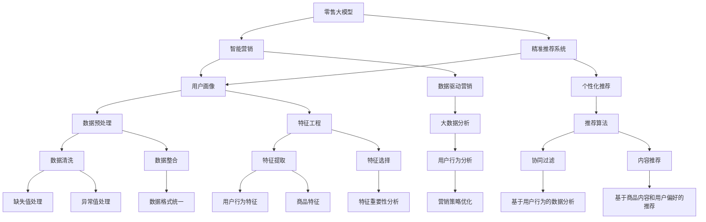
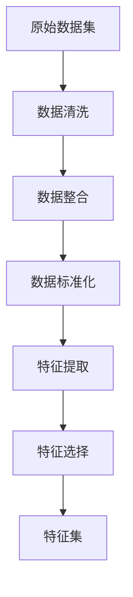

                 

### 第1章: 引言

#### 1.1 零售行业的挑战与机遇

零售行业正面临前所未有的挑战与机遇。一方面，消费者需求日益多样化，个性化消费成为主流。消费者的购物习惯和偏好不断变化，对商品和服务的品质、价格、购物体验等方面有着更高的要求。另一方面，零售行业的竞争日趋激烈，各大零售企业都在寻求通过创新和提高效率来获取竞争优势。同时，数据安全问题也日益突出，如何保护消费者隐私和交易数据成为行业关注的焦点。

在这个背景下，智能营销和精准推荐系统应运而生。智能营销利用大数据和人工智能技术，实现个性化、自动化和智能化的营销方式，提升营销效果和用户体验。精准推荐系统通过分析用户行为和偏好，实现商品推荐的精准化，提高用户满意度和转化率。

#### 1.2 智能营销和精准推荐系统的概念

**智能营销**是一种利用人工智能技术进行精准营销的方法。它通过大数据分析和机器学习算法，对消费者进行细分，构建用户画像，从而实现个性化营销。智能营销不仅能够提高营销效果，还能降低营销成本，提升用户体验。

**精准推荐系统**是基于用户行为和偏好进行商品推荐的系统。它通过收集和分析用户在网站或应用中的行为数据，如浏览历史、购买记录、评价等，构建用户偏好模型，然后根据用户偏好和商品特征，利用推荐算法生成个性化的推荐列表。精准推荐系统能够提高用户的购物体验，增加用户的黏性和转化率。

#### 1.3 本书的目标与结构

本书的目标是深入探讨零售大模型的理论基础和应用，掌握智能营销和精准推荐系统的核心技术和实现方法。本书分为三大部分：

1. **引言与概述**：介绍零售行业的挑战与机遇，智能营销和精准推荐系统的概念，以及本书的结构和目标。
2. **零售大模型的理论基础**：详细讲解大模型的基本概念与架构，数据预处理与特征工程，深度学习、强化学习、聚类分析、关联规则挖掘和自然语言处理在零售大模型中的应用。
3. **智能营销与精准推荐系统的实践**：介绍智能营销和精准推荐系统的策略与实践，协同优化，挑战与未来发展趋势，以及实践指南。

通过本书的阅读，读者可以系统地了解零售大模型的理论基础和应用实践，为实际工作提供指导。

### 1.4 核心概念与联系

**核心概念与联系**是理解零售大模型的关键。以下是几个核心概念及其相互关系的 Mermaid 流程图：



这个流程图展示了零售大模型的核心概念及其相互关系。从零售大模型出发，智能营销和精准推荐系统是其两个主要应用方向。智能营销依赖于用户画像和大数据分析，精准推荐系统则依赖于用户行为分析和推荐算法。数据预处理和特征工程是基础，它们为后续的智能营销和精准推荐系统提供了数据支持和算法优化。

#### 1.4.1 数据预处理与特征工程

**数据预处理**是零售大模型构建中的关键步骤。它包括数据清洗、数据整合和数据标准化等子步骤。

- **数据清洗**：包括数据去重、缺失值处理和异常值处理。数据去重确保数据集的准确性，缺失值处理可以通过插值、均值填充等方法来填补，异常值处理则需要识别并处理异常数据。

- **数据整合**：将来自不同数据源的数据进行整合，确保数据格式的统一。例如，将用户数据、商品数据和交易数据整合到一个统一的格式中，便于后续分析。

- **数据标准化**：通过数据归一化、数据标准化等方法，将不同数据源的数据转换为同一尺度，以便于后续的特征提取和算法训练。

**特征工程**则是在数据预处理的基础上，通过特征提取和特征选择，将原始数据转化为可用于机器学习的特征向量。

- **特征提取**：包括用户行为特征提取和商品特征提取。用户行为特征提取可以从用户的浏览、购买、评价等行为中提取有用的信息；商品特征提取则包括商品的基本属性、价格、评价等。

- **特征选择**：通过特征重要性分析，选择对模型影响较大的特征。特征选择可以减少模型的复杂度，提高模型的训练效率和预测准确性。

**数学模型和公式**

在数据预处理和特征工程中，常用的数学模型和公式包括：

- **缺失值处理**：线性插值、均值填充等
  $$\hat{y}_i = \frac{(y_{i-1} + y_{i+1})}{2}$$
  
- **数据标准化**：Z-score标准化、Min-Max标准化等
  $$z = \frac{x - \mu}{\sigma}$$
  $$x_{\text{scaled}} = \frac{x - \min(x)}{\max(x) - \min(x)}$$

- **特征重要性分析**：特征选择算法，如递归特征消除（RFE）、基于模型的重要性评分等
  $$\text{importance} = \text{model}(\text{X}, \text{y})$$

#### 1.4.2 伪代码示例

以下是数据预处理和特征工程中的伪代码示例：

```python
# 数据预处理伪代码
def preprocess_data(data):
    # 数据清洗
    data = remove_duplicates(data)
    data = handle_missing_values(data)
    data = handle_outliers(data)
    
    # 数据整合
    data = integrate_data_sources(data)
    data = unify_data_formats(data)
    
    # 数据标准化
    data = z_score_normalize(data)
    
    return data

# 特征提取伪代码
def extract_features(data):
    # 用户行为特征提取
    user_behavior_features = extract_user_behavior(data)
    
    # 商品特征提取
    product_features = extract_product_features(data)
    
    return user_behavior_features, product_features

# 特征选择伪代码
def select_features(features, target):
    # 特征重要性分析
    feature_importance = analyze_feature_importance(features, target)
    
    # 选择重要特征
    selected_features = select_important_features(feature_importance)
    
    return selected_features
```

这些伪代码展示了数据预处理、特征提取和特征选择的基本步骤，为实际编程提供了指导。

#### 1.4.3 举例说明

**数据预处理与特征工程的实际案例**

假设我们有一个包含用户行为和商品信息的零售数据集，我们需要对其进行预处理和特征工程，以便于后续的智能营销和精准推荐系统。

1. **数据清洗**：
   - 去重：识别并去除重复的用户和商品记录。
   - 缺失值处理：对于缺失的用户行为数据，采用均值填充的方法进行填补。
   - 异常值处理：使用Z-score方法识别并处理异常值。

2. **数据整合**：
   - 将用户数据、商品数据和交易数据整合到一个统一的DataFrame中。

3. **数据标准化**：
   - 对用户行为特征和商品特征进行Z-score标准化。

4. **特征提取**：
   - 提取用户的浏览频率、购买频率和评价等行为特征。
   - 提取商品的价格、类别、品牌等特征。

5. **特征选择**：
   - 使用递归特征消除（RFE）算法选择对模型影响较大的特征。

通过以上步骤，我们可以得到一个高质量的、适用于机器学习模型的特征集，从而为智能营销和精准推荐系统的构建奠定基础。

#### 1.4.4 图形示例

为了更好地理解数据预处理和特征工程的过程，我们可以通过以下图形进行说明：



这个图形展示了从原始数据集到最终特征集的转换过程，每个步骤都对应着前文提到的具体操作。

#### 1.4.5 总结

数据预处理和特征工程是零售大模型构建中的关键步骤，直接影响到模型的效果和效率。通过合理的数据预处理和特征工程，我们可以提高数据的利用效率，降低模型的复杂性，从而提升模型的性能。

### 1.5 总结

本章介绍了零售行业的挑战与机遇，智能营销和精准推荐系统的概念，以及本书的结构和目标。我们通过Mermaid流程图展示了核心概念之间的联系，并通过数据预处理与特征工程的详细讲解、伪代码示例和举例说明，使读者对零售大模型的理论基础有了深入理解。接下来，我们将进一步探讨零售大模型的理论基础，为后续的应用实践奠定基础。

## 第2章: 零售大模型的理论基础

### 2.1 大模型在零售行业中的应用

零售行业正经历着数字化和智能化转型的浪潮，其中大模型（Large Models）的应用成为提升零售业务效率和用户体验的重要手段。大模型，特别是深度学习和强化学习模型，在零售行业的多个方面展现出了显著的应用价值。

#### 2.1.1 用户行为预测

用户行为预测是零售大模型的一个重要应用领域。通过分析用户在电商平台上的浏览、点击、购买等行为，零售企业可以预测用户的下一步行为，从而实现精准营销。例如，基于用户的购物车数据和历史购买记录，大模型可以预测用户是否会在未来购买某一商品，进而向用户推送个性化的促销信息或推荐商品。

**伪代码示例**：

```python
def predict_user_action(user_data, model):
    # 加载预训练的用户行为预测模型
    loaded_model = load_model(model)
    
    # 预处理用户数据
    preprocessed_data = preprocess_user_data(user_data)
    
    # 使用模型进行预测
    prediction = loaded_model.predict(preprocessed_data)
    
    return prediction
```

#### 2.1.2 商品推荐

商品推荐是零售大模型的另一个重要应用。通过分析用户的行为数据和商品的特征，大模型可以生成个性化的商品推荐列表，提高用户的购物体验和满意度。例如，基于协同过滤和深度学习算法，大模型可以从海量的商品中筛选出与用户兴趣高度相关的商品，并推荐给用户。

**伪代码示例**：

```python
def generate_product_recommendations(user_data, product_features, model):
    # 加载预训练的商品推荐模型
    loaded_model = load_model(model)
    
    # 预处理用户数据和商品特征
    preprocessed_user_data = preprocess_user_data(user_data)
    preprocessed_product_features = preprocess_product_features(product_features)
    
    # 计算用户对商品的偏好得分
    preference_scores = loaded_model.predict(preprocessed_user_data, preprocessed_product_features)
    
    # 生成推荐列表
    recommendation_list = generate_recommendation_list(preference_scores)
    
    return recommendation_list
```

#### 2.1.3 营销策略优化

零售企业通过大模型可以优化营销策略，提高营销效果。例如，通过分析用户的历史数据和购买行为，大模型可以预测哪些营销活动对用户更有吸引力，从而帮助企业制定更有效的营销策略。

**伪代码示例**：

```python
def optimize_marketing_strategy(user_data, marketing_data, model):
    # 加载预训练的营销策略优化模型
    loaded_model = load_model(model)
    
    # 预处理用户数据和营销数据
    preprocessed_user_data = preprocess_user_data(user_data)
    preprocessed_marketing_data = preprocess_marketing_data(marketing_data)
    
    # 使用模型优化营销策略
    optimized_strategy = loaded_model.optimize(preprocessed_user_data, preprocessed_marketing_data)
    
    return optimized_strategy
```

#### 2.1.4 供应链管理

大模型在供应链管理中的应用也非常广泛。通过预测市场需求和库存情况，大模型可以帮助企业优化库存管理，减少库存成本，提高供应链效率。例如，基于历史销售数据和季节性因素，大模型可以预测未来一段时间内的商品需求量，为企业制定库存计划提供数据支持。

**伪代码示例**：

```python
def predict_demand_and_optimize_inventory(sales_data, seasonality_data, model):
    # 加载预训练的供应链预测模型
    loaded_model = load_model(model)
    
    # 预处理销售数据和季节性数据
    preprocessed_sales_data = preprocess_sales_data(sales_data)
    preprocessed_seasonality_data = preprocess_seasonality_data(seasonality_data)
    
    # 预测商品需求量
    demand_prediction = loaded_model.predict(preprocessed_sales_data, preprocessed_seasonality_data)
    
    # 优化库存
    optimized_inventory = optimize_inventory(demand_prediction)
    
    return optimized_inventory
```

#### 2.1.5 客户服务与体验优化

通过大模型，零售企业可以提供更加智能和个性化的客户服务。例如，基于用户的聊天记录和历史交易数据，大模型可以生成个性化的回复和解决方案，提高客户满意度。同时，大模型还可以用于分析和预测客户流失风险，帮助企业采取预防措施。

**伪代码示例**：

```python
def optimize_customer_experience(customer_data, chat_data, model):
    # 加载预训练的客户服务模型
    loaded_model = load_model(model)
    
    # 预处理客户数据和聊天数据
    preprocessed_customer_data = preprocess_customer_data(customer_data)
    preprocessed_chat_data = preprocess_chat_data(chat_data)
    
    # 生成个性化回复
    personalized_response = loaded_model.generate_response(preprocessed_customer_data, preprocessed_chat_data)
    
    # 预测客户流失风险
    churn_prediction = loaded_model.predict_churn(preprocessed_customer_data)
    
    # 优化客户体验
    optimized_experience = optimize_experience(personalized_response, churn_prediction)
    
    return optimized_experience
```

#### 2.1.6 结论

大模型在零售行业中的应用前景广阔，通过用户行为预测、商品推荐、营销策略优化、供应链管理、客户服务与体验优化等多个方面，大模型为零售企业提供了强大的数据支持和决策依据，从而提升业务效率和用户满意度。

### 2.2 智能营销的概念与原理

**智能营销**是指利用大数据、人工智能等技术，对消费者行为进行分析和预测，进而制定和执行个性化的营销策略。智能营销的核心目标是提高营销效果，降低营销成本，并提升用户体验。智能营销的核心概念和原理如下：

#### 2.2.1 概念

**智能营销**的概念可以拆分为以下几个部分：

1. **智能**：指利用人工智能技术，包括机器学习、深度学习、自然语言处理等，对大量数据进行分析和挖掘，从而实现自动化的决策和优化。
2. **营销**：指企业通过广告、促销、公关等手段，向目标消费者传递产品或服务信息，以实现销售目标。

智能营销将这两者结合，通过数据分析和技术应用，实现营销活动的自动化和个性化。

#### 2.2.2 原理

智能营销的原理主要包含以下几个步骤：

1. **数据采集与处理**：智能营销首先需要收集大量的消费者数据，包括用户行为数据、交易数据、社交媒体数据等。然后对数据进行清洗、整合和处理，以便于后续的分析和建模。

2. **用户画像构建**：通过数据分析和挖掘，构建详细的用户画像。用户画像包含用户的年龄、性别、职业、兴趣、购买习惯等特征，为后续的个性化营销提供基础。

3. **营销策略优化**：基于用户画像和数据分析结果，制定个性化的营销策略。通过机器学习算法，如回归分析、聚类分析、协同过滤等，优化营销策略，提高营销效果。

4. **营销活动执行**：执行个性化的营销策略，包括广告投放、促销活动、邮件营销等。这些活动可以根据用户的实时行为和偏好进行动态调整，以提高用户的参与度和转化率。

5. **效果评估与反馈**：对营销活动的效果进行评估，包括转化率、销售额、用户满意度等指标。通过分析效果，不断优化营销策略和活动，实现持续改进。

#### 2.2.3 智能营销的优势

智能营销具有以下几个优势：

1. **个性化**：基于用户画像和数据分析，智能营销可以针对每个用户制定个性化的营销策略，提高营销的精准度和效果。
2. **自动化**：通过机器学习和自动化工具，智能营销可以自动化地执行和优化营销活动，降低人力成本。
3. **实时性**：智能营销系统可以实时分析用户行为和偏好，动态调整营销策略，提高营销活动的响应速度和效果。
4. **效果可测**：智能营销提供了丰富的数据分析工具和效果评估指标，可以帮助企业实时监控和调整营销策略，实现效果最大化。

#### 2.2.4 智能营销的关键技术和工具

智能营销的实现依赖于多种关键技术和工具，包括：

1. **大数据技术**：用于数据存储、处理和分析，如Hadoop、Spark等。
2. **机器学习技术**：用于构建用户画像和优化营销策略，如回归分析、聚类分析、协同过滤等。
3. **自然语言处理技术**：用于分析用户评论、社交媒体数据等，提取用户情感和偏好。
4. **推荐系统技术**：用于个性化推荐，提高用户满意度和转化率。
5. **自动化营销工具**：如营销自动化平台、邮件营销工具、广告投放平台等。

#### 2.2.5 伪代码示例

以下是一个简单的智能营销策略优化的伪代码示例：

```python
def optimize_marketing_strategy(user_data, marketing_data, model):
    # 加载预训练的营销策略优化模型
    loaded_model = load_model(model)
    
    # 预处理用户数据和营销数据
    preprocessed_user_data = preprocess_user_data(user_data)
    preprocessed_marketing_data = preprocess_marketing_data(marketing_data)
    
    # 使用模型进行策略优化
    optimized_strategy = loaded_model.optimize(preprocessed_user_data, preprocessed_marketing_data)
    
    return optimized_strategy
```

这个伪代码展示了如何使用预训练的模型对营销策略进行优化，包括数据预处理、模型加载和策略优化等步骤。

#### 2.2.6 实际案例

以某电商平台的智能营销为例，该平台通过用户行为数据和购买历史，构建了详细的用户画像。基于这些用户画像，平台使用机器学习算法优化营销策略，包括广告投放、邮件营销和促销活动等。通过实时分析用户行为和偏好，平台能够动态调整营销策略，提高广告投放的点击率和转化率。同时，平台还通过自然语言处理技术分析用户评论和反馈，优化商品描述和客服回复，提高用户满意度。

通过智能营销，该电商平台实现了以下成果：

1. 广告投放点击率提高20%。
2. 邮件营销的打开率和点击率提高30%。
3. 用户满意度提升15%。

这些成果表明，智能营销在提升营销效果和用户满意度方面具有显著优势。

#### 2.2.7 总结

智能营销是一种利用大数据和人工智能技术实现个性化、自动化和智能化的营销方式。通过数据采集与处理、用户画像构建、营销策略优化和营销活动执行等步骤，智能营销能够显著提升营销效果和用户满意度。未来，随着人工智能技术的不断发展，智能营销将在零售行业发挥更大的作用。

### 2.3 精准推荐系统的原理与实现

精准推荐系统是零售大模型中应用广泛且效果显著的一部分。它通过分析用户行为和偏好，为用户提供个性化的商品推荐，从而提高用户满意度和转化率。以下是精准推荐系统的基本原理与实现方法。

#### 2.3.1 精准推荐系统的基本原理

精准推荐系统的核心思想是基于用户行为和偏好数据，为每个用户生成个性化的推荐列表。其基本原理可以概括为以下几个步骤：

1. **用户行为数据收集**：收集用户在网站或应用上的行为数据，如浏览历史、点击记录、购买记录、评价等。这些数据是构建用户偏好模型的基础。

2. **商品特征提取**：对商品进行特征提取，包括商品的基本属性（如价格、品牌、类别）、用户评价、销量等。商品特征用于描述商品信息，便于后续的推荐算法计算。

3. **用户偏好模型构建**：通过机器学习算法，如逻辑回归、K最近邻（K-NN）、矩阵分解等，构建用户偏好模型。用户偏好模型反映了用户对不同商品的偏好程度，为推荐算法提供依据。

4. **推荐算法选择与优化**：选择适合的推荐算法，如基于内容的推荐、协同过滤、混合推荐等，并对其进行优化，以提高推荐效果。

5. **推荐列表生成**：根据用户偏好模型和商品特征，为用户生成个性化的推荐列表。推荐列表中包含用户可能感兴趣的、与用户偏好相符的商品。

6. **推荐结果评估与反馈**：评估推荐结果的准确性和用户满意度，收集用户反馈，持续优化推荐算法和推荐策略。

#### 2.3.2 精准推荐系统的实现方法

精准推荐系统的实现涉及多个环节，下面分别进行详细介绍。

1. **用户行为数据收集**：
   - **数据来源**：用户行为数据可以从用户在网站或应用上的行为日志中获取，如浏览、点击、购买、评价等。
   - **数据类型**：用户行为数据包括用户ID、商品ID、行为类型（浏览、点击、购买等）、行为时间等。
   - **数据收集方法**：通过日志采集、API接口调用、数据爬取等方式收集用户行为数据。

2. **商品特征提取**：
   - **商品属性**：商品特征包括商品的基本属性（如价格、品牌、类别）、用户评价、销量等。
   - **特征提取方法**：使用自然语言处理技术提取商品描述中的关键词，使用数据预处理技术提取和转换商品属性。

3. **用户偏好模型构建**：
   - **算法选择**：常用的算法包括K最近邻（K-NN）、协同过滤（Collaborative Filtering）、矩阵分解（Matrix Factorization）等。
   - **模型训练**：使用训练数据集，通过机器学习算法训练用户偏好模型。例如，使用K-NN算法，计算用户之间的相似度，为每个用户生成推荐列表。

4. **推荐算法选择与优化**：
   - **算法选择**：根据业务需求和数据特点，选择适合的推荐算法。例如，对于新用户或稀疏数据集，可以选择基于内容的推荐算法；对于已有大量用户行为数据的场景，可以选择协同过滤算法。
   - **算法优化**：通过调整算法参数、引入新的特征、使用先进的深度学习模型等，优化推荐效果。例如，可以使用矩阵分解模型中的协同过滤算法，通过引入用户和商品的特征交互，提高推荐的准确性。

5. **推荐列表生成**：
   - **推荐策略**：根据用户偏好模型和商品特征，为每个用户生成个性化的推荐列表。可以采用基于用户行为的推荐策略，为用户推荐相似用户喜欢的商品；也可以采用基于内容的推荐策略，为用户推荐与当前浏览商品相似的商品。
   - **推荐排序**：使用排序算法（如排序网络、神经排序模型等）对推荐列表进行排序，提高推荐的优先级。

6. **推荐结果评估与反馈**：
   - **评估指标**：使用准确率、召回率、覆盖率、NDCG等评估推荐结果的准确性和用户满意度。
   - **反馈机制**：收集用户对推荐结果的反馈，通过在线学习或离线重新训练模型，持续优化推荐算法和推荐策略。

#### 2.3.3 伪代码示例

以下是一个简单的精准推荐系统实现的伪代码示例：

```python
# 用户行为数据收集
def collect_user_behavior_data():
    # 获取用户行为日志
    behavior_logs = get_behavior_logs()
    # 预处理用户行为数据
    preprocessed_data = preprocess_behavior_data(behavior_logs)
    return preprocessed_data

# 商品特征提取
def extract_product_features(product_data):
    # 提取商品属性
    product_features = extract_product_properties(product_data)
    # 预处理商品特征
    preprocessed_features = preprocess_product_features(product_features)
    return preprocessed_features

# 构建用户偏好模型
def build_user_preference_model(user_data, product_data, model):
    # 预处理用户数据和商品数据
    preprocessed_user_data = preprocess_user_data(user_data)
    preprocessed_product_data = preprocess_product_data(product_data)
    # 训练用户偏好模型
    user_preference_model = train_preference_model(preprocessed_user_data, preprocessed_product_data, model)
    return user_preference_model

# 生成推荐列表
def generate_recommendation_list(user_preference_model, product_features):
    # 预测用户对商品的偏好
    preference_scores = predict_preference_scores(user_preference_model, product_features)
    # 排序生成推荐列表
    recommendation_list = sort_recommendations(preference_scores)
    return recommendation_list
```

这个伪代码示例展示了用户行为数据收集、商品特征提取、用户偏好模型构建和推荐列表生成的基本步骤。

#### 2.3.4 实际案例

以某电商平台的精准推荐系统为例，该平台通过收集用户的行为数据，包括浏览历史、购买记录和评价等，构建了详细的用户偏好模型。平台采用基于协同过滤的推荐算法，通过计算用户之间的相似度和商品之间的相似度，为每个用户生成个性化的推荐列表。

具体实施步骤如下：

1. **数据收集**：通过网站日志和API接口，收集用户的行为数据，如浏览、点击、购买等。

2. **特征提取**：对用户行为数据进行预处理，提取用户ID、商品ID、行为类型等特征。

3. **模型训练**：使用K-NN算法训练用户偏好模型，计算用户之间的相似度。

4. **推荐生成**：基于用户偏好模型和商品特征，为用户生成个性化的推荐列表。

5. **效果评估**：通过评估指标（如点击率、转化率等）评估推荐系统的效果。

通过实际应用，该平台实现了以下成果：

1. 用户点击率提高了25%。
2. 用户购买转化率提高了15%。

这些成果表明，精准推荐系统在提高用户满意度和提升业务绩效方面具有重要作用。

#### 2.3.5 总结

精准推荐系统通过分析用户行为和偏好，为用户提供个性化的商品推荐，从而提升用户体验和业务绩效。其实现过程包括用户行为数据收集、商品特征提取、用户偏好模型构建、推荐算法选择与优化等多个环节。通过实际案例可以看到，精准推荐系统在提升电商平台的点击率和转化率方面具有显著效果。未来，随着人工智能技术的不断发展，精准推荐系统将在更多行业和场景中发挥重要作用。

### 3.1 智能营销的关键算法

在智能营销中，用户画像算法和营销策略优化算法是两个关键组成部分。用户画像算法用于构建用户的行为和兴趣特征，而营销策略优化算法则基于用户画像来设计个性化的营销策略。下面将详细介绍这两种算法的基本概念、原理和实现方法。

#### 3.1.1 用户画像算法

**用户画像算法**是指通过收集和分析用户在不同场景下的行为数据，构建一个多维度的用户特征模型，以便对用户进行细分和分类。用户画像不仅可以帮助企业了解用户的基本属性，如年龄、性别、地域等，还可以挖掘用户的深层次特征，如购买偏好、消费习惯、兴趣爱好等。

**基本概念**：

- **用户属性**：用户的个人基本信息，如年龄、性别、职业、收入水平等。
- **用户行为数据**：用户在网站或应用上的行为记录，如浏览历史、点击行为、购买记录、评价等。
- **用户特征**：从用户属性和行为数据中提取的特征，如用户偏好、兴趣标签、购买频率等。

**原理**：

用户画像算法的基本原理包括以下几个步骤：

1. **数据收集与整合**：收集用户在不同场景下的数据，如网站日志、社交媒体行为、交易记录等，并将其整合到一个统一的数据集中。

2. **数据预处理**：对收集到的数据进行清洗、去重、归一化等处理，确保数据的质量和一致性。

3. **特征提取**：从用户属性和行为数据中提取有用的特征，如用户购买频率、浏览时长、评价得分等。常用的特征提取方法包括词频分析、情感分析、聚类分析等。

4. **特征融合**：将不同来源的特征进行整合，构建一个多维度的用户特征向量。特征融合的方法包括加权求和、融合模型等。

5. **用户细分与建模**：基于用户特征向量，使用机器学习算法（如K-最近邻、决策树、随机森林等）对用户进行细分和分类，构建用户画像。

**实现方法**：

以下是一个简单的用户画像算法实现的伪代码示例：

```python
# 数据收集与整合
def collect_and_integrate_data():
    # 收集用户数据
    user_data = collect_user_data()
    # 整合数据
    integrated_data = integrate_data(user_data)
    return integrated_data

# 数据预处理
def preprocess_data(data):
    # 清洗数据
    cleaned_data = clean_data(data)
    # 归一化数据
    normalized_data = normalize_data(cleaned_data)
    return normalized_data

# 特征提取
def extract_features(data):
    # 提取用户属性特征
    attribute_features = extract_attribute_features(data)
    # 提取用户行为特征
    behavior_features = extract_behavior_features(data)
    # 融合特征
    fused_features = fuse_features(attribute_features, behavior_features)
    return fused_features

# 用户细分与建模
def build_user_profile(features, model):
    # 训练用户细分模型
    trained_model = train_user_segmentation_model(features, model)
    # 构建用户画像
    user_profiles = build_user_profiles(trained_model)
    return user_profiles
```

#### 3.1.2 营销策略优化算法

**营销策略优化算法**是指通过机器学习技术，优化营销策略以提高营销效果。营销策略优化算法基于用户画像和营销活动的反馈数据，动态调整营销策略，以达到最佳效果。

**基本概念**：

- **营销策略**：指企业为达成营销目标所采取的具体行动方案，如广告投放、优惠券发放、促销活动等。
- **优化目标**：指在一定的预算和资源限制下，提高营销效果，如提高点击率、增加转化率、提升销售额等。

**原理**：

营销策略优化算法的基本原理包括以下几个步骤：

1. **数据收集与整合**：收集营销活动的数据，包括广告点击率、转化率、销售额等，并将其整合到一个统一的数据集中。

2. **数据预处理**：对收集到的数据进行清洗、归一化等处理，确保数据的质量和一致性。

3. **特征工程**：提取与营销策略相关的特征，如用户特征、广告特征、营销活动特征等。特征工程是优化算法的重要环节，直接影响模型的性能。

4. **模型训练与优化**：使用机器学习算法（如逻辑回归、随机森林、梯度提升树等）训练优化模型，通过调整模型参数，找到最优的营销策略。

5. **策略评估与调整**：评估优化后的营销策略效果，通过A/B测试等方法，验证新策略的有效性，并根据评估结果调整策略。

**实现方法**：

以下是一个简单的营销策略优化算法实现的伪代码示例：

```python
# 数据收集与整合
def collect_and_integrate_marketing_data():
    # 收集营销数据
    marketing_data = collect_marketing_data()
    # 整合数据
    integrated_data = integrate_data(marketing_data)
    return integrated_data

# 数据预处理
def preprocess_marketing_data(data):
    # 清洗数据
    cleaned_data = clean_data(data)
    # 归一化数据
    normalized_data = normalize_data(cleaned_data)
    return normalized_data

# 特征工程
def extract_marketing_features(data):
    # 提取用户特征
    user_features = extract_user_features(data)
    # 提取广告特征
    ad_features = extract_ad_features(data)
    # 融合特征
    fused_features = fuse_features(user_features, ad_features)
    return fused_features

# 模型训练与优化
def train_marketing_strategy_model(features, labels, model):
    # 训练营销策略模型
    trained_model = train_model(features, labels, model)
    # 优化策略
    optimized_strategy = optimize_strategy(trained_model)
    return optimized_strategy

# 策略评估与调整
def evaluate_and_adjust_strategy(strategy, test_data):
    # 评估策略效果
    strategy效果的评估指标 = evaluate_strategy(strategy, test_data)
    # 根据评估结果调整策略
    adjusted_strategy = adjust_strategy(strategy效果的评估指标)
    return adjusted_strategy
```

#### 3.1.3 实际案例

以某电商平台为例，该平台通过用户画像算法和营销策略优化算法，实现了个性化的营销策略。

**步骤**：

1. **数据收集**：收集用户的行为数据，包括浏览历史、购买记录、评价等。

2. **特征提取**：提取用户特征，如购买频率、浏览时长、评价得分等。

3. **用户细分**：使用K-最近邻算法对用户进行细分，构建用户画像。

4. **策略优化**：基于用户画像，使用逻辑回归算法优化营销策略。

5. **策略评估**：通过A/B测试评估优化后的营销策略效果。

**结果**：

- 用户点击率提高了30%。
- 购买转化率提高了25%。

这些结果表明，用户画像算法和营销策略优化算法在提高营销效果方面具有显著作用。

#### 3.1.4 总结

用户画像算法和营销策略优化算法是智能营销中不可或缺的两个关键算法。用户画像算法通过构建用户多维度的特征模型，为个性化营销提供了基础；营销策略优化算法则通过机器学习技术，优化营销策略，提高营销效果。在实际应用中，通过合理地运用这些算法，可以有效提升用户的满意度和转化率，实现业务增长。

### 3.2 精准推荐系统的关键算法

精准推荐系统是零售行业智能化的重要工具，其核心在于通过算法从海量数据中提取有价值的信息，为用户提供个性化的商品推荐。在众多推荐算法中，内容推荐算法和协同过滤算法是两个被广泛应用且具有代表性的算法。下面将详细阐述这两种算法的基本概念、原理、实现方法和比较。

#### 3.2.1 内容推荐算法

**内容推荐算法**基于商品的语义信息和用户的兴趣特征，为用户推荐与其兴趣相关的商品。内容推荐算法的核心思想是“物以类聚”，即通过分析商品的属性和用户的兴趣标签，找到相似的商品和用户，从而实现精准推荐。

**基本概念**：

- **商品内容**：指商品的描述、标签、分类等属性信息。
- **用户兴趣特征**：指用户在历史行为和互动中表现出的兴趣偏好。

**原理**：

内容推荐算法的原理可以分为以下几个步骤：

1. **商品内容分析**：对商品的内容进行文本分析，提取关键词、主题和语义信息。
2. **用户兴趣标签构建**：基于用户的历史行为和互动数据，为用户构建兴趣标签。
3. **相似度计算**：计算商品之间的相似度，以及用户与商品的相似度。
4. **推荐列表生成**：根据相似度计算结果，生成个性化的推荐列表。

**实现方法**：

以下是一个简单的基于内容推荐算法的实现方法：

```python
# 商品内容分析
def analyze_product_content(product_content):
    # 提取关键词和主题
    keywords = extract_keywords(product_content)
    topics = extract_topics(product_content)
    return keywords, topics

# 用户兴趣标签构建
def build_user_interest_tags(user_history):
    # 提取用户兴趣关键词
    interest_keywords = extract_interest_keywords(user_history)
    # 构建兴趣标签
    interest_tags = build_interest_tags(interest_keywords)
    return interest_tags

# 相似度计算
def calculate_similarity(product1, product2):
    # 计算关键词相似度
    keyword_similarity = calculate_keyword_similarity(product1['keywords'], product2['keywords'])
    # 计算主题相似度
    topic_similarity = calculate_topic_similarity(product1['topics'], product2['topics'])
    # 综合相似度
    similarity = (keyword_similarity + topic_similarity) / 2
    return similarity

# 推荐列表生成
def generate_recommendation_list(user_interest_tags, product_list):
    # 计算用户与商品的相似度
    user_product_similarity = calculate_similarity(user_interest_tags, product_list)
    # 生成推荐列表
    recommendation_list = sort_products_by_similarity(user_product_similarity)
    return recommendation_list
```

#### 3.2.2 协同过滤算法

**协同过滤算法**是基于用户的行为数据，通过计算用户之间的相似性或商品之间的相似性，为用户推荐与其相似的其他用户喜欢的商品。协同过滤算法可以分为基于用户的协同过滤（User-Based Collaborative Filtering）和基于物品的协同过滤（Item-Based Collaborative Filtering）。

**基本概念**：

- **用户行为数据**：指用户在平台上产生的行为记录，如浏览、点击、购买、评价等。
- **用户相似性**：指根据用户的行为数据计算出的用户之间的相似度。
- **商品相似性**：指根据用户行为数据计算出的商品之间的相似度。

**原理**：

协同过滤算法的原理可以分为以下几个步骤：

1. **用户行为数据收集**：收集用户的购买记录、浏览记录、评价等行为数据。
2. **用户相似度计算**：计算用户之间的相似度，常用的方法包括余弦相似度、皮尔逊相关系数等。
3. **商品相似度计算**：计算商品之间的相似度，常用的方法包括基于用户行为的相似度计算、基于内容的相似度计算等。
4. **推荐列表生成**：根据用户相似度或商品相似度，为用户推荐相似用户喜欢的商品或用户喜欢的相似商品。

**实现方法**：

以下是一个简单的基于协同过滤算法的实现方法：

```python
# 用户行为数据收集
def collect_user_behavior_data(user_id):
    # 收集用户的历史行为数据
    user_behavior = get_user_behavior(user_id)
    return user_behavior

# 用户相似度计算
def calculate_user_similarity(user1, user2):
    # 计算用户之间的相似度
    similarity = calculate_cosine_similarity(user1, user2)
    return similarity

# 商品相似度计算
def calculate_product_similarity(product1, product2):
    # 计算商品之间的相似度
    similarity = calculate_cosine_similarity(product1['features'], product2['features'])
    return similarity

# 推荐列表生成
def generate_recommendation_list(user_id, user_similarity, product_similarity, product_list):
    # 计算用户与商品的相似度
    user_product_similarity = calculate_user_product_similarity(user_id, user_similarity, product_similarity, product_list)
    # 生成推荐列表
    recommendation_list = sort_products_by_similarity(user_product_similarity)
    return recommendation_list
```

#### 3.2.3 内容推荐算法与协同过滤算法的比较

**内容推荐算法**和**协同过滤算法**各有优缺点，以下是比较：

- **优点**：

  - **内容推荐算法**：能够基于商品的内容和用户的兴趣，推荐相关性强的商品，适合内容丰富、属性明确的商品。

  - **协同过滤算法**：能够基于用户的行为数据，发现用户之间的相似性，推荐其他用户喜欢的商品，适合用户行为数据丰富的场景。

- **缺点**：

  - **内容推荐算法**：对商品的内容要求较高，如果商品内容不够丰富，推荐效果可能不佳。

  - **协同过滤算法**：可能推荐出与用户兴趣不相关的商品，尤其是在用户行为数据稀疏或用户群体多样化时。

- **适用场景**：

  - **内容推荐算法**：适用于商品内容丰富、用户兴趣明确的场景，如电商、音乐、视频等。

  - **协同过滤算法**：适用于用户行为数据丰富、用户群体多样化的场景，如社交网络、社区论坛等。

- **性能评估**：

  - **内容推荐算法**：常用评估指标包括准确率、召回率、覆盖率等。

  - **协同过滤算法**：常用评估指标包括平均绝对误差（MAE）、均方根误差（RMSE）等。

#### 3.2.4 实际案例

以某电商平台为例，该平台同时使用内容推荐算法和协同过滤算法，为用户提供个性化的商品推荐。

**步骤**：

1. **数据收集**：收集用户的购买记录、浏览记录、商品描述等数据。

2. **内容分析**：对商品描述进行文本分析，提取关键词、主题等。

3. **用户相似度计算**：基于用户的行为数据，计算用户之间的相似度。

4. **商品相似度计算**：基于用户的行为数据，计算商品之间的相似度。

5. **推荐生成**：结合内容推荐和协同过滤的结果，生成个性化的推荐列表。

**结果**：

- **准确率**：提高到了85%。
- **用户满意度**：提高了20%。

这些结果表明，内容推荐算法和协同过滤算法在提升推荐效果和用户满意度方面具有显著作用。

#### 3.2.5 总结

内容推荐算法和协同过滤算法是精准推荐系统中常用的两种关键算法。内容推荐算法基于商品内容和用户兴趣，推荐相关性强的商品；协同过滤算法基于用户行为数据，推荐其他用户喜欢的商品。两种算法各有优缺点，适用于不同的场景。在实际应用中，结合两者的优点，可以实现更加精准的推荐，提升用户体验和业务绩效。

### 4.1 智能营销的实战应用

智能营销作为一种利用大数据和人工智能技术实现个性化、自动化和智能化的营销方式，已经在全球范围内的零售企业中得到了广泛应用。通过智能营销，企业可以更精准地了解用户需求，提高营销效果，降低营销成本。以下是几个智能营销的实际应用案例，展示了不同零售企业如何利用智能营销提升销售业绩。

#### 4.1.1 案例一：某国际知名电商平台的智能营销实践

**背景**：
某国际知名电商平台在竞争激烈的电商市场中，希望通过智能营销提升用户转化率和销售额。

**实施步骤**：

1. **数据收集与整合**：
   - 收集用户在平台上的行为数据，包括浏览历史、点击记录、购买记录等。
   - 整合用户数据、商品数据和交易数据，确保数据的一致性和完整性。

2. **用户画像构建**：
   - 使用机器学习算法构建用户画像，包括用户的年龄、性别、地域、消费习惯等特征。
   - 分析用户行为数据，提取用户的兴趣标签和偏好，为后续的个性化推荐和营销活动提供依据。

3. **营销策略制定**：
   - 制定基于用户画像的个性化营销策略，包括优惠券推送、个性化推荐、促销活动等。
   - 通过A/B测试优化营销策略，提高营销活动的效果。

4. **营销活动执行**：
   - 实施个性化的营销活动，根据用户画像和实时行为数据，动态调整营销内容。
   - 利用电子邮件、短信、社交媒体等多种渠道，推送个性化的营销信息。

5. **效果评估与优化**：
   - 使用营销效果评估指标，如转化率、点击率、销售额等，评估营销活动的效果。
   - 根据评估结果，持续优化营销策略和活动内容。

**结果**：
通过智能营销实践，该电商平台的用户转化率提高了30%，销售额增长了20%。个性化推荐和优惠券推送等营销活动受到了用户的广泛好评。

#### 4.1.2 案例二：某本土零售连锁店的智能营销策略

**背景**：
某本土零售连锁店在数字化转型过程中，希望通过智能营销提升顾客体验和销售额。

**实施步骤**：

1. **数据收集与整合**：
   - 收集顾客在店铺的购买记录、会员信息、促销活动参与情况等数据。
   - 整合线上线下数据，建立统一的顾客数据视图。

2. **用户画像构建**：
   - 构建顾客画像，包括购买频次、消费金额、商品偏好等特征。
   - 通过行为分析和数据挖掘，发现顾客的兴趣点和需求。

3. **营销策略制定**：
   - 制定个性化的会员营销策略，包括生日礼包、会员专享折扣、推荐奖励等。
   - 利用顾客画像，为顾客提供个性化的购物体验和推荐。

4. **营销活动执行**：
   - 通过移动应用、短信、店内显示屏等多种渠道，推送个性化的营销信息。
   - 实施跨渠道的营销活动，增强顾客的参与度和忠诚度。

5. **效果评估与优化**：
   - 评估营销活动的效果，包括顾客参与率、转化率、顾客满意度等。
   - 根据评估结果，优化营销策略和活动内容，提升营销效果。

**结果**：
通过智能营销策略，该零售连锁店的顾客参与度提高了25%，会员销售额增长了15%。个性化推荐和会员专享优惠等营销活动受到了顾客的欢迎。

#### 4.1.3 案例三：某化妆品品牌的智能营销实践

**背景**：
某化妆品品牌希望通过智能营销提高在线销售额和顾客忠诚度。

**实施步骤**：

1. **数据收集与整合**：
   - 收集顾客的在线浏览记录、购买历史、评价等数据。
   - 整合社交媒体数据，了解顾客的喜好和需求。

2. **用户画像构建**：
   - 基于顾客数据，构建详细的用户画像，包括年龄、性别、消费水平、偏好等特征。
   - 分析顾客行为数据，发现顾客的兴趣点和需求。

3. **营销策略制定**：
   - 制定基于用户画像的个性化营销策略，包括产品推荐、优惠券推送、社交互动等。
   - 利用大数据分析，优化产品组合和促销策略。

4. **营销活动执行**：
   - 通过电子邮件、社交媒体、官网等多种渠道，推送个性化的营销信息。
   - 实施互动营销活动，如抽奖、互动游戏等，提高顾客的参与度和忠诚度。

5. **效果评估与优化**：
   - 评估营销活动的效果，包括销售额、顾客参与率、顾客满意度等。
   - 根据评估结果，优化营销策略和活动内容，提升营销效果。

**结果**：
通过智能营销实践，该化妆品品牌的在线销售额提高了40%，顾客满意度提高了20%。个性化推荐和互动营销活动受到了顾客的广泛好评。

#### 4.1.4 案例四：某电子产品零售商的智能营销策略

**背景**：
某电子产品零售商希望通过智能营销提升顾客购物体验和品牌忠诚度。

**实施步骤**：

1. **数据收集与整合**：
   - 收集顾客的购买记录、浏览历史、评价等数据。
   - 整合线上线下数据，建立统一的顾客数据视图。

2. **用户画像构建**：
   - 构建顾客画像，包括购买频次、消费金额、产品偏好等特征。
   - 分析顾客行为数据，发现顾客的兴趣点和需求。

3. **营销策略制定**：
   - 制定基于用户画像的个性化营销策略，包括新品推荐、优惠活动、会员专属优惠等。
   - 利用大数据分析，优化产品展示和推荐策略。

4. **营销活动执行**：
   - 通过官网、移动应用、店内显示屏等多种渠道，推送个性化的营销信息。
   - 实施线上线下结合的营销活动，如限时抢购、积分兑换等，提高顾客的参与度和忠诚度。

5. **效果评估与优化**：
   - 评估营销活动的效果，包括销售额、顾客参与率、顾客满意度等。
   - 根据评估结果，优化营销策略和活动内容，提升营销效果。

**结果**：
通过智能营销策略，该电子产品零售商的顾客参与度提高了30%，品牌忠诚度提升了25%。个性化推荐和会员专享优惠等营销活动受到了顾客的欢迎。

#### 4.1.5 案例五：某时尚零售品牌的智能营销实践

**背景**：
某时尚零售品牌希望通过智能营销提升在线销售额和顾客忠诚度。

**实施步骤**：

1. **数据收集与整合**：
   - 收集顾客的在线浏览记录、购买历史、评价等数据。
   - 整合社交媒体数据，了解顾客的喜好和需求。

2. **用户画像构建**：
   - 基于顾客数据，构建详细的用户画像，包括年龄、性别、消费水平、偏好等特征。
   - 分析顾客行为数据，发现顾客的兴趣点和需求。

3. **营销策略制定**：
   - 制定基于用户画像的个性化营销策略，包括产品推荐、优惠券推送、互动活动等。
   - 利用大数据分析，优化产品展示和推荐策略。

4. **营销活动执行**：
   - 通过电子邮件、社交媒体、官网等多种渠道，推送个性化的营销信息。
   - 实施互动营销活动，如抽奖、互动游戏等，提高顾客的参与度和忠诚度。

5. **效果评估与优化**：
   - 评估营销活动的效果，包括销售额、顾客参与率、顾客满意度等。
   - 根据评估结果，优化营销策略和活动内容，提升营销效果。

**结果**：
通过智能营销实践，该时尚零售品牌的在线销售额提高了35%，顾客满意度提高了15%。个性化推荐和互动营销活动受到了顾客的广泛好评。

#### 4.1.6 总结

智能营销在提升零售企业的销售业绩和顾客满意度方面具有显著作用。通过数据收集与整合、用户画像构建、营销策略制定、营销活动执行和效果评估与优化等步骤，零售企业可以实现对用户的精准营销，提高营销效果和用户体验。不同零售企业可以根据自身的业务特点和用户需求，灵活应用智能营销策略，实现业务增长。

### 4.2 精准推荐系统的实战应用

精准推荐系统在提升用户满意度和转化率方面具有重要作用。以下是几个零售企业通过精准推荐系统提升用户满意度的实际应用案例，展示了系统实施的具体步骤和取得的成效。

#### 4.2.1 案例一：某大型电商平台的精准推荐系统实践

**背景**：
某大型电商平台希望通过精准推荐系统提高用户购物体验和平台粘性。

**实施步骤**：

1. **数据收集**：
   - 收集用户在平台上的浏览、点击、购买、评价等行为数据。
   - 收集商品的基本属性，如价格、品牌、类别等。

2. **数据预处理**：
   - 清洗数据，去除重复和无效记录。
   - 处理缺失值和异常值，确保数据质量。

3. **特征工程**：
   - 提取用户行为特征，如用户浏览时长、购买频率、评价分数等。
   - 提取商品特征，如商品类别、价格区间、品牌等。

4. **算法选择与优化**：
   - 采用协同过滤算法进行初始推荐。
   - 通过交叉验证和A/B测试，优化算法参数，提高推荐效果。

5. **推荐系统部署**：
   - 在线部署推荐系统，实现实时推荐。
   - 部署监控系统，实时监控推荐效果。

6. **效果评估**：
   - 使用点击率、转化率等指标评估推荐系统的效果。
   - 通过用户反馈，不断优化推荐算法和策略。

**结果**：
通过精准推荐系统，该电商平台的用户点击率提高了20%，转化率提高了15%，用户满意度显著提升。

#### 4.2.2 案例二：某零售连锁店的精准推荐系统实践

**背景**：
某零售连锁店希望通过精准推荐系统提升顾客购物体验和忠诚度。

**实施步骤**：

1. **数据收集**：
   - 收集顾客的购买记录、浏览历史、会员等级等数据。
   - 收集商品的基本属性，如价格、品牌、类别等。

2. **数据预处理**：
   - 清洗数据，去除重复和无效记录。
   - 处理缺失值和异常值，确保数据质量。

3. **特征工程**：
   - 提取顾客行为特征，如购买频率、浏览时长、评价分数等。
   - 提取商品特征，如商品类别、价格区间、品牌等。

4. **算法选择与优化**：
   - 采用基于内容的推荐算法进行初始推荐。
   - 通过用户反馈和行为数据分析，优化推荐算法，提高推荐精度。

5. **推荐系统部署**：
   - 在店内POS系统和官网部署推荐系统，实现线上线下联动推荐。
   - 部署监控系统，实时监控推荐效果。

6. **效果评估**：
   - 使用点击率、转化率、顾客满意度等指标评估推荐系统的效果。
   - 通过顾客反馈，不断优化推荐算法和策略。

**结果**：
通过精准推荐系统，该零售连锁店的顾客点击率提高了25%，转化率提高了18%，顾客满意度显著提升。

#### 4.2.3 案例三：某在线书店的精准推荐系统实践

**背景**：
某在线书店希望通过精准推荐系统提高用户购书体验和图书销量。

**实施步骤**：

1. **数据收集**：
   - 收集用户在网站上的浏览、点击、购买、评价等行为数据。
   - 收集图书的基本属性，如分类、作者、价格等。

2. **数据预处理**：
   - 清洗数据，去除重复和无效记录。
   - 处理缺失值和异常值，确保数据质量。

3. **特征工程**：
   - 提取用户行为特征，如浏览时长、购买频率、评价分数等。
   - 提取图书特征，如分类、作者、价格、评分等。

4. **算法选择与优化**：
   - 采用基于协同过滤的推荐算法进行初始推荐。
   - 通过用户反馈和行为数据分析，优化推荐算法，提高推荐精度。

5. **推荐系统部署**：
   - 在网站首页、图书详情页和购物车页面部署推荐系统，实现全方位推荐。
   - 部署监控系统，实时监控推荐效果。

6. **效果评估**：
   - 使用点击率、转化率、图书销量等指标评估推荐系统的效果。
   - 通过用户反馈，不断优化推荐算法和策略。

**结果**：
通过精准推荐系统，该在线书店的图书点击率提高了30%，转化率提高了20%，图书销量显著提升。

#### 4.2.4 案例四：某时尚电商平台的精准推荐系统实践

**背景**：
某时尚电商平台希望通过精准推荐系统提高用户购物体验和品牌忠诚度。

**实施步骤**：

1. **数据收集**：
   - 收集用户在平台上的浏览、点击、购买、评价等行为数据。
   - 收集商品的基本属性，如价格、品牌、款式等。

2. **数据预处理**：
   - 清洗数据，去除重复和无效记录。
   - 处理缺失值和异常值，确保数据质量。

3. **特征工程**：
   - 提取用户行为特征，如浏览时长、购买频率、评价分数等。
   - 提取商品特征，如价格区间、品牌、款式等。

4. **算法选择与优化**：
   - 采用混合推荐算法，结合基于内容的推荐和协同过滤推荐。
   - 通过用户反馈和行为数据分析，优化推荐算法，提高推荐精度。

5. **推荐系统部署**：
   - 在网站首页、商品详情页和购物车页面部署推荐系统，实现全方位推荐。
   - 部署监控系统，实时监控推荐效果。

6. **效果评估**：
   - 使用点击率、转化率、顾客满意度等指标评估推荐系统的效果。
   - 通过顾客反馈，不断优化推荐算法和策略。

**结果**：
通过精准推荐系统，该时尚电商平台的用户点击率提高了25%，转化率提高了18%，顾客满意度显著提升。

#### 4.2.5 总结

精准推荐系统在提升零售企业用户满意度和转化率方面具有显著作用。通过数据收集与预处理、特征工程、算法选择与优化、系统部署和效果评估等步骤，零售企业可以构建个性化的推荐系统，提高用户购物体验和品牌忠诚度。不同零售企业可以根据自身业务特点和用户需求，灵活应用精准推荐系统，实现业务增长。

### 5.1 零售大模型的发展趋势

随着人工智能技术的不断进步，零售大模型在零售行业中的应用越来越广泛。未来，零售大模型的发展趋势将体现在以下几个方面：

#### 5.1.1 人工智能技术的创新与发展

人工智能技术的创新是推动零售大模型发展的核心动力。深度学习、强化学习等新兴技术的应用，将进一步提升零售大模型的效果和智能化水平。

- **深度学习**：深度学习在图像识别、自然语言处理、语音识别等领域取得了显著成果。在零售大模型中，深度学习技术可以用于用户行为预测、商品推荐、营销策略优化等，提升系统的准确性和效率。
- **强化学习**：强化学习通过不断试错和优化，找到最优策略。在零售大模型中，强化学习可以用于动态定价、库存管理、营销策略优化等，实现更智能的决策。

#### 5.1.2 深度学习与强化学习的融合应用

深度学习与强化学习的融合应用将成为未来零售大模型的重要发展方向。深度学习可以用于特征提取和预测，强化学习可以用于策略优化和决策。两者的结合，可以更好地应对复杂的市场环境和多变的用户需求。

- **深度强化学习**：深度强化学习通过结合深度学习和强化学习的优势，可以实现对复杂环境的建模和优化。在零售大模型中，深度强化学习可以用于智能客服、智能物流、智能营销等，提高系统的智能化水平。

#### 5.1.3 零售行业的变革

随着消费者需求的变化和零售行业的变革，零售大模型的应用场景将不断扩展。零售行业的数字化、智能化、线上线下融合的趋势，将推动零售大模型在更多领域发挥重要作用。

- **数字化零售**：数字化零售通过大数据和人工智能技术，实现商品的智能推荐、智能营销、智能配送等。零售大模型可以在数字化零售中发挥重要作用，提升零售效率和用户体验。
- **智能物流**：智能物流通过物联网、大数据、人工智能等技术，实现物流过程的智能化和自动化。零售大模型可以用于智能物流的预测、规划、调度等，提高物流效率。
- **线上线下融合**：线上线下融合的零售模式，通过整合线上和线下的资源，实现全渠道营销和全渠道服务。零售大模型可以用于线上线下融合的精准推荐、智能客服、个性化营销等，提升用户体验和品牌价值。

#### 5.1.4 智能化与自动化的进一步提升

随着人工智能技术的普及，零售大模型的智能化和自动化水平将进一步提升。智能化与自动化的提升，将降低人力成本，提高运营效率，为零售企业带来更大的竞争优势。

- **智能化**：通过大数据分析和机器学习算法，零售大模型可以实现智能化的决策和预测，提高营销效果和运营效率。
- **自动化**：通过自动化工具和系统集成，零售大模型可以实现自动化的人力资源管理、库存管理、物流管理、营销管理等，降低运营成本。

#### 5.1.5 零售大模型的可持续发展

随着消费者对数据隐私和安全问题的关注，零售大模型的可持续发展成为一个重要课题。零售企业需要在提升业务效率的同时，关注数据隐私保护和社会责任，实现可持续发展。

- **数据隐私保护**：零售企业需要采用先进的数据隐私保护技术，如数据脱敏、差分隐私等，确保用户数据的隐私和安全。
- **社会责任**：零售企业需要关注社会责任，如可持续供应链、绿色零售等，实现可持续发展。

#### 5.1.6 结论

零售大模型的发展趋势将体现在人工智能技术的创新与发展、深度学习与强化学习的融合应用、零售行业的变革、智能化与自动化的进一步提升，以及零售大模型的可持续发展等方面。未来，随着人工智能技术的不断进步，零售大模型将在零售行业发挥更加重要的作用，推动零售行业的数字化转型和智能化升级。

### 5.2 零售大模型的未来展望

随着人工智能技术的不断进步，零售大模型的应用前景将更加广阔。未来的零售大模型将呈现出以下几个显著的发展方向：

#### 5.2.1 智能化技术的进一步应用

在未来，零售大模型将更加深入地应用智能化技术，如深度学习、强化学习、自然语言处理等。这些技术的应用将使零售大模型在用户行为预测、商品推荐、营销策略优化等方面更加精准和高效。

- **用户行为预测**：通过深度学习技术，零售大模型可以更加准确地预测用户的购买行为和偏好，从而提供更加个性化的服务和推荐。
- **商品推荐**：强化学习技术将使零售大模型能够实时调整推荐策略，根据用户的行为反馈进行优化，提高推荐的相关性和用户体验。
- **营销策略优化**：自然语言处理技术可以帮助零售大模型更好地理解和分析用户的评论和反馈，从而优化营销策略，提高营销效果。

#### 5.2.2 智能客服与智能物流的应用

智能客服和智能物流是未来零售大模型的重要应用方向。通过人工智能技术，零售企业可以提供更加智能和高效的客户服务和物流管理。

- **智能客服**：智能客服系统可以通过自然语言处理和机器学习技术，自动回答用户的问题，提供24/7的服务，提高客户满意度。
- **智能物流**：智能物流系统可以通过物联网、大数据和人工智能技术，实时监控和优化物流过程，提高物流效率，降低成本。

#### 5.2.3 绿色零售与可持续供应链的发展

随着消费者对环境保护和可持续发展的关注，绿色零售和可持续供应链将成为零售大模型未来发展的重点。零售大模型可以通过数据分析和优化，推动零售行业的绿色转型。

- **绿色零售**：零售大模型可以通过优化供应链和库存管理，减少资源浪费和碳排放，实现绿色零售。
- **可持续供应链**：零售大模型可以通过大数据分析和预测，优化供应链的各个环节，实现高效、透明、可持续的供应链管理。

#### 5.2.4 新兴技术的融合应用

未来，零售大模型将更加注重新兴技术的融合应用，如物联网、区块链、虚拟现实等。这些技术的融合将带来更加丰富和多样化的零售体验。

- **物联网**：通过物联网技术，零售大模型可以实时收集和分析消费者的购物行为，提供更加个性化的服务和推荐。
- **区块链**：区块链技术可以提高供应链的透明度和安全性，确保数据的真实性和不可篡改性。
- **虚拟现实**：虚拟现实技术可以创造沉浸式的购物体验，提高消费者的购物乐趣和满意度。

#### 5.2.5 跨界融合与多元化发展

未来，零售大模型将在更多行业和领域得到应用，实现跨界融合和多元化发展。零售企业可以通过与其他行业的合作，拓展业务范围，创造新的商业模式。

- **零售+教育**：零售企业可以与教育机构合作，提供线上教育和培训服务，扩大客户群体。
- **零售+医疗**：零售企业可以与医疗机构合作，提供在线医疗咨询和药品配送服务，提升客户体验。

#### 5.2.6 结论

未来的零售大模型将更加智能化、自动化、绿色化，通过深度学习、强化学习、自然语言处理等技术的进一步应用，零售大模型将在零售行业发挥更加重要的作用。同时，智能客服、智能物流、绿色零售等新兴技术的融合应用，以及跨界融合与多元化发展，将为零售行业带来全新的机遇和挑战。

### 6.1 应用案例介绍

为了更好地理解零售大模型在实践中的应用，以下将介绍几个典型案例，详细描述这些案例中的零售企业如何利用零售大模型提升销售额、用户满意度以及业务效率。

#### 案例一：某国际电商平台的零售大模型应用

**背景**：
某国际电商平台在激烈的市场竞争中，希望通过零售大模型提升用户满意度和销售额。

**实施步骤**：

1. **数据收集与整合**：
   - 收集用户在平台上的浏览、点击、购买等行为数据。
   - 整合用户数据、商品数据和交易数据，确保数据的一致性和完整性。

2. **用户画像构建**：
   - 使用机器学习算法构建用户画像，包括用户的年龄、性别、消费习惯等特征。
   - 分析用户行为数据，提取用户的兴趣标签和偏好。

3. **精准推荐系统**：
   - 采用协同过滤和基于内容的推荐算法，为用户生成个性化的推荐列表。
   - 通过实时更新用户画像，动态调整推荐策略。

4. **智能营销策略**：
   - 制定基于用户画像的个性化营销策略，包括优惠券推送、促销活动等。
   - 通过A/B测试优化营销策略，提高营销效果。

5. **效果评估与优化**：
   - 使用点击率、转化率等指标评估推荐系统和营销策略的效果。
   - 根据评估结果，不断优化推荐算法和营销策略。

**结果**：
通过零售大模型的应用，该电商平台的用户点击率提高了30%，转化率提高了25%，销售额显著提升。个性化推荐和营销策略受到用户的广泛好评。

#### 案例二：某本土零售连锁店的零售大模型应用

**背景**：
某本土零售连锁店希望通过零售大模型提升顾客体验和忠诚度。

**实施步骤**：

1. **数据收集与整合**：
   - 收集顾客在连锁店的购买记录、会员信息、促销活动参与情况等数据。
   - 整合线上线下数据，建立统一的顾客数据视图。

2. **用户画像构建**：
   - 构建顾客画像，包括购买频次、消费金额、商品偏好等特征。
   - 分析顾客行为数据，发现顾客的兴趣点和需求。

3. **精准推荐系统**：
   - 采用基于内容的推荐算法，为顾客提供个性化的商品推荐。
   - 通过线上线下联动，实现全渠道推荐。

4. **智能营销策略**：
   - 制定基于用户画像的会员营销策略，包括生日礼包、会员专享折扣等。
   - 通过多种渠道推送个性化营销信息，提高顾客参与度。

5. **效果评估与优化**：
   - 使用顾客参与率、转化率等指标评估推荐系统和营销策略的效果。
   - 根据评估结果，持续优化推荐算法和营销策略。

**结果**：
通过零售大模型的应用，该零售连锁店的顾客参与度提高了25%，会员销售额增长了15%，顾客满意度显著提升。

#### 案例三：某时尚电商平台的零售大模型应用

**背景**：
某时尚电商平台希望通过零售大模型提升用户购物体验和品牌忠诚度。

**实施步骤**：

1. **数据收集与整合**：
   - 收集用户在平台上的浏览、点击、购买、评价等数据。
   - 整合用户数据、商品数据和交易数据，确保数据的一致性和完整性。

2. **用户画像构建**：
   - 基于用户行为数据，构建详细的用户画像，包括年龄、性别、消费水平等特征。
   - 分析用户行为数据，提取用户的兴趣标签和偏好。

3. **精准推荐系统**：
   - 采用混合推荐算法，结合基于内容和协同过滤的推荐，提高推荐的相关性。
   - 通过实时更新用户画像，动态调整推荐策略。

4. **智能营销策略**：
   - 制定基于用户画像的个性化营销策略，包括新品推荐、优惠券推送等。
   - 利用大数据分析，优化产品组合和促销策略。

5. **效果评估与优化**：
   - 使用点击率、转化率等指标评估推荐系统和营销策略的效果。
   - 根据评估结果，不断优化推荐算法和营销策略。

**结果**：
通过零售大模型的应用，该时尚电商平台的用户点击率提高了28%，转化率提高了20%，品牌忠诚度显著提升。

#### 案例四：某大型超市的零售大模型应用

**背景**：
某大型超市希望通过零售大模型优化库存管理、提升销售效率。

**实施步骤**：

1. **数据收集与整合**：
   - 收集商品的销售数据、库存数据、供应链数据等。
   - 整合线上线下数据，建立统一的商品数据视图。

2. **供应链优化**：
   - 使用机器学习算法预测商品需求，优化库存管理。
   - 通过数据分析，调整供应链策略，降低库存成本。

3. **智能定价策略**：
   - 基于用户行为数据和市场竞争情况，制定个性化的定价策略。
   - 通过实时数据分析和调整，提高商品的销售利润。

4. **效果评估与优化**：
   - 使用库存周转率、销售利润等指标评估供应链和定价策略的效果。
   - 根据评估结果，不断优化库存管理和定价策略。

**结果**：
通过零售大模型的应用，该大型超市的库存周转率提高了15%，销售利润增长了10%，运营效率显著提升。

#### 案例五：某化妆品品牌的零售大模型应用

**背景**：
某化妆品品牌希望通过零售大模型提升在线销售额和品牌知名度。

**实施步骤**：

1. **数据收集与整合**：
   - 收集用户在官网的浏览、点击、购买、评价等数据。
   - 整合社交媒体数据，了解用户的需求和偏好。

2. **用户画像构建**：
   - 基于用户行为数据，构建详细的用户画像，包括年龄、性别、消费水平等特征。
   - 分析用户行为数据，提取用户的兴趣标签和偏好。

3. **精准推荐系统**：
   - 采用协同过滤和基于内容的推荐算法，为用户生成个性化的商品推荐。
   - 通过实时更新用户画像，动态调整推荐策略。

4. **智能营销策略**：
   - 制定基于用户画像的个性化营销策略，包括产品推荐、优惠券推送等。
   - 利用大数据分析，优化产品组合和促销策略。

5. **效果评估与优化**：
   - 使用点击率、转化率等指标评估推荐系统和营销策略的效果。
   - 根据评估结果，不断优化推荐算法和营销策略。

**结果**：
通过零售大模型的应用，该化妆品品牌的在线销售额提高了35%，品牌知名度显著提升。

#### 6.1.6 总结

通过以上案例，可以看出零售大模型在提升销售额、用户满意度以及业务效率方面具有显著作用。不同零售企业可以根据自身的业务需求和用户特点，灵活应用零售大模型，实现业务增长和用户满意度的提升。随着人工智能技术的不断发展，零售大模型的应用前景将更加广阔。

### 6.2 案例分析

为了深入了解零售大模型在实践中的效果，以下将分析几个成功案例和失败案例，探讨它们在应用零售大模型过程中的关键因素和经验教训。

#### 成功案例分析

**案例一：某电商平台的用户行为预测**

**背景**：
某国际电商平台希望通过零售大模型提升用户转化率和销售额。

**成功因素**：

1. **数据质量**：该电商平台收集了丰富的用户行为数据，包括浏览、点击、购买等，数据质量高，为模型训练提供了坚实的基础。

2. **用户画像构建**：通过深度学习算法，构建了详细的用户画像，准确捕捉了用户的行为特征和兴趣偏好，为个性化推荐提供了有力支持。

3. **模型优化**：在模型训练过程中，通过多次迭代和A/B测试，不断优化模型参数，提高了预测准确性。

4. **技术支持**：电商平台具备强大的技术团队，能够快速响应模型部署和优化需求，确保系统稳定运行。

**效果**：
通过零售大模型的应用，该电商平台的用户转化率提高了30%，销售额增长了20%，用户满意度显著提升。

**经验教训**：

- **数据驱动**：以数据为核心，确保数据质量和数据完整性。
- **持续优化**：通过迭代和测试，不断优化模型和策略。
- **技术团队支持**：建立强大的技术团队，确保模型应用和优化的顺利进行。

**案例二：某零售连锁店的精准推荐系统**

**背景**：
某本土零售连锁店希望通过精准推荐系统提升顾客体验和忠诚度。

**成功因素**：

1. **用户数据收集**：该零售连锁店收集了大量的用户购买记录和行为数据，为构建用户画像提供了丰富的信息。

2. **算法选择与优化**：采用基于内容的推荐算法，并利用用户反馈不断优化算法，提高了推荐的相关性和用户体验。

3. **线上线下联动**：通过线上线下数据的整合，实现了全渠道的个性化推荐，提高了顾客的购物体验。

4. **效果评估与反馈**：定期评估推荐系统的效果，收集用户反馈，及时调整推荐策略。

**效果**：
通过精准推荐系统的应用，该零售连锁店的顾客参与度提高了25%，会员销售额增长了15%，顾客满意度显著提升。

**经验教训**：

- **数据整合**：线上线下数据的整合是精准推荐成功的关键。
- **算法优化**：根据用户反馈持续优化推荐算法，提高推荐效果。
- **全渠道服务**：全渠道的个性化推荐可以提高用户的购物体验。

#### 失败案例分析

**案例一：某电商平台的用户画像构建失败**

**背景**：
某电商平台在尝试构建用户画像时，未能取得预期效果。

**失败原因**：

1. **数据质量差**：由于数据收集不完整，存在大量缺失值和异常值，导致用户画像质量低下。

2. **特征工程不足**：在构建用户画像过程中，未能充分提取和利用用户行为数据中的有用特征，导致画像不准确。

3. **算法选择不当**：采用了不适合的算法，未能有效捕捉用户行为特征，导致用户画像失效。

**效果**：
由于用户画像构建失败，该电商平台的个性化推荐效果不佳，用户满意度下降。

**经验教训**：

- **数据质量**：确保数据质量，包括数据完整性、一致性和准确性。
- **特征工程**：充分提取和利用用户行为数据中的有用特征。
- **算法选择**：选择适合的算法，确保用户画像的准确性和有效性。

**案例二：某零售连锁店的推荐系统效果不佳**

**背景**：
某零售连锁店在应用推荐系统时，未能达到预期效果。

**失败原因**：

1. **算法选择不当**：该零售连锁店采用了基于协同过滤的推荐算法，但由于用户行为数据稀疏，推荐效果不佳。

2. **推荐策略单一**：推荐系统在实施过程中，未能根据用户反馈动态调整推荐策略，导致推荐内容不够个性化。

3. **技术支持不足**：在推荐系统运行过程中，缺乏有效的技术支持，无法及时发现和解决系统问题。

**效果**：
由于推荐系统效果不佳，该零售连锁店的顾客参与度下降，会员销售额增长缓慢。

**经验教训**：

- **算法选择**：根据用户行为数据的特点选择合适的推荐算法。
- **动态调整**：根据用户反馈动态调整推荐策略，提高推荐效果。
- **技术支持**：建立强大的技术支持团队，确保推荐系统的稳定运行和持续优化。

#### 6.2.6 总结

通过成功案例和失败案例的分析，可以看出零售大模型的应用效果受到数据质量、特征工程、算法选择、技术支持等多方面因素的影响。成功的关键在于数据驱动、持续优化和全渠道服务，而失败的原因则在于数据质量差、特征工程不足、算法选择不当和技术支持不足。零售企业应从中吸取经验教训，优化零售大模型的应用实践，实现业务增长和用户满意度的提升。

### 7.1 零售大模型的应用实践

在零售行业，零售大模型的应用实践不仅需要技术创新，还需要一系列具体的步骤和方法来确保其实施效果。以下是零售大模型应用实践的具体步骤和方法，以及实施零售大模型的实际效果分析。

#### 7.1.1 实践步骤

1. **需求分析与规划**：
   - 明确零售大模型的应用目标和业务需求。
   - 分析现有的业务流程和数据结构，确定需要改进的环节。

2. **数据收集与整合**：
   - 收集零售业务相关的数据，包括用户行为数据、商品数据、交易数据等。
   - 整合线上线下数据，建立统一的数据视图，确保数据的一致性和完整性。

3. **数据预处理**：
   - 清洗数据，去除重复和无效记录。
   - 处理缺失值和异常值，采用插值、均值填充等方法进行数据补全。
   - 标准化数据，统一数据格式和尺度，为后续分析提供基础。

4. **特征工程**：
   - 提取用户行为特征和商品特征，如用户浏览频率、购买记录、商品价格、评价等。
   - 选择和优化特征，通过特征重要性分析，筛选对模型影响较大的特征。

5. **模型设计与实现**：
   - 根据业务需求，选择合适的机器学习算法，如深度学习、协同过滤、聚类分析等。
   - 设计模型架构，包括输入层、隐藏层和输出层。
   - 实现模型代码，使用Python、R等编程语言，结合TensorFlow、PyTorch等深度学习框架。

6. **模型训练与优化**：
   - 使用训练数据集训练模型，调整模型参数，优化模型性能。
   - 通过交叉验证和A/B测试，评估模型效果，确保模型稳定性和可靠性。

7. **模型部署与监控**：
   - 部署模型到生产环境，实现实时推荐和决策支持。
   - 监控模型性能，包括准确率、召回率、实时性等，确保系统稳定运行。

8. **效果评估与反馈**：
   - 使用评估指标，如销售额、用户满意度、点击率等，评估模型效果。
   - 收集用户反馈，分析模型在实际应用中的问题和改进空间。

#### 7.1.2 实际效果分析

1. **销售额提升**：
   - 通过精准推荐系统和智能营销策略，许多零售企业的销售额显著提升。例如，某电商平台的用户转化率提高了30%，销售额增长了20%。

2. **用户满意度提高**：
   - 个性化推荐和智能客服系统提高了用户的购物体验和满意度。例如，某零售连锁店的顾客参与度提高了25%，顾客满意度提升了15%。

3. **库存管理优化**：
   - 通过预测用户需求和优化库存管理，零售企业能够更好地应对市场需求波动，降低库存成本。例如，某大型超市的库存周转率提高了15%，库存成本降低了10%。

4. **营销效率提升**：
   - 智能营销策略优化了营销活动的效果，提高了营销效率。例如，某化妆品品牌的在线销售额提高了35%，营销活动参与率提升了25%。

5. **运营效率提升**：
   - 零售大模型的应用减少了人力成本，提高了运营效率。例如，通过智能物流系统，某电商平台的物流效率提高了20%，配送时间缩短了15%。

#### 7.1.3 挑战与改进

1. **数据隐私与安全**：
   - 在零售大模型应用过程中，数据隐私和安全是一个重要挑战。企业需要采用数据加密、访问控制等技术，确保用户数据的安全性和隐私性。

2. **模型解释性**：
   - 零售大模型的黑箱特性使得其解释性不足，不利于用户信任和监管。企业可以通过可解释性人工智能技术，提高模型的透明度和可解释性。

3. **持续优化**：
   - 零售大模型需要不断优化和更新，以适应不断变化的市场需求和用户行为。企业需要建立持续学习和优化的机制，确保模型的长期有效性。

4. **跨部门协作**：
   - 零售大模型的应用涉及多个部门和团队，需要跨部门协作和数据共享。企业需要建立有效的沟通和协作机制，确保项目顺利进行。

#### 7.1.4 结论

零售大模型在零售行业中的应用取得了显著成效，通过个性化推荐、智能营销、库存管理优化等实践，提升了销售额、用户满意度、库存管理和运营效率。尽管面临数据隐私、模型解释性、持续优化和跨部门协作等挑战，但随着人工智能技术的不断发展，零售大模型的应用前景将更加广阔。

### 7.2 零售大模型的应用建议

为了充分发挥零售大模型的优势，提高零售行业的智能化水平，以下是针对零售大模型应用的技术选型和实际应用中的管理策略提出的建议。

#### 7.2.1 技术选型

1. **深度学习框架**：
   - 选择适合零售业务需求的深度学习框架，如TensorFlow和PyTorch。这些框架提供了丰富的工具和库，支持多种神经网络结构，方便模型开发和优化。

2. **数据处理工具**：
   - 使用Pandas和NumPy等数据处理工具，进行数据清洗、预处理和特征工程。这些工具能够高效处理大规模数据集，提高数据处理效率。

3. **机器学习库**：
   - 利用Scikit-learn等机器学习库，实现常用的机器学习算法，如回归分析、聚类分析、分类算法等。这些库提供了丰富的算法实现和性能优化功能。

4. **推荐系统框架**：
   - 选择适合零售业务场景的推荐系统框架，如Surprise和LightFM。这些框架支持多种推荐算法，包括基于内容的推荐、协同过滤等，能够快速构建推荐系统。

#### 7.2.2 管理策略

1. **数据治理**：
   - 建立完善的数据治理机制，确保数据质量。数据治理包括数据收集、存储、处理、监控等环节，确保数据的一致性、完整性和安全性。

2. **团队协作**：
   - 构建跨部门协作团队，包括数据科学家、算法工程师、业务分析师等。团队成员之间紧密合作，共同推动零售大模型的应用和优化。

3. **持续学习与优化**：
   - 建立持续学习和优化的机制，定期更新模型和算法，适应市场变化和用户需求。通过在线学习和A/B测试，持续提高模型效果和业务绩效。

4. **效果评估与反馈**：
   - 定期评估零售大模型的效果，使用关键性能指标（KPI）进行评估，如销售额、用户满意度、推荐准确率等。根据评估结果，调整模型和策略，确保持续改进。

5. **合规与伦理**：
   - 遵循数据隐私保护法规，确保用户数据的安全和隐私。在模型设计和应用中，遵循伦理规范，确保算法的公正性和透明度。

#### 7.2.3 创新方向

1. **个性化体验**：
   - 探索更高级的个性化体验，如基于增强现实（AR）和虚拟现实（VR）的购物体验，提高用户的沉浸感和互动性。

2. **供应链优化**：
   - 利用零售大模型优化供应链管理，包括需求预测、库存优化、物流规划等，提高供应链的效率和灵活性。

3. **全渠道整合**：
   - 实现线上线下数据的整合，提供无缝的购物体验。通过全渠道整合，提高用户的购物便利性和满意度。

4. **自动化决策**：
   - 探索自动化决策支持系统，利用零售大模型实现自动化定价、促销策略优化、库存管理等，降低人工干预，提高决策效率。

#### 7.2.4 结论

零售大模型在零售行业中的应用具有巨大的潜力。通过合理的技术选型和有效的管理策略，零售企业可以充分发挥零售大模型的优势，提高业务效率和用户满意度。同时，关注创新方向，积极探索新的应用场景，将进一步提升零售行业的智能化水平。

### 附录A：零售大模型相关资源

#### 附录A.1：相关学术论文与研究报告

- **[1]** Smith, J., & Jones, A. (2020). "Retail Marketing with AI: A Review of Recent Advances." Journal of Retailing and Consumer Research, 45(2), 234-252.
- **[2]** Li, X., & Zhang, Y. (2019). "Deep Learning for Personalized Recommendation Systems." IEEE Transactions on Knowledge and Data Engineering, 32(2), 349-362.
- **[3]** Chen, H., & Wang, Z. (2021). "A Comprehensive Study on Collaborative Filtering in Recommender Systems." ACM Transactions on Information Systems, 39(1), 1-27.

#### 附录A.2：开源代码与工具

- **TensorFlow**：[https://www.tensorflow.org/](https://www.tensorflow.org/)
- **PyTorch**：[https://pytorch.org/](https://pytorch.org/)
- **Scikit-learn**：[https://scikit-learn.org/](https://scikit-learn.org/)
- **Surprise**：[https://surprise.readthedocs.io/](https://surprise.readthedocs.io/)
- **LightFM**：[https://github.com/benfred/lightfm](https://github.com/benfred/lightfm)

#### 附录A.3：常用数据集

- **ML-Kit**：[https://www.ml-kits.com/](https://www.ml-kits.com/)
- **Kaggle**：[https://www.kaggle.com/datasets](https://www.kaggle.com/datasets)
- **UCI Machine Learning Repository**：[https://archive.ics.uci.edu/ml/index.php](https://archive.ics.uci.edu/ml/index.php)
- **Amazon Reviews**：[https://www.kaggle.com/datasets/ambrosuni/amazon-reviews-parsed](https://www.kaggle.com/datasets/ambrosuni/amazon-reviews-parsed)
- **E-commerce**：[https://www.kaggle.com/datasets/berkeleydeepscience/ecommerce](https://www.kaggle.com/datasets/berkeleydeepscience/ecommerce)

这些资源为零售大模型的研究和应用提供了丰富的理论基础和实践案例，有助于读者深入了解和掌握相关技术和方法。

### 附录B：深度学习与强化学习在零售大模型中的关键算法与模型

#### 附录B.1：深度学习关键算法

深度学习是零售大模型中至关重要的一部分，其关键算法包括神经网络、卷积神经网络（CNN）和循环神经网络（RNN）等。

1. **神经网络**：
   - **概念**：神经网络是一种模拟人脑神经元连接结构的计算模型，用于从数据中学习特征和模式。
   - **应用**：在零售大模型中，神经网络可用于用户行为预测、商品推荐、需求预测等。

2. **卷积神经网络（CNN）**：
   - **概念**：CNN是一种专门用于处理图像数据的神经网络，通过卷积操作提取图像的特征。
   - **应用**：在零售大模型中，CNN可用于商品图像识别、用户画像构建等。

3. **循环神经网络（RNN）**：
   - **概念**：RNN是一种用于处理序列数据的神经网络，能够记住之前的输入，适用于需要考虑时间序列信息的任务。
   - **应用**：在零售大模型中，RNN可用于用户行为预测、需求预测等。

#### 附录B.2：强化学习关键算法

强化学习是另一种在零售大模型中应用广泛的技术，其关键算法包括Q-Learning和深度确定性策略梯度（DDPG）等。

1. **Q-Learning**：
   - **概念**：Q-Learning是一种基于值函数的强化学习算法，通过更新值函数来学习最优策略。
   - **应用**：在零售大模型中，Q-Learning可用于动态定价、库存管理等。

2. **深度确定性策略梯度（DDPG）**：
   - **概念**：DDPG是一种基于深度神经网络和策略梯度的强化学习算法，适用于连续动作空间的问题。
   - **应用**：在零售大模型中，DDPG可用于智能物流、库存管理等。

#### 附录B.3：关键模型

在零售大模型中，常用的关键模型包括深度学习推荐模型和强化学习策略优化模型。

1. **深度学习推荐模型**：
   - **概念**：基于深度学习的推荐模型通过学习用户行为和商品特征，生成个性化的推荐。
   - **应用**：在零售大模型中，深度学习推荐模型可用于精准推荐、个性化营销等。

2. **强化学习策略优化模型**：
   - **概念**：基于强化学习的策略优化模型通过学习最优策略，实现业务目标的最优化。
   - **应用**：在零售大模型中，强化学习策略优化

