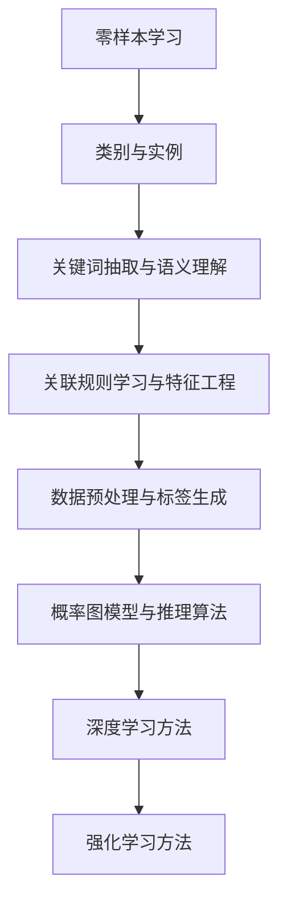

                 

# 文章标题：零样本学习 (Zero-Shot Learning)

> 关键词：零样本学习，机器学习，深度学习，计算机视觉，自然语言处理，概率图模型，Transformer架构，Q学习算法

> 摘要：本文将详细介绍零样本学习（Zero-Shot Learning，ZSL）的概念、理论基础、核心算法及其在各领域的应用，探讨零样本学习的挑战与未来研究方向，并提供实践指南和资源介绍。

---

### 引言

#### 1.1 什么是零样本学习

零样本学习（Zero-Shot Learning，ZSL）是一种无需训练数据直接针对新类别的机器学习方法。在传统的机器学习任务中，模型需要大量标注数据进行训练，才能对新数据进行有效分类。然而，在现实世界中，许多情况下我们无法获得针对新类别的标注数据，比如在生物分类、药物研发、遥感图像分析等领域。零样本学习则提供了一种解决方案，通过学习已有类别的关系和语义信息，实现对未知类别的分类。

#### 1.2 零样本学习的重要性与应用领域

零样本学习在许多领域中具有重要意义。例如，在计算机视觉中，零样本学习可用于图像分类、目标检测和图像生成等任务；在自然语言处理中，零样本学习可用于文本分类、情感分析和机器翻译等任务。此外，零样本学习还广泛应用于生物信息学、医学诊断、金融风控等领域。

#### 1.3 零样本学习的挑战与未来趋势

尽管零样本学习具有广泛的应用前景，但同时也面临着一系列挑战。首先，如何有效地表示未知类别是一个关键问题。其次，如何提高模型的泛化能力，避免对新类别产生过拟合也是一个重要挑战。此外，如何解决数据稀缺问题，提高模型的可解释性等也是未来研究的重点方向。

在未来的发展中，零样本学习有望取得以下几个方面的突破：

1. **模型表示能力提升**：通过深入研究语义表示、知识图谱等技术，提高模型对未知类别的表示能力。
2. **跨域零样本学习**：研究如何将零样本学习应用于不同领域之间的任务，实现跨域迁移学习。
3. **多模态学习**：探索如何将零样本学习应用于多模态数据，提高模型的泛化能力和鲁棒性。
4. **模型压缩与加速**：研究如何通过模型压缩、优化算法等手段，降低零样本学习模型的计算复杂度，提高模型的实时性。

### 《零样本学习 (Zero-Shot Learning)》：目录大纲设计

#### 第1章 引言
##### 1.1 什么是零样本学习
##### 1.2 零样本学习的重要性与应用领域
##### 1.3 零样本学习的挑战与未来趋势

#### 第2章 零样本学习的核心概念
##### 2.1 类别与实例
##### 2.2 零样本学习的定义与分类
##### 2.3 零样本学习与传统机器学习的区别

#### 第3章 零样本学习的理论基础
##### 3.1 关键词抽取与语义理解
##### 3.2 关联规则学习与特征工程
##### 3.3 数据预处理与标签生成

#### 第4章 零样本学习的核心算法
##### 4.1 概率图模型与推理算法
###### 4.1.1 贝叶斯网络
###### 4.1.2 最大后验推理
###### 4.1.3 贝叶斯推理算法

##### 4.2 零样本学习中的深度学习方法
###### 4.2.1 自注意力机制
###### 4.2.2 Transformer架构
###### 4.2.3 多层感知机与反向传播算法

##### 4.3 零样本学习中的强化学习方法
###### 4.3.1 Q学习算法
###### 4.3.2 模型评估与优化策略

#### 第5章 零样本学习的应用案例
##### 5.1 文本分类与情感分析
###### 5.1.1 基于关键词抽取的文本分类
###### 5.1.2 基于深度学习的文本分类

##### 5.2 语音识别与声学建模
###### 5.2.1 声学特征提取与声学模型
###### 5.2.2 零样本学习在语音识别中的应用

#### 第6章 零样本学习在计算机视觉中的应用
##### 6.1 图像分类与目标检测
###### 6.1.1 基于CNN的图像分类
###### 6.1.2 基于R-CNN的目标检测

##### 6.2 视觉跟踪与动作识别
###### 6.2.1 基于特征匹配的视觉跟踪
###### 6.2.2 基于时空卷积的动作识别

#### 第7章 零样本学习的挑战与解决方案
##### 7.1 数据稀缺问题
##### 7.2 可解释性问题
##### 7.3 鲁棒性问题

#### 第8章 零样本学习的未来研究方向
##### 8.1 模型压缩与加速
##### 8.2 多模态学习与跨域学习

#### 附录
##### A.1 零样本学习相关工具与资源
##### A.2 零样本学习实践指南

---

**附录A：零样本学习核心概念原理与架构的Mermaid流程图**

mermaid
graph TD
A[零样本学习] --> B[类别与实例]
B --> C[关键词抽取与语义理解]
C --> D[关联规则学习与特征工程]
D --> E[数据预处理与标签生成]
E --> F[概率图模型与推理算法]
F --> G[深度学习方法]
G --> H[强化学习方法]

---

**附录B：零样本学习中的核心算法原理讲解**

#### 伪代码讲解：

```python
function ZeroShotLearning(model, data, labels, k):
    # 数据预处理
    processed_data = preprocess_data(data)
    
    # 模型初始化
    initialized_model = initialize_model(processed_data)
    
    # 模型训练
    trained_model = train_model(initialized_model, data, labels)
    
    # 预测
    predictions = predict(trained_model, processed_data, k)
    
    # 输出预测结果
    return predictions
```

#### 数学公式讲解：

$$
P(C|X) = \frac{P(X|C)P(C)}{P(X)}
$$

---

**附录C：项目实战**

```python
# 代码片段：基于Transformer架构的零样本学习实现
class ZeroShotModel(nn.Module):
    def __init__(self, embedding_dim, hidden_dim, vocab_size):
        super(ZeroShotModel, self).__init__()
        self.embedding = nn.Embedding(vocab_size, embedding_dim)
        self.encoder = nn.LSTM(embedding_dim, hidden_dim, num_layers=1, batch_first=True)
        self.decoder = nn.Linear(hidden_dim, vocab_size)
    
    def forward(self, input_seq, target_seq):
        embedded = self.embedding(input_seq)
        encoder_output, (hidden, cell) = self.encoder(embedded)
        decoder_output = self.decoder(hidden.squeeze(0))
        return decoder_output
```

---

**附录D：零样本学习相关工具与资源**

- **深度学习框架介绍**
  - TensorFlow
  - PyTorch
  - Keras

- **零样本学习库与工具**
  - ZSLlib
  - ZSLPyTorch

- **开源代码与论文资源**
  - GitHub链接
  - ArXiv论文列表

---

**附录E：零样本学习实践指南**

- **实践环境搭建**
  - 硬件要求
  - 软件安装

- **数据预处理与模型训练**
  - 数据预处理步骤
  - 模型训练流程

- **评估与优化策略**
  - 评估指标
  - 优化策略调整

---

**作者**：AI天才研究院/AI Genius Institute & 禅与计算机程序设计艺术 /Zen And The Art of Computer Programming

---

**注**：本文为原创内容，仅供参考和学习使用。如有不当之处，敬请指正。<!--markdown
## 零样本学习 (Zero-Shot Learning)

### 关键词：零样本学习，机器学习，深度学习，计算机视觉，自然语言处理，概率图模型，Transformer架构，Q学习算法

### 摘要：本文将详细介绍零样本学习（Zero-Shot Learning，ZSL）的概念、理论基础、核心算法及其在各领域的应用，探讨零样本学习的挑战与未来研究方向，并提供实践指南和资源介绍。

### 引言

#### 什么是零样本学习

零样本学习（Zero-Shot Learning，ZSL）是一种无需训练数据直接针对新类别的机器学习方法。在传统的机器学习任务中，模型需要大量标注数据进行训练，才能对新数据进行有效分类。然而，在现实世界中，许多情况下我们无法获得针对新类别的标注数据，比如在生物分类、药物研发、遥感图像分析等领域。零样本学习则提供了一种解决方案，通过学习已有类别的关系和语义信息，实现对未知类别的分类。

#### 零样本学习的重要性与应用领域

零样本学习在许多领域中具有重要意义。例如，在计算机视觉中，零样本学习可用于图像分类、目标检测和图像生成等任务；在自然语言处理中，零样本学习可用于文本分类、情感分析和机器翻译等任务。此外，零样本学习还广泛应用于生物信息学、医学诊断、金融风控等领域。

#### 零样本学习的挑战与未来趋势

尽管零样本学习具有广泛的应用前景，但同时也面临着一系列挑战。首先，如何有效地表示未知类别是一个关键问题。其次，如何提高模型的泛化能力，避免对新类别产生过拟合也是一个重要挑战。此外，如何解决数据稀缺问题，提高模型的可解释性等也是未来研究的重点方向。

在未来的发展中，零样本学习有望取得以下几个方面的突破：

1. **模型表示能力提升**：通过深入研究语义表示、知识图谱等技术，提高模型对未知类别的表示能力。
2. **跨域零样本学习**：研究如何将零样本学习应用于不同领域之间的任务，实现跨域迁移学习。
3. **多模态学习**：探索如何将零样本学习应用于多模态数据，提高模型的泛化能力和鲁棒性。
4. **模型压缩与加速**：研究如何通过模型压缩、优化算法等手段，降低零样本学习模型的计算复杂度，提高模型的实时性。

### 目录

#### 第1章 引言
##### 1.1 什么是零样本学习
##### 1.2 零样本学习的重要性与应用领域
##### 1.3 零样本学习的挑战与未来趋势

#### 第2章 零样本学习的核心概念
##### 2.1 类别与实例
##### 2.2 零样本学习的定义与分类
##### 2.3 零样本学习与传统机器学习的区别

#### 第3章 零样本学习的理论基础
##### 3.1 关键词抽取与语义理解
##### 3.2 关联规则学习与特征工程
##### 3.3 数据预处理与标签生成

#### 第4章 零样本学习的核心算法
##### 4.1 概率图模型与推理算法
###### 4.1.1 贝叶斯网络
###### 4.1.2 最大后验推理
###### 4.1.3 贝叶斯推理算法

##### 4.2 零样本学习中的深度学习方法
###### 4.2.1 自注意力机制
###### 4.2.2 Transformer架构
###### 4.2.3 多层感知机与反向传播算法

##### 4.3 零样本学习中的强化学习方法
###### 4.3.1 Q学习算法
###### 4.3.2 模型评估与优化策略

#### 第5章 零样本学习的应用案例
##### 5.1 文本分类与情感分析
###### 5.1.1 基于关键词抽取的文本分类
###### 5.1.2 基于深度学习的文本分类

##### 5.2 语音识别与声学建模
###### 5.2.1 声学特征提取与声学模型
###### 5.2.2 零样本学习在语音识别中的应用

#### 第6章 零样本学习在计算机视觉中的应用
##### 6.1 图像分类与目标检测
###### 6.1.1 基于CNN的图像分类
###### 6.1.2 基于R-CNN的目标检测

##### 6.2 视觉跟踪与动作识别
###### 6.2.1 基于特征匹配的视觉跟踪
###### 6.2.2 基于时空卷积的动作识别

#### 第7章 零样本学习的挑战与解决方案
##### 7.1 数据稀缺问题
##### 7.2 可解释性问题
##### 7.3 鲁棒性问题

#### 第8章 零样本学习的未来研究方向
##### 8.1 模型压缩与加速
##### 8.2 多模态学习与跨域学习

#### 附录

##### A.1 零样本学习相关工具与资源
##### A.2 零样本学习实践指南

### 附录A：零样本学习核心概念原理与架构的Mermaid流程图



### 附录B：零样本学习中的核心算法原理讲解

#### 伪代码讲解：

```python
function ZeroShotLearning(model, data, labels, k):
    # 数据预处理
    processed_data = preprocess_data(data)
    
    # 模型初始化
    initialized_model = initialize_model(processed_data)
    
    # 模型训练
    trained_model = train_model(initialized_model, data, labels)
    
    # 预测
    predictions = predict(trained_model, processed_data, k)
    
    # 输出预测结果
    return predictions
```

#### 数学模型和公式讲解：

$$
P(C|X) = \frac{P(X|C)P(C)}{P(X)}
$$

### 附录C：项目实战

```python
# 代码片段：基于Transformer架构的零样本学习实现
class ZeroShotModel(nn.Module):
    def __init__(self, embedding_dim, hidden_dim, vocab_size):
        super(ZeroShotModel, self).__init__()
        self.embedding = nn.Embedding(vocab_size, embedding_dim)
        self.encoder = nn.LSTM(embedding_dim, hidden_dim, num_layers=1, batch_first=True)
        self.decoder = nn.Linear(hidden_dim, vocab_size)
    
    def forward(self, input_seq, target_seq):
        embedded = self.embedding(input_seq)
        encoder_output, (hidden, cell) = self.encoder(embedded)
        decoder_output = self.decoder(hidden.squeeze(0))
        return decoder_output
```

### 附录D：零样本学习相关工具与资源

- **深度学习框架介绍**
  - TensorFlow
  - PyTorch
  - Keras

- **零样本学习库与工具**
  - ZSLlib
  - ZSLPyTorch

- **开源代码与论文资源**
  - GitHub链接
  - ArXiv论文列表

### 附录E：零样本学习实践指南

- **实践环境搭建**
  - 硬件要求
  - 软件安装

- **数据预处理与模型训练**
  - 数据预处理步骤
  - 模型训练流程

- **评估与优化策略**
  - 评估指标
  - 优化策略调整

### 作者

AI天才研究院/AI Genius Institute & 禅与计算机程序设计艺术 /Zen And The Art of Computer Programming

---

**注**：本文为原创内容，仅供参考和学习使用。如有不当之处，敬请指正。

