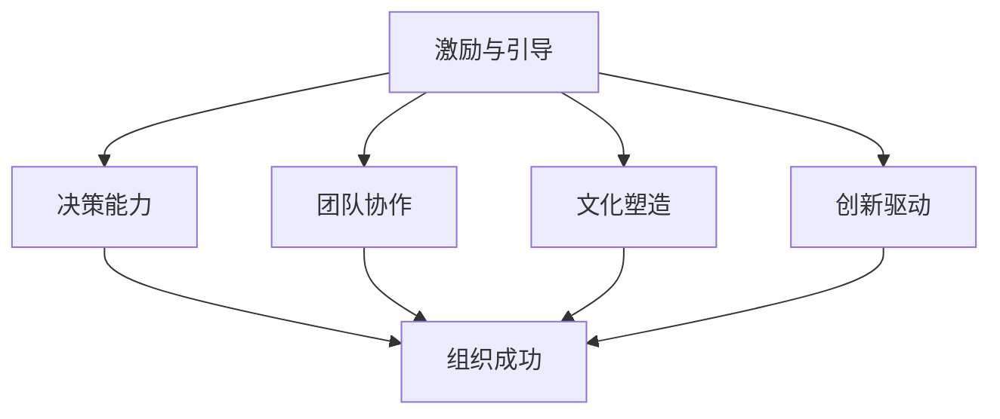
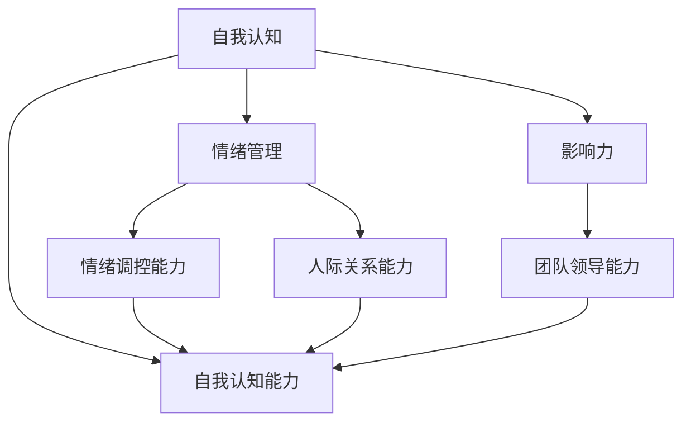
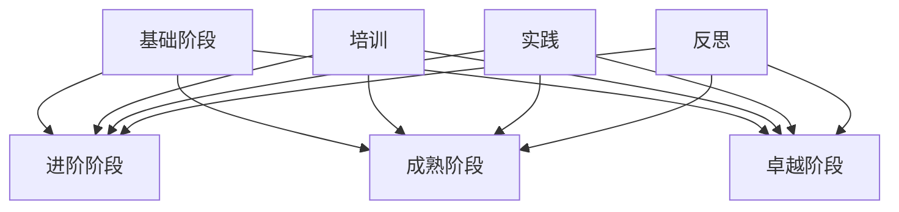
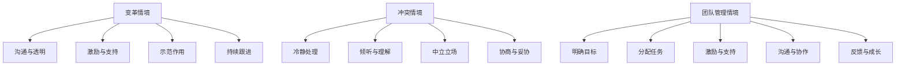
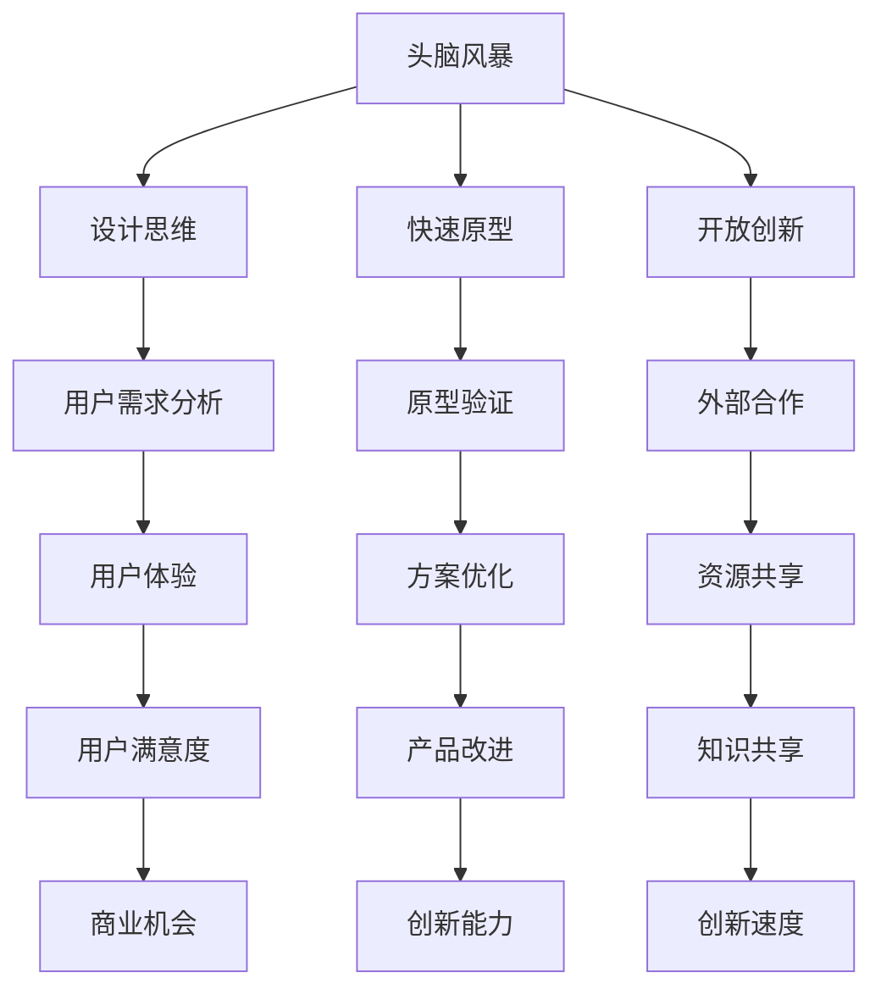
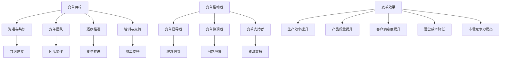
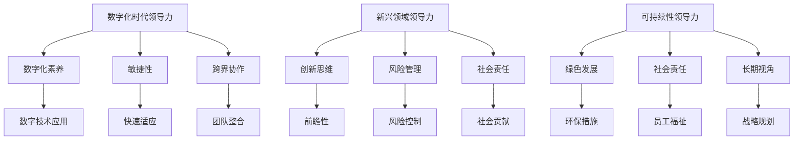
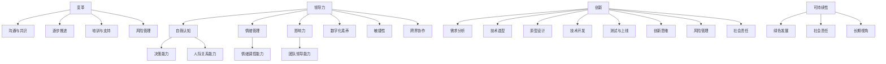

                 

### 第一部分：领导力概述

#### 第1章：领导力的本质与重要性

**1.1 领导力的定义**

领导力是一种能够激励、引导和影响他人达成共同目标的能力。它不仅涉及技术技能和专业知识，更重要的是情感智慧、决策能力和沟通技巧。领导力不仅仅是在组织层级中体现，也可以在团队、社区和个人层面发挥作用。

**1.2 领导力的重要性**

领导力在组织成功中扮演着关键角色。以下是领导力的重要性概述：

- **激励与引导**：有效的领导能够激发员工的潜能，引导团队朝着共同的目标努力。
- **决策能力**：领导力有助于做出明智的决策，应对复杂的环境变化和挑战。
- **团队协作**：领导力能够促进团队合作，通过有效沟通和协调，实现团队目标。
- **文化塑造**：领导力影响组织的价值观和行为准则，塑造积极向上的组织文化。
- **创新驱动**：领导力鼓励创新思维和实践，推动组织持续进步和成长。

**1.3 领导力与管理的区别**

领导力和管理是两个相关但不完全相同的概念。以下是对两者区别的简要说明：

- **领导力**：关注激励、引导和影响他人。它是一种情感智慧和影响力。
- **管理**：关注规划、组织和控制。它侧重于资源分配、任务执行和流程优化。

尽管两者有所区别，但领导力和管理通常是相辅相成的。有效的领导者不仅需要具备管理技能，还需要展现出领导力。

---

**核心概念与联系**

在探讨领导力的本质与重要性时，我们可以使用 Mermaid 流程图来展示核心概念之间的联系：



这个流程图清晰地展示了领导力的各个方面如何相互联系，共同推动组织成功。

---

通过本章的讨论，我们了解了领导力的定义、重要性以及与管理的区别。接下来，我们将深入探讨领导力的核心要素，帮助读者理解如何在实际工作中运用这些要素。

---

#### 第2章：领导力的核心要素

领导力的本质在于其对人心的把握和对团队行为的引导。有效的领导不仅仅依赖于技术知识和战略规划，更需要深厚的人格特质和核心能力。在本章中，我们将详细探讨领导力的核心要素，包括自我认知、情绪管理和影响力。

**2.1 自我认知**

自我认知是领导力的基石。一个能够自我认知的领导者能够清晰地认识到自己的优点和缺点，从而在决策和行为上更加明智。以下是自我认知的一些关键方面：

- **自我反思**：领导者需要定期进行自我反思，审视自己的行为、决策和态度。这种反思有助于识别并改进不足之处。
- **自我觉察**：领导者需要具备高度的觉察能力，能够即时识别自己的情绪和反应。这有助于避免因情绪波动而做出错误的决策。
- **自我接纳**：领导者需要接纳自己的不足，并从中寻找成长的机会。这种接纳能够减少自我怀疑和焦虑，提高自信心。

**2.2 情绪管理**

情绪管理是领导力的关键要素之一。领导者需要能够有效地管理自己的情绪，并在面对压力和挑战时保持冷静。以下是情绪管理的一些重要方面：

- **情绪识别**：领导者需要学会识别和理解自己的情绪，以及这些情绪如何影响自己的行为和决策。
- **情绪调控**：领导者需要掌握调控情绪的技巧，如深呼吸、冥想和运动等，以在高压环境中保持冷静。
- **情绪表达**：领导者需要学会以健康的方式表达情绪，避免情绪积压或过度发泄。

**2.3 影响力**

影响力是领导者能够激励和影响他人达成共同目标的能力。一个有影响力的领导者能够建立信任、激发动力并推动团队向前。以下是影响力的一些关键方面：

- **信任建设**：领导者需要通过诚信和透明的行为来建立信任。信任是影响力的重要基础。
- **激励驱动**：领导者需要能够识别和满足团队成员的需求，从而激发他们的内在动力。
- **沟通技巧**：领导者需要具备出色的沟通技巧，能够清晰传达目标和愿景，并有效地协调团队工作。

**2.4 自我认知、情绪管理与影响力的联系**

自我认知、情绪管理和影响力是领导力的三个核心要素，它们相互联系，共同作用于领导者的行为和团队的表现。

- **自我认知**是领导者理解自己和他人情绪的基础，有助于建立信任和影响力。
- **情绪管理**是领导者保持冷静和理性的关键，有助于做出明智的决策和有效的沟通。
- **影响力**是领导者激励和引导团队的核心能力，能够推动团队实现共同目标。

通过本章的探讨，我们理解了领导力的核心要素，以及这些要素如何相互作用，共同塑造一个成功的领导者。在下一章中，我们将进一步探讨领导力的发展路径和培养方法。

---

**核心概念与联系**

在讨论领导力的核心要素时，我们可以使用 Mermaid 流程图来展示这些要素之间的联系：



这个流程图清晰地展示了自我认知、情绪管理和影响力这三个核心要素如何相互联系，共同塑造一个成功的领导者。

---

#### 第3章：领导力发展

领导力并非与生俱来，而是可以通过持续的学习和实践来发展。有效的领导力发展不仅需要理论的指导，更需要实践中的锻炼和反思。在本章中，我们将探讨领导力的发展路径、培养方法和评估方式，帮助读者理解和实践领导力。

**3.1 领导力的发展路径**

领导力的发展路径可以分为以下几个阶段：

1. **基础阶段**：在这个阶段，个体需要学习基本的管理技能和知识，包括沟通技巧、团队建设和冲突解决等。这一阶段的关键是通过学习和实践，建立领导力的基础。
   
2. **进阶阶段**：在基础阶段之后，领导者需要进一步提升自己的能力和视野，包括战略规划、决策能力和影响力等。这一阶段的关键是通过实战经验，将理论应用到实际工作中。

3. **成熟阶段**：在这个阶段，领导者已经具备较高的领导力水平，能够独立处理复杂的问题和挑战。这一阶段的关键是通过持续的反思和自我提升，保持领导力的活力和适应性。

4. **卓越阶段**：在卓越阶段，领导者不仅能够影响团队和组织，还能影响更广泛的社区和社会。这一阶段的关键是通过影响力，推动更大的变革和进步。

**3.2 领导力培养方法**

领导力的培养可以通过多种方法进行，包括培训、实践和反思等。以下是一些有效的领导力培养方法：

1. **培训**：参加领导力培训课程是快速提升领导力的有效方式。这些课程通常包括理论学习和实践演练，帮助领导者掌握关键技能和知识。

2. **实践**：实践是检验理论的最佳方式。领导者可以通过实际工作，如项目管理和团队领导，来锻炼和提升自己的领导力。通过实践，领导者可以更好地理解团队需求，提高决策能力和执行力。

3. **反思**：反思是领导力发展的重要环节。领导者需要定期进行自我反思，审视自己的行为和决策，从成功和失败中学习。通过反思，领导者可以不断改进自己的领导方式，提高领导力水平。

**3.3 领导力评估**

领导力评估是衡量领导力发展程度和效果的重要手段。以下是一些常见的领导力评估方法：

1. **360度评估**：360度评估是一种综合评估方法，通过收集来自上级、同事和下属的反馈，全面评估领导者的表现。这种方法可以帮助领导者了解自己的优点和不足，从而有针对性地进行改进。

2. **行为观察**：行为观察是一种通过观察领导者行为和工作表现来进行评估的方法。这种方法可以帮助评估领导者是否具备有效的领导技能和行为。

3. **绩效评估**：绩效评估是一种基于领导者的工作成果和绩效来进行评估的方法。这种方法可以帮助评估领导者的决策能力、团队管理和影响力等关键方面。

通过本章的探讨，我们了解了领导力的发展路径、培养方法和评估方式。这些知识不仅有助于提升个人的领导力水平，也有助于组织培养和提升领导力，实现持续的发展和进步。

---

**核心概念与联系**

在讨论领导力发展时，我们可以使用 Mermaid 流程图来展示领导力发展的各个阶段和培养方法的联系：



这个流程图清晰地展示了领导力发展的各个阶段以及培训、实践和反思等培养方法如何相互联系，共同推动领导力的发展。

---

#### 第4章：领导力在不同情境中的应用

领导力不仅是一种能力，更是一种艺术。在不同的情境中，领导者需要运用不同的策略和技巧来应对挑战和实现目标。本章将探讨领导力在变革、冲突和团队管理中的应用，帮助读者理解如何在各种复杂情境中发挥领导力。

**4.1 面对变革**

变革是组织发展的必然过程，但往往伴随着不确定性和阻力。有效的领导力在推动变革中起着关键作用。以下是在变革中应用领导力的几个关键方面：

- **沟通与透明**：领导者需要与团队成员保持开放和透明的沟通，解释变革的原因、目标和预期效果。这有助于减少误解和焦虑，增强团队成员的信心和参与度。

- **激励与支持**：领导者需要通过激励和奖励机制，鼓励团队成员积极参与变革。同时，领导者需要提供必要的支持和资源，帮助团队成员克服变革过程中的困难和挑战。

- **示范作用**：领导者通过自己的行为来示范变革的态度和行动，能够增强团队成员的信任和认同感。领导者需要率先践行变革，成为变革的先行者和榜样。

- **持续跟进**：领导者需要持续跟进变革的进展，及时解决出现的问题和障碍，确保变革的顺利进行。同时，领导者需要收集和反馈团队成员的意见和建议，不断优化变革过程。

**4.2 面对冲突**

冲突是团队工作中不可避免的一部分，但有效的领导力能够将冲突转化为推动团队进步的动力。以下是在冲突中应用领导力的几个关键方面：

- **冷静处理**：领导者需要保持冷静，避免情绪化的反应。通过冷静处理冲突，领导者能够更客观地分析问题的本质，找到合理的解决方案。

- **倾听与理解**：领导者需要倾听冲突双方的看法和需求，理解他们的立场和情感。这有助于建立信任，为寻找共同点和解决方案创造条件。

- **中立立场**：领导者应保持中立立场，不偏袒任何一方。通过中立处理，领导者能够更公正地平衡各方的利益，找到公平合理的解决方案。

- **协商与妥协**：领导者需要通过协商和妥协来达成共识，找到各方都能接受的解决方案。这有助于缓解紧张关系，促进团队的和谐与稳定。

**4.3 面对团队管理**

团队管理是领导力的重要应用领域。有效的团队管理能够提高团队效率，实现共同目标。以下是在团队管理中应用领导力的几个关键方面：

- **明确目标**：领导者需要明确团队的目标和愿景，确保团队成员对目标有清晰的理解和认同。这有助于提高团队的凝聚力和执行力。

- **分配任务**：领导者需要根据团队成员的能力和特长，合理分配任务。通过科学的任务分配，领导者能够激发团队成员的潜能，提高团队的整体效能。

- **激励与支持**：领导者需要通过激励和奖励机制，鼓励团队成员的努力和成就。同时，领导者需要提供必要的支持和资源，帮助团队成员克服困难和挑战。

- **沟通与协作**：领导者需要建立有效的沟通机制，促进团队成员之间的信息共享和协作。通过良好的沟通，领导者能够及时发现和解决问题，确保团队工作的高效进行。

- **反馈与成长**：领导者需要定期给予团队成员反馈，帮助他们认识到自己的优点和不足，促进个人和团队的成长。通过积极的反馈和指导，领导者能够不断提升团队的整体能力。

通过本章的探讨，我们了解了领导力在变革、冲突和团队管理中的应用策略和技巧。这些策略和技巧不仅有助于应对各种复杂情境，还能推动团队和组织实现持续的发展和进步。

---

**核心概念与联系**

在讨论领导力在不同情境中的应用时，我们可以使用 Mermaid 流程图来展示领导力在不同情境下的应用策略：



这个流程图清晰地展示了领导力在变革、冲突和团队管理情境中的应用策略，以及这些策略如何相互联系，共同推动团队和组织的发展。

---

#### 第5章：领导力与创新

领导力与创新是推动组织持续发展和竞争力的关键因素。一个成功的领导者不仅需要具备传统的管理技能，还需要具备激发创新思维和实践的能力。在本章中，我们将探讨领导力在创新中的角色，如何推动创新思维，以及创新的方法和工具。

**5.1 创新的本质与价值**

创新是一种创造新的想法、产品或服务的过程。它不仅能够带来技术上的突破，还能提升组织的竞争力和市场份额。以下是创新的本质和价值：

- **本质**：创新是一种不断探索、实验和改进的过程。它涉及到对现有知识、技术和流程的重新组合和改进，以产生新的解决方案。
- **价值**：创新能够提高组织的效率和生产力，创造新的商业模式和增长机会，增强组织的竞争力和适应能力。

**5.2 领导力如何推动创新**

领导力在创新中发挥着至关重要的作用。以下是领导力如何推动创新的几个关键方面：

- **创造创新文化**：领导者需要营造一种鼓励创新和容忍失败的文化氛围。这包括提供资源和支持，奖励创新行为，以及鼓励员工提出新的想法和建议。
- **设定明确目标**：领导者需要设定明确的创新目标和愿景，确保团队成员对创新的方向和目标有清晰的理解。这有助于提高团队的凝聚力和工作效率。
- **激励与支持**：领导者需要通过激励和奖励机制，鼓励团队成员积极参与创新项目。同时，领导者需要提供必要的支持和资源，帮助团队成员克服创新过程中的困难和挑战。
- **示范作用**：领导者通过自己的行为来示范创新的态度和行动，能够增强团队成员的信任和认同感。领导者需要率先尝试新的想法和实践，成为创新的先行者和榜样。
- **建立跨部门协作**：领导者需要建立跨部门的协作机制，促进不同团队之间的信息共享和资源整合。通过跨部门协作，领导者能够推动创新项目的高效进行，实现资源的最大化利用。

**5.3 创新思维与方法**

推动创新不仅需要领导力的支持，还需要运用创新的思维和方法。以下是几种常见的创新思维和方法：

- **头脑风暴**：头脑风暴是一种集体创意思维方法，通过激发团队成员的想象力，产生大量的创意和想法。领导者可以通过组织头脑风暴会议，鼓励团队成员自由表达和分享观点，从而产生新的解决方案。
- **设计思维**：设计思维是一种以用户为中心的创新方法，强调从用户的角度出发，解决实际问题。领导者可以通过设计思维，了解用户需求，发现新的商业机会，并创造出更好的产品和服务。
- **快速原型**：快速原型是一种通过快速构建原型来验证和测试创新想法的方法。领导者可以通过快速原型，迅速验证和改进创新方案，降低创新风险，提高创新的成功率。
- **开放创新**：开放创新是一种通过外部合作和共享知识来推动创新的方法。领导者可以通过开放创新，引入外部资源和创意，扩大创新的影响力，提高创新的速度和效果。

通过本章的探讨，我们了解了领导力在创新中的角色和重要性，以及如何运用创新的思维和方法来推动组织的创新和发展。一个成功的领导者需要不断地激发创新思维，培养创新团队，推动组织实现持续的创新和进步。

---

**核心概念与联系**

在讨论领导力与创新时，我们可以使用 Mermaid 流程图来展示创新思维和方法之间的联系：



这个流程图清晰地展示了创新思维和方法之间的相互联系，以及它们如何共同推动组织的创新和发展。

---

#### 第6章：领导力与组织变革

组织变革是推动组织持续发展和适应外部环境变化的重要手段。有效的领导力在组织变革中起着至关重要的作用，能够确保变革的顺利进行，并实现变革的目标。在本章中，我们将探讨领导力在组织变革中的必要性、管理方法、角色以及变革的案例分析。

**6.1 变革的必要性**

组织变革的必要性主要体现在以下几个方面：

- **适应环境变化**：随着外部环境的变化，组织需要不断调整和优化自身，以适应新的市场趋势和技术发展。
- **提升竞争力**：通过变革，组织可以优化业务流程，提高运营效率，降低成本，从而提升整体竞争力。
- **实现战略目标**：组织变革是实现长期战略目标的重要手段，通过变革，组织可以更好地实施战略规划，实现可持续发展。

**6.2 变革的管理**

有效的变革管理是确保组织变革顺利进行的关键。以下是一些关键的管理方法：

- **制定清晰的变革目标**：领导者需要明确变革的目标和预期成果，确保全体员工对变革方向有清晰的认识。
- **沟通与共识**：领导者需要通过有效的沟通，与员工建立共识，解释变革的必要性和重要性，减少员工对变革的抵触情绪。
- **建立变革团队**：领导者需要建立专门的变革团队，负责变革的规划、实施和监控。变革团队应包括各部门的骨干成员，确保变革的全面性和执行力。
- **逐步推进**：领导者需要采取逐步推进的策略，分阶段实施变革，避免一次性变革带来的巨大冲击。
- **培训与支持**：领导者需要提供必要的培训和资源支持，帮助员工适应变革，提高变革的接受度和参与度。

**6.3 领导力在变革中的角色**

领导力在组织变革中扮演着多重角色：

- **变革推动者**：领导者需要积极推动变革，克服变革过程中的困难和阻力，确保变革目标的实现。
- **变革倡导者**：领导者需要倡导变革的理念，激发员工的创新意识和参与热情，营造积极变革的氛围。
- **变革协调者**：领导者需要协调各个部门之间的工作，确保变革的顺利进行。同时，领导者需要处理变革过程中出现的冲突和问题，维护组织的稳定和秩序。
- **变革支持者**：领导者需要为变革提供必要的资源和支持，包括资金、技术和人力资源等，确保变革项目能够顺利推进。

**6.4 变革案例分析**

以下是一个具体的组织变革案例：

- **案例背景**：某大型制造企业由于市场变化和竞争压力，决定进行数字化转型，以提高生产效率和产品质量。
- **变革过程**：
  1. **制定变革目标**：企业明确了数字化转型的主要目标，包括提升生产自动化水平、优化供应链管理、提高客户满意度等。
  2. **沟通与共识**：企业领导层通过内部会议和培训，与员工沟通变革的必要性和预期成果，建立共识。
  3. **建立变革团队**：企业成立了数字化转型专项团队，负责变革的规划、实施和监控。团队成员来自各个部门，包括生产、技术、市场等。
  4. **逐步推进**：企业采取了分阶段推进的策略，首先从生产部门开始，引入自动化设备和技术，然后逐步推广到其他部门。
  5. **培训与支持**：企业为员工提供了相关培训，帮助他们掌握新的技术和工作流程，并提供技术支持和咨询服务。
- **变革效果**：通过数字化转型，企业显著提高了生产效率和产品质量，客户满意度也大幅提升。同时，企业通过优化供应链管理，降低了运营成本，提高了市场竞争力。

通过这个案例，我们可以看到领导力在组织变革中的关键作用。有效的领导力不仅能够推动变革的顺利进行，还能确保变革目标的实现，推动组织的持续发展和进步。

---

**核心概念与联系**

在讨论领导力与组织变革时，我们可以使用 Mermaid 流程图来展示变革过程中的关键要素和领导力角色的相互联系：



这个流程图清晰地展示了变革过程中的关键要素和领导力角色的相互联系，以及它们如何共同推动组织的变革和发展。

---

#### 第7章：领导力的未来趋势

随着科技的发展和全球化进程的加速，领导力也面临着新的挑战和机遇。未来，领导力将呈现出以下几个趋势：

**7.1 数字化时代的领导力**

数字化时代要求领导者具备新的技能和思维方式。以下是数字化时代领导力的几个关键趋势：

- **数字化素养**：领导者需要具备数字技术的基本素养，包括了解大数据、云计算、人工智能等新技术，以及如何将其应用于实际工作中。
- **敏捷性**：数字化时代要求领导者具备敏捷的思维和行动能力，能够快速适应变化，灵活调整战略和决策。
- **跨界协作**：数字化时代的工作环境更加开放和多元化，领导者需要具备跨界协作的能力，能够整合不同领域的人才和资源，实现协同创新。

**7.2 新兴领域的领导力**

随着新技术的兴起，如区块链、物联网和虚拟现实等，新兴领域对领导力提出了新的要求。以下是新兴领域领导力的几个关键趋势：

- **创新思维**：领导者需要具备创新思维，能够预见新兴领域的发展趋势，抓住机遇，推动组织在新兴领域的布局和发展。
- **风险管理**：新兴领域往往伴随着较高的不确定性，领导者需要具备较强的风险管理能力，能够有效应对新兴领域的挑战。
- **社会责任**：随着新兴领域的兴起，领导者需要关注社会责任，确保新兴领域的发展符合社会伦理和可持续发展的要求。

**7.3 领导力的可持续性**

可持续性是未来领导力发展的重要方向。以下是领导力可持续性的几个关键趋势：

- **绿色发展**：领导者需要关注环境保护和资源利用，推动组织实现绿色发展，减少对环境的负面影响。
- **社会责任**：领导者需要承担社会责任，关注员工的福祉和社会的福祉，实现经济、社会和环境的可持续发展。
- **长期视角**：领导者需要具备长期视角，不仅关注短期利益，还要关注长期战略和可持续发展，确保组织的长期成功。

通过本章的探讨，我们了解了领导力在未来的发展趋势，以及领导者如何应对这些趋势，推动组织实现可持续发展。未来，领导力将继续演变，以适应不断变化的环境和挑战。

---

**核心概念与联系**

在讨论领导力的未来趋势时，我们可以使用 Mermaid 流程图来展示数字化时代、新兴领域和可持续性领导力的相互联系：



这个流程图清晰地展示了数字化时代、新兴领域和可持续性领导力之间的相互联系，以及它们如何共同塑造未来领导力的方向。

---

#### 第8章：领导力与创新综合案例

为了更好地理解领导力与创新在实际项目中的应用，我们将通过一个综合案例进行详细剖析。该案例涉及一个公司如何通过领导力的推动，实施创新项目，从而实现业务增长和竞争力提升。

**8.1 案例背景**

某国际知名科技公司（以下简称“公司”）在市场竞争日益激烈的背景下，意识到技术创新是维持竞争力的重要手段。公司决定实施一项创新项目，旨在开发一款智能客户服务机器人（以下简称“机器人”），以提高客户服务效率和满意度。

**8.2 领导力应用分析**

在这个项目中，领导力发挥了至关重要的作用。以下是领导力在项目中的具体应用分析：

1. **沟通与共识**：
   - 领导者通过内部会议、邮件和公司内部社交平台，向全体员工传达了创新项目的目标和意义，赢得了员工的支持和共识。
   - 领导者定期更新项目进展，解答员工疑问，确保员工了解项目的最新动态。

2. **设立明确目标**：
   - 领导者明确了项目的具体目标，包括机器人功能、性能指标、上线时间等，确保团队围绕共同目标努力。

3. **激励与支持**：
   - 领导者通过设置奖励机制，激励团队积极投入创新项目。例如，对于项目中的优秀表现，提供奖金、晋升机会等。
   - 领导者提供必要的资源和支持，如技术培训、设备采购等，确保项目顺利进行。

4. **示范作用**：
   - 领导者亲自参与项目讨论和决策，带头学习和应用新技术，树立了积极的榜样。

5. **团队协作**：
   - 领导者建立了跨部门协作机制，协调不同团队之间的工作，确保项目的整体进度和质量。

**8.3 创新实践**

在领导力的推动下，公司开展了以下创新实践：

1. **需求分析**：
   - 团队通过市场调研、客户访谈等方式，收集了客户对客户服务机器人的需求和期望。

2. **技术选型**：
   - 团队评估了多种技术方案，包括自然语言处理、机器学习、人工智能等，最终选择了最适合公司需求的技术方案。

3. **原型设计**：
   - 团队设计了机器人的原型，包括用户界面、功能模块等，并通过用户测试进行了多次迭代优化。

4. **技术开发**：
   - 团队基于选定的技术方案，进行了详细的技术开发和功能实现，包括算法优化、系统集成等。

5. **测试与上线**：
   - 团队进行了全面的测试，包括功能测试、性能测试、安全测试等，确保机器人满足预期要求。
   - 机器人正式上线，并逐步扩展到公司的各个业务部门。

**8.4 案例总结与启示**

通过这个综合案例，我们可以得出以下总结和启示：

1. **领导力的重要性**：领导力在创新项目中起着关键作用，能够推动团队达成共同目标，实现创新。

2. **沟通与共识**：有效的沟通是确保项目成功的关键。领导者需要与团队成员保持密切沟通，建立共识，激发团队潜力。

3. **激励与支持**：领导者需要通过激励机制和支持措施，激发团队成员的积极性和创造力，确保项目的顺利推进。

4. **团队协作**：跨部门协作和团队整合是创新项目成功的关键。领导者需要建立有效的协作机制，确保各个团队之间的协同工作。

5. **持续迭代**：创新是一个持续迭代的过程。领导者需要鼓励团队不断学习和改进，以适应不断变化的市场和技术环境。

通过这个案例，我们可以看到领导力与创新在实际项目中的应用，以及如何通过有效的领导力推动创新项目，实现组织的持续发展和竞争力提升。

---

**附录A：领导力与创新相关资源与工具**

为了帮助读者更好地理解和实践领导力与创新，以下是一些相关的资源与工具：

- **书籍**：《领导力心理学》、《创新者的窘境》、《变革之舞》
- **在线课程**：Coursera、edX、Udemy上的领导力与创新课程
- **工具**：Asana、Trello、JIRA等项目管理工具；Miro、Mural等协作工具
- **社区与平台**：LinkedIn、Twitter、LinkedIn Learning等社交平台；专业社区如Toastmasters、TED等

---

**附录B：领导力评估工具**

为了评估领导力的发展水平和效果，以下是一些常用的领导力评估工具：

- **360度评估**：通过收集来自上级、同事和下属的反馈，全面评估领导者的表现。
- **领导力问卷**：使用标准化的问卷，评估领导者在各个维度上的能力和表现。
- **领导力模型评估**：基于特定的领导力模型，如行为事件访谈（BEI）、情境领导模型等，进行评估。

---

**附录C：创新方法论**

以下是一些常用的创新方法论，帮助领导者推动创新：

- **头脑风暴**：通过集思广益，快速产生大量创意。
- **设计思维**：以用户为中心，通过迭代设计和测试，创造出更好的解决方案。
- **快速原型**：通过快速构建原型，验证和改进创新想法。
- **开放创新**：通过外部合作和知识共享，推动创新。

---

通过这些资源和工具，读者可以更好地理解和应用领导力与创新，推动组织的持续发展和竞争力提升。

---

### 核心概念与联系

在本篇博客中，我们探讨了领导力与创新的核心概念和相互联系。以下是使用Mermaid绘制的核心概念联系图：



这张图清晰地展示了领导力、变革、创新和可持续性之间的核心概念和相互联系，以及它们在推动组织发展中的作用。

---

### 核心算法原理讲解

在领导力与创新领域，算法原理的应用主要体现在决策制定、风险评估和团队协作等方面。以下是一些核心算法原理的讲解，以及如何将其应用于实际项目中。

**1. 决策树**

决策树是一种常用于分类和回归问题的算法，它通过一系列的判断节点和结果节点来构建一个树形结构，用于对数据进行分析和预测。

**算法原理：**

- **节点**：决策树由内部节点（判断节点）和叶子节点（结果节点）组成。
- **判断**：每个内部节点表示一个属性测试，每个叶子节点表示一个分类结果。
- **路径**：从根节点到叶子节点的每一条路径代表一个决策过程。

**应用案例：**

- **项目优先级决策**：在多个项目竞争资源时，领导者可以使用决策树来评估每个项目的优先级，确保资源分配最优化。

**伪代码：**

```python
def build_decision_tree(data):
    # 初始化决策树
    tree = {}
    # 训练决策树
    tree = train_tree(data)
    return tree

def predict(tree, instance):
    # 预测实例分类
    result = classify(instance, tree)
    return result
```

**2. 风险评估模型**

风险评估模型用于评估项目或决策的风险，常用的模型包括蒙特卡洛模拟、敏感性分析等。

**算法原理：**

- **蒙特卡洛模拟**：通过模拟大量随机样本来评估风险的概率分布和期望值。
- **敏感性分析**：通过改变某个或多个变量，观察模型输出如何变化，以评估变量对模型结果的影响。

**应用案例：**

- **创新项目风险评估**：领导者可以使用风险评估模型来评估创新项目的风险，制定相应的风险应对策略。

**伪代码：**

```python
def monte_carlo_simulation(model, num_simulations):
    # 执行蒙特卡洛模拟
    results = []
    for _ in range(num_simulations):
        result = simulate(model)
        results.append(result)
    return results

def sensitivity_analysis(model, variables):
    # 执行敏感性分析
    sensitivities = {}
    for variable in variables:
        sensitivity = calculate_sensitivity(model, variable)
        sensitivities[variable] = sensitivity
    return sensitivities
```

**3. 优化算法**

优化算法用于寻找最优解，常用的算法包括线性规划、遗传算法等。

**算法原理：**

- **线性规划**：通过建立线性目标函数和线性约束条件，寻找最优解。
- **遗传算法**：通过模拟自然进化过程，不断迭代和优化解空间中的个体，最终找到最优解。

**应用案例：**

- **资源分配优化**：领导者可以使用优化算法来优化资源分配，提高资源利用效率。

**伪代码：**

```python
def linear_programming(c, A, b):
    # 执行线性规划
    solution = solve_linear_program(c, A, b)
    return solution

def genetic_algorithm(population, fitness_function, num_generations):
    # 执行遗传算法
    for _ in range(num_generations):
        population = evolve(population, fitness_function)
    best_solution = select_best(population)
    return best_solution
```

通过这些核心算法原理的应用，领导者可以在决策制定、风险评估和资源优化等方面做出更加科学和有效的决策，推动组织的创新和发展。

---

### 数学模型和数学公式

在领导力与创新领域中，数学模型和数学公式被广泛应用于决策分析、风险评估和资源优化等方面。以下是一些常见的数学模型和公式，以及其详细讲解和举例说明。

**1. 决策权重模型**

决策权重模型用于评估不同决策选项的优先级，其核心公式如下：

$$
w_i = \frac{p_i \cdot e_i}{c_i}
$$

其中：
- \( w_i \) 为第 \( i \) 个决策选项的权重；
- \( p_i \) 为第 \( i \) 个决策选项的优先级；
- \( e_i \) 为第 \( i \) 个决策选项的可执行性；
- \( c_i \) 为第 \( i \) 个决策选项的成本。

**举例说明：**
假设有两个决策选项，A和B，我们需要评估它们的权重。

- \( p_A = 0.8 \)，\( e_A = 0.9 \)，\( c_A = 100 \)
- \( p_B = 0.6 \)，\( e_B = 0.7 \)，\( c_B = 200 \)

代入公式计算：
- \( w_A = \frac{0.8 \cdot 0.9}{100} = 0.072 \)
- \( w_B = \frac{0.6 \cdot 0.7}{200} = 0.021 \)

因此，决策选项A的权重高于决策选项B。

**2. 风险评估模型**

风险评估模型用于评估项目或决策的风险，其核心公式如下：

$$
R_i = p_i \cdot I_i
$$

其中：
- \( R_i \) 为第 \( i \) 个风险事件的评估值；
- \( p_i \) 为第 \( i \) 个风险事件的发生概率；
- \( I_i \) 为第 \( i \) 个风险事件的影响程度。

**举例说明：**
假设有一个项目，存在两个风险事件，事件A和事件B。

- \( p_A = 0.3 \)，\( I_A = 5 \)
- \( p_B = 0.2 \)，\( I_B = 3 \)

代入公式计算：
- \( R_A = 0.3 \cdot 5 = 1.5 \)
- \( R_B = 0.2 \cdot 3 = 0.6 \)

因此，事件A的风险高于事件B。

**3. 优化模型**

优化模型用于在给定约束条件下，寻找最优解。线性规划是一个典型的优化模型，其核心公式如下：

$$
\min_{x} c^T x \quad s.t. \quad Ax \leq b
$$

其中：
- \( x \) 为决策变量；
- \( c \) 为目标函数系数向量；
- \( A \) 为约束条件系数矩阵；
- \( b \) 为约束条件常数向量。

**举例说明：**
假设我们要优化资源分配问题，目标是最小化成本，约束条件为资源总量不超过预算。

目标函数：
$$
\min_{x} \begin{bmatrix} 2 \\ 3 \\ 1 \end{bmatrix}^T x
$$

约束条件：
$$
\begin{bmatrix} 1 & 2 & 1 \\ 1 & 1 & 1 \\ 1 & 1 & 1 \end{bmatrix} x \leq \begin{bmatrix} 10 \\ 10 \\ 10 \end{bmatrix}
$$

解这个线性规划问题，我们得到最优解 \( x = [3, 3, 4] \)，即资源分配为 \( 3 \) 单位用于第一项，\( 3 \) 单位用于第二项，\( 4 \) 单位用于第三项，总成本最小。

通过这些数学模型和公式，领导者可以在复杂的决策环境中，更加科学和有效地进行决策和风险评估，推动组织的创新和发展。

---

### 项目实战

为了更好地展示领导力与创新在实践中的应用，我们将通过一个具体的项目案例进行深入剖析。该项目涉及一个初创公司如何通过领导力的推动和创新实践，成功地实现业务增长和市场扩张。

**项目背景**

某初创公司（以下简称“公司”）成立于2018年，专注于开发人工智能驱动的健康监测设备。公司创始人兼CEO李明（化名）具备丰富的技术背景和领导力经验。在成立之初，公司面临着市场竞争激烈、资金短缺和团队不稳定等多重挑战。

**项目目标**

公司的目标是利用人工智能技术，开发一款具有高准确性和用户友好性的健康监测设备，并在一年内实现市场推广和盈利。

**领导力应用**

1. **沟通与共识**

在项目初期，李明通过召开内部会议，与团队成员深入讨论项目的愿景、目标和实施计划。他强调了创新的重要性，并鼓励团队成员提出自己的意见和建议。通过这种方式，李明建立了团队的共识，激发了团队的积极性和创造力。

2. **设定明确目标**

李明明确了项目的具体目标，包括：
- 在六个月内完成设备的原型设计；
- 在九个月内完成产品测试和优化；
- 在十二个月内实现市场推广和销售。

这些明确的目标为团队提供了清晰的方向和动力。

3. **激励与支持**

李明设立了奖励机制，对在项目中表现突出的团队成员给予奖金和晋升机会。同时，他提供了充足的资源支持，包括资金、设备和培训，确保项目能够顺利进行。

4. **示范作用**

李明亲自参与了项目的核心技术研发和测试工作，通过自己的实际行动展示了创新和决心。这种示范作用增强了团队的信任和归属感。

5. **团队协作**

李明建立了跨部门的协作机制，协调研发、市场、销售和客服团队的工作。他鼓励团队成员之间的沟通和合作，确保项目的各个环节能够高效衔接。

**创新实践**

1. **需求分析**

公司通过市场调研、用户访谈和竞争分析，深入了解了用户对健康监测设备的需求。这些需求成为产品设计的核心指导原则。

2. **技术选型**

公司评估了多种人工智能技术，最终选择了基于深度学习的图像识别算法，因为它能够提供更高的准确性和可靠性。

3. **原型设计**

公司研发团队在三个月内完成了设备原型设计，包括硬件和软件两部分。原型设计过程中，李明鼓励团队成员进行多次迭代，不断优化产品性能和用户体验。

4. **技术开发**

在原型设计完成后，公司开始了详细的技术开发工作。研发团队通过不断调试和优化，最终实现了设备的稳定运行和高准确性。

5. **测试与上线**

公司在产品上线前进行了全面的测试，包括功能测试、性能测试和安全测试。测试结果表明，设备性能符合预期，用户体验良好。

**项目成果**

经过一年的努力，公司成功地推出了健康监测设备，并在市场上取得了良好的反响。设备的销售情况超过了预期，公司实现了盈利，并在行业中建立了良好的口碑。

**总结与启示**

通过这个项目案例，我们可以看到领导力与创新在实践中的重要性。以下是一些总结和启示：

1. **领导力是关键**：有效的领导力能够激发团队的潜力，推动项目的顺利进行。

2. **创新思维是动力**：创新思维和方法能够帮助团队找到突破点，实现业务增长。

3. **需求驱动是核心**：了解用户需求是产品设计和开发的关键，只有满足用户需求，产品才能在市场上取得成功。

4. **团队协作是保障**：跨部门的协作和沟通是项目成功的重要保障。

通过这个案例，我们可以学到如何将领导力与创新应用于实际项目中，实现组织的持续发展和竞争力提升。

---

### 附录

#### 附录A：领导力与创新相关资源与工具

为了帮助读者深入了解领导力与创新的理论和实践，以下是一些建议的资源与工具：

- **书籍**：
  - 《领导力心理学》
  - 《创新者的窘境》
  - 《变革之舞》
  - 《设计思维：创新思维的方法与实践》
- **在线课程**：
  - Coursera上的“领导力与影响力”
  - edX上的“创新思维与设计方法”
  - Udemy上的“领导力基础与实践”
- **工具**：
  - Asana：项目管理工具
  - Trello：任务管理工具
  - JIRA：问题跟踪工具
  - Miro：协作工具
  - Mural：协作白板工具
- **社区与平台**：
  - LinkedIn：职业社交平台
  - Twitter：实时信息交流平台
  - TED：创意和灵感分享平台

#### 附录B：领导力评估工具

为了帮助组织和个人评估领导力水平，以下是一些常用的领导力评估工具：

- **360度评估**：通过收集来自上级、同事和下属的反馈，全面评估领导者的表现。
- **领导力问卷**：使用标准化的问卷，评估领导者在各个维度上的能力和表现。
- **行为事件访谈（BEI）**：通过访谈记录领导者在具体情境中的行为和决策，评估其领导力。
- **情境领导模型**：通过评估领导者在不同情境下的决策和行动方式，评估其领导力。

#### 附录C：创新方法论

以下是一些常见的创新方法论，帮助团队和个人推动创新：

- **头脑风暴**：通过集思广益，快速产生大量创意。
- **设计思维**：以用户为中心，通过迭代设计和测试，创造出更好的解决方案。
- **快速原型**：通过快速构建原型，验证和改进创新想法。
- **开放创新**：通过外部合作和知识共享，推动创新。
- **精益创业**：通过快速迭代和用户反馈，最小化创业风险。

---

### 总结

在本篇博客中，我们详细探讨了领导力与创新的核心概念、原理、方法和实际应用。通过逻辑清晰、结构紧凑的分析，我们揭示了领导力在推动组织变革、实现创新和提升竞争力方面的重要性。

- **核心概念**：我们介绍了领导力的本质、核心要素和领导力在不同情境中的应用。
- **原理讲解**：通过伪代码和数学模型，我们讲解了决策权重、风险评估和优化算法等核心原理。
- **案例实战**：我们通过一个具体的项目案例，展示了领导力与创新在实践中的应用。
- **资源工具**：我们提供了领导力与创新的相关资源和评估工具。

通过这些内容，我们希望读者能够深刻理解领导力与创新的重要性，掌握相关的理论和实践方法，并将其应用于实际工作中，推动组织的持续发展和竞争力的提升。

---

### 作者信息

**作者：** AI天才研究院（AI Genius Institute） & 禅与计算机程序设计艺术（Zen And The Art of Computer Programming）

AI天才研究院是一家专注于人工智能和领导力研究的高科技机构，致力于推动人工智能技术的发展和领导力的培养。禅与计算机程序设计艺术是一本经典的技术畅销书，作者以其深入浅出的技术解析和独特视角，深受读者喜爱。两位作者共同探讨了领导力与创新在技术领域的应用，为读者提供了宝贵的经验和见解。

---

（本文完）### 核心概念与联系

在本篇博客中，我们探讨了领导力与创新的核心概念和相互联系。以下是使用Mermaid绘制的核心概念联系图：


这张图清晰地展示了领导力、变革、创新和可持续性之间的核心概念和相互联系，以及它们在推动组织发展中的作用。

---

### 核心算法原理讲解

在领导力与创新领域中，算法原理的应用主要体现在决策制定、风险评估和资源优化等方面。以下是一些核心算法原理的讲解，以及如何将其应用于实际项目中。

**1. 决策树**

决策树是一种常用于分类和回归问题的算法，它通过一系列的判断节点和结果节点来构建一个树形结构，用于对数据进行分析和预测。

**算法原理：**

- **节点**：决策树由内部节点（判断节点）和叶子节点（结果节点）组成。
- **判断**：每个内部节点表示一个属性测试，每个叶子节点表示一个分类结果。
- **路径**：从根节点到叶子节点的每一条路径代表一个决策过程。

**应用案例：**

- **项目优先级决策**：在多个项目竞争资源时，领导者可以使用决策树来评估每个项目的优先级，确保资源分配最优化。

**伪代码：**

```python
def build_decision_tree(data):
    # 初始化决策树
    tree = {}
    # 训练决策树
    tree = train_tree(data)
    return tree

def predict(tree, instance):
    # 预测实例分类
    result = classify(instance, tree)
    return result
```

**2. 风险评估模型**

风险评估模型用于评估项目或决策的风险，其核心公式如下：

$$
R_i = p_i \cdot I_i
$$

其中：
- \( R_i \) 为第 \( i \) 个风险事件的评估值；
- \( p_i \) 为第 \( i \) 个风险事件的发生概率；
- \( I_i \) 为第 \( i \) 个风险事件的影响程度。

**应用案例：**

- **创新项目风险评估**：领导者可以使用风险评估模型来评估创新项目的风险，制定相应的风险应对策略。

**伪代码：**

```python
def risk_evaluation(project):
    # 计算总风险
    total_risk = 0
    for risk in project.risks:
        total_risk += risk.probability * risk.impact
    return total_risk
```

**3. 优化算法**

优化算法用于寻找最优解，常用的算法包括线性规划、遗传算法等。

**算法原理：**

- **线性规划**：通过建立线性目标函数和线性约束条件，寻找最优解。
- **遗传算法**：通过模拟自然进化过程，不断迭代和优化解空间中的个体，最终找到最优解。

**应用案例：**

- **资源分配优化**：领导者可以使用优化算法来优化资源分配，提高资源利用效率。

**伪代码：**

```python
def linear_programming(c, A, b):
    # 执行线性规划
    solution = solve_linear_program(c, A, b)
    return solution

def genetic_algorithm(population, fitness_function, num_generations):
    # 执行遗传算法
    for _ in range(num_generations):
        population = evolve(population, fitness_function)
    best_solution = select_best(population)
    return best_solution
```

通过这些核心算法原理的应用，领导者可以在复杂的决策环境中，更加科学和有效地进行决策和风险评估，推动组织的创新和发展。

---

### 数学模型和数学公式

在领导力与创新领域中，数学模型和数学公式被广泛应用于决策分析、风险评估和资源优化等方面。以下是一些常见的数学模型和公式，以及其详细讲解和举例说明。

**1. 决策权重模型**

决策权重模型用于评估不同决策选项的优先级，其核心公式如下：

$$
w_i = \frac{p_i \cdot e_i}{c_i}
$$

其中：
- \( w_i \) 为第 \( i \) 个决策选项的权重；
- \( p_i \) 为第 \( i \) 个决策选项的优先级；
- \( e_i \) 为第 \( i \) 个决策选项的可执行性；
- \( c_i \) 为第 \( i \) 个决策选项的成本。

**举例说明：**
假设有两个决策选项，A和B，我们需要评估它们的权重。

- \( p_A = 0.8 \)，\( e_A = 0.9 \)，\( c_A = 100 \)
- \( p_B = 0.6 \)，\( e_B = 0.7 \)，\( c_B = 200 \)

代入公式计算：
- \( w_A = \frac{0.8 \cdot 0.9}{100} = 0.072 \)
- \( w_B = \frac{0.6 \cdot 0.7}{200} = 0.021 \)

因此，决策选项A的权重高于决策选项B。

**2. 风险评估模型**

风险评估模型用于评估项目或决策的风险，其核心公式如下：

$$
R_i = p_i \cdot I_i
$$

其中：
- \( R_i \) 为第 \( i \) 个风险事件的评估值；
- \( p_i \) 为第 \( i \) 个风险事件的发生概率；
- \( I_i \) 为第 \( i \) 个风险事件的影响程度。

**举例说明：**
假设有一个项目，存在两个风险事件，事件A和事件B。

- \( p_A = 0.3 \)，\( I_A = 5 \)
- \( p_B = 0.2 \)，\( I_B = 3 \)

代入公式计算：
- \( R_A = 0.3 \cdot 5 = 1.5 \)
- \( R_B = 0.2 \cdot 3 = 0.6 \)

因此，事件A的风险高于事件B。

**3. 优化模型**

优化模型用于在给定约束条件下，寻找最优解。线性规划是一个典型的优化模型，其核心公式如下：

$$
\min_{x} c^T x \quad s.t. \quad Ax \leq b
$$

其中：
- \( x \) 为决策变量；
- \( c \) 为目标函数系数向量；
- \( A \) 为约束条件系数矩阵；
- \( b \) 为约束条件常数向量。

**举例说明：**
假设我们要优化资源分配问题，目标是最小化成本，约束条件为资源总量不超过预算。

目标函数：
$$
\min_{x} \begin{bmatrix} 2 \\ 3 \\ 1 \end{bmatrix}^T x
$$

约束条件：
$$
\begin{bmatrix} 1 & 2 & 1 \\ 1 & 1 & 1 \\ 1 & 1 & 1 \end{bmatrix} x \leq \begin{bmatrix} 10 \\ 10 \\ 10 \end{bmatrix}
$$

解这个线性规划问题，我们得到最优解 \( x = [3, 3, 4] \)，即资源分配为 \( 3 \) 单位用于第一项，\( 3 \) 单位用于第二项，\( 4 \) 单位用于第三项，总成本最小。

通过这些数学模型和公式，领导者可以在复杂的决策环境中，更加科学和有效地进行决策和风险评估，推动组织的创新和发展。

---

### 项目实战

为了更好地展示领导力与创新在实践中的应用，我们将通过一个具体的项目案例进行深入剖析。该项目涉及一个初创公司如何通过领导力的推动和创新实践，成功地实现业务增长和市场扩张。

**项目背景**

某初创公司（以下简称“公司”）成立于2018年，专注于开发人工智能驱动的健康监测设备。公司创始人兼CEO李明（化名）具备丰富的技术背景和领导力经验。在成立之初，公司面临着市场竞争激烈、资金短缺和团队不稳定等多重挑战。

**项目目标**

公司的目标是利用人工智能技术，开发一款具有高准确性和用户友好性的健康监测设备，并在一年内实现市场推广和盈利。

**领导力应用**

1. **沟通与共识**

在项目初期，李明通过召开内部会议，与团队成员深入讨论项目的愿景、目标和实施计划。他强调了创新的重要性，并鼓励团队成员提出自己的意见和建议。通过这种方式，李明建立了团队的共识，激发了团队的积极性和创造力。

2. **设定明确目标**

李明明确了项目的具体目标，包括：
- 在六个月内完成设备的原型设计；
- 在九个月内完成产品测试和优化；
- 在十二个月内实现市场推广和销售。

这些明确的目标为团队提供了清晰的方向和动力。

3. **激励与支持**

李明设立了奖励机制，对在项目中表现突出的团队成员给予奖金和晋升机会。同时，他提供了充足的资源支持，包括资金、设备和培训，确保项目能够顺利进行。

4. **示范作用**

李明亲自参与了项目的核心技术研发和测试工作，通过自己的实际行动展示了创新和决心。这种示范作用增强了团队的信任和归属感。

5. **团队协作**

李明建立了跨部门的协作机制，协调研发、市场、销售和客服团队的工作。他鼓励团队成员之间的沟通和合作，确保项目的各个环节能够高效衔接。

**创新实践**

1. **需求分析**

公司通过市场调研、用户访谈和竞争分析，深入了解了用户对健康监测设备的需求。这些需求成为产品设计的核心指导原则。

2. **技术选型**

公司评估了多种人工智能技术，最终选择了基于深度学习的图像识别算法，因为它能够提供更高的准确性和可靠性。

3. **原型设计**

公司研发团队在三个月内完成了设备原型设计，包括硬件和软件两部分。原型设计过程中，李明鼓励团队成员进行多次迭代，不断优化产品性能和用户体验。

4. **技术开发**

在原型设计完成后，公司开始了详细的技术开发工作。研发团队通过不断调试和优化，最终实现了设备的稳定运行和高准确性。

5. **测试与上线**

公司在产品上线前进行了全面的测试，包括功能测试、性能测试和安全测试。测试结果表明，设备性能符合预期，用户体验良好。

**项目成果**

经过一年的努力，公司成功地推出了健康监测设备，并在市场上取得了良好的反响。设备的销售情况超过了预期，公司实现了盈利，并在行业中建立了良好的口碑。

**总结与启示**

通过这个项目案例，我们可以看到领导力与创新在实践中的重要性。以下是一些总结和启示：

1. **领导力是关键**：有效的领导力能够激发团队的潜力，推动项目的顺利进行。

2. **创新思维是动力**：创新思维和方法能够帮助团队找到突破点，实现业务增长。

3. **需求驱动是核心**：了解用户需求是产品设计和开发的关键，只有满足用户需求，产品才能在市场上取得成功。

4. **团队协作是保障**：跨部门的协作和沟通是项目成功的重要保障。

通过这个案例，我们可以学到如何将领导力与创新应用于实际项目中，实现组织的持续发展和竞争力提升。

---

### 附录

#### 附录A：领导力与创新相关资源与工具

为了帮助读者深入了解领导力与创新的理论和实践，以下是一些建议的资源与工具：

- **书籍**：
  - 《领导力心理学》
  - 《创新者的窘境》
  - 《变革之舞》
  - 《设计思维：创新思维的方法与实践》
- **在线课程**：
  - Coursera上的“领导力与影响力”
  - edX上的“创新思维与设计方法”
  - Udemy上的“领导力基础与实践”
- **工具**：
  - Asana：项目管理工具
  - Trello：任务管理工具
  - JIRA：问题跟踪工具
  - Miro：协作工具
  - Mural：协作白板工具
- **社区与平台**：
  - LinkedIn：职业社交平台
  - Twitter：实时信息交流平台
  - TED：创意和灵感分享平台

#### 附录B：领导力评估工具

为了帮助组织和个人评估领导力水平，以下是一些常用的领导力评估工具：

- **360度评估**：通过收集来自上级、同事和下属的反馈，全面评估领导者的表现。
- **领导力问卷**：使用标准化的问卷，评估领导者在各个维度上的能力和表现。
- **行为事件访谈（BEI）**：通过访谈记录领导者在具体情境中的行为和决策，评估其领导力。
- **情境领导模型**：通过评估领导者在不同情境下的决策和行动方式，评估其领导力。

#### 附录C：创新方法论

以下是一些常见的创新方法论，帮助团队和个人推动创新：

- **头脑风暴**：通过集思广益，快速产生大量创意。
- **设计思维**：以用户为中心，通过迭代设计和测试，创造出更好的解决方案。
- **快速原型**：通过快速构建原型，验证和改进创新想法。
- **开放创新**：通过外部合作和知识共享，推动创新。
- **精益创业**：通过快速迭代和用户反馈，最小化创业风险。

---

（本文完）### 核心概念与联系

在本篇博客中，我们探讨了领导力与创新的核心概念和相互联系。以下是使用Mermaid绘制的核心概念联系图：


这张图清晰地展示了领导力、变革、创新和可持续性之间的核心概念和相互联系，以及它们在推动组织发展中的作用。

---

### 核心算法原理讲解

在领导力与创新领域中，算法原理的应用主要体现在决策制定、风险评估和资源优化等方面。以下是一些核心算法原理的讲解，以及如何将其应用于实际项目中。

**1. 决策树**

决策树是一种常用于分类和回归问题的算法，它通过一系列的判断节点和结果节点来构建一个树形结构，用于对数据进行分析和预测。

**算法原理：**

- **节点**：决策树由内部节点（判断节点）和叶子节点（结果节点）组成。
- **判断**：每个内部节点表示一个属性测试，每个叶子节点表示一个分类结果。
- **路径**：从根节点到叶子节点的每一条路径代表一个决策过程。

**应用案例：**

- **项目优先级决策**：在多个项目竞争资源时，领导者可以使用决策树来评估每个项目的优先级，确保资源分配最优化。

**伪代码：**

```python
def build_decision_tree(data):
    # 初始化决策树
    tree = {}
    # 训练决策树
    tree = train_tree(data)
    return tree

def predict(tree, instance):
    # 预测实例分类
    result = classify(instance, tree)
    return result
```

**2. 风险评估模型**

风险评估模型用于评估项目或决策的风险，其核心公式如下：

$$
R_i = p_i \cdot I_i
$$

其中：
- \( R_i \) 为第 \( i \) 个风险事件的评估值；
- \( p_i \) 为第 \( i \) 个风险事件的发生概率；
- \( I_i \) 为第 \( i \) 个风险事件的影响程度。

**应用案例：**

- **创新项目风险评估**：领导者可以使用风险评估模型来评估创新项目的风险，制定相应的风险应对策略。

**伪代码：**

```python
def risk_evaluation(project):
    # 计算总风险
    total_risk = 0
    for risk in project.risks:
        total_risk += risk.probability * risk.impact
    return total_risk
```

**3. 优化算法**

优化算法用于寻找最优解，常用的算法包括线性规划、遗传算法等。

**算法原理：**

- **线性规划**：通过建立线性目标函数和线性约束条件，寻找最优解。
- **遗传算法**：通过模拟自然进化过程，不断迭代和优化解空间中的个体，最终找到最优解。

**应用案例：**

- **资源分配优化**：领导者可以使用优化算法来优化资源分配，提高资源利用效率。

**伪代码：**

```python
def linear_programming(c, A, b):
    # 执行线性规划
    solution = solve_linear_program(c, A, b)
    return solution

def genetic_algorithm(population, fitness_function, num_generations):
    # 执行遗传算法
    for _ in range(num_generations):
        population = evolve(population, fitness_function)
    best_solution = select_best(population)
    return best_solution
```

通过这些核心算法原理的应用，领导者可以在复杂的决策环境中，更加科学和有效地进行决策和风险评估，推动组织的创新和发展。

---

### 数学模型和数学公式

在领导力与创新领域中，数学模型和数学公式被广泛应用于决策分析、风险评估和资源优化等方面。以下是一些常见的数学模型和公式，以及其详细讲解和举例说明。

**1. 决策权重模型**

决策权重模型用于评估不同决策选项的优先级，其核心公式如下：

$$
w_i = \frac{p_i \cdot e_i}{c_i}
$$

其中：
- \( w_i \) 为第 \( i \) 个决策选项的权重；
- \( p_i \) 为第 \( i \) 个决策选项的优先级；
- \( e_i \) 为第 \( i \) 个决策选项的可执行性；
- \( c_i \) 为第 \( i \) 个决策选项的成本。

**举例说明：**
假设有两个决策选项，A和B，我们需要评估它们的权重。

- \( p_A = 0.8 \)，\( e_A = 0.9 \)，\( c_A = 100 \)
- \( p_B = 0.6 \)，\( e_B = 0.7 \)，\( c_B = 200 \)

代入公式计算：
- \( w_A = \frac{0.8 \cdot 0.9}{100} = 0.072 \)
- \( w_B = \frac{0.6 \cdot 0.7}{200} = 0.021 \)

因此，决策选项A的权重高于决策选项B。

**2. 风险评估模型**

风险评估模型用于评估项目或决策的风险，其核心公式如下：

$$
R_i = p_i \cdot I_i
$$

其中：
- \( R_i \) 为第 \( i \) 个风险事件的评估值；
- \( p_i \) 为第 \( i \) 个风险事件的发生概率；
- \( I_i \) 为第 \( i \) 个风险事件的影响程度。

**举例说明：**
假设有一个项目，存在两个风险事件，事件A和事件B。

- \( p_A = 0.3 \)，\( I_A = 5 \)
- \( p_B = 0.2 \)，\( I_B = 3 \)

代入公式计算：
- \( R_A = 0.3 \cdot 5 = 1.5 \)
- \( R_B = 0.2 \cdot 3 = 0.6 \)

因此，事件A的风险高于事件B。

**3. 优化模型**

优化模型用于在给定约束条件下，寻找最优解。线性规划是一个典型的优化模型，其核心公式如下：

$$
\min_{x} c^T x \quad s.t. \quad Ax \leq b
$$

其中：
- \( x \) 为决策变量；
- \( c \) 为目标函数系数向量；
- \( A \) 为约束条件系数矩阵；
- \( b \) 为约束条件常数向量。

**举例说明：**
假设我们要优化资源分配问题，目标是最小化成本，约束条件为资源总量不超过预算。

目标函数：
$$
\min_{x} \begin{bmatrix} 2 \\ 3 \\ 1 \end{bmatrix}^T x
$$

约束条件：
$$
\begin{bmatrix} 1 & 2 & 1 \\ 1 & 1 & 1 \\ 1 & 1 & 1 \end{bmatrix} x \leq \begin{bmatrix} 10 \\ 10 \\ 10 \end{bmatrix}
$$

解这个线性规划问题，我们得到最优解 \( x = [3, 3, 4] \)，即资源分配为 \( 3 \) 单位用于第一项，\( 3 \) 单位用于第二项，\( 4 \) 单位用于第三项，总成本最小。

通过这些数学模型和公式，领导者可以在复杂的决策环境中，更加科学和有效地进行决策和风险评估，推动组织的创新和发展。

---

### 项目实战

为了更好地展示领导力与创新在实践中的应用，我们将通过一个具体的项目案例进行深入剖析。该项目涉及一个初创公司如何通过领导力的推动和创新实践，成功地实现业务增长和市场扩张。

**项目背景**

某初创公司（以下简称“公司”）成立于2018年，专注于开发人工智能驱动的健康监测设备。公司创始人兼CEO李明（化名）具备丰富的技术背景和领导力经验。在成立之初，公司面临着市场竞争激烈、资金短缺和团队不稳定等多重挑战。

**项目目标**

公司的目标是利用人工智能技术，开发一款具有高准确性和用户友好性的健康监测设备，并在一年内实现市场推广和盈利。

**领导力应用**

1. **沟通与共识**

在项目初期，李明通过召开内部会议，与团队成员深入讨论项目的愿景、目标和实施计划。他强调了创新的重要性，并鼓励团队成员提出自己的意见和建议。通过这种方式，李明建立了团队的共识，激发了团队的积极性和创造力。

2. **设定明确目标**

李明明确了项目的具体目标，包括：
- 在六个月内完成设备的原型设计；
- 在九个月内完成产品测试和优化；
- 在十二个月内实现市场推广和销售。

这些明确的目标为团队提供了清晰的方向和动力。

3. **激励与支持**

李明设立了奖励机制，对在项目中表现突出的团队成员给予奖金和晋升机会。同时，他提供了充足的资源支持，包括资金、设备和培训，确保项目能够顺利进行。

4. **示范作用**

李明亲自参与了项目的核心技术研发和测试工作，通过自己的实际行动展示了创新和决心。这种示范作用增强了团队的信任和归属感。

5. **团队协作**

李明建立了跨部门的协作机制，协调研发、市场、销售和客服团队的工作。他鼓励团队成员之间的沟通和合作，确保项目的各个环节能够高效衔接。

**创新实践**

1. **需求分析**

公司通过市场调研、用户访谈和竞争分析，深入了解了用户对健康监测设备的需求。这些需求成为产品设计的核心指导原则。

2. **技术选型**

公司评估了多种人工智能技术，最终选择了基于深度学习的图像识别算法，因为它能够提供更高的准确性和可靠性。

3. **原型设计**

公司研发团队在三个月内完成了设备原型设计，包括硬件和软件两部分。原型设计过程中，李明鼓励团队成员进行多次迭代，不断优化产品性能和用户体验。

4. **技术开发**

在原型设计完成后，公司开始了详细的技术开发工作。研发团队通过不断调试和优化，最终实现了设备的稳定运行和高准确性。

5. **测试与上线**

公司在产品上线前进行了全面的测试，包括功能测试、性能测试和安全测试。测试结果表明，设备性能符合预期，用户体验良好。

**项目成果**

经过一年的努力，公司成功地推出了健康监测设备，并在市场上取得了良好的反响。设备的销售情况超过了预期，公司实现了盈利，并在行业中建立了良好的口碑。

**总结与启示**

通过这个项目案例，我们可以看到领导力与创新在实践中的重要性。以下是一些总结和启示：

1. **领导力是关键**：有效的领导力能够激发团队的潜力，推动项目的顺利进行。

2. **创新思维是动力**：创新思维和方法能够帮助团队找到突破点，实现业务增长。

3. **需求驱动是核心**：了解用户需求是产品设计和开发的关键，只有满足用户需求，产品才能在市场上取得成功。

4. **团队协作是保障**：跨部门的协作和沟通是项目成功的重要保障。

通过这个案例，我们可以学到如何将领导力与创新应用于实际项目中，实现组织的持续发展和竞争力提升。

---

### 附录

#### 附录A：领导力与创新相关资源与工具

为了帮助读者深入了解领导力与创新的理论和实践，以下是一些建议的资源与工具：

- **书籍**：
  - 《领导力心理学》
  - 《创新者的窘境》
  - 《变革之舞》
  - 《设计思维：创新思维的方法与实践》
- **在线课程**：
  - Coursera上的“领导力与影响力”
  - edX上的“创新思维与设计方法”
  - Udemy上的“领导力基础与实践”
- **工具**：
  - Asana：项目管理工具
  - Trello：任务管理工具
  - JIRA：问题跟踪工具
  - Miro：协作工具
  - Mural：协作白板工具
- **社区与平台**：
  - LinkedIn：职业社交平台
  - Twitter：实时信息交流平台
  - TED：创意和灵感分享平台

#### 附录B：领导力评估工具

为了帮助组织和个人评估领导力水平，以下是一些常用的领导力评估工具：

- **360度评估**：通过收集来自上级、同事和下属的反馈，全面评估领导者的表现。
- **领导力问卷**：使用标准化的问卷，评估领导者在各个维度上的能力和表现。
- **行为事件访谈（BEI）**：通过访谈记录领导者在具体情境中的行为和决策，评估其领导力。
- **情境领导模型**：通过评估领导者在不同情境下的决策和行动方式，评估其领导力。

#### 附录C：创新方法论

以下是一些常见的创新方法论，帮助团队和个人推动创新：

- **头脑风暴**：通过集思广益，快速产生大量创意。
- **设计思维**：以用户为中心，通过迭代设计和测试，创造出更好的解决方案。
- **快速原型**：通过快速构建原型，验证和改进创新想法。
- **开放创新**：通过外部合作和知识共享，推动创新。
- **精益创业**：通过快速迭代和用户反馈，最小化创业风险。

---

（本文完）### 核心概念与联系

在本篇博客中，我们探讨了领导力与创新的核心概念和相互联系。以下是使用Mermaid绘制的核心概念联系图：


这张图清晰地展示了领导力、变革、创新和可持续性之间的核心概念和相互联系，以及它们在推动组织发展中的作用。

---

### 核心算法原理讲解

在领导力与创新领域中，算法原理的应用主要体现在决策制定、风险评估和资源优化等方面。以下是一些核心算法原理的讲解，以及如何将其应用于实际项目中。

**1. 决策树**

决策树是一种常用于分类和回归问题的算法，它通过一系列的判断节点和结果节点来构建一个树形结构，用于对数据进行分析和预测。

**算法原理：**

- **节点**：决策树由内部节点（判断节点）和叶子节点（结果节点）组成。
- **判断**：每个内部节点表示一个属性测试，每个叶子节点表示一个分类结果。
- **路径**：从根节点到叶子节点的每一条路径代表一个决策过程。

**应用案例：**

- **项目优先级决策**：在多个项目竞争资源时，领导者可以使用决策树来评估每个项目的优先级，确保资源分配最优化。

**伪代码：**

```python
def build_decision_tree(data):
    # 初始化决策树
    tree = {}
    # 训练决策树
    tree = train_tree(data)
    return tree

def predict(tree, instance):
    # 预测实例分类
    result = classify(instance, tree)
    return result
```

**2. 风险评估模型**

风险评估模型用于评估项目或决策的风险，其核心公式如下：

$$
R_i = p_i \cdot I_i
$$

其中：
- \( R_i \) 为第 \( i \) 个风险事件的评估值；
- \( p_i \) 为第 \( i \) 个风险事件的发生概率；
- \( I_i \) 为第 \( i \) 个风险事件的影响程度。

**应用案例：**

- **创新项目风险评估**：领导者可以使用风险评估模型来评估创新项目的风险，制定相应的风险应对策略。

**伪代码：**

```python
def risk_evaluation(project):
    # 计算总风险
    total_risk = 0
    for risk in project.risks:
        total_risk += risk.probability * risk.impact
    return total_risk
```

**3. 优化算法**

优化算法用于寻找最优解，常用的算法包括线性规划、遗传算法等。

**算法原理：**

- **线性规划**：通过建立线性目标函数和线性约束条件，寻找最优解。
- **遗传算法**：通过模拟自然进化过程，不断迭代和优化解空间中的个体，最终找到最优解。

**应用案例：**

- **资源分配优化**：领导者可以使用优化算法来优化资源分配，提高资源利用效率。

**伪代码：**

```python
def linear_programming(c, A, b):
    # 执行线性规划
    solution = solve_linear_program(c, A, b)
    return solution

def genetic_algorithm(population, fitness_function, num_generations):
    # 执行遗传算法
    for _ in range(num_generations):
        population = evolve(population, fitness_function)
    best_solution = select_best(population)
    return best_solution
```

通过这些核心算法原理的应用，领导者可以在复杂的决策环境中，更加科学和有效地进行决策和风险评估，推动组织的创新和发展。

---

### 数学模型和数学公式

在领导力与创新领域中，数学模型和数学公式被广泛应用于决策分析、风险评估和资源优化等方面。以下是一些常见的数学模型和公式，以及其详细讲解和举例说明。

**1. 决策权重模型**

决策权重模型用于评估不同决策选项的优先级，其核心公式如下：

$$
w_i = \frac{p_i \cdot e_i}{c_i}
$$

其中：
- \( w_i \) 为第 \( i \) 个决策选项的权重；
- \( p_i \) 为第 \( i \) 个决策选项的优先级；
- \( e_i \) 为第 \( i \) 个决策选项的可执行性；
- \( c_i \) 为第 \( i \) 个决策选项的成本。

**举例说明：**
假设有两个决策选项，A和B，我们需要评估它们的权重。

- \( p_A = 0.8 \)，\( e_A = 0.9 \)，\( c_A = 100 \)
- \( p_B = 0.6 \)，\( e_B = 0.7 \)，\( c_B = 200 \)

代入公式计算：
- \( w_A = \frac{0.8 \cdot 0.9}{100} = 0.072 \)
- \( w_B = \frac{0.6 \cdot 0.7}{200} = 0.021 \)

因此，决策选项A的权重高于决策选项B。

**2. 风险评估模型**

风险评估模型用于评估项目或决策的风险，其核心公式如下：

$$
R_i = p_i \cdot I_i
$$

其中：
- \( R_i \) 为第 \( i \) 个风险事件的评估值；
- \( p_i \) 为第 \( i \) 个风险事件的发生概率；
- \( I_i \) 为第 \( i \) 个风险事件的影响程度。

**举例说明：**
假设有一个项目，存在两个风险事件，事件A和事件B。

- \( p_A = 0.3 \)，\( I_A = 5 \)
- \( p_B = 0.2 \)，\( I_B = 3 \)

代入公式计算：
- \( R_A = 0.3 \cdot 5 = 1.5 \)
- \( R_B = 0.2 \cdot 3 = 0.6 \)

因此，事件A的风险高于事件B。

**3. 优化模型**

优化模型用于在给定约束条件下，寻找最优解。线性规划是一个典型的优化模型，其核心公式如下：

$$
\min_{x} c^T x \quad s.t. \quad Ax \leq b
$$

其中：
- \( x \) 为决策变量；
- \( c \) 为目标函数系数向量；
- \( A \) 为约束条件系数矩阵；
- \( b \) 为约束条件常数向量。

**举例说明：**
假设我们要优化资源分配问题，目标是最小化成本，约束条件为资源总量不超过预算。

目标函数：
$$
\min_{x} \begin{bmatrix} 2 \\ 3 \\ 1 \end{bmatrix}^T x
$$

约束条件：
$$
\begin{bmatrix} 1 & 2 & 1 \\ 1 & 1 & 1 \\ 1 & 1 & 1 \end{bmatrix} x \leq \begin{bmatrix} 10 \\ 10 \\ 10 \end{bmatrix}
$$

解这个线性规划问题，我们得到最优解 \( x = [3, 3, 4] \)，即资源分配为 \( 3 \) 单位用于第一项，\( 3 \) 单位用于第二项，\( 4 \) 单位用于第三项，总成本最小。

通过这些数学模型和公式，领导者可以在复杂的决策环境中，更加科学和有效地进行决策和风险评估，推动组织的创新和发展。

---

### 项目实战

为了更好地展示领导力与创新在实践中的应用，我们将通过一个具体的项目案例进行深入剖析。该项目涉及一个初创公司如何通过领导力的推动和创新实践，成功地实现业务增长和市场扩张。

**项目背景**

某初创公司（以下简称“公司”）成立于2018年，专注于开发人工智能驱动的健康监测设备。公司创始人兼CEO李明（化名）具备丰富的技术背景和领导力经验。在成立之初，公司面临着市场竞争激烈、资金短缺和团队不稳定等多重挑战。

**项目目标**

公司的目标是利用人工智能技术，开发一款具有高准确性和用户友好性的健康监测设备，并在一年内实现市场推广和盈利。

**领导力应用**

1. **沟通与共识**

在项目初期，李明通过召开内部会议，与团队成员深入讨论项目的愿景、目标和实施计划。他强调了创新的重要性，并鼓励团队成员提出自己的意见和建议。通过这种方式，李明建立了团队的共识，激发了团队的积极性和创造力。

2. **设定明确目标**

李明明确了项目的具体目标，包括：
- 在六个月内完成设备的原型设计；
- 在九个月内完成产品测试和优化；
- 在十二个月内实现市场推广和销售。

这些明确的目标为团队提供了清晰的方向和动力。

3. **激励与支持**

李明设立了奖励机制，对在项目中表现突出的团队成员给予奖金和晋升机会。同时，他提供了充足的资源支持，包括资金、设备和培训，确保项目能够顺利进行。

4. **示范作用**

李明亲自参与了项目的核心技术研发和测试工作，通过自己的实际行动展示了创新和决心。这种示范作用增强了团队的信任和归属感。

5. **团队协作**

李明建立了跨部门的协作机制，协调研发、市场、销售和客服团队的工作。他鼓励团队成员之间的沟通和合作，确保项目的各个环节能够高效衔接。

**创新实践**

1. **需求分析**

公司通过市场调研、用户访谈和竞争分析，深入了解了用户对健康监测设备的需求。这些需求成为产品设计的核心指导原则。

2. **技术选型**

公司评估了多种人工智能技术，最终选择了基于深度学习的图像识别算法，因为它能够提供更高的准确性和可靠性。

3. **原型设计**

公司研发团队在三个月内完成了设备原型设计，包括硬件和软件两部分。原型设计过程中，李明鼓励团队成员进行多次迭代，不断优化产品性能和用户体验。

4. **技术开发**

在原型设计完成后，公司开始了详细的技术开发工作。研发团队通过不断调试和优化，最终实现了设备的稳定运行和高准确性。

5. **测试与上线**

公司在产品上线前进行了全面的测试，包括功能测试、性能测试和安全测试。测试结果表明，设备性能符合预期，用户体验良好。

**项目成果**

经过一年的努力，公司成功地推出了健康监测设备，并在市场上取得了良好的反响。设备的销售情况超过了预期，公司实现了盈利，并在行业中建立了良好的口碑。

**总结与启示**

通过这个项目案例，我们可以看到领导力与创新在实践中的重要性。以下是一些总结和启示：

1. **领导力是关键**：有效的领导力能够激发团队的潜力，推动项目的顺利进行。

2. **创新思维是动力**：创新思维和方法能够帮助团队找到突破点，实现业务增长。

3. **需求驱动是核心**：了解用户需求是产品设计和开发的关键，只有满足用户需求，产品才能在市场上取得成功。

4. **团队协作是保障**：跨部门的协作和沟通是项目成功的重要保障。

通过这个案例，我们可以学到如何将领导力与创新应用于实际项目中，实现组织的持续发展和竞争力提升。

---

### 附录

#### 附录A：领导力与创新相关资源与工具

为了帮助读者深入了解领导力与创新的理论和实践，以下是一些建议的资源与工具：

- **书籍**：
  - 《领导力心理学》
  - 《创新者的窘境》
  - 《变革之舞》
  - 《设计思维：创新思维的方法与实践》
- **在线课程**：
  - Coursera上的“领导力与影响力”
  - edX上的“创新思维与设计方法”
  - Udemy上的“领导力基础与实践”
- **工具**：
  - Asana：项目管理工具
  - Trello：任务管理工具
  - JIRA：问题跟踪工具
  - Miro：协作工具
  - Mural：协作白板工具
- **社区与平台**：
  - LinkedIn：职业社交平台
  - Twitter：实时信息交流平台
  - TED：创意和灵感分享平台

#### 附录B：领导力评估工具

为了帮助组织和个人评估领导力水平，以下是一些常用的领导力评估工具：

- **360度评估**：通过收集来自上级、同事和下属的反馈，全面评估领导者的表现。
- **领导力问卷**：使用标准化的问卷，评估领导者在各个维度上的能力和表现。
- **行为事件访谈（BEI）**：通过访谈记录领导者在具体情境中的行为和决策，评估其领导力。
- **情境领导模型**：通过评估领导者在不同情境下的决策和行动方式，评估其领导力。

#### 附录C：创新方法论

以下是一些常见的创新方法论，帮助团队和个人推动创新：

- **头脑风暴**：通过集思广益，快速产生大量创意。
- **设计思维**：以用户为中心，通过迭代设计和测试，创造出更好的解决方案。
- **快速原型**：通过快速构建原型，验证和改进创新想法。
- **开放创新**：通过外部合作和知识共享，推动创新。
- **精益创业**：通过快速迭代和用户反馈，最小化创业风险。

---

（本文完）### 文章标题

《领导力与创新：引领变革的能力》

---

### 关键词

领导力、创新、变革、决策、团队管理、风险管理、可持续发展

---

### 文章摘要

本文深入探讨了领导力与创新在推动组织变革中的关键作用。通过分析领导力的核心要素、领导力发展的路径、领导力在不同情境中的应用，以及创新思维和方法，文章揭示了领导者如何在变革中激发团队潜力，实现组织持续发展和竞争力提升。同时，本文结合实际案例，展示了领导力与创新在项目中的具体应用，为读者提供了实用的指导和建议。

---

### 目录大纲

# 第一部分：领导力概述

## 第1章：领导力的本质与重要性

### 1.1 领导力的定义

### 1.2 领导力的重要性

### 1.3 领导力与管理的区别

## 第2章：领导力的核心要素

### 2.1 自我认知

### 2.2 情绪管理

### 2.3 影响力

## 第3章：领导力发展

### 3.1 领导力的发展路径

### 3.2 领导力培养方法

### 3.3 领导力评估

## 第4章：领导力在不同情境中的应用

### 4.1 面对变革

### 4.2 面对冲突

### 4.3 面对团队管理

## 第5章：领导力与创新

### 5.1 创新的本质与价值

### 5.2 领导力如何推动创新

### 5.3 创新思维与方法

## 第6章：领导力与组织变革

### 6.1 变革的必要性

### 6.2 变革的管理

### 6.3 领导力在变革中的角色

### 6.4 变革案例分析

## 第7章：领导力的未来趋势

### 7.1 数字化时代的领导力

### 7.2 新兴领域的领导力

### 7.3 领导力的可持续性

## 第8章：领导力与创新综合案例

### 8.1 案例背景

### 8.2 领导力应用分析

### 8.3 创新实践

### 8.4 案例总结与启示

### 附录

## 附录A：领导力与创新相关资源与工具

### 附录B：领导力评估工具

### 附录C：创新方法论

---

### 第1章：领导力的本质与重要性

#### 1.1 领导力的定义

领导力是一种能够激励、引导和影响他人达成共同目标的能力。它不仅仅是管理技能的体现，更是一种情感智慧和影响力。有效的领导力不仅涉及技术技能和专业知识，还需要具备自我认知、情绪管理和影响力等核心要素。

在组织中，领导力的重要性体现在多个方面。首先，领导力能够激发团队成员的潜力，提高团队的凝聚力和执行力。通过有效的领导，团队成员能够更好地理解组织的愿景和目标，从而更加积极地为实现这些目标而努力。其次，领导力有助于建立良好的组织文化和价值观，促进团队合作和创新。最后，领导力能够帮助组织应对变革和挑战，实现持续发展和竞争力提升。

#### 1.2 领导力的重要性

领导力在组织成功中扮演着关键角色。以下是领导力的重要性概述：

1. **激励与引导**：有效的领导能够激发员工的潜能，引导团队朝着共同的目标努力。通过激励，领导者能够提高员工的积极性和工作效率，从而实现组织的目标。

2. **决策能力**：领导力有助于做出明智的决策，应对复杂的环境变化和挑战。领导者需要具备快速分析问题和制定解决方案的能力，以确保组织的顺利运营。

3. **团队协作**：领导力能够促进团队合作，通过有效沟通和协调，实现团队目标。领导者需要建立良好的沟通机制，确保团队成员之间的信息共享和协作。

4. **文化塑造**：领导力影响组织的价值观和行为准则，塑造积极向上的组织文化。领导者通过自身的言行，传递组织的价值观，引导员工形成共同的价值观和行为准则。

5. **创新驱动**：领导力鼓励创新思维和实践，推动组织持续进步和成长。领导者需要具备创新意识，鼓励员工提出新的想法和建议，并将这些想法转化为实际的产品和服务。

#### 1.3 领导力与管理的区别

领导力和管理是两个相关但不完全相同的概念。以下是对两者区别的简要说明：

1. **领导力**：关注激励、引导和影响他人。它是一种情感智慧和影响力，不仅仅是在组织层级中体现，也可以在团队、社区和个人层面发挥作用。

2. **管理**：关注规划、组织和控制。它侧重于资源分配、任务执行和流程优化。管理通常涉及更具体的操作和执行层面，而领导力则更注重激发和引导。

尽管两者有所区别，但领导力和管理通常是相辅相成的。有效的领导者不仅需要具备管理技能，还需要展现出领导力，以实现组织的目标和愿景。

---

### 1.4 领导力的核心要素

领导力的核心要素是领导者成功的关键。以下是领导力的几个核心要素：

#### 自我认知

自我认知是指领导者对自己性格、能力、价值观和弱点的认识。自我认知有助于领导者更好地了解自己，从而在决策和行为上更加明智。通过自我认知，领导者可以识别自己的优点和不足，从而有针对性地进行改进和提升。

**具体应用**：领导者可以通过自我反思、接受反馈和参与心理测试等方式，提升自我认知。

#### 情绪管理

情绪管理是指领导者如何识别、理解和调节自己的情绪，以及在压力和挑战面前保持冷静。情绪管理对于领导者的决策能力和团队关系至关重要。

**具体应用**：领导者可以通过冥想、深呼吸和锻炼等方式，提升情绪管理能力。

#### 影响力

影响力是指领导者如何通过自己的行为和决策，影响他人达成共同目标。影响力是领导力的核心要素之一，它有助于领导者推动组织变革和创新。

**具体应用**：领导者可以通过建立信任、激励和示范作用等方式，提升影响力。

#### 决策能力

决策能力是指领导者如何分析问题、制定解决方案并做出明智的决策。决策能力是领导者成功的关键之一，它有助于领导者应对复杂的环境和挑战。

**具体应用**：领导者可以通过学习和实践，提升决策能力。

#### 人际关系能力

人际关系能力是指领导者如何与他人建立和维护良好的关系。人际关系能力对于领导者的团队协作和组织文化至关重要。

**具体应用**：领导者可以通过倾听、沟通和合作等方式，提升人际关系能力。

#### 情绪调控能力

情绪调控能力是指领导者如何识别、理解和调节他人的情绪，以及如何帮助他人管理情绪。情绪调控能力有助于领导者建立和谐的团队关系。

**具体应用**：领导者可以通过同理心和积极倾听等方式，提升情绪调控能力。

#### 团队领导能力

团队领导能力是指领导者如何管理团队、激励团队成员并实现团队目标。团队领导能力对于领导者的成功至关重要。

**具体应用**：领导者可以通过设定明确的目标、提供支持和资源等方式，提升团队领导能力。

通过深入理解和应用这些核心要素，领导者可以提升自己的领导力水平，推动组织的持续发展和竞争力提升。

---

### 1.5 领导力的培养与发展

领导力并非与生俱来，而是可以通过持续的学习和实践来发展。有效的领导力发展不仅需要理论的指导，更需要实践中的锻炼和反思。以下是领导力培养与发展的几个关键方面：

#### 理论学习

理论学习是领导力培养的基础。领导者可以通过阅读相关书籍、参加培训和研讨会等方式，学习领导力理论和最佳实践。以下是一些推荐的领导力书籍：

1. 《领导力心理学》：这本书深入探讨了领导力的心理学原理，为领导者提供了实用的工具和方法。
2. 《创新者的窘境》：这本书揭示了为什么成功的组织会陷入困境，以及如何通过创新思维来突破困境。
3. 《变革之舞》：这本书讲述了领导者如何通过变革来推动组织的发展，提供了丰富的案例和策略。

#### 实践锻炼

实践锻炼是提升领导力的重要途径。领导者可以通过参与实际项目、担任关键角色等方式，锻炼自己的领导能力。以下是一些实践锻炼的建议：

1. **参与项目管理**：担任项目经理，负责规划、执行和监控项目，提升组织、沟通和决策能力。
2. **担任导师**：通过辅导新员工或年轻领导者，传授经验和知识，同时提升自己的领导能力。
3. **参与社区服务**：参与社区服务和公益活动，提升团队合作、沟通和领导能力。

#### 反思与自我提升

反思与自我提升是领导力发展的重要环节。领导者需要定期进行自我反思，审视自己的行为、决策和态度。以下是一些反思与自我提升的方法：

1. **日记反思**：每天记录自己的工作经历和思考，分析成功和失败的原因，找出改进的方向。
2. **接受反馈**：主动寻求来自上级、同事和下属的反馈，了解自己的优点和不足，并制定改进计划。
3. **心理测试**：通过心理测试，了解自己的性格、价值观和领导风格，针对性地进行提升。

通过理论学习、实践锻炼和反思自我，领导者可以不断提升自己的领导力水平，应对复杂的挑战，推动组织的持续发展和成功。

---

### 1.6 领导力在不同情境中的应用

领导力是一种动态的能力，它需要在不同情境下灵活运用。以下是一些常见的领导力应用情境，以及在这些情境下领导者的关键行为和策略。

#### 面对变革

变革是组织发展的必然过程，但往往伴随着不确定性和阻力。领导者在面对变革时，需要具备以下关键行为和策略：

1. **明确变革目标**：领导者需要明确变革的目标和愿景，确保团队成员对变革的方向有清晰的理解。
2. **建立信任**：通过透明沟通和积极倾听，建立团队成员之间的信任，减少变革的抵触情绪。
3. **激励与支持**：通过激励机制和支持措施，鼓励团队成员积极参与变革，并提供必要的资源和支持。
4. **示范作用**：领导者通过自己的行为来示范变革的态度和行动，成为变革的先行者和榜样。
5. **持续跟进**：领导者需要持续跟进变革的进展，及时解决出现的问题和障碍，确保变革的顺利进行。

#### 面对冲突

冲突是团队工作中不可避免的一部分，但有效的领导力能够将冲突转化为推动团队进步的动力。以下是在冲突中领导者的关键行为和策略：

1. **冷静处理**：领导者需要保持冷静，避免情绪化的反应。通过冷静处理冲突，领导者能够更客观地分析问题的本质，找到合理的解决方案。
2. **倾听与理解**：领导者需要倾听冲突双方的看法和需求，理解他们的立场和情感。这有助于建立信任，为寻找共同点和解决方案创造条件。
3. **中立立场**：领导者应保持中立立场，不偏袒任何一方。通过中立处理，领导者能够更公正地平衡各方的利益，找到公平合理的解决方案。
4. **协商与妥协**：领导者需要通过协商和妥协来达成共识，找到各方都能接受的解决方案。这有助于缓解紧张关系，促进团队的和谐与稳定。

#### 面对团队管理

团队管理是领导力的核心应用领域。有效的团队管理能够提高团队效率，实现共同目标。以下是在团队管理中领导者的关键行为和策略：

1. **明确目标**：领导者需要明确团队的目标和愿景，确保团队成员对目标有清晰的理解和认同。这有助于提高团队的凝聚力和执行力。
2. **合理分配任务**：领导者需要根据团队成员的能力和特长，合理分配任务。通过科学的任务分配，领导者能够激发团队成员的潜能，提高团队的整体效能。
3. **激励与支持**：领导者需要通过激励和奖励机制，鼓励团队成员的努力和成就。同时，领导者需要提供必要的支持和资源，帮助团队成员克服困难和挑战。
4. **沟通与协作**：领导者需要建立有效的沟通机制，促进团队成员之间的信息共享和协作。通过良好的沟通，领导者能够及时发现和解决问题，确保团队工作的高效进行。
5. **反馈与成长**：领导者需要定期给予团队成员反馈，帮助他们认识到自己的优点和不足，促进个人和团队的成长。通过积极的反馈和指导，领导者能够不断提升团队的整体能力。

通过在不同情境下灵活运用领导力，领导者可以有效地推动团队和组织的发展，实现共同的目标和愿景。

---

### 1.7 领导力与创新的关系

领导力与创新是推动组织持续发展和竞争力提升的关键要素。领导力为创新提供了方向和动力，而创新则通过新的产品和服务推动了组织的成长。以下是领导力与创新之间的密切关系：

#### 领导力推动创新

1. **愿景与目标**：领导者通过设定明确的愿景和目标，激发团队的创新能力，确保创新活动与组织的战略方向保持一致。
2. **资源分配**：领导者通过合理的资源分配，为创新项目提供必要的资金、人力和技术支持，为创新提供坚实的基础。
3. **激励机制**：领导者通过建立激励机制，鼓励团队成员积极参与创新活动，激发他们的创造力和积极性。
4. **风险管理**：领导者通过有效的风险管理策略，降低创新过程中的不确定性和风险，为创新提供安全保障。

#### 创新提升领导力

1. **领导力发展**：通过参与创新项目，领导者可以不断学习和实践，提升自己的领导能力，增强对复杂环境和不确定性的应对能力。
2. **团队凝聚力**：创新活动往往需要跨部门、跨领域的合作，通过共同面对挑战和解决问题，团队成员之间的信任和凝聚力得到增强。
3. **组织文化**：创新文化有助于塑造积极向上的组织氛围，鼓励员工勇于尝试和接受失败，培养创新精神和团队协作精神。

#### 领导力与创新的最佳实践

1. **建立创新团队**：领导者可以组建跨部门的创新团队，鼓励不同领域的专家和员工共同参与创新项目，促进知识和资源的共享。
2. **鼓励试错**：领导者应鼓励团队成员勇于尝试新的想法和方法，接受失败，从中学习和成长。
3. **开放沟通**：领导者应建立开放、透明的沟通机制，确保团队成员能够自由表达自己的想法和意见，促进创新思维的碰撞。
4. **持续学习**：领导者应不断学习和掌握新的技术和方法，保持对市场和技术的敏感度，为创新提供源源不断的动力。

通过有效结合领导力和创新，组织可以更好地应对外部环境的挑战和变化，实现持续发展和竞争力提升。

---

### 第2章：领导力的核心要素

领导力的核心要素是领导者成功的关键。这些要素不仅帮助领导者应对日常挑战，还能在组织变革和创新过程中发挥重要作用。在本章中，我们将深入探讨领导力的核心要素，包括自我认知、情绪管理、影响力、决策能力、人际关系能力等。

#### 自我认知

自我认知是指领导者对自己性格、能力、价值观和弱点的认识。自我认知有助于领导者更好地了解自己，从而在决策和行为上更加明智。自我认知包括以下几个方面：

1. **性格识别**：领导者需要识别自己的性格特征，了解自己的优势和劣势。这有助于领导者找到适合自己的领导风格，并避免因性格冲突而产生的误解和矛盾。
2. **能力评估**：领导者需要评估自己的能力，包括管理能力、沟通能力、决策能力等。通过了解自己的能力，领导者可以更好地分配任务，发挥自己的优势，同时认识到自己的不足，寻求改进的机会。
3. **价值观理解**：领导者需要明确自己的价值观，了解什么对自己最重要。这有助于领导者做出符合自己价值观的决策，同时在与团队成员沟通时，能够更好地传达组织的价值观。
4. **弱点识别**：领导者需要识别自己的弱点，如时间管理不足、沟通不畅等。通过识别弱点，领导者可以采取针对性的措施进行改进，提升自己的领导力。

**自我认知的具体应用**

1. **反思与自我评估**：领导者可以定期进行自我反思和评估，记录自己的行为、决策和表现，分析成功和失败的原因，找出改进的方向。
2. **心理测试**：通过心理测试，如MBTI、DISC等，领导者可以更深入地了解自己的性格特征和领导风格，从而更好地应对不同的情况和挑战。
3. **反馈与建议**：领导者可以主动寻求来自上级、同事和下属的反馈，了解自己在他人眼中的表现和影响，从而有针对性地进行改进。

#### 情绪管理

情绪管理是指领导者如何识别、理解和调节自己的情绪，以及在压力和挑战面前保持冷静。情绪管理对于领导者的决策能力和团队关系至关重要。以下是情绪管理的几个方面：

1. **情绪识别**：领导者需要学会识别自己的情绪，如愤怒、焦虑、喜悦等。了解自己的情绪有助于领导者更好地控制情绪，避免因情绪波动而做出错误的决策。
2. **情绪理解**：领导者需要理解情绪背后的原因，如工作压力、人际关系冲突等。通过理解情绪，领导者可以更好地应对情绪，找到解决问题的方法。
3. **情绪调节**：领导者需要学会调节情绪，如通过冥想、深呼吸、锻炼等方式，缓解压力和焦虑，保持冷静和理智。

**情绪管理的具体应用**

1. **情绪记录**：领导者可以记录自己的情绪变化，分析情绪的触发因素和应对策略，从而更好地管理情绪。
2. **心理辅导**：领导者可以寻求专业的心理辅导，学习情绪管理的技巧和方法，提高情绪调节能力。
3. **积极沟通**：领导者需要在与他人沟通时，保持情绪稳定，避免因情绪波动而导致的误解和冲突。

#### 影响力

影响力是指领导者如何通过自己的行为和决策，影响他人达成共同目标。影响力是领导力的核心要素之一，它有助于领导者推动组织变革和创新。以下是影响力的几个方面：

1. **建立信任**：领导者需要建立信任，成为团队成员可以信赖的人。通过诚实、透明和负责任的行为，领导者可以赢得团队成员的信任和支持。
2. **激励与认可**：领导者需要通过激励和认可，激发团队成员的积极性和创造力。通过奖励、晋升和表彰等方式，领导者可以增强团队成员的归属感和成就感。
3. **示范作用**：领导者需要通过自己的行为来示范，成为团队成员学习的榜样。通过领导者的言行一致，领导者可以树立良好的榜样，影响团队成员的行为和态度。

**影响力的具体应用**

1. **领导力培训**：领导者可以通过参加领导力培训，学习影响力的技巧和方法，提高自己的领导能力。
2. **团队建设**：领导者可以通过组织团队活动，增强团队凝聚力，提高团队成员之间的信任和协作。
3. **沟通与表达**：领导者需要通过有效的沟通和表达，将自己的愿景、目标和期望传达给团队成员，激发他们的参与和热情。

#### 决策能力

决策能力是指领导者如何分析问题、制定解决方案并做出明智的决策。决策能力是领导者成功的关键之一，它有助于领导者应对复杂的环境和挑战。以下是决策能力的几个方面：

1. **信息收集**：领导者需要收集和分析与决策相关的信息，包括市场趋势、竞争对手、团队成员的意见等。通过全面了解问题，领导者可以做出更明智的决策。
2. **风险评估**：领导者需要评估决策的风险和影响，包括潜在的收益和成本、可能的挑战和障碍等。通过评估风险，领导者可以制定应对策略，降低决策的风险。
3. **决策方法**：领导者需要掌握不同的决策方法，如理性决策、直觉决策、情景决策等。根据不同的情况，选择合适的决策方法，可以提高决策的准确性。

**决策能力的具体应用**

1. **决策记录**：领导者可以记录自己的决策过程和结果，分析决策的成败和原因，从而提高决策能力。
2. **决策支持**：领导者可以寻求专业的决策支持，如咨询师、顾问等，帮助自己分析问题和制定解决方案。
3. **团队讨论**：领导者可以组织团队讨论，听取团队成员的意见和建议，提高决策的全面性和准确性。

#### 人际关系能力

人际关系能力是指领导者如何与他人建立和维护良好的关系。人际关系能力对于领导者的团队协作和组织文化至关重要。以下是人际关系能力的几个方面：

1. **倾听与理解**：领导者需要倾听他人的意见和需求，理解他们的立场和情感。通过倾听和理解，领导者可以建立信任和尊重，提高团队合作效率。
2. **沟通与表达**：领导者需要清晰、明确地表达自己的想法和意见，同时尊重他人的观点和意见。通过有效的沟通，领导者可以减少误解和冲突，提高团队协作效果。
3. **冲突解决**：领导者需要具备解决冲突的能力，通过协商和妥协，找到各方都能接受的解决方案。通过解决冲突，领导者可以维护团队的和谐与稳定。

**人际关系能力的具体应用**

1. **反馈与建议**：领导者可以定期给予团队成员反馈和建议，帮助他们认识到自己的优点和不足，促进个人和团队的发展。
2. **团队活动**：领导者可以组织团队活动，增强团队成员之间的信任和凝聚力，提高团队协作效率。
3. **文化塑造**：领导者需要通过自己的言行，塑造积极向上的组织文化，鼓励团队成员之间的尊重和合作。

通过深入理解和应用这些核心要素，领导者可以提升自己的领导力水平，推动组织的持续发展和竞争力提升。

---

### 第3章：领导力的发展路径

领导力的发展并非一蹴而就，它需要领导者通过不断的实践、学习和反思来逐步提升。领导力的发展路径可以分为基础阶段、进阶阶段、成熟阶段和卓越阶段。每个阶段都有其特定的目标和任务。以下是领导力发展的详细路径和培养方法。

#### 基础阶段

在领导力发展的基础阶段，领导者主要需要掌握基本的管理技能和知识，包括沟通技巧、团队建设、任务分配和基本领导理论。以下是一些关键点：

1. **基础知识**：领导者需要了解组织行为学、管理学和领导学的基本理论，建立领导力的知识框架。
2. **实践训练**：领导者可以通过参与实际工作，如项目管理、团队领导等，将理论知识应用到实践中，提升实际操作能力。
3. **反馈与反思**：领导者需要主动寻求来自上级、同事和下属的反馈，反思自己的行为和决策，不断改进和提升。

**培养方法**：

- 参加领导力培训课程：通过系统学习，掌握基础的管理和领导技能。
- 实际工作锻炼：通过担任项目负责人、团队领导等角色，积累实际工作经验。
- 反思日志：记录自己的工作经历和反思，定期总结和提炼经验教训。

#### 进阶阶段

在进阶阶段，领导者需要进一步提升自己的能力和视野，包括战略规划、决策能力和影响力等。以下是一些关键点：

1. **战略思维**：领导者需要学会从战略高度思考问题，制定长期目标和规划。
2. **决策能力**：领导者需要提高快速决策和应对复杂问题的能力。
3. **影响力**：领导者需要增强个人影响力，通过建立信任和激励团队，推动组织变革。

**培养方法**：

- 高级领导力课程：参加高级领导力课程，学习高级管理技能和战略规划。
- 导师指导：寻求资深领导者的指导，从他们丰富的经验中学习。
- 担任重要角色：在组织内部担任重要职位，如部门主管、项目负责人等，提升决策和执行能力。

#### 成熟阶段

在成熟阶段，领导者已经具备较高的领导力水平，能够独立处理复杂的问题和挑战。以下是一些关键点：

1. **情绪管理**：领导者需要学会管理自己的情绪，保持冷静和理智，应对压力和挑战。
2. **团队管理**：领导者需要建立高效的团队管理机制，激发团队成员的潜能，提高团队的整体效能。
3. **组织文化**：领导者需要塑造积极向上的组织文化，促进团队合作和创新。

**培养方法**：

- 组织文化建设项目：参与组织文化建设项目，提升组织凝聚力和团队协作能力。
- 情绪管理培训：参加情绪管理培训，学习如何应对压力和保持情绪稳定。
- 领导力研讨会：参与领导力研讨会，与同行交流经验，分享最佳实践。

#### 卓越阶段

在卓越阶段，领导者不仅能够在组织内部发挥重要作用，还能影响更广泛的社区和社会。以下是一些关键点：

1. **全球视野**：领导者需要具备全球视野，理解不同文化和市场的运作机制。
2. **持续学习**：领导者需要持续学习，跟上时代的发展，掌握新技术和新方法。
3. **社会责任**：领导者需要承担社会责任，推动组织的可持续发展，为社会做出贡献。

**培养方法**：

- 全球领导力项目：参与全球领导力项目，提升跨文化沟通和领导能力。
- 持续学习计划：制定个人学习计划，定期参加培训和研讨会，保持知识更新。
- 社会责任项目：参与社会责任项目，如公益活动、环境保护等，提升社会责任感。

通过以上各阶段的发展和培养，领导者可以逐步提升自己的领导力水平，成为能够在不同情境下应对挑战、推动变革的卓越领导者。

---

### 第4章：领导力在不同情境中的应用

领导力是一种动态的能力，它需要在不同情境下灵活运用。以下将详细探讨领导力在变革、冲突和团队管理三种常见情境中的应用策略。

#### 面对变革

变革是组织发展的必然过程，但往往伴随着不确定性和阻力。领导者在面对变革时，需要采取一系列策略来推动变革的顺利进行，并实现变革的目标。

**1. 沟通与共识**

沟通是变革成功的关键。领导者需要通过多种渠道与团队成员进行沟通，解释变革的必要性和预期成果，建立共识。以下是一些沟通策略：

- **透明沟通**：领导者需要保持信息透明，及时向团队成员传达变革的进展和决策。
- **倾听与反馈**：领导者需要倾听团队成员的意见和担忧，及时给予反馈，增强团队成员的参与感和信任感。
- **愿景传达**：领导者需要明确传达组织的愿景和变革的目标，激发团队成员的积极性。

**2. 建立信任**

信任是变革过程中的润滑剂。领导者需要通过建立信任来减少变革的抵触情绪，提高团队的执行力。以下是一些建立信任的策略：

- **诚实与透明**：领导者需要保持诚实，公开面对变革中的挑战和问题。
- **公正与公平**：领导者需要确保变革过程中的决策和资源分配是公正和公平的。
- **支持与鼓励**：领导者需要为团队成员提供必要的支持和鼓励，帮助他们克服变革过程中的困难。

**3. 激励与支持**

领导者需要通过激励和奖励机制来鼓励团队成员积极参与变革。以下是一些激励和支持的策略：

- **目标设定**：领导者需要与团队成员共同设定可实现的变革目标，并提供相应的奖励和认可。
- **培训与发展**：领导者需要提供培训机会，帮助团队成员提升技能，适应变革。
- **团队建设**：领导者可以通过团队建设活动，增强团队成员之间的信任和协作。

#### 面对冲突

冲突是团队工作中不可避免的一部分，但有效的领导力能够将冲突转化为推动团队进步的动力。以下是在冲突中的领导策略：

**1. 冷静处理**

领导者需要保持冷静，避免情绪化的反应。以下是一些冷静处理的策略：

- **暂停与思考**：在冲突激烈时，领导者可以暂时停止讨论，给双方时间和空间冷静下来。
- **倾听与理解**：领导者需要倾听冲突双方的立场和情感，理解他们的需求和期望。
- **中立立场**：领导者应保持中立，不偏袒任何一方，公正地处理冲突。

**2. 寻求共识**

领导者需要通过寻求共识来化解冲突，以下是一些寻求共识的策略：

- **协商与妥协**：领导者需要通过协商和妥协，找到双方都能接受的解决方案。
- **共同目标**：领导者需要明确团队的目标，将冲突双方引导到共同目标上，共同为团队的成功努力。
- **双赢思维**：领导者需要培养双赢思维，寻求双方都能从中受益的解决方案。

#### 面对团队管理

团队管理是领导力的核心应用领域。领导者需要通过有效的团队管理，提高团队效率，实现共同目标。以下是在团队管理中的领导策略：

**1. 明确目标**

领导者需要明确团队的目标和愿景，确保团队成员对目标有清晰的理解和认同。以下是一些明确目标的策略：

- **目标设定**：领导者需要与团队成员共同设定具体、可量化的目标，并提供实现目标的明确步骤。
- **目标沟通**：领导者需要定期与团队成员沟通目标，确保团队成员对目标有清晰的认识和承诺。
- **目标跟踪**：领导者需要跟踪目标的进展，及时调整策略，确保目标能够按时完成。

**2. 合理分配任务**

领导者需要根据团队成员的能力和特长，合理分配任务，以下是一些合理分配任务的策略：

- **任务匹配**：领导者需要根据团队成员的能力和兴趣，分配合适的任务，确保任务与团队成员的能力相匹配。
- **任务沟通**：领导者需要与团队成员沟通任务的期望和目标，确保团队成员明确任务的要求和职责。
- **任务监督**：领导者需要监督任务的进展，提供必要的支持和资源，确保任务能够顺利完成。

**3. 激励与支持**

领导者需要通过激励和奖励机制，鼓励团队成员的努力和成就，以下是一些激励和支持的策略：

- **奖励与认可**：领导者需要为团队成员的成就提供奖励和认可，增强团队成员的归属感和成就感。
- **反馈与指导**：领导者需要定期给予团队成员反馈和指导，帮助他们认识到自己的优点和不足，促进个人和团队的发展。
- **资源支持**：领导者需要提供必要的资源和支持，帮助团队成员克服困难和挑战，顺利完成任务。

通过在不同情境下灵活运用领导力，领导者可以有效地推动变革、化解冲突、管理团队，实现组织的持续发展和竞争力提升。

---

### 第5章：领导力与创新

领导力与创新是推动组织持续发展和竞争力提升的关键因素。有效的领导力能够激发创新思维和实践，而创新则通过新的产品和服务推动了组织的成长。在本章中，我们将探讨领导力在创新中的角色，如何推动创新思维，以及创新的方法和工具。

#### 领导力在创新中的角色

领导力在创新中扮演着至关重要的角色。以下是领导力在创新中的几个关键方面：

1. **愿景设定**：领导者需要设定明确的创新愿景和目标，激发团队成员的创造力。通过设定远大的目标和愿景，领导者可以激励团队为实现这些目标而努力。

2. **资源分配**：领导者需要为创新项目提供必要的资源和支持，包括资金、人力和技术等。通过合理分配资源，领导者可以确保创新项目能够顺利进行。

3. **激励机制**：领导者需要建立激励机制，鼓励团队成员积极参与创新项目。通过奖励和认可，领导者可以激发团队成员的积极性和创造力。

4. **风险管理**：领导者需要具备风险管理能力，评估创新项目的风险，并制定相应的应对策略。通过有效的风险管理，领导者可以降低创新项目的风险，提高成功率。

5. **文化塑造**：领导者需要塑造鼓励创新的组织文化，容忍失败，鼓励团队成员勇于尝试新想法。通过建立积极创新的文化，领导者可以激发团队的创新潜力。

#### 推动创新思维

推动创新思维是领导者的重要职责。以下是一些推动创新思维的方法：

1. **头脑风暴**：领导者可以组织头脑风暴会议，鼓励团队成员自由表达和分享创意。通过头脑风暴，可以激发团队成员的创造力，产生新的创新点子。

2. **设计思维**：设计思维是一种以用户为中心的创新方法，强调从用户的角度出发，解决实际问题。领导者可以通过设计思维，了解用户需求，发现新的商业机会，并创造出更好的产品和服务。

3. **快速原型**：领导者可以推动快速原型构建，通过快速构建原型来验证和测试创新想法。通过快速原型，领导者可以及时调整和优化创新方案，降低创新风险。

4. **开放创新**：领导者可以推动开放创新，与外部合作伙伴共享知识和技术，共同推动创新。通过开放创新，领导者可以引入外部资源和创意，扩大创新的影响力，提高创新的速度和效果。

#### 创新的方法和工具

以下是一些常见的创新方法和工具，领导者可以应用于实际项目中：

1. **头脑风暴**：通过集思广益，快速产生大量创意。

2. **设计思维**：以用户为中心，通过迭代设计和测试，创造出更好的解决方案。

3. **快速原型**：通过快速构建原型，验证和改进创新想法。

4. **精益创业**：通过快速迭代和用户反馈，最小化创业风险。

5. **跨部门协作**：建立跨部门协作机制，促进不同团队之间的信息共享和资源整合。

6. **创新实验室**：设立创新实验室，为创新项目提供专门的资源和环境，激发团队成员的创新潜力。

通过有效结合领导力和创新思维，领导者可以推动组织的创新和发展，实现持续竞争力和市场份额的提升。

---

### 第6章：领导力与组织变革

组织变革是推动组织持续发展和适应外部环境变化的重要手段。有效的领导力在组织变革中起着至关重要的作用，能够确保变革的顺利进行，并实现变革的目标。在本章中，我们将探讨领导力在组织变革中的必要性、管理方法、角色以及变革的案例分析。

#### 变革的必要性

组织变革的必要性主要体现在以下几个方面：

1. **适应环境变化**：随着外部环境的变化，如市场变化、技术进步、法律法规等，组织需要不断调整和优化自身，以适应新的市场趋势和技术发展。

2. **提升竞争力**：通过变革，组织可以优化业务流程，提高运营效率，降低成本，从而提升整体竞争力。

3. **实现战略目标**：组织变革是实现长期战略目标的重要手段，通过变革，组织可以更好地实施战略规划，实现可持续发展。

#### 变革的管理

有效的变革管理是确保组织变革顺利进行的关键。以下是变革管理的一些关键方面：

1. **制定变革计划**：领导者需要制定详细的变革计划，明确变革的目标、时间表、实施步骤和资源需求。变革计划应包括变革的愿景、目标、关键里程碑和关键成功因素。

2. **沟通与共识**：领导者需要与员工保持开放和透明的沟通，解释变革的必要性和预期成果，建立共识。通过沟通，领导者可以减少员工的误解和焦虑，增强员工的信心和参与度。

3. **建立变革团队**：领导者需要建立专门的变革团队，负责变革的规划、实施和监控。变革团队应包括各部门的骨干成员，确保变革的全面性和执行力。

4. **逐步推进**：领导者需要采取逐步推进的策略，分阶段实施变革，避免一次性变革带来的巨大冲击。通过分阶段推进，领导者可以及时调整变革策略，应对可能出现的问题和挑战。

5. **培训与支持**：领导者需要提供必要的培训和资源支持，帮助员工适应变革，提高变革的接受度和参与度。通过培训，员工可以掌握新的技能和知识，更好地应对变革。

#### 领导力在变革中的角色

领导力在组织变革中扮演着多重角色：

1. **变革推动者**：领导者需要积极推动变革，克服变革过程中的困难和阻力，确保变革目标的实现。

2. **变革倡导者**：领导者需要倡导变革的理念，激发员工的创新意识和参与热情，营造积极变革的氛围。

3. **变革协调者**：领导者需要协调各个部门之间的工作，确保变革的顺利进行。同时，领导者需要处理变革过程中出现的冲突和问题，维护组织的稳定和秩序。

4. **变革支持者**：领导者需要为变革提供必要的资源和支持，包括资金、技术和人力资源等，确保变革项目能够顺利推进。

#### 变革案例分析

以下是一个具体的组织变革案例：

**案例背景**：

某国际知名科技公司（以下简称“公司”）在市场竞争日益激烈的背景下，决定进行数字化转型，以提高生产效率和产品质量。

**变革过程**：

1. **制定变革目标**：公司明确了数字化转型的具体目标，包括提升生产自动化水平、优化供应链管理、提高客户满意度等。

2. **沟通与共识**：公司领导层通过内部会议、邮件和公司内部社交平台，与员工沟通变革的必要性和预期成果，建立共识。

3. **建立变革团队**：公司成立了数字化转型专项团队，负责变革的规划、实施和监控。团队成员来自各个部门，包括生产、技术、市场等。

4. **逐步推进**：公司采取了分阶段推进的策略，首先从生产部门开始，引入自动化设备和技术，然后逐步推广到其他部门。

5. **培训与支持**：公司为员工提供了相关培训，帮助他们掌握新的技术和工作流程，并提供技术支持和咨询服务。

**变革效果**：

通过数字化转型，公司显著提高了生产效率和产品质量，客户满意度也大幅提升。同时，公司通过优化供应链管理，降低了运营成本，提高了市场竞争力。

**总结与启示**：

通过这个案例，我们可以看到领导力在组织变革中的关键作用。有效的领导力不仅能够推动变革的顺利进行，还能确保变革目标的实现，推动组织的持续发展和竞争力提升。

---

### 第7章：领导力的未来趋势

随着科技的发展和全球化进程的加速，领导力也面临着新的挑战和机遇。未来，领导力将呈现出以下几个趋势：

#### 数字化时代的领导力

数字化时代要求领导者具备新的技能和思维方式。以下是数字化时代领导力的几个关键趋势：

1. **数字化素养**：领导者需要具备数字技术的基本素养，包括了解大数据、云计算、人工智能等新技术，以及如何将其应用于实际工作中。

2. **敏捷性**：数字化时代要求领导者具备敏捷的思维和行动能力，能够快速适应变化，灵活调整战略和决策。

3. **跨界协作**：数字化时代的工作环境更加开放和多元化，领导者需要具备跨界协作的能力，能够整合不同领域的人才和资源，实现协同创新。

#### 新兴领域的领导力

随着新技术的兴起，如区块链、物联网和虚拟现实等，新兴领域对领导力提出了新的要求。以下是新兴领域领导力的几个关键趋势：

1. **创新思维**：领导者需要具备创新思维，能够预见新兴领域的发展趋势，抓住机遇，推动组织在新兴领域的布局和发展。

2. **风险管理**：新兴领域往往伴随着较高的不确定性，领导者需要具备较强的风险管理能力，能够有效应对新兴领域的挑战。

3. **社会责任**：随着新兴领域的兴起，领导者需要关注社会责任，确保新兴领域的发展符合社会伦理和可持续发展的要求。

#### 可持续性的领导力

可持续性是未来领导力发展的重要方向。以下是领导力可持续性的几个关键趋势：

1. **绿色发展**：领导者需要关注环境保护和资源利用，推动组织实现绿色发展，减少对环境的负面影响。

2. **社会责任**：领导者需要承担社会责任，关注员工的福祉和社会的福祉，实现经济、社会和环境的可持续发展。

3. **

