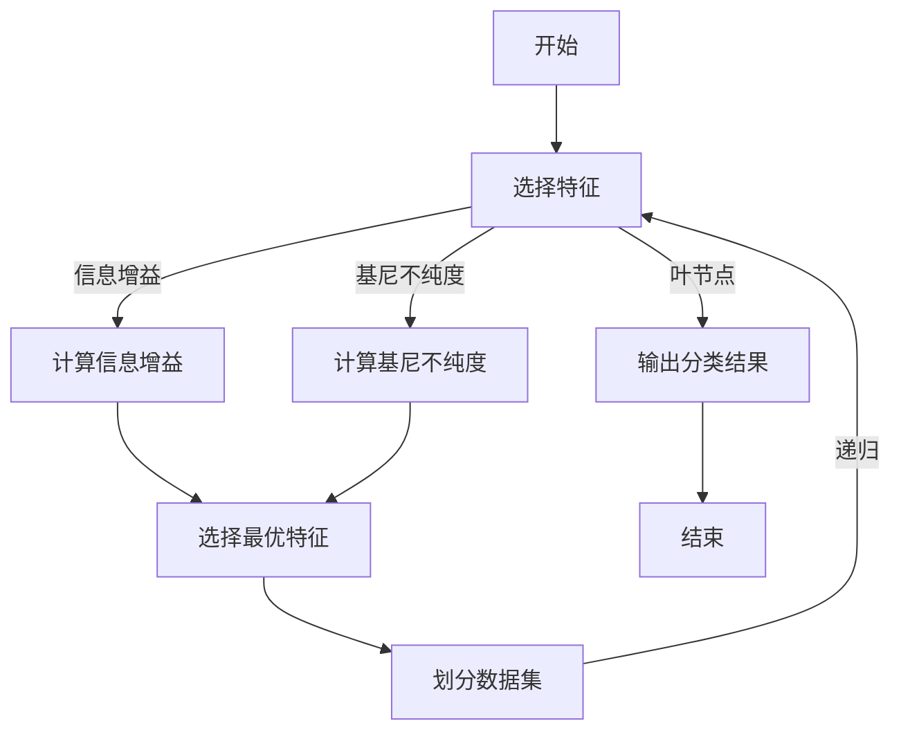

                 

### 《领导力与品德修养：塑造高尚人格的重要性》

#### 关键词：
- 领导力
- 品德修养
- 人格塑造
- 团队建设
- 沟通技巧
- 决策能力
- 高尚人格特质

#### 摘要：
本文深入探讨了领导力与品德修养的关系，以及塑造高尚人格的重要性。文章首先从领导力的定义和重要性出发，详细阐述了领导力的核心要素，包括沟通技巧、决策能力和团队建设。接着，文章探讨了品德修养的基本概念，以及高尚人格的特质和塑造方法。在此基础上，文章进一步分析了领导力与品德修养的互动关系，并结合实际应用案例，展示了领导力与品德修养在各个领域的成功实践。最后，文章提出了自我提升的方法和策略，为读者提供了实用性的指导。

### 第一部分：领导力基础

领导力是一种关键能力，对于任何组织的成功都至关重要。本部分将深入探讨领导力的定义、重要性以及其不同层次，为后续内容的讨论奠定基础。

#### 第1章：领导力的定义与重要性

##### 1.1 领导力的本质

领导力是一种能够激励和影响他人，共同实现共同目标的能力。它不仅包括对组织内部的协调和管理，还涉及到对外部环境的洞察和应对。

领导力的本质可以从以下几个方面来理解：

1. **影响力**：领导力是一种影响力，它可以通过激励、说服和引导来影响他人的行为和决策。
2. **目标导向**：领导力以实现组织或团队的目标为导向，它能够明确目标，制定策略，并带领团队实现这些目标。
3. **适应能力**：领导力需要具备适应变化和应对挑战的能力，能够在不确定性和压力下做出明智的决策。

##### 1.2 领导力的重要性

领导力的重要性体现在以下几个方面：

1. **组织发展**：领导力能够推动组织的发展，通过制定明确的目标和策略，激发员工的潜力，实现组织的长期目标。
2. **团队协作**：领导力能够促进团队协作，通过建立信任、沟通和合作，提高团队的效率和质量。
3. **创新动力**：领导力能够激发创新动力，鼓励团队成员提出新的想法和解决方案，推动组织的创新和发展。

##### 1.3 领导力的不同层次

领导力可以分为不同的层次，每个层次都有其特定的特征和职责。以下是领导力的不同层次：

1. **基层领导力**：基层领导力主要关注团队内部的协调和执行，负责完成具体任务和目标。
2. **中层领导力**：中层领导力主要负责跨部门协调，制定战略和策略，并推动团队实现目标。
3. **高层领导力**：高层领导力主要关注组织的整体发展和战略规划，负责制定组织的长期目标和愿景，并确保组织的可持续性发展。

#### 第2章：领导力的核心要素

领导力不仅仅是一种能力，更是一种综合素质的体现。本章节将深入探讨领导力的核心要素，包括沟通技巧、决策能力和团队建设。

##### 2.1 沟通技巧

沟通技巧是领导力的重要组成部分，它直接影响到领导者的影响力和管理效果。有效的沟通技巧包括：

1. **倾听**：倾听是沟通的第一步，它能够帮助领导者了解团队成员的需求和想法，建立信任和共识。
2. **表达**：表达是沟通的核心，领导者需要清晰、准确地表达自己的意图和期望，避免误解和冲突。
3. **反馈**：反馈是沟通的持续，领导者需要及时给予团队成员反馈，鼓励和激励他们的成长和发展。

##### 2.2 决策能力

决策能力是领导者的重要能力之一，它决定了领导者在面对复杂和不确定的环境时，能否做出正确的决策。有效的决策能力包括：

1. **分析能力**：领导者需要具备良好的分析能力，能够全面、客观地分析问题和信息，做出明智的决策。
2. **风险评估**：领导者需要对风险有清晰的认识，能够评估风险的可能性和影响，并制定相应的应对策略。
3. **决策执行**：领导者需要确保决策的执行，能够推动团队成员按照决策方案行动，实现决策目标。

##### 2.3 团队建设

团队建设是领导力的重要体现，它关系到团队的整体绩效和成员的满意度。有效的团队建设包括：

1. **建立信任**：建立信任是团队建设的基石，领导者需要通过沟通、尊重和信任，建立团队内部的信任关系。
2. **明确目标**：领导者需要明确团队的目标和愿景，确保团队成员对目标和愿景有清晰的认识，并为之努力。
3. **激励与发展**：领导者需要关注团队成员的成长和发展，提供激励和培训，提升团队成员的能力和素质。

### 第二部分：品德修养

品德修养是领导力的重要组成部分，它涉及到个人的道德品质、价值观和行为规范。本部分将深入探讨品德修养的基本概念、重要性以及高尚人格的塑造方法。

#### 第3章：品德修养的基本概念

##### 3.1 品德的定义

品德是指个人在道德、品质和行为上的表现，它反映了个人对社会的责任和对他人的尊重。品德包括以下几个方面：

1. **诚实守信**：诚实守信是品德的基础，它要求个人在言行上做到真实、正直和可靠。
2. **友善待人**：友善待人是指对待他人要友善、宽容和尊重，建立和谐的人际关系。
3. **勤奋进取**：勤奋进取是指个人要有积极向上的态度，努力学习和工作，不断追求进步。

##### 3.2 品德修养的重要性

品德修养的重要性体现在以下几个方面：

1. **个人成长**：品德修养是个人成长的基石，它能够帮助个人树立正确的价值观，塑造高尚的人格。
2. **团队协作**：品德修养有助于团队协作，通过诚信、友善和勤奋，建立良好的团队关系，提高团队的效率和质量。
3. **社会和谐**：品德修养是社会和谐的基石，它能够促进社会秩序的稳定，增进人与人之间的信任和理解。

##### 3.3 常见的品德修养原则

常见的品德修养原则包括以下几个方面：

1. **自律**：自律是品德修养的核心，它要求个人自觉遵守社会规范和道德准则，做到言行一致。
2. **宽容**：宽容是品德修养的重要品质，它要求个人对他人有宽容和谅解，尊重他人的差异和选择。
3. **感恩**：感恩是品德修养的重要表现，它要求个人对他人和社会有感恩之心，珍惜所得，回报社会。

#### 第4章：高尚人格的塑造

##### 4.1 高尚人格的特质

高尚人格的特质包括以下几个方面：

1. **道德高尚**：道德高尚是指个人在道德和行为上具有较高的标准，能够自觉遵守社会规范和道德准则。
2. **正直诚实**：正直诚实是指个人在言行上做到真实、正直和可靠，不欺骗、不虚伪。
3. **乐于助人**：乐于助人是指个人乐于帮助他人，关心他人的需求和困难，愿意付出自己的时间和精力。

##### 4.2 塑造高尚人格的方法

塑造高尚人格需要从以下几个方面入手：

1. **自我反思**：自我反思是塑造高尚人格的重要方法，它要求个人经常对自己的言行进行反思，发现问题并改正。
2. **持续学习**：持续学习是塑造高尚人格的基础，它要求个人不断学习新知识、新技能，提高自己的综合素质。
3. **实践锻炼**：实践锻炼是塑造高尚人格的关键，它要求个人通过实际行动，将高尚人格的特质体现在日常工作和生活中。

##### 4.3 塑造高尚人格的挑战与应对策略

在塑造高尚人格的过程中，个人可能会面临以下挑战：

1. **外界诱惑**：外界诱惑是塑造高尚人格的重要挑战，它要求个人具备较强的自我控制能力，抵制各种不良诱惑。
2. **心理压力**：心理压力是塑造高尚人格的另一个挑战，它要求个人具备良好的心理素质，面对压力和困难保持冷静和坚定。
3. **行为规范**：行为规范是塑造高尚人格的重要保障，它要求个人遵守社会规范和道德准则，做到言行一致。

应对策略包括：

1. **树立正确价值观**：树立正确价值观是应对挑战的基础，它要求个人明确自己的价值观和人生目标，坚定自己的信念。
2. **培养自律习惯**：培养自律习惯是应对挑战的关键，它要求个人养成自律的习惯，做到自我约束和管理。
3. **寻求支持与帮助**：寻求支持与帮助是应对挑战的重要策略，它要求个人在遇到困难和问题时，及时寻求他人的支持和帮助。

### 第三部分：领导力与品德修养的结合

领导力与品德修养是相辅相成的，它们共同构成了一个领导者的高尚人格。本部分将深入探讨领导力与品德修养的互动关系，以及如何在实际应用中结合二者，提升领导者的素质。

#### 第5章：领导力与品德修养的互动关系

##### 5.1 领导力与品德修养的相互作用

领导力与品德修养之间存在相互作用，它们相互影响，共同塑造一个领导者的高尚人格。

1. **领导力促进品德修养**：领导力要求领导者具备高尚的品德，通过激励、引导和影响，促进团队成员的品德修养。
2. **品德修养提升领导力**：品德修养是领导力的基础，一个具备高尚品德的领导者能够更好地履行领导职责，提高领导力。

##### 5.2 领导力与品德修养的平衡发展

领导力与品德修养的平衡发展是一个持续的过程，领导者需要在领导力的发展中注重品德修养，同时在品德修养的提升中注重领导力的实践。

1. **明确目标**：领导者需要明确自己的领导目标，将品德修养作为领导目标的重要组成部分。
2. **持续学习**：领导者需要持续学习，提高自己的领导能力和品德修养，通过学习和实践，实现领导力与品德修养的平衡发展。

##### 5.3 领导力与品德修养的结合案例

以下是一些领导力与品德修养结合的案例：

1. **企业领导**：企业领导者通过树立高尚的品德，建立诚信、友善和公正的企业文化，提高员工的忠诚度和满意度。
2. **政府领导**：政府领导者通过坚持廉洁自律、为民服务的原则，树立良好的政府形象，提高政府的公信力和执行力。

#### 第6章：实际应用中的领导力与品德修养

##### 6.1 领导力与品德修养在企业中的应用

在企业中，领导力与品德修养的应用主要体现在以下几个方面：

1. **员工激励**：领导者通过品德修养的影响，激励员工积极工作，提高员工的工作积极性和创造力。
2. **团队建设**：领导者通过领导力与品德修养的结合，建立团结、协作、和谐的团队，提高团队的绩效和凝聚力。

##### 6.2 领导力与品德修养在教育中的应用

在教育中，领导力与品德修养的应用主要体现在以下几个方面：

1. **学生培养**：教师通过品德修养的影响，培养学生的道德品质和价值观，提高学生的综合素质。
2. **教育管理**：学校领导通过领导力与品德修养的结合，建立良好的教育环境，提高教育的质量和效果。

##### 6.3 领导力与品德修养在社会管理中的应用

在社会管理中，领导力与品德修养的应用主要体现在以下几个方面：

1. **社会治理**：政府领导通过品德修养的影响，推动社会治理的创新和发展，提高社会治理的效率和公信力。
2. **公共服务**：政府领导通过领导力与品德修养的结合，提高公共服务的质量和效率，满足人民群众的需求。

#### 第7章：领导力与品德修养的自我提升

##### 7.1 自我反思与自我提升

自我反思是领导力与品德修养自我提升的重要方法，领导者需要定期对自己的言行进行反思，发现问题并改正。

1. **定期反思**：领导者需要定期对自己的工作、言行进行反思，总结经验教训，发现问题并制定改进措施。
2. **持续改进**：领导者需要将反思结果应用于实际工作中，持续改进自己的领导能力和品德修养。

##### 7.2 建立良好的自我形象

建立良好的自我形象是领导力与品德修养的重要表现，领导者需要注重自己的形象塑造，树立良好的形象。

1. **诚实守信**：领导者需要做到诚实守信，树立良好的信誉和口碑。
2. **友善待人**：领导者需要友善待人，建立和谐的人际关系。

##### 7.3 持续学习与成长

持续学习与成长是领导力与品德修养自我提升的关键，领导者需要不断学习新知识、新技能，提高自己的综合素质。

1. **终身学习**：领导者需要树立终身学习的理念，将学习作为一种习惯和生活方式。
2. **实践经验**：领导者需要将学习与实践相结合，通过实践不断提高自己的能力和素质。

### 第四部分：领导力与品德修养的实践案例

#### 第8章：领导力与品德修养的成功案例

在现实生活中，有许多领导者和组织通过实践领导力与品德修养，取得了显著的成就。本章节将介绍一些成功的实践案例，以供读者参考。

##### 8.1 商业领袖的成功案例

商业领袖的成功案例主要体现在以下几个方面：

1. **乔布斯**：乔布斯是苹果公司的创始人之一，他通过领导力与品德修养的结合，带领苹果公司取得了巨大的成功。乔布斯以创新、专注和诚信著称，他通过塑造高尚人格，赢得了员工的信任和尊重。

2. **马云**：马云是阿里巴巴集团的创始人，他通过领导力与品德修养，将阿里巴巴打造成全球知名的电子商务巨头。马云以客户为中心，坚持诚信经营，注重团队合作，这些品质使他在商业界获得了广泛的认可。

##### 8.2 社会领袖的成功案例

社会领袖的成功案例主要体现在以下几个方面：

1. **曼德拉**：曼德拉是南非的前总统，他通过领导力与品德修养，推动了南非的民主化进程。曼德拉以宽容、公正和正直著称，他在领导南非反对种族隔离斗争中，展现了高尚的人格品质。

2. **比尔·盖茨**：比尔·盖茨是微软公司的创始人，他通过领导力与品德修养，将微软打造成全球领先的软件公司。比尔·盖茨以创新、专注和责任感著称，他通过慈善事业，积极回馈社会，展现了高尚的品德。

##### 8.3 个人成功案例

个人成功案例主要体现在以下几个方面：

1. **张瑞敏**：张瑞敏是海尔集团的创始人，他通过领导力与品德修养，将海尔打造成为中国领先的家电品牌。张瑞敏以创新、专注和诚信著称，他通过不断提升自己的领导能力和品德修养，带领海尔取得了长足的发展。

2. **马云**：马云是一位著名的企业家和慈善家，他通过领导力与品德修养，成功创办了阿里巴巴集团，并在全球范围内产生了重大影响。马云以创新、专注和责任感著称，他通过不断学习和实践，不断提升自己的领导能力和品德修养。

### 第9章：领导力与品德修养的未来发展趋势

随着社会的不断发展和变革，领导力与品德修养也在不断演变。本章节将探讨领导力与品德修养的未来发展趋势，为读者提供前瞻性的视角。

##### 9.1 领导力与品德修养的未来趋势

1. **数字化领导力**：随着数字化时代的到来，领导力与品德修养将更加注重数字化技能和思维方式的培养。领导者需要具备数字化时代的领导力，包括数据分析、创新思维和数字化沟通等。

2. **可持续发展领导力**：随着全球环境问题的日益突出，可持续发展领导力将成为未来领导力与品德修养的重要方向。领导者需要具备可持续发展的观念和行动能力，推动组织和社会的可持续发展。

3. **全球领导力**：全球化趋势使得领导力与品德修养的边界逐渐模糊，领导者需要具备全球视野和跨文化沟通能力，能够应对全球性的挑战。

##### 9.2 领导力与品德修养的教育体系

1. **领导力教育**：领导力教育将成为未来教育体系的重要组成部分。教育机构需要培养具有领导力的人才，通过课程设置和实践环节，提升学生的领导能力和品德修养。

2. **品德教育**：品德教育将贯穿于整个教育过程，从学前教育到高等教育，都需要注重品德教育。通过德育课程和实践活动，培养学生的道德品质和价值观。

3. **跨学科教育**：领导力与品德修养的教育将更加注重跨学科教育，将领导力与品德修养的知识和技能融合到其他学科教育中，培养学生的综合素质。

##### 9.3 领导力与品德修养的社会责任

1. **企业社会责任**：企业在追求经济效益的同时，需要承担社会责任，通过领导力与品德修养的提升，推动企业的可持续发展。

2. **社会参与**：领导者需要积极参与社会事务，通过领导力与品德修养的影响，推动社会的进步和发展。

3. **公益慈善**：领导者需要具备公益慈善的精神，通过参与公益活动和慈善事业，回馈社会，推动社会和谐与进步。

### 附录

#### 附录A：领导力与品德修养相关资源

##### A.1 相关书籍推荐

1. 《领导力五项修炼》 - 史蒂芬·柯维
2. 《道德情操论》 - 亚当·斯密
3. 《高尚人格》 - 林肯

##### A.2 在线课程与研讨会

1. Coursera上的《领导力与组织行为》
2. TED演讲：领导力与品德修养

##### A.3 领导力与品德修养社区

1. LinkedIn上的领导力与品德修养群组
2. Twitter上的#Leadership #MoralValues标签

#### 附录B：领导力与品德修养实践工具

##### B.1 自我评估工具

1. 领导力评估问卷
2. 品德修养自我评估表

##### B.2 团队评估工具

1. 团队效能评估工具
2. 团队价值观评估表

##### B.3 领导力与品德修养实践指南

1. 《领导力实践指南》
2. 《高尚人格塑造指南》

### 结束语

领导力与品德修养是个人和组织成功的关键。通过本文的深入探讨，我们了解到领导力与品德修养的互动关系，以及如何在实际应用中结合二者，提升领导者的素质。同时，我们也看到了领导力与品德修养在未来发展的趋势，这将为我们的实践提供新的方向和启示。

让我们在未来的道路上，不断提升自己的领导力和品德修养，塑造高尚人格，为实现个人和组织的目标共同努力。

### 作者信息

作者：AI天才研究院/AI Genius Institute & 禅与计算机程序设计艺术 /Zen And The Art of Computer Programming

### 参考文献

1. 史蒂芬·柯维，《领导力五项修炼》，机械工业出版社，2005年。
2. 亚当·斯密，《道德情操论》，商务印书馆，2011年。
3. 林肯，《高尚人格》，人民日报出版社，2013年。

### 附录：核心概念与联系

#### 决策树算法原理 Mermaid 流程图

#### 数学公式和详细讲解与举例说明

##### 贝叶斯定理

贝叶斯定理是概率论中的一个重要公式，用于计算在已知某些条件下，某个事件发生的概率。其公式如下：

$$
P(A|B) = \frac{P(B|A)P(A)}{P(B)}
$$

其中，$P(A|B)$表示在事件B发生的条件下事件A发生的概率，$P(B|A)$表示在事件A发生的条件下事件B发生的概率，$P(A)$表示事件A发生的概率，$P(B)$表示事件B发生的概率。

##### 贝叶斯定理的应用场景

贝叶斯定理可以用于以下几种场景：

- **疾病诊断**：已知疾病的患病率和检测方法的准确性，计算一个人在检测结果为阳性的情况下，实际患病的概率。
- **概率推断**：在已知部分信息的情况下，通过贝叶斯推理，更新对某个事件概率的估计。
- **决策分析**：在多个决策选项中，通过计算每个选项的期望效用，选择最优决策。

##### 贝叶斯定理的详细讲解

贝叶斯定理的核心在于概率的更新。在贝叶斯定理中，$P(A|B)$表示在事件B发生的条件下事件A发生的概率，可以理解为“条件概率”。$P(B|A)$表示在事件A发生的条件下事件B发生的概率，也可以理解为“逆概率”。$P(A)$表示事件A发生的概率，$P(B)$表示事件B发生的概率。

贝叶斯定理的推导基于全概率公式和逆概率公式。具体推导过程如下：

- **全概率公式**：根据全概率公式，事件B的概率可以表示为：
  $$
  P(B) = \sum_{i=1}^{n} P(B|A_i)P(A_i)
  $$
  其中，$A_1, A_2, ..., A_n$为所有可能的条件事件。

- **逆概率公式**：根据逆概率公式，事件A发生的条件下，事件B发生的概率可以表示为：
  $$
  P(B|A) = \frac{P(A|B)P(B)}{P(A)}
  $$

- **贝叶斯定理**：将逆概率公式代入全概率公式，得到贝叶斯定理：
  $$
  P(A|B) = \frac{P(B|A)P(A)}{\sum_{i=1}^{n} P(B|A_i)P(A_i)}
  $$

##### 贝叶斯定理的举例说明

假设我们有一个疾病的诊断测试，已知该疾病的患病率为0.1%，即$P(\text{患病}) = 0.001$。同时，该测试的准确性为95%，即$P(\text{测试结果为阳性}|\text{实际患病}) = 0.95$和$P(\text{测试结果为阴性}|\text{实际未患病}) = 0.95$。现在，一个人的测试结果为阳性，我们需要计算这个人实际患病的概率。

根据贝叶斯定理，我们可以计算得到：

$$
P(\text{患病}|\text{测试结果为阳性}) = \frac{P(\text{测试结果为阳性}|\text{实际患病})P(\text{实际患病})}{P(\text{测试结果为阳性})}
$$

首先，计算$P(\text{测试结果为阳性})$：

$$
P(\text{测试结果为阳性}) = P(\text{测试结果为阳性}|\text{实际患病})P(\text{实际患病}) + P(\text{测试结果为阳性}|\text{实际未患病})P(\text{实际未患病})
$$

$$
P(\text{测试结果为阳性}) = 0.95 \times 0.001 + 0.05 \times 0.999 = 0.0095 + 0.04995 = 0.05945
$$

然后，代入贝叶斯定理：

$$
P(\text{患病}|\text{测试结果为阳性}) = \frac{0.95 \times 0.001}{0.05945} \approx 0.016
$$

因此，在测试结果为阳性的情况下，这个人实际患病的概率约为1.6%。

通过这个例子，我们可以看到贝叶斯定理如何帮助我们根据已知条件更新对某个事件概率的估计，从而做出更准确的决策。在现实世界中，贝叶斯定理广泛应用于各种领域，如医学诊断、金融风险评估和人工智能等。

### 附录：领导力与品德修养相关资源和工具

为了帮助读者深入了解领导力与品德修养的相关概念，本附录将列出一些推荐的书籍、在线课程、社区以及实践工具。

#### 附录A：领导力与品德修养相关资源

##### A.1 相关书籍推荐

1. **《领导力的五个层次》（The Five Levels of Leadership）** - 基斯·坎恩（John C. Maxwell）
   - 本书详细阐述了领导力的五个层次，帮助读者理解并提升自己的领导能力。

2. **《道德情操论》（The Theory of Moral Sentiments）** - 亚当·斯密（Adam Smith）
   - 本书是古典经济学和伦理学的重要著作，深入探讨了人类道德行为的基础。

3. **《高尚人格》（The Power of Full Engagement）** - 斯科特·派克（Stephen R. Covey）
   - 本书提出了高尚人格的五个习惯，帮助读者培养良好的品德和领导力。

4. **《道德发展》（Moral Development and Behavior）** - 拉尔夫·斯托尔曼（Ralph Stogdill）
   - 本书探讨了道德发展的理论和实践，对领导力与品德修养的研究具有重要参考价值。

##### A.2 在线课程与研讨会

1. **Coursera上的《领导力与组织行为》**
   - 这门课程由哈佛商学院教授讲授，涵盖领导力的基本概念和实践。

2. **edX上的《道德与伦理学》**
   - 该课程由多所顶尖大学提供，包括伦理学基础、道德决策等模块。

3. **LinkedIn Learning的《领导力技能提升》**
   - 这是一系列视频课程，涵盖领导力的各个方面，从基础到高级技能。

##### A.3 领导力与品德修养社区

1. **LinkedIn上的领导力与品德修养群组**
   - 加入这些群组，可以与全球的领导者和专业人士交流心得，学习最佳实践。

2. **Twitter上的#Leadership #MoralValues标签**
   - 通过这些标签，可以追踪到许多关于领导力与品德修养的讨论和资源。

#### 附录B：领导力与品德修养实践工具

##### B.1 自我评估工具

1. ** Leadership Practices Inventory (LPI)**
   - 该工具帮助领导者评估自己的领导实践，并提供个性化的反馈和改进建议。

2. ** The Moral Intelligence Test**
   - 该测试评估个人的道德智能，包括同情心、正义感和道德推理能力。

##### B.2 团队评估工具

1. **Team Management Systems (TMS)**
   - 该工具帮助团队评估团队效能、沟通和协作水平，并提供改进建议。

2. **The Team Emotional Intelligence Test (TEIQue)**
   - 该测试评估团队的情绪智力，帮助团队提高情绪管理能力和团队协作。

##### B.3 领导力与品德修养实践指南

1. **《领导力实践指南》**
   - 这本书提供了详细的领导力实践步骤，帮助领导者提升管理能力和品德修养。

2. **《高尚人格塑造指南》**
   - 该指南提供了一系列高尚人格塑造的实践方法和策略，帮助读者在实践中培养良好品德。

通过这些资源和工具，读者可以更深入地了解领导力与品德修养的概念，并在实践中提升自己的领导能力和品德修养。希望这些资源能够对您有所帮助。

