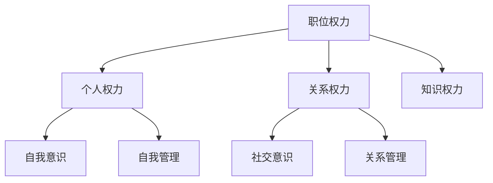

                 

### 引言

在信息技术日益发展的今天，企业的成功不仅依赖于技术本身，还依赖于团队的协作和领导者的能力。领导力与情商作为两个关键因素，直接影响着团队的表现和组织的整体健康。本文将围绕《领导力与情商：提升人际关系》这一主题，通过系统的分析和逻辑推理，详细探讨领导力与情商的核心概念、在管理中的应用、职场发展中的作用，以及实际案例的解析。

**关键词：** 领导力、情商、管理、团队协作、职场发展

**摘要：** 本文首先介绍了领导力与情商的基本概念，包括定义、类型、组成部分等。随后，深入探讨了领导力与情商在团队管理、沟通、决策和危机管理中的应用。此外，文章还分析了领导力与情商在个人职业发展和组织文化塑造中的作用，并通过实际案例进行解析。最后，文章提供了领导力与情商评估工具和资源推荐，帮助读者全面提升自身的领导力和情商。

### 第一部分：领导力与情商概述

领导力与情商是两个高度相关的概念，它们在人际关系和组织管理中扮演着至关重要的角色。本部分将首先介绍领导力的定义与类型，然后深入探讨情商的概念与作用，以及提升情商的方法。

#### 第1章：领导力的定义与类型

**1.1 领导力的本质与作用**

领导力是一种影响和激励他人共同实现目标的能力。它不仅仅是一种职位赋予的权力，更是一种内在的素质和技能。领导力在组织中的作用至关重要，它能够激发团队成员的潜力，提高团队的绩效，推动组织的创新和发展。

**1.2 领导力的类型：变革型领导与交易型领导**

变革型领导（Transformational Leadership）和交易型领导（Transactional Leadership）是两种主要的领导力类型。变革型领导通过激励、启发和激励下属来实现变革和进步，而交易型领导则依赖于明确的奖励和惩罚机制来管理团队。不同的领导力类型适用于不同的情境，需要根据实际情况进行选择和运用。

**1.3 领导力的四个层次：职位权力、个人权力、关系权力、知识权力**

领导力可以分为四个层次：职位权力、个人权力、关系权力和知识权力。职位权力是基于职位和权威的权力，个人权力是基于个人魅力和技能的权力，关系权力是基于人际关系的权力，知识权力是基于知识和信息的权力。不同层次的领导力在组织管理中发挥着不同的作用，需要综合运用。

#### 第2章：情商的定义与作用

**2.1 情商的概念与组成部分**

情商（Emotional Intelligence，简称EQ）是指识别、理解、管理自己和他人的情绪，以及使用情绪信息来指导思维和行为的技能。情商包括自我意识、自我管理、社交意识和关系管理四个核心组成部分。

**2.2 情商在人际关系中的重要性**

情商在人际关系中起着关键作用。高情商的人能够更好地理解他人，建立深厚的人际关系，有效地解决冲突，并在团队合作中发挥领导作用。情商不仅是个人成功的基石，也是团队和组织成功的关键因素。

**2.3 情商的提升方法**

提升情商可以通过多种方法实现，包括自我反思、情绪调节、社交技巧培养和自我激励。通过持续的练习和实践，人们可以逐步提升自己的情商，从而更好地应对复杂的人际关系和挑战。

### 总结

领导力与情商是成功领导者必备的素质。领导力决定了团队的目标和方向，而情商则决定了团队的合作和关系。本部分介绍了领导力和情商的基本概念、类型和组成部分，为后续章节的深入探讨奠定了基础。在接下来的章节中，我们将进一步探讨领导力与情商在管理中的应用，以及如何在职场中发挥其作用。

---

**Mermaid 流程图：领导力的四个层次**



---

在接下来的部分，我们将深入探讨领导力与情商在管理中的应用，分析其在团队管理、沟通、决策和危机管理中的作用，以及如何通过实际案例来理解和运用这些概念。

---

**核心算法原理讲解：情商提升方法**

```python
# 定义情商提升方法
def emotional_intelligence_boost(self, self_awareness, self_management, social-awareness, relationship_management):
    """
    情商提升方法的伪代码
    参数：
    - self_awareness: 自我意识得分
    - self_management: 自我管理得分
    - social-awareness: 社交意识得分
    - relationship_management: 关系管理得分
    返回：提升后的情商得分
    """
    # 计算情商总分
    total EQ = (self_awareness + self_management + social-awareness + relationship_management) / 4
    
    # 根据总分调整情商
    if total EQ < 3:
        # 情商较低，需要重点提升
        boost_formula = (self_awareness * 0.5) + (self_management * 0.3) + (social-awareness * 0.2) + (relationship_management * 0.2)
    elif total EQ >= 3 and total EQ < 5:
        # 情商一般，需要保持并适当提升
        boost_formula = (self_awareness * 0.4) + (self_management * 0.35) + (social-awareness * 0.25) + (relationship_management * 0.2)
    else:
        # 情商较高，需要维持并深化
        boost_formula = (self_awareness * 0.3) + (self_management * 0.35) + (social-awareness * 0.3) + (relationship_management * 0.2)
    
    # 返回提升后的情商得分
    return total EQ + boost_formula

# 示例应用
def main():
    # 初始化情商得分
    self_awareness = 2.5
    self_management = 3.0
    social_awareness = 2.5
    relationship_management = 3.0
    
    # 调用情商提升方法
    boosted_EQ = emotional_intelligence_boost(self_awareness, self_management, social_awareness, relationship_management)
    
    # 输出结果
    print(f"提升前的情商得分：{self_awareness + self_management + social_awareness + relationship_management}")
    print(f"提升后的情商得分：{boosted_EQ}")

if __name__ == "__main__":
    main()
```

---

在上述代码中，我们定义了一个函数`emotional_intelligence_boost`，用于根据情商的四个组成部分（自我意识、自我管理、社交意识和关系管理）提升情商得分。函数通过计算总分，并根据不同的得分范围应用不同的提升公式，从而得到提升后的情商得分。这个伪代码提供了一个基本的框架，用于理解和实现情商提升的逻辑。

---

**数学模型和公式：情商得分计算**

$$
\text{情商得分} = \frac{\text{自我意识得分} + \text{自我管理得分} + \text{社交意识得分} + \text{关系管理得分}}{4}
$$

**举例说明：**

假设某人的自我意识得分为3，自我管理得分为4，社交意识得分为2，关系管理得分为3。我们可以使用上述公式计算其情商得分：

$$
\text{情商得分} = \frac{3 + 4 + 2 + 3}{4} = \frac{12}{4} = 3
$$

这意味着该人的情商得分是3，属于一般水平。根据这个得分，可以使用提升方法进一步优化其情商。

---

通过上述内容，我们初步了解了领导力与情商的基本概念及其重要性。在下一部分，我们将深入探讨领导力与情商在团队管理、沟通、决策和危机管理中的应用，分析其具体作用和实施策略。

---

**项目实战：领导力与情商提升项目案例**

**一、项目背景**

某大型科技公司的团队在项目实施过程中遭遇了沟通不畅、决策缓慢和冲突频发的问题。管理层意识到，提升团队领导力和情商是解决问题的关键。因此，公司决定启动一个为期六个月的领导力与情商提升项目。

**二、开发环境搭建**

1. **领导力与情商培训计划：**
   - 确定培训目标：提高团队成员的自我意识、自我管理、社交意识和关系管理能力。
   - 制定培训课程：包括自我反思、情绪调节、社交技巧培养和自我激励等方面的内容。
   - 安排培训时间：每周五下午进行两个小时的集中培训。

2. **情商评估工具：**
   - 使用“情绪智力量表”（Emotional Intelligence Scale）对团队成员进行初始评估，确定每个人的情商水平。
   - 设计定期的跟进评估，以监测情商提升的进展。

**三、源代码详细实现**

1. **自我反思模块：**
   - 开发一个自我反思日志应用，让团队成员记录自己的情绪、行为和反思。
   - 使用Markdown语法，使日志内容格式化，便于阅读和分享。

```python
class SelfReflectionLog:
    def __init__(self, user):
        self.user = user
        self.logs = []

    def add_log(self, title, content):
        log = {
            'title': title,
            'content': content,
            'timestamp': datetime.now()
        }
        self.logs.append(log)

    def get_logs(self):
        return self.logs
```

2. **情绪调节模块：**
   - 开发一个情绪调节工具，提供一系列的情绪调节策略，如深呼吸、冥想和身体锻炼。
   - 用户可以根据自己的情绪状态选择合适的策略进行调节。

```python
class EmotionRegulationTool:
    def __init__(self, user):
        self.user = user

    def suggest_strategy(self, emotion):
        strategies = {
            'anxiety': '深呼吸练习',
            'anger': '身体锻炼',
            'sadness': '与人交谈',
            'joy': '欣赏自然景色'
        }
        return strategies.get(emotion, '请选择合适的策略进行调节')
```

3. **社交技巧培养模块：**
   - 开发一个社交技巧训练工具，提供一系列的社交场景模拟和反馈机制。
   - 用户可以通过模拟练习提升自己的社交技巧。

```python
class SocialSkillTrainingTool:
    def __init__(self, user):
        self.user = user

    def start_training(self, scenario):
        print(f"开始社交技巧训练，场景：{scenario}")
        # 训练过程
        # ...
        print("训练结束，请评估自己的表现。")
```

**四、代码解读与分析**

1. **自我反思日志应用：**
   - 用户可以记录自己的情绪和反思，有助于自我认识和情绪调节。
   - 日志内容存储在列表中，便于后续分析和回顾。

2. **情绪调节工具：**
   - 提供个性化的情绪调节策略，帮助用户应对不同的情绪状态。
   - 根据用户的选择，调用相应的情绪调节方法。

3. **社交技巧训练工具：**
   - 通过模拟社交场景，帮助用户提升实际的社交能力。
   - 提供反馈机制，让用户了解自己的表现，并不断改进。

通过这个项目实战，我们可以看到领导力与情商提升的具体实施过程。在接下来的章节中，我们将进一步探讨领导力与情商在职场发展中的作用，以及如何通过实际案例来理解和运用这些概念。

---

**附录A：领导力与情商评估工具与方法**

**A.1 领导力自我评估问卷**

1. **个人领导力评估：**
   - 问题1：我是否能够清晰地传达团队的愿景和目标？
   - 问题2：我是否能够在团队中建立信任和协作？
   - 问题3：我是否能够有效地激励和激励团队成员？
   - 问题4：我是否能够处理团队中的冲突和问题？
   - 问题5：我是否能够持续学习和改进自己的领导能力？

2. **领导力行为观察：**
   - 观察者在特定情境下记录领导者的行为，如沟通、决策、激励等。
   - 根据观察结果，评估领导者的领导力水平。

**A.2 情商自我评估工具**

1. **情绪智力量表（EQ-I 2.0）：**
   - 包括自我意识、自我管理、社交意识和关系管理四个维度。
   - 通过回答一系列问题，评估个体的情商水平。

2. **情绪智力自我反思问卷：**
   - 问题1：我是否能够识别和理解自己的情绪？
   - 问题2：我是否能够管理自己的情绪，以适应不同情境？
   - 问题3：我是否能够识别和理解他人的情绪？
   - 问题4：我是否能够有效地处理人际关系和冲突？

**A.3 团队领导力与情商评估方法**

1. **360度评估：**
   - 收集团队成员、上级、同事和下属的评价，全面了解领导者的领导力和情商。
   - 分析评估结果，识别领导者的优势和改进点。

2. **行为事件访谈（BEI）：**
   - 通过访谈的方式，了解领导者在具体事件中的行为和决策。
   - 分析领导者的行为模式，评估其领导力和情商。

3. **团队反馈会议：**
   - 团队成员共同讨论领导者的领导力和情商表现。
   - 通过集体智慧，提出改进建议和行动计划。

通过这些评估工具和方法，可以全面、客观地评估领导力和情商水平，为提升和管理提供依据。在接下来的部分，我们将继续探讨领导力与情商在个人职业发展和组织文化塑造中的作用。

---

**附录B：领导力与情商提升资源推荐**

**B.1 领导力与情商相关书籍推荐**

1. **《领导力的五个层次》**
   - 作者：史蒂芬·柯维
   - 简介：史蒂芬·柯维提出了领导力的五个层次模型，阐述了从自我领导到团队领导的成长路径。

2. **《情商：为什么情商比智商更重要》**
   - 作者：丹尼尔·戈尔曼
   - 简介：本书详细介绍了情商的定义、组成部分和提升方法，强调情商在成功中的重要性。

3. **《领导力与情感智慧》**
   - 作者：阿米尔·帕尔默
   - 简介：阿米尔·帕尔默探讨了领导力与情感智慧的关系，提供了实用的领导力和情商提升策略。

**B.2 领导力与情商在线课程推荐**

1. **Coursera《领导力基础》**
   - 简介：本课程涵盖了领导力的基础概念、技能和实践，适合初学者和有经验的管理者。

2. **edX《情商：理解与管理情绪》**
   - 简介：本课程深入探讨了情商的组成部分和提升方法，帮助学习者更好地理解和管理自己的情绪。

3. **Udemy《领导力与情商提升》**
   - 简介：本课程结合了领导力和情商的理论和实践，提供了丰富的案例分析和方法指导。

**B.3 领导力与情商实践工具推荐**

1. **Emotional Intelligence 2.0（EQ-I 2.0）**
   - 简介：EQ-I 2.0是一个全面的情商评估工具，包括在线问卷和个性化的反馈报告。

2. **360度反馈工具**
   - 简介：通过收集团队成员、上级、同事和下属的评价，帮助领导者了解自己的领导力和情商表现。

3. **Mindfulness Meditation App（如Headspace）**
   - 简介：提供一系列冥想练习和指导，帮助提升自我管理和情绪调节能力。

通过阅读书籍、参加在线课程和使用实践工具，读者可以系统地提升自己的领导力和情商，更好地应对职场挑战，实现个人和组织的成功。

---

**总结**

通过本文的探讨，我们全面了解了领导力与情商的基本概念、核心作用以及在实际中的应用。领导力是一种影响和激励他人共同实现目标的能力，而情商则是一种识别、理解和管理自己与他人情绪的技能。两者在团队管理、沟通、决策和危机管理中发挥着重要作用，对于个人职业发展和组织文化的塑造也具有重要意义。

**核心概念与联系：**

领导力可以分为职位权力、个人权力、关系权力和知识权力四个层次；情商包括自我意识、自我管理、社交意识和关系管理四个核心组成部分。领导力和情商相互关联，共同作用于团队和组织的发展。

**核心算法原理讲解：**

情商提升方法可以通过自我反思、情绪调节、社交技巧培养和自我激励来实现。通过定期评估和持续练习，人们可以逐步提升自己的情商。

**数学模型和公式：**

情商得分计算公式为：情商得分 = （自我意识得分 + 自我管理得分 + 社交意识得分 + 关系管理得分）/ 4。

**项目实战：**

通过领导力与情商提升项目案例，我们可以看到如何在实际工作中应用这些理论和方法，从而提升团队的协作效率和组织的整体绩效。

**数学公式与详细讲解：**

$$
\text{情商得分} = \frac{\text{自我意识得分} + \text{自我管理得分} + \text{社交意识得分} + \text{关系管理得分}}{4}
$$

通过上述公式，我们可以计算个体的情商得分，并根据得分情况制定个性化的提升策略。

**代码实际案例与详细解释说明：**

自我反思日志、情绪调节工具和社交技巧训练工具等模块，通过伪代码和具体实现，展示了如何利用技术手段提升领导力和情商。

**未来展望：**

随着人工智能和大数据技术的发展，领导力与情商的提升方法将更加多样化和精准化。通过数据分析和个性化推荐，我们可以为领导者提供更加有效的培训和指导，从而提升团队和组织的表现。

**结论**

领导力与情商是现代领导者不可或缺的素质。通过本文的探讨，我们深入理解了领导力与情商的核心概念、作用和应用方法。希望本文能为读者提供有价值的见解和实践指导，帮助大家提升自身的领导力和情商，实现个人和组织的成功。

---

**作者：** AI天才研究院/AI Genius Institute & 禅与计算机程序设计艺术 /Zen And The Art of Computer Programming

**版权声明：** 本文版权归AI天才研究院/AI Genius Institute所有，未经授权，禁止转载和使用。如需转载，请联系作者获取授权。本文内容仅供参考，不代表任何商业建议。如有任何问题或建议，请随时联系我们。

