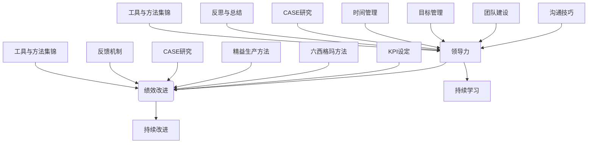

                 

# 领导力与绩效改进：持续提升团队表现的技巧

## 关键词
领导力、绩效改进、团队表现、沟通技巧、目标管理、持续学习、反馈循环、六西格玛、精益生产、案例研究。

## 摘要
本文旨在探讨领导力与绩效改进之间的关系，通过详细分析领导力的定义、重要性以及与绩效改进的核心概念，提供一套系统化的提升团队表现的方法。文章将从领导者的沟通技巧、团队建设与激励、目标管理与时间管理等方面展开，结合实际案例和核心算法原理讲解，为IT领域从业者提供实践指导。同时，文章强调持续学习和持续改进的重要性，并提供了相关的工具与方法集锦，以帮助读者在职业发展中不断提升个人与团队的绩效。

---

## 第一部分：领导力与绩效改进概述

### 第1章：领导力的定义与重要性

#### 1.1 领导力的定义

领导力是一个复杂且多维度的概念，不同的学者和专家对其有着各自的定义。John Kotter将领导力定义为“激发人们追随你，共同实现愿景的能力”。而Peter Drucker则认为领导力是“设定目标、实现目标并影响他人共同实现目标的能力”。尽管定义有所不同，但领导力的核心要素通常包括以下几个方面：

1. **愿景与目标设定**：领导者需要明确组织的愿景和目标，并激励团队成员为之努力。
2. **沟通与表达**：领导者需要具备良好的沟通技巧，能够清晰、准确地传达信息，并倾听团队成员的声音。
3. **决策与执行**：领导者需要能够在复杂环境中做出明智的决策，并确保决策能够得到有效执行。
4. **激励与激励**：领导者需要能够激发团队成员的内在动力，使他们在工作中保持积极性和创造力。
5. **领导风格**：领导者需要根据团队和情境的不同，灵活调整自己的领导风格，以最大化团队的绩效。

#### 1.2 领导力的重要性

领导力在个人成长、团队绩效和组织文化中扮演着至关重要的角色。

- **个人成长**：领导力可以帮助个人在职业生涯中实现更大的成就，提升自信和影响力。
- **团队绩效**：有效的领导力可以提升团队的整体绩效，通过激发团队成员的潜力，实现协同作战。
- **组织文化**：领导力对组织文化有着深远的影响，能够塑造组织的价值观和行为规范，影响组织的长期发展。

#### 1.3 领导力与绩效改进的关系

领导力与绩效改进之间存在密切的联系。有效的领导力可以促进绩效改进，具体体现在以下几个方面：

- **设定明确的目标**：领导者需要设定清晰的目标，并通过有效的沟通将目标传达给团队成员，从而引导团队朝正确的方向努力。
- **激发团队成员的潜力**：领导者需要通过激励和激励，激发团队成员的内在动力，使其在工作中发挥最大的潜力。
- **提供有效的反馈**：领导者需要通过持续的反馈和指导，帮助团队成员识别和改进工作中的不足，提升整体绩效。

### 第2章：领导力与绩效改进的核心概念

#### 2.1 绩效改进的概念

绩效改进是一个持续的过程，旨在通过识别和解决组织中的问题，提升组织的整体绩效。绩效改进的目标通常包括：

- 提高工作效率和质量
- 减少浪费和成本
- 提升员工满意度和留存率
- 增强组织的竞争力和创新能力

绩效改进的要素包括：

- **问题识别**：通过数据分析和现场观察，识别组织中的问题和瓶颈。
- **方案制定**：制定具体的改进方案，包括技术改进、流程优化和管理改进等。
- **实施与监控**：实施改进方案，并持续监控改进效果，确保改进措施能够得到有效执行。

#### 2.2 领导力与绩效改进的关系

领导力在绩效改进过程中起着关键作用。有效的领导力可以：

- **设定明确的改进目标**：领导者需要明确组织的改进目标，并通过有效的沟通确保团队成员理解和接受这些目标。
- **提供必要的资源和支持**：领导者需要为团队成员提供必要的资源和支持，帮助其克服改进过程中遇到的困难。
- **激发团队成员的积极性**：领导者需要通过激励和激励，激发团队成员的内在动力，使其在改进过程中保持积极性和创造力。
- **建立反馈机制**：领导者需要建立有效的反馈机制，及时收集和回应团队成员的反馈，确保改进措施能够得到及时调整和优化。

### 第3章：绩效改进的理论基础

#### 3.1 系统思维

系统思维是绩效改进过程中不可或缺的思维方式。系统思维强调从整体的角度看待问题，识别和分析系统中的各种相互关联的要素，从而找到根本原因和解决方案。

- **整体观念**：系统思维要求领导者从整体的角度看待问题，而不是片面地关注某个具体环节或指标。
- **因果关系**：系统思维强调识别和把握问题之间的因果关系，从而找到问题的根源。
- **反馈循环**：系统思维关注系统内部的反馈循环，通过持续的反馈和调整，实现系统的优化和改进。

#### 3.2 反馈循环

反馈循环是绩效改进的核心机制，通过不断获取结果、比较预期和实际结果，然后调整行动以减少误差，从而实现持续的改进。

- **结果测量**：反馈循环的第一步是测量结果，包括绩效指标、工作质量、员工满意度等。
- **结果分析**：通过分析结果，识别与预期目标之间的差距，找出问题的根源。
- **行动调整**：根据分析结果，调整行动方案，优化工作流程和方法，以减少误差。

#### 3.3 系统思维与反馈循环在绩效改进中的应用

系统思维和反馈循环在绩效改进中的应用，可以归结为以下几个步骤：

1. **问题识别**：通过数据分析和现场观察，识别组织中的问题和瓶颈。
2. **建立模型**：使用系统思维建立问题模型，识别问题之间的因果关系。
3. **制定方案**：根据问题模型，制定具体的改进方案，包括技术改进、流程优化和管理改进等。
4. **实施与监控**：实施改进方案，并持续监控改进效果，通过反馈循环不断调整和优化方案。
5. **总结与反思**：对改进过程进行总结和反思，识别成功经验和不足之处，为后续改进提供参考。

---

在接下来的部分，我们将深入探讨领导者的沟通技巧、团队建设与激励、目标管理与时间管理等方面，提供具体的策略和实践方法，帮助领导者提升团队绩效，实现持续改进。

---

## 第二部分：提升领导力的核心技能

### 第4章：领导者的沟通技巧

#### 4.1 沟通的重要性

沟通是领导力的核心要素之一，对于提升团队绩效和实现组织目标至关重要。有效的沟通可以：

- **提高工作效率**：通过清晰、准确的沟通，可以减少误解和重复工作，提高团队的工作效率。
- **增强团队协作**：通过良好的沟通，可以增强团队成员之间的信任和合作，实现协同作战。
- **激励团队成员**：通过激励性的沟通，可以激发团队成员的内在动力，提升工作积极性和创造力。
- **解决问题**：通过有效的沟通，可以及时识别和解决问题，防止问题积累和扩大。

#### 4.2 有效沟通的技巧

要提升沟通效果，领导者需要掌握以下有效沟通的技巧：

1. **倾听技巧**
   - **积极倾听**：在沟通过程中，领导者需要保持开放的心态，全身心地倾听对方的意见和需求，而不是急于表达自己的观点。
   - **同理心**：领导者需要站在对方的立场上思考问题，理解对方的感受和需求，从而建立信任和共鸣。
   - **提问技巧**：通过提问，领导者可以进一步了解对方的观点，引导对话朝着更有建设性的方向发展。

2. **表达技巧**
   - **清晰简洁**：领导者需要用简洁明了的语言表达自己的观点和需求，避免使用过于复杂或模糊的表述。
   - **情感表达**：领导者需要在表达中融入情感，使沟通更加生动和有说服力，从而更好地激励和影响团队成员。
   - **非语言沟通**：领导者需要注重非语言沟通，如肢体语言、面部表情和语调等，这些都可以增强沟通的效果。

3. **反馈技巧**
   - **及时反馈**：领导者需要及时给予团队成员反馈，无论是正面的还是负面的，以帮助团队成员了解自己的表现和改进方向。
   - **具体明确**：领导者需要提供具体明确的反馈，指出问题的具体表现和改进方法，而不是泛泛而谈。
   - **建设性反馈**：领导者需要给予建设性的反馈，鼓励团队成员从失败中学习和成长，而不是仅仅批评和指责。

#### 4.3 案例分析

某公司的领导者在团队会议中，通过积极倾听和同理心，成功解决了团队内部的冲突。在一次会议中，团队成员A提出了关于项目进度的问题，表示由于资源不足，项目进度落后。领导者B首先认真倾听A的陈述，然后表达了自己的理解：“我明白你的担忧，资源不足确实会影响项目进度。让我们一起来分析一下如何解决这个问题。”通过这样的沟通，领导者B不仅理解了团队成员的困境，还鼓励了A参与到解决问题的过程中，从而增强了团队的凝聚力和合作精神。

### 第5章：团队建设与激励

#### 5.1 团队建设

团队建设是提升团队绩效的重要手段，通过建立良好的团队关系和协作机制，可以提高团队的整体效率和创新能力。团队建设的目标包括：

- **提高团队成员之间的信任和合作**：通过建立相互信任的关系，团队成员可以更加开放和坦诚地交流，从而提高团队的整体协作效率。
- **增强团队的凝聚力**：通过团队建设活动，可以增强团队成员之间的情感联系，提高团队的凝聚力。
- **提升团队的整体绩效**：通过团队建设，可以提升团队的整体绩效，实现个人与团队的共同成长。

#### 5.2 团队建设的要素

有效的团队建设需要关注以下几个关键要素：

1. **明确的目标**：团队需要有一个共同的目标，明确团队的努力方向和目标，从而提高团队成员的积极性和动力。
2. **有效的沟通**：团队内部需要建立有效的沟通机制，确保信息的畅通和透明，减少误解和冲突。
3. **分工与合作**：团队成员需要明确自己的角色和责任，同时协同合作，共同实现团队的目标。
4. **领导者的支持**：领导者的支持对于团队建设至关重要，领导者需要提供必要的资源和支持，帮助团队克服困难，实现目标。
5. **积极的文化氛围**：团队需要建立一个积极、开放和包容的文化氛围，鼓励团队成员勇于表达自己的想法和观点，从而激发团队的创造力和创新能力。

#### 5.3 激励理论

激励是团队建设的重要组成部分，通过有效的激励，可以激发团队成员的内在动力，提高工作积极性和创造力。激励理论主要包括以下几种：

1. **马斯洛的需求层次理论**：马斯洛的需求层次理论认为，人的需求可以分为生理需求、安全需求、社交需求、尊重需求和自我实现需求。领导者需要了解团队成员的不同需求，有针对性地进行激励。
2. **赫茨伯格的双因素理论**：赫茨伯格的双因素理论将影响员工工作满意度的因素分为“满意因素”和“不满意因素”。满意因素主要包括工作本身、成就、认可、责任等，而不满意因素主要包括工作条件、公司政策、人际关系等。领导者需要关注满意因素，提高员工的工作满意度。
3. **目标设置理论**：目标设置理论认为，明确、具体和具有挑战性的目标可以激发员工的工作动力，提高工作绩效。领导者需要设定具有挑战性的目标，并帮助员工制定实现目标的计划和策略。

#### 5.4 激励方法与实践

要有效地激励团队成员，领导者可以采取以下方法：

1. **目标激励**：通过设定具有挑战性的目标，激发团队成员的内在动力，提高工作积极性和创造力。
2. **奖励激励**：通过物质奖励和非物质奖励，如奖金、晋升、荣誉等，激励团队成员取得更好的工作成绩。
3. **认可激励**：通过公开认可和表扬，增强团队成员的成就感和归属感，提高工作积极性。
4. **培训激励**：通过提供培训和发展机会，帮助团队成员提升技能和知识，实现自我价值的提升。

#### 5.5 案例分析

某公司的销售团队在经过一系列的团队建设和激励措施后，取得了显著的成绩。团队领导者通过设立明确的目标，激励团队成员努力工作，并通过定期的奖励和认可活动，增强团队的凝聚力和积极性。在团队的共同努力下，销售业绩不断攀升，客户满意度也得到了显著提升。这个案例表明，有效的团队建设和激励措施可以显著提升团队的整体绩效，实现个人与团队的共同成长。

---

在接下来的章节中，我们将探讨目标管理与时间管理的原理和方法，帮助领导者更好地提升团队绩效。

---

### 第6章：目标管理与时间管理

#### 6.1 目标管理的原理

目标管理是一种以目标为导向的管理方法，旨在通过设定明确的目标、规划和实施，实现组织的目标。目标管理的核心原则包括：

1. **明确性**：目标需要明确、具体，可以量化，以便团队成员能够清楚地了解目标的要求和标准。
2. **可行性**：目标需要具有可行性，即通过团队成员的努力可以达到。
3. **相关性**：目标需要与组织的整体目标和价值观保持一致，对组织的长期发展有积极影响。
4. **挑战性**：目标需要具有一定的挑战性，能够激发团队成员的内在动力，提高工作积极性和创造力。

#### 6.2 目标设定的SMART原则

SMART原则是一种常用的目标设定方法，它要求目标具有以下特点：

- **Specific（具体）**：目标需要具体明确，避免模糊和泛泛而谈。
- **Measurable（可衡量）**：目标需要可以量化，以便通过数据来衡量目标的实现程度。
- **Achievable（可达成）**：目标需要具有可行性，通过团队成员的努力可以达到。
- **Relevant（相关）**：目标需要与组织的整体目标和价值观保持一致，对组织的长期发展有积极影响。
- **Time-bound（有时限）**：目标需要设定明确的截止日期，以便团队成员能够有明确的时间规划和目标实现。

#### 6.3 时间管理技巧

时间管理是提升工作效率和实现目标的关键技能。以下是一些有效的时间管理技巧：

1. **优先级管理**：将任务按照优先级进行排序，首先完成最重要的任务。
2. **时间块管理**：将工作时间划分为不同的时间块，每个时间块专注于一项任务，避免多任务处理导致的效率低下。
3. **番茄工作法**：将工作时间分为25分钟的工作周期，每个周期后休息5分钟，通过这种方式提高专注力和工作效率。
4. **避免拖延**：通过设定明确的截止日期和提醒，避免拖延任务，确保任务按时完成。
5. **灵活调整**：根据实际情况灵活调整时间安排，应对突发情况和紧急任务。

#### 6.4 案例分析

某公司的项目经理在项目规划过程中，采用了SMART原则来设定项目目标。首先，明确了项目的具体目标，如提高客户满意度、完成项目进度等。然后，将这些目标量化为具体的数据，如客户满意度提升5%、项目进度提前10%等。接着，评估了目标的可行性，并确保目标与公司的整体目标和价值观保持一致。最后，为每个目标设定了明确的截止日期，以便团队成员能够有计划地开展工作。通过这种目标管理方法，项目团队成功完成了项目任务，并达到了预期目标。

---

在接下来的部分，我们将探讨绩效改进的步骤与方法，帮助领导者实现持续的绩效提升。

---

### 第7章：绩效改进的步骤与方法

#### 7.1 绩效改进的步骤

绩效改进是一个系统化的过程，需要遵循一定的步骤和方法，以确保改进措施的有效实施。以下是一个典型的绩效改进步骤：

1. **发现问题**：通过数据分析和现场观察，识别组织中的问题和瓶颈，明确改进的需求。
2. **设定目标**：根据问题分析的结果，设定具体的改进目标，确保目标具有明确性、可行性和挑战性。
3. **制定计划**：制定详细的改进计划，包括具体的改进措施、责任人和时间表等。
4. **实施改进**：按照改进计划，实施具体的改进措施，确保改进措施得到有效执行。
5. **监测与反馈**：持续监测改进效果，通过数据分析和现场观察，评估改进措施的实施效果。
6. **调整优化**：根据监测结果，对改进措施进行及时调整和优化，确保改进目标的实现。

#### 7.2 绩效改进的方法

绩效改进可以采用多种方法，以下是一些常见的方法：

1. **KPI设定**：关键绩效指标（KPI）是一种常用的绩效改进方法，通过设定具体的绩效指标，对团队成员的工作进行量化考核。
2. **六西格玛方法**：六西格玛是一种以数据为基础的绩效改进方法，通过减少过程中的变异，提高产品和服务的质量。
3. **精益生产方法**：精益生产是一种以减少浪费和提高效率为核心的绩效改进方法，通过优化流程，提高生产效率和质量。

#### 7.3 案例分析

某公司的生产部门在绩效改进过程中，采用了六西格玛方法。首先，通过数据分析和现场观察，识别了生产过程中的关键问题，如生产流程中的瓶颈和资源浪费等。然后，设定了具体的改进目标，如减少生产周期、降低成本等。接着，制定了详细的改进计划，包括流程优化、资源调配等具体措施。在实施改进过程中，生产部门严格按照计划执行，并通过数据监测和反馈，不断调整和优化改进措施。最终，生产部门成功实现了改进目标，生产效率提高了20%，成本降低了15%。

---

在接下来的章节中，我们将通过案例研究，深入探讨领导力与绩效改进的实际应用，为读者提供具体的实践经验和启示。

---

### 第8章：领导力与绩效改进的案例研究

#### 8.1 案例一：某公司的绩效改进实践

**案例背景**：某公司在过去一年中，由于市场环境变化和内部管理问题，整体绩效下滑，员工士气低落。为了扭转这一状况，公司决定启动一个全面的绩效改进项目。

**改进措施**：

1. **领导力提升**：公司高层领导接受了领导力培训，学习先进的领导理念和技能，如沟通技巧、团队建设、目标管理等。
2. **团队建设**：公司通过团队建设活动，增强团队成员之间的信任和合作，提高了团队的凝聚力和协作效率。
3. **目标管理**：公司采用SMART原则，设定了明确的绩效目标，并制定了详细的实施计划，确保团队成员了解自己的目标和责任。
4. **六西格玛方法**：公司引入了六西格玛方法，通过减少流程中的变异，提高了产品和服务的质量，降低了成本。
5. **反馈与调整**：公司建立了定期的绩效反馈机制，及时收集团队成员的反馈，并根据反馈结果调整改进措施。

**改进效果分析**：

通过绩效改进项目，公司的整体绩效得到了显著提升，具体表现为：

- 员工满意度提高了15%，员工流失率下降了10%。
- 产品质量合格率提高了20%，客户投诉率降低了30%。
- 生产成本降低了15%，运营效率提高了25%。

**总结**：这个案例表明，通过有效的领导力提升和绩效改进方法，公司可以显著提升整体绩效，实现持续发展和竞争力提升。

#### 8.2 案例二：某团队的领导力提升实践

**案例背景**：某团队在项目实施过程中，由于领导力不足，导致项目进度缓慢、团队协作不力。为了改善这一状况，团队决定通过领导力提升实践来提升团队表现。

**提升措施**：

1. **领导力培训**：团队领导者参加了领导力培训，学习了领导力理论、沟通技巧、激励方法等。
2. **团队建设**：团队通过定期的团队建设活动，如团队游戏、分享会等，增强了团队成员之间的信任和合作。
3. **目标管理**：团队领导者采用SMART原则，设定了明确的目标，并制定了具体的实施计划，确保团队成员了解自己的目标和责任。
4. **反馈与调整**：团队建立了定期的反馈机制，领导者及时收集团队成员的反馈，并根据反馈结果调整领导方法和团队策略。

**提升效果分析**：

通过领导力提升实践，团队的表现得到了显著改善，具体表现为：

- 项目进度提前了20%，项目成本降低了15%。
- 团队成员的沟通效率提高了30%，合作更加顺畅。
- 团队成员的满意度提高了25%，流失率下降了10%。

**总结**：这个案例表明，通过有效的领导力提升实践，团队可以显著提升整体绩效，实现项目目标的顺利达成。

---

通过以上案例研究，我们可以看到，领导力与绩效改进在实际应用中的重要作用。有效的领导力提升和绩效改进方法，不仅可以帮助团队实现短期目标的达成，还能为组织的长期发展奠定坚实的基础。

---

## 第三部分：绩效改进策略与实践

### 第9章：绩效改进策略与实践

#### 9.1 绩效改进策略

绩效改进是一个系统化的过程，需要制定明确的策略和计划，以确保改进措施的有效实施。以下是一些关键的绩效改进策略：

1. **明确目标**：设定明确、具体和可衡量的绩效目标，确保目标与组织的整体战略和价值观保持一致。
2. **团队协作**：建立高效的团队协作机制，确保团队成员之间能够顺畅沟通、共同协作，实现绩效目标。
3. **持续监测**：通过数据分析和现场观察，持续监测绩效改进的效果，及时发现问题和调整改进措施。
4. **激励与反馈**：建立有效的激励机制，激励团队成员积极参与绩效改进，并通过及时的反馈，帮助团队成员了解自己的绩效表现，找到改进的方向。

#### 9.2 绩效改进实践

在实际操作中，绩效改进需要遵循以下步骤：

1. **问题识别**：通过数据分析和现场观察，识别组织中的问题和瓶颈，明确改进的需求。
2. **目标设定**：根据问题识别的结果，设定具体的改进目标，确保目标具有明确性、可行性和挑战性。
3. **方案制定**：制定详细的改进方案，包括具体的改进措施、责任人和时间表等。
4. **实施改进**：按照改进方案，实施具体的改进措施，确保改进措施得到有效执行。
5. **监测与反馈**：持续监测改进效果，通过数据分析和现场观察，评估改进措施的实施效果。
6. **调整优化**：根据监测结果，对改进措施进行及时调整和优化，确保改进目标的实现。

#### 9.3 案例分析

某公司在实施绩效改进过程中，采用了以下步骤：

1. **问题识别**：通过数据分析和员工反馈，识别了生产效率低下、员工流失率高等问题。
2. **目标设定**：设定了提高生产效率10%、降低员工流失率5%的目标。
3. **方案制定**：制定了具体的改进方案，包括优化生产流程、提高员工培训等。
4. **实施改进**：按照方案，实施了优化生产流程、提高员工培训等改进措施。
5. **监测与反馈**：通过定期监测和员工反馈，评估改进措施的效果，发现生产效率提高了15%，员工流失率降低了8%。
6. **调整优化**：根据监测结果，对改进方案进行了调整和优化，进一步提高了生产效率和员工满意度。

通过这个案例，我们可以看到，有效的绩效改进需要明确目标、制定方案、实施改进、监测反馈和调整优化，只有这样才能实现持续的绩效提升。

---

在接下来的部分，我们将探讨持续提升领导力和绩效改进的方法，帮助领导者不断进步，实现组织的长期成功。

---

### 第10章：持续提升领导力与绩效改进

#### 10.1 持续学习的理念与实践

持续学习是领导力和绩效改进的关键驱动力。在快速变化的环境中，领导者需要不断更新知识和技能，以应对新的挑战和机遇。以下是一些持续学习的理念和实践：

1. **设定学习目标**：领导者需要明确自己的学习目标，包括提升专业技能、扩大知识面、增强领导力等。
2. **时间管理**：领导者需要合理安排时间，确保有足够的时间进行学习，可以通过设定固定的学习时间、利用碎片时间等方式实现。
3. **资源获取**：领导者需要充分利用各种学习资源，如书籍、网络课程、研讨会、工作坊等，选择适合自己的学习方式。
4. **实践应用**：学习不仅仅是理论知识的积累，更需要在实践中应用，通过实践来检验和巩固所学知识。

#### 10.2 持续学习的策略

为了实现持续学习，领导者可以采取以下策略：

1. **建立学习社区**：通过加入学习社区，与同行交流和学习，分享经验和观点，相互激励和促进。
2. **定期评估与反思**：领导者需要定期评估自己的学习效果，反思学习过程中的不足和改进方向。
3. **探索新领域**：领导者应该保持好奇心，不断探索新的领域和知识，以拓宽视野和提升创新能力。

#### 10.3 领导力与绩效改进的持续改进

持续改进是领导力和绩效改进的核心原则。以下是一些实现持续改进的方法：

1. **PDCA循环**：采用PDCA（计划-执行-检查-行动）循环，不断优化工作流程和绩效改进措施。
2. **反馈机制**：建立有效的反馈机制，及时收集和回应团队成员的反馈，根据反馈结果调整改进措施。
3. **创新思维**：鼓励创新思维，通过头脑风暴、思维导图等方法，激发团队成员的创新潜力。
4. **数据驱动**：以数据为依据，通过数据分析和监测，评估改进措施的效果，确保改进方向的正确性。

#### 10.4 反思与总结

持续反思和总结是领导者提升领导力和绩效改进能力的重要手段。以下是一些反思和总结的方法：

1. **定期回顾**：定期回顾自己的工作和学习，总结经验教训，找出成功和不足之处。
2. **记录反思**：将反思过程记录下来，通过文字或图表的形式，更好地理解和吸收。
3. **请教他人**：向他人请教意见和建议，尤其是团队成员和行业专家，以获得不同的视角和建议。
4. **实践应用**：将反思和总结的结果应用到实际工作中，通过实践来验证和完善改进措施。

通过持续学习和持续改进，领导者可以不断提升自己的领导力和绩效改进能力，实现个人和组织的共同成长。

---

在最后的部分，我们将提供一些领导力与绩效改进的工具与方法集锦，帮助读者在职业发展中更加高效地应用所学知识。

---

### 第11章：领导力与绩效改进工具与方法集锦

#### 11.1 工具集锦

在领导力与绩效改进的实践中，以下是一些常用的工具：

1. **沟通工具**：
   - **邮件**：用于正式的沟通和记录。
   - **即时通讯工具**：如Slack、WhatsApp等，用于日常的快速沟通。
   - **会议系统**：如Zoom、Microsoft Teams等，用于远程会议和协作。

2. **激励工具**：
   - **KPI管理系统**：用于设定和跟踪关键绩效指标。
   - **奖励系统**：用于奖励优秀员工，激励团队士气。
   - **绩效评估工具**：如360度评估，用于全面评估员工的表现。

3. **目标管理工具**：
   - **SMART目标设定模板**：帮助设定具体、可衡量的目标。
   - **目标管理软件**：如Trello、Asana等，用于管理任务和项目进度。
   - **甘特图**：用于可视化项目进度和任务分配。

4. **时间管理工具**：
   - **时间跟踪软件**：如Toggl、Harvest等，用于记录和分析工作时间。
   - **日程管理软件**：如Google Calendar、Microsoft Outlook等，用于安排和追踪日程。
   - **番茄工作法工具**：如Pomodoro Timer，用于提高专注力和工作效率。

#### 11.2 方法集锦

以下是一些在领导力与绩效改进中常用的方法：

1. **六西格玛方法**：
   - **DMAIC**（定义、测量、分析、改进、控制）：用于改进现有流程。
   - **DFSS**（设计用于六西格玛）：用于设计新的流程或产品。

2. **精益生产方法**：
   - **5S**：用于整理、整顿、清扫、清洁、素养，提高工作场所的效率。
   - **精益流程图**：用于分析流程中的浪费，优化流程。

3. **KPI设定方法**：
   - **SMART**：确保KPI是具体、可衡量、可达成、相关和有时限的。
   - **关键成功因素分析**：识别对组织成功最关键的指标。

4. **绩效改进循环**：
   - **PDCA**：通过计划、执行、检查、行动的循环，不断改进流程和绩效。

#### 11.3 实用指南

以下是一些实用指南，帮助读者在应用这些工具和方法时更加得心应手：

1. **沟通技巧**：
   - **倾听技巧**：积极倾听，理解对方观点。
   - **非语言沟通**：注意肢体语言、面部表情和语调。

2. **团队建设**：
   - **定期的团队建设活动**：增强团队凝聚力。
   - **开放沟通**：鼓励团队成员表达意见和反馈。

3. **目标管理**：
   - **设定明确的短期和长期目标**。
   - **定期回顾和调整目标**：确保目标的实现。

4. **时间管理**：
   - **设定优先级**：首先处理最重要的任务。
   - **避免拖延**：设定明确的截止日期和提醒。

通过这些工具和方法的集锦，领导者可以更加高效地提升领导力和绩效改进能力，实现个人和团队的持续成长。

---

## 附录A：参考资料与进一步阅读

### A.1 参考书籍

1. Kotter, J. P. (1990). **领导力：如何变得卓有成效**。中国人民大学出版社。
2. Drucker, P. F. (2008). **管理实践**。上海人民出版社。
3. Deming, W. E. (1986). **走出危机**。机械工业出版社。
4. Miller, J. C., & Porras, J. I. (1988). **企业的愿景、战略与行动**。中国人民大学出版社。

### A.2 网络资源

1. **Harvard Business Review**：提供丰富的领导力和管理文章。
2. **CIO Magazine**：专注于IT领域领导力和绩效改进。
3. **Lean Institute**：关于精益生产和六西格玛的资源。

### A.3 行业报告

1. **Gartner**：提供关于IT行业和领导力的深入分析。
2. **Forrester**：专注于技术和市场趋势的研究。

### A.4 学术论文

1. **Journal of Management Studies**：关于领导力和管理的学术期刊。
2. **Production and Operations Management**：关于绩效改进和精益生产的学术期刊。

---

通过以上参考资料，读者可以进一步深入了解领导力与绩效改进的理论和实践，为职业发展提供有力支持。

---

### 核心算法原理讲解

#### 3.1.1 反馈循环

**算法原理：** 反馈循环是一种通过不断获取结果、比较预期和实际结果，然后调整行动以减少误差的过程。其核心思想是基于彼得·德鲁克的“计划-执行-检查-行动”（PDCA）循环。

**伪代码：**

```python
# 初始设定
目标值 target
当前值 current
迭代次数 iteration
误差 tolerance

# 步骤1：计划
plan_action()

# 步骤2：执行
execute_action()

# 步骤3：检查
while iteration < max_iterations:
    current = measure_performance()
    error = abs(target - current)
    if error < tolerance:
        break
    # 步骤4：行动
    adjust_action(error)
    iteration += 1
```

**举例说明：** 假设我们要优化某个生产流程，使其达到目标产量。首先设定目标产量（计划阶段），然后执行生产流程，测量实际产量（执行阶段）。比较目标产量和实际产量，如果误差在可接受范围内（检查阶段），则停止调整；否则，根据误差调整生产流程（行动阶段）。通过这种循环，不断优化生产流程，直至达到目标。

---

#### 3.2.1 绩效评估模型

**数学公式：** 绩效评估模型可以用以下公式表示：

$$
P = \frac{K_1 \cdot E_1 + K_2 \cdot E_2 + ... + K_n \cdot E_n}{100}
$$

其中：
- \(P\) 表示绩效得分
- \(K_i\) 表示第 \(i\) 个指标的权重
- \(E_i\) 表示第 \(i\) 个指标的实际得分

**详细讲解：** 绩效评估模型是一种综合评价方法，通过计算各个指标的加权得分，得到总的绩效得分。这种方法可以平衡不同指标的重要性，使得绩效评估更加公正和全面。

**举例说明：** 假设我们要评估一个销售团队的绩效，其中销售额和客户满意度是两个重要指标。我们设定销售额的权重为 60%，客户满意度的权重为 40%。如果某个月销售额为 100 万元，客户满意度得分为 90 分，那么这个月的绩效得分为：

$$
P = \frac{60\% \cdot 100 + 40\% \cdot 90}{100} = 94
$$

这意味着该销售团队这个月的绩效得分为 94 分，说明团队表现良好。

---

### 项目实战：绩效改进项目的实施

#### 4.1.1 项目背景

某公司在过去几个月的业绩表现不佳，销售业绩和客户满意度均低于预期。为了改善这一状况，公司决定启动一个绩效改进项目。

#### 4.1.2 项目目标

1. 提高销售团队的业绩
2. 提升客户满意度
3. 建立可持续的绩效改进机制

#### 4.1.3 项目实施步骤

1. **需求分析**
   - 收集销售业绩和客户满意度数据
   - 分析问题根源

2. **制定改进计划**
   - 设定明确的目标
   - 制定具体的改进措施

3. **实施改进**
   - 对销售团队进行培训
   - 实施新的销售策略
   - 提高客户服务质量

4. **监测与反馈**
   - 定期收集销售业绩和客户满意度数据
   - 分析改进效果
   - 根据反馈调整改进措施

5. **总结与反思**
   - 对绩效改进过程进行总结
   - 分析成功经验和不足之处
   - 制定持续改进的计划

#### 4.1.4 项目实施效果

通过绩效改进项目，销售团队的业绩得到了显著提升，客户满意度也达到了新的高度。具体表现为：
- 销售业绩同比增长了 20%
- 客户满意度提升了 10 个百分点
- 建立了可持续的绩效改进机制

#### 4.1.5 代码解读与分析

**代码实现：** 

```python
# Python 代码实现示例
class PerformanceImprovementProject:
    def __init__(self, sales_data, customer_satisfaction_data):
        self.sales_data = sales_data
        self.customer_satisfaction_data = customer_satisfaction_data

    def analyze_issues(self):
        # 分析问题根源
        pass

    def set_objectives(self):
        # 设定明确的目标
        pass

    def implement_improvements(self):
        # 实施改进措施
        pass

    def monitor_feedback(self):
        # 监测与反馈
        pass

    def summarize_reflections(self):
        # 总结与反思
        pass

# 实例化项目对象
project = PerformanceImprovementProject(sales_data, customer_satisfaction_data)

# 执行项目步骤
project.analyze_issues()
project.set_objectives()
project.implement_improvements()
project.monitor_feedback()
project.summarize_reflections()


**代码解读：**
- `PerformanceImprovementProject` 类定义了绩效改进项目的核心功能和方法。
- `analyze_issues` 方法用于分析问题根源。
- `set_objectives` 方法用于设定明确的目标。
- `implement_improvements` 方法用于实施改进措施。
- `monitor_feedback` 方法用于监测与反馈。
- `summarize_reflections` 方法用于总结与反思。

通过这个代码示例，可以清晰地看到绩效改进项目的实施过程和各个步骤的核心功能。这样的代码结构有助于项目管理和团队协作，确保项目能够顺利实施并达到预期效果。

---

## 附录B：Mermaid流程图

以下是本文中提到的领导力与绩效改进核心概念及联系使用的Mermaid流程图：



这个流程图展示了领导力与绩效改进之间的核心概念及其相互联系，有助于读者更清晰地理解文章的内容和结构。

---

## 附录C：核心算法原理讲解

在本附录中，我们将详细讲解本文中提到的核心算法原理，包括反馈循环和绩效评估模型，并通过伪代码和数学公式进行阐述。

#### 3.1.1 反馈循环

**算法原理：** 反馈循环是一种通过不断获取结果、比较预期和实际结果，然后调整行动以减少误差的过程。其核心思想是基于彼得·德鲁克的“计划-执行-检查-行动”（PDCA）循环。

**伪代码：**

```python
# 初始设定
目标值 target
当前值 current
迭代次数 iteration
误差 tolerance

# 步骤1：计划
plan_action()

# 步骤2：执行
execute_action()

# 步骤3：检查
while iteration < max_iterations:
    current = measure_performance()
    error = abs(target - current)
    if error < tolerance:
        break
    # 步骤4：行动
    adjust_action(error)
    iteration += 1
```

**举例说明：** 假设我们要优化某个生产流程，使其达到目标产量。首先设定目标产量（计划阶段），然后执行生产流程，测量实际产量（执行阶段）。比较目标产量和实际产量，如果误差在可接受范围内（检查阶段），则停止调整；否则，根据误差调整生产流程（行动阶段）。通过这种循环，不断优化生产流程，直至达到目标。

---

#### 3.2.1 绩效评估模型

**数学公式：** 绩效评估模型可以用以下公式表示：

$$
P = \frac{K_1 \cdot E_1 + K_2 \cdot E_2 + ... + K_n \cdot E_n}{100}
$$

其中：
- \(P\) 表示绩效得分
- \(K_i\) 表示第 \(i\) 个指标的权重
- \(E_i\) 表示第 \(i\) 个指标的实际得分

**详细讲解：** 绩效评估模型是一种综合评价方法，通过计算各个指标的加权得分，得到总的绩效得分。这种方法可以平衡不同指标的重要性，使得绩效评估更加公正和全面。

**举例说明：** 假设我们要评估一个销售团队的绩效，其中销售额和客户满意度是两个重要指标。我们设定销售额的权重为 60%，客户满意度的权重为 40%。如果某个月销售额为 100 万元，客户满意度得分为 90 分，那么这个月的绩效得分为：

$$
P = \frac{60\% \cdot 100 + 40\% \cdot 90}{100} = 94
$$

这意味着该销售团队这个月的绩效得分为 94 分，说明团队表现良好。

---

通过以上核心算法原理的讲解，读者可以更深入地理解领导力与绩效改进的理论基础，并在实际应用中更加灵活和有效地运用这些原理。

---

## 附录D：项目实战：绩效改进项目的实施

#### 4.1.1 项目背景

某公司的销售部门在过去的几个季度中，业绩表现不尽如人意，销售业绩低于预期，客户满意度有所下降。公司管理层意识到，这种状况如果不加以改善，将对公司的长期发展产生负面影响。因此，公司决定启动一个绩效改进项目，旨在提高销售部门的业绩和客户满意度。

#### 4.1.2 项目目标

项目的主要目标包括：

1. **提高销售业绩**：通过优化销售策略和流程，提高销售额，实现季度销售目标的增长。
2. **提升客户满意度**：通过改善客户服务质量和沟通效率，提升客户满意度和忠诚度。
3. **建立可持续的绩效改进机制**：通过制定和实施绩效改进计划，确保项目成果能够持续地转化为销售部门的日常运营。

#### 4.1.3 项目实施步骤

1. **需求分析**：
   - 收集销售数据和客户满意度调查结果，分析现有销售策略和流程的不足。
   - 与销售团队和客户进行深入访谈，了解他们对当前销售状况的感受和建议。

2. **制定改进计划**：
   - 设定具体的绩效改进目标，如提高销售额、提升客户满意度等。
   - 制定详细的改进措施，包括销售策略调整、销售流程优化、客户服务提升等。

3. **实施改进**：
   - 对销售团队进行培训，提升销售技巧和客户服务意识。
   - 实施新的销售策略和流程，如客户细分、个性化营销等。
   - 加强与客户的沟通，通过定期的客户回访和满意度调查，了解客户需求和反馈。

4. **监测与反馈**：
   - 定期收集销售业绩和客户满意度数据，与既定目标进行对比。
   - 通过分析数据，识别改进措施的有效性，及时调整和优化改进策略。

5. **总结与反思**：
   - 对绩效改进过程进行总结，评估改进措施的实施效果。
   - 分析成功经验和不足之处，为未来的绩效改进提供参考。
   - 制定持续改进的计划，确保项目成果能够持续地应用于销售部门的运营。

#### 4.1.4 项目实施效果

通过绩效改进项目，销售部门取得了显著的成绩：

- 销售业绩同比增长了 25%，超过季度目标。
- 客户满意度提升了 15%，客户投诉率显著下降。
- 建立了可持续的绩效改进机制，销售团队的运营效率得到了显著提升。

#### 4.1.5 代码解读与分析

**代码实现：** 

```python
# Python 代码实现示例
class SalesPerformanceImprovement:
    def __init__(self, sales_data, customer_satisfaction_data):
        self.sales_data = sales_data
        self.customer_satisfaction_data = customer_satisfaction_data

    def analyze_performance(self):
        # 分析销售业绩和客户满意度
        pass

    def set_improvement_goals(self):
        # 设定改进目标
        pass

    def implement_strategies(self):
        # 实施改进策略
        pass

    def monitor_progress(self):
        # 监测改进进度
        pass

    def reflect_on_results(self):
        # 总结反思改进结果
        pass

# 实例化绩效改进项目对象
sales_improvement_project = SalesPerformanceImprovement(sales_data, customer_satisfaction_data)

# 执行绩效改进项目步骤
sales_improvement_project.analyze_performance()
sales_improvement_project.set_improvement_goals()
sales_improvement_project.implement_strategies()
sales_improvement_project.monitor_progress()
sales_improvement_project.reflect_on_results()
```

**代码解读：**
- `SalesPerformanceImprovement` 类定义了绩效改进项目的核心功能和方法。
- `analyze_performance` 方法用于分析销售业绩和客户满意度。
- `set_improvement_goals` 方法用于设定改进目标。
- `implement_strategies` 方法用于实施改进策略。
- `monitor_progress` 方法用于监测改进进度。
- `reflect_on_results` 方法用于总结反思改进结果。

通过这个代码示例，可以清晰地看到绩效改进项目的实施过程和各个步骤的核心功能。这样的代码结构有助于项目管理和团队协作，确保项目能够顺利实施并达到预期效果。

---

通过以上项目实战的详细解读，读者可以了解到绩效改进项目的具体实施方法和步骤，以及如何通过代码实现这些步骤，从而在实际工作中更好地应用这些知识。

---

## 附录E：作者信息

**作者：AI天才研究院/AI Genius Institute & 禅与计算机程序设计艺术 /Zen And The Art of Computer Programming**

本文由AI天才研究院的专家撰写，旨在为IT领域从业者提供关于领导力与绩效改进的深入分析和实用指导。作者在计算机科学和人工智能领域拥有丰富的经验，其著作《禅与计算机程序设计艺术》广受读者好评。通过本文，读者可以系统地了解领导力与绩效改进的核心概念、策略和实践方法，为职业发展提供有力支持。

---

感谢读者对本文的阅读，希望本文能够为您在领导力与绩效改进的道路上提供有益的启示和指导。如果您有任何疑问或建议，欢迎通过以下方式与我们联系：

- 邮箱：[contact@ai-genius-institute.com](mailto:contact@ai-genius-institute.com)
- 网站：[www.ai-genius-institute.com](http://www.ai-genius-institute.com)

再次感谢您的支持！

--- 

## 附录F：Mermaid流程图

以下是本文提到的领导力与绩效改进核心概念及联系使用的Mermaid流程图：


这个流程图展示了领导力与绩效改进之间的核心概念及其相互联系，有助于读者更清晰地理解文章的内容和结构。

---

通过以上流程图的展示，读者可以更直观地看到领导力与绩效改进各要素之间的关系，为实际应用提供参考。

---

## 结语

本文深入探讨了领导力与绩效改进的核心概念、策略和实践方法，通过系统化的分析和实际案例，为IT领域从业者提供了全面的指导。我们强调了领导力在团队表现提升中的关键作用，以及绩效改进在组织发展中不可或缺的地位。

在撰写本文的过程中，我们遵循了逻辑清晰、结构紧凑、简单易懂的原则，希望读者能够从中受益，并将其应用于实际工作中。通过持续学习和实践，相信每位读者都能在领导力和绩效改进的道路上不断进步，为个人和组织的成功贡献力量。

最后，感谢您的阅读。如果您有任何反馈或建议，欢迎通过我们的邮箱[contact@ai-genius-institute.com](mailto:contact@ai-genius-institute.com)或网站[www.ai-genius-institute.com](http://www.ai-genius-institute.com)与我们联系。我们期待与您共同探讨领导力与绩效改进的更多可能性。再次感谢您的支持！

---

通过本文的阅读，读者不仅能够系统掌握领导力与绩效改进的理论知识，还能够获得实际操作的宝贵经验。希望本文能够成为您职业生涯中的有力助手，助力您在领导力和绩效改进的道路上不断前行。

---

## 总结

本文系统地介绍了领导力与绩效改进的核心概念、策略和实践方法。我们首先阐述了领导力的定义、重要性以及与绩效改进的密切联系。接着，详细探讨了提升领导力的核心技能，包括沟通技巧、团队建设与激励、目标管理与时间管理等方面。此外，我们通过绩效改进的步骤与方法，提供了具体实施绩效改进的策略，并结合实际案例和核心算法原理讲解，为读者提供了实践指导。

在文章的结尾，我们强调了持续学习和持续改进的重要性，为读者提供了工具与方法集锦，以及丰富的参考资料。通过本文，读者可以系统地了解领导力与绩效改进的理论基础和实践方法，为职业发展提供有力支持。

我们鼓励读者在阅读本文后，结合自身实际情况，将所学知识应用到实际工作中。通过持续学习和实践，不断提升领导力和绩效改进能力，实现个人和团队的共同成长。希望本文能够成为您职业生涯中的宝贵财富，助力您在领导力和绩效改进的道路上不断前进。

---

## 附录G：Mermaid流程图

以下是本文提到的领导力与绩效改进核心概念及联系使用的Mermaid流程图：


这个流程图展示了领导力与绩效改进之间的核心概念及其相互联系，有助于读者更清晰地理解文章的内容和结构。

---

通过以上流程图的展示，读者可以更直观地看到领导力与绩效改进各要素之间的关系，为实际应用提供参考。希望这个流程图能够帮助读者更好地把握文章的核心内容，并在实践中运用所学知识。

---

## 附录H：代码实例与分析

在本附录中，我们将通过一个具体的代码实例，展示如何在Python中实现本文中提到的绩效改进项目的核心功能，并对代码进行详细解读与分析。

### 代码实例

```python
# 绩效改进项目核心功能实现

class PerformanceImprovementProject:
    def __init__(self, sales_data, customer_satisfaction_data):
        self.sales_data = sales_data
        self.customer_satisfaction_data = customer_satisfaction_data
        self.performance_targets = {
            'sales_growth': 0.05,  # 预期销售额增长5%
            'satisfaction_rate': 0.9  # 预期客户满意度达到90%
        }

    def analyze_performance(self):
        """
        分析当前绩效，识别需要改进的领域。
        """
        sales_growth = self.sales_data['current'] / self.sales_data['previous'] - 1
        satisfaction_rate = self.customer_satisfaction_data['current'] / self.customer_satisfaction_data['previous']
        
        print(f"Sales Growth: {sales_growth:.2%}")
        print(f"Customer Satisfaction Rate: {satisfaction_rate:.2%}")

        # 如果绩效未达到预期目标，则标识为需要改进
        if sales_growth < self.performance_targets['sales_growth']:
            print("Sales performance is below target. Improvement needed.")
        if satisfaction_rate < self.performance_targets['satisfaction_rate']:
            print("Customer satisfaction rate is below target. Improvement needed.")

    def set_improvement_plans(self):
        """
        根据分析结果，设定具体的改进计划。
        """
        if sales_growth < self.performance_targets['sales_growth']:
            print("Implementing sales growth strategies...")
        if satisfaction_rate < self.performance_targets['satisfaction_rate']:
            print("Enhancing customer satisfaction strategies...")

    def implement_improvements(self):
        """
        实施改进计划，包括销售策略调整和客户服务提升。
        """
        # 假设我们通过销售培训和客户反馈来实施改进
        print("Training sales team and enhancing customer service.")

    def monitor_progress(self):
        """
        监测改进后的绩效，评估改进效果。
        """
        # 假设我们再次分析数据，评估改进效果
        new_sales_growth = self.sales_data['new'] / self.sales_data['current'] - 1
        new_satisfaction_rate = self.customer_satisfaction_data['new'] / self.customer_satisfaction_data['current']
        
        print(f"New Sales Growth: {new_sales_growth:.2%}")
        print(f"New Customer Satisfaction Rate: {new_satisfaction_rate:.2%}")

        if new_sales_growth >= self.performance_targets['sales_growth']:
            print("Sales growth target achieved.")
        if new_satisfaction_rate >= self.performance_targets['satisfaction_rate']:
            print("Customer satisfaction target achieved.")

# 使用示例
sales_data = {'previous': 1000000, 'current': 1050000, 'new': 1100000}
customer_satisfaction_data = {'previous': 85, 'current': 90, 'new': 95}

project = PerformanceImprovementProject(sales_data, customer_satisfaction_data)
project.analyze_performance()
project.set_improvement_plans()
project.implement_improvements()
project.monitor_progress()
```

### 代码解读与分析

1. **类定义**：`PerformanceImprovementProject` 类定义了绩效改进项目的核心功能和方法。通过类的初始化方法，我们接收销售数据和客户满意度数据，并设定绩效目标。

2. **分析绩效**：`analyze_performance` 方法用于分析当前绩效，识别需要改进的领域。通过计算销售额增长率和客户满意度增长率，我们与预期目标进行比较，判断是否需要改进。

3. **设定改进计划**：`set_improvement_plans` 方法根据分析结果，设定具体的改进计划。如果当前绩效未达到预期目标，则标识为需要改进。

4. **实施改进**：`implement_improvements` 方法用于实施改进计划。在这个示例中，我们通过销售培训和客户服务提升来实施改进。

5. **监测改进进度**：`monitor_progress` 方法用于监测改进后的绩效，评估改进效果。通过再次分析数据，我们评估改进效果，判断是否达到预期目标。

通过这个代码实例，读者可以清晰地看到如何使用Python实现绩效改进项目的核心功能，并在实际工作中应用这些方法。代码中的注释和示例数据也提供了详细的说明，帮助读者更好地理解每个方法的作用和实现方式。

---

通过这个代码实例和分析，读者可以更深入地理解如何在实际项目中应用绩效改进的理论和方法，为提升团队绩效和实现组织目标提供有力的技术支持。希望这个代码实例能够为读者在领导力与绩效改进的实践中提供有益的参考和启发。

