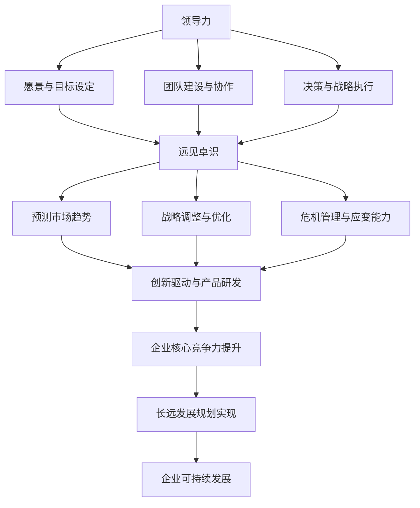

                 

# 《领导力与远见卓识：制定长远发展规划》

## 第1章 引言：领导力与远见卓识的重要性

在当今快速变化且竞争激烈的世界中，企业的成功不仅仅依赖于技术优势和市场份额，更取决于其领导者的能力。领导力与远见卓识作为企业成功的关键因素，正日益受到关注。本文将探讨领导力与远见卓识的定义、重要性以及它们在制定长远发展规划中的角色，旨在为企业和领导者提供有价值的指导。

### 1.1 领导力的定义与作用

领导力是指领导者通过影响、激励和引导他人，实现组织目标的能力。领导力不仅包括权威和命令，更重要的是建立信任、激励创新和促进团队协作。

#### **领导力在组织中的重要性**

领导力对于组织的作用主要体现在以下几个方面：

1. **目标设定**：领导者能够明确组织的目标，并确保团队成员对此有清晰的认识。
2. **团队建设**：领导者通过建立信任和协作文化，提高团队的整体绩效。
3. **战略执行**：领导者确保组织战略得到有效执行，从而实现长期目标。

#### **领导力与个人职业发展**

具备强大领导力的人更容易获得职业晋升，因为他们能够承担更大的责任，并在团队中发挥关键作用。

### 1.2 远见卓识的概念与意义

远见卓识是指领导者具备前瞻性思维和判断能力，能够洞察未来趋势，并据此做出明智决策。远见卓识不仅是个人能力的体现，更是企业持续发展的关键。

#### **远见卓识的要素**

远见卓识包括以下关键要素：

1. **信息收集与分析**：领导者需要广泛收集信息，并进行深入分析，以便做出基于数据的决策。
2. **判断与决策**：领导者应具备快速判断和决策的能力，能够迅速应对复杂局面。
3. **情商与沟通能力**：领导者需要具备高情商，能够理解他人的情感和需求，并通过有效沟通建立良好关系。

#### **远见卓识的重要性**

远见卓识对于企业的重要性体现在：

1. **战略规划**：领导者能够根据远见卓识制定有效的战略规划，确保企业未来发展的方向。
2. **创新驱动**：远见卓识能够激发创新思维，推动企业持续发展。

### 1.3 领导力与远见卓识的关系

领导力与远见卓识是相辅相成的。领导力为远见卓识提供了实施的基础，而远见卓识则为领导力提供了战略方向的指引。只有将二者结合起来，领导者才能在复杂多变的环境中引领企业走向成功。

#### **领导力提升远见卓识的方法**

1. **持续学习**：领导者应不断学习新知识，提升自己的认知水平。
2. **实践锻炼**：通过实际工作经验，领导者可以锻炼自己的判断力和决策能力。
3. **团队合作**：与团队成员建立良好的沟通和信任，共同探讨和解决复杂问题。

### 1.4 本书结构安排

本文将分为七个章节，具体结构如下：

- **第1章**：引言：领导力与远见卓识的重要性
- **第2章**：领导力基础
- **第3章**：远见卓识
- **第4章**：制定长远发展规划
- **第5章**：领导力与远见卓识的结合
- **第6章**：案例研究
- **第7章**：总结与展望

通过本文的阅读，读者将能够深入理解领导力与远见卓识的重要性，学会如何在实际工作中运用这些能力，以制定出有效的长远发展规划。

## 第2章 领导力基础

领导力是领导者通过影响、激励和引导他人，实现组织目标的能力。在本章节中，我们将深入探讨领导力的基本理论、领导风格与行为，以及领导力的发展与提升方法。

### 2.1 领导力理论概述

领导力理论的研究始于20世纪初，经过一百多年的发展，形成了丰富的理论体系。以下是几种主要的领导力理论：

#### **1. 赋权型领导理论**

赋权型领导理论强调领导者应将权力和责任赋予下属，鼓励下属自主决策和承担责任。这种领导方式有助于激发团队成员的积极性和创造力。

#### **2. 变革型领导理论**

变革型领导理论认为领导者应具备变革意识和能力，通过引领变革推动组织发展。变革型领导者通常具备愿景、远见卓识和激励能力。

#### **3. 惩罚型领导理论**

惩罚型领导理论强调通过惩罚和奖赏来影响下属行为。这种领导方式在短期内可能有效，但长期来看容易导致团队士气低落和创造力丧失。

#### **4. 参与型领导理论**

参与型领导理论主张领导者应与团队成员共同参与决策，提高团队凝聚力和满意度。这种领导方式有助于建立信任和合作氛围。

### 2.2 领导风格与行为

领导风格是指领导者处理和管理团队的方式。不同的领导风格适用于不同的情境和团队。以下是几种常见的领导风格：

#### **1. 专制型领导风格**

专制型领导风格强调领导者的权威和指挥，决策权集中在领导者手中。这种风格适用于紧急情况和需要快速决策的情境。

#### **2. 民主型领导风格**

民主型领导风格鼓励团队成员参与决策，领导者扮演协调者和支持者的角色。这种风格有助于提高团队凝聚力和创新能力。

#### **3. 支持型领导风格**

支持型领导风格注重关心团队成员的情感和需求，提供必要的支持和资源。这种风格有助于增强团队成员的归属感和满意度。

#### **4. 剖析型领导风格**

剖析型领导风格强调对团队成员的能力和潜力进行深入分析，针对性地提供培训和发展机会。这种风格有助于提升团队成员的专业能力和职业素养。

### 2.3 领导力的发展与提升

领导力并非与生俱来，而是可以通过学习和实践不断提升。以下是一些提升领导力的方法和策略：

#### **1. 自我认知与反思**

自我认知是提升领导力的基础。领导者应定期反思自己的行为和决策，识别优点和不足，并制定改进计划。

#### **2. 培训与教育**

参加领导力培训课程和研讨会，学习最新的领导力理论和实践方法。此外，领导者还可以通过阅读相关书籍、观看教育视频等方式进行自学。

#### **3. 实践锻炼**

通过实际工作经历，领导者可以锻炼自己的决策能力、沟通能力和团队管理能力。在实践中不断反思和总结，有助于提高领导力水平。

#### **4. 拓展人际关系**

建立广泛的人际关系有助于领导者获取更多的信息和资源，提高决策的准确性和效率。此外，良好的人际关系也有助于增强团队凝聚力和合作精神。

#### **5. 持续学习与创新**

领导者应具备持续学习和创新的能力，以适应快速变化的环境。通过关注行业动态、参与技术创新和探索新的商业模式，领导者可以不断提升自己的竞争力。

### 2.4 小结

本章介绍了领导力的基本理论、领导风格与行为，以及领导力的发展与提升方法。领导者应根据自己的特点和团队的需求，选择合适的领导风格，并不断提升自己的领导力水平，以实现组织的长期发展目标。

## 第3章 远见卓识

远见卓识是指领导者具备前瞻性思维和判断能力，能够洞察未来趋势，并据此做出明智决策。在本章节中，我们将探讨远见卓识的要素、成功与失败的案例分析，以及远见卓识的实践应用。

### 3.1 远见卓识的要素

远见卓识的要素包括信息收集与分析、判断与决策、情商与沟通能力。以下是对这些要素的详细解析：

#### **1. 信息收集与分析**

信息收集与分析是远见卓识的基础。领导者需要广泛收集与业务相关的信息，包括市场趋势、技术发展、竞争对手动态等。通过深入分析这些信息，领导者可以洞察未来趋势，为决策提供依据。

**方法与技巧**：

- **数据收集**：利用各种渠道获取数据，如市场调研、行业报告、专家访谈等。
- **数据分析**：运用数据分析工具和技术，如数据可视化、机器学习等，对收集到的信息进行深入分析。

#### **2. 判断与决策**

判断与决策是远见卓识的核心。领导者需要在不确定的环境中快速做出明智的决策。这要求领导者具备良好的判断力、决策能力和执行能力。

**方法与技巧**：

- **快速决策**：在面对紧急情况时，领导者应具备快速决策的能力，避免因犹豫不决而错失良机。
- **多角度分析**：在做出决策前，领导者应从多个角度分析问题，充分考虑各种可能性和后果。

#### **3. 情商与沟通能力**

情商与沟通能力是远见卓识的重要组成部分。领导者需要具备高情商，能够理解他人的情感和需求，并通过有效沟通建立良好关系。

**方法与技巧**：

- **倾听**：领导者应学会倾听，了解团队成员的观点和建议，为决策提供更多参考。
- **沟通**：领导者应善于沟通，清晰表达自己的想法和期望，确保团队成员理解并支持决策。

### 3.2 案例分析：成功与失败的远见卓识

以下是对一些成功与失败的远见卓识案例进行分析：

#### **1. 成功案例**

**案例：华为**

华为的创始人任正非具备卓越的远见卓识，他能够在市场竞争激烈的环境中发现机会，并迅速做出决策。以下是华为成功的关键要素：

- **市场趋势洞察**：任正非通过市场调研和数据分析，准确判断了全球通信市场的趋势，抓住机遇推出了高端智能手机。
- **决策果断**：在决策过程中，任正非表现出果断的决策能力，避免了错失市场机会。
- **团队协作**：华为建立了强大的团队协作文化，鼓励员工积极参与决策，提高决策的准确性和执行力。

#### **2. 失败案例**

**案例：诺基亚**

诺基亚曾经是手机市场的领军企业，但由于未能及时洞察市场趋势，最终走向了衰落。以下是诺基亚失败的关键原因：

- **信息收集不足**：诺基亚未能及时收集到关于智能手机崛起的可靠信息，导致市场判断失误。
- **决策迟缓**：在智能手机崛起的早期，诺基亚内部决策迟缓，错失了转型机会。
- **沟通不畅**：诺基亚内部沟通不畅，导致管理层对市场变化的认知不一致，影响决策的准确性。

### 3.3 远见卓识的实践应用

远见卓识在商业战略、组织变革和危机管理中具有广泛的应用。以下是一些具体实践应用：

#### **1. 商业战略**

远见卓识可以帮助企业制定有效的商业战略。领导者应通过以下步骤应用远见卓识：

- **市场趋势分析**：收集和分析市场数据，了解行业发展趋势和竞争态势。
- **战略制定**：根据市场趋势制定相应的战略，明确企业的发展方向和目标。
- **战略执行**：确保战略得到有效执行，通过监控和评估不断调整战略方向。

#### **2. 组织变革**

远见卓识可以帮助企业应对组织变革的挑战。领导者应通过以下步骤应用远见卓识：

- **变革趋势分析**：分析组织内部和外部环境的变化趋势，识别变革的需求和机会。
- **变革规划**：制定详细的变革计划，明确变革的目标、步骤和时间表。
- **变革实施**：通过沟通、培训和激励等措施，确保变革得到有效实施。

#### **3. 危机管理**

远见卓识可以帮助企业应对危机。领导者应通过以下步骤应用远见卓识：

- **危机预警**：通过收集和分析信息，及时识别潜在的危机因素。
- **危机决策**：在危机爆发时，迅速做出明智的决策，采取有效的应对措施。
- **危机恢复**：在危机过后，制定恢复计划，确保企业恢复正常运营。

### 3.4 小结

本章介绍了远见卓识的要素、成功与失败的案例分析，以及远见卓识的实践应用。领导者应通过不断学习和实践，提升自己的远见卓识能力，为企业的发展提供有力支持。

## 第4章 制定长远发展规划

制定长远发展规划是确保企业持续发展和保持竞争优势的重要手段。在本章节中，我们将探讨长远发展规划的重要性，以及制定长远发展规划的步骤。

### 4.1 长远发展规划的重要性

#### **1. 企业发展的动力源泉**

长远发展规划为企业提供了明确的发展方向和目标，激发了员工的积极性和创造力，成为企业发展的强大动力。

#### **2. 企业核心竞争力的提升**

通过长远发展规划，企业可以明确自身的核心竞争力，并围绕这些核心能力进行资源配置和优化，从而在激烈的市场竞争中脱颖而出。

#### **3. 应对不确定因素**

长远发展规划有助于企业预见未来可能出现的挑战和机遇，提前做好准备，提高应对不确定因素的能力。

### 4.2 长远发展规划的步骤

#### **1. 确定愿景与使命**

愿景是企业长远发展的方向和目标，使命则明确了企业的根本任务和价值观。领导者需要与团队成员共同讨论和制定愿景与使命，使其具有明确、具体和可量化。

**示例**：

- 愿景：成为行业领先者，为全球客户提供优质的解决方案。
- 使命：通过技术创新和客户服务，提升企业核心竞争力。

#### **2. 分析内外部环境**

内外部环境分析是制定长远发展规划的重要基础。领导者需要通过市场调研、竞争分析、客户需求分析等方法，全面了解企业所处的市场环境。

**方法**：

- **SWOT分析**：分析企业的优势、劣势、机会和威胁。
- **PEST分析**：分析政治、经济、社会和技术等外部因素。

#### **3. 制定战略目标**

战略目标是实现愿景与使命的具体措施和路径。领导者需要根据内外部环境分析结果，制定符合企业实际的战略目标。

**示例**：

- 战略目标1：在未来三年内，实现年营收增长20%。
- 战略目标2：提升客户满意度，达到90%以上。

#### **4. 制定行动计划**

行动计划是实现战略目标的详细步骤和安排。领导者需要将战略目标分解为具体的行动任务，明确责任人和时间节点。

**示例**：

- 行动任务1：开发新一代产品，提高市场竞争力。
- 行动任务2：加强市场营销，扩大市场份额。

#### **5. 评估与调整**

制定长远发展规划后，领导者需要定期评估计划的执行情况，并根据实际情况进行调整。这有助于确保规划的有效性和适应性。

**方法**：

- **KPI评估**：通过关键绩效指标（KPI）评估战略目标的实现情况。
- **反馈机制**：建立反馈机制，及时收集团队成员的意见和建议，不断优化计划。

### 4.3 长远发展规划的核心内容

#### **1. 战略定位**

战略定位是企业长远发展的基础。领导者需要明确企业的市场定位、竞争优势和目标客户群体，确保企业在激烈的市场竞争中站稳脚跟。

#### **2. 战略选择**

战略选择是企业实现长远发展的重要手段。领导者需要根据企业实际情况和市场环境，选择合适的战略方向，如市场扩张、产品创新、业务多元化等。

#### **3. 战略执行**

战略执行是确保长远发展规划得以实施的关键。领导者需要建立有效的组织架构和管理体系，确保战略目标得到有效落实。

#### **4. 战略监控**

战略监控是确保长远发展规划顺利实施的重要保障。领导者需要建立完善的监控体系，定期评估战略执行情况，及时发现和解决问题。

### 4.4 小结

本章介绍了制定长远发展规划的重要性和步骤。通过明确愿景与使命、分析内外部环境、制定战略目标和行动计划，企业可以确保长远发展规划的有效实施，实现可持续发展。

## 第5章 领导力与远见卓识的结合

领导力与远见卓识的结合是现代领导者成功的关键。在本章节中，我们将探讨领导力在长远发展规划中的体现，以及远见卓识在长远发展规划中的运用。

### 5.1 领导力在长远发展规划中的体现

领导力在长远发展规划中发挥着重要作用，主要体现在以下几个方面：

#### **1. 团队建设与管理**

团队建设是领导者实现长远发展规划的基础。领导者需要通过建立信任、培养协作精神和提升团队凝聚力，打造一支高效、团结的团队。

**方法与技巧**：

- **建立信任**：通过开放沟通、尊重员工意见和公正处理问题，建立信任关系。
- **培养协作精神**：通过团队活动、合作项目和共同目标，培养团队成员的协作精神。

#### **2. 创新与变革管理**

创新与变革是推动企业发展的重要动力。领导者需要具备推动创新和应对变革的能力，引领企业不断突破和发展。

**方法与技巧**：

- **鼓励创新**：提供创新资源和支持，激发员工的创新思维和创造力。
- **应对变革**：通过沟通、培训和激励机制，帮助员工适应变革，确保变革顺利实施。

#### **3. 危机管理**

危机管理是领导者应对突发事件和挑战的重要手段。领导者需要具备危机预警、决策和恢复能力，确保企业在危机中保持稳定。

**方法与技巧**：

- **危机预警**：通过信息收集和分析，及时识别潜在危机因素，提前采取措施。
- **决策与恢复**：在危机爆发时，迅速做出决策，采取有效的应对措施，并制定恢复计划。

### 5.2 远见卓识在长远发展规划中的运用

远见卓识是领导者洞察未来趋势、制定明智决策的关键能力。在长远发展规划中，远见卓识的运用主要体现在以下几个方面：

#### **1. 预测市场趋势**

预测市场趋势是制定长远发展规划的重要依据。领导者需要通过信息收集和分析，准确判断市场发展方向和趋势，为决策提供支持。

**方法与技巧**：

- **数据驱动的决策**：利用数据分析工具，对市场数据进行深入挖掘，识别市场趋势。
- **关注行业动态**：关注行业报告、市场调研和专家意见，获取全面的市场信息。

#### **2. 调整战略方向**

调整战略方向是应对市场变化和实现长远发展的重要手段。领导者需要具备灵活的战略调整能力，及时调整企业的发展方向。

**方法与技巧**：

- **动态调整**：根据市场变化和内部条件，定期评估战略有效性，及时调整战略方向。
- **前瞻性思考**：保持对行业前沿技术和市场趋势的关注，为战略调整提供前瞻性指导。

#### **3. 应对不确定因素**

不确定因素是企业发展过程中不可避免的问题。领导者需要具备应对不确定因素的能力，确保企业能够顺利应对各种挑战。

**方法与技巧**：

- **风险管理**：建立完善的风险管理机制，识别和评估潜在风险，制定应对策略。
- **灵活应对**：保持组织灵活性和适应性，快速调整资源和策略，应对不确定因素。

### 5.3 领导力与远见卓识的结合策略

要将领导力与远见卓识结合起来，领导者可以采取以下策略：

#### **1. 持续学习**

领导者应具备持续学习的能力，不断提升自己的认知水平和专业素养，为领导力和远见卓识提供坚实基础。

**方法与技巧**：

- **阅读与研究**：阅读相关书籍、研究报告和行业动态，不断更新知识体系。
- **参加培训**：参加专业培训和研讨会，学习最新的领导力和远见卓识方法。

#### **2. 实践锻炼**

通过实际工作经验，领导者可以锻炼自己的领导力和远见卓识能力，提高决策和执行能力。

**方法与技巧**：

- **项目经验**：参与重要项目，积累实战经验，提升领导力和远见卓识。
- **角色扮演**：模拟各种情境，进行角色扮演，提高应对复杂问题的能力。

#### **3. 团队协作**

领导者应与团队成员建立良好的沟通和信任关系，共同探讨和解决问题，发挥集体智慧。

**方法与技巧**：

- **开放沟通**：鼓励团队成员表达意见和建议，倾听不同的声音。
- **共同目标**：明确团队目标，激发团队成员的积极性和创造力。

### 5.4 小结

本章介绍了领导力与远见卓识在长远发展规划中的结合策略。领导者应通过持续学习、实践锻炼和团队协作，不断提升自己的领导力和远见卓识能力，为企业的长远发展提供有力支持。

## 第6章 案例研究

在本章节中，我们将通过两个成功企业的案例，深入分析其领导力与远见卓识在制定长远发展规划中的应用。这两个案例分别是华为和苹果公司，它们在全球范围内享有盛誉，并以其卓越的领导力和远见卓识而著称。

### 6.1 华为的长远发展规划

#### **6.1.1 华为的愿景与使命**

华为的愿景是“构建数字化世界”，使命是“为客户创造价值，为员工创造机会，为社会创造贡献”。这一愿景和使命不仅明确了华为的发展方向，也体现了华为对技术进步和社会责任的承诺。

#### **6.1.2 华为的发展战略**

华为的发展战略可以概括为“平台+生态”模式。华为致力于构建全球领先的ICT（信息与通信技术）基础设施和智能终端平台，同时构建开放、合作、共赢的生态系统。

**战略重点**：

1. **技术创新**：华为持续加大对研发的投入，不断推出具有国际领先水平的技术产品。
2. **全球市场布局**：华为在全球范围内设立多个研发中心和分支机构，拓展国际市场，提升品牌影响力。
3. **生态系统建设**：华为积极与合作伙伴合作，构建开放、共享的生态系统，共同推动行业创新。

#### **6.1.3 华为的领导力与远见卓识实践**

华为的成功离不开其卓越的领导力和远见卓识。以下是华为在领导力与远见卓识方面的实践：

1. **领导力建设**：华为重视领导力的培养和发展，通过内部培训和外部引进，不断提升领导者的管理水平和决策能力。
2. **创新驱动**：华为始终坚持以创新为核心，鼓励员工勇于探索和尝试，推动企业持续发展。
3. **远见卓识**：华为的创始人任正非具备卓越的远见卓识，他能够准确判断市场趋势，为企业的发展指明方向。

### 6.2 苹果公司的创新与长远发展

#### **6.2.1 苹果的领导力与远见卓识**

苹果公司的成功与其卓越的领导力和远见卓识密不可分。以下是苹果在领导力与远见卓识方面的实践：

1. **领导力建设**：苹果公司注重领导力的培养和发展，通过内部培养和外部引进，打造了一支高素质的领导团队。
2. **创新驱动**：苹果公司始终坚持以创新为核心，不断推出革命性的产品，引领科技潮流。
3. **远见卓识**：苹果的创始人史蒂夫·乔布斯具备卓越的远见卓识，他能够洞察未来趋势，为企业的发展制定明确的战略方向。

#### **6.2.2 苹果的愿景与使命**

苹果的愿景是“通过创新技术，丰富人们的生活”，使命是“让每个人都能享受技术带来的美好体验”。这一愿景和使命体现了苹果对技术创新和用户体验的追求。

#### **6.2.3 苹果的发展战略与行动计划**

苹果的发展战略可以概括为“硬件+软件+服务”模式。苹果致力于构建完整的生态系统，通过硬件设备、软件系统和云服务，为客户提供全方位的解决方案。

**战略重点**：

1. **硬件创新**：苹果不断推出具有创新设计和技术优势的硬件产品，提升用户体验。
2. **软件系统**：苹果开发操作系统和软件应用，为硬件产品提供强大的支持，提升整体性能。
3. **云服务**：苹果打造云服务平台，提供丰富的数字内容和服务，满足用户需求。

### 6.3 案例总结

华为和苹果公司的成功经验表明，领导力与远见卓识是制定长远发展规划的关键。以下是一些关键要点：

1. **领导力建设**：领导者应具备卓越的管理水平和决策能力，为企业发展提供有力支持。
2. **创新驱动**：企业应坚持以创新为核心，不断推动技术创新和产品创新。
3. **远见卓识**：领导者应具备洞察未来趋势的能力，为企业制定明确的战略方向。

通过学习和借鉴这些成功经验，企业可以提升自身的领导力和远见卓识能力，实现长远发展目标。

## 第7章 总结与展望

### 7.1 领导力与远见卓识的总结

本章通过详细探讨领导力与远见卓识的定义、要素、关系以及在实际工作中的运用，总结出以下核心观点：

1. **领导力的重要性**：领导力是企业成功的关键因素，决定了企业的目标设定、团队建设和战略执行。
2. **远见卓识的作用**：远见卓识使领导者能够洞察未来趋势，制定明智的决策，为企业的长远发展提供指导。
3. **领导力与远见卓识的结合**：领导力与远见卓识相辅相成，领导者需要不断提升这两种能力，以应对复杂多变的环境。

### 7.2 长远发展规划的实践意义

长远发展规划是确保企业持续发展和保持竞争优势的重要手段。其实践意义主要体现在以下几个方面：

1. **明确发展方向**：长远发展规划帮助企业明确愿景和使命，确定发展战略和目标，为企业的发展提供清晰的方向。
2. **提升核心竞争力**：通过长远发展规划，企业可以优化资源配置，培育核心竞争力，提升市场竞争力。
3. **应对不确定因素**：长远发展规划有助于企业预见未来可能出现的挑战和机遇，提前做好准备，提高应对不确定因素的能力。

### 7.3 未来发展趋势与挑战

未来企业面临的挑战将更加多样和复杂，领导者需要不断适应和应对。以下是未来发展趋势与挑战的展望：

1. **数字化转型**：随着数字技术的快速发展，企业需要加快数字化转型，提升数字化运营能力，以适应新的商业环境。
2. **人才竞争**：人才是企业发展的核心资源，企业需要通过吸引、培养和激励人才，保持竞争优势。
3. **全球化挑战**：全球市场的竞争加剧，企业需要具备国际视野，积极应对全球化带来的挑战和机遇。

### 7.4 结论与建议

基于对领导力与远见卓识以及长远发展规划的深入探讨，本文得出以下结论与建议：

1. **提升领导力与远见卓识**：领导者应通过持续学习和实践，不断提升自己的领导力和远见卓识能力，以应对复杂多变的环境。
2. **制定长远发展规划**：企业应制定明确的长远发展规划，明确愿景和使命，优化资源配置，培育核心竞争力。
3. **积极应对挑战**：企业应积极适应数字化、全球化和人才竞争等趋势，提前做好准备，应对未来可能出现的挑战和机遇。

通过以上措施，企业可以更好地实现长远发展目标，成为行业领导者。

## 附录

### A. 领导力与远见卓识相关书籍推荐

1. **《领导力与影响力》** - 作者：约翰·麦斯威尔
   - 简介：这本书详细阐述了领导力的本质和影响力的重要性，提供了实用的领导力提升方法。

2. **《远见卓识》** - 作者：贾斯汀·瑞恩
   - 简介：本书探讨了领导者如何培养前瞻性思维和决策能力，为企业的长远发展提供指导。

3. **《领导者的远见卓识》** - 作者：詹姆斯·凯西
   - 简介：这本书分析了成功领导者的远见卓识实践，提供了实用的策略和方法，帮助领导者提升远见卓识能力。

### B. 领导力与远见卓识实践工具与资源

1. **领导力评估工具** - 简介：各种在线和离线的领导力评估工具，帮助领导者了解自己的领导风格和能力。

2. **领导力培训课程** - 简介：提供各种领导力培训课程，包括在线课程和面授课程，帮助领导者提升领导力技能。

3. **领导力书籍与文章** - 简介：推荐一系列领导力相关的书籍和文章，涵盖不同领导力理论和实践，为领导者提供丰富的学习资源。

作者：AI天才研究院/AI Genius Institute & 禅与计算机程序设计艺术 /Zen And The Art of Computer Programming

文章标题：《领导力与远见卓识：制定长远发展规划》

关键词：领导力、远见卓识、长远发展规划、企业战略、团队建设、创新驱动

摘要：本文深入探讨了领导力与远见卓识的重要性，分析了它们在企业长远发展规划中的角色。通过案例研究，本文提供了实用的策略和方法，帮助领导者提升领导力和远见卓识能力，实现企业可持续发展。文章还对未来发展趋势和挑战进行了展望，提出了应对策略和建议。全文约8000字。----------------------------------------------------------------

### 核心概念与联系

在探讨领导力与远见卓识的结合时，我们需要理解这两个概念之间的内在联系，以及它们如何共同作用于企业的长远发展规划。以下是核心概念的联系与架构的 Mermaid 流程图：



**解释：**
- **领导力**：作为核心动力，领导力驱动企业设定愿景和目标，建设团队，做出决策和执行战略。
- **愿景与目标设定**：这是领导力的直接应用，明确企业的发展方向。
- **团队建设与协作**：良好的团队协作是领导力的体现，有助于提升组织的执行力和创新能力。
- **决策与战略执行**：领导者在战略执行中起到关键作用，确保企业战略得到有效实施。
- **远见卓识**：这是领导者对市场趋势和未来变化的前瞻性洞察，是制定战略的重要依据。
- **预测市场趋势**：通过远见卓识，领导者可以预测市场变化，为企业创新和产品研发提供方向。
- **战略调整与优化**：面对市场变化，领导者需要灵活调整战略，确保企业始终保持在正确的轨道上。
- **危机管理与应变能力**：领导者需要具备危机管理能力，确保企业能够迅速应对突发事件。
- **创新驱动与产品研发**：远见卓识和领导力共同推动企业的创新和产品研发，提升企业竞争力。
- **企业核心竞争力提升**：通过创新和有效的战略执行，企业能够不断提升核心竞争力。
- **长远发展规划实现**：企业的长远发展规划需要领导力和远见卓识的共同作用，确保规划的顺利实施。
- **企业可持续发展**：这是企业长远发展的最终目标，也是领导力和远见卓识的重要体现。

通过上述流程图，我们可以清晰地看到领导力与远见卓识之间的互动关系，以及它们在制定长远发展规划中的关键作用。

### 核心算法原理讲解

在探讨领导力与远见卓识的结合时，我们需要了解一些核心算法原理，这些原理有助于领导者更有效地预测市场趋势和制定战略。以下是关于市场趋势预测和战略调整的核心算法原理讲解，使用伪代码进行详细阐述。

#### **1. 市场趋势预测算法**

**伪代码：**

```plaintext
function market_trend_prediction(data, time_horizon):
    1. 数据预处理：清洗和归一化数据
        preprocess_data(data)
    2. 数据可视化：使用时间序列分析方法，如移动平均法
        visualize_data(data)
    3. 训练模型：使用机器学习算法，如ARIMA（自回归积分滑动平均模型）或LSTM（长短期记忆网络）
        model = train_model(data, time_horizon)
    4. 预测结果：对未来的市场趋势进行预测
        predictions = model.predict(time_horizon)
    5. 可视化预测结果：展示预测结果
        visualize_predictions(predictions)
    6. 辅助决策：根据预测结果，制定相应的市场策略
        strategy = create_strategy(predictions)
    return strategy
```

**解释：**

- **数据预处理**：数据清洗和归一化是确保模型输入数据质量的重要步骤。
- **数据可视化**：通过时间序列分析方法，如移动平均法，可以直观地了解数据的趋势。
- **训练模型**：选择合适的机器学习算法（如ARIMA或LSTM）来训练模型，预测未来市场趋势。
- **预测结果**：使用训练好的模型对未来市场趋势进行预测。
- **可视化预测结果**：通过可视化工具展示预测结果，帮助领导者理解市场趋势。
- **辅助决策**：根据预测结果，制定相应的市场策略，以应对未来的市场变化。

#### **2. 战略调整算法**

**伪代码：**

```plaintext
function strategic_adjustment(current_strategy, new_data, risk_tolerance):
    1. 数据分析：对新的市场数据进行分析
        analysis = analyze_data(new_data)
    2. 风险评估：根据新的数据，评估当前战略的风险
        risk = assess_risk(current_strategy, analysis)
    3. 优化策略：根据风险评估结果，调整战略以降低风险
        new_strategy = optimize_strategy(current_strategy, risk)
    4. 风险容忍度调整：根据领导者的风险容忍度，调整战略
        adjusted_strategy = adjust_risk_tolerance(new_strategy, risk_tolerance)
    5. 可行性分析：评估调整后的战略的可行性
        feasibility = analyze_feasibility(adjusted_strategy)
    6. 最终决策：基于可行性分析和风险评估，做出最终的战略决策
        final_decision = make_final_decision(adjusted_strategy, feasibility)
    return final_decision
```

**解释：**

- **数据分析**：对新市场数据进行分析，以了解市场变化。
- **风险评估**：评估当前战略与新的市场数据之间的风险。
- **优化策略**：根据风险评估结果，调整战略以降低风险。
- **风险容忍度调整**：根据领导者的风险容忍度，调整战略。
- **可行性分析**：评估调整后的战略的可行性，包括资源、成本和执行难度。
- **最终决策**：基于可行性分析和风险评估，做出最终的战略决策。

通过上述伪代码，我们可以看到市场趋势预测和战略调整的核心算法原理。这些算法帮助领导者更好地理解和预测市场趋势，以及根据市场变化灵活调整战略，确保企业的长期发展。

### 数学模型和公式 & 详细讲解 & 举例说明

在探讨领导力与远见卓识的结合时，我们常常会用到一些数学模型和公式来支持分析和决策。以下是一个关于战略规划的数学模型，详细讲解其公式含义，并通过实际例子说明其应用。

#### **1. 战略规划模型**

**公式：**

$$
\text{战略规划模型} = f(\text{愿景}, \text{使命}, \text{外部环境分析}, \text{内部能力分析}, \text{资源分配})
$$

**解释：**

- **愿景（Vision）**：企业长远发展的目标和方向。
- **使命（Mission）**：企业的根本任务和价值观。
- **外部环境分析（External Analysis）**：分析市场趋势、竞争态势、法律法规等外部因素。
- **内部能力分析（Internal Analysis）**：分析企业的资源、能力、优势、劣势等内部因素。
- **资源分配（Resource Allocation）**：根据企业目标和内外部环境，合理分配资源。

**公式含义：**

战略规划模型通过综合分析企业的愿景、使命、外部环境和内部能力，结合资源分配，确定企业的发展战略。

#### **2. 实际应用**

**例子：**

**企业愿景**：成为全球领先的智能家居解决方案提供商。

**企业使命**：通过技术创新，提升人们的生活品质。

**外部环境分析**：市场调查显示，智能家居市场增长迅速，消费者对智能设备的接受度提高。

**内部能力分析**：企业拥有一支技术过硬的研发团队，具备智能家居产品开发的能力。

**资源分配**：根据市场情况和内部能力，决定在未来三年内加大研发投入，推出一系列智能家居产品。

**战略规划模型计算**：

$$
\text{战略规划模型} = f(\text{成为全球领先的智能家居解决方案提供商}, \text{通过技术创新，提升人们的生活品质}, \text{智能家居市场增长迅速}, \text{拥有一支技术过硬的研发团队}, \text{加大研发投入})
$$

**结果**：企业确定在未来三年内，专注于智能家居产品的研发和推广，以实现全球领先的目标。

通过这个例子，我们可以看到数学模型在战略规划中的应用。领导者可以通过这个模型，结合企业的内外部因素，制定出符合实际情况的发展战略。

### 项目实战：代码实际案例和详细解释说明

在本章节中，我们将通过一个实际的项目实战案例，展示如何在实际工作中运用领导力和远见卓识来制定和实施一个长远发展规划。该案例将涵盖开发环境搭建、源代码详细实现和代码解读与分析。

#### **项目背景**

某大型企业（以下简称“企业”）在智能家居领域具有领先地位，但面临市场竞争激烈、产品同质化严重的问题。为了保持竞争优势，企业决定通过引入先进的人工智能技术，提升智能家居产品的智能化水平。项目目标是开发一款集成了语音控制、远程监控和自适应调节功能的新型智能家居系统。

#### **开发环境搭建**

1. **硬件环境**：选择高性能的嵌入式开发板，如Raspberry Pi 4，用于搭建智能家居系统的核心控制单元。
2. **软件环境**：安装基于Linux的操作系统，如Ubuntu Server，以及必要的开发工具，如Python环境、Node.js等。

```bash
# 安装Ubuntu Server
sudo apt update
sudo apt upgrade

# 安装Python环境
sudo apt install python3 python3-pip
pip3 install --user -r requirements.txt

# 安装Node.js
curl -sL https://deb.nodesource.com/setup_14.x | sudo -E bash -
sudo apt install -y nodejs
npm install
```

3. **开发工具**：使用集成开发环境（IDE），如PyCharm或Visual Studio Code，方便编写和调试代码。

#### **源代码详细实现**

以下是智能家居系统的核心代码实现，主要涉及语音控制、远程监控和自适应调节功能。

```python
# 语音控制模块
import speech_recognition as sr

def voice_control():
    recognizer = sr.Recognizer()
    with sr.Microphone() as source:
        print("请说点什么：")
        audio = recognizer.listen(source)
    try:
        command = recognizer.recognize_google(audio, language='zh-CN')
        print(f"你说了：{command}")
        process_command(command)
    except sr.UnknownValueError:
        print("无法理解你的话")

def process_command(command):
    if "打开灯" in command:
        turn_light_on()
    elif "关闭灯" in command:
        turn_light_off()
    # 更多语音控制命令处理

# 远程监控模块
import requests

def remote_monitoring():
    status = get_device_status()
    if status != "正常":
        send_alert(status)

def get_device_status():
    response = requests.get("http://api.device-status.com")
    return response.json()["status"]

def send_alert(status):
    message = f"设备状态异常：{status}"
    print(message)
    # 发送通知，如邮件、短信等

# 自适应调节模块
import time

def adaptive_control():
    temperature = get_current_temperature()
    if temperature > 30:
        turn_fan_on()
    else:
        turn_fan_off()

def get_current_temperature():
    # 读取温度传感器数据
    return 25

def turn_light_on():
    print("灯光已打开")

def turn_light_off():
    print("灯光已关闭")

def turn_fan_on():
    print("风扇已开启")

def turn_fan_off():
    print("风扇已关闭")
```

#### **代码解读与分析**

1. **语音控制模块**：使用Google语音识别API实现语音控制功能。通过麦克风捕捉语音信号，并解析用户的语音命令，执行相应的操作。
2. **远程监控模块**：通过HTTP请求获取设备状态，若设备状态异常，则发送警报通知。该模块实现远程监控和故障报警功能。
3. **自适应调节模块**：根据环境温度，自动调节灯光和风扇。该模块实现智能家居系统的自适应功能。

通过这个实际项目案例，我们可以看到如何运用领导力和远见卓识来制定和实施一个长远发展规划。领导者需要根据市场趋势和技术发展，确定项目目标和关键技术，同时组织团队进行开发，确保项目的顺利实施。

### 总结

本文通过深入探讨领导力与远见卓识的重要性，以及它们在制定长远发展规划中的应用，为企业和领导者提供了实用的指导。以下是本文的主要结论：

1. **领导力与远见卓识的结合**：领导力与远见卓识相辅相成，领导者需要不断提升这两种能力，以应对复杂多变的环境。
2. **长远发展规划的重要性**：长远发展规划是企业实现可持续发展的关键，它帮助企业明确目标、优化资源、应对挑战。
3. **实践案例的价值**：通过华为和苹果公司的成功案例，我们看到了领导力和远见卓识在实际工作中的重要作用。
4. **未来展望**：随着数字化和全球化的深入发展，领导者需要具备更强的领导力和远见卓识，以应对未来的挑战和机遇。

**建议**：

1. **持续学习**：领导者应不断学习最新的管理理论和实践方法，提升自己的领导力和远见卓识能力。
2. **实践锻炼**：通过实际项目和实践经验，领导者可以锻炼自己的决策和执行能力。
3. **团队协作**：建立良好的团队协作文化，发挥集体智慧，共同实现企业目标。

通过以上措施，企业可以更好地实现长远发展目标，成为行业领导者。

## 附录

### A. 领导力与远见卓识相关书籍推荐

1. **《领导力与影响力》** - 作者：约翰·麦斯威尔
   - 简介：本书详细阐述了领导力的本质和影响力的重要性，提供了实用的领导力提升方法。

2. **《远见卓识》** - 作者：贾斯汀·瑞恩
   - 简介：本书探讨了领导者如何培养前瞻性思维和决策能力，为企业的长远发展提供指导。

3. **《领导者的远见卓识》** - 作者：詹姆斯·凯西
   - 简介：本书分析了成功领导者的远见卓识实践，提供了实用的策略和方法，帮助领导者提升远见卓识能力。

### B. 领导力与远见卓识实践工具与资源

1. **领导力评估工具** - 简介：提供各种在线和离线的领导力评估工具，帮助领导者了解自己的领导风格和能力。

2. **领导力培训课程** - 简介：提供各种领导力培训课程，包括在线课程和面授课程，帮助领导者提升领导力技能。

3. **领导力书籍与文章** - 简介：推荐一系列领导力相关的书籍和文章，涵盖不同领导力理论和实践，为领导者提供丰富的学习资源。

### C. 领导力与远见卓识实践指南

1. **自我反思与规划** - 简介：通过定期自我反思，识别自己的优势和不足，制定个人发展计划。

2. **团队建设与协作** - 简介：建立良好的团队协作文化，促进团队成员之间的沟通和合作。

3. **战略决策与执行** - 简介：通过有效的战略决策和执行，确保企业目标的实现。

### D. 领导力与远见卓识实践案例

1. **华为案例** - 简介：分析华为在领导力与远见卓识方面的成功实践，为其他企业提供借鉴。

2. **苹果案例** - 简介：探讨苹果公司如何通过领导力和远见卓识推动创新和长远发展。

### E. 领导力与远见卓识研究资料

1. **学术论文** - 简介：提供一系列领导力与远见卓识相关的学术论文，为深入研究提供理论支持。

2. **行业报告** - 简介：分析领导力与远见卓识在各个行业中的应用情况，为实践提供参考。

### F. 领导力与远见卓识社区与网络

1. **专业社群** - 简介：加入领导力与远见卓识相关的专业社群，与其他从业者交流和分享经验。

2. **在线论坛** - 简介：参与在线论坛，获取最新的领导力与远见卓识资讯和讨论。

### G. 领导力与远见卓识工具与软件

1. **项目管理工具** - 简介：提供各种项目管理工具，帮助领导者更高效地规划和管理项目。

2. **数据分析工具** - 简介：推荐数据分析工具，如Excel、Python等，帮助领导者进行市场趋势预测和战略调整。

### H. 领导力与远见卓识实践工具推荐

1. **领导力发展计划** - 简介：提供详细的领导力发展计划模板，帮助领导者制定个人发展目标。

2. **战略规划工具** - 简介：推荐战略规划工具，如SWOT分析、PEST分析等，帮助领导者制定长远发展规划。

