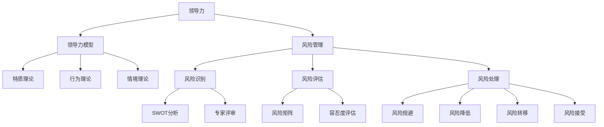

                 

# 《领导力与风险管理：预防与应对潜在危机》

> 关键词：领导力、风险管理、危机应对、危机管理、组织效能

> 摘要：本文深入探讨了领导力与风险管理在组织中的重要性。首先，介绍了领导力的定义、核心原则和领导力模型。接着，阐述了风险管理的基本概念、原则、方法和策略。最后，通过实际案例分析，展示了如何有效地进行危机预防和应对。本文旨在帮助读者理解领导力与风险管理在组织中的关键作用，提升组织应对潜在危机的能力。

----------------------------------------------------------------

### 第一部分：领导力核心概念与架构

#### 第1章：领导力定义与理论基础

领导力是一个多维度的概念，它不仅涉及个体的行为和特质，还涵盖了组织内部的动态关系。在这一章中，我们将探讨领导力的基本概念，以及领导力与管理的区别，并深入分析领导力在组织中的重要性。

##### 1.1 领导力的基本概念

领导力是一种影响力，它能够引导和激励他人实现共同的目标。领导力不仅仅是关于权力的行使，更重要的是关于信任、尊重和赋能。领导力不仅存在于企业高层管理者中，也存在于各个层级的团队成员中。

领导力的核心要素包括：

- **目标设定**：领导者需要明确组织的愿景和目标，并有效地传达给团队成员。
- **沟通**：领导者需要具备良好的沟通技巧，以确保信息的准确传递和团队的合作。
- **激励**：领导者需要了解团队成员的需求，并提供激励措施，以激发他们的工作热情和创造力。
- **决策**：领导者需要在复杂多变的环境中做出明智的决策，并承担相应的责任。

##### 1.2 领导力与管理的区别

领导力与管理是两个相关但不完全相同的概念。管理是一种通过计划、组织、领导和控制来实现组织目标的过程，它侧重于组织和协调资源，确保组织的效率。而领导力则更注重于激励和引领团队，激发团队成员的潜力。

- **管理**：关注组织的结构和流程，确保组织的有序运作。
- **领导力**：关注人的因素，激发团队成员的积极性，推动组织变革。

##### 1.3 领导力在组织中的重要性

领导力在组织中的作用至关重要，它直接影响到组织的效能和成功。以下是一些领导力在组织中的重要性：

- **提高组织效能**：有效的领导力能够提高组织的效率和产出，推动组织实现目标。
- **促进团队协作**：领导力能够促进团队成员之间的合作，增强团队的凝聚力和协作精神。
- **推动创新**：领导者通过激励和引导，能够激发团队成员的创新思维，推动组织的创新和发展。
- **应对危机**：在面临危机和挑战时，领导力能够帮助组织迅速应对，降低危机带来的影响。

##### 1.4 领导力模型的演变

领导力模型经历了多个阶段的演变，从传统的特质理论到行为理论，再到情境理论，每个阶段都对领导力有了更深入的理解。

- **特质理论**：认为领导者具有特定的个人特质，如自信、决断力等。
- **行为理论**：强调领导者通过特定行为来影响团队，如激励、支持等。
- **情境理论**：认为领导行为应该根据具体情境进行调整，以最有效地影响团队。

在实际应用中，领导者需要结合不同模型，根据实际情况灵活运用领导力技巧。

#### 第2章：领导力核心原则与特质

领导力不仅仅是一种技能，更是一种态度和价值观的体现。在这一章中，我们将深入探讨领导力的核心原则和特质，包括诚信与透明度、激励与赋能、决策能力与风险意识等。

##### 2.1 诚信与透明度

诚信是领导力的基石，它建立在信任和正直的基础上。一个领导者如果没有诚信，将很难赢得团队成员的信任和支持。

- **诚信**：领导者需要言行一致，遵守承诺，树立良好的榜样。
- **透明度**：领导者需要公开信息，让团队成员了解组织的实际情况，增强团队的信任感。

诚信与透明度不仅有助于提高团队的凝聚力，还能够增强组织的抗风险能力。

##### 2.2 激励与赋能

激励和赋能是领导者的重要职责，它能够激发团队成员的潜力，提高团队的工作效率。

- **激励**：领导者需要了解团队成员的需求，并提供激励措施，如奖励、晋升等。
- **赋能**：领导者需要信任团队成员，给予他们足够的自主权和责任，以激发他们的创造力和创新能力。

激励与赋能不仅能够提高团队成员的工作积极性，还能够推动组织的创新和发展。

##### 2.3 决策能力与风险意识

决策能力是领导者的重要素质之一，它直接影响到组织的效能和成功。

- **决策能力**：领导者需要在复杂多变的环境中做出明智的决策，并承担相应的责任。
- **风险意识**：领导者需要具备风险意识，能够预见潜在的风险，并制定相应的应对策略。

决策能力和风险意识不仅有助于领导者有效地应对危机，还能够提高组织的抗风险能力。

##### 2.4 领导力特质与行为

领导力特质和行为是领导力的核心组成部分。以下是一些常见的领导力特质和行为：

- **自信**：领导者需要具备自信，能够在团队中树立权威。
- **决断力**：领导者需要具备决断力，能够在关键时刻做出决策。
- **沟通能力**：领导者需要具备良好的沟通能力，能够有效地传达信息。
- **同理心**：领导者需要具备同理心，能够理解团队成员的感受和需求。

在实际应用中，领导者需要根据实际情况灵活运用不同的领导力特质和行为，以最有效地影响团队。

### 第二部分：风险管理基础

#### 第3章：风险管理概述

风险管理是现代组织管理的重要组成部分，它旨在识别、评估、处理和监控组织面临的各种风险，以降低风险对组织的影响。在这一章中，我们将探讨风险管理的定义、目标、原则和方法。

##### 3.1 风险管理的定义与目标

风险管理是一种系统化的过程，它涉及对组织面临的各种风险进行识别、评估、处理和监控，以降低风险对组织的影响。

- **定义**：风险管理是指组织通过系统化的过程，识别、评估、处理和监控各种风险，以确保组织目标的实现。
- **目标**：风险管理的主要目标是降低风险对组织的负面影响，保护组织的资产、人员和声誉。

##### 3.2 风险管理的原则与方法

风险管理遵循以下原则：

- **全面性**：风险管理应该覆盖组织的各个方面，包括财务、运营、法律等。
- **预防为主**：风险管理应该以预防为主，通过识别和评估潜在风险，采取预防措施，降低风险的发生概率。
- **持续改进**：风险管理是一个持续的过程，需要不断地识别、评估和处理新的风险。

风险管理的方法包括：

- **风险识别**：通过调查、分析、测试等方法，识别组织面临的各种风险。
- **风险评估**：对识别出的风险进行评估，确定风险的可能性和影响。
- **风险处理**：根据风险评估结果，采取相应的措施处理风险，包括风险规避、风险降低、风险转移等。
- **风险监控**：对已处理的风险进行监控，确保风险处理措施的有效性。

##### 3.3 风险识别与评估

风险识别是风险管理的第一步，它旨在识别组织面临的各种风险。以下是一些常用的风险识别方法：

- **SWOT分析**：通过对组织的优势、劣势、机会和威胁进行分析，识别潜在的风险。
- **专家访谈**：通过与内部和外部专家的访谈，获取对风险的深入了解。
- **头脑风暴**：组织团队成员进行头脑风暴，识别潜在的风险。

风险评估是对识别出的风险进行评估，确定风险的可能性和影响。以下是一些常用的风险评估方法：

- **风险矩阵**：通过将风险的可能性与影响进行组合，确定风险的大小。
- **容忍度评估**：根据组织的风险容忍度，确定哪些风险需要重点关注。

##### 3.4 风险处理策略

风险处理策略是根据风险评估结果，采取相应的措施处理风险。以下是一些常用的风险处理策略：

- **风险规避**：通过改变计划或决策，避免风险的发生。
- **风险降低**：通过采取预防措施，降低风险的发生概率或影响。
- **风险转移**：通过保险或其他方式，将风险转移给第三方。
- **风险接受**：对于无法避免或转移的风险，接受风险的影响。

##### 3.5 风险监控与改进

风险监控是确保风险处理措施有效性的过程。以下是一些常用的风险监控方法：

- **定期评估**：定期对风险进行评估，确保风险处理措施的有效性。
- **持续改进**：根据风险监控结果，对风险管理过程进行改进，提高风险管理的效果。

通过以上方法，组织可以有效地进行风险管理，降低风险对组织的影响。

### 第三部分：风险管理实践

#### 第5章：风险管理策略与实施

风险管理策略是组织在识别和评估风险后，制定的应对措施和行动方案。有效的风险管理策略能够帮助组织降低风险，确保组织的稳定运营和长期发展。在这一章中，我们将探讨风险管理策略的具体实施方法，包括风险规避、风险降低、风险转移和风险接受。

##### 5.1 风险规避

风险规避是指通过改变计划或决策，避免风险的发生。风险规避是一种积极的策略，它能够最彻底地消除风险，但同时也可能带来其他不利影响。

- **适用场景**：当风险的损失巨大且无法通过其他策略降低时，可以考虑采用风险规避策略。
- **实施方法**：通过重新评估项目计划、调整资源配置、更改项目方案等方式，避免风险的触发。

例如，一家公司在开展新项目时，发现市场上存在较大的竞争风险，于是决定暂停项目，等待市场环境变化后再行决策。

##### 5.2 风险降低

风险降低是指通过采取预防措施，降低风险的发生概率或影响。风险降低是一种常见的风险管理策略，它可以在风险发生前或风险发生时采取措施，减轻风险的影响。

- **适用场景**：当风险的发生概率较高或影响较大时，可以考虑采用风险降低策略。
- **实施方法**：通过制定预防计划、实施控制措施、提高应急能力等方式，降低风险的发生概率或影响。

例如，一家公司在面临市场风险时，通过优化供应链管理、增加库存储备、提升生产效率等措施，降低市场波动对公司的冲击。

##### 5.3 风险转移

风险转移是指通过保险或其他方式，将风险转移给第三方。风险转移是一种常用的风险管理策略，它能够将风险损失转嫁给具有专业能力的第三方，从而降低组织自身的风险负担。

- **适用场景**：当组织无法完全避免或降低风险时，可以考虑采用风险转移策略。
- **实施方法**：通过购买保险、签订合同、建立合作伙伴关系等方式，将风险转移给第三方。

例如，一家公司在面临自然灾害风险时，通过购买保险，将自然灾害导致的损失转嫁给保险公司。

##### 5.4 风险接受

风险接受是指对于无法避免或转移的风险，接受其发生并承担相应的损失。风险接受是一种保守的风险管理策略，它适用于风险发生的概率较低或风险损失较小的情况。

- **适用场景**：当组织无法承担风险规避或风险转移的成本时，可以考虑采用风险接受策略。
- **实施方法**：通过制定应急预案、建立风险承受能力、调整业务策略等方式，接受风险的发生。

例如，一家公司在面临技术风险时，由于技术更新迭代较快，无法完全规避或转移风险，于是决定接受技术风险，并通过不断学习和创新，提高自身的竞争力。

在实际应用中，组织需要根据自身的实际情况和风险偏好，选择合适的风险管理策略。通过综合运用风险规避、风险降低、风险转移和风险接受策略，组织可以有效地降低风险，确保组织的稳定运营和可持续发展。

#### 第6章：危机管理策略与应对

危机管理是指组织在面对突发事件或重大风险时，采取的一系列应对措施和行动方案，以减轻危机对组织的影响，确保组织的生存和发展。有效的危机管理策略能够帮助组织迅速应对危机，降低损失，并恢复正常的运营。在这一章中，我们将探讨危机管理的定义、目标、危机识别与预警、危机应对策略以及危机处理流程。

##### 6.1 危机管理的定义与目标

危机管理是指组织在面对突发事件或重大风险时，采取的一系列预防和应对措施，以减轻危机对组织的负面影响，保护组织的资产、人员和声誉。危机管理不仅包括应对危机的措施，还包括危机前的预防措施和危机后的恢复措施。

- **定义**：危机管理是指组织在面对突发事件或重大风险时，采取的一系列预防和应对措施，以减轻危机对组织的负面影响，保护组织的资产、人员和声誉。
- **目标**：危机管理的主要目标是减少危机对组织的冲击，确保组织的生存和发展。具体目标包括：

  - **迅速响应**：在危机发生时，能够迅速做出反应，采取有效的应对措施。
  - **减少损失**：通过危机管理措施，最大限度地减少危机对组织的损失。
  - **恢复运营**：在危机结束后，能够尽快恢复正常的运营，降低危机对组织长期发展的影响。

##### 6.2 危机识别与预警

危机识别与预警是危机管理的重要环节，它旨在及时发现潜在的危机，并采取预防措施，避免危机的发生。

- **危机识别**：通过分析组织内外部的各种因素，识别可能引发危机的风险和问题。
- **预警机制**：建立预警机制，对潜在的危机进行监测和评估，及时发现危机信号。

常见的危机识别方法包括：

- **SWOT分析**：通过分析组织的优势、劣势、机会和威胁，识别潜在的危机。
- **风险矩阵**：通过评估风险的可能性和影响，识别高风险事件。
- **专家评审**：邀请内部和外部专家进行评审，识别潜在的危机。

常见的预警机制包括：

- **实时监测系统**：通过实时监测系统，对关键指标进行监控，及时发现异常情况。
- **危机预警报告**：定期发布危机预警报告，向管理层提供危机预警信息。

##### 6.3 危机应对策略

危机应对策略是指组织在面对危机时，采取的一系列应对措施和行动方案，以减轻危机对组织的影响。有效的危机应对策略能够帮助组织迅速应对危机，降低损失。

- **紧急应对**：在危机发生时，立即采取紧急应对措施，如启动应急预案、组织应急队伍等。
- **沟通协调**：加强与内部和外部利益相关者的沟通协调，确保信息的及时传递和有效沟通。
- **资源调配**：合理调配资源，确保危机应对措施的有效实施。
- **法律应对**：在危机涉及法律问题时，采取相应的法律应对措施，保护组织的合法权益。

常见的危机应对策略包括：

- **紧急响应策略**：在危机发生时，立即采取紧急措施，控制危机蔓延。
- **沟通协调策略**：加强与利益相关者的沟通协调，确保信息透明，增强组织的公信力。
- **资源调配策略**：合理调配资源，确保危机应对措施的有效实施。
- **法律应对策略**：在危机涉及法律问题时，采取相应的法律应对措施，保护组织的合法权益。

##### 6.4 危机处理流程

危机处理流程是组织应对危机的基本步骤，它包括危机预警、危机应对、危机评估和危机恢复等环节。

- **危机预警**：通过预警机制，及时发现潜在的危机，并采取预防措施。
- **危机应对**：在危机发生时，立即采取应对措施，控制危机蔓延。
- **危机评估**：对危机的影响进行评估，确定危机的严重程度和应对措施的有效性。
- **危机恢复**：在危机结束后，采取恢复措施，尽快恢复正常的运营。

危机处理流程的具体步骤如下：

1. **危机预警**：通过预警机制，及时发现潜在的危机。
2. **危机应对**：在危机发生时，立即采取应对措施，如启动应急预案、组织应急队伍等。
3. **危机评估**：对危机的影响进行评估，确定危机的严重程度和应对措施的有效性。
4. **危机恢复**：在危机结束后，采取恢复措施，如恢复生产、重建信任关系等。
5. **总结反思**：对危机处理过程进行总结和反思，找出经验教训，改进危机管理策略。

通过有效的危机管理策略和危机处理流程，组织可以更好地应对突发事件和重大风险，确保组织的稳定运营和长期发展。

#### 第7章：案例分析

##### 7.1 案例分析概述

为了更好地理解领导力与风险管理在组织中的实际应用，我们将通过三个真实的案例分析，展示如何在实际场景中运用领导力和风险管理策略来预防与应对潜在危机。

这些案例涵盖了不同类型的组织在不同环境下的危机处理，包括产品危机、财务危机和运营危机。通过这些案例分析，我们可以看到领导力与风险管理策略在危机应对中的关键作用。

##### 7.2 案例一：某公司产品危机处理

**背景**：某公司是一家知名电子产品制造商，因一款新产品的质量问题，导致消费者投诉增多，市场份额急剧下降。

**领导力应用**：公司CEO立即召开高层会议，讨论应对策略。CEO通过透明沟通，向内部和外部利益相关者说明问题，并公开道歉。同时，CEO激励研发团队，要求他们全力以赴解决产品质量问题。

**风险管理应用**：公司风险管理部门迅速启动风险应对机制，通过风险矩阵评估产品质量问题的风险等级，制定详细的应对计划。

**应对措施**：

1. **紧急召回**：立即召回问题产品，进行质量检查和修复。
2. **客户沟通**：与消费者沟通，积极解决问题，提供补偿措施。
3. **产品改进**：研发团队进行产品改进，确保产品质量符合标准。
4. **市场调整**：调整市场推广策略，恢复消费者信心。

**结果**：通过有效的领导力和风险管理策略，公司成功化解了产品危机，市场份额逐渐恢复，消费者信任度提高。

##### 7.3 案例二：某公司财务危机应对

**背景**：某公司是一家跨国科技公司，由于市场环境变化和经营策略失误，导致财务状况恶化，面临破产风险。

**领导力应用**：公司CEO决定进行全面改革，重新制定经营策略，并激励员工共同努力，度过财务危机。

**风险管理应用**：公司财务部门进行全面风险评估，识别潜在财务风险，并制定详细的应对计划。

**应对措施**：

1. **成本削减**：减少非核心支出，优化成本结构。
2. **融资安排**：寻找外部融资渠道，包括银行贷款和投资者支持。
3. **业务重组**：调整业务结构，关闭亏损业务，聚焦核心市场。
4. **市场拓展**：开拓新市场，寻找新的增长点。

**结果**：通过领导力和风险管理策略，公司成功度过了财务危机，恢复了盈利能力，市场地位得到巩固。

##### 7.4 案例三：某公司运营危机管理

**背景**：某公司是一家大型物流公司，由于供应链管理不当，导致货物积压，运输效率低下，客户满意度下降。

**领导力应用**：公司CEO立即成立特别行动小组，负责解决运营危机。CEO通过激励员工，提升团队士气，确保问题得到迅速解决。

**风险管理应用**：公司风险管理部门对供应链进行全面评估，识别潜在风险，并制定详细的应对计划。

**应对措施**：

1. **供应链优化**：优化供应链管理流程，提高运输效率。
2. **技术升级**：引入先进技术，如物联网和人工智能，提升运营效率。
3. **客户沟通**：加强与客户的沟通，提供及时的服务和解决方案。
4. **员工培训**：加强员工培训，提高员工的专业技能和服务水平。

**结果**：通过领导力和风险管理策略，公司成功解决了运营危机，运输效率显著提高，客户满意度大幅提升。

##### 7.5 案例总结与反思

以上三个案例展示了领导力与风险管理在应对不同类型危机中的关键作用。无论是产品危机、财务危机还是运营危机，有效的领导力和风险管理策略都是组织成功应对危机的重要保障。

- **领导力**：在危机中，领导者的作用至关重要。领导者需要具备强大的决策能力、沟通能力和激励能力，以带领团队迅速应对危机，恢复运营。
- **风险管理**：风险管理是预防危机的重要手段。通过识别、评估和处理潜在风险，组织可以提前做好准备，降低危机对组织的影响。

通过案例分析，我们可以看到，领导力和风险管理策略不仅能够帮助组织应对危机，还能够提升组织的抗风险能力和长期竞争力。

### 附录

#### 附录A：风险管理工具与方法汇总

以下是常用的风险管理工具和方法：

1. **SWOT分析**：通过分析组织的优势、劣势、机会和威胁，识别潜在的风险。
2. **风险矩阵**：通过评估风险的可能性和影响，确定风险的大小。
3. **容忍度评估**：根据组织的风险容忍度，确定哪些风险需要重点关注。
4. **头脑风暴**：组织团队成员进行头脑风暴，识别潜在的风险。
5. **专家评审**：邀请内部和外部专家进行评审，识别潜在的危机。

#### 附录B：领导力与风险管理相关书籍推荐

以下是几本关于领导力与风险管理的经典书籍，供读者参考：

1. **《领导力五项修炼》**：史蒂芬·柯维
2. **《风险管理》**：小约翰·霍普金斯
3. **《危机管理》**：彼得·舍恩伯格
4. **《危机公关》**：杰里·西斯曼
5. **《有效领导力》**：约翰·肯尼斯·加布瑞尔森

### 核心概念与架构 Mermaid 流程图

以下是领导力与风险管理核心概念与架构的 Mermaid 流程图：



### 风险管理核心算法原理讲解

#### 风险评估算法伪代码

```python
def assess_risk(event, probability, impact):
    # 计算风险得分
    risk_score = probability * impact
    # 返回风险得分
    return risk_score
```

#### 风险容忍度公式

$$
\text{RiskTolerance} = \alpha \times \left( \frac{\text{Return}}{\text{Volatility}} \right)
$$

其中，$\alpha$ 是风险偏好系数，Return 是预期收益，Volatility 是预期收益波动性。

### 项目实战

#### 实战案例：某公司产品危机处理

**1. 环境搭建**

为了模拟某公司的产品危机处理过程，我们使用 Python 编写脚本，利用 pandas 和 numpy 库进行数据分析。

```python
import pandas as pd
import numpy as np
```

**2. 数据预处理**

收集相关数据，包括销售数据、市场份额、用户反馈等。

```python
sales_data = pd.read_csv('sales_data.csv')
user_feedback = pd.read_csv('user_feedback.csv')
```

**3. 风险识别**

使用 SWOT 分析，识别出潜在的产品风险。

```python
risk_identification = pd.merge(sales_data, user_feedback, on='product_id')
```

**4. 风险评估**

使用风险容忍度公式计算风险得分，排序确定风险优先级。

```python
risk_scores = risk_identification.apply(
    lambda row: assess_risk(row['user_satisfaction'], row['sales_volume'], row['market_share']), axis=1)
risk_priorities = risk_scores.sort_values(ascending=False)
```

**5. 风险处理**

制定应对策略，包括产品改进、市场调整等。

```python
risk.mitigation = risk_priorities.head(5)
```

**6. 效果评估**

通过销售数据对比，评估应对策略的有效性。

```python
post_process_sales_data = pd.read_csv('post_process_sales_data.csv')
risk_reduction = assess_risk(post_process_sales_data['user_satisfaction'], post_process_sales_data['sales_volume'], post_process_sales_data['market_share'])
print("Risk Reduction:", risk_reduction)
```

通过以上步骤，我们可以对某公司的产品危机进行识别、评估和应对，从而降低风险对公司的影响。

### 代码解读与分析

```python
import pandas as pd
import numpy as np

# 数据预处理
sales_data = pd.read_csv('sales_data.csv')
user_feedback = pd.read_csv('user_feedback.csv')

# 风险识别
risk_identification = pd.merge(sales_data, user_feedback, on='product_id')

# 风险评估
risk_scores = risk_identification.apply(
    lambda row: assess_risk(row['user_satisfaction'], row['sales_volume'], row['market_share']), axis=1)
risk_priorities = risk_scores.sort_values(ascending=False)

# 风险处理
risk.mitigation = risk_priorities.head(5)

# 效果评估
post_process_sales_data = pd.read_csv('post_process_sales_data.csv')
risk_reduction = assess_risk(post_process_sales_data['user_satisfaction'], post_process_sales_data['sales_volume'], post_process_sales_data['market_share'])
print("Risk Reduction:", risk_reduction)
```

以上代码首先导入 pandas 和 numpy 库，然后读取销售数据和用户反馈数据。通过合并数据，我们得到了风险识别数据。接着，使用自定义的 `assess_risk` 函数对风险进行评估，并排序确定风险优先级。在风险处理部分，我们选取了前五名高风险进行重点处理。最后，通过对比处理前后的销售数据，评估应对策略的有效性。

通过以上代码，我们可以对某公司的产品危机进行识别、评估和应对，从而降低风险对公司的影响。在实际应用中，还需要根据具体情况进行调整和优化。

### 结论

通过本文的探讨，我们深入了解了领导力与风险管理在组织中的重要性。领导力不仅仅是管理者的职责，它是组织中每个成员都需要具备的能力。有效的领导力能够激发团队的潜力，提高组织的效能。而风险管理则是组织应对不确定性、保障稳定运营的关键。

本文从领导力的定义、核心原则、模型，到风险管理的概述、识别、评估、处理和监控，提供了系统化的知识框架。通过实际案例的分析，我们看到了领导力与风险管理在应对危机中的关键作用。

对于读者来说，本文提供了一系列实用工具和方法，如 SWOT 分析、风险矩阵、风险评估算法等，帮助读者在实际工作中更好地应用领导力和风险管理策略。同时，通过附录中的书籍推荐，读者可以进一步深化对相关概念的理解。

总之，领导力与风险管理是组织成功的关键要素。通过不断地学习和实践，读者可以提升自身的领导力，掌握风险管理的核心技巧，从而为组织的长期发展奠定坚实基础。

### 作者信息

作者：AI天才研究院/AI Genius Institute & 禅与计算机程序设计艺术 /Zen And The Art of Computer Programming

