                 

# 领导力修炼日记：一个财务经理的华丽蜕变

> **关键词：**领导力、财务管理、职业发展、个人成长、数字化转型

> **摘要：**本文通过深入探讨领导力在财务管理中的应用，以及财务经理如何通过领导力修炼实现职业华丽蜕变，为读者提供实用的策略和案例。文章从领导力的基础、财务管理的实践、个人成长与职业发展等多个角度出发，结合实际案例，详细阐述了领导力与财务管理相结合的深远意义和具体方法。

---

### 第一部分：引言与背景知识

#### 1.1 《领导力修炼日记：一个财务经理的华丽蜕变》概述

**核心概念与联系**：

- **领导力**：领导力是指一个人影响和激励他人共同实现目标的能力。
- **财务管理**：财务管理是指企业对资金进行规划、管理和控制的过程。
- **个人成长与职业发展**：个人成长是指通过不断学习、自我提升来实现职业目标的过程。

**架构图**：

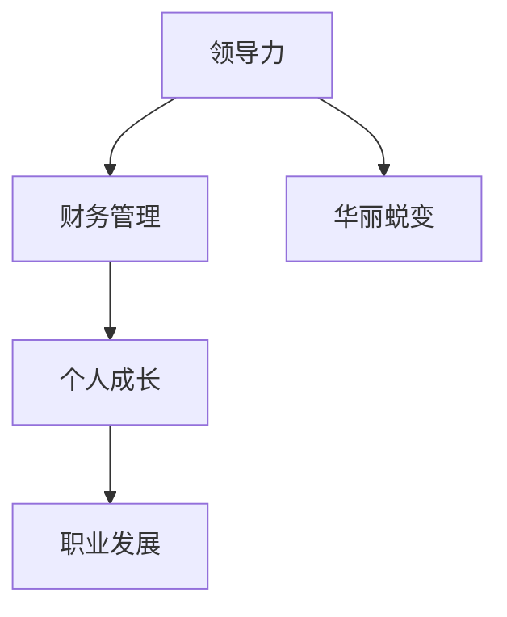

**目的**：

- 探讨财务经理如何通过领导力修炼实现职业上的华丽蜕变。
- 分析领导力在不同阶段的财务管理工作中的具体应用。

---

#### 1.2 书的写作目的与读者对象

**核心概念与联系**：

- **书写目的**：促进财务经理的自我提升，提供实际案例与策略。
- **读者对象**：财务经理、管理层人员以及对领导力与财务管理感兴趣的读者。

**架构图**：

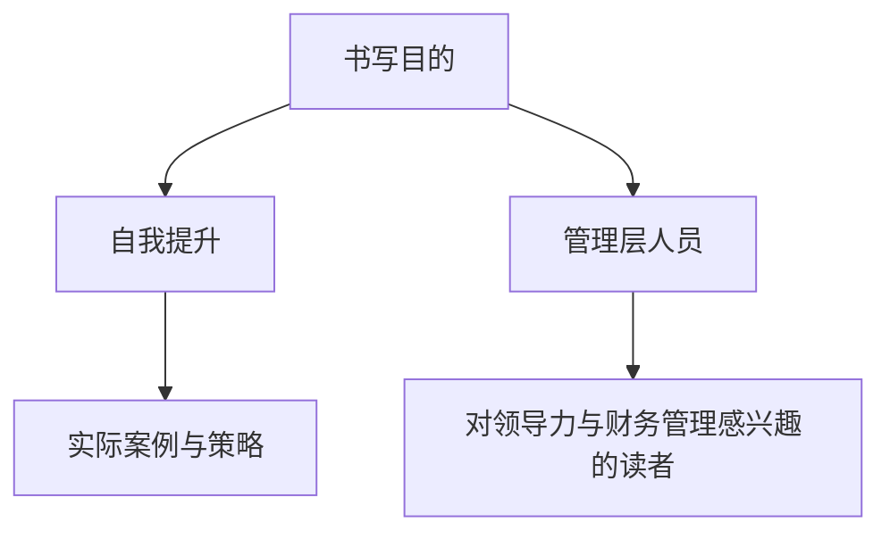

**目的**：

- 帮助读者了解领导力在财务管理中的关键作用。
- 提供实用的策略，帮助财务经理在实际工作中提升领导力和管理能力。

---

#### 1.3 财务经理的日常工作内容

**核心概念与联系**：

- **财务规划**：企业对未来财务活动的预测和规划。
- **报告分析**：对企业财务报告的解读和分析。
- **内部控制**：企业内部为防范风险而建立的制度和流程。
- **预算管理**：企业对预算的编制、执行和监控。
- **风险管理**：企业对潜在风险的识别、评估和应对。

**架构图**：

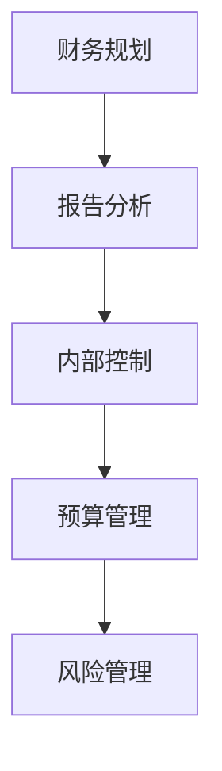

**目的**：

- 阐述财务经理的日常工作内容，为后续章节中的领导力修炼提供实际背景。

---

#### 1.4 领导力的重要性

**核心概念与联系**：

- **领导力**：领导力是一个人在团队中通过影响力、决策能力和沟通能力来引导和激励团队成员实现共同目标的能力。
- **团队协作**：团队协作是团队成员共同完成工作任务的过程。
- **决策能力**：决策能力是指一个人在面对问题时，能够迅速做出明智决策的能力。
- **激励与沟通**：激励是指通过鼓励和奖励来激发团队成员的工作动力，沟通是指通过有效的信息交流来促进团队协作。

**架构图**：

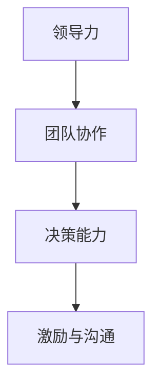

**目的**：

- 强调领导力在职业发展和团队管理中的重要性。

---

#### 1.5 总结

**核心概念与联系**：

- **领导力与财务管理的结合**：领导力在财务管理中的应用和作用。
- **个人成长与职业发展的关系**：个人成长对职业发展的影响。

**目的**：

- 对全书的核心内容进行概括，为读者阅读后续章节提供引导。

---

### 第二部分：领导力的基础

#### 2.1 领导力的定义与类型

##### 2.1.1 领导力的定义

**核心概念与联系**：

- **领导力的基本含义**：领导力是指一个人在团队中通过影响力、决策能力和沟通能力来引导和激励团队成员实现共同目标的能力。
- **领导力与管理的区别**：领导力强调的是影响和激励，而管理则侧重于组织和协调。

**架构图**：

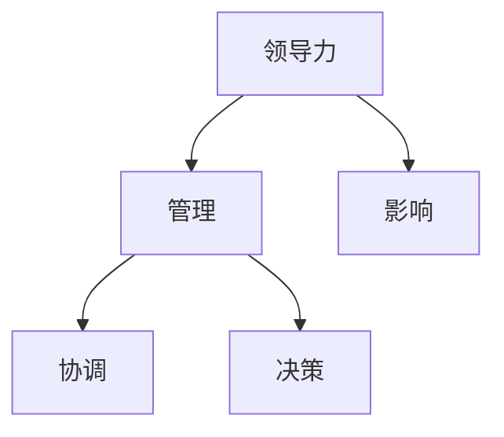

**目的**：

- 解释领导力的本质，并阐述其与管理的不同之处。

---

##### 2.1.2 领导力的类型

**核心概念与联系**：

- **权力型领导**：通过权威和命令来影响团队成员。
- **情境型领导**：根据不同情境和团队成员的特点来调整领导风格。
- **参与型领导**：鼓励团队成员参与决策，共同实现目标。
- **情感型领导**：注重与团队成员的情感联系，通过情感激励来提升团队绩效。

**架构图**：

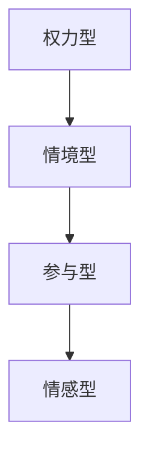

**目的**：

- 探讨不同类型的领导力及其适用场景。

---

#### 2.2 领导力的核心要素

##### 2.2.1 沟通能力

**核心概念与联系**：

- **沟通的定义与重要性**：沟通是信息传递和理解的过程，对于团队协作和决策至关重要。
- **沟通技巧**：包括有效的表达、倾听和反馈。

**架构图**：

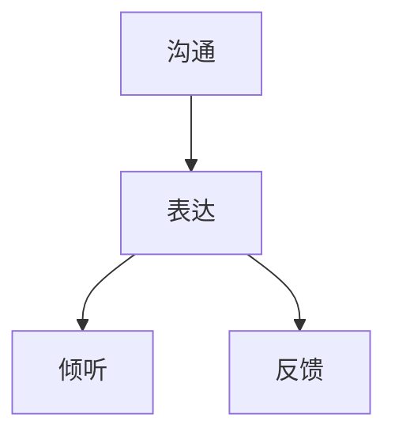

**目的**：

- 强调沟通在领导力中的关键作用。

---

##### 2.2.2 决策能力

**核心概念与联系**：

- **决策的基本过程**：信息收集、方案评估和选择。
- **决策工具与方法**：包括决策树、SWOT分析等。

**架构图**：

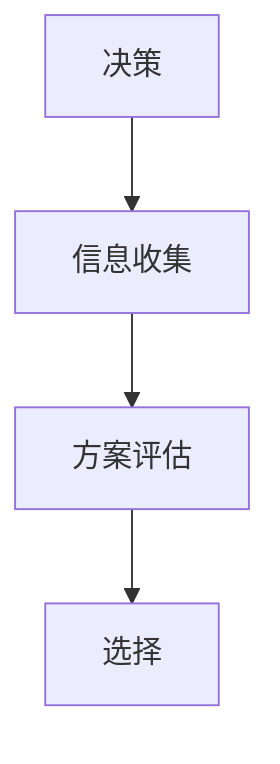

**目的**：

- 解释决策能力在领导力中的重要性。

---

##### 2.2.3 激励能力

**核心概念与联系**：

- **激励理论**：包括目标设定、认可与奖励等。
- **激励技巧**：通过激励来提升团队成员的工作动力和绩效。

**架构图**：

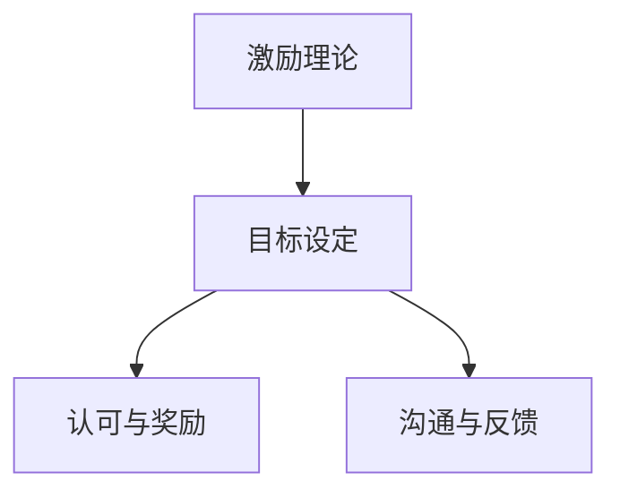

**目的**：

- 探讨如何有效激励团队成员。

---

##### 2.2.4 领导力与自我意识

**核心概念与联系**：

- **自我意识的定义与作用**：自我意识是指一个人对自己的认知和理解，对于领导力的发展至关重要。
- **自我反思与成长**：通过自我反思来实现个人成长和领导力的提升。

**架构图**：

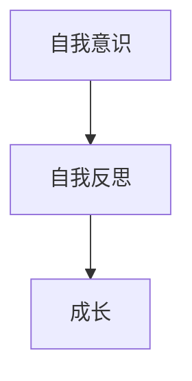

**目的**：

- 阐述领导力发展过程中的自我认知与成长的重要性。

---

#### 2.3 领导力的发展与提升

##### 2.3.1 领导力发展模型

**核心概念与联系**：

- **领导力发展理论**：包括领导者特质理论、情境领导理论等。
- **领导力发展路径**：从新手领导者到经验丰富的领导者。

**架构图**：

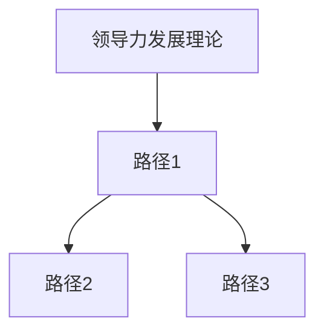

**目的**：

- 介绍领导力发展的基本模型，帮助读者理解领导力成长的过程。

---

##### 2.3.2 领导力提升策略

**核心概念与联系**：

- **培训与发展**：通过培训和持续学习来提升领导力。
- **反思与实践**：通过反思和实际应用来巩固和提升领导力。
- **建立良好的领导力文化**：通过组织文化和团队氛围来促进领导力的发展。

**架构图**：

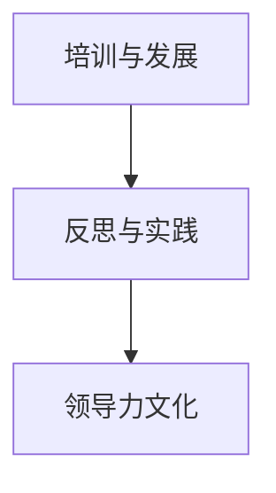

**目的**：

- 提供具体策略，帮助读者提升领导力。

---

##### 2.3.3 领导力在财务管理中的应用

**核心概念与联系**：

- **领导力在财务规划中的应用**：领导力在财务预测与规划中的关键角色。
- **领导力在预算管理中的应用**：领导力在预算分配与控制中的重要性。
- **领导力在风险管理中的应用**：领导力在识别与应对风险中的关键作用。

**架构图**：

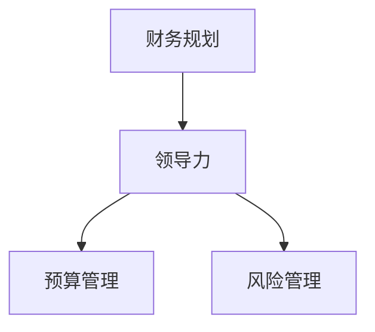

**目的**：

- 探讨领导力在财务管理中的实际应用。

---

#### 2.4 总结

**核心概念与联系**：

- **领导力在财务管理工作中的重要性**：领导力对于财务经理的工作质量和效果有重要影响。
- **领导力提升的策略与方法**：如何通过学习和实践提升领导力。

**目的**：

- 对领导力在财务管理中的应用进行总结，为读者提供实践指导。

---

### 第三部分：财务管理的实践

#### 3.1 财务规划与预算管理

##### 3.1.1 财务规划的基本步骤

**核心概念与联系**：

- **财务规划的组成部分**：包括目标设定、资源分配、风险评估和执行与监控。
- **制定财务规划的步骤**：确定目标、评估现状、制定策略、实施和监控。

**架构图**：

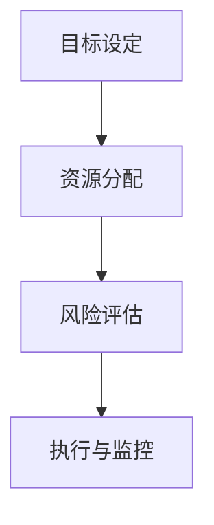

**目的**：

- 解释财务规划的基本步骤和关键环节。

---

##### 3.1.2 预算管理的方法与技巧

**核心概念与联系**：

- **预算编制的方法**：包括自上而下和自下而上的预算编制方式。
- **预算控制的技巧**：包括监控预算执行、分析偏差原因和制定调整措施。

**架构图**：

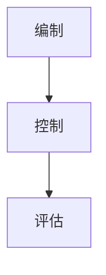

**目的**：

- 提供预算管理的方法和技巧，帮助财务经理提升预算管理的效率。

---

##### 3.1.3 财务预测与实际执行的差异分析

**核心概念与联系**：

- **财务预测的方法与工具**：包括时间序列分析、回归分析等。
- **差异分析的原因与应对策略**：分析财务预测与实际执行之间的差异，并提供解决方案。

**架构图**：

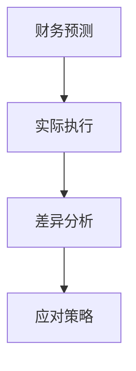

**目的**：

- 探讨财务预测与实际执行之间的差异，并提供解决方案。

---

##### 3.1.4 成本控制与效率提升

**核心概念与联系**：

- **成本控制的策略**：包括预算控制、成本分析和成本优化。
- **提升效率的方法**：包括流程优化、自动化和精益管理。

**架构图**：

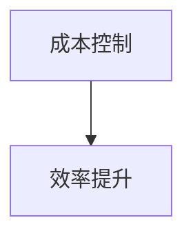

**目的**：

- 分析成本控制与效率提升的关系，提供具体的实施策略。

---

#### 3.2 财务报告与分析

##### 3.2.1 财务报告的类型与内容

**核心概念与联系**：

- **财务报告的类型**：包括资产负债表、利润表和现金流量表。
- **报告的主要内容和结构**：描述财务报告的具体内容和结构。

**架构图**：

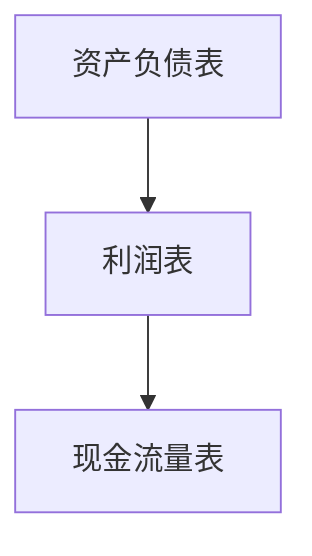

**目的**：

- 介绍财务报告的类型和内容，帮助财务经理理解和编制各类财务报告。

---

##### 3.2.2 财务分析的方法与工具

**核心概念与联系**：

- **财务分析的基本方法**：包括比率分析、趋势分析和现金流量分析。
- **财务分析工具的使用**：包括Excel、SQL和财务分析软件。

**架构图**：

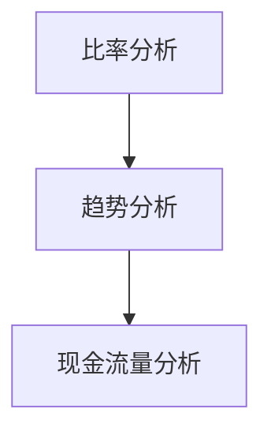

**目的**：

- 提供财务分析的方法和工具，帮助财务经理进行深入的分析。

---

##### 3.2.3 财务报告与领导力的结合

**核心概念与联系**：

- **领导力在财务报告解读中的应用**：领导力如何帮助财务经理更准确地解读财务报告。
- **如何通过财务报告提升领导力**：财务报告如何为领导力提升提供数据支持。

**架构图**：

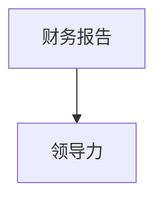

**目的**：

- 探讨财务报告与领导力的结合，提供实际应用策略。

---

#### 3.3 风险管理与内部控制

##### 3.3.1 风险识别与评估

**核心概念与联系**：

- **风险识别的方法**：包括访谈、文档审查和流程分析。
- **风险评估的工具**：包括风险矩阵、风险评分模型等。

**架构图**：

```mermaid
graph TD
    A[风险识别] --> B[风险评估]
```

**目的**：

- 介绍风险识别与评估的基本方法和工具。

---

##### 3.3.2 风险应对策略

**核心概念与联系**：

- **风险规避**：避免或减少可能发生的风险。
- **风险转移**：将风险转移给其他方，如保险公司。
- **风险接受**：承担风险，并制定相应的应对措施。

**架构图**：

```mermaid
graph TD
    A[规避] --> B[转移]
    B --> C[接受]
```

**目的**：

- 提供不同风险应对策略的优缺点和应用场景。

---

##### 3.3.3 内部控制的设计与实施

**核心概念与联系**：

- **内部控制的定义与目标**：内部控制是指企业为防范风险、提高效率和实现目标而建立的制度和流程。
- **内部控制的设计与实施步骤**：包括风险评估、控制设计、控制实施和控制评价。

**架构图**：

```mermaid
graph TD
    A[定义与目标] --> B[设计步骤]
    B --> C[实施步骤]
```

**目的**：

- 阐述内部控制的基本概念和实施方法。

---

#### 3.4 财务管理的创新与数字化转型

##### 3.4.1 数字化转型在财务管理中的应用

**核心概念与联系**：

- **数字化技术的应用场景**：包括财务数据的自动化处理、预算编制的数字化和财务报告的智能化分析。
- **财务管理的数字化转型路径**：包括数字化战略的制定、数字化工具的引入和数字化流程的优化。

**架构图**：

```mermaid
graph TD
    A[数字化技术] --> B[应用场景]
    B --> C[转型路径]
```

**目的**：

- 探讨数字化技术如何改变财务管理的实践。

---

##### 3.4.2 大数据和人工智能在财务管理中的作用

**核心概念与联系**：

- **大数据的概念与处理方法**：大数据是指海量、多样化的数据，其处理方法包括数据存储、数据分析和数据可视化。
- **人工智能在财务分析中的应用**：人工智能技术如何提升财务分析的效率和准确性。

**架构图**：

```mermaid
graph TD
    A[大数据] --> B[处理方法]
    B --> C[人工智能]
```

**目的**：

- 分析大数据和人工智能如何提升财务管理的效率和准确性。

---

##### 3.4.3 云计算与财务管理

**核心概念与联系**：

- **云计算的优势**：包括弹性扩展、成本节约和高效处理。
- **云计算在财务管理中的应用**：云计算技术如何改变财务管理的模式和流程。

**架构图**：

```mermaid
graph TD
    A[云计算] --> B[优势]
    B --> C[应用]
```

**目的**：

- 探讨云计算如何改变财务管理的模式。

---

#### 3.5 总结

**核心概念与联系**：

- **财务管理的实践方法与技巧**：包括财务规划、预算管理、财务报告分析等。
- **领导力在财务管理中的重要作用**：领导力如何帮助财务经理提升管理能力和决策水平。

**目的**：

- 对财务管理的实践进行总结，为读者提供全面的指导。

---

### 第四部分：个人成长与职业发展

#### 4.1 职业发展的路径与策略

##### 4.1.1 职业发展的阶段

**核心概念与联系**：

- **初级阶段**：刚入职的财务经理，需要熟悉工作内容和技能。
- **中级阶段**：有一定经验的财务经理，开始承担更多的责任和挑战。
- **高级阶段**：资深财务经理，拥有丰富的经验和领导能力。

**架构图**：

```mermaid
graph TD
    A[初级阶段] --> B[中级阶段]
    B --> C[高级阶段]
```

**目的**：

- 分析职业发展的不同阶段及其特点。

---

##### 4.1.2 职业发展的策略

**核心概念与联系**：

- **职业规划**：明确个人职业目标和发展路径。
- **个人品牌建设**：通过持续学习和实践，提升个人品牌价值。
- **网络构建**：建立广泛的社交网络，获取职业机会。

**架构图**：

```mermaid
graph TD
    A[职业规划] --> B[个人品牌建设]
    B --> C[网络构建]
```

**目的**：

- 提供职业发展的策略，帮助财务经理规划职业生涯。

---

##### 4.1.3 职业发展的挑战与应对

**核心概念与联系**：

- **职业瓶颈**：在职业发展过程中遇到的发展限制。
- **职场竞争**：面对同事和市场的竞争压力。
- **应对策略**：包括提升技能、积极沟通和寻求外部支持。

**架构图**：

```mermaid
graph TD
    A[职业瓶颈] --> B[职场竞争]
    B --> C[应对策略]
```

**目的**：

- 探讨职业发展过程中可能遇到的挑战，并提供应对方法。

---

#### 4.2 个人成长与领导力的结合

##### 4.2.1 个人成长的要素

**核心概念与联系**：

- **学习与自我提升**：通过学习和实践不断提升个人能力和素质。
- **情绪管理**：保持积极的心态，应对工作和生活中的挑战。
- **适应性**：适应变化，灵活调整自己的策略和行为。

**架构图**：

```mermaid
graph TD
    A[学习与自我提升] --> B[情绪管理]
    B --> C[适应性]
```

**目的**：

- 分析个人成长的关键要素。

---

##### 4.2.2 个人成长对领导力的影响

**核心概念与联系**：

- **个人成长对领导力提升的促进作用**：个人成长如何帮助财务经理提升领导能力。
- **成长与领导力发展的互动关系**：个人成长和领导力发展之间的相互作用。

**架构图**：

```mermaid
graph TD
    A[个人成长] --> B[领导力提升]
```

**目的**：

- 探讨个人成长如何促进领导力的发展。

---

##### 4.2.3 领导力在个人成长中的应用

**核心概念与联系**：

- **领导力在个人成长过程中的作用**：领导力如何帮助个人成长。
- **如何通过领导力实现个人成长**：领导力提升的具体方法和实践。

**架构图**：

```mermaid
graph TD
    A[领导力] --> B[个人成长]
```

**目的**：

- 分析领导力在个人成长中的应用，提供实践指导。

---

#### 4.3 总结

**核心概念与联系**：

- **职业发展的路径与策略**：职业发展的不同阶段和策略。
- **个人成长与领导力的结合**：个人成长对领导力发展的影响。

**目的**：

- 对个人成长与职业发展进行总结，为财务经理提供全面的指导。

---

### 第五部分：实际案例与策略分享

#### 5.1 案例一：财务经理的领导力提升之路

##### 5.1.1 案例背景

**核心概念与联系**：

- **企业背景**：一家大型制造企业，财务部门规模较大，员工众多。
- **财务经理的角色与挑战**：财务经理需要提升领导力，以更好地管理团队和推动财务管理工作的进步。

**架构图**：

```mermaid
graph TD
    A[企业背景] --> B[财务经理角色]
    B --> C[挑战]
```

**目的**：

- 描述案例的背景，为后续内容提供基础。

---

##### 5.1.2 领导力提升策略

**核心概念与联系**：

- **沟通技巧的运用**：财务经理通过有效沟通提升团队协作效率。
- **决策能力的提升**：通过学习和实践提升决策水平。
- **激励与团队建设**：运用激励理论，提升团队士气和绩效。

**架构图**：

```mermaid
graph TD
    A[沟通技巧] --> B[决策能力]
    B --> C[激励与团队建设]
```

**目的**：

- 分析财务经理如何通过领导力提升策略应对挑战。

---

##### 5.1.3 案例结果与启示

**核心概念与联系**：

- **领导力提升带来的成果**：团队协作效率提高，财务管理质量提升。
- **启示与建议**：为其他财务经理提供借鉴。

**架构图**：

```mermaid
graph TD
    A[成果] --> B[启示与建议]
```

**目的**：

- 总结案例结果，为其他财务经理提供借鉴。

---

#### 5.2 案例二：财务经理的数字化转型实践

##### 5.2.1 案例背景

**核心概念与联系**：

- **企业数字化转型的需求**：提高财务管理效率和准确性。
- **财务经理的职责与挑战**：推动数字化转型，实现财务管理的现代化。

**架构图**：

```mermaid
graph TD
    A[企业需求] --> B[财务经理职责]
    B --> C[挑战]
```

**目的**：

- 描述案例背景，为后续内容提供基础。

---

##### 5.2.2 数字化转型策略

**核心概念与联系**：

- **大数据在财务管理中的应用**：利用大数据分析提升决策水平。
- **人工智能技术的引入**：通过人工智能技术实现自动化和智能化。
- **云计算平台的选择**：选择适合企业需求的云计算平台。

**架构图**：

```mermaid
graph TD
    A[大数据应用] --> B[人工智能技术]
    B --> C[云计算平台]
```

**目的**：

- 分析财务经理如何制定数字化转型策略。

---

##### 5.2.3 案例结果与启示

**核心概念与联系**：

- **数字化转型的效益**：提高了财务管理的效率和准确性。
- **启示与建议**：为其他财务经理提供借鉴。

**架构图**：

```mermaid
graph TD
    A[效益] --> B[启示与建议]
```

**目的**：

- 总结案例结果，为其他财务经理提供借鉴。

---

#### 5.3 案例三：财务经理的跨部门合作

##### 5.3.1 案例背景

**核心概念与联系**：

- **企业内部跨部门合作的必要性**：提高整体运营效率。
- **财务经理在跨部门合作中的角色**：协调和推动跨部门合作。

**架构图**：

```mermaid
graph TD
    A[跨部门合作必要性] --> B[财务经理角色]
```

**目的**：

- 描述案例背景，为后续内容提供基础。

---

##### 5.3.2 跨部门合作策略

**核心概念与联系**：

- **沟通机制的建设**：建立有效的沟通渠道和机制。
- **协同工作平台的引入**：使用协同工作平台提高工作效率。
- **团队协作技巧**：通过培训提升团队协作能力。

**架构图**：

```mermaid
graph TD
    A[沟通机制建设] --> B[协同工作平台]
    B --> C[团队协作技巧]
```

**目的**：

- 分析财务经理如何推动跨部门合作。

---

##### 5.3.3 案例结果与启示

**核心概念与联系**：

- **跨部门合作带来的效果**：提高了整体运营效率，增强了团队凝聚力。
- **启示与建议**：为其他财务经理提供借鉴。

**架构图**：

```mermaid
graph TD
    A[效果] --> B[启示与建议]
```

**目的**：

- 总结案例结果，为其他财务经理提供借鉴。

---

#### 5.4 总结

**核心概念与联系**：

- **实际案例中的领导力提升策略**：如何通过领导力提升实现财务管理的进步。
- **数字化转型的实践**：如何通过数字化转型提升财务管理效率。
- **跨部门合作的技巧**：如何推动跨部门合作，提高整体运营效率。

**目的**：

- 对案例进行总结，为财务经理提供实用的策略和经验。

---

### 第六部分：领导力与财务管理的综合实践

#### 6.1 综合实践概述

**核心概念与联系**：

- **领导力在财务管理中的综合应用**：领导力在财务管理中的多维应用。
- **综合实践的框架与目标**：综合实践的框架结构和实施目标。

**架构图**：

```mermaid
graph TD
    A[领导力] --> B[财务管理]
    B --> C[综合实践]
```

**目的**：

- 提供一个综合实践的概述，为后续章节提供背景。

---

##### 6.1.1 综合实践的背景

**核心概念与联系**：

- **企业面临的挑战**：市场竞争激烈、财务管理需求不断提升。
- **领导力与财务管理的重要性**：领导力在推动企业发展和财务管理中的关键作用。

**架构图**：

```mermaid
graph TD
    A[企业挑战] --> B[领导力]
    B --> C[财务管理]
```

**目的**：

- 阐述实施综合实践的必要性。

---

##### 6.1.2 综合实践的目标

**核心概念与联系**：

- **提升领导力**：通过领导力提升，提高团队协作和决策能力。
- **改进财务管理**：通过优化财务管理流程，提高财务报表的准确性和及时性。
- **实现企业目标**：通过综合实践，推动企业实现长期战略目标。

**架构图**：

```mermaid
graph TD
    A[提升领导力] --> B[改进财务管理]
    B --> C[实现企业目标]
```

**目的**：

- 明确综合实践的目标。

---

#### 6.2 综合实践的实施步骤

**核心概念与联系**：

- **实施策略**：综合实践的具体实施策略。
- **实施流程**：综合实践的实施步骤。
- **成功的关键因素**：确保综合实践成功的关键要素。

**架构图**：

```mermaid
graph TD
    A[实施策略] --> B[实施流程]
    B --> C[成功的关键因素]
```

**目的**：

- 提供综合实践的实施步骤。

---

##### 6.2.1 制定战略计划

**核心概念与联系**：

- **战略目标的设定**：明确企业财务管理的长期和短期目标。
- **资源配置**：根据战略目标，合理配置人力资源和财务资源。
- **风险评估**：评估实施过程中可能面临的风险，并制定应对措施。

**架构图**：

```mermaid
graph TD
    A[战略目标] --> B[资源配置]
    B --> C[风险评估]
```

**目的**：

- 描述制定战略计划的步骤。

---

##### 6.2.2 建立领导力模型

**核心概念与联系**：

- **领导力模型的设计**：根据企业特点和需求，设计适合的领导力模型。
- **领导力培养策略**：制定具体的领导力培养计划，包括培训、实践和评估。

**架构图**：

```mermaid
graph TD
    A[领导力模型设计] --> B[领导力培养策略]
```

**目的**：

- 阐述如何建立领导力模型。

---

##### 6.2.3 财务管理优化

**核心概念与联系**：

- **财务管理流程的优化**：通过流程优化，提高财务报表的准确性和及时性。
- **财务指标的设定与监控**：设定关键财务指标，并进行实时监控和评估。

**架构图**：

```mermaid
graph TD
    A[财务管理流程优化] --> B[财务指标设定与监控]
```

**目的**：

- 描述如何优化财务管理流程。

---

##### 6.2.4 实施与监控

**核心概念与联系**：

- **实施计划的执行**：按照既定计划，逐步实施综合实践措施。
- **进度监控**：对实施进度进行实时监控，确保项目按计划进行。
- **成果评估**：对实施成果进行评估，总结经验教训。

**架构图**：

```mermaid
graph TD
    A[实施计划执行] --> B[进度监控]
    B --> C[成果评估]
```

**目的**：

- 提供实施与监控的步骤。

---

#### 6.3 综合实践中的挑战与解决方案

**核心概念与联系**：

- **实施中的主要挑战**：在实施综合实践过程中可能遇到的问题。
- **解决方案与策略**：针对挑战，提供的解决方案和策略。

**架构图**：

```mermaid
graph TD
    A[挑战] --> B[解决方案]
```

**目的**：

- 分析实施综合实践过程中可能遇到的挑战，并提供解决方案。

---

##### 6.3.1 领导力发展的挑战

**核心概念与联系**：

- **团队领导力的不足**：团队领导力水平不高，影响团队绩效。
- **领导力培养的阻力**：员工对领导力培养的抵触情绪，缺乏培养机制。

**架构图**：

```mermaid
graph TD
    A[团队领导力不足] --> B[领导力培养阻力]
```

**目的**：

- 探讨领导力发展过程中可能遇到的挑战。

---

##### 6.3.2 财务管理的挑战

**核心概念与联系**：

- **数据准确性的问题**：财务数据不准确，影响决策和报表质量。
- **财务流程的复杂性**：财务流程复杂，难以优化和管理。

**架构图**：

```mermaid
graph TD
    A[数据准确性问题] --> B[财务流程复杂性]
```

**目的**：

- 分析财务管理过程中可能遇到的挑战。

---

##### 6.3.3 解决方案与策略

**核心概念与联系**：

- **培训与发展的策略**：通过培训提高团队领导力水平。
- **系统整合与优化的方法**：通过系统整合和流程优化，提高财务管理的效率。

**架构图**：

```mermaid
graph TD
    A[培训与发展策略] --> B[系统整合与优化方法]
```

**目的**：

- 提供具体的解决方案与策略。

---

#### 6.4 成功的领导力与财务管理实践案例

**核心概念与联系**：

- **案例背景**：企业实施领导力与财务管理综合实践的具体背景。
- **实施过程与结果**：实施过程中的具体操作和实施结果。

**架构图**：

```mermaid
graph TD
    A[案例背景] --> B[实施过程]
    B --> C[实施结果]
```

**目的**：

- 通过成功案例展示领导力与财务管理实践的具体应用。

---

##### 6.4.1 案例一：某大型企业的领导力与财务管理实践

**核心概念与联系**：

- **企业背景**：一家全球知名的大型制造企业。
- **实施过程**：领导力模型设计、领导力培训、财务管理流程优化等。
- **实施结果**：财务报表准确性提高，团队协作效率提升。

**架构图**：

```mermaid
graph TD
    A[企业背景] --> B[实施过程]
    B --> C[实施结果]
```

**目的**：

- 描述一个成功的领导力与财务管理实践案例。

---

##### 6.4.2 案例二：某中小型企业的领导力与财务管理实践

**核心概念与联系**：

- **企业背景**：一家中小型服务企业。
- **实施过程**：领导力提升策略、财务管理数字化转型、跨部门合作等。
- **实施结果**：运营效率提高，市场份额增加。

**架构图**：

```mermaid
graph TD
    A[企业背景] --> B[实施过程]
    B --> C[实施结果]
```

**目的**：

- 描述一个中小型企业的成功实践案例。

---

#### 6.5 总结

**核心概念与联系**：

- **综合实践的理论框架**：领导力与财务管理综合实践的理论基础。
- **实施步骤**：综合实践的具体实施步骤。
- **成功案例**：成功的领导力与财务管理实践案例。

**目的**：

- 对领导力与财务管理的综合实践进行总结，为财务经理提供实践指导。

---

### 第七部分：未来展望

#### 7.1 领导力与财务管理的发展趋势

**核心概念与联系**：

- **数字化转型**：随着数字化技术的普及，领导力和财务管理将更加依赖数字化工具和平台。
- **人工智能**：人工智能技术的应用将进一步提升财务管理的效率和准确性。
- **可持续发展**：企业在追求经济效益的同时，越来越重视可持续发展，这将对领导力和财务管理提出新的要求。

**架构图**：

```mermaid
graph TD
    A[数字化转型] --> B[人工智能]
    B --> C[可持续发展]
```

**目的**：

- 分析领导力与财务管理未来的发展趋势。

---

##### 7.1.1 数字化转型的推动因素

**核心概念与联系**：

- **技术革新**：新技术的发展推动财务管理向数字化方向转型。
- **市场需求**：企业对高效、准确的财务管理的需求推动数字化转型。
- **竞争压力**：市场竞争加剧，企业需要通过数字化转型来提高竞争力。

**架构图**：

```mermaid
graph TD
    A[技术革新] --> B[市场需求]
    B --> C[竞争压力]
```

**目的**：

- 探讨数字化转型背后的推动因素。

---

##### 7.1.2 人工智能在财务管理中的应用

**核心概念与联系**：

- **数据分析**：人工智能技术在财务数据分析中的应用，提高数据分析的效率和准确性。
- **风险评估**：利用人工智能技术进行风险预测和评估，提高风险管理的有效性。
- **智能决策**：通过人工智能技术支持财务决策，提高决策的科学性和准确性。

**架构图**：

```mermaid
graph TD
    A[数据分析] --> B[风险评估]
    B --> C[智能决策]
```

**目的**：

- 分析人工智能在财务管理中的应用前景。

---

##### 7.1.3 可持续发展理念在财务管理中的融入

**核心概念与联系**：

- **环境影响评估**：在财务管理中考虑环境因素，进行环境影响评估。
- **社会责任**：企业在财务管理中承担社会责任，实现可持续发展。
- **经济效益**：通过可持续发展的财务管理，实现经济效益和社会效益的双赢。

**架构图**：

```mermaid
graph TD
    A[环境影响评估] --> B[社会责任]
    B --> C[经济效益]
```

**目的**：

- 探讨可持续发展理念在财务管理中的重要性。

---

#### 7.2 未来领导力与财务管理的新角色

**核心概念与联系**：

- **创新领导者**：领导者需要具备创新思维，推动企业不断进步。
- **数据驱动的财务经理**：财务经理需要具备数据分析能力，利用数据驱动决策。
- **跨界合作者**：财务经理需要具备跨界思维，推动跨部门合作，实现资源整合。

**架构图**：

```mermaid
graph TD
    A[创新领导者] --> B[数据驱动的财务经理]
    B --> C[跨界合作者]
```

**目的**：

- 分析未来领导力与财务管理的新角色。

---

##### 7.2.1 创新领导者的角色与职责

**核心概念与联系**：

- **创新思维**：领导者需要具备创新思维，能够推动企业不断进步。
- **创新文化**：领导者需要营造创新文化，鼓励员工创新。
- **创新实践**：领导者需要通过创新实践，实现企业的持续发展。

**架构图**：

```mermaid
graph TD
    A[创新思维] --> B[创新文化]
    B --> C[创新实践]
```

**目的**：

- 探讨创新领导者的角色与职责。

---

##### 7.2.2 数据驱动的财务经理的能力与工具

**核心概念与联系**：

- **数据分析技能**：财务经理需要具备数据分析能力，能够进行深入的财务分析。
- **数据可视化工具**：财务经理需要掌握数据可视化工具，能够将数据分析结果直观地呈现出来。
- **数据驱动决策**：财务经理需要利用数据分析结果，支持决策过程。

**架构图**：

```mermaid
graph TD
    A[数据分析技能] --> B[数据可视化工具]
    B --> C[数据驱动决策]
```

**目的**：

- 分析数据驱动的财务经理所需的能力与工具。

---

##### 7.2.3 跨界合作者的价值与挑战

**核心概念与联系**：

- **跨界思维**：跨界合作者需要具备跨界思维，能够整合不同领域的资源。
- **跨界合作**：跨界合作者需要推动跨部门合作，实现资源整合。
- **挑战与机遇**：跨界合作者需要面对跨部门合作中的挑战，同时也抓住机遇。

**架构图**：

```mermaid
graph TD
    A[跨界思维] --> B[跨界合作]
    B --> C[挑战与机遇]
```

**目的**：

- 探讨跨界合作者的价值与面临的挑战。

---

#### 7.3 未来领导力与财务管理的展望

**核心概念与联系**：

- **未来趋势**：领导力与财务管理的发展方向。
- **新角色**：未来领导力与财务管理的新角色及其职责。
- **策略与建议**：为财务经理提供未来发展的策略和建议。

**架构图**：

```mermaid
graph TD
    A[未来趋势] --> B[新角色]
    B --> C[策略与建议]
```

**目的**：

- 对未来领导力与财务管理进行展望，提供策略建议。

---

##### 7.3.1 未来趋势展望

**核心概念与联系**：

- **技术革新**：新技术的发展将推动领导力与财务管理的变革。
- **社会变化**：社会变化将对领导力与财务管理提出新的要求。
- **经济发展**：经济发展趋势将影响领导力与财务管理的发展方向。

**架构图**：

```mermaid
graph TD
    A[技术革新] --> B[社会变化]
    B --> C[经济发展]
```

**目的**：

- 展望未来领导力与财务管理的发展趋势。

---

##### 7.3.2 新角色的策略建议

**核心概念与联系**：

- **创新领导者的发展策略**：如何成为成功的创新领导者。
- **数据驱动的财务经理的实践策略**：如何利用数据驱动决策。
- **跨界合作者的合作策略**：如何推动跨界合作，实现资源整合。

**架构图**：

```mermaid
graph TD
    A[创新领导者策略] --> B[数据驱动的财务经理实践策略]
    B --> C[跨界合作者合作策略]
```

**目的**：

- 提供针对未来新角色的策略建议。

---

##### 7.3.3 未来领导力与财务管理的机遇与挑战

**核心概念与联系**：

- **机遇**：未来领导力与财务管理中可能出现的新机遇。
- **挑战**：未来领导力与财务管理中可能面临的新挑战。
- **应对策略**：如何应对未来领导力与财务管理中的机遇与挑战。

**架构图**：

```mermaid
graph TD
    A[机遇] --> B[挑战]
    B --> C[应对策略]
```

**目的**：

- 分析未来领导力与财务管理中可能面临的机遇与挑战，并提供应对策略。

---

#### 7.4 总结

**核心概念与联系**：

- **未来趋势**：领导力与财务管理的发展方向。
- **新角色**：未来领导力与财务管理的新角色及其职责。
- **策略与建议**：为财务经理提供未来发展的策略和建议。

**目的**：

- 对未来的领导力与财务管理进行总结，为财务经理提供前瞻性指导。

---

### 附录

#### 附录A：领导力与财务管理的重要工具与资源

**核心概念与联系**：

- **教育与培训资源**：提供领导力与财务管理的教育资源。
- **实用工具与软件**：推荐财务管理的实用工具和软件。
- **行业报告与研究**：提供财务管理的行业报告和研究资料。
- **图书推荐**：推荐领导力与财务管理的经典书籍。
- **网络社区与资源平台**：推荐有用的网络社区和资源平台。

**目的**：

- 为读者提供丰富的领导力与财务管理学习资源。

---

##### 附录A.1 教育与培训资源

**核心概念与联系**：

- **在线课程**：提供在线学习的平台，如Coursera、edX等。
- **专业认证**：提供领导力与财务管理领域的专业认证课程。
- **培训机构**：推荐专业的培训机构，如MBA课程、领导力培训等。

**目的**：

- 提供领导力与财务管理的教育资源。

---

##### 附录A.2 实用工具与软件

**核心概念与联系**：

- **财务分析工具**：如Excel、SAP等。
- **数据可视化工具**：如Tableau、Power BI等。
- **领导力评估工具**：如360度反馈工具、领导力评估软件等。

**目的**：

- 推荐财务管理的实用工具和软件。

---

##### 附录A.3 行业报告与研究

**核心概念与联系**：

- **行业趋势分析**：提供财务管理和领导力领域的行业趋势报告。
- **财务报告解读**：解读财务报告中的关键数据和指标。
- **研究报告**：提供财务管理和领导力领域的最新研究成果。

**目的**：

- 提供财务管理的行业报告和研究资料。

---

##### 附录A.4 图书推荐

**核心概念与联系**：

- **领导力经典书籍**：推荐如《领导力的五项修炼》、《影响力》等。
- **财务管理畅销书**：推荐如《财务管理》、《财务报表分析》等。
- **个人成长指南**：推荐如《高效能人士的七个习惯》、《如何赢得朋友与影响他人》等。

**目的**：

- 推荐领导力与财务管理的经典书籍。

---

##### 附录A.5 网络社区与资源平台

**核心概念与联系**：

- **专业社交平台**：如LinkedIn、财新网等。
- **行业论坛**：如CFO论坛、财务共享服务中心论坛等。
- **资源共享平台**：如GitHub、Google Drive等。

**目的**：

- 为读者提供有用的网络社区和资源平台。

---

#### 附录B：领导力与财务管理的参考资料

**核心概念与联系**：

- **重要论文**：推荐领导力与财务管理领域的重要论文。
- **学术书籍**：推荐领导力与财务管理领域的学术书籍。
- **专业期刊**：推荐领导力与财务管理领域的专业期刊。

**目的**：

- 为读者提供深入研究的参考资料。

---

##### 附录B.1 重要论文

**核心概念与联系**：

- **领导力相关论文**：如《情境领导理论》、《变革型领导》等。
- **财务管理相关论文**：如《财务报表分析》、《风险管理》等。

**目的**：

- 提供领导力与财务管理领域的重要论文。

---

##### 附录B.2 学术书籍

**核心概念与联系**：

- **领导力学术书籍**：如《领导力心理学》、《组织行为学》等。
- **财务管理学术书籍**：如《高级财务管理》、《财务报表分析》等。

**目的**：

- 提供领导力与财务管理领域的学术书籍。

---

##### 附录B.3 专业期刊

**核心概念与联系**：

- **领导力专业期刊**：如《领导科学》、《组织管理研究》等。
- **财务管理专业期刊**：如《财务与会计》、《中国会计评论》等。

**目的**：

- 提供领导力与财务管理领域的专业期刊。

---

#### 附录C：领导力与财务管理的常用术语与定义

**核心概念与联系**：

- **领导力相关术语**：如领导力、领导者特质、情境领导等。
- **财务管理相关术语**：如财务规划、预算管理、风险管理等。

**目的**：

- 对常用的术语与定义进行解释。

---

##### 附录C.1 领导力相关术语

**核心概念与联系**：

- **领导力**：影响和激励他人实现共同目标的能力。
- **领导者特质**：领导者应具备的个性特征和能力。
- **情境领导**：根据团队成员的成熟度调整领导风格。

**目的**：

- 解释领导力相关术语。

---

##### 附录C.2 财务管理相关术语

**核心概念与联系**：

- **财务规划**：企业对未来财务活动的预测和规划。
- **预算管理**：对企业预算的编制、执行和监控。
- **风险管理**：对潜在风险的识别、评估和应对。

**目的**：

- 解释财务管理相关术语。

---

#### 附录D：领导力与财务管理的实用模板与表格

**核心概念与联系**：

- **预算编制模板**：用于预算编制的模板。
- **财务分析报告模板**：用于财务分析的报告模板。
- **领导力评估表格**：用于评估领导力的表格。

**目的**：

- 提供实用的模板与表格，方便实践应用。

---

##### 附录D.1 预算编制模板

**核心概念与联系**：

- **收入预算**：预测企业未来一段时间内的收入。
- **支出预算**：预测企业未来一段时间内的支出。

**目的**：

- 提供预算编制的模板。

---

##### 附录D.2 财务分析报告模板

**核心概念与联系**：

- **资产负债表**：展示企业某一时间点的资产、负债和所有者权益。
- **利润表**：展示企业某一时间段的收入、成本和利润。

**目的**：

- 提供财务分析报告的模板。

---

##### 附录D.3 领导力评估表格

**核心概念与联系**：

- **领导力维度**：评估领导力的不同维度，如沟通能力、决策能力等。
- **评分标准**：根据不同维度的表现进行评分。

**目的**：

- 提供领导力评估的表格。

---

#### 附录E：领导力与财务管理的学习资源推荐

**核心概念与联系**：

- **在线学习资源**：推荐在线学习平台和课程。
- **现场培训课程**：推荐现场培训的课程和机构。
- **实践案例研究**：推荐实践案例和相关的学习资源。

**目的**：

- 为读者提供丰富的学习资源推荐。

---

##### 附录E.1 在线学习资源

**核心概念与联系**：

- **Coursera**：提供全球顶尖大学和企业的在线课程。
- **edX**：提供免费和付费的在线课程。
- **Udemy**：提供各种领域的在线课程。

**目的**：

- 推荐在线学习资源。

---

##### 附录E.2 现场培训课程

**核心概念与联系**：

- **MBA课程**：提供系统的商业和管理培训。
- **领导力培训**：提供领导力和管理技能的培训。
- **财务管理培训**：提供财务管理和财务分析技能的培训。

**目的**：

- 推荐现场培训课程。

---

##### 附录E.3 实践案例研究

**核心概念与联系**：

- **企业案例研究**：分析成功企业的领导力与财务管理实践。
- **财务案例研究**：分析财务管理实践中的问题和解决方案。

**目的**：

- 推荐实践案例和相关的学习资源。

