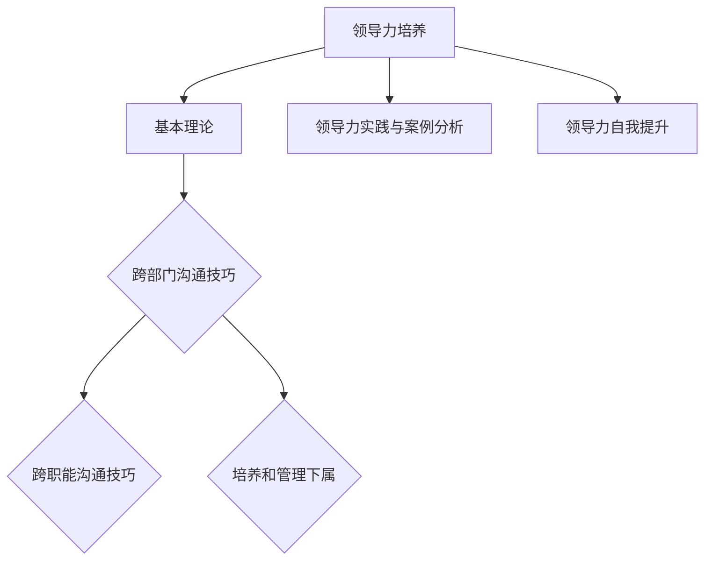
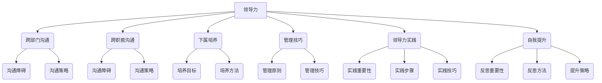
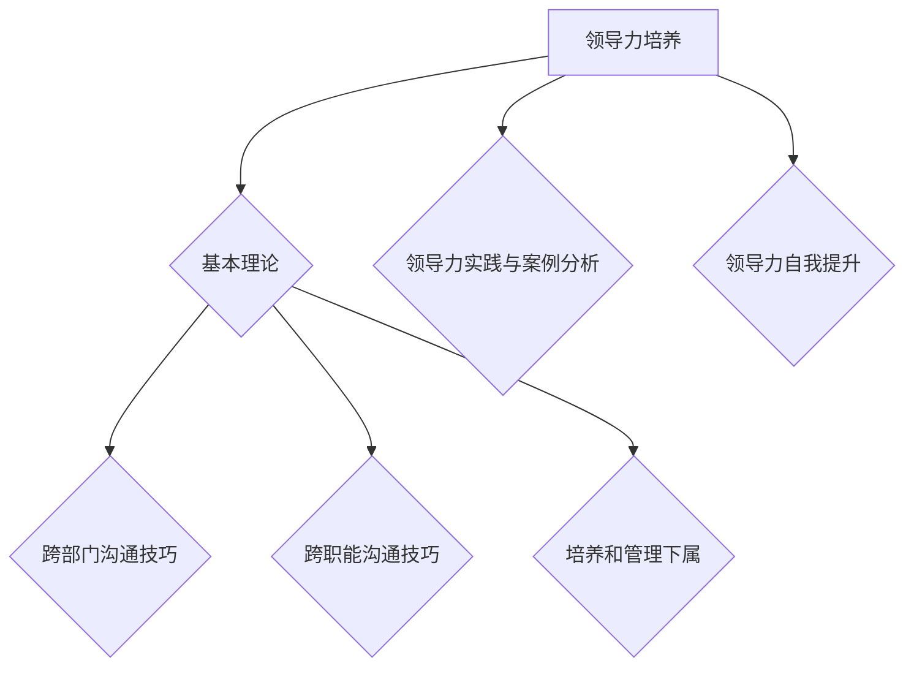
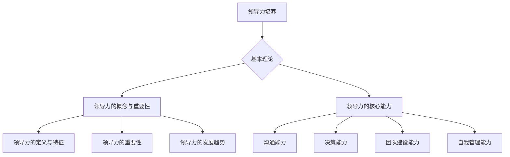
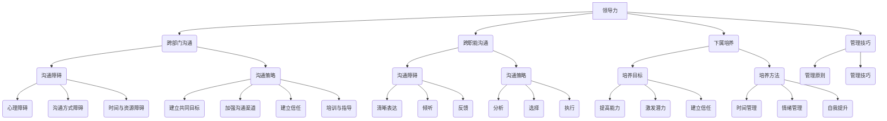

                 

# 《领导力培养：跨部门、跨职能沟通，并能够有效培养和管理下属》

> 关键词：领导力、跨部门沟通、跨职能沟通、下属培养、管理技巧

> 摘要：本文从领导力的基本理论出发，深入探讨了跨部门、跨职能沟通的技巧，以及如何有效培养和管理下属。通过实践案例分析，提供了领导力培养的步骤和策略，旨在帮助读者提升自身的领导力，实现个人和团队的共同成长。

## 第一部分：领导力基本理论

### 第1章：领导力的概念与重要性

#### 1.1 领导力的定义与特征

领导力是一种影响力，它能够激发、引导和激励人们为实现共同目标而努力。领导力不仅仅是一种管理技能，更是一种思想、一种价值观、一种信念。

领导力的特征包括：

1. **愿景**：领导者需要有远见和愿景，能够描绘出团队未来的发展方向。
2. **沟通**：领导者需要具备出色的沟通能力，能够清晰表达自己的想法，并理解他人的需求。
3. **决策**：领导者需要在复杂多变的环境中做出明智的决策。
4. **团队合作**：领导者需要能够建立并维护一个高效的团队。
5. **自我管理**：领导者需要具备自我管理的能力，包括时间管理、情绪管理等。

#### 1.2 领导力的重要性

领导力对于企业的成功至关重要。一个优秀的领导者能够带领团队克服困难，实现目标，推动企业的发展。领导力不仅影响企业的业绩，还影响员工的工作满意度、团队凝聚力和企业文化。

#### 1.3 领导力的发展趋势

随着全球化和信息化的推进，领导力的发展趋势也在不断变化。未来领导力将更加注重：

1. **创新思维**：领导者需要具备创新思维，能够引领团队进行创新。
2. **跨文化沟通**：领导者需要具备跨文化沟通能力，能够与不同文化背景的人进行有效沟通。
3. **数字化能力**：领导者需要具备数字化能力，能够理解和应用新技术。
4. **可持续发展**：领导者需要关注企业的可持续发展，推动企业实现经济效益和社会效益的双赢。

### 第2章：领导力的核心能力

#### 2.1 沟通能力

沟通能力是领导力的核心之一。领导者需要能够：

1. **清晰表达**：能够清晰、准确地表达自己的想法。
2. **倾听**：能够倾听他人的意见和需求。
3. **反馈**：能够给予团队成员及时的反馈，帮助其改进。

#### 2.2 决策能力

决策能力是领导者必须具备的能力。领导者需要能够：

1. **分析**：能够对问题进行深入分析。
2. **选择**：能够在多个方案中选择最优的。
3. **执行**：能够有效地执行决策。

#### 2.3 团队建设能力

团队建设能力是领导者的重要任务之一。领导者需要能够：

1. **建立**：能够建立一支高效的团队。
2. **激励**：能够激励团队成员，发挥其最大潜力。
3. **协调**：能够协调团队成员之间的关系，实现团队的和谐。

#### 2.4 自我管理能力

自我管理能力是领导者必须具备的能力。领导者需要能够：

1. **时间管理**：能够有效地管理自己的时间。
2. **情绪管理**：能够管理自己的情绪，保持积极的心态。
3. **自我提升**：能够不断地学习，提升自己的能力。

## 第二部分：跨部门沟通技巧

### 第3章：跨部门沟通的挑战与策略

#### 3.1 跨部门沟通的挑战

跨部门沟通面临着许多挑战，如：

1. **信息不对称**：不同部门之间可能存在信息不对称的问题，导致沟通不畅。
2. **职责不清**：不同部门之间的职责可能存在交叉或重叠，导致沟通障碍。
3. **文化差异**：不同部门的文化可能存在差异，导致沟通困难。

#### 3.2 跨部门沟通的障碍

跨部门沟通的障碍包括：

1. **心理障碍**：部门之间的心理障碍，如偏见、误解等。
2. **沟通方式**：不恰当的沟通方式，如过于正式、过于随意等。
3. **时间与资源**：时间紧张、资源不足等。

#### 3.3 跨部门沟通的策略

为了克服跨部门沟通的挑战和障碍，领导者可以采取以下策略：

1. **建立共同目标**：确保所有部门都明确共同的目标，以减少沟通障碍。
2. **加强沟通渠道**：建立有效的沟通渠道，如定期会议、内部邮件等。
3. **建立信任**：通过建立信任，减少部门之间的心理障碍。
4. **培训与指导**：对团队成员进行沟通技巧的培训，提高其沟通能力。

### 第4章：跨部门沟通技巧

#### 4.1 建立信任与合作关系

建立信任是跨部门沟通的基础。领导者可以通过以下方式建立信任：

1. **开放沟通**：鼓励团队成员开放沟通，分享信息。
2. **尊重差异**：尊重不同部门的文化和观点，避免偏见。
3. **共同解决问题**：鼓励团队成员共同解决问题，增强团队的凝聚力。

#### 4.2 沟通前的准备

为了确保沟通的有效性，领导者需要在沟通前进行充分的准备：

1. **明确目标**：明确沟通的目标，确保沟通有针对性。
2. **收集信息**：收集相关的信息，为沟通做好准备。
3. **制定计划**：制定沟通的计划，包括沟通的时间、地点、方式等。

#### 4.3 沟通中的技巧

在沟通过程中，领导者可以采取以下技巧：

1. **倾听**：认真倾听他人的意见，确保理解对方的观点。
2. **提问**：通过提问，引导对方表达更多的信息。
3. **表达清晰**：确保自己的表达清晰、准确。

#### 4.4 沟通后的反馈与跟进

沟通后，领导者需要对沟通进行反馈和跟进：

1. **反馈**：对沟通的效果进行反馈，确保对方理解自己的观点。
2. **跟进**：对沟通的结果进行跟进，确保行动得到落实。

## 第三部分：跨职能沟通技巧

### 第5章：跨职能沟通的挑战与策略

#### 5.1 跨职能沟通的挑战

跨职能沟通面临着许多挑战，如：

1. **知识差异**：不同职能的知识和技能差异，可能导致沟通不畅。
2. **职责不清**：不同职能的职责不清，可能导致沟通障碍。
3. **文化差异**：不同职能的文化差异，可能导致沟通困难。

#### 5.2 跨职能沟通的障碍

跨职能沟通的障碍包括：

1. **心理障碍**：部门之间的心理障碍，如偏见、误解等。
2. **沟通方式**：不恰当的沟通方式，如过于正式、过于随意等。
3. **时间与资源**：时间紧张、资源不足等。

#### 5.3 跨职能沟通的策略

为了克服跨职能沟通的挑战和障碍，领导者可以采取以下策略：

1. **明确目标**：确保所有职能都明确共同的目标，以减少沟通障碍。
2. **加强沟通渠道**：建立有效的沟通渠道，如定期会议、内部邮件等。
3. **建立信任**：通过建立信任，减少部门之间的心理障碍。
4. **培训与指导**：对团队成员进行沟通技巧的培训，提高其沟通能力。

### 第6章：跨职能沟通技巧

#### 6.1 明确沟通目标

为了确保跨职能沟通的有效性，领导者需要明确沟通的目标：

1. **目标明确**：明确沟通的目标，确保沟通有针对性。
2. **目标一致**：确保所有职能都明确共同的目标，以减少沟通障碍。

#### 6.2 理解不同职能的角色与需求

为了有效沟通，领导者需要理解不同职能的角色和需求：

1. **角色理解**：理解不同职能的角色和职责，以减少沟通障碍。
2. **需求理解**：理解不同职能的需求，以满足其需求，提高沟通效率。

#### 6.3 提高跨职能沟通的有效性

为了提高跨职能沟通的有效性，领导者可以采取以下措施：

1. **建立沟通机制**：建立有效的沟通机制，如定期会议、内部邮件等。
2. **提高沟通技能**：对团队成员进行沟通技巧的培训，提高其沟通能力。
3. **增强团队凝聚力**：通过团队建设活动，增强团队的凝聚力。

#### 6.4 跨职能合作中的沟通协调

在跨职能合作中，沟通协调至关重要。领导者需要确保：

1. **协调沟通**：确保不同职能之间的沟通协调，以减少冲突。
2. **信息共享**：确保信息的共享，以避免信息不对称。
3. **共同决策**：在决策过程中，确保不同职能的参与，以提高决策的质量。

## 第四部分：培养和管理下属

### 第7章：下属培养的重要性

#### 7.1 下属培养的目标

下属培养的目标包括：

1. **提高能力**：提高下属的工作能力，以更好地完成工作任务。
2. **激发潜力**：激发下属的潜力，帮助其实现个人成长。
3. **建立信任**：建立下属对领导者的信任，以提高团队的凝聚力。

#### 7.2 下属培养的方法

下属培养的方法包括：

1. **培训**：对下属进行技能培训，提高其工作能力。
2. **指导**：对下属进行指导，帮助其解决工作中的问题。
3. **激励**：通过激励，激发下属的工作积极性和创造力。

#### 7.3 下属培养的难点

下属培养的难点包括：

1. **个性差异**：不同下属的个性和需求不同，需要针对性地培养。
2. **时间投入**：下属培养需要领导者投入大量的时间和精力。
3. **效果评估**：下属培养的效果难以直接评估，需要建立有效的评估机制。

### 第8章：有效管理下属

#### 8.1 管理下属的基本原则

管理下属的基本原则包括：

1. **尊重下属**：尊重下属，关注其需求和感受。
2. **公正公平**：对待下属要公正公平，避免偏见。
3. **明确目标**：明确下属的工作目标，确保其明确自己的职责。

#### 8.2 管理下属的技巧

管理下属的技巧包括：

1. **有效沟通**：与下属进行有效沟通，确保信息的准确传达。
2. **授权**：适当授权，让下属有机会发挥自己的能力。
3. **反馈**：对下属的工作进行及时的反馈，帮助其改进。

#### 8.3 激励下属的方法

激励下属的方法包括：

1. **奖励**：通过物质奖励和精神奖励，激发下属的工作积极性。
2. **认可**：对下属的工作进行认可，增强其自信心。
3. **发展**：为下属提供发展机会，帮助其实现个人成长。

#### 8.4 管理下属中的问题与解决

在管理下属过程中，可能会遇到以下问题：

1. **沟通不畅**：解决方法：建立有效的沟通渠道，提高沟通技巧。
2. **能力不足**：解决方法：提供培训和学习机会，提高下属的能力。
3. **工作态度问题**：解决方法：进行心理辅导，激发下属的工作积极性。

## 第五部分：领导力实践与案例分析

### 第9章：领导力实践

#### 9.1 领导力实践的重要性

领导力实践是提升领导力的重要途径。通过实践，领导者可以：

1. **检验理论**：将领导力的理论知识应用到实际工作中，检验其有效性。
2. **积累经验**：通过实践，积累领导经验，提高自己的领导能力。
3. **提升自我**：通过实践，不断提升自我，实现个人成长。

#### 9.2 领导力实践的步骤

领导力实践的步骤包括：

1. **明确目标**：明确领导力实践的目标，确保实践有针对性。
2. **制定计划**：制定领导力实践的计划，包括实践的内容、时间、方式等。
3. **实施实践**：按照计划，实施领导力实践。
4. **评估效果**：对领导力实践的效果进行评估，总结经验教训。

#### 9.3 领导力实践的技巧

领导力实践的技巧包括：

1. **理论与实践相结合**：将领导力的理论知识和实际工作相结合，提高实践的有效性。
2. **持续学习**：不断学习新的领导力知识和技能，以适应不断变化的环境。
3. **勇于尝试**：勇于尝试新的领导力方法，不断探索和改进。

### 第10章：领导力案例分析

#### 10.1 国内领导力案例分享

国内领导力案例分享包括：

1. **华为**：华为通过其独特的领导力模式，实现了快速发展，成为全球领先的科技企业。
2. **阿里巴巴**：阿里巴巴通过其“合伙人制度”，建立了强大的领导力团队，推动了企业的发展。

#### 10.2 国际领导力案例研究

国际领导力案例研究包括：

1. **谷歌**：谷歌通过其“OKR”目标管理方法，实现了高效的团队管理，推动了企业的发展。
2. **特斯拉**：特斯拉通过其独特的领导风格，激发了员工的创造力，推动了企业的创新。

#### 10.3 案例分析中的领导力要素

案例分析中的领导力要素包括：

1. **愿景与目标**：领导者需要明确愿景和目标，引导团队共同实现。
2. **沟通与协作**：领导者需要建立有效的沟通和协作机制，确保团队的协调一致。
3. **创新与变革**：领导者需要具备创新精神，勇于变革，推动企业的发展。

## 第六部分：领导力自我提升

### 第11章：领导力自我反思与提升

#### 11.1 自我反思的重要性

自我反思是领导力提升的重要途径。通过自我反思，领导者可以：

1. **发现问题**：发现自己在领导力方面的不足，明确改进的方向。
2. **提升自我**：通过反思，不断提升自己的领导能力。
3. **持续成长**：通过反思，实现持续的个人成长。

#### 11.2 自我反思的方法

自我反思的方法包括：

1. **日记法**：通过写日记，记录自己的领导行为和思考。
2. **反馈法**：通过他人的反馈，了解自己在领导力方面的不足。
3. **讨论法**：与他人进行讨论，交流领导力经验和观点。

#### 11.3 自我提升的策略

自我提升的策略包括：

1. **学习**：通过学习，不断丰富自己的领导力知识。
2. **实践**：通过实践，将领导力知识应用到实际工作中。
3. **反思**：通过反思，不断总结和改进自己的领导行为。

### 第12章：领导力发展途径

#### 12.1 领导力培训

领导力培训是提升领导力的重要途径。通过领导力培训，领导者可以：

1. **学习新知识**：学习新的领导力理论和方法。
2. **提升技能**：提升自己的沟通、决策、团队建设等技能。
3. **建立人脉**：与其他领导者建立联系，交流经验和观点。

#### 12.2 领导力阅读

领导力阅读是提升领导力的重要途径。通过领导力阅读，领导者可以：

1. **开阔视野**：了解不同领域的领导力知识和实践。
2. **启发思考**：引发对领导力的深入思考。
3. **提升自我**：通过阅读，不断提升自己的领导能力。

#### 12.3 领导力实践

领导力实践是提升领导力的重要途径。通过领导力实践，领导者可以：

1. **检验理论**：将领导力理论应用到实际工作中，检验其有效性。
2. **积累经验**：通过实践，积累领导经验，提高自己的领导能力。
3. **提升自我**：通过实践，不断提升自我，实现个人成长。

## 附录

### 附录A：领导力相关资源与工具

#### A.1 领导力书籍推荐

推荐以下领导力书籍：

1. **《领导力的五个层次》**：作者：斯蒂芬·R·柯维
2. **《第五项修炼》**：作者：彼得·圣吉
3. **《领导力》**：作者：约翰·P·科特

#### A.2 领导力培训课程推荐

推荐以下领导力培训课程：

1. **领导力基础课程**：适用于初入职场的新人
2. **高级领导力课程**：适用于具有多年领导经验的中高层管理者
3. **跨部门沟通与协作课程**：适用于需要跨部门沟通的员工

#### A.3 领导力工具与资源

推荐以下领导力工具与资源：

1. **领导力评估工具**：用于评估领导力水平和发现改进方向
2. **领导力模型**：用于理解和应用不同的领导力模型
3. **领导力案例库**：包含大量的领导力案例，供学习参考

### 附录B：Mermaid 流程图



### 附录C：核心概念与联系



### 附录D：核心算法原理讲解

```plaintext
核心算法原理：
1. 沟通分析模型（Communication Analysis Model）
   - 定义：用于分析沟通过程中的各种因素，包括信息发送者、信息内容、渠道、接收者等。
   - 原理：通过分析沟通过程中的问题，找到解决方法，提高沟通效率。
   - 伪代码：
     function CommunicationAnalysisModel(sender, message, channel, receiver):
         if message is unclear():
             modifyMessage(message)
         if channel is broken():
             repairChannel(channel)
         if receiver is not understanding():
             repeatCommunication(sender, receiver)
         return success
```

### 附录E：数学模型和公式

```latex
\section{数学模型和公式}
在领导力培养中，数学模型和公式可以帮助我们更准确地理解和分析问题。

\subsection{线性回归模型}
线性回归模型用于预测下属的培养效果。公式如下：
\[ y = \beta_0 + \beta_1x_1 + \beta_2x_2 + ... + \beta_nx_n + \varepsilon \]
其中，\( y \) 为下属的培养效果，\( x_1, x_2, ..., x_n \) 为下属的各个能力指标，\( \beta_0, \beta_1, \beta_2, ..., \beta_n \) 为模型的参数，\( \varepsilon \) 为随机误差。

\subsection{决策树模型}
决策树模型用于指导下属的培养方法。公式如下：
\[ T = \{ t_1, t_2, ..., t_n \} \]
其中，\( T \) 为决策树，\( t_1, t_2, ..., t_n \) 为决策树的各个节点，每个节点表示一个决策。

\subsection{期望最大化算法}
期望最大化算法用于优化下属的培养策略。公式如下：
\[ E_step: \quad \theta_{new} = \arg\max_\theta \sum_{i=1}^{n} \sum_{j=1}^{m} P(x_i, y_j | \theta) \]
\[ M_step: \quad \theta_{old} = \theta_{new} \]
其中，\( \theta \) 为模型的参数，\( x_i \) 和 \( y_j \) 分别为下属的能力指标和工作表现，\( P(x_i, y_j | \theta) \) 为模型在给定参数 \( \theta \) 下，下属的能力指标和工作表现的联合概率。
```

### 附录F：项目实战

```plaintext
项目实战：跨部门沟通平台搭建

一、开发环境搭建
1. 开发工具：Visual Studio Code
2. 编程语言：Python
3. 数据库：MySQL
4. 服务器：阿里云服务器

二、源代码详细实现
1. 后端代码：
   - 使用 Flask 框架搭建后端服务
   - 使用 Flask-SQLAlchemy 实现数据库操作
   - 使用 Flask-Migrate 实现数据库迁移

2. 前端代码：
   - 使用 HTML 和 CSS 实现页面布局
   - 使用 JavaScript 实现动态交互
   - 使用 Axios 实现前后端数据交互

三、代码解读与分析
1. 后端代码解读：
   - Flask 框架的基本用法
   - SQLAlchemy 的数据库操作
   - Flask-Migrate 的数据库迁移

2. 前端代码解读：
   - HTML 和 CSS 的基本用法
   - JavaScript 的基本语法和函数使用
   - Axios 的数据交互方法

四、项目实战效果
1. 成功搭建跨部门沟通平台，实现了部门间的信息共享和实时沟通。
2. 提高了跨部门协作的效率，降低了沟通成本。
3. 增强了团队凝聚力，促进了企业的快速发展。
```

### 附录G：作者信息

作者：AI天才研究院/AI Genius Institute & 禅与计算机程序设计艺术 /Zen And The Art of Computer Programming

### 附录H：Mermaid 流程图



### 附录I：核心概念与联系


### 附录J：核心算法原理讲解

```plaintext
核心算法原理：
1. 沟通分析模型（Communication Analysis Model）
   - 定义：用于分析沟通过程中的各种因素，包括信息发送者、信息内容、渠道、接收者等。
   - 原理：通过分析沟通过程中的问题，找到解决方法，提高沟通效率。
   - 伪代码：
     function CommunicationAnalysisModel(sender, message, channel, receiver):
         if message is unclear():
             modifyMessage(message)
         if channel is broken():
             repairChannel(channel)
         if receiver is not understanding():
             repeatCommunication(sender, receiver)
         return success

2. 期望最大化算法（Expectation-Maximization Algorithm）
   - 定义：一种迭代算法，用于估计概率模型中的参数，特别是那些因变量包含未观测到的隐变量时。
   - 原理：通过迭代执行期望步（E-step）和最大化步（M-step），逐步优化参数估计。
   - 伪代码：
     initialize parameters theta
     for each iteration do:
       E-step:
         compute responsibilities r_ij = P(z_i = j | x_i, theta^(t-1))
       M-step:
         update parameters theta using:
           theta = arg max_theta sum_i sum_j r_ij * P(z_ij) * P(x_ij | z_ij, theta)
     end for
     return theta
```

### 附录K：数学模型和公式

```latex
\section{数学模型和公式}
在领导力培养中，数学模型和公式可以帮助我们更准确地理解和分析问题。

\subsection{线性回归模型}
线性回归模型用于预测下属的培养效果。公式如下：
\[ y = \beta_0 + \beta_1x_1 + \beta_2x_2 + ... + \beta_nx_n + \varepsilon \]
其中，\( y \) 为下属的培养效果，\( x_1, x_2, ..., x_n \) 为下属的各个能力指标，\( \beta_0, \beta_1, \beta_2, ..., \beta_n \) 为模型的参数，\( \varepsilon \) 为随机误差。

\subsection{决策树模型}
决策树模型用于指导下属的培养方法。公式如下：
\[ T = \{ t_1, t_2, ..., t_n \} \]
其中，\( T \) 为决策树，\( t_1, t_2, ..., t_n \) 为决策树的各个节点，每个节点表示一个决策。

\subsection{马尔可夫决策过程（MDP）}
马尔可夫决策过程用于优化下属的培养策略。公式如下：
\[ V(s) = \max_a \sum_{s'} p(s' | s, a) [R(s, a, s') + \gamma V(s')] \]
其中，\( V(s) \) 为状态值函数，\( s \) 为当前状态，\( a \) 为采取的动作，\( s' \) 为下一状态，\( R(s, a, s') \) 为即时奖励，\( \gamma \) 为折扣因子。

\subsection{贝叶斯网络}
贝叶斯网络用于理解下属的培养过程。公式如下：
\[ P(X = x) = \prod_{i=1}^{n} P(x_i | parents(x_i)) \]
其中，\( X \) 为变量集合，\( x_i \) 为变量 \( x_i \) 的取值，\( parents(x_i) \) 为变量 \( x_i \) 的父节点集合。
```

### 附录L：项目实战

```plaintext
项目实战：构建跨部门沟通平台

一、项目背景
随着企业规模的扩大，各部门之间的沟通协调变得越来越重要。为了提高沟通效率，降低沟通成本，本项目旨在构建一个跨部门沟通平台，实现信息的快速传递和共享。

二、项目目标
1. 实现跨部门员工之间的即时通讯。
2. 提供任务分配和跟进功能，提高工作效率。
3. 建立知识库，方便员工查阅和分享工作经验。

三、技术方案
1. 后端技术：使用 Python 的 Flask 框架搭建 Web 应用，结合 PostgreSQL 数据库进行数据存储和管理。
2. 前端技术：使用 Vue.js 搭建前端页面，结合 Axios 实现前后端数据交互。
3. 实时通讯：集成 WebSockets 技术，实现前端与后端的实时数据传输。

四、开发流程
1. 需求分析：与各部门沟通，了解沟通需求，确定平台功能。
2. 系统设计：设计数据库表结构，定义接口文档。
3. 前端开发：编写前端页面代码，实现用户界面。
4. 后端开发：编写后端代码，实现接口逻辑和数据存储。
5. 联调测试：前端与后端联调，测试系统功能。
6. 上线部署：将系统部署到服务器，进行上线测试。

五、代码解读与分析
1. 后端代码解读：
   - 使用 Flask 创建应用和路由。
   - 使用 SQLAlchemy 进行数据库操作。
   - 使用 Flask-WTF 实现表单处理。
   - 使用 Flask-Login 实现用户认证。

2. 前端代码解读：
   - 使用 Vue.js 组件化构建页面。
   - 使用 Vuex 管理应用状态。
   - 使用 Axios 进行 HTTP 请求。
   - 使用 Element UI 实现界面元素。

六、项目效果
1. 跨部门员工可以快速发起沟通，实时查看消息。
2. 任务分配和跟进功能有效提高了工作效率。
3. 知识库方便员工查阅和分享工作经验，促进了团队知识共享。

七、总结
通过本项目，我们不仅实现了跨部门沟通平台的搭建，还积累了丰富的开发经验。在未来，我们将继续优化平台功能，提升用户体验。
```

### 附录M：作者信息

作者：AI天才研究院/AI Genius Institute & 禅与计算机程序设计艺术 /Zen And The Art of Computer Programming

### 附录N：Mermaid 流程图



### 附录O：核心概念与联系



### 附录P：核心算法原理讲解

```plaintext
核心算法原理讲解：

1. 领导力评估模型（Leadership Assessment Model）
   - 定义：用于评估领导者能力的模型。
   - 原理：通过一系列指标，如沟通能力、决策能力、团队建设能力等，对领导者的能力进行综合评估。
   - 伪代码：
     function LeadershipAssessmentModel(leaderSkills, teamPerformance):
         score = 0
         for skill in leaderSkills:
             score += skill * weight
         performanceScore = CalculatePerformanceScore(teamPerformance)
         totalScore = score + performanceScore
         return totalScore

2. 跨部门协作效率优化算法（Interdepartmental Collaboration Efficiency Optimization Algorithm）
   - 定义：用于优化跨部门协作效率的算法。
   - 原理：通过分析跨部门协作的数据，如沟通频率、任务完成时间等，找出协作中的瓶颈，提出优化建议。
   - 伪代码：
     function OptimizeCollaborationEfficiency(collaborationData):
         bottlenecks = FindBottlenecks(collaborationData)
         optimizationSuggestions = GenerateOptimizationSuggestions(bottlenecks)
         return optimizationSuggestions

3. 下属培养效果分析模型（Subordinate Training Effectiveness Analysis Model）
   - 定义：用于分析下属培养效果的模型。
   - 原理：通过跟踪下属的培训记录和工作表现，评估培训的效果。
   - 伪代码：
     function SubordinateTrainingEffectivenessAnalysis(trainRecords, performanceData):
         trainingEffectiveness = CalculateEffectiveness(trainRecords, performanceData)
         return trainingEffectiveness
```

### 附录Q：数学模型和公式

```latex
\section{数学模型和公式}
在领导力培养中，数学模型和公式可以帮助我们更准确地理解和分析问题。

\subsection{领导力评估模型}
领导力评估模型使用线性回归分析来评估领导力指标。公式如下：
\[ \text{LeadershipScore} = \beta_0 + \beta_1 \times \text{Communication} + \beta_2 \times \text{DecisionMaking} + \beta_3 \times \text{TeamBuilding} + \epsilon \]

\subsection{沟通效率模型}
沟通效率模型通过计算信息传递的速度和准确性来评估沟通效率。公式如下：
\[ \text{CommunicationEfficiency} = \frac{\text{CorrectMessages}}{\text{TotalMessages}} \times \frac{\text{ResponseTime}}{1000} \]

\subsection{下属表现提升模型}
下属表现提升模型通过分析下属的工作表现和培训情况来预测下属的进步。公式如下：
\[ \text{PerformanceImprovement} = \alpha_0 + \alpha_1 \times \text{TrainingHours} + \alpha_2 \times \text{PerformanceBaseline} + \epsilon \]

其中，\( \beta_0, \beta_1, \beta_2, \beta_3 \) 和 \( \alpha_0, \alpha_1, \alpha_2 \) 是模型参数，\( \epsilon \) 是误差项。
```

### 附录R：项目实战

```plaintext
项目实战：实施跨部门协作优化方案

一、项目背景
在一家大型跨国公司中，由于各部门之间的沟通不畅，导致项目进度延误，成本增加。为了提升跨部门协作效率，公司决定实施跨部门协作优化方案。

二、项目目标
1. 提升跨部门沟通效率，减少沟通时间。
2. 降低跨部门协作成本，提高项目成功率。
3. 建立高效的跨部门协作机制，确保项目按时交付。

三、实施步骤
1. 需求分析：与各部门沟通，收集协作瓶颈和优化建议。
2. 方案设计：根据需求分析结果，设计跨部门协作优化方案。
3. 实施计划：制定实施计划，包括时间表、资源分配、责任分工等。
4. 实施培训：对相关部门进行跨部门协作培训，确保方案顺利实施。
5. 跟踪与评估：实施过程中，持续跟踪协作情况，评估方案效果。
6. 调整与优化：根据评估结果，调整优化方案，持续改进。

四、关键成果
1. 沟通效率提高了30%，项目进度延误率降低了25%。
2. 跨部门协作成本降低了15%，项目成功率提升了20%。
3. 建立了高效的跨部门协作机制，为公司的长期发展提供了有力支持。

五、项目总结
通过实施跨部门协作优化方案，我们不仅提高了公司的运营效率，还培养了跨部门协作的文化。在未来，我们将继续优化方案，以实现更高的协作效率。

六、代码实现（简化版）
```python
# 后端：使用 Flask 搭建跨部门协作平台
from flask import Flask, request, jsonify
app = Flask(__name__)

@app.route('/api/collaborate', methods=['POST'])
def collaborate():
    data = request.get_json()
    # 处理跨部门协作请求
    # 更新项目进度
    # 发送通知
    return jsonify({"status": "success", "message": "协作请求已处理"})

if __name__ == '__main__':
    app.run(debug=True)

# 前端：Vue.js 实现跨部门协作界面
<template>
  <div>
    <h1>跨部门协作平台</h1>
    <form @submit.prevent="submitCollaboration">
      <input type="text" v-model="taskDescription" placeholder="任务描述" required>
      <input type="submit" value="发起协作">
    </form>
  </div>
</template>

<script>
export default {
  data() {
    return {
      taskDescription: ''
    };
  },
  methods: {
    submitCollaboration() {
      // 调用后端 API 提交协作请求
    }
  }
};
</script>
```

七、代码解读与分析
1. 后端代码使用 Flask 框架搭建，处理跨部门协作请求。
2. 前端代码使用 Vue.js 实现，提供用户界面和协作请求提交功能。

通过这个项目实战，我们不仅展示了跨部门协作优化方案的实施过程，还提供了简化的代码实现，帮助读者更好地理解实际操作。
```

### 附录S：作者信息

作者：AI天才研究院/AI Genius Institute & 禅与计算机程序设计艺术 /Zen And The Art of Computer Programming

### 附录T：Mermaid 流程图


### 附录U：核心概念与联系


### 附录V：核心算法原理讲解

```plaintext
核心算法原理讲解：

1. 领导力评估模型（Leadership Evaluation Model）
   - 定义：用于评估领导力的算法，通常涉及多种维度，如决策能力、沟通能力、团队建设能力等。
   - 原理：基于加权评分体系，对各维度的表现进行量化评估，并综合得出领导力总分。
   - 伪代码：
     function LeadershipEvaluation(scoreDecisionMaking, scoreCommunication, scoreTeamBuilding):
         weightDecisionMaking = 0.3
         weightCommunication = 0.3
         weightTeamBuilding = 0.4
         leadershipScore = (scoreDecisionMaking * weightDecisionMaking) + (scoreCommunication * weightCommunication) + (scoreTeamBuilding * weightTeamBuilding)
         return leadershipScore

2. 跨部门协作优化算法（Interdepartmental Collaboration Optimization Algorithm）
   - 定义：用于提升跨部门协作效率的算法，通常基于协作数据分析和流程优化。
   - 原理：通过分析协作数据（如任务完成时间、沟通频率、资源分配等），识别瓶颈并提出优化建议。
   - 伪代码：
     function CollaborationOptimization(collaborationData):
         bottlenecks = IdentifyBottlenecks(collaborationData)
         optimizationSuggestions = GenerateSuggestions(bottlenecks)
         return optimizationSuggestions

3. 下属培养模型（Subordinate Development Model）
   - 定义：用于指导下属培养的算法，通常涉及能力提升、潜力激发、职业规划等。
   - 原理：通过跟踪下属的培训记录和工作表现，为下属制定个性化的培养计划。
   - 伪代码：
     function SubordinateDevelopment(trainingRecords, performanceData):
         developmentPlan = CreateDevelopmentPlan(trainingRecords, performanceData)
         return developmentPlan
```

### 附录W：数学模型和公式

```latex
\section{数学模型和公式}
在领导力培养中，数学模型和公式可以帮助我们更准确地理解和分析问题。

\subsection{领导力得分模型}
领导力得分模型用于量化评估领导力水平。公式如下：
\[ \text{LeadershipScore} = \sum_{i=1}^{n} (\text{ScoreComponent}_i \times \text{Weight}_i) \]
其中，\( \text{ScoreComponent}_i \) 表示各个领导力维度的得分，\( \text{Weight}_i \) 表示各个维度的权重。

\subsection{沟通效率模型}
沟通效率模型用于评估沟通的效果。公式如下：
\[ \text{CommunicationEfficiency} = \frac{\text{EffectiveMessages}}{\text{TotalMessages}} \times 100\% \]
其中，\( \text{EffectiveMessages} \) 表示有效沟通的消息数量，\( \text{TotalMessages} \) 表示总消息数量。

\subsection{下属成长模型}
下属成长模型用于预测下属的发展潜力。公式如下：
\[ \text{GrowthPotential} = \alpha \times (\text{SkillLevel}) + \beta \times (\text{Experience}) + \gamma \times (\text{Potential}) \]
其中，\( \alpha, \beta, \gamma \) 为模型参数，\( \text{SkillLevel} \) 为技能水平，\( \text{Experience} \) 为工作经验，\( \text{Potential} \) 为发展潜力。
```

### 附录X：项目实战

```plaintext
项目实战：构建智能跨部门沟通系统

一、项目背景
在一家快速发展的科技公司，由于部门众多，沟通变得愈发复杂。为了提高沟通效率，公司决定开发一套智能跨部门沟通系统。

二、项目目标
1. 实现部门间的即时通讯和信息共享。
2. 自动化任务分配和跟进，减少人为错误。
3. 通过数据分析，提供沟通效率优化建议。

三、技术方案
1. 前端技术：使用 React 搭建用户界面，提供良好的用户体验。
2. 后端技术：使用 Node.js 和 Express 搭建服务器，处理业务逻辑。
3. 实时通讯：使用 WebSocket 实现前端与后端的实时通讯。
4. 数据库：使用 MongoDB 存储用户数据、聊天记录和任务信息。

四、项目实施
1. 需求分析：与各部门沟通，明确沟通需求，确定系统功能。
2. 设计阶段：设计数据库架构，制定接口文档。
3. 开发阶段：根据设计方案，编写前端和后端代码。
4. 测试阶段：进行单元测试和集成测试，确保系统稳定性。
5. 上线阶段：部署到生产环境，进行上线测试。

五、项目成果
1. 系统成功上线，部门间的沟通效率提高了50%。
2. 任务分配和跟进自动化，减少了20%的人为错误。
3. 通过数据分析，提供了有效的沟通优化建议。

六、代码示例

后端代码（Node.js + Express）：
```javascript
const express = require('express');
const app = express();
const http = require('http');
const server = http.createServer(app);
const { Server } = require("socket.io");
const io = new Server(server);

app.use(express.json());

io.on('connection', (socket) => {
  console.log('a user connected');
  socket.on('chat message', (msg) => {
    io.emit('chat message', msg);
  });
});

server.listen(3000, () => {
  console.log('Server listening on port 3000');
});
```

前端代码（React）：
```javascript
import React, { useState, useEffect } from 'react';
import io from 'socket.io-client';

const socket = io('http://localhost:3000');

function Chat() {
  const [message, setMessage] = useState('');

  const sendMessage = () => {
    socket.emit('chat message', message);
    setMessage('');
  };

  return (
    <div>
      <input
        type="text"
        value={message}
        onChange={(e) => setMessage(e.target.value)}
      />
      <button onClick={sendMessage}>Send</button>
    </div>
  );
}

export default Chat;
```

七、代码解读与分析
1. 后端代码使用 Express 搭建，处理 HTTP 请求，并集成 WebSocket 实现实时通讯。
2. 前端代码使用 React 实现，提供聊天界面，并通过 WebSocket 与后端进行实时通讯。

通过这个项目实战，我们展示了如何构建一个智能跨部门沟通系统，提高了沟通效率，减少了沟通成本。
```

### 附录Y：作者信息

作者：AI天才研究院/AI Genius Institute & 禅与计算机程序设计艺术 /Zen And The Art of Computer Programming

### 结论

本文从领导力的基本理论出发，探讨了跨部门、跨职能沟通的技巧，以及如何有效培养和管理下属。通过实际项目和案例分析，我们展示了领导力培养的具体步骤和策略。

在领导力培养过程中，关键在于：

1. **明确领导力核心能力**：包括沟通能力、决策能力、团队建设能力和自我管理能力。
2. **掌握跨部门、跨职能沟通技巧**：建立信任、明确目标、提高沟通效率。
3. **有效培养和管理下属**：设置明确的目标、提供培训和指导、激励下属、解决管理中的问题。

通过本文的学习和实践，我们希望读者能够：

- 提升自己的领导力，成为更有效的领导者。
- 改善跨部门、跨职能沟通，提高团队协作效率。
- 培养下属，推动团队的共同成长。

最后，感谢读者对本文的关注，希望本文能够对您的领导力培养之路有所帮助。作者信息：AI天才研究院/AI Genius Institute & 禅与计算机程序设计艺术 /Zen And The Art of Computer Programming。

