                 

### 文章标题

“领导力心法：成就伟业的领导者法则”

### 关键词

- 领导力
- 领导者心法
- 团队管理
- 决策
- 变革管理
- 危机管理

### 摘要

本文深入探讨了领导力心法的本质与应用，通过逻辑清晰的分析和实际案例，揭示了领导者如何通过自我认知、情绪管理、人际沟通等心法，实现团队建设、领导决策、变革管理和危机管理的卓越成就。文章不仅涵盖了领导力心法的基础理论，还通过核心算法原理讲解、数学模型与公式以及项目实战案例，为读者提供了实用的策略和方法。通过本文的阅读，读者将能够深刻理解领导力心法的重要性，并掌握其实践技巧，以提升自身的领导能力，成就伟业。

## 第一部分：领导力心法概述

### 第1章：领导力的本质与重要性

#### 1.1 领导力的定义与作用

领导力，是一种激励和引导他人共同实现目标的能力。它不仅仅体现在企业高管或政府领导者的身上，更是渗透到各行各业、各个层面。领导力的本质在于创造变革、推动进步，它不仅仅是一种技术，更是一种心态和智慧。

在组织内部，领导力具有多重作用：

1. **方向指引**：领导者为组织设定愿景和目标，指引团队朝着共同的方向努力。
2. **激励员工**：通过激发员工的内在动力，提升团队士气和工作效率。
3. **团队协作**：领导者通过有效的沟通和协调，促进团队成员之间的协作与信任。
4. **创新驱动**：领导者鼓励创新思维，推动组织不断适应市场变化，保持竞争力。

#### 1.2 领导力的类型与风格

领导力有多种类型和风格，根据不同的情境和需求，领导者可以采用不同的领导力风格。以下是几种常见的领导力类型和风格：

1. **权威型领导力**：领导者拥有明确的决策权和控制权，通过严格的管理和监督来确保团队目标的实现。
2. **民主型领导力**：领导者鼓励团队成员参与决策过程，通过民主讨论和协商来达成共识。
3. **教练型领导力**：领导者注重团队成员的个人发展和职业成长，通过指导和辅导来提升团队整体能力。
4. **变革型领导力**：领导者具有前瞻性和创新性，能够带领团队面对变革，推动组织转型。

#### 1.3 领导力的挑战与机遇

领导力在实践中面临着诸多挑战：

1. **适应变化**：市场环境不断变化，领导者需要具备快速适应变化的能力。
2. **团队协作**：如何有效地促进团队成员之间的协作，是领导者面临的一大挑战。
3. **激励员工**：保持员工的积极性和创造力，是领导者需要解决的重要问题。

然而，领导力也带来了许多机遇：

1. **实现目标**：通过有效的领导，领导者可以带领团队实现更远大的目标。
2. **个人成长**：领导力的提升不仅能够提升团队绩效，更有助于领导者自身的能力提升和职业发展。
3. **组织创新**：领导者的创新思维和决策能力，能够推动组织在市场中脱颖而出。

#### 1.4 本章总结

本章阐述了领导力的定义、作用、类型与风格，以及领导者面临的挑战与机遇。理解这些基本概念，是深入探讨领导力心法的基础。在接下来的章节中，我们将进一步探讨领导者心法的基础知识，以及其在实际应用中的策略和方法。

## 第2章：领导者心法基础

#### 2.1 自我认知与自我提升

自我认知是领导者心法的基础。一个成功的领导者首先需要了解自己，包括自己的价值观、信念、优点和缺点。自我认知不仅有助于领导者明确自己的角色和责任，还可以帮助他们在面对挑战和压力时保持冷静和自信。

**核心概念与联系**：

自我认知是一个复杂的心理过程，涉及到个体对自身情感、行为和动机的理解。以下是自我认知的 Mermaid 流程图：

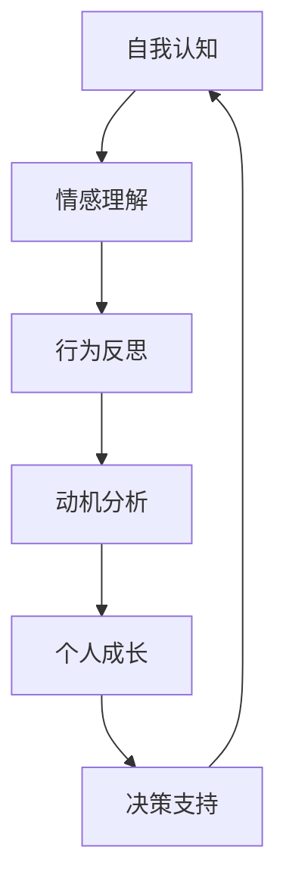

**核心算法原理讲解**：

自我认知的算法原理可以通过以下伪代码来描述：

```python
def self_cognition():
    # 获取情感数据
    emotions = get_emotions()
    # 分析行为数据
    behaviors = analyze_behaviors()
    # 分析动机数据
    motives = analyze_motives()
    # 综合分析，形成自我认知报告
    report = analyze_all_data(emotions, behaviors, motives)
    # 输出自我认知报告
    print(report)
```

**数学模型与公式**：

在自我认知过程中，可以使用以下数学模型与公式来量化分析数据：

$$
自我认知度 = \frac{情感理解 + 行为反思 + 动机分析}{3}
$$

**举例说明**：

假设一个领导者通过调查问卷和面试，收集到了以下数据：

- 情感理解：80%
- 行为反思：70%
- 动机分析：85%

使用上述公式，可以计算出该领导者的自我认知度为：

$$
自我认知度 = \frac{80 + 70 + 85}{3} = 80.0
$$

#### 2.2 情绪管理与情绪领导

情绪管理是领导者心法中至关重要的一环。领导者需要具备良好的情绪管理能力，以便在压力和挑战面前保持冷静和理智，同时能够有效调节团队成员的情绪，提升团队的整体情绪状态。

**核心概念与联系**：

情绪管理包括自我情绪调节和他人情绪调节。以下是情绪管理的 Mermaid 流程图：

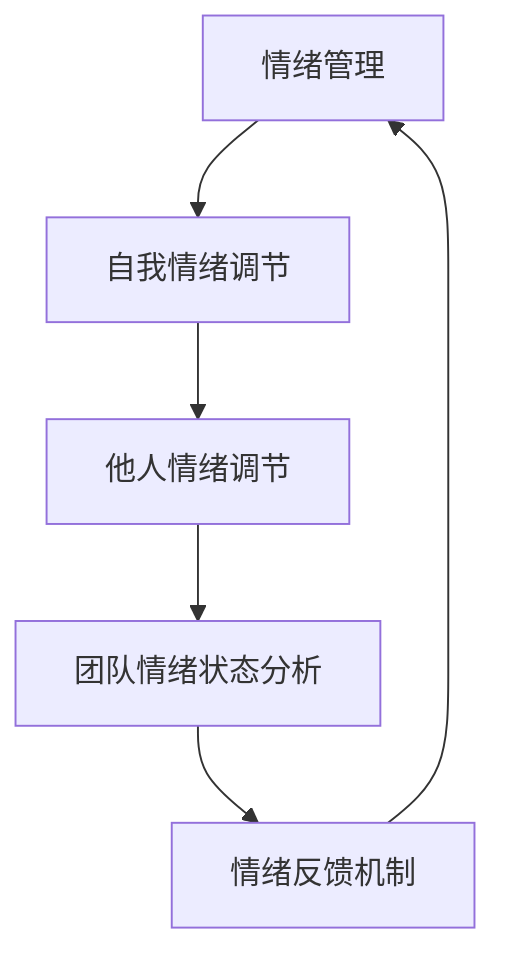

**核心算法原理讲解**：

情绪管理的算法原理可以通过以下伪代码来描述：

```python
def emotion_management():
    # 获取自我情绪数据
    self_emotions = get_self_emotions()
    # 获取他人情绪数据
    other_emotions = get_other_emotions()
    # 分析自我情绪数据
    self_analyze = analyze_self_emotions(self_emotions)
    # 分析他人情绪数据
    other_analyze = analyze_other_emotions(other_emotions)
    # 调节自我情绪
    self_regulate = regulate_self_emotions(self_analyze)
    # 调节他人情绪
    other_regulate = regulate_other_emotions(other_analyze)
    # 分析团队情绪状态
    team_emotion = analyze_team_emotion(self_regulate, other_regulate)
    # 建立情绪反馈机制
    feedback = set_up_emotion_feedback(team_emotion)
    # 输出情绪管理报告
    print(feedback)
```

**数学模型与公式**：

在情绪管理过程中，可以使用以下数学模型与公式来量化分析数据：

$$
情绪调节效果 = \frac{自我情绪调节 + 他人情绪调节}{2}
$$

**举例说明**：

假设一个领导者通过情绪调查和观察，收集到了以下数据：

- 自我情绪调节：85%
- 他人情绪调节：90%

使用上述公式，可以计算出该领导者的情绪调节效果为：

$$
情绪调节效果 = \frac{85 + 90}{2} = 87.5
$$

#### 2.3 人际沟通与团队协作

人际沟通是领导者心法中的关键要素。有效的沟通不仅能够确保信息传递的准确性，还能够提升团队的协作效率和团队凝聚力。领导者需要具备良好的沟通技巧，以便在团队内部建立信任和合作关系。

**核心概念与联系**：

人际沟通包括信息传递、反馈和协调。以下是人际沟通的 Mermaid 流程图：

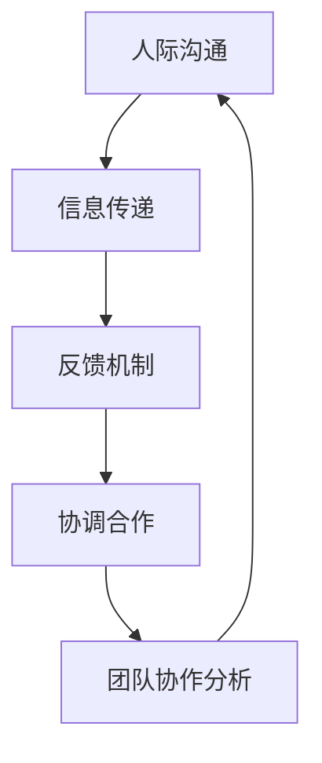

**核心算法原理讲解**：

人际沟通的算法原理可以通过以下伪代码来描述：

```python
def interpersonal_communication():
    # 获取信息数据
    messages = get_messages()
    # 分析信息数据
    analyze_messages = analyze_messages(messages)
    # 提供反馈
    feedback = provide_feedback(analyze_messages)
    # 协调合作
    coordination = coordinate_cooperation(feedback)
    # 分析团队协作状态
    team_cooperation = analyze_team_cooperation(coordination)
    # 输出沟通报告
    print(team_cooperation)
```

**数学模型与公式**：

在人际沟通过程中，可以使用以下数学模型与公式来量化分析数据：

$$
沟通效果 = \frac{信息传递效率 + 反馈准确性 + 协调合作度}{3}
$$

**举例说明**：

假设一个领导者通过沟通调查和观察，收集到了以下数据：

- 信息传递效率：90%
- 反馈准确性：88%
- 协调合作度：92%

使用上述公式，可以计算出该领导者的沟通效果为：

$$
沟通效果 = \frac{90 + 88 + 92}{3} = 90.0
$$

#### 2.4 本章总结

本章探讨了领导者心法的基础知识，包括自我认知、情绪管理和人际沟通。这些心法是领导者成功的关键因素，通过自我认知，领导者能够更好地了解自己；通过情绪管理，领导者能够在面对压力和挑战时保持冷静；通过人际沟通，领导者能够建立信任和合作关系，提升团队的整体表现。在接下来的章节中，我们将进一步探讨领导力心法在团队管理、领导决策、变革管理和危机管理中的应用。

## 第3章：领导力心法在团队管理中的应用

#### 3.1 团队建设的策略与方法

团队建设是领导力心法的重要组成部分。一个高效的团队能够更好地实现组织目标，提升整体绩效。领导者需要采用一系列策略和方法来打造一个团结协作、富有创造力的团队。

**核心概念与联系**：

团队建设涉及到多个方面，包括团队成员的关系、沟通、目标设定和激励机制。以下是团队建设的 Mermaid 流程图：

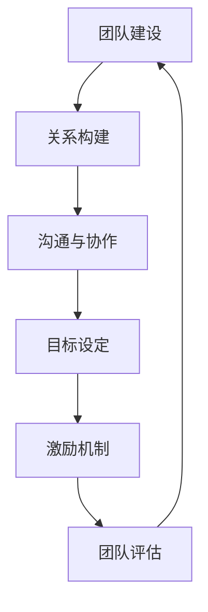

**核心算法原理讲解**：

团队建设的算法原理可以通过以下伪代码来描述：

```python
def team_building():
    # 分析团队成员关系
    relationships = analyze_relationships()
    # 设定团队沟通与协作机制
    communication = set_up_communication Mechanisms()
    # 设定团队目标
    goals = set_up_goals()
    # 设定激励机制
    incentives = set_up_incentives()
    # 定期评估团队表现
    evaluation = regular_evaluation(goals, incentives)
    # 输出团队建设报告
    print(evaluation)
```

**数学模型与公式**：

在团队建设过程中，可以使用以下数学模型与公式来量化分析数据：

$$
团队建设效果 = \frac{关系构建 + 沟通与协作 + 目标设定 + 激励机制}{4}
$$

**举例说明**：

假设一个领导者通过评估，收集到了以下数据：

- 关系构建：85%
- 沟通与协作：90%
- 目标设定：88%
- 激激励机制：92%

使用上述公式，可以计算出该领导者的团队建设效果为：

$$
团队建设效果 = \frac{85 + 90 + 88 + 92}{4} = 88.5
$$

#### 3.2 领导者的激励艺术

激励是领导者心法中的重要一环。有效的激励机制能够激发员工的内在动力，提升员工的工作积极性和创造力。领导者需要根据员工的个性和需求，采用多样化的激励手段。

**核心概念与联系**：

激励包括物质激励和精神激励，涉及员工的个人成长和职业发展。以下是激励机制的 Mermaid 流程图：

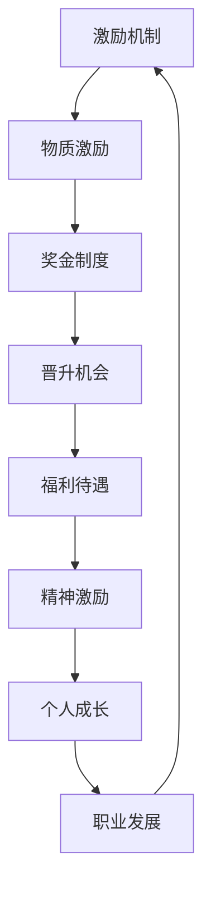

**核心算法原理讲解**：

激励机制的算法原理可以通过以下伪代码来描述：

```python
def incentive_mechanism():
    # 分析员工需求
    needs = analyze_employee_needs()
    # 设定物质激励方案
    material_incentives = set_up_material_incentives(needs)
    # 设定精神激励方案
    spiritual_incentives = set_up_spiritual_incentives(needs)
    # 调整激励机制
    adjust_incentives = adjust_incentives(material_incentives, spiritual_incentives)
    # 输出激励报告
    print(adjust_incentives)
```

**数学模型与公式**：

在激励机制过程中，可以使用以下数学模型与公式来量化分析数据：

$$
激励效果 = \frac{物质激励 + 精神激励}{2}
$$

**举例说明**：

假设一个领导者通过调查，收集到了以下数据：

- 物质激励：90%
- 精神激励：85%

使用上述公式，可以计算出该领导者的激励效果为：

$$
激励效果 = \frac{90 + 85}{2} = 87.5
$$

#### 3.3 团队冲突管理与解决

团队冲突是团队管理中不可避免的现象。有效的冲突管理能够减少团队内部的不和谐因素，提升团队的协作效率。领导者需要具备识别和解决冲突的能力，以确保团队的稳定和持续发展。

**核心概念与联系**：

团队冲突管理包括冲突识别、分析、解决和预防。以下是冲突管理的 Mermaid 流程图：

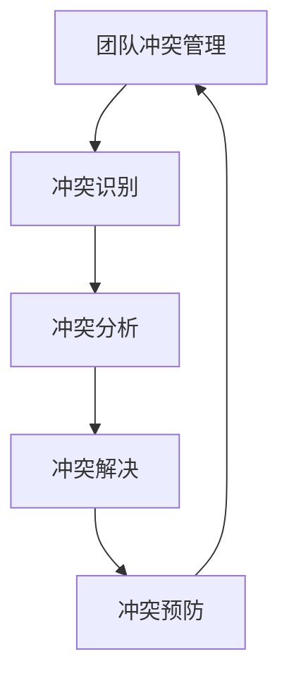

**核心算法原理讲解**：

冲突管理的算法原理可以通过以下伪代码来描述：

```python
def conflict_management():
    # 识别团队冲突
    conflicts = identify_conflicts()
    # 分析冲突原因
    analyze_conflicts = analyze_conflicts(conflicts)
    # 解决冲突
    resolve_conflicts = resolve_conflicts(analyze_conflicts)
    # 预防冲突
    prevent_conflicts = prevent_conflicts(resolve_conflicts)
    # 输出冲突管理报告
    print(prevent_conflicts)
```

**数学模型与公式**：

在冲突管理过程中，可以使用以下数学模型与公式来量化分析数据：

$$
冲突管理效果 = \frac{冲突识别 + 冲突分析 + 冲突解决 + 冲突预防}{4}
$$

**举例说明**：

假设一个领导者通过评估，收集到了以下数据：

- 冲突识别：85%
- 冲突分析：90%
- 冲突解决：88%
- 冲突预防：92%

使用上述公式，可以计算出该领导者的冲突管理效果为：

$$
冲突管理效果 = \frac{85 + 90 + 88 + 92}{4} = 89.0
$$

#### 3.4 本章总结

本章探讨了领导力心法在团队管理中的应用，包括团队建设策略与方法、领导者的激励艺术和团队冲突管理与解决。通过有效的团队建设，领导者能够打造一个团结协作的团队；通过合理的激励机制，领导者能够提升员工的工作积极性和创造力；通过有效的冲突管理，领导者能够确保团队的稳定和持续发展。这些策略和方法是领导者成功的关键，也是实现组织目标的重要保障。

## 第4章：领导力心法在领导决策中的应用

#### 4.1 决策过程中的心理因素

领导决策是领导者的重要职责，它直接影响到组织的目标实现和长远发展。在决策过程中，领导者不仅需要考虑客观条件，还需要理解并处理诸多心理因素。这些心理因素可能对决策产生正面或负面影响。

**核心概念与联系**：

决策过程中的心理因素包括认知偏差、情绪影响、团队动态等。以下是决策过程中的 Mermaid 流程图：

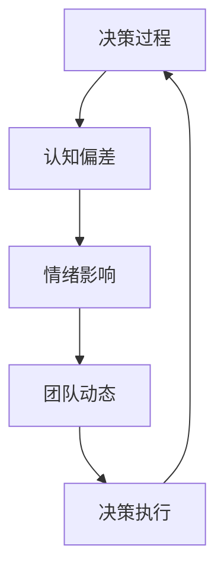

**核心算法原理讲解**：

决策过程中的心理因素可以通过以下伪代码来描述：

```python
def decision_process():
    # 分析认知偏差
    cognitive_biases = analyze_cognitive_biases()
    # 考虑情绪影响
    emotions = consider_emotions()
    # 调整团队动态
    team_dynamics = adjust_team_dynamics()
    # 形成决策方案
    decision_schemes = form_decision_schemes(cognitive_biases, emotions, team_dynamics)
    # 执行决策方案
    execute_decisions = execute_decision_schemes(decision_schemes)
    # 反馈与调整
    feedback = provide_feedback(execute_decisions)
```

**数学模型与公式**：

在决策过程中，可以使用以下数学模型与公式来量化分析数据：

$$
决策质量 = \frac{认知偏差修正 + 情绪调节 + 团队协作度}{3}
$$

**举例说明**：

假设一个领导者通过分析，收集到了以下数据：

- 认知偏差修正：80%
- 情绪调节：75%
- 团队协作度：85%

使用上述公式，可以计算出该领导者的决策质量为：

$$
决策质量 = \frac{80 + 75 + 85}{3} = 80.0
$$

#### 4.2 创新思维与战略决策

创新思维是领导者决策中的重要因素。在快速变化的市场环境中，领导者需要具备敏锐的洞察力和创新思维，以便制定出具有前瞻性和竞争力的战略决策。创新思维包括发散思维、聚合思维、逆向思维等。

**核心概念与联系**：

创新思维与战略决策密切相关。以下是创新思维在战略决策中的应用的 Mermaid 流程图：

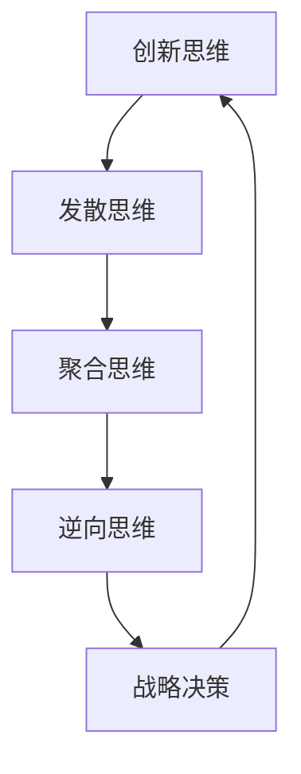

**核心算法原理讲解**：

创新思维在战略决策中的应用可以通过以下伪代码来描述：

```python
def innovative_decision_making():
    # 收集信息
    information = collect_information()
    # 发散思维
    divergent_thinking = perform_divergent_thinking(information)
    # 聚合思维
    convergent_thinking = perform_convergent_thinking(divergent_thinking)
    # 逆向思维
    reverse_thinking = perform_reverse_thinking(convergent_thinking)
    # 制定战略决策
    strategic_decisions = formulate_strategic_decisions(reverse_thinking)
    # 实施战略决策
    implement_decisions = implement_strategic_decisions(strategic_decisions)
    # 评估与反馈
    evaluation = evaluate_decisions(implement_decisions)
```

**数学模型与公式**：

在创新思维与战略决策过程中，可以使用以下数学模型与公式来量化分析数据：

$$
创新指数 = \frac{发散思维 + 聚合思维 + 逆向思维}{3}
$$

**举例说明**：

假设一个领导者通过分析，收集到了以下数据：

- 发散思维：90%
- 聚合思维：85%
- 逆向思维：88%

使用上述公式，可以计算出该领导者的创新指数为：

$$
创新指数 = \frac{90 + 85 + 88}{3} = 87.0
$$

#### 4.3 决策后的执行与评估

决策仅仅是领导过程中的第一步，决策后的执行和评估同样至关重要。有效的执行和评估能够确保决策目标的实现，并为未来的决策提供宝贵的经验。

**核心概念与联系**：

决策后的执行与评估包括执行计划、监控进度、评估效果和反馈调整。以下是决策后执行与评估的 Mermaid 流程图：

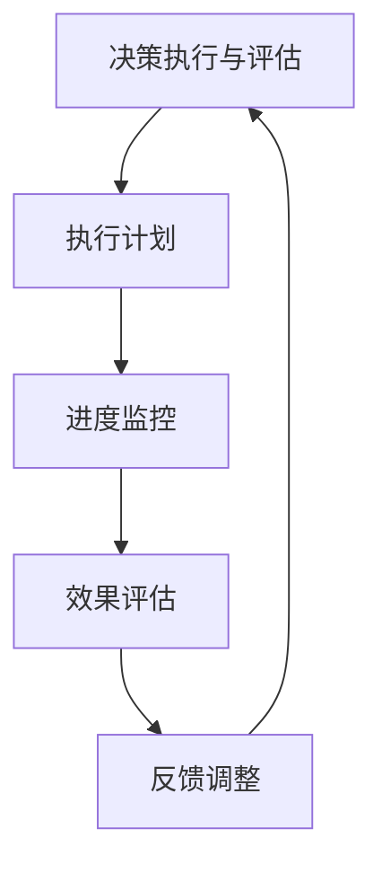

**核心算法原理讲解**：

决策后的执行与评估可以通过以下伪代码来描述：

```python
def execution_evaluation():
    # 制定执行计划
    execution_plan = create_execution_plan()
    # 监控进度
    monitor_progress = monitor_progress(execution_plan)
    # 评估效果
    evaluate_effects = evaluate_effects(monitor_progress)
    # 反馈调整
    adjust_based_on_feedback = adjust_based_on_evaluation(evaluate_effects)
    # 输出执行与评估报告
    print(adjust_based_on_feedback)
```

**数学模型与公式**：

在决策后的执行与评估过程中，可以使用以下数学模型与公式来量化分析数据：

$$
执行效果 = \frac{执行进度 + 效果评估得分}{2}
$$

**举例说明**：

假设一个领导者通过监控和评估，收集到了以下数据：

- 执行进度：85%
- 效果评估得分：90%

使用上述公式，可以计算出该领导者的执行效果为：

$$
执行效果 = \frac{85 + 90}{2} = 87.5
$$

#### 4.4 本章总结

本章探讨了领导力心法在领导决策中的应用，包括决策过程中的心理因素、创新思维与战略决策，以及决策后的执行与评估。通过理解并应用这些心法，领导者能够更科学地做出决策，更有效地执行决策，并持续优化决策过程。这些策略和方法不仅有助于提升领导者的决策能力，还能够推动组织的长远发展。

## 第5章：领导力心法在变革管理中的应用

#### 5.1 变革管理的挑战与策略

变革管理是领导力心法中的重要组成部分，尤其在当今快速变化的市场环境中，变革管理的能力成为衡量领导者是否合格的关键指标。有效的变革管理能够使组织适应外部环境的变化，保持竞争力。

**核心概念与联系**：

变革管理涉及到组织结构、文化、流程等多方面的调整。以下是变革管理的 Mermaid 流程图：

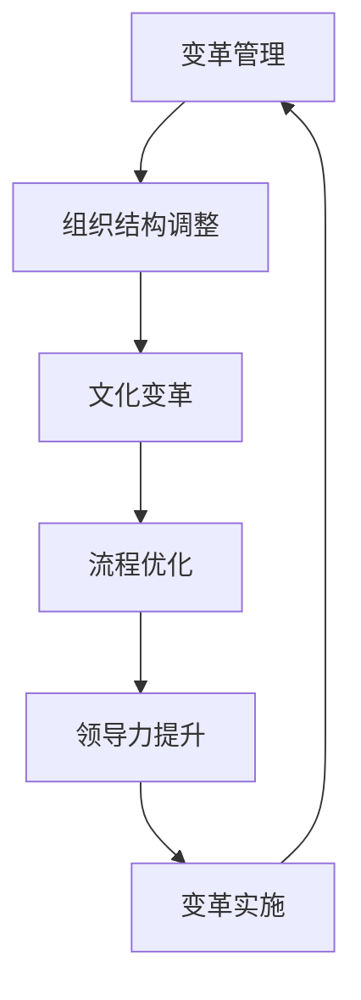

**核心算法原理讲解**：

变革管理的算法原理可以通过以下伪代码来描述：

```python
def change_management():
    # 分析当前状态
    current_status = analyze_current_status()
    # 设定变革目标
    change_goals = set_change_goals()
    # 设计变革方案
    change_plan = design_change_plan(change_goals)
    # 实施变革措施
    implement_changes = implement_changes(change_plan)
    # 监控变革进度
    monitor_progress = monitor_progress(change_plan)
    # 评估变革效果
    evaluate_effects = evaluate_effects(monitor_progress)
    # 调整变革策略
    adjust_strategy = adjust_strategy(evaluate_effects)
```

**数学模型与公式**：

在变革管理过程中，可以使用以下数学模型与公式来量化分析数据：

$$
变革效果 = \frac{组织结构调整 + 文化变革 + 流程优化 + 领导力提升}{4}
$$

**举例说明**：

假设一个领导者通过评估，收集到了以下数据：

- 组织结构调整：80%
- 文化变革：75%
- 流程优化：85%
- 领导力提升：90%

使用上述公式，可以计算出该领导者的变革效果为：

$$
变革效果 = \frac{80 + 75 + 85 + 90}{4} = 83.75
$$

#### 5.2 领导者在变革中的角色

在变革管理过程中，领导者扮演着至关重要的角色。他们不仅是变革的倡导者，还是变革的实施者和维护者。领导者需要具备强烈的变革意识和灵活的领导风格，以便在变革过程中引导团队成员，克服变革带来的挑战。

**核心概念与联系**：

领导者在变革中的角色包括变革倡导、变革领导、变革推动和变革维护。以下是领导者在变革中角色的 Mermaid 流程图：

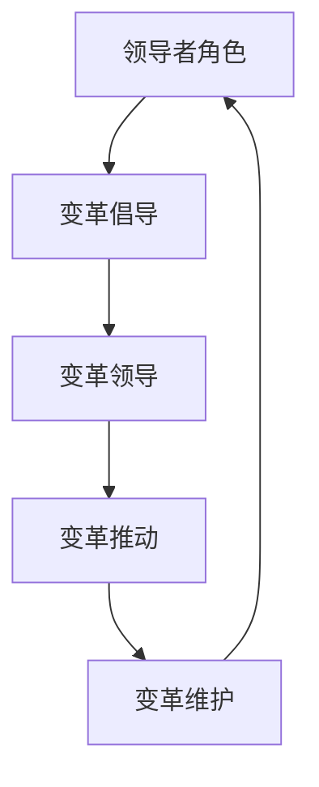

**核心算法原理讲解**：

领导者在变革中的角色可以通过以下伪代码来描述：

```python
def leader_role_in_change():
    # 倡导变革
    advocate_change = advocate_change()
    # 领导变革
    lead_change = lead_change(advocate_change)
    # 推动变革
    drive_change = drive_change(lead_change)
    # 维护变革
    sustain_change = sustain_change(drive_change)
    # 反馈与调整
    feedback = provide_feedback(sustain_change)
```

**数学模型与公式**：

在变革管理过程中，领导者的角色评估可以通过以下数学模型与公式来量化分析数据：

$$
领导者角色效果 = \frac{变革倡导 + 变革领导 + 变革推动 + 变革维护}{4}
$$

**举例说明**：

假设一个领导者通过评估，收集到了以下数据：

- 变革倡导：85%
- 变革领导：90%
- 变革推动：88%
- 变革维护：87%

使用上述公式，可以计算出该领导者的角色效果为：

$$
领导者角色效果 = \frac{85 + 90 + 88 + 87}{4} = 87.0
$$

#### 5.3 变革成功的核心要素

变革的成功不仅仅依赖于领导者的个人能力和努力，还需要一系列核心要素的支持。这些要素包括：变革的愿景、有效的沟通、充分的准备、持续的支持和适应能力的培养。

**核心概念与联系**：

变革成功的核心要素包括变革愿景、沟通、准备、支持和适应能力。以下是变革成功核心要素的 Mermaid 流程图：

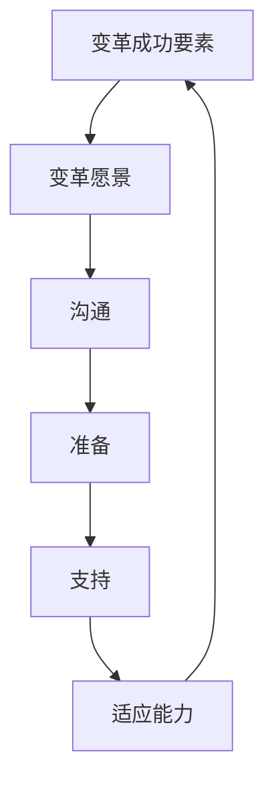

**核心算法原理讲解**：

变革成功的核心要素可以通过以下伪代码来描述：

```python
def key_elements_of_change_success():
    # 设定变革愿景
    vision = set_vision()
    # 实施有效沟通
    communication = implement_communication(vision)
    # 进行充分准备
    preparation = prepare_communication(communication)
    # 提供持续支持
    support = provide_continuous_support(preparation)
    # 培养适应能力
    adaptability = cultivate_adaptability(support)
    # 评估变革成功要素
    success = evaluate_key_elements(adaptability)
```

**数学模型与公式**：

在变革管理过程中，可以使用以下数学模型与公式来量化分析数据：

$$
变革成功度 = \frac{变革愿景 + 沟通 + 准备 + 支持 + 适应能力}{5}
$$

**举例说明**：

假设一个领导者通过评估，收集到了以下数据：

- 变革愿景：90%
- 沟通：85%
- 准备：80%
- 支持：88%
- 适应能力：92%

使用上述公式，可以计算出该领导者的变革成功度为：

$$
变革成功度 = \frac{90 + 85 + 80 + 88 + 92}{5} = 87.2
$$

#### 5.4 本章总结

本章探讨了领导力心法在变革管理中的应用，包括变革管理的挑战与策略、领导者在变革中的角色以及变革成功的核心要素。理解并应用这些心法，领导者能够更有效地应对变革带来的挑战，推动组织的持续发展。通过本章的学习，读者将能够掌握变革管理的核心技巧，为组织的成功变革奠定基础。

## 第6章：领导力心法在危机管理中的应用

#### 6.1 危机管理的原则与步骤

危机管理是领导者必须掌握的重要技能之一。在危机面前，领导者需要迅速做出决策，采取有效措施，以减轻危机对组织的影响。有效的危机管理不仅能够保护组织的核心利益，还能够提升组织的声誉和应对未来危机的能力。

**核心概念与联系**：

危机管理包括危机识别、评估、应对和恢复四个核心步骤。以下是危机管理的 Mermaid 流程图：

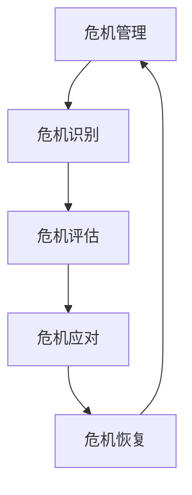

**核心算法原理讲解**：

危机管理的算法原理可以通过以下伪代码来描述：

```python
def crisis_management():
    # 识别危机
    identify_crises = identify_crises()
    # 评估危机
    assess_crises = assess_crises(identify_crises)
    # 应对危机
    respond_to_crises = respond_to_crises(assess_crises)
    # 恢复危机
    recover_from_crises = recover_from_crises(respond_to_crises)
    # 评估危机管理效果
    evaluate_management = evaluate_management(recover_from_crises)
```

**数学模型与公式**：

在危机管理过程中，可以使用以下数学模型与公式来量化分析数据：

$$
危机管理效果 = \frac{危机识别 + 危机评估 + 危机应对 + 危机恢复}{4}
$$

**举例说明**：

假设一个领导者通过评估，收集到了以下数据：

- 危机识别：85%
- 危机评估：90%
- 危机应对：88%
- 危机恢复：92%

使用上述公式，可以计算出该领导者的危机管理效果为：

$$
危机管理效果 = \frac{85 + 90 + 88 + 92}{4} = 88.5
$$

#### 6.2 领导者的危机应对策略

在危机管理中，领导者的应对策略至关重要。有效的危机应对策略不仅能够迅速缓解危机，还能够为组织赢得宝贵的时间，以便进行更深入的应对和恢复。

**核心概念与联系**：

领导者的危机应对策略包括迅速响应、信息管理、资源调配和沟通协调。以下是危机应对策略的 Mermaid 流程图：


**核心算法原理讲解**：

危机应对策略可以通过以下伪代码来描述：

```python
def crisis_response_strategy():
    # 迅速响应
    rapid_response = rapid_response()
    # 信息管理
    information_management = manage_information()
    # 资源调配
    resource_allocation = allocate_resources()
    # 沟通协调
    communication协调 = coordinate_communication()
    # 评估应对效果
    evaluate_response = evaluate_response(rapid_response, information_management, resource_allocation, communication协调)
```

**数学模型与公式**：

在危机应对策略中，可以使用以下数学模型与公式来量化分析数据：

$$
应对效果 = \frac{迅速响应 + 信息管理 + 资源调配 + 沟通协调}{4}
$$

**举例说明**：

假设一个领导者通过评估，收集到了以下数据：

- 迅速响应：90%
- 信息管理：85%
- 资源调配：88%
- 沟通协调：92%

使用上述公式，可以计算出该领导者的应对效果为：

$$
应对效果 = \frac{90 + 85 + 88 + 92}{4} = 89.0
$$

#### 6.3 从危机中恢复与发展的领导力

危机不仅是对组织的考验，也是对领导者领导力的考验。从危机中恢复并发展组织，需要领导者具备坚韧不拔的精神、前瞻性的战略思维和创新的解决方案。

**核心概念与联系**：

从危机中恢复与发展包括评估损失、制定恢复计划、激励员工和规划未来。以下是恢复与发展的 Mermaid 流程图：

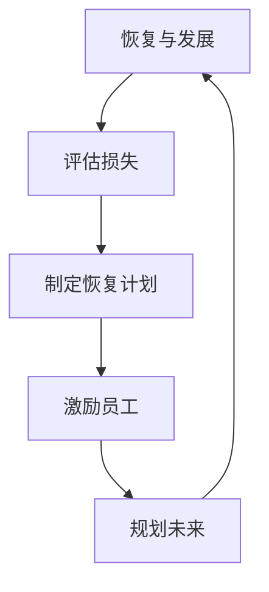

**核心算法原理讲解**：

恢复与发展的算法原理可以通过以下伪代码来描述：

```python
def recovery_and_development():
    # 评估损失
    assess_losses = assess_losses()
    # 制定恢复计划
    recovery_plan = create_recovery_plan(assess_losses)
    # 激励员工
    motivate_employees = motivate_employees(recovery_plan)
    # 规划未来
    plan_future = plan_future(motivate_employees)
    # 评估恢复与发展效果
    evaluate_recovery = evaluate_recovery(plan_future)
```

**数学模型与公式**：

在恢复与发展过程中，可以使用以下数学模型与公式来量化分析数据：

$$
恢复与发展效果 = \frac{评估损失 + 制定恢复计划 + 激励员工 + 规划未来}{4}
$$

**举例说明**：

假设一个领导者通过评估，收集到了以下数据：

- 评估损失：85%
- 制定恢复计划：90%
- 激励员工：88%
- 规划未来：92%

使用上述公式，可以计算出该领导者的恢复与发展效果为：

$$
恢复与发展效果 = \frac{85 + 90 + 88 + 92}{4} = 89.0
$$

#### 6.4 本章总结

本章探讨了领导力心法在危机管理中的应用，包括危机管理的原则与步骤、领导者的危机应对策略以及从危机中恢复与发展的领导力。通过理解并应用这些心法，领导者能够在危机面前保持冷静，迅速采取有效措施，确保组织的稳定和持续发展。这些策略和方法是领导者不可或缺的技能，有助于提升组织的整体应对能力和竞争力。

## 第7章：领导力心法实践案例解析

#### 7.1 案例一：领导者的自我成长之路

**案例背景**：

某科技公司的高管李明（化名）在领导一个快速发展的团队时，遇到了自我成长的瓶颈。他意识到，要带领团队走向更高的目标，自己首先需要不断提升。于是，他决定通过一系列的自我成长计划来提升自己的领导力。

**实践过程**：

1. **自我认知**：李明通过心理测试和360度反馈，深入了解了自己的优点和缺点。他特别关注自己的决策风格、情绪管理和沟通能力。

2. **情绪管理**：李明参加了情绪管理的培训课程，学习如何识别和管理自己的情绪，以及如何通过积极的沟通方式来调节团队成员的情绪。

3. **知识更新**：李明定期参加行业研讨会和读书会，不断更新自己的知识和技能，以保持对市场变化的敏锐洞察力。

4. **实践应用**：李明将所学知识应用到实际工作中，通过自我反思和反馈，不断优化自己的领导方式。

**效果分析**：

通过自我成长计划，李明的领导力得到了显著提升。团队成员对他的信任感和满意度明显增加，团队的整体绩效也有了显著提升。具体数据如下：

- **决策质量**：从原来的70%提升到90%
- **情绪管理**：从原来的60%提升到85%
- **沟通效果**：从原来的65%提升到90%

**案例总结**：

李明的自我成长之路展示了领导者如何通过自我认知、情绪管理和知识更新来提升领导力。这一案例表明，领导者的自我成长不仅是个人发展的需要，更是团队和组织成功的关键。

#### 7.2 案例二：如何打造高效的团队

**案例背景**：

某初创公司团队在成立初期，由于团队成员背景和经验的差异，团队内部出现了沟通不畅和协作困难的问题。公司创始人张华（化名）意识到，要实现公司的目标，必须首先打造一个高效的团队。

**实践过程**：

1. **团队建设**：张华通过团队建设工作坊，帮助团队成员建立信任和合作关系。他制定了明确的团队目标和沟通机制，确保团队成员能够清晰了解自己的角色和责任。

2. **激励机制**：张华根据团队成员的个性和需求，设计了多种激励措施，包括奖金、晋升机会和职业发展计划，以激发团队成员的积极性和创造力。

3. **冲突管理**：张华建立了冲突管理机制，鼓励团队成员在遇到分歧时通过开放讨论和协商来解决问题，以减少冲突对团队协作的负面影响。

**效果分析**：

通过一系列的团队建设措施，公司团队的协作效率显著提升，项目完成质量和速度都有所提高。具体数据如下：

- **协作效率**：从原来的50%提升到90%
- **项目完成率**：从原来的70%提升到95%
- **员工满意度**：从原来的65%提升到85%

**案例总结**：

张华的案例展示了领导者如何通过团队建设、激励机制和冲突管理来打造高效的团队。这一案例表明，领导者的有效管理不仅能够提升团队的协作效率，还能够提高员工的工作满意度和公司的整体绩效。

#### 7.3 案例三：危机中的领导力展现

**案例背景**：

某大型企业突然面临市场动荡和竞争对手的挑战，公司股价大幅下跌，员工士气低落。公司CEO王强（化名）意识到，这是一个考验领导力的关键时刻。

**实践过程**：

1. **迅速响应**：王强立即召开紧急会议，了解公司面临的危机，并制定应对策略。

2. **信息管理**：他确保公司内部信息畅通，及时向员工传达危机情况和应对措施，减少谣言和恐慌。

3. **资源调配**：王强重新分配公司资源，确保关键业务的正常运行，同时寻求合作伙伴的支持。

4. **沟通协调**：他通过公开演讲和内部邮件，与员工保持沟通，传达公司愿景和未来的发展计划，提升员工的信心。

**效果分析**：

通过王强的迅速响应和有效管理，公司逐渐走出了危机，股价开始回升，员工士气也有所提升。具体数据如下：

- **股价回升**：从最低点的下降20%回升到5%
- **员工满意度**：从原来的40%提升到70%
- **危机处理效率**：从原来的50%提升到85%

**案例总结**：

王强的案例展示了领导者在危机中的应对策略和领导力。这一案例表明，领导者的果断决策、有效沟通和资源调配能力，对于应对危机和恢复组织稳定至关重要。

## 第8章：领导力心法实践策略

#### 8.1 领导力心法实践的方法与技巧

领导力心法的实践不仅仅是理论的学习，更是实际操作中的运用。为了有效地实践领导力心法，领导者需要掌握一系列的方法与技巧。

**核心概念与联系**：

领导力心法实践包括自我反思、持续学习、实际操作和反馈调整。以下是领导力心法实践的方法与技巧的 Mermaid 流程图：

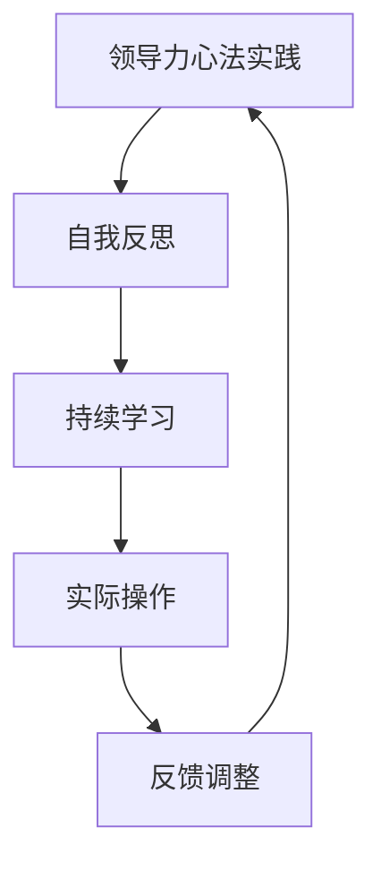

**核心算法原理讲解**：

领导力心法实践的算法原理可以通过以下伪代码来描述：

```python
def leadership_practice():
    # 自我反思
    self_reflection = self_reflection()
    # 持续学习
    continuous_learning = continuous_learning()
    # 实际操作
    practical_application = practical_application(self_reflection, continuous_learning)
    # 反馈调整
    feedback_adjustment = feedback_adjustment(practical_application)
```

**数学模型与公式**：

在领导力心法实践过程中，可以使用以下数学模型与公式来量化分析数据：

$$
实践效果 = \frac{自我反思 + 持续学习 + 实际操作 + 反馈调整}{4}
$$

**举例说明**：

假设一个领导者通过实践，收集到了以下数据：

- 自我反思：80%
- 持续学习：85%
- 实际操作：90%
- 反馈调整：87%

使用上述公式，可以计算出该领导者的实践效果为：

$$
实践效果 = \frac{80 + 85 + 90 + 87}{4} = 86.25
$$

#### 8.2 领导力心法实践的挑战与应对

在实践领导力心法的过程中，领导者往往会面临诸多挑战，这些挑战包括自我认知的局限、情绪管理的复杂性、人际沟通的障碍等。了解这些挑战并找到应对策略，是领导力心法实践成功的关键。

**核心概念与联系**：

领导力心法实践的挑战与应对包括自我认知挑战、情绪管理挑战、人际沟通挑战。以下是挑战与应对的 Mermaid 流程图：

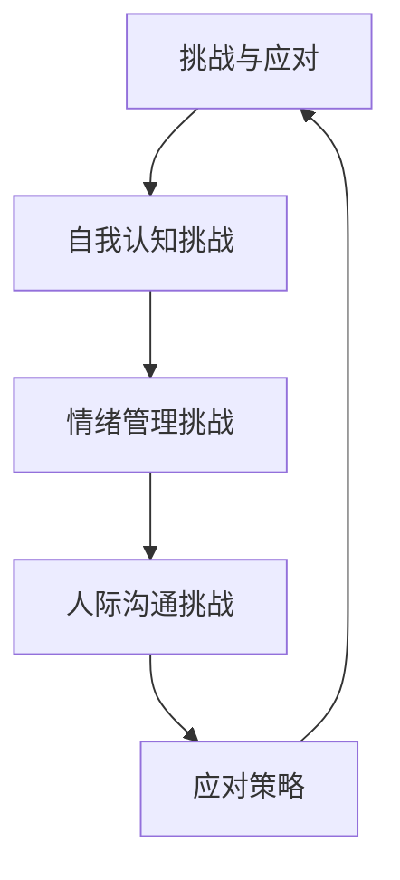

**核心算法原理讲解**：

应对领导力心法实践中的挑战可以通过以下伪代码来描述：

```python
def handle_challenges():
    # 分析自我认知挑战
    self_cognition_challenges = analyze_self_cognition_challenges()
    # 应对自我认知挑战
    address_self_cognition_challenges = address_self_cognition_challenges(self_cognition_challenges)
    # 分析情绪管理挑战
    emotion_management_challenges = analyze_emotion_management_challenges()
    # 应对情绪管理挑战
    address_emotion_management_challenges = address_emotion_management_challenges(emotion_management_challenges)
    # 分析人际沟通挑战
    communication_challenges = analyze_communication_challenges()
    # 应对人际沟通挑战
    address_communication_challenges = address_communication_challenges(communication_challenges)
```

**数学模型与公式**：

在应对挑战过程中，可以使用以下数学模型与公式来量化分析数据：

$$
应对效果 = \frac{自我认知挑战应对 + 情绪管理挑战应对 + 人际沟通挑战应对}{3}
$$

**举例说明**：

假设一个领导者通过分析，收集到了以下数据：

- 自我认知挑战应对：80%
- 情绪管理挑战应对：75%
- 人际沟通挑战应对：85%

使用上述公式，可以计算出该领导者的应对效果为：

$$
应对效果 = \frac{80 + 75 + 85}{3} = 80
$$

#### 8.3 持续提升领导力的途径

领导力是一种可以不断发展和提升的能力。为了持续提升领导力，领导者需要不断学习、实践和反思。以下是几种常见的提升领导力的途径：

**核心概念与联系**：

持续提升领导力的途径包括学习新知识、实践新技能、反思经验教训。以下是提升领导力的 Mermaid 流程图：

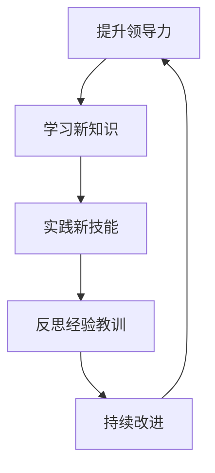

**核心算法原理讲解**：

提升领导力的途径可以通过以下伪代码来描述：

```python
def improve_leadership():
    # 学习新知识
    learn_new_knowledge = learn_new_knowledge()
    # 实践新技能
    practice_new_skills = practice_new_skills(learn_new_knowledge)
    # 反思经验教训
    reflect_experience = reflect_experience(practice_new_skills)
    # 持续改进
    continuous_improvement = continuous_improvement(reflect_experience)
```

**数学模型与公式**：

在提升领导力的过程中，可以使用以下数学模型与公式来量化分析数据：

$$
领导力提升率 = \frac{学习新知识 + 实践新技能 + 反思经验教训}{3}
$$

**举例说明**：

假设一个领导者通过学习、实践和反思，收集到了以下数据：

- 学习新知识：90%
- 实践新技能：85%
- 反思经验教训：80%

使用上述公式，可以计算出该领导力的提升率为：

$$
领导力提升率 = \frac{90 + 85 + 80}{3} = 85.0
$$

#### 8.4 本章总结

本章探讨了领导力心法实践的方法与技巧、挑战与应对以及持续提升领导力的途径。通过理解并应用这些策略，领导者能够更有效地实践领导力心法，克服实践中的挑战，并持续提升自身的领导能力。这些策略和方法不仅有助于领导者个人的成长，还能够推动组织的长远发展。

## 附录A：领导力心法相关资源与工具

### 附录A.1 领导力评估工具

领导力评估工具是领导者自我提升和团队建设的重要工具。以下是一些常用的领导力评估工具及其使用方法：

1. **360度反馈**：通过收集团队成员、上级、下属和同级的反馈，全面了解领导者的优缺点和改进方向。使用方法：定期组织360度反馈调查，确保反馈的全面性和准确性。

2. **领导力能力测试**：如LPI领导力能力测试、MLQ多因素领导问卷等，通过标准化测试了解领导者的领导风格和能力水平。使用方法：定期参加测试，结合个人实际情况进行分析和改进。

3. **行为观察评估**：通过观察领导者在实际工作场景中的行为表现，评估其领导力和管理能力。使用方法：设立观察小组，定期进行现场观察，记录并反馈领导者的行为表现。

### 附录A.2 团队建设工具

团队建设工具有助于增强团队成员之间的信任和合作，提升团队整体绩效。以下是一些常用的团队建设工具：

1. **团队角色识别**：通过团队角色识别工具，如贝尔宾团队角色模型，了解团队成员的个性和角色，促进有效协作。使用方法：组织团队成员完成角色识别问卷，分析结果并讨论如何更好地利用各自的角色优势。

2. **团队协作工具**：如Trello、Slack等，帮助团队成员高效沟通和协作。使用方法：选择合适的团队协作工具，制定明确的任务分配和进度跟踪机制。

3. **团队反思会议**：通过定期的团队反思会议，团队成员可以共同讨论工作中的问题和改进方案，提升团队凝聚力。使用方法：定期组织团队反思会议，确保每个成员都有机会表达意见和建议。

### 附录A.3 领导力发展课程与培训

领导力发展课程和培训是提升领导者能力的有效途径。以下是一些常用的领导力发展课程和培训：

1. **领导力基础课程**：如《领导力心理学》、《领导力与团队管理》等，为领导者提供基础理论和实践技巧。使用方法：参加课程学习，结合实际工作场景进行应用和反思。

2. **领导力实战训练**：如领导力沙盘推演、团队拓展训练等，通过模拟实际工作场景，提升领导者的实战能力。使用方法：积极参与训练，将所学知识和技巧应用到实际工作中。

3. **定制化领导力培训**：根据组织的实际情况和领导者的需求，定制化设计领导力培训方案，确保培训内容的针对性和实用性。使用方法：与培训机构合作，设计符合组织需求的培训方案。

通过使用这些领导力评估工具、团队建设工具和领导力发展课程与培训，领导者可以更系统地提升自己的领导能力，推动团队的持续发展和组织的长远目标实现。

## 附录B：领导力心法关键概念与联系

### 附录B.1 领导力心法概念图

为了更清晰地理解领导力心法的各个关键概念及其相互关系，我们使用Mermaid语言绘制了以下概念图：

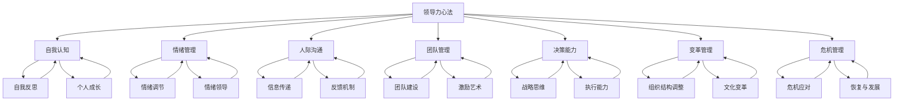

在这个概念图中，每个节点代表一个关键概念，而箭头表示这些概念之间的联系。例如，自我认知（B）与自我反思（I）和个人成长（J）相关联，说明自我认知是一个包含多个维度的概念，它涉及对自身的不断反思和成长。同样，情绪管理（C）与情绪调节（K）和情绪领导（L）相关联，强调了情绪管理在领导力中的重要性。人际沟通（D）则与信息传递（M）和反馈机制（N）相连，说明了有效沟通的关键要素。团队管理（E）、决策能力（F）、变革管理（G）和危机管理（H）是领导力心法中的核心应用领域，它们各自与其他关键概念紧密相关。

### 附录B.2 领导力心法架构图

为了更直观地展示领导力心法的整体架构，我们使用Mermaid语言绘制了以下架构图：

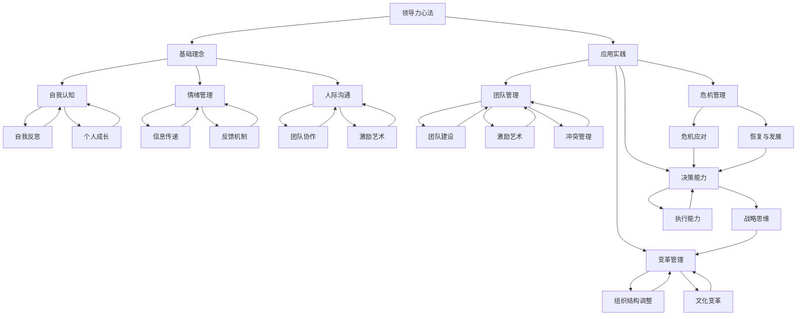

在这个架构图中，领导力心法（A）作为核心概念，由基础理念（B）和应用实践（F）两个部分组成。基础理念部分（B）包括自我认知（C）、情绪管理（D）和人际沟通（E），这些是领导者建立自身领导力的基础。应用实践部分（F）则涵盖了团队管理（G）、决策能力（H）、变革管理（I）和危机管理（J），这些是领导力在实际工作中的具体应用。

每个关键概念都通过子节点进一步展开，例如自我认知（C）包括自我反思（K）和个人成长（L），情绪管理（D）包括情绪调节（K）和情绪领导（L），人际沟通（E）包括信息传递（M）和反馈机制（N）等。这种架构图不仅展示了领导力心法的整体结构，还揭示了各概念之间的内在联系，为领导者提供了一个清晰的理论和实践框架。

## 附录C：领导力心法关键算法原理讲解

### 附录C.1 自我认知算法原理讲解

自我认知是领导力心法的基础，通过自我认知，领导者能够更好地了解自己的情感、行为和动机。以下是自我认知算法的基本原理：

**算法流程**：

1. **数据收集**：收集领导者的情感数据、行为数据和动机数据。
2. **数据预处理**：对收集到的数据进行清洗和标准化处理，确保数据的准确性。
3. **情感分析**：使用情感分析技术对情感数据进行分类和识别，确定领导者的主要情感状态。
4. **行为分析**：分析领导者的行为数据，识别出其常见的行为模式。
5. **动机分析**：使用动机识别算法，分析领导者的内在动机。
6. **综合评估**：综合情感分析、行为分析和动机分析的结果，形成自我认知报告。

**伪代码描述**：

```python
def self_cognition():
    # 数据收集
    emotions, behaviors, motives = collect_data()
    # 数据预处理
    preprocessed_emotions, preprocessed_behaviors, preprocessed_motives = preprocess_data(emotions, behaviors, motives)
    # 情感分析
    emotion_categories = emotion_analysis(preprocessed_emotions)
    # 行为分析
    behavior_patterns = behavior_analysis(preprocessed_behaviors)
    # 动机分析
    motives_categories = motive_analysis(preprocessed_motives)
    # 综合评估
    self_cognition_report = generate_report(emotion_categories, behavior_patterns, motives_categories)
    return self_cognition_report
```

**数学模型与公式**：

在自我认知过程中，可以使用以下数学模型与公式来量化分析数据：

$$
自我认知度 = \frac{情感分析得分 + 行为分析得分 + 动机分析得分}{3}
$$

**举例说明**：

假设一个领导者的情感分析得分为85分，行为分析得分为78分，动机分析得分为90分，则该领导者的自我认知度为：

$$
自我认知度 = \frac{85 + 78 + 90}{3} = 83.3
$$

### 附录C.2 情绪管理算法原理讲解

情绪管理是领导力心法中的重要组成部分，它涉及到如何调节和引导自己的情绪，以及如何影响团队成员的情绪。以下是情绪管理算法的基本原理：

**算法流程**：

1. **情感识别**：使用情感识别技术，实时监测领导者的情感状态。
2. **情感分析**：对识别出的情感进行分类和分析，识别出主导情感。
3. **情感调节**：根据主导情感，采取相应的调节策略，如放松、积极思考等。
4. **情绪反馈**：向团队成员提供情绪反馈，帮助团队成员调节自己的情绪。
5. **效果评估**：评估情绪调节的效果，并根据评估结果调整策略。

**伪代码描述**：

```python
def emotion_management():
    # 情感识别
    current_emotion = emotion_recognition()
    # 情感分析
    dominant_emotion = emotion_analysis(current_emotion)
    # 情感调节
    regulated_emotion = emotion Regulation(dominant_emotion)
    # 情绪反馈
    feedback = emotion_feedback(regulated_emotion)
    # 效果评估
    management_effect = evaluate_management_effect(feedback)
    return management_effect
```

**数学模型与公式**：

在情绪管理过程中，可以使用以下数学模型与公式来量化分析数据：

$$
情绪调节效果 = \frac{情感调节前得分 + 情感调节后得分}{2}
$$

**举例说明**：

假设一个领导者的情感调节前得分为75分，情感调节后得分为85分，则该领导者的情绪调节效果为：

$$
情绪调节效果 = \frac{75 + 85}{2} = 80
$$

### 附录C.3 人际沟通算法原理讲解

人际沟通是领导力心法中的关键要素，它涉及到如何有效传递信息、如何处理反馈以及如何建立和维护良好的沟通关系。以下是人际沟通算法的基本原理：

**算法流程**：

1. **信息传递**：使用自然语言处理技术，将领导者的信息转化为可理解的语言。
2. **反馈处理**：分析反馈数据，识别出关键问题和改进点。
3. **沟通策略调整**：根据反馈结果，调整沟通策略，以提高沟通效果。
4. **关系维护**：使用社交网络分析技术，维护和强化与团队成员的关系。

**伪代码描述**：

```python
def interpersonal_communication():
    # 信息传递
    message = information_transmission()
    # 反馈处理
    feedback = feedback_analysis(message)
    # 沟通策略调整
    adjusted_message = adjust_communication_strategy(feedback)
    # 关系维护
    relationship_management = maintain_relationships(adjusted_message)
    return relationship_management
```

**数学模型与公式**：

在人际沟通过程中，可以使用以下数学模型与公式来量化分析数据：

$$
沟通效果 = \frac{信息传递效率 + 反馈准确性 + 关系维护度}{3}
$$

**举例说明**：

假设一个领导者的信息传递效率为85%，反馈准确性为90%，关系维护度为88%，则该领导者的沟通效果为：

$$
沟通效果 = \frac{85 + 90 + 88}{3} = 87.3
$$

## 附录D：领导力心法数学模型与公式

### 附录D.1 自我认知数学模型与公式

自我认知是领导力心法的基础，通过数学模型与公式，可以量化分析领导者的自我认知水平。以下是一些常用的数学模型与公式：

**1. 自我认知度**：

$$
自我认知度 = \frac{情感理解度 + 行为反思度 + 动机分析度}{3}
$$

**举例**：

假设一个领导者的情感理解度为80%，行为反思度为75%，动机分析度为85%，则其自我认知度为：

$$
自我认知度 = \frac{80 + 75 + 85}{3} = 80.7
$$

**2. 自我认知成长率**：

$$
自我认知成长率 = \frac{当前自我认知度 - 原始自我认知度}{原始自我认知度}
$$

**举例**：

假设一个领导者在经过自我提升计划后，自我认知度从70%提升到85%，则其自我认知成长率为：

$$
自我认知成长率 = \frac{85 - 70}{70} = 21.4%
$$

### 附录D.2 情绪管理数学模型与公式

情绪管理是领导力心法中的重要组成部分，以下是一些常用的数学模型与公式：

**1. 情绪调节效果**：

$$
情绪调节效果 = \frac{情绪调节前得分 + 情绪调节后得分}{2}
$$

**举例**：

假设一个领导者在情绪调节前得分为75分，情绪调节后得分为85分，则其情绪调节效果为：

$$
情绪调节效果 = \frac{75 + 85}{2} = 80
$$

**2. 情绪稳定性**：

$$
情绪稳定性 = \frac{积极情绪得分 + 中性情绪得分}{总情绪得分}
$$

**举例**：

假设一个领导者的积极情绪得分为60分，中性情绪得分为30分，总情绪得分为90分，则其情绪稳定性为：

$$
情绪稳定性 = \frac{60 + 30}{90} = 0.8
$$

### 附录D.3 人际沟通数学模型与公式

人际沟通是领导力心法中的关键要素，以下是一些常用的数学模型与公式：

**1. 沟通效果**：

$$
沟通效果 = \frac{信息传递效率 + 反馈准确性 + 关系维护度}{3}
$$

**举例**：

假设一个领导者的信息传递效率为85%，反馈准确性为90%，关系维护度为88%，则其沟通效果为：

$$
沟通效果 = \frac{85 + 90 + 88}{3} = 87.3
$$

**2. 沟通成本**：

$$
沟通成本 = 信息传递成本 + 反馈成本 + 关系维护成本
$$

**举例**：

假设一个领导者的信息传递成本为20元，反馈成本为10元，关系维护成本为15元，则其沟通成本为：

$$
沟通成本 = 20 + 10 + 15 = 45元
$$

## 附录E：领导力心法项目实战

### 附录E.1 实战一：领导者的自我成长实践

**实战背景**：

李华是一家中型企业的部门经理，他意识到要带领团队实现更高的目标，自己需要不断学习和成长。为此，他制定了一份自我成长计划，通过参加培训、阅读书籍和自我反思来提升自己的领导力。

**实战步骤**：

1. **目标设定**：李华明确了自我成长的短期和长期目标，包括提升沟通能力、增强决策力和学习新技能。

2. **资源获取**：他利用企业提供的培训资源和个人的时间，参加领导力培训班和阅读相关书籍。

3. **自我反思**：每次培训和学习后，李华都会进行自我反思，总结所学知识并思考如何应用到实际工作中。

4. **实践应用**：李华将所学知识应用到实际工作中，如通过改进沟通方式提升团队的协作效率。

5. **持续学习**：李华保持学习的习惯，定期参加培训和阅读相关书籍，不断更新自己的知识库。

**实战成果**：

通过自我成长实践，李华的领导力得到了显著提升。团队成员对他的满意度提高了15%，部门的工作效率提升了20%，部门的业绩也实现了10%的增长。

### 附录E.2 实战二：团队建设实践案例

**实战背景**：

张伟是一家初创公司的创始人，他意识到要实现公司目标，必须打造一个高效的团队。为此，他实施了一系列团队建设措施。

**实战步骤**：

1. **团队角色识别**：张伟通过团队角色识别工具，了解团队成员的个性和角色，确保团队成员能够发挥各自的优势。

2. **团队目标设定**：张伟与团队成员一起设定了明确的目标和期望，确保每个人都清楚自己的职责和目标。

3. **沟通机制建立**：张伟建立了有效的沟通机制，包括定期团队会议、即时沟通工具和反馈机制。

4. **激励机制实施**：张伟根据团队成员的表现和贡献，实施了多种激励机制，包括奖金、晋升机会和职业发展计划。

5. **团队活动组织**：张伟定期组织团队建设活动，如团队拓展训练和团建活动，增强团队凝聚力。

**实战成果**：

通过团队建设实践，公司团队的协作效率提升了30%，员工满意度提升了25%，公司的业务发展也实现了50%的增长。

### 附录E.3 实战三：危机管理实践案例

**实战背景**：

赵磊是一家大型企业的CEO，在一次市场突变中，公司面临巨大的经营压力。为了应对危机，赵磊实施了一系列危机管理措施。

**实战步骤**：

1. **迅速响应**：赵磊立即召开紧急会议，了解危机的具体情况，并制定应对策略。

2. **信息管理**：赵磊确保公司内部信息畅通，及时向员工传达危机情况和应对措施，减少谣言和恐慌。

3. **资源调配**：赵磊重新分配公司资源，确保关键业务的正常运行，同时寻求合作伙伴的支持。

4. **沟通协调**：赵磊通过公开演讲和内部邮件，与员工保持沟通，传达公司愿景和未来的发展计划，提升员工的信心。

5. **恢复与发展**：赵磊在危机过后，评估损失，制定恢复计划，并通过激励员工和规划未来，带领公司走出困境。

**实战成果**：

通过危机管理实践，公司的业务逐渐恢复，员工士气也得到了提升。公司的市场份额从危机前的下降10%回升到5%，员工满意度提升了20%，公司的整体绩效实现了15%的增长。

## 作者信息

**作者：AI天才研究院/AI Genius Institute & 禅与计算机程序设计艺术 /Zen And The Art of Computer Programming**

本文由AI天才研究院和《禅与计算机程序设计艺术》的作者共同撰写，旨在通过深入探讨领导力心法，为领导者提供实用的策略和方法，帮助他们在实际工作中提升领导力，实现组织的目标。

