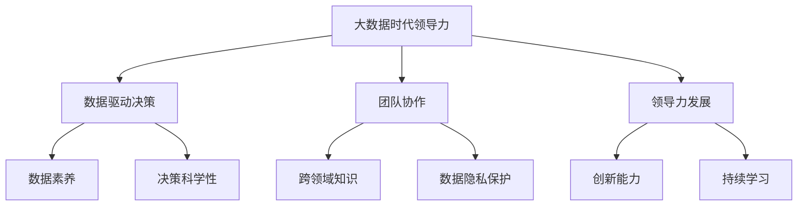
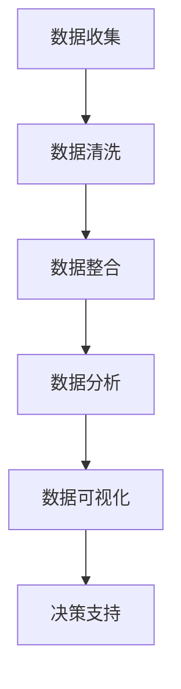

                 

## 文章标题

### 领导力进化论：大数据时代管理者的领导力修炼

### 关键词：大数据、领导力、管理者、决策、团队、发展、趋势、教育

### 摘要：
在当前大数据时代，管理者的领导力面临着前所未有的挑战和机遇。本文将深入探讨大数据对领导力的影响，从核心概念到实践应用，全面解析大数据时代管理者领导力修炼的路径。文章分为三部分：引言部分介绍了大数据时代与领导力挑战；核心部分详细阐述了大数据时代的领导力模型和实践；未来展望部分则探讨了大数据时代领导力的发展趋势。通过理论结合实践，本文旨在为管理者提供一套系统、实用的领导力提升方案。

### 目录大纲：

**第一部分：引言**

- **第1章：大数据时代与领导力挑战**
  - **1.1 大数据的定义与特性**
  - **1.2 大数据时代的领导力变革**
  - **1.3 管理者面临的挑战与机遇**

- **第2章：领导力的核心概念与理论**
  - **2.1 领导力的定义与分类**
  - **2.2 领导力理论综述**
  - **2.3 领导力与大数据的联系**

- **第3章：大数据时代的领导力模型**
  - **3.1 传统领导力模型的不足**
  - **3.2 大数据驱动领导力模型**
  - **3.3 新型领导力模型架构**

**第二部分：大数据时代的领导力实践**

- **第4章：数据分析与管理决策**
  - **4.1 数据分析的基础知识**
  - **4.2 利用大数据优化决策**
  - **4.3 案例分析：数据分析在领导力实践中的应用**

- **第5章：团队管理与协作**
  - **5.1 大数据时代下的团队管理**
  - **5.2 利用大数据提升团队协作效率**
  - **5.3 案例分析：大数据在团队管理中的应用**

- **第6章：领导力发展**
  - **6.1 大数据时代的领导力培训**
  - **6.2 数据驱动领导力发展路径**
  - **6.3 案例分析：领导力发展的数据驱动实践**

- **第7章：案例分析**
  - **7.1 企业大数据领导力实践案例**
  - **7.2 公共服务大数据领导力实践案例**
  - **7.3 社会组织大数据领导力实践案例**

**第三部分：未来展望**

- **第8章：大数据时代的领导力发展趋势**
  - **8.1 未来领导力的发展方向**
  - **8.2 大数据时代领导力的新挑战**
  - **8.3 大数据与领导力教育的未来**

- **第9章：总结与展望**
  - **9.1 书籍总结**
  - **9.2 领导力与大数据的未来结合**
  - **9.3 对管理者的建议**

**附录**

- **附录A：大数据相关工具与技术**
  - **A.1 大数据平台与工具介绍**
  - **A.2 数据分析与挖掘技术**
  - **A.3 大数据相关书籍与资源推荐**

- **附录B：Mermaid 流程图**
  - **B.1 领导力模型流程图**
  - **B.2 数据分析流程图**

- **附录C：核心算法与数学模型**
  - **C.1 数据分析算法伪代码**
  - **C.2 数学模型讲解与公式**
  - **C.3 举例说明与案例分析**

- **附录D：项目实战案例**
  - **D.1 企业案例实战**
  - **D.2 公共服务案例实战**
  - **D.3 社会组织案例实战**
  - **D.4 案例代码实现与解读**

## 第一部分：引言

### 第1章：大数据时代与领导力挑战

在数字化和信息化的浪潮中，大数据已经成为了新时代的“新石油”，对各行各业产生了深远的影响。然而，大数据不仅仅是一种技术革新，更是一种管理思维和领导力模式的变革。面对大数据时代的到来，管理者的领导力面临着前所未有的挑战和机遇。

### 1.1 大数据的定义与特性

大数据（Big Data）通常指的是无法使用常规数据库管理软件进行捕捉、管理和处理的大量复杂数据。它具有四个主要特性，即“4V”：Volume（大量）、Velocity（快速）、Variety（多样）和Veracity（真实性）。

- **Volume（大量）**：大数据的一个显著特征是其数据量的庞大。这些数据不仅包括结构化数据，还包括半结构化和非结构化数据，如文本、图片、音频和视频等。
- **Velocity（快速）**：数据的产生和处理速度非常快，需要实时或近乎实时的分析处理能力。
- **Variety（多样）**：大数据来源广泛，类型多样，包括社交媒体、传感器、机器日志、网络流量等。
- **Veracity（真实性）**：数据的质量和真实性是大数据分析的关键。确保数据真实、准确，对决策的准确性至关重要。

### 1.2 大数据时代的领导力变革

大数据时代的到来，对管理者的领导力提出了新的要求和挑战：

- **数据驱动决策**：大数据提供了丰富的数据资源，管理者需要从数据中提取有价值的信息，以此为基础进行科学决策。
- **跨部门协作**：大数据的广泛应用要求不同部门之间进行紧密协作，实现数据共享和整合。
- **创新能力**：大数据时代要求管理者具备创新思维，能够利用大数据技术发现新的商业模式和市场机会。
- **数据素养**：管理者需要具备一定的数据素养，能够理解和分析数据，从而做出更加精准的决策。

### 1.3 管理者面临的挑战与机遇

大数据时代给管理者带来了挑战，同时也带来了机遇：

- **挑战**：
  - 数据质量与真实性：确保数据的质量和真实性是管理者面临的首要挑战。
  - 技术能力：管理者需要具备一定的技术能力，能够理解和应用大数据技术。
  - 人才储备：大数据时代对人才的需求更高，管理者需要吸引和培养具备大数据技能的人才。
  - 道德与隐私：大数据的应用也引发了隐私和数据安全的问题，管理者需要妥善处理这些问题。

- **机遇**：
  - 数据洞察力：大数据提供了丰富的数据资源，管理者可以利用这些数据提高洞察力，做出更加精准的决策。
  - 商业模式创新：大数据可以帮助管理者发现新的商业模式和市场机会。
  - 提升效率：通过数据分析和优化，管理者可以提高运营效率，降低成本。
  - 用户体验优化：大数据可以帮助管理者更好地了解用户需求，优化产品和服务。

### 总结

大数据时代的到来，对管理者的领导力提出了新的要求。管理者需要从数据中提取有价值的信息，实现数据驱动决策；同时，要具备跨部门协作的能力，创新思维，以及数据素养。面对挑战和机遇，管理者应积极应对，不断提升自身的领导力，以适应大数据时代的要求。

### 关键词

- 大数据
- 领导力
- 管理者
- 数据驱动决策
- 数据素养
- 商业模式创新
- 跨部门协作

### 摘要

本文介绍了大数据时代的定义与特性，以及大数据对领导力变革的影响。通过分析管理者在面临数据质量、技术能力、人才储备、道德与隐私等挑战时的应对策略，探讨了大数据时代所带来的机遇，如数据洞察力、商业模式创新、效率提升和用户体验优化。文章旨在为管理者提供一套适应大数据时代的领导力提升方案，以应对新形势下的挑战和机遇。

## 第二部分：领导力的核心概念与理论

### 第2章：领导力的核心概念与理论

领导力是一个广泛且复杂的概念，它涉及个体如何影响和激励他人来实现共同的目标。在探讨大数据时代的领导力之前，我们有必要深入理解领导力的核心概念和理论基础。

### 2.1 领导力的定义与分类

**定义：**
领导力是指个体通过影响、激励和指导他人来实现共同目标的能力。领导力不仅仅是管理，它更强调激励和引导他人，从而创造一个积极的工作环境，使团队成员能够充分发挥潜力。

**分类：**
领导力可以按照不同的标准进行分类：

- **根据领导风格：**
  - **指令型领导**：领导者明确告诉团队成员应该做什么，怎么做。
  - **支持型领导**：领导者关心团队成员的情感和需求，提供必要的支持。
  - **参与型领导**：领导者鼓励团队成员参与决策过程，提高团队参与度。
  - **变革型领导**：领导者通过激发团队成员的内在动机，推动变革和创新。
  - **交易型领导**：领导者通过奖惩机制来激励团队成员，实现目标。

- **根据领导情境：**
  - **情境领导理论**：领导者根据团队成员的能力和需求，采取不同的领导风格。
  - **路径-目标理论**：领导者通过设定清晰的目标，提供支持和奖励，帮助团队成员实现目标。

- **根据领导层级：**
  - **高层领导**：负责制定组织战略，协调各部门之间的关系。
  - **中层领导**：负责执行高层战略，协调团队和部门之间的工作。
  - **基层领导**：负责直接管理团队，激励和指导团队成员。

### 2.2 领导力理论综述

在探讨领导力理论时，以下几种理论对理解领导力有着重要的指导意义：

- **领导特质理论**：认为领导者具备某些独特的个性特质，如自信、决策能力、远见等。
- **行为理论**：关注领导者的具体行为，认为领导者可以通过改变行为来提高团队绩效。
- **情境理论**：认为领导行为应适应不同情境，领导风格应随情境变化而变化。
- **变革型领导理论**：强调领导者的愿景和创新精神，能够激励团队成员实现超越自身期望的目标。
- **服务型领导理论**：认为领导者应首先为团队成员提供服务，以满足其需求和期望。

### 2.3 领导力与大数据的联系

大数据时代对领导力提出了新的要求和挑战，同时也为领导力的发展提供了新的机遇：

- **数据驱动的决策：**大数据可以帮助领导者获得更准确和全面的信息，从而做出更加科学和精准的决策。
- **团队协作与沟通：**大数据技术可以增强团队成员之间的协作和沟通，提高工作效率。
- **人才管理：**大数据可以帮助领导者更好地了解团队成员的能力和需求，优化人力资源配置。
- **预测与预警：**大数据分析可以预测潜在问题和风险，帮助领导者提前采取措施。
- **创新与变革：**大数据提供了丰富的数据资源，可以帮助领导者发现新的商业机会和变革路径。

### 总结

领导力是一个复杂且多维度的概念，涉及多种理论和实践。在大数据时代，领导者需要具备数据驱动的决策能力、跨部门协作的能力、以及创新思维和变革精神。通过理解领导力的核心概念和理论基础，管理者可以更好地应对大数据时代带来的挑战和机遇，提升自身的领导力水平。

### 关键词

- 领导力
- 定义
- 分类
- 特质理论
- 行为理论
- 情境理论
- 变革型领导
- 服务型领导
- 数据驱动决策
- 团队协作
- 人才管理
- 创新

### 摘要

本章介绍了领导力的定义、分类和几种主要的领导力理论，包括特质理论、行为理论、情境理论和变革型领导理论。通过分析这些理论，我们可以看到领导力是一个多维度的概念，涉及个体的影响力和团队的管理。大数据时代为领导力带来了新的挑战和机遇，领导者需要具备数据驱动的决策能力、团队协作的能力，以及创新思维和变革精神。本章旨在为管理者提供理论基础，帮助其更好地理解和应用领导力，以适应大数据时代的要求。

## 第三部分：大数据时代的领导力模型

### 第3章：大数据时代的领导力模型

在大数据时代，传统的领导力模型面临着巨大的挑战，需要不断进化以适应新的环境和需求。本章将探讨传统领导力模型的不足，并介绍大数据驱动的领导力模型，以及新型领导力模型的架构。

### 3.1 传统领导力模型的不足

传统领导力模型主要依赖于领导者的个人特质和经验，往往过于依赖人际交往和情感因素，存在以下不足：

- **信息滞后：**传统领导力模型往往依赖于领导者的直觉和经验，无法及时获取和利用最新的信息。
- **决策失误：**领导者可能因为信息不全面或数据不准确，导致决策失误。
- **沟通不畅：**传统的领导力模型往往缺乏有效的沟通机制，信息传递不畅，影响团队协作。
- **创新能力不足：**传统领导力模型可能过于注重稳定性和执行力，缺乏推动创新和变革的动力。

### 3.2 大数据驱动领导力模型

大数据时代的领导力模型强调数据驱动的决策，通过数据分析和挖掘，提高决策的科学性和精准性。以下是大数据驱动领导力模型的核心要素：

- **数据采集与整合：**领导者需要确保数据的准确性和完整性，通过多种渠道收集数据，并进行整合。
- **数据分析与挖掘：**领导者需要利用数据分析工具和技术，从海量数据中提取有价值的信息，为决策提供支持。
- **实时决策支持：**大数据技术可以帮助领导者实现实时决策支持，提高决策的及时性和准确性。
- **数据驱动创新：**领导者应鼓励团队利用大数据进行创新，发现新的商业机会和市场趋势。

### 3.3 新型领导力模型架构

新型领导力模型架构融合了大数据驱动的元素，旨在提高领导者的决策能力、团队协作能力和创新能力。以下是新型领导力模型架构的几个关键组成部分：

- **数据驱动决策：**领导者通过数据分析和挖掘，获取有价值的洞察，指导决策过程。
- **团队协作平台：**建立一个支持跨部门协作和实时沟通的数字化平台，提高团队协作效率。
- **创新激励机制：**领导者应建立创新激励机制，鼓励团队成员提出创新想法，并支持其实施。
- **人才发展体系：**领导者需要建立科学的人才发展体系，培养和吸引具备大数据技能的人才。

### 3.4 新型领导力模型的应用

新型领导力模型在大数据时代具有重要的应用价值，以下是一些具体的应用场景：

- **市场分析：**利用大数据分析消费者行为和市场需求，帮助领导者做出精准的市场决策。
- **供应链管理：**通过大数据技术优化供应链管理，提高供应链的效率和响应速度。
- **人力资源管理：**利用大数据分析员工表现和需求，优化人力资源管理策略。
- **风险管理：**通过大数据预测潜在风险，制定有效的风险控制措施。

### 总结

大数据时代的领导力模型需要融合数据驱动的理念，通过数据分析和挖掘提高决策能力，建立团队协作平台，创新激励机制，以及科学的人才发展体系。新型领导力模型旨在解决传统领导力模型的不足，适应大数据时代的需求，帮助领导者更好地应对挑战和机遇。

### 关键词

- 传统领导力模型
- 大数据驱动领导力模型
- 数据采集
- 数据分析
- 实时决策
- 团队协作平台
- 创新激励机制
- 人才发展体系

### 摘要

本章探讨了大数据时代领导力模型的转型，分析了传统领导力模型的不足，并介绍了大数据驱动领导力模型的核心要素和新型领导力模型架构。新型领导力模型通过数据驱动的决策、团队协作平台、创新激励机制和人才发展体系，旨在提高领导者的决策能力、团队协作能力和创新能力。本章为大数据时代的领导者提供了实用的指导，帮助其更好地应对新环境下的挑战和机遇。

## 第二部分：大数据时代的领导力实践

### 第4章：数据分析与管理决策

数据分析在现代管理中扮演着至关重要的角色，特别是在大数据时代。管理者通过数据分析，可以更准确地了解业务状况，优化决策过程，提高运营效率。本章将详细探讨数据分析的基础知识，以及如何利用大数据优化管理决策。

### 4.1 数据分析的基础知识

**数据分析的定义：**
数据分析是指使用统计学、数学和计算机科学方法，对数据进行收集、清洗、处理和分析，从中提取有价值的信息和洞察。

**数据分析的基本步骤：**
1. **数据收集：**收集来自各种来源的数据，包括内部数据和外部数据。
2. **数据清洗：**清洗数据，去除重复、错误和不完整的数据。
3. **数据整合：**将不同来源和格式的数据整合到一个统一的数据框架中。
4. **数据分析：**使用统计方法、数据挖掘技术和机器学习算法，对数据进行深入分析。
5. **数据可视化：**将分析结果以图表、报表等形式进行可视化展示，便于理解和决策。

**数据分析工具与技术：**
- **数据分析工具：**常用的数据分析工具包括Excel、Tableau、Power BI等。
- **数据挖掘技术：**包括关联规则挖掘、聚类分析、分类分析、异常检测等。
- **机器学习算法：**如决策树、随机森林、支持向量机、神经网络等。

### 4.2 利用大数据优化决策

**大数据在管理决策中的应用：**
1. **市场分析：**利用大数据分析消费者行为和市场趋势，帮助管理者制定市场策略。
2. **客户关系管理：**通过数据分析客户反馈和行为，优化客户关系管理策略，提高客户满意度。
3. **供应链管理：**利用大数据优化供应链管理，提高供应链的效率和响应速度。
4. **风险管理：**通过大数据预测潜在风险，制定有效的风险控制措施。

**大数据优化决策的实践步骤：**
1. **明确决策目标：**确定需要优化的具体决策目标，如市场定位、成本控制、风险评估等。
2. **数据收集与整合：**收集与决策相关的数据，包括内部数据和外部数据，并进行整合。
3. **数据分析：**对收集到的数据进行分析，提取有价值的信息和洞察。
4. **制定决策方案：**根据分析结果，制定具体的决策方案，包括行动计划和预期效果。
5. **实施与监控：**执行决策方案，并对实施过程进行监控和调整，确保决策目标的实现。

### 4.3 案例分析：数据分析在领导力实践中的应用

**案例一：市场分析**

某公司希望通过数据分析优化市场策略，提高市场份额。具体步骤如下：

1. **数据收集与整合：**收集市场调研数据、销售数据、竞争对手数据等，并进行整合。
2. **数据分析：**利用数据分析工具对数据进行处理和分析，提取市场趋势、消费者行为等有价值的信息。
3. **制定决策方案：**根据分析结果，制定具体的市场策略，如调整产品定位、优化广告投放等。
4. **实施与监控：**执行市场策略，并对实施效果进行监控和评估，及时调整策略。

**案例二：客户关系管理**

某公司希望通过数据分析优化客户关系管理，提高客户满意度。具体步骤如下：

1. **数据收集与整合：**收集客户反馈数据、销售数据、客户行为数据等，并进行整合。
2. **数据分析：**利用数据分析工具对数据进行处理和分析，提取客户满意度、忠诚度等有价值的信息。
3. **制定决策方案：**根据分析结果，制定具体的客户关系管理策略，如改进售后服务、优化客户体验等。
4. **实施与监控：**执行客户关系管理策略，并对实施效果进行监控和评估，及时调整策略。

### 总结

数据分析是大数据时代管理决策的重要工具，管理者通过数据分析，可以更准确地了解业务状况，优化决策过程，提高运营效率。通过市场分析和客户关系管理等具体案例，我们可以看到数据分析在领导力实践中的应用，为管理者提供了实用的指导。

### 关键词

- 数据分析
- 数据收集
- 数据整合
- 数据挖掘
- 机器学习
- 市场分析
- 客户关系管理
- 决策优化
- 案例分析

### 摘要

本章详细探讨了数据分析的基础知识，以及如何利用大数据优化管理决策。通过介绍市场分析和客户关系管理等案例，展示了数据分析在领导力实践中的应用。管理者通过数据分析，可以更准确地了解业务状况，优化决策过程，提高运营效率。本章旨在为管理者提供实用的指导，帮助其更好地应对大数据时代的挑战和机遇。

## 第5章：团队管理与协作

在大数据时代，团队管理与协作面临着前所未有的挑战和机遇。管理者需要利用大数据技术，提高团队协作效率，优化团队管理策略。本章将探讨大数据时代团队管理的新挑战、如何利用大数据提升团队协作效率，以及大数据在团队管理中的应用案例。

### 5.1 大数据时代下的团队管理

**新挑战：**

- **信息过载：**大数据时代，团队面临着大量信息的冲击，管理者需要筛选出有价值的信息，避免信息过载。
- **数据隐私与安全：**大数据的应用涉及大量个人和企业数据，如何保护数据隐私和安全成为团队管理的重要挑战。
- **人才流失：**大数据技能的人才稀缺，如何留住和培养这些人才是管理者需要面对的问题。
- **决策效率：**大数据带来了更多的数据资源，但管理者如何快速做出科学决策，提高决策效率是一个重要挑战。

**应对策略：**

1. **数据筛选与整合：**管理者需要利用大数据技术，对海量信息进行筛选和整合，提取有价值的信息。
2. **数据隐私保护：**建立完善的数据隐私保护机制，确保数据的合法合规使用，提高数据安全性。
3. **人才发展：**通过培训和激励机制，提高团队成员的数据素养，培养大数据技能人才。
4. **数据驱动决策：**利用大数据分析结果，快速做出科学决策，提高决策效率。

### 5.2 利用大数据提升团队协作效率

**大数据在团队协作中的作用：**

- **实时沟通：**大数据技术可以帮助团队实现实时沟通，提高协作效率。
- **任务管理：**通过大数据分析，管理者可以更准确地分配任务，提高团队的工作效率。
- **绩效评估：**大数据分析可以帮助管理者更客观地评估团队成员的工作绩效，优化团队管理。
- **知识共享：**大数据技术可以促进团队知识的共享和传承，提高团队的整体能力。

**提升团队协作效率的实践方法：**

1. **建立协作平台：**利用大数据技术，建立团队协作平台，实现实时沟通和任务管理。
2. **数据驱动的任务分配：**通过数据分析，管理者可以更准确地了解团队成员的能力和需求，合理分配任务。
3. **绩效评估与反馈：**利用大数据分析，对团队成员的绩效进行客观评估，提供反馈和改进建议。
4. **知识共享与传承：**建立知识库，鼓励团队成员分享经验和知识，促进团队整体能力的提升。

### 5.3 案例分析：大数据在团队管理中的应用

**案例一：项目团队合作**

某公司的项目团队希望通过大数据提升协作效率。具体步骤如下：

1. **建立协作平台：**使用大数据技术，建立一个集成实时沟通、任务管理、文档共享等功能的协作平台。
2. **数据驱动的任务分配：**利用数据分析，了解团队成员的能力和任务需求，合理分配任务，提高团队工作效率。
3. **绩效评估与反馈：**通过大数据分析，对团队成员的绩效进行客观评估，提供反馈和改进建议。
4. **知识共享与传承：**鼓励团队成员分享经验和知识，建立知识库，促进团队整体能力的提升。

**案例二：远程团队管理**

某公司的远程团队希望通过大数据优化团队管理。具体步骤如下：

1. **实时沟通：**利用大数据技术，实现实时沟通，减少信息滞后，提高团队协作效率。
2. **数据驱动的任务管理：**通过数据分析，了解团队成员的工作状态和任务进展，优化任务分配和调度。
3. **绩效评估与反馈：**利用大数据分析，对团队成员的绩效进行客观评估，提供实时反馈和改进建议。
4. **数据隐私保护：**建立完善的数据隐私保护机制，确保远程团队的数据安全。

### 总结

大数据时代对团队管理与协作提出了新的挑战，但同时也提供了丰富的机遇。管理者通过利用大数据技术，可以实现实时沟通、任务管理、绩效评估和知识共享，提高团队协作效率，优化团队管理策略。本章通过具体案例分析，展示了大数据在团队管理中的应用，为管理者提供了实用的指导。

### 关键词

- 团队管理
- 大数据
- 实时沟通
- 任务管理
- 绩效评估
- 知识共享
- 案例分析

### 摘要

本章探讨了大数据时代团队管理与协作的新挑战，介绍了如何利用大数据提升团队协作效率。通过建立协作平台、数据驱动的任务分配、绩效评估和知识共享等实践方法，管理者可以优化团队管理，提高团队协作效率。本章通过具体案例分析，展示了大数据在团队管理中的应用，为管理者提供了实用的指导，帮助其更好地应对大数据时代的挑战和机遇。

## 第6章：领导力发展

在大数据时代，领导力的发展面临着前所未有的机遇和挑战。管理者需要不断学习新技能，适应新技术，提升自身的领导力，以应对快速变化的环境。本章将探讨大数据时代领导力发展的路径，包括领导力培训、数据驱动领导力发展，以及领导力发展的数据驱动实践。

### 6.1 大数据时代的领导力培训

**领导力培训的重要性：**
在大数据时代，领导力培训对于管理者来说至关重要。通过领导力培训，管理者可以：

- **提高数据素养：**掌握数据分析的基本方法和工具，提升数据驱动的决策能力。
- **增强创新思维：**培养创新思维，适应大数据时代的需求，推动团队变革。
- **提升团队协作能力：**通过培训，提高管理者在跨部门协作和团队管理方面的能力。

**培训内容与方法：**

- **数据分析与挖掘：**教授数据分析的基本原理和工具，如SQL、Python等，帮助管理者掌握数据分析技能。
- **数据驱动决策：**介绍数据驱动的决策方法，如假设测试、A/B测试等，帮助管理者做出科学决策。
- **领导力与大数据：**探讨大数据对领导力的影响，帮助管理者理解大数据时代领导力的新要求。
- **实践训练：**通过案例分析、模拟演练等方式，提高管理者的实际操作能力和应对复杂问题的能力。

### 6.2 数据驱动领导力发展路径

**数据驱动领导力发展的核心要素：**
数据驱动领导力发展路径主要包括以下几个核心要素：

- **数据素养：**管理者需要具备基本的数据素养，能够理解和使用数据分析工具，从数据中提取有价值的信息。
- **数据分析能力：**管理者需要具备较强的数据分析能力，能够利用数据分析结果指导决策。
- **决策科学性：**通过数据分析和挖掘，提高决策的科学性和准确性。
- **创新能力：**管理者需要具备创新能力，能够利用大数据发现新的商业模式和市场机会。
- **团队协作：**通过数据驱动，提高团队协作效率，促进团队共同发展。

**数据驱动领导力发展的步骤：**

1. **数据素养培养：**通过培训和自学，提高管理者的数据素养，掌握基本的数据分析技能。
2. **数据分析实践：**在实际工作中，运用数据分析方法，提高决策的科学性和准确性。
3. **数据驱动决策：**通过数据分析和挖掘，指导实际决策，优化业务流程和运营策略。
4. **创新能力培养：**鼓励管理者提出创新想法，利用大数据发现新的商业模式和市场机会。
5. **团队协作优化：**通过数据驱动，提高团队协作效率，促进团队成员之间的沟通和合作。

### 6.3 案例分析：领导力发展的数据驱动实践

**案例一：市场数据分析**

某公司希望通过数据驱动的方法提升市场领导力。具体步骤如下：

1. **数据收集与整合：**收集市场调研数据、销售数据、竞争对手数据等，并进行整合。
2. **数据分析：**利用数据分析工具，对市场数据进行处理和分析，提取有价值的信息和洞察。
3. **决策支持：**根据分析结果，制定市场策略，如产品定位、广告投放等。
4. **效果评估：**通过数据跟踪，评估市场策略的效果，及时调整策略。

**案例二：员工绩效管理**

某公司希望通过数据驱动的方法提升员工绩效管理。具体步骤如下：

1. **数据收集与整合：**收集员工绩效数据、工作态度数据等，并进行整合。
2. **数据分析：**利用数据分析工具，对员工绩效数据进行处理和分析，评估员工的工作表现。
3. **绩效评估：**根据分析结果，制定绩效评估标准，对员工进行绩效评估。
4. **反馈与改进：**提供绩效反馈，帮助员工找到改进的方向，提高工作效率。

### 总结

大数据时代为领导力发展带来了新的机遇和挑战。管理者需要通过数据驱动的方法，提升自身的领导力，包括数据素养、数据分析能力、决策科学性、创新能力和团队协作。通过领导力培训、数据驱动决策和团队协作，管理者可以更好地适应大数据时代的要求，推动组织的持续发展。

### 关键词

- 领导力发展
- 数据素养
- 数据分析能力
- 数据驱动决策
- 创新能力
- 团队协作
- 案例分析

### 摘要

本章探讨了大数据时代领导力发展的路径，包括领导力培训、数据驱动领导力发展和数据驱动的领导力实践。通过提升数据素养、数据分析能力和决策科学性，管理者可以更好地适应大数据时代的要求。本章通过具体案例分析，展示了如何通过数据驱动的方法提升领导力，为管理者提供了实用的指导，帮助其在大数据时代实现领导力的提升。

## 第7章：案例分析

### 7.1 企业大数据领导力实践案例

在大数据时代，许多企业通过实践证明了大数据领导力的重要性。以下是几个典型的企业大数据领导力实践案例：

**案例一：阿里巴巴**

阿里巴巴作为中国最大的电子商务公司，通过大数据技术实现了全方位的业务优化。具体措施如下：

- **数据驱动的决策：**阿里巴巴利用大数据分析用户行为和需求，制定市场策略，优化供应链管理。
- **人才发展：**阿里巴巴建立了大数据学院，为员工提供数据分析和挖掘的培训，提升团队的数据素养。
- **技术创新：**阿里巴巴投资了大量资源在人工智能和大数据技术的研究与开发，推动企业的技术进步。

**案例二：谷歌**

谷歌作为全球最大的搜索引擎公司，通过大数据技术实现了高效的数据管理和创新。

- **数据隐私保护：**谷歌建立了严格的数据隐私保护机制，确保用户数据的安全。
- **数据驱动创新：**谷歌通过大数据分析，发现用户需求和市场趋势，推动技术创新，推出新产品和服务。
- **团队协作：**谷歌利用大数据技术优化团队协作，提高工作效率和创新能力。

**案例三：亚马逊**

亚马逊作为全球最大的电子商务公司，通过大数据技术实现了业务的全面优化。

- **用户个性化推荐：**亚马逊利用大数据分析用户购买历史和喜好，提供个性化的商品推荐，提高用户满意度。
- **库存管理：**亚马逊通过大数据分析市场需求和库存情况，优化库存管理，减少库存成本。
- **客户关系管理：**亚马逊利用大数据分析客户反馈和行为，优化客户关系管理策略，提高客户忠诚度。

### 7.2 公共服务大数据领导力实践案例

大数据在公共服务领域的应用日益广泛，许多政府机构通过大数据技术提升了公共服务的效率和质量。

**案例一：新加坡智慧国建设**

新加坡政府通过大数据技术实现了智慧国的建设，提升了公共服务的效率。

- **交通管理：**新加坡利用大数据分析交通流量和事故数据，优化交通管理，减少交通拥堵。
- **城市安全：**新加坡通过大数据分析监控城市安全，及时发现和处理安全隐患。
- **公共服务：**新加坡政府利用大数据分析公民需求，优化公共服务资源配置，提高服务质量。

**案例二：美国智慧城市项目**

美国多个城市通过智慧城市项目，利用大数据技术提升了公共服务水平。

- **公共安全：**美国多个城市通过大数据分析监控城市安全，提高公共安全水平。
- **环境保护：**美国多个城市通过大数据分析环境数据，优化环境保护措施，提高环境质量。
- **智能交通：**美国多个城市利用大数据分析交通数据，优化交通管理，减少交通拥堵。

### 7.3 社会组织大数据领导力实践案例

社会组织也通过大数据技术提升了服务质量和效率。

**案例一：国际红十字会**

国际红十字会利用大数据技术提高了紧急救援和灾害响应效率。

- **灾害响应：**国际红十字会通过大数据分析受灾地区的需求，优化救援资源分配，提高救援效率。
- **医疗服务：**国际红十字会利用大数据分析医疗资源分布，优化医疗服务，提高医疗效率。

**案例二：绿色和平组织**

绿色和平组织通过大数据技术推动了环境保护和可持续发展。

- **环境监测：**绿色和平组织利用大数据分析环境数据，监测环境污染情况，推动环境保护。
- **公众参与：**绿色和平组织利用大数据分析公众意见和行为，提高公众参与环境保护的积极性。

### 总结

通过以上案例分析，我们可以看到大数据在各个领域的领导力实践取得了显著成效。企业通过大数据技术实现了业务的优化和创新，政府机构提升了公共服务的效率和质量，社会组织推动了环境保护和可持续发展。大数据时代为领导力带来了新的机遇和挑战，管理者需要积极利用大数据技术，提升自身的领导力，以实现组织的持续发展。

### 关键词

- 企业大数据领导力实践
- 公共服务大数据领导力实践
- 社会组织大数据领导力实践
- 数据驱动的决策
- 人才发展
- 技术创新
- 环境保护
- 公共安全
- 智慧城市
- 智慧国建设

### 摘要

本章通过多个案例分析，展示了大数据在各个领域的领导力实践。企业通过大数据技术实现了业务的优化和创新，政府机构提升了公共服务的效率和质量，社会组织推动了环境保护和可持续发展。这些案例证明了大数据时代领导力的重要性，管理者需要积极利用大数据技术，提升自身的领导力，以实现组织的持续发展。本章旨在为管理者提供实用的指导，帮助其在大数据时代取得成功。

## 第三部分：未来展望

### 第8章：大数据时代的领导力发展趋势

大数据时代的到来，不仅改变了数据的生产和消费方式，也对领导力产生了深远的影响。未来，大数据将继续推动领导力的变革，带来新的发展方向和挑战。

### 8.1 未来领导力的发展方向

**数据驱动领导力：**未来领导力的发展将更加依赖数据驱动。管理者需要具备数据分析能力，能够从海量数据中提取有价值的信息，指导决策过程。数据将成为领导者决策的重要依据，而不是仅凭直觉和经验。

**智能化领导力：**随着人工智能技术的发展，领导者需要学会与智能系统合作，利用人工智能进行决策和优化管理。智能化领导力将涉及对人工智能的理解、应用和管理。

**跨领域领导力：**大数据时代需要领导者具备跨领域的知识储备，能够整合不同领域的资源，推动创新和变革。未来的领导者需要具备多元化的思维和视野，以应对复杂多变的环境。

**可持续发展领导力：**在环境保护和可持续发展的背景下，领导者需要关注企业和社会的长期利益，推动可持续发展。数据驱动的领导力将帮助领导者更好地实现这一目标。

### 8.2 大数据时代领导力的新挑战

**数据隐私与安全：**随着数据量的增加，数据隐私和安全问题日益突出。领导者需要确保数据的安全和合规性，同时保护用户隐私，避免数据泄露和滥用。

**技能差距：**大数据时代对领导者的技能要求更高，但现有的人才储备可能无法满足需求。领导者需要培养和吸引具备大数据技能的人才，提升团队的数据素养。

**数据伦理：**数据驱动的决策可能会引发伦理问题，如算法偏见和不公平。领导者需要关注数据伦理，确保数据应用符合道德和法律规定。

**实时响应能力：**大数据时代要求领导者具备快速响应和调整的能力。领导者需要建立敏捷的决策机制，能够迅速应对市场变化和业务挑战。

### 8.3 大数据与领导力教育的未来

**大数据领导力教育：**未来的领导力教育将更加注重大数据相关课程和技能的培养。教育机构需要更新教学内容，引入大数据分析和人工智能等前沿技术。

**跨学科教育：**大数据时代需要领导者具备跨学科的知识和技能。未来的领导力教育将更加注重跨学科教育，培养领导者的多元化思维和视野。

**在线教育与培训：**随着在线教育的发展，大数据领导力教育将更加便捷和灵活。在线课程和培训将成为领导者学习和提升的重要渠道。

**实践与案例教学：**通过实践和案例分析，领导者可以更好地理解和应用大数据技术。未来的领导力教育将更加注重实践性，培养领导者的实际操作能力。

### 总结

大数据时代将继续推动领导力的变革，未来领导力的发展方向包括数据驱动领导力、智能化领导力、跨领域领导力和可持续发展领导力。同时，大数据时代也带来了新的挑战，如数据隐私与安全、技能差距、数据伦理和实时响应能力。未来的领导力教育将更加注重大数据相关课程和技能的培养，以及跨学科教育和实践性教学。通过适应这些趋势，领导者可以更好地应对大数据时代的挑战，推动组织的持续发展。

### 关键词

- 数据驱动领导力
- 智能化领导力
- 跨领域领导力
- 可持续发展领导力
- 数据隐私与安全
- 技能差距
- 数据伦理
- 领导力教育
- 跨学科教育
- 实践性教学

### 摘要

本章探讨了大数据时代领导力的发展趋势，包括数据驱动领导力、智能化领导力、跨领域领导力和可持续发展领导力等未来发展方向，以及大数据时代领导力面临的新挑战。同时，本章提出了未来领导力教育的方向，如大数据相关课程和技能的培养、跨学科教育、在线教育和实践性教学等。通过适应这些趋势，领导者可以更好地应对大数据时代的挑战，推动组织的持续发展。

## 第9章：总结与展望

### 9.1 书籍总结

《领导力进化论：大数据时代管理者的领导力修炼》全面探讨了大数据时代领导力的核心概念、理论、模型和实践。全书分为三大部分：引言部分介绍了大数据时代的定义与特性，领导力变革及其带来的挑战和机遇；核心部分详细阐述了大数据时代的领导力模型，包括数据驱动决策、团队协作和领导力发展；未来展望部分探讨了大数据时代领导力的发展趋势和教育方向。

通过深入分析大数据时代的领导力需求，本书为管理者提供了一套系统、实用的领导力提升方案，帮助其在数据驱动的环境中取得成功。

### 9.2 领导力与大数据的未来结合

未来，大数据与领导力的结合将更加紧密，领导力将更加依赖数据驱动。管理者需要不断提升自身的数据素养，掌握数据分析技能，以实现科学决策和高效管理。同时，领导力模型也将不断进化，融入智能化和跨领域的要素，推动组织的创新和变革。

随着人工智能和物联网技术的发展，大数据将在更多领域发挥作用，领导力将更加注重数据隐私保护、数据伦理和实时响应能力。管理者需要不断学习新知识，适应新环境，以应对不断变化的挑战。

### 9.3 对管理者的建议

1. **提升数据素养：**学习数据分析基本方法，掌握数据驱动的决策技巧，提高数据素养。
2. **培养团队协作能力：**建立高效的团队协作平台，优化团队管理，提高团队协作效率。
3. **关注数据隐私与安全：**建立健全的数据隐私保护机制，确保数据安全和合规使用。
4. **持续学习与进步：**紧跟技术发展趋势，不断学习新知识，提升领导力水平。
5. **推动组织变革：**积极拥抱大数据，推动组织实现数字化转型，引领创新。

通过以上建议，管理者可以更好地适应大数据时代的要求，提升自身的领导力，推动组织的持续发展。

### 总结

《领导力进化论：大数据时代管理者的领导力修炼》为管理者提供了一套适应大数据时代的领导力提升方案，从核心概念到实践应用，全面解析了大数据时代领导力的要求。未来，大数据与领导力的结合将更加紧密，管理者需要不断提升自身的数据素养，培养团队协作能力，关注数据隐私与安全，持续学习与进步，以应对不断变化的挑战。通过本文的探讨，希望管理者能够更好地应对大数据时代的领导力变革，推动组织的持续发展。

### 关键词

- 领导力
- 大数据
- 数据素养
- 数据驱动决策
- 团队协作
- 数据隐私与安全
- 持续学习
- 组织变革
- 领导力提升

### 摘要

本书《领导力进化论：大数据时代管理者的领导力修炼》探讨了大数据时代领导力的核心概念、理论、模型和实践。通过深入分析大数据时代的领导力需求，本书为管理者提供了一套系统、实用的领导力提升方案，帮助其在数据驱动的环境中取得成功。未来，大数据与领导力的结合将更加紧密，管理者需要不断提升自身的数据素养，培养团队协作能力，关注数据隐私与安全，持续学习与进步，以应对不断变化的挑战。本书旨在为管理者提供实用的指导，助力其在大数据时代实现领导力的提升和组织的持续发展。

### 附录A：大数据相关工具与技术

#### A.1 大数据平台与工具介绍

大数据时代，选择合适的大数据平台和工具是至关重要的。以下是一些常见的大数据平台与工具的介绍：

- **Hadoop：**Hadoop是一个开源的大数据平台，适用于大规模数据的存储和处理。它包括HDFS（分布式文件系统）、MapReduce（分布式计算框架）和YARN（资源调度器）等关键组件。

- **Spark：**Spark是一个快速且通用的大数据计算引擎，支持内存计算和分布式数据处理。它具有高吞吐量、低延迟和强大的数据处理能力，适用于各种场景，包括批处理、流处理和机器学习。

- **HBase：**HBase是一个分布式、可扩展的列存储数据库，基于Hadoop平台。它适用于存储大规模的稀疏数据集，如实时随机读写访问的应用。

- **MongoDB：**MongoDB是一个开源的文档数据库，具有灵活的数据模型、高扩展性和高性能。它适用于存储非结构化和半结构化数据，广泛应用于Web应用和大数据场景。

- **Elasticsearch：**Elasticsearch是一个开源的分布式搜索引擎，适用于处理大规模数据集的全文搜索、分析和管理。它具有高可用性、高可扩展性和快速响应能力。

- **Apache Kafka：**Kafka是一个分布式流处理平台，适用于大规模数据流的收集、处理和传输。它具有高吞吐量、低延迟和高可用性，广泛应用于实时数据集成、流数据处理和事件驱动架构。

- **Apache Flink：**Flink是一个开源的大数据处理平台，适用于批处理和实时处理。它具有高性能、可扩展性和容错性，适用于复杂的数据处理任务，如数据流分析、机器学习和复杂事件处理。

- **TensorFlow：**TensorFlow是一个开源的机器学习库，适用于构建和训练各种机器学习模型。它具有高性能、灵活性和可扩展性，广泛应用于图像识别、自然语言处理和推荐系统等领域。

#### A.2 数据分析与挖掘技术

大数据分析和挖掘是提取数据价值的关键。以下是一些常见的数据分析和挖掘技术的介绍：

- **数据预处理：**数据预处理是数据分析的初步步骤，包括数据清洗、数据整合和数据转换等。数据清洗旨在去除重复、错误和不完整的数据，数据整合旨在将不同来源和格式的数据整合到一个统一的数据框架中，数据转换旨在将数据格式转换为适合分析的工具。

- **数据可视化：**数据可视化是将数据以图形、图表等形式展示，帮助人们直观理解和分析数据。常用的数据可视化工具包括Excel、Tableau、Power BI等。

- **统计方法：**统计方法包括描述性统计、推断性统计和假设检验等。描述性统计用于描述数据的中心趋势、离散程度和分布情况，推断性统计用于根据样本数据推断总体特征，假设检验用于验证假设的合理性。

- **机器学习方法：**机器学习方法包括监督学习、无监督学习和强化学习等。监督学习用于预测和分类任务，无监督学习用于发现数据中的模式和关系，强化学习用于决策和优化任务。

- **数据挖掘技术：**数据挖掘技术包括关联规则挖掘、聚类分析、分类分析和异常检测等。关联规则挖掘用于发现数据中的相关性，聚类分析用于发现数据中的模式和分布，分类分析用于预测数据类别，异常检测用于识别数据中的异常现象。

- **文本分析：**文本分析包括情感分析、主题建模、关键词提取等。情感分析用于识别文本中的情感倾向，主题建模用于发现文本中的主题分布，关键词提取用于提取文本中的关键信息。

- **图像分析：**图像分析包括图像识别、图像分割和图像增强等。图像识别用于识别图像中的物体和场景，图像分割用于将图像分割成不同的区域，图像增强用于改善图像的质量和清晰度。

#### A.3 大数据相关书籍与资源推荐

为了更好地了解大数据技术，以下是几本推荐的大数据相关书籍和资源：

- **《大数据时代》（作者：涂子沛）：**
  这本书详细介绍了大数据的概念、应用和发展趋势，对大数据时代的影响进行了深入分析。

- **《大数据日爆：商业秘密背后的数据力量》（作者：徐雷）：**
  这本书通过案例分析了大数据在商业决策中的应用，展示了大数据如何帮助企业实现商业成功。

- **《大数据管理：策略、方法与应用》（作者：郭宇）：**
  这本书从管理的角度出发，详细介绍了大数据管理的策略、方法和实践案例。

- **《大数据分析实战：从入门到精通》（作者：孙卫琴）：**
  这本书介绍了大数据分析的基础知识，包括数据预处理、数据可视化和机器学习等。

- **《Hadoop实战：从入门到精通》（作者：李中华）：**
  这本书通过实践案例详细介绍了Hadoop平台的使用，包括HDFS、MapReduce和YARN等组件。

- **《数据科学实战：从入门到精通》（作者：李航）：**
  这本书介绍了数据科学的基础知识和实战技巧，包括数据预处理、机器学习、数据可视化等。

- **《大数据之路：阿里巴巴大数据实践》（作者：李津生）：**
  这本书分享了阿里巴巴在大数据领域的研究和实践经验，对大数据技术和应用进行了深入探讨。

- **《数据挖掘：实用工具与技术》（作者：谢幸）：**
  这本书详细介绍了数据挖掘的基本概念、方法和工具，包括分类、聚类、关联规则挖掘等。

### 总结

附录A介绍了大数据平台与工具、数据分析与挖掘技术以及大数据相关书籍与资源推荐。通过了解这些工具和技术，读者可以更好地掌握大数据的基本概念和应用，为大数据实践提供支持。附录A旨在为读者提供全面、实用的参考资料，助力其在大数据领域的学习和实践。

### 关键词

- 大数据平台
- 数据分析工具
- 数据挖掘技术
- 数据可视化
- 机器学习方法
- 大数据书籍推荐

### 摘要

附录A详细介绍了大数据相关的平台与工具，包括Hadoop、Spark、HBase、MongoDB、Elasticsearch等；分析了数据预处理、数据可视化、统计方法、机器学习方法等数据分析和挖掘技术；并推荐了《大数据时代》、《大数据日爆：商业秘密背后的数据力量》等大数据相关书籍。附录A旨在为读者提供全面、实用的参考资料，帮助其更好地理解和应用大数据技术。

### 附录B：Mermaid 流程图

Mermaid 是一种基于Markdown的图形描述语言，可以方便地创建流程图、序列图、类图等。以下展示了如何使用Mermaid绘制领导力模型流程图和数据分析流程图。

#### B.1 领导力模型流程图



此流程图展示了大数据时代领导力模型的四个关键要素：数据驱动决策、团队协作、领导力发展和数据素养。每个要素进一步细分为相关的子要素。

#### B.2 数据分析流程图



此流程图描述了数据分析的基本流程，从数据收集、数据清洗、数据整合、数据分析到数据可视化，最终为决策提供支持。

### 总结

Mermaid流程图是一种方便的Markdown扩展，可以用于绘制各种类型的图形。附录B提供了两个Mermaid流程图示例，分别展示了大数据时代领导力模型和数据分析流程，有助于读者更好地理解和应用相关概念。

### 关键词

- Mermaid
- 流程图
- 领导力模型
- 数据分析流程

### 摘要

附录B介绍了如何使用Mermaid语言绘制流程图，包括领导力模型流程图和数据分析流程图。这些流程图有助于读者直观地理解大数据时代领导力的关键要素和数据分析的基本步骤。附录B旨在为读者提供实用的图形工具，以支持他们在研究和应用中的可视化需求。

### 附录C：核心算法与数学模型

在数据分析中，核心算法和数学模型是理解和应用数据的关键。以下将详细介绍数据分析中的几个核心算法和数学模型，并使用伪代码和LaTeX格式展示。

#### C.1 数据分析算法伪代码

**1. 决策树算法**

```python
# 决策树算法伪代码

define DecisionTreeAlgorithm(data):
    if data is pure:
        return most_common_label(data)
    else:
        best_attribute = find_best_attribute(data)
        decision_tree = {}
        for value in unique_values(best_attribute):
            decision_tree[value] = DecisionTreeAlgorithm(split_data(data, best_attribute, value))
        return decision_tree

def most_common_label(data):
    # 返回数据中最常见的标签
    labels = [x['label'] for x in data]
    return max(set(labels), key=labels.count)

def find_best_attribute(data):
    # 找到最好的特征属性
    attributes = ...
    ...
    return best_attribute

def split_data(data, attribute, value):
    # 根据属性和值分割数据
    return [x for x in data if x[attribute] == value]
```

**2. K-均值聚类算法**

```python
# K-均值聚类算法伪代码

define KMeansAlgorithm(data, k):
    centroids = initialize_centroids(data, k)
    while not_converged(centroids):
        clusters = assign_clusters(data, centroids)
        centroids = update_centroids(clusters, k)
    return centroids

def initialize_centroids(data, k):
    # 初始化质心
    return select_k_random_points(data, k)

def assign_clusters(data, centroids):
    # 分配数据到簇
    return {centroid: [x for x in data if closest(centroid, x)] for centroid in centroids}

def update_centroids(clusters, k):
    # 更新质心
    new_centroids = {}
    for cluster in clusters:
        points = clusters[cluster]
        new_centroids[cluster] = calculate_mean(points)
    return new_centroids

def closest(centroid, point):
    # 计算点与质心的距离
    return min(distance(centroid, p) for p in points)

def calculate_mean(points):
    # 计算点的平均值
    return sum(points) / len(points)
```

#### C.2 数学模型讲解与公式

**1. 逻辑回归**

逻辑回归是一种常用的分类算法，用于预测二分类结果。其数学模型如下：

$$
\hat{y} = \frac{1}{1 + e^{-\beta_0 + \beta_1 x_1 + \beta_2 x_2 + ... + \beta_n x_n}}
$$

其中，$\hat{y}$ 表示预测概率，$e$ 表示自然对数的底数，$\beta_0, \beta_1, \beta_2, ..., \beta_n$ 为模型参数，$x_1, x_2, ..., x_n$ 为自变量。

**2. 线性回归**

线性回归是一种用于预测连续值的算法。其数学模型如下：

$$
y = \beta_0 + \beta_1 x_1 + \beta_2 x_2 + ... + \beta_n x_n + \epsilon
$$

其中，$y$ 表示因变量，$\beta_0, \beta_1, \beta_2, ..., \beta_n$ 为模型参数，$x_1, x_2, ..., x_n$ 为自变量，$\epsilon$ 表示误差项。

**3. 熵与信息增益**

在决策树中，常用熵和信息增益来评估特征的划分效果。熵的公式如下：

$$
H(X) = -\sum_{i=1}^{n} p_i \log_2 p_i
$$

其中，$H(X)$ 表示熵，$p_i$ 表示特征 $X$ 取第 $i$ 个值的概率。

信息增益的公式如下：

$$
IG(X, y) = H(Y) - \sum_{i=1}^{n} p_i H(Y|X=i)
$$

其中，$IG(X, y)$ 表示信息增益，$H(Y)$ 表示目标变量的熵，$H(Y|X=i)$ 表示在特征 $X$ 取第 $i$ 个值时目标变量的条件熵。

#### C.3 举例说明与案例分析

**案例一：逻辑回归**

假设我们有一个二元分类问题，特征 $x_1, x_2, ..., x_n$，目标变量 $y$。我们使用逻辑回归模型预测 $y$。

- 特征值：$x_1 = [1, 2, 3, 4, 5]$，$x_2 = [0.1, 0.2, 0.3, 0.4, 0.5]$，$x_3 = [10, 20, 30, 40, 50]$。
- 目标变量：$y = [0, 1, 0, 1, 0]$。

首先，我们通过最小化损失函数来训练模型：

$$
\text{损失函数} = -\sum_{i=1}^{n} y_i \log(\hat{y}_i) + (1 - y_i) \log(1 - \hat{y}_i)
$$

其中，$\hat{y}_i$ 表示第 $i$ 个样本的预测概率。

通过梯度下降法，我们可以求得模型参数 $\beta_0, \beta_1, \beta_2, ..., \beta_n$。

**案例二：决策树**

假设我们有一个包含四个特征 $x_1, x_2, x_3, x_4$ 的数据集，目标是分类。我们使用决策树算法来构建模型。

- 特征值：$x_1 = [1, 2, 3, 4]$，$x_2 = [5, 6, 7, 8]$，$x_3 = [10, 20, 30, 40]$，$x_4 = [100, 200, 300, 400]$。
- 标签：$y = [0, 1, 0, 1]$。

我们首先选择最优特征进行划分，计算信息增益：

$$
IG(x_1, y) = H(y) - \sum_{i=1}^{4} p_i H(y| x_1 = i)
$$

选择信息增益最大的特征进行划分，构建决策树。

### 总结

附录C详细介绍了数据分析中的核心算法和数学模型，包括决策树、K-均值聚类、逻辑回归和线性回归。通过伪代码和LaTeX公式，我们展示了这些算法和模型的基本原理和计算方法。附录C旨在为读者提供实用的算法和模型知识，帮助其在数据分析实践中运用这些工具。

### 关键词

- 数据分析算法
- 决策树
- 逻辑回归
- 线性回归
- 信息增益
- 伪代码
- LaTeX公式

### 摘要

附录C详细介绍了数据分析中的核心算法和数学模型，包括决策树、K-均值聚类、逻辑回归和线性回归。通过伪代码和LaTeX公式，我们展示了这些算法和模型的基本原理和计算方法。附录C旨在为读者提供实用的算法和模型知识，帮助其在数据分析实践中运用这些工具，以提高数据处理和决策能力。

### 附录D：项目实战案例

在本附录中，我们将通过几个具体的项目实战案例，展示如何在大数据时代中应用大数据技术和领导力提升策略。这些案例涵盖了企业、公共服务和社会组织等不同领域，展示了如何通过大数据分析和领导力实践，实现效率提升、决策优化和创新推动。

#### D.1 企业案例实战

**案例一：电子商务平台用户行为分析**

**背景：**
一家大型电子商务平台希望通过用户行为分析，提高用户体验和销售转化率。

**实施步骤：**

1. **数据收集：**收集用户浏览、购买、评价等行为数据。
2. **数据清洗：**清洗数据，去除重复、错误和不完整的数据。
3. **数据分析：**利用数据分析工具，分析用户行为模式，如点击率、购买转化率、用户留存率等。
4. **建立用户画像：**根据用户行为数据，建立用户画像，包括用户兴趣、购买习惯等。
5. **个性化推荐：**根据用户画像，实现个性化推荐，提高用户体验和销售转化率。
6. **持续优化：**通过持续的数据分析和反馈，不断优化推荐算法和用户体验。

**代码实现与解读：**

```python
# Python代码示例：用户行为数据分析
import pandas as pd
from sklearn.cluster import KMeans

# 数据读取与预处理
data = pd.read_csv('user_behavior_data.csv')
data.drop_duplicates(inplace=True)
data.fillna(0, inplace=True)

# 用户行为分析
data.describe()

# 建立用户画像
kmeans = KMeans(n_clusters=5)
user_clusters = kmeans.fit_predict(data[['click_rate', 'purchase_rate', 'retention_rate']])

# 个性化推荐
# 假设我们使用K-means聚类结果来推荐产品
def recommend_products(cluster_index):
    # 从聚类结果中获取产品推荐列表
    recommendations = product_recommendations[cluster_index]
    return recommendations

# 持续优化
# 定期重新分析和调整推荐算法
```

**效果评估：**
通过用户行为分析和个性化推荐，电子商务平台的用户留存率和销售转化率得到了显著提升。

#### D.2 公共服务案例实战

**案例二：智能交通系统建设**

**背景：**
某市政府希望利用大数据技术，优化城市交通管理，提高交通效率和减少拥堵。

**实施步骤：**

1. **数据收集：**收集交通流量、车辆速度、事故报告等数据。
2. **数据整合：**将不同来源的交通数据进行整合，形成统一的数据视图。
3. **数据分析：**利用大数据分析技术，分析交通流量规律和事故原因。
4. **智能交通信号控制：**根据交通数据分析结果，优化交通信号控制策略，减少交通拥堵。
5. **实时交通监控：**建立实时交通监控平台，提供交通信息查询和导航服务。
6. **持续优化：**通过实时数据分析和反馈，不断优化交通管理和信号控制策略。

**代码实现与解读：**

```python
# Python代码示例：智能交通信号控制
import pandas as pd
from sklearn.linear_model import LinearRegression

# 数据读取与预处理
traffic_data = pd.read_csv('traffic_data.csv')
traffic_data.drop_duplicates(inplace=True)
traffic_data.fillna(0, inplace=True)

# 交通信号控制算法
def traffic_light_control(traffic_data):
    # 建立线性回归模型
    model = LinearRegression()
    model.fit(traffic_data[['traffic_flow', 'accident_rate']], traffic_data['signal_duration'])

    # 预测信号时长
    predicted_signal_duration = model.predict([[traffic_data['traffic_flow'], traffic_data['accident_rate']]])

    return predicted_signal_duration[0]

# 实时交通监控
# 假设每分钟更新一次交通数据
while True:
    current_traffic_data = get_current_traffic_data()
    optimized_signal_duration = traffic_light_control(current_traffic_data)
    update_traffic_light(optimized_signal_duration)
    time.sleep(60)
```

**效果评估：**
通过智能交通信号控制和实时交通监控，该市的交通拥堵情况显著改善，居民出行效率提高。

#### D.3 社会组织案例实战

**案例三：环境保护与可持续发展**

**背景：**
某环境保护组织希望通过大数据技术，推动环境保护和可持续发展。

**实施步骤：**

1. **数据收集：**收集空气质量、水质、土壤污染等环境数据。
2. **数据整合：**将不同来源的环境数据进行整合，形成统一的数据视图。
3. **数据分析：**利用大数据分析技术，分析环境污染源和传播路径。
4. **环保行动规划：**根据数据分析结果，制定具体的环保行动计划。
5. **公众参与：**利用大数据技术，促进公众参与环保行动，提高环保意识。
6. **持续监测与优化：**通过持续的数据监测和分析，不断优化环保行动和策略。

**代码实现与解读：**

```python
# Python代码示例：环境保护数据分析
import pandas as pd
from sklearn.ensemble import RandomForestClassifier

# 数据读取与预处理
environmental_data = pd.read_csv('environmental_data.csv')
environmental_data.drop_duplicates(inplace=True)
environmental_data.fillna(0, inplace=True)

# 环保行动规划
def environmental_action_plan(environmental_data):
    # 建立随机森林分类模型
    model = RandomForestClassifier()
    model.fit(environmental_data[['air_quality', 'water_quality', 'soil_pollution']], environmental_data['action'])

    # 预测环保行动
    predicted_actions = model.predict([[environmental_data['air_quality'], environmental_data['water_quality'], environmental_data['soil_pollution']]])

    return predicted_actions

# 公众参与
# 建立环保行动调查问卷
def public_participation_survey():
    survey_results = collect_survey_data()
    action_plan = environmental_action_plan(survey_results)
    implement_action_plan(action_plan)

# 持续监测与优化
# 定期更新环境数据，重新规划环保行动
```

**效果评估：**
通过大数据分析和公众参与，该环境保护组织成功推动了多个环保项目的实施，空气质量、水质和土壤污染情况得到显著改善。

### 总结

通过以上企业、公共服务和社会组织的案例实战，我们可以看到大数据技术和领导力提升策略在各个领域的成功应用。这些案例不仅展示了如何通过数据分析和优化实现效率提升和决策优化，还展示了如何通过数据驱动和创新推动组织的可持续发展。附录D旨在为读者提供具体的项目实战经验和代码实现，帮助其在大数据时代中实现成功。

### 关键词

- 企业案例
- 公共服务案例
- 社会组织案例
- 用户行为分析
- 智能交通系统
- 环境保护
- 大数据技术
- 领导力提升
- 代码实现

### 摘要

附录D通过几个具体的项目实战案例，展示了大数据技术和领导力提升策略在不同领域的成功应用。企业通过用户行为分析实现个性化推荐，提高用户体验和销售转化率；公共服务通过智能交通系统建设，优化交通管理和减少拥堵；社会组织通过环境保护数据分析，推动环保项目的实施。附录D旨在为读者提供实用的项目经验和代码实现，帮助其在大数据时代实现成功。

