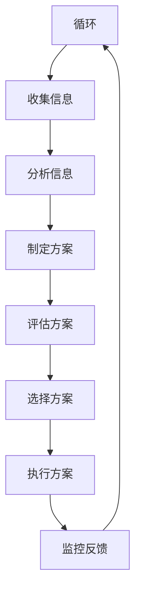

                 

# 领导者的决断力：果断与审慎的平衡

> **关键词**：领导力，决断力，心理建设，实践策略，案例分析，决策制定，情绪管理

> **摘要**：本文深入探讨领导者在面对复杂决策时的决断力，以及如何在果断与审慎之间找到平衡。通过对领导力、心理素质、决策策略和实际案例的分析，本文旨在为领导者提供实用的指导，帮助他们在不确定性和压力中做出正确的决策。

---

### 目录大纲

1. 引言
2. 第一部分：领导者的心理建设
   - 第1章：领导力与决断力
   - 第2章：心理素质的修炼
   - 第3章：情绪管理
3. 第二部分：决断力的实践策略
   - 第4章：信息收集与评估
   - 第5章：决策制定
   - 第6章：执行与反馈
4. 第三部分：案例分析
   - 第7章：成功领导的决断力
   - 第8章：决断力修炼之旅
5. 附录
   - 附录A：决断力相关资源
   - 附录B：决策流程图与算法伪代码

---

## 引言

在快节奏、高度竞争的现代社会，领导者的决断力成为影响组织成败的关键因素。一个高效的领导者不仅需要具备卓越的战略思维和管理能力，更需要具备在压力和不确定性中迅速做出正确决策的能力。这种能力，我们称之为“决断力”。

决断力是指领导者在面对复杂、多变的环境时，能够迅速分析信息、评估风险，并做出合理决策的能力。它既包括果断的执行力，又包括审慎的思考力。一个优秀的领导者需要在果断与审慎之间找到平衡，既要敢于担当，又要深思熟虑。

本文将从领导力与决断力的关系、心理素质的修炼、情绪管理、信息收集与评估、决策制定、执行与反馈等多个方面，深入探讨领导者的决断力。通过分析实际案例，我们将揭示成功领导者如何在实际工作中运用决断力，从而为读者提供实用的指导。

## 第一部分：领导者的心理建设

领导者的决断力不仅仅取决于他们的知识和经验，更取决于他们的心理素质。一个健康的心理素质是领导者有效决策的基础。在本部分中，我们将探讨领导力与决断力的关系，以及如何通过心理素质的修炼来提升决断力。

### 第1章：领导力与决断力

#### 1.1 领导者的角色与责任

领导者的角色不仅仅是指导和带领团队，更重要的是承担决策的责任。领导者的责任包括设定愿景、制定战略、分配资源以及应对突发事件。这些责任要求领导者具备卓越的决断力。

#### 1.2 决断力的定义与重要性

决断力是指领导者在面对复杂、多变的环境时，能够迅速分析信息、评估风险，并做出合理决策的能力。决断力的重要性在于，它决定了组织能否在竞争激烈的市场中立于不败之地。

#### 1.3 果断与审慎的关系

果断与审慎是领导者的两种重要品质。果断意味着领导者能够在关键时刻迅速做出决策，而审慎则意味着领导者会在做出决策前进行充分的思考和评估。一个成功的领导者需要在果断与审慎之间找到平衡。

### 第2章：心理素质的修炼

#### 2.1 自信心与决断力的关系

自信心是领导者决断力的基础。一个缺乏自信的领导者很难做出果断的决策。因此，提升自信心是领导力建设的重要环节。

#### 2.2 克服恐惧与焦虑

恐惧和焦虑是领导者决策时常见的心理障碍。克服这些障碍需要领导者学会正视自己的恐惧和焦虑，并找到应对策略。

#### 2.3 增强心理韧性的方法

心理韧性是指个体在面对压力和挑战时能够保持积极态度和适应能力。增强心理韧性有助于领导者更好地应对不确定性，做出更合理的决策。

### 第3章：情绪管理

#### 3.1 情绪对决策的影响

情绪是决策过程中的重要因素。积极的情绪有助于提高决策的效率和准确性，而消极的情绪则可能导致决策失误。

#### 3.2 情绪调节技巧

领导者需要学会调节自己的情绪，以保持冷静和清晰的思维。情绪调节技巧包括深呼吸、冥想和运动等。

#### 3.3 建立积极的思维模式

积极的思维模式有助于领导者看到问题的积极面，从而做出更合理的决策。建立积极的思维模式需要领导者不断进行自我反思和心态调整。

通过心理素质的修炼，领导者可以提升自己的决断力，从而在面对复杂决策时更加从容和自信。接下来，我们将探讨如何通过实践策略来进一步提升决断力。

## 第二部分：决断力的实践策略

领导者的决断力不仅体现在心理素质上，更需要通过实践策略来具体体现。在本部分中，我们将详细探讨信息收集与评估、决策制定、执行与反馈等实践策略，以帮助领导者提升决断力。

### 第4章：信息收集与评估

#### 4.1 信息收集的原则与方法

有效收集信息是做出合理决策的基础。领导者需要遵循以下原则：

- **全面性**：收集与决策相关的所有信息。
- **准确性**：确保信息的准确性和可靠性。
- **及时性**：及时获取最新的信息。

收集信息的方法包括：

- **内部调查**：通过访谈、问卷调查等方式获取员工意见和建议。
- **外部研究**：查阅相关研究报告、行业数据等。
- **数据挖掘**：利用大数据技术分析大量信息，提取有价值的数据。

#### 4.2 数据分析与决策

数据分析是决策过程中的关键环节。领导者需要学会以下数据分析技巧：

- **描述性分析**：了解数据的基本特征和分布情况。
- **推断性分析**：根据样本数据推断总体特征。
- **预测性分析**：利用历史数据预测未来趋势。

#### 4.3 风险评估与应对策略

在决策过程中，风险评估至关重要。领导者需要评估以下风险：

- **市场风险**：市场需求变化、竞争压力等。
- **财务风险**：资金链断裂、财务状况恶化等。
- **运营风险**：供应链中断、生产事故等。

应对策略包括：

- **预防措施**：提前制定应对计划。
- **风险转移**：通过保险等方式将风险转移。
- **风险规避**：避免从事高风险的业务。

### 第5章：决策制定

#### 5.1 决策制定的步骤

决策制定是一个系统化的过程，包括以下步骤：

1. **明确问题**：界定决策需要解决的问题。
2. **确定目标**：设定明确的决策目标。
3. **收集信息**：获取与决策相关的信息。
4. **制定方案**：提出多种可能的解决方案。
5. **评估方案**：比较不同方案的优缺点。
6. **选择方案**：选择最优方案。
7. **执行决策**：实施决策方案。
8. **监控与反馈**：监控决策执行情况，及时调整。

#### 5.2 决策的理性与感性

决策制定过程中，理性与感性并存。理性决策强调逻辑思维和数据分析，而感性决策则依赖于直觉和情感。领导者需要在两者之间找到平衡。

#### 5.3 决策中的时间管理

时间管理是决策制定的重要方面。领导者需要：

- **明确决策时间节点**：确保决策在合理的时间内完成。
- **优先级排序**：根据决策的重要性和紧急性进行排序。
- **有效利用时间**：合理安排时间，避免拖延和浪费时间。

### 第6章：执行与反馈

#### 6.1 决策执行的关键因素

决策执行的成功取决于以下关键因素：

- **明确责任**：确保每个团队成员明确自己的职责。
- **有效沟通**：确保决策传达给所有相关人员。
- **资源分配**：合理分配人力、物力和财力资源。
- **监督与协调**：监督决策执行过程，确保各项工作协调进行。

#### 6.2 激励团队与监督进度

激励团队是领导者的重要任务。领导者需要：

- **设定目标**：明确团队的目标和期望。
- **提供支持**：为团队成员提供必要的支持和资源。
- **表扬与鼓励**：及时表扬和鼓励团队成员的成就。

同时，领导者还需要监督进度，确保决策执行按计划进行。

#### 6.3 反馈机制与持续改进

建立反馈机制是持续改进的关键。领导者需要：

- **收集反馈**：定期收集团队成员和客户的反馈。
- **分析反馈**：分析反馈信息，找出问题所在。
- **改进措施**：根据反馈信息进行调整和改进。
- **持续学习**：不断学习新知识，提高决策能力。

通过信息收集与评估、决策制定、执行与反馈等实践策略，领导者可以不断提升自己的决断力，从而在复杂多变的环境中做出更合理、更有效的决策。

## 第三部分：案例分析

在了解了决断力的实践策略后，通过实际案例的分析，我们可以更好地理解成功领导者如何运用决断力，以及他们所面临的挑战和解决策略。以下将介绍三个具有代表性的案例。

### 第7章：成功领导的决断力

#### 7.1 案例一：某公司的快速转型

某公司在面临行业变革和竞争压力时，决定进行战略转型。公司领导者通过果断的决策，迅速调整业务结构，引入新的技术和产品。在转型过程中，领导者面临着巨大的风险和不确定性，但他们通过深入分析市场趋势和客户需求，果断地采取了行动。最终，公司成功转型，实现了业务的快速增长。

#### 7.2 案例二：面对危机的决策

在另一个案例中，一家公司在全球金融危机期间面临严重的财务危机。公司领导者果断地采取了一系列措施，包括裁员、关闭不盈利的业务部门以及优化供应链等。虽然这些决策带来了短期的痛苦，但领导者通过审慎的思考和评估，最终成功带领公司渡过了危机，并重新恢复了增长。

#### 7.3 案例三：创新与决断力的结合

在一个高科技公司中，领导者通过果断的决策推动了一系列创新项目。他们不仅鼓励员工提出创新想法，还提供了必要的资源和支持，以确保这些想法能够迅速转化为实际产品。领导者在这过程中展现了出色的决断力，他们在关键决策点上果断行动，推动了公司的创新和发展。

### 第8章：决断力修炼之旅

通过以上案例，我们可以看到成功领导者如何在不同情境下运用决断力。他们的成功不仅仅是因为他们具有果断和审慎的品质，更重要的是他们在实践中不断修炼和提升自己的决断力。

#### 8.1 自我评估与成长

领导者需要定期进行自我评估，识别自己的优势和不足。通过自我反思和不断学习，领导者可以不断提升自己的决策能力和决断力。

#### 8.2 终身学习与不断提升

决断力是一个持续提升的过程。领导者需要不断学习新知识、新技能，了解最新的行业动态和趋势。通过终身学习，领导者可以更好地应对复杂多变的商业环境。

#### 8.3 决断力的未来发展趋势

随着科技的进步和社会的变迁，决断力的内涵和形式也在不断演变。未来的领导者需要具备更高的跨领域知识整合能力、更强的应变能力和更广泛的决策视野。他们需要能够迅速适应变化，灵活调整决策策略，以应对未来更加复杂和不确定的环境。

## 附录

### 附录A：决断力相关资源

#### A.1 推荐书籍

1. 《领导者的决策力》 - 作者：彼得·德鲁克
2. 《决策与判断》 - 作者：丹尼尔·卡尼曼
3. 《决断力》 - 作者：亨利·明茨伯格

#### A.2 优质课程

1. “领导力与决策” - 提供平台：哈佛大学公开课
2. “决策分析” - 提供平台：Coursera
3. “领导力：战略决策与执行” - 提供平台：edX

#### A.3 实用工具与平台

1. Google Analytics - 用于数据分析
2. Tableau - 用于数据可视化
3. MindManager - 用于思维导图制作

### 附录B：决策流程图与算法伪代码

#### B.1 决策流程图



#### B.2 算法伪代码

```python
# 决策制定算法伪代码

def make_decision():
    # 收集信息
    data = collect_info()

    # 分析信息
    analyzed_data = analyze_data(data)

    # 制定方案
    schemes = generate_schemes(analyzed_data)

    # 评估方案
    best_scheme = evaluate_schemes(schemes)

    # 选择方案
    selected_scheme = choose_scheme(best_scheme)

    # 执行方案
    execute_scheme(selected_scheme)

    # 监控反馈
    monitor_and_feedback(selected_scheme)
```

通过附录中的资源和建议，读者可以进一步了解决断力的相关知识和实践方法，从而在自身的领导实践中不断提升决断力。

## 作者信息

作者：AI天才研究院/AI Genius Institute & 禅与计算机程序设计艺术 /Zen And The Art of Computer Programming

本文旨在为领导者提供关于决断力的实用指导，帮助他们更好地应对复杂多变的环境，做出更合理、更有效的决策。希望读者在阅读本文后，能够对决断力有更深刻的理解和认识，并在实际工作中运用这些策略，成为更出色的领导者。

