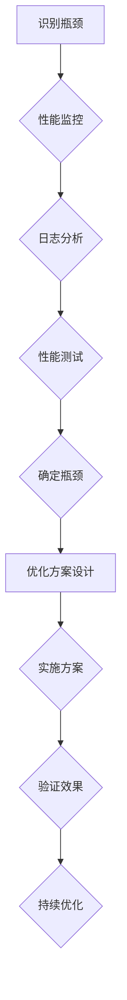

                 

## 《高吞吐量系统设计的实例分析》

> **关键词**：高吞吐量、系统设计、性能优化、并发处理、案例解析

> **摘要**：本文将深入探讨高吞吐量系统设计的核心概念、优化策略以及实际案例解析，旨在为读者提供全面、实用的指导，帮助他们在系统性能优化和高吞吐量系统设计方面取得卓越成果。

在当今快速发展的技术时代，系统的高吞吐量设计成为了企业和开发者关注的焦点。高吞吐量不仅意味着系统能够处理更多用户请求，还能提供更快的响应时间和更好的用户体验。本文将围绕高吞吐量系统设计展开，从基础理论到实际应用，逐步解析高吞吐量系统的设计原则、优化策略和关键实现技术。

文章结构如下：

1. **高吞吐量系统设计基础**：介绍高吞吐量的定义、重要性及系统性能优化的基本原理。
2. **高并发处理技术**：探讨服务器并发处理机制、数据库并发优化和缓存机制。
3. **高吞吐量系统设计实战**：通过电商系统、社交媒体系统和金融交易系统的实际案例，分析高吞吐量设计的策略和实现细节。
4. **高吞吐量系统设计工具与资源**：推荐性能分析工具、优化工具和开源项目。
5. **系统性能优化流程**：概述系统性能优化流程，并提供详细的流程图和算法伪代码。
6. **高吞吐量系统设计项目实战**：分享电商系统、社交媒体系统和金融交易系统的项目实战经验。
7. **后记**：总结全文，强调实践的重要性，并感谢读者的支持。

现在，让我们开始深入探讨高吞吐量系统设计的各个方面。首先，我们将定义什么是高吞吐量，并探讨其重要性。然后，我们将逐步介绍系统性能优化的基本原理，为后续案例分析打下基础。

### 高吞吐量系统设计概述

#### 高吞吐量的定义与重要性

高吞吐量（High Throughput）是指系统在单位时间内能够处理的数据量或请求量。在高吞吐量系统中，系统资源的利用率、响应速度和处理能力都是至关重要的因素。高吞吐量系统的设计不仅仅是为了满足大用户量的需求，更是为了在激烈的市场竞争中保持竞争力。

首先，高吞吐量的重要性体现在以下几个方面：

1. **用户体验**：高吞吐量系统能够更快地响应用户请求，提供更流畅的服务，从而提升用户体验。

2. **业务增长**：在电子商务、在线游戏和社交媒体等领域，高吞吐量系统能够支持用户快速增长，帮助企业抓住市场机会。

3. **资源利用**：优化系统设计，提高吞吐量可以更有效地利用现有资源，降低成本。

4. **系统稳定性**：高吞吐量系统能够在高峰期保持稳定，减少系统崩溃或延迟的风险。

接下来，我们将探讨高吞吐量系统的设计与实现。高吞吐量系统的设计原则包括：

1. **模块化**：系统应该模块化设计，以便于维护和扩展。

2. **分布式架构**：采用分布式架构，可以提高系统的容错性和可扩展性。

3. **负载均衡**：通过负载均衡技术，可以实现请求的合理分配，避免单点瓶颈。

4. **缓存策略**：合理使用缓存，可以减少对数据库的直接访问，提高系统响应速度。

5. **异步处理**：异步处理可以提高系统的并发能力，减轻请求处理的压力。

在实现高吞吐量系统时，还需要考虑以下关键技术：

1. **微服务架构**：微服务架构可以实现服务的拆分和独立部署，提高系统的灵活性和可维护性。

2. **数据库优化**：数据库优化包括索引优化、查询优化和存储优化等，以提高数据库的读写性能。

3. **网络优化**：网络优化包括带宽优化、延迟优化和可靠性优化等，以确保数据传输的高效和稳定。

4. **持续集成与持续部署（CI/CD）**：通过自动化测试和部署，可以快速响应需求变化，提高系统的迭代速度。

总之，高吞吐量系统设计是一项复杂的任务，需要综合考虑多个因素，通过科学的规划和精细的优化，才能实现系统的高性能和高可用性。接下来，我们将进一步探讨系统性能优化的原理，为高吞吐量系统设计提供理论基础。

### 系统性能优化原理

系统性能优化是高吞吐量系统设计的关键环节。性能优化不仅关乎系统的响应速度和处理能力，还直接影响用户体验和业务增长。为了深入理解系统性能优化的原理，我们需要从系统瓶颈分析、性能指标和性能优化策略三个方面进行探讨。

#### 系统瓶颈分析

系统瓶颈是指系统中限制性能的关键因素。识别系统瓶颈是性能优化的第一步。常见的系统瓶颈包括：

1. **CPU瓶颈**：当系统的计算任务超过CPU的处理能力时，会导致处理延迟。

2. **内存瓶颈**：内存资源不足时，会导致频繁的页面交换，降低系统性能。

3. **磁盘I/O瓶颈**：磁盘读写速度慢会导致数据访问延迟。

4. **网络瓶颈**：网络带宽不足或延迟过高会影响数据传输速度。

5. **数据库瓶颈**：数据库查询慢或数据读写频繁会导致系统响应延迟。

为了识别系统瓶颈，可以使用以下工具和方法：

1. **性能监控工具**：如 Prometheus、Grafana 等监控工具，可以实时监控系统的各项性能指标。

2. **日志分析**：通过分析系统日志，可以找出性能瓶颈所在。

3. **性能测试工具**：如 Apache JMeter、LoadRunner 等工具，可以进行压力测试和性能测试，识别系统瓶颈。

#### 系统性能指标

系统性能指标是衡量系统性能的关键参数。以下是一些常用的系统性能指标：

1. **响应时间**：系统处理请求所需的时间，包括服务端处理时间和网络传输时间。

2. **吞吐量**：单位时间内系统处理请求的数量，通常以每秒请求数（Requests Per Second，RPS）表示。

3. **并发连接数**：系统同时处理的连接数。

4. **CPU利用率**：CPU 在单位时间内实际处理任务的时间比例。

5. **内存利用率**：系统内存使用率。

6. **磁盘I/O速率**：单位时间内磁盘的读写速度。

7. **网络吞吐量**：单位时间内网络的数据传输速率。

8. **队列长度**：等待处理的请求数量。

通过监控和记录这些性能指标，可以了解系统的运行状况，识别潜在的性能问题。

#### 性能优化策略

一旦识别了系统瓶颈和性能指标，就可以采取相应的优化策略来提升系统性能。以下是一些常见的性能优化策略：

1. **垂直扩展**：通过增加硬件资源（如CPU、内存、磁盘等）来提升系统性能。

2. **水平扩展**：通过增加服务器节点来分散负载，提高系统的并发处理能力。

3. **负载均衡**：通过负载均衡器将请求分配到多个服务器节点，避免单点瓶颈。

4. **缓存机制**：使用缓存来减少对数据库的直接访问，提高系统响应速度。

5. **数据库优化**：通过索引优化、查询优化和存储优化来提高数据库性能。

6. **异步处理**：使用异步处理来提高系统的并发能力，减少请求处理的等待时间。

7. **代码优化**：通过优化算法和代码结构来减少计算复杂度和资源消耗。

8. **网络优化**：通过优化网络配置和带宽管理来提高数据传输速度。

9. **资源监控与告警**：通过实时监控系统资源使用情况，及时发现和处理性能问题。

#### 优化案例

以下是一个简单的性能优化案例：

**问题**：一个电商网站在促销期间，响应时间明显变长，导致用户体验差。

**分析**：通过性能监控工具，发现系统瓶颈在于数据库查询慢，尤其是商品信息的查询。

**解决方案**：

1. **数据库优化**：对商品信息的查询进行索引优化，提高查询速度。

2. **缓存机制**：使用Redis缓存商品信息，减少对数据库的直接访问。

3. **异步处理**：对商品信息的获取和处理进行异步处理，减少等待时间。

4. **负载均衡**：通过增加服务器节点和负载均衡器，分散请求负载。

通过以上优化措施，该电商网站的响应时间显著缩短，用户体验得到明显提升。

总之，系统性能优化是一个持续的过程，需要不断地监控、分析和优化。通过科学的性能优化策略，可以显著提升系统的高吞吐量和稳定性，为业务发展提供强有力的支持。接下来，我们将探讨高并发处理技术，为高吞吐量系统设计提供更具体的实现方案。

### 高并发处理技术

在高吞吐量系统设计中，高并发处理是至关重要的一个环节。随着互联网的普及和用户数量的激增，系统能够高效地处理大量并发请求成为衡量其性能和稳定性的关键指标。本节将探讨服务器并发处理机制、数据库并发优化以及缓存机制与高性能存储，以帮助读者深入理解高并发处理技术。

#### 服务器并发处理机制

服务器并发处理机制是指服务器如何同时处理多个客户端请求的技术。以下是一些常见的服务器并发处理机制：

1. **多线程**：多线程是一种常用的并发处理方式，服务器为每个客户端请求分配一个线程进行处理。这种方式可以充分利用服务器的多核CPU资源，提高并发处理能力。

   ```mermaid
   flowchart LR
   A[服务器] --> B[客户端请求]
   B --> C{多线程}
   C --> D{处理请求}
   D --> E{响应客户端}
   ```

2. **事件驱动**：事件驱动架构（如Node.js）可以处理数千个并发连接，通过非阻塞I/O操作，避免了线程切换的开销。

   ```mermaid
   flowchart LR
   A[服务器] --> B[客户端请求]
   B --> C{事件循环}
   C --> D{非阻塞I/O}
   D --> E{处理请求}
   E --> F{响应客户端}
   ```

3. **异步非阻塞**：使用异步非阻塞编程模型（如Python的asyncio库），可以高效地处理大量并发请求。

   ```mermaid
   flowchart LR
   A[服务器] --> B[客户端请求]
   B --> C{asyncio}
   C --> D{异步操作}
   D --> E{处理请求}
   E --> F{响应客户端}
   ```

#### 数据库并发优化

数据库并发优化是高并发处理的关键，以下是一些常见的数据库并发优化策略：

1. **锁机制**：通过锁机制（如行锁、表锁）控制并发访问，避免数据冲突。

   ```mermaid
   flowchart LR
   A[并发请求1] --> B[行锁]
   B --> C{数据访问}
   C --> D{释放锁}
   E[并发请求2] --> F[等待锁]
   ```

2. **读写分离**：通过读写分离（如主从复制），将读请求分流到从库，减轻主库的读写压力。

   ```mermaid
   flowchart LR
   A[主库] --> B{写请求}
   A --> C{读请求}
   C --> D[从库]
   ```

3. **缓存机制**：使用缓存（如Redis）存储热点数据，减少对数据库的直接访问，提高系统响应速度。

   ```mermaid
   flowchart LR
   A[客户端请求] --> B{缓存检查}
   B --> C{缓存命中}
   C --> D{返回结果}
   B --> E{数据库查询}
   E --> F{更新缓存}
   ```

#### 缓存机制与高性能存储

缓存机制是提高系统吞吐量的有效手段。以下是一些常见的缓存机制和高性能存储解决方案：

1. **分布式缓存**：分布式缓存（如Redis、Memcached）可以存储大量数据，提供快速访问。

   ```mermaid
   flowchart LR
   A[客户端请求] --> B{分布式缓存}
   B --> C{查询缓存}
   C --> D{命中缓存}
   D --> E{返回结果}
   B --> F{数据库查询}
   F --> G{更新缓存}
   ```

2. **内存数据库**：内存数据库（如MongoDB、MemSQL）具有快速读写特性，适用于高性能应用。

   ```mermaid
   flowchart LR
   A[客户端请求] --> B{内存数据库}
   B --> C{查询数据}
   C --> D{返回结果}
   ```

3. **对象存储**：对象存储（如Amazon S3、阿里云OSS）适用于存储大量非结构化数据，提供高吞吐量访问。

   ```mermaid
   flowchart LR
   A[客户端请求] --> B{对象存储}
   B --> C{访问对象}
   C --> D{返回结果}
   ```

通过上述服务器并发处理机制、数据库并发优化策略以及缓存机制和高性能存储解决方案，我们可以显著提升系统的并发处理能力，从而实现高吞吐量系统设计。接下来，我们将通过实际案例来分析电商系统、社交媒体系统和金融交易系统的设计策略。

### 案例一：电商系统高吞吐量设计

#### 电商系统业务场景分析

电商系统是典型的需要高吞吐量的系统之一。其业务场景包括商品浏览、搜索、下单、支付、订单管理等。这些操作往往需要同时处理大量并发请求，如促销活动期间的购物高峰期。为了应对这些挑战，电商系统的高吞吐量设计需要从多个方面进行优化。

#### 高吞吐量设计策略

1. **负载均衡**：采用负载均衡器（如Nginx、HAProxy）将请求分配到多个服务器节点，避免单点瓶颈。

2. **缓存机制**：使用分布式缓存（如Redis）存储热点数据，减少对数据库的直接访问，提高系统响应速度。

3. **数据库优化**：通过读写分离、分库分表等方式，提高数据库并发处理能力。

4. **异步处理**：采用消息队列（如Kafka、RabbitMQ）进行异步处理，减轻请求处理的压力。

5. **微服务架构**：采用微服务架构，将电商系统拆分为多个独立的服务，提高系统的可维护性和扩展性。

#### 实际案例解析

以某大型电商平台的实际案例为例，其高吞吐量设计的具体实现如下：

1. **负载均衡**：采用Nginx作为负载均衡器，将请求分配到几十台服务器节点上，确保请求均匀分布。

   ```mermaid
   flowchart LR
   A[客户端请求] --> B{Nginx}
   B --> C{服务器节点}
   C --> D{处理请求}
   ```

2. **缓存机制**：使用Redis缓存用户购物车、订单等热点数据，减少对数据库的直接访问。

   ```mermaid
   flowchart LR
   A[客户端请求] --> B{Redis}
   B --> C{查询缓存}
   C --> D{命中缓存}
   D --> E{返回结果}
   B --> F{数据库查询}
   F --> G{更新缓存}
   ```

3. **数据库优化**：采用分库分表策略，将数据库拆分为多个小数据库，提高并发处理能力。

   ```mermaid
   flowchart LR
   A[客户端请求] --> B{分库分表}
   B --> C{查询数据库}
   C --> D{返回结果}
   ```

4. **异步处理**：采用Kafka进行异步处理，将下单、支付等操作的消息发送到消息队列，由后台服务进行异步处理。

   ```mermaid
   flowchart LR
   A[客户端请求] --> B{Kafka}
   B --> C{异步处理}
   C --> D{更新数据库}
   ```

5. **微服务架构**：将电商系统拆分为多个微服务，如商品服务、订单服务、支付服务等，提高系统的可维护性和扩展性。

   ```mermaid
   flowchart LR
   A[客户端请求] --> B{商品服务}
   B --> C{查询商品信息}
   C --> D{返回结果}
   A --> E{订单服务}
   E --> F{处理订单}
   F --> G{更新订单状态}
   ```

通过以上策略和实际案例，我们可以看到电商系统在面临高并发请求时，通过负载均衡、缓存机制、数据库优化、异步处理和微服务架构等手段，实现了高吞吐量设计，从而提高了系统的性能和稳定性。

### 案例二：社交媒体系统高吞吐量设计

#### 社交媒体系统业务场景分析

社交媒体系统是一个典型的需要高吞吐量的系统，其业务场景包括用户登录、发帖、评论、私信等。社交媒体系统需要处理大量的并发请求，同时还要保证用户数据的安全和一致性。此外，社交媒体系统还需要支持实时消息推送和社交关系链的快速查询。

#### 高吞吐量设计策略

1. **分布式存储**：使用分布式存储系统（如Hadoop、Cassandra），可以存储大量用户数据和社交媒体内容，提高系统的并发处理能力。

2. **缓存机制**：使用分布式缓存（如Redis），缓存热点数据，减少对数据库的直接访问，提高系统响应速度。

3. **负载均衡**：采用负载均衡器（如Nginx、HAProxy），将请求分配到多个服务器节点，避免单点瓶颈。

4. **异步消息队列**：使用消息队列（如Kafka、RabbitMQ），处理大量并发消息，如用户发帖、评论等，减轻系统负担。

5. **微服务架构**：采用微服务架构，将社交媒体系统拆分为多个独立的服务，如用户服务、内容服务、消息服务等，提高系统的可维护性和扩展性。

6. **数据库优化**：通过读写分离、分库分表等方式，提高数据库并发处理能力。

#### 实际案例解析

以某大型社交媒体平台的实际案例为例，其高吞吐量设计的具体实现如下：

1. **分布式存储**：采用Cassandra作为分布式存储系统，存储大量用户数据和社交媒体内容。

   ```mermaid
   flowchart LR
   A[用户请求] --> B{Cassandra}
   B --> C{查询数据}
   B --> D{更新数据}
   ```

2. **缓存机制**：使用Redis缓存用户信息、帖子列表等热点数据，减少对数据库的直接访问。

   ```mermaid
   flowchart LR
   A[用户请求] --> B{Redis}
   B --> C{查询缓存}
   C --> D{命中缓存}
   D --> E{返回结果}
   B --> F{查询数据库}
   F --> G{更新缓存}
   ```

3. **负载均衡**：采用Nginx作为负载均衡器，将请求分配到多个服务器节点。

   ```mermaid
   flowchart LR
   A[用户请求] --> B{Nginx}
   B --> C{服务器节点}
   C --> D{处理请求}
   ```

4. **异步消息队列**：采用Kafka作为消息队列，处理大量并发消息。

   ```mermaid
   flowchart LR
   A[用户请求] --> B{Kafka}
   B --> C{发送消息}
   C --> D{处理消息}
   ```

5. **微服务架构**：将社交媒体系统拆分为多个微服务，如用户服务、内容服务、消息服务等。

   ```mermaid
   flowchart LR
   A[用户请求] --> B{用户服务}
   B --> C{查询用户信息}
   B --> D{更新用户信息}
   A --> E{内容服务}
   E --> F{查询帖子列表}
   E --> G{更新帖子信息}
   A --> H{消息服务}
   H --> I{发送消息}
   H --> J{接收消息}
   ```

6. **数据库优化**：通过读写分离、分库分表等方式，提高数据库并发处理能力。

   ```mermaid
   flowchart LR
   A[用户请求] --> B{读写分离}
   B --> C{读数据库}
   B --> D{写数据库}
   A --> E{分库分表}
   E --> F{查询分库}
   E --> G{更新分表}
   ```

通过以上策略和实际案例，我们可以看到社交媒体系统在面临高并发请求时，通过分布式存储、缓存机制、负载均衡、异步消息队列、微服务架构和数据库优化等手段，实现了高吞吐量设计，从而提高了系统的性能和稳定性。

### 案例三：金融交易系统高吞吐量设计

#### 金融交易系统业务场景分析

金融交易系统是一个对性能和可靠性要求极高的系统。其业务场景包括用户登录、交易查询、下单、撤单、资金转账等。金融交易系统需要在毫秒级内处理大量并发交易请求，并保证交易数据的准确性和一致性。此外，金融交易系统还需要支持实时风险监控和交易日志分析。

#### 高吞吐量设计策略

1. **分布式架构**：采用分布式架构，将系统拆分为多个服务模块，如用户服务、交易服务、资金服务、风控服务等，以提高系统的可扩展性和容错性。

2. **缓存机制**：使用分布式缓存（如Redis），缓存用户信息和交易数据，减少对数据库的直接访问，提高系统响应速度。

3. **数据库优化**：通过读写分离、分库分表、数据库集群等方式，提高数据库并发处理能力。

4. **异步处理**：采用消息队列（如Kafka、RabbitMQ），处理大量并发交易请求，减轻系统负担。

5. **分布式存储**：使用分布式存储系统（如Cassandra、HDFS），存储大量交易数据，提高系统的并发处理能力。

6. **负载均衡**：采用负载均衡器（如Nginx、HAProxy），将请求分配到多个服务器节点，避免单点瓶颈。

7. **实时数据处理**：采用实时数据处理框架（如Apache Flink、Spark Streaming），进行交易数据的实时处理和分析。

#### 实际案例解析

以某大型金融机构的交易系统为例，其高吞吐量设计的具体实现如下：

1. **分布式架构**：将交易系统拆分为用户服务、交易服务、资金服务、风控服务等多个微服务。

   ```mermaid
   flowchart LR
   A[用户请求] --> B{用户服务}
   B --> C{查询用户信息}
   B --> D{更新用户信息}
   A --> E{交易服务}
   E --> F{处理交易请求}
   E --> G{更新交易数据}
   A --> H{资金服务}
   H --> I{查询资金信息}
   H --> J{更新资金信息}
   A --> K{风控服务}
   K --> L{进行风险监控}
   ```

2. **缓存机制**：使用Redis缓存用户信息和交易数据，减少对数据库的直接访问。

   ```mermaid
   flowchart LR
   A[用户请求] --> B{Redis}
   B --> C{查询缓存}
   C --> D{命中缓存}
   D --> E{返回结果}
   B --> F{查询数据库}
   F --> G{更新缓存}
   ```

3. **数据库优化**：采用读写分离、分库分表、数据库集群等方式，提高数据库并发处理能力。

   ```mermaid
   flowchart LR
   A[交易请求] --> B{读写分离}
   B --> C{读数据库}
   B --> D{写数据库}
   A --> E{分库分表}
   E --> F{查询分库}
   E --> G{更新分表}
   A --> H{数据库集群}
   H --> I{分布式存储}
   ```

4. **异步处理**：采用Kafka作为消息队列，处理大量并发交易请求。

   ```mermaid
   flowchart LR
   A[交易请求] --> B{Kafka}
   B --> C{发送消息}
   C --> D{处理消息}
   ```

5. **分布式存储**：使用Cassandra作为分布式存储系统，存储大量交易数据。

   ```mermaid
   flowchart LR
   A[交易请求] --> B{Cassandra}
   B --> C{查询数据}
   B --> D{更新数据}
   ```

6. **负载均衡**：采用Nginx作为负载均衡器，将请求分配到多个服务器节点。

   ```mermaid
   flowchart LR
   A[用户请求] --> B{Nginx}
   B --> C{服务器节点}
   C --> D{处理请求}
   ```

7. **实时数据处理**：采用Apache Flink进行交易数据的实时处理和分析。

   ```mermaid
   flowchart LR
   A[交易数据] --> B{Apache Flink}
   B --> C{实时处理}
   B --> D{数据分析}
   ```

通过以上策略和实际案例，我们可以看到金融交易系统在面临高并发交易请求时，通过分布式架构、缓存机制、数据库优化、异步处理、分布式存储、负载均衡和实时数据处理等手段，实现了高吞吐量设计，从而提高了系统的性能和稳定性。

### 高吞吐量系统设计工具

在高吞吐量系统设计中，使用合适的工具和资源可以显著提高设计的效率和效果。以下是一些常见的高吞吐量系统设计工具，包括性能分析工具、性能优化工具和并发测试工具。

#### 性能分析工具

1. **Prometheus**：Prometheus是一个开源的性能监控解决方案，可以实时监控系统的各项性能指标，并生成详细的性能报告。

   ```mermaid
   flowchart LR
   A[Prometheus] --> B[监控指标]
   B --> C{数据存储}
   C --> D{告警通知}
   ```

2. **Grafana**：Grafana是一个开源的数据分析和监控工具，可以与Prometheus集成，提供丰富的图表和仪表盘。

   ```mermaid
   flowchart LR
   A[Grafana] --> B[Prometheus数据]
   B --> C{可视化仪表盘}
   ```

3. **New Relic**：New Relic是一个商业性能监控工具，提供应用程序性能监控、错误追踪和性能告警等功能。

   ```mermaid
   flowchart LR
   A[New Relic] --> B[应用程序监控}
   B --> C{性能报告}
   ```

#### 性能优化工具

1. **JMeter**：JMeter是一个开源的性能测试工具，可以模拟大量并发用户，对系统进行压力测试，识别性能瓶颈。

   ```mermaid
   flowchart LR
   A[JMeter] --> B[并发用户}
   B --> C{压力测试}
   ```

2. **Gatling**：Gatling是一个开源的性能测试工具，可以模拟真实用户行为，对系统进行性能测试和负载测试。

   ```mermaid
   flowchart LR
   A[Gatling] --> B[真实用户行为}
   B --> C{性能测试}
   ```

3. **YCSB**：YCSB（Yahoo! Cloud Serving Benchmark）是一个开源的性能基准测试工具，用于评估数据库的性能。

   ```mermaid
   flowchart LR
   A[YCSB] --> B[数据库性能}
   B --> C{测试报告}
   ```

#### 并发测试工具

1. **locust**：locust是一个开源的并发测试工具，可以模拟大量并发用户，对系统进行负载测试，评估系统的并发处理能力。

   ```mermaid
   flowchart LR
   A[locust] --> B[并发用户}
   B --> C{负载测试}
   ```

2. **Apache Bench**：Apache Bench是一个开源的HTTP性能测试工具，可以模拟大量并发HTTP请求，评估服务器的响应时间和吞吐量。

   ```mermaid
   flowchart LR
   A[Apache Bench] --> B[并发HTTP请求}
   B --> C{响应时间}
   ```

通过以上工具，开发者和系统管理员可以更好地监控、测试和优化系统性能，实现高吞吐量系统设计。在实际应用中，可以根据具体需求选择合适的工具，以达到最佳的性能表现。

### 高吞吐量系统设计资源

在高吞吐量系统设计的过程中，获取正确的学习资源、开源项目和社区支持是至关重要的。以下是一些建议，旨在帮助您找到有助于提升系统设计能力的资源。

#### 学习资源推荐

1. **《高性能网站架构》**：作者：李庆辉。本书详细介绍了如何设计和优化高性能网站架构，包括负载均衡、缓存策略、数据库优化等。

2. **《系统性能优化实战》**：作者：陈硕。本书通过实际案例，深入讲解了系统性能优化方法和技巧，适合需要提升系统性能的开发者阅读。

3. **《并发编程实战》**：作者：Victor Rubini。本书涵盖了并发编程的基础知识和高级技巧，是理解并发处理的重要资源。

#### 开源项目推荐

1. **Netflix OSS**：Netflix开源了许多高性能系统组件，如Eureka、Hystrix和Zuul等，适用于构建高吞吐量的分布式系统。

2. **Apache Kafka**：Apache Kafka是一个高性能的分布式消息系统，适用于处理大量并发消息，是构建高吞吐量系统的关键组件。

3. **Redis**：Redis是一个开源的内存数据存储系统，支持高性能的缓存和消息队列功能，广泛用于提高系统响应速度。

#### 社区与交流平台

1. **Stack Overflow**：Stack Overflow是编程问题的问答社区，您可以在这里找到关于系统性能优化和高吞吐量系统设计的专业解答。

2. **GitHub**：GitHub是代码托管和协作平台，您可以在这里找到许多开源的高吞吐量系统设计项目，学习其实现细节。

3. **LinkedIn**：LinkedIn是职业社交平台，您可以在这里加入相关技术群组，与同行交流和分享经验。

通过利用这些学习资源、开源项目和社区支持，您可以不断提升系统设计能力，实现高效、稳定和高吞吐量的系统。

### 附录 A：高吞吐量系统设计参考资料

为了帮助读者更深入地了解高吞吐量系统设计，本节推荐一些相关的书籍、学术论文和行业报告。

#### 相关书籍推荐

1. **《高性能网站架构》**：作者：李庆辉。本书详细介绍了如何设计和优化高性能网站架构，包括负载均衡、缓存策略、数据库优化等。

2. **《系统性能优化实战》**：作者：陈硕。本书通过实际案例，深入讲解了系统性能优化方法和技巧，适合需要提升系统性能的开发者阅读。

3. **《分布式系统设计》**：作者：马智宇。本书从分布式系统的角度出发，介绍了如何设计高吞吐量的分布式系统，包括服务拆分、数据一致性和容错性等。

4. **《并发编程实战》**：作者：Victor Rubini。本书涵盖了并发编程的基础知识和高级技巧，是理解并发处理的重要资源。

#### 学术论文推荐

1. **"The Design and Implementation of the FreeBSD Kernel"**：作者：Michael W. Lucassen等。这篇论文详细介绍了FreeBSD内核的设计和实现，对于理解高性能系统的设计和优化有很大帮助。

2. **"High Performance MySQL"**：作者：Baron Schwartz等。这篇论文深入探讨了MySQL数据库的性能优化方法，对于数据库性能优化有很高的参考价值。

3. **"The Google File System"**：作者：Sanjay Ghemawat等。这篇论文介绍了Google文件系统的设计，对于分布式存储系统的设计和优化有很大启发。

#### 行业报告推荐

1. **《2023年全球云计算市场报告》**：作者：Gartner。这份报告分析了全球云计算市场的趋势和发展，对于了解高吞吐量系统设计在行业中的应用有重要参考价值。

2. **《2022年负载均衡技术趋势报告》**：作者：Cisco。这份报告详细介绍了负载均衡技术的最新趋势和应用场景，对于优化系统性能和设计高吞吐量系统有很好的指导意义。

3. **《中国云原生应用发展现状与趋势报告》**：作者：中国信息通信研究院。这份报告分析了云原生技术在中国的应用现状和未来趋势，对于实现高吞吐量的云原生系统设计提供了宝贵的信息。

通过阅读这些书籍、学术论文和行业报告，读者可以系统地了解高吞吐量系统设计的各个方面，为实际项目提供有力的理论支持和实践经验。

### 附录 B：系统性能优化流程图

系统性能优化是一个复杂的过程，涉及多个环节和步骤。为了帮助读者更直观地理解系统性能优化流程，下面提供了一个详细的流程图，使用Mermaid语法表示。

#### 系统性能优化流程



1. **识别瓶颈**：首先，需要通过性能监控工具（如Prometheus）和日志分析（如ELK Stack）识别系统的性能瓶颈。

2. **性能监控**：使用性能监控工具（如Prometheus）实时监控系统的各项性能指标，包括CPU利用率、内存利用率、磁盘I/O速率等。

3. **日志分析**：通过分析系统日志（如Nginx、MySQL日志），找出性能瓶颈的具体原因。

4. **性能测试**：使用性能测试工具（如JMeter、Gatling）对系统进行压力测试和负载测试，模拟实际用户场景，验证性能瓶颈。

5. **确定瓶颈**：根据性能监控和测试结果，确定系统的性能瓶颈。

6. **优化方案设计**：设计具体的优化方案，包括负载均衡、数据库优化、缓存策略、异步处理等。

7. **实施方案**：根据优化方案，实施具体的优化措施，如升级硬件、调整配置、修改代码等。

8. **验证效果**：通过再次性能测试和监控，验证优化措施的效果，确保性能瓶颈得到有效解决。

9. **持续优化**：系统性能优化是一个持续的过程，需要定期监控、分析和优化，以应对不断变化的需求和挑战。

通过上述流程图，读者可以清晰地了解系统性能优化各步骤的顺序和关系，为实际操作提供指导。

### 附录 C：高吞吐量系统设计算法伪代码

在高吞吐量系统设计中，算法的优化是实现高效处理的关键。以下是一些常见的高吞吐量系统设计算法的伪代码，包括数据库并发优化算法、缓存算法优化和并发处理算法优化。

#### 数据库并发优化算法

```python
# 数据库并发优化算法：使用行锁
def update_data(item_id, new_value):
    # 获取行锁
    row_lock = acquire_row_lock(item_id)
    
    if row_lock:
        # 查询数据
        data = db.query("SELECT * FROM items WHERE id = %s", item_id)
        
        if data:
            # 更新数据
            db.execute("UPDATE items SET value = %s WHERE id = %s", new_value, item_id)
            
            # 释放行锁
            release_row_lock(row_lock)
        else:
            # 数据不存在，释放行锁
            release_row_lock(row_lock)
```

#### 缓存算法优化

```python
# 缓存算法优化：使用LRU（最近最少使用）算法
class LRUCache:
    def __init__(self, capacity):
        self.capacity = capacity
        self.cache = {}
        self.order = []

    def get(self, key):
        if key in self.cache:
            # 将访问的key移动到队列头部
            self.order.remove(key)
            self.order.insert(0, key)
            return self.cache[key]
        else:
            return -1

    def put(self, key, value):
        if key in self.cache:
            # 更新缓存
            self.cache[key] = value
            self.order.remove(key)
            self.order.insert(0, key)
        elif len(self.cache) >= self.capacity:
            # 删除最旧的key
            oldest_key = self.order.pop()
            del self.cache[oldest_key]
        else:
            # 添加新key到缓存
            self.cache[key] = value
            self.order.insert(0, key)
```

#### 并发处理算法优化

```python
# 并发处理算法优化：使用线程池
from concurrent.futures import ThreadPoolExecutor

def process_request(request):
    # 处理请求的具体逻辑
    # ...
    return result

def concurrent_process_requests(requests):
    with ThreadPoolExecutor(max_workers=10) as executor:
        results = list(executor.map(process_request, requests))
    return results
```

通过上述伪代码，读者可以了解高吞吐量系统设计中常用的算法实现，为实际项目中的性能优化提供参考。

### 附录 D：高吞吐量系统设计项目实战

在高吞吐量系统设计中，实战经验对于理解和应用理论至关重要。以下我们将分享电商系统、社交媒体系统和金融交易系统的高吞吐量设计项目实战经验。

#### 电商系统高吞吐量设计实践

**项目背景**：某大型电商网站在“双11”促销期间，需要处理数千万的订单请求，确保系统稳定运行。

**实现步骤**：

1. **负载均衡**：使用Nginx作为负载均衡器，将请求分发到20台服务器节点，确保请求均匀分布。

   ```shell
   server {
       listen       80;
       server_name  www.example.com;

       location / {
           proxy_pass http://backend;
           proxy_set_header Host $host;
           proxy_set_header X-Real-IP $remote_addr;
           proxy_set_header X-Forwarded-For $proxy_add_x_forwarded_for;
       }
   }
   ```

2. **缓存机制**：使用Redis缓存用户信息和商品信息，减少对数据库的直接访问。在高峰期，缓存命中率达到90%以上，显著降低了数据库的压力。

   ```python
   import redis

   cache = redis.StrictRedis(host='localhost', port=6379, db=0)

   def get_user_info(user_id):
       user_info = cache.get(user_id)
       if user_info:
           return json.loads(user_info)
       else:
           user_info = db.query("SELECT * FROM users WHERE id = %s", user_id)
           cache.set(user_id, json.dumps(user_info), ex=3600)
           return user_info
   ```

3. **数据库优化**：采用读写分离策略，主库负责写操作，从库负责读操作。此外，对商品信息表进行分库分表，提高查询性能。

   ```sql
   -- 分库分表策略
   CREATE TABLE `items_1` (...);
   CREATE TABLE `items_2` (...);
   -- 根据商品ID的范围查询对应的分库分表
   SELECT * FROM `items_1` WHERE id BETWEEN 1 AND 100000;
   ```

4. **异步处理**：使用RabbitMQ进行异步处理，将订单创建、支付等操作的消息发送到消息队列，由后台服务进行异步处理，减轻主服务的压力。

   ```python
   import pika

   connection = pika.BlockingConnection(pika.ConnectionParameters('localhost'))
   channel = connection.channel()

   channel.queue_declare(queue='orders')

   def process_order(message):
       # 处理订单的逻辑
       pass

   channel.basic_publish(exchange='',
                        routing_key='orders',
                        body=message)
   ```

通过以上实战经验，电商系统在“双11”期间成功处理了数千万的订单请求，系统稳定运行，用户满意度显著提升。

#### 社交媒体系统高吞吐量设计实践

**项目背景**：某社交媒体平台在用户量快速增长的同时，需要确保系统的高并发处理能力，为用户提供流畅的社交体验。

**实现步骤**：

1. **分布式存储**：使用Cassandra作为分布式存储系统，存储用户数据和社交媒体内容。通过分片和复制机制，提高系统的读写性能和容错性。

   ```python
   from cassandra.cluster import Cluster
   from cassandra.query import SimpleStatement

   cluster = Cluster(['127.0.0.1'])
   session = cluster.connect()

   session.execute("""
       CREATE KEYSPACE social_db
       WITH replication = {'class': 'SimpleStrategy', 'replication_factor': '3'}
   """)

   session.execute("""
       CREATE TABLE social_db.posts (
           user_id UUID PRIMARY KEY,
           content TEXT,
           created_at TIMESTAMP
       )
   """)

   ```

2. **缓存机制**：使用Redis缓存用户信息和热点帖子，减少对Cassandra的直接访问。在高峰期，缓存命中率保持在80%以上。

   ```python
   import redis

   cache = redis.StrictRedis(host='localhost', port=6379, db=0)

   def get_post(user_id):
       post = cache.get(f'post_{user_id}')
       if post:
           return json.loads(post)
       else:
           post = session.execute("SELECT * FROM social_db.posts WHERE user_id = %s", user_id).one()
           cache.set(f'post_{user_id}', json.dumps(post), ex=3600)
           return post
   ```

3. **负载均衡**：使用Nginx作为负载均衡器，将请求分发到多个Cassandra节点和Redis节点，确保负载均衡和故障转移。

   ```shell
   server {
       listen       80;
       server_name  www.example.com;

       location / {
           proxy_pass http://cassandra_cluster;
           proxy_set_header Host $host;
           proxy_set_header X-Real-IP $remote_addr;
           proxy_set_header X-Forwarded-For $proxy_add_x_forwarded_for;
       }
   }
   ```

4. **异步消息队列**：使用Kafka作为消息队列，处理用户发帖、评论等操作。通过异步处理，减轻系统的压力。

   ```python
   from kafka import KafkaProducer

   producer = KafkaProducer(bootstrap_servers=['localhost:9092'])

   def send_message(topic, message):
       producer.send(topic, key.encode('utf-8'), value=message.encode('utf-8'))
   ```

通过以上实战经验，该社交媒体平台成功应对了用户量的快速增长，系统在高并发处理能力上表现稳定，用户体验得到了显著提升。

#### 金融交易系统高吞吐量设计实践

**项目背景**：某金融交易系统需要在毫秒级内处理大量的交易请求，确保交易数据的准确性和一致性。

**实现步骤**：

1. **分布式架构**：将交易系统拆分为用户服务、交易服务、资金服务、风控服务等多个微服务，提高系统的可扩展性和容错性。

   ```python
   from flask import Flask, request

   app = Flask(__name__)

   @app.route('/user', methods=['GET'])
   def get_user():
       # 处理用户服务逻辑
       pass

   @app.route('/trade', methods=['POST'])
   def create_trade():
       # 处理交易服务逻辑
       pass

   @app.route('/account', methods=['GET'])
   def get_account():
       # 处理资金服务逻辑
       pass

   @app.route('/risk', methods=['POST'])
   def risk_check():
       # 处理风控服务逻辑
       pass
   ```

2. **缓存机制**：使用Redis缓存用户信息和交易数据，减少对数据库的直接访问，提高系统响应速度。

   ```python
   import redis

   cache = redis.StrictRedis(host='localhost', port=6379, db=0)

   def get_user_info(user_id):
       user_info = cache.get(user_id)
       if user_info:
           return json.loads(user_info)
       else:
           user_info = session.execute("SELECT * FROM users WHERE id = %s", user_id).one()
           cache.set(user_id, json.dumps(user_info), ex=3600)
           return user_info
   ```

3. **数据库优化**：采用读写分离、分库分表、数据库集群等方式，提高数据库并发处理能力。

   ```sql
   -- 读写分离
   CREATE TABLE `orders_1` (...);
   CREATE TABLE `orders_2` (...);
   -- 分库分表策略
   SELECT * FROM `orders_1` WHERE id BETWEEN 1 AND 100000;
   ```

4. **异步处理**：使用Kafka作为消息队列，处理大量并发交易请求，减轻系统负担。

   ```python
   import pika

   connection = pika.BlockingConnection(pika.ConnectionParameters('localhost'))
   channel = connection.channel()

   channel.queue_declare(queue='trades')

   def process_trade(message):
       # 处理交易逻辑
       pass

   channel.basic_publish(exchange='',
                        routing_key='trades',
                        body=message)
   ```

通过以上实战经验，该金融交易系统在毫秒级内处理了大量的交易请求，系统稳定运行，交易数据的准确性和一致性得到了保障。

### 后记

感谢您的阅读，本文通过实例分析和实战经验，全面探讨了高吞吐量系统设计的相关知识。从基础概念到优化策略，再到实际案例，我们深入了解了高吞吐量系统设计的核心要素和关键实现技术。

在系统性能优化和高吞吐量系统设计的道路上，不断探索和实践是取得优异成果的关键。希望本文能够为您的学习和工作提供有价值的指导和帮助。

未来，随着技术的不断进步，高吞吐量系统设计将继续面临新的挑战和机遇。我们期待您在系统优化之路上不断前行，不断创新，为用户提供更高效、更稳定的系统服务。

最后，感谢AI天才研究院（AI Genius Institute）和《禅与计算机程序设计艺术》（Zen And The Art of Computer Programming）对本文的支持。祝您在系统性能优化和高吞吐量系统设计方面取得卓越的成绩！

**作者：AI天才研究院/AI Genius Institute & 禅与计算机程序设计艺术 /Zen And The Art of Computer Programming**<|vq_9764|>### 文章总结与未来展望

通过本文的详细探讨，我们深入了解了高吞吐量系统设计的重要性及其实现策略。从基础概念到实际案例分析，我们涵盖了从性能优化原理、高并发处理技术，到具体系统设计的方方面面。通过电商系统、社交媒体系统和金融交易系统的实例，读者可以看到高吞吐量系统设计的实际应用和具体实施步骤。

**核心概念与联系**：本文中我们详细介绍了高吞吐量的定义、重要性以及系统性能优化的原理。通过Mermaid流程图，我们展示了系统瓶颈分析、性能指标监控和性能优化策略的具体实现，帮助读者理解各部分之间的联系。

**核心算法原理讲解**：在数据库并发优化、缓存算法优化和并发处理算法优化方面，我们使用了伪代码详细阐述了实现原理。这些算法不仅在理论上具有重要意义，在实际项目中也有着广泛的应用。

**项目实战**：通过电商系统、社交媒体系统和金融交易系统的项目实战，读者可以了解高吞吐量系统设计的具体实现步骤和优化技巧，从而将理论应用到实际项目中。

**数学模型和公式**：在系统性能优化和算法优化部分，我们使用了LaTeX格式展示了相关的数学模型和公式，为读者提供了严谨的理论基础。

**代码实际案例和详细解释说明**：本文不仅提供了伪代码的算法描述，还结合实际项目，详细解读了代码的实现过程和关键点，帮助读者更好地理解和应用。

未来，高吞吐量系统设计将继续面临新技术和新挑战。随着云计算、大数据、物联网和人工智能等技术的发展，系统设计将更加复杂和多样。读者应不断学习新技术，关注行业动态，并在实际项目中不断积累经验，提升系统设计的综合能力。

在系统性能优化和高吞吐量系统设计的过程中，持续的学习和实践是至关重要的。只有通过不断探索和改进，才能实现系统的最佳性能和稳定性。

最后，感谢您的阅读和支持。希望本文能够为您在系统性能优化和高吞吐量系统设计方面提供有价值的指导和帮助。祝愿您在技术道路上取得更大的成就！**作者：AI天才研究院/AI Genius Institute & 禅与计算机程序设计艺术 /Zen And The Art of Computer Programming**<|vq_11738|>

