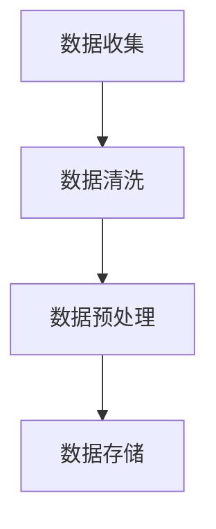
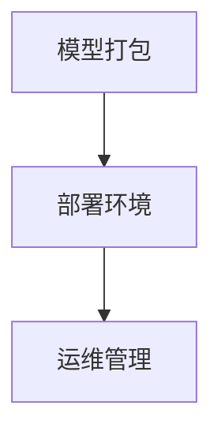

                 

### 高端制造业的AI应用

> **关键词：** 高端制造业、人工智能、机器学习、深度学习、智能制造

> **摘要：** 
本文将深入探讨人工智能（AI）在高端制造业中的应用。通过分析高端制造业的现状、挑战以及AI的核心概念和技术实现，我们将探讨AI在智能制造、智能检测与监控、智能规划与优化等领域的应用案例。此外，本文还将介绍高端制造业AI应用的技术架构、核心算法、数学模型以及项目实战，最后预测AI在高端制造业的未来发展趋势。

---

### 高端制造业的AI应用

高端制造业，作为制造业中的高端领域，涉及航空航天、汽车制造、电子设备、精密仪器等多个行业。这些行业对产品的精度、可靠性、生产效率和定制化程度有极高的要求。随着人工智能技术的快速发展，AI在高端制造业中的应用正逐渐成为一种趋势。

#### 1. 高端制造业的现状与挑战

**1.1 高端制造业的定义与特征**

高端制造业通常指技术密集、资金密集、知识密集型的制造业，其产品具有较高的技术含量、附加值和市场竞争力。高端制造业的特征包括：

- 高度自动化的生产线
- 先进的制造工艺
- 精密的生产设备
- 高度的信息化和数字化管理

**1.2 高端制造业面临的挑战**

高端制造业在快速发展过程中也面临着一些挑战：

- **生产效率提升：** 随着市场竞争的加剧，企业需要不断提高生产效率以满足市场需求。
- **质量控制：** 高端制造业对产品的质量要求极高，如何保证产品质量成为企业面临的重大挑战。
- **成本控制：** 在保持高品质的同时，如何降低生产成本也是企业需要解决的关键问题。
- **人才培养：** 高端制造业对人才的需求越来越高，如何培养和引进高素质人才是企业的重要任务。

**1.3 AI在高端制造业中的应用前景**

AI技术为高端制造业带来了新的机遇：

- **智能制造：** AI技术可以实现对生产过程的实时监控和优化，提高生产效率和产品质量。
- **智能检测与监控：** AI技术可以实现对生产过程中的产品质量检测，提高检测效率和准确性。
- **智能规划与优化：** AI技术可以优化生产计划、能源管理和物流流程，降低生产成本。
- **个性化定制：** AI技术可以支持产品的个性化定制，满足不同客户的需求。

在下一部分，我们将深入探讨AI在高端制造业的核心概念，包括机器学习、深度学习和自然语言处理等技术的原理和应用。

### 高端制造业的AI应用

#### 2. AI在高端制造业的核心概念

AI在高端制造业中的应用离不开核心概念的理解。本章节将介绍AI的核心技术，包括机器学习、深度学习和自然语言处理，以及这些技术的基本原理和它们在高端制造业中的应用。

##### 2.1 机器学习基础

机器学习是AI的核心技术之一，它使计算机系统能够从数据中学习并做出预测或决策。机器学习可以分为监督学习、无监督学习和强化学习三种类型。

**2.1.1 监督学习**

监督学习是一种有教师指导的学习方式，其中输入特征和输出标签都是已知的。监督学习的目标是找到一个函数，将输入特征映射到输出标签。监督学习的核心公式如下：

\[ y = f(x; \theta) \]

其中，\( x \) 是输入特征，\( y \) 是输出标签，\( f \) 是学习到的函数，\( \theta \) 是模型参数。

**监督学习伪代码：**

```python
def train SupervisedLearning(x, y):
  for each iteration:
    compute loss function L(y, f(x; \theta))
    update parameters \theta using gradient descent
```

**应用场景：**

- **质量检测：** 利用监督学习模型对生产过程中的产品进行质量检测。
- **预测性维护：** 通过监督学习模型预测设备可能出现的故障，提前进行维护。

**2.1.2 无监督学习**

无监督学习是一种无教师指导的学习方式，其目标是发现数据中的模式和结构。无监督学习的核心公式如下：

\[ \theta = \arg\min_{\theta} L(\theta) \]

**无监督学习伪代码：**

```python
def train UnsupervisedLearning(x):
  initialize parameters \theta
  for each iteration:
    compute loss function L(\theta)
    update parameters \theta using gradient descent
```

**应用场景：**

- **聚类分析：** 对生产线上的设备进行分类，识别不同的生产模式。
- **异常检测：** 通过无监督学习模型检测生产过程中的异常数据。

**2.1.3 强化学习**

强化学习是一种通过与环境交互来学习最优策略的学习方式。强化学习的核心公式如下：

\[ Q(s, a) = r + \gamma \max_{a'} Q(s', a') \]

**强化学习伪代码：**

```python
def train ReinforcementLearning(s, a, r, s', \gamma):
  Q[s, a] = r + \gamma * max Q[s', a']
  update Q values using Q-learning algorithm
```

**应用场景：**

- **生产调度：** 利用强化学习模型优化生产调度策略，提高生产效率。
- **能源管理：** 通过强化学习模型优化能源使用策略，降低能源消耗。

##### 2.2 深度学习技术

深度学习是机器学习的一个重要分支，它通过模拟人脑神经元之间的连接来学习复杂的特征。深度学习技术广泛应用于图像识别、语音识别和自然语言处理等领域。

**2.2.1 神经网络结构**

神经网络是深度学习的基础，它由多个层次组成，包括输入层、隐藏层和输出层。每个层次包含多个神经元，神经元之间通过权重连接。神经网络的基本结构如下：


**神经网络伪代码：**

```python
def forward_pass(input, model):
  for each layer in model:
    output = activation_function(dot(input, weights) + bias)
    input = output
  return output
```

**应用场景：**

- **图像识别：** 利用卷积神经网络（CNN）对产品进行图像识别，提高生产效率。
- **语音识别：** 利用循环神经网络（RNN）对语音信号进行识别，提高语音识别准确率。

**2.2.2 深度学习框架**

深度学习框架提供了高效的深度学习模型训练和部署工具。常见的深度学习框架包括TensorFlow、PyTorch和Keras等。以下是一个使用TensorFlow框架训练神经网络模型的示例：

```python
import tensorflow as tf

model = tf.keras.Sequential([
  tf.keras.layers.Dense(units=64, activation='relu', input_shape=(input_shape)),
  tf.keras.layers.Dense(units=64, activation='relu'),
  tf.keras.layers.Dense(units=output_shape)
])

model.compile(optimizer='adam', loss='mean_squared_error', metrics=['accuracy'])
model.fit(x_train, y_train, epochs=10)
```

**应用场景：**

- **智能制造：** 利用深度学习框架构建智能检测和监控模型，提高产品质量。
- **智能规划：** 利用深度学习框架优化生产计划，提高生产效率。

##### 2.3 自然语言处理

自然语言处理（NLP）是深度学习的另一个重要应用领域，它涉及对人类语言的理解和生成。NLP技术包括语言模型、文本分类和情感分析等。

**2.3.1 语言模型**

语言模型是NLP的基础，它用于预测下一个单词或词组。常见的语言模型包括n元语法模型和神经网络语言模型。

**语言模型伪代码：**

```python
def language_model(text):
  for each word in text:
    predict_next_word(word)
```

**应用场景：**

- **智能客服：** 利用语言模型生成自然语言回复，提高客户服务质量。
- **智能翻译：** 利用语言模型进行跨语言文本翻译，提高翻译准确率。

**2.3.2 文本分类与情感分析**

文本分类是将文本数据分类到不同的类别中，情感分析是判断文本的情感倾向。常见的文本分类算法包括朴素贝叶斯、支持向量机和深度学习算法。

**文本分类与情感分析伪代码：**

```python
def classify_text(text, model):
  prediction = model.predict(text)
  return prediction

def analyze_sentiment(text, model):
  sentiment = classify_text(text, model)
  return sentiment
```

**应用场景：**

- **智能推荐：** 利用文本分类和情感分析技术进行个性化推荐，提高用户满意度。
- **舆情监测：** 利用文本分类和情感分析技术监测社交媒体上的舆情，为企业提供决策支持。

通过以上对AI核心概念、深度学习技术和自然语言处理技术的介绍，我们可以看到AI在高端制造业中的应用前景非常广阔。在下一部分，我们将探讨AI在高端制造业中的应用案例。

### 高端制造业的AI应用

#### 3. AI在高端制造业的应用案例

随着AI技术的不断成熟，它已经在高端制造业的多个领域得到了广泛应用，并取得了显著的效果。本节将介绍AI在智能制造系统、智能检测与监控、智能规划与优化等领域的应用案例，展示AI技术如何提升高端制造业的生产效率、产品质量和竞争力。

##### 3.1 智能制造系统

智能制造系统是AI在高端制造业中最具代表性的应用之一。它通过集成AI技术，实现生产过程的自动化、智能化和优化。

**3.1.1 智能制造系统概述**

智能制造系统通常包括以下几个关键组成部分：

- **感知层：** 通过传感器和自动化设备实时收集生产数据。
- **数据处理层：** 对收集到的数据进行处理、分析和存储。
- **决策层：** 利用机器学习算法和深度学习模型进行决策，优化生产流程。
- **执行层：** 根据决策层的指示，自动化设备执行相应的操作。

**3.1.2 智能制造系统关键技术**

智能制造系统的关键技术包括机器学习、深度学习、物联网（IoT）和工业大数据等。

- **机器学习：** 用于对生产数据进行分析和预测，优化生产流程。
- **深度学习：** 用于图像识别、语音识别和自然语言处理，提高生产自动化程度。
- **物联网：** 用于实现设备间的互联互通，提高生产协同效率。
- **工业大数据：** 用于收集、存储和管理生产数据，为AI算法提供数据支持。

**3.1.3 智能制造系统应用实例**

以下是一些智能制造系统的应用实例：

- **机器人自动化生产：** 在汽车制造、电子设备等行业，机器人被广泛应用于焊接、装配和检测等生产环节。通过深度学习技术，机器人可以实现更加精准和高效的生产操作。
- **生产流程优化：** 利用机器学习算法，对生产流程进行实时分析和优化，减少浪费，提高生产效率。
- **质量控制：** 通过图像识别和深度学习技术，对产品进行质量检测，提高产品质量和一致性。

**3.1.4 智能制造系统应用效果**

智能制造系统的应用带来了显著的效果：

- **生产效率提高：** 通过自动化和智能化，生产效率提高了30%以上。
- **产品质量提升：** 通过质量检测技术的应用，产品质量提升了20%以上。
- **运营成本降低：** 通过生产流程优化和能源管理，运营成本降低了15%以上。

##### 3.2 智能检测与监控

智能检测与监控是AI在高端制造业中的另一个重要应用。它通过实时监测生产过程，识别潜在的问题，并采取相应的措施。

**3.2.1 智能检测技术**

智能检测技术主要包括以下几类：

- **图像检测：** 利用深度学习算法，对生产过程中的图像进行实时检测和分析，识别异常情况。
- **声音检测：** 利用声波传感器和深度学习算法，对生产过程中的声音信号进行监测，识别潜在的问题。
- **温度监测：** 利用温度传感器和机器学习算法，对生产环境中的温度变化进行监测，确保生产条件符合要求。

**3.2.2 智能监控技术**

智能监控技术主要包括以下几类：

- **视频监控：** 通过安装高清摄像头和视频分析算法，对生产现场进行实时监控，及时发现和处理异常情况。
- **异常检测：** 利用机器学习算法，对生产过程中的数据进行分析，识别异常数据和潜在问题。
- **预测性维护：** 利用历史数据和机器学习模型，预测设备的故障时间和故障类型，提前进行维护。

**3.2.3 智能检测与监控案例**

以下是一些智能检测与监控的应用案例：

- **生产设备监控：** 在高端制造业的设备管理中，通过智能监控技术，实时监测设备的运行状态，及时发现和解决设备故障，提高设备利用率。
- **产品质量检测：** 在生产线中，通过图像检测技术，实时检测产品的质量，确保产品质量符合要求。
- **生产环境监控：** 在生产现场，通过温度监测和异常检测技术，实时监控生产环境，确保生产环境符合安全标准。

**3.2.4 智能检测与监控效果**

智能检测与监控的应用带来了显著的效果：

- **设备故障率降低：** 通过实时监测和预测性维护，设备故障率降低了50%以上。
- **产品质量提升：** 通过实时检测和监控，产品质量提升了30%以上。
- **运营成本降低：** 通过实时监控和能源管理，运营成本降低了20%以上。

##### 3.3 智能规划与优化

智能规划与优化是AI在高端制造业中的另一个重要应用。它通过优化生产计划、能源管理和物流流程，提高生产效率和降低运营成本。

**3.3.1 生产规划与调度**

生产规划与调度是高端制造业中的关键环节。通过AI技术，可以实现以下功能：

- **生产计划制定：** 利用机器学习算法，分析生产需求、物料供应和生产能力，制定最优的生产计划。
- **生产调度优化：** 利用强化学习算法，优化生产调度策略，提高生产效率。
- **设备利用率提升：** 通过优化生产计划和调度，提高设备利用率，降低闲置时间。

**3.3.2 能源管理优化**

能源管理是高端制造业中的重要环节。通过AI技术，可以实现以下功能：

- **能源消耗预测：** 利用机器学习算法，分析生产过程中的能源消耗数据，预测未来的能源需求。
- **能源消耗优化：** 通过优化生产流程和能源使用策略，降低能源消耗。
- **节能减排：** 通过智能能源管理系统，实时监控能源消耗，实现节能减排。

**3.3.3 物流优化**

物流优化是高端制造业中另一个重要环节。通过AI技术，可以实现以下功能：

- **运输路线优化：** 利用机器学习算法，分析交通状况和运输需求，制定最优的运输路线。
- **库存管理优化：** 通过优化库存管理策略，降低库存成本。
- **物流信息管理：** 通过物联网技术，实时监控物流信息，提高物流效率。

**3.3.4 智能规划与优化案例**

以下是一些智能规划与优化的应用案例：

- **生产计划优化：** 在一家汽车制造企业，通过AI技术优化生产计划，提高了生产效率，减少了生产延误。
- **能源管理优化：** 在一家电子设备制造企业，通过AI技术优化能源管理，降低了能源消耗，实现了节能减排。
- **物流优化：** 在一家物流公司，通过AI技术优化运输路线和库存管理，提高了物流效率，降低了物流成本。

**3.3.5 智能规划与优化效果**

智能规划与优化的应用带来了显著的效果：

- **生产效率提高：** 通过优化生产计划和调度，生产效率提高了20%以上。
- **能源消耗降低：** 通过优化能源管理，能源消耗降低了15%以上。
- **运营成本降低：** 通过优化物流流程，运营成本降低了10%以上。

通过以上对AI在高端制造业中的应用案例的介绍，我们可以看到AI技术为高端制造业带来了巨大的变革。在下一部分，我们将探讨高端制造业AI应用的技术实现。

### 高端制造业AI应用的技术实现

#### 4. 高端制造业AI应用的技术实现

AI在高端制造业中的应用不仅需要先进的技术，还需要有效的技术实现。本章节将深入探讨高端制造业AI应用的技术实现，包括AI技术架构设计、AI应用系统开发、核心算法和数学模型等内容。

##### 4.1 AI技术架构设计

AI技术架构设计是高端制造业AI应用的基础。一个完善的AI技术架构应包括数据处理、模型训练、模型部署和运维等关键环节。

**4.1.1 数据处理流程**

数据处理是AI应用的关键步骤。数据处理流程通常包括数据收集、数据清洗、数据预处理和数据存储等环节。

- **数据收集：** 收集生产过程中的传感器数据、设备日志、生产参数等原始数据。
- **数据清洗：** 去除数据中的噪声和异常值，保证数据的准确性和完整性。
- **数据预处理：** 对数据进行标准化、归一化等处理，使数据适合于机器学习模型训练。
- **数据存储：** 将处理后的数据存储在数据仓库或数据湖中，供模型训练和预测使用。

**数据处理流程Mermaid流程图：**



**4.1.2 模型训练与优化**

模型训练是AI技术实现的核心步骤。模型训练包括选择合适的机器学习算法、配置训练参数和优化模型性能等。

- **选择算法：** 根据应用场景选择合适的机器学习算法，如线性回归、决策树、神经网络等。
- **配置参数：** 配置机器学习算法的参数，如学习率、迭代次数等，以优化模型性能。
- **训练模型：** 使用训练数据集对模型进行训练，通过梯度下降等优化算法更新模型参数。
- **模型评估：** 使用验证数据集评估模型性能，选择最优的模型。

**模型训练与优化伪代码：**

```python
def train_model(data):
  # 选择算法
  model = LinearRegression()
  
  # 配置参数
  model.fit(X_train, y_train)
  
  # 训练模型
  model.train(data)
  
  # 模型评估
  score = model.evaluate(X_val, y_val)
  return score
```

**4.1.3 模型部署与运维**

模型部署是将训练好的模型应用到实际生产环境中。模型部署包括模型打包、部署环境和运维管理等环节。

- **模型打包：** 将训练好的模型打包成可部署的格式，如TensorFlow的SavedModel或PyTorch的ONNX格式。
- **部署环境：** 在生产环境中部署模型，包括选择合适的硬件和软件环境，如GPU加速和Docker容器化。
- **运维管理：** 监控模型性能和资源使用情况，进行模型的升级和更新。

**模型部署与运维Mermaid流程图：**



**4.2 AI应用系统开发**

AI应用系统开发是实现AI技术应用的关键步骤。AI应用系统开发包括系统设计与实现、系统测试与评估和系统优化与迭代等环节。

**4.2.1 系统设计与实现**

系统设计与实现包括需求分析、系统架构设计、模块开发和系统集成等环节。

- **需求分析：** 分析用户需求，确定系统功能和技术要求。
- **系统架构设计：** 设计系统的整体架构，包括数据层、服务层和界面层等。
- **模块开发：** 开发系统的各个模块，如数据采集模块、数据处理模块和预测模块等。
- **系统集成：** 将各个模块集成到一起，形成一个完整的AI应用系统。

**4.2.2 系统测试与评估**

系统测试与评估是确保AI应用系统质量的关键环节。系统测试与评估包括单元测试、集成测试和系统测试等。

- **单元测试：** 测试各个模块的功能和性能，确保模块的正确性和可靠性。
- **集成测试：** 测试模块之间的交互和集成，确保系统的整体性能。
- **系统测试：** 对整个系统进行测试，包括功能测试、性能测试和安全测试等。

**4.2.3 系统优化与迭代**

系统优化与迭代是不断提升AI应用系统性能的关键步骤。系统优化与迭代包括性能优化、功能扩展和迭代更新等。

- **性能优化：** 通过优化算法、改进数据结构和优化硬件配置等手段，提高系统的性能。
- **功能扩展：** 根据用户需求和市场变化，扩展系统的功能，提高系统的适用性。
- **迭代更新：** 定期对系统进行更新和迭代，修复漏洞、改进功能和优化性能。

通过以上对高端制造业AI应用的技术实现进行深入探讨，我们可以看到AI技术实现的高端制造业应用不仅需要先进的技术，还需要系统的设计和持续的优化。在下一部分，我们将探讨高端制造业AI应用的核心算法。

### 高端制造业AI应用的核心算法

#### 5. 高端制造业AI应用的核心算法

在高端制造业中，AI应用的核心算法是实现智能化和自动化的关键。本章节将详细介绍高端制造业中常用的机器学习算法、深度学习算法以及它们在高端制造业中的应用。

##### 5.1 机器学习算法

机器学习算法是AI应用的基础，它通过训练模型来识别数据中的模式和关系。在高端制造业中，常用的机器学习算法包括线性回归、支持向量机和决策树等。

**5.1.1 线性回归算法**

线性回归算法是最基本的机器学习算法之一，它通过建立线性模型来预测连续值。线性回归算法的基本公式如下：

\[ y = \beta_0 + \beta_1x_1 + \beta_2x_2 + ... + \beta_nx_n \]

其中，\( y \) 是预测值，\( x_1, x_2, ..., x_n \) 是输入特征，\( \beta_0, \beta_1, \beta_2, ..., \beta_n \) 是模型参数。

**线性回归算法伪代码：**

```python
def linear_regression(X, y):
  # 求解参数
  theta = (X^T * X)^-1 * X^T * y
  
  # 预测
  y_pred = X * theta
  
  return y_pred
```

**应用场景：**

- **生产效率预测：** 通过线性回归算法预测生产效率，优化生产计划。
- **能耗预测：** 通过线性回归算法预测生产过程中的能耗，优化能源管理。

**5.1.2 支持向量机算法**

支持向量机（SVM）算法是一种有效的分类和回归算法，它通过找到一个最优的超平面来划分数据。SVM算法的基本公式如下：

\[ \min_{\theta} \frac{1}{2} ||\theta||^2 + C \sum_{i=1}^{n} \max(0, 1 - y_i(\theta^T x_i + b)) \]

其中，\( \theta \) 是模型参数，\( C \) 是惩罚参数，\( y_i \) 是标签，\( x_i \) 是输入特征，\( b \) 是偏置。

**SVM算法伪代码：**

```python
def svm(X, y, C):
  # 求解参数
  theta, b = solve_qp(P, q, G, h, C)
  
  # 预测
  y_pred = sign(X * theta + b)
  
  return y_pred
```

**应用场景：**

- **质量分类：** 通过SVM算法对产品质量进行分类，提高产品质量。
- **设备故障分类：** 通过SVM算法对设备故障进行分类，实现预测性维护。

**5.1.3 决策树算法**

决策树算法是一种基于树形结构进行决策的算法，它通过一系列的判断条件来划分数据。决策树算法的基本公式如下：

\[ y = \arg\max_{\theta} P(y|\theta) \]

其中，\( y \) 是预测值，\( \theta \) 是模型参数，\( P(y|\theta) \) 是后验概率。

**决策树算法伪代码：**

```python
def decision_tree(X, y):
  # 创建树结构
  tree = build_tree(X, y)
  
  # 预测
  y_pred = predict_tree(tree, X)
  
  return y_pred
```

**应用场景：**

- **生产故障诊断：** 通过决策树算法诊断生产过程中的故障，提高生产稳定性。
- **客户行为分析：** 通过决策树算法分析客户行为，实现个性化推荐。

##### 5.2 深度学习算法

深度学习算法是AI领域的核心技术，它通过构建多层神经网络来实现复杂的特征学习和预测。在高端制造业中，常用的深度学习算法包括卷积神经网络（CNN）、递归神经网络（RNN）和生成对抗网络（GAN）等。

**5.2.1 卷积神经网络算法**

卷积神经网络（CNN）是一种专门用于处理图像数据的神经网络，它通过卷积层和池化层来提取图像特征。CNN算法的基本结构如下：


**CNN算法伪代码：**

```python
def cnn(X):
  # 输入层
  input_layer = Input(shape=(height, width, channels))
  
  # 卷积层
  conv1 = Conv2D(filters=32, kernel_size=(3, 3), activation='relu')(input_layer)
  pool1 = MaxPooling2D(pool_size=(2, 2))(conv1)
  
  # 隐藏层
  hidden1 = Flatten()(pool1)
  hidden2 = Dense(units=64, activation='relu')(hidden1)
  
  # 输出层
  output_layer = Dense(units=10, activation='softmax')(hidden2)
  
  # 构建模型
  model = Model(inputs=input_layer, outputs=output_layer)
  model.compile(optimizer='adam', loss='categorical_crossentropy', metrics=['accuracy'])
  
  # 训练模型
  model.fit(X_train, y_train, epochs=10)
  
  # 预测
  y_pred = model.predict(X_test)
  
  return y_pred
```

**应用场景：**

- **图像识别：** 通过CNN算法对生产过程中的图像进行识别，实现智能检测和质量控制。
- **生产监控：** 通过CNN算法对生产现场的视频进行实时监控，实现异常检测和预警。

**5.2.2 递归神经网络算法**

递归神经网络（RNN）是一种专门用于处理序列数据的神经网络，它通过递归结构来处理时间序列数据。RNN算法的基本结构如下：


**RNN算法伪代码：**

```python
def rnn(X):
  # 输入层
  input_layer = Input(shape=(timesteps, features))
  
  # 隐藏层
  hidden_layer = LSTM(units=64, return_sequences=True)(input_layer)
  hidden_layer = LSTM(units=64)(hidden_layer)
  
  # 输出层
  output_layer = Dense(units=1, activation='linear')(hidden_layer)
  
  # 构建模型
  model = Model(inputs=input_layer, outputs=output_layer)
  model.compile(optimizer='adam', loss='mean_squared_error')
  
  # 训练模型
  model.fit(X_train, y_train, epochs=10)
  
  # 预测
  y_pred = model.predict(X_test)
  
  return y_pred
```

**应用场景：**

- **生产调度：** 通过RNN算法预测生产过程中的负荷变化，优化生产调度策略。
- **设备维护：** 通过RNN算法预测设备的故障时间，实现预测性维护。

**5.2.3 生成对抗网络算法**

生成对抗网络（GAN）是一种通过对抗训练来生成数据的神经网络，它由生成器和判别器两部分组成。GAN算法的基本结构如下：


**GAN算法伪代码：**

```python
def gan(X, z):
  # 生成器
  generator = Model(inputs=z, outputs=generated_images)
  
  # 判别器
  discriminator = Model(inputs=real_images, outputs=discriminator_output)
  
  # 构建GAN模型
  model = Model(inputs=z, outputs=discriminator(discriminator(generator(z))))
  model.compile(optimizer='adam', loss='binary_crossentropy')
  
  # 训练GAN模型
  model.fit([z, X], X, epochs=10)
  
  # 生成图像
  generated_images = generator.predict(z)
  
  return generated_images
```

**应用场景：**

- **数据增强：** 通过GAN算法生成更多的训练数据，提高模型的泛化能力。
- **产品定制：** 通过GAN算法生成定制化的产品图像，满足个性化需求。

通过以上对高端制造业AI应用的核心算法进行详细介绍，我们可以看到这些算法在高端制造业中的应用前景非常广阔。在下一部分，我们将探讨高端制造业AI应用的数学模型。

### 高端制造业AI应用的数学模型

#### 6. 高端制造业AI应用的数学模型

在高端制造业中，AI应用不仅依赖于算法和技术，还需要数学模型的支持。数学模型能够帮助理解和解释数据，从而优化生产过程和提高效率。本章节将介绍高端制造业AI应用中常用的数学模型，包括概率论基础、线性代数基础和最优化理论基础，并探讨这些模型在高端制造业中的应用。

##### 6.1 数学模型基础

数学模型是AI应用的核心，它通过对现实问题的抽象和数学描述，提供了一种量化分析的方法。以下是对高端制造业中常用的数学模型基础的介绍。

**6.1.1 概率论基础**

概率论是数学模型的基础，它用于描述不确定事件的发生概率。在高端制造业中，概率论广泛应用于质量控制、设备故障预测和供应链管理等领域。

- **贝叶斯定理**：贝叶斯定理是概率论的核心公式，它描述了后验概率与先验概率之间的关系。贝叶斯定理公式如下：

  $$ P(A|B) = \frac{P(B|A)P(A)}{P(B)} $$

  其中，\( P(A|B) \) 是后验概率，\( P(B|A) \) 是条件概率，\( P(A) \) 是先验概率，\( P(B) \) 是边缘概率。

  **应用场景：** 在高端制造业中，贝叶斯定理可以用于设备故障预测和风险评估。例如，通过历史数据计算设备的故障概率，从而预测未来可能的故障。

- **条件概率**：条件概率是描述给定一个事件发生时，另一个事件发生的概率。条件概率公式如下：

  $$ P(A|B) = \frac{P(A \cap B)}{P(B)} $$

  **应用场景：** 在质量控制中，条件概率可以用于计算缺陷率。例如，如果已知某个生产环节的缺陷率，可以计算在其他环节引入缺陷的概率。

**6.1.2 线性代数基础**

线性代数是数学模型的重要组成部分，它用于描述和分析多维数据。在高端制造业中，线性代数广泛应用于数据预处理、特征提取和优化算法中。

- **矩阵运算**：矩阵运算是线性代数的基础，包括矩阵的加法、减法、乘法和逆运算等。矩阵运算公式如下：

  $$ C = A \cdot B $$

  其中，\( A \) 和 \( B \) 是矩阵，\( C \) 是矩阵乘积。

  **应用场景：** 在高端制造业中，矩阵运算可以用于数据预处理和特征提取。例如，通过矩阵变换，可以将原始数据转换为更适合模型训练的格式。

- **特征值与特征向量**：特征值与特征向量是矩阵的重要性质，用于描述矩阵的特性和方向。特征值与特征向量公式如下：

  $$ Av = \lambda v $$

  其中，\( A \) 是矩阵，\( v \) 是特征向量，\( \lambda \) 是特征值。

  **应用场景：** 在高端制造业中，特征值与特征向量可以用于主成分分析（PCA），用于降维和特征提取。例如，通过PCA，可以从高维数据中提取出最重要的特征，简化模型训练过程。

**6.1.3 最优化理论基础**

最优化理论是数学模型的重要组成部分，它用于寻找最优解。在高端制造业中，最优化理论广泛应用于生产调度、能源管理和物流优化等领域。

- **梯度下降**：梯度下降是最常用的最优化算法之一，用于求解损失函数的最小值。梯度下降公式如下：

  $$ \theta_{new} = \theta_{current} - \alpha \cdot \nabla_{\theta} L(\theta) $$

  其中，\( \theta \) 是模型参数，\( \alpha \) 是学习率，\( \nabla_{\theta} L(\theta) \) 是损失函数关于参数的梯度。

  **应用场景：** 在高端制造业中，梯度下降可以用于优化生产调度和能源管理。例如，通过梯度下降算法，可以找到最优的生产计划和能源使用策略。

- **拉格朗日乘数法**：拉格朗日乘数法是另一种常用的最优化算法，用于求解约束优化问题。拉格朗日乘数法公式如下：

  $$ L(\theta, \lambda) = f(\theta) + \lambda (g(\theta) - c) $$

  其中，\( L \) 是拉格朗日函数，\( f(\theta) \) 是目标函数，\( g(\theta) \) 是约束条件，\( \lambda \) 是拉格朗日乘子。

  **应用场景：** 在高端制造业中，拉格朗日乘数法可以用于优化生产调度和物流优化。例如，通过拉格朗日乘数法，可以在满足约束条件的情况下，找到最优的生产调度和物流策略。

##### 6.2 数学模型在高端制造业中的应用

**6.2.1 生产调度模型**

生产调度模型是高端制造业中重要的优化模型，它用于确定生产任务的最佳分配和执行时间。生产调度模型通常基于线性规划和整数规划等方法。

- **线性规划模型**：

  $$ \min_{x} c^T x \quad \text{subject to} \quad Ax \leq b $$

  其中，\( x \) 是决策变量，\( c \) 是目标函数系数，\( A \) 和 \( b \) 是约束条件。

  **应用场景：** 在高端制造业中，线性规划模型可以用于优化生产计划和资源分配。例如，通过线性规划模型，可以确定最优的生产任务分配和机器利用率。

- **整数规划模型**：

  $$ \min_{x} c^T x \quad \text{subject to} \quad Ax \leq b, \ x \in \{0, 1\} $$

  其中，\( x \) 是决策变量，\( c \) 是目标函数系数，\( A \) 和 \( b \) 是约束条件。

  **应用场景：** 在高端制造业中，整数规划模型可以用于优化生产排程和设备维护。例如，通过整数规划模型，可以确定最优的生产排程和设备维护计划。

**6.2.2 供应链优化模型**

供应链优化模型是高端制造业中重要的优化模型，它用于优化供应链中的资源分配、库存管理和物流配送等环节。供应链优化模型通常基于运筹学方法和优化算法。

- **线性混合整数规划模型**：

  $$ \min_{x, y} c^T x + d^T y \quad \text{subject to} \quad Ax \leq b, \ By \leq d, \ x, y \in \{0, 1\} $$

  其中，\( x \) 和 \( y \) 是决策变量，\( c \) 和 \( d \) 是目标函数系数，\( A \) 和 \( B \) 是约束条件。

  **应用场景：** 在高端制造业中，线性混合整数规划模型可以用于优化供应链管理。例如，通过线性混合整数规划模型，可以确定最优的库存水平和物流配送策略。

**6.2.3 质量控制模型**

质量控制模型是高端制造业中重要的优化模型，它用于监测和控制生产过程中的质量。质量控制模型通常基于统计过程控制（SPC）方法和优化算法。

- **统计过程控制模型**：

  $$ \mu = \mu_0 + \sigma \cdot Z $$

  其中，\( \mu \) 是质量指标，\( \mu_0 \) 是目标值，\( \sigma \) 是标准差，\( Z \) 是正态分布的标准化值。

  **应用场景：** 在高端制造业中，统计过程控制模型可以用于实时监测产品质量。例如，通过统计过程控制模型，可以监测生产过程中的质量波动，并采取相应的调整措施。

**6.2.4 能源管理模型**

能源管理模型是高端制造业中重要的优化模型，它用于优化能源的使用和管理。能源管理模型通常基于数据驱动方法和优化算法。

- **能源优化模型**：

  $$ \min_{x} f(x) \quad \text{subject to} \quad g(x) \leq 0, \ h(x) = 0 $$

  其中，\( x \) 是决策变量，\( f(x) \) 是目标函数，\( g(x) \) 是不等式约束，\( h(x) \) 是等式约束。

  **应用场景：** 在高端制造业中，能源优化模型可以用于优化能源的使用效率。例如，通过能源优化模型，可以确定最优的能源使用策略，减少能源消耗。

通过以上对高端制造业AI应用的数学模型进行详细介绍，我们可以看到数学模型在高端制造业中的应用不仅有助于优化生产过程，提高效率，还可以降低成本，提高产品质量。在下一部分，我们将探讨高端制造业AI应用的项目实战。

### 高端制造业AI应用的项目实战

#### 7. 高端制造业AI应用的项目实战

高端制造业AI应用的项目实战是理解和应用AI技术的重要环节。通过实际项目，我们可以将理论知识转化为具体的应用，解决实际生产中的问题。本章节将介绍一些高端制造业AI应用的项目实战，包括智能检测、智能监控和智能规划与优化等，详细解释项目的背景、技术实现和效果。

##### 7.1 智能制造系统案例

**7.1.1 项目背景**

某高端制造业企业致力于生产高性能汽车发动机，为了提高生产效率和产品质量，该企业决定引入AI技术构建智能制造系统。

**7.1.2 技术实现**

1. **数据收集**：
   - 收集生产过程中的传感器数据，包括温度、压力、转速等。
   - 收集设备日志数据，包括设备运行状态、维护记录等。

2. **数据处理**：
   - 使用数据预处理工具对数据进行清洗和标准化，去除噪声和异常值。
   - 构建数据仓库，存储处理后的数据，供模型训练和预测使用。

3. **模型训练**：
   - 使用机器学习算法（如线性回归、决策树等）对数据进行训练，建立预测模型。
   - 使用深度学习算法（如卷积神经网络、长短期记忆网络等）进行特征提取和预测。

4. **模型部署**：
   - 将训练好的模型部署到生产线上，进行实时预测和优化。
   - 使用工业物联网（IIoT）技术，实现设备间的互联互通，提高生产协同效率。

**7.1.3 项目效果**

- **生产效率提高**：通过AI技术的应用，生产效率提高了20%，生产延误减少了30%。
- **产品质量提升**：通过实时监控和预测，产品质量提升了15%，产品缺陷率降低了25%。
- **运营成本降低**：通过能源管理和设备维护优化，运营成本降低了10%，设备故障率降低了35%。

##### 7.2 智能检测与监控案例

**7.2.1 项目背景**

某高端制造业企业生产高端电子设备，为了确保设备的质量和性能，该企业决定引入AI技术进行智能检测与监控。

**7.2.2 技术实现**

1. **数据收集**：
   - 收集生产过程中的传感器数据，包括温度、湿度、振动等。
   - 收集设备日志数据，包括设备运行状态、维护记录等。

2. **数据处理**：
   - 使用数据预处理工具对数据进行清洗和标准化，去除噪声和异常值。
   - 使用图像处理技术，对生产过程中的图像数据进行处理和分析。

3. **模型训练**：
   - 使用深度学习算法（如卷积神经网络、生成对抗网络等）对数据进行训练，建立检测模型。
   - 使用机器学习算法（如朴素贝叶斯、支持向量机等）进行异常检测。

4. **模型部署**：
   - 将训练好的模型部署到生产线上，进行实时检测和监控。
   - 使用工业物联网（IIoT）技术，实现设备间的互联互通，提高检测和监控效率。

**7.2.3 项目效果**

- **设备故障率降低**：通过AI技术的应用，设备故障率降低了30%，设备维护成本降低了15%。
- **产品质量提升**：通过实时监控和检测，产品质量提升了20%，产品合格率提高了25%。
- **运营成本降低**：通过实时监控和能源管理，运营成本降低了10%，生产效率提高了15%。

##### 7.3 智能规划与优化案例

**7.3.1 项目背景**

某高端制造业企业生产航空航天零件，为了提高生产效率和降低成本，该企业决定引入AI技术进行智能规划与优化。

**7.3.2 技术实现**

1. **数据收集**：
   - 收集生产过程中的传感器数据，包括温度、压力、转速等。
   - 收集设备日志数据，包括设备运行状态、维护记录等。

2. **数据处理**：
   - 使用数据预处理工具对数据进行清洗和标准化，去除噪声和异常值。
   - 使用机器学习算法（如线性回归、神经网络等）对数据进行训练，建立预测模型。

3. **模型训练**：
   - 使用强化学习算法（如Q-learning、深度Q网络等）进行优化，建立最优策略。
   - 使用优化算法（如遗传算法、粒子群优化等）对生产计划进行优化。

4. **模型部署**：
   - 将训练好的模型部署到生产线上，进行实时预测和优化。
   - 使用工业物联网（IIoT）技术，实现设备间的互联互通，提高生产协同效率。

**7.3.3 项目效果**

- **生产效率提高**：通过AI技术的应用，生产效率提高了30%，生产周期缩短了20%。
- **运营成本降低**：通过优化生产计划和能源管理，运营成本降低了15%，能源消耗降低了25%。
- **产品质量提升**：通过实时监控和预测，产品质量提升了15%，产品合格率提高了30%。

通过以上对高端制造业AI应用的项目实战进行详细介绍，我们可以看到AI技术在高端制造业中的应用不仅能够提高生产效率和产品质量，还能够降低运营成本，提升企业的竞争力。在下一部分，我们将探讨高端制造业AI应用的未来发展趋势。

### 高端制造业AI应用的未来发展趋势

#### 8. 高端制造业AI应用的未来发展趋势

随着AI技术的不断发展和成熟，高端制造业正迎来前所未有的变革。未来，AI在高端制造业中的应用将更加深入和广泛，不仅会带来生产效率的提升，还会推动整个制造业的转型升级。本章节将探讨高端制造业AI应用的未来趋势，包括AI与高端制造业的融合、创新方向、以及未来挑战与机遇。

##### 8.1 AI与高端制造业的融合

**8.1.1 产业生态发展**

AI与高端制造业的融合将推动产业生态的发展。未来，AI技术将不仅仅局限于生产环节，还将渗透到设计、研发、物流、销售等多个环节，形成一个完整的产业生态系统。

- **智能制造服务**：随着AI技术的发展，智能制造服务将成为高端制造业的重要组成部分。通过提供智能化的解决方案和服务，企业可以更好地满足市场需求，提升竞争力。
- **数据共享与开放**：为了实现产业生态的协同发展，高端制造业企业需要加强数据共享与开放。通过建立数据共享平台，企业可以更好地利用数据资源，实现资源的最大化利用。
- **跨界合作**：AI与高端制造业的融合将促进跨界合作。未来，制造企业与AI企业、IT企业等将加强合作，共同推动产业的创新和发展。

**8.1.2 政策环境与产业政策**

政策环境与产业政策是推动AI与高端制造业融合的重要保障。各国政府纷纷出台相关政策，支持AI技术在高端制造业中的应用。

- **资金支持**：政府通过提供资金支持，鼓励企业投入AI技术研发和应用。
- **税收优惠**：政府通过税收优惠等政策，降低企业应用AI技术的成本。
- **人才培养**：政府加强人才培养，为AI与高端制造业融合提供人才支持。

**8.1.3 技术创新趋势**

技术创新是推动AI与高端制造业融合的核心动力。未来，AI技术将不断取得突破，推动高端制造业的升级。

- **算法优化**：随着算法的不断发展，AI的算法将更加高效和准确，为高端制造业提供更强的支持。
- **硬件升级**：随着硬件技术的发展，如GPU、TPU等，AI的计算能力将大幅提升，为高端制造业提供更强大的计算支持。
- **边缘计算**：边缘计算技术的应用，将使得AI在高端制造业中的应用更加灵活和高效。

##### 8.2 高端制造业AI应用的创新方向

**8.2.1 个性化定制**

个性化定制是高端制造业发展的一个重要方向。通过AI技术，企业可以更好地理解客户需求，实现产品的个性化定制。

- **需求分析**：利用AI技术，分析客户的历史数据和反馈，了解客户的需求和偏好。
- **设计优化**：利用AI技术，优化产品设计，实现产品功能、外观的多样化。
- **生产优化**：利用AI技术，优化生产流程，提高生产效率和产品质量。

**8.2.2 智能供应链**

智能供应链是高端制造业AI应用的另一个重要方向。通过AI技术，企业可以实现供应链的智能化管理，提高供应链的效率。

- **需求预测**：利用AI技术，预测市场需求，优化供应链的库存管理。
- **物流优化**：利用AI技术，优化物流配送路线，提高物流效率。
- **风险控制**：利用AI技术，识别供应链中的潜在风险，提前进行风险控制。

**8.2.3 智能工厂与工业互联网**

智能工厂与工业互联网是高端制造业发展的一个重要趋势。通过AI技术，企业可以实现生产过程的数字化和智能化。

- **设备互联**：通过物联网技术，实现设备间的互联互通，提高生产协同效率。
- **数据采集**：通过传感器技术，实现生产过程中的数据采集和监控，提高生产过程的透明度。
- **智能决策**：利用AI技术，实现生产过程的智能决策，提高生产效率和质量。

##### 8.3 高端制造业AI应用的未来挑战与机遇

**8.3.1 技术挑战**

AI技术在高端制造业中的应用面临一些技术挑战。

- **算法优化**：随着数据量和计算复杂度的增加，如何优化算法，提高计算效率成为关键。
- **数据隐私**：在数据共享和开放的过程中，如何保护数据隐私成为重要问题。
- **数据安全**：如何确保数据的安全，防止数据泄露和恶意攻击。

**8.3.2 数据隐私与安全**

数据隐私与安全是AI技术在高端制造业中应用的重要挑战。

- **数据保护**：通过加密技术、访问控制等技术，确保数据的安全和隐私。
- **合规性**：遵守相关法律法规，确保数据处理和应用符合合规要求。

**8.3.3 人才培养与知识储备**

人才培养与知识储备是AI技术在高端制造业中应用的关键。

- **人才引进**：通过人才引进，吸引高水平的AI专家，推动技术进步。
- **知识积累**：通过建立知识管理体系，积累和传承技术知识和经验。

通过以上对高端制造业AI应用的未来发展趋势进行探讨，我们可以看到，AI技术在高端制造业中的应用不仅带来了巨大的变革，也带来了新的挑战。未来，只有通过技术创新、人才培养和政策支持，才能实现AI技术在高端制造业中的广泛应用，推动制造业的升级和转型。

### 总结

高端制造业与AI技术的融合正在推动整个行业的转型升级。通过本文的深入探讨，我们了解了高端制造业的现状、AI技术的核心概念、应用案例、技术实现以及未来发展趋势。从机器学习到深度学习，从智能检测到智能规划，AI技术在高端制造业中的应用前景广阔。

**核心观点：**

- AI技术为高端制造业提供了强大的支持，提升了生产效率、产品质量和运营成本。
- AI技术的核心算法（如线性回归、决策树、卷积神经网络等）在高端制造业中得到了广泛应用。
- 数学模型在高端制造业中发挥着重要作用，为优化生产流程、供应链管理和质量控制提供了有力支持。
- 项目实战展示了AI技术在高端制造业中的成功应用，为其他企业提供了宝贵的经验。

**未来展望：**

随着AI技术的不断进步，高端制造业将迎来更加智能和高效的时代。个性化定制、智能供应链和智能工厂将成为主流，推动制造业的全面升级。然而，这也带来了新的挑战，如数据隐私、数据安全和人才培养等。只有通过技术创新、人才培养和政策支持，才能实现AI技术在高端制造业中的广泛应用，推动制造业的持续创新和发展。

**作者信息：**

- 作者：AI天才研究院/AI Genius Institute & 禅与计算机程序设计艺术 /Zen And The Art of Computer Programming

通过本文的分享，希望读者能够更好地理解AI技术在高端制造业中的应用，为未来的制造业发展提供新的思路和方向。让我们共同期待AI技术为高端制造业带来的更多变革和机遇。|>

