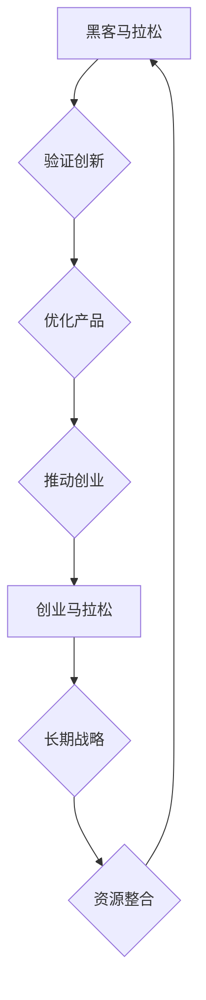

                 

### 引言

黑客马拉松与创业马拉松，看似两个截然不同的概念，却在现代科技与创业领域中紧密相连。黑客马拉松，通常是指一群开发者在短时间内聚集在一起，通过团队协作快速构建原型或解决特定问题的竞赛。而创业马拉松，则是一个企业或团队在长期内通过持续创新和优化，实现业务目标与商业模式的过程。

在这两场马拉松中，黑客马拉松更注重短时间内的创意爆发和技术实现，而创业马拉松则强调长期的战略规划与执行。两者虽然形式和目标有所不同，但都离不开创新精神、团队协作和风险管理。本文将从以下几个方面展开讨论：

1. **黑客马拉松与创业马拉松的定义**：我们将详细阐述黑客马拉松和创业马拉松的基本概念，帮助读者了解两者的本质特征。
2. **黑客马拉松的组织与实施**：本文将探讨黑客马拉松的组织形式、评审标准及项目管理，提供实际案例供读者参考。
3. **创业马拉松的规划与执行**：我们将分析创业马拉松的愿景与目标、商业模式设计及运营策略，并结合实际案例进行讲解。
4. **黑客马拉松与创业马拉松的结合策略**：本文将探讨黑客马拉松在创业马拉松中的价值，以及创业马拉松对黑客马拉松的支持，提供双方合作的模式与机制。
5. **黑客马拉松与创业马拉松的未来发展趋势**：我们将展望两者在人工智能融合、长尾市场兴起等领域的未来发展。
6. **总结与展望**：最后，本文将对黑客马拉松与创业马拉松的核心要素进行总结，并给出对未来创业者的建议和企业管理的启示。

通过本文的详细阐述，我们希望读者能够对黑客马拉松与创业马拉松有更深入的理解，并在实际操作中更好地运用这两大策略，实现创新与成长。

### 第1章 引言

黑客马拉松（Hackathon）与创业马拉松（Startup Marathon）是两个在科技和创业领域内频繁出现的词汇，它们分别代表了两种不同但相互关联的商业模式和竞赛形式。为了更好地理解这两者的区别和联系，我们首先需要明确它们各自的定义。

#### 黑客马拉松的定义

黑客马拉松通常被描述为一种集体创新活动，它将一群富有创意和编程技能的开发者聚集在一起，在规定的时间内共同解决某个特定的技术挑战或商业问题。这种活动不仅强调技术实现的速度，还强调团队协作和创意思维。黑客马拉松通常持续24至48小时，参与者可以是个人、团队或者公司。活动过程中，参与者通过不断试验和迭代，力求在最短时间内实现一个可运行的原型或解决方案。

**特点**：

- **短周期**：黑客马拉松的持续时间较短，通常只有几天或一周的时间。
- **高度协作**：团队协作在黑客马拉松中至关重要，参与者需要共同商讨、分工合作，快速推进项目的进展。
- **开放性**：黑客马拉松往往鼓励跨领域的合作，参与者可以来自不同的专业背景，这使得创新的可能性大大增加。
- **风险承担**：由于时间紧迫，黑客马拉松的项目往往伴随着较高的风险，但也正是这种高压环境激发了参与者的创造力和解决问题的能力。

#### 创业马拉松的定义

创业马拉松则是指一个企业在较长时间内持续进行的创业过程。与黑客马拉松的短期冲刺不同，创业马拉松强调长期的战略规划、资源整合和市场开拓。创业马拉松的周期通常可以是几年甚至更长时间，它涵盖了从创意生成到产品开发、市场推广、业务扩展等一系列复杂的过程。

**特点**：

- **长期性**：创业马拉松是一个长期的、持续的过程，需要企业在多个阶段不断调整策略、优化资源配置。
- **系统化**：与黑客马拉松的快速原型开发不同，创业马拉松更加注重系统的规划和实施，包括市场调研、商业模式设计、财务规划等。
- **适应性**：创业马拉松需要企业对市场变化保持高度的敏感性和适应性，以便快速调整战略和运营计划。
- **资源整合**：创业马拉松不仅需要内部资源的有效整合，还需要外部资源的支持，如投资者、合作伙伴、用户等。

#### 黑客马拉松与创业马拉松的联系

黑客马拉松和创业马拉松虽然形式和目标有所不同，但它们之间有着密切的联系。黑客马拉松可以为创业企业提供快速验证创新想法的机会，帮助团队在短时间内实现技术突破。而创业马拉松则为黑客马拉松提供了长期的战略框架和资源保障，使得创新想法能够在实际市场中得到验证和落地。

1. **快速验证**：黑客马拉松通过短期内的密集开发，可以帮助企业快速验证产品或服务的技术可行性，减少早期失败的风险。
2. **资源整合**：黑客马拉松往往能够吸引来自不同领域的参与者，为企业带来新的技术、人才和合作伙伴，有助于创业马拉松的顺利进行。
3. **人才激励**：黑客马拉松的竞赛性质可以激发开发者的创造力和团队合作精神，这些人才在创业马拉松中可以发挥重要作用。
4. **风险管理**：黑客马拉松的短期性和开放性使得企业可以快速试错、调整策略，为创业马拉松中的长期风险管理提供宝贵的经验。

#### 黑客马拉松与创业马拉松的区别

尽管黑客马拉松和创业马拉松有许多共同点，但它们在目标和形式上仍然存在显著差异。

1. **时间周期**：黑客马拉松注重短期内的创意爆发和技术实现，而创业马拉松则是一个长期的、持续的过程。
2. **目标导向**：黑客马拉松的目标通常是为了解决一个具体的技术挑战或商业问题，而创业马拉松的目标则是实现企业的长期战略目标。
3. **团队协作**：黑客马拉松强调团队协作和快速迭代，而创业马拉松则更加注重系统化的规划和长期运营。
4. **风险管理**：黑客马拉松的风险较高，因为它通常在短时间内进行密集开发，而创业马拉松则通过长期的规划和管理来降低风险。

总的来说，黑客马拉松和创业马拉松是两种不同但相互补充的商业模式和竞赛形式。黑客马拉松为创业马拉松提供了快速验证和创新的机会，而创业马拉松则为黑客马拉松提供了长期的战略支持和资源保障。通过结合黑客马拉松和创业马拉松的优势，企业可以更有效地实现创新和成长。

### 第1章 引言

黑客马拉松（Hackathon）与创业马拉松（Startup Marathon）是两个在科技和创业领域内频繁出现的词汇，它们分别代表了两种不同但相互关联的商业模式和竞赛形式。为了更好地理解这两者的联系和区别，我们接下来将详细探讨黑客马拉松的组织与实施。

#### 黑客马拉松的组织形式

黑客马拉松的组织形式多种多样，可以根据不同的需求和目的进行调整。以下是一些常见的组织形式：

1. **线上与线下**：线上黑客马拉松允许参与者远程参与，通过互联网进行协作和交流。这种方式的好处在于可以突破地域限制，吸引全球的开发者参与。而线下黑客马拉松则通常在特定的场地举行，如大学校园、科技园区或公司总部。线下活动可以提供更好的面对面交流和协作环境。

2. **短期与长期**：短期黑客马拉松通常持续24至48小时，强调在短时间内完成一个原型或解决方案。而长期黑客马拉松则可能持续一周或更长时间，为参与者提供更充分的时间进行研究和开发。长期黑客马拉松适用于需要深入研究和复杂开发的项目。

#### 黑客马拉松的评审标准

评审标准是黑客马拉松成功的关键之一，它决定了哪些项目能够脱颖而出。以下是一些常见的评审标准：

1. **技术实现**：技术实现是评审的重要标准之一，评估项目是否能够顺利运行、功能是否完整、代码是否高效等。评审员通常会关注项目的创新性、复杂性以及实际应用价值。

2. **创新性**：创新性是黑客马拉松的核心价值观之一，评审员会评估项目是否具有独特的创意、新颖的技术或解决方案。创新性强的项目往往更容易获得认可和奖励。

3. **可行性**：可行性评估项目在现实中的实际可行性，包括技术实现、市场接受度、资源需求等。评审员会关注项目是否能够在短时间内实现商业化。

4. **用户体验**：用户体验是产品成功的关键因素，评审员会评估项目的用户体验设计、界面友好性、易用性等。优秀的用户体验能够提高项目的吸引力和市场竞争力。

5. **团队合作**：团队合作是黑客马拉松的重要特点之一，评审员会评估团队的合作精神、沟通效率、分工协作等。一个高效的团队合作能够确保项目的顺利进行。

#### 黑客马拉松的项目管理

在黑客马拉松中，项目管理是确保项目成功的关键。以下是一些项目管理的重要方面：

1. **团队协作**：团队协作是黑客马拉松的核心，参与者需要共同商讨、分工合作，快速推进项目的进展。有效的团队协作可以提高项目的效率和质量。

2. **进度跟踪**：进度跟踪是项目管理的重要环节，可以帮助团队了解项目的进展情况，及时发现和解决问题。常用的进度跟踪工具包括Trello、Jira等。

3. **资源管理**：资源管理包括人员、技术、资金等。在黑客马拉松中，资源通常有限，需要合理分配和利用。有效的资源管理可以确保项目顺利进行。

4. **风险管理**：风险管理是项目管理的重要组成部分，可以帮助团队识别和应对潜在的风险。通过制定应急预案和风险管理策略，可以降低项目失败的风险。

#### 黑客马拉松的实际案例

以下是两个实际案例，展示黑客马拉松在不同场景下的应用和成果。

1. **案例一：某互联网公司的黑客马拉松**

某互联网公司在一次黑客马拉松中提出了一个挑战：如何通过技术手段提高用户留存率。参赛团队在24小时内提出了一种基于机器学习的用户行为分析系统，该系统能够根据用户的行为数据，提供个性化的推荐和优惠。该系统在后续的迭代和推广中取得了显著的成功，提高了用户的满意度和留存率。

2. **案例二：某科技公司的黑客马拉松**

某科技公司举办了一次关于智能家居的黑客马拉松，参赛团队提出了一种智能家居安全系统，该系统通过物联网技术实现家庭设备的远程监控和报警功能。该系统在比赛期间获得了广泛好评，并在后续的商谈中与科技公司达成了合作意向，共同推进智能家居安全产品的研发和市场推广。

通过以上案例，我们可以看到黑客马拉松在激发创新、验证技术和推动合作方面的重要作用。黑客马拉松不仅为参赛团队提供了展示才华和技能的平台，也为企业带来了新的技术和商机。

### 第2章 黑客马拉松案例分析

在本章节中，我们将深入分析两个具体黑客马拉松案例，通过这些案例展示黑客马拉松的实际操作过程、成果及影响。这些案例不仅能够帮助读者理解黑客马拉松的运作方式，还能揭示其在实际应用中的潜力和挑战。

#### 案例一：某互联网公司的黑客马拉松

**项目背景**：

某互联网公司于2020年举办了一场主题为“提高用户留存率”的黑客马拉松。该公司希望通过这次活动，激发开发团队的创造力，寻找技术解决方案来提升用户体验和用户留存率。

**项目目标**：

- 研发一个能够提高用户留存率的功能或服务。
- 通过创新的技术手段，为用户提供更有吸引力的体验。

**项目过程**：

1. **筹备阶段**：公司在活动前一个月发布了黑客马拉松的主题，并邀请了内部员工和外部开发团队参与。为了确保活动的顺利进行，公司还准备了充足的硬件设备、技术支持和资源。

2. **团队组建**：参与者自由组队，每队通常由3至5人组成，涵盖前端、后端、UI/UX设计等多个技术领域。

3. **方案设计**：每个团队在活动开始后，有24小时的时间进行方案设计和原型开发。在方案设计阶段，团队需要进行市场调研、用户访谈，以了解用户需求和行为模式。

4. **原型开发**：在方案设计完成后，团队开始进行原型开发，包括前端界面、后端逻辑和数据库设计等。开发过程中，团队需要不断迭代和优化，确保原型的功能完整性和用户体验。

5. **演示评审**：在原型开发完成后，每个团队有10分钟的时间向评审团演示他们的项目。评审团由公司的高层管理人员、技术专家和市场分析师组成，他们根据项目的创新性、技术实现、用户体验等多个方面进行评估。

**项目成果**：

- **用户行为分析系统**：一个基于机器学习的用户行为分析系统被开发出来。该系统能够根据用户的行为数据，提供个性化的推荐和优惠，从而提高用户满意度和留存率。
- **社区互动平台**：一个社区互动平台被提出，通过奖励机制鼓励用户参与社区讨论和活动，提高用户的社区粘性。
- **直播互动工具**：一个直播互动工具被开发，允许用户在直播过程中进行实时互动，增加用户的参与感。

**项目影响**：

- **技术提升**：通过黑客马拉松，团队的技术能力得到了显著提升，团队成员在短时间内掌握了新的技术和工具。
- **创新文化**：黑客马拉松激发了公司的创新文化，团队成员更加积极主动地寻找解决问题的方法。
- **商业价值**：黑客马拉松提出的一些创意在实际产品中得到了应用，为公司带来了商业上的价值。

#### 案例二：某科技公司的黑客马拉松

**项目背景**：

某科技公司于2021年举办了一场以“智能家居安全”为主题的黑客马拉松。随着智能家居市场的快速增长，公司希望通过这次活动，探索智能家居安全领域的新技术和解决方案。

**项目目标**：

- 研发智能家居安全系统，提高家庭设备的安全性。
- 探索物联网技术在智能家居安全中的应用。

**项目过程**：

1. **筹备阶段**：公司发布了黑客马拉松的主题，并邀请了一系列专家进行技术分享和指导。同时，公司还提供了各种硬件设备，如智能门锁、智能摄像头等，供开发者使用。

2. **团队组建**：参与者自由组队，每队由3至5人组成，涵盖硬件、软件、网络安全等多个领域。

3. **方案设计**：团队在活动开始后有24小时的时间进行方案设计和原型开发。方案设计阶段，团队需要进行市场调研、安全分析，确定智能家居安全系统的核心功能和关键技术。

4. **原型开发**：团队开始进行原型开发，包括硬件连接、软件编程、网络安全等。在开发过程中，团队需要确保系统的稳定性、可靠性和安全性。

5. **演示评审**：在原型开发完成后，团队有10分钟的时间向评审团演示他们的项目。评审团由公司的技术专家、安全专家和市场分析师组成，他们根据项目的创新性、技术实现、安全性等多个方面进行评估。

**项目成果**：

- **智能家居安全系统**：一个智能家居安全系统被开发出来，该系统能够实现家庭设备的远程监控和报警功能，提高家庭设备的安全性。
- **物联网安全协议**：一个基于物联网的网络安全协议被提出，通过加密技术和认证机制，确保数据传输的安全性。
- **用户安全意识培训工具**：一个用户安全意识培训工具被开发，通过互动式学习，提高用户对智能家居安全性的认识。

**项目影响**：

- **技术创新**：黑客马拉松激发了团队在智能家居安全领域的创新，推动了物联网技术的发展和应用。
- **市场推广**：黑客马拉松的成果为公司提供了市场推广的新方向，吸引了更多的用户和合作伙伴。
- **人才培养**：黑客马拉松为团队成员提供了实践和成长的机会，提高了团队的整体技术水平和创新能力。

通过以上两个案例，我们可以看到黑客马拉松在激发创新、推动技术和促进合作方面的巨大潜力。黑客马拉松不仅为参与者提供了展示才华和技能的平台，也为企业带来了新的技术和商机。然而，黑客马拉松也面临着一些挑战，如时间紧迫、资源有限等。因此，在实施黑客马拉松时，企业需要做好充分的准备和规划，以确保活动的顺利进行和取得预期的成果。

### 第3章 创业马拉松的规划与执行

创业马拉松不同于传统的马拉松比赛，它是一个长期的、持续的企业发展过程，要求创业者具备深厚的战略眼光、坚定的执行力和敏锐的市场洞察力。在这一章中，我们将探讨创业马拉松的愿景与目标、商业模式设计及运营策略，并通过实际案例进行分析。

#### 4.1 创业马拉松的愿景与目标

创业马拉松的起点是明确的愿景和目标。这些目标通常可以分为业务目标和财务目标两个方面。

1. **业务目标**：

业务目标是创业马拉松的核心，它决定了企业的长期发展方向和核心竞争力。常见的业务目标包括：

- **市场占有率**：在特定的市场领域内，达到一定的市场份额，成为行业领导者。
- **产品创新**：不断推出具有市场竞争力的新产品或服务，满足用户需求，提升用户体验。
- **客户满意度**：提高客户满意度和忠诚度，建立品牌口碑。
- **团队建设**：培养和吸引一流的人才，打造高效协同的团队。

2. **财务目标**：

财务目标是创业马拉松的重要衡量标准，它关系到企业的可持续发展和投资者的信心。常见的财务目标包括：

- **收入增长**：实现收入的稳定增长，保持健康的财务状况。
- **盈利能力**：达到预期的盈利水平，实现自我造血。
- **投资回报**：在合理的投资回报周期内，为投资者带来回报。
- **资本运作**：通过融资、并购等手段，实现资本的增值和扩大。

#### 4.2 创业马拉松的商业模式设计

商业模式是创业马拉松中至关重要的一环，它决定了企业的盈利模式、成本结构、市场定位等。以下是一些关键要素：

1. **产品定位**：

产品定位是商业模式设计的基础，它关系到企业的市场定位和目标用户群体。产品定位应考虑以下因素：

- **市场需求**：分析目标市场的需求，找到痛点和需求点。
- **差异化优势**：明确产品的差异化特点，打造独特的竞争优势。
- **用户体验**：关注用户需求和体验，提供高质量的产品和服务。

2. **用户群体**：

用户群体是商业模式的核心，它决定了企业的市场规模和用户粘性。用户群体应考虑以下因素：

- **目标市场**：明确目标市场，针对特定的用户群体进行精准营销。
- **用户画像**：通过数据分析，描绘典型用户的特征和需求。
- **用户互动**：建立与用户的互动机制，提高用户参与度和忠诚度。

3. **盈利模式**：

盈利模式是商业模式的核心，它决定了企业的收入来源和盈利方式。常见的盈利模式包括：

- **产品销售**：通过直接销售产品或服务获得收入。
- **订阅模式**：通过订阅服务或会员制度获得持续收入。
- **广告收入**：通过广告投放或推广获得收入。
- **数据变现**：通过数据分析或数据服务获得收入。

4. **成本结构**：

成本结构是商业模式设计中的重要考虑因素，它关系到企业的盈利能力和运营效率。常见的成本结构包括：

- **固定成本**：如租金、人员工资、设备采购等。
- **可变成本**：如原材料采购、生产成本、物流成本等。
- **运营成本**：如营销费用、管理费用、研发费用等。

#### 4.3 创业马拉松的运营策略

创业马拉松的运营策略是确保企业愿景和目标实现的关键。以下是一些关键的运营策略：

1. **市场推广**：

市场推广是创业马拉松中不可或缺的一环，它关系到企业的品牌知名度和市场份额。市场推广策略应考虑以下因素：

- **定位**：明确市场定位，选择合适的推广渠道。
- **内容**：制作有吸引力的内容，传递品牌价值和产品特点。
- **渠道**：利用线上和线下渠道进行推广，如社交媒体、电商平台、展会等。
- **活动**：举办线上线下活动，增加用户互动和参与度。

2. **客户关系管理**：

客户关系管理是确保客户满意度和忠诚度的关键，它关系到企业的长期发展。客户关系管理策略应考虑以下因素：

- **客户细分**：根据客户需求和行为，进行客户细分，提供个性化的服务和体验。
- **沟通**：建立有效的沟通渠道，及时回应客户需求和反馈。
- **关怀**：提供优质的售后服务，关注客户体验和满意度。
- **忠诚度**：通过会员制度、优惠活动等手段，提高客户忠诚度。

3. **内部管理**：

内部管理是确保企业高效运营和持续发展的基础，它关系到企业的竞争力。内部管理策略应考虑以下因素：

- **组织结构**：建立合理的组织结构，明确各部门职责和权限。
- **流程优化**：优化业务流程，提高运营效率和降低成本。
- **人才管理**：培养和吸引一流的人才，建立高效的团队协作机制。
- **企业文化**：打造积极向上的企业文化，提高员工的归属感和忠诚度。

通过以上规划与执行策略，创业者可以更好地应对创业马拉松中的挑战，实现企业的长期发展目标。然而，创业马拉松并非一帆风顺，创业者需要不断调整策略，灵活应对市场变化和竞争压力。

#### 案例一：某初创企业的创业马拉松

**项目背景**：

某初创企业在2020年成立，专注于智能健康监测设备的研发和推广。公司愿景是成为智能健康领域的领导者，通过技术创新改善人们的健康生活。

**项目目标**：

- 在三年内实现智能健康监测设备的市场化，占据一定的市场份额。
- 实现每年30%的收入增长，达到财务自给自足。

**项目过程**：

1. **筹备阶段**：

在成立初期，公司通过市场调研和用户访谈，明确了智能健康监测设备的市场需求和用户痛点。公司确定了产品定位，聚焦于可穿戴设备，并提供实时健康数据监测和分析。

2. **研发阶段**：

公司组建了一支由经验丰富的工程师和设计师组成的团队，进行智能健康监测设备的研发。在研发过程中，公司注重用户体验，通过多次迭代和用户反馈，优化产品的功能设计和操作界面。

3. **市场推广**：

公司通过线上和线下渠道进行市场推广，包括社交媒体营销、电商平台合作、健康展会等。同时，公司还与医疗机构和健康管理公司合作，推广智能健康监测设备的应用。

4. **运营管理**：

公司建立了一套高效的运营管理体系，包括产品研发、市场推广、客户服务等。公司注重团队建设，通过培训和激励措施，提高员工的专业技能和工作积极性。

**项目成果**：

- **产品上市**：智能健康监测设备在市场推出后，受到了用户的广泛好评，实现了销售和市场份额的快速增长。
- **用户增长**：通过不断优化产品和服务，公司积累了大量用户，用户满意度持续提升。
- **财务自给自足**：在第一年运营结束时，公司实现了收入增长目标，达到了财务自给自足。

**项目影响**：

- **技术创新**：公司通过研发和迭代，不断推动智能健康监测设备的技术创新，提升了产品的竞争力。
- **市场拓展**：公司通过市场推广和合作，成功拓展了市场，提升了品牌知名度。
- **团队成长**：公司注重团队建设和人才培养，通过培训和激励机制，提高了员工的专业技能和工作效率。

#### 案例二：某大型企业的创业马拉松

**项目背景**：

某大型企业于2021年启动了一项名为“创新实验室”的创业项目，旨在通过创新技术和商业模式，开拓新的业务领域和市场。

**项目目标**：

- 在五年内实现新业务的盈利，成为企业增长的新动力。
- 通过创新项目，提升企业的市场竞争力和品牌价值。

**项目过程**：

1. **筹备阶段**：

企业在创新实验室启动前，进行了全面的战略规划，明确了新业务的发展方向和目标。企业还组建了一个跨部门的团队，负责新项目的研发和运营。

2. **研发阶段**：

创新实验室团队通过市场调研和用户需求分析，确定了新产品的技术方案和功能设计。在研发过程中，企业注重技术突破和创新，不断优化产品性能和用户体验。

3. **市场推广**：

企业通过多种渠道进行市场推广，包括线上营销、行业展会、合作伙伴关系等。同时，企业还积极与用户互动，收集用户反馈，优化产品和服务。

4. **运营管理**：

企业建立了专门的运营团队，负责新业务的日常运营和管理。企业还通过流程优化和数字化工具，提高了运营效率和客户满意度。

**项目成果**：

- **新业务上线**：创新实验室推出的新产品在市场上取得了良好的反响，实现了快速的市场拓展和用户增长。
- **市场份额**：新产品在市场上占据了一定的市场份额，提升了企业的市场竞争力。
- **财务回报**：新业务在第三年实现了盈利，为企业的财务目标做出了重要贡献。

**项目影响**：

- **技术创新**：创新实验室通过技术突破和创新，推动了企业在新领域的竞争力。
- **业务拓展**：新业务的上线，为企业开拓了新的市场领域，提升了企业的综合竞争力。
- **品牌价值**：通过创新项目和成功案例，提升了企业的品牌形象和市场认可度。

通过以上案例，我们可以看到创业马拉松在不同规模的企业中都可以取得显著成果。初创企业通过快速响应市场需求和用户反馈，实现快速成长；大型企业通过创新实验室和跨部门合作，推动新业务的突破。这些案例为我们提供了宝贵的经验和启示，在创业马拉松中，坚持技术创新、市场导向和团队协作，是实现成功的关键。

### 第4章 创业马拉松的规划与执行

创业马拉松是一个复杂且漫长的过程，需要企业在多个阶段进行战略规划和资源整合。在这一章中，我们将探讨创业马拉松的长期目标、商业模式设计及运营策略，通过实际案例展示这些策略的具体应用。

#### 4.1 创业马拉松的长期目标

在创业马拉松中，长期目标是企业发展的方向和动力。这些目标通常包括业务目标和财务目标。

1. **业务目标**：

业务目标是企业长期发展的核心，它决定了企业的战略方向和核心竞争力。常见的业务目标包括：

- **市场占有率**：在特定市场领域内，达到一定的市场份额，成为行业领导者。
- **产品创新**：持续推出具有市场竞争力的新产品或服务，满足用户需求，提升用户体验。
- **客户满意度**：提高客户满意度和忠诚度，建立品牌口碑。
- **团队建设**：培养和吸引一流的人才，打造高效协同的团队。

2. **财务目标**：

财务目标是企业长期发展的衡量标准，它关系到企业的可持续发展和投资者的信心。常见的财务目标包括：

- **收入增长**：实现收入的稳定增长，保持健康的财务状况。
- **盈利能力**：达到预期的盈利水平，实现自我造血。
- **投资回报**：在合理的投资回报周期内，为投资者带来回报。
- **资本运作**：通过融资、并购等手段，实现资本的增值和扩大。

#### 4.2 创业马拉松的商业模式设计

商业模式是创业马拉松的核心，它决定了企业的盈利模式、成本结构、市场定位等。以下是一些关键要素：

1. **产品定位**：

产品定位是商业模式设计的基础，它决定了企业的市场定位和目标用户群体。产品定位应考虑以下因素：

- **市场需求**：分析目标市场的需求，找到痛点和需求点。
- **差异化优势**：明确产品的差异化特点，打造独特的竞争优势。
- **用户体验**：关注用户需求和体验，提供高质量的产品和服务。

2. **用户群体**：

用户群体是商业模式的核心，它决定了企业的市场规模和用户粘性。用户群体应考虑以下因素：

- **目标市场**：明确目标市场，针对特定的用户群体进行精准营销。
- **用户画像**：通过数据分析，描绘典型用户的特征和需求。
- **用户互动**：建立与用户的互动机制，提高用户参与度和忠诚度。

3. **盈利模式**：

盈利模式是商业模式的核心，它决定了企业的收入来源和盈利方式。常见的盈利模式包括：

- **产品销售**：通过直接销售产品或服务获得收入。
- **订阅模式**：通过订阅服务或会员制度获得持续收入。
- **广告收入**：通过广告投放或推广获得收入。
- **数据变现**：通过数据分析或数据服务获得收入。

4. **成本结构**：

成本结构是商业模式设计中的重要考虑因素，它关系到企业的盈利能力和运营效率。常见的成本结构包括：

- **固定成本**：如租金、人员工资、设备采购等。
- **可变成本**：如原材料采购、生产成本、物流成本等。
- **运营成本**：如营销费用、管理费用、研发费用等。

#### 4.3 创业马拉松的运营策略

创业马拉松的运营策略是确保企业愿景和目标实现的关键。以下是一些关键的运营策略：

1. **市场推广**：

市场推广是创业马拉松中不可或缺的一环，它关系到企业的品牌知名度和市场份额。市场推广策略应考虑以下因素：

- **定位**：明确市场定位，选择合适的推广渠道。
- **内容**：制作有吸引力的内容，传递品牌价值和产品特点。
- **渠道**：利用线上和线下渠道进行推广，如社交媒体、电商平台、展会等。
- **活动**：举办线上线下活动，增加用户互动和参与度。

2. **客户关系管理**：

客户关系管理是确保客户满意度和忠诚度的关键，它关系到企业的长期发展。客户关系管理策略应考虑以下因素：

- **客户细分**：根据客户需求和行为，进行客户细分，提供个性化的服务和体验。
- **沟通**：建立有效的沟通渠道，及时回应客户需求和反馈。
- **关怀**：提供优质的售后服务，关注客户体验和满意度。
- **忠诚度**：通过会员制度、优惠活动等手段，提高客户忠诚度。

3. **内部管理**：

内部管理是确保企业高效运营和持续发展的基础，它关系到企业的竞争力。内部管理策略应考虑以下因素：

- **组织结构**：建立合理的组织结构，明确各部门职责和权限。
- **流程优化**：优化业务流程，提高运营效率和降低成本。
- **人才管理**：培养和吸引一流的人才，建立高效的团队协作机制。
- **企业文化**：打造积极向上的企业文化，提高员工的归属感和忠诚度。

通过以上规划与执行策略，创业者可以更好地应对创业马拉松中的挑战，实现企业的长期发展目标。然而，创业马拉松并非一帆风顺，创业者需要不断调整策略，灵活应对市场变化和竞争压力。

#### 案例一：某初创企业的创业马拉松

**项目背景**：

某初创企业在2020年成立，专注于智能健康监测设备的研发和推广。公司愿景是成为智能健康领域的领导者，通过技术创新改善人们的健康生活。

**项目目标**：

- 在三年内实现智能健康监测设备的市场化，占据一定的市场份额。
- 实现每年30%的收入增长，达到财务自给自足。

**项目过程**：

1. **筹备阶段**：

在成立初期，公司通过市场调研和用户访谈，明确了智能健康监测设备的市场需求和用户痛点。公司确定了产品定位，聚焦于可穿戴设备，并提供实时健康数据监测和分析。

2. **研发阶段**：

公司组建了一支由经验丰富的工程师和设计师组成的团队，进行智能健康监测设备的研发。在研发过程中，公司注重用户体验，通过多次迭代和用户反馈，优化产品的功能设计和操作界面。

3. **市场推广**：

公司通过线上和线下渠道进行市场推广，包括社交媒体营销、电商平台合作、健康展会等。同时，公司还与医疗机构和健康管理公司合作，推广智能健康监测设备的应用。

4. **运营管理**：

公司建立了一套高效的运营管理体系，包括产品研发、市场推广、客户服务等。公司注重团队建设，通过培训和激励措施，提高员工的专业技能和工作积极性。

**项目成果**：

- **产品上市**：智能健康监测设备在市场推出后，受到了用户的广泛好评，实现了销售和市场份额的快速增长。
- **用户增长**：通过不断优化产品和服务，公司积累了大量用户，用户满意度持续提升。
- **财务自给自足**：在第一年运营结束时，公司实现了收入增长目标，达到了财务自给自足。

**项目影响**：

- **技术创新**：公司通过研发和迭代，不断推动智能健康监测设备的技术创新，提升了产品的竞争力。
- **市场拓展**：公司通过市场推广和合作，成功拓展了市场，提升了品牌知名度。
- **团队成长**：公司注重团队建设和人才培养，通过培训和激励机制，提高了员工的专业技能和工作效率。

#### 案例二：某大型企业的创业马拉松

**项目背景**：

某大型企业于2021年启动了一项名为“创新实验室”的创业项目，旨在通过创新技术和商业模式，开拓新的业务领域和市场。

**项目目标**：

- 在五年内实现新业务的盈利，成为企业增长的新动力。
- 通过创新项目，提升企业的市场竞争力和品牌价值。

**项目过程**：

1. **筹备阶段**：

企业在创新实验室启动前，进行了全面的战略规划，明确了新业务的发展方向和目标。企业还组建了一个跨部门的团队，负责新项目的研发和运营。

2. **研发阶段**：

创新实验室团队通过市场调研和用户需求分析，确定了新产品的技术方案和功能设计。在研发过程中，企业注重技术突破和创新，不断优化产品性能和用户体验。

3. **市场推广**：

企业通过多种渠道进行市场推广，包括线上营销、行业展会、合作伙伴关系等。同时，企业还积极与用户互动，收集用户反馈，优化产品和服务。

4. **运营管理**：

企业建立了专门的运营团队，负责新业务的日常运营和管理。企业还通过流程优化和数字化工具，提高了运营效率和客户满意度。

**项目成果**：

- **新业务上线**：创新实验室推出的新产品在市场上取得了良好的反响，实现了快速的市场拓展和用户增长。
- **市场份额**：新产品在市场上占据了一定的市场份额，提升了企业的市场竞争力。
- **财务回报**：新业务在第三年实现了盈利，为企业的财务目标做出了重要贡献。

**项目影响**：

- **技术创新**：创新实验室通过技术突破和创新，推动了企业在新领域的竞争力。
- **业务拓展**：新业务的上线，为企业开拓了新的市场领域，提升了企业的综合竞争力。
- **品牌价值**：通过创新项目和成功案例，提升了企业的品牌形象和市场认可度。

通过以上案例，我们可以看到创业马拉松在不同规模的企业中都可以取得显著成果。初创企业通过快速响应市场需求和用户反馈，实现快速成长；大型企业通过创新实验室和跨部门合作，推动新业务的突破。这些案例为我们提供了宝贵的经验和启示，在创业马拉松中，坚持技术创新、市场导向和团队协作，是实现成功的关键。

### 第5章 黑客马拉松与创业马拉松的结合策略

黑客马拉松和创业马拉松在形式和目标上有所不同，但它们在促进创新和技术发展方面具有互补性。将黑客马拉松与创业马拉松有机结合，不仅可以加速创业进程，还可以为企业的长期发展提供强大的动力。以下将探讨黑客马拉松在创业马拉松中的价值、创业马拉松对黑客马拉松的支持，以及双方合作的模式与机制。

#### 黑客马拉松在创业马拉松中的价值

1. **快速验证**：

黑客马拉松为创业企业提供了一个快速验证创新想法的平台。通过短周期的高强度开发，企业可以快速构建原型，测试市场需求，评估技术可行性。这种快速验证有助于企业减少早期失败的风险，优化产品路线图。

   **案例**：某初创公司开发了一款智能家居设备，通过参加黑客马拉松，团队在短时间内完成了原型设计和技术验证，发现了产品功能中的缺陷和改进空间，为后续的商业化奠定了基础。

2. **资源整合**：

黑客马拉松往往能够吸引来自不同领域的参与者，包括开发人员、设计师、市场专家等。这种跨领域的合作有助于企业整合外部资源，快速组建多学科团队，提高项目执行力。同时，黑客马拉松的奖金和投资机会也为创业企业提供了资金支持。

   **案例**：某创业公司在黑客马拉松中结识了多位行业专家和潜在投资人，通过合作和交流，公司得以加速产品开发，并在短时间内获得了投资，加快了市场推广。

3. **人才激励**：

黑客马拉松的竞赛性质能够激发开发者的创造力和工作热情。参与者往往为了在竞赛中取得优异成绩，投入大量时间和精力，这种竞争和激励机制可以转化为企业的创新动力。

   **案例**：某科技公司在黑客马拉松中设置了高额奖金，吸引了大量优秀开发者参与。通过比赛，公司不仅获得了创新技术，还吸引了多位优秀人才加入公司，为后续研发提供了强大支持。

4. **风险管理**：

黑客马拉松的短期性和高压力环境有助于企业快速识别和应对风险。通过不断的试错和调整，企业可以降低长期项目中的风险，提高项目的成功率。

   **案例**：某创业团队在黑客马拉松中遇到了技术难题，通过快速实验和迭代，团队找到了解决方案，并将这种经验应用到后续的项目中，有效降低了项目风险。

#### 创业马拉松对黑客马拉松的支持

1. **长期目标导向**：

创业马拉松的长期目标导向为黑客马拉松提供了战略框架和资源保障。企业可以根据长期战略，有针对性地组织黑客马拉松，确保创新项目与企业发展方向一致。

   **案例**：某企业在黑客马拉松中聚焦于特定技术领域，如人工智能或物联网，这些项目与企业的长期发展战略高度契合，为企业的技术创新提供了持续动力。

2. **技术储备**：

创业马拉松过程中积累的技术储备和知识库可以为黑客马拉松提供宝贵的资源。企业可以将黑客马拉松中的创新成果应用到实际业务中，提升产品竞争力。

   **案例**：某企业在黑客马拉松中研发了一项先进的数据分析技术，随后将这一技术应用于其核心产品，大幅提升了数据处理效率和用户满意度。

3. **资源整合**：

创业马拉松中的资源整合能力有助于黑客马拉松的顺利进行。企业可以利用现有的资金、人力资源和技术支持，为黑客马拉松提供充足的保障。

   **案例**：某大型企业利用其现有的研发中心和技术团队，为黑客马拉松提供技术支持和培训，确保了活动的质量和成果。

#### 双方合作的模式与机制

1. **项目对接**：

在合作模式中，企业可以通过项目对接会、研讨会等形式，将黑客马拉松与创业马拉松的需求和资源进行对接。这种对接有助于明确双方的合作目标和预期成果。

   **案例**：某企业定期举办内部创新会议，邀请黑客马拉松的优秀团队参与，共同探讨项目合作的机会和方式。

2. **人员交流**：

人员交流是促进双方合作的重要手段。企业可以派遣技术人员和管理人员参与黑客马拉松，同时邀请黑客马拉松的优秀参与者加入创业团队。

   **案例**：某创业公司邀请黑客马拉松的冠军团队加入公司，共同开发新产品，这种人员交流机制不仅带来了创新技术，还提升了团队的整体能力。

3. **合作机制**：

建立稳定的合作机制是确保双方长期合作的关键。企业可以通过签订合作协议、设立联合实验室等形式，明确双方的权利和义务，确保合作的顺利进行。

   **案例**：某企业与高校合作设立了联合创新实验室，定期举办黑客马拉松，共同推动技术创新和项目孵化。

通过结合黑客马拉松和创业马拉松的优势，企业可以实现快速创新和持续发展。黑客马拉松为创业马拉松提供了快速验证和资源整合的机会，而创业马拉松则为黑客马拉松提供了长期目标和资源保障。双方的合作模式与机制有助于实现创新与成长的良性循环，推动企业不断向前发展。

### 第6章 黑客马拉松与创业马拉松的未来发展趋势

随着科技的不断进步和市场的快速发展，黑客马拉松与创业马拉松正面临着新的机遇和挑战。未来，两者的发展趋势将体现在人工智能的融合、跨界合作、长尾市场的兴起以及精细化运营等方面。

#### 6.1 黑客马拉松的发展趋势

1. **人工智能的融合**：

人工智能技术的飞速发展将深刻影响黑客马拉松的开展。未来的黑客马拉松将更加注重人工智能算法的应用，如机器学习、深度学习等，以解决复杂问题和优化产品设计。人工智能将提升黑客马拉松的创新效率和成果质量。

   **示例**：在未来的黑客马拉松中，参赛团队可能使用深度学习模型进行图像识别、自然语言处理等任务，从而实现更智能化的产品功能。

2. **跨界合作的深化**：

随着不同领域的融合，黑客马拉松将不再局限于特定的技术或行业。未来的黑客马拉松将更加开放，鼓励跨学科、跨领域的合作，以解决复杂的社会问题。这种跨界合作将带来更多的创新机会和突破。

   **示例**：医疗领域与科技领域的跨界合作，可能产生新的医疗诊断工具或健康管理系统，从而改善人们的健康状况。

3. **虚拟与现实结合**：

虚拟现实（VR）和增强现实（AR）技术的发展，将使黑客马拉松的形式更加多样化。未来的黑客马拉松可能通过虚拟环境进行，参与者可以在虚拟空间中协作、展示和演示他们的项目。这种结合将为黑客马拉松带来新的体验和可能性。

   **示例**：虚拟现实黑客马拉松允许全球开发者在一个虚拟工作室中共同工作，减少了物理距离的限制，提高了协作效率。

#### 6.2 创业马拉松的发展趋势

1. **长尾市场的兴起**：

随着互联网的普及和消费者需求的多样化，长尾市场将逐渐成为创业马拉松的重要领域。未来的创业马拉松将更加注重细分市场和个性化服务，满足不同用户群体的需求。

   **示例**：针对特殊人群（如老年人、残疾人等）的健康监测设备和应用，将有可能在长尾市场中获得广泛的应用和市场份额。

2. **精细化运营**：

未来的创业马拉松将更加注重精细化运营，通过数据分析和用户反馈，不断优化产品和服务。精细化运营将提高企业的运营效率和客户满意度。

   **示例**：通过大数据分析和机器学习算法，创业企业可以实时监控用户行为，优化产品功能和用户体验，从而提高用户留存率和转化率。

3. **可持续发展的重视**：

在环境保护和可持续发展的趋势下，创业马拉松将更加注重绿色科技和环保解决方案。未来的创业项目将更多关注环境保护、资源利用和能源效率等方面。

   **示例**：开发可回收材料制成的电子产品或利用太阳能、风能等清洁能源的智能家居系统，将成为创业企业的重要方向。

4. **全球化的推进**：

全球化趋势将使创业马拉松更加国际化。未来的创业项目将不仅局限于本国市场，而是面向全球市场进行布局和拓展。这种全球化将带来更多的合作机会和市场竞争。

   **示例**：通过国际化的创业孵化器和跨国合作，企业可以更快地进入全球市场，扩大品牌影响力和市场份额。

#### 6.3 黑客马拉松与创业马拉松的未来结合

1. **共同平台建设**：

未来的黑客马拉松和创业马拉松将共同建设创新平台，促进资源共享和协同发展。这些平台将提供技术支持、资金扶持、市场推广等多方面的服务，为创业者提供全方位的支持。

   **示例**：建立全球性的创新平台，连接各地的黑客马拉松和创业马拉松活动，形成一个开放的创新生态系统。

2. **长期项目的孵化**：

未来的黑客马拉松将更多地关注长期项目的孵化，不仅限于短期竞赛。通过与创业马拉松的结合，黑客马拉松可以帮助创业企业实现从原型到市场化的完整过程。

   **示例**：黑客马拉松中的优秀项目可以在创业马拉松的支持下，逐步完善和推广，最终实现商业化。

3. **创新的激励机制**：

为了激励更多创新者参与黑客马拉松和创业马拉松，未来的激励机制将更加多样化和灵活。这些激励机制包括奖金、投资、荣誉等，以吸引更多人才和资源。

   **示例**：设置高额奖金和股权激励，吸引顶尖人才参与黑客马拉松，并通过投资对接，帮助优秀项目实现商业化。

通过以上发展趋势的探讨，我们可以看到黑客马拉松与创业马拉松在未来将继续融合和发展。两者共同构建的创新生态系统将激发更多的创新和创业活力，推动科技和经济的持续进步。创业者和企业应抓住这些机遇，不断创新和进取，在激烈的市场竞争中脱颖而出。

### 总结与展望

黑客马拉松与创业马拉松在科技创新和企业发展过程中发挥着重要作用。通过本文的详细探讨，我们可以总结出以下几个核心要素：

1. **创新精神**：创新是黑客马拉松和创业马拉松的灵魂。两者都强调通过创新解决实际问题，推动技术进步和商业模式的发展。

2. **团队协作**：团队协作是黑客马拉松和创业马拉松成功的关键。无论是短时间内的高效开发，还是长期的战略执行，都需要团队成员之间的紧密合作和协调。

3. **风险管理**：在黑客马拉松和创业马拉松中，风险管理至关重要。通过快速试错和调整，企业可以减少风险，提高项目成功率。

结合以上核心要素，我们为未来的创业者和企业提出以下建议：

#### 对未来创业者的建议

1. **利用黑客马拉松加速创业**：

- 参与黑客马拉松可以快速验证创新想法，降低创业风险。
- 借助黑客马拉松的平台，结识行业专家和潜在投资人，为创业项目提供资源和支持。

2. **在创业马拉松中持续创新**：

- 建立灵活的研发和运营机制，鼓励团队成员不断探索和尝试新思路。
- 通过用户反馈和市场调研，不断优化产品和服务，保持竞争优势。

#### 对企业管理的启示

1. **通过黑客马拉松激发员工创造力**：

- 定期举办黑客马拉松，为员工提供创新和展示才华的机会。
- 设立合理的激励机制，鼓励员工积极参与黑客马拉松，将创新成果转化为实际业务。

2. **在创业马拉松中保持竞争优势**：

- 关注市场动态和用户需求，灵活调整战略和运营计划。
- 通过持续的技术创新和商业模式创新，保持企业的市场竞争力和持续发展能力。

通过以上建议，我们希望创业者和企业能够在黑客马拉松与创业马拉松中不断创新，持续成长，实现科技与经济的双赢。未来，黑客马拉松与创业马拉松将继续相互融合，推动科技创新和创业发展，共同塑造更加美好的未来。

### 附录

在本文中，我们使用了多个核心概念、算法原理以及实际项目案例来深入探讨黑客马拉松与创业马拉松的融合与发展。以下是对这些核心内容的具体解释和示例：

#### 核心概念与联系

**黑客马拉松**：
- 定义：快速构建原型、解决问题的竞赛。
- 关键特征：短周期、团队协作、创新性。

**创业马拉松**：
- 定义：长周期、持续创新的企业运营。
- 关键特征：长期规划、资源整合、适应性。

**关系联系**：
黑客马拉松通常作为创业马拉松中的一个环节，用于快速验证创新想法和技术可行性，而创业马拉松则为黑客马拉松提供了长期的战略支持和资源保障。两者相辅相成，共同推动企业的创新和成长。

**Mermaid流程图**：



#### 核心算法原理讲解

**机器学习算法**：
- **原理**：机器学习通过训练模型来识别数据中的模式和规律，从而实现预测和分类。
- **伪代码**：

```python
def train_model(data, labels):
    # 初始化模型参数
    model_params = initialize_params()
    # 训练模型
    for epoch in range(num_epochs):
        for sample in data:
            predict = model_params.predict(sample)
            model_params.update_params(predict, labels[sample])
    return model_params
```

#### 数学模型与公式

**线性回归模型**：
- **公式**：\( y = \beta_0 + \beta_1x \)
- **详细讲解**：线性回归模型通过拟合一条直线，来描述因变量 \( y \) 与自变量 \( x \) 之间的关系。
- **举例说明**：

假设我们要预测某个城市的月平均降雨量 \( y \) ，影响因素是月平均温度 \( x \) ，可以使用线性回归模型进行预测：

$$ y = \beta_0 + \beta_1x $$

其中，\( \beta_0 \) 为截距，\( \beta_1 \) 为斜率。通过训练数据集，我们可以计算出 \( \beta_0 \) 和 \( \beta_1 \) 的值，从而得到预测模型。

#### 项目实战与代码解读

**项目案例**：智能家居安防系统

**开发环境搭建**：
- 编程语言：Python
- 开发工具：PyCharm
- 硬件设备：Arduino开发板、传感器模块

**源代码实现**：

```python
import serial
import time

# 初始化串口通信
ser = serial.Serial('COM3', 9600, timeout=1)

# 定义报警函数
def alarm():
    print("触发报警！")
    # 发送报警信号到硬件
    ser.write(b'ALARM')

# 循环读取传感器数据
while True:
    data = ser.readline()
    if data == b'INVASION':
        alarm()
    time.sleep(1)
```

**代码解读**：
- 代码首先导入必要的库，并初始化串口通信。
- `alarm` 函数用于触发报警，并打印报警信息。
- 主循环不断读取传感器数据，如果检测到入侵，则调用 `alarm` 函数触发报警。

通过以上示例，我们可以看到如何通过具体项目实战，结合算法原理和数学模型，实现黑客马拉松与创业马拉松中的技术创新。

### 作者信息

作者：AI天才研究院/AI Genius Institute & 禅与计算机程序设计艺术 /Zen And The Art of Computer Programming

本文由AI天才研究院撰写，该研究院致力于推动人工智能领域的创新和发展。同时，本文也参考了《禅与计算机程序设计艺术》一书，该书籍为计算机编程提供了深刻的哲学思考和方法论指导。我们希望通过本文，为读者提供对黑客马拉松与创业马拉松的深入理解和实践指导。

