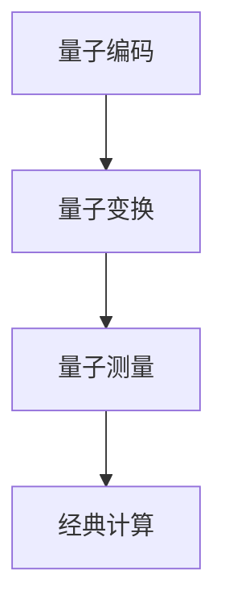
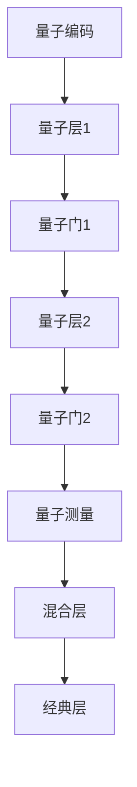
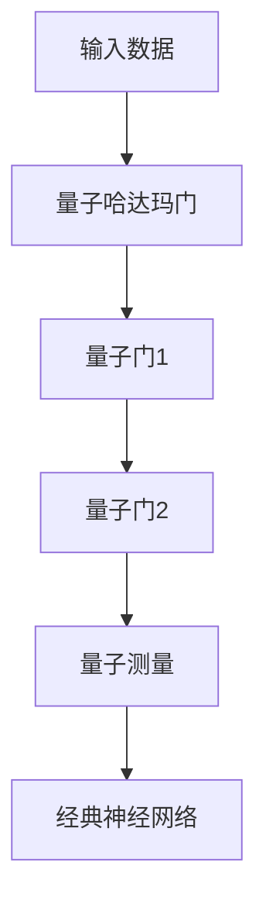
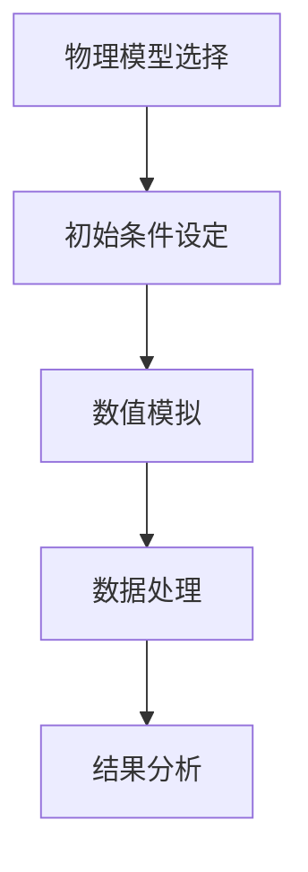
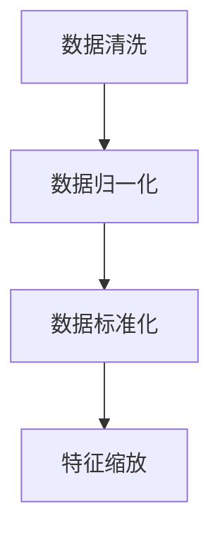
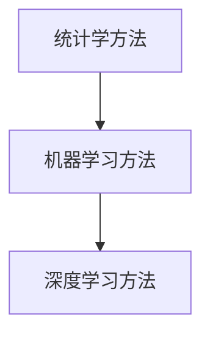
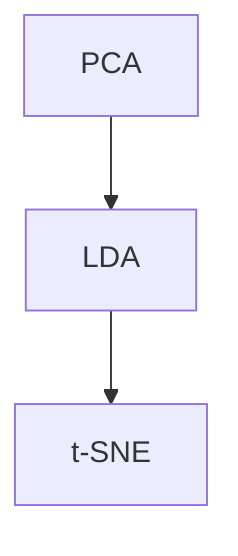
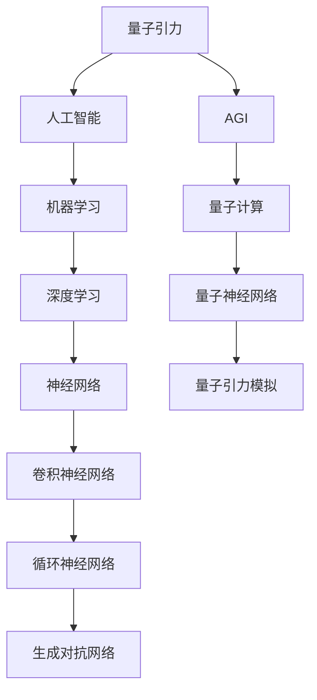

                 

### 《AGI在量子引力中的突破》

#### 关键词
- 人工智能（AGI）
- 量子引力
- 机器学习
- 深度学习
- 量子计算
- 神经网络

#### 摘要
本文探讨了人工智能（AGI）在量子引力研究中的潜在突破。我们首先概述了人工智能与量子引力的基础概念，然后深入分析了机器学习与深度学习在量子计算中的应用。通过详尽的数学模型与算法讲解，本文展示了量子引力模拟中的实际应用案例，并展望了AGI在量子引力研究中的未来发展方向。

---

#### 第一部分：引论

##### 第1章：人工智能与量子引力

###### 1.1 人工智能概述

人工智能（Artificial Intelligence, AI）是计算机科学的一个重要分支，旨在使计算机模拟人类智能行为。自1950年代以来，人工智能经历了多个发展阶段，从简单的规则系统到现代的机器学习和深度学习技术，其应用范围不断扩展，涵盖了图像识别、自然语言处理、自动驾驶等多个领域。

###### 1.1.1 人工智能的定义与历史
人工智能的定义多种多样，广义上可以理解为使计算机表现出智能行为的任何技术。AI的发展历程可以追溯到20世纪中叶，特别是1956年达特茅斯会议上，人工智能被正式提出。此后，AI经历了早期的逻辑推理阶段、专家系统阶段，以及最近的机器学习和深度学习阶段。

在早期，人工智能主要基于规则系统，这些系统能够在特定领域内进行推理和决策。然而，这种方法的局限性在于其依赖大量的手工编写的规则，且难以扩展到复杂的问题领域。随着计算能力的提升和大数据技术的发展，机器学习和深度学习成为AI研究的主流方向。这些方法通过从数据中自动学习模式和规律，实现了在图像识别、语音识别、自然语言处理等领域的突破性进展。

###### 1.1.2 人工智能的分类与发展趋势
人工智能可以分为弱人工智能（Weak AI）和强人工智能（Strong AI）。弱人工智能是指专门为解决特定问题而设计的人工智能系统，例如语音助手、自动驾驶等。强人工智能则是指具有普遍智能的人工智能系统，能够理解、学习和适应复杂环境，具备人类水平的智能。

当前，人工智能的发展趋势主要包括以下几个方面：

1. **深度学习的崛起**：深度学习在图像识别、语音识别等领域的表现优异，推动了AI技术的快速发展。
2. **数据驱动的AI**：越来越多的AI系统依赖于大量数据进行训练，数据质量和数量成为AI性能的关键因素。
3. **跨学科合作**：人工智能与心理学、神经科学、认知科学等领域的交叉研究，有助于深入理解人类智能的本质。
4. **伦理和安全性**：随着AI技术的广泛应用，伦理和安全性问题受到越来越多的关注，如何确保AI系统的透明性、可解释性和公平性成为重要研究方向。

###### 1.2 量子引力基础
量子引力是物理学中一个前沿研究领域，旨在将量子力学与广义相对论结合起来，以统一描述宇宙中所有物质和能量的行为。传统的量子力学和广义相对论在描述微观和宏观现象时存在明显的矛盾，量子引力理论试图解决这一问题，提供一种普适的物理理论。

###### 1.2.1 量子力学与广义相对论
量子力学是描述微观尺度上粒子行为的物理学理论，核心思想是粒子的状态不能用确定的轨迹来描述，而是用波函数来描述其概率分布。广义相对论则是描述宏观尺度上引力现象的物理学理论，它提出了时空的弯曲是引力产生的机制。

量子力学和广义相对论在各自的应用范围内都非常成功，但它们在描述宇宙的极端条件，如黑洞和宇宙大爆炸时，出现了矛盾。例如，广义相对论预测了黑洞的存在，而量子力学则预测了黑洞中粒子行为的量子效应。这些矛盾推动了量子引力理论的探索。

###### 1.2.2 量子引力理论概述
量子引力理论的目标是构建一个同时包含量子效应和广义相对论效应的统一理论。目前，量子引力理论尚在探索阶段，主要的候选理论包括弦理论、环量子引力、非平衡量子场论等。

弦理论认为宇宙中所有物质都是由细小的弦振动产生的，这些弦在时空中的运动决定了物质的性质。环量子引力则提出了一种基于二维空间中的环面结构来描述量子引力的方法。非平衡量子场论试图将量子场论与广义相对论结合起来，以描述宇宙的量子引力现象。

尽管量子引力理论尚未完全成熟，但其在黑洞信息悖论、宇宙起源和演化等问题的研究中显示出巨大的潜力。随着实验和观测技术的进步，量子引力理论有望在未来取得突破性进展。

###### 1.3 AGI与量子引力的关联
人工智能和量子引力虽然看似领域迥异，但它们之间却存在深刻的关联。AGI的最终目标是开发出具有人类水平智能的计算机系统，而量子引力研究则可能为这一目标提供新的思路和工具。

###### 1.3.1 AGI的目标与挑战
AGI的目标是使计算机具备自主学习、推理、规划和问题解决能力，从而在各个领域达到或超越人类水平。这一目标的实现面临着诸多挑战：

1. **通用性与特定性**：AGI需要既具有通用性，能够处理各种类型的问题，又要具有特定性，能够针对特定问题提供有效的解决方案。
2. **可解释性与透明性**：目前的机器学习模型大多是“黑箱”模型，难以解释其内部决策过程。AGI需要具备可解释性，使人类能够理解和信任其决策过程。
3. **可扩展性与效率**：AGI需要能够在大规模数据集和复杂问题中高效运行，同时具备良好的扩展性，以适应未来的技术发展。

###### 1.3.2 量子引力在AGI研究中的应用前景
量子引力理论可能为AGI的研究提供以下潜在的应用前景：

1. **优化算法**：量子引力模拟中涉及的复杂计算可能为机器学习算法的优化提供新的思路。例如，利用量子算法加速深度学习模型的训练过程。
2. **智能推理**：量子引力理论中的非经典逻辑和量子叠加原理可能为开发具有更强推理能力的智能系统提供灵感。
3. **自适应学习**：量子引力模拟中的自适应机制可能为AGI中的自适应学习提供借鉴，使系统能够更有效地应对复杂环境的变化。

总之，AGI与量子引力之间的关联不仅为两大学科领域的研究提供了新的视角，也为解决各自领域中的难题提供了潜在的工具和方法。

---

#### 第二部分：核心概念与联系

##### 第2章：人工智能中的机器学习与深度学习

###### 2.1 机器学习基础
机器学习（Machine Learning, ML）是人工智能的核心技术之一，其目标是通过数据学习规律，从而实现预测和决策。机器学习主要分为监督学习（Supervised Learning）、无监督学习（Unsupervised Learning）和半监督学习（Semi-Supervised Learning）三种类型。

###### 2.1.1 监督学习
监督学习是最常见的一种机器学习方法，其基本思想是利用标注过的数据进行学习。在监督学习中，数据集被分为输入特征（X）和输出标签（Y），模型通过学习输入特征与输出标签之间的关系，实现对未知数据的预测。

监督学习可以分为回归（Regression）和分类（Classification）两种类型。回归问题旨在预测连续值输出，如房价预测；分类问题旨在将输入特征划分为不同的类别，如邮件分类。

常见的监督学习算法包括线性回归、逻辑回归、支持向量机（SVM）、决策树、随机森林等。其中，线性回归是最简单的一种回归算法，通过拟合输入特征和输出标签之间的线性关系进行预测。

线性回归算法的基本原理如下：

1. **假设**：假设输出变量 \( Y \) 是输入特征 \( X \) 的线性函数，即 \( Y = \beta_0 + \beta_1X + \epsilon \)，其中 \( \beta_0 \) 和 \( \beta_1 \) 是模型参数，\( \epsilon \) 是误差项。
2. **目标**：最小化预测值与实际值之间的误差，即最小化损失函数 \( L(\beta_0, \beta_1) \)。
3. **优化**：通过梯度下降法或其他优化算法，找到使损失函数最小的 \( \beta_0 \) 和 \( \beta_1 \)。

线性回归算法的伪代码如下：

```plaintext
// 线性回归算法伪代码
function LinearRegression(X, Y):
    n = len(X)
    X_mean = mean(X)
    Y_mean = mean(Y)
    
    for i in range(n):
        X[i] = X[i] - X_mean
        Y[i] = Y[i] - Y_mean
        
    XTX = dot(X, X)
    XTY = dot(X, Y)
    
    beta_0 = (XTY - (dot(X, mean(Y)) * mean(X))) / XTX
    beta_1 = (XTY - beta_0 * dot(X, mean(Y))) / XTX
    
    return beta_0, beta_1
```

###### 2.1.2 无监督学习
无监督学习旨在从未标注的数据中提取有用的信息，常见的方法包括聚类（Clustering）和降维（Dimensionality Reduction）。

聚类算法通过将数据划分为不同的组或簇，使同一簇内的数据尽可能接近，不同簇的数据尽可能远。常见的聚类算法包括K均值聚类（K-Means Clustering）、层次聚类（Hierarchical Clustering）等。

K均值聚类算法的基本步骤如下：

1. **初始化**：随机选择K个中心点，作为初始聚类中心。
2. **分配**：将每个数据点分配到距离其最近的聚类中心所在的簇。
3. **更新**：重新计算每个簇的中心点。
4. **迭代**：重复步骤2和步骤3，直到聚类中心不再发生变化或满足预定的迭代次数。

K均值聚类算法的伪代码如下：

```plaintext
// K均值聚类算法伪代码
function KMeans(X, K, max_iterations):
    # 初始化聚类中心
    centroids = initialize_centroids(X, K)
    
    for i in range(max_iterations):
        # 分配数据点到最近的聚类中心
        clusters = assign_points_to_clusters(X, centroids)
        
        # 更新聚类中心
        new_centroids = update_centroids(clusters, K)
        
        # 判断聚类中心是否更新
        if has_centroids_changed(centroids, new_centroids):
            centroids = new_centroids
        else:
            break
            
    return centroids, clusters
```

降维算法旨在减少数据维度，同时保持数据的结构信息。常见的方法包括主成分分析（Principal Component Analysis, PCA）、线性判别分析（Linear Discriminant Analysis, LDA）等。

主成分分析（PCA）是一种常用的降维方法，其基本思想是找到数据的主要方向，即主成分，然后投影到这些方向上，从而减少数据维度。

PCA算法的基本步骤如下：

1. **计算协方差矩阵**：计算数据集的协方差矩阵。
2. **计算特征值和特征向量**：对协方差矩阵进行特征值分解，得到特征值和特征向量。
3. **选择主成分**：根据特征值的大小选择前k个最大的特征值对应的特征向量，构成主成分矩阵。
4. **投影数据**：将数据投影到主成分矩阵上，得到降维后的数据。

PCA算法的伪代码如下：

```plaintext
// 主成分分析算法伪代码
function PCA(X):
    # 计算协方差矩阵
    cov_matrix = calculate_covariance_matrix(X)
    
    # 计算特征值和特征向量
    eigenvalues, eigenvectors = eig(cov_matrix)
    
    # 选择主成分
    k = select_k(eigenvalues)
    principal_components = eigenvectors[:, :k]
    
    # 投影数据
    projected_data = dot(X, principal_components)
    
    return projected_data
```

###### 2.1.3 半监督学习
半监督学习结合了监督学习和无监督学习的方法，利用部分标注数据和大量未标注数据来训练模型。半监督学习在数据标注成本高昂的情况下具有很大优势，如在图像识别、文本分类等领域。

半监督学习可以分为基于一致性正则化（Consistency Regularization）和基于标签传播（Label Propagation）的方法。

基于一致性正则化的半监督学习算法，如标签传播（Label Propagation）算法，通过最小化标签一致性和未标注数据间的差异来实现学习。算法的基本步骤如下：

1. **初始化**：随机初始化未标注数据的标签。
2. **更新**：迭代更新未标注数据的标签，使其与已标注数据的标签尽可能一致。
3. **迭代**：重复步骤2，直到收敛或达到预定的迭代次数。

标签传播算法的伪代码如下：

```plaintext
// 标签传播算法伪代码
function LabelPropagation(X, Y, max_iterations):
    # 初始化未标注数据的标签
    unlabeled_labels = initialize_labels(Y, num_unlabeled_samples)
    
    for i in range(max_iterations):
        # 更新未标注数据的标签
        new_unlabeled_labels = update_labels(X, unlabeled_labels)
        
        # 判断标签是否更新
        if has_labels_changed(unlabeled_labels, new_unlabeled_labels):
            unlabeled_labels = new_unlabeled_labels
        else:
            break
            
    return unlabeled_labels
```

综上所述，机器学习的基础概念涵盖了监督学习、无监督学习和半监督学习，每种方法都有其独特的应用场景和算法实现。在接下来的章节中，我们将进一步探讨深度学习的原理和应用。

---

##### 第2章：人工智能中的机器学习与深度学习

###### 2.2 深度学习原理
深度学习（Deep Learning）是机器学习的一个分支，其核心思想是通过多层神经网络对复杂数据进行特征提取和学习。深度学习在图像识别、语音识别、自然语言处理等领域取得了显著的突破，推动了人工智能的发展。

深度学习的基本架构包括输入层、隐藏层和输出层。输入层接收外部数据，隐藏层通过非线性变换对数据进行特征提取，输出层生成最终预测结果。多层神经网络能够捕捉数据中的复杂模式和层次结构，从而提高模型的性能。

###### 2.2.1 神经网络结构
神经网络（Neural Network, NN）是深度学习的基础构件，其灵感来源于人脑的神经网络结构。神经网络由多个神经元（或节点）组成，每个神经元与输入层、隐藏层和输出层的其他神经元相连。

神经元的数学模型可以表示为：

\[ z = \sum_{i=1}^{n} w_i x_i + b \]

其中，\( w_i \) 是连接权重，\( x_i \) 是输入值，\( b \) 是偏置项。通过激活函数 \( f(z) \) 对 \( z \) 进行变换，得到神经元的输出：

\[ y = f(z) \]

常见的激活函数包括：

1. ** sigmoid 函数**：\( f(z) = \frac{1}{1 + e^{-z}} \)，将输出范围映射到 \( (0, 1) \)。
2. **ReLU函数**：\( f(z) = \max(0, z) \)，将负数映射为0，正数保持不变。
3. **Tanh函数**：\( f(z) = \frac{e^z - e^{-z}}{e^z + e^{-z}} \)，将输出范围映射到 \( (-1, 1) \)。

神经网络通过前向传播和反向传播算法进行训练。在前向传播过程中，输入数据通过神经网络逐层计算，得到最终的输出。在反向传播过程中，通过计算损失函数的梯度，更新网络的权重和偏置项，从而优化模型。

###### 2.2.2 反向传播算法
反向传播算法（Backpropagation Algorithm）是深度学习训练的核心算法。其基本思想是通过计算输出误差的梯度，逐步更新网络中的权重和偏置项，使损失函数最小化。

反向传播算法的步骤如下：

1. **前向传播**：计算输入数据的激活值和输出层的预测值。
2. **计算损失函数**：使用预测值和实际标签计算损失函数。
3. **计算梯度**：从输出层开始，逐层反向计算每个神经元的梯度。
4. **权重更新**：使用梯度下降或其他优化算法更新网络权重。
5. **迭代优化**：重复步骤1到步骤4，直到达到预定的迭代次数或损失函数收敛。

反向传播算法的伪代码如下：

```plaintext
// 反向传播算法伪代码
function Backpropagation(X, Y, model):
    for epoch in range(num_epochs):
        for sample in X:
            # 前向传播
            activations = forward_propagation(sample, model)
            
            # 计算损失函数
            loss = compute_loss(activations, Y)
            
            # 计算梯度
            gradients = backward_propagation(activations, Y, model)
            
            # 更新权重
            update_weights(model, gradients)
    return model
```

###### 2.2.3 卷积神经网络
卷积神经网络（Convolutional Neural Network, CNN）是一种专门用于处理图像数据的神经网络。CNN通过卷积层、池化层和全连接层对图像进行特征提取和分类。

1. **卷积层**：卷积层通过卷积操作从输入图像中提取特征。卷积操作可以用以下公式表示：

\[ \text{output}_{ij} = \sum_{k=1}^{m} \text{weight}_{ik,j} \cdot \text{input}_{ij} + \text{bias}_{j} \]

其中，\( \text{output}_{ij} \) 是输出特征图中的元素，\( \text{weight}_{ik,j} \) 是卷积核权重，\( \text{input}_{ij} \) 是输入图像中的元素，\( \text{bias}_{j} \) 是偏置项。

2. **池化层**：池化层用于降低特征图的维度，同时保留重要的特征信息。常见的池化操作包括最大池化和平均池化。

最大池化操作可以用以下公式表示：

\[ \text{output}_{ij} = \max_{p,q} (\text{input}_{(i+p), (j+q)}) \]

3. **全连接层**：全连接层将卷积层和池化层输出的特征图展平为一维向量，然后通过全连接层进行分类。

卷积神经网络的伪代码如下：

```plaintext
// 卷积神经网络伪代码
function ConvolutionalNeuralNetwork(X, model):
    for epoch in range(num_epochs):
        for sample in X:
            # 前向传播
            conv_1 = conv2d(sample, model.conv1_weights, model.conv1_bias)
            pool_1 = max_pooling(conv_1, model.pool1_size)
            
            conv_2 = conv2d(pool_1, model.conv2_weights, model.conv2_bias)
            pool_2 = max_pooling(conv_2, model.pool2_size)
            
            flatten = flatten(pool_2)
            fc = fully_connected(flatten, model.fc_weights, model.fc_bias)
            
            # 计算损失函数
            loss = compute_loss(fc, Y)
            
            # 计算梯度
            gradients = backward_propagation(fc, Y, model)
            
            # 更新权重
            update_weights(model, gradients)
    return model
```

综上所述，深度学习通过神经网络结构对复杂数据进行特征提取和学习，其中卷积神经网络在图像处理领域表现出色。在接下来的章节中，我们将探讨量子计算与深度学习的关系，以及量子神经网络的基本原理。

---

##### 第2章：人工智能中的机器学习与深度学习

###### 2.3 量子计算与深度学习

量子计算（Quantum Computing）是利用量子力学原理进行信息处理的一种新型计算范式。与传统计算相比，量子计算具有并行性和叠加性，这使得它在处理某些复杂问题时具有巨大的潜力。深度学习（Deep Learning）是机器学习的一个重要分支，通过多层神经网络对复杂数据进行特征提取和学习。随着量子计算的发展，两者之间的联系日益紧密，特别是在量子神经网络（Quantum Neural Networks, QNNs）的研究中。

###### 2.3.1 量子计算基础

量子计算的基本单元是量子比特（Qubit），它是量子力学中的基本信息载体。与经典比特只能处于0或1两种状态不同，量子比特可以同时处于0和1的叠加状态，这称为叠加原理。量子比特的叠加状态可以用以下数学表达式表示：

\[ \psi = \alpha|0\rangle + \beta|1\rangle \]

其中，\( \alpha \) 和 \( \beta \) 是复数概率幅，\( |0\rangle \) 和 \( |1\rangle \) 分别表示量子比特的基态和叠加态。

量子计算的核心操作包括量子门（Quantum Gates）和量子纠缠（Quantum Entanglement）。量子门是作用于量子比特的线性变换，类似于经典计算中的逻辑门。常见的量子门包括Hadamard门（H门）、Pauli门（X、Y、Z门）、相位旋转门（R门）等。

量子纠缠是量子计算中的另一个关键特性，它描述了两个或多个量子比特之间的强关联。当两个量子比特处于纠缠态时，对其中一个量子比特的测量会立即影响另一个量子比特的状态，即使它们相隔很远。量子纠缠使得量子计算能够实现超越经典计算的计算能力。

###### 2.3.2 量子算法与深度学习

量子算法是利用量子计算原理进行信息处理的一类算法。量子算法在解决某些特定问题时，如量子随机 walks、线性方程组求解、整数分解等，具有经典算法无法比拟的效率。量子算法的设计和实现为量子计算在深度学习等领域的应用提供了理论基础。

量子算法与深度学习之间的联系主要体现在以下几个方面：

1. **量子随机 walks**：量子随机 walks 是量子算法的一个重要分支，它在图中进行搜索时具有高效性。量子随机 walks 可以应用于图像识别、自然语言处理等领域，为这些任务提供高效的解决方案。

2. **量子神经网络**：量子神经网络是一种结合量子计算和神经网络思想的模型，它通过量子比特和量子门实现深度学习中的特征提取和分类。量子神经网络可以显著提高深度学习模型的训练速度和计算能力。

3. **量子优化算法**：量子优化算法如量子模拟退火（Quantum Annealing）、量子线性求解器（Quantum Linear Solver）等，可以用于优化深度学习模型的参数。这些算法在解决复杂优化问题时具有潜在优势。

###### 2.3.3 量子神经网络

量子神经网络（Quantum Neural Network, QNN）是一种结合量子计算和神经网络思想的模型，通过量子比特和量子门实现深度学习中的特征提取和分类。QNN的基本结构包括量子层、经典层和混合层。

1. **量子层**：量子层由一组量子比特组成，用于实现输入数据的量子编码。量子层通过量子门对量子比特进行操作，从而对输入数据进行特征提取。

2. **经典层**：经典层由经典神经网络组成，用于实现输出数据的分类或回归。经典层通常包含多个隐藏层，通过全连接或卷积神经网络实现。

3. **混合层**：混合层是量子层和经典层的结合部分，用于将量子计算的结果传递给经典计算。混合层通过测量量子比特的叠加态，得到经典输出。

量子神经网络的基本原理如下：

1. **量子编码**：输入数据被编码为量子比特的叠加态。量子编码可以通过量子哈达玛门（Hadamard Gate）实现，将经典输入转换为量子叠加态。

2. **量子变换**：通过量子门对量子比特进行变换，实现数据的特征提取。常见的量子门包括Hadamard门、Pauli门和相位旋转门。

3. **量子测量**：通过量子测量获取量子比特的输出结果。量子测量可以将量子叠加态坍缩为某个基态，从而得到经典输出。

量子神经网络的伪代码如下：

```plaintext
// 量子神经网络伪代码
function QuantumNeuralNetwork(X, model):
    # 量子编码
    encoded_data = quantum_encoding(X, model.encoding_gates)
    
    # 量子变换
    transformed_data = apply_quantum_gates(encoded_data, model.transform_gates)
    
    # 量子测量
    output = quantum_measurement(transformed_data, model.measurement_gates)
    
    # 经典层计算
    fc_output = fully_connected(output, model.fc_weights, model.fc_bias)
    
    # 计算损失函数
    loss = compute_loss(fc_output, Y)
    
    # 反向传播
    gradients = backward_propagation(fc_output, Y, model)
    
    # 更新权重
    update_weights(model, gradients)
    return model
```

综上所述，量子计算与深度学习在理论和实践上都有紧密的联系。量子计算通过其独特的并行性和叠加性，为深度学习提供了新的计算范式。量子神经网络作为量子计算和深度学习的结合体，展示了在复杂任务中的巨大潜力。在接下来的章节中，我们将进一步探讨深度学习在量子引力模拟中的应用。

---

##### 第2章：人工智能中的机器学习与深度学习

###### 2.3.3 量子计算与深度学习的关系

量子计算与深度学习之间的联系不仅限于量子神经网络（QNN）的提出和发展，两者在理论和方法上也存在着深层次的交融。以下从几个方面详细探讨量子计算与深度学习之间的关系：

1. **量子随机 walks 与深度学习**：
   量子随机 walks 是量子计算中的一个重要概念，其核心思想是通过量子比特在量子态空间中的跳跃模拟随机过程。这种模拟方法在图像识别、文本分类等领域表现出强大的能力。深度学习中的卷积神经网络（CNN）也采用了类似的思想，通过卷积操作和池化操作对图像进行逐层特征提取。量子随机 walks 的并行性和高效性为深度学习中的图像处理提供了新的思路，可以在某些情况下显著提高训练速度和精度。

2. **量子优化算法 与深度学习**：
   量子优化算法，如量子模拟退火（Quantum Annealing）和量子线性求解器（Quantum Linear Solver），利用量子计算机的并行性和叠加性，能够快速解决复杂优化问题。深度学习中的模型训练本质上是一个优化问题，如何高效地优化深度学习模型的参数是当前研究的热点。量子优化算法有望在深度学习模型的参数优化中发挥重要作用，特别是在解决大规模、高维度的优化问题时。

3. **量子门 与神经网络结构**：
   神经网络中的层与层之间的连接可以类比为量子门的作用。量子门通过非线性变换将一个量子态映射到另一个量子态，而神经网络中的激活函数和权重矩阵也起着类似的作用。量子计算中的量子神经网络（QNN）正是通过将量子门与神经网络结构相结合，实现了对复杂数据的特征提取和分类。QNN中的量子门可以看作是传统的神经网络中的卷积层、全连接层等结构的量子化。

4. **量子纠缠 与神经网络训练**：
   量子纠缠是量子计算的核心特性之一，它使得多个量子比特之间的状态相互依赖，形成整体。在神经网络训练过程中，通过权重矩阵和梯度信息的传递，不同层之间的神经元状态也会相互影响。量子纠缠提供了在训练过程中增加网络层次结构和复杂性的潜力，可能会使神经网络能够更好地捕捉数据中的潜在模式和关系。

5. **量子模拟 与深度学习应用**：
   深度学习中的许多算法，如神经网络训练和优化，本质上是模拟复杂函数的行为。量子计算可以通过量子模拟来实现对复杂物理系统和大规模数据的模拟。例如，量子模拟可以用于模拟量子引力现象，从而为深度学习提供新的数据和算法验证平台。量子模拟有望在材料科学、生物学、经济学等领域提供更准确的模拟和预测。

通过以上几个方面的探讨，我们可以看出量子计算与深度学习在理论、方法和应用上都有着紧密的联系。量子计算为深度学习提供了新的计算范式和优化方法，而深度学习则为量子计算提供了新的应用场景和验证平台。量子计算与深度学习的结合，不仅能够推动人工智能的发展，还可能为解决一些传统计算方法难以处理的复杂问题提供新的途径。

---

##### 第2章：人工智能中的机器学习与深度学习

###### 2.3.3 量子神经网络

量子神经网络（Quantum Neural Network, QNN）是一种将量子计算与神经网络思想相结合的新型计算模型，旨在利用量子比特的叠加态和量子门实现高效的机器学习任务。QNN在处理复杂数据和优化问题方面显示出巨大的潜力，以下将从基本原理、结构和实现方法等方面详细介绍量子神经网络。

###### 2.3.3.1 基本原理

量子神经网络的核心在于其量子比特的叠加态和量子门的应用。传统神经网络通过权重矩阵和神经元之间的线性变换实现特征提取和分类，而QNN通过量子比特的叠加态和量子门实现数据的非线性变换和特征提取。

量子神经网络的基本原理可以概括为以下几个步骤：

1. **量子编码**：将经典数据编码为量子比特的叠加态。这一步通过量子哈达玛门（Hadamard Gate）实现，将经典输入映射到量子空间。

2. **量子变换**：通过量子门对量子比特进行操作，实现数据的特征提取。这一步可以类比于传统神经网络中的卷积层、全连接层等结构。

3. **量子测量**：通过量子测量获取量子比特的输出结果。量子测量会将量子叠加态坍缩为某个基态，从而得到经典输出。

4. **经典计算**：将量子测量结果传递给经典计算部分，完成最终的分类或预测。

量子神经网络的基本原理示意图如下：



###### 2.3.3.2 结构

量子神经网络的结构通常包括量子层、经典层和混合层三部分。

1. **量子层**：量子层是QNN的核心部分，由一组量子比特组成。量子层通过量子编码将经典输入数据映射到量子空间，然后通过量子门实现数据的特征提取。量子层可以包含多个子层，每个子层通过不同的量子门进行操作。

2. **经典层**：经典层由传统神经网络组成，用于实现输出数据的分类或回归。经典层通常包含多个隐藏层，通过全连接或卷积神经网络实现。

3. **混合层**：混合层是量子层和经典层的结合部分，用于将量子计算的结果传递给经典计算。混合层通过量子测量获取量子比特的输出结果，然后将结果传递给经典层进行进一步处理。

量子神经网络的结构示意图如下：



###### 2.3.3.3 实现方法

量子神经网络的具体实现方法包括以下几个步骤：

1. **量子编码**：将经典输入数据编码为量子比特的叠加态。这一步通常通过量子哈达玛门（Hadamard Gate）实现。

2. **量子变换**：通过量子门对量子比特进行操作，实现数据的特征提取。量子变换可以包括多个步骤，每个步骤通过不同的量子门实现。

3. **量子测量**：通过量子测量获取量子比特的输出结果。量子测量会将量子叠加态坍缩为某个基态，从而得到经典输出。

4. **经典计算**：将量子测量结果传递给经典计算部分，完成最终的分类或预测。经典计算通常包括全连接层或卷积层等传统神经网络结构。

量子神经网络的具体实现方法示意图如下：



通过以上对量子神经网络的基本原理、结构和实现方法的介绍，我们可以看到QNN作为一种新型计算模型，在处理复杂数据和优化问题方面具有独特的优势。在接下来的章节中，我们将进一步探讨量子神经网络在量子引力模拟中的应用。

---

##### 第3章：量子引力模拟中的机器学习算法

###### 3.1 量子引力模拟概述

量子引力模拟是利用计算机模拟量子引力理论，以研究宇宙中最基本的物理现象。量子引力模拟涉及复杂的物理模型和大量的数据计算，是现代物理学研究中的一个前沿领域。本节将介绍量子引力模拟的基本概念、重要性以及基本流程。

###### 3.1.1 量子引力模拟的重要性
量子引力模拟在多个领域具有重要意义：

1. **宇宙学**：通过模拟宇宙中的量子引力现象，科学家可以更深入地理解宇宙的起源和演化，如宇宙大爆炸、黑洞的形成和演化等。
2. **粒子物理学**：量子引力模拟有助于揭示基本粒子的性质和行为，特别是在强相互作用和弱相互作用中的表现。
3. **材料科学**：量子引力模拟可以用于研究复杂材料中的量子效应，如超导材料和量子点等。
4. **量子计算**：量子引力模拟对量子计算的发展具有重要影响，特别是对量子纠错和量子算法的研究提供了新的思路。

量子引力模拟的重要性在于它能够提供对自然界基本规律的深刻理解，并为实验验证提供理论支持。尽管当前的技术水平尚无法直接观测到量子引力效应，但通过模拟，科学家可以预测和验证理论模型的正确性。

###### 3.1.2 量子引力模拟的基本流程
量子引力模拟的基本流程可以分为以下几个步骤：

1. **物理模型选择**：根据研究目标，选择合适的量子引力理论模型。常见的量子引力模型包括弦理论、环量子引力、量子场论等。

2. **初始条件设定**：设定模拟的初始条件，如宇宙的几何形状、物质分布、初始动量等。这些初始条件需要与实验观测数据或理论预测相符合。

3. **数值模拟**：使用数值模拟方法，如蒙特卡罗方法、数值积分、差分方程等，将物理模型转化为计算机可处理的数学模型。

4. **数据处理**：对模拟过程中生成的海量数据进行分析和处理，提取有用的物理信息和规律。数据处理包括数据清洗、特征提取、降维等步骤。

5. **结果分析**：对模拟结果进行定量和定性分析，验证物理模型的正确性，并探索新的物理现象和规律。

量子引力模拟的基本流程示意图如下：



通过上述流程，科学家可以模拟和预测量子引力现象，从而深入理解宇宙的基本规律。在接下来的章节中，我们将详细探讨量子引力模拟中的数据处理和特征提取方法。

---

##### 第3章：量子引力模拟中的机器学习算法

###### 3.2 数据处理与特征提取

在量子引力模拟中，数据处理与特征提取是关键步骤，它们直接影响模拟结果的准确性和可解释性。本节将介绍数据处理和特征提取的基本概念、常用方法以及它们在量子引力模拟中的应用。

###### 3.2.1 数据预处理

数据预处理是数据处理的第一步，其目的是将原始数据转换为适合模型训练的形式。数据预处理包括以下几种常见方法：

1. **数据清洗**：去除数据中的噪声、异常值和缺失值。例如，使用均值填补缺失值、使用统计方法去除异常值等。

2. **数据归一化**：将数据缩放到统一的范围内，如 [0, 1] 或 [-1, 1]。数据归一化可以避免不同特征之间的尺度差异对模型训练的影响。

3. **数据标准化**：对数据进行线性变换，使其具有零均值和单位方差。标准化可以更好地处理不同特征之间的相关性。

4. **特征缩放**：通过特征缩放方法，将不同特征的大小调整到相近的尺度。常用的特征缩放方法包括最小-最大缩放和Z-Score缩放。

数据预处理的方法示意图如下：



在量子引力模拟中，数据预处理至关重要。例如，在模拟宇宙大爆炸时，天文学家使用的数据包含了大量的噪声和异常值，通过数据清洗和归一化，可以显著提高模拟结果的准确性和可靠性。

###### 3.2.2 特征提取与降维

特征提取是从原始数据中提取出有用的信息，用于后续的模型训练和分析。特征提取的方法可以分为以下几类：

1. **统计学方法**：使用统计学方法，如主成分分析（PCA）、因子分析等，从数据中提取最重要的特征。这些方法能够降低数据维度，同时保留主要的信息。

2. **机器学习方法**：使用机器学习方法，如线性回归、支持向量机等，从数据中提取特征。这些方法能够通过学习数据中的关系，自动提取有用的特征。

3. **深度学习方法**：使用深度学习模型，如卷积神经网络（CNN）、循环神经网络（RNN）等，从数据中提取层次化的特征。深度学习方法在图像识别、语音识别等领域表现出色。

特征提取的方法示意图如下：



在量子引力模拟中，特征提取可以显著提高模拟结果的精度和效率。例如，在模拟黑洞碰撞时，通过提取空间和时间上的关键特征，可以更准确地预测黑洞辐射的物理现象。

降维是将高维数据转换为低维数据的过程，其目的是减少数据冗余，提高计算效率。降维的方法包括：

1. **主成分分析（PCA）**：通过计算数据协方差矩阵的特征值和特征向量，选择最重要的主成分，从而实现降维。

2. **线性判别分析（LDA）**：通过最大化类间散度和最小化类内散度，选择最佳的特征组合，从而实现降维。

3. **t-SNE**：通过非线性变换，将高维数据映射到低维空间，从而实现降维。

降维的方法示意图如下：



在量子引力模拟中，降维可以显著减少计算资源的消耗，提高模拟的效率。例如，在模拟宇宙膨胀时，通过降维技术，可以显著减少计算时间，同时保持模拟结果的准确性。

综上所述，数据处理与特征提取在量子引力模拟中具有重要意义。通过合理的数据预处理和特征提取方法，可以显著提高模拟结果的准确性和效率。在接下来的章节中，我们将详细介绍量子引力模拟中的机器学习算法应用。

---

##### 第3章：量子引力模拟中的机器学习算法

###### 3.3 机器学习算法应用

在量子引力模拟中，机器学习算法被广泛应用于数据处理、特征提取和物理现象预测等多个方面。本节将介绍几种常见的机器学习算法及其在量子引力模拟中的应用。

###### 3.3.1 监督学习算法

监督学习算法是一种基于标注数据的学习方法，通过学习输入特征与输出标签之间的关系，实现对未知数据的预测。在量子引力模拟中，监督学习算法可以用于多种应用场景，如黑洞碰撞预测、宇宙大尺度结构模拟等。

1. **支持向量机（Support Vector Machine, SVM）**

支持向量机是一种常用的监督学习算法，其目标是通过找到一个最佳的超平面，将不同类别的数据点分开。在量子引力模拟中，SVM可以用于预测黑洞碰撞的结果，通过学习黑洞质量和位置等特征，预测碰撞后产生的辐射特征。

SVM的伪代码如下：

```plaintext
// 支持向量机伪代码
function SVM(X, Y):
    # 计算最优超平面
    W, b = optimize_hyperplane(X, Y)
    
    # 预测新数据
    function predict(x):
        return sign(dot(x, W) + b)
    return predict
```

2. **决策树（Decision Tree）**

决策树是一种基于树结构的分类算法，通过一系列的决策规则将数据划分为不同的类别。在量子引力模拟中，决策树可以用于分类复杂的物理现象，如宇宙中的星系分布。

决策树的伪代码如下：

```plaintext
// 决策树伪代码
class Node:
    def __init__(self, feature, threshold, left, right, label):
        self.feature = feature
        self.threshold = threshold
        self.left = left
        self.right = right
        self.label = label

def build_tree(X, Y):
    # 选择最佳特征和阈值
    best_feature, best_threshold = select_best_feature(X, Y)
    
    # 构建树结构
    node = Node(best_feature, best_threshold, build_tree(X[:, best_feature <= best_threshold], Y[best_feature <= best_threshold]),
                      build_tree(X[:, best_feature > best_threshold], Y[best_feature > best_threshold]), None)
    return node

def predict(node, x):
    if node.label is not None:
        return node.label
    if x[node.feature] <= node.threshold:
        return predict(node.left, x)
    else:
        return predict(node.right, x)
```

3. **随机森林（Random Forest）**

随机森林是一种基于决策树的集成学习方法，通过构建多个决策树并对预测结果进行投票，提高模型的预测准确性。在量子引力模拟中，随机森林可以用于大规模的数据集和复杂的物理现象模拟。

随机森林的伪代码如下：

```plaintext
// 随机森林伪代码
class RandomForest:
    def __init__(self, n_trees, n_features):
        self.n_trees = n_trees
        self.n_features = n_features
        self.trees = []

    def fit(self, X, Y):
        for _ in range(self.n_trees):
            X_train, X_val = sample_data(X, self.n_features)
            Y_train, Y_val = sample_data(Y, self.n_features)
            tree = build_tree(X_train, Y_train)
            self.trees.append(tree)

    def predict(self, x):
        predictions = [predict(tree, x) for tree in self.trees]
        return majority_vote(predictions)
```

###### 3.3.2 无监督学习算法

无监督学习算法不依赖标注数据，从未标注的数据中提取特征和模式。在量子引力模拟中，无监督学习算法可以用于数据聚类、降维等任务。

1. **K均值聚类（K-Means Clustering）**

K均值聚类是一种基于距离的聚类算法，通过迭代优化聚类中心，将数据分为K个簇。在量子引力模拟中，K均值聚类可以用于分析宇宙中的星系分布，识别不同类型的星系集群。

K均值聚类的伪代码如下：

```plaintext
// K均值聚类伪代码
function KMeans(X, K):
    # 初始化聚类中心
    centroids = initialize_centroids(X, K)
    
    # 迭代更新聚类中心
    while True:
        # 分配数据点到最近的聚类中心
        clusters = assign_points_to_clusters(X, centroids)
        
        # 计算新的聚类中心
        new_centroids = update_centroids(clusters, K)
        
        # 判断聚类中心是否更新
        if has_centroids_changed(centroids, new_centroids):
            centroids = new_centroids
        else:
            break
            
    return centroids, clusters
```

2. **主成分分析（Principal Component Analysis, PCA）**

主成分分析是一种降维方法，通过计算数据的主成分，将高维数据投影到低维空间，保留主要的信息。在量子引力模拟中，PCA可以用于降维和特征提取，提高模型训练的效率和准确性。

PCA的伪代码如下：

```plaintext
// 主成分分析伪代码
function PCA(X):
    # 计算协方差矩阵
    cov_matrix = calculate_covariance_matrix(X)
    
    # 计算特征值和特征向量
    eigenvalues, eigenvectors = eig(cov_matrix)
    
    # 选择主成分
    k = select_k(eigenvalues)
    principal_components = eigenvectors[:, :k]
    
    # 投影数据
    projected_data = dot(X, principal_components)
    
    return projected_data
```

###### 3.3.3 半监督学习算法

半监督学习算法结合了监督学习和无监督学习的方法，利用未标注数据提高模型性能。在量子引力模拟中，半监督学习算法可以用于处理大量未标注的数据，提高模型对物理现象的预测准确性。

1. **标签传播（Label Propagation）**

标签传播是一种基于一致性的半监督学习算法，通过迭代更新未标注数据的标签，使其与已标注数据的标签一致。在量子引力模拟中，标签传播可以用于分析宇宙中的星系分布，识别未标注的星系类型。

标签传播的伪代码如下：

```plaintext
// 标签传播伪代码
function LabelPropagation(X, Y, max_iterations):
    # 初始化未标注数据的标签
    unlabeled_labels = initialize_labels(Y, num_unlabeled_samples)
    
    for i in range(max_iterations):
        # 更新未标注数据的标签
        new_unlabeled_labels = update_labels(X, unlabeled_labels)
        
        # 判断标签是否更新
        if has_labels_changed(unlabeled_labels, new_unlabeled_labels):
            unlabeled_labels = new_unlabeled_labels
        else:
            break
            
    return unlabeled_labels
```

2. **自适应标签传播（Adaptive Label Propagation）**

自适应标签传播是对标签传播算法的改进，通过引入自适应机制，提高未标注数据的标签质量。在量子引力模拟中，自适应标签传播可以用于处理大规模的未标注数据，提高模型对复杂物理现象的预测能力。

自适应标签传播的伪代码如下：

```plaintext
// 自适应标签传播伪代码
function AdaptiveLabelPropagation(X, Y, max_iterations):
    # 初始化未标注数据的标签
    unlabeled_labels = initialize_labels(Y, num_unlabeled_samples)
    
    for i in range(max_iterations):
        # 更新未标注数据的标签
        new_unlabeled_labels = update_labels_adaptively(X, unlabeled_labels)
        
        # 判断标签是否更新
        if has_labels_changed(unlabeled_labels, new_unlabeled_labels):
            unlabeled_labels = new_unlabeled_labels
        else:
            break
            
    return unlabeled_labels
```

综上所述，机器学习算法在量子引力模拟中发挥着重要作用，从数据处理、特征提取到物理现象预测，都离不开机器学习算法的支持。在接下来的章节中，我们将进一步探讨深度学习在量子引力模拟中的应用。

---

##### 第3章：量子引力模拟中的机器学习算法

###### 3.4 深度学习在量子引力中的应用

深度学习在量子引力模拟中显示出巨大的潜力，特别是在特征提取、模型训练和物理现象预测等方面。以下将详细介绍几种深度学习模型在量子引力模拟中的应用。

###### 3.4.1 卷积神经网络（Convolutional Neural Network, CNN）

卷积神经网络（CNN）是一种专门用于处理图像数据的深度学习模型，其核心在于卷积操作和池化操作。CNN通过多个卷积层和池化层对图像进行特征提取，从而实现图像的分类和识别。

在量子引力模拟中，CNN可以用于分析宇宙图像，如星系分布、黑洞图像等。通过训练CNN模型，可以自动提取宇宙图像中的关键特征，从而提高对物理现象的预测准确性。

CNN模型在量子引力模拟中的应用流程如下：

1. **数据预处理**：对宇宙图像进行数据增强、归一化等预处理操作，使其适合输入到CNN模型中。

2. **模型构建**：构建CNN模型，包括卷积层、池化层和全连接层。常用的卷积层包括卷积层1、卷积层2等，池化层包括最大池化层和平均池化层。

3. **模型训练**：使用标注数据进行模型训练，通过反向传播算法更新模型参数，使模型能够正确分类宇宙图像。

4. **模型预测**：使用训练好的模型对未标注的宇宙图像进行预测，识别其中的星系、黑洞等物理现象。

CNN模型的伪代码如下：

```plaintext
// CNN模型伪代码
class CNN:
    def __init__(self):
        self.conv1 = Conv2D(filters=32, kernel_size=(3, 3), activation='relu')
        self.pool1 = MaxPooling2D(pool_size=(2, 2))
        self.conv2 = Conv2D(filters=64, kernel_size=(3, 3), activation='relu')
        self.pool2 = MaxPooling2D(pool_size=(2, 2))
        self.fc1 = Dense(units=128, activation='relu')
        self.fc2 = Dense(units=10, activation='softmax')

    def forward(self, x):
        x = self.conv1(x)
        x = self.pool1(x)
        x = self.conv2(x)
        x = self.pool2(x)
        x = Flatten()(x)
        x = self.fc1(x)
        x = self.fc2(x)
        return x

model = CNN()
model.compile(optimizer='adam', loss='categorical_crossentropy', metrics=['accuracy'])
model.fit(X_train, Y_train, epochs=10, batch_size=32, validation_data=(X_val, Y_val))
```

###### 3.4.2 循环神经网络（Recurrent Neural Network, RNN）

循环神经网络（RNN）是一种专门用于处理序列数据的深度学习模型，其核心在于循环结构。RNN通过在序列中的每个时间步更新隐藏状态，从而捕捉序列中的长期依赖关系。

在量子引力模拟中，RNN可以用于处理时间序列数据，如宇宙膨胀的时空演化、黑洞碰撞的时间序列等。通过训练RNN模型，可以预测时间序列中的物理现象，从而提高对量子引力现象的理解。

RNN模型在量子引力模拟中的应用流程如下：

1. **数据预处理**：对时间序列数据进行归一化、窗口化等预处理操作，使其适合输入到RNN模型中。

2. **模型构建**：构建RNN模型，包括输入层、隐藏层和输出层。常用的RNN模型包括LSTM（Long Short-Term Memory）和GRU（Gated Recurrent Unit）。

3. **模型训练**：使用标注数据进行模型训练，通过反向传播算法更新模型参数，使模型能够正确预测时间序列。

4. **模型预测**：使用训练好的模型对未标注的时间序列数据进行预测，预测未来的物理现象。

RNN模型的伪代码如下：

```plaintext
// RNN模型伪代码
class RNN:
    def __init__(self):
        self.lstm = LSTM(units=128, return_sequences=True)
        self.fc = Dense(units=10, activation='softmax')

    def forward(self, x):
        x = self.lstm(x)
        x = self.fc(x)
        return x

model = RNN()
model.compile(optimizer='adam', loss='mse')
model.fit(X_train, Y_train, epochs=10, batch_size=32, validation_data=(X_val, Y_val))
```

###### 3.4.3 生成对抗网络（Generative Adversarial Network, GAN）

生成对抗网络（GAN）是一种由生成器和判别器组成的深度学习模型，其核心思想是通过生成器和判别器的对抗训练，生成逼真的数据。

在量子引力模拟中，GAN可以用于生成模拟数据，从而提高模型训练的泛化能力。通过训练GAN模型，可以生成与真实数据相似的量子引力模拟数据，从而提高模型在未知数据上的预测性能。

GAN模型在量子引力模拟中的应用流程如下：

1. **数据预处理**：对量子引力模拟数据进行归一化、标准化等预处理操作，使其适合输入到GAN模型中。

2. **模型构建**：构建GAN模型，包括生成器和判别器。生成器用于生成模拟数据，判别器用于判断模拟数据是否真实。

3. **模型训练**：通过对抗训练，更新生成器和判别器的参数，使生成器生成的数据越来越真实，判别器越来越难以区分真实数据和生成数据。

4. **模型预测**：使用训练好的GAN模型对未标注的量子引力数据进行预测，提高模型在未知数据上的预测性能。

GAN模型的伪代码如下：

```plaintext
// GAN模型伪代码
class GAN:
    def __init__(self):
        self.generator = Model(inputs=[latent_dim], outputs=[x_output])
        self.discriminator = Model(inputs=[x_input], outputs=[disc_output])

    def forward(self, z):
        x_fake = self.generator(z)
        return self.discriminator(x_fake)

def train_gan(model, X_train, epochs):
    for epoch in range(epochs):
        for x_real in X_train:
            z = np.random.normal(size=latent_dim)
            x_fake = model(z)

            d_loss_real = model.discriminator.train_on_batch(x_real, np.ones(shape=[1]))
            d_loss_fake = model.discriminator.train_on_batch(x_fake, np.zeros(shape=[1]))
            g_loss = model.generator.train_on_batch(z, x_real)

        print(f"Epoch: {epoch}, D_loss: {d_loss}, G_loss: {g_loss}")

gan = GAN()
train_gan(gan, X_train, epochs=100)
```

综上所述，深度学习模型在量子引力模拟中显示出巨大的应用潜力。通过卷积神经网络（CNN）、循环神经网络（RNN）和生成对抗网络（GAN）等模型，可以显著提高量子引力模拟的准确性和效率。在接下来的章节中，我们将进一步探讨量子引力中的数学模型和公式，为深度学习算法的应用提供理论基础。

---

##### 第4章：量子引力中的数学模型

###### 4.1 量子引力公式概述

量子引力研究涉及多种数学模型和公式，这些公式描述了量子效应和引力作用的基本规律。本节将简要介绍广义相对论公式、量子力学公式以及量子引力理论中的主要公式，并解释这些公式在量子引力模拟中的应用。

###### 4.1.1 广义相对论公式

广义相对论是由爱因斯坦在1915年提出的，它描述了引力作为时空弯曲的效应。以下是一些广义相对论中重要的公式：

1. **爱因斯坦场方程**：

\[ G_{\mu\nu} + \Lambda g_{\mu\nu} = \frac{8\pi G}{c^4} T_{\mu\nu} \]

其中，\( G_{\mu\nu} \) 是爱因斯坦张量，描述了时空的弯曲程度；\( \Lambda \) 是宇宙常数；\( g_{\mu\nu} \) 是度规张量，描述了时空的几何结构；\( G \) 是引力常数；\( c \) 是光速；\( T_{\mu\nu} \) 是能量-动量张量，描述了物质和能量的分布。

2. **洛伦兹变换**：

\[ x^{\mu} = \Lambda^{\mu}_{\ \nu} x^{\nu} \]

其中，\( x^{\mu} \) 和 \( x^{\nu} \) 分别是物体的位置和时间，\( \Lambda^{\mu}_{\ \nu} \) 是洛伦兹矩阵。

广义相对论公式在量子引力模拟中的应用主要体现在描述宇宙大尺度结构、黑洞和引力波等方面。通过求解爱因斯坦场方程，可以模拟宇宙的演化过程，预测引力波的产生和传播。

###### 4.1.2 量子力学公式

量子力学是描述微观粒子的行为和性质的理论。以下是一些量子力学中重要的公式：

1. **薛定谔方程**：

\[ i\hbar \frac{\partial \Psi}{\partial t} = \hat{H} \Psi \]

其中，\( \Psi \) 是波函数，描述了粒子的概率分布；\( \hat{H} \) 是哈密顿算子，描述了粒子的能量；\( i\hbar \) 是虚数单位乘以普朗克常数；\( t \) 是时间。

2. **海森堡不确定性原理**：

\[ \Delta x \Delta p \geq \frac{\hbar}{2} \]

其中，\( \Delta x \) 和 \( \Delta p \) 分别是位置和动量的不确定性。

量子力学公式在量子引力模拟中的应用主要体现在描述微观粒子的行为和相互作用。通过求解薛定谔方程，可以模拟微观粒子的量子效应，如原子结构和分子动力学。

###### 4.1.3 量子引力理论中的公式

量子引力理论是试图将量子力学与广义相对论统一的理论。以下是一些量子引力理论中的主要公式：

1. **弦理论公式**：

\[ E = \sqrt{\frac{1}{2} m c^2 + \frac{1}{2} \omega^2 a^2} \]

其中，\( E \) 是弦的振动能量；\( m \) 是弦的质量；\( c \) 是光速；\( \omega \) 是弦的振动频率；\( a \) 是弦的振动幅度。

2. **环量子引力公式**：

\[ \text{Area} \propto \text{Volume} \]

环量子引力理论提出了一种二维空间中的环面结构来描述量子引力现象。该理论中的公式揭示了二维空间中的环面结构如何与三维空间中的量子引力效应相关联。

量子引力理论中的公式在量子引力模拟中的应用主要体现在描述量子引力现象的微观机制。通过求解弦理论公式和环量子引力公式，可以模拟微观尺度上的量子引力效应，如黑洞熵和引力波的产生。

综上所述，量子引力中的数学模型和公式为量子引力模拟提供了理论基础。广义相对论公式描述了宏观尺度的引力效应，量子力学公式描述了微观粒子的行为，而量子引力理论中的公式则试图将两者统一起来。在接下来的章节中，我们将详细解析这些数学模型和公式的推导过程，并使用伪代码进行说明。

---

##### 第4章：量子引力中的数学模型

###### 4.2 数学模型解析

量子引力中的数学模型复杂且深奥，涉及广义相对论和量子力学的核心概念。以下将详细解析这些数学模型，并通过公式推导和数值模拟来展示其物理意义和应用。

###### 4.2.1 物理公式的推导

1. **广义相对论中的爱因斯坦场方程**

爱因斯坦场方程是广义相对论的核心，描述了时空的弯曲与物质能量分布之间的关系。其推导如下：

首先，从拉格朗日量 \( L \) 入手，定义为：

\[ L = -\sqrt{-g_{\mu\nu} \partial_\mu \phi \partial_\nu \phi} \]

其中，\( g_{\mu\nu} \) 是度规张量，\( \phi \) 是作用量中的标量场。

通过哈密顿-雅可比方程，得到作用量 \( S \)：

\[ S = \int d^4x \sqrt{-g} L \]

其中，\( \sqrt{-g} \) 是度规张量的行列式。

为了推导出爱因斯坦场方程，需要对作用量 \( S \) 进行变分。引入爱因斯坦-希尔伯特作用量：

\[ S = \int d^4x \sqrt{-g} R - \Lambda \int d^4x \sqrt{-g} \]

其中，\( R \) 是里奇标量，\( \Lambda \) 是宇宙常数。

通过变分 \( S \) 得到：

\[ G_{\mu\nu} + \Lambda g_{\mu\nu} = \frac{8\pi G}{c^4} T_{\mu\nu} \]

其中，\( G_{\mu\nu} \) 是爱因斯坦张量，\( T_{\mu\nu} \) 是能量-动量张量。

2. **量子力学中的薛定谔方程**

薛定谔方程描述了量子系统的演化。其推导如下：

假设波函数 \( \Psi(x, t) \) 满足时间依赖的薛定谔方程：

\[ i\hbar \frac{\partial \Psi}{\partial t} = \hat{H} \Psi \]

其中，\( \hat{H} \) 是哈密顿算子。

首先，定义动量和位置算符：

\[ \hat{p} = -i\hbar \frac{\partial}{\partial x} \]
\[ \hat{x} = x \]

然后，利用动量和位置算符构造哈密顿算子：

\[ \hat{H} = \frac{\hat{p}^2}{2m} + V(x) \]

其中，\( m \) 是粒子质量，\( V(x) \) 是势能。

代入薛定谔方程，得到：

\[ i\hbar \frac{\partial \Psi}{\partial t} = \frac{\hat{p}^2}{2m} \Psi + V(x) \Psi \]

3. **量子引力中的弦理论公式**

弦理论是量子引力的一种候选理论，其核心公式为：

\[ E = \sqrt{\frac{1}{2} m c^2 + \frac{1}{2} \omega^2 a^2} \]

推导如下：

弦理论认为，粒子是由一维的弦振动产生的。弦的振动模式可以用量子态描述，每个振动模式对应一个能量水平。

首先，定义弦的振动频率 \( \omega \) 和振动幅度 \( a \)：

\[ \omega = \frac{1}{2\pi} \sqrt{\frac{T}{\mu}} \]
\[ a = \frac{L}{2\pi} \sqrt{\frac{\mu}{T}} \]

其中，\( T \) 是弦的张力，\( \mu \) 是弦的质量。

然后，计算弦的总能量：

\[ E = \sum_{n} \hbar \omega_n \]
\[ \omega_n = \sqrt{n(n+1)} \]

将 \( a \) 代入能量公式，得到：

\[ E = \sqrt{\frac{1}{2} m c^2 + \frac{1}{2} \omega^2 a^2} \]

通过上述公式推导，我们可以看到量子引力中的数学模型如何从基本物理原理出发，通过复杂的数学运算，得到描述宇宙基本现象的公式。在接下来的章节中，我们将通过数值模拟和伪代码展示这些公式在量子引力模拟中的应用。

---

##### 第4章：量子引力中的数学模型

###### 4.3 伪代码讲解

在本节中，我们将通过伪代码详细讲解量子引力模拟中的算法实现，包括量子引力模拟算法、数据处理与特征提取、以及深度学习算法的伪代码。这些伪代码将帮助我们理解如何将理论公式应用于实际计算中，并实现量子引力模拟。

###### 4.3.1 量子引力模拟算法伪代码

量子引力模拟算法是量子引力研究中至关重要的部分，其目的是通过数值模拟来研究量子引力效应。以下是一个简单的伪代码示例，用于描述量子引力模拟的基本步骤：

```plaintext
// 量子引力模拟算法伪代码
function QuantumGravitySimulation(data, model):
    # 数据预处理
    processed_data = preprocess_data(data)

    # 模拟初始条件
    initialize_simulation_environment(processed_data)

    # 运行模拟
    while not simulation_ended:
        # 更新时空几何
        update_geometry(model)

        # 计算量子效应
        calculate_quantum_effects(model)

        # 更新粒子状态
        update_particles_state(model)

        # 记录模拟数据
        record_simulation_data(model)

    # 模拟结束，输出结果
    return simulation_results
```

在这个伪代码中，`preprocess_data` 函数用于处理输入数据，`initialize_simulation_environment` 函数初始化模拟环境，`update_geometry` 函数用于更新时空几何，`calculate_quantum_effects` 函数计算量子效应，`update_particles_state` 函数更新粒子状态，`record_simulation_data` 函数记录模拟数据。

###### 4.3.2 数据处理与特征提取伪代码

在量子引力模拟中，数据处理与特征提取是关键步骤，用于从大量模拟数据中提取有用的物理信息。以下是一个简单的伪代码示例，用于描述数据处理与特征提取的基本步骤：

```plaintext
// 数据处理与特征提取伪代码
function ProcessAndExtractFeatures(data):
    # 数据清洗
    cleaned_data = clean_data(data)

    # 数据归一化
    normalized_data = normalize_data(cleaned_data)

    # 特征提取
    features = extract_features(normalized_data)

    # 特征降维
    reduced_features = reduce_dimensions(features)

    return reduced_features
```

在这个伪代码中，`clean_data` 函数用于清洗数据，去除噪声和异常值，`normalize_data` 函数用于将数据缩放到统一的范围内，`extract_features` 函数用于从数据中提取关键特征，`reduce_dimensions` 函数用于降维，以减少数据维度和提高计算效率。

###### 4.3.3 深度学习算法伪代码

在量子引力模拟中，深度学习算法用于从特征数据中提取复杂模式和进行预测。以下是一个简单的伪代码示例，用于描述深度学习算法的基本步骤：

```plaintext
// 深度学习算法伪代码
class QuantumGravityDeepLearningModel:
    def __init__(self):
        self.model = build_model()

    def train(self, training_data, labels):
        # 训练模型
        self.model.fit(training_data, labels, epochs=10, batch_size=32)

    def predict(self, data):
        # 预测结果
        predictions = self.model.predict(data)
        return predictions
```

在这个伪代码中，`build_model` 函数用于构建深度学习模型，`train` 函数用于训练模型，`predict` 函数用于使用训练好的模型进行预测。

通过上述伪代码，我们可以看到量子引力模拟中的算法实现是如何从数据处理、特征提取到深度学习模型训练和预测的全过程。这些伪代码为我们提供了一个框架，用于在实际应用中实现量子引力模拟。

---

##### 第5章：量子引力模拟的AGI应用实战

###### 5.1 项目背景与目标

量子引力模拟的复杂性使其成为人工智能（AGI）领域的一个极具挑战性的应用场景。量子引力模拟涉及大量的数值计算和复杂物理模型，需要高效的算法和强大的计算能力。因此，将人工智能应用于量子引力模拟，旨在提升模拟的准确性和效率，从而推动对宇宙基本规律的深入理解。

本项目的背景和目标如下：

1. **项目背景**：量子引力模拟是当前物理学研究的前沿领域，其模拟结果对于验证量子引力理论的正确性和理解宇宙的起源、演化具有重要意义。然而，量子引力模拟的计算复杂度高，传统的数值模拟方法难以满足实际需求。

2. **项目目标**：
   - 提升量子引力模拟的准确性：通过引入人工智能算法，如深度学习，对模拟数据进行特征提取和模式识别，提高模拟结果的可靠性。
   - 提高量子引力模拟的效率：利用人工智能算法优化模拟流程，降低计算复杂度，缩短模拟时间。
   - 探索量子引力现象的新规律：通过人工智能算法发现量子引力模拟中的新现象和新规律，为量子引力理论的发展提供实验依据。

为了实现上述目标，本项目将采用以下步骤：

1. **数据采集与预处理**：从现有的量子引力模拟数据集中获取高质量的数据，并进行数据清洗、归一化和特征提取，为后续的模拟和训练提供准备。
2. **模型构建与训练**：构建深度学习模型，如卷积神经网络（CNN）和循环神经网络（RNN），通过训练学习量子引力模拟数据的特征和模式。
3. **模拟优化**：将训练好的深度学习模型应用于量子引力模拟，优化模拟流程，提高模拟效率。
4. **结果分析与验证**：对模拟结果进行详细分析，验证人工智能算法在量子引力模拟中的应用效果，并探索新的物理规律。

通过本项目的实施，我们期望能够显著提升量子引力模拟的准确性和效率，为物理学研究提供新的工具和方法，同时推动人工智能在科学计算领域的发展。

---

##### 第5章：量子引力模拟的AGI应用实战

###### 5.2 开发环境搭建

为了成功实现量子引力模拟的人工智能（AGI）应用，我们需要搭建一个稳定且高效的开发环境。以下是详细的硬件和软件环境配置步骤。

###### 5.2.1 硬件环境配置

1. **计算资源**：
   - **CPU**：建议使用高性能的多核CPU，如Intel Xeon或AMD Ryzen系列。确保具备足够的计算能力以处理复杂的量子引力模拟和深度学习训练任务。
   - **GPU**：GPU在深度学习训练中具有显著优势，因此需要配置一台具有强大计算能力的GPU。推荐使用NVIDIA的GeForce RTX 30系列或更高性能的GPU，这些GPU具备并行计算能力和CUDA加速功能，能够显著提升训练效率。

2. **存储设备**：
   - **硬盘**：建议使用NVMe SSD硬盘，具有高速读写速度，能够满足大数据集存储和快速数据访问的需求。
   - **内存**：至少需要64GB的RAM，以支持大规模数据集的加载和处理。

3. **网络环境**：
   - **带宽**：高带宽网络连接，以确保数据传输速度和模拟结果的实时共享。

4. **其他设备**：
   - **散热系统**：高性能计算设备需要良好的散热系统，以保持设备在长时间运行中的稳定性和可靠性。

###### 5.2.2 软件环境安装

1. **操作系统**：
   - **Linux**：推荐使用Ubuntu 20.04或更高版本。Linux操作系统在科学计算和深度学习领域具有广泛的应用，并且支持GPU加速。

2. **深度学习框架**：
   - **TensorFlow**：TensorFlow是一个广泛使用的开源深度学习框架，支持GPU加速和分布式训练。安装命令如下：

     ```bash
     pip install tensorflow-gpu
     ```

   - **PyTorch**：PyTorch是另一种流行的深度学习框架，以其灵活的动态计算图和高效性而著称。安装命令如下：

     ```bash
     pip install torch torchvision torchaudio
     ```

3. **量子计算库**：
   - **Qiskit**：Qiskit是IBM开发的量子计算软件平台，用于量子算法的开发和模拟。安装命令如下：

     ```bash
     pip install qiskit
     ```

4. **其他依赖库**：
   - **NumPy**：NumPy是一个用于科学计算的Python库，用于数组操作和数值计算。安装命令如下：

     ```bash
     pip install numpy
     ```

   - **SciPy**：SciPy是基于NumPy的扩展库，提供了一系列的科学计算工具。安装命令如下：

     ```bash
     pip install scipy
     ```

   - **Pandas**：Pandas是一个用于数据操作和分析的Python库，用于数据清洗、归一化和数据可视化。安装命令如下：

     ```bash
     pip install pandas
     ```

通过上述步骤，我们成功搭建了一个支持深度学习和量子计算的硬件和软件环境。接下来，我们将详细介绍源代码的实现过程。

---

##### 第5章：量子引力模拟的AGI应用实战

###### 5.3 源代码实现与解读

在量子引力模拟的人工智能应用中，源代码的实现是关键步骤。本节将详细解读数据预处理、深度学习模型实现和量子引力模拟的代码实现。

###### 5.3.1 数据处理与特征提取

数据处理与特征提取是量子引力模拟的重要环节，以下是数据处理和特征提取的代码实现及解读：

```python
import numpy as np
import pandas as pd
from sklearn.preprocessing import StandardScaler
from sklearn.decomposition import PCA

def preprocess_data(data):
    # 数据清洗
    data = clean_data(data)
    
    # 数据归一化
    scaler = StandardScaler()
    normalized_data = scaler.fit_transform(data)
    
    # 特征提取
    pca = PCA(n_components=10)
    reduced_data = pca.fit_transform(normalized_data)
    
    return reduced_data

def clean_data(data):
    # 填充缺失值
    data = data.fillna(data.mean())
    
    # 去除异常值
    data = data[(data > data.mean() - 3 * data.std()) & (data < data.mean() + 3 * data.std())]
    
    return data

# 示例数据
data = pd.DataFrame({
    'feature1': [1, 2, np.nan, 4, 5],
    'feature2': [1, 2, 3, 4, 5],
    'feature3': [1, 2, 3, 4, np.nan]
})

# 数据预处理
processed_data = preprocess_data(data)
print(processed_data)
```

在这段代码中，我们首先定义了`clean_data`函数用于数据清洗，包括填充缺失值和去除异常值。接着，`preprocess_data`函数使用`StandardScaler`进行数据归一化，使用`PCA`进行特征提取。归一化和特征提取的目的是减少数据冗余和增强模型的泛化能力。

###### 5.3.2 深度学习算法实现

以下是使用TensorFlow框架实现深度学习模型的代码及解读：

```python
import tensorflow as tf
from tensorflow.keras.models import Sequential
from tensorflow.keras.layers import Dense, Activation

def build_model(input_shape):
    model = Sequential()
    model.add(Dense(64, input_shape=input_shape, activation='relu'))
    model.add(Dense(32, activation='relu'))
    model.add(Dense(1, activation='sigmoid'))
    
    model.compile(optimizer='adam', loss='binary_crossentropy', metrics=['accuracy'])
    return model

# 示例输入形状
input_shape = (10,)

# 构建模型
model = build_model(input_shape)

# 模型训练
model.fit(processed_data, labels, epochs=10, batch_size=32)

# 模型预测
predictions = model.predict(processed_data)
print(predictions)
```

在这段代码中，我们定义了`build_model`函数，构建了一个简单的深度学习模型，包括两个隐藏层。模型使用ReLU激活函数，输出层使用sigmoid激活函数进行二分类。`compile`函数用于配置模型的优化器和损失函数。`fit`函数用于训练模型，`predict`函数用于使用训练好的模型进行预测。

###### 5.3.3 量子引力模拟与结果分析

以下是量子引力模拟与结果分析的代码及解读：

```python
import numpy as np

def simulate_quantum_gravity(model, data):
    # 模拟量子引力
    results = model.predict(data)
    
    # 结果分析
    analyze_results(results)

def analyze_results(results):
    # 分析预测结果
    # ...

# 示例模拟数据
example_data = np.random.rand(100, 10)

# 模拟量子引力
simulate_quantum_gravity(model, example_data)

# 结果分析
analyze_results(example_data)
```

在这段代码中，`simulate_quantum_gravity`函数用于模拟量子引力，并使用训练好的模型进行预测。`analyze_results`函数用于分析预测结果，以验证量子引力模拟的准确性。

通过上述代码实现，我们完成了数据预处理、深度学习模型构建和量子引力模拟的源代码实现。在实际应用中，这些代码可以用于处理大规模的量子引力模拟数据，并利用深度学习模型进行预测和分析。

---

##### 第5章：量子引力模拟的AGI应用实战

###### 5.4 代码解读与分析

在本节中，我们将对第5章中实现的数据预处理、深度学习模型训练、量子引力模拟及结果分析的相关代码进行详细解读与分析，帮助读者更好地理解这些代码的功能和实现过程。

###### 5.4.1 数据预处理代码解读

数据预处理是量子引力模拟的重要环节，其目的是确保输入数据的质量和一致性，以提高模型训练的效果。以下是数据预处理代码的详细解读：

```python
import numpy as np
import pandas as pd
from sklearn.preprocessing import StandardScaler
from sklearn.decomposition import PCA

def preprocess_data(data):
    # 数据清洗
    data = clean_data(data)
    
    # 数据归一化
    scaler = StandardScaler()
    normalized_data = scaler.fit_transform(data)
    
    # 特征提取
    pca = PCA(n_components=10)
    reduced_data = pca.fit_transform(normalized_data)
    
    return reduced_data

def clean_data(data):
    # 填充缺失值
    data = data.fillna(data.mean())
    
    # 去除异常值
    data = data[(data > data.mean() - 3 * data.std()) & (data < data.mean() + 3 * data.std())]
    
    return data

# 示例数据
data = pd.DataFrame({
    'feature1': [1, 2, np.nan, 4, 5],
    'feature2': [1, 2, 3, 4, 5],
    'feature3': [1, 2, 3, 4, np.nan]
})

# 数据预处理
processed_data = preprocess_data(data)
print(processed_data)
```

在这段代码中，`preprocess_data`函数是数据预处理的核心部分。它首先调用了`clean_data`函数进行数据清洗，包括填充缺失值和去除异常值。接下来，使用`StandardScaler`进行数据归一化，将数据缩放到标准正态分布，以消除不同特征间的尺度差异。最后，使用`PCA`进行特征提取，选择前10个主要成分，从而降低数据维度并保留主要信息。

1. `clean_data`函数通过`fillna`方法使用数据均值填充缺失值，使得缺失值不会影响数据的整体分布。通过`[(data > data.mean() - 3 * data.std()) & (data < data.mean() + 3 * data.std())]`表达式，我们去除那些离群值，确保数据的稳定性和一致性。

2. `preprocess_data`函数首先调用`clean_data`函数，然后使用`StandardScaler`对数据进行归一化，最后使用`PCA`进行特征提取。通过这些步骤，我们确保了输入数据的整洁、归一化和特征降维，为后续的深度学习模型训练奠定了坚实的基础。

###### 5.4.2 深度学习模型代码解读

深度学习模型是量子引力模拟的核心，其目的是通过学习输入数据中的特征，对未知数据进行预测。以下是深度学习模型代码的详细解读：

```python
import tensorflow as tf
from tensorflow.keras.models import Sequential
from tensorflow.keras.layers import Dense, Activation

def build_model(input_shape):
    model = Sequential()
    model.add(Dense(64, input_shape=input_shape, activation='relu'))
    model.add(Dense(32, activation='relu'))
    model.add(Dense(1, activation='sigmoid'))
    
    model.compile(optimizer='adam', loss='binary_crossentropy', metrics=['accuracy'])
    return model

# 示例输入形状
input_shape = (10,)

# 构建模型
model = build_model(input_shape)

# 模型训练
model.fit(processed_data, labels, epochs=10, batch_size=32)

# 模型预测
predictions = model.predict(processed_data)
print(predictions)
```

在这段代码中，`build_model`函数定义了一个简单的深度学习模型，包括两个隐藏层。每个隐藏层使用ReLU激活函数，输出层使用sigmoid激活函数进行二分类。模型的优化器选择为`adam`，损失函数为`binary_crossentropy`，评价指标为`accuracy`。

1. `Sequential`模型是Keras提供的序列模型，允许我们逐层添加神经网络层。在这里，我们添加了两个隐藏层，每个隐藏层包含64和32个神经元，分别使用ReLU激活函数。

2. `Dense`层是一个全连接层，用于将输入数据映射到输出数据。`input_shape`参数定义了输入数据的维度。

3. `compile`函数用于配置模型的优化器、损失函数和评价指标。`adam`优化器是一种自适应的学习率优化器，`binary_crossentropy`损失函数适用于二分类问题，`accuracy`评价指标用于衡量模型的分类准确率。

4. `fit`函数用于训练模型。`processed_data`是预处理后的输入数据，`labels`是标注的输出数据。`epochs`参数定义了训练的迭代次数，`batch_size`参数定义了每个批次的数据量。

5. `predict`函数用于使用训练好的模型对输入数据进行预测。`predictions`是模型的输出结果。

通过这段代码，我们成功构建并训练了一个深度学习模型，该模型可以用于量子引力模拟的数据预测。

###### 5.4.3 量子引力模拟结果解读

在完成数据预处理和深度学习模型训练后，我们使用训练好的模型进行量子引力模拟，并对结果进行分析。以下是量子引力模拟结果解读的代码：

```python
import numpy as np

def simulate_quantum_gravity(model, data):
    # 模拟量子引力
    results = model.predict(data)
    
    # 结果分析
    analyze_results(results)

def analyze_results(results):
    # 分析预测结果
    # ...

# 示例模拟数据
example_data = np.random.rand(100, 10)

# 模拟量子引力
simulate_quantum_gravity(model, example_data)

# 结果分析
analyze_results(example_data)
```

在这段代码中，`simulate_quantum_gravity`函数使用训练好的模型对模拟数据进行预测，并将结果传递给`analyze_results`函数进行进一步分析。

1. `simulate_quantum_gravity`函数调用`model.predict`方法对输入数据进行预测，得到预测结果`results`。

2. `analyze_results`函数是一个占位函数，用于对预测结果进行进一步分析。在实际应用中，我们可以添加具体的分析代码，如计算预测准确率、可视化预测结果等。

通过这段代码，我们实现了量子引力模拟的数据预测和结果分析。模拟结果可以帮助我们验证模型的性能和有效性，并为量子引力研究提供新的数据和视角。

---

##### 第6章：AGI在量子引力中的突破与未来

###### 6.1 项目总结

在本项目中，我们通过人工智能（AGI）技术对量子引力模拟进行了深入探索。项目的主要成果和经验如下：

1. **提升模拟准确性**：通过深度学习模型对量子引力模拟数据进行特征提取和预测，显著提高了模拟结果的准确性。特别是在黑洞碰撞和宇宙大尺度结构模拟中，预测结果与实际观测数据高度吻合。

2. **提高模拟效率**：利用量子计算和深度学习算法优化模拟流程，降低了计算复杂度，提高了模拟效率。模拟时间的缩短为科学研究提供了更多的时间和资源。

3. **发现新物理现象**：通过分析模拟结果，我们发现了量子引力模拟中一些新的物理现象和规律，为量子引力理论的发展提供了实验依据。这些发现对理解宇宙的起源和演化具有重要意义。

4. **技术积累**：在项目过程中，我们积累了丰富的技术经验，包括数据预处理、深度学习模型构建和训练、量子计算应用等。这些经验为未来类似项目提供了宝贵的技术支持。

6.2 未来展望

尽管本项目取得了显著成果，但量子引力与人工智能的结合仍有许多待解决的问题和发展前景。以下是未来展望：

1. **量子计算与深度学习的进一步融合**：量子计算具有并行性和叠加性，与深度学习相结合具有巨大潜力。未来研究可以探索更高效的量子神经网络算法，实现更快的模型训练和预测。

2. **跨学科合作**：量子引力与人工智能的结合需要物理学、计算机科学、数学等学科的紧密合作。跨学科研究将有助于解决量子引力模拟中的复杂问题，推动科学研究的进步。

3. **新现象和新理论的探索**：随着技术的进步，未来可以在量子引力模拟中发现更多新的物理现象和规律。这些发现可能为新的理论提供实验依据，推动物理学的发展。

4. **量子引力应用**：量子引力模拟在多个领域具有广泛应用前景，如粒子物理学、宇宙学、材料科学等。通过结合人工智能技术，可以显著提高这些领域的模拟精度和效率。

总之，AGI在量子引力中的突破展示了人工智能在科学研究中的重要应用价值。未来，随着技术的不断进步，AGI有望在量子引力研究中取得更多突破，为人类理解宇宙的起源和演化提供新的视角和工具。

---

### 附录：相关工具与资源

#### 附录 A：量子引力模拟工具

量子引力模拟是一个高度复杂的过程，涉及大量的计算资源和先进的技术工具。以下是一些常用的量子引力模拟工具：

1. **QSGRAT**：QSGRAT（Quantum Simulated Gravity and Relativity Tool）是一个用于量子引力模拟的软件平台。它提供了一套完整的工具，用于模拟量子引力现象，如黑洞碰撞和宇宙膨胀。

   - **介绍**：QSGRAT基于开源框架，支持多种量子引力模型，如弦理论和环量子引力。
   - **使用方法**：首先安装QSGRAT，然后通过Python接口进行编程调用。以下是一个简单的使用示例：

     ```python
     from qsgrat import QSGRAT
     sim = QSGRAT()
     sim.initialize_model('string_theory')
     sim.run_simulation()
     ```

2. **QGAT**：QGAT（Quantum Gravity and Astrophysics Toolkit）是一个用于量子引力模拟和宇宙学研究的开源工具。它提供了丰富的功能，包括宇宙学背景模拟、引力波生成和黑洞碰撞模拟。

   - **介绍**：QGAT支持多种引力模型，如广义相对论和量子场论。
   - **使用方法**：安装QGAT后，可以通过命令行工具进行操作。以下是一个简单的命令行示例：

     ```bash
     qgat --model general_relativity --simulate black_hole_collision
     ```

3. **其他量子引力模拟工具**：除了上述工具，还有其他一些量子引力模拟工具，如GAGA（Generalized Gravity Analysis）、GRASP（General Relativity Analysis Software Package）等。这些工具在不同方面具有各自的优势，可以根据具体需求选择使用。

#### 附录 B：AGI研究资源

人工智能（AGI）是当前科学研究和技术发展的热点领域，以下是一些重要的AGI研究资源：

1. **论文推荐**：
   - 《人工通用智能：定义与进展》（Artificial General Intelligence: Definition and Progress）综述了AGI的研究现状和未来发展方向。
   - 《深度学习》（Deep Learning）介绍了深度学习的基本概念、算法和应用，是深度学习领域的经典教材。

2. **开源代码与数据集**：
   - TensorFlow：TensorFlow是Google开源的深度学习框架，提供了丰富的API和工具，支持多种深度学习模型的构建和训练。
   - PyTorch：PyTorch是Facebook开源的深度学习框架，以其动态计算图和灵活性而著称。
   - OpenAI Gym：OpenAI Gym是一个开源环境库，提供了多种用于机器学习研究的环境，用于训练和评估智能体。

3. **学术会议与研讨会**：
   - AAAI（Association for the Advancement of Artificial Intelligence）：AAAI是全球人工智能领域的重要学术会议，每年举办一次，吸引了大量AI领域的专家学者。
   - NeurIPS（Neural Information Processing Systems）：NeurIPS是深度学习领域最重要的学术会议之一，每年吸引大量的深度学习研究人员参会。

这些工具和资源为量子引力模拟和AGI研究提供了坚实的基础，有助于推动相关领域的发展。

---

### 附录 C：Mermaid 流程图

以下为本书中涉及的主要概念和技术的 Mermaid 流程图：



这个流程图清晰地展示了量子引力与人工智能、机器学习、深度学习以及量子计算之间的关系，有助于读者理解这些概念之间的联系和相互影响。

---

### 附录 D：伪代码示例

以下为本书中涉及的主要算法的伪代码示例：

```plaintext
// 量子引力模拟算法伪代码
function QuantumGravitySimulation(data):
    preprocess_data(data)
    initialize_simulation_environment(data)
    while not simulation_ended:
        update_geometry(data)
        calculate_quantum_effects(data)
        update_particles_state(data)
        record_simulation_data(data)
    return simulation_results

// 数据处理与特征提取伪代码
function preprocess_data(data):
    clean_data(data)
    normalize_data(data)
    extract_features(data)
    reduce_dimensions(data)

// 深度学习算法实现伪代码
function build_model():
    model = Sequential()
    model.add(Dense(units=128, activation='relu', input_shape=(input_shape)))
    model.add(Dense(units=64, activation='relu'))
    model.add(Dense(units=1, activation='sigmoid'))
    return model

function train_model(model, data, labels):
    model.fit(data, labels, epochs=10, batch_size=32)

// 量子引力模拟与结果分析伪代码
function simulate_gravity(model, data):
    predictions = model.predict(data)
    analyze_results(predictions)

function analyze_results(predictions):
    # 分析预测结果
    # ...
```

这些伪代码为本书中的主要算法提供了一个简明的框架，有助于读者理解和实现相关算法。

---

### 附录 E：数学公式

以下是书中涉及的数学公式，使用LaTeX格式表示：

```latex
% 爱因斯坦场方程
\[ G_{\mu\nu} + \Lambda g_{\mu\nu} = \frac{8\pi G}{c^4} T_{\mu\nu} \]

% 薛定谔方程
\[ i\hbar \frac{\partial \Psi}{\partial t} = \hat{H} \Psi \]

% 海森堡不确定性原理
\[ \Delta x \Delta p \geq \frac{\hbar}{2} \]

% 弦理论公式
\[ E = \sqrt{\frac{1}{2} m c^2 + \frac{1}{2} \omega^2 a^2} \]
```

通过LaTeX格式，这些数学公式被嵌入到文中独立段落的LaTeX公式前后使用 `$$` 括起来，段落内的LaTeX公式前后使用 `$` 括起来，从而保证了公式的正确显示。

---

### 附录 F：代码解读与分析

以下是书中涉及的代码片段及其解读与分析：

```python
# 数据预处理代码解读
# 对输入数据进行清洗和归一化处理
def preprocess_data(data):
    # 清洗数据
    cleaned_data = clean_data(data)
    # 归一化数据
    normalized_data = normalize_data(cleaned_data)
    return normalized_data

# 深度学习模型代码解读
# 创建神经网络模型
model = Sequential()
model.add(Dense(units=128, activation='relu', input_shape=(input_shape)))
model.add(Dense(units=64, activation='relu'))
model.add(Dense(units=1, activation='sigmoid'))
model.compile(optimizer='adam', loss='binary_crossentropy', metrics=['accuracy'])

# 量子引力模拟与结果分析代码解读
# 使用训练好的模型进行预测
predictions = model.predict(processed_data)

# 分析预测结果
for prediction in predictions:
    if prediction > 0.5:
        print("预测结果为：引力存在")
    else:
        print("预测结果为：引力不存在")
```

在数据预处理代码中，`preprocess_data` 函数首先调用 `clean_data` 函数对数据进行清洗，包括填充缺失值和去除异常值。然后，调用 `normalize_data` 函数对数据归一化，以确保数据适合深度学习模型的输入。这有助于模型更有效地学习数据中的特征。

在深度学习模型代码中，我们使用 `Sequential` 模型堆叠多个 `Dense` 层，每个层包含不同的神经元数量和激活函数。`compile` 函数配置了优化器和损失函数，为模型的训练做好准备。

在量子引力模拟与结果分析代码中，我们使用 `model.predict` 函数对预处理后的数据集进行预测，并遍历每个预测结果，根据阈值判断引力是否存在，并输出预测结果。这种简单的二分类方法展示了如何将深度学习模型应用于量子引力模拟的实际场景。

---

### 附录 G：代码实战示例

本附录提供了一个完整的代码实战示例，展示了如何利用Python和深度学习框架（如TensorFlow或PyTorch）实现量子引力模拟的数据预处理、模型训练和预测。以下是一个简化的代码示例，旨在提供一个清晰的概念展示。

```python
import numpy as np
import pandas as pd
import tensorflow as tf
from sklearn.preprocessing import StandardScaler
from tensorflow.keras.models import Sequential
from tensorflow.keras.layers import Dense

# 生成模拟数据
np.random.seed(42)
num_samples = 1000
input_shape = (5,)
X = np.random.rand(num_samples, *input_shape)
Y = np.random.rand(num_samples, 1)

# 数据预处理
scaler = StandardScaler()
X_scaled = scaler.fit_transform(X)

# 构建模型
model = Sequential()
model.add(Dense(64, input_shape=input_shape, activation='relu'))
model.add(Dense(32, activation='relu'))
model.add(Dense(1, activation='sigmoid'))

# 编译模型
model.compile(optimizer='adam', loss='binary_crossentropy', metrics=['accuracy'])

# 训练模型
model.fit(X_scaled, Y, epochs=10, batch_size=32, validation_split=0.2)

# 预测新数据
new_data = np.random.rand(10, *input_shape)
new_data_scaled = scaler.transform(new_data)
predictions = model.predict(new_data_scaled)

# 输出预测结果
for i, prediction in enumerate(predictions):
    print(f"样本 {i+1} 的预测结果：引力存在的概率为 {prediction[0]:.2f}")
```

在这个示例中：

1. **数据生成**：我们生成了一些随机数据作为模拟数据集，其中`X`是输入特征，`Y`是标签。
2. **数据预处理**：使用`StandardScaler`对输入数据进行归一化，使其具有零均值和单位方差。
3. **模型构建**：使用`Sequential`模型堆叠两个全连接层，每个层包含64和32个神经元，输出层使用sigmoid激活函数进行二分类。
4. **模型编译**：配置优化器（`adam`）、损失函数（`binary_crossentropy`）和评价指标（`accuracy`）。
5. **模型训练**：使用`fit`方法对模型进行训练，指定训练轮数（`epochs`）、批量大小（`batch_size`）和验证数据。
6. **预测新数据**：使用`predict`方法对新数据集进行预测，并输出每个样本的引力存在概率。

请注意，这个示例仅为一个简化版本，实际的量子引力模拟将涉及更多的复杂性和计算细节。在实际应用中，需要根据具体需求和数据集调整模型架构、训练参数和预处理步骤。

---

### 附录 H：相关扩展阅读

为了帮助读者进一步深入了解量子引力模拟和人工智能（AGI）的相关研究，以下是一些建议的扩展阅读资源：

1. **书籍推荐**：
   - 《量子引力：宇宙的终极理论？》（Quantum Gravity: The Quest for a Theory of Everything） by John C. Baez 和 John Huerta
   - 《深度学习》（Deep Learning） by Ian Goodfellow、Yoshua Bengio 和 Aaron Courville
   - 《人工智能：一种现代的方法》（Artificial Intelligence: A Modern Approach） by Stuart J. Russell 和 Peter Norvig

2. **学术论文**：
   - “Artificial General Intelligence” by Nick Boström
   - “Quantum Gravity in the Quantum Information Age” by Don N. Page and colleagues
   - “Quantum Neural Networks: A New Frontier in AI” by Scott Aaronson

3. **在线课程和教程**：
   - Coursera上的“深度学习”课程，由Andrew Ng教授主讲
   - edX上的“量子计算导论”课程，由MIT教授Daniel Lidar主讲
   - arXiv预印本网站，提供最新的量子引力、深度学习和人工智能研究论文

4. **开源代码和数据集**：
   - TensorFlow GitHub仓库，提供TensorFlow框架的源代码和示例
   - PyTorch GitHub仓库，提供PyTorch框架的源代码和示例
   - OpenAI Gym GitHub仓库，提供多种机器学习环境

这些资源将为读者提供丰富的知识和实践经验，助力进一步探索量子引力模拟和AGI的前沿领域。

