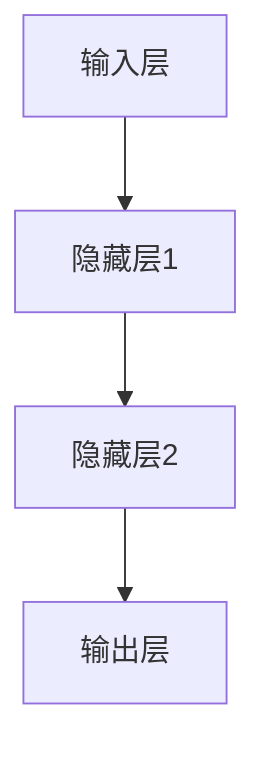
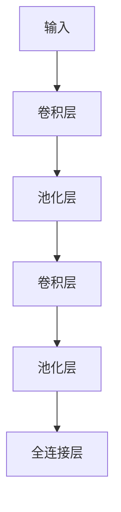

                 

# 文章标题: AGI对未来工作方式的潜在影响

> 关键词：AGI、未来工作、人工智能、技术变革、职业影响、教育培训

> 摘要：本文将深入探讨人工通用智能（AGI）对未来工作方式的潜在影响。通过分析AGI的定义、技术架构、应用领域，以及其核心算法原理，本文旨在揭示AGI如何重塑工作模式，产生新型职业，并对职场教育和培训带来变革。

## 第一部分: AGI概述

### 第1章: AGI的基础知识

#### 1.1 什么是AGI

**1.1.1 AGI的定义**

人工通用智能（Artificial General Intelligence，简称AGI）是指具备与人类相似的认知和智能能力的人工智能系统。AGI不仅能够执行特定的任务，还能在广泛的领域中表现出智能行为，例如学习、推理、问题解决、自然语言理解等。

\[ AGI = \text{Artificial General Intelligence} \]

**1.1.2 AGI与强AI的区别**

AGI与强AI（Strong AI）在概念上有一定的重叠，但存在关键区别。强AI是指具备人类的意识和自主意识的人工智能系统，而AGI则更强调在广泛领域中的通用性。

- **AGI**：具备与人类相似的认知和智能能力
- **强AI**：具备人类的意识和自主意识

**1.1.3 AGI的发展历程**

- **早期研究（20世纪50年代至80年代）**：AGI的概念首次提出，但技术限制导致研究进展缓慢。
- **复兴期（20世纪90年代至今）**：随着计算能力和算法的发展，AGI研究重新受到关注，并取得了显著进展。

### 第2章: AGI的技术架构

#### 2.1 AGI的核心组成部分

AGI的技术架构包括三个核心模块：感知模块、思维模块和行动模块。

**2.1.1 感知模块**

感知模块负责模拟人类的视觉、听觉、触觉等感知能力，从而获取外界信息。

**2.1.2 思维模块**

思维模块负责处理感知模块获取的信息，进行推理和决策。这是AGI智能的核心部分。

**2.1.3 行动模块**

行动模块根据思维模块的决策执行相应的行动，使AGI能够与环境进行交互。

### 第3章: AGI的应用领域

#### 3.1 AGI在各个领域的应用前景

AGI在农业、工业和服务业等领域具有广泛的应用前景。

**3.1.1 农业**

- **智能种植**：AGI可以分析土壤、气候等数据，优化种植方案。
- **智能养殖**：AGI可以监控动物健康状况，预测疫病，提高养殖效率。

**3.1.2 工业**

- **智能制造**：AGI可以优化生产流程，提高生产效率。
- **自动化生产线**：AGI可以实时监控生产线，实现自动调整和优化。

**3.1.3 服务业**

- **智能客服**：AGI可以处理大量客户咨询，提高服务效率。
- **虚拟助理**：AGI可以协助完成各种任务，如日程安排、文件管理等。

## 第二部分: AGI的核心算法原理

### 第4章: AGI的机器学习和深度学习基础

#### 4.1 机器学习基础

**4.1.1 监督学习**

监督学习是机器学习的一种基本形式，它通过已标记的数据来训练模型，使其能够预测未知数据的标签。

```python
def supervised_learning(input_data, target_data):
    # 初始化模型参数
    model = initialize_model()
    # 梯度下降优化
    for epoch in range(num_epochs):
        for data, target in zip(input_data, target_data):
            # 计算预测值
            prediction = model.predict(data)
            # 计算损失
            loss = compute_loss(prediction, target)
            # 更新模型参数
            model.update_params(loss)
```

**4.1.2 无监督学习**

无监督学习是机器学习的另一种基本形式，它不需要已标记的数据来训练模型，而是通过模型自身学习数据的特征和模式。

```python
def unsupervised_learning(input_data):
    # 初始化模型参数
    model = initialize_model()
    # 模型训练
    for epoch in range(num_epochs):
        # 更新模型参数
        model.update_params()
    # 输出模型特征
    features = model.extract_features(input_data)
```

#### 4.2 深度学习基础

**4.2.1 神经网络**

神经网络是深度学习的基础，它由多个层次组成，包括输入层、隐藏层和输出层。



**4.2.2 卷积神经网络（CNN）**

卷积神经网络（CNN）是专门用于处理图像数据的深度学习模型，它通过卷积层和池化层提取图像特征。



### 第5章: AGI的强化学习原理

**5.1 强化学习基础**

强化学习是一种通过与环境交互来学习最优策略的机器学习方法。Q-learning算法是强化学习的一种经典算法。

```python
def q_learning(state, action, reward, next_state, discount_factor):
    # 更新 Q 值
    Q[state, action] = Q[state, action] + reward + discount_factor * max(Q[next_state, all_actions])
```

### 第6章: AGI的多智能体系统

#### 6.1 多智能体系统的定义

多智能体系统是指由多个智能体组成的系统，这些智能体可以相互协作或竞争，以实现共同的目标。

#### 6.2 多智能体系统的通信与协作

多智能体系统的通信与协作是实现智能体协同工作的关键。智能体之间需要通过特定的通信协议和算法来交换信息和协调行动。

#### 6.3 多智能体强化学习

多智能体强化学习是强化学习在多智能体系统中的应用，它通过多个智能体的交互来学习最优策略。

## 第三部分: AGI的未来工作方式

### 第7章: AGI对工作方式的潜在影响

#### 7.1 工作方式的变革

AGI的出现将引发工作方式的深刻变革。传统的劳动力结构可能被重构，许多工作可能会被自动化，同时也会涌现出新的职业和就业机会。

#### 7.2 新型职业的涌现

随着AGI的发展，将会涌现出许多新型职业，如AGI研发工程师、智能系统设计师、虚拟现实内容创作者等。

#### 7.3 职场教育与培训的变革

职场教育和培训将面临巨大的挑战和机遇。为了适应AGI时代的工作需求，教育和培训体系需要做出相应的调整，以培养具备AGI知识和技能的下一代劳动力。

### 附录

#### 附录 A: AGI相关工具与资源

- **AGI工具**：如TensorFlow、PyTorch等深度学习框架。
- **AGI资源**：如AGI论文、研讨会、在线课程等。

#### 附录 B: AGI项目实战案例

- **案例一：智能客服系统**
  - **开发环境搭建**：使用TensorFlow搭建深度学习模型。
  - **源代码实现**：实现对话生成模型和对话管理模块。
  - **代码解读与分析**：分析模型的训练过程和性能优化策略。

- **案例二：自动化生产线**
  - **开发环境搭建**：使用ROS（Robot Operating System）构建自动化系统。
  - **源代码实现**：实现路径规划、避障和任务执行功能。
  - **代码解读与分析**：分析系统的实时性能和可靠性。

#### 附录 C: 代码解读与分析

- **C.1 数据预处理**
  - **C.1.1 数据清洗**：处理缺失值、异常值等。
  - **C.1.2 特征提取**：提取有助于模型训练的特征。

- **C.2 模型训练与评估**
  - **C.2.1 模型选择**：选择适合问题的模型。
  - **C.2.2 模型训练**：训练模型并调整参数。
  - **C.2.3 模型评估**：评估模型性能。

- **C.3 结果分析与优化**
  - **C.3.1 结果分析**：分析模型输出和预测效果。
  - **C.3.2 性能优化**：调整模型结构和参数，提高性能。

### 作者

作者：AI天才研究院/AI Genius Institute & 禅与计算机程序设计艺术/Zen And The Art of Computer Programming

---

通过上述的逐步分析和深入探讨，我们可以清晰地看到AGI对未来工作方式的潜在影响。随着AGI技术的不断发展，未来的工作方式将变得更加智能化、高效化，同时也对职场教育和培训提出了新的要求。让我们一同期待AGI带来的技术变革，以及它如何重塑我们的工作和生活方式。

