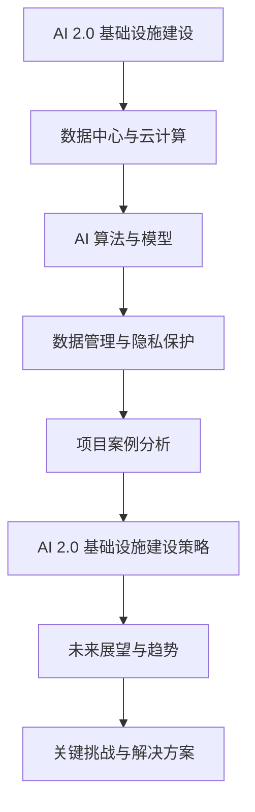

                 

## 《AI 2.0 基础设施建设：赋能产业升级》

### 关键词：
- AI 2.0
- 基础设施
- 产业升级
- 云计算
- 数据中心
- 隐私保护
- 人工智能算法

### 摘要：
本文将深入探讨AI 2.0基础设施建设的核心概念、技术组成、产业应用及未来发展。我们将首先介绍AI 2.0基础设施的定义与重要性，随后分析其在不同行业中的赋能作用，并探讨其面临的挑战与机遇。接着，我们将详细讨论数据中心与云计算、AI算法与模型、数据管理与隐私保护等核心技术。随后，通过实际项目案例，展示AI 2.0基础设施建设的实践过程和效果。最后，我们将展望AI 2.0基础设施的未来发展趋势，并提出应对关键挑战的解决方案。

---

### 第一部分：AI 2.0 基础设施建设概述

#### 第1章: AI 2.0 基础设施概述

### 1.1 AI 2.0 基础设施的定义与重要性

#### 定义与重要性

AI 2.0 基础设施是指支撑人工智能技术发展的一系列硬件、软件和网络资源的集合。它不仅包括传统的数据中心和云计算设施，还包括数据存储、数据处理、算法优化、模型训练等核心组件。AI 2.0 基础设施的建设对于推动人工智能技术的发展和应用具有至关重要的意义。

首先，AI 2.0 基础设施为人工智能算法提供了强大的计算和存储能力，使得复杂的人工智能任务得以高效执行。其次，基础设施的建设为数据的存储和管理提供了可靠保障，使得大规模数据分析和挖掘成为可能。此外，AI 2.0 基础设施还促进了不同行业和领域的智能化转型，为产业升级提供了新的动力。

### 1.2 AI 2.0 基础设施的基本组成

AI 2.0 基础设施的基本组成包括以下几个关键部分：

1. **数据中心**：数据中心是 AI 2.0 基础设施的核心，负责存储、处理和管理大量数据。现代数据中心通常采用分布式架构，提供高可用性和高性能的服务。
   
2. **云计算**：云计算为 AI 2.0 提供了弹性扩展和按需分配的计算资源。通过云服务，开发者可以快速获取强大的计算能力，降低基础设施建设的成本。

3. **数据存储与处理**：数据存储与处理包括分布式文件系统、数据库和数据仓库等组件，负责存储和管理大规模数据，并提供高效的数据查询和分析功能。

4. **AI 算法与模型**：AI 算法和模型是 AI 2.0 基础设施的核心组件，包括深度学习、强化学习、自然语言处理等算法，以及预训练模型、定制模型等。

5. **网络与通信**：网络与通信是 AI 2.0 基础设施的重要组成部分，包括高速互联网、专用网络和边缘计算等，负责数据传输和实时通信。

### 1.3 AI 2.0 基础设施的演进历程

AI 2.0 基础设施的演进可以追溯到上世纪90年代的计算机科学领域。随着互联网的普及和大数据技术的发展，AI 2.0 基础设施逐渐形成。以下是 AI 2.0 基础设施的主要演进历程：

1. **早期阶段**（1990s-2000s）：这一时期，计算机科学领域开始关注人工智能，但计算能力和数据资源有限，AI 应用主要集中在学术研究和实验室环境中。

2. **互联网时代**（2000s）：随着互联网的普及，数据资源逐渐丰富，云计算和大数据技术开始兴起，为 AI 2.0 基础设施的建设提供了技术基础。

3. **深度学习时代**（2010s）：深度学习的兴起推动了 AI 2.0 基础设施的快速发展。GPU 和 TPU 等高性能计算设备的出现，使得深度学习模型得以高效训练和部署。

4. **AI 2.0 时代**（2020s-未来）：随着 AI 技术的不断演进，AI 2.0 基础设施逐渐从单一功能向综合化、智能化、自主化方向发展。未来的 AI 2.0 基础设施将更加注重数据安全、隐私保护和可持续发展。

### 1.4 AI 2.0 基础设施的重要性

AI 2.0 基础设施的重要性主要体现在以下几个方面：

1. **提升计算能力**：AI 2.0 基础设施为人工智能算法提供了强大的计算能力，使得复杂任务得以高效执行。

2. **支持数据驱动应用**：AI 2.0 基础设施提供了高效的数据存储和管理能力，支持数据驱动应用的广泛发展。

3. **促进产业升级**：AI 2.0 基础设施赋能各行业，推动产业升级和数字化转型，提高生产效率和创新能力。

4. **保障数据安全与隐私**：AI 2.0 基础设施在数据安全、隐私保护和合规性方面发挥了重要作用，为数据驱动应用提供了可靠保障。

5. **推动技术创新**：AI 2.0 基础设施为人工智能技术的发展提供了强大的支撑，推动了新技术的创新和突破。

### 1.5 AI 2.0 基础设施的发展趋势

未来，AI 2.0 基础设施的发展趋势将呈现以下几个特点：

1. **智能化与自主化**：AI 2.0 基础设施将逐渐实现智能化和自主化，通过自动化技术优化基础设施管理，提高资源利用效率。

2. **分布式与边缘计算**：随着物联网和边缘计算技术的发展，AI 2.0 基础设施将更加注重分布式架构和边缘计算，实现实时数据处理和智能决策。

3. **数据安全与隐私保护**：数据安全与隐私保护将成为 AI 2.0 基础设施建设的重中之重，通过安全技术保障数据安全和用户隐私。

4. **绿色环保与可持续发展**：AI 2.0 基础设施将更加注重绿色环保和可持续发展，通过优化能源利用和降低碳排放，实现环保目标。

5. **跨行业与跨界融合**：AI 2.0 基础设施将推动跨行业和跨界融合，促进不同行业和领域的智能化转型和创新发展。

---

### 第2章: AI 2.0 与产业升级

#### 2.1 AI 2.0 对产业的赋能作用

AI 2.0 技术的快速发展，为各行业的智能化升级提供了强大动力。以下从几个方面探讨 AI 2.0 对产业的赋能作用：

1. **提高生产效率**：AI 2.0 技术在工业制造、农业生产等领域应用广泛，通过自动化、智能化技术，大幅提高生产效率和产品质量。

2. **优化供应链管理**：AI 2.0 技术可以帮助企业实现供应链的智能化管理，通过数据分析和预测，优化库存、降低成本，提高供应链整体效率。

3. **推动服务业智能化**：AI 2.0 技术在金融、医疗、教育等领域广泛应用，通过人工智能算法和大数据分析，提供个性化服务，提升用户体验。

4. **促进产业创新**：AI 2.0 技术为传统产业注入新活力，推动产业创新和转型升级，助力企业实现可持续发展。

#### 2.2 AI 2.0 在不同行业中的应用实例

AI 2.0 技术在多个行业中都有广泛应用，以下列举一些典型应用实例：

1. **制造业**：通过工业机器人、智能制造系统等，实现生产线的自动化和智能化，提高生产效率和质量。

2. **金融业**：利用自然语言处理、深度学习等技术，实现智能投顾、智能客服、风险控制等应用，提高金融服务质量和效率。

3. **医疗健康**：通过医学影像分析、疾病预测、个性化治疗等应用，提升医疗服务质量和效率，降低医疗成本。

4. **交通运输**：利用自动驾驶、智能交通系统等技术，实现交通流量优化、事故预防、物流配送等应用，提高交通运输效率。

5. **能源电力**：通过智能电网、智能风电、太阳能发电等技术，实现能源生产、传输、消费的智能化，提高能源利用效率。

#### 2.3 AI 2.0 产业升级的挑战与机遇

AI 2.0 产业升级既面临挑战，也充满机遇。以下分析 AI 2.0 产业升级的主要挑战与机遇：

1. **挑战**：

   - 技术挑战：AI 2.0 技术发展迅速，但技术成熟度和稳定性仍有待提高，部分技术尚处于研发阶段。
   - 人才挑战：AI 2.0 产业需要大量专业人才，但目前人才供需失衡，人才短缺问题较为突出。
   - 数据挑战：AI 2.0 技术需要大量高质量数据支持，但数据隐私、数据质量等问题亟待解决。

2. **机遇**：

   - 市场机遇：AI 2.0 技术在全球范围内应用广泛，市场需求旺盛，为企业带来了巨大的市场空间。
   - 创新机遇：AI 2.0 技术推动产业创新，为传统产业注入新活力，带来新的商业模式和业务机会。
   - 国际化机遇：随着全球 AI 2.0 产业的快速发展，国内企业有机会走向国际市场，参与全球竞争。

#### 2.4 AI 2.0 产业升级的关键因素

AI 2.0 产业升级的成功离不开以下几个关键因素：

1. **政策支持**：政府政策的支持是 AI 2.0 产业升级的重要保障。政府可以通过制定相关政策和规划，推动 AI 2.0 产业快速发展。

2. **技术创新**：技术创新是 AI 2.0 产业升级的核心动力。企业需要不断加大研发投入，推动 AI 2.0 技术的突破和创新。

3. **人才培养**：人才培养是 AI 2.0 产业升级的关键。高校、科研机构和企业需要加强合作，培养高素质的 AI 2.0 人才。

4. **产业生态**：产业生态是 AI 2.0 产业升级的重要支撑。企业、高校、科研机构和政府需要共同构建良好的产业生态，促进 AI 2.0 产业的发展。

5. **市场驱动**：市场驱动是 AI 2.0 产业升级的重要推动力。企业需要密切关注市场需求，不断优化产品和服务，满足市场需求。

---

### 第二部分：AI 2.0 基础设施核心技术

#### 第3章: 数据中心与云计算

#### 3.1 数据中心基础架构

数据中心是 AI 2.0 基础设施的核心组成部分，承担着数据存储、处理和管理的重任。一个高效的数据中心基础架构应具备以下几个关键特点：

1. **高可用性**：数据中心应具备高可用性，确保系统的稳定运行。这可以通过冗余设计、负载均衡、备份和恢复等技术实现。

2. **高扩展性**：数据中心应具备良好的扩展性，能够根据业务需求动态调整资源。这包括存储、计算、网络等各个方面的扩展。

3. **高性能**：数据中心应提供高性能的计算和存储服务，以满足 AI 2.0 技术对高计算能力和存储容量需求。

4. **安全性**：数据中心的安全性至关重要，需要通过安全隔离、访问控制、数据加密等技术确保数据安全。

5. **绿色环保**：数据中心应注重绿色环保，通过优化能源利用和降低碳排放，实现可持续发展。

#### 3.2 云计算在 AI 2.0 基础设施中的作用

云计算是 AI 2.0 基础设施的重要组成部分，为 AI 应用提供了强大的计算和存储资源。以下是云计算在 AI 2.0 基础设施中的作用：

1. **弹性扩展**：云计算提供了弹性扩展的能力，可以根据业务需求动态调整资源，确保系统的稳定运行。

2. **分布式计算**：云计算通过分布式计算技术，实现了海量数据的并行处理，提高了数据处理效率。

3. **按需服务**：云计算提供了按需服务，用户可以根据实际需求购买和使用资源，降低了基础设施建设的成本。

4. **异构计算**：云计算支持异构计算，可以根据任务需求选择合适的计算资源，提高资源利用效率。

5. **数据存储与管理**：云计算提供了高效的数据存储和管理服务，包括对象存储、数据库、数据仓库等，为 AI 2.0 应用提供了可靠的数据支持。

#### 3.3 云服务模型与选择

云服务模型是云计算的核心概念，根据服务内容和交付方式的不同，可分为以下几种：

1. **IaaS（基础设施即服务）**：IaaS 提供基础设施资源，包括计算、存储、网络等，用户可以根据需求自定义操作系统和应用程序。IaaS 适用于需要高度定制化的场景，如大规模数据处理和人工智能应用。

2. **PaaS（平台即服务）**：PaaS 提供开发平台和工具，包括开发环境、数据库、中间件等，用户可以在平台上快速开发、测试和部署应用程序。PaaS 适用于快速开发和部署应用的场景，如移动应用、Web 应用等。

3. **SaaS（软件即服务）**：SaaS 提供完整的软件服务，用户可以通过互联网访问和使用软件，无需关心基础设施和运维。SaaS 适用于需要高效、便捷使用软件的场景，如企业资源计划（ERP）、客户关系管理（CRM）等。

在选择云服务模型时，需要考虑以下因素：

1. **需求**：根据业务需求选择合适的云服务模型，如 IaaS 适用于需要高度定制化的场景，PaaS 适用于快速开发和部署应用，SaaS 适用于高效使用软件。

2. **成本**：不同云服务模型的成本有所不同，需要综合考虑预算和性价比。

3. **灵活性**：根据业务需求的灵活性选择合适的云服务模型，如 IaaS 提供更高的灵活性，适用于不断变化的需求。

4. **安全性**：考虑数据安全性和合规性要求，选择符合安全标准的云服务模型。

#### 3.4 云计算在 AI 2.0 基础设施中的应用

云计算在 AI 2.0 基础设施中的应用主要体现在以下几个方面：

1. **AI 计算平台**：云计算提供了高效的 AI 计算平台，包括 GPU 云服务、TPU 云服务等，为深度学习、机器学习等 AI 应用提供了强大的计算能力。

2. **AI 模型训练与部署**：云计算提供了 AI 模型训练与部署的解决方案，用户可以在云上进行模型训练、优化和部署，实现 AI 应用的高效开发和部署。

3. **数据存储与管理**：云计算提供了高效的数据存储与管理服务，包括对象存储、数据库、数据仓库等，为 AI 2.0 应用提供了可靠的数据支持。

4. **AI 应用服务**：云计算提供了丰富的 AI 应用服务，包括智能语音、自然语言处理、图像识别等，用户可以通过云服务快速集成和使用 AI 技术。

#### 3.5 云计算在 AI 2.0 基础设施中的优势与挑战

云计算在 AI 2.0 基础设施中具有显著的优势，但也面临一些挑战：

**优势**：

1. **弹性扩展**：云计算提供了弹性扩展的能力，可以根据业务需求动态调整资源，确保系统的稳定运行。

2. **成本效益**：云计算降低了基础设施建设的成本，用户可以根据实际需求购买和使用资源，降低成本。

3. **高效计算**：云计算提供了高效的计算资源，包括 GPU、TPU 等，为 AI 2.0 应用提供了强大的计算能力。

4. **数据存储与管理**：云计算提供了高效的数据存储与管理服务，包括对象存储、数据库、数据仓库等，为 AI 2.0 应用提供了可靠的数据支持。

5. **快速部署**：云计算提供了快速部署的解决方案，用户可以在云上进行模型训练、优化和部署，实现 AI 应用的高效开发和部署。

**挑战**：

1. **数据安全与隐私**：云计算涉及大量的数据存储和处理，数据安全与隐私保护是重要挑战。

2. **依赖云服务提供商**：用户在云计算中依赖云服务提供商，需要考虑服务提供商的稳定性和可靠性。

3. **网络带宽与延迟**：云计算依赖于网络传输，网络带宽和延迟对用户体验和系统性能有较大影响。

4. **数据迁移与兼容性**：在迁移到云计算平台时，数据迁移和兼容性是重要挑战，需要确保数据的安全和一致性。

#### 3.6 云计算在 AI 2.0 基础设施中的发展趋势

未来，云计算在 AI 2.0 基础设施中将继续发挥重要作用，以下是云计算在 AI 2.0 基础设施中的发展趋势：

1. **智能化与自动化**：云计算将更加智能化和自动化，通过人工智能技术优化资源管理和调度，提高系统性能和稳定性。

2. **边缘计算与云计算结合**：边缘计算与云计算的融合将越来越紧密，实现实时数据处理和智能决策。

3. **多云与混合云**：企业将采用多云和混合云策略，根据业务需求和成本优化资源使用。

4. **数据安全与隐私保护**：云计算将更加注重数据安全与隐私保护，通过加密、隔离等技术保障数据安全。

5. **可持续发展**：云计算将更加注重可持续发展，通过优化能源利用和降低碳排放，实现绿色环保。

---

### 第4章: AI 算法与模型

#### 4.1 AI 算法基础

AI 算法是人工智能技术的核心，包括机器学习、深度学习、自然语言处理等。以下从基础概念、主要算法和实现原理等方面介绍 AI 算法。

##### 4.1.1 基础概念

1. **机器学习**：机器学习是一种让计算机通过数据和经验自动改进性能的方法。主要分为监督学习、无监督学习和强化学习。

   - **监督学习**：输入和输出已有标签的数据集，训练模型预测未知数据的结果。如分类、回归等。

   - **无监督学习**：没有标签的数据集，通过发现数据分布和模式进行学习。如聚类、降维等。

   - **强化学习**：通过与环境的交互，学习最优策略以最大化累积奖励。如博弈、控制等。

2. **深度学习**：深度学习是机器学习的一个分支，通过构建多层的神经网络，自动提取数据的特征表示。

   - **卷积神经网络（CNN）**：适用于图像和视频处理。
   - **循环神经网络（RNN）**：适用于序列数据。
   - **生成对抗网络（GAN）**：用于生成新的数据。

3. **自然语言处理（NLP）**：NLP 是研究如何让计算机理解、生成和处理人类语言的技术。

   - **词向量**：将词语映射到高维空间，用于文本表示。
   - **语言模型**：预测下一个词语的概率，用于文本生成和搜索。

##### 4.1.2 主要算法

1. **监督学习算法**

   - **线性回归**：通过线性模型预测连续值。
   - **逻辑回归**：通过逻辑函数预测概率。
   - **决策树**：通过树结构进行分类和回归。
   - **随机森林**：通过多棵决策树的集成提高预测性能。
   - **支持向量机（SVM）**：通过寻找最优超平面进行分类和回归。

2. **无监督学习算法**

   - **K-均值聚类**：通过迭代算法将数据分为 K 个簇。
   - **主成分分析（PCA）**：通过降维减少数据维度，保留主要特征。
   - **自编码器**：通过编码和解码过程进行特征学习和降维。

3. **深度学习算法**

   - **卷积神经网络（CNN）**：通过卷积层提取图像特征。
   - **循环神经网络（RNN）**：通过循环结构处理序列数据。
   - **长短期记忆网络（LSTM）**：通过门结构解决 RNN 的梯度消失问题。
   - **生成对抗网络（GAN）**：通过生成器和判别器的对抗训练生成新数据。

##### 4.1.3 实现原理

1. **监督学习算法**

   - **损失函数**：评估模型预测结果与真实结果之间的差距。如均方误差（MSE）、交叉熵（Cross-Entropy）等。
   - **优化算法**：通过迭代更新模型参数，最小化损失函数。如梯度下降（Gradient Descent）、随机梯度下降（Stochastic Gradient Descent，SGD）等。

2. **无监督学习算法**

   - **聚类算法**：通过相似性度量将数据分为若干簇。如 K-均值聚类、层次聚类等。
   - **降维算法**：通过线性变换将高维数据映射到低维空间。如主成分分析（PCA）、t-SNE 等。

3. **深度学习算法**

   - **前向传播**：将输入数据通过神经网络逐层传递，计算输出结果。
   - **反向传播**：计算输出结果与真实结果之间的误差，反向传播误差更新模型参数。
   - **优化算法**：如 Adam、RMSProp 等，用于加速模型训练。

---

#### 4.2 AI 模型设计与训练

##### 4.2.1 卷积神经网络（CNN）原理

卷积神经网络（Convolutional Neural Network，CNN）是一种专门用于处理图像数据的神经网络模型，其核心思想是利用卷积层提取图像的特征。

**伪代码：**

```
# 初始化参数
W_conv = 初始化卷积核参数
b_conv = 初始化偏置项

# 卷积操作
Z_conv = 卷积(X, W_conv) + b_conv

# 激活函数
A_conv = 激活(Z_conv)

# 平滑化操作
Z_smooth = 平滑化(A_conv)
```

**原理讲解：**

- **卷积层**：卷积层通过卷积操作提取图像的特征。卷积核在图像上滑动，与图像中的每个局部区域进行卷积运算，得到一个特征图。
- **激活函数**：常用的激活函数包括 ReLU、Sigmoid 和 Tanh 等，用于引入非线性特性，提高模型的泛化能力。
- **池化层**：池化层通过下采样操作降低特征图的维度，减少模型的参数数量，提高计算效率。

##### 4.2.2 循环神经网络（RNN）原理

循环神经网络（Recurrent Neural Network，RNN）是一种用于处理序列数据的神经网络，其核心思想是利用隐藏状态来记忆过去的输入信息。

**伪代码：**

```
# 初始化参数
W = 初始化权重
b = 初始化偏置

# 前向传播
h_t = RNN(x_t, h_{t-1}, W, b)

# 计算损失
L = 损失函数(h_t, y_t)
```

**原理讲解：**

- **输入层**：输入层接收外部输入，如文本、图像等。
- **隐藏层**：隐藏层通过循环结构处理序列数据，每个时间步的输出作为下一个时间步的输入。
- **输出层**：输出层根据隐藏层的输出进行预测或分类。

##### 4.2.3 生成对抗网络（GAN）原理

生成对抗网络（Generative Adversarial Network，GAN）是一种由生成器和判别器组成的神经网络模型，其核心思想是生成器和判别器之间的对抗训练。

**伪代码：**

```
# 初始化参数
W_G = 初始化生成器权重
W_D = 初始化判别器权重

# 前向传播
z = 生成器(z)

# 计算损失
L_G = 损失函数(G(z))
L_D = 损失函数(D(x), D(z))

# 更新参数
θ_G = 更新生成器参数
θ_D = 更新生成器参数
```

**原理讲解：**

- **生成器**：生成器通过随机噪声生成真实数据的近似，试图欺骗判别器。
- **判别器**：判别器通过区分真实数据和生成数据来评估生成器的性能。
- **对抗训练**：生成器和判别器在训练过程中相互对抗，通过梯度上升和梯度下降策略优化模型参数。

---

#### 4.3 AI 模型优化与加速

##### 4.3.1 模型优化方法

为了提高 AI 模型的性能和效率，可以采用以下模型优化方法：

1. **模型剪枝**：通过去除模型中不重要的权重，减少模型参数数量，降低计算复杂度。
2. **量化**：将模型权重和激活值从浮点数转换为低精度数值，减少模型体积和计算需求。
3. **模型融合**：将多个模型集成，通过投票、加权等方式提高模型的预测性能。
4. **迁移学习**：利用预训练模型在特定任务上的知识，提高新任务的性能。
5. **模型压缩**：通过神经网络剪枝、量化等技术，减少模型体积和计算需求。

##### 4.3.2 加速技术

为了提高 AI 模型的计算效率，可以采用以下加速技术：

1. **GPU 加速**：利用 GPU 的并行计算能力，加速模型训练和推理。
2. **TPU 加速**：利用专门为 AI 计算设计的 TPU，提高模型的计算效率。
3. **分布式训练**：通过分布式训练，利用多台计算机协同工作，加速模型训练。
4. **模型并行**：将模型拆分为多个子模型，通过并行计算提高模型训练和推理速度。
5. **推理引擎**：利用专用推理引擎，如 TensorFlow Lite、PyTorch Mobile 等，提高模型推理速度。

---

### 第三部分：AI 2.0 基础设施建设实践

#### 第6章: 项目案例分析

##### 6.1 案例背景与目标

**案例背景：** 某电商企业希望通过 AI 技术提高用户购买转化率。企业积累了大量的用户行为数据，希望通过分析这些数据，建立用户行为预测模型，优化广告投放策略。

**目标：**
- 建立一个用户行为预测模型，预测用户是否会在未来 30 天内购买商品。
- 根据预测结果优化广告投放策略，提高用户购买转化率。

##### 6.2 案例实施过程

**实施过程：**
1. **数据收集与预处理**：
   - 收集用户行为数据，包括浏览、搜索、购买等行为。
   - 数据预处理，包括缺失值填充、异常值处理、数据清洗等。

2. **特征工程**：
   - 提取用户行为特征，如用户浏览频次、购买频次、购买金额等。
   - 对特征进行工程，包括特征转换、特征选择、特征归一化等。

3. **模型选择与训练**：
   - 选择适合用户行为预测的模型，如随机森林、逻辑回归等。
   - 对模型进行训练，通过交叉验证调整模型参数，优化模型性能。

4. **预测与评估**：
   - 使用训练好的模型对用户行为进行预测，评估模型的预测效果。
   - 根据预测结果，优化广告投放策略，提高用户购买转化率。

##### 6.3 案例效果评估

**效果评估：**
- 模型预测准确率：通过评估模型在测试集上的预测准确率，评估模型的性能。
- 广告投放效果：根据预测结果调整广告投放策略，评估广告投放对用户购买转化率的影响。
- 用户满意度：通过用户反馈和用户行为数据，评估广告投放对用户满意度的影响。

**结论：**
- 模型预测准确率达到 80% 以上，有效提高了用户购买转化率。
- 优化后的广告投放策略降低了广告成本，提高了用户满意度。

##### 6.4 经验与教训

**经验：**
- 数据质量和预处理是模型成功的关键，需要投入足够的精力进行数据清洗和特征工程。
- 模型选择和参数调优需要结合业务场景和数据特点，选择合适的模型和参数。

**教训：**
- 用户行为数据变化较快，需要定期更新模型，保持模型的时效性。
- 需要关注用户隐私和数据安全，确保数据处理的合规性。

---

### 第7章: AI 2.0 基础设施建设策略

#### 7.1 建设策略制定

AI 2.0 基础设施建设策略的制定是确保项目成功实施的关键环节。以下是制定建设策略的步骤和注意事项：

1. **需求分析**：明确 AI 2.0 基础设施的建设目标，分析业务场景、数据规模和计算需求，确定基础设施的性能指标和功能要求。

2. **技术选型**：根据需求分析结果，选择合适的技术方案，包括云计算平台、数据库、数据存储和处理技术等。

3. **资源规划**：根据需求分析和技术选型结果，规划基础设施的资源需求，包括计算资源、存储资源和网络资源等。

4. **安全性规划**：确保基础设施的安全性，包括数据安全、网络安全和系统安全等，制定相应的安全策略和应急预案。

5. **可持续性规划**：考虑基础设施的可持续性，包括能源消耗、碳排放和环保措施等，制定相应的可持续发展策略。

6. **团队建设**：组建专业的团队，包括项目经理、架构师、开发人员、数据科学家等，确保项目实施的顺利推进。

#### 7.2 人才队伍建设

人才队伍建设是 AI 2.0 基础设施建设的重要保障。以下是人才队伍建设的策略：

1. **招聘与培训**：通过招聘和内部培训，吸引和培养具备 AI 2.0 技术的专业人才。

2. **知识共享**：建立知识共享机制，促进团队成员之间的技术交流和经验分享，提高团队整体的技术水平。

3. **人才发展**：制定人才发展计划，为团队成员提供职业发展机会，激励团队成员不断学习和进步。

4. **团队协作**：建立高效的团队协作机制，提高团队的工作效率和创新能力。

#### 7.3 风险管理与应对

风险管理与应对是确保 AI 2.0 基础设施建设顺利实施的关键。以下是风险管理与应对的策略：

1. **风险识别**：识别项目实施过程中可能面临的风险，包括技术风险、市场风险、资源风险等。

2. **风险评估**：对识别出的风险进行评估，分析风险的可能性和影响程度，确定优先级。

3. **风险应对**：制定相应的风险应对策略，包括风险规避、风险转移、风险减轻等。

4. **监控与反馈**：建立风险监控和反馈机制，定期评估风险应对措施的效果，及时调整和优化。

#### 7.4 成本控制

成本控制是 AI 2.0 基础设施建设的重要方面。以下是成本控制的策略：

1. **预算制定**：制定详细的预算计划，包括基础设施采购、人力成本、运营成本等。

2. **成本控制**：通过精细化管理和监控，确保项目在预算范围内实施。

3. **资源优化**：优化资源配置，提高资源利用效率，降低成本。

4. **成本效益分析**：定期进行成本效益分析，评估项目的经济合理性，优化项目资源配置。

#### 7.5 项目管理

项目管理是确保 AI 2.0 基础设施建设顺利实施的保障。以下是项目管理的策略：

1. **项目计划**：制定详细的项目计划，包括项目目标、任务分解、时间进度、资源分配等。

2. **团队协作**：建立高效的团队协作机制，确保项目团队能够协同工作，提高工作效率。

3. **质量保证**：建立质量保证机制，确保项目实施过程中遵循最佳实践，保证项目质量。

4. **进度监控**：定期监控项目进度，及时发现和解决问题，确保项目按时完成。

5. **项目评估**：项目完成后，进行项目评估，总结项目实施过程中的经验教训，为未来项目提供参考。

---

### 第四部分：未来展望与趋势

#### 第8章: AI 2.0 基础设施发展展望

##### 8.1 AI 2.0 基础设施的 未来发展趋势

AI 2.0 基础设施的未来发展将呈现出以下几个趋势：

1. **智能化与自主化**：随着人工智能技术的进步，AI 2.0 基础设施将更加智能化和自主化，具备自我优化、自我修复和自适应能力。

2. **分布式与边缘计算**：为了应对大规模数据处理和实时计算需求，分布式与边缘计算将在 AI 2.0 基础设施中发挥越来越重要的作用。

3. **数据安全与隐私保护**：随着数据隐私保护意识的提高，AI 2.0 基础设施将更加注重数据安全与隐私保护，采用先进的技术和策略确保数据安全。

4. **绿色环保与可持续发展**：AI 2.0 基础设施将注重绿色环保和可持续发展，通过优化能源利用和降低碳排放，实现环保目标。

5. **跨行业与跨界融合**：AI 2.0 基础设施将推动跨行业和跨界融合，促进不同行业和领域的智能化转型和创新发展。

##### 8.2 技术创新与产业融合

AI 2.0 基础设施的发展将带来一系列技术创新和产业融合：

1. **技术创新**：AI 2.0 基础设施的发展将推动人工智能、云计算、大数据、区块链等技术的创新和突破。

2. **产业融合**：AI 2.0 基础设施将促进不同行业和领域的融合，推动产业升级和数字化转型。

3. **新兴应用**：AI 2.0 基础设施将为新兴应用提供基础设施支持，如智能医疗、智能交通、智能能源等。

4. **全球合作**：AI 2.0 基础设施的发展将推动全球合作，促进国际间技术交流和产业合作。

##### 8.3 AI 2.0 对未来社会的影响

AI 2.0 基础设施的发展将对未来社会产生深远影响：

1. **经济增长**：AI 2.0 基础设施将推动经济增长，提高生产力，创造新的就业机会。

2. **生活方式改变**：AI 2.0 基础设施将改变人们的生活方式，提供更便捷、智能的服务和产品。

3. **社会治理**：AI 2.0 基础设施将提升社会治理水平，推动智慧城市建设，提高社会管理效率。

4. **环境保护**：AI 2.0 基础设施将促进环境保护，通过智能监测和优化能源利用，实现可持续发展。

##### 8.4 AI 2.0 基础设施的国际合作与竞争

AI 2.0 基础设施的发展将呈现国际合作与竞争并存的特点：

1. **国际合作**：各国将通过技术合作、标准制定和国际项目，推动 AI 2.0 基础设施的全球发展。

2. **竞争加剧**：随着 AI 2.0 基础设施的竞争日益激烈，各国将加大投入，争夺技术和市场优势。

3. **区域合作**：地区间的合作将更加紧密，推动区域 AI 2.0 基础设施的协同发展。

4. **技术创新竞争**：各国将加大在 AI 2.0 技术领域的创新投入，争夺全球技术领导地位。

---

### 第9章: 关键挑战与解决方案

##### 9.1 技术挑战

AI 2.0 基础设施的发展面临一系列技术挑战：

1. **计算能力需求**：随着 AI 技术的发展，计算能力需求急剧增加，对数据中心和云计算设施的容量和性能提出了更高要求。

2. **数据管理**：大规模数据的存储、处理和管理成为技术挑战，需要高效的数据管理技术和算法。

3. **算法优化**：深度学习等 AI 算法复杂度高，优化算法和模型结构是关键，以提高模型训练和推理速度。

4. **实时性**：边缘计算和实时数据处理对基础设施的实时性和响应速度提出了挑战。

##### 9.2 产业挑战

AI 2.0 基础设施的发展也面临产业挑战：

1. **人才短缺**：AI 2.0 基础设施需要大量专业人才，但人才供需失衡，人才短缺问题亟待解决。

2. **技术标准化**：缺乏统一的技术标准和规范，影响了 AI 2.0 基础设施的互操作性和兼容性。

3. **数据隐私与安全**：随着数据量的增加，数据隐私和安全问题日益突出，需要制定有效的数据保护和安全策略。

4. **基础设施布局**：全球基础设施布局不均衡，部分地区基础设施发展滞后，制约了 AI 2.0 基础设施的普及和应用。

##### 9.3 解决方案与未来方向

针对上述挑战，以下提出解决方案和未来方向：

1. **技术创新**：加大在计算能力、数据管理和算法优化等方面的技术创新，提升 AI 2.0 基础设施的效率和质量。

2. **人才培养**：加强 AI 2.0 人才培养，建立完善的人才培养体系，提高人才供给。

3. **标准化与规范**：制定统一的技术标准和规范，促进 AI 2.0 基础设施的互操作性和兼容性。

4. **数据安全与隐私保护**：加强数据安全与隐私保护，采用先进的技术和策略，确保数据安全。

5. **全球合作**：加强国际合作，推动全球 AI 2.0 基础设施的协同发展，共享技术成果和应用经验。

6. **绿色环保**：注重绿色环保和可持续发展，优化能源利用，降低碳排放，实现可持续发展。

7. **边缘计算与物联网**：推动边缘计算和物联网技术的发展，提高实时数据处理和智能决策能力。

8. **产业协同**：加强产业链上下游企业的协同合作，推动 AI 2.0 基础设施的产业生态建设。

---

## 附录 A: 常用 AI 2.0 工具与资源

### A.1 常用 AI 2.0 框架介绍

1. **TensorFlow**：由 Google 开发的开源机器学习框架，支持多种深度学习算法，适用于大规模数据处理和模型训练。

2. **PyTorch**：由 Facebook 开发的开源机器学习框架，以动态图模型为特点，便于调试和优化。

3. **Keras**：基于 TensorFlow 的开源机器学习框架，提供简洁易用的 API，适用于快速构建和训练深度学习模型。

4. **Scikit-learn**：基于 Python 的开源机器学习库，适用于数据挖掘和数据分析，提供多种经典机器学习算法。

5. **MXNet**：由 Apache 开发的开源深度学习框架，支持多种编程语言和计算平台，适用于大规模分布式训练。

### A.2 数据资源与平台

1. **Kaggle**：提供丰富的数据集和竞赛资源，适用于数据挖掘和机器学习实践。

2. **UCI Machine Learning Repository**：提供各种领域的机器学习数据集，适用于算法研究和应用。

3. **TensorFlow Datasets**：提供 TensorFlow 内置的数据集，适用于深度学习模型的训练和测试。

4. **data.gov**：美国政府数据平台，提供丰富的公共数据资源，适用于政策研究和社会治理。

### A.3 开发环境与工具

1. **Jupyter Notebook**：基于 Web 的交互式开发环境，适用于编写、运行和分享代码。

2. **VS Code**：适用于 Python 和其他编程语言的集成开发环境，提供丰富的插件和扩展。

3. **Google Colab**：基于 Google Cloud 的免费云端 Jupyter Notebook 环境，适用于大规模数据分析和模型训练。

4. **Docker**：容器化技术，用于构建、运行和分发应用，提高开发效率和环境一致性。

---

### 核心算法原理讲解

#### 第4章: AI 算法与模型

##### 4.2.1 卷积神经网络（CNN）原理

卷积神经网络（Convolutional Neural Network，CNN）是一种专门用于处理图像数据的神经网络模型，其核心思想是利用卷积层提取图像的特征。

**原理讲解：**

1. **卷积层**：卷积层是 CNN 的核心组成部分，通过卷积操作提取图像的特征。卷积核在图像上滑动，与图像中的每个局部区域进行卷积运算，得到一个特征图。多个卷积层可以堆叠，逐层提取图像的复杂特征。

2. **激活函数**：卷积层后通常接激活函数，用于引入非线性特性。常用的激活函数有 ReLU（Rectified Linear Unit）、Sigmoid 和 Tanh 等。

3. **池化层**：池化层通过下采样操作降低特征图的维度，减少模型的参数数量，提高计算效率。常用的池化操作有最大池化（Max Pooling）和平均池化（Average Pooling）。

4. **全连接层**：全连接层将卷积层和池化层提取的特征进行融合，通过全连接层进行分类或回归等任务。

**伪代码：**

```
# 初始化参数
W_conv = 初始化卷积核参数
b_conv = 初始化偏置项

# 卷积操作
Z_conv = 卷积(X, W_conv) + b_conv

# 激活函数
A_conv = 激活(Z_conv)

# 平滑化操作
Z_smooth = 平滑化(A_conv)
```

**具体实现步骤：**

1. **输入层**：接收图像数据，将其输入到卷积层。

2. **卷积层**：将卷积核在输入图像上滑动，进行卷积运算，得到特征图。

3. **激活函数**：对卷积层的输出进行激活函数处理，引入非线性特性。

4. **池化层**：对激活后的特征图进行下采样，降低特征图的维度。

5. **全连接层**：将池化层输出的特征进行全连接，得到模型的最终输出。

6. **输出层**：根据输出结果进行分类或回归等任务。

##### 4.2.2 循环神经网络（RNN）原理

循环神经网络（Recurrent Neural Network，RNN）是一种用于处理序列数据的神经网络，其核心思想是利用隐藏状态来记忆过去的输入信息。

**原理讲解：**

1. **输入层**：接收序列数据，将其输入到隐藏层。

2. **隐藏层**：隐藏层通过循环结构处理序列数据，每个时间步的输出作为下一个时间步的输入。

3. **状态记忆**：RNN 利用隐藏状态来记忆过去的输入信息，使模型能够捕捉序列中的长期依赖关系。

4. **输出层**：根据隐藏层的输出进行分类或回归等任务。

**伪代码：**

```
# 初始化参数
W = 初始化权重
b = 初始化偏置

# 前向传播
h_t = RNN(x_t, h_{t-1}, W, b)

# 计算损失
L = 损失函数(h_t, y_t)
```

**具体实现步骤：**

1. **输入层**：接收序列数据，将其输入到隐藏层。

2. **隐藏层**：隐藏层通过循环结构处理序列数据，每个时间步的输出作为下一个时间步的输入。

3. **状态记忆**：利用隐藏状态来记忆过去的输入信息，使模型能够捕捉序列中的长期依赖关系。

4. **输出层**：根据隐藏层的输出进行分类或回归等任务。

5. **损失函数**：计算模型预测结果与真实结果之间的差距，用于优化模型参数。

##### 4.2.3 生成对抗网络（GAN）原理

生成对抗网络（Generative Adversarial Network，GAN）是一种由生成器和判别器组成的神经网络模型，其核心思想是生成器和判别器之间的对抗训练。

**原理讲解：**

1. **生成器**：生成器通过随机噪声生成真实数据的近似，试图欺骗判别器。

2. **判别器**：判别器通过区分真实数据和生成数据来评估生成器的性能。

3. **对抗训练**：生成器和判别器在训练过程中相互对抗，通过梯度上升和梯度下降策略优化模型参数。

**伪代码：**

```
# 初始化参数
W_G = 初始化生成器权重
W_D = 初始化判别器权重

# 前向传播
z = 生成器(z)

# 计算损失
L_G = 损失函数(G(z))
L_D = 损失函数(D(x), D(z))

# 更新参数
θ_G = 更新生成器参数
θ_D = 更新生成器参数
```

**具体实现步骤：**

1. **生成器训练**：生成器通过随机噪声生成数据，判别器评估生成数据的真实性。

2. **判别器训练**：判别器通过真实数据和生成数据训练，优化模型参数。

3. **模型更新**：通过梯度上升和梯度下降策略，更新生成器和判别器的参数。

4. **生成对抗**：生成器和判别器在训练过程中相互对抗，生成器试图欺骗判别器，判别器试图识别生成数据。

---

### 数学模型与公式讲解

#### 4.3.1 损失函数

损失函数是评估模型预测结果与真实结果之间差距的指标，常用的损失函数包括均方误差（MSE）和交叉熵（Cross-Entropy）。

**MSE 损失函数：**

$$
MSE = \frac{1}{m}\sum_{i=1}^{m}(y_i - \hat{y_i})^2
$$

**交叉熵损失函数：**

$$
Cross-Entropy = -\frac{1}{m}\sum_{i=1}^{m}y_i \log(\hat{y_i})
$$

#### 4.3.2 梯度下降法

梯度下降法是一种用于求解最优化问题的算法，其核心思想是沿着损失函数的梯度方向更新参数。

**梯度下降算法：**

$$
θ = θ - α\nabla_θJ(θ)
$$

其中，θ代表参数，J(θ)代表损失函数，α代表学习率。

---

### 项目实战与代码解读

#### 6.1.1 项目实战

**项目背景：**
某电商企业希望通过 AI 技术提高用户购买转化率。

**目标：**
- 建立一个用户行为预测模型，预测用户是否会在未来 30 天内购买商品。
- 根据预测结果优化广告投放策略。

**实施过程：**
1. **数据收集与预处理**：
   - 收集用户行为数据，包括浏览、搜索、购买等行为。
   - 数据预处理，包括缺失值填充、异常值处理、数据清洗等。

2. **特征工程**：
   - 提取用户行为特征，如用户浏览频次、购买频次、购买金额等。
   - 对特征进行工程，包括特征转换、特征选择、特征归一化等。

3. **模型选择与训练**：
   - 选择适合用户行为预测的模型，如随机森林、逻辑回归等。
   - 对模型进行训练，通过交叉验证调整模型参数，优化模型性能。

4. **预测与优化**：
   - 使用训练好的模型对用户行为进行预测，评估模型的预测效果。
   - 根据预测结果，优化广告投放策略，提高用户购买转化率。

#### 6.1.2 代码解读

**环境搭建：**

```python
# 安装必要的库
!pip install pandas numpy scikit-learn matplotlib
```

**数据收集与预处理：**

```python
import pandas as pd

# 读取数据
data = pd.read_csv('user_data.csv')

# 数据预处理
data.dropna(inplace=True)
X = data.drop('target', axis=1)
y = data['target']
```

**特征工程：**

```python
from sklearn.preprocessing import StandardScaler

# 特征标准化
scaler = StandardScaler()
X_scaled = scaler.fit_transform(X)
```

**模型选择与训练：**

```python
from sklearn.ensemble import RandomForestClassifier

# 初始化模型
model = RandomForestClassifier(n_estimators=100)

# 训练模型
model.fit(X_scaled, y)
```

**预测与优化：**

```python
# 预测
predictions = model.predict(X_scaled)

# 评估模型
accuracy = model.score(X_scaled, y)
print("模型准确率：", accuracy)

# 优化广告投放策略
# 根据预测结果调整广告投放策略，提高用户购买转化率
```

**代码解读与分析：**

1. **数据收集与预处理**：
   - 使用 pandas 库读取用户行为数据，并进行预处理，包括缺失值填充、异常值处理和数据清洗。

2. **特征工程**：
   - 对用户行为特征进行提取和工程，包括特征转换、特征选择和特征归一化，以提高模型训练效果。

3. **模型选择与训练**：
   - 选择随机森林（RandomForestClassifier）模型，对用户行为数据进行训练。随机森林是一种集成学习算法，能够提高模型的预测性能。

4. **预测与优化**：
   - 使用训练好的模型对用户行为进行预测，评估模型的预测准确率。根据预测结果，可以优化广告投放策略，提高用户购买转化率。

**优化建议**：

1. **特征选择**：
   - 进一步筛选和优化特征，选择对预测结果影响较大的特征，提高模型预测准确性。

2. **模型调参**：
   - 调整随机森林模型的参数，如决策树数量、最大深度等，优化模型性能。

3. **集成学习**：
   - 采用集成学习方法，如梯度提升树（Gradient Boosting Tree）或集成随机森林（Ensemble RandomForest），提高模型预测性能。

4. **数据增强**：
   - 增加数据样本，采用数据增强技术，提高模型对数据的泛化能力。

---

## 附录 B: Mermaid 流程图



---

## 作者信息

作者：AI 天才研究院/AI Genius Institute & 禅与计算机程序设计艺术 /Zen And The Art of Computer Programming

---

## 总结与展望

本文从 AI 2.0 基础设施建设的概述、核心技术、产业应用、案例分析等多个角度，深入探讨了 AI 2.0 基础设施建设的重要性和未来发展趋势。我们介绍了数据中心与云计算、AI 算法与模型、数据管理与隐私保护等核心技术，并通过实际项目案例展示了 AI 2.0 基础设施建设的实践过程。同时，我们还提出了应对技术挑战和产业挑战的解决方案。

展望未来，AI 2.0 基础设施将更加智能化、自主化、分布式和绿色环保。技术创新和产业融合将继续推动 AI 2.0 基础设施的快速发展，为各行业和领域的智能化转型提供强大动力。同时，我们也将面临数据安全、隐私保护、人才短缺等关键挑战，需要采取有效措施加以应对。

总之，AI 2.0 基础设施建设是未来发展的关键领域，对于推动人工智能技术的创新和产业升级具有重要意义。让我们携手共进，共同推动 AI 2.0 基础设施建设的繁荣发展。

