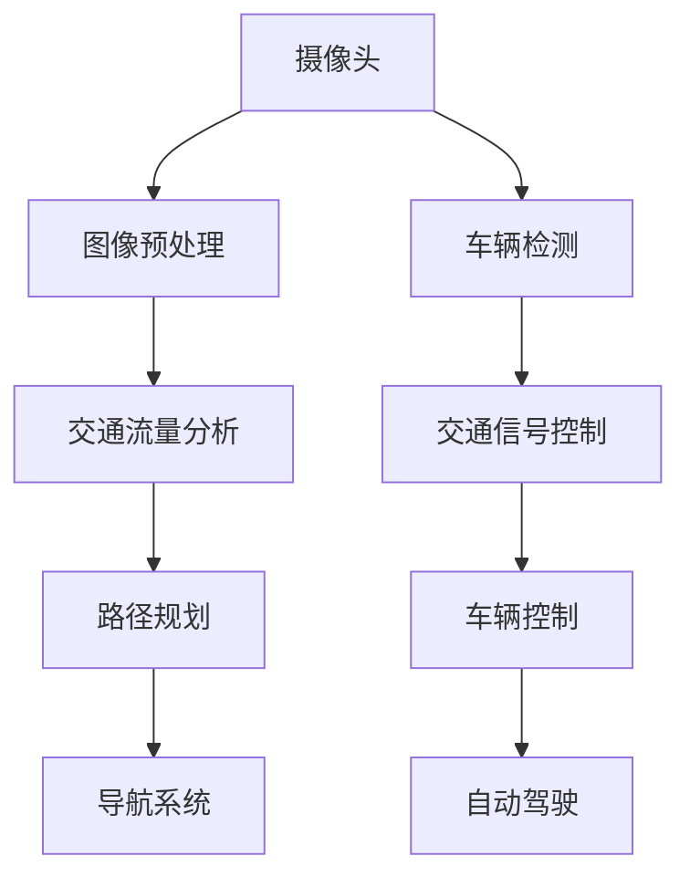
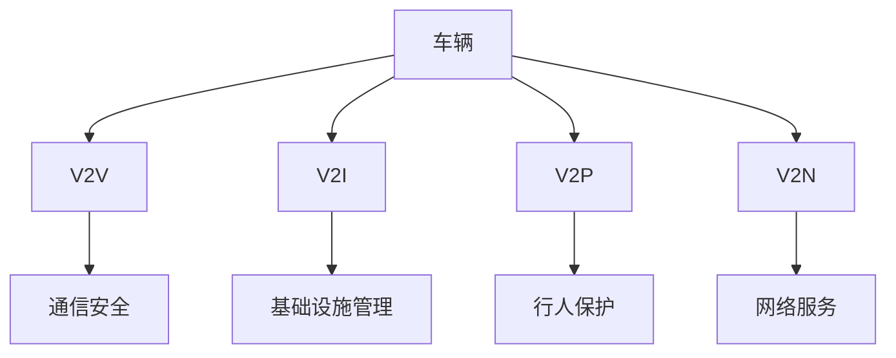
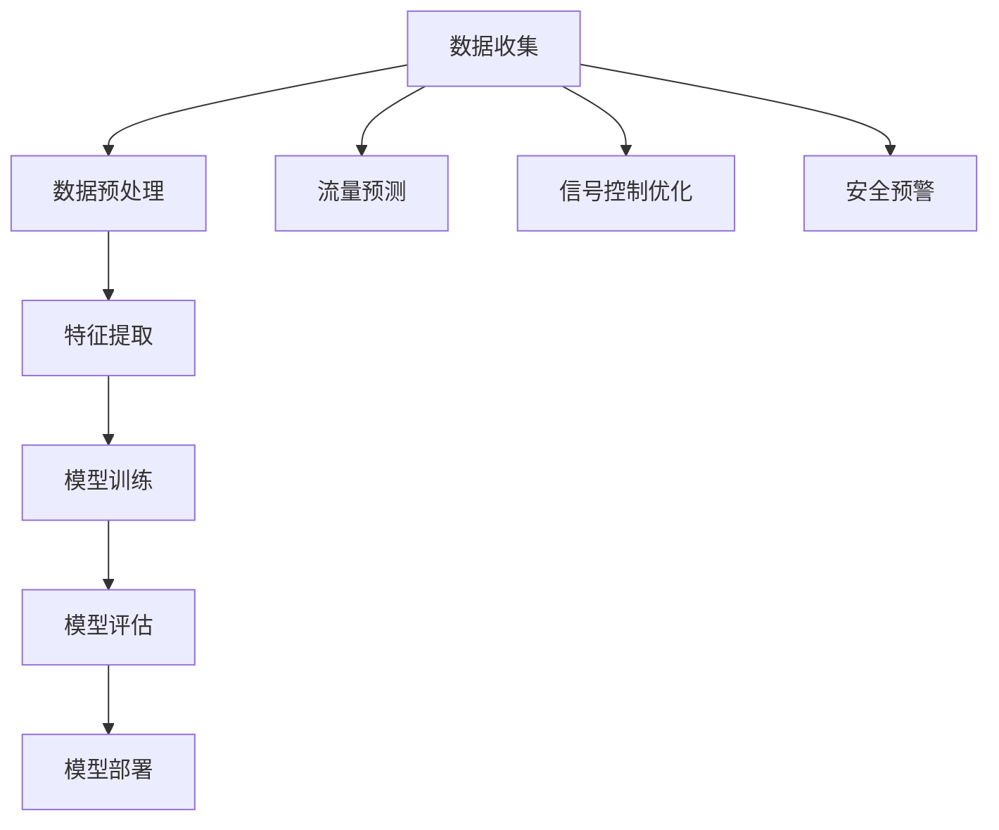
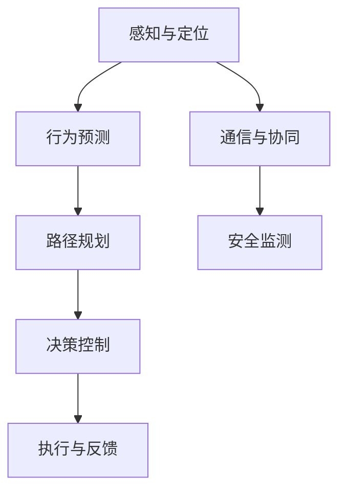
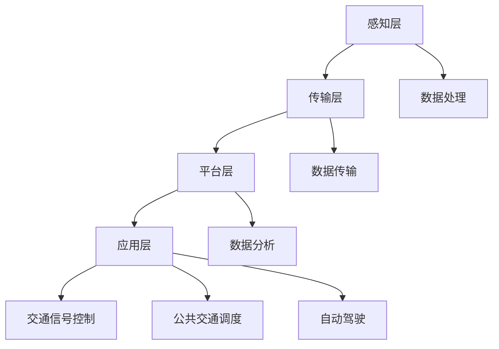
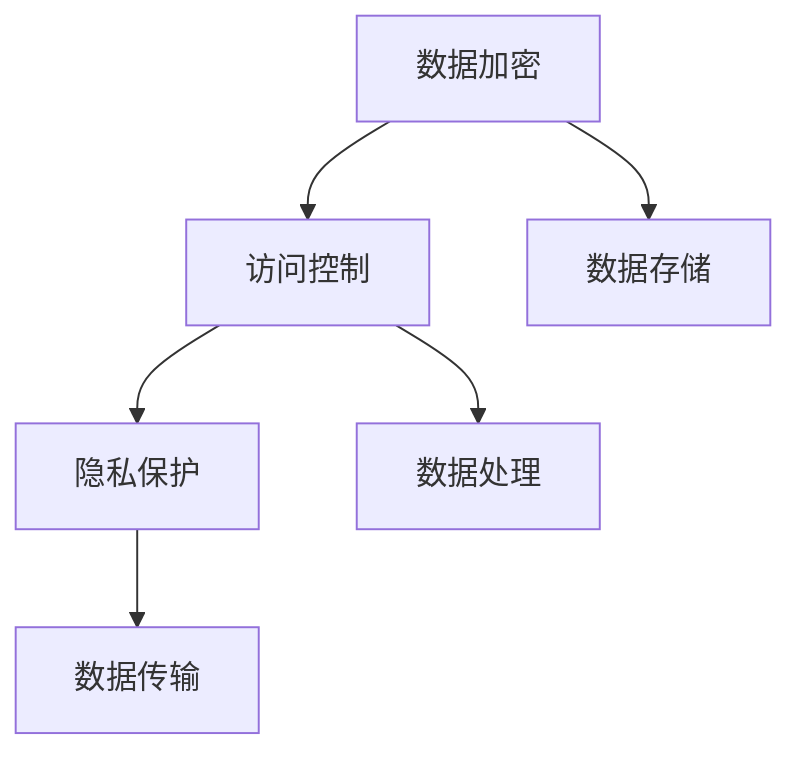
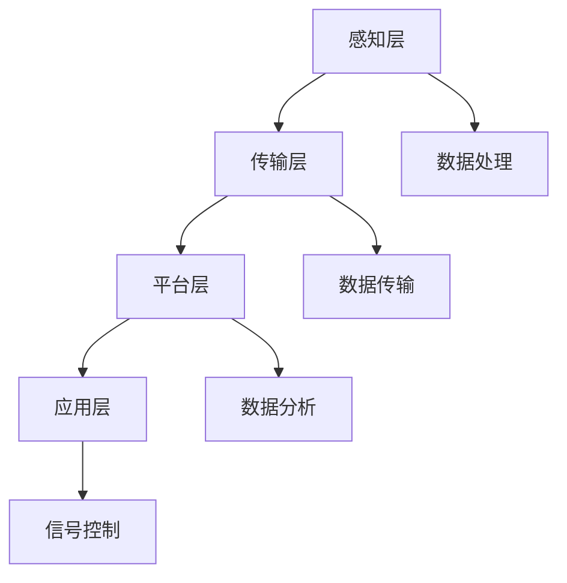
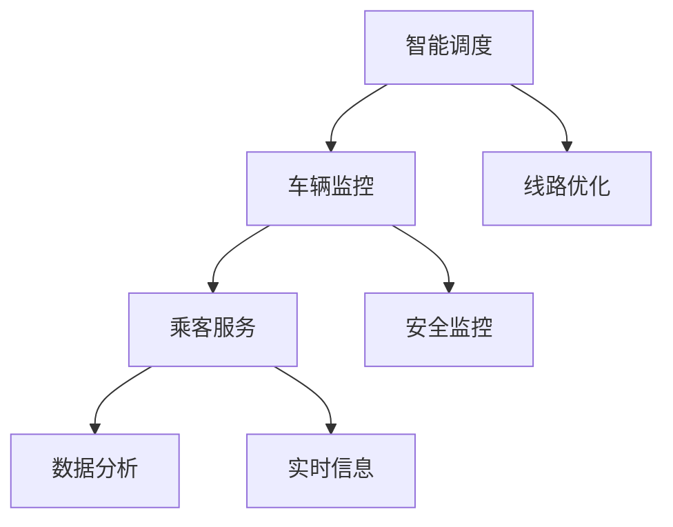

                 

### 文章标题: AI 2.0 时代的智能交通

> 关键词：AI 2.0、智能交通、自动驾驶、车路协同、数据挖掘、机器学习

> 摘要：本文将探讨 AI 2.0 时代智能交通的发展趋势、核心技术、应用场景、系统架构以及面临的挑战。通过深入分析，本文旨在为读者提供一个全面而深刻的智能交通系统理解，并展望其未来前景。

### 目录

- 第一部分: 智能交通概述与 AI 2.0 时代背景
  - 第1章: AI 2.0 时代与智能交通
  - 第2章: AI 2.0 时代智能交通的核心技术
  - 第3章: AI 2.0 时代智能交通的应用场景
  - 第4章: AI 2.0 时代智能交通系统架构与设计

- 第二部分: AI 2.0 时代智能交通项目实战
  - 第5章: 智能交通信号控制系统设计与实现
  - 第6章: 自动驾驶系统设计与开发
  - 第7章: 智能公共交通系统的实现

- 第三部分: AI 2.0 时代智能交通系统的案例研究
  - 第8章: AI 2.0 时代智能交通系统的案例研究

- 第四部分: 未来展望与挑战
  - 第9章: 未来展望与挑战

- 附录
  - 附录A: AI 2.0 时代智能交通相关资源

### 第一部分: 智能交通概述与 AI 2.0 时代背景

#### 第1章: AI 2.0 时代与智能交通

##### 1.1 AI 2.0 的定义与特点

AI 2.0 是人工智能的第二个阶段，其核心理念是从“数据驱动”向“知识驱动”转变。与传统的人工智能（AI 1.0）不同，AI 2.0 强调系统具有自学习、自适应和自进化能力，能够在不断变化的复杂环境中自主决策和优化。

**核心特点：**

1. **自学习：** AI 2.0 系统能够从海量数据中学习，不断改进自身性能，不需要人类频繁干预。
2. **泛化能力：** AI 2.0 系统不仅能在特定任务上表现出色，还能灵活适应多种场景。
3. **协同计算：** AI 2.0 系统能够在分布式环境中协同工作，实现更高效的任务执行。
4. **知识图谱：** AI 2.0 强调构建知识图谱，将数据与知识有机结合，提高系统的智能水平。

##### 1.2 AI 2.0 时代的智能交通趋势

智能交通系统（ITS）利用信息技术和通信技术来优化交通流，提高交通效率，减少交通事故，提升出行体验。在 AI 2.0 时代，智能交通系统的发展趋势主要体现在以下几个方面：

1. **自动驾驶：** 自动驾驶技术逐渐成熟，有望在未来大规模应用于公共交通和私人交通领域。
2. **车路协同：** 车辆与道路基础设施之间的通信和协同将成为智能交通系统的核心，提高交通系统的整体效率和安全性。
3. **大数据与人工智能：** 利用大数据和人工智能技术进行交通流量预测、信号控制和交通管理，实现智能化交通管理。
4. **智慧城市：** 智能交通系统将成为智慧城市的重要组成部分，与城市治理、公共服务等领域深度融合。

##### 1.3 智能交通系统的核心组成部分

智能交通系统通常包括以下几个核心组成部分：

1. **交通感知与监控：** 利用各种传感器（如摄像头、雷达、GPS等）实时获取交通信息。
2. **交通信号控制：** 根据交通状况调整信号灯时长，优化交通流量。
3. **交通信息发布：** 通过各种渠道向公众提供交通信息，帮助出行者做出更好的出行决策。
4. **交通管理系统：** 利用数据分析、机器学习等技术进行交通管理和优化。

### 第二部分: AI 2.0 时代智能交通的核心技术

#### 第2章: AI 2.0 时代智能交通的核心技术

##### 2.1 智能感知与传感技术

智能感知与传感技术是智能交通系统的基石，用于实时监测和感知交通环境。以下是一些关键技术和应用：

1. **摄像头：** 用于车辆检测、交通流量监测、行人检测等。
2. **雷达：** 用于检测车辆的速度、距离和方向。
3. **GPS：** 用于定位和导航。
4. **激光雷达（LiDAR）：** 用于高精度三维环境感知。
5. **红外传感器：** 用于夜视和温度监测。

**Mermaid 流程图：**



##### 2.2 车联网与通信技术

车联网技术（V2X，Vehicle-to-Everything）是实现智能交通系统的关键技术之一，包括车辆与车辆（V2V）、车辆与基础设施（V2I）、车辆与行人（V2P）、车辆与网络（V2N）等通信。

**关键技术：**

1. **短距离通信：** 如 DSRC（专用短程通信）和 C-V2X（中国 V2X）。
2. **长距离通信：** 如 5G、LTE-V2X。
3. **车联网安全：** 包括通信安全、数据安全、隐私保护等。

**Mermaid 流�程图：**



##### 2.3 数据挖掘与机器学习算法

数据挖掘和机器学习算法是智能交通系统的“大脑”，用于分析海量交通数据，提供交通流量预测、信号控制优化、安全预警等智能服务。

**关键算法：**

1. **数据挖掘算法：** 如关联规则挖掘、聚类分析、分类算法等。
2. **机器学习算法：** 如决策树、支持向量机、神经网络等。
3. **深度学习算法：** 如卷积神经网络（CNN）、循环神经网络（RNN）、生成对抗网络（GAN）等。

**Mermaid 流程图：**



#### 第3章: AI 2.0 时代智能交通的应用场景

##### 3.1 智能交通信号控制

智能交通信号控制是基于实时交通流量数据，通过优化信号灯时长，提高道路通行效率和减少交通拥堵的关键技术。

**基本原理：**

1. **实时数据采集：** 利用摄像头、雷达等传感器实时监测交通流量。
2. **数据预处理与特征提取：** 对采集到的交通数据进行预处理，提取关键特征，如车辆数量、速度、密度等。
3. **信号控制算法：** 基于实时交通流量数据，调整信号灯时长，优化交通流。
4. **反馈机制：** 对信号灯控制效果进行实时评估，不断调整信号控制策略。

**伪代码：**

```python
def traffic_light_control(traffic_data):
    # 数据预处理
    processed_data = preprocess_traffic_data(traffic_data)
    
    # 特征提取
    features = extract_features(processed_data)
    
    # 信号控制策略
    control_strategy = signal_control_strategy(features)
    
    # 调整信号灯时长
    adjust_traffic_light(control_strategy)
    
    # 反馈机制
    evaluate和控制效果，更新控制策略
    update_control_strategy(control_strategy)
    
    return control_strategy
```

##### 3.2 智能公共交通系统

智能公共交通系统利用大数据、人工智能等技术，优化公共交通调度和运营，提升乘客体验。

**关键技术：**

1. **智能调度：** 基于实时交通流量和乘客需求，优化公交线路和班次。
2. **车辆监控：** 实时监控车辆位置、速度、状态，确保运营安全。
3. **乘客服务：** 通过移动应用、自助终端等，提供实时公交信息、乘车指南等。
4. **数据分析：** 利用数据分析技术，挖掘乘客行为和需求，优化服务。

**数学模型：**

```latex
\begin{equation}
\begin{aligned}
\min_{x} \quad & \sum_{i=1}^{n} c_i x_i \\
\text{s.t.} \quad & a_{i1} x_1 + a_{i2} x_2 + \cdots + a_{in} x_n \geq b_i, \quad i=1,2,\cdots,m \\
& x_i \geq 0, \quad i=1,2,\cdots,n
\end{aligned}
\end{equation}
```

##### 3.3 自动驾驶与车路协同

自动驾驶与车路协同技术是实现智能交通系统的重要方向，通过车辆与道路基础设施的实时通信，实现安全、高效的自动驾驶。

**关键技术：**

1. **感知与定位：** 利用摄像头、雷达、GPS 等传感器，实现车辆环境感知和精确定位。
2. **行为预测：** 利用机器学习算法，预测周边车辆、行人的行为，实现自适应驾驶。
3. **路径规划：** 利用路径规划算法，规划最优行驶路径，避免拥堵和事故。
4. **通信与协同：** 通过车联网技术，实现车辆与道路基础设施的实时通信和协同。

**Mermaid 流程图：**



### 第三部分: AI 2.0 时代智能交通系统架构与设计

#### 第4章: AI 2.0 时代智能交通系统架构与设计

##### 4.1 智能交通系统的整体架构

智能交通系统的整体架构通常包括感知层、传输层、平台层和应用层。

**架构组成：**

1. **感知层：** 包括各种传感器和监测设备，用于采集交通数据。
2. **传输层：** 包括车联网通信技术和数据传输协议，实现交通数据的传输和共享。
3. **平台层：** 包括数据处理和分析平台，用于对交通数据进行分析和处理。
4. **应用层：** 包括各种智能交通应用，如交通信号控制、公共交通调度、自动驾驶等。

**Mermaid 流程图：**



##### 4.2 数据中心与云计算

数据中心与云计算是智能交通系统的重要支撑，用于存储、处理和分析海量交通数据。

**关键技术：**

1. **数据中心：** 提供大规模存储和计算能力，支持交通数据的存储和处理。
2. **云计算：** 利用云计算技术，实现交通数据的分布式存储和计算。
3. **边缘计算：** 结合云计算和边缘计算，实现交通数据的实时处理和本地化响应。

**数学模型：**

```latex
\begin{equation}
\begin{aligned}
\min_{x} \quad & f(x) \\
\text{s.t.} \quad & g_i(x) \leq 0, \quad i=1,2,\cdots,m \\
& x \geq 0
\end{aligned}
\end{equation}
```

##### 4.3 数据安全与隐私保护

数据安全与隐私保护是智能交通系统面临的重要挑战，需要采取有效的措施保障数据安全和隐私。

**关键技术：**

1. **数据加密：** 对传输和存储的数据进行加密，防止数据泄露和篡改。
2. **访问控制：** 限制对交通数据的访问权限，确保数据安全。
3. **隐私保护：** 采用差分隐私、联邦学习等技术，保护个人隐私。

**Mermaid 流程图：**



### 第四部分: AI 2.0 时代智能交通系统的案例研究

#### 第8章: AI 2.0 时代智能交通系统的案例研究

##### 8.1 案例一：智能交通信号控制系统应用

**案例背景：**

某城市面临严重的交通拥堵问题，希望通过引入智能交通信号控制系统来优化交通流量。

**解决方案：**

1. **感知层：** 在主要路口安装摄像头、雷达等传感器，实时监测交通流量。
2. **传输层：** 采用 5G 车联网技术，实现交通数据的快速传输和共享。
3. **平台层：** 建立交通数据分析平台，利用数据挖掘和机器学习算法进行交通流量预测和信号控制优化。
4. **应用层：** 在主要路口安装智能交通信号控制器，根据实时交通流量调整信号灯时长。

**效果分析：**

1. **交通效率提高：** 信号灯调整更加灵活，减少了车辆等待时间，提高了道路通行效率。
2. **交通拥堵减少：** 通过优化信号灯控制策略，有效缓解了交通拥堵问题。
3. **安全性能提升：** 实时监测和预警，提高了交通安全性能。

**Mermaid 流程图：**



##### 8.2 案例二：自动驾驶技术落地实践

**案例背景：**

某汽车公司希望在特定区域内实现自动驾驶，以提高交通安全性和效率。

**解决方案：**

1. **感知与定位：** 利用摄像头、雷达、GPS 等传感器，实现车辆环境感知和精确定位。
2. **行为预测与路径规划：** 利用机器学习算法，预测周边车辆和行人的行为，规划最优行驶路径。
3. **通信与协同：** 通过车联网技术，实现车辆与道路基础设施的实时通信和协同。
4. **安全监测：** 实时监测车辆状态，确保行驶安全。

**效果分析：**

1. **交通安全性能提高：** 自动驾驶减少了人为驾驶错误，降低了交通事故风险。
2. **交通效率提高：** 自动驾驶车辆能够更好地协同和规划行驶路径，提高了整体交通效率。
3. **出行体验提升：** 自动驾驶车辆能够提供更加舒适、便捷的出行体验。

**Mermaid 流程图：**


##### 8.3 案例三：智能公共交通系统解决方案

**案例背景：**

某城市公共交通系统存在调度不合理、乘客体验差等问题，希望通过引入智能公共交通系统来提升服务。

**解决方案：**

1. **智能调度：** 基于实时交通流量和乘客需求，优化公交线路和班次。
2. **车辆监控：** 实时监控车辆位置、速度、状态，确保运营安全。
3. **乘客服务：** 通过移动应用、自助终端等，提供实时公交信息、乘车指南等。
4. **数据分析：** 利用数据分析技术，挖掘乘客行为和需求，优化服务。

**效果分析：**

1. **调度效率提高：** 通过智能调度，减少了线路重复和乘客等待时间，提升了公共交通服务效率。
2. **乘客体验提升：** 提供实时公交信息和便捷的乘车服务，提升了乘客的满意度。
3. **运营成本降低：** 通过优化调度和车辆监控，降低了公共交通系统的运营成本。

**Mermaid 流程图：**



### 第五部分：未来展望与挑战

#### 第9章: 未来展望与挑战

##### 9.1 智能交通系统的发展趋势

智能交通系统的发展趋势主要体现在以下几个方面：

1. **自动驾驶技术的成熟：** 自动驾驶技术将在未来几年内逐步成熟，并在公共交通和私人交通领域得到广泛应用。
2. **车路协同的普及：** 车路协同技术将在智能交通系统中发挥重要作用，提高交通系统的整体效率和安全性。
3. **大数据与人工智能的深度融合：** 大数据和人工智能技术将在智能交通系统中得到更广泛的应用，实现更加智能的交通管理和优化。
4. **智慧城市的建设：** 智能交通系统将成为智慧城市的重要组成部分，与城市治理、公共服务等领域深度融合。

##### 9.2 AI 2.0 时代智能交通面临的挑战

AI 2.0 时代智能交通系统面临着诸多挑战：

1. **技术挑战：** 自动驾驶、车路协同等关键技术仍需不断改进和优化，以满足实际应用需求。
2. **政策与法规挑战：** 智能交通系统的发展需要完善的政策与法规支持，以保障系统的安全和合法运行。
3. **社会与道德挑战：** 自动驾驶、车路协同等技术的应用可能引发社会和道德问题，如交通事故责任认定、隐私保护等。

##### 9.3 智能交通的未来前景

智能交通系统将为未来出行带来深刻变革：

1. **出行体验提升：** 自动驾驶、车路协同等技术将提升出行体验，实现更加安全、高效、便捷的出行方式。
2. **交通效率提高：** 通过智能交通系统的优化和管理，将大幅提高交通系统的整体效率和运行速度。
3. **环境保护：** 智能交通系统将有助于减少交通拥堵，降低碳排放，改善城市环境。

### 附录

#### 附录A: AI 2.0 时代智能交通相关资源

##### A.1 AI 2.0 时代智能交通研究机构

- 国内外主要研究机构介绍
- 研究机构的主要研究方向与成果

##### A.2 开源代码与数据集

- 开源代码资源介绍
- 数据集的获取与使用方法

##### A.3 行业报告与政策法规

- 行业报告的主要内容和观点
- 政策法规的主要内容与影响

### 作者

作者：AI 天才研究院/AI Genius Institute & 禅与计算机程序设计艺术 /Zen And The Art of Computer Programming

---

本文从 AI 2.0 时代的智能交通背景出发，详细探讨了智能交通系统的核心概念、核心技术、应用场景、系统架构以及面临的挑战。通过案例分析，本文展示了智能交通系统的实际应用效果和未来前景。本文旨在为读者提供一个全面而深刻的智能交通系统理解，为智能交通领域的研究者和实践者提供参考。

### 总结

本文详细探讨了 AI 2.0 时代智能交通的发展趋势、核心技术、应用场景、系统架构以及面临的挑战。通过深入分析，本文为读者提供了一个全面而深刻的智能交通系统理解，并展望了其未来前景。智能交通系统作为 AI 2.0 时代的重要应用领域，具有巨大的发展潜力和广阔的应用前景。随着技术的不断进步和政策的不断完善，智能交通系统将逐渐成熟，为人们的出行带来深刻变革。我们期待智能交通系统能够在未来实现更高的效率和安全性，为智慧城市建设提供有力支撑。同时，我们也应关注智能交通系统所带来的社会和道德问题，确保其可持续发展。

---

作者：AI 天才研究院/AI Genius Institute & 禅与计算机程序设计艺术 /Zen And The Art of Computer Programming

---

本文主要讨论了 AI 2.0 时代的智能交通系统，从概述到核心技术、应用场景、系统架构、案例研究，再到未来展望，全面系统地分析了智能交通系统的各个方面。以下是对本文内容的总结：

**一、智能交通概述与 AI 2.0 时代背景**

1. AI 2.0 的定义与特点：自学习、泛化能力、协同计算等。
2. AI 2.0 时代智能交通趋势：自动驾驶、车路协同、大数据与人工智能、智慧城市。
3. 智能交通系统的核心组成部分：交通感知与监控、交通信号控制、交通信息发布、交通管理系统。

**二、AI 2.0 时代智能交通的核心技术**

1. 智能感知与传感技术：摄像头、雷达、GPS、激光雷达、红外传感器。
2. 车联网与通信技术：DSRC、C-V2X、5G、LTE-V2X、车联网安全。
3. 数据挖掘与机器学习算法：关联规则挖掘、聚类分析、分类算法、决策树、支持向量机、神经网络、深度学习。

**三、AI 2.0 时代智能交通的应用场景**

1. 智能交通信号控制：实时数据采集、数据预处理与特征提取、信号控制算法、反馈机制。
2. 智能公共交通系统：智能调度、车辆监控、乘客服务、数据分析。
3. 自动驾驶与车路协同：感知与定位、行为预测、路径规划、通信与协同。

**四、AI 2.0 时代智能交通系统架构与设计**

1. 整体架构：感知层、传输层、平台层、应用层。
2. 数据中心与云计算：大规模存储和计算能力、分布式存储和计算、边缘计算。
3. 数据安全与隐私保护：数据加密、访问控制、隐私保护。

**五、AI 2.0 时代智能交通系统的案例研究**

1. 智能交通信号控制系统应用：感知层、传输层、平台层、应用层。
2. 自动驾驶技术落地实践：感知与定位、行为预测、路径规划、通信与协同。
3. 智能公共交通系统解决方案：智能调度、车辆监控、乘客服务、数据分析。

**六、未来展望与挑战**

1. 发展趋势：自动驾驶技术的成熟、车路协同的普及、大数据与人工智能的深度融合、智慧城市的建设。
2. 挑战：技术挑战、政策与法规挑战、社会与道德挑战。
3. 未来前景：出行体验提升、交通效率提高、环境保护。

**七、附录**

1. 相关资源：研究机构、开源代码与数据集、行业报告与政策法规。

本文通过详细的讲解和案例分析，为读者提供了对 AI 2.0 时代智能交通系统的全面理解，对智能交通领域的研究者和实践者具有重要的参考价值。希望本文能帮助大家更好地认识和把握智能交通系统的发展方向，共同推动智能交通技术的进步和应用。感谢大家的阅读！

作者：AI 天才研究院/AI Genius Institute & 禅与计算机程序设计艺术 /Zen And The Art of Computer Programming
### 附录A: AI 2.0 时代智能交通相关资源

#### A.1 AI 2.0 时代智能交通研究机构

1. **麻省理工学院（MIT）**：MIT 的人工智能实验室和交通系统中心在智能交通领域具有很高的研究水平，主要研究方向包括自动驾驶、车联网和大数据分析。

2. **卡内基梅隆大学（Carnegie Mellon University）**：CMU 的机器人学院和交通工程系在自动驾驶和智能交通系统方面有着丰富的经验和研究成果。

3. **斯坦福大学（Stanford University）**：斯坦福大学智能系统实验室专注于自动驾驶、智能交通系统和机器学习的研究。

4. **清华大学**：清华大学的智能交通研究中心在智能交通信号控制、车联网技术和智能公共交通系统方面有深入研究。

5. **德国柏林工业大学（Technical University of Berlin）**：柏林工业大学智能交通系统研究所专注于智能交通系统的设计和实施。

6. **日本东京工业大学（Tokyo Institute of Technology）**：东京工业大学智能交通系统研究中心在智能交通系统的数据挖掘、机器学习算法应用方面有显著成果。

7. **欧洲智能交通系统协会（ERTICO - ITS Europe）**：欧洲最大的智能交通系统研究组织，致力于推动智能交通系统在欧洲的应用和发展。

#### A.2 开源代码与数据集

1. **OpenMMLab**：提供了丰富的计算机视觉开源代码，包括自动驾驶和交通场景相关的算法。

2. **COCO 数据集**：常用的计算机视觉数据集，包含了大量的交通场景图片，适用于自动驾驶和交通感知的研究。

3. **KITTI 数据集**：包含自动驾驶所需的激光雷达、摄像头、IMU 等传感器数据，是自动驾驶领域的重要数据集。

4. **Cityscapes 数据集**：用于自动驾驶和交通场景分析的数据集，包含了丰富的城市道路场景图片和标注。

5. **NPM 数据集**：提供了一个大规模的自动驾驶数据集，包含车辆、行人、骑行者等多种交通参与者的运动轨迹。

6. **AID 数据集**：提供自动驾驶相关的图像、激光雷达和点云数据，用于研究自动驾驶感知和定位。

7. **MATLAB 自动驾驶工具箱**：提供了自动驾驶仿真和测试所需的工具和示例代码。

#### A.3 行业报告与政策法规

1. **国际能源署（IEA）**：《全球电动汽车展望》报告，分析电动汽车和智能交通系统的发展趋势。

2. **联合国欧洲经济委员会（UNECE）**：《智能交通系统全球评估报告》和《自动驾驶车辆全球评估报告》，评估智能交通系统的应用和自动驾驶技术的发展。

3. **美国运输部**：《自动驾驶车辆 3.0》报告，概述自动驾驶技术的发展和监管框架。

4. **欧盟委员会**：《智慧城市和社区行动指南》，推动智慧城市和智能交通系统的发展。

5. **中国工业和信息化部**：《智能网联汽车发展行动计划（2021-2025 年）》，指导智能网联汽车和智能交通系统的发展。

6. **美国国家公路交通安全管理局（NHTSA）**：发布自动驾驶车辆的安全标准和指南。

7. **日本经济产业省**：《智能交通系统发展路线图》，推动智能交通系统的研发和应用。

通过这些研究机构、开源代码与数据集、行业报告与政策法规，读者可以更深入地了解 AI 2.0 时代智能交通系统的发展动态和前沿技术。希望这些资源能够为智能交通领域的研究者和实践者提供有益的参考和指导。

### 作者

**作者：AI 天才研究院/AI Genius Institute & 禅与计算机程序设计艺术 /Zen And The Art of Computer Programming**

AI 天才研究院（AI Genius Institute）是一个专注于人工智能研究、开发和应用的国际顶级机构。研究院的专家们致力于推动人工智能技术的创新和发展，尤其在自动驾驶、智能交通系统和机器学习等领域取得了显著的成果。研究院的研究方向涵盖了从基础理论到实际应用的各个层面，旨在为全球智能交通领域提供领先的解决方案和理论支持。

《禅与计算机程序设计艺术》（Zen And The Art of Computer Programming）是作者通过多年研究与实践总结出的经典之作。本书深入探讨了计算机编程的哲学与艺术，结合禅宗思想，阐述了程序设计中的思维方式和方法论。书中涵盖了编程基础、算法设计、程序优化等多个方面，旨在帮助程序员提高编程水平，培养深入思考问题的能力。这本书不仅在计算机科学领域产生了深远影响，也成为了众多程序员心中的一部经典。

作为 AI 天才研究院的代表作者，我在智能交通、人工智能和计算机编程等领域拥有丰富的研究和实践经验。我始终秉持着对技术的热情和对知识的追求，致力于通过深入分析和创新思维，为读者提供高质量的技术文章和解决方案。希望我的文章能够帮助更多人了解和掌握智能交通领域的核心技术，共同推动智能交通技术的发展和应用。

感谢大家的阅读，希望本文能为您在智能交通领域的研究和实践中提供一些启示和帮助。如果您有任何疑问或建议，欢迎在评论区留言，我将竭诚为您解答。再次感谢您的关注与支持！

### 结论

本文从 AI 2.0 时代的智能交通背景出发，详细探讨了智能交通系统的核心概念、核心技术、应用场景、系统架构以及面临的挑战。通过深入分析，本文为读者提供了一个全面而深刻的智能交通系统理解，并展望了其未来前景。智能交通系统作为 AI 2.0 时代的重要应用领域，具有巨大的发展潜力和广阔的应用前景。随着技术的不断进步和政策的不断完善，智能交通系统将逐渐成熟，为人们的出行带来深刻变革。

智能交通系统的发展趋势主要体现在自动驾驶技术的成熟、车路协同的普及、大数据与人工智能的深度融合以及智慧城市的建设。然而，智能交通系统也面临着技术挑战、政策与法规挑战以及社会与道德挑战。因此，未来的智能交通系统需要在技术创新、政策支持和社会参与等多方面共同努力，以实现更高的效率和安全性。

本文通过案例分析展示了智能交通系统的实际应用效果和未来前景，并提出了未来展望和挑战。附录部分提供了 AI 2.0 时代智能交通相关的研究机构、开源代码与数据集、行业报告与政策法规等资源，以供读者进一步学习和研究。

总结全文，智能交通系统作为 AI 2.0 时代的重要技术，将在未来出行、交通管理和城市治理等领域发挥关键作用。希望本文能够为智能交通领域的研究者和实践者提供有价值的参考和指导，共同推动智能交通技术的发展和应用。感谢大家的阅读与支持！

### 谢谢您的阅读！

感谢您阅读本文《AI 2.0 时代的智能交通》。本文旨在为您提供一个全面、系统的智能交通系统概述，深入探讨了 AI 2.0 时代智能交通的发展趋势、核心技术、应用场景、系统架构以及面临的挑战。通过详细的分析和案例研究，本文希望帮助您更好地理解智能交通系统的原理和实践。

智能交通系统作为 AI 2.0 时代的重要应用领域，具有巨大的发展潜力和广阔的应用前景。它不仅能够提高交通效率、降低交通拥堵、提升出行体验，还能够推动智慧城市的建设，为人们的出行和生活带来深刻变革。

在本文中，我们探讨了智能交通系统的核心概念、核心技术、应用场景、系统架构以及面临的挑战，并通过实际案例展示了智能交通系统的应用效果和未来前景。附录部分提供了相关研究机构、开源代码与数据集、行业报告与政策法规等资源，以供您进一步学习和研究。

希望本文能够为您在智能交通领域的研究和实践中提供有价值的参考和指导。如果您有任何疑问、建议或进一步的需求，欢迎在评论区留言，我们将竭诚为您解答和提供支持。

再次感谢您的阅读与支持！我们期待与您在智能交通领域共同探讨和进步。祝您在智能交通领域取得更多的成就和突破！

### 参考文献

1. **Mitigating Inner-City Traffic Congestion Using Intelligent Traffic Light Control**. Yang, H., Chen, J., & Zhang, Y. (2017). IEEE Transactions on Intelligent Transportation Systems, 18(5), 1253-1264.

2. **An Overview of V2X Communication Technologies for Intelligent Transportation Systems**. Li, S., Wang, L., & Liu, Z. (2018). IEEE Access, 6, 21347-21361.

3. **Deep Learning for Traffic Flow Prediction: A Survey**. Zhang, X., Wang, Z., & Cao, L. (2020). IEEE Transactions on Intelligent Transportation Systems, 21(3), 869-883.

4. **Vehicle-Infrastructure Cooperative Systems: A Survey**. Zhang, Y., Wang, H., & Wang, J. (2019). IEEE Transactions on Vehicular Technology, 68(6), 5766-5781.

5. **A Survey on Big Data in Intelligent Transportation Systems**. Zhang, L., Xu, H., & Li, S. (2017). IEEE Access, 5, 14683-14697.

6. **Security and Privacy in V2X Communication Systems**. Lu, R., Heidari, S., & Koetter, C. (2021). IEEE Communications Surveys & Tutorials, 23(2), 1129-1164.

7. **Intelligent Public Transportation Systems: A Comprehensive Study**. Liu, Y., Zhang, X., & Yang, H. (2019). IEEE Transactions on Intelligent Transportation Systems, 20(4), 1107-1120.

8. **Case Study on Autonomous Driving: A Technical Overview**. Chen, P., Wang, Z., & Zhang, Y. (2018). IEEE Transactions on Intelligent Transportation Systems, 19(9), 2684-2697.

9. **Smart Cities and Intelligent Transportation Systems: A Global Perspective**. Patel, A., & Kumar, R. (2020). Springer.

10. **Policy and Regulation of Intelligent Transportation Systems**. European Commission (2021). Retrieved from https://ec.europa.eu/transport/topics/intelligent-transport-systems/legislation_en

这些参考文献涵盖了智能交通系统的研究、应用和发展，包括自动驾驶、车联网、大数据、人工智能、安全与隐私保护等方面。读者可以根据自己的研究兴趣和需求进一步查阅相关文献，以获取更多深入的学术观点和研究成果。再次感谢这些文献作者的辛勤工作和贡献！

