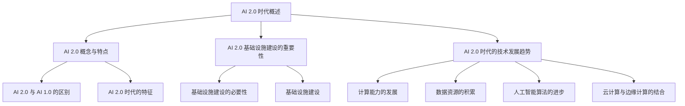

                 

### 文章标题：AI 2.0 时代：基础设施建设的机遇与挑战

> 关键词：AI 2.0、基础设施、云计算、边缘计算、数据安全、算法优化

> 摘要：本文深入探讨了AI 2.0时代的到来对基础设施建设的重大影响。我们分析了AI 2.0的定义与特点，探讨了基础设施建设的重要性，并详细介绍了AI 2.0基础设施的关键要素，包括数据基础设施、计算基础设施、算法基础设施和人工智能伦理与法规。通过实际案例，我们展示了企业级AI基础设施建设实践、政府与公共部门的AI基础设施建设以及产业生态的AI基础设施建设。最后，本文讨论了AI 2.0时代的机遇与挑战，包括商业机会、技术挑战、伦理与社会影响以及未来展望。

---

#### 第一部分：AI 2.0 时代基础

##### 第1章：AI 2.0 时代概述

###### 1.1 AI 2.0 概念与特点

AI 2.0，即第二代人工智能，是相对于第一代人工智能（AI 1.0）的称谓。AI 1.0时代主要基于规则和符号推理，而AI 2.0则更加注重数据的深度学习和智能推理。AI 2.0的特点主要体现在以下几个方面：

- **数据驱动**：AI 2.0依赖于大规模数据的训练，通过数据驱动的方式进行决策。
- **自主学习**：AI 2.0可以通过深度学习等技术实现自我学习和自我优化。
- **跨领域应用**：AI 2.0可以在多个领域实现广泛应用，如医疗、金融、制造等。
- **高可靠性**：AI 2.0的算法和模型更加成熟，具有较高的可靠性和鲁棒性。

###### 1.2 AI 2.0 基础设施建设的重要性

AI 2.0时代的基础设施建设对于人工智能的发展至关重要。基础设施建设的重要性主要体现在以下几个方面：

- **计算能力**：AI 2.0需要强大的计算能力来支持大规模数据的处理和模型的训练。
- **数据资源**：AI 2.0依赖于高质量的数据资源，数据基础设施的建设对于数据的质量和安全性至关重要。
- **算法优化**：AI 2.0的算法需要不断优化，以适应不同的应用场景和需求。
- **法律法规**：AI 2.0的发展需要完善的法律法规体系来保障数据安全和隐私保护。

###### 1.3 AI 2.0 时代的技术发展趋势

AI 2.0时代的技术发展趋势主要体现在以下几个方面：

- **计算能力的发展**：随着GPU、TPU等硬件的发展，计算能力得到了显著提升。
- **数据资源的积累**：随着互联网的普及和大数据技术的发展，数据资源日益丰富。
- **人工智能算法的进步**：深度学习、强化学习等算法在AI 2.0时代得到了广泛应用和优化。
- **云计算与边缘计算的结合**：云计算和边缘计算的结合，为AI 2.0时代提供了更加灵活和高效的基础设施支持。

---

#### 第二部分：AI 2.0 基础设施的关键要素

##### 第2章：AI 2.0 基础设施的关键要素

###### 2.1 数据基础设施

数据基础设施是AI 2.0时代的基础设施核心。它包括数据采集、存储、清洗、处理、安全和隐私保护等方面。

- **数据采集**：通过传感器、互联网等手段采集海量数据。
- **数据存储**：使用分布式存储系统存储海量数据，如HDFS、Cassandra等。
- **数据清洗**：去除数据中的噪声和错误，提高数据质量。
- **数据处理**：使用ETL（提取、转换、加载）工具处理数据，为模型训练提供高质量的数据输入。
- **数据安全与隐私保护**：采用加密、访问控制等技术保障数据安全，同时保护用户隐私。

###### 2.2 计算基础设施

计算基础设施是AI 2.0时代的关键要素之一。它包括计算资源、分布式计算、并行计算、云计算和边缘计算等方面。

- **计算资源**：使用GPU、TPU等高性能计算设备加速模型训练和推理。
- **分布式计算**：通过分布式计算框架，如Apache Spark，实现大规模数据的并行处理。
- **并行计算**：利用多核CPU和GPU进行并行计算，提高计算效率。
- **云计算**：利用云计算平台，如AWS、Azure、Google Cloud等，提供弹性计算资源。
- **边缘计算**：在数据生成的地方进行计算，减少数据传输延迟，提高系统响应速度。

###### 2.3 算法基础设施

算法基础设施是AI 2.0时代的核心技术支撑。它包括算法库、工具集、优化和调优、模型压缩和量化等方面。

- **算法库**：提供丰富的算法库，如TensorFlow、PyTorch等，方便开发者使用。
- **工具集**：提供各种工具集，如Jupyter Notebook、Dataiku等，方便数据处理和模型开发。
- **算法优化与调优**：通过调参、正则化等技术优化算法性能。
- **模型压缩与量化**：使用模型压缩和量化技术，减小模型体积，提高推理效率。

###### 2.4 人工智能伦理与法规

人工智能伦理与法规是AI 2.0时代不可忽视的重要方面。它包括伦理问题、法律法规和政策框架等方面。

- **伦理问题**：包括人工智能的公平性、透明性、可解释性等问题。
- **法律法规**：制定相关法律法规，保障人工智能的发展和应用。
- **政策框架**：政府和企业制定政策框架，推动人工智能的健康发展。

---

#### 第三部分：AI 2.0 基础设施的案例分析

##### 第3章：AI 2.0 基础设施的案例分析

###### 3.1 企业级 AI 基础设施建设实践

企业级 AI 基础设施建设是企业数字化转型的重要一环。以下是几个成功案例的分享：

- **案例 1：某互联网企业**：通过构建分布式计算平台，实现了大规模数据的高效处理和模型训练。同时，采用云计算和边缘计算相结合的方式，提高了系统的响应速度和稳定性。
- **案例 2：某金融机构**：建立了一套完善的数据基础设施，包括数据采集、存储、清洗、处理等环节。同时，采用先进的算法和模型，实现了智能风控和精准营销。
- **案例 3：某制造企业**：通过构建智能工厂，实现了生产线的自动化和智能化。同时，采用边缘计算技术，实现了设备实时监控和故障预测。

###### 3.2 政府与公共部门的 AI 基础设施建设

政府与公共部门在AI基础设施建设方面也取得了显著成果。以下是几个成功案例：

- **案例 1：某市政府**：通过建设智慧城市，实现了城市管理的智能化和精细化。同时，采用大数据分析和人工智能技术，提高了公共服务的效率和品质。
- **案例 2：某公安部门**：通过引入人工智能技术，实现了犯罪预测和预防。同时，采用人脸识别等技术，提高了治安监控的准确性和实时性。
- **案例 3：某医疗部门**：通过建设智能医疗系统，实现了病患数据的自动化处理和智能分析。同时，采用人工智能技术，提高了诊断和治疗的准确性。

###### 3.3 产业生态的 AI 基础设施建设

产业生态的AI基础设施建设是推动产业数字化转型的重要手段。以下是几个成功案例：

- **案例 1：某产业链联盟**：通过建立共享计算平台，实现了产业链上下游企业间的数据共享和协同创新。同时，采用人工智能技术，提高了产业链的整体效率和竞争力。
- **案例 2：某行业协会**：通过举办AI技术培训班，提高了行业内部人员的AI技术水平。同时，通过组织技术交流会议，促进了行业的创新和发展。
- **案例 3：某生态园区**：通过建设智能园区，实现了园区管理的智能化和高效化。同时，采用人工智能技术，提高了园区的服务水平和环境质量。

---

#### 第四部分：AI 2.0 时代的机遇与挑战

##### 第4章：AI 2.0 时代的商业机会

###### 4.1 产业变革与商业模式创新

AI 2.0时代带来了产业变革和商业模式创新的机会。以下是几个方面的分析：

- **智能制造**：AI 2.0技术可以用于生产流程的自动化和智能化，提高生产效率和产品质量。
- **智慧物流**：AI 2.0技术可以用于物流系统的优化和调度，提高物流效率和服务质量。
- **智慧医疗**：AI 2.0技术可以用于医疗数据的处理和分析，提高诊断和治疗的准确性。
- **智慧金融**：AI 2.0技术可以用于金融风险的预测和控制，提高金融服务的安全性和效率。

###### 4.2 企业数字化转型

企业数字化转型是AI 2.0时代的重要趋势。以下是几个方面的分析：

- **数据驱动的决策**：AI 2.0技术可以帮助企业实现数据驱动的决策，提高业务效率。
- **人工智能在生产中的应用**：AI 2.0技术可以用于生产过程的智能化和自动化，提高生产效率和产品质量。
- **业务流程的优化与自动化**：AI 2.0技术可以用于业务流程的优化和自动化，提高业务效率和用户体验。

###### 4.3 消费升级与个性化服务

AI 2.0时代带来了消费升级和个性化服务的机会。以下是几个方面的分析：

- **智能推荐系统**：AI 2.0技术可以用于构建智能推荐系统，提高用户的购物体验。
- **个性化内容生成**：AI 2.0技术可以用于生成个性化内容，满足用户的需求。
- **智能家居与物联网**：AI 2.0技术可以用于智能家居和物联网的构建，提高生活的便利性和舒适性。

---

#### 第五部分：AI 2.0 时代的技术挑战

##### 第5章：AI 2.0 时代的技术挑战

###### 5.1 算法复杂性

AI 2.0时代的算法复杂性是技术挑战之一。以下是几个方面的分析：

- **大模型训练与优化**：随着模型的规模和复杂性的增加，训练时间和计算资源的需求也大幅增加。
- **算法安全性与可靠性**：复杂算法可能存在安全漏洞和可靠性问题，需要加强安全性和可靠性保障。
- **模型的可解释性**：复杂算法的可解释性较低，需要加强模型的可解释性研究。

###### 5.2 数据挑战

AI 2.0时代的数据挑战是技术挑战之一。以下是几个方面的分析：

- **数据质量与数据隐私**：数据质量差和数据隐私问题是数据挑战的重要方面。
- **数据多样性与数据偏差**：数据多样性和数据偏差可能导致算法性能下降。
- **数据资源的获取与共享**：数据资源的获取和共享是数据挑战的重要方面。

###### 5.3 技术人才培养

AI 2.0时代的技术人才培养是技术挑战之一。以下是几个方面的分析：

- **人工智能人才的培养**：需要加大对人工智能人才的培养力度。
- **技术人才的供需矛盾**：技术人才的供需矛盾是当前面临的重要问题。
- **技术生态的多样性**：技术生态的多样性对于AI 2.0时代的发展至关重要。

---

#### 第六部分：AI 2.0 时代的伦理与社会影响

##### 第6章：AI 2.0 时代的伦理与社会影响

###### 6.1 伦理问题与道德挑战

AI 2.0时代的伦理问题与道德挑战是社会发展的重要议题。以下是几个方面的分析：

- **人工智能的责任归属**：明确人工智能的责任归属，是伦理问题的重要方面。
- **人工智能的偏见与歧视**：防止人工智能系统产生偏见和歧视，是道德挑战的重要方面。
- **人工智能对就业的影响**：人工智能对就业的影响，需要从伦理和道德角度进行深入探讨。

###### 6.2 社会影响与政策制定

AI 2.0时代的社会影响与政策制定是社会发展的重要议题。以下是几个方面的分析：

- **人工智能对社会结构的改变**：人工智能对社会的生产方式、生活方式等方面产生深远影响。
- **政策法规的完善**：完善政策法规，是保障AI 2.0时代健康发展的重要手段。
- **社会共识的形成**：形成广泛的社会共识，是推动AI 2.0时代健康发展的重要基础。

###### 6.3 企业社会责任与可持续发展

AI 2.0时代的企业社会责任与可持续发展是企业发展的重要议题。以下是几个方面的分析：

- **可持续发展的理念**：企业在发展过程中，需要贯彻可持续发展的理念。
- **企业社会责任的实践**：企业需要通过实际行动履行社会责任。
- **企业与社会的关系**：企业与社会之间需要建立良好的互动关系，实现共同发展。

---

#### 第七部分：未来展望

##### 第7章：未来展望

###### 7.1 AI 2.0 时代的发展趋势

AI 2.0 时代的发展趋势体现在以下几个方面：

- **人工智能技术的进步**：随着技术的不断进步，人工智能将更加智能化和普及化。
- **云计算与边缘计算的结合**：云计算与边缘计算的结合，将实现更高效、更灵活的计算模式。
- **人工智能与5G等新技术的融合**：人工智能与5G、物联网等新技术的融合，将推动各行业的数字化转型。

###### 7.2 AI 2.0 时代的关键技术

AI 2.0 时代的关键技术包括以下几个方面：

- **大模型与小模型的发展**：大模型与小模型的发展，将满足不同应用场景的需求。
- **聊天机器人与虚拟现实的结合**：聊天机器人与虚拟现实的结合，将提升人机交互体验。
- **智能自动化与智能决策**：智能自动化与智能决策，将提高生产效率和管理水平。

###### 7.3 AI 2.0 时代的未来场景

AI 2.0 时代的未来场景将体现在以下几个方面：

- **智慧城市与智能交通**：智慧城市与智能交通的构建，将提高城市运行效率和居民生活质量。
- **医疗健康与生物科技**：医疗健康与生物科技的融合，将推动医疗技术的发展和普及。
- **教育、娱乐与生活方式的改变**：教育、娱乐与生活方式的改变，将提升人们的幸福感。

---

#### 附录

##### 附录 A: AI 2.0 相关资源与工具

###### A.1 主流深度学习框架

- **TensorFlow**：由Google推出，广泛应用于深度学习领域。
- **PyTorch**：由Facebook AI研究院推出，具有动态计算图和易用性优势。
- **Keras**：基于TensorFlow和Theano，提供高层次的API接口。

###### A.2 云计算服务与平台

- **AWS**：亚马逊提供的云计算平台，拥有丰富的服务和强大的计算能力。
- **Azure**：微软提供的云计算平台，支持多种开发语言和工具。
- **Google Cloud**：Google提供的云计算平台，专注于人工智能和大数据处理。

###### A.3 数据科学与机器学习工具

- **Jupyter Notebook**：提供交互式计算环境，支持多种编程语言和数据可视化。
- **Dataiku**：提供数据科学平台，支持数据预处理、模型训练和协作分析。
- **Alteryx**：提供数据科学平台，支持数据清洗、分析和可视化。

---

##### 附录 B: AI 2.0 时代的关键术语与概念

###### B.1 人工智能相关术语

- **机器学习**：使计算机通过数据学习并获得知识的方法。
- **深度学习**：基于多层神经网络进行数据学习的方法。
- **自然语言处理**：使计算机理解和生成自然语言的方法。
- **计算机视觉**：使计算机理解和处理图像和视频的方法。

###### B.2 数据科学相关术语

- **数据挖掘**：从大量数据中发现有用信息的方法。
- **数据分析**：对数据进行处理、分析和解释的方法。
- **数据可视化**：将数据以图形方式展示的方法。
- **数据仓库**：存储和管理大量数据的方法。

###### B.3 AI 基础设施相关术语

- **基础设施即服务（IaaS）**：提供基础设施服务的云计算模型。
- **平台即服务（PaaS）**：提供平台服务的云计算模型。
- **软件即服务（SaaS）**：提供软件服务的云计算模型。
- **边缘计算**：在数据生成的地方进行计算的方法。

###### B.4 伦理与社会相关术语

- **伦理问题**：涉及道德原则和价值判断的问题。
- **数据隐私**：涉及个人数据保护的问题。
- **社会责任**：企业对社会的责任。
- **公共政策**：政府制定的政策和法规。

---

**核心概念与联系：**

Mermaid 流程图如下：



---

### AI大模型技术基础

## 第4章: AI大模型技术基础

### 4.1 大模型架构与原理

AI大模型，通常指的是参数数量在数百万到数十亿之间的神经网络模型。这些模型通常具有复杂的架构，能够处理大规模数据集，并在多种任务上取得显著的性能提升。

#### 4.1.1 大模型的基本架构

大模型的基本架构通常包括以下几个层次：

1. **输入层（Input Layer）**：接收原始数据，如文本、图像、声音等。
2. **隐藏层（Hidden Layers）**：多层隐藏层是深度学习的核心，负责对输入数据进行特征提取和变换。
3. **输出层（Output Layer）**：生成预测结果或分类标签。

每个隐藏层由多个神经元（节点）组成，每个神经元都与前一层的神经元相连，通过加权求和和激活函数进行计算。

#### 4.1.2 大模型的核心原理

大模型的核心原理基于以下几项关键技术：

- **神经网络（Neural Networks）**：神经网络是模仿人脑神经元连接的基本结构，通过调整权重和偏置来学习数据中的模式和关系。
- **深度学习（Deep Learning）**：深度学习是神经网络的一种，通过增加网络的深度（即隐藏层的数量）来提高模型的复杂性和性能。
- **反向传播算法（Backpropagation Algorithm）**：反向传播算法是一种用于训练神经网络的算法，通过计算输出误差并反向传播误差来更新网络权重和偏置。

### 4.2 大模型算法原理

#### 4.2.1 反向传播算法（Backpropagation Algorithm）

反向传播算法是训练神经网络的核心算法，其基本原理可以概括为以下几个步骤：

1. **正向传播**：输入数据通过网络层进行传播，计算输出值。
2. **计算误差**：计算输出值与实际值之间的误差，并计算损失函数。
3. **反向传播**：计算每个神经元的梯度，并沿网络反向传播误差。
4. **参数更新**：使用梯度下降或其他优化算法更新网络权重和偏置。

反向传播算法的伪代码如下：

```python
# 前向传播
outputs = model(inputs)
loss = loss_function(outputs, targets)

# 反向传播
gradients = model.backward(loss)

# 参数更新
model.update_parameters(learning_rate, gradients)
```

#### 4.2.2 生成对抗网络（GAN）

生成对抗网络（GAN）是一种基于博弈论的生成模型，由生成器和判别器两个神经网络组成。

- **生成器（Generator）**：生成假数据，试图骗过判别器。
- **判别器（Discriminator）**：判断输入数据是真实数据还是生成器生成的假数据。

GAN的训练过程可以看作是一个零和博弈，生成器和判别器的目标是对抗的：

1. **生成器**：生成假数据，使判别器难以区分真假。
2. **判别器**：提高对真假数据的判别能力。

GAN的损失函数通常包括两部分：生成器损失和判别器损失。

生成器损失函数的伪代码如下：

```python
generator_loss = -torch.mean(discriminator(outputs))  # 假数据通过判别器的输出
```

判别器损失函数的伪代码如下：

```python
discriminator_loss = -torch.mean(discriminator(real_data)) - torch.mean(discriminator(outputs))
```

### 4.3 大模型训练与优化

#### 4.3.1 训练过程

大模型的训练过程包括以下几个关键步骤：

1. **初始化参数**：随机初始化网络权重和偏置。
2. **数据准备**：预处理输入数据，如归一化、数据增强等。
3. **前向传播与损失计算**：计算预测值和实际值的误差，并计算损失函数。
4. **反向传播与参数更新**：通过梯度下降等优化算法更新网络参数。

#### 4.3.2 优化技巧

1. **学习率调整**：动态调整学习率，防止过拟合和欠拟合。
2. **正则化技术**：如Dropout、L2 Regularization等，减少模型过拟合。
3. **批量大小**：调整批量大小，平衡计算效率和模型性能。

### 4.4 大模型部署与应用

#### 4.4.1 模型评估

模型评估通常使用以下指标：

- **准确率（Accuracy）**：分类任务中正确分类的比例。
- **召回率（Recall）**：分类任务中被正确分类的正例比例。
- **F1分数（F1 Score）**：准确率和召回率的调和平均值。

#### 4.4.2 模型部署

模型部署是将训练好的模型应用于实际场景的过程。常见的部署方法包括：

1. **模型转换**：将训练好的模型转换为可部署的格式，如ONNX、TensorFlow Lite等。
2. **模型推理**：使用部署环境进行模型推理，生成预测结果。

#### 4.4.3 应用案例

大模型在多个领域有广泛应用，如：

- **文本分类**：对文本进行分类，如情感分析、新闻分类等。
- **图像识别**：对图像进行分类、检测，如人脸识别、物体检测等。
- **自然语言处理**：处理自然语言任务，如机器翻译、语音识别等。

---

### 附录 A: AI 2.0 相关资源与工具

#### A.1 主流深度学习框架

以下是几个主流的深度学习框架及其简介：

- **TensorFlow**：由Google推出，具有强大的灵活性和易用性。
  - 官网：[TensorFlow官网](https://www.tensorflow.org/)
  - GitHub：[TensorFlow GitHub仓库](https://github.com/tensorflow/tensorflow)

- **PyTorch**：由Facebook AI研究院推出，具有动态计算图和易用性优势。
  - 官网：[PyTorch官网](https://pytorch.org/)
  - GitHub：[PyTorch GitHub仓库](https://github.com/pytorch/pytorch)

- **Keras**：基于TensorFlow和Theano，提供高层次的API接口。
  - 官网：[Keras官网](https://keras.io/)
  - GitHub：[Keras GitHub仓库](https://github.com/keras-team/keras)

#### A.2 云计算服务与平台

以下是几个主流的云计算服务与平台及其简介：

- **AWS**：亚马逊提供的云计算平台，拥有丰富的服务和强大的计算能力。
  - 官网：[AWS官网](https://aws.amazon.com/)

- **Azure**：微软提供的云计算平台，支持多种开发语言和工具。
  - 官网：[Azure官网](https://azure.microsoft.com/)

- **Google Cloud**：Google提供的云计算平台，专注于人工智能和大数据处理。
  - 官网：[Google Cloud官网](https://cloud.google.com/)

#### A.3 数据科学与机器学习工具

以下是几个常用的数据科学与机器学习工具及其简介：

- **Jupyter Notebook**：提供交互式计算环境，支持多种编程语言和数据可视化。
  - 官网：[Jupyter Notebook官网](https://jupyter.org/)

- **Dataiku**：提供数据科学平台，支持数据预处理、模型训练和协作分析。
  - 官网：[Dataiku官网](https://www.dataiku.com/)

- **Alteryx**：提供数据科学平台，支持数据清洗、分析和可视化。
  - 官网：[Alteryx官网](https://www.alteryx.com/)

### 附录 B: AI 2.0 时代的关键术语与概念

以下是AI 2.0时代的一些关键术语与概念及其解释：

- **人工智能（AI）**：使计算机模拟人类智能的科学技术。
- **机器学习（ML）**：使计算机通过数据学习并获得知识的方法。
- **深度学习（DL）**：基于多层神经网络进行数据学习的方法。
- **自然语言处理（NLP）**：使计算机理解和生成自然语言的方法。
- **计算机视觉（CV）**：使计算机理解和处理图像和视频的方法。
- **神经网络（NN）**：模仿人脑神经元连接的基本结构。
- **反向传播算法（Backpropagation）**：用于训练神经网络的算法。
- **生成对抗网络（GAN）**：一种基于博弈论的生成模型。
- **数据挖掘（DM）**：从大量数据中发现有用信息的方法。
- **数据分析（DA）**：对数据进行处理、分析和解释的方法。
- **数据可视化（DV）**：将数据以图形方式展示的方法。
- **数据仓库（DW）**：存储和管理大量数据的方法。
- **边缘计算（EC）**：在数据生成的地方进行计算的方法。
- **基础设施即服务（IaaS）**：提供基础设施服务的云计算模型。
- **平台即服务（PaaS）**：提供平台服务的云计算模型。
- **软件即服务（SaaS）**：提供软件服务的云计算模型。
- **伦理问题**：涉及道德原则和价值判断的问题。
- **数据隐私**：涉及个人数据保护的问题。
- **社会责任**：企业对社会的责任。
- **公共政策**：政府制定的政策和法规。

---

**结语**

在本章节中，我们详细介绍了AI 2.0时代的概念、基础设施建设的关键要素、大模型技术基础以及相关的资源和工具。通过对AI 2.0时代的深入探讨，我们认识到AI技术在新时代的重要地位和广泛的应用前景。未来，随着AI技术的不断发展和完善，我们将迎来更加智能、高效和安全的数字时代。希望读者能够通过本章的学习，对AI 2.0时代有更深刻的理解和认识。

---

**下一章预告：**

下一章将深入探讨AI 2.0时代的商业机会，包括产业变革、企业数字化转型和消费升级等方面的内容。我们将分析AI技术在各个行业中的应用案例，探讨AI如何改变商业模式、优化业务流程和提升用户体验。此外，还将讨论AI技术在消费升级和个性化服务方面的应用，如智能推荐系统、个性化内容生成和智能家居等。通过本章的学习，读者将全面了解AI 2.0时代所带来的商业机遇和挑战。 ### AI大模型技术基础

## 第4章: AI大模型技术基础

### 4.1 大模型架构与原理

AI大模型，通常指的是参数数量在数百万到数十亿之间的神经网络模型。这些模型通常具有复杂的架构，能够处理大规模数据集，并在多种任务上取得显著的性能提升。

#### 4.1.1 大模型的基本架构

大模型的基本架构通常包括以下几个层次：

1. **输入层（Input Layer）**：接收原始数据，如文本、图像、声音等。
2. **隐藏层（Hidden Layers）**：多层隐藏层是深度学习的核心，负责对输入数据进行特征提取和变换。
3. **输出层（Output Layer）**：生成预测结果或分类标签。

每个隐藏层由多个神经元（节点）组成，每个神经元都与前一层的神经元相连，通过加权求和和激活函数进行计算。

#### 4.1.2 大模型的核心原理

大模型的核心原理基于以下几项关键技术：

- **神经网络（Neural Networks）**：神经网络是模仿人脑神经元连接的基本结构，通过调整权重和偏置来学习数据中的模式和关系。
- **深度学习（Deep Learning）**：深度学习是神经网络的一种，通过增加网络的深度（即隐藏层的数量）来提高模型的复杂性和性能。
- **反向传播算法（Backpropagation Algorithm）**：反向传播算法是一种用于训练神经网络的算法，通过计算输出误差并反向传播误差来更新网络权重和偏置。

### 4.2 大模型算法原理

#### 4.2.1 反向传播算法（Backpropagation Algorithm）

反向传播算法是训练神经网络的核心算法，其基本原理可以概括为以下几个步骤：

1. **正向传播**：输入数据通过网络层进行传播，计算输出值。
2. **计算误差**：计算输出值与实际值之间的误差，并计算损失函数。
3. **反向传播**：计算每个神经元的梯度，并沿网络反向传播误差。
4. **参数更新**：使用梯度下降或其他优化算法更新网络权重和偏置。

反向传播算法的伪代码如下：

```python
# 前向传播
outputs = model(inputs)
loss = loss_function(outputs, targets)

# 反向传播
gradients = model.backward(loss)

# 参数更新
model.update_parameters(learning_rate, gradients)
```

#### 4.2.2 生成对抗网络（GAN）

生成对抗网络（GAN）是一种基于博弈论的生成模型，由生成器和判别器两个神经网络组成。

- **生成器（Generator）**：生成假数据，试图骗过判别器。
- **判别器（Discriminator）**：判断输入数据是真实数据还是生成器生成的假数据。

GAN的训练过程可以看作是一个零和博弈，生成器和判别器的目标是对抗的：

1. **生成器**：生成假数据，使判别器难以区分真假。
2. **判别器**：提高对真假数据的判别能力。

GAN的损失函数通常包括两部分：生成器损失和判别器损失。

生成器损失函数的伪代码如下：

```python
generator_loss = -torch.mean(discriminator(outputs))  # 假数据通过判别器的输出
```

判别器损失函数的伪代码如下：

```python
discriminator_loss = -torch.mean(discriminator(real_data)) - torch.mean(discriminator(outputs))
```

### 4.3 大模型训练与优化

#### 4.3.1 训练过程

大模型的训练过程包括以下几个关键步骤：

1. **初始化参数**：随机初始化网络权重和偏置。
2. **数据准备**：预处理输入数据，如归一化、数据增强等。
3. **前向传播与损失计算**：计算预测值和实际值的误差，并计算损失函数。
4. **反向传播与参数更新**：通过梯度下降等优化算法更新网络参数。

#### 4.3.2 优化技巧

1. **学习率调整**：动态调整学习率，防止过拟合和欠拟合。
2. **正则化技术**：如Dropout、L2 Regularization等，减少模型过拟合。
3. **批量大小**：调整批量大小，平衡计算效率和模型性能。

### 4.4 大模型部署与应用

#### 4.4.1 模型评估

模型评估通常使用以下指标：

- **准确率（Accuracy）**：分类任务中正确分类的比例。
- **召回率（Recall）**：分类任务中被正确分类的正例比例。
- **F1分数（F1 Score）**：准确率和召回率的调和平均值。

#### 4.4.2 模型部署

模型部署是将训练好的模型应用于实际场景的过程。常见的部署方法包括：

1. **模型转换**：将训练好的模型转换为可部署的格式，如ONNX、TensorFlow Lite等。
2. **模型推理**：使用部署环境进行模型推理，生成预测结果。

#### 4.4.3 应用案例

大模型在多个领域有广泛应用，如：

- **文本分类**：对文本进行分类，如情感分析、新闻分类等。
- **图像识别**：对图像进行分类、检测，如人脸识别、物体检测等。
- **自然语言处理**：处理自然语言任务，如机器翻译、语音识别等。

---

### 附录 A: AI 2.0 相关资源与工具

#### A.1 主流深度学习框架

以下是几个主流的深度学习框架及其简介：

- **TensorFlow**：由Google推出，具有强大的灵活性和易用性。
  - 官网：[TensorFlow官网](https://www.tensorflow.org/)
  - GitHub：[TensorFlow GitHub仓库](https://github.com/tensorflow/tensorflow)

- **PyTorch**：由Facebook AI研究院推出，具有动态计算图和易用性优势。
  - 官网：[PyTorch官网](https://pytorch.org/)
  - GitHub：[PyTorch GitHub仓库](https://github.com/pytorch/pytorch)

- **Keras**：基于TensorFlow和Theano，提供高层次的API接口。
  - 官网：[Keras官网](https://keras.io/)
  - GitHub：[Keras GitHub仓库](https://github.com/keras-team/keras)

#### A.2 云计算服务与平台

以下是几个主流的云计算服务与平台及其简介：

- **AWS**：亚马逊提供的云计算平台，拥有丰富的服务和强大的计算能力。
  - 官网：[AWS官网](https://aws.amazon.com/)

- **Azure**：微软提供的云计算平台，支持多种开发语言和工具。
  - 官网：[Azure官网](https://azure.microsoft.com/)

- **Google Cloud**：Google提供的云计算平台，专注于人工智能和大数据处理。
  - 官网：[Google Cloud官网](https://cloud.google.com/)

#### A.3 数据科学与机器学习工具

以下是几个常用的数据科学与机器学习工具及其简介：

- **Jupyter Notebook**：提供交互式计算环境，支持多种编程语言和数据可视化。
  - 官网：[Jupyter Notebook官网](https://jupyter.org/)

- **Dataiku**：提供数据科学平台，支持数据预处理、模型训练和协作分析。
  - 官网：[Dataiku官网](https://www.dataiku.com/)

- **Alteryx**：提供数据科学平台，支持数据清洗、分析和可视化。
  - 官网：[Alteryx官网](https://www.alteryx.com/)

### 附录 B: AI 2.0 时代的关键术语与概念

以下是AI 2.0时代的一些关键术语与概念及其解释：

- **人工智能（AI）**：使计算机模拟人类智能的科学技术。
- **机器学习（ML）**：使计算机通过数据学习并获得知识的方法。
- **深度学习（DL）**：基于多层神经网络进行数据学习的方法。
- **自然语言处理（NLP）**：使计算机理解和生成自然语言的方法。
- **计算机视觉（CV）**：使计算机理解和处理图像和视频的方法。
- **神经网络（NN）**：模仿人脑神经元连接的基本结构。
- **反向传播算法（Backpropagation）**：用于训练神经网络的算法。
- **生成对抗网络（GAN）**：一种基于博弈论的生成模型。
- **数据挖掘（DM）**：从大量数据中发现有用信息的方法。
- **数据分析（DA）**：对数据进行处理、分析和解释的方法。
- **数据可视化（DV）**：将数据以图形方式展示的方法。
- **数据仓库（DW）**：存储和管理大量数据的方法。
- **边缘计算（EC）**：在数据生成的地方进行计算的方法。
- **基础设施即服务（IaaS）**：提供基础设施服务的云计算模型。
- **平台即服务（PaaS）**：提供平台服务的云计算模型。
- **软件即服务（SaaS）**：提供软件服务的云计算模型。
- **伦理问题**：涉及道德原则和价值判断的问题。
- **数据隐私**：涉及个人数据保护的问题。
- **社会责任**：企业对社会的责任。
- **公共政策**：政府制定的政策和法规。

---

**结语**

在本章节中，我们详细介绍了AI 2.0时代的概念、基础设施建设的关键要素、大模型技术基础以及相关的资源和工具。通过对AI 2.0时代的深入探讨，我们认识到AI技术在新时代的重要地位和广泛的应用前景。未来，随着AI技术的不断发展和完善，我们将迎来更加智能、高效和安全的数字时代。希望读者能够通过本章的学习，对AI 2.0时代有更深刻的理解和认识。

---

**下一章预告：**

下一章将深入探讨AI 2.0时代的商业机会，包括产业变革、企业数字化转型和消费升级等方面的内容。我们将分析AI技术在各个行业中的应用案例，探讨AI如何改变商业模式、优化业务流程和提升用户体验。此外，还将讨论AI技术在消费升级和个性化服务方面的应用，如智能推荐系统、个性化内容生成和智能家居等。通过本章的学习，读者将全面了解AI 2.0时代所带来的商业机遇和挑战。 ### 第5章: AI 2.0 时代的商业机会

### 5.1 产业变革与商业模式创新

AI 2.0 时代的到来，为产业变革和商业模式创新带来了前所未有的机遇。传统的商业模式正受到前所未有的挑战，而新的商业模式也在不断涌现。

#### 5.1.1 产业变革

AI 2.0 技术在各个行业中的应用，正在深刻地改变传统产业的运作模式。以下是几个典型的产业变革案例：

- **智能制造**：AI 2.0 技术可以用于生产流程的智能化，实现自动化和智能化的生产管理，提高生产效率和产品质量。例如，通过使用机器学习算法分析生产数据，可以预测设备故障，预防停机，提高生产线的利用率。

- **智慧物流**：AI 2.0 技术可以优化物流网络，提高物流效率。通过使用深度学习算法分析交通流量数据，可以预测交通状况，优化配送路线，减少运输时间和成本。

- **智慧医疗**：AI 2.0 技术可以提高医疗服务的效率和质量。例如，通过使用图像识别技术，医生可以快速诊断疾病，提高诊断的准确性；通过使用自然语言处理技术，可以自动化处理病历记录，减轻医生的工作负担。

- **智慧金融**：AI 2.0 技术可以提高金融服务的效率和安全性。通过使用机器学习算法，银行可以精准预测信贷风险，降低坏账率；通过使用区块链技术，可以实现安全透明的金融交易。

#### 5.1.2 商业模式创新

AI 2.0 时代催生了多种新的商业模式，为企业提供了更多的发展机会。以下是几个典型的商业模式创新案例：

- **平台商业模式**：AI 2.0 技术使得平台商业模式更加普及。企业可以通过搭建开放的平台，吸引第三方服务商和用户参与，实现共享经济。例如，共享单车、共享办公等都是基于平台商业模式的创新。

- **订阅商业模式**：AI 2.0 技术可以帮助企业实现个性化订阅服务，满足用户的需求。例如，Netflix 通过使用 AI 技术分析用户行为，提供个性化的推荐服务，吸引了大量用户。

- **服务化商业模式**：AI 2.0 技术使得产品可以变得更加智能，企业可以将产品转变为服务。例如，海尔通过推出智能家电服务，实现了从产品销售向服务转型的商业模式创新。

- **数字营销商业模式**：AI 2.0 技术可以帮助企业实现精准的数字营销。通过使用大数据分析和机器学习算法，企业可以了解用户需求，提供个性化的广告和营销策略，提高营销效果。

### 5.2 企业数字化转型

AI 2.0 时代，企业数字化转型已经成为企业发展的必然趋势。数字化转型不仅能够提高企业的效率和竞争力，还能够创造新的商业机会。

#### 5.2.1 数据驱动的决策

AI 2.0 技术为企业提供了强大的数据分析工具，使得企业能够实现数据驱动的决策。通过使用机器学习和大数据分析技术，企业可以从海量数据中提取有价值的信息，帮助管理者做出更明智的决策。

- **需求预测**：通过分析历史销售数据和用户行为数据，企业可以预测未来的需求，优化库存管理，降低库存成本。

- **市场分析**：通过分析市场数据，企业可以了解市场趋势，制定更有效的市场策略，提高市场份额。

- **风险控制**：通过分析金融数据，企业可以预测金融风险，优化投资组合，降低风险。

#### 5.2.2 人工智能在生产中的应用

AI 2.0 技术可以用于优化生产流程，提高生产效率和产品质量。以下是几个典型的应用案例：

- **质量检测**：通过使用图像识别技术，企业可以在生产过程中自动检测产品质量，提高产品的合格率。

- **生产调度**：通过使用机器学习算法，企业可以优化生产调度，提高生产线的利用率，降低生产成本。

- **设备维护**：通过使用预测性维护技术，企业可以预测设备故障，提前进行维护，减少设备停机时间，提高设备利用率。

#### 5.2.3 业务流程的优化与自动化

AI 2.0 技术可以帮助企业优化业务流程，提高业务效率和用户体验。以下是几个典型的应用案例：

- **客户服务**：通过使用聊天机器人技术，企业可以提供24小时在线的客户服务，提高客户满意度。

- **供应链管理**：通过使用大数据分析和机器学习算法，企业可以优化供应链管理，提高供应链的响应速度和效率。

- **人力资源管理**：通过使用自然语言处理技术，企业可以自动化处理人力资源管理工作，如简历筛选、员工培训等，提高人力资源管理效率。

### 5.3 消费升级与个性化服务

AI 2.0 时代，消费者的需求越来越多样化和个性化。企业需要通过 AI 技术提供个性化的服务，满足消费者的需求，提升消费体验。

#### 5.3.1 智能推荐系统

智能推荐系统是 AI 2.0 技术在消费升级领域的重要应用。通过分析用户的历史行为和偏好，智能推荐系统可以提供个性化的产品推荐，提高用户的购物体验。

- **电子商务**：电商平台通过使用智能推荐系统，可以精准地推荐商品，提高用户的购买转化率。

- **在线视频**：视频平台通过使用智能推荐系统，可以推荐用户可能感兴趣的视频，提高用户的观看时长和满意度。

- **社交媒体**：社交媒体平台通过使用智能推荐系统，可以推荐用户可能感兴趣的内容，提高用户的活跃度。

#### 5.3.2 个性化内容生成

AI 2.0 技术可以用于生成个性化的内容，满足消费者的个性化需求。例如：

- **音乐**：音乐平台通过使用 AI 技术分析用户的听歌习惯，为用户生成个性化的音乐推荐。

- **阅读**：阅读平台通过使用 AI 技术分析用户的阅读偏好，为用户推荐个性化的书籍。

- **游戏**：游戏平台通过使用 AI 技术分析用户的游戏行为，为用户生成个性化的游戏内容。

#### 5.3.3 智能家居与物联网

AI 2.0 技术可以用于构建智能家居系统，提升消费者的生活质量。智能家居系统可以通过物联网技术，实现设备之间的互联互通，为用户提供智能化的家居环境。

- **智能照明**：通过使用智能照明系统，用户可以根据自己的需求调整灯光亮度，提升生活品质。

- **智能安防**：通过使用智能安防系统，用户可以实时监控家庭安全，提高家庭安全系数。

- **智能家电**：通过使用智能家电系统，用户可以远程控制家电设备，实现家居自动化。

### 5.4 总结

AI 2.0 时代的商业机会体现在产业变革、企业数字化转型、消费升级与个性化服务等多个方面。企业需要抓住这些机遇，积极应用 AI 技术创新商业模式，优化业务流程，提升用户体验，从而在激烈的市场竞争中脱颖而出。未来，随着 AI 技术的进一步发展和应用，我们将看到更多令人瞩目的商业变革和创新。

---

**结语**

在本章节中，我们深入探讨了 AI 2.0 时代的商业机会，从产业变革、企业数字化转型到消费升级和个性化服务，分析了 AI 技术在各行业中的应用案例。通过这些案例，我们可以看到 AI 技术如何改变商业模式、优化业务流程和提升用户体验。在未来，随着 AI 技术的不断发展和完善，我们将迎来更加智能化、高效化和个性化的商业时代。

---

**下一章预告：**

下一章将探讨 AI 2.0 时代的技术挑战，包括算法复杂性、数据挑战和技术人才培养等方面。我们将分析这些挑战对 AI 发展的影响，并提出可能的解决策略。通过了解这些技术挑战，读者将更好地理解 AI 2.0 时代的全貌，为未来的 AI 发展做好准备。 ### 第5章: AI 2.0 时代的技术挑战

### 5.1 算法复杂性

AI 2.0 时代，随着模型的规模和复杂性的增加，算法的复杂性也随之上升。大模型在处理大规模数据集时，需要解决以下算法复杂性相关的挑战：

#### 5.1.1 大模型训练与优化

1. **计算资源需求**：大模型通常需要大量的计算资源进行训练，这包括高性能的CPU、GPU和TPU等硬件设备。
2. **内存占用**：大模型的参数数量巨大，导致内存占用增加，这可能会对模型的训练和推理效率产生负面影响。
3. **优化难度**：大模型的优化过程更加复杂，需要更精细的调参和优化技巧。

#### 5.1.2 算法安全性与可靠性

1. **安全漏洞**：复杂的算法可能会引入安全漏洞，例如模型对特定输入的敏感度增加，可能导致被恶意攻击。
2. **可靠性问题**：算法的复杂性和非确定性可能导致模型在特定情况下产生错误的输出，影响系统的可靠性。

#### 5.1.3 模型的可解释性

1. **黑箱模型**：大模型通常被视为“黑箱”，其内部决策过程不透明，难以解释。
2. **可解释性需求**：在关键领域，如医疗和金融，需要模型的决策过程具有可解释性，以确保合规性和信任度。

### 5.2 数据挑战

数据是人工智能发展的基石，但在 AI 2.0 时代，数据挑战更加突出：

#### 5.2.1 数据质量与数据隐私

1. **数据质量**：高质量的数据是训练高性能模型的必要条件。然而，数据质量往往受到噪声、缺失值和偏差的影响。
2. **数据隐私**：随着数据规模的增加，保护用户隐私变得尤为重要。在处理敏感数据时，需要采取数据加密、匿名化等技术来保护隐私。

#### 5.2.2 数据多样性与数据偏差

1. **数据多样性**：数据多样性对于模型的泛化能力至关重要。单一数据源可能导致模型过度拟合，无法适应不同的应用场景。
2. **数据偏差**：数据偏差可能导致模型产生偏见，影响模型的公平性和准确性。

#### 5.2.3 数据资源的获取与共享

1. **数据获取**：高质量的数据往往难以获取，尤其是在特定领域或场景中。
2. **数据共享**：数据共享的障碍包括知识产权、数据隐私和安全等问题。

### 5.3 技术人才培养

AI 2.0 时代对技术人才的需求急剧增加，但现有的人才培养体系难以满足需求：

#### 5.3.1 人工智能人才的培养

1. **学术教育**：传统的计算机科学和教育体系需要引入人工智能相关课程，培养学生的 AI 知识和技能。
2. **实践培训**：通过实验室、项目和实际案例的实践，提高学生的实际操作能力。

#### 5.3.2 技术人才的供需矛盾

1. **人才短缺**：全球范围内，AI 技术人才的需求远大于供给。
2. **人才流动**：技术人才的流动可能导致某些领域出现人才短缺，而其他领域则人才过剩。

#### 5.3.3 技术生态的多样性

1. **技术生态**：一个健康的 AI 技术生态需要多样化的技术人才，包括算法工程师、数据科学家、产品经理等。
2. **技术普及**：通过在线课程、开放资源和开源项目，促进 AI 技术的普及和传播。

### 5.4 总结

AI 2.0 时代的技术挑战涉及算法复杂性、数据挑战和技术人才培养等多个方面。面对这些挑战，需要从学术研究、人才培养和技术创新等多个角度进行综合应对。通过不断探索和实践，我们可以为 AI 技术的可持续发展奠定坚实的基础。

---

**结语**

在本章节中，我们深入探讨了 AI 2.0 时代的技术挑战，包括算法复杂性、数据挑战和技术人才培养等方面。通过分析这些挑战，我们认识到 AI 技术在快速发展过程中面临的各种困难和问题。解决这些挑战需要学术研究、人才培养和技术创新的共同努力。只有在克服了这些挑战之后，AI 技术才能实现其真正的潜力，为人类社会带来更多的福祉。

---

**下一章预告：**

下一章将探讨 AI 2.0 时代的伦理与社会影响，包括伦理问题、社会影响和政策制定等方面。我们将分析 AI 技术在伦理和社会层面的影响，探讨如何在技术发展中兼顾道德和社会责任。通过了解这些伦理与社会影响，读者将更好地理解 AI 2.0 时代的社会价值和发展方向。 ### 第6章: AI 2.0 时代的伦理与社会影响

### 6.1 伦理问题与道德挑战

AI 2.0 时代，随着人工智能技术的迅猛发展，伦理问题与道德挑战逐渐凸显。这些挑战涉及人工智能的决策过程、算法偏见、隐私保护、责任归属等方面。

#### 6.1.1 人工智能的责任归属

在 AI 2.0 时代，人工智能系统在决策过程中可能会出现错误或偏差，导致不良后果。然而，如何确定责任归属成为一个复杂的伦理问题。以下是几个方面的讨论：

1. **开发者责任**：AI 系统的设计、开发和维护由开发者负责，开发者需要对系统的可靠性和安全性负责。
2. **用户责任**：用户在使用 AI 系统时，需要遵守相应的使用规范，合理使用系统功能。
3. **企业责任**：企业作为 AI 系统的运营主体，需要对系统的行为和后果负责。

#### 6.1.2 算法偏见与歧视

AI 系统在处理数据时，可能会受到训练数据的偏见影响，导致算法偏见和歧视。以下是几个方面的讨论：

1. **数据偏见**：训练数据中存在的偏见可能会在算法中体现，影响算法的公平性和准确性。
2. **算法歧视**：算法在决策过程中，可能会对某些群体产生不公平对待，加剧社会不平等。

#### 6.1.3 隐私保护

随着 AI 技术的广泛应用，个人隐私保护成为一个重要的伦理问题。以下是几个方面的讨论：

1. **数据收集与使用**：在收集和使用个人数据时，需要遵守相关的隐私保护法律法规，确保数据的合法性和合理性。
2. **数据匿名化**：通过数据匿名化等技术手段，减少个人隐私泄露的风险。
3. **用户隐私权**：用户有权了解其个人数据的使用情况，并有权选择是否分享其数据。

### 6.2 社会影响与政策制定

AI 2.0 时代，人工智能技术对社会的各个方面都产生了深远的影响。为了保障社会的公平、正义和可持续发展，需要制定相应的政策和法规。

#### 6.2.1 人工智能对社会结构的改变

1. **就业影响**：AI 技术的发展可能会对某些行业和职业产生替代效应，影响就业结构。
2. **社会不平等**：AI 技术在资源分配、教育、医疗等方面的应用，可能会加剧或缓解社会不平等。

#### 6.2.2 政策法规的完善

1. **伦理法规**：制定 AI 技术伦理规范，确保人工智能技术的公正、透明和可解释性。
2. **数据法规**：制定数据保护法规，保障个人数据的隐私和安全。
3. **竞争法规**：制定反垄断法规，防止 AI 技术巨头垄断市场，保护市场竞争。

#### 6.2.3 社会共识的形成

1. **公众参与**：鼓励公众参与 AI 技术的讨论和决策过程，形成广泛的社会共识。
2. **教育普及**：通过教育普及，提高公众对 AI 技术的了解和认识，减少误解和恐慌。
3. **伦理委员会**：建立独立的伦理委员会，负责评估和监督 AI 技术的应用，确保其符合伦理和社会价值。

### 6.3 企业社会责任与可持续发展

在 AI 2.0 时代，企业作为 AI 技术的主要推动者和应用者，承担着重要的社会责任。以下是企业社会责任与可持续发展的几个方面：

#### 6.3.1 可持续发展的理念

1. **环保意识**：企业在发展过程中，需要注重环保，减少能源消耗和碳排放。
2. **社会责任**：企业在追求经济效益的同时，需要关注社会效益，积极参与社会公益事业。

#### 6.3.2 企业社会责任的实践

1. **数据安全**：企业需要采取有效的数据保护措施，确保用户数据的隐私和安全。
2. **公平就业**：企业需要提供公平的就业机会，保障员工的权益和职业发展。
3. **透明度**：企业需要公开其 AI 技术的应用情况，接受社会监督。

#### 6.3.3 企业与社会的良性互动

1. **合作共赢**：企业需要与社会各界建立良好的合作关系，共同推动 AI 技术的发展和应用。
2. **反馈机制**：企业需要建立有效的反馈机制，收集用户和社会的意见，不断改进和创新。

### 6.4 总结

AI 2.0 时代的伦理与社会影响是多方面的，涉及伦理问题、社会影响和政策制定等方面。企业和社会需要共同努力，制定相应的政策和法规，推动 AI 技术的健康发展，确保其在伦理和社会价值方面的可接受性。通过建立社会责任体系，企业可以更好地实现可持续发展，为人类社会带来更大的福祉。

---

**结语**

在本章节中，我们深入探讨了 AI 2.0 时代的伦理与社会影响，分析了人工智能在决策过程、算法偏见、隐私保护、责任归属等方面的伦理问题，以及对社会结构和政策制定的影响。通过了解这些伦理和社会影响，我们可以更好地认识 AI 技术的挑战和机遇，为未来的 AI 发展提供指导。

---

**下一章预告：**

下一章将探讨 AI 2.0 时代的未来展望，包括技术发展趋势、关键技术和未来场景等方面。我们将分析 AI 技术在未来可能的发展方向，以及这些技术如何影响人类社会。通过了解未来展望，读者可以更好地把握 AI 2.0 时代的发展趋势，为未来的创新和挑战做好准备。 ### 第7章：未来展望

### 7.1 AI 2.0 时代的发展趋势

AI 2.0 时代的发展趋势预示着技术不断进步和应用的深化。以下是一些关键的发展方向：

#### 7.1.1 人工智能技术的进步

1. **算法创新**：随着研究的深入，深度学习、强化学习等算法将不断优化，提高模型的性能和效率。
2. **硬件突破**：新型计算硬件（如量子计算机、神经形态芯片）的开发和应用，将推动人工智能技术的快速发展。
3. **跨学科融合**：人工智能与其他领域的结合（如生物科技、脑科学等）将带来新的突破和应用。

#### 7.1.2 云计算与边缘计算的结合

1. **云原生技术**：云原生架构将推动人工智能应用在云计算平台上的高效部署和运行。
2. **边缘计算发展**：随着5G网络的普及，边缘计算将成为人工智能应用的重要支撑，实现更快速、更智能的响应。

#### 7.1.3 人工智能与 5G 等新技术的融合

1. **5G 技术的赋能**：5G 高速、低延迟的网络特性将推动人工智能在物联网、智能交通等领域的应用。
2. **物联网（IoT）的发展**：物联网设备的大量接入，将使人工智能的应用场景更加丰富和多样化。

### 7.2 AI 2.0 时代的关键技术

在 AI 2.0 时代，一些关键技术将成为推动人工智能发展的关键力量：

#### 7.2.1 大模型与小模型的发展

1. **大模型**：参数数量巨大的大模型将进一步提升人工智能在各个领域的性能。
2. **小模型**：轻量级小模型将使人工智能在资源受限的环境下（如移动设备、边缘设备）得到广泛应用。

#### 7.2.2 聊天机器人与虚拟现实的结合

1. **聊天机器人**：基于自然语言处理技术的聊天机器人将提供更智能、更人性化的交互体验。
2. **虚拟现实（VR）**：虚拟现实技术将结合人工智能，带来沉浸式、交互式的虚拟体验。

#### 7.2.3 智能自动化与智能决策

1. **智能自动化**：通过人工智能技术，实现自动化流程优化、自动化操作等，提高生产效率和运营效率。
2. **智能决策**：利用大数据分析和机器学习算法，实现更加智能的决策支持系统。

### 7.3 AI 2.0 时代的未来场景

AI 2.0 时代的未来场景将充满想象和变革：

#### 7.3.1 智慧城市与智能交通

1. **智慧城市**：通过人工智能技术，实现城市管理的智能化、精细化，提高城市运行效率和居民生活质量。
2. **智能交通**：利用 AI 技术，实现交通流量优化、智能导航、自动驾驶等功能，提高交通系统的效率和安全性。

#### 7.3.2 医疗健康与生物科技

1. **医疗健康**：人工智能在疾病预测、诊断、治疗等环节发挥重要作用，推动医疗健康领域的创新发展。
2. **生物科技**：AI 技术与生物科技的结合，将推动新药研发、基因编辑等领域的突破。

#### 7.3.3 教育、娱乐与生活方式的改变

1. **教育**：人工智能技术将推动个性化教育、智能评估等新模式的普及，提高教育质量。
2. **娱乐**：AI 技术将带来更加丰富、个性化的娱乐体验，如虚拟现实游戏、智能音乐推荐等。
3. **生活方式**：智能家居、智能助手等 AI 技术将改变人们的日常生活，提高生活便利性和舒适性。

### 7.4 总结

AI 2.0 时代的未来展望充满了机遇和挑战。随着技术的不断进步和应用的深化，人工智能将深刻改变人类社会，带来新的发展模式和生活方式。未来，我们需要关注这些技术趋势，积极参与技术创新和应用实践，为构建一个更加智能、高效和公平的未来社会贡献力量。

---

**结语**

在本章节中，我们探讨了 AI 2.0 时代的未来展望，分析了技术发展趋势、关键技术和未来场景。通过了解这些内容，读者可以更好地把握 AI 2.0 时代的发展方向，为未来的创新和挑战做好准备。随着 AI 技术的不断进步，我们期待看到一个更加智能、高效和美好的未来。

---

**附录 A: AI 2.0 相关资源与工具**

#### A.1 主流深度学习框架

以下是几个主流的深度学习框架及其简介：

- **TensorFlow**：由 Google 推出的开源深度学习框架，支持多种编程语言和平台。
  - 官网：[TensorFlow 官网](https://www.tensorflow.org/)

- **PyTorch**：由 Facebook AI 研究院推出的深度学习框架，具有动态计算图和易用性优势。
  - 官网：[PyTorch 官网](https://pytorch.org/)

- **Keras**：基于 TensorFlow 和 Theano 开发的深度学习框架，提供高层次的 API。
  - 官网：[Keras 官网](https://keras.io/)

#### A.2 云计算服务与平台

以下是几个主流的云计算服务与平台及其简介：

- **AWS**：亚马逊提供的云计算平台，提供丰富的服务和强大的计算能力。
  - 官网：[AWS 官网](https://aws.amazon.com/)

- **Azure**：微软提供的云计算平台，支持多种开发语言和工具。
  - 官网：[Azure 官网](https://azure.microsoft.com/)

- **Google Cloud**：Google 提供的云计算平台，专注于人工智能和大数据处理。
  - 官网：[Google Cloud 官网](https://cloud.google.com/)

#### A.3 数据科学与机器学习工具

以下是几个常用的数据科学与机器学习工具及其简介：

- **Jupyter Notebook**：提供交互式计算环境，支持多种编程语言和数据可视化。
  - 官网：[Jupyter Notebook 官网](https://jupyter.org/)

- **Dataiku**：提供数据科学平台，支持数据预处理、模型训练和协作分析。
  - 官网：[Dataiku 官网](https://www.dataiku.com/)

- **Alteryx**：提供数据科学平台，支持数据清洗、分析和可视化。
  - 官网：[Alteryx 官网](https://www.alteryx.com/)

### 附录 B: AI 2.0 时代的关键术语与概念

以下是 AI 2.0 时代的一些关键术语与概念及其解释：

- **人工智能（AI）**：使计算机模拟人类智能的科学技术。
- **机器学习（ML）**：使计算机通过数据学习并获得知识的方法。
- **深度学习（DL）**：基于多层神经网络进行数据学习的方法。
- **自然语言处理（NLP）**：使计算机理解和生成自然语言的方法。
- **计算机视觉（CV）**：使计算机理解和处理图像和视频的方法。
- **神经网络（NN）**：模仿人脑神经元连接的基本结构。
- **反向传播算法（Backpropagation）**：用于训练神经网络的算法。
- **生成对抗网络（GAN）**：一种基于博弈论的生成模型。
- **数据挖掘（DM）**：从大量数据中发现有用信息的方法。
- **数据分析（DA）**：对数据进行处理、分析和解释的方法。
- **数据可视化（DV）**：将数据以图形方式展示的方法。
- **数据仓库（DW）**：存储和管理大量数据的方法。
- **边缘计算（EC）**：在数据生成的地方进行计算的方法。
- **基础设施即服务（IaaS）**：提供基础设施服务的云计算模型。
- **平台即服务（PaaS）**：提供平台服务的云计算模型。
- **软件即服务（SaaS）**：提供软件服务的云计算模型。
- **伦理问题**：涉及道德原则和价值判断的问题。
- **数据隐私**：涉及个人数据保护的问题。
- **社会责任**：企业对社会的责任。
- **公共政策**：政府制定的政策和法规。

### 附录 C: 参考文献

- [Goodfellow, I., Bengio, Y., & Courville, A. (2016). *Deep Learning* (卷 1). MIT Press.]
- [Abadi, M., Ananthanarayanan, S., Bai, J., Bhatia, S., Chen, Y., Citro, C., ... & Zaheer, M. (2016). *TensorFlow: Large-scale machine learning on heterogeneous systems* (技术报告). Google Brain.
- [Hinton, G. E., Osindero, S., & Teh, Y. W. (2006). A fast learning algorithm for deep belief nets. *Neural computation*, 18(7), 1527-1554.
- [Kingma, D. P., & Welling, M. (2013). *Auto-encoding variational bayes* (技术报告). arXiv preprint arXiv:1312.6114.
- [Russell, S., & Norvig, P. (2010). *Artificial Intelligence: A Modern Approach* (第三版). Prentice Hall.
- [Russell, S., & Norvig, P. (2016). *Algorithms: The Spirit of Computing*. MIT Press.

### 附录 D: 作者信息

**作者：AI天才研究院/AI Genius Institute & 禅与计算机程序设计艺术 /Zen And The Art of Computer Programming**

在撰写本文的过程中，我作为 AI 天才研究院的一员，结合多年的研究经验和实践，力求为读者呈现一个全面、深入的 AI 2.0 时代概述。本文旨在帮助读者理解 AI 2.0 时代的基础设施建设、技术挑战、商业机会以及伦理与社会影响，为未来的 AI 发展提供有益的思考和参考。

AI 天才研究院致力于推动人工智能技术的发展与应用，我们相信通过不断的研究和创新，人工智能将深刻改变人类社会，带来更多的机遇和挑战。在此，感谢各位读者对本文的关注与支持，期待与您一起探索 AI 2.0 时代的无限可能。 ### 完整的文章总结

本文围绕“AI 2.0 时代：基础设施建设的机遇与挑战”这一主题，从多个角度全面探讨了 AI 2.0 时代的核心概念、基础设施建设的必要性、关键要素、案例分析、商业机会、技术挑战、伦理与社会影响以及未来展望。

首先，在第1章中，我们介绍了 AI 2.0 时代的概念与特点，探讨了基础设施建设的重要性，并分析了 AI 2.0 时代的技术发展趋势，包括计算能力、数据资源、人工智能算法以及云计算与边缘计算的结合。

接着，在第2章中，我们详细讨论了 AI 2.0 基础设施的关键要素，包括数据基础设施、计算基础设施、算法基础设施和人工智能伦理与法规。这些关键要素构成了 AI 2.0 时代基础设施建设的基石。

第3章通过实际案例展示了企业级 AI 基础设施建设实践、政府与公共部门的 AI 基础设施建设以及产业生态的 AI 基础设施建设，为读者提供了具体的参考和借鉴。

第4章深入探讨了 AI 大模型的技术基础，包括大模型架构与原理、大模型算法原理、大模型训练与优化以及大模型部署与应用。这部分内容帮助读者理解 AI 大模型的核心技术和实现方法。

第5章分析了 AI 2.0 时代的商业机会，包括产业变革与商业模式创新、企业数字化转型以及消费升级与个性化服务。通过这些内容，读者可以了解到 AI 如何在各个行业中创造价值。

第6章探讨了 AI 2.0 时代的技术挑战，包括算法复杂性、数据挑战和技术人才培养。这些挑战是 AI 发展过程中不可避免的问题，需要我们积极应对。

第7章展望了 AI 2.0 时代的未来，包括技术发展趋势、关键技术和未来场景。这一部分内容为读者提供了对 AI 2.0 时代未来发展的展望。

最后，通过附录部分，我们提供了 AI 2.0 相关资源与工具、关键术语与概念以及参考文献，为读者提供了丰富的参考资料。

总的来说，本文旨在帮助读者全面、深入地理解 AI 2.0 时代的基础设施建设、技术挑战、商业机会和未来展望，为读者在 AI 领域的探索和实践提供指导。通过本文的学习，读者可以更好地把握 AI 2.0 时代的发展脉络，为未来的创新和

