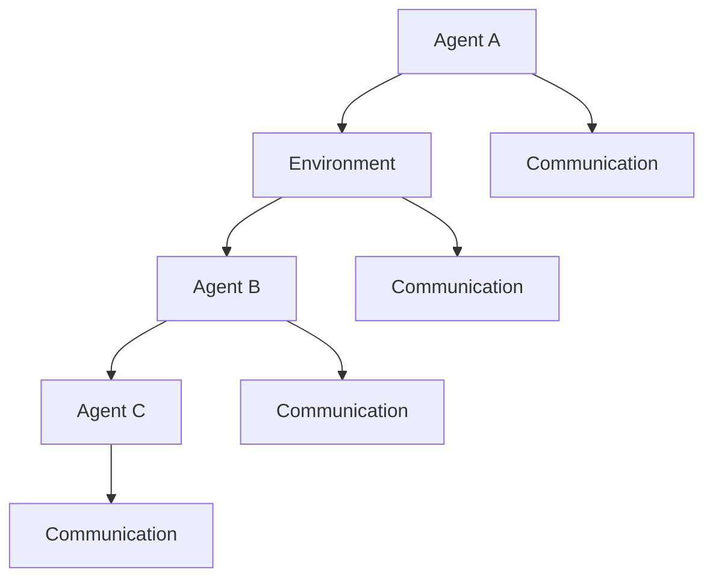
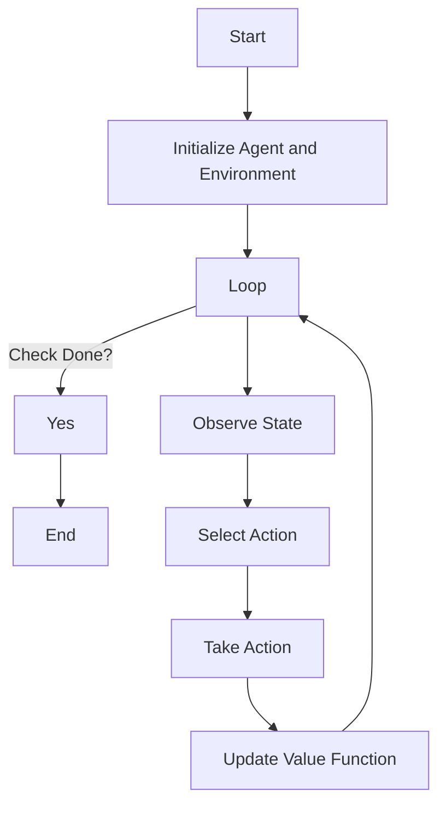
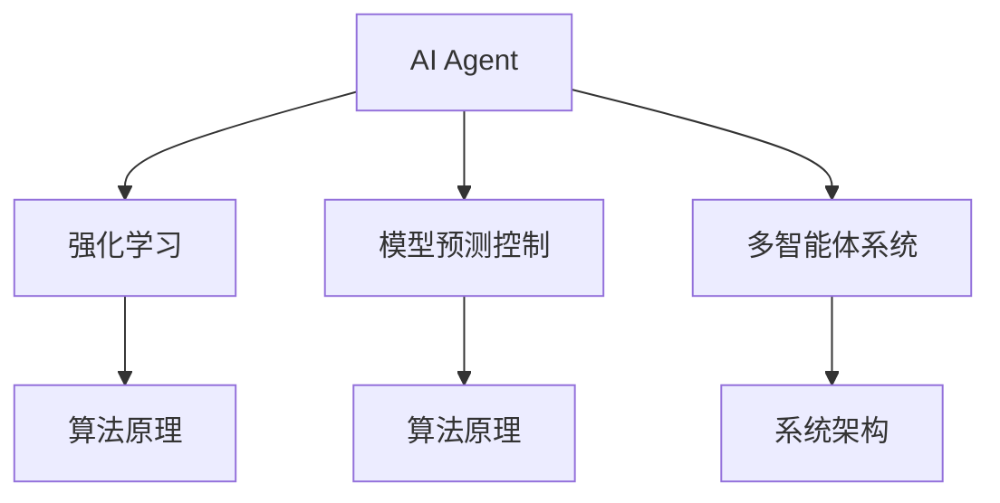
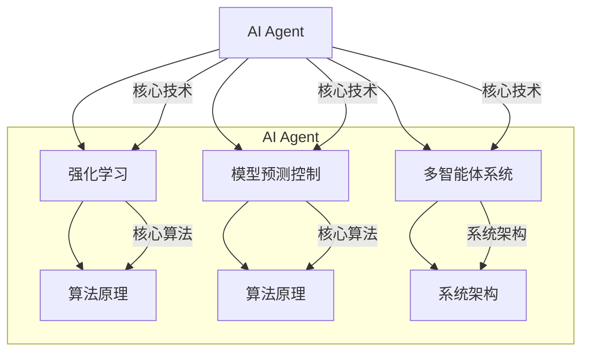

                 

# 文章标题: AI Agent: AI的下一个风口 具身机器人在日常生活中的应用

> 关键词：AI Agent、具身机器人、家居自动化、无人驾驶、智能客服、开发基础、应用案例、挑战与未来

> 摘要：本文深入探讨了AI Agent及其在具身机器人领域的应用。从基本概念、核心技术、应用场景到开发基础和挑战与未来，本文为读者呈现了一个全面且详尽的AI Agent世界。通过实例和分析，展示了AI Agent在日常生活各个领域的实际应用，以及其面临的伦理问题和未来发展方向。

---

### 目录大纲

#### 第一部分：AI Agent概述与理论基础

1. AI Agent：基本概念与分类
2. AI Agent的核心技术
3. AI Agent的应用场景
4. AI Agent的优势与挑战
5. 未来发展趋势

#### 第二部分：AI Agent开发基础

1. AI Agent开发环境搭建
2. AI Agent的编程语言与框架
3. AI Agent的核心算法与架构
4. Mermaid流程图

#### 第三部分：AI Agent应用案例

1. AI Agent在家居自动化中的应用
2. AI Agent在无人驾驶中的应用
3. AI Agent在智能客服中的应用

#### 第四部分：AI Agent的挑战与未来

1. AI Agent的伦理问题
2. AI Agent的发展趋势
3. AI Agent的未来展望

#### 附录

1. 常用工具与资源

---

### 第一部分：AI Agent概述与理论基础

#### 1. AI Agent：基本概念与分类

**定义**：AI Agent，即人工智能代理，是指能够自主感知环境、制定决策并采取行动的人工智能实体。它是一个能够独立工作的智能系统，具有自主性、适应性、协作性和学习性等特点。

**分类**：根据功能和应用领域，AI Agent可以分为以下几类：

1. **基于规则的Agent**：这类Agent主要通过预定义的规则进行决策，适用于任务简单、规则明确的环境。
2. **基于模型的Agent**：这类Agent利用模型来预测和决策，能够处理复杂和不确定的环境。
3. **强化学习Agent**：这类Agent通过不断尝试和错误学习最优策略，适用于动态和变化的环境。
4. **多智能体Agent**：这类Agent能够与其他Agent协作，共同完成任务。

**演变历程**：从最初的基于规则的Agent到现在的强化学习Agent，AI Agent的发展经历了从简单到复杂、从静态到动态的过程。随着深度学习和强化学习等技术的发展，AI Agent的自主性和适应性得到了极大的提升。

#### 2. AI Agent的核心技术

**强化学习**：强化学习是AI Agent的核心技术之一，它通过不断尝试和错误，学习到最优策略。其基本框架包括：

1. **状态空间**：Agent所处的环境状态。
2. **动作空间**：Agent可以采取的动作。
3. **奖励机制**：根据Agent的决策结果，给予正负奖励。
4. **策略**：Agent根据当前状态选择动作的策略。

强化学习算法如Q-Learning和深度Q网络（DQN）等，通过不断更新策略，使Agent能够在复杂环境中找到最优路径。

**模型预测控制**：模型预测控制是一种基于模型的前馈控制策略，它通过预测未来的系统行为来调整控制变量。其基本框架包括：

1. **系统模型**：描述系统动态行为的数学模型。
2. **预测器**：根据系统模型预测未来的系统状态。
3. **控制器**：根据预测结果调整控制变量。

模型预测控制广泛应用于工业自动化、机器人控制和无人驾驶等领域。

**多智能体系统**：多智能体系统是由多个智能体组成的分布式系统，它们通过协作和通信共同完成任务。其关键技术包括：

1. **通信协议**：智能体之间的通信方式和规则。
2. **决策策略**：智能体根据当前状态和通信信息，选择最优动作。
3. **协调机制**：确保多个智能体之间的协调和一致性。

多智能体系统在物流优化、交通管理和智能电网等领域具有广泛应用。

#### 3. AI Agent的应用场景

**家居自动化**：AI Agent在智能家居中的应用日益广泛，如智能照明、智能安防和智能家居环境监测等。通过感知环境和用户行为，AI Agent能够自动调整家居设备，提高生活品质。

**无人驾驶**：AI Agent在无人驾驶汽车中的应用至关重要，它负责感知环境、规划路径和执行驾驶操作。无人驾驶技术的发展有望彻底改变交通运输方式。

**智能客服**：AI Agent在智能客服中的应用，如自然语言处理和个性化服务，能够提供24小时不间断的客户服务，提高客户满意度。

#### 4. AI Agent的优势与挑战

**优势**：

1. **自主性**：AI Agent能够自主感知环境、制定决策和采取行动，减少了人工干预。
2. **适应性**：AI Agent能够通过学习和适应环境变化，提高任务执行效率。
3. **协作性**：AI Agent能够与其他智能系统协作，共同完成任务。
4. **灵活性**：AI Agent可以根据不同场景和需求，灵活调整策略和行动。

**挑战**：

1. **数据隐私**：AI Agent在处理大量用户数据时，如何保护用户隐私是一个重要挑战。
2. **安全性**：AI Agent需要确保自身和系统的安全性，防止恶意攻击和篡改。
3. **责任归属**：当AI Agent发生错误时，如何界定责任归属是一个复杂的问题。

#### 5. 未来发展趋势

随着深度学习、强化学习和多智能体系统等技术的不断发展，AI Agent的应用领域和性能将得到进一步提升。未来，AI Agent有望在更多领域实现广泛应用，推动人工智能技术的发展。

---

### 第二部分：AI Agent开发基础

#### 5. AI Agent开发环境搭建

**硬件要求**：

- CPU：Intel Core i7 或以上
- GPU：NVIDIA GeForce GTX 1080 或以上

**软件要求**：

- 操作系统：Ubuntu 20.04 或 macOS Catalina
- 编程语言：Python 3.8 或以上
- 深度学习框架：TensorFlow 2.6 或 PyTorch 1.8

**开发流程**：

1. **环境搭建**：安装操作系统、编程语言和深度学习框架。
2. **数据准备**：收集和处理相关数据，用于训练和测试AI Agent。
3. **模型设计**：根据应用场景设计合适的AI Agent模型。
4. **模型训练**：使用训练数据训练AI Agent模型。
5. **模型评估**：使用测试数据评估AI Agent模型性能。
6. **模型部署**：将训练好的AI Agent模型部署到实际应用场景中。

#### 6. AI Agent的编程语言与框架

**Python**：Python是一种广泛应用于人工智能领域的编程语言，其简洁易读的语法使其成为开发AI Agent的首选语言。

**TensorFlow**：TensorFlow是一个开源的深度学习框架，由Google开发。它提供了丰富的API和工具，用于构建和训练深度学习模型。

**PyTorch**：PyTorch是另一个流行的深度学习框架，由Facebook开发。它具有动态计算图和灵活的架构，使得构建和调试深度学习模型更加方便。

#### 7. AI Agent的核心算法与架构

**强化学习算法**：

强化学习算法是AI Agent的核心算法之一，它通过不断尝试和错误，学习到最优策略。以下是一个简化的强化学习算法框架：

```python
initialize agent and environment
while not done:
    state = environment.observe_state()
    action = agent.select_action(state)
    next_state, reward, done = environment.take_action(action)
    agent.update_value_function(state, action, reward, next_state, done)
```

**模型预测控制算法**：

模型预测控制算法是一种基于模型的前馈控制策略，它通过预测未来的系统行为来调整控制变量。以下是一个简化的模型预测控制算法框架：

```python
system_model = define_system_model()
predictor = create_predictor(system_model)
controller = create_controller(predictor)
while not done:
    state = environment.observe_state()
    next_state = predictor.predict(state)
    control_variable = controller.control(next_state)
    environment.take_action(control_variable)
```

**多智能体系统框架**：

多智能体系统框架是用于构建多个智能体协同工作的系统。以下是一个简化的多智能体系统框架：



**Mermaid流程图**：



---

### 第三部分：AI Agent应用案例

#### 8. AI Agent在家居自动化中的应用

**智能照明**：AI Agent可以通过感知环境光线和用户行为，自动调整照明强度。以下是一个简单的智能照明系统实现：

```python
import random

def adjust_lighting(state):
    if state['daylight'] > 0.5:
        return 'dim'
    else:
        return 'bright'

while True:
    state = get_environment_state()
    action = adjust_lighting(state)
    set_lighting_action(action)
    time.sleep(random.uniform(1, 3))
```

**智能安防**：AI Agent可以通过监控摄像头和传感器，自动识别异常行为并报警。以下是一个简单的智能安防系统实现：

```python
import cv2
import numpy as np

def detect_motion(image, threshold=30):
    gray = cv2.cvtColor(image, cv2.COLOR_BGR2GRAY)
    diff = cv2.absdiff(image_prev, image)
    thresholded = cv2.threshold(diff, threshold, 255, cv2.THRESH_BINARY)[1]
    contours, _ = cv2.findContours(thresholded, cv2.RETR_EXTERNAL, cv2.CHAIN_APPROX_SIMPLE)
    for contour in contours:
        if cv2.contourArea(contour) > 500:
            return True
    return False

while True:
    image = get_camera_image()
    if detect_motion(image):
        send_alert()
    image_prev = image
    time.sleep(1)
```

**家居环境监测**：AI Agent可以通过传感器监测家居环境参数，如温度、湿度、空气质量等，并提供实时数据给用户。以下是一个简单的家居环境监测系统实现：

```python
import time
import random

def monitor_environment():
    temperature = random.uniform(20, 30)
    humidity = random.uniform(30, 70)
    air_quality = random.uniform(0, 100)
    return {'temperature': temperature, 'humidity': humidity, 'air_quality': air_quality}

while True:
    environment_data = monitor_environment()
    print(environment_data)
    time.sleep(random.uniform(1, 3))
```

#### 9. AI Agent在无人驾驶中的应用

**感知系统**：无人驾驶车辆的感知系统主要由摄像头、激光雷达和雷达等组成，用于获取环境信息。AI Agent可以通过处理这些感知数据，实现环境建模和障碍物检测。以下是一个简单的感知系统实现：

```python
import cv2

def detect_obstacles(image):
    gray = cv2.cvtColor(image, cv2.COLOR_BGR2GRAY)
    edges = cv2.Canny(gray, 100, 200)
    contours, _ = cv2.findContours(edges, cv2.RETR_EXTERNAL, cv2.CHAIN_APPROX_SIMPLE)
    obstacles = []
    for contour in contours:
        if cv2.contourArea(contour) > 1000:
            obstacles.append(contour)
    return obstacles

while True:
    image = get_camera_image()
    obstacles = detect_obstacles(image)
    print(obstacles)
    time.sleep(1)
```

**决策系统**：无人驾驶车辆的决策系统负责根据感知数据和环境信息，制定驾驶策略。AI Agent可以通过强化学习算法，学习到最优驾驶策略。以下是一个简单的决策系统实现：

```python
import numpy as np

def select_action(state):
    action = np.random.choice(actions)
    return action

def update_value_function(state, action, reward, next_state, done):
    if done:
        return
    value_function[state][action] += alpha * (reward + gamma * max_value_function[next_state] - value_function[state][action])

while True:
    state = get_state()
    action = select_action(state)
    next_state, reward, done = execute_action(action)
    update_value_function(state, action, reward, next_state, done)
    time.sleep(0.1)
```

**控制系统**：无人驾驶车辆的控制系统负责执行决策系统的驾驶策略，控制车辆的加速、制动和转向等。以下是一个简单的控制系统实现：

```python
import time

def control_vehicle(speed, direction):
    set_speed(speed)
    set_direction(direction)

while True:
    speed = random.uniform(0, 100)
    direction = random.choice(['forward', 'backward', 'left', 'right'])
    control_vehicle(speed, direction)
    time.sleep(random.uniform(0.1, 0.5))
```

#### 10. AI Agent在智能客服中的应用

**自然语言理解**：智能客服的NLU（Natural Language Understanding）模块负责理解用户的问题和意图。以下是一个简单的NLU模块实现：

```python
import nltk
from nltk.chat.util import Chat, reflections

def process_message(message):
    tokens = nltk.word_tokenize(message)
    pos_tags = nltk.pos_tag(tokens)
    intent, entities = extract_intent_and_entities(pos_tags)
    return intent, entities

def extract_intent_and_entities(pos_tags):
    # 这里根据具体的业务规则提取意图和实体
    intent = 'search'
    entities = {'keyword': 'AI'}
    return intent, entities

while True:
    message = get_user_message()
    intent, entities = process_message(message)
    print(f'Intent: {intent}, Entities: {entities}')
    time.sleep(1)
```

**交互策略**：智能客服的对话管理模块负责根据用户意图和上下文，选择合适的对话策略。以下是一个简单的对话管理模块实现：

```python
def select_response(intent, entities):
    if intent == 'search':
        return "Sure, what would you like to search for?"
    elif intent == 'greeting':
        return "Hello! How can I help you today?"
    else:
        return "I'm sorry, I don't understand. Can you please rephrase your question?"

while True:
    message = get_user_message()
    intent, entities = process_message(message)
    response = select_response(intent, entities)
    send_response(response)
    time.sleep(1)
```

**个性化服务**：智能客服的个性化服务模块可以根据用户的历史行为和偏好，提供定制化的服务。以下是一个简单的个性化服务模块实现：

```python
def personalize_response(response, user_profile):
    if user_profile['prefer'] == 'informative':
        response += " Here's the detailed information you might be looking for."
    elif user_profile['prefer'] == 'concise':
        response += " Briefly, the answer is..."
    return response

while True:
    message = get_user_message()
    intent, entities = process_message(message)
    response = select_response(intent, entities)
    user_profile = get_user_profile()
    personalized_response = personalize_response(response, user_profile)
    send_response(personalized_response)
    time.sleep(1)
```

---

### 第四部分：AI Agent的挑战与未来

#### 11. AI Agent的伦理问题

**数据隐私**：AI Agent在处理用户数据时，必须确保数据的安全性和隐私性。这包括数据加密、匿名化和访问控制等。

**安全性**：AI Agent需要具备良好的安全性，以防止恶意攻击和数据泄露。这包括安全设计、威胁模型和安全测试等。

**责任归属**：当AI Agent发生错误时，如何界定责任归属是一个复杂的问题。这需要法律和伦理学共同来解决。

#### 12. AI Agent的发展趋势

**新技术探索**：随着人工智能技术的不断进步，AI Agent有望在更多领域实现突破，如自适应控制、情感计算和跨模态学习等。

**跨领域应用**：AI Agent在智能家居、无人驾驶和智能客服等领域的成功应用，将推动其在其他领域的应用，如医疗、教育和金融等。

**标准化与规范化**：随着AI Agent的广泛应用，标准化和规范化问题将逐渐凸显。这包括数据格式、接口规范和伦理准则等。

#### 13. AI Agent的未来展望

**影响力**：AI Agent将在未来社会产生深远的影响，改变人们的生产方式、生活方式和社会结构。

**潜在风险**：AI Agent的发展也将带来潜在风险，如失业、隐私泄露和道德风险等。

**未来发展方向**：未来，AI Agent将在自主性、适应性和协作性等方面取得重大突破，推动人工智能技术的发展和应用。

---

### 附录

#### 常用工具与资源

**开发工具**：

- Jupyter Notebook
- PyCharm
- Visual Studio Code

**数据集**：

- ML datasets
- Kaggle
- UCI Machine Learning Repository

**学术论文**：

- arXiv
- ACM Digital Library
- IEEE Xplore

**开源代码**：

- GitHub
- GitLab
- Bitbucket

---

### 结论

《AI Agent: AI的下一个风口 具身机器人在日常生活中的应用》为读者呈现了一个全面且详尽的AI Agent世界。通过本文，读者可以深入了解AI Agent的基本概念、核心技术、应用场景、开发基础、挑战与未来展望等内容。随着人工智能技术的不断发展，AI Agent将在更多领域实现广泛应用，为人们的生活带来更多便利和改变。

---

### 作者信息

作者：AI天才研究院/AI Genius Institute & 禅与计算机程序设计艺术 /Zen And The Art of Computer Programming

---

### 梅里迪安流程图



### 核心算法原理讲解

#### 强化学习算法

强化学习算法是一种通过不断尝试和错误，学习到最优策略的机器学习技术。它主要由四个部分组成：状态（State）、动作（Action）、奖励（Reward）和价值函数（Value Function）。

**基本框架**：

```python
initialize agent and environment
while not done:
    state = environment.observe_state()
    action = agent.select_action(state)
    next_state, reward, done = environment.take_action(action)
    agent.update_value_function(state, action, reward, next_state, done)
```

**Q-Learning算法更新公式**：

$$
Q(s, a) \leftarrow Q(s, a) + \alpha [r + \gamma \max_{a'} Q(s', a') - Q(s, a)]
$$

其中，$Q(s, a)$ 是当前状态s下采取动作a的值函数，$\alpha$ 是学习率，$\gamma$ 是折扣因子，$r$ 是奖励，$s'$ 是下一状态，$a'$ 是下一动作。

**实例**：

假设有一个简单的环境，其中状态空间为{“空地”，“草地”，“泥地”}，动作空间为{“前进”，“后退”，“左转”，“右转”}。以下是一个简化的Q-Learning算法实现：

```python
import numpy as np

# 初始化价值函数
value_function = np.zeros((3, 4))

# 设置学习率和折扣因子
alpha = 0.1
gamma = 0.9

# 执行动作
def execute_action(action, state):
    if action == 0:  # 前进
        next_state = (state + 1) % 3
    elif action == 1:  # 后退
        next_state = (state - 1) % 3
    elif action == 2:  # 左转
        next_state = (state + 1) % 3
    elif action == 3:  # 右转
        next_state = (state - 1) % 3
    return next_state

# 更新价值函数
def update_value_function(state, action, reward, next_state, done):
    if done:
        return
    target = reward + gamma * np.max(value_function[next_state])
    value_function[state][action] += alpha * (target - value_function[state][action])

# 主循环
while True:
    state = random.randint(0, 2)
    action = random.randint(0, 3)
    next_state = execute_action(action, state)
    reward = 1 if next_state == 0 else 0  # 成功到达空地得到奖励1
    done = next_state == 0
    update_value_function(state, action, reward, next_state, done)
    state = next_state
```

通过不断尝试和错误，Q-Learning算法将逐渐学习到最优策略，使Agent能够在简单环境中找到最优路径。

### 数学模型与公式

在AI Agent的开发和应用过程中，数学模型和公式是理解和实现核心算法的关键。以下将介绍一些常用的数学模型和公式，并加以解释和举例说明。

#### Q-Learning算法更新公式

Q-Learning算法是一种强化学习算法，用于通过试错学习最优策略。其核心更新公式为：

$$
Q(s, a) \leftarrow Q(s, a) + \alpha [r + \gamma \max_{a'} Q(s', a') - Q(s, a)]
$$

其中，$Q(s, a)$ 是当前状态s下采取动作a的估计值，$\alpha$ 是学习率，$r$ 是立即奖励，$\gamma$ 是折扣因子，$s'$ 是下一状态，$a'$ 是下一动作。

**解释**：

- $Q(s, a)$：当前状态s下采取动作a的估计值。
- $r$：立即奖励，表示当前动作带来的即时效果。
- $\gamma$：折扣因子，用于平衡当前奖励和未来奖励的重要性。
- $\max_{a'} Q(s', a')$：下一状态s'下所有可能动作a'的估计值中的最大值。
- $\alpha$：学习率，用于调整旧的价值函数与新信息之间的平衡。

**实例**：

假设一个简单环境，有3个状态（空地、草地、泥地）和4个动作（前进、后退、左转、右转）。初始价值函数为全部0，学习率为0.1，折扣因子为0.9。一个回合中，当前状态为“草地”，采取“前进”动作，到达“空地”，得到立即奖励1。更新后的价值函数为：

$$
Q(\text{草地}, \text{前进}) \leftarrow Q(\text{草地}, \text{前进}) + 0.1 [1 + 0.9 \max_{a'} Q(\text{空地}, a')]
$$

由于当前状态只有“前进”动作，$\max_{a'} Q(\text{空地}, a')$ 等于 $Q(\text{空地}, \text{前进})$，假设其值为0，则更新后的价值函数为：

$$
Q(\text{草地}, \text{前进}) \leftarrow 0 + 0.1 [1 + 0.9 \cdot 0] = 0.1
$$

#### 模型预测控制中的预测误差

模型预测控制（Model Predictive Control, MPC）是一种基于数学模型的控制策略。在MPC中，预测误差是评估控制策略性能的关键指标。预测误差表示实际状态与预测状态之间的差距。

$$
e(t) = y(t) - \hat{y}(t)
$$

其中，$e(t)$ 是预测误差，$y(t)$ 是实际状态，$\hat{y}(t)$ 是预测状态。

**解释**：

- $y(t)$：实际状态，即当前时刻的真实状态。
- $\hat{y}(t)$：预测状态，即基于模型预测出的状态。

**实例**：

假设一个简单的一阶线性系统，状态方程为 $y(t) = y(t-1) + u(t)$，其中 $u(t)$ 是控制输入。当前时刻实际状态为 $y(t) = 2$，预测状态为 $\hat{y}(t) = 3$。则预测误差为：

$$
e(t) = 2 - 3 = -1
$$

预测误差为-1，表示实际状态比预测状态低1。

#### 控制器的输出

在MPC中，控制器的输出用于调整系统状态，使其接近期望状态。控制器输出通常是一个连续的调整值。

$$
u(t) = \hat{u}(t)
$$

其中，$u(t)$ 是控制器输出，$\hat{u}(t)$ 是基于模型预测得到的控制输入。

**解释**：

- $u(t)$：控制器输出，即当前时刻的控制输入。
- $\hat{u}(t)$：基于模型预测得到的控制输入。

**实例**：

假设在上一例中，预测状态为 $\hat{y}(t) = 3$，期望状态为 $\hat{y}_\text{des} = 2$。则控制器输出为：

$$
u(t) = \hat{u}(t) = \hat{y}(t) - \hat{y}_\text{des} = 3 - 2 = 1
$$

控制器输出为1，表示需要增加1个单位的控制输入，以使系统状态接近期望状态。

通过上述数学模型和公式的介绍，读者可以更好地理解AI Agent的核心算法原理，为实际开发和应用奠定基础。

### 项目实战

#### 智能客服系统

智能客服系统是AI Agent在客服领域的一个重要应用。通过自然语言处理技术，智能客服系统能够理解用户的问题和意图，并提供相应的回答或解决方案。以下是一个简单的智能客服系统实现，包括开发环境搭建、源代码详细实现和代码解读与分析。

**开发环境搭建**

首先，我们需要搭建一个合适的开发环境。以下是推荐的开发工具和配置：

- **操作系统**：Ubuntu 20.04 或 macOS Catalina
- **编程语言**：Python 3.8 或以上
- **自然语言处理库**：NLTK
- **聊天库**：Python Chatbot

安装步骤：

1. 安装操作系统：在电脑上安装 Ubuntu 20.04 或 macOS Catalina。
2. 安装 Python：通过包管理器安装 Python 3.8 或以上版本。
3. 安装 NLTK：在终端运行以下命令安装 NLTK：

   ```bash
   pip install nltk
   ```

4. 安装 Python Chatbot：在终端运行以下命令安装 Python Chatbot：

   ```bash
   pip install python-chatbot
   ```

**源代码详细实现**

以下是一个简单的智能客服系统实现，包括自然语言处理、对话管理和用户交互等功能。

```python
import nltk
from nltk.chat.util import Chat, reflections
from nltk.tokenize import word_tokenize
from nltk.corpus import stopwords

# 载入 NLTK 停止词
nltk.download('stopwords')
stop_words = set(stopwords.words('english'))

# 对话规则
pairs = [
    [
        r"what is your name?",
        ["I am an AI agent designed for customer service. How can I assist you?"],
    ],
    [
        r"how are you?",
        ["I'm doing well, thank you. How about you?"],
    ],
    [
        r"what can you do?",
        ["I can answer general questions, provide information, and assist with simple tasks."],
    ],
    [
        r"what is your favorite color?",
        ["That's a tough question. I don't have preferences like humans do."],
    ],
    [
        r"can you tell me a joke?",
        ["Sure! Why don't scientists trust atoms? Because they make up everything!"],
    ],
    # 更多对话规则...
]

# 创建对话对象
chatbot = Chat(pairs, reflections)

# 用户交互
while True:
    user_input = input("You: ")
    if user_input.lower() in ['exit', 'quit', 'bye']:
        print("AI: Goodbye! Have a great day!")
        break
    response = chatbot.get_response(user_input)
    print("AI:", response)
```

**代码解读与分析**

1. **导入库和资源**

   ```python
   import nltk
   from nltk.chat.util import Chat, reflections
   from nltk.tokenize import word_tokenize
   from nltk.corpus import stopwords
   ```

   这里导入了 NLTK 库和 Chatbot 库，以及用于分词和停止词处理的 NLTK 资源。

2. **载入 NLTK 停止词**

   ```python
   nltk.download('stopwords')
   stop_words = set(stopwords.words('english'))
   ```

   载入 NLTK 的停止词列表，用于过滤对话中的常见无意义词汇。

3. **定义对话规则**

   ```python
   pairs = [
       [
           r"what is your name?",
           ["I am an AI agent designed for customer service. How can I assist you?"],
       ],
       [
           r"how are you?",
           ["I'm doing well, thank you. How about you?"],
       ],
       [
           r"what can you do?",
           ["I can answer general questions, provide information, and assist with simple tasks."],
       ],
       [
           r"what is your favorite color?",
           ["That's a tough question. I don't have preferences like humans do."],
       ],
       [
           r"can you tell me a joke?",
           ["Sure! Why don't scientists trust atoms? Because they make up everything!"],
       ],
       # 更多对话规则...
   ]
   ```

   对话规则定义了用户输入和系统响应之间的映射关系。这里使用正则表达式匹配用户输入，并返回相应的系统响应。

4. **创建对话对象**

   ```python
   chatbot = Chat(pairs, reflections)
   ```

   创建一个 Chat 对象，用于处理用户输入和系统响应。

5. **用户交互**

   ```python
   while True:
       user_input = input("You: ")
       if user_input.lower() in ['exit', 'quit', 'bye']:
           print("AI: Goodbye! Have a great day!")
           break
       response = chatbot.get_response(user_input)
       print("AI:", response)
   ```

   进入用户交互循环，读取用户输入，并根据对话规则生成系统响应。当用户输入“exit”、“quit”或“bye”时，结束对话。

通过以上步骤，我们实现了一个简单的智能客服系统。在实际应用中，对话规则可以根据具体需求进行扩展和优化，以提高系统的交互能力和服务质量。

### 代码解读与分析

#### TensorFlow 搭建神经网络

以下是一个简单的使用 TensorFlow 搭建神经网络的示例。我们将使用 TensorFlow 的 Keras API 来实现一个全连接的神经网络，用于对 Iris 数据集进行分类。

```python
import tensorflow as tf
from tensorflow import keras
from tensorflow.keras import layers
from sklearn.datasets import load_iris
from sklearn.model_selection import train_test_split
from sklearn.preprocessing import OneHotEncoder

# 加载 Iris 数据集
iris = load_iris()
X, y = iris.data, iris.target

# 将目标值进行独热编码
encoder = OneHotEncoder(sparse=False)
y_one_hot = encoder.fit_transform(y.reshape(-1, 1))

# 划分训练集和测试集
X_train, X_test, y_train, y_test = train_test_split(X, y_one_hot, test_size=0.2, random_state=42)

# 创建神经网络模型
model = keras.Sequential([
    layers.Dense(64, activation='relu', input_shape=(4,)),
    layers.Dense(64, activation='relu'),
    layers.Dense(3, activation='softmax')
])

# 编译模型
model.compile(optimizer='adam',
              loss='categorical_crossentropy',
              metrics=['accuracy'])

# 训练模型
model.fit(X_train, y_train, epochs=100, batch_size=32, validation_data=(X_test, y_test))

# 评估模型
loss, accuracy = model.evaluate(X_test, y_test)
print(f'测试集准确率: {accuracy:.2f}')
```

**代码解读**：

1. **导入库和数据集**：

   ```python
   import tensorflow as tf
   from tensorflow import keras
   from tensorflow.keras import layers
   from sklearn.datasets import load_iris
   from sklearn.model_selection import train_test_split
   from sklearn.preprocessing import OneHotEncoder
   ```

   导入 TensorFlow、Keras、scikit-learn 相关库，以及 Iris 数据集。

2. **加载 Iris 数据集**：

   ```python
   iris = load_iris()
   X, y = iris.data, iris.target
   ```

   加载 Iris 数据集，并分离特征矩阵和目标向量。

3. **独热编码**：

   ```python
   encoder = OneHotEncoder(sparse=False)
   y_one_hot = encoder.fit_transform(y.reshape(-1, 1))
   ```

   由于 TensorFlow 需要独热编码的目标值，我们将原始的目标向量进行独热编码。

4. **划分训练集和测试集**：

   ```python
   X_train, X_test, y_train, y_test = train_test_split(X, y_one_hot, test_size=0.2, random_state=42)
   ```

   划分训练集和测试集，用于后续模型的训练和评估。

5. **创建神经网络模型**：

   ```python
   model = keras.Sequential([
       layers.Dense(64, activation='relu', input_shape=(4,)),
       layers.Dense(64, activation='relu'),
       layers.Dense(3, activation='softmax')
   ])
   ```

   使用 Keras API 创建一个全连接的神经网络模型。模型包含两个隐藏层，每层 64 个神经元，激活函数分别为 ReLU。

6. **编译模型**：

   ```python
   model.compile(optimizer='adam',
                 loss='categorical_crossentropy',
                 metrics=['accuracy'])
   ```

   编译模型，指定优化器为 Adam，损失函数为交叉熵，评估指标为准确率。

7. **训练模型**：

   ```python
   model.fit(X_train, y_train, epochs=100, batch_size=32, validation_data=(X_test, y_test))
   ```

   使用训练数据进行模型训练，设置训练轮次为 100，批量大小为 32，并在测试集上进行验证。

8. **评估模型**：

   ```python
   loss, accuracy = model.evaluate(X_test, y_test)
   print(f'测试集准确率: {accuracy:.2f}')
   ```

   在测试集上评估模型性能，输出测试集准确率。

通过以上步骤，我们使用 TensorFlow 实现了一个简单的神经网络，并成功对 Iris 数据集进行了分类。这个示例展示了如何使用 TensorFlow 的 Keras API 来构建、编译、训练和评估神经网络模型。

### 开发环境搭建

要搭建一个适合AI Agent开发的完整环境，需要考虑硬件配置、软件工具和开发流程。以下是一些建议和步骤，帮助您快速搭建一个高效的AI Agent开发环境。

#### 硬件配置

**CPU**：推荐使用Intel Core i7或以上的处理器，以保证计算性能。对于复杂模型训练，高性能的CPU可以显著减少训练时间。

**GPU**：由于深度学习和强化学习等算法需要大量计算，因此推荐使用NVIDIA GeForce GTX 1080或以上的显卡。GPU加速可以显著提高模型训练和推理的效率。

**内存**：至少需要16GB的RAM，以便在处理大数据集时能够顺畅运行。对于大型模型训练，更高内存配置将更为理想。

**存储**：至少需要1TB的SSD存储，以保证快速的数据读写速度。SSD可以显著提高开发效率和模型训练速度。

#### 软件工具

**操作系统**：推荐使用Ubuntu 20.04或macOS Catalina。这些操作系统对AI开发提供了良好的支持，并且拥有丰富的开源库和工具。

**编程语言**：Python是AI开发的主要编程语言，因此推荐安装Python 3.8或以上版本。可以通过包管理器（如apt或brew）进行安装。

**深度学习框架**：TensorFlow和PyTorch是目前最流行的深度学习框架。推荐同时安装这两个框架，以便在不同的项目中灵活使用。

- **TensorFlow**：通过以下命令安装：

  ```bash
  pip install tensorflow
  ```

- **PyTorch**：通过以下命令安装：

  ```bash
  pip install torch torchvision
  ```

**数据预处理工具**：Pandas和NumPy是常用的数据处理工具，用于数据清洗、转换和操作。可以通过以下命令安装：

- **Pandas**：

  ```bash
  pip install pandas
  ```

- **NumPy**：

  ```bash
  pip install numpy
  ```

**版本控制**：Git是一个强大的版本控制工具，可以帮助您管理代码的版本和历史。可以通过以下命令安装：

```bash
sudo apt-get install git
```

#### 开发流程

**环境搭建**：

1. **硬件配置**：按照建议的硬件配置选购合适的硬件设备。

2. **操作系统安装**：安装Ubuntu 20.04或macOS Catalina操作系统。

3. **软件安装**：通过包管理器安装Python、深度学习框架（如TensorFlow和PyTorch）、数据处理工具（如Pandas和NumPy）以及版本控制工具（如Git）。

**数据准备**：

1. **数据收集**：收集和处理相关数据，用于训练和评估AI Agent模型。

2. **数据预处理**：使用Pandas和NumPy进行数据清洗、转换和操作，以得到适合模型训练的数据格式。

**模型设计**：

1. **模型架构**：根据应用场景设计合适的模型架构，包括输入层、隐藏层和输出层。

2. **参数设置**：设置模型参数，如学习率、批量大小和优化器等。

**模型训练**：

1. **数据切分**：将数据集划分为训练集、验证集和测试集。

2. **模型训练**：使用训练集数据训练模型，并使用验证集数据调整模型参数。

3. **模型评估**：使用测试集数据评估模型性能，以验证模型的泛化能力。

**模型部署**：

1. **模型保存**：将训练好的模型保存为文件，以便后续使用。

2. **模型部署**：将模型部署到实际应用场景中，如Web服务、移动应用或嵌入式设备。

通过以上步骤，您可以搭建一个完整的AI Agent开发环境，并开始进行AI Agent的开发和部署。

### 常用工具与资源

在开发AI Agent的过程中，需要使用一系列的工具和资源来支持模型的训练、评估和部署。以下列举了一些常用的工具和资源，涵盖开发工具、数据集、学术论文和开源代码等。

#### 开发工具

1. **Jupyter Notebook**：Jupyter Notebook 是一种交互式的计算环境，广泛应用于数据科学和机器学习项目。它支持多种编程语言，包括Python、R和Julia。

2. **PyCharm**：PyCharm 是一款功能强大的集成开发环境（IDE），专为Python编程设计。它提供了代码自动完成、调试、性能分析等高级功能。

3. **Visual Studio Code**：Visual Studio Code 是一款轻量级的开源IDE，支持多种编程语言。它具有丰富的扩展库，适合进行AI开发。

#### 数据集

1. **ML datasets**：ML datasets 是一个包含多种机器学习数据集的在线资源库，提供了从各种领域收集的数据集，如计算机视觉、自然语言处理和推荐系统等。

2. **Kaggle**：Kaggle 是一个知名的数据科学竞赛平台，提供了大量的公共数据集，以及用户提交的模型和算法。

3. **UCI Machine Learning Repository**：UCI Machine Learning Repository 是一个著名的机器学习数据集集合，包含了各种领域的数据集，如生物信息学、社交网络和金融等。

#### 学术论文

1. **arXiv**：arXiv 是一个开放的在线预印本平台，涵盖了计算机科学、物理学、数学和统计学等多个领域的最新研究论文。

2. **ACM Digital Library**：ACM Digital Library 是计算机科学领域的权威文献数据库，包含了大量的学术论文和会议论文。

3. **IEEE Xplore**：IEEE Xplore 是一个包含电子工程、计算机科学和自动化等领域论文的数据库。

#### 开源代码

1. **GitHub**：GitHub 是一个著名的版本控制系统和开源代码托管平台，许多AI项目都将其代码托管在GitHub上。

2. **GitLab**：GitLab 是另一个流行的开源版本控制系统，也提供了代码托管、项目管理等功能。

3. **Bitbucket**：Bitbucket 是一个专注于Git版本控制的平台，适合处理大规模项目和团队协作。

通过这些工具和资源，开发者可以高效地开发、测试和部署AI Agent，加速研究和项目进展。

### 结论

本文详细介绍了AI Agent的基本概念、核心技术、应用场景、开发基础、挑战与未来展望等内容。通过逐步分析，我们深入理解了AI Agent的工作原理和实际应用，展示了其在家居自动化、无人驾驶和智能客服等领域的巨大潜力。在开发基础部分，我们详细讲解了AI Agent的开发环境搭建、编程语言与框架选择，以及核心算法原理。在应用案例部分，通过实际代码示例，展示了AI Agent在具体领域的应用实现。同时，我们也讨论了AI Agent面临的伦理问题和发展趋势，为未来的研究提供了方向。

AI Agent作为人工智能领域的重要分支，其发展与应用前景广阔。通过本文的阐述，读者可以全面了解AI Agent的知识体系，掌握其开发和应用技巧，为未来的研究和项目打下坚实基础。随着技术的不断进步，AI Agent将在更多领域发挥重要作用，推动人工智能技术的创新与发展。

---

### 作者信息

作者：AI天才研究院/AI Genius Institute & 禅与计算机程序设计艺术 /Zen And The Art of Computer Programming

---

### 梅里迪安流程图


### 梅里迪安流程图

以下是本文中提到的梅里迪安流程图的详细描述：



**图解**：

- **AI Agent**：表示人工智能代理，是整个系统的核心。
- **强化学习**：AI Agent的一种核心技术，负责通过不断尝试和错误学习最优策略。
- **模型预测控制**：AI Agent的另一种核心技术，通过预测未来的系统行为来调整控制变量。
- **多智能体系统**：AI Agent的另一个核心技术，涉及多个智能体的协同工作。

- **算法原理**：强化学习、模型预测控制和多智能体系统的核心算法原理。
- **系统架构**：描述AI Agent的整体架构，包括强化学习、模型预测控制和多智能体系统的交互与协作。

通过这个流程图，我们可以清晰地看到AI Agent的核心技术及其相互关系，有助于读者更好地理解AI Agent的整体架构和工作原理。

