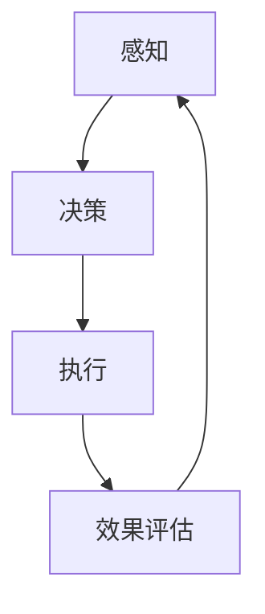

                 

# AI Agent: AI的下一个风口 智能体的定义与特点

> 关键词：AI Agent、智能体、定义、特点、技术原理、应用领域、开发实践

> 摘要：本文将深入探讨AI Agent（智能体）的概念、特点、技术原理及其应用领域。通过一步一步的分析推理，我们不仅会了解AI Agent的基础知识，还将探索其开发实践和未来发展趋势。这篇文章旨在为读者提供一个全面而深入的视角，理解AI Agent在人工智能领域中的重要性及其潜在影响。

## 第一部分：AI Agent基础知识

### 第1章：AI Agent概述

#### 1.1 AI Agent的定义与基本特点

##### 1.1.1 AI Agent的定义
AI Agent，即人工智能代理，是一种能够在其环境中自主感知、决策并采取行动的智能体。它不仅能够根据外部环境的变化调整自身的行为，还能够通过学习不断优化自己的决策过程。这种自主性和学习能力是AI Agent的核心特点。

##### 1.1.2 AI Agent的基本特点
- **自主性**：AI Agent不需要外部干预，可以自主感知环境、做出决策和执行行动。
- **学习能力**：AI Agent能够通过与环境互动，不断学习新的知识和技能，优化其行为。
- **适应性**：AI Agent能够根据不同的环境和目标，灵活调整自己的行为策略。

#### 1.2 AI Agent的分类

AI Agent可以根据学习方式和技术实现的不同，分为以下几类：

##### 1.2.1 监督学习Agent
监督学习Agent利用已标记的数据集进行学习，从而预测新的输入对应的输出。这种Agent广泛应用于图像识别、语音识别等领域。

##### 1.2.2 无监督学习Agent
无监督学习Agent在无标记数据的情况下，通过学习数据之间的分布和模式来自动发现数据中的结构和规律。聚类分析和降维分析是其典型的应用场景。

##### 1.2.3 强化学习Agent
强化学习Agent通过与环境的交互，不断学习和优化其行为策略，以实现长期的奖励最大化。自动驾驶和游戏AI是其典型的应用领域。

### 第2章：AI Agent的技术原理

#### 2.1 感知环境

##### 2.1.1 传感器类型
AI Agent通过多种类型的传感器，如摄像头、麦克风、温度传感器等，来感知环境。这些传感器收集的数据是AI Agent做出决策的基础。

##### 2.1.2 数据预处理
数据预处理是确保传感器数据质量的关键步骤。这包括去除噪声、归一化、特征提取等操作，以提高AI Agent对环境的感知准确性。

#### 2.2 行为决策

##### 2.2.1 决策模型
决策模型是指AI Agent在感知到环境信息后，通过某种算法来选择最佳行动的策略。常见的决策模型包括基于规则的系统、基于概率的模型和基于机器学习的模型。

##### 2.2.2 强化学习算法
强化学习算法是AI Agent进行行为决策的一种重要方法。它通过试错学习，不断调整行动策略，以最大化长期奖励。Q-learning和SARSA是两种常见的强化学习算法。

#### 2.3 行动执行

##### 2.3.1 执行器
执行器是AI Agent将决策转化为实际行动的部件。例如，在自动驾驶中，执行器可以是电机、刹车和转向系统。

##### 2.3.2 行动效果评估
AI Agent通过评估行动效果，来调整和优化其行为策略。效果评估通常基于设定的性能指标，如准确率、响应时间等。

### 第3章：AI Agent的应用领域

#### 3.1 自动驾驶

##### 3.1.1 自动驾驶系统的组成
自动驾驶系统由感知、决策、执行三个核心模块组成。感知模块负责收集环境数据，决策模块基于感知数据生成行动策略，执行模块将策略转化为实际行动。

##### 3.1.2 自动驾驶技术挑战
自动驾驶技术面临诸多挑战，包括复杂环境建模、决策实时性、系统可靠性等。这些挑战要求AI Agent具备高水平的感知能力、决策能力和执行能力。

#### 3.2 人机交互

##### 3.2.1 人机交互的发展历程
人机交互经历了从简单的命令行界面到图形用户界面，再到自然语言交互的演变。自然语言交互使得人机交互更加直观、自然。

##### 3.2.2 智能助手
智能助手是一种典型的人机交互应用。通过语音识别和自然语言处理，智能助手能够理解并响应用户的指令，提供便捷的服务。

#### 3.3 游戏智能

##### 3.3.1 游戏智能的发展
游戏智能从简单的规则匹配发展到基于机器学习、强化学习等先进算法的智能体。这些算法使得游戏AI更加智能、自适应。

##### 3.3.2 游戏开发中的AI应用
游戏开发中广泛应用AI技术，如智能NPC、游戏平衡性调整等。这些应用提升了游戏的互动性和趣味性。

## 第二部分：AI Agent的开发实践

### 第4章：AI Agent开发环境搭建

#### 4.1 环境配置
搭建AI Agent开发环境需要安装Python、TensorFlow等基础软件。以下是一个简单的步骤说明：

1. **安装Python**：下载并安装Python，确保版本为3.7或更高。
2. **安装pip**：使用Python安装pip，pip是Python的包管理工具。
3. **安装TensorFlow**：使用pip安装TensorFlow，命令为`pip install tensorflow`。

#### 4.2 开发工具
常见的AI Agent开发工具包括Unity、Pygame等。以下是选择和使用这些工具的指导：

##### 4.2.1 Unity
1. **下载并安装Unity**：访问Unity官网，下载并安装Unity Hub。
2. **创建新项目**：在Unity Hub中创建一个新的2D或3D项目。
3. **集成TensorFlow**：在Unity项目中集成TensorFlow，可以通过Unity的扩展市场（Unity Asset Store）下载相关的插件。

##### 4.2.2 Pygame
1. **下载并安装Pygame**：使用pip安装Pygame，命令为`pip install pygame`。
2. **创建Python脚本**：使用Python编写游戏逻辑，并使用Pygame库进行绘图和事件处理。

### 第5章：AI Agent项目实战

#### 5.1 项目概述
以基于Unity的智能小车项目为例，介绍如何开发一个简单的AI Agent。

##### 5.1.1 项目需求
1. **环境感知**：使用摄像头收集道路信息。
2. **行为决策**：使用强化学习算法生成驾驶策略。
3. **行动执行**：控制小车电机，实现驾驶行为。

##### 5.1.2 项目实现
1. **环境搭建**：使用Unity创建项目，并集成TensorFlow。
2. **算法实现**：编写强化学习算法，训练AI Agent。
3. **代码解析**：详细解析项目中的关键代码，如传感器数据处理、决策生成和行动执行。

#### 5.2 项目实战

##### 5.2.1 环境感知
使用Python的OpenCV库处理摄像头数据，实现环境感知功能。以下是一个简单的伪代码示例：

```python
import cv2

# 初始化摄像头
cap = cv2.VideoCapture(0)

while True:
    # 读取一帧图像
    ret, frame = cap.read()
    
    # 处理图像（如灰度化、边缘检测等）
    gray = cv2.cvtColor(frame, cv2.COLOR_BGR2GRAY)
    edges = cv2.Canny(gray, 100, 200)
    
    # 显示图像
    cv2.imshow('edges', edges)
    
    if cv2.waitKey(1) & 0xFF == ord('q'):
        break

cap.release()
cv2.destroyAllWindows()
```

##### 5.2.2 行为决策
使用强化学习算法（如Q-learning）生成驾驶策略。以下是一个简单的伪代码示例：

```python
import numpy as np

# 初始化Q值表格
Q = np.zeros([环境状态数，动作数])

# Q-learning算法
def q_learningenvironments States, actions, rewards, alpha, gamma:
    for episode in range(1000):
        state = 环境初始状态
        while not 环境结束：
            action = 选择动作（state, Q）
            next_state, reward = 环境执行动作（action）
            Q[state, action] = Q[state, action] + alpha * (reward + gamma * max(Q[next_state, :]) - Q[state, action])
            state = next_state

# 选择动作策略
def choose_action(state, Q):
    # 选择具有最大Q值的动作
    actions = range(动作数)
    max_q = max(Q[state, :])
    max_actions = [i for i, q in enumerate(Q[state, :]) if q == max_q]
    return random.choice(max_actions)
```

##### 5.2.3 行动执行
使用Unity的控制脚本实现小车的行动。以下是一个简单的伪代码示例：

```csharp
using UnityEngine;

public class CarController : MonoBehaviour
{
    public float speed = 5.0f;

    void Update()
    {
        if (Input.GetKeyDown(KeyCode.W))
        {
            transform.position += transform.forward * speed * Time.deltaTime;
        }

        if (Input.GetKeyDown(KeyCode.S))
        {
            transform.position -= transform.forward * speed * Time.deltaTime;
        }

        if (Input.GetKeyDown(KeyCode.A))
        {
            transform.Rotate(new Vector3(0, -1, 0) * speed * Time.deltaTime);
        }

        if (Input.GetKeyDown(KeyCode.D))
        {
            transform.Rotate(new Vector3(0, 1, 0) * speed * Time.deltaTime);
        }
    }
}
```

#### 5.3 项目评估

##### 5.3.1 性能测试
通过模拟环境，测试AI Agent在不同场景下的表现。评估指标包括平均驾驶距离、行驶时间等。

```python
import time

# 测试函数
def test_agent(agent):
    start_time = time.time()
    for i in range(100):
        agent.take_action()
    end_time = time.time()
    return end_time - start_time

# 测试结果
average_time = sum([test_agent(agent) for agent in agents]) / len(agents)
```

##### 5.3.2 效果评估
通过可视化工具（如TensorBoard）观察训练过程中的Q值变化，评估AI Agent的学习效果。

```python
from tensorboardX import TensorBoard

# 记录Q值
writer = TensorBoard('logs/agent_training')

for episode in range(1000):
    state = 环境初始状态
    while not 环境结束：
        action = 选择动作（state, Q）
        next_state, reward = 环境执行动作（action）
        Q[state, action] = Q[state, action] + alpha * (reward + gamma * max(Q[next_state, :]) - Q[state, action])
        writer.add_scalar('Q值', Q[state, action], episode)
        state = next_state

writer.close()
```

### 第6章：AI Agent的优化与提升

#### 6.1 算法优化

##### 6.1.1 策略优化
通过改进强化学习算法，如使用深度Q网络（DQN）或策略梯度算法，提高AI Agent的学习效率和性能。

```python
# 深度Q网络（DQN）算法
import tensorflow as tf
import numpy as np

# 定义DQN模型
def create_dqn_model(input_shape, output_shape):
    model = tf.keras.Sequential([
        tf.keras.layers.Flatten(input_shape=input_shape),
        tf.keras.layers.Dense(64, activation='relu'),
        tf.keras.layers.Dense(output_shape, activation='linear')
    ])
    return model

# 训练DQN模型
model = create_dqn_model(input_shape, output_shape)
optimizer = tf.keras.optimizers.Adam(learning_rate=0.001)
model.compile(optimizer=optimizer, loss='mse')

for episode in range(1000):
    state = 环境初始状态
    while not 环境结束：
        action = 预测动作（model, state）
        next_state, reward = 环境执行动作（action）
        target = reward + gamma * max(model.predict(next_state)[0])
        model.fit(state, target, epochs=1, verbose=0)
        state = next_state
```

##### 6.1.2 模型压缩
通过模型压缩技术，如剪枝和量化，减小AI Agent的存储和计算资源需求。

```python
# 剪枝算法
import tensorflow as tf

# 定义剪枝函数
def prune_network(model, sparsity):
    for layer in model.layers:
        if isinstance(layer, tf.keras.layers.Dense):
            num_prunable_weights = layer.count_params() - layer.kernel.shape[0]
            pruning_params = layer.get_pruning_params()
            pruning_params['pruning_schedule'] = (
                sparsity, sparsity, sparsity, 1.0
            )
            layer.add_optimizer(tf.keras.optimizers.Adam(learning_rate=0.001), pruning_params)
            layer.prunable = True
            layer.build(layer.kernel.shape)

# 剪枝模型
model = prune_network(model, sparsity=0.5)
```

#### 6.2 实时性优化

##### 6.2.1 优化感知算法
通过改进感知算法，如使用更快的图像处理库或更高效的传感器数据压缩技术，提高AI Agent的实时性能。

```python
# 使用OpenCV优化感知算法
import cv2

# 定义感知函数
def perceive_environment():
    frame = cv2.imread('environment.jpg')
    gray = cv2.cvtColor(frame, cv2.COLOR_BGR2GRAY)
    edges = cv2.Canny(gray, 100, 200)
    return edges

# 测试感知速度
start_time = time.time()
for i in range(1000):
    edges = perceive_environment()
end_time = time.time()
print("感知速度：", (end_time - start_time) / 1000, "ms")
```

##### 6.2.2 优化决策算法
通过优化决策算法，如使用更高效的搜索算法或更快速的机器学习模型，提高AI Agent的决策速度。

```python
# 使用A*算法优化决策速度
import heapq

# 定义A*算法
def a_star_search(start, goal, heuristic):
    open_set = []
    heapq.heappush(open_set, (heuristic(start, goal), start))
    came_from = {}
    g_score = {start: 0}
    while open_set:
        current = heapq.heappop(open_set)[1]
        if current == goal:
            break
        for neighbor in neighbors(current):
            tentative_g_score = g_score[current] + 1
            if tentative_g_score < g_score.get(neighbor, float('inf')):
                came_from[neighbor] = current
                g_score[neighbor] = tentative_g_score
                f_score = tentative_g_score + heuristic(neighbor, goal)
                heapq.heappush(open_set, (f_score, neighbor))
    return came_from, g_score[goal]

# 测试决策速度
start_time = time.time()
came_from, goal_score = a_star_search(start, goal, heuristic)
end_time = time.time()
print("决策速度：", (end_time - start_time) / 1000, "ms")
```

### 第7章：AI Agent的未来发展趋势

#### 7.1 AI Agent的发展方向

##### 7.1.1 多模态感知
未来的AI Agent将具备多模态感知能力，能够整合视觉、听觉、触觉等多种感官信息，实现更全面的环境感知。

##### 7.1.2 多任务学习
AI Agent将能够同时处理多个任务，如自动驾驶和语音交互，实现更高效的多任务处理能力。

##### 7.1.3 自主协作
未来的AI Agent将具备自主协作能力，能够与其他AI Agent协同工作，共同完成任务。

#### 7.2 AI Agent的社会影响

##### 7.2.1 经济影响
AI Agent的广泛应用将改变许多行业的商业模式，创造新的就业机会，同时也可能对某些行业造成冲击。

##### 7.2.2 社会伦理
AI Agent的发展引发了一系列社会伦理问题，如隐私保护、数据安全、责任归属等，需要社会各界的共同关注和解决。

##### 7.2.3 法律法规
随着AI Agent的广泛应用，各国政府可能需要制定相应的法律法规，以规范AI Agent的开发和应用。

#### 7.3 AI Agent的未来挑战

##### 7.3.1 技术挑战
AI Agent的发展面临诸多技术挑战，如高效感知、实时决策、可靠执行等，需要不断的技术创新和优化。

##### 7.3.2 社会挑战
AI Agent的发展也带来一系列社会挑战，如隐私保护、数据安全、伦理问题等，需要社会各界的共同努力和解决。

## 附录

### 附录A：常用算法与模型

#### A.1 强化学习算法
强化学习算法是AI Agent的核心技术之一。以下是几种常用的强化学习算法及其特点：

1. **Q-learning**：Q-learning是一种基于值迭代的强化学习算法，通过不断更新Q值表格来优化策略。其优点是实现简单，适用于离散动作空间，但可能陷入局部最优。

   ```python
   # Q-learning算法伪代码
   Q[s, a] = Q[s, a] + α * (r + γ * max(Q[s', a']) - Q[s, a])
   ```

2. **SARSA**：SARSA是一种基于策略迭代的强化学习算法，与Q-learning类似，但使用实际执行的动作来更新Q值。其优点是避免高估问题，但收敛速度可能较慢。

   ```python
   # SARSA算法伪代码
   Q[s, a] = Q[s, a] + α * (r + γ * Q[s', a'])
   ```

3. **Deep Q Network (DQN)**：DQN是一种基于深度学习的强化学习算法，使用神经网络来近似Q值函数。其优点是适用于连续动作空间，但需要解决经验回放和目标网络更新等问题。

   ```python
   # DQN算法伪代码
   Q(s, a) ≈ fθ(s, a)
   loss = MSE(Q(s, a), r + γ * max(Q(s', a'))
   optimizer.minimize(loss)
   ```

#### A.2 感知算法
感知算法是实现AI Agent环境感知的关键技术。以下是几种常用的感知算法：

1. **图像识别**：图像识别算法用于识别和分类图像中的物体。常见的算法包括卷积神经网络（CNN）和循环神经网络（RNN）。

   ```python
   # CNN图像识别算法伪代码
   model = build_cnn_model(input_shape)
   predictions = model.predict(image)
   class_idx = np.argmax(predictions)
   object_class = class_idx_to_name[class_idx]
   ```

2. **语音识别**：语音识别算法用于将语音信号转换为文本。常见的算法包括隐马尔可夫模型（HMM）和深度神经网络（DNN）。

   ```python
   # DNN语音识别算法伪代码
   model = build_dnn_model(input_shape)
   logits = model.predict(voice_signal)
   probabilities = softmax(logits)
   text = decode_logits_to_text(logits)
   ```

### 附录B：开发资源

#### B.1 开源框架
以下是几个常用的开源框架，用于AI Agent的开发：

1. **TensorFlow**：TensorFlow是谷歌开发的开源机器学习框架，适用于各种机器学习和深度学习任务。

   ```python
   import tensorflow as tf
   model = tf.keras.Sequential([...])
   model.compile(optimizer='adam', loss='categorical_crossentropy', metrics=['accuracy'])
   model.fit(x_train, y_train, epochs=10)
   ```

2. **PyTorch**：PyTorch是Facebook AI研究院开发的开源机器学习框架，以其动态计算图和易于使用的接口而受到欢迎。

   ```python
   import torch
   import torch.nn as nn
   import torch.optim as optim

   model = nn.Sequential(nn.Linear(10, 10), nn.ReLU(), nn.Linear(10, 10))
   criterion = nn.CrossEntropyLoss()
   optimizer = optim.Adam(model.parameters(), lr=0.001)

   for epoch in range(100):
       optimizer.zero_grad()
       outputs = model(x_train)
       loss = criterion(outputs, y_train)
       loss.backward()
       optimizer.step()
   ```

#### B.2 开源代码库
以下是几个常用的开源代码库，用于AI Agent的开发和测试：

1. **OpenAI Gym**：OpenAI Gym是一个基于Python的开源环境库，提供了多种经典的机器学习环境，用于测试和评估AI算法。

   ```python
   import gym
   env = gym.make('CartPole-v0')
   obs = env.reset()
   while True:
       action = env.action_space.sample()
       obs, reward, done, info = env.step(action)
       if done:
           break
   env.close()
   ```

2. **Unity ML-Agents**：Unity ML-Agents是一个基于Unity游戏引擎的开源平台，用于开发AI Agent，支持多种机器学习和深度学习算法。

   ```csharp
   using Unity.MLAgents;
   using Unity.MLAgents.Sensors;

   public class CarAgent : Agent
   {
       public SensorComponent sensorComponent;
       public float speed = 5.0f;

       private void Start()
       {
           sensorComponent = GetComponent<SensorComponent>();
       }

       private void Update()
       {
           float[] sensorData = sensorComponent.SensorData;
           float action = GetAction(sensorData);
           AddReward(action * 1.0f);
           MoveCar(action);
       }

       private void MoveCar(float action)
       {
           if (action > 0)
           {
               transform.position += transform.forward * speed * Time.deltaTime;
           }
           else
           {
               transform.position -= transform.forward * speed * Time.deltaTime;
           }
       }
   }
   ```

#### B.3 相关书籍与论文
以下是几本关于AI Agent的重要书籍和论文，供读者进一步学习和研究：

1. **《强化学习》（Reinforcement Learning: An Introduction）**
   - 作者：Richard S. Sutton和Barto, Andrew G.M.
   - 简介：这是一本经典的强化学习教材，详细介绍了强化学习的基本概念、算法和应用。

2. **《深度学习》（Deep Learning）**
   - 作者：Ian Goodfellow、Yoshua Bengio和Aaron Courville
   - 简介：这是一本关于深度学习的全面教程，涵盖了深度学习的基础理论、算法和应用。

3. **《机器学习》（Machine Learning）**
   - 作者：Tom Mitchell
   - 简介：这是一本关于机器学习的基础教材，介绍了机器学习的基本概念、算法和应用。

4. **《人工智能：一种现代的方法》（Artificial Intelligence: A Modern Approach）**
   - 作者：Stuart J. Russell和Peter Norvig
   - 简介：这是一本关于人工智能的全面教材，涵盖了人工智能的基本理论、算法和应用。

5. **《强化学习中的策略梯度方法》（Policy Gradient Methods for Reinforcement Learning）**
   - 作者：S. Mannor, R. Meir，和 A. Shwartz
   - 简介：这是一篇关于策略梯度方法的综述性论文，介绍了策略梯度方法的基本原理和应用。

### 附录C：Mermaid流程图与伪代码

#### C.1 AI Agent架构图



#### C.2 强化学习算法伪代码

```python
# 强化学习算法伪代码
Q[s, a] = Q[s, a] + α * (r + γ * max(Q[s', a']) - Q[s, a])
```

#### C.3 感知算法伪代码

```python
# 感知算法伪代码
def perceive_environment():
    frame = cv2.imread('environment.jpg')
    gray = cv2.cvtColor(frame, cv2.COLOR_BGR2GRAY)
    edges = cv2.Canny(gray, 100, 200)
    return edges
```

### 附录D：作者信息

**作者：AI天才研究院/AI Genius Institute & 禅与计算机程序设计艺术 /Zen And The Art of Computer Programming**

