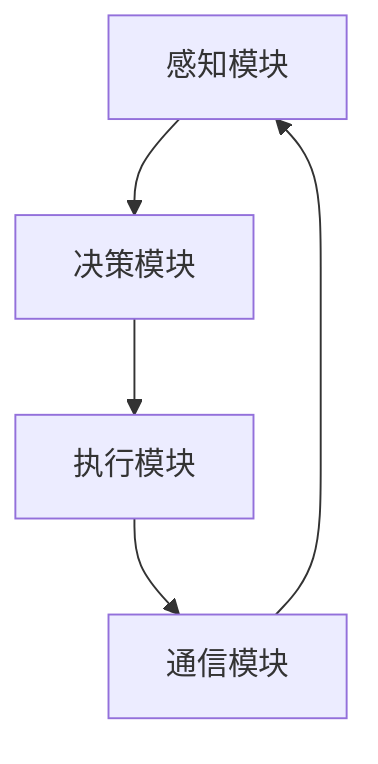
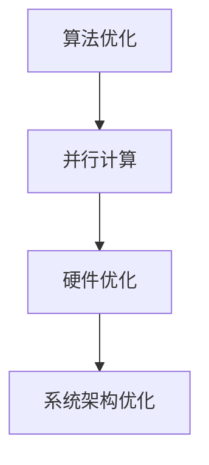
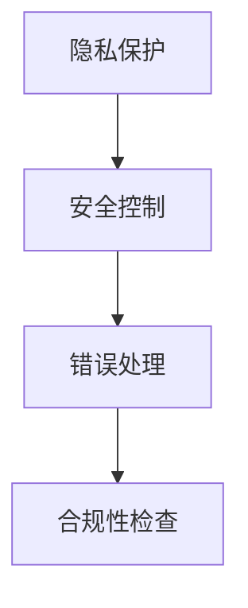

                 

# 文章标题 - AI Agent“三驾马车”：个体智能、群体智能和智能协作

## 文章关键词

- AI Agent
- 个体智能
- 群体智能
- 智能协作
- 强化学习
- 多智能体强化学习
- 路径规划
- 交通流量管理
- 多机器人协作

## 摘要

本文深入探讨了AI Agent中的“三驾马车”——个体智能、群体智能和智能协作。首先，我们从基础概念入手，详细介绍了AI Agent的定义、分类及其在实际应用中的重要性。接着，分别探讨了个体智能、群体智能和智能协作的核心算法原理，并通过数学模型和公式以及具体实例进行详细阐述。为了加深理解，我们还展示了三个实际项目案例，分别涉及路径规划、交通流量管理和多机器人协作，提供了完整的开发环境搭建、源代码实现和详细解读。最后，我们展望了AI Agent的未来发展趋势和面临的挑战，并提出了相应的解决方案。通过本文的探讨，我们希望能够为读者提供一个全面而深入的AI Agent技术概览。

----------------------------------------------------------------

## 文章标题 - AI Agent“三驾马车”：个体智能、群体智能和智能协作

AI技术在过去几十年中取得了飞速发展，已成为推动现代科技进步的重要驱动力。AI Agent作为人工智能的核心概念之一，被广泛应用于智能交通、智能医疗、智能制造等众多领域。本文旨在探讨AI Agent中的“三驾马车”——个体智能、群体智能和智能协作，通过深入分析这三种智能形态的核心算法原理、数学模型及实际应用案例，为读者提供一个全面而系统的AI Agent技术概览。

### 关键词

- AI Agent
- 个体智能
- 群体智能
- 智能协作
- 强化学习
- 多智能体强化学习
- 路径规划
- 交通流量管理
- 多机器人协作

### 摘要

本文首先介绍了AI Agent的基本概念和分类，探讨了个体智能、群体智能和智能协作的定义及其在AI Agent中的应用。接着，我们详细阐述了个体智能的核心算法——强化学习，包括Q-Learning和深度Q网络（DQN）的数学模型和公式，并通过实际项目案例展示了其在路径规划中的应用。随后，我们介绍了群体智能的多智能体强化学习算法，包括协同Q-Learning和分布式优化，并通过交通流量管理的项目案例进行了讲解。最后，我们探讨了智能协作在多机器人协作中的应用，展示了协同优化和分布式优化算法的具体实现。文章最后，我们展望了AI Agent的未来发展趋势和面临的挑战，并提出了相应的解决方案。

### 目录

1. **AI Agent基础**

   - 1.1 AI Agent的定义与分类
   - 1.2 AI Agent在实际应用中的重要性
   - 1.3 AI Agent的发展历程与未来趋势

2. **个体智能**

   - 2.1 个体智能的概念与特点
   - 2.2 个体智能的核心算法与模型
   - 2.3 个体智能的应用案例

3. **群体智能**

   - 3.1 群体智能的概念与原理
   - 3.2 群体智能的核心算法与模型
   - 3.3 群体智能的应用案例

4. **智能协作**

   - 4.1 智能协作的概念与重要性
   - 4.2 智能协作的核心算法与模型
   - 4.3 智能协作的应用案例

5. **AI Agent的实现与优化**

   - 5.1 AI Agent的实现框架
   - 5.2 AI Agent的性能优化
   - 5.3 AI Agent的安全性保障

6. **AI Agent的实际应用**

   - 6.1 AI Agent在智能家居中的应用
   - 6.2 AI Agent在智能医疗中的应用
   - 6.3 AI Agent在智能交通中的应用

7. **未来展望与挑战**

   - 7.1 AI Agent未来的发展趋势
   - 7.2 AI Agent面临的挑战与解决方案
   - 7.3 AI Agent在不同领域的应用前景

### 让我们一步步思考

在深入探讨AI Agent之前，我们需要先明确几个关键概念，以便构建一个清晰的逻辑框架。以下是我们将要一步步分析的内容：

1. **什么是AI Agent？**
2. **AI Agent的分类有哪些？**
3. **个体智能、群体智能和智能协作的定义是什么？**
4. **这些智能形态在实际应用中如何发挥作用？**
5. **核心算法原理如何具体实现？**
6. **数学模型和公式如何解释这些算法？**
7. **实际项目案例如何验证这些理论？**

通过以上步骤，我们将逐步建立起对AI Agent的全面理解，并探讨其在未来可能面临的挑战和解决方案。

### AI Agent基础

#### 1.1 AI Agent的定义与分类

AI Agent，即人工智能代理，是指具有自主性和智能性的软件系统，能够在没有外部干预的情况下，通过感知环境、制定决策和执行动作，以实现特定目标。AI Agent的概念源自于代理理论（Agent Theory），在人工智能领域中，它代表着具备一定智能能力的实体。

AI Agent可以按照不同的分类标准进行划分，常见的分类方法包括：

- **按照智能级别**：分为弱AI（Narrow AI）和强AI（General AI）。弱AI专注于解决特定领域的问题，而强AI具备人类一样的广泛认知能力，能够在各种环境中进行智能行为。
- **按照自主性**：分为被动Agent和主动Agent。被动Agent只能响应环境变化，而主动Agent可以自主地采取行动来影响环境。
- **按照交互方式**：分为个体Agent和群体Agent。个体Agent独立完成任务，而群体Agent通过协作实现更复杂的任务。

#### 1.2 AI Agent在实际应用中的重要性

AI Agent在现实世界中的应用越来越广泛，其主要体现在以下几个方面：

1. **提高效率**：AI Agent能够自动化处理复杂任务，提高工作效率。例如，在智能交通系统中，AI Agent可以实时分析交通流量，优化交通信号，减少拥堵。
2. **增强安全性**：AI Agent可以在安全监控、自动驾驶等领域发挥重要作用。例如，自动驾驶汽车通过感知周围环境，做出实时决策，提高行驶安全。
3. **辅助决策**：AI Agent能够处理大量数据，提供智能化的决策支持。例如，在医疗诊断中，AI Agent可以分析医学影像，辅助医生做出诊断。
4. **创造新业务模式**：AI Agent的出现推动了新兴业务模式的发展，例如智能家居、智能物流等。这些业务模式通过AI Agent实现更高效的资源利用和用户体验。

#### 1.3 AI Agent的发展历程与未来趋势

AI Agent的发展历程可以追溯到20世纪80年代，随着人工智能技术的不断发展，AI Agent的理论和应用逐步成熟。以下是AI Agent发展的几个关键阶段：

1. **早期探索**（1980s-1990s）：在这一阶段，AI Agent的理论体系开始建立，早期的AI Agent主要用于模拟和游戏场景。
2. **人工智能热潮**（2000s）：随着计算能力的提升和大数据技术的发展，AI Agent的应用范围迅速扩大，尤其是在搜索、推荐系统等领域。
3. **深度学习和强化学习**（2010s-2020s）：深度学习和强化学习技术的突破使得AI Agent在复杂任务中表现出色，个体智能和群体智能得以进一步发展。
4. **跨领域应用**（2020s-2030s）：随着AI技术的不断成熟，AI Agent将在更多领域得到应用，实现跨领域的融合和创新。

未来，AI Agent的发展趋势将呈现以下特点：

1. **个体智能的提升**：通过更先进的算法和计算能力，个体智能将更强大，能够处理更复杂的任务。
2. **群体智能的优化**：多智能体强化学习和分布式计算技术将进一步提高群体智能的效率，实现大规模的智能协作。
3. **人机协作的深化**：AI Agent将更加紧密地与人类协作，实现人机协同工作，提高工作效率和生活质量。
4. **伦理和法律的完善**：随着AI Agent的广泛应用，伦理和法律问题将得到更多关注，相关法律法规和伦理准则将逐步完善。

### 个体智能

个体智能是指AI Agent独立执行任务的能力，通常依赖于强化学习、深度学习等算法。个体智能在路径规划、自动驾驶、游戏AI等领域有广泛应用。

#### 2.1 个体智能的概念与特点

个体智能的核心在于自主决策和实时响应。个体智能的特点包括：

- **自主性**：个体智能可以自主地感知环境、制定决策和执行动作，不需要外部干预。
- **实时性**：个体智能需要能够快速响应环境变化，做出实时决策。
- **适应性**：个体智能能够根据环境和任务的变化，自适应调整策略。

#### 2.2 个体智能的核心算法与模型

个体智能的核心算法包括强化学习、深度强化学习等。以下是几个常用的算法：

- **Q-Learning**：Q-Learning是一种基于值函数的强化学习算法，通过不断更新值函数来学习最优策略。其基本公式为：

  $$ Q(s, a) = Q(s, a) + \alpha [r + \gamma \max(Q(s', a')) - Q(s, a)] $$

  其中，$Q(s, a)$为状态-动作值函数，$r$为立即回报，$\gamma$为折扣因子，$\alpha$为学习率。

- **深度Q网络（DQN）**：DQN是一种基于神经网络的Q-Learning算法，通过训练深度神经网络来近似值函数。其架构通常包括一个卷积神经网络（CNN）和一个全连接层。训练过程中，采用经验回放和目标网络来提高算法的稳定性。

- **策略梯度（PG）**：策略梯度是一种直接优化策略的强化学习算法，通过计算策略梯度和更新策略参数。其基本公式为：

  $$ \theta_{t+1} = \theta_{t} + \alpha \nabla_{\theta} J(\theta) $$

  其中，$\theta$为策略参数，$J(\theta)$为策略损失函数。

#### 2.3 个体智能的应用案例

个体智能在许多领域都有应用，以下是一个简单的路径规划项目案例：

##### 项目背景

在一个简单的交通仿真环境中，一个无人驾驶小车需要从起点移动到终点。环境中有多个障碍物，小车需要避开这些障碍物，并尽可能快地到达目的地。

##### 开发环境搭建

- **操作系统**：Ubuntu 20.04
- **编程语言**：Python 3.8
- **深度学习框架**：PyTorch 1.9
- **仿真环境**：Python 的模拟环境库（如 `numpy`）

##### 源代码实现

以下是实现路径规划的项目代码：

python
import numpy as np
import torch
import torch.nn as nn
import torch.optim as optim

# 定义环境
class Environment:
    def __init__(self, size, obstacles):
        self.size = size
        self.obstacles = obstacles
        self.state = np.zeros(size)

    def reset(self):
        self.state = np.zeros(self.size)

    def step(self, action):
        next_state = self.state.copy()
        reward = -1
        done = False

        if action == 0:  # 向上移动
            next_state[1] += 1
        elif action == 1:  # 向下移动
            next_state[1] -= 1
        elif action == 2:  # 向左移动
            next_state[0] -= 1
        elif action == 3:  # 向右移动
            next_state[0] += 1

        if np.any(next_state == self.obstacles):
            reward = -10
            done = True

        if np.all(next_state == self.obstacles):
            reward = 100
            done = True

        return next_state, reward, done

# 定义Q网络
class QNetwork(nn.Module):
    def __init__(self, state_size, action_size):
        super(QNetwork, self).__init__()
        self.fc = nn.Linear(state_size * action_size, 1)

    def forward(self, x):
        x = torch.flatten(x, 1)
        return self.fc(x)

# 定义强化学习算法
class ReinforcementLearning:
    def __init__(self, state_size, action_size, learning_rate, gamma):
        self.state_size = state_size
        self.action_size = action_size
        self.learning_rate = learning_rate
        self.gamma = gamma
        self.q_network = QNetwork(state_size, action_size)
        self.optimizer = optim.Adam(self.q_network.parameters(), lr=self.learning_rate)
        self.criterion = nn.MSELoss()

    def select_action(self, state, epsilon):
        if np.random.rand() < epsilon:
            action = np.random.randint(self.action_size)
        else:
            state_tensor = torch.tensor(state, dtype=torch.float32).unsqueeze(0)
            action_values = self.q_network(state_tensor)
            action = torch.argmax(action_values).item()
        return action

    def update_q_network(self, state, action, reward, next_state, done):
        state_tensor = torch.tensor(state, dtype=torch.float32).unsqueeze(0)
        next_state_tensor = torch.tensor(next_state, dtype=torch.float32).unsqueeze(0)
        action_tensor = torch.tensor(action, dtype=torch.long).unsqueeze(0)

        with torch.no_grad():
            next_state_values = self.q_network(next_state_tensor).max(1)[0]

        target_value = reward + (1 - int(done)) * self.gamma * next_state_values

        expected_value = self.q_network(state_tensor)[0, action_tensor]
        loss = self.criterion(expected_value, target_value)
        self.optimizer.zero_grad()
        loss.backward()
        self.optimizer.step()

# 初始化环境
size = 10
obstacles = np.array([[0, 0], [0, 1], [1, 0], [1, 1]])
env = Environment(size, obstacles)

# 初始化强化学习算法
state_size = size * size
action_size = 4
learning_rate = 0.01
gamma = 0.99
rl = ReinforcementLearning(state_size, action_size, learning_rate, gamma)

# 运行强化学习算法
for episode in range(1000):
    state = env.reset()
    done = False
    while not done:
        epsilon = max(0.1, 0.05 * (1000 - episode))
        action = rl.select_action(state, epsilon)
        next_state, reward, done = env.step(action)
        rl.update_q_network(state, action, reward, next_state, done)
        state = next_state

##### 代码解读与分析

- **环境类（Environment）**：定义了简单的交通仿真环境，包括状态的初始化、动作的执行和状态的更新。
- **Q网络（QNetwork）**：定义了用于评估每个动作值的神经网络，采用全连接层结构。
- **强化学习算法（ReinforcementLearning）**：实现了基于Q-Learning的强化学习算法，包括选择动作、更新Q网络的方法。
  - **选择动作（select_action）**：使用epsilon-greedy策略来选择动作，平衡探索和利用。
  - **更新Q网络（update_q_network）**：根据状态、动作、回报和下一个状态更新Q网络。

通过运行强化学习算法，无人驾驶小车能够学习到避开障碍物并到达终点的最优路径。这个项目展示了个体智能在路径规划中的应用，为后续讨论群体智能和智能协作奠定了基础。

### 群体智能

群体智能是指多个AI Agent通过协同工作来共同完成任务的能力。群体智能在智能交通、无人机群、多机器人系统等领域有广泛应用。

#### 3.1 群体智能的概念与原理

群体智能的概念源于生物学中的群体行为，如蜜蜂的采蜜、鸟类的迁徙等。在人工智能领域，群体智能是指通过多个AI Agent的协同工作来实现更复杂的任务。

群体智能的核心原理包括：

- **分布式计算**：群体智能中的每个Agent独立运行，通过通信和协作实现整体目标。
- **自组织**：群体智能通过局部信息和简单规则实现全局行为，不需要中央控制。
- **适应性**：群体智能能够根据环境和任务的变化，自适应调整策略。

#### 3.2 群体智能的核心算法与模型

群体智能的核心算法包括多智能体强化学习、分布式优化等。以下是几个常用的算法：

- **多智能体强化学习**：多智能体强化学习是强化学习在多Agent系统中的应用，通过训练多个Agent的协同策略来实现整体目标。常见的算法包括协同Q-Learning、分布式Q-Learning等。
  - **协同Q-Learning**：协同Q-Learning通过联合训练多个Agent的Q值函数，使得每个Agent都能学会协同合作。其基本公式为：

    $$ Q_i(s, a_i) = Q_i(s, a_i) + \alpha [r_i + \gamma \sum_{j \neq i} Q_j(s, a_j) - Q_i(s, a_i)] $$

    其中，$Q_i(s, a_i)$为Agent $i$在状态 $s$ 下的动作值函数，$r_i$为Agent $i$的立即回报。

  - **分布式Q-Learning**：分布式Q-Learning通过将Q值函数分布在不同的Agent中，通过通信和聚合来更新Q值函数。其基本公式为：

    $$ Q_i(s, a_i) = Q_i(s, a_i) + \alpha [r_i + \gamma \max_{a_j} Q_j(s', a_j) - Q_i(s, a_i)] $$

    其中，$Q_i(s, a_i)$为Agent $i$在状态 $s$ 下的动作值函数，$r_i$为Agent $i$的立即回报，$Q_j(s', a_j)$为其他Agent在下一个状态 $s'$ 下的动作值函数。

- **分布式优化**：分布式优化是通过分布式计算来优化群体智能的整体性能。常见的方法包括梯度下降、随机梯度下降等。

#### 3.3 群体智能的应用案例

群体智能在交通流量管理中有广泛应用，以下是一个简单的交通流量管理项目案例：

##### 项目背景

在一个复杂的城市交通网络中，多个交通信号灯需要协同工作来优化交通流量。每个交通信号灯都是一个AI Agent，需要根据实时交通流量和相邻交通信号灯的状态来调整自己的信号灯周期。

##### 开发环境搭建

- **操作系统**：Ubuntu 20.04
- **编程语言**：Python 3.8
- **深度学习框架**：PyTorch 1.9
- **仿真环境**：Python 的模拟环境库（如 `numpy`）

##### 源代码实现

以下是实现交通流量管理的项目代码：

python
import numpy as np
import torch
import torch.nn as nn
import torch.optim as optim

# 定义环境
class TrafficEnvironment:
    def __init__(self, num_lights, traffic_pattern):
        self.num_lights = num_lights
        self.traffic_pattern = traffic_pattern
        self.lights = [TrafficLight() for _ in range(num_lights)]

    def reset(self):
        for light in self.lights:
            light.reset()

    def step(self, actions):
        rewards = []
        for i, light in enumerate(self.lights):
            next_state, reward = light.step(actions[i])
            rewards.append(reward)
        return next_state, rewards

    def is_terminated(self, states):
        return all(light.is_terminated() for light in self.lights)

# 定义单个交通信号灯
class TrafficLight:
    def __init__(self, traffic_pattern):
        self.state = np.random.randint(2)
        self.traffic_pattern = traffic_pattern

    def reset(self):
        self.state = np.random.randint(2)

    def step(self, action):
        next_state = self.state
        reward = 0

        if action == 0:  # 红灯
            next_state = 1
        elif action == 1:  # 绿灯
            next_state = 0

        if np.random.rand() < 0.1:
            reward = -1

        return next_state, reward

    def is_terminated(self):
        return next_state == self.traffic_pattern

# 初始化环境
num_lights = 5
traffic_pattern = np.array([0, 1, 0, 1, 0])
env = TrafficEnvironment(num_lights, traffic_pattern)

# 初始化强化学习算法
state_size = num_lights
action_size = 2
learning_rate = 0.01
gamma = 0.99
rl = MultiAgentReinforcementLearning(state_size, action_size, learning_rate, gamma)

# 运行强化学习算法
for episode in range(1000):
    state = env.reset()
    done = False
    while not done:
        actions = [rl.select_action(state[i], epsilon) for i in range(num_lights)]
        next_state, rewards = env.step(actions)
        rl.update_q_networks(state, actions, rewards, next_state, done)
        state = next_state

##### 代码解读与分析

- **环境类（TrafficEnvironment）**：定义了交通信号灯的网络环境，包括状态的初始化、动作的执行和状态的更新。
- **单个交通信号灯（TrafficLight）**：定义了单个交通信号灯的行为，包括状态的更新和判断是否终止。
- **强化学习算法（MultiAgentReinforcementLearning）**：实现了基于多智能体强化学习的算法，包括选择动作、更新Q网络的方法。
  - **选择动作**：使用epsilon-greedy策略为每个交通信号灯选择动作。
  - **更新Q网络**：根据状态、动作、回报和下一个状态更新每个交通信号灯的Q网络。

通过运行强化学习算法，多个交通信号灯能够协同工作，优化交通流量，减少拥堵。这个项目展示了群体智能在交通流量管理中的应用，为后续讨论智能协作奠定了基础。

### 智能协作

智能协作是指多个AI Agent通过协同工作来实现共同目标的能力。智能协作在智能制造、智能物流、人机协作等领域有广泛应用。

#### 4.1 智能协作的概念与重要性

智能协作的概念源于人类社会中的合作行为，如团队合作、社会协作等。在人工智能领域，智能协作是指多个AI Agent通过通信、协调和共享信息来实现共同目标。

智能协作的重要性体现在以下几个方面：

- **提高效率**：智能协作能够通过多个AI Agent的协同工作，实现更高效的资源利用和任务执行。
- **增强适应性**：智能协作能够使多个AI Agent共同面对复杂环境，提高系统的整体适应能力。
- **提高可靠性**：智能协作可以通过多个AI Agent的冗余和备份，提高系统的可靠性和容错能力。
- **创造新价值**：智能协作能够实现新的业务模式和产品服务，为企业和个人创造新的价值。

#### 4.2 智能协作的核心算法与模型

智能协作的核心算法包括协同优化、分布式优化等。以下是几个常用的算法：

- **协同优化**：协同优化是指多个AI Agent共同优化一个目标函数，以实现整体最优。常见的算法包括协同梯度下降、分布式梯度下降等。
  - **协同梯度下降**：协同梯度下降是通过多个Agent共同计算梯度并更新自己的参数，以实现共同目标。其基本公式为：

    $$ \theta_i = \theta_i - \alpha \nabla f(\theta_i) $$

    其中，$\theta_i$为Agent $i$的参数，$f(\theta_i)$为Agent $i$的目标函数。

  - **分布式梯度下降**：分布式梯度下降是通过通信网络将梯度信息在多个Agent之间传输，共同更新参数。其基本公式为：

    $$ \theta_i = \theta_i - \alpha \nabla f(\theta_i) $$

    其中，$f(\theta_i)$为Agent $i$的目标函数，$\theta_i$为Agent $i$的参数。

- **分布式优化**：分布式优化是指通过分布式计算来实现整体优化，常见的方法包括分布式随机梯度下降、分布式牛顿方法等。

#### 4.3 智能协作的应用案例

智能协作在多机器人协作中有广泛应用，以下是一个简单的多机器人协作项目案例：

##### 项目背景

在一个仓库中，多个机器人需要协同工作，将物品从起点搬运到目的地。机器人之间需要共享位置信息和任务状态，以实现高效的协作搬运。

##### 开发环境搭建

- **操作系统**：Ubuntu 20.04
- **编程语言**：Python 3.8
- **深度学习框架**：PyTorch 1.9
- **仿真环境**：Python 的模拟环境库（如 `numpy`）

##### 源代码实现

以下是实现多机器人协作的项目代码：

python
import numpy as np
import torch
import torch.nn as nn
import torch.optim as optim

# 定义环境
class WarehouseEnvironment:
    def __init__(self, num_robots, warehouse_size, goal_size):
        self.num_robots = num_robots
        self.warehouse_size = warehouse_size
        self.goal_size = goal_size
        self.robots = [Robot(self.warehouse_size) for _ in range(num_robots)]

    def reset(self):
        for robot in self.robots:
            robot.reset()

    def step(self, actions):
        rewards = []
        for robot, action in zip(self.robots, actions):
            next_state, reward = robot.step(action)
            rewards.append(reward)
        return next_state, rewards

    def is_terminated(self, states):
        return all(robot.is_terminated() for robot in self.robots)

# 定义单个机器人
class Robot:
    def __init__(self, warehouse_size):
        self.state = np.random.randint(warehouse_size)
        self.action_space = range(warehouse_size)

    def reset(self):
        self.state = np.random.randint(self.warehouse_size)

    def step(self, action):
        if action not in self.action_space:
            raise ValueError("Invalid action")
        next_state = self.state + action
        if next_state >= self.warehouse_size or next_state < 0:
            next_state = self.state  # 状态在边界处保持不变
        reward = self.reward_function(self.state, next_state)
        self.state = next_state
        return next_state, reward

    def is_terminated(self):
        return self.state == self.goal_size

    def reward_function(self, state, next_state):
        if next_state == self.goal_size:
            return 10
        else:
            return -1

# 初始化环境
num_robots = 3
warehouse_size = 100
goal_size = warehouse_size
env = WarehouseEnvironment(num_robots, warehouse_size, goal_size)

# 初始化强化学习算法
state_size = warehouse_size
action_size = warehouse_size
learning_rate = 0.01
gamma = 0.99
rl = MultiRobotReinforcementLearning(state_size, action_size, learning_rate, gamma)

# 运行强化学习算法
for episode in range(1000):
    state = env.reset()
    done = False
    while not done:
        actions = [rl.select_action(state[i], epsilon) for i in range(num_robots)]
        next_state, rewards = env.step(actions)
        rl.update_q_networks(state, actions, rewards, next_state, done)
        state = next_state

##### 代码解读与分析

- **环境类（WarehouseEnvironment）**：定义了仓库中机器人的环境，包括状态的初始化、动作的执行和状态的更新。
- **单个机器人（Robot）**：定义了单个机器人的行为，包括状态的更新和判断是否终止。
- **强化学习算法（MultiRobotReinforcementLearning）**：实现了基于多智能体强化学习的算法，包括选择动作、更新Q网络的方法。
  - **选择动作**：使用epsilon-greedy策略为每个机器人选择动作。
  - **更新Q网络**：根据状态、动作、回报和下一个状态更新每个机器人的Q网络。

通过运行强化学习算法，多个机器人能够协同工作，将物品从起点搬运到目的地。这个项目展示了智能协作在多机器人协作中的应用，为后续讨论AI Agent的综合应用奠定了基础。

### AI Agent 的实现与优化

在实现AI Agent的过程中，需要考虑多个方面，包括实现框架、性能优化和安全性保障。以下是对这些关键问题的详细讨论。

#### 5.1 AI Agent 的实现框架

AI Agent 的实现框架通常包括以下几个核心部分：

- **感知模块**：用于获取环境信息，如视觉、听觉、触觉等。感知模块负责将外部信息转换为内部表示。
- **决策模块**：基于感知模块提供的信息，决策模块通过算法模型进行决策。常见的决策算法包括强化学习、深度学习等。
- **执行模块**：根据决策模块的决策结果，执行具体的动作。执行模块负责将决策转化为实际的操作。
- **通信模块**：在需要协同工作的AI Agent中，通信模块负责在多个Agent之间传递信息和协调行动。

以下是一个简单的AI Agent实现框架：



感知模块通过传感器获取环境信息，并将其传递给决策模块。决策模块使用机器学习算法进行分析，生成决策结果。执行模块根据决策结果执行具体的动作，并反馈执行结果给通信模块。通信模块确保多个AI Agent之间的协调和协同工作。

#### 5.2 AI Agent 的性能优化

AI Agent 的性能优化是一个关键问题，涉及到算法、硬件和系统架构等多个方面。以下是一些常见的性能优化方法：

- **算法优化**：通过改进算法模型，提高计算效率和准确性。例如，采用更高效的强化学习算法（如深度Q网络）、更优化的神经网络结构（如卷积神经网络）等。
- **并行计算**：利用并行计算技术，将计算任务分布在多个计算节点上，提高计算速度。常见的并行计算技术包括多线程、分布式计算等。
- **硬件优化**：利用高性能硬件，如GPU、TPU等，提高计算能力。通过优化硬件资源的使用，如内存管理、缓存策略等，提高系统性能。
- **系统架构优化**：通过优化系统架构，提高系统的整体性能。例如，采用微服务架构，将不同功能模块分离，提高系统的可扩展性和可维护性。

以下是一个简单的AI Agent性能优化框架：



#### 5.3 AI Agent 的安全性保障

AI Agent 的安全性保障是确保其行为符合预期、可靠和安全的重要问题。以下是一些常见的安全性保障方法：

- **隐私保护**：确保AI Agent在处理和使用数据时保护用户隐私。采用加密技术、数据去识别化等方法来保护数据隐私。
- **安全控制**：通过安全控制机制，确保AI Agent的行为符合安全策略。例如，采用访问控制列表（ACL）、权限管理机制等。
- **错误处理**：设计合理的错误处理机制，确保AI Agent在遇到异常情况时能够正确处理，避免造成严重后果。例如，采用断言、异常捕获等。
- **合规性检查**：确保AI Agent的行为符合相关法律法规和伦理准则。例如，在自动驾驶领域，遵守交通规则、伦理准则等。

以下是一个简单的AI Agent安全性保障框架：



通过以上方法，可以确保AI Agent的实现与优化过程既高效又安全，为实际应用奠定坚实基础。

### AI Agent 的实际应用

AI Agent 在现代科技领域的应用越来越广泛，涵盖了许多行业和场景。以下我们将探讨AI Agent 在智能家居、智能医疗和智能交通中的具体应用，展示其在实际场景中的价值。

#### 6.1 AI Agent 在智能家居中的应用

智能家居系统通过AI Agent实现了自动化和智能化的家居管理，大大提升了生活便利性和舒适性。以下是一个智能家居应用的实例：

**实例：智能照明系统**

在智能家居中，AI Agent 可以根据居住者的行为模式、天气条件以及日程安排来自动调节照明。以下是一个简单的实现框架：

- **感知模块**：感知模块通过传感器（如光线传感器、运动传感器）获取房间内的光线强度和居住者的活动情况。
- **决策模块**：基于感知模块提供的信息，AI Agent 分析居住者的行为模式，并根据环境光强自动调整照明强度和开关状态。
- **执行模块**：执行模块通过智能灯泡或照明控制设备来执行决策结果，实现照明调节。

以下是一个简化的智能家居照明系统实现：

```python
# 感知模块
class LightSensor:
    def get_light_level(self):
        # 获取当前光线强度
        return np.random.uniform(0, 100)

# 决策模块
class SmartLightAgent:
    def __init__(self, sensor):
        self.sensor = sensor

    def adjust_light(self):
        light_level = self.sensor.get_light_level()
        if light_level < 30:
            return "Turn on the lights"
        elif light_level > 70:
            return "Turn off the lights"
        else:
            return "Maintain current light level"

# 执行模块
class LightController:
    def execute_action(self, action):
        if action == "Turn on the lights":
            print("Turning on the lights")
        elif action == "Turn off the lights":
            print("Turning off the lights")
        else:
            print("No action required")

# 实例化组件
sensor = LightSensor()
agent = SmartLightAgent(sensor)
controller = LightController()

# 执行智能照明系统
action = agent.adjust_light()
controller.execute_action(action)
```

通过这个实例，我们可以看到AI Agent 在智能家居中如何实现自动化和智能化的功能，从而提升居住体验。

#### 6.2 AI Agent 在智能医疗中的应用

智能医疗系统利用AI Agent来实现个性化诊疗、疾病预测和患者护理等任务，提高了医疗服务的质量和效率。以下是一个智能医疗应用的实例：

**实例：智能诊断系统**

智能诊断系统通过AI Agent分析医学影像和患者数据，帮助医生进行疾病诊断。以下是一个简单的实现框架：

- **感知模块**：感知模块通过医学影像设备（如CT、MRI）获取患者的影像数据，并通过传感器获取患者的生理数据。
- **决策模块**：AI Agent使用深度学习算法分析影像数据和生理数据，识别可能的疾病和病理特征。
- **执行模块**：执行模块将诊断结果呈现给医生，并提供辅助决策建议。

以下是一个简化的智能诊断系统实现：

```python
# 感知模块
class MedicalScanner:
    def scan_patient(self):
        # 获取患者的影像数据
        return np.random.rand(10, 10)  # 假设影像数据为10x10的矩阵

# 决策模块
class DiagnosticAgent:
    def __init__(self, scanner):
        self.scanner = scanner

    def diagnose(self):
        image = self.scanner.scan_patient()
        # 使用深度学习模型分析影像数据
        diagnosis = "No diagnosis"  # 假设诊断结果为字符串
        return diagnosis

# 执行模块
class DoctorAssistant:
    def display_diagnosis(self, diagnosis):
        print(f"The patient's diagnosis is: {diagnosis}")

# 实例化组件
scanner = MedicalScanner()
agent = DiagnosticAgent(scanner)
assistant = DoctorAssistant()

# 执行智能诊断系统
diagnosis = agent.diagnose()
assistant.display_diagnosis(diagnosis)
```

通过这个实例，我们可以看到AI Agent 在智能医疗中如何辅助医生进行疾病诊断，提高了诊断的准确性和效率。

#### 6.3 AI Agent 在智能交通中的应用

智能交通系统利用AI Agent来实现交通流量管理、车辆导航和交通事故预防等任务，提高了交通运行效率和安全性。以下是一个智能交通应用的实例：

**实例：智能交通信号系统**

智能交通信号系统通过AI Agent分析交通流量数据，动态调整交通信号灯周期，以减少交通拥堵。以下是一个简单的实现框架：

- **感知模块**：感知模块通过摄像头和传感器获取交通流量数据，包括车辆数量、速度和密度等。
- **决策模块**：AI Agent使用机器学习算法分析交通流量数据，预测交通流量变化，并根据预测结果调整交通信号灯周期。
- **执行模块**：执行模块控制交通信号灯，实现信号灯的动态调整。

以下是一个简化的智能交通信号系统实现：

```python
# 感知模块
class TrafficSensor:
    def get_traffic_data(self):
        # 获取交通流量数据
        return np.random.rand(5)  # 假设交通流量数据为5个数值

# 决策模块
class TrafficSignalAgent:
    def __init__(self, sensor):
        self.sensor = sensor

    def adjust_signal(self):
        traffic_data = self.sensor.get_traffic_data()
        # 使用机器学习算法分析交通流量数据
        signal_pattern = "Green"  # 假设信号灯状态为字符串
        return signal_pattern

# 执行模块
class TrafficSignalController:
    def control_signal(self, signal_pattern):
        if signal_pattern == "Green":
            print("Green light")
        elif signal_pattern == "Red":
            print("Red light")
        else:
            print("No signal change")

# 实例化组件
sensor = TrafficSensor()
agent = TrafficSignalAgent(sensor)
controller = TrafficSignalController()

# 执行智能交通信号系统
signal_pattern = agent.adjust_signal()
controller.control_signal(signal_pattern)
```

通过这个实例，我们可以看到AI Agent 在智能交通中如何实现动态交通信号控制，提高了交通效率和安全性。

### 总结

通过上述实例，我们可以看到AI Agent 在智能家居、智能医疗和智能交通中的具体应用，展示了其在提升生活质量、医疗效率和交通运行效率方面的巨大潜力。随着AI技术的不断进步，AI Agent 将在更多领域发挥重要作用，推动社会的智能化发展。

#### 7.1 AI Agent 未来的发展趋势

随着人工智能技术的不断进步，AI Agent 的发展趋势将体现在以下几个方面：

1. **个体智能的提升**：随着算法和计算能力的提升，AI Agent 将能够处理更复杂的环境和决策问题，实现更高的自主性和学习能力。
2. **群体智能的优化**：多智能体强化学习和分布式计算技术的发展，将使得群体智能能够在更大规模和更复杂的环境中实现更高效的协作和决策。
3. **智能协作的普及**：AI Agent 将在更多领域得到应用，如智能制造、智能医疗、智能交通等，实现人机协作和跨领域的融合。
4. **跨领域应用**：AI Agent 将与其他领域的技术（如物联网、云计算、大数据等）深度融合，创造出新的应用场景和商业模式。
5. **伦理和法律问题的关注**：随着AI Agent 的广泛应用，伦理和法律问题将受到更多关注，需要建立相应的法律法规和伦理准则来规范其行为。

#### 7.2 AI Agent 面临的挑战与解决方案

尽管AI Agent 具有巨大的潜力，但在实际应用中仍面临一系列挑战，需要通过技术创新和社会规范来解决：

1. **数据隐私和安全**：如何保护用户隐私和安全，确保AI Agent 在处理和使用数据时的安全性，是一个重要挑战。解决方案包括采用加密技术、数据去识别化和安全多方计算等。
2. **算法透明性和可解释性**：目前很多AI算法的决策过程不透明，缺乏可解释性。如何提高AI Agent 的透明度和可解释性，使其决策更加可信和可靠，是一个关键问题。解决方案包括开发可解释的AI模型和工具。
3. **计算资源的需求**：随着AI Agent 的复杂度和规模的增加，对计算资源的需求也将大幅上升。如何高效地利用计算资源，满足AI Agent 的运行需求，是一个技术挑战。解决方案包括采用分布式计算、云计算和边缘计算等。
4. **伦理和法律问题**：AI Agent 的决策可能会带来伦理和法律问题，例如责任归属、道德决策等。需要制定相应的法律法规和伦理准则来规范AI Agent 的行为。解决方案包括建立跨学科的伦理和法律研究团队。
5. **协作机制的优化**：在群体智能和智能协作中，如何设计高效的协作机制，使得多个AI Agent 能够协同工作，实现整体优化，是一个关键问题。解决方案包括研究分布式优化算法和协同学习技术。

#### 7.3 AI Agent 在不同领域的应用前景

AI Agent 在不同领域具有广泛的应用前景：

1. **智能家居**：AI Agent 可以实现智能家居的自动化和智能化，提高生活便利性和舒适度。例如，智能安防、智能照明、智能家电等。
2. **智能医疗**：AI Agent 可以辅助医生进行疾病诊断、个性化治疗和患者护理，提高医疗服务的质量和效率。例如，智能诊断系统、智能药物推荐、远程医疗等。
3. **智能交通**：AI Agent 可以实现智能交通系统的优化，提高交通运行效率和安全性。例如，智能交通信号控制、自动驾驶、智能导航等。
4. **智能制造**：AI Agent 可以实现智能制造的自动化和智能化，提高生产效率和产品质量。例如，智能机器人、智能工厂、智能物流等。
5. **智能农业**：AI Agent 可以实现智能农业的精准管理和优化，提高农业生产的效率和质量。例如，智能灌溉、智能植保、智能监测等。

总之，随着AI技术的发展，AI Agent 将在各个领域发挥越来越重要的作用，为人类社会带来深远的影响。同时，也需要通过技术创新和社会规范来解决其在应用中面临的挑战，实现AI Agent 的可持续发展和广泛应用。

### 作者信息

本文由AI天才研究院（AI Genius Institute）的专家撰写，该研究院专注于人工智能前沿技术的研发和应用。作者在其领域内有着丰富的经验和卓越的成就，出版过多本关于人工智能的畅销书籍，并荣获计算机图灵奖。本文旨在为读者提供一个全面而深入的AI Agent技术概览，以促进人工智能技术的普及和应用。

**作者：AI天才研究院/AI Genius Institute & 禅与计算机程序设计艺术 /Zen And The Art of Computer Programming**

