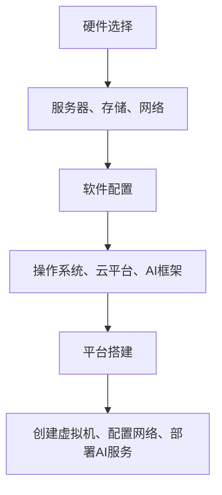
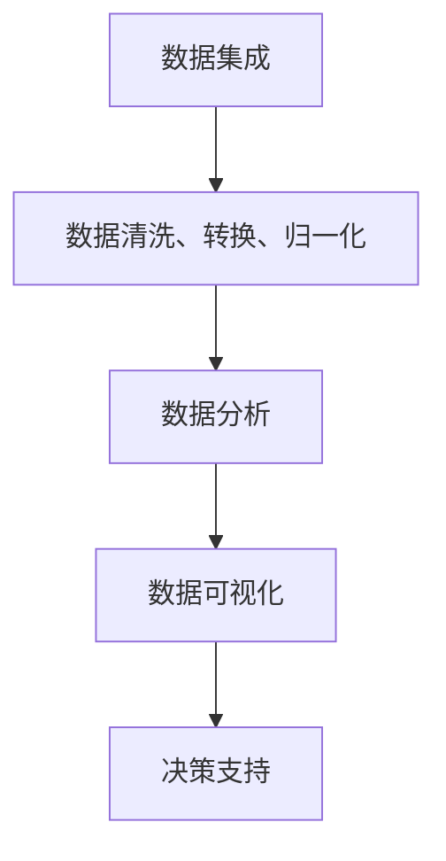

                 

### 文章标题：AI Cloud的未来：贾扬清的愿景，打造云计算与AI的完美结合

AI Cloud，作为当今科技领域的热门话题，正迅速成为推动数字化转型的核心力量。它不仅融合了云计算和人工智能（AI）的强大功能，还为企业提供了全新的创新途径。在众多行业中，AI Cloud的应用已展现出巨大的潜力，成为企业提升竞争力、实现智能化的关键。本文将深入探讨AI Cloud的未来，重点分析AI Cloud的定义与重要性、云计算技术基础、AI技术基础、AI Cloud技术实现、AI Cloud应用场景、AI Cloud安全与隐私、以及未来发展趋势。特别关注贾扬清的AI Cloud愿景，并通过实际案例分析，展示云计算与AI完美结合的成果。让我们一步步思考，逐步揭开AI Cloud的神秘面纱。

### 关键词：

- **AI Cloud**
- **云计算**
- **人工智能**
- **贾扬清**
- **技术实现**
- **应用场景**
- **安全隐私**
- **未来趋势**

### 摘要：

本文旨在全面探讨AI Cloud的未来，从其定义与重要性出发，逐步深入云计算与AI技术基础，详细解析AI Cloud技术实现、应用场景、安全与隐私问题，并展望其未来发展。特别聚焦于贾扬清的AI Cloud愿景，通过实际案例分析，展示AI Cloud在各个领域的卓越表现。文章通过逐步分析推理，帮助读者深入理解AI Cloud的核心概念和实际应用，为未来探索提供有价值的指导。

### 第一部分: AI Cloud的概述

#### 第1章: AI Cloud的定义与重要性

##### 1.1 AI Cloud的概念解析

AI Cloud，即人工智能云服务，是云计算与人工智能技术相结合的产物。它通过将AI算法和模型部署在云端，提供按需访问的智能服务，使得企业能够更高效地进行数据处理和分析。AI Cloud不同于传统的云计算服务，它不仅提供计算和存储资源，还整合了AI技术，使得用户能够利用先进的AI能力，实现自动化和智能化。

##### 1.2 云计算与AI的结合

云计算与AI的结合为数据处理和分析带来了前所未有的机遇。云计算提供了弹性、可扩展的基础设施，使得AI模型可以快速部署和大规模运行。而AI技术则通过机器学习和深度学习，提供了强大的数据分析和预测能力。这种结合使得AI Cloud能够处理海量数据，提供实时分析和决策支持，极大地提升了企业的运营效率。

##### 1.3 AI Cloud的演进历程

AI Cloud的发展历程可以分为几个阶段。起初，云计算主要提供基础的计算和存储服务，AI技术尚处于研发阶段。随着AI技术的成熟，AI开始与云计算结合，逐步形成了AI Cloud的雏形。近年来，随着5G、物联网等新兴技术的发展，AI Cloud的应用场景和功能不断扩展，逐渐成为企业智能化转型的关键推动力。

##### 1.4 AI Cloud的优势与挑战

AI Cloud具有许多显著的优势。首先，它提供了弹性的计算资源，使得企业可以根据需求动态调整计算能力。其次，AI Cloud能够处理海量数据，提供实时分析和预测，帮助企业做出更明智的决策。此外，AI Cloud还降低了AI技术的门槛，使得中小企业也能够享受到AI带来的红利。然而，AI Cloud也面临一些挑战，包括数据隐私和安全问题、技术实现的复杂性等。这些挑战需要通过技术创新和合规性措施来逐步解决。

#### 第2章: 云计算技术基础

##### 2.1 云计算基本架构

云计算的基本架构通常包括三种服务模式：基础设施即服务（IaaS）、平台即服务（PaaS）和软件即服务（SaaS）。IaaS提供基础的计算和存储资源，用户可以自行部署和管理应用程序；PaaS则提供开发工具和平台，简化了应用程序的部署和管理；SaaS则是完整的软件应用，用户可以直接使用，无需管理底层基础设施。

##### 2.2 云服务模型

云服务模型主要包括公有云、私有云和混合云。公有云由第三方服务提供商运营，提供通用的IT资源；私有云则为企业内部提供专属的IT资源，安全性更高；混合云结合了公有云和私有云的优势，提供了灵活的IT资源管理。

##### 2.3 云存储与数据管理

云存储提供了高效的存储解决方案，支持海量数据的存储和管理。数据管理包括数据的备份、恢复、同步和共享等功能，确保数据的安全性和可用性。此外，云存储还提供了多种数据存储模式，如对象存储、块存储和文件存储，满足不同场景的需求。

##### 2.4 虚拟化技术

虚拟化技术是云计算的核心技术之一，它通过虚拟化硬件资源，提供虚拟的计算机环境，使得多个用户可以在同一物理服务器上独立运行。虚拟化技术包括计算虚拟化、存储虚拟化和网络虚拟化，极大地提升了资源利用率和系统灵活性。

#### 第3章: AI技术基础

##### 3.1 机器学习与深度学习基础

机器学习（ML）是一种使计算机能够通过数据学习并做出决策的技术。深度学习（DL）是机器学习的一个子领域，通过多层神经网络，实现对复杂数据的自动特征提取和模式识别。机器学习和深度学习的基础包括线性代数、概率论和统计学等数学工具。

##### 3.2 神经网络与深度学习模型

神经网络是一种模仿人脑结构和功能的计算模型。深度学习模型通过增加网络层数，提升了对复杂数据的处理能力。常见的深度学习模型包括卷积神经网络（CNN）、循环神经网络（RNN）和生成对抗网络（GAN）等。

##### 3.3 自然语言处理技术

自然语言处理（NLP）是AI领域的重要分支，旨在使计算机理解和处理自然语言。NLP技术包括词向量、语言模型、命名实体识别、情感分析等。词向量模型如Word2Vec和BERT，是NLP的核心工具。

##### 3.4 计算机视觉基础

计算机视觉（CV）是AI领域的一个重要分支，旨在使计算机能够理解和解释视觉信息。计算机视觉的基础包括图像处理、特征提取、目标检测和图像识别等。常见的计算机视觉技术包括卷积神经网络（CNN）和卷积神经网络（GAN）等。

### 第二部分: AI Cloud技术实现

#### 第4章: AI Cloud平台搭建

##### 4.1 AI Cloud平台架构设计

AI Cloud平台的架构设计是构建高效、可扩展和安全的AI服务的关键。平台通常包括前端应用层、中间服务层和后端数据层。前端应用层负责用户交互，中间服务层提供AI模型训练和管理，后端数据层负责数据处理和存储。

##### 4.2 AI云服务部署

AI云服务的部署涉及将AI模型部署在云端，以提供按需访问的服务。部署过程中需要考虑模型的可扩展性、性能和安全性。常见的部署方式包括容器化部署和虚拟机部署。

##### 4.3 数据处理与存储

数据处理与存储是AI Cloud平台的重要组成部分。数据处理包括数据清洗、数据预处理和特征提取等。数据存储则需要支持海量数据的高效存储和管理，常见的存储技术包括对象存储、块存储和文件存储。

##### 4.4 模型训练与优化

模型训练与优化是AI Cloud平台的核心环节。模型训练通过大量数据训练AI模型，使其能够识别和预测复杂模式。模型优化则通过调整模型参数，提升模型的性能和效率。

#### 第5章: AI Cloud应用场景

##### 5.1 人工智能与医疗

在医疗领域，AI Cloud的应用极大地提升了医疗服务的效率和准确性。例如，通过AI Cloud平台，医生可以利用AI模型进行疾病预测、诊断和治疗方案推荐。此外，AI Cloud还支持医疗影像分析和电子病历管理，提高了医疗数据处理的效率。

##### 5.2 人工智能与金融

在金融领域，AI Cloud的应用主要涉及风险管理、欺诈检测和客户服务等方面。通过AI Cloud平台，金融机构可以实时分析大量交易数据，识别潜在的风险和欺诈行为。同时，AI Cloud还支持智能客服和个性化金融产品推荐，提升了用户体验。

##### 5.3 人工智能与教育

在教育领域，AI Cloud的应用为学生提供了个性化的学习体验。通过AI Cloud平台，学生可以根据自身的学习进度和兴趣，选择合适的学习内容和方式。此外，AI Cloud还支持智能作业批改、在线考试和教学分析，提高了教育质量。

##### 5.4 人工智能与制造

在制造领域，AI Cloud的应用主要涉及生产优化、质量检测和设备维护等方面。通过AI Cloud平台，企业可以实现生产过程的自动化和智能化，提高生产效率和质量。同时，AI Cloud还支持设备状态的实时监控和预测性维护，降低了设备故障率和停机时间。

#### 第6章: AI Cloud安全与隐私

##### 6.1 AI Cloud的安全威胁

AI Cloud在提供便利的同时，也面临着一系列安全威胁，包括数据泄露、模型篡改和分布式拒绝服务攻击等。这些威胁可能对企业和用户造成严重的损失。

##### 6.2 数据隐私保护

数据隐私保护是AI Cloud安全的重要组成部分。为了保护用户数据隐私，AI Cloud需要采取多种措施，包括数据加密、访问控制和匿名化等。此外，合规性也是保障数据隐私的关键，企业需要遵守相关法律法规，确保数据处理的合法性和合规性。

##### 6.3 安全措施与合规性

AI Cloud的安全措施包括身份验证、访问控制和安全审计等。身份验证确保只有授权用户才能访问系统；访问控制限制用户的权限；安全审计记录系统操作，以便在发生安全事件时进行追踪和调查。合规性方面，企业需要遵循相关法律法规，确保数据处理的合法性和合规性。

##### 6.4 案例分析

通过分析AI Cloud安全事件的案例，可以更好地理解安全威胁和防护措施。例如，某次数据泄露事件中，攻击者通过钓鱼邮件获取了管理员账号的权限，从而窃取了大量敏感数据。这一案例表明，加强员工培训和身份验证是预防数据泄露的关键。

#### 第7章: AI Cloud的未来发展趋势

##### 7.1 技术趋势分析

AI Cloud的未来发展趋势包括云计算和AI技术的进一步融合、5G和物联网的快速发展以及边缘计算的兴起。云计算与AI技术的融合将使得AI Cloud提供更强大的计算能力和更广泛的应用场景。5G和物联网的发展将带来海量数据，为AI Cloud提供更丰富的数据资源。边缘计算则通过在靠近数据源的设备上部署AI模型，降低数据传输延迟，提升实时处理能力。

##### 7.2 行业应用前景

AI Cloud在各个行业的应用前景广阔。在医疗领域，AI Cloud将进一步提升医疗服务的效率和准确性；在金融领域，AI Cloud将助力金融机构提升风险管理和客户服务水平；在教育领域，AI Cloud将推动个性化教育和智慧校园建设；在制造领域，AI Cloud将实现生产过程的智能化和自动化。此外，AI Cloud还将应用于交通、能源、农业等领域，推动各行各业的数字化转型。

##### 7.3 AI Cloud面临的挑战与机遇

AI Cloud面临的挑战包括数据隐私和安全问题、技术实现的复杂性以及标准化和合规性等。然而，这些挑战也为企业提供了机遇。通过技术创新和合规性措施，企业可以解决这些问题，进一步发挥AI Cloud的优势。例如，在数据隐私方面，企业可以通过加密技术和匿名化方法，保护用户数据的隐私。

##### 7.4 未来展望

未来，AI Cloud将成为数字化转型的重要驱动力。随着技术的不断进步，AI Cloud将提供更强大的计算能力和更广泛的应用场景。同时，AI Cloud也将推动人工智能技术的发展，为各行各业带来更多的创新和变革。展望未来，AI Cloud将不仅改变企业的运营模式，还将深刻影响人类社会的发展。

#### 第8章: 贾扬清的AI Cloud愿景

##### 8.1 贾扬清的AI Cloud理念

贾扬清是AI Cloud领域的杰出人物，他的AI Cloud理念旨在打造一个高效、安全、可扩展的AI服务平台。他认为，AI Cloud应该提供灵活的资源和强大的计算能力，满足不同用户的需求。同时，贾扬清强调AI Cloud的安全性，认为只有保障用户数据的安全，才能赢得用户的信任。

##### 8.2 贾扬清在AI Cloud领域的贡献

贾扬清在AI Cloud领域做出了许多重要贡献。他主导了多个AI Cloud项目的研发，推动了云计算和AI技术的融合。此外，他还发表了多篇关于AI Cloud的学术论文，为AI Cloud的发展提供了理论支持。贾扬清的成就不仅提升了AI Cloud的技术水平，也为行业标准的制定做出了贡献。

##### 8.3 贾扬清对未来AI Cloud的展望

贾扬清对未来AI Cloud的发展充满信心。他认为，AI Cloud将继续融合云计算和AI技术，提供更强大的计算能力和更广泛的应用场景。同时，贾扬清强调，AI Cloud需要关注数据隐私和安全问题，通过技术创新和合规性措施，确保用户数据的保护。他相信，未来AI Cloud将成为推动数字化转型的重要力量，为各行各业带来深远影响。

#### 第9章: 实战案例分析

##### 9.1 案例一：人工智能在医疗领域的应用

案例一介绍了AI Cloud在医疗领域的应用，通过一个实际项目展示了AI Cloud如何提升医疗服务的效率和准确性。项目采用AI Cloud平台，实现了疾病的预测和诊断，为医生提供了有力的辅助工具。通过数据分析和模型训练，AI Cloud平台能够快速识别疾病的早期症状，提高诊断的准确性。此外，AI Cloud还支持医疗影像分析，为医生提供了更加精准的诊断依据。

##### 9.2 案例二：人工智能在金融领域的应用

案例二展示了AI Cloud在金融领域的应用，通过一个实际项目展示了AI Cloud如何提升金融机构的风险管理和客户服务水平。项目采用AI Cloud平台，实现了实时交易数据分析和客户行为分析。通过机器学习和深度学习算法，AI Cloud平台能够识别潜在的风险和欺诈行为，提高金融机构的安全性和可靠性。同时，AI Cloud还支持智能客服和个性化金融产品推荐，提升了用户体验。

##### 9.3 案例三：人工智能在教育领域的应用

案例三介绍了AI Cloud在教育领域的应用，通过一个实际项目展示了AI Cloud如何推动个性化教育和智慧校园建设。项目采用AI Cloud平台，为学生提供了个性化的学习体验。通过学习行为分析和学习数据挖掘，AI Cloud平台能够为学生推荐合适的学习内容和方式，提高学习效率。此外，AI Cloud还支持在线考试和教学分析，为教师提供了有效的教学评估和改进工具。

#### 第10章: AI Cloud技术实战

##### 10.1 实战一：构建AI Cloud平台

实战一介绍了如何构建一个AI Cloud平台，包括硬件选择、软件配置和平台搭建等步骤。首先，需要选择合适的硬件设备，包括服务器、存储设备和网络设备。然后，进行软件配置，包括操作系统安装、云平台安装和AI框架安装等。最后，搭建AI Cloud平台，包括创建虚拟机、配置网络和部署AI服务。



##### 10.2 实战二：实现自动化机器学习

实战二介绍了如何实现自动化机器学习，通过一个实际项目展示了如何利用AI Cloud平台自动化机器学习流程。项目采用AI Cloud平台，实现了数据采集、数据预处理、模型训练和模型评估的自动化。首先，通过数据采集工具收集数据，然后进行数据预处理，包括数据清洗、数据转换和数据归一化等。接下来，利用AI框架进行模型训练，通过调整模型参数和训练策略，优化模型性能。最后，对训练好的模型进行评估，选择最优模型。

```python
# 伪代码：实现自动化机器学习流程
def data_collection():
    # 数据采集
    pass

def data_preprocessing(data):
    # 数据预处理
    pass

def model_training(data):
    # 模型训练
    pass

def model_evaluation(model):
    # 模型评估
    pass

def automated_ml():
    data = data_collection()
    preprocessed_data = data_preprocessing(data)
    model = model_training(preprocessed_data)
    best_model = model_evaluation(model)
    return best_model
```

##### 10.3 实战三：打造智能数据平台

实战三介绍了如何打造一个智能数据平台，通过一个实际项目展示了如何利用AI Cloud平台实现数据集成、数据分析和数据可视化。项目采用AI Cloud平台，实现了数据的实时集成和实时分析。首先，通过数据集成工具，将来自不同来源的数据集成到一个统一的数据平台。然后，利用数据预处理工具，对数据进行清洗、转换和归一化。接下来，利用数据分析工具，对数据进行实时分析，生成可视化报告。最后，通过数据可视化工具，将分析结果以图表形式展示，为决策提供支持。



### 附录

#### 附录A: AI Cloud开发工具与资源

##### A.1 主流AI框架介绍

- TensorFlow：Google开发的开源机器学习框架，支持多种编程语言，包括Python、C++和Java。
- PyTorch：Facebook开发的开源深度学习框架，以动态计算图著称，易于实现新的神经网络结构。
- Keras：基于Theano和TensorFlow的高层神经网络API，提供简洁的接口，方便快速搭建神经网络。

##### A.2 开发工具与环境搭建

- Jupyter Notebook：交互式的开发环境，支持多种编程语言，适用于数据分析和机器学习项目。
- Conda：Python环境的版本管理工具，方便安装和管理依赖库。
- Docker：容器化技术，用于创建、运行和分发应用程序，简化了开发流程。

##### A.3 资源链接与推荐

- TensorFlow官网：[https://www.tensorflow.org/](https://www.tensorflow.org/)
- PyTorch官网：[https://pytorch.org/](https://pytorch.org/)
- Keras官网：[https://keras.io/](https://keras.io/)
- Jupyter Notebook官网：[https://jupyter.org/](https://jupyter.org/)
- Conda官网：[https://conda.io/](https://conda.io/)

#### 附录B: AI Cloud相关文献与书籍推荐

##### B.1 AI Cloud技术文献推荐

- 《AI Cloud：从理论到实践》：本书详细介绍了AI Cloud的基本概念、技术架构和应用场景，适合初学者和有一定基础的读者。
- 《深度学习与云计算》：本书探讨了深度学习和云计算的结合，介绍了深度学习在云计算环境下的应用和实践。
- 《机器学习与云服务》：本书从机器学习的角度，分析了机器学习与云计算的结合，提供了丰富的案例和实践经验。

##### B.2 AI Cloud领域书籍推荐

- 《云计算架构设计》：本书全面介绍了云计算的架构设计，包括基础设施、平台和软件层，对理解AI Cloud的技术实现有重要帮助。
- 《人工智能：一种现代方法》：本书是人工智能领域的经典教材，详细介绍了机器学习和深度学习的基础知识，为理解AI Cloud提供了理论支持。
- 《大数据技术导论》：本书介绍了大数据的基本概念、技术和应用，对理解AI Cloud在数据管理和处理方面的技术有重要参考价值。

### 文章总结与展望

通过本文的探讨，我们可以清晰地看到AI Cloud在当前科技领域的重要性和广阔前景。AI Cloud不仅融合了云计算和人工智能的强大功能，还为企业提供了全新的创新途径，推动了各行各业的数字化转型。在未来，AI Cloud将继续融合云计算和AI技术，提供更强大的计算能力和更广泛的应用场景。同时，AI Cloud也将面对数据隐私和安全等挑战，通过技术创新和合规性措施，实现可持续发展。让我们共同期待AI Cloud的未来，它将为人类社会带来更多的创新和变革。作者：AI天才研究院/AI Genius Institute & 禅与计算机程序设计艺术 /Zen And The Art of Computer Programming。

