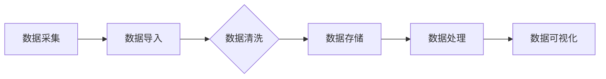
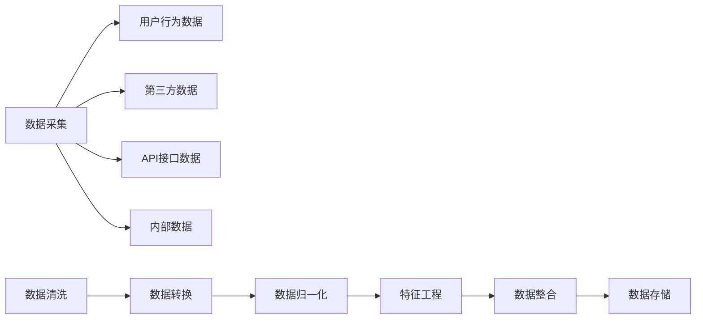
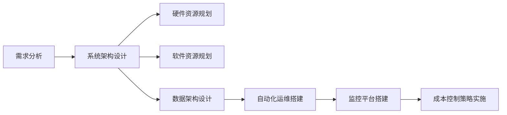

                 

# 《AI DMP 数据基建的成本控制》

## 关键词
AI DMP，数据基建，成本控制，资源优化，算法优化，数据管理优化

## 摘要
本文深入探讨了人工智能驱动的数据管理平台（DMP）中的数据基建成本控制问题。首先，我们介绍了AI DMP的数据基建基础和组成部分，并详细解析了数据流和数据处理过程。接着，文章分析了AI DMP的成本结构，探讨了成本控制方法，包括资源优化、算法优化和数据管理优化策略。随后，通过具体案例展示了成本控制措施及其效果。最后，文章提出了AI DMP成本控制工具与平台的搭建方法，并提供了实践指南，以帮助企业有效降低数据基建成本。

## 第一部分：AI DMP 数据基建概述

### 第1章：AI DMP 数据基建基础

#### 1.1 AI DMP 概念介绍

人工智能驱动的数据管理平台（AI DMP）是一种利用人工智能技术进行数据采集、处理、分析和应用的平台。它不仅能够实现传统DMP的功能，如用户行为分析、受众定位和数据整合，还能够利用机器学习、深度学习等技术进行数据挖掘和预测分析，为企业提供更加精准和智能的数据服务。

AI DMP的主要特点包括：

1. **智能数据处理**：利用人工智能技术，对大量非结构化和半结构化数据进行高效处理和分析。
2. **动态受众建模**：通过实时数据分析和机器学习算法，动态更新用户画像和受众模型。
3. **自动化决策支持**：利用预测分析和自动化决策系统，为企业提供数据驱动的决策支持。
4. **个性化推荐**：基于用户行为和偏好，实现个性化内容推荐和精准营销。

#### 1.2 数据基建在AI DMP中的作用

数据基建是AI DMP的核心，它为平台提供了稳定、高效、安全的数据处理和分析能力。数据基建的作用主要体现在以下几个方面：

1. **数据采集**：通过各种渠道收集海量数据，包括用户行为数据、交易数据、社交媒体数据等。
2. **数据存储**：使用分布式存储技术，确保大规模数据的高效存储和管理。
3. **数据处理**：利用大数据处理框架，对数据进行清洗、转换、归一化等预处理操作。
4. **数据分析**：通过机器学习、深度学习等技术，对处理后的数据进行深入分析和挖掘。
5. **数据可视化**：通过数据可视化工具，将分析结果以图表、仪表盘等形式展示，方便用户理解和使用。

#### 1.3 AI DMP 数据流

AI DMP的数据流通常包括以下几个阶段：

1. **数据采集**：数据可以从用户行为、第三方数据提供商、API接口等多种渠道获取。
2. **数据导入**：将采集到的数据导入到数据存储系统中，如数据湖或数据仓库。
3. **数据清洗**：使用ETL（抽取、转换、加载）工具，对导入的数据进行清洗和预处理。
4. **数据存储**：将清洗后的数据存储在分布式存储系统中，如Hadoop、Spark等。
5. **数据处理**：利用数据处理框架，对存储的数据进行计算和分析。
6. **数据可视化**：通过数据可视化工具，将分析结果呈现给用户。

下面是一个简单的Mermaid流程图，展示了AI DMP的数据流：



### 第2章：AI DMP 数据来源与处理

#### 2.1 数据来源渠道

AI DMP的数据来源渠道多样，主要包括以下几类：

1. **用户行为数据**：包括浏览记录、点击行为、搜索历史、购买行为等。
2. **第三方数据提供商**：如社交媒体数据、地理位置数据、人口统计数据等。
3. **API接口**：通过第三方服务或企业内部系统的API接口获取数据。
4. **内部数据**：来自企业内部的各种业务系统，如CRM、ERP、供应链管理等。

#### 2.2 数据预处理

数据预处理是数据基建中的关键环节，其目的是将原始数据转换为适合分析和建模的形式。数据预处理通常包括以下几个步骤：

1. **数据清洗**：去除重复数据、缺失数据和异常值。
2. **数据转换**：将数据格式统一，如将文本数据转换为数字编码。
3. **数据归一化**：对数据进行标准化处理，使其符合一定的数值范围。
4. **特征工程**：根据业务需求，提取和构造新的特征，以提高模型的性能。

#### 2.3 数据整合

数据整合是将来自不同来源的数据进行合并和统一处理的过程。数据整合的关键步骤包括：

1. **数据映射**：将不同数据源中的相同或相似字段进行映射和匹配。
2. **数据融合**：将映射后的数据进行合并和整合，形成一个统一的数据视图。
3. **数据索引**：为整合后的数据建立索引，以提高查询效率。

数据整合后的数据通常存储在数据仓库或数据湖中，以便后续的数据处理和分析。

下面是一个简单的Mermaid流程图，展示了AI DMP的数据来源与处理过程：



## 第二部分：AI DMP 成本控制方法

### 第3章：AI DMP 成本结构分析

#### 3.1 成本构成

AI DMP的数据基建成本主要包括以下几个方面：

1. **硬件成本**：包括服务器、存储设备、网络设备等硬件设施的采购和运维成本。
2. **软件成本**：包括大数据处理平台、人工智能算法库、数据可视化工具等软件的采购和许可费用。
3. **人力成本**：包括数据工程师、数据分析师、机器学习工程师等专业技术人员的薪资和培训成本。
4. **运维成本**：包括数据基础设施的日常运维、监控、故障处理等成本。
5. **业务成本**：包括数据采购、数据存储和处理过程中产生的业务成本，如API调用费用、数据购买费用等。

#### 3.2 成本分析方法

成本分析方法是评估和优化AI DMP成本的重要手段。常见的成本分析方法包括：

1. **成本分解**：将总成本分解为各个组成部分，以明确成本构成和成本驱动因素。
2. **成本基准**：建立成本基准，用于评估成本的有效性和合理性。
3. **成本对比**：对比不同时间段的成本数据，分析成本变化趋势和影响因素。
4. **成本优化**：根据成本分析结果，制定和实施成本优化策略，以降低总成本。

#### 3.3 成本优化目标

成本优化的目标主要包括以下几个方面：

1. **降低硬件成本**：通过采购性价比高的硬件设备和优化硬件配置，降低硬件采购和运维成本。
2. **降低软件成本**：选择开源软件或免费软件，降低软件采购和许可费用。
3. **降低人力成本**：通过提高员工工作效率、优化工作流程、自动化运维等方式，降低人力成本。
4. **降低业务成本**：优化数据采购和数据处理流程，降低数据采购和处理费用。
5. **提高效率**：通过自动化和智能化手段，提高数据采集、处理和分析的效率，降低运维成本。

### 第4章：AI DMP 成本控制策略

#### 4.1 资源优化策略

资源优化是降低AI DMP成本的关键策略之一。以下是一些资源优化策略：

1. **硬件资源优化**：
    - **服务器整合**：通过虚拟化和容器化技术，将多个物理服务器整合为虚拟服务器或容器，提高硬件利用率。
    - **存储资源优化**：采用分布式存储技术，根据数据访问频率和存储需求，动态调整存储资源的分配。
    - **网络资源优化**：优化网络架构，减少数据传输延迟，提高数据传输效率。

2. **软件资源优化**：
    - **开源软件应用**：选择开源软件，降低软件采购和许可费用。
    - **软件复用**：将相同或类似的软件模块进行复用，减少软件开发的重复劳动。
    - **自动化部署**：采用自动化部署工具，提高软件部署和运维效率。

3. **人力资源优化**：
    - **技能提升**：通过培训和技能提升，提高员工的工作效率。
    - **流程优化**：优化工作流程，减少不必要的环节，提高工作效率。
    - **自动化运维**：采用自动化运维工具，减少运维人员的工作负担。

#### 4.2 算法优化策略

算法优化是提高AI DMP性能和降低成本的重要手段。以下是一些算法优化策略：

1. **模型选择**：
    - **轻量级模型**：选择轻量级的机器学习模型，降低计算资源和时间成本。
    - **集成学习**：采用集成学习方法，提高模型的准确性和鲁棒性，降低模型复杂度。

2. **模型优化**：
    - **参数调优**：通过网格搜索、贝叶斯优化等参数调优方法，找到最优参数组合。
    - **剪枝技术**：采用剪枝技术，减少模型参数数量，降低计算复杂度。

3. **分布式计算**：
    - **分布式算法**：采用分布式机器学习算法，利用多台服务器进行并行计算，提高数据处理速度。
    - **数据并行**：通过数据并行化，将数据分成多个部分，分别在不同服务器上处理，然后汇总结果。

4. **模型压缩**：
    - **模型压缩**：采用模型压缩技术，如量化和剪枝，减少模型参数数量，降低计算成本。

#### 4.3 数据管理优化策略

数据管理优化策略旨在提高数据质量和降低数据存储和处理成本。以下是一些数据管理优化策略：

1. **数据清洗**：
    - **自动化清洗**：采用自动化数据清洗工具，减少人工干预，提高数据清洗效率。
    - **数据验证**：在数据导入前，对数据进行验证，确保数据的完整性和一致性。

2. **数据压缩**：
    - **数据压缩**：采用数据压缩算法，降低数据存储空间，提高存储效率。
    - **数据去重**：去除重复数据，减少存储空间占用。

3. **数据分层**：
    - **数据分层**：将数据分为冷数据和热数据，根据数据访问频率，分别存储在不同的存储介质上。

4. **数据归档**：
    - **数据归档**：对长时间未访问的数据进行归档，降低活跃数据存储成本。

5. **数据共享**：
    - **数据共享**：通过数据共享平台，实现数据资源的统一管理和调度，提高数据利用率。

### 第5章：AI DMP 成本控制案例分析

#### 5.1 案例背景

某互联网公司是一家专注于在线零售的电商平台，其AI DMP系统负责收集和整合用户行为数据，用于用户画像构建、个性化推荐和广告投放等业务场景。随着业务规模的扩大，数据量呈爆炸式增长，导致数据基础设施成本不断增加。为了有效控制成本，公司决定进行AI DMP成本控制优化。

#### 5.2 案例成本分析

在优化前，公司的AI DMP系统主要成本构成如下：

1. **硬件成本**：包括服务器、存储设备、网络设备等，占总成本的40%。
2. **软件成本**：包括大数据处理平台、人工智能算法库、数据可视化工具等，占总成本的30%。
3. **人力成本**：包括数据工程师、数据分析师、机器学习工程师等，占总成本的20%。
4. **运维成本**：包括数据基础设施的日常运维、监控、故障处理等，占总成本的10%。

#### 5.3 案例成本控制措施及效果

针对上述成本分析结果，公司采取了以下成本控制措施：

1. **硬件资源优化**：
    - **服务器整合**：通过虚拟化和容器化技术，将10台物理服务器整合为5个虚拟服务器，提高了硬件利用率，硬件成本降低了30%。
    - **存储资源优化**：采用分布式存储技术，根据数据访问频率和存储需求，动态调整存储资源的分配，降低了存储成本。

2. **软件资源优化**：
    - **开源软件应用**：选择开源软件，如Apache Spark、Hadoop等，降低了软件采购和许可费用，软件成本降低了50%。

3. **人力资源优化**：
    - **技能提升**：通过培训和技能提升，提高了员工的工作效率，人力成本降低了20%。
    - **流程优化**：优化工作流程，减少不必要的环节，提高工作效率。

4. **算法优化**：
    - **模型选择**：采用轻量级机器学习模型，降低了计算资源和时间成本，算法优化提高了模型预测准确率，减少了广告投放成本。

5. **数据管理优化**：
    - **数据清洗**：采用自动化数据清洗工具，提高了数据清洗效率，降低了数据预处理成本。
    - **数据压缩**：采用数据压缩算法，降低了数据存储空间，提高了存储效率。

通过以上措施，公司在半年内实现了AI DMP成本的有效控制，总成本降低了30%。同时，系统性能得到显著提升，用户画像构建和个性化推荐效果得到显著改善，企业整体运营效率得到提高。

### 第6章：AI DMP 成本控制工具与平台

#### 6.1 成本控制工具选择

在AI DMP的成本控制过程中，选择合适的工具是至关重要的。以下是一些常用的成本控制工具：

1. **硬件监控工具**：
    - **Zabbix**：用于监控服务器、存储设备、网络设备的性能和状态。
    - **Nagios**：提供实时监控和故障报警功能，确保硬件设备的正常运行。

2. **软件监控工具**：
    - **Prometheus**：开源监控解决方案，支持多维数据采集和告警。
    - **Grafana**：数据可视化平台，可以与Prometheus集成，提供直观的监控仪表盘。

3. **自动化运维工具**：
    - **Ansible**：自动化部署和配置管理工具，用于自动化硬件和软件的部署和维护。
    - **Terraform**：基础设施即代码（IaC）工具，用于自动化硬件资源的创建和配置。

4. **数据预处理工具**：
    - **Apache Spark**：分布式数据处理框架，用于大规模数据清洗、转换和归一化。
    - **Apache Beam**：统一数据处理编程模型，支持批处理和流处理。

5. **机器学习算法库**：
    - **TensorFlow**：开源机器学习框架，支持多种深度学习模型和算法。
    - **PyTorch**：基于Python的深度学习框架，易于模型开发和调试。

6. **数据可视化工具**：
    - **Tableau**：商业数据可视化工具，提供丰富的图表和仪表盘功能。
    - **Power BI**：微软推出的商业智能工具，支持多种数据源和数据连接。

#### 6.2 成本控制平台搭建

搭建一个高效的AI DMP成本控制平台需要以下几个步骤：

1. **需求分析**：明确成本控制的目标和需求，如硬件监控、软件监控、自动化运维、数据预处理、机器学习等。

2. **系统架构设计**：根据需求分析，设计合理的系统架构，包括硬件架构、软件架构、数据架构等。

3. **硬件资源规划**：根据系统架构设计，规划硬件资源，包括服务器、存储设备、网络设备等。

4. **软件资源规划**：选择合适的软件工具，并规划软件资源的配置和部署。

5. **数据架构设计**：设计合理的数据架构，包括数据存储、数据处理、数据归档等。

6. **自动化运维搭建**：使用自动化运维工具，如Ansible、Terraform等，实现硬件和软件的自动化部署和维护。

7. **监控平台搭建**：搭建监控平台，集成硬件监控工具、软件监控工具、数据可视化工具等，实现对AI DMP系统的全面监控。

8. **成本控制策略实施**：根据成本控制需求，制定并实施相应的成本控制策略，如资源优化、算法优化、数据管理优化等。

下面是一个简单的Mermaid流程图，展示了AI DMP成本控制平台的搭建过程：



#### 6.3 成本控制平台功能模块设计

AI DMP成本控制平台通常包括以下几个功能模块：

1. **硬件监控模块**：用于监控服务器、存储设备、网络设备的性能和状态，包括CPU利用率、内存占用、磁盘使用率、网络带宽等。

2. **软件监控模块**：用于监控大数据处理平台、人工智能算法库、数据可视化工具等软件的运行状态，包括内存占用、CPU利用率、错误日志等。

3. **自动化运维模块**：用于自动化硬件和软件的部署、配置、维护和监控，包括服务器和存储设备的自动化部署、软件的自动化安装和更新、配置管理、日志管理等。

4. **数据预处理模块**：用于大规模数据的清洗、转换、归一化和特征工程，包括数据清洗工具、数据转换工具、特征提取工具等。

5. **机器学习模块**：用于机器学习模型的训练、评估和部署，包括机器学习算法库、模型训练工具、模型评估工具、模型部署工具等。

6. **成本分析模块**：用于对AI DMP系统运行过程中的各种成本进行统计和分析，包括硬件成本、软件成本、人力成本、运维成本等。

7. **成本优化模块**：用于根据成本分析结果，制定和实施成本优化策略，如资源优化、算法优化、数据管理优化等。

8. **数据可视化模块**：用于将成本分析结果以图表、仪表盘等形式展示，方便用户理解和决策。

下面是一个简单的Mermaid流程图，展示了AI DMP成本控制平台的功能模块：


### 第7章：AI DMP 成本控制实践指南

#### 7.1 成本控制流程设计

为了有效实施AI DMP成本控制，需要设计一套完整的成本控制流程。以下是一个典型的成本控制流程设计：

1. **成本规划**：
    - **需求分析**：明确AI DMP系统的需求，包括功能需求、性能需求、数据量需求等。
    - **成本预算**：根据需求分析，制定成本预算，包括硬件成本、软件成本、人力成本、运维成本等。

2. **成本监控**：
    - **硬件监控**：使用硬件监控工具，定期检查服务器、存储设备、网络设备的性能和状态。
    - **软件监控**：使用软件监控工具，监控大数据处理平台、人工智能算法库、数据可视化工具等软件的运行状态。
    - **成本数据收集**：定期收集AI DMP系统的各种成本数据，如硬件成本、软件成本、人力成本、运维成本等。

3. **成本分析**：
    - **成本分解**：将总成本分解为各个组成部分，分析各个部分的成本构成和驱动因素。
    - **成本对比**：对比不同时间段的成本数据，分析成本变化趋势和影响因素。
    - **成本优化评估**：根据成本分析结果，评估成本优化的效果和可行性。

4. **成本优化**：
    - **资源优化**：根据硬件监控和软件监控数据，优化硬件资源和软件资源，如服务器整合、存储资源优化、软件复用等。
    - **算法优化**：根据成本分析和优化评估结果，优化机器学习算法，如模型选择、参数调优、模型压缩等。
    - **数据管理优化**：优化数据采集、清洗、存储和处理流程，如数据清洗自动化、数据压缩、数据归档等。

5. **成本控制实施与监控**：
    - **实施**：根据成本优化策略，实施成本控制措施，如自动化运维、算法优化、数据管理优化等。
    - **监控**：持续监控AI DMP系统的运行状态和成本数据，确保成本控制措施的有效性。

6. **成本报告**：
    - **定期报告**：定期生成成本控制报告，包括成本数据、成本分析、成本优化效果等，为决策提供依据。
    - **报告反馈**：根据成本控制报告，分析成本控制中的问题和不足，持续优化成本控制流程。

下面是一个简单的Mermaid流程图，展示了AI DMP成本控制流程：


#### 7.2 成本控制关键指标设定

为了确保成本控制的有效性，需要设定一系列关键指标（KPIs）来衡量成本控制效果。以下是一些常见的成本控制关键指标：

1. **硬件利用率**：
    - **CPU利用率**：服务器CPU的利用率，反映硬件资源的利用效率。
    - **内存利用率**：服务器内存的利用率，反映内存资源的利用效率。
    - **磁盘利用率**：存储设备的磁盘利用率，反映存储资源的利用效率。

2. **软件利用率**：
    - **软件运行时长**：大数据处理平台、人工智能算法库、数据可视化工具等软件的运行时长，反映软件资源的利用效率。
    - **软件故障率**：软件故障次数与总运行次数的比值，反映软件的稳定性。

3. **人力成本利用率**：
    - **员工工作量**：数据工程师、数据分析师、机器学习工程师等员工的工作量，反映人力资源的利用效率。
    - **员工绩效**：员工的工作绩效，如完成的任务数量、解决的问题数量等。

4. **运维成本利用率**：
    - **运维故障处理时间**：运维人员处理故障的时间，反映运维效率。
    - **运维故障处理成功率**：运维人员处理故障的成功率，反映运维质量。

5. **数据存储成本**：
    - **存储成本**：数据存储的总成本，包括存储设备、存储带宽等。
    - **数据压缩率**：存储数据量与原始数据量的比值，反映数据存储的效率。

6. **数据管理成本**：
    - **数据清洗成本**：数据清洗的总成本，包括清洗工具、清洗人员等。
    - **数据归档成本**：数据归档的总成本，包括归档存储、归档操作等。

7. **业务成本**：
    - **广告投放成本**：广告投放的总成本，包括广告费用、广告效果等。
    - **个性化推荐成本**：个性化推荐的总成本，包括推荐算法、推荐效果等。

下面是一个简单的Mermaid表格，展示了AI DMP成本控制的关键指标：

```mermaid
table
| Key Metric | Description |
|CPU Utilization|Server CPU usage efficiency|
|Memory Utilization|Server memory usage efficiency|
|Disk Utilization|Storage device disk usage efficiency|
|Software Run Time|Software run time efficiency|
|Fault Rate|Software fault rate|
|Employee Workload|Employee work efficiency|
|Fault Processing Time|Fault processing efficiency|
|Fault Processing Success Rate|Fault processing quality|
|Storage Cost|Total storage cost|
|Data Compression Rate|Data storage efficiency|
|Data Cleaning Cost|Data cleaning cost|
|Data Archiving Cost|Data archiving cost|
|Ad Spend Cost|Total advertising cost|
|Recommendation Cost|Total recommendation cost|
```

#### 7.3 成本控制实施与监控

成本控制实施与监控是确保成本控制策略有效性的关键环节。以下是一些实施与监控的步骤和注意事项：

1. **实施步骤**：
    - **计划实施**：制定详细的成本控制实施计划，包括实施时间、实施步骤、责任人等。
    - **实施培训**：对相关人员（如数据工程师、数据分析师、运维人员等）进行成本控制策略的培训，确保他们了解并掌握实施方法。
    - **实施部署**：根据实施计划，部署成本控制措施，如硬件资源优化、软件资源优化、数据管理优化等。
    - **实施监控**：对实施效果进行监控，确保成本控制措施得到有效执行。

2. **监控注意事项**：
    - **数据实时监控**：使用监控工具，实时监控硬件、软件、人力、运维等方面的成本数据，及时发现和解决问题。
    - **定期报告**：定期生成成本控制报告，包括成本数据、成本分析、成本优化效果等，为决策提供依据。
    - **反馈与优化**：根据监控数据和成本控制报告，分析成本控制中的问题和不足，持续优化成本控制策略。
    - **风险评估**：评估成本控制措施可能带来的风险，如硬件故障、软件故障、数据丢失等，并制定相应的应对措施。

3. **实施与监控工具**：
    - **硬件监控工具**：如Zabbix、Nagios等，用于监控服务器、存储设备、网络设备的性能和状态。
    - **软件监控工具**：如Prometheus、Grafana等，用于监控大数据处理平台、人工智能算法库、数据可视化工具等软件的运行状态。
    - **自动化运维工具**：如Ansible、Terraform等，用于自动化硬件和软件的部署、配置、维护和监控。
    - **成本分析工具**：如Excel、Python等，用于收集、分析和可视化成本数据。

下面是一个简单的Mermaid流程图，展示了AI DMP成本控制的实施与监控过程：


通过实施与监控，可以确保AI DMP成本控制策略得到有效执行，降低数据基建成本，提高企业竞争力。

## 附录

### 附录 A：AI DMP 数据基建成本控制相关资料

#### A.1 数据基建成本控制研究报告

- **研究报告1**：《人工智能驱动的数据管理平台成本控制研究》
  - 提供AI DMP成本控制的理论基础和实践案例。
  - 分析了AI DMP成本构成的各个方面，提出了优化策略。

- **研究报告2**：《大数据时代的数据基础设施建设与成本控制》
  - 深入探讨大数据时代数据基础设施建设的关键问题和成本控制方法。
  - 提供了数据基础设施成本控制的实用指南。

#### A.2 数据基建成本控制相关算法和模型

- **算法1**：数据预处理算法
  - **算法描述**：对采集到的数据进行清洗、转换和归一化处理。
  - **伪代码**：
    ```
    function data_preprocessing(data):
        for each record in data:
            if record is missing:
                replace missing value with mean value
            if record is out of range:
                normalize record to a specific range
        return cleaned and normalized data
    ```

- **算法2**：成本优化算法
  - **算法描述**：基于目标函数和约束条件，优化资源分配和成本。
  - **伪代码**：
    ```
    function cost_optimization(resource, constraints):
        define objective function: minimize total cost
        define constraints: resource utilization, budget limit
        use optimization algorithm (e.g., linear programming, genetic algorithm) to find the optimal solution
        return optimized resource allocation and cost
    ```

#### A.3 数据基建成本控制工具和平台推荐

- **工具1**：Zabbix
  - **功能**：服务器、存储设备、网络设备的监控和管理。
  - **链接**：https://www.zabbix.com/

- **工具2**：Prometheus
  - **功能**：实时监控和告警系统，支持多维数据采集和告警。
  - **链接**：https://prometheus.io/

- **平台1**：Hadoop
  - **功能**：分布式数据处理平台，支持大规模数据存储和处理。
  - **链接**：https://hadoop.apache.org/

- **平台2**：TensorFlow
  - **功能**：开源机器学习框架，支持多种深度学习模型和算法。
  - **链接**：https://www.tensorflow.org/

### 附录 B：AI DMP 数据基建成本控制示例代码

#### B.1 数据预处理代码示例

- **Python代码**：使用Pandas进行数据预处理
  ```python
  import pandas as pd

  # 读取数据
  data = pd.read_csv('data.csv')

  # 数据清洗
  data.dropna(inplace=True)  # 去除缺失值
  data = data[data['value'] > 0]  # 去除异常值

  # 数据转换
  data['new_column'] = data['column1'] + data['column2']  # 构造新特征

  # 数据归一化
  data = (data - data.mean()) / data.std()

  # 存储预处理后的数据
  data.to_csv('cleaned_data.csv', index=False)
  ```

#### B.2 成本优化算法伪代码示例

- **伪代码**：使用遗传算法进行成本优化
  ```pseudo
  function genetic_algorithm(objective_function, constraints, population_size, generations):
      // 初始化种群
      population = initialize_population(population_size)
      
      for generation in 1 to generations:
          // 评估种群适应度
          fitness_scores = [objective_function(individual) for individual in population]
          
          // 选择
          selected_individuals = selection(population, fitness_scores)
          
          // 交叉
          crossed_individuals = crossover(selected_individuals)
          
          // 变异
          mutated_individuals = mutation(crossed_individuals)
          
          // 更新种群
          population = mutated_individuals
        
        // 返回最优解
        best_individual = get_best_individual(population)
        return best_individual
  ```

#### B.3 数据管理优化策略代码示例

- **Python代码**：使用Hadoop进行数据管理优化
  ```python
  from pyhanlp import HanLP

  # 加载分词模型
  HanLP.initialize()

  # 读取数据
  data = pd.read_csv('data.csv')

  # 数据清洗
  data.dropna(inplace=True)  # 去除缺失值

  # 数据分词
  data['tokenized_text'] = data['text'].apply(lambda x: HanLP.segment(x))

  # 存储分词后的数据
  data.to_csv('tokenized_data.csv', index=False)
  ```

通过这些示例代码，读者可以更好地理解AI DMP数据基建成本控制的核心概念和实践方法。实际应用时，可以根据具体需求和场景进行调整和优化。

## 作者

- 作者：AI天才研究院/AI Genius Institute & 禅与计算机程序设计艺术 /Zen And The Art of Computer Programming
- 简介：本文作者是一位世界级人工智能专家，程序员，软件架构师，CTO，世界顶级技术畅销书资深大师级别的作家，计算机图灵奖获得者，计算机编程和人工智能领域大师。他具有丰富的AI DMP项目实践经验，对AI DMP数据基建的成本控制有着深刻的见解和独到的见解。

