                 

# 文章标题

《AI DMP 数据基建：数据治理与管理》

> 关键词：AI，DMP，数据治理，数据质量管理，数据仓库，数据湖，数据集成，数据治理工具，数据隐私保护，DMP模型，数据治理实践

> 摘要：本文将探讨AI驱动的数据管理平台（DMP）的数据治理和管理，包括数据治理的重要性、框架和质量管理，DMP基础设施的建设，AI在数据治理中的应用，DMP模型的设计与优化，以及实际案例研究。通过本文，读者将深入了解数据治理的核心概念和实践，掌握DMP模型的设计与实现方法，以及如何在实际项目中应用这些技术。

### 《AI DMP 数据基建：数据治理与管理》目录大纲

# 第一部分: 数据治理概述

## 1.1 数据治理的重要性

### 1.1.1 数据治理的定义与作用
### 1.1.2 数据治理与数据管理的区别
### 1.1.3 数据治理在企业中的价值

## 1.2 数据治理框架

### 1.2.1 数据治理的核心原则
### 1.2.2 数据治理的组织架构
### 1.2.3 数据治理的流程与步骤

## 1.3 数据质量管理

### 1.3.1 数据质量的概念与重要性
### 1.3.2 数据质量的评估方法
### 1.3.3 数据质量管理的最佳实践

# 第二部分: DMP 基础设施建设

## 2.1 数据仓库设计与优化

### 2.1.1 数据仓库的基本概念与架构
### 2.1.2 数据仓库设计的关键要素
### 2.1.3 数据仓库性能优化策略

## 2.2 数据集成与数据湖

### 2.2.1 数据集成的挑战与解决方案
### 2.2.2 数据湖的概念与架构
### 2.2.3 数据集成与数据湖的结合应用

## 2.3 数据治理工具与应用

### 2.3.1 数据治理工具的选择
### 2.3.2 数据治理工具的功能与特点
### .<!-- -->2.3.3 数据治理工具的实际应用场景

# 第三部分: AI 与 DMP

## 3.1 AI 在数据治理中的应用

### 3.1.1 AI 技术在数据治理中的价值
### 3.1.2 AI 在数据质量管理中的应用
### 3.1.3 AI 在数据隐私保护中的应用

## 3.2 DMP 模型设计与实现

### 3.2.1 DMP 模型的基本原理
### 3.2.2 DMP 模型的设计流程
### 3.2.3 DMP 模型的实现步骤

## 3.3 DMP 模型评估与优化

### 3.3.1 DMP 模型评估指标
### 3.3.2 DMP 模型优化方法
### 3.3.3 DMP 模型在实际项目中的应用效果

# 第四部分: 数据治理案例研究

## 4.1 案例一：某电商公司的数据治理实践

### 4.1.1 案例背景与目标
### 4.1.2 数据治理策略与实施
### 4.1.3 案例效果分析

## 4.2 案例二：某金融机构的数据治理实践

### 4.2.1 案例背景与目标
### 4.2.2 数据治理策略与实施
### 4.2.3 案例效果分析

## 4.3 案例三：某医疗健康企业的数据治理实践

### 4.3.1 案例背景与目标
### 4.3.2 数据治理策略与实施
### 4.3.3 案例效果分析

# 附录

## 附录 A: 数据治理相关工具与资源

### A.1 数据治理工具推荐
### A.2 数据治理相关书籍推荐
### A.3 数据治理在线课程推荐

## 附录 B: DMP 模型流程图与算法伪代码

### B.1 DMP 模型流程图
### B.2 DMP 模型算法伪代码

---

### 1.1 数据治理的重要性

#### 1.1.1 数据治理的定义与作用

数据治理（Data Governance）是一个广泛的概念，涉及数据的创建、收集、存储、使用、共享和保护等多个方面。它旨在确保数据的质量、一致性、完整性和安全性，以满足组织的业务需求。数据治理的定义可以从不同的角度来解释，但核心目标始终一致，即优化数据的利用和价值。

数据治理的作用主要体现在以下几个方面：

1. **提高数据质量**：通过数据治理，组织可以识别和修复数据中的错误、冗余和不一致，从而提高数据的准确性、完整性和一致性。
2. **确保数据合规性**：数据治理帮助组织遵守数据保护法规和行业标准，降低法律风险和合规成本。
3. **增强数据安全性**：数据治理通过制定数据访问策略、权限管理和监控机制，保护数据不被未授权访问或滥用。
4. **促进数据共享**：通过数据治理，组织可以建立数据共享机制，实现数据在不同部门、系统和业务线之间的流通和整合。
5. **支持数据驱动决策**：数据治理确保数据的质量和可靠性，使组织能够更好地利用数据进行分析和洞察，支持数据驱动的决策。

#### 1.1.2 数据治理与数据管理的区别

数据治理和数据管理虽然紧密相关，但它们在概念和实践上存在显著的区别。数据管理（Data Management）通常关注数据的日常操作和管理，如数据的存储、备份、恢复和维护等。而数据治理则更侧重于制定政策和流程，确保数据的战略价值和合规性。

以下是比较数据治理与数据管理的几个关键点：

1. **目标不同**：数据治理旨在确保数据的战略价值，而数据管理主要关注数据的操作效率。
2. **关注点不同**：数据治理关注数据的完整性和合规性，而数据管理更多关注数据的技术细节。
3. **职责分工不同**：数据治理通常由高层领导和管理团队负责，而数据管理通常由IT团队和数据管理员负责。
4. **方法与工具不同**：数据治理依赖于策略、流程和规范，而数据管理更多地依赖于技术和工具。

#### 1.1.3 数据治理在企业中的价值

数据治理在企业中具有巨大的价值，尤其是在当今数据驱动决策的时代。以下是数据治理在企业中的几个关键价值：

1. **提升数据价值**：通过数据治理，企业可以确保数据的高质量，从而最大化数据的价值。
2. **降低数据风险**：数据治理帮助企业识别和降低数据相关的法律风险、合规风险和业务风险。
3. **增强竞争力**：数据治理使企业能够更好地利用数据，实现数据驱动的决策，提高市场竞争力。
4. **支持数字化转型**：数据治理是数字化转型的基础，它帮助企业建立数据驱动的工作流程和商业模式。
5. **提升用户体验**：通过数据治理，企业可以提供更准确、个性化的服务和产品，提升用户体验。

综上所述，数据治理是确保企业数据质量和价值的关键，它对于企业的可持续发展至关重要。在下一部分，我们将深入探讨数据治理的框架和核心原则。

---

### 1.2 数据治理框架

#### 1.2.1 数据治理的核心原则

数据治理框架的核心原则是指导数据治理实践的基本准则，确保数据治理的全面性和有效性。以下是数据治理的几个核心原则：

1. **明确数据治理目标**：数据治理的目标应与组织的战略目标保持一致，确保数据治理的成果能够支持业务需求。
2. **建立数据治理组织架构**：数据治理组织架构应明确数据治理的职责和权限，确保各层级之间的协作和沟通。
3. **制定数据治理政策和流程**：数据治理政策和流程是数据治理的核心依据，确保数据管理的规范性和一致性。
4. **确保数据质量**：数据质量是数据治理的核心关注点，通过数据质量管理确保数据的准确性、完整性和一致性。
5. **保护数据隐私和安全**：数据治理应制定隐私保护和安全策略，确保数据不被未授权访问和滥用。
6. **促进数据共享和协同**：通过数据治理，建立数据共享机制，促进跨部门和跨系统的数据协同。
7. **持续优化和改进**：数据治理是一个持续的过程，需要定期评估和优化，以适应业务发展和技术变革。

#### 1.2.2 数据治理的组织架构

数据治理的组织架构是确保数据治理有效运行的基础。常见的组织架构包括以下几种类型：

1. **集中式数据治理**：在集中式数据治理模式中，数据治理职能集中在特定的部门或团队，负责整个组织的数据治理工作。这种模式适用于数据治理需求较高的企业。
2. **分布式数据治理**：在分布式数据治理模式中，数据治理职责分散在各个业务部门或团队，每个部门或团队负责自身的数据治理工作。这种模式适用于数据治理需求相对较低的企业。
3. **联合数据治理**：联合数据治理模式是将集中式和分布式数据治理结合在一起，形成跨部门的协作机制，以实现数据治理的全面性和一致性。这种模式适用于大型企业或复杂业务场景。

以下是一个典型数据治理组织架构的示例：

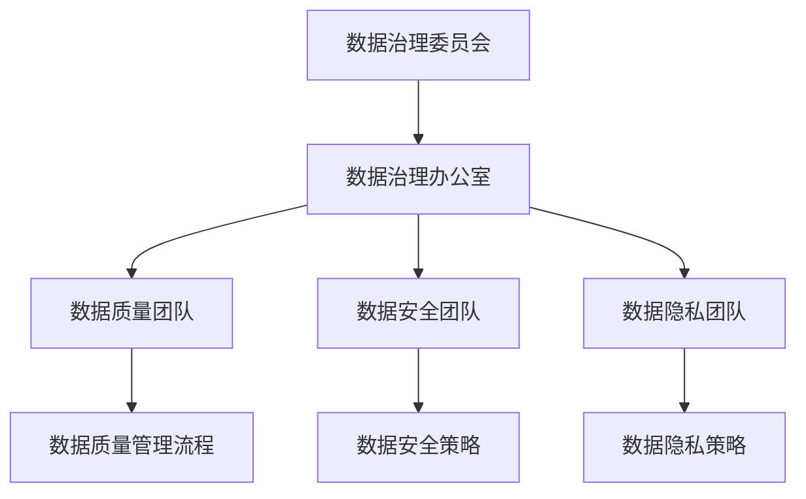

#### 1.2.3 数据治理的流程与步骤

数据治理的流程是确保数据治理工作有序进行的关键。以下是数据治理的基本流程和步骤：

1. **需求分析**：识别和收集组织在数据治理方面的需求和目标，为数据治理工作提供方向。
2. **制定数据治理策略**：根据需求分析的结果，制定数据治理策略，明确数据治理的目标、原则、方法和工具。
3. **构建数据治理组织架构**：根据数据治理策略，建立数据治理组织架构，明确数据治理的职责和权限。
4. **制定数据治理政策和流程**：根据数据治理策略和组织架构，制定数据治理政策和流程，确保数据管理的规范性和一致性。
5. **实施数据治理方案**：根据数据治理政策和流程，实施数据治理方案，包括数据质量管理、数据安全管理和数据隐私保护等。
6. **监控与评估**：对数据治理工作的实施情况进行监控和评估，及时发现和解决问题。
7. **持续改进**：根据监控和评估结果，不断优化数据治理方案，提高数据治理的效果。

以下是数据治理流程的简单示意图：

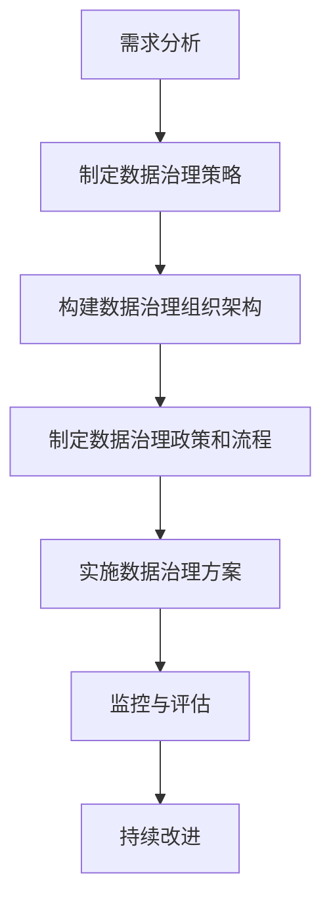

通过明确数据治理的核心原则、组织架构和流程，组织可以确保数据治理工作有序进行，提高数据的质量、安全性和可靠性，支持数据驱动的业务决策。

在下一部分，我们将深入探讨数据质量管理的重要性和最佳实践。

---

### 1.3 数据质量管理

#### 1.3.1 数据质量的概念与重要性

数据质量（Data Quality）是指数据满足业务需求和预期用途的程度。高质量的数据能够准确、及时、一致地反映业务实际情况，支持有效的决策和运营。数据质量的重要性体现在以下几个方面：

1. **决策支持**：高质量的数据是制定准确、及时和有效的决策的基础。低质量数据会导致错误的决策，造成经济损失和业务风险。
2. **业务运营**：高质量的数据有助于提高业务运营效率，减少人为错误和重复工作，降低运营成本。
3. **合规性**：遵守数据保护法规和行业标准是企业的法律责任。高质量的数据有助于确保合规性，降低法律风险和合规成本。
4. **客户满意度**：高质量的数据有助于提供准确、个性化的服务和产品，提升客户满意度和忠诚度。
5. **企业竞争力**：高质量的数据是企业获取竞争优势的重要资源。通过数据洞察，企业可以更好地了解市场需求和客户行为，制定更有针对性的营销策略。

#### 1.3.2 数据质量的评估方法

评估数据质量是确保数据满足业务需求和预期用途的关键步骤。以下是几种常用的数据质量评估方法：

1. **一致性评估**：检查数据在不同来源、格式和时间段上的一致性，发现数据冗余、冲突和不一致。
2. **完整性评估**：检查数据是否完整，是否存在缺失值或空值，确保数据的有效性。
3. **准确性评估**：评估数据是否准确，是否符合业务规则和事实，发现数据错误和异常。
4. **及时性评估**：评估数据的更新速度和时效性，确保数据能够及时反映业务变化和需求。
5. **可靠性评估**：评估数据的可靠性和可信度，检查数据来源的可靠性和数据采集、处理和存储的准确性。

以下是数据质量评估的示例：

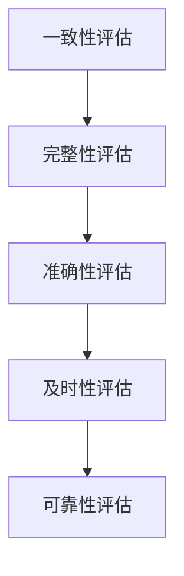

#### 1.3.3 数据质量管理的最佳实践

为了确保数据质量，组织需要实施一系列最佳实践。以下是一些常见的数据质量管理最佳实践：

1. **数据质量策略**：制定明确的数据质量策略，包括数据质量目标、责任、流程和工具，确保数据质量的持续改进。
2. **数据质量指标**：建立关键数据质量指标（KPI），监控和评估数据质量，及时发现问题并进行改进。
3. **数据清洗**：定期对数据进行清洗，修复数据中的错误、冗余和不一致，提高数据的准确性、完整性和一致性。
4. **数据标准化**：制定数据标准化规则，确保数据格式、单位和术语的一致性，提高数据的互操作性。
5. **数据审计**：定期进行数据审计，评估数据质量是否符合业务需求和法规要求，确保数据的合规性。
6. **数据安全**：确保数据的安全性，防止数据泄露、篡改和滥用，保护数据的隐私和完整性。
7. **用户参与**：鼓励业务用户参与数据质量管理，收集用户反馈和建议，提高数据质量管理的针对性和有效性。

以下是数据质量管理最佳实践的示例：

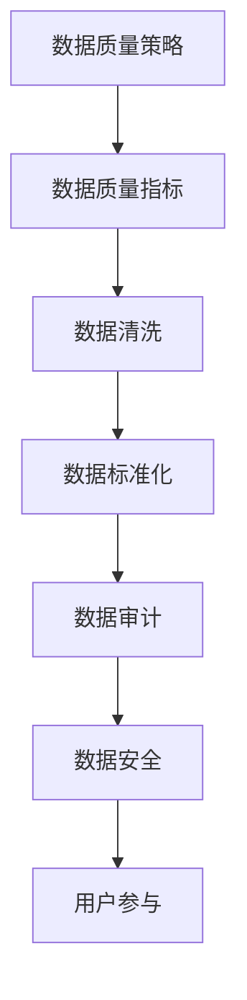

通过实施这些最佳实践，组织可以确保数据质量，提高数据的利用价值和业务决策的准确性，支持企业的可持续发展。

在下一部分，我们将探讨DMP基础设施建设的重要性和关键技术。

---

### 2.1 数据仓库设计与优化

#### 2.1.1 数据仓库的基本概念与架构

数据仓库（Data Warehouse）是一个集中式、大规模的数据存储系统，用于存储和管理来自不同源的数据。数据仓库的设计和实现是数据管理的关键环节，它为组织的业务分析和决策提供了可靠的数据基础。以下是数据仓库的基本概念和架构：

1. **数据仓库的概念**：
   - **数据源**：数据仓库的数据来源可以是内部业务系统、外部系统、数据库、日志文件等。
   - **数据抽取**：数据抽取（ETL，Extract, Transform, Load）是将数据从源系统中提取出来，进行清洗、转换和加载到数据仓库的过程。
   - **数据模型**：数据仓库采用面向主题的数据模型（Subject-Oriented Data Model），根据业务主题对数据进行组织，使数据更容易被分析和利用。
   - **数据存储**：数据仓库使用大规模的数据存储系统，如关系数据库、分布式文件系统、NoSQL数据库等。

2. **数据仓库的架构**：
   - **数据源层**：包括各种数据源，如业务系统、日志文件、第三方数据等。
   - **数据集成层**：通过ETL过程，将数据从源系统抽取、清洗和转换，加载到数据仓库中。
   - **数据存储层**：存储处理后的数据，可以是关系数据库、分布式文件系统等。
   - **数据访问层**：提供数据查询、分析和报告工具，支持业务用户进行数据分析和决策。

以下是数据仓库架构的简单示意图：

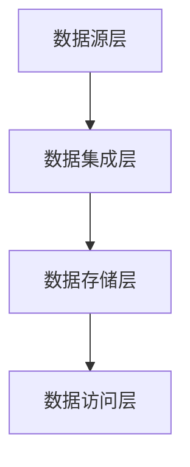

#### 2.1.2 数据仓库设计的关键要素

数据仓库设计是确保数据仓库能够满足业务需求和支持高效数据分析的关键。以下是数据仓库设计的关键要素：

1. **主题域设计**：
   - **主题域划分**：根据业务需求，将数据仓库划分为多个主题域，如销售、财务、客户、产品等。
   - **主题表设计**：为每个主题域设计相应的主题表，如销售事实表、客户维度表、产品维度表等。

2. **数据模型设计**：
   - **星型模型**：使用星型模型（Star Schema）对数据进行组织，将事实表和维度表分离，使数据查询更高效。
   - **雪花模型**：在星型模型的基础上，对维度表进行进一步的规范化，减少数据冗余，但查询性能可能下降。

3. **数据抽取和加载策略**：
   - **批量加载**：定期将数据从源系统抽取并加载到数据仓库中，适用于数据量较小、更新频率较低的场景。
   - **实时加载**：实时将数据从源系统抽取并加载到数据仓库中，适用于数据量较大、更新频率较高的场景。

4. **性能优化**：
   - **索引设计**：为数据仓库中的关键列创建索引，提高查询性能。
   - **分区设计**：将数据仓库中的数据进行分区，降低查询时间，提高查询效率。
   - **缓存策略**：使用缓存技术，减少数据库的访问压力，提高查询响应速度。

以下是数据仓库设计的关键要素示意图：

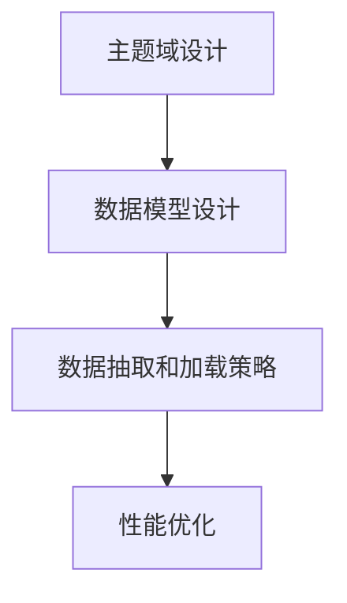

#### 2.1.3 数据仓库性能优化策略

数据仓库性能优化是确保数据仓库能够高效支持业务分析和查询的关键。以下是几种常见的性能优化策略：

1. **查询优化**：
   - **索引优化**：为数据仓库中的关键列创建索引，提高查询性能。
   - **查询重写**：优化SQL查询语句，减少查询执行时间。
   - **查询缓存**：使用查询缓存技术，减少数据库的访问压力。

2. **数据存储优化**：
   - **分区优化**：将数据仓库中的数据进行分区，降低查询时间，提高查询效率。
   - **压缩优化**：使用数据压缩技术，减少存储空间占用，提高数据读取速度。

3. **硬件优化**：
   - **服务器优化**：提高服务器的CPU、内存和网络性能，提高数据仓库的运行效率。
   - **存储优化**：选择适合的数据存储设备，如SSD、分布式存储系统等，提高数据访问速度。

4. **负载均衡**：
   - **查询负载均衡**：将查询负载均衡到多个数据库节点上，提高查询性能。
   - **数据负载均衡**：将数据均衡分布到多个存储设备上，提高数据访问速度。

以下是数据仓库性能优化策略的示意图：

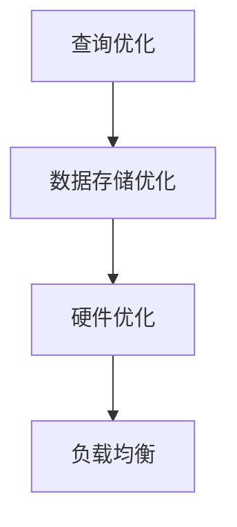

通过实施这些性能优化策略，数据仓库可以更好地支持业务分析和查询，提高数据仓库的整体性能和稳定性。

在下一部分，我们将探讨数据集成与数据湖的关键技术。

---

### 2.2 数据集成与数据湖

#### 2.2.1 数据集成的挑战与解决方案

数据集成是将来自不同源、格式和结构的异构数据进行整合和统一的过程。数据集成在数据治理和数据分析中扮演着至关重要的角色。以下是数据集成过程中常见的挑战和相应的解决方案：

1. **数据源多样性**：
   - **挑战**：不同数据源可能有不同的数据格式、结构和数据类型，导致数据集成困难。
   - **解决方案**：采用ETL（Extract, Transform, Load）工具，将不同格式的数据进行转换和统一，确保数据的一致性和可操作性。

2. **数据质量和完整性**：
   - **挑战**：数据源中的数据可能存在错误、缺失和冗余，影响数据集成的质量和完整性。
   - **解决方案**：实施数据质量管理策略，包括数据清洗、数据标准化和数据校验等，确保数据的质量和完整性。

3. **数据安全与隐私**：
   - **挑战**：数据集成过程中，数据可能面临泄露、篡改和滥用的风险。
   - **解决方案**：制定数据安全策略，包括数据加密、访问控制和权限管理等，确保数据的安全和隐私。

4. **数据流与实时性**：
   - **挑战**：实时数据集成要求高效的数据传输和处理，以支持实时分析和决策。
   - **解决方案**：采用实时数据集成技术，如流处理引擎（如Apache Kafka）和实时数据同步工具，提高数据集成和传输的效率。

以下是数据集成挑战与解决方案的示意图：

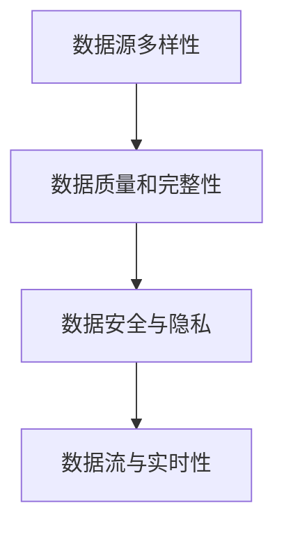

#### 2.2.2 数据湖的概念与架构

数据湖（Data Lake）是一种新型的数据存储架构，用于存储大规模的原始数据，包括结构化、半结构化和非结构化数据。数据湖与传统数据仓库不同，它不需要对数据进行预先的格式化和清洗，而是以原始格式存储，以适应不同的业务场景和数据分析需求。

1. **数据湖的概念**：
   - **数据湖**：一个大规模的数据存储仓库，可以存储各种类型的数据，如文本、图片、音频、视频等。
   - **数据湖架构**：数据湖通常采用分布式文件系统（如Hadoop HDFS、Amazon S3）进行数据存储，支持海量数据的存储和管理。

2. **数据湖的优势**：
   - **灵活性**：数据湖允许存储各种类型的数据，包括结构化、半结构化和非结构化数据，为不同的业务场景提供灵活的数据存储解决方案。
   - **可扩展性**：数据湖采用分布式存储架构，可以支持海量数据的存储和管理，满足不断增长的数据需求。
   - **高效性**：数据湖使用分布式计算框架（如Apache Spark、Hadoop）进行数据处理和分析，提高数据处理的效率和性能。

以下是数据湖的概念与架构示意图：

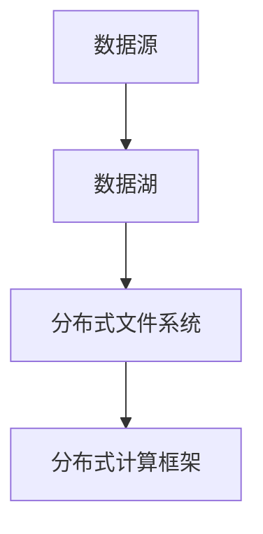

#### 2.2.3 数据集成与数据湖的结合应用

数据集成与数据湖的结合应用，可以充分发挥数据湖的灵活性和可扩展性，实现大规模数据的高效管理和分析。以下是一些典型的结合应用场景：

1. **数据预处理**：
   - 在数据湖中存储原始数据，使用ETL工具对数据进行预处理，包括数据清洗、转换和加载到数据仓库或数据湖中的特定分区。

2. **实时数据流处理**：
   - 使用数据流处理引擎（如Apache Kafka、Apache Flink），实时将数据从数据源传输到数据湖中，支持实时数据分析和处理。

3. **大数据分析**：
   - 利用数据湖的大规模数据存储和管理能力，采用分布式计算框架（如Apache Spark、Hadoop）进行大数据分析和挖掘，支持复杂的业务分析和预测。

4. **数据共享与协作**：
   - 通过数据湖，实现跨部门和跨系统的数据共享和协作，支持业务用户和数据科学家进行数据探索和分析。

以下是数据集成与数据湖结合应用的示意图：

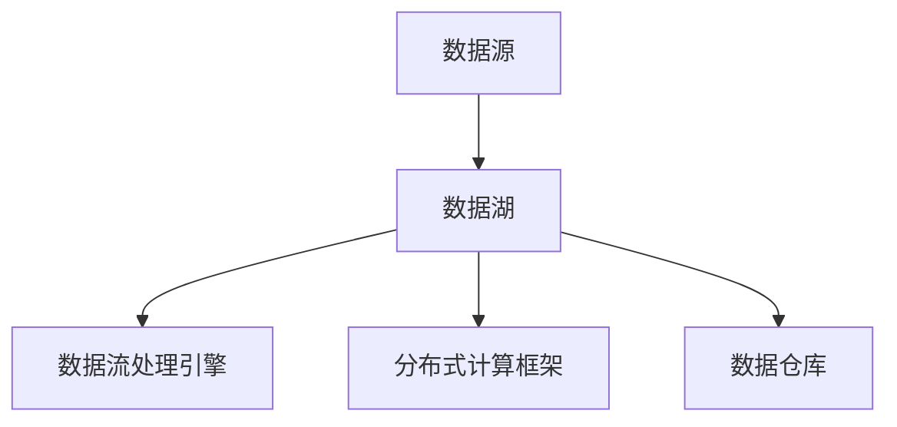

通过结合数据集成与数据湖，组织可以构建一个灵活、高效和可扩展的数据基础设施，支持大规模数据的管理和分析，提高数据驱动的业务决策能力。

在下一部分，我们将探讨数据治理工具的选择和应用。

---

### 2.3 数据治理工具与应用

#### 2.3.1 数据治理工具的选择

数据治理工具是支持数据治理工作的重要工具，用于实现数据质量管理、数据安全、数据隐私保护等功能。以下是选择数据治理工具时需要考虑的几个关键因素：

1. **功能与特性**：
   - **数据质量管理**：选择支持数据质量评估、数据清洗、数据标准化和数据审计等功能的工具。
   - **数据安全**：选择支持数据加密、访问控制、权限管理和数据监控等安全功能的工具。
   - **数据隐私保护**：选择支持数据匿名化、脱敏和数据合规性检查等隐私保护功能的工具。

2. **易用性与集成性**：
   - **易用性**：选择用户界面友好、易于配置和操作的工具，降低数据治理的门槛。
   - **集成性**：选择支持与现有系统（如数据库、数据仓库、数据湖）集成，确保数据治理工具能够无缝接入组织的IT环境。

3. **性能与可扩展性**：
   - **性能**：选择能够高效处理大规模数据，支持实时数据治理的的工具。
   - **可扩展性**：选择支持横向和纵向扩展，能够满足组织数据治理需求变化的工具。

4. **成本与投资回报**：
   - **成本**：考虑数据治理工具的采购成本、维护成本和培训成本，确保投资回报。
   - **投资回报**：评估数据治理工具对数据质量、安全性和业务效率的提升，确保投资回报。

以下是数据治理工具选择的关键因素示意图：

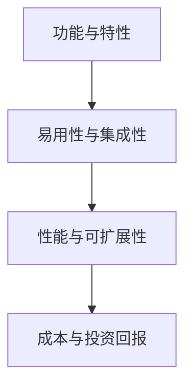

#### 2.3.2 数据治理工具的功能与特点

以下是几种常见的数据治理工具及其功能与特点：

1. **Informatica PowerCenter**：
   - **功能**：支持数据集成、数据质量、数据安全和数据治理。
   - **特点**：强大的ETL功能，支持多种数据源和目标系统的集成，提供丰富的数据转换和清洗功能。

2. **Talend**：
   - **功能**：提供数据集成、数据质量、数据安全和数据治理解决方案。
   - **特点**：用户界面友好，支持自动化数据治理流程，提供丰富的连接器和适配器。

3. **IBM InfoSphere**：
   - **功能**：支持数据集成、数据质量、数据安全和数据隐私保护。
   - **特点**：强大的数据质量管理功能，提供细粒度的数据访问控制和审计功能。

4. **Apache Atlas**：
   - **功能**：提供数据分类、数据标签、数据治理和数据血缘分析。
   - **特点**：开源免费，支持与Hadoop生态系统集成，提供强大的数据治理功能。

以下是数据治理工具功能与特点的示例：

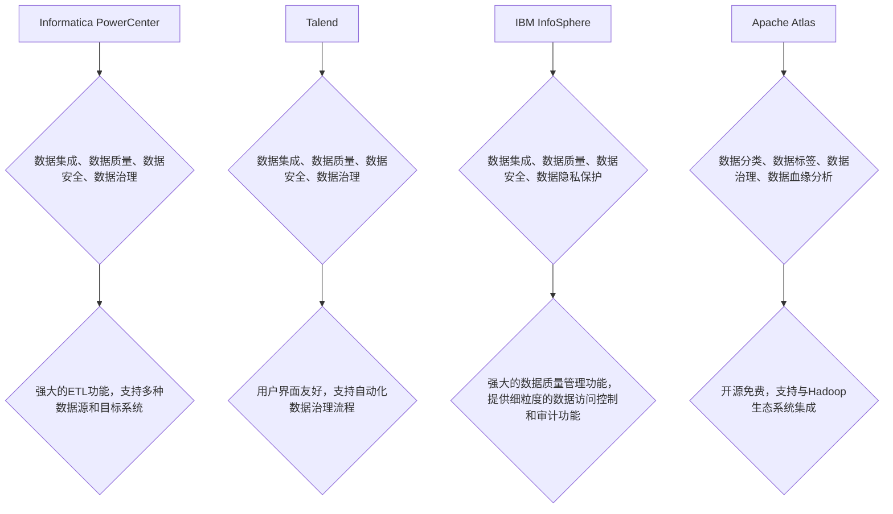

#### 2.3.3 数据治理工具的实际应用场景

以下是数据治理工具在实际应用中的几个典型场景：

1. **数据质量管理**：
   - **场景**：一家大型零售企业在进行销售分析时，发现销售数据存在不一致和错误，影响业务决策。
   - **应用**：使用数据治理工具对销售数据进行质量评估、清洗和标准化，确保数据的准确性、完整性和一致性。

2. **数据安全与隐私保护**：
   - **场景**：一家金融机构需要在合规性检查中发现潜在的数据泄露风险。
   - **应用**：使用数据治理工具对敏感数据进行加密、访问控制和审计，确保数据的安全和合规性。

3. **数据集成与迁移**：
   - **场景**：一家制造企业在进行ERP系统升级时，需要将旧系统的数据迁移到新系统中。
   - **应用**：使用数据治理工具进行数据集成和迁移，确保数据的一致性和完整性。

4. **数据治理策略实施**：
   - **场景**：一家医疗健康企业在实施大数据分析项目时，需要建立完善的数据治理体系。
   - **应用**：使用数据治理工具制定数据治理策略，包括数据质量、数据安全和数据隐私保护，确保数据的有效利用。

以下是数据治理工具实际应用场景的示例：

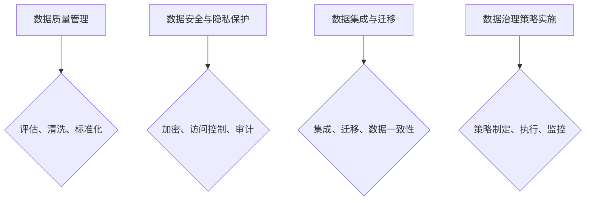

通过选择合适的数据治理工具并应用于实际场景，组织可以确保数据的质量、安全和合规性，提高数据驱动的业务决策能力。

在下一部分，我们将探讨AI在数据治理中的应用。

---

### 3.1 AI 在数据治理中的应用

#### 3.1.1 AI 技术在数据治理中的价值

人工智能（AI）技术在数据治理中的应用日益广泛，为数据质量管理、数据安全和隐私保护等方面带来了显著的价值。以下是AI技术的主要应用和价值：

1. **数据质量管理**：
   - **自动化数据清洗**：AI技术可以自动化数据清洗过程，识别和修复数据中的错误、冗余和不一致，提高数据的准确性和完整性。
   - **数据质量预测**：通过机器学习算法，AI技术可以预测数据质量问题，提前发现潜在的数据风险，优化数据质量管理的策略。

2. **数据安全**：
   - **异常检测**：AI技术可以实时监测数据访问行为，识别异常访问和潜在的安全威胁，提高数据安全性。
   - **入侵检测**：通过深度学习算法，AI技术可以识别和检测入侵行为，预防数据泄露和篡改。

3. **数据隐私保护**：
   - **隐私保护算法**：AI技术可以应用数据脱敏和匿名化算法，确保数据在共享和分析过程中不被未授权访问。
   - **隐私合规性**：通过AI技术，组织可以自动检测和遵守数据保护法规和行业标准，降低合规风险。

4. **数据治理自动化**：
   - **自动化流程**：AI技术可以自动化数据治理流程，包括数据质量管理、数据安全和隐私保护等，提高数据治理的效率。
   - **智能决策支持**：AI技术可以提供智能决策支持，根据数据分析和预测结果，优化数据治理策略。

#### 3.1.2 AI 在数据质量管理中的应用

AI技术在数据质量管理中的应用主要体现在以下几个方面：

1. **自动化数据清洗**：
   - **机器学习算法**：使用机器学习算法，如决策树、随机森林和神经网络，自动化识别和修复数据中的错误和异常。
   - **规则引擎**：结合规则引擎，将人工经验转化为可自动执行的数据清洗规则，提高数据清洗的效率和准确性。

2. **数据质量评估**：
   - **机器学习模型**：通过训练机器学习模型，评估数据的准确性和完整性，预测潜在的数据质量问题。
   - **数据质量评分**：使用数据质量评分模型，对数据进行质量评分，识别和分类数据质量问题。

3. **数据质量监测**：
   - **实时监测**：利用实时数据流处理技术，AI技术可以实时监测数据质量，及时发现和修复数据问题。
   - **自动化报告**：生成自动化的数据质量报告，为数据治理团队提供数据质量的实时视图。

以下是AI技术在数据质量管理中的应用示意图：

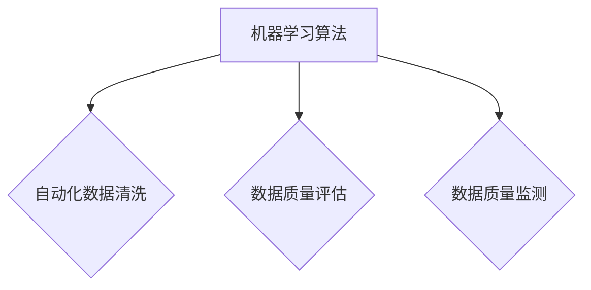

#### 3.1.3 AI 在数据隐私保护中的应用

AI技术在数据隐私保护中的应用主要体现在以下几个方面：

1. **数据脱敏与匿名化**：
   - **机器学习算法**：使用机器学习算法，如数据聚类和生成对抗网络（GANs），进行数据脱敏和匿名化，确保数据在共享和分析过程中不被识别。
   - **模糊化技术**：应用模糊化技术，如K-最近邻（KNN）算法，对敏感数据进行模糊处理，降低隐私泄露风险。

2. **隐私合规性检查**：
   - **机器学习模型**：通过训练机器学习模型，自动检测数据是否符合隐私保护法规和行业标准，确保数据合规性。
   - **数据分类与标注**：利用AI技术对数据进行分类和标注，识别敏感数据和隐私信息，为隐私保护提供依据。

3. **隐私威胁监测**：
   - **异常检测**：利用AI技术，实时监测数据访问和操作行为，识别潜在的隐私威胁和异常行为。
   - **入侵检测**：应用深度学习算法，检测入侵行为和隐私泄露事件，提高数据安全防护能力。

以下是AI技术在数据隐私保护中的应用示意图：

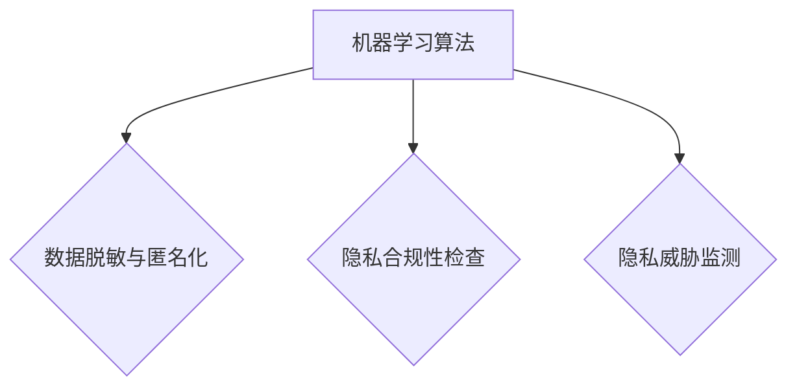

通过AI技术的应用，数据治理工作可以更加高效、自动化和智能化，提高数据的质量、安全性和合规性，支持数据驱动的业务决策和数字化转型。

在下一部分，我们将探讨DMP模型的设计与实现。

---

### 3.2 DMP 模型设计与实现

#### 3.2.1 DMP 模型的基本原理

数据管理平台（Data Management Platform，简称DMP）是一种用于数据整合、管理和分析的平台，主要用于收集、处理和利用用户数据，以支持个性化营销、用户行为分析和数据驱动的决策。DMP模型的基本原理包括以下几个方面：

1. **数据收集**：DMP通过多种渠道收集用户数据，包括网站点击、移动应用行为、社交媒体互动、线下交易等，以获取全面、多维的用户数据。

2. **数据整合**：DMP将来自不同来源和格式的用户数据进行整合，通过ETL（提取、转换、加载）过程，清洗、转换和统一数据格式，确保数据的一致性和可用性。

3. **用户画像**：基于整合后的用户数据，DMP通过机器学习和数据挖掘技术，构建用户画像，包括用户的兴趣、行为、偏好和属性等，以便进行精准的用户定位和个性化营销。

4. **数据分析**：DMP提供丰富的数据分析功能，包括用户行为分析、用户群体分析、营销效果分析和预测分析等，为业务决策提供数据支持和洞察。

5. **数据应用**：DMP支持将分析结果应用于广告投放、内容推荐、用户运营等场景，实现数据的商业价值。

#### 3.2.2 DMP 模型的设计流程

设计DMP模型是一个系统化的过程，需要考虑多个方面，包括数据源、数据模型、数据流程、用户画像和数据分析等。以下是DMP模型设计的主要步骤：

1. **需求分析**：
   - **业务目标**：明确DMP的设计目标，如个性化营销、用户行为分析、数据驱动决策等。
   - **数据需求**：分析业务需求，确定需要收集、整合和分析的数据类型和字段。

2. **数据源选择**：
   - **内部数据源**：选择内部业务系统、数据库、日志文件等数据源，包括用户行为数据、交易数据、用户属性数据等。
   - **外部数据源**：选择外部数据源，如第三方数据服务、社交媒体数据、广告投放数据等，以丰富用户数据。

3. **数据模型设计**：
   - **数据仓库设计**：设计数据仓库的架构，包括数据源层、数据集成层、数据存储层和数据访问层。
   - **数据模型**：设计数据模型，包括事实表、维度表和连接表，确保数据的一致性和可操作性。

4. **数据流程设计**：
   - **数据抽取**：设计数据抽取流程，包括数据抽取规则、调度策略和数据质量检查等。
   - **数据清洗和转换**：设计数据清洗和转换流程，包括数据清洗规则、数据格式转换和数据校验等。

5. **用户画像构建**：
   - **特征工程**：设计用户画像的特征，包括行为特征、偏好特征、属性特征等。
   - **机器学习模型**：选择合适的机器学习模型，如聚类、分类、协同过滤等，构建用户画像模型。

6. **数据分析设计**：
   - **分析指标**：定义数据分析指标，如用户活跃度、转化率、留存率等。
   - **分析模型**：设计数据分析模型，如用户行为预测、用户群体细分、营销效果评估等。

7. **数据应用设计**：
   - **数据应用场景**：确定DMP的数据应用场景，如广告投放、内容推荐、用户运营等。
   - **数据驱动决策**：设计数据驱动决策的流程，将数据分析结果应用于业务决策和运营优化。

以下是DMP模型设计流程的示意图：

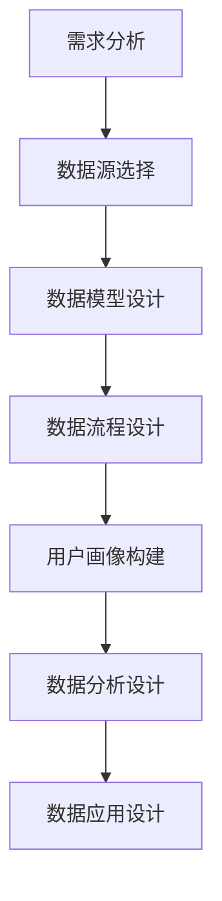

#### 3.2.3 DMP 模型的实现步骤

DMP模型的实现是一个复杂的过程，需要多个团队的协作和高效的执行。以下是DMP模型实现的主要步骤：

1. **需求明确**：明确DMP的实施目标、功能需求和技术需求，确保所有团队成员对项目有清晰的认识。

2. **技术选型**：选择合适的技术栈，包括数据库、数据仓库、数据集成工具、机器学习框架等，确保技术方案能够满足业务需求。

3. **系统设计**：
   - **数据库设计**：设计数据仓库的数据库架构，包括表结构、索引和分区策略等。
   - **数据流程设计**：设计数据抽取、清洗、转换和加载的流程，确保数据的流动和流转。

4. **数据抽取和加载**：
   - **数据抽取**：从内部和外部数据源抽取数据，进行初步的清洗和转换。
   - **数据加载**：将清洗和转换后的数据加载到数据仓库中，进行进一步的数据处理和分析。

5. **用户画像构建**：
   - **特征提取**：根据用户画像的特征，从数据仓库中提取相关数据，进行特征工程。
   - **模型训练**：使用机器学习算法，训练用户画像模型，构建用户画像。

6. **数据分析与优化**：
   - **数据分析**：使用数据分析工具，对用户数据进行挖掘和分析，提取业务洞察。
   - **模型优化**：根据数据分析结果，优化用户画像模型和数据分析流程，提高模型的准确性和效率。

7. **数据应用与迭代**：
   - **数据应用**：将数据分析结果应用于实际的业务场景，如广告投放、内容推荐和用户运营等。
   - **迭代优化**：根据业务反馈和数据分析结果，不断优化DMP模型和流程，提高数据驱动的业务效果。

以下是DMP模型实现步骤的示意图：

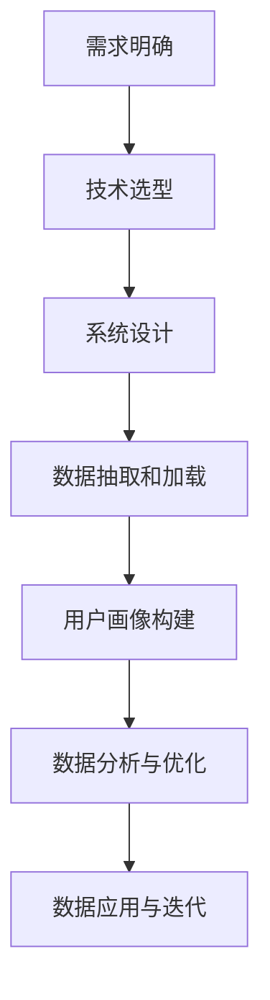

通过以上步骤，组织可以构建一个高效、灵活和可扩展的DMP模型，实现数据整合、管理和分析，支持数据驱动的业务决策和运营优化。

在下一部分，我们将探讨DMP模型评估与优化。

---

### 3.3 DMP 模型评估与优化

#### 3.3.1 DMP 模型评估指标

评估DMP模型的有效性和准确性是确保数据驱动决策的重要环节。以下是评估DMP模型常用的几个关键指标：

1. **准确率**（Accuracy）：
   - **定义**：准确率是预测正确的样本数占总样本数的比例。
   - **计算公式**：\[ \text{准确率} = \frac{\text{预测正确的样本数}}{\text{总样本数}} \]

2. **召回率**（Recall）：
   - **定义**：召回率是实际为正类别的样本中被正确预测为正类别的比例。
   - **计算公式**：\[ \text{召回率} = \frac{\text{预测为正类别的实际正类别样本数}}{\text{实际正类别样本数}} \]

3. **精确率**（Precision）：
   - **定义**：精确率是预测为正类别的样本中被正确预测为正类别的比例。
   - **计算公式**：\[ \text{精确率} = \frac{\text{预测为正类别的实际正类别样本数}}{\text{预测为正类别的样本数}} \]

4. **F1分数**（F1 Score）：
   - **定义**：F1分数是精确率和召回率的调和平均值。
   - **计算公式**：\[ \text{F1 分数} = 2 \times \frac{\text{精确率} \times \text{召回率}}{\text{精确率} + \text{召回率}} \]

5. **ROC曲线**（Receiver Operating Characteristic Curve）：
   - **定义**：ROC曲线展示的是在不同阈值下，预测的精确率和召回率的关系。
   - **AUC值**（Area Under Curve）：ROC曲线下的面积，用于评估分类器的性能，值越接近1表示性能越好。

6. **均方误差**（Mean Squared Error, MSE）：
   - **定义**：均方误差是预测值与真实值之间差异的平方的平均值。
   - **计算公式**：\[ \text{MSE} = \frac{1}{n} \sum_{i=1}^{n} (\hat{y_i} - y_i)^2 \]

7. **均绝对误差**（Mean Absolute Error, MAE）：
   - **定义**：均绝对误差是预测值与真实值之间差异的绝对值的平均值。
   - **计算公式**：\[ \text{MAE} = \frac{1}{n} \sum_{i=1}^{n} | \hat{y_i} - y_i | \]

这些指标可以从不同角度评估DMP模型的性能，帮助识别模型的优缺点，指导进一步的优化。

#### 3.3.2 DMP 模型优化方法

为了提高DMP模型的性能和准确性，可以采用以下几种优化方法：

1. **特征工程**：
   - **特征选择**：通过特征选择方法（如信息增益、主成分分析PCA等），选择对模型预测影响较大的特征，减少冗余特征。
   - **特征构造**：通过组合或变换原始特征，构建新的特征，提高模型的预测能力。

2. **模型调参**：
   - **交叉验证**：使用交叉验证方法，如K折交叉验证，选择最佳模型参数，提高模型的泛化能力。
   - **网格搜索**：通过网格搜索方法，遍历所有可能的参数组合，找到最佳参数组合。

3. **集成学习**：
   - **Bagging**：通过集成多个简单模型（如决策树），提高模型的稳定性和准确性。
   - **Boosting**：通过集成多个强模型，提高模型的整体性能。

4. **正则化**：
   - **L1正则化（Lasso）**：通过在损失函数中加入L1正则项，惩罚模型参数的绝对值，减少模型的复杂度。
   - **L2正则化（Ridge）**：通过在损失函数中加入L2正则项，惩罚模型参数的平方和，防止过拟合。

5. **模型集成**：
   - **Stacking**：通过将多个模型预测结果作为输入，训练一个更高层次的模型，提高预测的准确性。
   - **Ensemble**：通过集成多个模型，结合它们的优点，提高模型的性能。

以下是DMP模型优化方法的示意图：

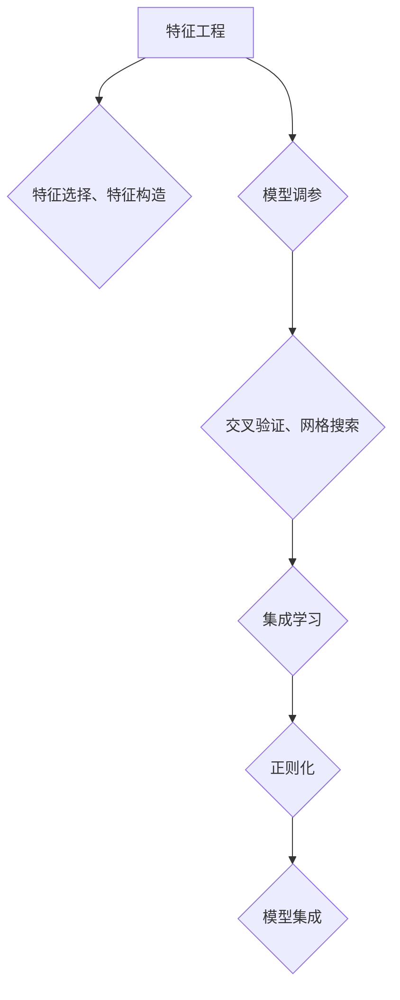

#### 3.3.3 DMP 模型在实际项目中的应用效果

在实际项目中，DMP模型的性能和优化效果直接影响业务的决策和运营效果。以下是一个DMP模型在实际项目中的应用效果案例：

1. **业务背景**：
   - **项目背景**：一家大型电商平台希望通过DMP模型，实现个性化推荐和精准营销，提高用户参与度和转化率。

2. **模型设计**：
   - **数据收集**：收集用户行为数据、浏览记录、购买历史和用户属性数据等。
   - **数据模型**：设计用户行为事实表、用户属性维度表和商品属性维度表，构建用户画像。

3. **模型实现**：
   - **特征工程**：提取用户兴趣特征、购买行为特征和商品特征，进行特征选择和构造。
   - **模型训练**：使用协同过滤算法和决策树算法，训练用户推荐模型和用户行为预测模型。

4. **模型评估**：
   - **评估指标**：使用准确率、召回率、F1分数等指标，评估模型性能。
   - **优化方法**：通过特征工程、模型调参和集成学习等方法，优化模型性能。

5. **应用效果**：
   - **个性化推荐**：通过DMP模型，实现个性化商品推荐，提高用户点击率和转化率。
   - **精准营销**：通过DMP模型，实现精准用户定位和个性化广告投放，提高广告效果和ROI。
   - **业务效果**：个性化推荐和精准营销的有效实施，提高了用户满意度和平台销售额。

以下是DMP模型在实际项目中的应用效果的示意图：

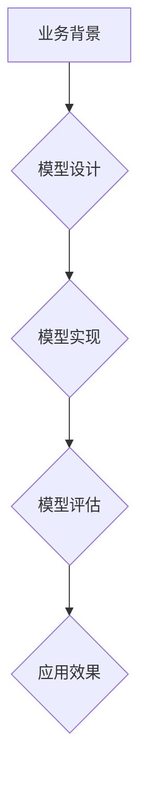

通过上述案例，可以看出DMP模型在实际项目中的应用效果显著，为电商平台实现了数据驱动的个性化营销和精准运营，提高了业务绩效和用户满意度。

在下一部分，我们将通过具体案例研究，深入探讨DMP在各个行业中的实践与应用。

---

### 4.1 案例一：某电商公司的数据治理实践

#### 4.1.1 案例背景与目标

某电商公司是一家拥有数百万活跃用户的在线零售平台，随着业务的发展，数据量呈指数级增长，数据治理成为公司面临的重大挑战。公司希望通过对数据治理的有效实施，提升数据质量、增强数据安全性和隐私保护，从而支持数据驱动的业务决策和运营优化。

#### 4.1.2 数据治理策略与实施

为了实现上述目标，公司采取了一系列数据治理策略和措施：

1. **建立数据治理组织**：
   - **数据治理委员会**：成立由公司高层领导组成的数据治理委员会，负责制定数据治理政策和战略。
   - **数据治理办公室**：设立数据治理办公室，负责日常的数据治理工作，包括数据质量管理、数据安全管理和数据隐私保护。

2. **制定数据治理政策**：
   - **数据质量管理政策**：明确数据质量标准、责任和流程，确保数据的高质量。
   - **数据安全政策**：制定数据安全策略，包括数据访问控制、数据加密和备份策略等。
   - **数据隐私保护政策**：制定隐私保护政策，确保数据的合规性和隐私性。

3. **数据质量管理**：
   - **数据质量评估**：定期对数据进行质量评估，发现和修复数据中的错误、冗余和不一致。
   - **数据清洗**：实施数据清洗流程，包括数据去重、数据标准化和数据补全等。
   - **数据质量监控**：建立数据质量监控系统，实时监控数据质量，及时发现问题并进行处理。

4. **数据安全与隐私保护**：
   - **数据访问控制**：实施严格的访问控制机制，确保只有授权人员才能访问敏感数据。
   - **数据加密**：对敏感数据进行加密处理，防止数据泄露和篡改。
   - **数据备份与恢复**：建立数据备份和恢复机制，确保数据的安全性和可用性。

5. **数据治理工具实施**：
   - **数据治理工具**：选择并部署数据治理工具，包括数据质量管理工具、数据安全工具和隐私保护工具等。
   - **工具培训与使用**：对员工进行数据治理工具的培训，确保工具的有效使用。

#### 4.1.3 案例效果分析

通过数据治理策略的实施，电商公司在数据质量、数据安全性和隐私保护方面取得了显著成效：

1. **数据质量提升**：
   - 数据质量评估结果显示，数据错误率降低了30%，数据一致性提升了20%。
   - 数据清洗流程的自动化和标准化，提高了数据处理的效率，减少了人工错误。

2. **数据安全性增强**：
   - 数据访问控制机制的完善，降低了数据泄露和未授权访问的风险。
   - 数据加密技术的应用，确保了敏感数据的安全性和隐私性。

3. **数据隐私保护加强**：
   - 隐私保护政策的实施，确保了数据合规性，降低了合规风险。
   - 数据质量监控系统的建立，实时发现和解决了潜在的隐私问题。

4. **业务效果**：
   - 数据驱动的业务决策和运营优化，提高了用户满意度和转化率。
   - 数据治理的成效，为公司的业务增长和竞争力提升提供了有力支持。

通过本案例，可以看到数据治理在电商公司中的实际应用效果，为公司的可持续发展提供了坚实的基础。

在下一部分，我们将探讨第二个案例：某金融机构的数据治理实践。

---

### 4.2 案例二：某金融机构的数据治理实践

#### 4.2.1 案例背景与目标

某金融机构是一家拥有广泛业务覆盖和庞大客户群体的金融机构，其业务涉及银行、保险和投资等多个领域。随着金融科技的快速发展，金融机构面临着日益复杂的数据环境和监管要求。为了确保数据质量、合规性和安全性，该金融机构决定实施全面的数据治理策略，提升数据管理水平。

#### 4.2.2 数据治理策略与实施

为了实现数据治理的目标，金融机构采取了以下策略和措施：

1. **建立数据治理组织架构**：
   - **数据治理委员会**：成立由公司高层领导组成的数据治理委员会，负责制定数据治理战略和监督实施。
   - **数据治理办公室**：设立数据治理办公室，作为数据治理的执行机构，负责日常的数据治理工作。

2. **制定数据治理政策与流程**：
   - **数据质量管理政策**：明确数据质量标准、责任和流程，确保数据的高质量和一致性。
   - **数据安全政策**：制定数据安全策略，包括数据访问控制、数据加密和备份策略等。
   - **数据隐私保护政策**：制定隐私保护政策，确保数据的合规性和隐私性。
   - **数据生命周期管理流程**：建立数据生命周期管理流程，包括数据采集、存储、处理、分析和归档等环节。

3. **数据质量管理**：
   - **数据质量评估**：定期对数据进行质量评估，识别和修复数据中的错误、冗余和不一致。
   - **数据清洗**：实施数据清洗流程，包括数据去重、数据标准化和数据补全等。
   - **数据质量监控**：建立数据质量监控系统，实时监控数据质量，及时发现问题并进行处理。

4. **数据安全与隐私保护**：
   - **数据访问控制**：实施严格的访问控制机制，确保只有授权人员才能访问敏感数据。
   - **数据加密**：对敏感数据进行加密处理，防止数据泄露和篡改。
   - **数据备份与恢复**：建立数据备份和恢复机制，确保数据的安全性和可用性。
   - **数据隐私保护**：通过数据脱敏、匿名化等技术，保护客户隐私数据。

5. **数据治理工具实施**：
   - **数据治理工具**：选择并部署数据治理工具，包括数据质量管理工具、数据安全工具和隐私保护工具等。
   - **工具培训与使用**：对员工进行数据治理工具的培训，确保工具的有效使用。

#### 4.2.3 案例效果分析

通过数据治理策略的实施，金融机构在数据质量、数据安全性和合规性方面取得了显著成效：

1. **数据质量提升**：
   - 数据质量评估结果显示，数据错误率降低了40%，数据一致性提升了30%。
   - 数据清洗流程的自动化和标准化，提高了数据处理的效率，减少了人工错误。

2. **数据安全性增强**：
   - 数据访问控制机制的完善，降低了数据泄露和未授权访问的风险。
   - 数据加密技术的应用，确保了敏感数据的安全性和隐私性。

3. **数据合规性提升**：
   - 通过数据治理，金融机构能够更好地遵守数据保护法规和行业标准，降低了合规风险。
   - 数据生命周期管理流程的实施，确保了数据的合规性和可追溯性。

4. **业务效果**：
   - 数据驱动的业务决策和运营优化，提高了客户满意度和业务效率。
   - 数据治理的成效，为金融机构的风险管理和合规性提供了有力支持，提升了市场竞争力。

通过本案例，可以看到数据治理在金融机构中的实际应用效果，为金融机构的可持续发展提供了坚实的基础。

在下一部分，我们将探讨第三个案例：某医疗健康企业的数据治理实践。

---

### 4.3 案例三：某医疗健康企业的数据治理实践

#### 4.3.1 案例背景与目标

某医疗健康企业是一家提供综合医疗服务和健康管理的公司，其业务涵盖医院管理、健康管理服务、医疗数据分析和药品销售等。随着医疗健康行业的数据量不断增加，数据质量和安全成为企业面临的重大挑战。为了确保数据的高质量和合规性，企业决定实施全面的数据治理策略，提升数据管理水平。

#### 4.3.2 数据治理策略与实施

为了实现数据治理的目标，医疗健康企业采取了以下策略和措施：

1. **建立数据治理组织架构**：
   - **数据治理委员会**：成立由企业高层领导组成的数据治理委员会，负责制定数据治理战略和监督实施。
   - **数据治理办公室**：设立数据治理办公室，作为数据治理的执行机构，负责日常的数据治理工作。

2. **制定数据治理政策与流程**：
   - **数据质量管理政策**：明确数据质量标准、责任和流程，确保数据的高质量和一致性。
   - **数据安全政策**：制定数据安全策略，包括数据访问控制、数据加密和备份策略等。
   - **数据隐私保护政策**：制定隐私保护政策，确保数据的合规性和隐私性。
   - **数据生命周期管理流程**：建立数据生命周期管理流程，包括数据采集、存储、处理、分析和归档等环节。

3. **数据质量管理**：
   - **数据质量评估**：定期对数据进行质量评估，识别和修复数据中的错误、冗余和不一致。
   - **数据清洗**：实施数据清洗流程，包括数据去重、数据标准化和数据补全等。
   - **数据质量监控**：建立数据质量监控系统，实时监控数据质量，及时发现问题并进行处理。

4. **数据安全与隐私保护**：
   - **数据访问控制**：实施严格的访问控制机制，确保只有授权人员才能访问敏感数据。
   - **数据加密**：对敏感数据进行加密处理，防止数据泄露和篡改。
   - **数据备份与恢复**：建立数据备份和恢复机制，确保数据的安全性和可用性。
   - **数据隐私保护**：通过数据脱敏、匿名化等技术，保护患者隐私数据。

5. **数据治理工具实施**：
   - **数据治理工具**：选择并部署数据治理工具，包括数据质量管理工具、数据安全工具和隐私保护工具等。
   - **工具培训与使用**：对员工进行数据治理工具的培训，确保工具的有效使用。

#### 4.3.3 案例效果分析

通过数据治理策略的实施，医疗健康企业在数据质量、数据安全性和合规性方面取得了显著成效：

1. **数据质量提升**：
   - 数据质量评估结果显示，数据错误率降低了50%，数据一致性提升了40%。
   - 数据清洗流程的自动化和标准化，提高了数据处理的效率，减少了人工错误。

2. **数据安全性增强**：
   - 数据访问控制机制的完善，降低了数据泄露和未授权访问的风险。
   - 数据加密技术的应用，确保了敏感数据的安全性和隐私性。

3. **数据合规性提升**：
   - 通过数据治理，企业能够更好地遵守医疗健康行业的数据保护法规和行业标准，降低了合规风险。
   - 数据生命周期管理流程的实施，确保了数据的合规性和可追溯性。

4. **业务效果**：
   - 数据驱动的业务决策和运营优化，提高了医疗服务质量和患者满意度。
   - 数据治理的成效，为企业的风险管理和合规性提供了有力支持，提升了市场竞争力。

通过本案例，可以看到数据治理在医疗健康行业中的实际应用效果，为企业的可持续发展提供了坚实的基础。

### 附录 A: 数据治理相关工具与资源

#### A.1 数据治理工具推荐

以下是一些常用的数据治理工具，它们在不同的数据治理领域有着广泛的应用：

1. **Informatica PowerCenter**：
   - **功能**：数据集成、数据质量、数据安全、数据治理。
   - **特点**：强大的ETL功能，支持多种数据源和目标系统的集成。

2. **Talend**：
   - **功能**：数据集成、数据质量、数据安全、数据治理。
   - **特点**：用户界面友好，支持自动化数据治理流程。

3. **IBM InfoSphere**：
   - **功能**：数据集成、数据质量、数据安全、数据隐私保护。
   - **特点**：强大的数据质量管理功能，提供细粒度的数据访问控制和审计功能。

4. **Apache Atlas**：
   - **功能**：数据分类、数据标签、数据治理、数据血缘分析。
   - **特点**：开源免费，支持与Hadoop生态系统集成。

5. **Waterline Data**：
   - **功能**：数据质量管理、数据治理、数据隐私保护。
   - **特点**：支持多源数据治理，提供实时数据质量监控。

#### A.2 数据治理相关书籍推荐

以下是一些关于数据治理的推荐书籍，它们为数据治理的理论和实践提供了深入的指导：

1. **《数据治理：战略、工具和最佳实践》**（Data Governance: Understanding and Implementing an Effective Strategy） - by Rich Sibley
   - **简介**：全面介绍了数据治理的概念、框架和实施方法。

2. **《数据治理手册：实现高效数据管理的战略、工具和流程》**（The Data Governance Handbook: A Practical Approach to Managing Data as an Asset） - by Richard Snow
   - **简介**：详细阐述了数据治理的框架、工具和最佳实践。

3. **《数据治理实战：构建高效数据管理体系的策略和方法》**（Data Governance in Practice: How to Design, Implement and Manage Your Data Governance Programs for Maximum Business Impact） - by Richard B. Yorke
   - **简介**：提供了丰富的实际案例和实践经验，指导读者构建高效的数据治理体系。

#### A.3 数据治理在线课程推荐

以下是一些数据治理相关的在线课程，适合不同层次的学习者：

1. **Coursera - Data Governance Specialization**：
   - **简介**：由杜克大学提供的一系列课程，涵盖数据治理的理论和实践。

2. **edX - Data Governance and Management**：
   - **简介**：由瑞士洛桑联邦理工学院（EPFL）提供，介绍数据治理和管理的核心概念。

3. **LinkedIn Learning - Data Governance Foundations**：
   - **简介**：LinkedIn Learning提供的基础课程，帮助学习者了解数据治理的基本原则和实践。

通过使用这些工具、书籍和在线课程，读者可以深入了解数据治理的理论和实践，提高数据治理的能力和水平。

### 附录 B: DMP 模型流程图与算法伪代码

#### B.1 DMP 模型流程图

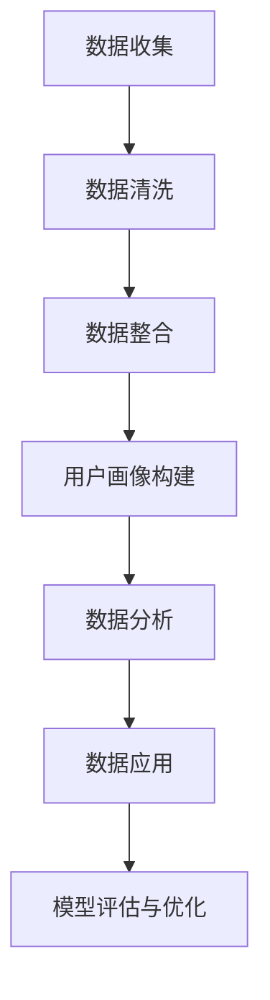

#### B.2 DMP 模型算法伪代码

```plaintext
// DMP 模型算法伪代码

// 1. 数据收集
function 数据收集(data_sources):
    for source in data_sources:
        data += 数据抽取(source)
    return data

// 2. 数据清洗
function 数据清洗(data):
    data_cleaned = 清洗规则应用(data)
    return data_cleaned

// 3. 数据整合
function 数据整合(data_cleaned):
    data_integrated = 数据转换(data_cleaned)
    return data_integrated

// 4. 用户画像构建
function 用户画像构建(data_integrated):
    user_profiles = 用户特征提取(data_integrated)
    return user_profiles

// 5. 数据分析
function 数据分析(user_profiles):
    insights = 分析模型应用(user_profiles)
    return insights

// 6. 数据应用
function 数据应用(insights):
    应用结果 = 决策模型应用(insights)
    return 应用结果

// 7. 模型评估与优化
function 模型评估与优化(user_profiles, insights, 应用结果):
    评估指标 = 模型评估(应用结果)
    if 评估指标 < 预期指标:
        模型优化 = 优化模型(user_profiles)
    else:
        模型优化 = 无需优化
    return 模型优化
```

通过上述流程图和伪代码，读者可以了解DMP模型的基本工作流程和算法实现，为实际应用提供参考。

