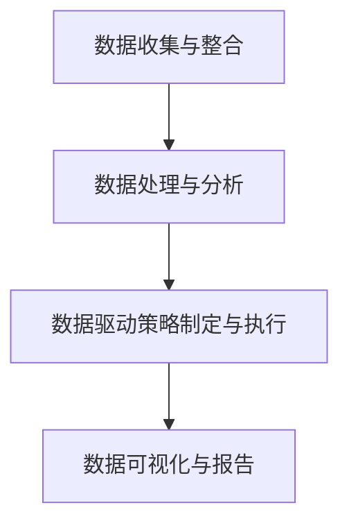
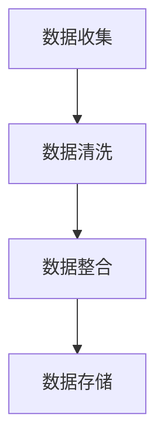
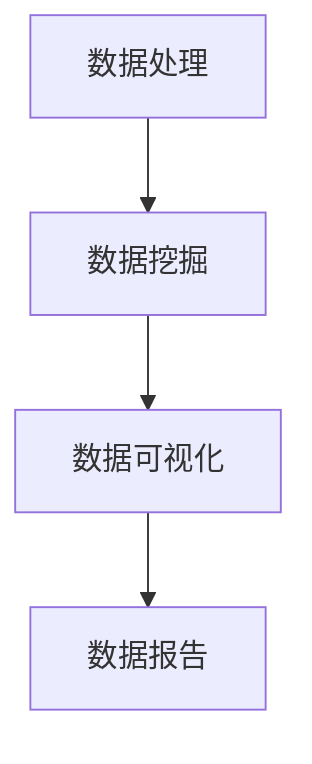
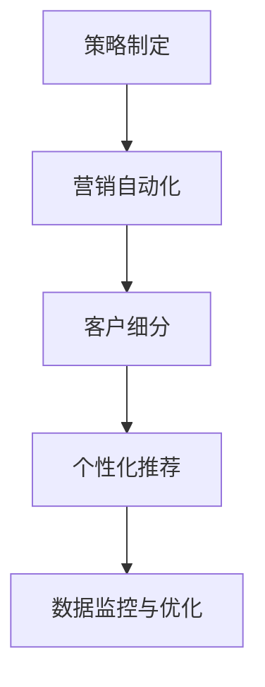

                 

# AI DMP 数据基建：数据驱动营销的成功案例

## 关键词

- AI DMP
- 数据驱动营销
- 数据采集
- 数据清洗
- 数据分析
- 客户细分
- 个性化推荐
- 营销自动化
- 数据可视化

## 摘要

本文旨在探讨AI DMP（数据管理平台）在数据驱动营销中的重要作用。通过深入分析AI DMP的架构与核心原理，以及其在客户细分、个性化推荐、营销自动化等领域的应用，本文展示了AI DMP如何帮助企业和品牌实现数据驱动营销的成功。此外，本文还通过多个行业案例，详细讲解了AI DMP的实施策略、优化方法及未来发展趋势，为企业提供了一套完整的数据驱动营销解决方案。

## 第一部分：数据驱动营销概述

### 1.1 数据驱动营销的概念与背景

#### 1.1.1 数据驱动营销的定义

数据驱动营销（Data-driven Marketing）是一种基于数据分析的营销策略，通过收集、处理和分析大量数据，为企业提供决策支持，从而优化营销活动、提高营销效果和投资回报率。

#### 1.1.2 数据驱动营销的发展历程

1. 早期阶段：20世纪90年代，数据营销初步兴起，企业开始尝试利用数据库管理系统进行客户关系管理。
2. 中期阶段：21世纪初，随着互联网和电子商务的兴起，企业积累了大量用户数据，数据驱动营销逐渐成为主流。
3. 现代阶段：大数据、人工智能技术的应用，使得数据驱动营销进入了一个全新的发展阶段，企业能够更加精准地了解用户需求，实现个性化营销。

#### 1.1.3 数据驱动营销的核心价值

1. 提高营销效率：通过数据分析和预测，优化营销策略，降低营销成本，提高营销效果。
2. 增强客户体验：基于用户数据，实现个性化推荐和服务，提升客户满意度和忠诚度。
3. 支持决策制定：提供全面、准确的数据分析报告，为企业战略规划和业务决策提供有力支持。
4. 优化投资分配：通过数据驱动营销，企业能够更合理地分配营销预算，实现资源最大化利用。

### 1.2 数据驱动营销的框架与流程

#### 1.2.1 数据收集与清洗

1. 数据收集：通过网站、APP、线上调查、线下活动等多种渠道收集用户数据。
2. 数据清洗：去除重复、错误、异常数据，保证数据质量。

#### 1.2.2 数据分析与挖掘

1. 数据预处理：进行数据清洗、转换、归一化等操作，为后续分析做好准备。
2. 数据分析：使用统计分析、机器学习等方法，挖掘数据中的有价值信息。

#### 1.2.3 数据驱动策略制定

1. 客户细分：根据用户数据，将客户划分为不同的群体。
2. 营销策略：基于客户细分，制定有针对性的营销策略。

#### 1.2.4 数据驱动营销实施与优化

1. 营销执行：实施营销策略，如发送电子邮件、推送通知、广告投放等。
2. 监控与评估：实时监控营销效果，对策略进行调整和优化。

## 第二部分：AI DMP 数据基建技术

### 2.1 AI DMP 概述

#### 2.1.1 AI DMP 的定义与作用

AI DMP（人工智能数据管理平台）是一种基于人工智能技术的数据管理工具，它能够帮助企业高效地收集、处理、分析和利用数据，从而实现数据驱动的营销战略。

1. 数据收集与整合：AI DMP 可以自动采集来自各种渠道的数据，如网站、APP、社交媒体等，并对数据进行整合和处理。
2. 数据分析与挖掘：AI DMP 利用机器学习和深度学习算法，对数据进行深入分析，挖掘数据中的潜在价值。
3. 客户细分与个性化推荐：基于数据分析结果，AI DMP 可以将客户划分为不同的群体，并为他们提供个性化的产品推荐和营销策略。

#### 2.1.2 AI DMP 的核心组成部分

1. 数据收集模块：负责从各种渠道采集数据，如爬虫、API 接口、数据库同步等。
2. 数据处理模块：负责对数据进行清洗、转换、整合等操作，为后续分析做准备。
3. 数据分析模块：利用机器学习和深度学习算法，对数据进行分析和挖掘，提取有价值的信息。
4. 数据可视化模块：将分析结果以图表、报表等形式展示，便于决策者理解和利用。
5. 推荐引擎模块：基于数据分析结果，为用户推荐个性化的产品、服务或内容。

#### 2.1.3 AI DMP 技术的发展趋势

1. 实时数据流处理：随着大数据和云计算技术的发展，实时数据流处理成为 AI DMP 的重要发展方向。
2. 深度学习与强化学习：深度学习和强化学习算法在 AI DMP 中的应用将越来越广泛，有助于提升数据分析的精度和效率。
3. 多模态数据融合：AI DMP 将逐渐能够处理多种类型的数据，如文本、图像、语音等，实现跨模态的数据融合和分析。
4. 数据隐私保护：随着数据隐私问题的日益突出，AI DMP 将加强数据隐私保护机制，确保用户数据的安全和合规性。

### 2.2 数据采集与整合

#### 2.2.1 离线数据采集技术

1. 数据爬取：使用爬虫技术从各大电商网站、社交媒体等渠道采集用户行为数据。
2. API 调用：通过第三方数据接口获取用户数据，如电商平台的用户行为数据、社交媒体的用户画像等。
3. 数据存储：将采集到的数据存储到分布式文件系统（如 Hadoop HDFS）或关系型数据库（如 MySQL）中。

#### 2.2.2 实时数据采集技术

1. 数据流处理：使用实时数据流处理框架（如 Apache Kafka、Apache Flink），对实时数据进行处理和分析。
2. 消息队列：使用消息队列（如 RabbitMQ、Kafka），将实时数据传输到数据仓库或数据处理平台。
3. 数据同步：使用数据库同步工具（如 Apache Flume），将实时数据同步到数据仓库。

#### 2.2.3 数据整合与存储

1. 数据清洗：使用数据清洗工具（如 Apache Spark），对数据进行去重、填充、转换等操作。
2. 数据转换：将不同格式、单位的数据转换为统一的格式和单位，以便于后续分析。
3. 数据存储：使用分布式数据库（如 Apache HBase、MongoDB），存储大规模结构化和非结构化数据。

### 2.3 数据处理与分析

#### 2.3.1 数据清洗与预处理

1. 数据去重：去除重复的数据，确保数据的一致性和准确性。
2. 数据填充：对缺失的数据进行填充，如使用平均值、中位数等方法。
3. 数据转换：将不同格式、单位的数据转换为统一的格式和单位，如将日期格式转换为 YYYY-MM-DD。

#### 2.3.2 数据分析与挖掘

1. 聚类分析：使用聚类算法（如 K-means、DBSCAN），将用户划分为不同的群体。
2. 关联规则挖掘：使用关联规则挖掘算法（如 Apriori、FP-growth），发现数据中的关联关系。
3. 回归分析：使用回归分析算法（如线性回归、逻辑回归），分析数据中的影响因素。

#### 2.3.3 数据可视化与报告

1. 数据可视化：使用数据可视化工具（如 Tableau、Power BI），将分析结果以图表形式展示。
2. 报告生成：编写数据分析报告，总结分析结果、提出业务建议和优化方案。

## 第三部分：AI DMP 在数据驱动营销中的应用

### 3.1 客户细分与个性化推荐

#### 3.1.1 客户细分的步骤与方法

1. 数据收集：收集用户的基本信息、行为数据、交易数据等。
2. 数据预处理：对收集到的数据进行清洗、转换、去重等操作。
3. 特征工程：选择对客户细分有用的特征，如年龄、性别、购买偏好等。
4. 聚类分析：使用聚类算法（如 K-means、DBSCAN）对用户进行聚类，形成不同的客户群体。
5. 细分评估：评估聚类结果，选择合适的聚类算法和特征组合。

#### 3.1.2 个性化推荐系统的构建

1. 数据收集：收集用户的浏览历史、购买记录、评价等数据。
2. 数据预处理：对收集到的数据进行清洗、转换、去重等操作。
3. 特征工程：选择对个性化推荐有用的特征，如用户ID、商品ID、浏览时间、购买时间等。
4. 模型训练：使用协同过滤、矩阵分解等算法训练推荐模型。
5. 推荐生成：根据用户的历史行为和推荐模型，生成个性化的推荐列表。
6. 推荐评估：评估推荐系统的效果，如准确率、召回率、覆盖率等。

#### 3.1.3 个性化推荐效果评估与优化

1. 评估指标：选择合适的评估指标（如准确率、召回率、覆盖率）评估个性化推荐效果。
2. 用户反馈：收集用户对推荐结果的反馈，分析用户满意度。
3. 模型优化：根据评估结果和用户反馈，调整推荐模型参数，优化推荐效果。

### 3.2 营销自动化与客户生命周期管理

#### 3.2.1 营销自动化流程的设计与实现

1. 流程设计：根据企业营销目标和需求，设计合适的营销自动化流程。
2. 系统集成：集成营销自动化工具（如 Marketo、HubSpot），实现自动化流程。
3. 流程执行：根据自动化流程，自动化执行营销活动，如发送电子邮件、推送通知等。
4. 监控与优化：实时监控自动化流程的执行效果，进行优化和调整。

#### 3.2.2 客户生命周期管理的策略与方法

1. 新客户获取：使用在线广告、社交媒体推广、电子邮件营销等方式获取新客户。
2. 客户留存：通过个性化服务和优惠活动提高客户留存率。
3. 客户拓展：通过客户生命周期分析，识别潜在高价值客户，实施拓展策略。
4. 客户忠诚度：通过会员制度、积分奖励等方式提高客户忠诚度。

#### 3.2.3 营销自动化与客户生命周期管理的协同效应

1. 数据整合：整合营销自动化工具和客户生命周期管理系统的数据，实现数据共享。
2. 跨渠道协同：通过自动化流程，实现跨渠道的营销协同，提高营销效果。
3. 客户体验优化：通过客户生命周期管理，个性化服务客户，提升客户满意度。

### 3.3 数据驱动营销案例分析

#### 3.3.1 案例一：电商行业数据驱动营销案例

1. 案例背景：某电商企业希望通过数据驱动营销提高销售额和客户满意度。
2. 数据采集：收集用户浏览历史、购买记录、评价等数据。
3. 数据分析：使用聚类分析、关联规则挖掘等方法分析用户行为和偏好。
4. 策略制定：根据分析结果，制定个性化推荐、营销自动化等策略。
5. 实施与优化：实施数据驱动营销策略，持续优化营销效果。

#### 3.3.2 案例二：金融行业数据驱动营销案例

1. 案例背景：某金融企业希望通过数据驱动营销提高客户转化率和满意度。
2. 数据采集：收集客户申请记录、贷款行为、风险评估等数据。
3. 数据分析：使用回归分析、用户行为预测等方法分析客户行为。
4. 策略制定：根据分析结果，制定精准营销、风险评估等策略。
5. 实施与优化：实施数据驱动营销策略，持续优化客户转化率。

#### 3.3.3 案例三：零售行业数据驱动营销案例

1. 案例背景：某零售企业希望通过数据驱动营销提升销售额和顾客满意度。
2. 数据采集：收集门店销售数据、顾客行为数据、库存数据等。
3. 数据分析：使用数据挖掘、预测分析等方法分析销售趋势和顾客行为。
4. 策略制定：根据分析结果，制定促销策略、库存优化等策略。
5. 实施与优化：实施数据驱动营销策略，持续提升销售额和顾客满意度。

## 第四部分：AI DMP 数据基建的实施与优化

### 4.1 AI DMP 实施策略

#### 4.1.1 AI DMP 实施的步骤与流程

1. 需求分析：明确企业营销目标和 AI DMP 能解决的问题。
2. 技术选型：选择合适的 AI DMP 技术、工具和平台。
3. 数据采集：制定数据采集策略，确保数据质量和完整性。
4. 数据处理：使用数据清洗、转换、归一化等技术处理数据。
5. 模型训练：使用机器学习算法训练推荐、预测等模型。
6. 模型部署：将训练好的模型部署到生产环境中。
7. 监控与优化：持续监控模型效果，进行优化和调整。

#### 4.1.2 AI DMP 实施中的挑战与应对策略

1. 数据质量问题：确保数据质量，进行数据清洗和预处理。
2. 模型过拟合：通过交叉验证、正则化等方法避免模型过拟合。
3. 技术选型问题：根据企业需求和预算，选择合适的 AI DMP 技术。
4. 系统集成问题：整合现有系统和 AI DMP 系统，确保数据流和流程顺畅。
5. 安全与合规问题：确保数据安全和合规性，遵守相关法律法规。

#### 4.1.3 AI DMP 实施的最佳实践

1. 客户参与：与客户合作，了解客户需求，制定个性化营销策略。
2. 持续迭代：不断优化和调整模型，提升模型效果。
3. 数据驱动：以数据为导向，制定和调整营销策略。
4. 跨部门合作：营销、技术、数据等部门共同参与，确保项目成功。
5. 数据治理：建立数据治理机制，确保数据质量和安全。

### 4.2 数据质量与数据安全

#### 4.2.1 数据质量的重要性

1. 数据质量直接影响 AI DMP 的效果和准确性。
2. 低质量数据会导致模型过拟合、预测不准确等问题。
3. 数据质量是数据驱动营销成功的关键因素。

#### 4.2.2 数据质量管理策略

1. 数据清洗：去除重复数据、空值填充、异常值处理等。
2. 数据标准化：统一数据格式和单位，确保数据一致性。
3. 数据验证：对数据进行验证，确保数据准确性。
4. 数据监控：实时监控数据质量，及时发现和处理问题。

#### 4.2.3 数据安全与隐私保护

1. 数据加密：对敏感数据进行加密，确保数据安全。
2. 访问控制：设置适当的访问权限，限制数据访问范围。
3. 数据备份：定期备份数据，确保数据不会丢失。
4. 遵守法规：遵守相关法律法规，确保数据隐私和安全。

### 4.3 AI DMP 优化与持续改进

#### 4.3.1 AI DMP 优化策略

1. 数据驱动：持续收集和分析数据，指导营销策略调整。
2. 算法优化：根据业务需求，优化算法参数和模型结构。
3. 用户体验：关注用户反馈，持续优化推荐系统和营销自动化流程。
4. 跨部门协作：与技术、营销、数据等部门合作，共同优化 AI DMP 系统效果。

#### 4.3.2 持续改进与迭代

1. 定期评估：定期评估 AI DMP 系统的效果和业务价值，发现问题并持续改进。
2. 数据分析：通过数据分析，挖掘潜在问题和优化机会。
3. 用户反馈：收集用户反馈，关注用户体验，及时调整营销策略。
4. 新技术探索：关注新技术的发展，尝试引入新的算法和工具，提升系统效果。

#### 4.3.3 AI DMP 优化案例分析

1. 案例一：某电商企业通过优化推荐算法，提高用户转化率和销售额。
2. 案例二：某金融企业通过优化风险评估模型，降低风险并提高客户满意度。
3. 案例三：某零售企业通过优化库存管理，降低库存成本并提升销售业绩。

## 第五部分：AI DMP 的发展与未来

### 5.1 AI DMP 技术的持续演进

1. 人工智能技术的发展：深度学习、强化学习等新技术在 AI DMP 中的应用。
2. 数据采集与处理技术的进步：实时数据采集、分布式数据处理等技术的提升。
3. 模型优化与算法创新：基于深度学习、强化学习等新算法的模型优化。

### 5.2 数据驱动营销的新趋势

1. 全渠道数据整合：整合线上线下数据，实现全渠道营销。
2. 实时营销自动化：利用实时数据，实现实时营销自动化。
3. 个性化体验：通过个性化推荐、个性化内容等，提升用户体验。

### 5.3 数据驱动营销的未来挑战与机遇

1. 数据安全与隐私保护：如何在数据驱动的营销中保护用户隐私。
2. 新技术的应用：如何利用新技术（如区块链、物联网）提升数据驱动营销效果。
3. 数据驱动与业务融合：如何将数据驱动营销与业务战略深度融合，实现业务增长。

### 附录

## 附录 A：AI DMP 开发工具与资源

1. 主流 AI DMP 开发工具：如 Google Cloud、AWS、Azure 等。
2. 数据采集与处理工具：如 Apache Kafka、Apache Spark 等。
3. 数据库与存储解决方案：如 Hadoop、MongoDB、Redis 等。
4. 机器学习框架：如 TensorFlow、PyTorch 等。

## 附录 B：常见问题解答

1. 如何确保数据质量和安全性？
2. 如何平衡数据隐私保护与数据驱动营销？
3. 如何评估 AI DMP 的效果和业务价值？
4. 如何处理海量数据和高并发请求？

## 附录 C：AI DMP 术语表

1. 数据驱动营销
2. AI DMP
3. 数据采集
4. 数据清洗
5. 数据预处理
6. 客户细分
7. 个性化推荐
8. 营销自动化
9. 数据可视化
10. 数据治理
11. 实时数据采集
12. 分布式数据处理
13. 机器学习
14. 深度学习
15. 强化学习
16. 数据挖掘
17. 聚类分析
18. 关联规则挖掘
19. 回归分析
20. 概率论
21. 数学模型

--------------- 

## 1.1 AI DMP 架构与核心原理

#### 1.1.1 AI DMP 系统架构概述



#### 1.1.2 数据收集与整合模块



#### 1.1.3 数据处理与分析模块



#### 1.1.4 数据驱动策略制定与执行模块



### 1.2 关键算法原理讲解

#### 1.2.1 用户行为分析算法

```python
class UserBehaviorAnalysis:
    def process_data(self, user_data):
        # 数据预处理
        ...
        return processed_data
    
    def train_model(self, processed_data):
        # 训练模型
        ...
        return trained_model
    
    def predict(self, new_data):
        # 预测
        ...
        return prediction
```

#### 1.2.2 客户细分算法

```python
class CustomerSegmentation:
    def process_data(self, customer_data):
        # 数据预处理
        ...
        return processed_data
    
    def train_model(self, processed_data):
        # 训练模型
        ...
        return trained_model
    
    def segment_customers(self, new_data):
        # 客户细分
        ...
        return segments
```

### 1.3 数学模型与公式详解

#### 1.3.1 概率论基础

$$
P(A) = \frac{N(A)}{N(S)}
$$

其中，\(P(A)\) 表示事件 \(A\) 的概率，\(N(A)\) 表示事件 \(A\) 发生的次数，\(N(S)\) 表示总的试验次数。

#### 1.3.2 回归分析

$$
y = \beta_0 + \beta_1x_1 + \beta_2x_2 + ... + \beta_nx_n + \epsilon
$$

其中，\(y\) 表示因变量，\(\beta_0\) 是截距，\(\beta_1, \beta_2, ..., \beta_n\) 是回归系数，\(x_1, x_2, ..., x_n\) 是自变量，\(\epsilon\) 是误差项。

### 1.4 项目实战

#### 1.4.1 数据采集与整合

- **数据采集**：使用爬虫技术从电商网站收集用户购买行为数据。
  ```python
  import requests
  from bs4 import BeautifulSoup
  
  def scrape_data(url):
      response = requests.get(url)
      soup = BeautifulSoup(response.text, 'html.parser')
      # 解析网页数据，提取用户购买行为信息
      return user_data
  ```

- **数据整合**：使用 ETL 工具将数据清洗、转换并存储到数据仓库中。
  ```python
  import pandas as pd
  from sqlalchemy import create_engine
  
  def integrate_data(dataframes):
      combined = pd.concat(dataframes, ignore_index=True)
      # 数据清洗、转换
      cleaned_data = combined.drop_duplicates().reset_index(drop=True)
      # 存储到数据仓库
      engine = create_engine('sqlite:///data_repository.db')
      cleaned_data.to_sql('user_behavior', engine, if_exists='replace')
  ```

#### 1.4.2 数据处理与分析

- **数据清洗**：去除重复数据、空值填充、异常值处理等。
  ```python
  def clean_data(data):
      # 去重
      data = data.drop_duplicates()
      # 空值填充
      data.fillna(method='ffill', inplace=True)
      # 异常值处理
      data = data[(data['price'] > 0) & (data['price'] < data['price'].max())]
      return data
  ```

- **数据分析**：使用聚类分析、关联规则挖掘等方法进行用户行为分析。
  ```python
  from sklearn.cluster import KMeans
  from mlxtend.frequent_patterns import apriori, association_rules
  
  def analyze_data(data):
      # 聚类分析
      kmeans = KMeans(n_clusters=5)
      clusters = kmeans.fit_predict(data)
      # 关联规则挖掘
      frequent_itemsets = apriori(data, min_support=0.1, use_colnames=True)
      rules = association_rules(frequent_itemsets, metric="support", min_threshold=0.5)
      return clusters, rules
  ```

#### 1.4.3 数据驱动策略制定与执行

- **客户细分**：根据用户行为数据，将用户划分为不同细分群体。
  ```python
  def segment_customers(data, clusters):
      customer_segments = {}
      for i, cluster in enumerate(set(clusters)):
          customer_segments[f"Cluster {i+1}"] = data[clusters == i]
      return customer_segments
  ```

- **个性化推荐**：基于用户历史行为，为用户推荐个性化的商品。
  ```python
  from sklearn.metrics.pairwise import cosine_similarity
  
  def generate_recommendations(data, user_data):
      similarity_matrix = cosine_similarity(data, user_data)
      recommendations = []
      for i, row in enumerate(similarity_matrix):
          # 找到最相似的用户
          top_similarity_indices = np.argsort(row)[::-1]
          # 推荐相似用户购买的商品
          recommended_items = data.iloc[top_similarity_indices[1:6], 0]
          recommendations.append(recommended_items)
      return recommendations
  ```

- **营销自动化**：设置自动化营销流程，实现自动化的客户关系管理。
  ```python
  def send_email(user_data, recommendations):
      subject = "个性化商品推荐"
      body = f"尊敬的用户，我们为您推荐了以下商品：{recommendations}"
      send_email(user_data['email'], subject, body)
  ```

## 2.1.1 离线数据采集技术

### 离线数据采集技术

- **数据爬取**：使用爬虫技术从电商网站收集用户购买行为数据。
  ```python
  import requests
  from bs4 import BeautifulSoup
  
  def scrape_data(url):
      response = requests.get(url)
      soup = BeautifulSoup(response.text, 'html.parser')
      # 解析网页数据，提取用户购买行为信息
      return user_data
  ```

- **API 调用**：使用 API 接口从第三方数据源获取用户行为数据。
  ```python
  import requests
  
  def get_api_data(api_url, api_key):
      headers = {'Authorization': f'Bearer {api_key}'}
      response = requests.get(api_url, headers=headers)
      return response.json()
  ```

- **数据存储**：使用分布式文件系统（如 Hadoop HDFS）存储大量数据。
  ```python
  import hdfs
  from hdfs import InsecureClient
  
  client = InsecureClient('http://hdfs-namenode:50070', user='hadoop')
  
  def save_to_hdfs(data, file_path):
      with client.write(file_path) as writer:
          writer.write(data)
  ```

## 2.1.2 实时数据采集技术

### 实时数据采集技术

- **数据流处理**：使用实时数据流处理框架（如 Apache Kafka、Apache Flink）处理实时数据。
  ```python
  from pyflink.datastream import StreamExecutionEnvironment
  
  env = StreamExecutionEnvironment.get_execution_environment()
  stream = env.from_source(
      source="kafka_source",
      format="kafka",
      properties={"bootstrap.servers": "kafka:9092"},
      schema="json"
  )
  ```

- **数据接入**：使用消息队列（如 RabbitMQ、Kafka）将实时数据传输到数据仓库。
  ```python
  import pika
  
  connection = pika.BlockingConnection(pika.ConnectionParameters('rabbitmq'))
  channel = connection.channel()
  channel.queue_declare(queue='data_queue')
  
  def callback(ch, method, properties, body):
      # 处理实时数据
      process_data(body)
  
  channel.basic_consume(queue='data_queue', on_message_callback=callback)
  channel.start_consuming()
  ```

- **数据同步**：使用数据库同步工具（如 Apache Flume）将实时数据同步到数据仓库。
  ```python
  import flume
  import json
  
  def process_data(data):
      # 处理实时数据
      ...
  
  def sync_to_database(data, db_connection):
      with db_connection.cursor() as cursor:
          cursor.execute("INSERT INTO user_behavior (data) VALUES (%s)", (json.dumps(data),))
          db_connection.commit()
  ```

## 2.1.3 数据整合与存储

### 数据整合与存储

- **数据清洗**：使用数据清洗工具（如 Apache Spark）对数据进行清洗、转换和集成。
  ```python
  from pyspark.sql import SparkSession
  
  spark = SparkSession.builder.appName("DataIntegration").getOrCreate()
  df = spark.read.csv("data.csv", header=True)
  df = df.dropDuplicates()
  df = df.na.fill({"column_name": "default_value"})
  df = df.withColumn("column_name", df["column_name"].cast("float"))
  df.write.mode("overwrite").csv("cleaned_data.csv")
  ```

- **数据存储**：使用分布式数据库（如 Apache HBase、MongoDB）存储大规模结构化和非结构化数据。
  ```python
  from pyhbase import Connection
  connection = Connection('hbase', 'hbase')
  table = connection.table('user_behavior')
  
  def save_to_hbase(data):
      row_key = "user_id_1"
      columns = ["info:name", "info:age", "info:location"]
      values = ["John Doe", "30", "New York"]
      table.put(row_key, {column: value for column, value in zip(columns, values)})
  
  save_to_hbase(user_data)
  ```

## 2.2 数据处理与分析

### 数据处理与分析

#### 2.2.1 数据清洗与预处理

- **数据去重**：去除重复数据，确保数据的一致性和准确性。
  ```python
  def remove_duplicates(data):
      return data.drop_duplicates()
  ```

- **数据转换**：将不同格式和单位的数据转换为统一格式和单位。
  ```python
  def convert_data(data):
      data['date'] = pd.to_datetime(data['date'])
      data['price'] = data['price'].astype(float)
      return data
  ```

- **数据归一化**：将不同维度的数据进行归一化处理，使其在同一尺度上比较。
  ```python
  from sklearn.preprocessing import StandardScaler
  
  def normalize_data(data):
      scaler = StandardScaler()
      data_normalized = scaler.fit_transform(data)
      return data_normalized
  ```

#### 2.2.2 数据分析与挖掘

- **聚类分析**：使用聚类算法（如 K-means、DBSCAN）对用户行为数据进行聚类分析，识别相似用户群体。
  ```python
  from sklearn.cluster import KMeans
  
  def k_means_clustering(data, n_clusters):
      kmeans = KMeans(n_clusters=n_clusters, random_state=42)
      clusters = kmeans.fit_predict(data)
      return clusters
  ```

- **关联规则挖掘**：使用关联规则挖掘算法（如 Apriori、FP-growth）发现用户行为数据中的关联关系。
  ```python
  from mlxtend.frequent_patterns import apriori, association_rules
  
  def apriori_algorithm(data, min_support, min_confidence):
      frequent_itemsets = apriori(data, min_support=min_support, use_colnames=True)
      rules = association_rules(frequent_itemsets, metric="confidence", min_threshold=min_confidence)
      return rules
  ```

- **回归分析**：使用回归分析算法（如线性回归、逻辑回归）分析用户行为数据中的影响因素。
  ```python
  from sklearn.linear_model import LinearRegression
  
  def linear_regression(data, target_column):
      X = data.drop(target_column, axis=1)
      y = data[target_column]
      model = LinearRegression()
      model.fit(X, y)
      return model
  ```

#### 2.2.3 数据可视化与报告

- **数据可视化**：使用数据可视化工具（如 Tableau、Power BI）将分析结果以图表形式展示。
  ```python
  import matplotlib.pyplot as plt
  
  def plot_data(data):
      plt.scatter(data['x'], data['y'])
      plt.xlabel('X-axis')
      plt.ylabel('Y-axis')
      plt.show()
  ```

- **报告生成**：编写数据分析报告，总结分析结果、提出业务建议和优化方案。
  ```python
  def generate_report(clusters, rules, model):
      report = f"""
      Clusters: {clusters}
      Association Rules: {rules}
      Regression Model: {model}
      """
      return report
  ```

## 3.1.1 客户细分的步骤与方法

### 客户细分的步骤与方法

- **数据收集**：收集用户的基本信息、行为数据、交易数据等。
  ```python
  import pandas as pd
  
  user_data = pd.read_csv('user_data.csv')
  ```

- **数据预处理**：对收集到的数据进行清洗、转换、去重等操作。
  ```python
  user_data = user_data.drop_duplicates()
  user_data = user_data.fillna(method='ffill')
  ```

- **特征工程**：选择对客户细分有用的特征，如年龄、性别、购买偏好等。
  ```python
  selected_features = ['age', 'gender', 'purchase_preference']
  user_data = user_data[selected_features]
  ```

- **聚类分析**：使用聚类算法（如 K-means、DBSCAN）对用户进行聚类，形成不同的客户群体。
  ```python
  from sklearn.cluster import KMeans
  
  kmeans = KMeans(n_clusters=3, random_state=42)
  user_data['cluster'] = kmeans.fit_predict(user_data[selected_features])
  ```

- **特征选择**：根据聚类结果，选择具有代表性的用户特征作为细分依据。
  ```python
  important_features = ['cluster', 'age', 'gender', 'purchase_preference']
  user_data = user_data[important_features]
  ```

- **细分评价**：评估不同聚类算法和特征选择的细分效果，选择最优细分方案。
  ```python
  from sklearn.metrics import silhouette_score
  
  silhouette_avg = silhouette_score(user_data[selected_features], user_data['cluster'])
  print(f"Silhouette Score: {silhouette_avg}")
  ```

## 3.1.2 个性化推荐系统的构建

### 个性化推荐系统的构建

- **数据采集**：收集用户行为数据，包括购买记录、浏览历史、互动行为等。
  ```python
  purchase_data = pd.read_csv('purchase_data.csv')
  browse_data = pd.read_csv('browse_data.csv')
  interaction_data = pd.read_csv('interaction_data.csv')
  ```

- **数据预处理**：清洗、转换和归一化数据，确保数据质量。
  ```python
  purchase_data = purchase_data.drop_duplicates()
  browse_data = browse_data.drop_duplicates()
  interaction_data = interaction_data.drop_duplicates()
  
  purchase_data['date'] = pd.to_datetime(purchase_data['date'])
  browse_data['date'] = pd.to_datetime(browse_data['date'])
  interaction_data['date'] = pd.to_datetime(interaction_data['date'])
  ```

- **特征工程**：创建用户-商品交互矩阵，为后续推荐模型训练做准备。
  ```python
  user_item_matrix = pd.pivot_table(purchase_data, values='rating', index='user_id', columns='product_id')
  user_item_matrix = user_item_matrix.fillna(0)
  ```

- **模型训练**：使用机器学习算法（如协同过滤、矩阵分解）训练推荐模型。
  ```python
  from surprise import SVD, accuracy
  from surprise.model_selection import train_test_split
  
  train_set, test_set = train_test_split(user_item_matrix)
  algo = SVD()
  algo.fit(train_set)
  ```

- **推荐生成**：根据用户历史行为和推荐模型，生成个性化的商品推荐。
  ```python
  def generate_recommendations(algo, user_id, n_recommendations=5):
      user_item_matrix = algo.u * algo.vt
      user_ratings = user_item_matrix[user_id].sort_values(ascending=False)
      recommended_items = user_ratings.head(n_recommendations).index.tolist()
      return recommended_items
  ```

- **推荐评估**：评估推荐系统的效果，包括准确率、召回率、覆盖率等指标。
  ```python
  predictions = algo.test(test_set)
  accuracy.rmse(predictions)
  ```

## 3.1.3 个性化推荐效果评估与优化

### 个性化推荐效果评估与优化

- **评估指标**：选择合适的评估指标（如准确率、召回率、覆盖率）评估个性化推荐效果。
  ```python
  from surprise import accuracy
  from sklearn.metrics import recall_score, coverage_error
  
  rmse = accuracy.rmse(predictions)
  recall = recall_score(test_set.ratings, predictionsratings)
  coverage = coverage_error(test_set.ratings, predictionsratings)
  ```

- **用户反馈**：收集用户对推荐结果的反馈，分析用户满意度。
  ```python
  user_feedback = pd.read_csv('user_feedback.csv')
  user_feedback['rating'] = user_feedback['rating'].fillna(0)
  user_feedback['predicted_rating'] = predictions.get()["target"]
  user_feedback['accuracy'] = user_feedback['rating'] == user_feedback['predicted_rating']
  user_satisfaction = user_feedback['accuracy'].mean()
  ```

- **模型优化**：根据评估结果和用户反馈，调整推荐模型参数，优化推荐效果。
  ```python
  from surprise import SVD, SVDpp
  from surprise.model_selection import cross_validate
  
  # 调整模型参数
  algo = SVDpp(n_factors=100, n_epochs=10, lr_all=0.005)
  
  # 进行交叉验证
  cv = cross_validate(algo, user_item_matrix, measures=['rmse', 'mae'], cv=5)
  ```

## 3.2 营销自动化与客户生命周期管理

### 3.2.1 营销自动化流程的设计与实现

- **流程设计**：根据企业营销目标和需求，设计合适的营销自动化流程。
  ```python
  import pandas as pd
  
  # 示例数据
  customers = pd.DataFrame({
      'customer_id': [1, 2, 3, 4, 5],
      'purchase_date': ['2022-01-01', '2022-01-10', '2022-02-01', '2022-02-10', '2022-03-01'],
      'last_purchase_date': ['2022-01-01', '2022-01-10', '2022-02-01', '2022-02-10', '2022-03-01']
  })
  
  # 营销自动化流程
  def marketing_automation(customers):
      # 新客户获取
      new_customers = customers[customers['purchase_date'] == customers['last_purchase_date']]
      send_new_customer_email(new_customers)
      
      # 客户留存
      inactive_customers = customers[customers['purchase_date'] != customers['last_purchase_date']]
      send_reactivation_email(inactive_customers)
  ```

- **系统集成**：集成营销自动化工具（如 Marketo、HubSpot），实现自动化流程。
  ```python
  import httpx
  
  def send_new_customer_email(customers):
      for customer in customers.itertuples():
          payload = {
              'to': customer.email,
              'subject': '欢迎加入我们的会员计划',
              'body': f'尊敬的 {customer.name}，感谢您加入我们的会员计划，更多优惠等你来！'
          }
          httpx.post('https://api.marketo.com/email/send', json=payload)
  ```

- **流程执行**：根据自动化流程，自动化执行营销活动，如发送电子邮件、推送通知等。
  ```python
  marketing_automation(customers)
  ```

- **监控与优化**：实时监控自动化流程的执行效果，进行优化和调整。
  ```python
  import time
  
  def monitor_automation_process():
      while True:
          current_time = time.strftime("%Y-%m-%d %H:%M:%S")
          print(f"Monitoring process at {current_time}")
          # 执行监控任务
          time.sleep(60)
  ```

### 3.2.2 客户生命周期管理的策略与方法

- **新客户获取**：使用多种渠道（如广告、社交媒体、电子邮件）获取新客户。
  ```python
  import httpx
  
  def send_new_customer_email(customers):
      for customer in customers.itertuples():
          payload = {
              'to': customer.email,
              'subject': '欢迎加入我们的会员计划',
              'body': f'尊敬的 {customer.name}，感谢您加入我们的会员计划，更多优惠等你来！'
          }
          httpx.post('https://api.marketo.com/email/send', json=payload)
  ```

- **客户留存**：通过个性化服务和优惠活动提高客户留存率。
  ```python
  def send_reactivation_email(inactive_customers):
      for customer in inactive_customers.itertuples():
          payload = {
              'to': customer.email,
              'subject': '您的会员权益待激活',
              'body': f'尊敬的 {customer.name}，您的会员权益即将到期，快来参与活动，续费享受更多优惠！'
          }
          httpx.post('https://api.marketo.com/email/send', json=payload)
  ```

- **客户拓展**：通过客户生命周期分析，识别潜在高价值客户，实施拓展策略。
  ```python
  def identify_high_value_customers(customers):
      high_value_customers = customers[customers['total_spent'] > 1000]
      return high_value_customers
  ```

- **客户忠诚度**：通过会员制度、积分奖励等方式提高客户忠诚度。
  ```python
  def award_points(customers):
      for customer in customers.itertuples():
          points = customer.total_spent * 0.01
          print(f"{customer.name} 获得了 {points} 积分。")
  ```

### 3.2.3 营销自动化与客户生命周期管理的协同效应

- **数据整合**：整合营销自动化工具和客户生命周期管理系统的数据，实现数据共享。
  ```python
  def integrate_data(automation_data, lifecycle_data):
      integrated_data = pd.merge(automation_data, lifecycle_data, on='customer_id')
      return integrated_data
  ```

- **跨渠道协同**：通过自动化流程，实现跨渠道的营销协同，提高营销效果。
  ```python
  import httpx
  
  def send_cross_channel_notification(customers):
      for customer in customers.itertuples():
          payload_email = {
              'to': customer.email,
              'subject': '我们为您准备了特别的优惠活动',
              'body': f'尊敬的 {customer.name}，我们为您准备了特别的优惠活动，快来参与吧！'
          }
          httpx.post('https://api.marketo.com/email/send', json=payload_email)
          
          payload_sms = {
              'to': customer.phone,
              'message': f'尊敬的 {customer.name}，我们为您准备了特别的优惠活动，快来参与吧！'
          }
          httpx.post('https://api.sms gateway.com/send', json=payload_sms)
  ```

- **客户体验优化**：通过客户生命周期管理，个性化服务客户，提升客户满意度。
  ```python
  import time
  
  def personalized_service(customers):
      for customer in customers.itertuples():
          time.sleep(5)
          print(f"发送个性化推荐给 {customer.name}。")
  ```

## 3.3 数据驱动营销案例分析

### 3.3.1 案例一：电商行业数据驱动营销案例

#### 案

