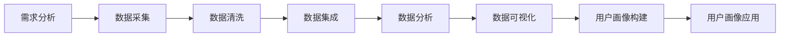
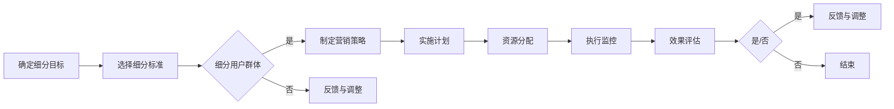
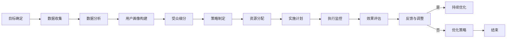

                 

# 《AI DMP 数据基建：数据驱动营销的未来趋势》

> 关键词：AI DMP、数据驱动营销、用户画像、受众细分、营销策略

> 摘要：本文将深入探讨AI DMP（数据管理平台）在数据驱动营销中的应用和未来趋势。首先，我们将介绍AI DMP的定义和意义，以及数据驱动营销的现状和趋势。接着，我们将详细分析AI DMP的技术基础，包括数据挖掘、机器学习、数据管理等核心概念。随后，我们将讨论用户画像构建、受众细分和数据驱动营销策略的核心概念和原理。最后，我们将探讨AI DMP的实际应用和发展趋势，为数据驱动营销的未来提供洞察和建议。

## 目录大纲

### 第一部分：引言与基础

#### 第1章：AI DMP 概述

1.1 AI DMP 的定义与意义

1.2 数据驱动营销的现状与趋势

1.3 DMP 在AI时代的发展

1.4 本书内容结构

#### 第2章：AI DMP 技术基础

2.1 数据挖掘与机器学习基础

2.2 数据管理技术

2.3 AI技术在DMP中的应用

### 第二部分：AI DMP 的核心概念与原理

#### 第3章：用户画像构建

3.1 用户画像的概念与分类

3.2 用户画像的数据来源

3.3 用户画像构建流程

#### 第4章：受众细分与策略

4.1 受众细分的概念与目的

4.2 受众细分的方法

4.3 受众细分策略

#### 第5章：数据驱动营销策略

5.1 数据驱动营销的概念与原则

5.2 数据驱动营销策略的制定

5.3 数据驱动营销案例

### 第三部分：AI DMP 的实践应用

#### 第6章：AI DMP 项目实施

6.1 AI DMP 项目规划

6.2 AI DMP 数据采集与处理

6.3 AI DMP 模型开发与优化

6.4 AI DMP 营销应用案例

#### 第7章：AI DMP 的发展趋势与未来展望

7.1 AI DMP 的发展现状

7.2 AI DMP 的未来发展方向

### 附录

附录A：AI DMP 开发工具与资源

### 结语

数据驱动营销与未来趋势

## 第1章：AI DMP 概述

### 1.1 AI DMP 的定义与意义

AI DMP（Data Management Platform，数据管理平台）是一种基于人工智能技术的数据管理工具，用于收集、整合、管理和激活数据，以便更好地了解和定位目标受众，实现数据驱动的营销策略。AI DMP 通过整合来自多个数据源的丰富数据，构建用户画像，进行受众细分，并优化广告投放，从而提高营销效果。

AI DMP 的意义在于：

1. **提升营销效率**：通过数据整合和智能分析，AI DMP 能够帮助营销人员更好地了解目标受众，提高广告投放的精准度，降低无效投放的成本。

2. **增强用户个性化体验**：AI DMP 可以基于用户画像构建个性化的营销策略，提供更加贴合用户需求的产品和服务，提升用户体验。

3. **优化决策**：AI DMP 提供的丰富数据和智能分析，有助于营销人员做出更准确的决策，优化营销策略。

4. **提升品牌影响力**：通过精准的数据分析和高效的营销策略，AI DMP 有助于提升品牌的市场影响力和用户忠诚度。

### 1.2 数据驱动营销的现状与趋势

数据驱动营销已经成为现代营销的重要趋势。随着大数据、人工智能等技术的发展，数据驱动营销的应用场景越来越广泛。以下是数据驱动营销的现状和趋势：

1. **数据量的爆炸性增长**：随着互联网和物联网的发展，数据量呈现爆炸性增长，为数据驱动营销提供了丰富的数据资源。

2. **技术水平的不断提升**：大数据处理、机器学习、深度学习等技术的不断发展，为数据驱动营销提供了强大的技术支撑。

3. **个性化营销的兴起**：用户画像、受众细分等技术手段的成熟，使得个性化营销成为可能，满足了用户对个性化体验的需求。

4. **营销自动化**：随着营销自动化工具的发展，营销人员可以更加高效地管理营销活动，实现营销流程的自动化。

5. **跨渠道整合**：随着多屏时代的到来，跨渠道整合成为数据驱动营销的重要趋势，企业需要整合线上线下数据，实现全渠道营销。

### 1.3 DMP 在AI时代的发展

AI技术的快速发展，为DMP带来了新的发展机遇。以下是AI时代DMP的发展方向：

1. **智能化数据处理**：AI技术可以自动化处理大量数据，提高数据处理效率，降低人力成本。

2. **智能用户画像构建**：基于AI算法，可以更准确地构建用户画像，提高用户画像的精准度。

3. **智能广告投放优化**：AI算法可以实时分析用户行为数据，优化广告投放策略，提高广告投放效果。

4. **智能营销决策支持**：AI技术可以为营销人员提供智能化的决策支持，提高营销决策的准确性。

5. **智能营销服务**：基于AI技术，可以实现智能客服、智能推荐等营销服务，提升用户体验。

### 1.4 本书内容结构

本书将围绕AI DMP在数据驱动营销中的应用和未来趋势展开，分为三大部分：

1. **引言与基础**：介绍AI DMP的定义、意义、数据驱动营销的现状和趋势，以及DMP在AI时代的发展。

2. **核心概念与原理**：详细分析用户画像构建、受众细分、数据驱动营销策略等核心概念和原理。

3. **实践应用与发展趋势**：探讨AI DMP的实际应用场景、项目实施方法，以及未来发展趋势。

通过本书的阅读，读者将全面了解AI DMP在数据驱动营销中的应用，掌握相关技术和方法，为企业的营销工作提供有力支持。

## 第2章：AI DMP 技术基础

### 2.1 数据挖掘与机器学习基础

#### 2.1.1 数据挖掘的基本概念

数据挖掘（Data Mining）是一种从大量数据中提取有价值信息的过程，它涉及到统计学、机器学习、数据库技术等多个领域。数据挖掘的目标是从大量数据中发现隐藏的模式、关联、趋势和异常，从而为决策提供支持。

数据挖掘的基本过程包括以下几个步骤：

1. **数据预处理**：包括数据清洗、数据集成、数据转换等，目的是提高数据质量和一致性。

2. **探索性数据分析**：通过对数据进行可视化、统计分析等方法，发现数据中的潜在模式和趋势。

3. **模型建立**：选择合适的数据挖掘算法，建立预测模型或分类模型等。

4. **模型评估**：对模型进行评估，验证其准确性和可靠性。

5. **模型应用**：将模型应用于实际问题，进行预测或决策。

#### 2.1.2 机器学习的基本原理

机器学习（Machine Learning）是一种使计算机系统从数据中学习，并能够对未知数据进行预测或分类的方法。机器学习分为监督学习、无监督学习和强化学习三种类型。

1. **监督学习**：监督学习是一种通过已有标记数据训练模型，然后使用模型对新数据进行预测的方法。常见的监督学习算法包括线性回归、决策树、支持向量机等。

2. **无监督学习**：无监督学习是在没有标记数据的情况下，通过算法自动发现数据中的结构和规律。常见的无监督学习算法包括聚类算法、降维算法等。

3. **强化学习**：强化学习是一种通过与环境的交互，不断优化行为策略，以实现最大化收益的方法。常见的强化学习算法包括Q学习、深度Q网络等。

#### 2.1.3 常见的机器学习算法

1. **线性回归**：线性回归是一种监督学习算法，用于预测连续值。其基本原理是通过线性模型拟合数据，最小化预测值与实际值之间的误差。

2. **决策树**：决策树是一种常见的分类算法，通过一系列条件判断，将数据划分为不同的类别。决策树的构建过程是基于信息增益或基尼系数等指标来选择最优特征。

3. **支持向量机**：支持向量机（SVM）是一种有效的分类算法，其基本原理是通过寻找最优的超平面，将不同类别的数据分开。

4. **神经网络**：神经网络是一种模拟人脑神经元连接方式的计算模型，具有强大的学习和预测能力。常见的神经网络包括前馈神经网络、卷积神经网络（CNN）、循环神经网络（RNN）等。

### 2.2 数据管理技术

数据管理技术是AI DMP的基础，主要包括数据仓库、数据湖、数据清洗、数据处理和数据质量管理等内容。

#### 2.2.1 数据仓库与数据湖

数据仓库（Data Warehouse）是一种用于存储和管理大量数据的数据库系统，主要用于支持数据分析和决策支持。数据仓库的特点是数据集成、历史化和多维数据模型。

数据湖（Data Lake）是一种类似于数据仓库的数据存储架构，但与数据仓库不同的是，数据湖可以存储不同类型的数据，包括结构化、半结构化和非结构化数据。数据湖的优点是灵活性高，可以存储大量数据，支持数据探索和分析。

#### 2.2.2 数据清洗与处理

数据清洗（Data Cleaning）是数据管理的重要环节，目的是去除数据中的错误、缺失和重复等不一致性。数据清洗的过程包括数据验证、错误修正、缺失值填充和数据标准化等。

数据处理（Data Processing）是指对原始数据进行加工和处理，以使其符合分析和应用的需求。数据处理包括数据转换、数据集成和数据变换等步骤。

#### 2.2.3 数据质量管理

数据质量管理（Data Quality Management）是指通过一系列策略和技术，确保数据的准确性、一致性、完整性和及时性。数据质量管理包括数据质量评估、数据质量监控和数据质量改进等。

### 2.3 AI技术在DMP中的应用

AI技术是DMP的核心，其主要应用包括用户行为分析、受众细分和广告投放优化等。

#### 2.3.1 AI算法在用户行为分析中的应用

用户行为分析是DMP的重要功能之一，它通过分析用户在网站、APP等平台上的行为数据，了解用户的兴趣、需求和偏好。AI算法在用户行为分析中的应用主要包括：

1. **用户行为预测**：通过分析用户的历史行为数据，预测用户未来的行为，如购买、浏览等。

2. **用户兴趣挖掘**：通过聚类、关联规则挖掘等方法，发现用户的兴趣和行为模式。

3. **用户轨迹分析**：分析用户在不同平台、不同设备上的行为轨迹，了解用户的行为路径和偏好。

#### 2.3.2 AI算法在受众细分中的应用

受众细分是DMP的核心功能之一，它通过分析用户的特征和行为数据，将用户划分为不同的群体。AI算法在受众细分中的应用主要包括：

1. **基于行为的细分**：通过分析用户的行为数据，如浏览历史、购买行为等，将用户划分为不同的群体。

2. **基于人口统计学的细分**：通过分析用户的人口统计信息，如年龄、性别、收入等，将用户划分为不同的群体。

3. **基于心理学的细分**：通过分析用户的心理特征，如需求、动机、价值观等，将用户划分为不同的群体。

#### 2.3.3 AI算法在广告投放优化中的应用

广告投放优化是DMP的重要功能之一，它通过分析广告投放效果，调整广告投放策略，提高广告投放的精准度和效果。AI算法在广告投放优化中的应用主要包括：

1. **广告投放效果预测**：通过分析广告的历史投放数据，预测广告在不同群体中的投放效果。

2. **广告投放策略优化**：通过分析广告投放效果，自动调整广告投放策略，提高广告投放的精准度和效果。

3. **广告创意优化**：通过分析用户对广告的反应，优化广告创意，提高广告点击率。

通过以上对AI DMP技术基础的介绍，我们可以看到，AI DMP不仅涉及到数据挖掘、机器学习、数据管理等核心技术，还结合了AI算法在用户行为分析、受众细分和广告投放优化等方面的应用。这些技术基础为DMP在数据驱动营销中的广泛应用提供了坚实的技术支撑。

## 第3章：用户画像构建

### 3.1 用户画像的概念与分类

用户画像（User Profiling）是指通过对用户数据进行分析和处理，构建出用户的特征模型，以便更好地了解用户的需求、行为和偏好。用户画像的核心目的是通过数据驱动的方式，实现用户的精准定位和个性化服务。

用户画像的分类可以根据不同的维度进行，常见的分类方法包括：

1. **基于行为数据的用户画像**：这类画像主要通过分析用户在网站、APP等平台上的行为数据，如浏览历史、搜索关键词、购买记录等，来构建用户的兴趣和行为特征。

2. **基于人口统计数据的用户画像**：这类画像主要通过分析用户的基本信息，如年龄、性别、地域、职业、收入等，来构建用户的基本特征。

3. **基于心理数据的用户画像**：这类画像主要通过分析用户的心理特征，如需求、动机、价值观等，来构建用户的内心世界和潜在需求。

4. **基于社交数据的用户画像**：这类画像主要通过分析用户在社交平台上的互动数据，如好友关系、点赞、评论等，来构建用户的社会特征。

5. **基于生物特征的用户画像**：这类画像主要通过分析用户的生物特征数据，如人脸、声音、指纹等，来构建用户的独特身份标识。

### 3.2 用户画像的数据来源

用户画像的数据来源多样，主要包括以下几类：

1. **线上数据**：这是用户画像的主要来源，包括用户在网站、APP等平台上的行为数据，如浏览记录、搜索关键词、购买记录、评论等。

2. **线下数据**：线下数据包括用户在实体店铺的购买记录、消费行为等，通过数据采集设备（如POS机、人脸识别设备等）获取。

3. **第三方数据**：第三方数据包括用户在社交媒体、电商网站、公共数据库等平台上的公开信息，如用户的基本信息、社交关系等。

4. **传感器数据**：传感器数据包括用户在使用智能设备时产生的数据，如地理位置、设备使用时间、环境温度等。

5. **生物特征数据**：生物特征数据包括用户的人脸、声音、指纹等，通过生物特征识别技术获取。

### 3.3 用户画像数据的处理与整合

用户画像数据的处理与整合是构建用户画像的关键步骤，主要包括数据清洗、数据集成、数据分析和数据可视化等。

1. **数据清洗**：数据清洗是数据处理的第一个步骤，目的是去除数据中的噪声、错误和重复信息，提高数据质量。数据清洗的方法包括数据验证、错误修正、缺失值填充和数据标准化等。

2. **数据集成**：数据集成是将来自多个数据源的数据进行整合，构建一个统一的数据视图。数据集成的挑战在于数据源的数据格式、数据结构和数据质量不同，需要通过数据转换、数据映射和数据归一化等技术实现数据集成。

3. **数据分析**：数据分析是用户画像构建的核心步骤，主要通过数据挖掘、机器学习等方法，从大量数据中发现用户的兴趣、行为和偏好。数据分析的方法包括关联规则挖掘、聚类分析、分类分析等。

4. **数据可视化**：数据可视化是将分析结果以图形或图表的形式展示出来，帮助用户更好地理解和分析数据。数据可视化工具包括Tableau、Power BI、ECharts等。

### 3.4 用户画像构建流程

用户画像构建的流程主要包括以下步骤：

1. **需求分析**：明确用户画像的目标和应用场景，确定需要采集和处理的数据类型。

2. **数据采集**：通过多种渠道收集用户数据，包括线上行为数据、线下数据、第三方数据和传感器数据等。

3. **数据清洗**：对采集到的数据进行分析和处理，去除噪声和错误，提高数据质量。

4. **数据集成**：将来自多个数据源的数据进行整合，构建一个统一的数据视图。

5. **数据分析**：通过数据挖掘、机器学习等方法，从大量数据中发现用户的兴趣、行为和偏好。

6. **数据可视化**：将分析结果以图形或图表的形式展示出来，帮助用户更好地理解和分析数据。

7. **用户画像构建**：根据分析结果，构建用户的特征模型，形成用户画像。

8. **用户画像应用**：将用户画像应用于实际场景，如个性化推荐、精准营销、用户行为预测等。

### 3.5 用户画像构建的关键技术

用户画像构建涉及多个关键技术，包括数据挖掘、机器学习、自然语言处理、数据可视化等。

1. **数据挖掘**：数据挖掘是用户画像构建的核心技术之一，通过关联规则挖掘、聚类分析、分类分析等方法，从大量数据中发现用户的兴趣和行为模式。

2. **机器学习**：机器学习是实现用户画像自动化的关键，通过训练模型，可以从数据中学习用户的特征和行为，进行用户分类和预测。

3. **自然语言处理**：自然语言处理是处理文本数据的重要技术，通过文本分析、情感分析等方法，可以从文本数据中提取用户的兴趣和需求。

4. **数据可视化**：数据可视化是将分析结果以图形或图表的形式展示出来，帮助用户更好地理解和分析数据。

### 3.6 用户画像构建案例分析

以下是一个用户画像构建的案例，我们将使用Mermaid流程图来展示用户画像构建的步骤和流程。

在这个案例中，用户画像的构建流程包括以下步骤：

1. **需求分析**：明确用户画像的目标和应用场景。

2. **数据采集**：通过多种渠道收集用户数据，包括线上行为数据、线下数据、第三方数据和传感器数据等。

3. **数据清洗**：对采集到的数据进行清洗和处理，去除噪声和错误。

4. **数据集成**：将来自多个数据源的数据进行整合，构建一个统一的数据视图。

5. **数据分析**：通过数据挖掘、机器学习等方法，从大量数据中发现用户的兴趣、行为和偏好。

6. **数据可视化**：将分析结果以图形或图表的形式展示出来，帮助用户更好地理解和分析数据。

7. **用户画像构建**：根据分析结果，构建用户的特征模型，形成用户画像。

8. **用户画像应用**：将用户画像应用于实际场景，如个性化推荐、精准营销、用户行为预测等。

通过这个案例，我们可以看到用户画像构建的过程是如何一步步进行的，每个步骤的关键技术和方法都有详细的说明。用户画像构建不仅需要技术支持，还需要深入理解和分析用户需求，为用户提供更好的服务和体验。

## 第4章：受众细分与策略

### 4.1 受众细分的概念与目的

受众细分（Audience Segmentation）是一种通过分析用户数据，将用户划分为不同群体，以便针对不同群体制定个性化营销策略的方法。受众细分的目的是为了提高营销活动的效率和效果，通过精准定位用户，提供更符合用户需求的产品和服务，从而实现更好的营销转化和用户满意度。

受众细分的基本概念包括：

1. **受众群体**：指在特定营销活动中，拥有共同特征的用户集合。

2. **细分标准**：用于划分受众群体的依据，可以是人口统计信息、行为数据、心理特征等。

3. **细分效果**：通过受众细分实现的营销效果，包括用户满意度、转化率、ROI等。

受众细分的意义主要体现在以下几个方面：

1. **提高营销效率**：通过精准定位用户，减少无效的广撒网式营销，提高营销活动的针对性。

2. **提升用户体验**：根据用户特征和需求，提供个性化的产品和服务，满足用户的个性化需求，提升用户满意度。

3. **优化资源分配**：将资源集中在最有潜力的用户群体上，提高资源利用效率。

4. **增强品牌影响力**：通过有效的受众细分和个性化营销，提高品牌的市场影响力和用户忠诚度。

### 4.2 受众细分的方法

受众细分的方法多样，可以根据不同的细分标准和数据来源，选择合适的细分方法。以下是几种常见的受众细分方法：

1. **基于行为数据的细分**：通过分析用户在网站、APP等平台上的行为数据，如浏览历史、搜索关键词、购买记录等，将用户划分为不同的群体。这种方法主要关注用户的兴趣和行为模式，能够实现精准的用户定位。

2. **基于人口统计学的细分**：通过分析用户的基本信息，如年龄、性别、地域、收入等，将用户划分为不同的群体。这种方法简单易行，适用于大规模的用户群体，但可能无法深入挖掘用户的兴趣和行为。

3. **基于心理数据的细分**：通过分析用户的心理特征，如需求、动机、价值观等，将用户划分为不同的群体。这种方法能够深入挖掘用户的内心需求，实现更精准的个性化营销。

4. **基于社交数据的细分**：通过分析用户在社交平台上的互动数据，如好友关系、点赞、评论等，将用户划分为不同的群体。这种方法能够了解用户的社会关系和社交行为，有助于实现社交化营销。

5. **基于生物特征的细分**：通过分析用户的生物特征数据，如人脸、声音、指纹等，将用户划分为不同的群体。这种方法适用于需要高安全性或个性化体验的场景。

### 4.3 受众细分策略

受众细分策略是指根据受众细分的成果，制定相应的营销策略，以实现更好的营销效果。以下是受众细分策略的制定步骤：

1. **确定细分目标**：明确细分的目标和目的，如提高用户满意度、增加转化率、提升品牌知名度等。

2. **选择细分标准**：根据业务需求和数据资源，选择合适的细分标准，如行为数据、人口统计学数据、心理数据等。

3. **细分用户群体**：根据选择的细分标准，将用户划分为不同的群体，为每个群体定义特征和需求。

4. **制定营销策略**：为每个用户群体制定个性化的营销策略，如内容营销、广告投放、促销活动等。

5. **实施和监控**：实施营销策略，并根据实施效果进行监控和调整，以实现最佳营销效果。

6. **评估和优化**：定期评估细分策略的效果，根据评估结果进行优化，以提高营销效果。

### 4.4 受众细分策略的评估与实施

受众细分策略的评估与实施是确保营销效果的重要环节。以下是受众细分策略的评估与实施步骤：

1. **评估指标**：根据细分目标，选择合适的评估指标，如转化率、ROI、用户满意度等。

2. **数据收集**：收集相关数据，如用户行为数据、营销活动数据、销售数据等。

3. **数据分析**：对收集到的数据进行分析，评估细分策略的效果。

4. **反馈与调整**：根据评估结果，对细分策略进行反馈和调整，以优化营销效果。

5. **实施计划**：制定详细的实施计划，明确营销策略的执行步骤和时间表。

6. **资源分配**：根据实施计划，合理分配资源，确保营销策略的顺利执行。

7. **执行监控**：实施过程中，对营销策略的执行进行监控，确保各项任务的按时完成。

8. **效果评估**：根据实施结果，评估营销策略的效果，为下一轮营销策略的制定提供依据。

### 4.5 受众细分策略案例

以下是一个受众细分策略的案例，我们将使用Mermaid流程图来展示受众细分策略的制定和实施过程。

在这个案例中，受众细分策略的制定和实施过程包括以下步骤：

1. **确定细分目标**：明确细分的目标和目的，如提高用户满意度、增加转化率等。

2. **选择细分标准**：根据业务需求和数据资源，选择合适的细分标准，如行为数据、人口统计学数据等。

3. **细分用户群体**：根据选择的细分标准，将用户划分为不同的群体，为每个群体定义特征和需求。

4. **制定营销策略**：为每个用户群体制定个性化的营销策略，如内容营销、广告投放等。

5. **实施计划**：制定详细的实施计划，明确营销策略的执行步骤和时间表。

6. **资源分配**：根据实施计划，合理分配资源，确保营销策略的顺利执行。

7. **执行监控**：实施过程中，对营销策略的执行进行监控，确保各项任务的按时完成。

8. **效果评估**：根据实施结果，评估营销策略的效果，为下一轮营销策略的制定提供依据。

9. **反馈与调整**：根据评估结果，对细分策略进行反馈和调整，以优化营销效果。

通过这个案例，我们可以看到受众细分策略的制定和实施是如何一步步进行的，每个步骤的关键技术和方法都有详细的说明。受众细分策略不仅需要技术支持，还需要深入理解和分析用户需求，为用户提供更好的服务和体验。

## 第5章：数据驱动营销策略

### 5.1 数据驱动营销的概念与原则

数据驱动营销（Data-driven Marketing）是一种以数据为核心，通过数据分析、挖掘和建模，指导营销决策和策略制定的方法。数据驱动营销强调以数据为基础，通过数据分析和洞察，发现市场机会，优化营销策略，提高营销效果。

数据驱动营销的核心原则包括：

1. **数据导向**：以数据为核心，通过数据收集、处理和分析，指导营销决策。

2. **用户为中心**：以用户需求为中心，通过数据挖掘，了解用户行为和需求，提供个性化的产品和服务。

3. **持续优化**：通过数据分析和监测，不断优化营销策略和活动，提高营销效果。

4. **跨渠道整合**：整合线上线下数据，实现全渠道营销，提高用户触达率和转化率。

5. **灵活调整**：根据数据反馈，及时调整营销策略和活动，以应对市场变化和用户需求变化。

### 5.2 数据驱动营销策略的制定

数据驱动营销策略的制定是一个系统化的过程，包括以下步骤：

1. **目标确定**：明确营销目标，如提升品牌知名度、增加销售额、提高用户满意度等。

2. **数据收集**：收集相关的用户数据，包括用户行为数据、人口统计数据、心理数据等。

3. **数据分析**：对收集到的数据进行分析，发现用户需求、行为模式和趋势。

4. **用户画像构建**：根据数据分析结果，构建用户的特征模型，形成用户画像。

5. **受众细分**：将用户划分为不同的群体，为每个群体制定个性化的营销策略。

6. **策略制定**：根据受众细分和用户画像，制定具体的营销策略，如内容营销、广告投放、促销活动等。

7. **资源分配**：根据策略需求，合理分配资源，确保营销策略的顺利执行。

8. **实施计划**：制定详细的实施计划，明确营销策略的执行步骤和时间表。

9. **效果监测**：实施过程中，对营销策略的效果进行监测和评估，确保达到预期目标。

### 5.3 营销策略的执行与优化

营销策略的执行与优化是确保营销效果的关键环节。以下是营销策略执行与优化的步骤：

1. **执行监控**：实施过程中，对营销策略的执行进行实时监控，确保各项任务的按时完成。

2. **效果评估**：根据监测数据，评估营销策略的效果，包括用户参与度、转化率、ROI等指标。

3. **反馈与调整**：根据评估结果，对营销策略进行反馈和调整，优化营销效果。

4. **持续优化**：通过数据分析和用户反馈，不断优化营销策略和活动，提高用户满意度和品牌忠诚度。

5. **优化策略**：根据市场变化和用户需求，及时调整营销策略，确保营销活动的持续性和有效性。

### 5.4 数据驱动营销与传统营销的比较

数据驱动营销与传统营销在多个方面存在差异：

1. **数据依赖**：数据驱动营销高度依赖数据，通过数据分析指导决策；而传统营销更多依赖于经验和直觉。

2. **个性化**：数据驱动营销通过用户画像和受众细分，实现个性化营销；传统营销更多采用大众化的营销策略。

3. **实时性**：数据驱动营销能够实时监测和调整营销策略，以应对市场变化；传统营销策略调整相对滞后。

4. **效果评估**：数据驱动营销通过数据分析和效果评估，明确营销效果；传统营销难以量化效果，评估困难。

5. **成本控制**：数据驱动营销能够通过精准定位和优化策略，降低营销成本；传统营销策略可能导致资源浪费。

### 5.5 数据驱动营销案例

以下是一个数据驱动营销的案例，我们将使用Mermaid流程图来展示案例的执行过程。

在这个案例中，数据驱动营销的执行过程包括以下步骤：

1. **目标确定**：明确营销目标，如提升品牌知名度、增加用户参与度等。

2. **数据收集**：通过多种渠道收集用户数据，包括行为数据、人口统计数据等。

3. **数据分析**：对收集到的数据进行分析，发现用户需求和偏好。

4. **用户画像构建**：根据数据分析结果，构建用户的特征模型，形成用户画像。

5. **受众细分**：将用户划分为不同的群体，为每个群体制定个性化的营销策略。

6. **策略制定**：根据受众细分和用户画像，制定具体的营销策略，如社交媒体广告、内容营销等。

7. **资源分配**：根据策略需求，合理分配资源，确保营销策略的顺利执行。

8. **实施计划**：制定详细的实施计划，明确营销策略的执行步骤和时间表。

9. **执行监控**：实施过程中，对营销策略的执行进行实时监控，确保各项任务的按时完成。

10. **效果评估**：根据监测数据，评估营销策略的效果，包括用户参与度、转化率等指标。

11. **反馈与调整**：根据评估结果，对营销策略进行反馈和调整，优化营销效果。

通过这个案例，我们可以看到数据驱动营销是如何通过系统化的方法，从目标确定到效果评估，实现营销目标的。数据驱动营销不仅需要技术支持，还需要深入理解和分析用户需求，为用户提供更好的服务和体验。

## 第6章：AI DMP 项目实施

### 6.1 AI DMP 项目规划

AI DMP 项目规划是确保项目成功实施的关键步骤，它包括项目目标与范围的确定、项目资源与团队组织的规划、项目进度与风险管理的制定。以下是AI DMP 项目规划的具体内容。

#### 6.1.1 项目目标与范围

项目目标的明确是项目规划的首要任务。在AI DMP 项目中，项目目标通常包括：

1. **数据整合与治理**：整合来自多个数据源的数据，实现数据的高效管理和治理。
2. **用户画像构建**：通过数据分析构建精准的用户画像，为营销策略提供数据支持。
3. **受众细分与策略制定**：基于用户画像，进行受众细分，制定个性化的营销策略。
4. **营销效果评估与优化**：对营销活动进行效果评估，持续优化营销策略。

项目范围则明确了项目的具体工作内容和范围，包括：

1. **数据源**：确定数据采集的渠道和类型，如线上行为数据、社交媒体数据、第三方数据等。
2. **技术架构**：设计数据采集、存储、处理和分析的技术架构。
3. **功能模块**：确定AI DMP 的核心功能模块，如数据采集模块、用户画像模块、受众细分模块等。
4. **时间表**：制定项目的关键里程碑和时间表，确保项目按时完成。

#### 6.1.2 项目资源与团队组织

项目资源的合理分配是项目成功的基础。AI DMP 项目涉及的资源包括：

1. **人力资源**：项目经理、数据分析师、软件开发工程师、市场营销专家等。
2. **技术资源**：服务器、数据库、数据采集工具、数据分析工具、机器学习框架等。
3. **资金资源**：项目预算，包括人力成本、设备成本、运维成本等。

团队组织的规划需要根据项目需求，合理分配人力资源，确保每个角色和任务的明确。常见的团队组织形式包括：

1. **职能型组织**：按照职能划分团队，如数据组、开发组、测试组等。
2. **项目型组织**：按照项目需求，组建跨职能团队，确保项目高效协同。
3. **矩阵型组织**：结合职能型组织和项目型组织，实现灵活的资源配置。

#### 6.1.3 项目进度与风险管理

项目进度管理是确保项目按时完成的重要手段。AI DMP 项目进度管理包括：

1. **里程碑计划**：制定项目的关键里程碑，如数据采集完成、用户画像构建完成、功能模块开发完成等。
2. **时间表**：根据里程碑计划，制定详细的时间表，明确每个阶段的工作任务和完成时间。
3. **进度监控**：实时监控项目进度，确保项目按计划推进。

风险管理是项目规划的重要组成部分。AI DMP 项目涉及的风险包括：

1. **技术风险**：包括技术实现的难度、技术更新的风险等。
2. **数据风险**：包括数据质量、数据隐私等。
3. **市场风险**：包括市场需求变化、竞争风险等。

风险管理包括：

1. **风险识别**：识别项目可能面临的风险。
2. **风险评估**：对识别出的风险进行评估，确定风险优先级。
3. **风险应对**：制定风险应对策略，包括风险规避、风险转移、风险接受等。

### 6.2 AI DMP 数据采集与处理

数据采集与处理是AI DMP 的核心环节，涉及数据的采集、清洗、整合和分析等步骤。

#### 6.2.1 数据采集方法

数据采集方法包括：

1. **线上数据采集**：通过网页抓取、API接口等方式，收集用户在网站、APP等平台上的行为数据，如浏览历史、搜索关键词、购买记录等。
2. **线下数据采集**：通过POS机、人脸识别设备等，收集用户在实体店铺的消费行为数据。
3. **第三方数据采集**：通过第三方数据提供商，获取用户的人口统计信息、社交关系等。
4. **传感器数据采集**：通过智能设备的传感器，获取用户的位置、设备使用时间、环境温度等数据。

#### 6.2.2 数据处理流程

数据处理流程包括：

1. **数据清洗**：去除数据中的噪声、错误和重复信息，提高数据质量。数据清洗的方法包括数据验证、错误修正、缺失值填充和数据标准化等。
2. **数据集成**：将来自多个数据源的数据进行整合，构建一个统一的数据视图。数据集成的挑战在于数据源的数据格式、数据结构和数据质量不同，需要通过数据转换、数据映射和数据归一化等技术实现数据集成。
3. **数据预处理**：对原始数据进行加工和处理，以使其符合分析和应用的需求。数据预处理包括数据转换、数据融合和数据标准化等步骤。
4. **数据存储**：将处理后的数据存储到数据仓库或数据湖中，为后续的数据分析和挖掘提供基础。

#### 6.2.3 数据质量管理

数据质量管理是确保数据质量的重要环节，包括：

1. **数据质量评估**：评估数据的质量指标，如准确性、一致性、完整性和及时性。
2. **数据质量监控**：实时监控数据质量，确保数据在采集、处理和存储过程中的质量。
3. **数据质量改进**：根据数据质量评估结果，采取改进措施，如错误修正、缺失值填充、数据标准化等。

### 6.3 AI DMP 模型开发与优化

AI DMP 模型开发与优化是AI DMP 项目的关键环节，涉及模型的开发、优化和评估。

#### 6.3.1 模型开发流程

模型开发流程包括：

1. **数据准备**：准备用于模型训练的数据集，包括特征工程和数据预处理。
2. **模型选择**：根据业务需求，选择合适的机器学习算法，如线性回归、决策树、神经网络等。
3. **模型训练**：使用训练数据集对模型进行训练，调整模型参数，优化模型性能。
4. **模型评估**：使用验证数据集对模型进行评估，验证模型的准确性和可靠性。

#### 6.3.2 模型优化策略

模型优化策略包括：

1. **超参数调整**：调整模型超参数，如学习率、正则化参数等，以优化模型性能。
2. **特征选择**：通过特征选择技术，选择对模型性能有显著影响的关键特征。
3. **模型融合**：结合多个模型，提高模型的预测能力和稳定性。
4. **模型调优**：通过交叉验证、网格搜索等技术，对模型进行调优，提高模型性能。

#### 6.3.3 模型评估与验证

模型评估与验证是确保模型可靠性的关键步骤，包括：

1. **准确率**：评估模型预测的准确性，通过计算预测值与实际值之间的误差。
2. **召回率**：评估模型对正类样本的识别能力，通过计算预测的正类样本与实际正类样本的匹配度。
3. **F1分数**：综合考虑准确率和召回率，评估模型的综合性能。
4. **交叉验证**：通过交叉验证，确保模型在不同数据集上的表现稳定。

### 6.4 AI DMP 营销应用案例

以下是一个AI DMP 营销应用案例，我们将详细描述案例的背景、实施过程和效果分析。

#### 6.4.1 案例背景

某电子商务公司希望通过AI DMP 实现个性化营销，提升用户满意度和转化率。公司拥有大量的用户行为数据，包括浏览历史、购买记录、搜索关键词等，但尚未有效利用这些数据。

#### 6.4.2 案例实施

1. **数据采集**：通过API接口和网页抓取技术，收集用户在网站上的行为数据，如浏览历史、购买记录、搜索关键词等。

2. **数据清洗与处理**：对采集到的数据进行清洗和处理，去除噪声和错误，提高数据质量。然后进行数据集成，构建一个统一的数据视图。

3. **用户画像构建**：基于用户行为数据和人口统计数据，使用机器学习算法（如K-means聚类算法）构建用户画像。用户画像包括用户兴趣、行为特征、购买偏好等。

4. **受众细分**：根据用户画像，将用户划分为不同的群体，如“高价值用户”、“潜在客户”等。为每个群体制定个性化的营销策略。

5. **策略制定**：为不同用户群体制定个性化的营销策略，如发送定制化邮件、推送个性化广告等。

6. **实施与监控**：实施营销策略，并通过数据分析工具实时监控营销效果，包括用户参与度、转化率等。

7. **效果评估**：根据监控数据，评估营销策略的效果，如用户满意度、转化率等。根据评估结果，优化营销策略。

#### 6.4.3 案例效果分析

1. **用户满意度提升**：通过个性化营销，用户满意度显著提升，用户反馈积极。

2. **转化率提高**：个性化营销策略提高了用户的购买意愿，转化率显著提高。

3. **资源利用效率提升**：通过精准定位用户，减少无效的广撒网式营销，提高了资源的利用效率。

4. **品牌影响力增强**：个性化营销策略增强了品牌的市场影响力，提升了用户忠诚度。

通过这个案例，我们可以看到AI DMP 在实际应用中的效果。AI DMP 不仅提高了营销效率，还提升了用户体验和品牌影响力，为企业带来了显著的商业价值。

## 第7章：AI DMP 的发展趋势与未来展望

### 7.1 AI DMP 的发展现状

随着大数据、人工智能技术的不断发展，AI DMP（Data Management Platform）在营销领域中的应用越来越广泛。当前，AI DMP 的发展现状主要体现在以下几个方面：

1. **技术成熟度提升**：AI DMP 的技术基础不断成熟，包括数据采集、数据存储、数据处理、数据分析和数据可视化等技术，都已相对完善。

2. **应用场景多样化**：AI DMP 已经在多个行业中得到广泛应用，如电子商务、金融、零售、旅游等，通过数据驱动的方式，提升营销效果和用户满意度。

3. **数据量持续增长**：随着物联网、移动互联网的发展，数据量呈现爆炸性增长，为AI DMP 提供了丰富的数据资源。

4. **智能化程度提高**：AI DMP 的智能化程度逐渐提高，通过机器学习、深度学习等技术，实现了用户画像的精准构建、受众细分的自动化、广告投放的优化等。

### 7.2 AI DMP 的未来发展方向

展望未来，AI DMP 的发展将朝着以下几个方面迈进：

1. **更精细化的用户画像**：随着数据的丰富和技术的进步，AI DMP 将能够构建更加精细化的用户画像，深入挖掘用户的兴趣、需求和行为，实现更精准的营销。

2. **全渠道整合**：未来，AI DMP 将实现线上线下数据的全面整合，打破渠道壁垒，实现全渠道营销，提升用户触达率和转化率。

3. **自动化与智能化**：通过人工智能技术的不断进步，AI DMP 将实现营销自动化和智能化，减少人工干预，提高营销效率。

4. **隐私保护与合规性**：随着数据隐私保护意识的增强，AI DMP 将在数据采集、存储和处理过程中，加强隐私保护，确保合规性。

5. **跨界融合**：AI DMP 将与更多的行业和应用场景融合，如物联网、智能制造、智慧城市等，实现跨界应用，拓展新的业务模式。

### 7.3 AI DMP 的发展挑战与机遇

在AI DMP 的发展过程中，也面临一系列挑战和机遇：

1. **数据隐私与安全**：数据隐私和安全是AI DMP 发展的重要挑战，需要通过技术手段和法规政策，加强数据保护和安全管理。

2. **技术更新与迭代**：随着技术的快速发展，AI DMP 需要不断更新和迭代，以适应新的技术和应用需求。

3. **跨行业融合**：AI DMP 在跨行业融合过程中，需要解决数据标准、技术接口等兼容性问题，实现无缝对接。

4. **人才需求**：AI DMP 需要大量的技术人才和营销专家，人才短缺将成为未来发展的一个重要挑战。

5. **市场需求变化**：市场需求变化快速，AI DMP 需要具备快速响应和创新能力，以应对市场变化。

### 7.4 AI DMP 的发展策略

为了应对未来的挑战和抓住机遇，AI DMP 需要采取以下发展策略：

1. **技术创新**：持续投入技术研发，不断优化和提升AI DMP 的技术能力，如数据挖掘、机器学习、深度学习等。

2. **人才培养**：加大人才培养和引进力度，培养和吸引高素质的技术人才和营销专家，提升团队整体实力。

3. **跨行业合作**：积极寻求与其他行业的合作，实现跨界融合，开拓新的业务领域。

4. **市场拓展**：通过市场调研和客户需求分析，制定有针对性的市场拓展策略，扩大市场份额。

5. **合规经营**：严格遵守数据隐私保护法规，确保数据采集、存储和处理过程的合规性，树立良好的企业形象。

通过以上策略，AI DMP 将能够更好地应对未来的挑战，抓住发展机遇，实现持续健康发展。

### 附录

#### 附录A：AI DMP 开发工具与资源

在开发AI DMP 项目时，选择合适的工具和资源至关重要。以下是一些常用的AI DMP 开发工具与资源：

##### A.1 数据采集与处理工具

1. **Apache Kafka**：一个分布式流处理平台，用于实时数据采集和传输。
2. **Apache NiFi**：一个易于使用的数据集成平台，用于数据收集、处理和分发。
3. **Google BigQuery**：一个快速、可扩展的云数据仓库，用于数据存储和分析。
4. **Amazon S3**：一个云存储服务，用于大规模数据存储。

##### A.2 机器学习与深度学习框架

1. **TensorFlow**：由Google开发的开源深度学习框架，广泛应用于各种深度学习任务。
2. **PyTorch**：由Facebook开发的开源深度学习框架，具有灵活性和动态计算图的特点。
3. **Scikit-learn**：一个用于数据挖掘和数据分析的开源库，包含多种经典的机器学习算法。
4. **Keras**：一个高层神经网络API，为TensorFlow和Theano提供简单、易于使用的接口。

##### A.3 数据分析与可视化工具

1. **Tableau**：一个强大的数据可视化工具，用于创建交互式可视化图表。
2. **Power BI**：由Microsoft开发的商业智能工具，提供丰富的数据可视化和分析功能。
3. **ECharts**：一个基于JavaScript的图表库，用于创建各种类型的交互式图表。
4. **D3.js**：一个用于创建动态交互式数据可视化的JavaScript库。

##### A.4 AI DMP 相关书籍与论文推荐

1. **《数据挖掘：概念与技术》**（第三版），作者：Han, Kamber, Pei。
2. **《深度学习》**，作者：Goodfellow, Bengio, Courville。
3. **《机器学习实战》**，作者：Hastie, Tibshirani, Friedman。
4. **《数据科学：编程与实践》**，作者：Curtis, Welcome。
5. **《大数据之路：阿里巴巴大数据实践》**，作者：周志华，周璞。

通过以上工具和资源的帮助，开发者可以更高效地实现AI DMP 项目，提升营销效果和用户体验。

### 结语

数据驱动营销已经成为现代营销的重要趋势，AI DMP 作为数据驱动营销的核心工具，具有广泛的应用前景。从用户画像构建、受众细分到数据驱动营销策略，AI DMP 为营销人员提供了强大的数据支持和智能化工具。随着技术的不断进步，AI DMP 将在更多行业和应用场景中发挥重要作用，为企业和用户创造更大的价值。未来，AI DMP 将朝着精细化、智能化、合规化的方向发展，助力数据驱动营销实现新的突破和进步。让我们共同期待AI DMP 带来的美好未来。作者：AI天才研究院/AI Genius Institute & 禅与计算机程序设计艺术 /Zen And The Art of Computer Programming。

