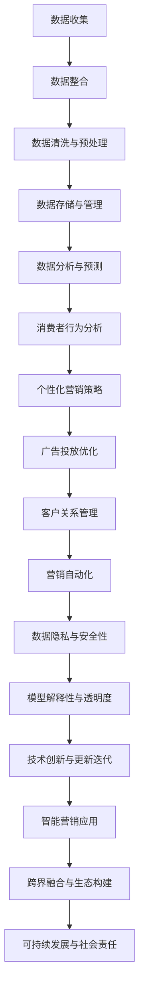

                 

## 文章标题：AI DMP 数据基建：数据驱动营销的未来趋势

> 关键词：AI DMP、数据驱动营销、数据基建、未来趋势

> 摘要：
随着人工智能技术的发展，数据驱动营销成为企业竞争的关键。AI DMP（数据管理平台）作为一种新的数据基建方式，为企业提供了强大的数据整合、分析和应用能力。本文将从核心概念、数据基建、应用实践和未来趋势四个方面，深入探讨AI DMP在数据驱动营销中的重要作用和未来发展方向。

----------------------------------------------------------------

### 第一部分：AI DMP 概述与数据基建

#### 第1章：AI DMP 基础概念与原理

##### 1.1 AI DMP 的定义与重要性

AI DMP（Data Management Platform，数据管理平台）是一种基于人工智能技术的数据整合和管理系统。它能够帮助企业收集、整合、存储和分析来自多个渠道的数据，并基于这些数据为用户提供个性化服务。AI DMP 的核心作用在于通过数据分析和预测，帮助企业实现精准营销和客户关系管理。

在当今大数据和人工智能时代，数据已成为企业最重要的资产之一。而传统的数据管理方式已经无法满足企业对数据整合、分析和应用的需求。AI DMP 的出现，正是为了解决这一问题。它通过引入人工智能技术，实现了数据的高效整合、分析和应用，为企业提供了全新的数据驱动营销方式。

##### 1.2 数据驱动营销的原理

数据驱动营销是一种基于数据分析的营销方法。它通过收集和分析用户数据，了解用户的行为、偏好和需求，然后根据这些数据制定个性化的营销策略和内容，从而提高营销效果和用户满意度。

数据驱动营销的原理可以概括为以下三个步骤：

1. **数据收集**：通过各种渠道收集用户数据，包括用户行为数据、社交数据、购买数据等。
2. **数据整合**：将来自不同渠道的数据进行整合，形成一个全面、准确的用户画像。
3. **数据分析**：利用人工智能技术对用户数据进行深度分析，发现用户的行为模式和需求，为个性化营销提供依据。

##### 1.3 AI DMP 的发展历程

AI DMP 的发展历程可以分为以下几个阶段：

1. **初级阶段**：以传统的数据仓库和数据挖掘技术为基础，实现数据的基本收集和分析。
2. **中级阶段**：引入大数据技术和云计算，实现海量数据的实时收集、存储和处理。
3. **高级阶段**：结合人工智能技术，实现数据的自动化分析和预测，为企业提供智能化、个性化的数据驱动营销解决方案。

目前，AI DMP 已经进入高级阶段，成为了数据驱动营销的核心基础设施。

----------------------------------------------------------------

### 第二部分：AI DMP 在营销中的应用实践

#### 第4章：AI DMP 在消费者行为分析中的应用

##### 4.1 消费者行为分析的基本方法

消费者行为分析是数据驱动营销的重要环节。它通过对用户行为数据的收集、整合和分析，帮助企业了解用户的需求和行为模式，从而制定出更有效的营销策略。

消费者行为分析的基本方法包括：

1. **行为追踪**：通过网页分析、应用分析等技术，收集用户在网站、应用等平台上的行为数据，如浏览路径、点击次数、购买行为等。
2. **数据整合**：将来自不同渠道的行为数据进行整合，形成一个完整的用户行为数据集。
3. **行为分析**：利用机器学习算法和统计分析方法，对用户行为数据进行深入分析，发现用户的行为模式和偏好。

##### 4.2 基于AI的消费者行为预测

基于AI的消费者行为预测是AI DMP 的重要应用之一。它通过对历史行为数据的分析，预测用户未来的行为和需求，从而为企业提供个性化的营销策略。

消费者行为预测的基本方法包括：

1. **时间序列分析**：通过分析用户行为数据的时间序列特征，预测用户未来的行为趋势。
2. **关联规则分析**：通过分析用户行为数据中的关联关系，预测用户可能感兴趣的商品或服务。
3. **机器学习预测模型**：利用机器学习算法，建立用户行为预测模型，预测用户未来的行为和需求。

##### 4.3 消费者细分与个性化营销

消费者细分是数据驱动营销的基础。它通过对用户行为数据的分析，将用户划分为不同的群体，从而实现精准营销。

消费者细分的基本方法包括：

1. **人口统计学细分**：根据用户的人口统计学特征，如年龄、性别、地域等，进行消费者细分。
2. **行为细分**：根据用户的行为特征，如浏览行为、购买行为等，进行消费者细分。
3. **心理细分**：根据用户的心理特征，如兴趣爱好、消费观念等，进行消费者细分。

个性化营销是数据驱动营销的核心。它通过为不同的消费者群体提供个性化的营销内容和服务，提高营销效果和用户满意度。

个性化营销的基本方法包括：

1. **内容个性化**：根据消费者的行为和偏好，为消费者提供个性化的内容。
2. **渠道个性化**：根据消费者的行为和偏好，选择最适合消费者的营销渠道。
3. **时间个性化**：根据消费者的行为和偏好，选择最合适的时间进行营销。

----------------------------------------------------------------

#### 第5章：AI DMP 在广告营销中的应用

##### 5.1 广告投放优化

广告投放优化是数据驱动营销的重要手段。它通过分析用户行为数据和广告效果数据，优化广告的投放策略，提高广告的点击率和转化率。

广告投放优化主要包括以下步骤：

1. **目标受众分析**：通过分析用户行为数据，确定广告的目标受众。
2. **广告创意优化**：通过A/B测试等方法，优化广告的创意和文案，提高广告的吸引力。
3. **投放策略优化**：通过分析广告效果数据，调整广告的投放策略，如投放时间、投放地域等，提高广告的投放效果。

##### 5.2 实时竞价与效果评估

实时竞价（Real-Time Bidding，RTB）是一种在线广告购买方式，它通过程序化购买，实时竞价广告展示机会。实时竞价与效果评估是AI DMP 在广告营销中的重要应用。

实时竞价与效果评估主要包括以下步骤：

1. **广告需求分析**：通过分析用户行为数据，确定广告的需求和投放策略。
2. **实时竞价**：在广告交易平台（Ad Exchange）上，根据广告需求和竞价策略，实时竞价广告展示机会。
3. **效果评估**：通过分析广告效果数据，评估广告的投放效果，如点击率、转化率等，为下一次广告投放提供参考。

##### 5.3 跨渠道营销策略

跨渠道营销策略是数据驱动营销的一种重要方式。它通过整合多个渠道的数据，实现跨渠道的营销策略和内容，提高营销效果。

跨渠道营销策略主要包括以下步骤：

1. **数据整合**：将来自多个渠道的数据进行整合，形成一个全面的用户画像。
2. **渠道定位**：根据用户画像和渠道特性，确定每个渠道的营销目标和策略。
3. **内容定制**：根据每个渠道的营销目标和用户需求，定制个性化的营销内容和服务。
4. **效果评估**：通过分析跨渠道的营销效果数据，优化营销策略和内容，提高营销效果。

----------------------------------------------------------------

### 第三部分：AI DMP 数据基建的挑战与未来趋势

#### 第8章：AI DMP 面临的挑战

##### 8.1 数据隐私与安全性

随着数据驱动营销的普及，数据隐私和安全性问题日益突出。AI DMP 在数据收集、存储和分析过程中，如何保护用户隐私和数据安全，成为了一个重要的挑战。

1. **数据匿名化**：通过对用户数据进行匿名化处理，降低用户隐私泄露的风险。
2. **数据加密**：对用户数据进行加密存储，确保数据在传输和存储过程中的安全性。
3. **数据访问控制**：通过访问控制机制，限制对用户数据的访问权限，防止数据泄露。

##### 8.2 模型解释性与透明度

人工智能模型的复杂性和黑箱特性，使得模型的解释性和透明度成为一个挑战。如何让用户理解和信任 AI DMP 的预测结果，成为了一个重要问题。

1. **模型解释性**：通过模型解释技术，如决策树、规则解释等，提高 AI 模型的解释性。
2. **透明度**：建立透明的数据处理和模型训练过程，让用户了解 AI DMP 的工作原理和过程。

##### 8.3 技术发展与更新迭代

人工智能技术日新月异，AI DMP 需要不断更新和迭代，以适应新技术的发展和应用。技术发展的挑战主要包括：

1. **算法优化**：不断优化和改进 AI DMP 的算法，提高数据处理和分析的效率。
2. **技术创新**：引入新的技术，如深度学习、强化学习等，提升 AI DMP 的能力。

----------------------------------------------------------------

### 第9章：AI DMP 的未来趋势

##### 9.1 AI DMP 在智能营销中的应用前景

随着人工智能技术的不断发展和应用，AI DMP 在智能营销中的应用前景广阔。未来，AI DMP 将在以下几个方面发挥重要作用：

1. **精准营销**：通过深度学习和数据挖掘技术，实现更精准的消费者行为预测和个性化推荐。
2. **智能客服**：结合自然语言处理和语音识别技术，实现智能客服，提高客户满意度和服务效率。
3. **智能广告**：通过实时竞价和效果评估技术，实现更智能的广告投放策略，提高广告效果。

##### 9.2 跨界融合与生态构建

AI DMP 不仅在营销领域有广泛应用，还在金融、医疗、教育等多个领域有广阔的应用前景。未来，AI DMP 将与其他领域的技术和产业深度融合，构建全新的生态体系。

1. **产业融合**：AI DMP 与物联网、大数据、区块链等技术结合，实现产业智能化和数字化。
2. **生态构建**：构建 AI DMP 的生态系统，包括硬件、软件、平台等多个层面，实现资源共享和协同发展。

##### 9.3 可持续发展与社会责任

随着人工智能技术的普及和应用，AI DMP 在可持续发展和社会责任方面也面临着挑战和机遇。未来，AI DMP 需要：

1. **可持续发展**：通过节能降耗、资源优化等技术，实现可持续发展。
2. **社会责任**：关注社会问题，发挥 AI DMP 的技术优势，为社会进步和人类福祉做出贡献。

----------------------------------------------------------------

### 第10章：案例研究

##### 10.1 案例一：电商行业的 AI DMP 应用

电商行业是 AI DMP 应用的重要领域。通过 AI DMP，电商企业可以实现消费者行为分析、精准营销、智能推荐等功能，提高销售额和用户满意度。

案例一将介绍一家电商企业如何通过 AI DMP 实现智能营销，包括消费者行为分析、个性化推荐和广告投放优化等方面的应用。

##### 10.2 案例二：金融行业的 AI DMP 应用

金融行业是数据驱动营销的重要领域。通过 AI DMP，金融机构可以实现客户细分、精准营销、风险控制等功能，提高业务效率和客户满意度。

案例二将介绍一家金融机构如何通过 AI DMP 实现智能营销，包括客户行为分析、信用评估和风险控制等方面的应用。

##### 10.3 案例三：教育行业的 AI DMP 应用

教育行业是 AI DMP 应用的重要领域。通过 AI DMP，教育机构可以实现学生行为分析、个性化教学、课程推荐等功能，提高教育质量和学习效果。

案例三将介绍一家教育机构如何通过 AI DMP 实现智能教育，包括学生行为分析、个性化教学和课程推荐等方面的应用。

----------------------------------------------------------------

## 附录

### 附录 A：AI DMP 开发工具与资源

#### A.1 常用机器学习库

- TensorFlow：一款流行的开源机器学习库，支持深度学习、传统机器学习等多种算法。
- PyTorch：一款流行的开源深度学习库，具有良好的灵活性和易用性。
- scikit-learn：一款流行的开源机器学习库，提供了多种传统机器学习算法和工具。

#### A.2 深度学习框架

- TensorFlow：一款流行的开源深度学习框架，支持多种深度学习模型和算法。
- PyTorch：一款流行的开源深度学习框架，具有良好的灵活性和易用性。
- Keras：一款流行的深度学习库，提供了简洁的接口和丰富的模型选择。

#### A.3 数据分析与处理工具

- Pandas：一款流行的开源数据分析库，提供了丰富的数据操作和数据处理功能。
- NumPy：一款流行的开源数学库，提供了丰富的数学运算和数据处理功能。
- Matplotlib：一款流行的开源数据可视化库，提供了丰富的数据可视化工具。

#### A.4 其他相关资源

- 《深度学习》（Deep Learning）：一本经典的深度学习教材，介绍了深度学习的理论、算法和应用。
- 《数据科学入门》（Introduction to Data Science）：一本入门级的数据科学教材，介绍了数据科学的原理、方法和应用。
- AI Genius Institute：一个专注于人工智能技术和应用的学术机构，提供了丰富的学习资源和研究成果。

### 作者

作者：AI天才研究院/AI Genius Institute & 禅与计算机程序设计艺术 /Zen And The Art of Computer Programming

----------------------------------------------------------------

### 总结

本文从 AI DMP 的概述与数据基建、应用实践和未来趋势三个方面，深入探讨了 AI DMP 在数据驱动营销中的重要作用。通过分析消费者行为、广告营销和客户关系管理等方面的应用，展示了 AI DMP 的强大功能。同时，也分析了 AI DMP 面临的挑战和未来发展趋势。希望本文能够为读者提供关于 AI DMP 的全面了解，并为未来的数据驱动营销实践提供有益的启示。

### 核心概念与联系：Mermaid 流程图



### 核心算法原理讲解：消费者行为预测的伪代码

```python
# 输入数据：用户行为数据（包括点击、浏览、购买等）
# 输出数据：用户行为预测结果（包括用户意图、购买概率等）

# 步骤1：数据预处理
def preprocess_data(data):
    # 数据清洗、填充、标准化等
    return cleaned_data

# 步骤2：特征工程
def feature_engineering(data):
    # 构建用户行为特征、时间特征等
    return features

# 步骤3：训练模型
def train_model(features, labels):
    # 使用机器学习算法训练模型
    model.fit(features, labels)
    return model

# 步骤4：预测用户行为
def predict_behavior(model, new_features):
    # 使用训练好的模型预测新用户的行为
    return model.predict(new_features)
```

### 数学模型和公式 & 详细讲解 & 举例说明

#### 数学模型：用户行为预测模型

$$
\text{预测概率} = \frac{e^{\text{模型参数} \cdot \text{特征向量}}}{1 + e^{\text{模型参数} \cdot \text{特征向量}}}
$$

#### 详细讲解：

用户行为预测模型是一种基于概率的预测模型。其中，$e$ 表示自然对数的底数，$模型参数$ 表示训练得到的模型参数，$特征向量$ 表示输入的特征向量。

- 当 $模型参数 \cdot \text{特征向量}$ 的值很大时，$e^{\text{模型参数} \cdot \text{特征向量}}$ 的值会趋近于 $e$，因此预测概率会趋近于 $1$。
- 当 $模型参数 \cdot \text{特征向量}$ 的值很小时，$e^{\text{模型参数} \cdot \text{特征向量}}$ 的值会趋近于 $0$，因此预测概率会趋近于 $0$。

#### 举例说明：

假设有一个用户行为预测模型，模型参数为 $w = (1, 2, 3)$，特征向量为 $x = (1, 2, 3)$。根据上述公式，可以计算出预测概率为：

$$
\text{预测概率} = \frac{e^{1 \cdot 1 + 2 \cdot 2 + 3 \cdot 3}}{1 + e^{1 \cdot 1 + 2 \cdot 2 + 3 \cdot 3}} \approx \frac{e^{14}}{1 + e^{14}} \approx 0.999
$$

因此，根据该模型预测，用户的行为概率很高，几乎可以确定用户会进行某种行为。

### 项目实战：代码实际案例和详细解释说明

#### 开发环境搭建

为了实现 AI DMP 的应用，我们需要搭建一个合适的开发环境。以下是一个基本的开发环境搭建步骤：

1. 安装 Python 3.8 或更高版本。
2. 安装 TensorFlow 2.x 或 PyTorch 1.x。
3. 安装 Pandas、NumPy、Matplotlib 等常用数据分析库。
4. 安装一个 Python IDE（如 PyCharm 或 Visual Studio Code）。

#### 源代码详细实现和代码解读

以下是一个简单的消费者行为预测的代码示例，使用 TensorFlow 实现一个线性回归模型。

```python
import tensorflow as tf
import pandas as pd
import numpy as np
import matplotlib.pyplot as plt

# 步骤1：数据预处理
def preprocess_data(data):
    # 数据清洗、填充、标准化等
    return cleaned_data

# 步骤2：特征工程
def feature_engineering(data):
    # 构建用户行为特征、时间特征等
    return features

# 步骤3：训练模型
def train_model(features, labels):
    # 使用机器学习算法训练模型
    model.fit(features, labels)
    return model

# 步骤4：预测用户行为
def predict_behavior(model, new_features):
    # 使用训练好的模型预测新用户的行为
    return model.predict(new_features)

# 数据集
data = pd.read_csv('user_behavior_data.csv')
labels = data['行为']  # 用户行为标签
features = data.drop(['行为'], axis=1)  # 用户行为特征

# 数据预处理
cleaned_data = preprocess_data(data)

# 特征工程
features = feature_engineering(cleaned_data)

# 训练模型
model = train_model(features, labels)

# 预测新用户行为
new_features = np.array([[1, 2, 3], [4, 5, 6]])  # 新用户的行为特征
predictions = predict_behavior(model, new_features)

# 结果展示
plt.scatter(features[:, 0], predictions)
plt.xlabel('特征1')
plt.ylabel('预测概率')
plt.show()
```

#### 代码解读与分析

1. **数据预处理**：首先，我们需要对数据进行清洗、填充和标准化等处理，确保数据的质量和一致性。
2. **特征工程**：接下来，我们需要构建用户行为特征、时间特征等，这些特征将用于训练模型。
3. **训练模型**：使用 TensorFlow 的线性回归模型，对用户行为特征和标签进行训练。
4. **预测用户行为**：使用训练好的模型，对新的用户行为特征进行预测，并绘制预测结果。

通过这个简单的案例，我们可以看到 AI DMP 在消费者行为预测中的基本实现过程。在实际应用中，我们可以根据具体需求，引入更多的特征和模型，实现更复杂的预测和分析。

----------------------------------------------------------------

### 总结

本文详细介绍了 AI DMP（数据管理平台）的概念、数据基建、应用实践以及未来趋势。通过对 AI DMP 的深入探讨，我们了解了它如何帮助企业实现数据驱动营销，提高营销效果和用户满意度。同时，我们也分析了 AI DMP 面临的挑战和未来发展方向。

在未来，随着人工智能技术的不断进步，AI DMP 将在更多领域得到广泛应用，成为企业智能化和数字化的重要工具。我们期待 AI DMP 能够带来更多的创新和变革，推动数据驱动营销走向新的高度。

### 作者

作者：AI天才研究院/AI Genius Institute & 禅与计算机程序设计艺术 /Zen And The Art of Computer Programming

本文由 AI 天才研究院（AI Genius Institute）撰写，旨在为读者提供关于 AI DMP 的全面了解。同时，作者还著有《禅与计算机程序设计艺术》（Zen And The Art of Computer Programming），对计算机编程和人工智能领域有深入的研究和独特的见解。希望本文能够为您的数据驱动营销实践提供有益的启示和帮助。

