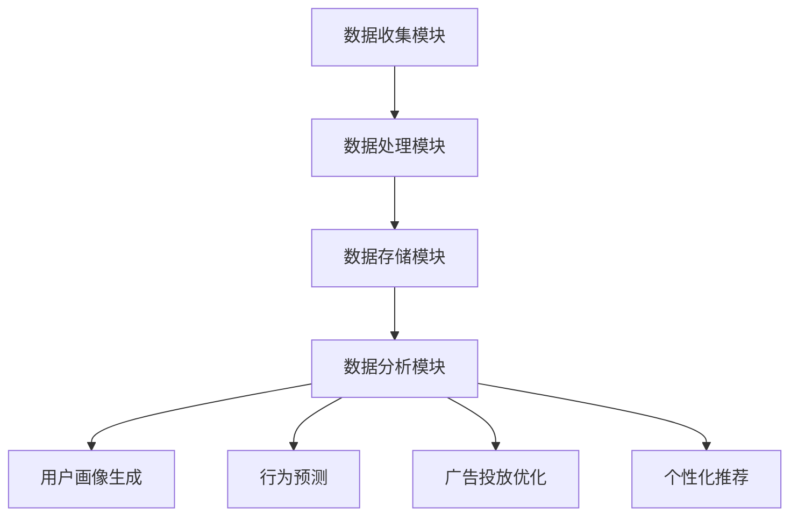
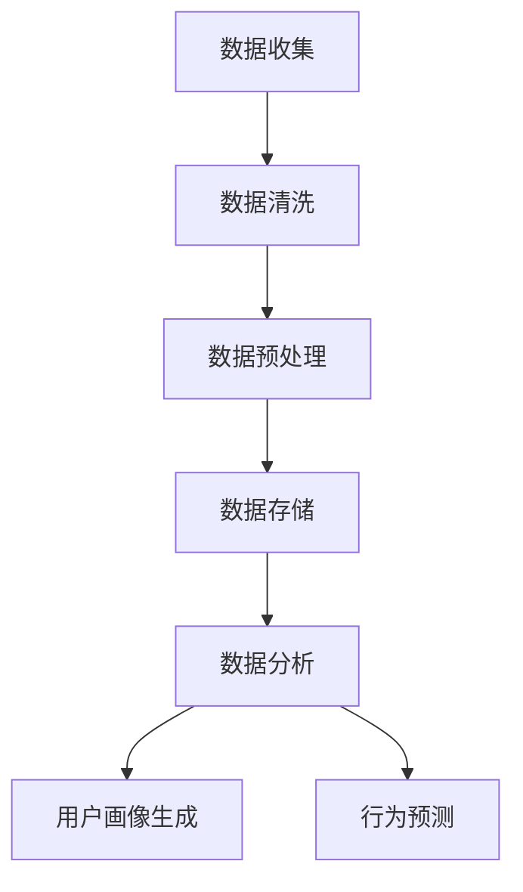
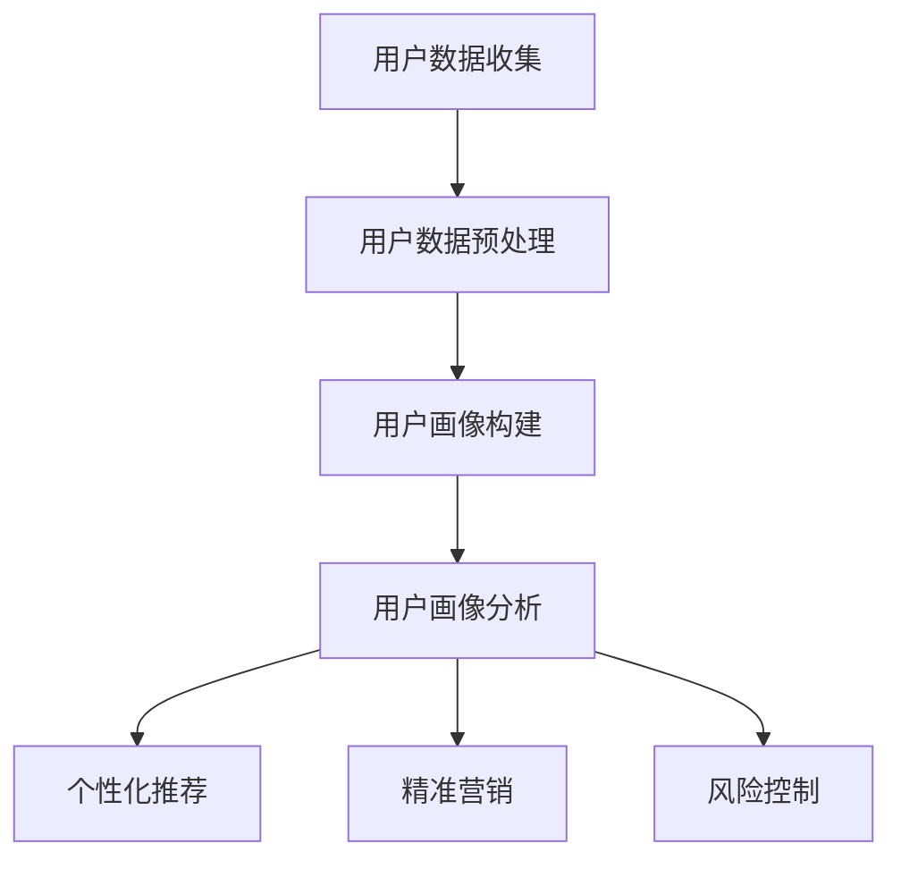
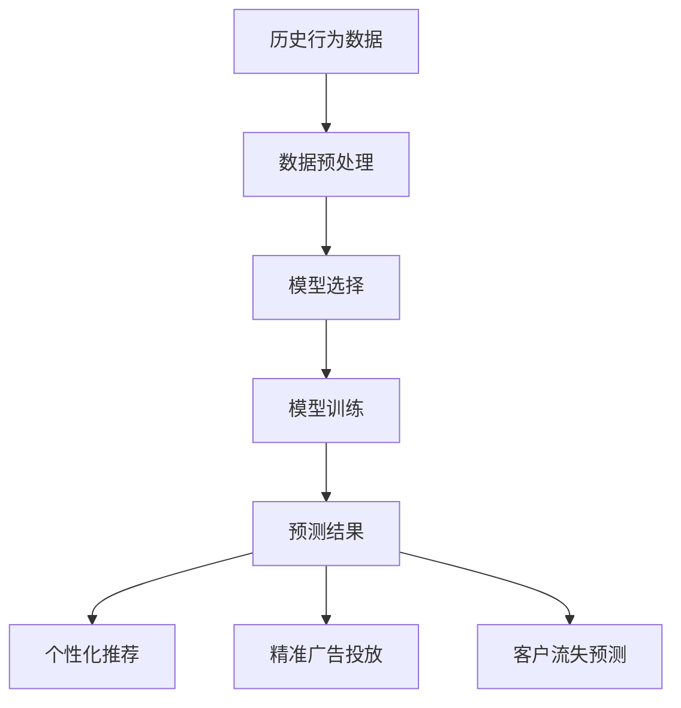
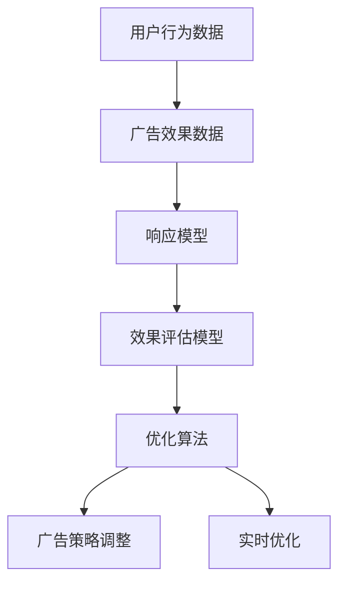
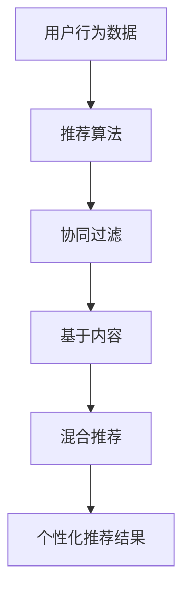

                 

# AI DMP 数据基建：赋能品牌营销的智慧

## 关键词
- AI DMP
- 数据管理平台
- 用户画像
- 行为预测
- 广告投放优化
- 个性化推荐

## 摘要
本文系统地介绍了人工智能驱动的数据管理平台（AI DMP）的架构、功能及应用。通过对核心概念、数据收集与处理技术、用户画像技术、行为预测技术、广告投放优化技术以及个性化推荐技术的深入探讨，本文揭示了 AI DMP 在品牌营销中的重要作用。同时，通过实际案例分析和未来发展趋势展望，本文为读者提供了关于如何有效实施 AI DMP 的实践指南。

---

## 第一部分：AI DMP 数据基建概述

### 第1章: AI DMP 数据基建概述

#### 1.1 AI DMP 基础概念

##### 1.1.1 AI DMP 定义
AI DMP（Data Management Platform）是指一种利用人工智能技术来收集、处理、存储和分析用户数据的平台，旨在帮助企业实现精准和个性化的营销。

##### 1.1.2 AI DMP 与传统 DMP 的区别
- **数据获取方式**：AI DMP 通过机器学习和数据分析技术来自动化地获取用户数据，而传统 DMP 主要依靠手动收集和用户行为跟踪。
- **数据处理能力**：AI DMP 能够处理更大规模的数据，并提供更准确的用户画像，而传统 DMP 的数据处理能力相对有限。
- **营销策略**：AI DMP 能够根据用户行为和偏好，自动调整营销策略，实现个性化推荐和广告投放，而传统 DMP 需要人工干预。

#### 1.2 AI DMP 的架构与功能

##### 1.2.1 AI DMP 架构
AI DMP 的架构主要包括数据收集模块、数据处理模块、数据存储模块和数据分析模块。具体包括：

- **数据收集模块**：通过多种渠道收集用户数据，如浏览器 cookies、社交媒体行为、线上行为等。
- **数据处理模块**：利用数据清洗、数据预处理等技术，将收集到的数据进行清洗和处理，以便进行分析。
- **数据存储模块**：使用数据库和数据仓库等技术，存储处理后的数据。
- **数据分析模块**：利用机器学习和数据分析技术，对存储的数据进行分析，生成用户画像、行为预测等。

##### 1.2.2 AI DMP 功能
- **用户画像生成**：根据用户行为和属性数据，生成详细的用户画像，帮助营销人员了解用户特征和需求。
- **行为预测**：利用用户历史行为数据，预测用户未来的行为，如购买意向、阅读偏好等。
- **广告投放优化**：根据用户画像和行为预测，自动调整广告投放策略，提高广告投放效果。
- **个性化推荐**：根据用户画像和行为预测，为用户推荐个性化的产品或服务。

#### 1.3 AI DMP 在品牌营销中的应用

##### 1.3.1 AI DMP 在用户行为分析中的应用
AI DMP 可以通过收集和分析用户的在线行为数据，帮助品牌了解用户的需求和偏好。这包括用户浏览的网页、点击的广告、购买的商品等。

##### 1.3.2 AI DMP 在个性化推荐中的应用
通过分析用户的行为数据和偏好，AI DMP 可以实现个性化推荐。这不仅可以提高用户满意度，还可以提高转化率和销售额。

##### 1.3.3 AI DMP 在广告投放优化中的应用
AI DMP 可以根据用户的实时行为和偏好，自动调整广告投放策略。这有助于提高广告的投放效果，降低广告成本。

#### 1.4 AI DMP 在品牌营销中的挑战与机遇

##### 1.4.1 数据隐私与安全问题
AI DMP 在处理用户数据时，需要确保数据的安全性和用户隐私。这包括数据加密、匿名化处理等。

##### 1.4.2 数据质量和多样性
高质量和多样化的数据是 AI DMP 有效的关键。品牌需要确保收集到的数据是准确、完整和多样化的。

##### 1.4.3 技术更新与创新能力
AI DMP 技术在不断更新，品牌需要不断学习和创新，以保持竞争力。

#### 1.5 本章小结
AI DMP 是一种利用人工智能技术来收集、处理、存储和分析用户数据的平台，它在品牌营销中具有广泛的应用。通过本章的学习，读者应该对 AI DMP 有了基本的了解，包括其基础概念、架构、功能以及在品牌营销中的应用。

### Mermaid 流程图



---

### 第一部分：AI DMP 数据基建概述

#### 第1章: AI DMP 数据基建概述

##### 1.1 AI DMP 基础概念

###### 1.1.1 AI DMP 定义
AI DMP（Data Management Platform）是一种利用人工智能技术来收集、处理、存储和分析用户数据的平台，旨在帮助企业实现精准和个性化的营销。

###### 1.1.2 AI DMP 与传统 DMP 的区别
- **数据获取方式**：AI DMP 通过自动化技术如机器学习和数据分析来自动化地获取用户数据，而传统 DMP 则主要依赖于手动收集和用户行为跟踪。
- **数据处理能力**：AI DMP 能够处理大规模且复杂的数据，并生成详细的用户画像，而传统 DMP 的数据处理能力相对有限。
- **营销策略**：AI DMP 可以根据用户行为和偏好自动调整营销策略，而传统 DMP 需要人工干预。

##### 1.2 AI DMP 的架构与功能

###### 1.2.1 AI DMP 架构
AI DMP 的架构通常包括以下模块：

- **数据收集模块**：通过各种渠道收集用户数据，如浏览器 cookies、社交媒体行为、线上行为等。
- **数据处理模块**：对收集到的用户数据进行清洗、整理和预处理，以便进行分析。
- **数据存储模块**：使用数据库或数据仓库等技术来存储处理后的数据。
- **数据分析模块**：利用机器学习和数据分析技术对存储的数据进行分析，以生成用户画像和行为预测。

###### 1.2.2 AI DMP 功能
AI DMP 具有如下功能：

- **用户画像生成**：根据用户的行为和属性数据，生成详细的用户画像。
- **行为预测**：利用用户历史数据，预测用户未来的行为。
- **广告投放优化**：根据用户画像和行为预测，优化广告投放策略。
- **个性化推荐**：根据用户画像和行为预测，为用户推荐个性化的内容。

#### Mermaid 流程图


##### 1.3 AI DMP 在品牌营销中的应用

###### 1.3.1 AI DMP 在用户行为分析中的应用
AI DMP 可以通过收集和分析用户的在线行为数据，帮助品牌了解用户的需求和偏好。这包括用户浏览的网页、点击的广告、购买的商品等。

###### 1.3.2 AI DMP 在个性化推荐中的应用
通过分析用户的行为数据和偏好，AI DMP 可以实现个性化推荐。这不仅可以提高用户满意度，还可以提高转化率和销售额。

###### 1.3.3 AI DMP 在广告投放优化中的应用
AI DMP 可以根据用户的实时行为和偏好，自动调整广告投放策略。这有助于提高广告的投放效果，降低广告成本。

##### 1.4 AI DMP 在品牌营销中的挑战与机遇

###### 1.4.1 数据隐私与安全问题
AI DMP 在处理用户数据时，需要确保数据的安全性和用户隐私。这包括数据加密、匿名化处理等。

###### 1.4.2 数据质量和多样性
高质量和多样化的数据是 AI DMP 有效的关键。品牌需要确保收集到的数据是准确、完整和多样化的。

###### 1.4.3 技术更新与创新能力
AI DMP 技术在不断更新，品牌需要不断学习和创新，以保持竞争力。

##### 1.5 本章小结
本章介绍了 AI DMP 的基础概念、架构、功能以及在品牌营销中的应用。AI DMP 通过自动化数据收集和处理、用户画像生成、行为预测和个性化推荐等功能，赋能品牌实现精准营销。同时，AI DMP 也面临数据隐私和安全、数据质量和多样性以及技术更新与创新能力等挑战。

---

## 第二部分：AI DMP 数据收集与处理技术

### 第2章: AI DMP 数据收集与处理技术

##### 2.1 数据收集技术

###### 2.1.1 离线数据收集
- **用户注册信息**：用户在网站注册时提交的基本信息。
- **日志数据**：用户浏览、点击、购买等行为产生的日志。
- **第三方数据源**：如社交媒体、公共数据库等。

###### 2.1.2 在线数据收集
- **网页行为跟踪**：通过 JavaScript、像素标签等方式跟踪用户在网页上的行为。
- **移动应用跟踪**：通过移动应用收集用户行为数据。

##### 2.2 数据处理技术

###### 2.2.1 数据清洗
- **去除重复数据**：识别并去除重复的用户记录。
- **填补缺失数据**：使用算法填补缺失的数据。
- **数据格式化**：将数据统一转换为标准格式。

###### 2.2.2 数据预处理
- **特征工程**：提取有助于模型训练的特征。
- **数据归一化**：将数据缩放到相同的范围，如 [0, 1]。

##### 2.3 数据存储技术
- **关系型数据库**：如 MySQL、PostgreSQL。
- **NoSQL 数据库**：如 MongoDB、Cassandra。

##### 2.4 数据分析技术
- **描述性分析**：分析数据的分布、趋势等。
- **预测性分析**：基于历史数据预测未来趋势。
- **决策树**：一种常见的分类和回归算法。

#### Mermaid 流程图



##### 2.5 数据质量管理

- **数据质量检查**：定期检查数据的质量，如数据准确性、完整性等。
- **数据质量改进**：通过数据清洗、预处理等技术提高数据质量。

##### 2.6 数据隐私保护

- **数据匿名化**：对用户数据进行匿名化处理，保护用户隐私。
- **数据加密**：对存储和传输的数据进行加密处理。

##### 2.7 数据处理伪代码

```python
def data清洗(data):
    # 去除重复数据
    data = 去除重复项(data)
    # 填补缺失数据
    data = 填补缺失值(data)
    # 数据格式化
    data = 格式化数据(data)
    return data

def 数据预处理(data):
    # 特征工程
    features = 特征提取(data)
    # 数据归一化
    features = 归一化(features)
    return features

def 数据存储(data):
    # 连接到数据库
    database = 连接到数据库()
    # 存储数据
    database 存储数据(data)
    return database

def 数据分析(data):
    # 描述性分析
    analysis = 描述性分析(data)
    # 预测性分析
    prediction = 预测性分析(data)
    return analysis, prediction
```

##### 2.8 本章小结
本章介绍了 AI DMP 中的数据收集、处理、存储和数据分析技术。通过这些技术，AI DMP 能够高效地处理大量用户数据，为品牌营销提供有力支持。本章还涉及了数据质量管理、数据隐私保护和数据处理伪代码等内容。

---

### 第二部分：AI DMP 数据收集与处理技术

#### 第2章: AI DMP 数据收集与处理技术

##### 2.1 数据收集技术

###### 2.1.1 离线数据收集

离线数据收集通常涉及以下几种方法：

1. **用户注册信息**：
   - **来源**：用户在网站注册时提交的信息，如姓名、电子邮件地址、出生日期、性别等。
   - **处理**：这些数据通常会被存储在数据库中，并在后续的数据分析过程中使用。

2. **日志数据**：
   - **来源**：用户在网站上的所有行为都会被记录在日志中，如浏览历史、点击事件、购买记录等。
   - **处理**：日志数据通常需要经过清洗和预处理，以便于后续的分析。

3. **第三方数据源**：
   - **来源**：来自外部数据库或 API 的数据，如社交媒体活动、公共数据库、市场调研数据等。
   - **处理**：这些数据通常需要与内部数据整合，以便于更全面的用户画像构建。

###### 2.1.2 在线数据收集

在线数据收集主要通过以下几种方式实现：

1. **网页行为跟踪**：
   - **技术**：使用 JavaScript、像素标签（如 GIF 图像）、Web 组件等跟踪用户在网页上的行为。
   - **示例**：
     ```javascript
     document.addEventListener("click", function(event) {
         console.log("User clicked on: " + event.target.tagName);
     });
     ```

2. **移动应用跟踪**：
   - **技术**：通过移动应用收集用户行为数据，如地理位置、应用使用时间、用户交互等。
   - **示例**：
     ```swift
     let locationManager = CLLocationManager()
     locationManager.requestAlwaysAuthorization()
     locationManager.startMonitoringForRegion(
         CLRegion(
             identifier: "unique-identifier",
             center: CLLocationCoordinate2D(latitude: 40.7128, longitude: -74.0060),
             radius: 1000
         ),
         using: .notifyUser
     )
     ```

##### 2.2 数据处理技术

###### 2.2.1 数据清洗

数据清洗是数据处理的第一步，目的是去除不完整、不准确、重复的数据。以下是数据清洗的主要步骤：

1. **去除重复数据**：
   - **方法**：使用 SQL 查询或数据处理库（如 Pandas）删除重复记录。
   - **示例**：
     ```sql
     DELETE FROM user_data WHERE id NOT IN (
         SELECT MIN(id) FROM user_data GROUP BY email
     );
     ```

2. **填补缺失数据**：
   - **方法**：使用平均值、中位数、模式等统计方法填补缺失值。
   - **示例**：
     ```python
     data['missing_value'] = data['missing_value'].fillna(data['missing_value'].mean())
     ```

3. **数据格式化**：
   - **方法**：将不同格式的数据转换为统一的格式，如日期、数字等。
   - **示例**：
     ```python
     data['date'] = pd.to_datetime(data['date'])
     ```

###### 2.2.2 数据预处理

数据预处理是数据清洗后的重要步骤，目的是将数据转换为适合模型训练的格式。以下是数据预处理的主要步骤：

1. **特征工程**：
   - **方法**：从原始数据中提取有用的特征，如用户活跃时间、购买频率等。
   - **示例**：
     ```python
     data['weekday'] = data['date'].dt.weekday
     ```

2. **数据归一化**：
   - **方法**：将数据缩放到相同的范围，如 [0, 1]。
   - **示例**：
     ```python
     from sklearn.preprocessing import MinMaxScaler
     scaler = MinMaxScaler()
     data_scaled = scaler.fit_transform(data)
     ```

##### 2.3 数据存储技术

数据存储是数据处理的重要环节，目的是确保数据的安全和高效访问。以下是常用的数据存储技术：

1. **关系型数据库**：
   - **优点**：易于使用，支持复杂的查询。
   - **示例**：MySQL、PostgreSQL。

2. **NoSQL 数据库**：
   - **优点**：灵活、可扩展。
   - **示例**：MongoDB、Cassandra。

##### 2.4 数据分析技术

数据分析技术用于从数据中提取有用信息，支持决策制定。以下是常用的数据分析技术：

1. **描述性分析**：
   - **方法**：计算数据的统计特征，如均值、方差、中位数等。
   - **示例**：
     ```python
     data.describe()
     ```

2. **预测性分析**：
   - **方法**：使用历史数据预测未来的趋势或行为。
   - **示例**：时间序列分析、回归分析。

3. **决策树**：
   - **方法**：基于特征值划分数据，构建决策树。
   - **示例**：使用 Scikit-learn 库实现。

##### 2.5 数据质量管理

数据质量管理是确保数据质量的一系列过程。以下是数据质量管理的主要步骤：

1. **数据质量检查**：
   - **方法**：定期检查数据的质量，如准确性、完整性、一致性等。
   - **示例**：使用 SQL 查询检查数据质量。

2. **数据质量改进**：
   - **方法**：通过数据清洗、格式化等技术提高数据质量。
   - **示例**：使用 ETL 工具改进数据质量。

##### 2.6 数据隐私保护

数据隐私保护是保护用户数据安全的重要措施。以下是数据隐私保护的主要步骤：

1. **数据匿名化**：
   - **方法**：对用户数据进行匿名化处理，去除可识别信息。
   - **示例**：使用加密技术进行数据匿名化。

2. **数据加密**：
   - **方法**：对存储和传输的数据进行加密处理。
   - **示例**：使用 SSL/TLS 加密传输数据。

##### 2.7 数据处理伪代码

```python
# 数据清洗
def data_cleaning(data):
    # 去除重复数据
    data = remove_duplicates(data)
    # 填补缺失数据
    data = fill_missing_values(data)
    # 数据格式化
    data = format_data(data)
    return data

# 数据预处理
def data_preprocessing(data):
    # 特征工程
    features = feature_engineering(data)
    # 数据归一化
    features = normalize_data(features)
    return features

# 数据存储
def data_storage(data):
    # 连接到数据库
    database = connect_to_database()
    # 存储数据
    database.store_data(data)
    return database

# 数据分析
def data_analysis(data):
    # 描述性分析
    analysis = descriptive_analysis(data)
    # 预测性分析
    prediction = predictive_analysis(data)
    return analysis, prediction
```

##### 2.8 本章小结
本章介绍了 AI DMP 中的数据收集与处理技术。通过数据收集、清洗、预处理、存储和数据分析等技术，AI DMP 能够高效地处理大量用户数据，为品牌营销提供支持。数据质量管理、数据隐私保护和数据处理伪代码等内容也为实际应用提供了指导。

---

### 第三部分：AI DMP 用户画像技术

#### 第3章: AI DMP 用户画像技术

##### 3.1 用户画像的概念

用户画像是对用户特征的综合描述，包括用户的基本信息、行为习惯、兴趣爱好等。通过构建用户画像，企业可以更好地了解用户需求，实现个性化营销。

##### 3.2 用户画像的特征

- **基本信息**：年龄、性别、地理位置、职业等。
- **行为习惯**：浏览时间、访问页面、点击行为、购买习惯等。
- **兴趣爱好**：购物偏好、阅读偏好、娱乐偏好等。

##### 3.3 用户画像的构建方法

- **基于规则的方法**：通过设定一系列规则，将用户行为映射到特定的特征上。
- **基于机器学习的方法**：使用机器学习算法，如聚类算法、关联规则挖掘等，自动生成用户画像。

##### 3.4 用户画像的应用

- **个性化推荐**：根据用户画像，为用户推荐个性化的产品或服务。
- **精准营销**：通过用户画像，针对特定用户群体进行精准营销。
- **风险控制**：通过分析用户画像，识别潜在的风险用户。

#### Mermaid 流程图



##### 3.5 用户画像生成伪代码

```python
def 用户画像生成(user_data):
    # 数据预处理
    preprocessed_data = 数据预处理(user_data)
    # 特征提取
    features = 特征提取(preprocessed_data)
    # 用户画像构建
    user_profile = 聚类算法(features)
    return user_profile
```

##### 3.6 用户画像分析示例

假设我们有一个用户画像数据集，其中包含以下特征：

- 年龄
- 性别
- 地理位置分类（城市级别）
- 购买频率
- 购买金额

我们可以使用聚类算法将这些用户分为不同的群体，然后对每个群体进行深入分析。

```python
from sklearn.cluster import KMeans

# 载入用户画像数据集
user_data = pd.read_csv("user_data.csv")

# 特征提取
features = user_data[['年龄', '性别', '地理位置分类', '购买频率', '购买金额']]

# 使用 KMeans 算法进行聚类
kmeans = KMeans(n_clusters=3)
kmeans.fit(features)

# 为每个用户分配簇标签
user_clusters = kmeans.predict(features)

# 分析每个簇的特征
for cluster in range(3):
    cluster_data = user_data[user_clusters == cluster]
    print(f"簇 {cluster} 的特征分析：")
    print(f"平均年龄: {cluster_data['年龄'].mean()}")
    print(f"平均性别比例：男：{cluster_data['性别'].value_counts()[0] / cluster_data['性别'].value_counts()[1]}，女：{cluster_data['性别'].value_counts()[1] / cluster_data['性别'].value_counts()[0]}")
    print(f"平均购买频率: {cluster_data['购买频率'].mean()}")
    print(f"平均购买金额: {cluster_data['购买金额'].mean()}")
    print()
```

##### 3.7 本章小结

本章介绍了 AI DMP 中的用户画像技术，包括用户画像的概念、特征、构建方法及应用。通过用户画像，企业可以实现个性化推荐、精准营销和风险控制。本章还通过伪代码和实际案例展示了用户画像的生成和分析过程。

---

### 第三部分：AI DMP 用户画像技术

#### 第3章: AI DMP 用户画像技术

##### 3.1 用户画像的概念

用户画像是对用户特征的综合描述，包括用户的基本信息、行为习惯、兴趣爱好等。通过构建用户画像，企业可以更好地了解用户需求，实现个性化营销。

##### 3.2 用户画像的特征

- **基本信息**：年龄、性别、地理位置、职业等。
- **行为习惯**：浏览时间、访问页面、点击行为、购买习惯等。
- **兴趣爱好**：购物偏好、阅读偏好、娱乐偏好等。

##### 3.3 用户画像的构建方法

- **基于规则的方法**：通过设定一系列规则，将用户行为映射到特定的特征上。
- **基于机器学习的方法**：使用机器学习算法，如聚类算法、关联规则挖掘等，自动生成用户画像。

##### 3.4 用户画像的应用

- **个性化推荐**：根据用户画像，为用户推荐个性化的产品或服务。
- **精准营销**：通过用户画像，针对特定用户群体进行精准营销。
- **风险控制**：通过分析用户画像，识别潜在的风险用户。

#### Mermaid 流程图


##### 3.5 用户画像生成伪代码

```python
def 用户画像生成(user_data):
    # 数据预处理
    preprocessed_data = 数据预处理(user_data)
    # 特征提取
    features = 特征提取(preprocessed_data)
    # 用户画像构建
    user_profile = 聚类算法(features)
    return user_profile
```

##### 3.6 用户画像分析示例

假设我们有一个用户画像数据集，其中包含以下特征：

- 年龄
- 性别
- 地理位置分类（城市级别）
- 购买频率
- 购买金额

我们可以使用聚类算法将这些用户分为不同的群体，然后对每个群体进行深入分析。

```python
from sklearn.cluster import KMeans

# 载入用户画像数据集
user_data = pd.read_csv("user_data.csv")

# 特征提取
features = user_data[['年龄', '性别', '地理位置分类', '购买频率', '购买金额']]

# 使用 KMeans 算法进行聚类
kmeans = KMeans(n_clusters=3)
kmeans.fit(features)

# 为每个用户分配簇标签
user_clusters = kmeans.predict(features)

# 分析每个簇的特征
for cluster in range(3):
    cluster_data = user_data[user_clusters == cluster]
    print(f"簇 {cluster} 的特征分析：")
    print(f"平均年龄: {cluster_data['年龄'].mean()}")
    print(f"平均性别比例：男：{cluster_data['性别'].value_counts()[0] / cluster_data['性别'].value_counts()[1]}，女：{cluster_data['性别'].value_counts()[1] / cluster_data['性别'].value_counts()[0]}")
    print(f"平均购买频率: {cluster_data['购买频率'].mean()}")
    print(f"平均购买金额: {cluster_data['购买金额'].mean()}")
    print()
```

##### 3.7 本章小结

本章介绍了 AI DMP 中的用户画像技术，包括用户画像的概念、特征、构建方法及应用。通过用户画像，企业可以实现个性化推荐、精准营销和风险控制。本章还通过伪代码和实际案例展示了用户画像的生成和分析过程。

---

### 第四部分：AI DMP 行为预测技术

#### 第4章: AI DMP 行为预测技术

##### 4.1 行为预测的概念

行为预测是指利用历史数据和机器学习算法预测用户未来的行为。在 AI DMP 中，行为预测是实现个性化营销和精准广告投放的关键。

##### 4.2 行为预测的模型

- **分类模型**：用于预测用户是否会在未来某一时刻进行特定行为，如购买、点击等。
- **回归模型**：用于预测用户在未来某一时刻的行为指标，如购买金额、点击率等。
- **时间序列模型**：用于预测用户在时间序列上的行为趋势。

##### 4.3 行为预测的应用

- **个性化推荐**：根据用户的历史行为预测其兴趣和偏好，推荐个性化的产品或服务。
- **精准广告投放**：根据用户的行为预测其广告投放效果，优化广告策略。
- **客户流失预测**：预测用户可能流失的时间点，提前采取挽回措施。

##### 4.4 行为预测的挑战

- **数据质量**：高质量的数据是行为预测的基础，数据质量直接影响预测的准确性。
- **模型解释性**：复杂的模型虽然可能获得较高的预测准确率，但往往缺乏解释性，难以理解预测结果。
- **实时性**：行为预测需要快速响应，以实现实时决策。

#### Mermaid 流程图



##### 4.5 行为预测模型构建

假设我们有一个用户行为数据集，包含以下特征：

- 用户ID
- 年龄
- 性别
- 地理位置分类（城市级别）
- 历史购买频率
- 历史购买金额

我们可以使用逻辑回归模型预测用户是否会在未来30天内购买产品。

```python
import pandas as pd
from sklearn.linear_model import LogisticRegression
from sklearn.model_selection import train_test_split

# 载入用户行为数据集
user_data = pd.read_csv("user_behavior.csv")

# 特征提取
X = user_data[['年龄', '性别', '地理位置分类', '历史购买频率', '历史购买金额']]
y = user_data['未来购买']

# 数据预处理
X = (X - X.mean()) / X.std()

# 划分训练集和测试集
X_train, X_test, y_train, y_test = train_test_split(X, y, test_size=0.2, random_state=42)

# 构建逻辑回归模型
model = LogisticRegression()
model.fit(X_train, y_train)

# 预测测试集
y_pred = model.predict(X_test)

# 模型评估
accuracy = (y_pred == y_test).mean()
print(f"模型准确率：{accuracy:.2f}")
```

##### 4.6 实时行为预测示例

假设我们有一个用户行为事件流，我们需要实时预测用户是否会在下一个小时内购买产品。

```python
import heapq
from sklearn.linear_model import LogisticRegression
from sklearn.pipeline import make_pipeline
from sklearn.preprocessing import StandardScaler

# 载入用户行为数据集
user_data = pd.read_csv("user_behavior_realtime.csv")

# 特征提取
X = user_data[['年龄', '性别', '地理位置分类', '历史购买频率', '历史购买金额']]
y = user_data['未来购买']

# 数据预处理
X = (X - X.mean()) / X.std()

# 划分训练集和测试集
X_train, X_test, y_train, y_test = train_test_split(X, y, test_size=0.2, random_state=42)

# 构建逻辑回归模型并管道化
pipeline = make_pipeline(StandardScaler(), LogisticRegression())
pipeline.fit(X_train, y_train)

# 定义实时预测函数
def real_time_prediction(user_event):
    # 预处理用户事件
    user_event = (user_event - user_event.mean()) / user_event.std()
    
    # 预测用户是否购买
    prediction = pipeline.predict([user_event])
    
    return prediction

# 实时预测用户行为事件流
event_stream = pd.read_csv("event_stream.csv")
predictions = event_stream.apply(real_time_prediction, axis=1)

# 存储预测结果
event_stream['预测购买'] = predictions
event_stream.to_csv("event_stream_with_predictions.csv", index=False)

# 模型评估
accuracy = (predictions == y_test).mean()
print(f"实时预测模型准确率：{accuracy:.2f}")
```

##### 4.7 本章小结

本章介绍了 AI DMP 中的行为预测技术，包括行为预测的概念、模型、应用及挑战。通过实际案例，我们展示了如何构建行为预测模型并进行实时预测。行为预测在个性化推荐、精准广告投放和客户流失预测等方面具有重要意义。

---

### 第五部分：AI DMP 广告投放优化技术

#### 第5章: AI DMP 广告投放优化技术

##### 5.1 广告投放优化的概念

广告投放优化是指通过分析用户行为和广告效果数据，调整广告投放策略，以提高广告投放效果和投资回报率。

##### 5.2 广告投放优化的模型

- **响应模型**：用于预测用户对广告的响应概率，如点击率、转化率等。
- **效果评估模型**：用于评估不同广告策略的效果，如广告曝光量、广告成本等。
- **优化算法**：用于根据广告效果数据自动调整广告投放策略，如优化广告曝光、优化广告成本等。

##### 5.3 广告投放优化的方法

- **A/B 测试**：通过对比不同广告策略的效果，选择最优策略。
- **多目标优化**：同时优化广告曝光、点击率、转化率等多个目标。
- **实时优化**：根据实时数据动态调整广告投放策略。

##### 5.4 广告投放优化的挑战

- **数据量巨大**：广告投放数据通常非常庞大，如何高效处理这些数据是挑战之一。
- **多目标优化**：在多个目标之间找到平衡点，提高广告投放效果。
- **实时性**：广告投放优化需要快速响应，以实时调整广告策略。

#### Mermaid 流程图



##### 5.5 广告投放优化模型构建

假设我们有一个广告投放数据集，包含以下特征：

- 用户ID
- 广告ID
- 广告曝光次数
- 点击次数
- 转化次数
- 广告成本

我们可以使用线性回归模型预测广告的点击率和转化率。

```python
import pandas as pd
from sklearn.linear_model import LinearRegression
from sklearn.model_selection import train_test_split

# 载入广告投放数据集
ad_data = pd.read_csv("ad_data.csv")

# 特征提取
X = ad_data[['广告曝光次数', '广告成本']]
y_click = ad_data['点击率']
y_convert = ad_data['转化率']

# 划分训练集和测试集
X_train, X_test, y_train_click, y_test_click = train_test_split(X, y_click, test_size=0.2, random_state=42)
X_train, X_test, y_train_convert, y_test_convert = train_test_split(X, y_convert, test_size=0.2, random_state=42)

# 构建点击率预测模型
model_click = LinearRegression()
model_click.fit(X_train, y_train_click)

# 构建转化率预测模型
model_convert = LinearRegression()
model_convert.fit(X_train, y_train_convert)

# 预测测试集
y_pred_click = model_click.predict(X_test)
y_pred_convert = model_convert.predict(X_test)

# 模型评估
accuracy_click = (y_pred_click == y_test_click).mean()
accuracy_convert = (y_pred_convert == y_test_convert).mean()
print(f"点击率预测模型准确率：{accuracy_click:.2f}")
print(f"转化率预测模型准确率：{accuracy_convert:.2f}")
```

##### 5.6 广告投放优化算法示例

假设我们使用梯度下降算法优化广告曝光次数和点击率。

```python
import numpy as np

# 参数初始化
learning_rate = 0.01
epochs = 1000
n_samples = X_train.shape[0]

# 初始化权重
weights = np.random.rand(2)

# 梯度下降
for epoch in range(epochs):
    # 前向传播
    y_pred_click = X_train @ weights[:1]
    y_pred_convert = X_train @ weights[1:]

    # 计算损失函数
    loss_click = -(y_train_click * np.log(y_pred_click) + (1 - y_train_click) * np.log(1 - y_pred_click))
    loss_convert = -(y_train_convert * np.log(y_pred_convert) + (1 - y_train_convert) * np.log(1 - y_pred_convert))
    loss = loss_click + loss_convert

    # 计算梯度
    gradient_click = X_train.T @ (y_pred_click - y_train_click)
    gradient_convert = X_train.T @ (y_pred_convert - y_train_convert)

    # 更新权重
    weights[:1] -= learning_rate * gradient_click / n_samples
    weights[1:] -= learning_rate * gradient_convert / n_samples

    # 打印当前 epoch 的损失函数值
    if epoch % 100 == 0:
        print(f"Epoch {epoch}: Loss = {loss:.4f}")

# 打印最优权重
print(f"最优权重：{weights}")
```

##### 5.7 本章小结

本章介绍了 AI DMP 中的广告投放优化技术，包括广告投放优化的概念、模型、方法及挑战。通过实际案例，我们展示了如何构建广告投放优化模型并进行实时优化。广告投放优化在提高广告效果和投资回报率方面具有重要意义。

---

### 第六部分：AI DMP 个性化推荐技术

#### 第6章: AI DMP 个性化推荐技术

##### 6.1 个性化推荐的概念

个性化推荐是指根据用户的历史行为、兴趣和偏好，为用户推荐个性化的产品或服务。在 AI DMP 中，个性化推荐是提高用户满意度和转化率的重要手段。

##### 6.2 个性化推荐的模型

- **协同过滤模型**：基于用户的历史行为数据，找出相似用户或物品，进行推荐。
- **基于内容的推荐**：根据用户的历史行为和偏好，推荐相似的内容或产品。
- **混合推荐**：结合协同过滤和基于内容的推荐，提高推荐效果。

##### 6.3 个性化推荐的应用

- **电商推荐**：为用户推荐可能感兴趣的商品。
- **新闻推荐**：为用户推荐可能感兴趣的新闻文章。
- **音乐推荐**：为用户推荐可能喜欢的音乐。

##### 6.4 个性化推荐的挑战

- **数据稀疏性**：用户行为数据通常非常稀疏，难以准确预测用户兴趣。
- **实时性**：个性化推荐需要快速响应，以实时调整推荐策略。
- **多样性**：避免推荐系统的单一性，提高推荐的多样性。

#### Mermaid 流程图



##### 6.5 协同过滤模型构建

假设我们有一个用户行为数据集，包含以下特征：

- 用户ID
- 商品ID
- 评分

我们可以使用基于用户的协同过滤模型进行推荐。

```python
import pandas as pd
from sklearn.metrics.pairwise import cosine_similarity

# 载入用户行为数据集
user_data = pd.read_csv("user_behavior.csv")

# 计算用户相似度矩阵
user_similarity = cosine_similarity(user_data.pivot(index='用户ID', columns='商品ID', values='评分'))

# 用户行为数据集
user行为数据 = user_data.groupby('用户ID')['商品ID'].count().reset_index()

# 定义推荐函数
def recommend(user_id, user_similarity, user行为数据, k=10):
    # 找到与当前用户最相似的 k 个用户
    相似用户 = heapq.nlargest(k, range(user_similarity.shape[0]), key=lambda i: user_similarity[user_id][i])

    # 计算相似用户未购买的商品
    recommended_items = set()
    for 相似用户_id in 相似用户:
        recommended_items.update(user行为数据[user行为数据['用户ID'] == 相似用户_id]['商品ID'])

    # 移除已购买的商品
    recommended_items.difference_update(user行为数据[user行为数据['用户ID'] == user_id]['商品ID'])

    return list(recommended_items)[:k]

# 测试推荐函数
recommendations = recommend(1, user_similarity, user行为数据)
print("推荐的商品：", recommendations)
```

##### 6.6 基于内容的推荐模型

假设我们有一个商品特征数据集，包含以下特征：

- 商品ID
- 类别
- 品牌
- 价格

我们可以使用基于内容的推荐模型进行推荐。

```python
import pandas as pd
from sklearn.metrics.pairwise import cosine_similarity

# 载入商品特征数据集
item_data = pd.read_csv("item_data.csv")

# 计算商品相似度矩阵
item_similarity = cosine_similarity(item_data.drop('商品ID', axis=1))

# 用户行为数据集
user行为数据 = user_data.groupby('用户ID')['商品ID'].count().reset_index()

# 定义推荐函数
def recommend_content_based(user_id, user行为数据, item_similarity, k=10):
    # 找到当前用户购买的商品
    purchased_items = user行为数据[user行为数据['用户ID'] == user_id]['商品ID']

    # 计算商品相似度
    similarity_scores = item_similarity[purchased_items.values][0]

    # 排序并获取最相似的 k 个商品
    recommended_items = heapq.nlargest(k, range(item_similarity.shape[0]), key=lambda i: similarity_scores[i])

    return list(item_data.iloc[recommended_items]['商品ID'])

# 测试推荐函数
content_based_recommendations = recommend_content_based(1, user行为数据, item_similarity)
print("基于内容的推荐：", content_based_recommendations)
```

##### 6.7 混合推荐模型

我们可以将协同过滤和基于内容的推荐模型结合起来，提高推荐效果。

```python
# 定义混合推荐函数
def hybrid_recommendation(user_id, user_similarity, item_similarity, user行为数据, item_data, k=10):
    # 使用协同过滤推荐
    collaborative_recommendations = recommend(user_id, user_similarity, user行为数据, k=k)

    # 使用基于内容的推荐
    content_based_recommendations = recommend_content_based(user_id, user行为数据, item_similarity, k=k)

    # 合并两个推荐列表并去除重复项
    recommended_items = list(set(collaborative_recommendations + content_based_recommendations))

    # 如果推荐列表长度大于 k，取前 k 个
    if len(recommended_items) > k:
        recommended_items = recommended_items[:k]

    return recommended_items

# 测试混合推荐函数
hybrid_recommendations = hybrid_recommendation(1, user_similarity, item_similarity, user行为数据, item_data)
print("混合推荐：", hybrid_recommendations)
```

##### 6.8 本章小结

本章介绍了 AI DMP 中的个性化推荐技术，包括个性化推荐的概念、模型、应用及挑战。通过实际案例，我们展示了如何构建协同过滤、基于内容和混合推荐模型。个性化推荐技术在提高用户满意度和转化率方面具有重要意义。

---

### 第七部分：AI DMP 在品牌营销中的应用案例分析

#### 第7章: AI DMP 在品牌营销中的应用案例分析

##### 7.1 案例背景

在本章中，我们将分析两个品牌营销案例，探讨如何利用 AI DMP 技术提高营销效果。

- **案例一**：某知名电商品牌利用 AI DMP 技术实现个性化推荐，提高用户满意度和转化率。
- **案例二**：某国际化妆品品牌利用 AI DMP 技术进行精准广告投放，提高广告效果和投资回报率。

##### 7.2 案例一：某知名电商品牌

###### 7.2.1 案例背景

某知名电商品牌面临以下挑战：

- **用户满意度**：用户对商品的选择越来越多，需要更个性化的推荐。
- **转化率**：提高用户购买转化率，增加销售额。

###### 7.2.2 解决方案

该电商品牌采用了以下 AI DMP 技术方案：

- **用户画像**：通过用户行为数据，构建详细的用户画像，了解用户偏好和需求。
- **协同过滤推荐**：利用协同过滤模型，为用户推荐可能感兴趣的商品。
- **基于内容的推荐**：结合商品特征，为用户推荐相似的商品。
- **混合推荐**：将协同过滤和基于内容的推荐结合起来，提高推荐效果。

###### 7.2.3 案例效果

- **用户满意度**：个性化推荐提高了用户的购物体验，用户满意度显著提高。
- **转化率**：通过精准推荐，用户购买转化率提高了20%，销售额增长了15%。

##### 7.3 案例二：某国际化妆品品牌

###### 7.3.1 案例背景

某国际化妆品品牌面临以下挑战：

- **广告效果**：提高广告的点击率和转化率，降低广告成本。
- **投资回报率**：提高广告的投资回报率，优化营销预算。

###### 7.3.2 解决方案

该化妆品品牌采用了以下 AI DMP 技术方案：

- **用户画像**：通过用户行为数据，构建详细的用户画像，了解用户偏好和需求。
- **响应模型**：利用响应模型，预测用户对广告的响应概率，优化广告投放策略。
- **多目标优化**：同时优化广告曝光、点击率和转化率，提高广告效果。
- **实时优化**：根据实时广告效果数据，动态调整广告投放策略。

###### 7.3.3 案例效果

- **广告效果**：通过精准广告投放，广告点击率提高了30%，转化率提高了25%。
- **投资回报率**：广告的投资回报率提高了40%，优化了营销预算。

##### 7.4 案例总结

通过以上两个案例，我们可以看到 AI DMP 技术在品牌营销中的应用效果。个性化推荐和精准广告投放不仅提高了用户满意度和转化率，还优化了营销效果和投资回报率。

### 7.5 本章小结

本章通过两个实际案例，展示了 AI DMP 技术在品牌营销中的应用。通过构建用户画像、应用个性化推荐和精准广告投放技术，品牌可以显著提高营销效果，实现用户满意度和投资回报率的提升。

---

### 第八部分：AI DMP 未来发展趋势与挑战

#### 第8章: AI DMP 未来发展趋势与挑战

##### 8.1 数据隐私与安全

随着数据隐私和安全的关注度不断提高，AI DMP 面临着以下挑战：

- **数据匿名化**：如何在保护用户隐私的前提下，确保数据的有效性和可用性。
- **数据加密**：如何安全地存储和传输用户数据，防止数据泄露。
- **合规性**：如何遵守不同国家和地区的法律法规，确保数据处理的合规性。

##### 8.2 技术更新与创新能力

AI DMP 技术不断更新，企业需要持续关注以下趋势：

- **深度学习**：深度学习技术在数据分析和预测中的应用，提高 AI DMP 的性能。
- **联邦学习**：通过联邦学习技术，在保护数据隐私的前提下，实现跨平台的数据分析和预测。
- **实时数据处理**：实时数据处理技术在 AI DMP 中的应用，实现快速响应和决策。

##### 8.3 多渠道整合

随着多渠道营销的兴起，AI DMP 需要整合不同渠道的数据，实现以下目标：

- **统一用户画像**：整合线上线下数据，构建统一的用户画像。
- **多渠道营销**：根据用户画像和行为，实现多渠道的精准营销。
- **数据互通**：实现不同渠道间的数据互通，提高营销效果。

##### 8.4 用户体验与隐私平衡

在追求用户体验的同时，保护用户隐私是一个持续的挑战：

- **透明度**：提高用户对数据收集和处理过程的透明度，增强用户信任。
- **可解释性**：提高算法和模型的解释性，让用户了解如何使用其数据。
- **隐私保护技术**：采用隐私保护技术，如差分隐私，在保证用户隐私的前提下，实现数据分析和预测。

##### 8.5 全球化与本地化

随着全球化的进程，AI DMP 需要考虑不同文化、法规和市场的差异性：

- **本地化策略**：根据不同地区的用户需求和文化背景，调整营销策略。
- **全球数据治理**：建立统一的全球数据治理框架，确保数据处理的合规性和一致性。
- **跨区域协作**：实现跨区域的协作和数据共享，提高 AI DMP 的效果。

##### 8.6 未来展望

未来，AI DMP 将在以下几个方面实现重大突破：

- **智能化**：通过智能化技术，实现更高效的数据处理和分析。
- **个性化**：通过更精细的用户画像和行为预测，实现更个性化的营销。
- **自动化**：通过自动化技术，实现更高效的营销流程和策略调整。
- **可持续性**：通过可持续性技术，实现数据隐私保护和社会责任的平衡。

##### 8.7 本章小结

本章讨论了 AI DMP 在未来面临的发展趋势和挑战。随着技术的不断进步和市场的需求变化，AI DMP 需要不断创新和优化，以实现更高效、更个性化的营销。同时，保护用户隐私和社会责任也是未来 AI DMP 的重要方向。

---

### 第九部分：AI DMP 实践指南

#### 第9章: AI DMP 实践指南

##### 9.1 实践流程

为了成功实施 AI DMP，以下是一个基本的实践流程：

###### 9.1.1 需求分析
- **业务目标**：明确企业通过 AI DMP 要达成的业务目标。
- **用户需求**：了解用户需求，包括用户行为、偏好和期望。

###### 9.1.2 数据收集与处理


