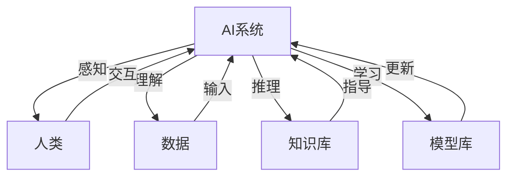

                 

### 文章标题: AI与人的协同工作前景

在人工智能（AI）迅猛发展的今天，AI与人的协同工作已经成为科技领域的一个热门话题。从自动化的生产线到智能客服，再到自动驾驶汽车，AI技术已经深刻地改变了我们的生活方式。然而，AI的发展不仅仅是为了取代人类工作，更是为了与人类共同创造更高效、更智能的未来。本文将探讨AI与人的协同工作的基础、核心概念、算法原理、应用实例以及未来发展的前景，并详细介绍实践案例和开发环境搭建。通过逐步分析和推理，深入探讨这一领域的挑战和机遇。

> 关键词：人工智能、协同工作、机器学习、深度学习、强化学习、自然语言处理、计算机视觉、应用实例、未来发展

> 摘要：本文旨在全面解析AI与人的协同工作，从基础概念、核心算法到应用实例，逐步探讨这一领域的发展前景。文章通过详细的逻辑分析和实例讲解，揭示了AI与人的协同工作的本质及其在各个领域的应用潜力，为读者提供了一幅关于未来AI与人类共同发展的蓝图。

### 第一部分: AI与人的协同工作基础

#### 第1章: AI与人的协同工作概述

##### 1.1 AI与人的协同工作的发展历程

AI与人的协同工作是一个长期的发展过程。从最早的自动化机器到现代的智能系统，AI技术经历了无数次的迭代和优化。最初，AI主要集中在特定任务的自动化处理上，例如工厂自动化和数据处理。随着计算机技术的发展，特别是深度学习和机器学习算法的突破，AI开始具备更复杂的认知和决策能力。如今，AI已经广泛应用于各个领域，从医疗诊断到金融服务，从自动驾驶到智能家居，AI与人的协同工作已经成为不可逆转的趋势。

###### 1.1.1 AI与人的协同工作的起源

AI与人的协同工作的起源可以追溯到20世纪50年代，当时计算机科学家们开始探索如何让计算机模拟人类的思维和行为。最早的AI系统主要是基于规则的系统，它们通过预先设定的规则来执行特定的任务。尽管这些系统在特定领域表现出色，但它们缺乏灵活性和通用性，难以应对复杂多变的问题。

###### 1.1.2 AI与人的协同工作的发展阶段

AI与人的协同工作的发展可以分为以下几个阶段：

- **规则驱动阶段**（1950s-1980s）：这个阶段以逻辑编程和专家系统为代表。专家系统通过预定义的规则来模拟专家的决策过程。

- **知识表示阶段**（1980s-1990s）：随着知识表示和推理技术的发展，AI系统开始能够处理更复杂的任务，例如自然语言处理和图像识别。

- **学习驱动阶段**（1990s-2000s）：机器学习算法的引入使得AI系统具备了自主学习和适应环境的能力。这一阶段的代表性技术包括支持向量机（SVM）和决策树。

- **深度学习阶段**（2010s-至今）：深度学习的出现使得AI系统在图像识别、自然语言处理和游戏AI等领域取得了突破性的进展。深度神经网络（DNN）、卷积神经网络（CNN）和生成对抗网络（GAN）等算法的出现，使得AI系统具备了前所未有的复杂度和灵活性。

###### 1.1.3 当前AI与人的协同工作的发展状况

当前，AI与人的协同工作已经进入了一个新的发展阶段。随着云计算、大数据和物联网等技术的快速发展，AI系统的应用场景越来越广泛，从工业制造到医疗健康，从金融服务到交通运输，AI正在深刻地改变我们的生活方式和工作方式。同时，AI系统的性能也在不断提升，通过不断地学习和优化，AI系统已经能够在很多领域 surpass human capabilities。

然而，AI与人的协同工作仍然面临许多挑战。首先，AI系统在处理复杂任务时仍然存在局限性，例如在理解自然语言和进行抽象推理方面。其次，AI系统的透明性和可解释性仍然是一个重要问题，许多AI系统的工作原理仍然不够清晰，难以理解其决策过程。此外，AI系统的部署和维护也需要大量的资源和技术支持。

##### 1.2 AI与人的协同工作的重要性

AI与人的协同工作不仅带来了生产效率的提升，还促进了创新和社会进步。以下是其重要性的具体体现：

###### 1.2.1 提高工作效率

AI技术可以自动化许多重复性、低价值的工作，从而提高工作效率。例如，在制造业中，机器人可以替代人工进行组装和检测；在服务业中，智能客服系统可以快速响应客户查询，减少人力成本。通过自动化，企业可以将员工从繁琐的任务中解放出来，专注于更具创造性的工作。

###### 1.2.2 促进创新

AI技术为创新提供了强大的工具。通过分析大量的数据，AI系统可以发现新的模式、趋势和关联，从而为新产品开发、市场营销策略提供启示。例如，在制药领域，AI可以帮助研究人员发现新的药物候选分子，缩短新药研发周期。在金融领域，AI可以优化投资策略，提高投资回报率。

###### 1.2.3 应对复杂问题

复杂问题往往需要大量的数据和信息，以及复杂的分析和决策。AI系统可以通过机器学习和深度学习算法，处理海量数据，从中提取有价值的信息，帮助人类应对复杂问题。例如，在医疗领域，AI可以帮助医生进行疾病诊断，提高诊断的准确性和效率。在交通领域，AI可以帮助优化交通流量，减少拥堵，提高交通效率。

##### 1.3 AI与人的协同工作的挑战与机遇

尽管AI与人的协同工作带来了许多好处，但同时也面临着一系列挑战和机遇：

###### 1.3.1 技术挑战

技术挑战主要体现在以下几个方面：

- **算法性能**：尽管深度学习算法在图像识别、自然语言处理等领域取得了巨大成功，但它们在处理复杂任务时仍然存在局限性。例如，AI系统在理解自然语言和进行抽象推理方面仍然不够成熟。

- **数据质量**：AI系统的性能很大程度上取决于数据的质量。然而，获取高质量的数据往往需要大量的时间和资源。此外，数据的隐私和安全也是一个重要问题。

- **系统可解释性**：许多AI系统的工作原理不够透明，难以解释其决策过程。这导致了人们对AI系统的信任度降低，特别是在涉及安全和伦理的领域。

- **硬件限制**：虽然硬件技术的发展为AI系统提供了强大的计算能力，但仍然存在性能瓶颈，特别是在处理实时数据和高维度数据时。

###### 1.3.2 社会挑战

社会挑战主要体现在以下几个方面：

- **就业影响**：随着AI技术的普及，许多传统岗位可能会被自动化替代，导致大量工人失业。这需要政府和企业采取有效的措施，为失业者提供培训和再就业机会。

- **隐私和安全**：AI系统在处理大量数据时，可能会侵犯用户的隐私。此外，AI系统的安全也是一个重要问题，恶意攻击可能导致严重后果。

- **伦理问题**：AI技术的应用涉及到许多伦理问题，例如自动化决策的透明度、算法偏见以及人类在AI系统中的角色等。这需要制定相关的法律法规和伦理准则。

- **社会接受度**：尽管AI技术具有巨大潜力，但并非所有人都能接受。一些人对AI技术持有怀疑态度，担心其可能带来的负面影响。

###### 1.3.3 发展机遇

尽管面临诸多挑战，AI与人的协同工作也带来了巨大的发展机遇：

- **创新机遇**：AI技术为各种行业提供了创新的机会，可以帮助企业解决长期存在的难题，推动技术进步和产业升级。

- **经济增长**：AI技术的广泛应用将推动新产业的兴起，创造大量的就业机会，促进经济增长。

- **生活品质提升**：AI技术可以改善人们的生活品质，提供更便捷、更智能的服务，例如智能家居、智能医疗和智能交通等。

- **国际合作**：AI技术是全球性的挑战和机遇，需要各国共同努力，共同解决AI带来的问题，分享AI带来的好处。

#### 第2章: AI核心概念与联系

##### 2.1 AI的基本概念

AI，即人工智能，是指由人造系统模拟人类智能的技术和科学。AI的核心目标是使计算机能够执行通常需要人类智能才能完成的任务，例如视觉识别、语言理解、决策制定和创造性思维。AI可以进一步分为弱AI和强AI：

- **弱AI**：弱AI（Weak AI）是一种专门为特定任务设计的AI系统，它不能进行泛化或自主学习。例如，一个专门用于识别猫的AI模型只能识别猫，而不能识别其他动物。

- **强AI**：强AI（Strong AI）是一种能够进行自主学习和决策，具有人类水平的认知能力的AI系统。目前，强AI仍然是一个理论上的概念，尚未实现。

###### 2.1.1 AI的定义

AI可以定义为“一种模拟、延伸和扩展人类智能的理论、技术和应用”。具体来说，AI系统需要具备以下能力：

- **感知**：通过传感器获取外部信息，如图像、声音和文本。
- **理解**：理解输入的信息，进行语义分析，识别模式。
- **推理**：基于已有知识和信息，进行逻辑推理和决策。
- **学习**：通过经验和数据，不断优化自身性能。

###### 2.1.2 AI的核心能力

AI的核心能力包括：

- **自然语言处理（NLP）**：使AI系统能够理解和生成人类语言。
- **计算机视觉**：使AI系统能够理解和解释图像和视频。
- **机器学习**：使AI系统能够从数据中学习，并做出预测和决策。
- **认知计算**：模拟人类思维过程，进行知识推理和问题解决。

###### 2.1.3 AI的技术发展历程

AI技术的发展历程可以分为以下几个阶段：

- **早期探索（1950s-1960s）**：人工智能的概念首次提出，初步的AI系统开始出现。
- **早期应用（1970s-1980s）**：专家系统和其他基于规则的AI系统开始应用于实际场景。
- **低谷期（1990s）**：由于计算能力和数据获取的限制，AI研究进入低谷期。
- **复兴期（2000s）**：随着深度学习和大数据技术的发展，AI研究再次迎来复兴。
- **现阶段（2010s-至今）**：AI技术逐渐成熟，开始应用于各个领域，如自动驾驶、智能客服和医疗诊断。

##### 2.2 AI的核心架构

AI的核心架构包括多个相互关联的模块，每个模块负责处理不同的任务。以下是几个关键的AI模块：

###### 2.2.1 计算机视觉

计算机视觉是使AI系统能够理解和解释图像和视频的技术。其主要任务包括：

- **图像分类**：将图像分类到预定义的类别中，如猫、狗或车辆。
- **目标检测**：在图像中检测并定位特定的目标，如行人或车辆。
- **图像分割**：将图像划分为多个区域，每个区域代表不同的物体或背景。
- **人脸识别**：识别图像中的人脸，并进行匹配和追踪。

计算机视觉技术广泛应用于监控、自动驾驶、医疗影像分析和零售业。

###### 2.2.2 自然语言处理

自然语言处理（NLP）是使AI系统能够理解和生成人类语言的技术。其主要任务包括：

- **语言模型**：对文本进行建模，预测下一个单词或句子。
- **文本分类**：将文本分类到预定义的类别中，如新闻分类或情感分析。
- **命名实体识别**：识别文本中的特定实体，如人名、地名或组织名。
- **机器翻译**：将一种语言的文本翻译成另一种语言。

NLP技术广泛应用于聊天机器人、搜索引擎、推荐系统和机器翻译。

###### 2.2.3 强化学习

强化学习是一种通过奖励机制来训练AI系统进行决策的机器学习方法。其主要任务包括：

- **决策制定**：在不确定环境中，根据当前状态选择最优动作。
- **策略优化**：通过迭代优化策略，使得AI系统能够在长期内获得最大回报。
- **环境建模**：通过模拟或观察，建立对环境的理解和预测。

强化学习广泛应用于游戏AI、自动驾驶和机器人控制等领域。

###### 2.2.4 机器学习

机器学习是使AI系统能够从数据中学习并做出预测的技术。其主要任务包括：

- **监督学习**：通过已有数据和标签，训练模型进行预测。
- **无监督学习**：通过未标记的数据，发现数据中的模式和关联。
- **半监督学习**：结合有标记和未标记的数据，提高模型性能。

机器学习广泛应用于图像识别、自然语言处理、推荐系统和金融风控等领域。

###### 2.2.5 深度学习

深度学习是机器学习的一个子领域，通过构建深度神经网络，对数据进行自动特征提取和学习。其主要任务包括：

- **神经网络**：构建多层神经网络，自动提取数据中的特征。
- **卷积神经网络（CNN）**：专门用于图像识别和处理。
- **循环神经网络（RNN）**：专门用于序列数据的学习和处理。
- **Transformer模型**：用于自然语言处理和机器翻译。

深度学习技术在计算机视觉、自然语言处理和强化学习等领域取得了显著突破。

##### 2.3 AI与人的协同工作原理图

为了更好地理解AI与人的协同工作原理，我们使用Mermaid流程图来描述各个模块之间的关系和协作过程。



在上面的流程图中，AI系统通过感知模块从人类和环境获取数据，通过理解模块分析数据，并通过推理和学习模块不断优化自身的模型和知识库。人类则通过交互模块与AI系统进行沟通和反馈，指导AI系统的学习和决策过程。这种协同工作模式不仅提高了AI系统的性能，还增强了人类对AI系统的理解和信任。

#### 第3章: AI核心算法原理讲解

##### 3.1 机器学习算法

机器学习（Machine Learning, ML）是AI的核心技术之一，它使计算机系统能够从数据中学习，并对未知数据进行预测或决策。机器学习算法可以分为监督学习（Supervised Learning）、无监督学习（Unsupervised Learning）和半监督学习（Semi-Supervised Learning）三类。

###### 3.1.1 监督学习

监督学习是一种最常见的机器学习方法，它通过已有的带标签的数据来训练模型，然后使用这个模型对新数据进行预测。监督学习的基本流程如下：

1. **数据收集**：收集大量带有标签的数据，标签通常是预定义的类别或连续值。
2. **数据预处理**：清洗数据，去除噪声，并进行特征工程，将原始数据转换为适合模型训练的格式。
3. **模型训练**：使用训练数据训练模型，模型通常会通过优化一个损失函数来最小化预测误差。
4. **模型评估**：使用测试数据评估模型的性能，常用的评估指标包括准确率（Accuracy）、召回率（Recall）和F1分数（F1 Score）。
5. **模型部署**：将训练好的模型部署到实际应用场景中。

监督学习算法包括线性回归（Linear Regression）、逻辑回归（Logistic Regression）、决策树（Decision Tree）、随机森林（Random Forest）和神经网络（Neural Network）等。以下是一个线性回归算法的伪代码示例：

```latex
$$
y = \beta_0 + \beta_1x
$$`

```python
# 线性回归模型伪代码

# 数据预处理
X = 数据矩阵
y = 标签向量

# 模型初始化
beta = [0, 0]

# 模型训练
for epoch in range(100):
    for x, y in zip(X, y):
        prediction = beta[0] + beta[1] * x
        error = prediction - y
        beta[1] += learning_rate * error * x
        beta[0] += learning_rate * error

# 模型评估
accuracy = sum((prediction - y) ** 2 for prediction, y in zip(X @ beta, y)) / len(y)

print("Model accuracy:", accuracy)
```

###### 3.1.2 无监督学习

无监督学习（Unsupervised Learning）是指在没有标签的数据上进行学习，其目的是发现数据中的模式和结构。无监督学习算法常用于聚类、降维和异常检测等任务。

1. **聚类**：将数据分为多个群组，使得同一个群组内的数据点之间距离较近，而不同群组的数据点之间距离较远。常用的聚类算法包括K-Means、DBSCAN和层次聚类等。
2. **降维**：将高维数据映射到低维空间，以便更好地理解和可视化数据。常用的降维算法包括主成分分析（PCA）、线性判别分析（LDA）和自编码器（Autoencoder）等。
3. **异常检测**：识别数据中的异常或离群点。常用的异常检测算法包括孤立森林（Isolation Forest）、局部异常因子检测（LOF）和基于统计的方法等。

以下是一个K-Means聚类算法的伪代码示例：

```latex
$$
\text{初始化} \ K \ \text{个中心点}
$$`

```python
# K-Means聚类算法伪代码

# 初始化中心点
centroids = [random_point(data) for _ in range(K)]

# 轮训过程
while not converged:
    # 分配数据到最近的中心点
    assignments = [minDistance(point, centroids) for point in data]
    # 更新中心点
    new_centroids = [mean(points[data == i]) for i, points in enumerate(grouped(data, assignments))]
    # 检查收敛
    if abs(new_centroids - centroids) < tolerance:
        break
    centroids = new_centroids

# 输出聚类结果
print("聚类结果：", assignments)
```

###### 3.1.3 半监督学习

半监督学习（Semi-Supervised Learning）结合了有监督学习和无监督学习的方法，它利用大量未标记的数据和少量带标签的数据来训练模型。这种方法可以有效提高模型性能，特别是在数据标签难以获取的情况下。

半监督学习算法包括图嵌入（Graph Embedding）、自标记（Self-Labeling）和伪标签（Pseudo-Labeling）等。以下是一个图嵌入算法的伪代码示例：

```latex
$$
\text{初始化} \ \text{节点嵌入向量}
$$`

```python
# 图嵌入算法伪代码

# 初始化节点嵌入向量
embeddings = [random_vector() for node in graph.nodes()]

# 优化嵌入向量
for epoch in range(100):
    # 计算节点嵌入向量的梯度
    gradients = [compute_gradient(node, neighbors, embeddings) for node in graph.nodes()]
    # 更新嵌入向量
    embeddings = [vector - learning_rate * gradient for vector, gradient in zip(embeddings, gradients)]

# 输出节点嵌入向量
print("节点嵌入向量：", embeddings)
```

##### 3.2 深度学习算法

深度学习（Deep Learning, DL）是机器学习的一个子领域，它通过构建深度神经网络（Deep Neural Network, DNN）来自动提取数据中的特征。深度学习在图像识别、自然语言处理和强化学习等领域取得了显著突破。

###### 3.2.1 神经网络

神经网络（Neural Network, NN）是一种模仿生物神经系统工作方式的计算模型。它由大量的节点（或神经元）组成，每个节点都与其他节点相连，并通过权重进行信息传递。神经网络的基本工作原理是通过对输入数据进行加权求和，然后通过激活函数产生输出。

以下是神经网络的基本架构和训练过程：

1. **输入层**：接收外部输入数据。
2. **隐藏层**：对输入数据进行处理和变换。
3. **输出层**：生成最终输出。

神经网络训练过程主要包括以下步骤：

1. **初始化权重**：随机初始化网络的权重。
2. **前向传播**：将输入数据通过网络传递，计算输出。
3. **计算损失**：使用损失函数计算输出与真实标签之间的误差。
4. **反向传播**：更新网络权重，减小损失。
5. **迭代训练**：重复以上步骤，直到网络性能达到预期。

以下是一个简单的神经网络训练过程的伪代码：

```python
# 神经网络训练伪代码

# 初始化权重
weights = [random_weights() for layer in range(num_layers)]

# 前向传播
def forward_propagation(inputs):
    # 处理输入数据
    # ...
    return outputs

# 计算损失
def compute_loss(outputs, labels):
    # 计算损失值
    # ...
    return loss

# 反向传播
def backward_propagation(inputs, outputs, labels):
    # 更新权重
    # ...
    return updated_weights

# 迭代训练
for epoch in range(num_epochs):
    # 前向传播
    outputs = forward_propagation(inputs)
    # 计算损失
    loss = compute_loss(outputs, labels)
    # 反向传播
    weights = backward_propagation(inputs, outputs, labels)

# 输出最终权重
print("Final weights:", weights)
```

###### 3.2.2 卷积神经网络（CNN）

卷积神经网络（Convolutional Neural Network, CNN）是一种专门用于处理图像数据的神经网络。CNN通过卷积层、池化层和全连接层等结构，自动提取图像中的特征，并用于分类或目标检测等任务。

以下是CNN的基本架构和训练过程：

1. **卷积层**：使用卷积核在图像上滑动，提取局部特征。
2. **池化层**：对卷积层的输出进行降采样，减少模型参数。
3. **全连接层**：将池化层的输出进行全连接，生成最终的分类结果。

以下是一个简单的CNN训练过程的伪代码：

```python
# CNN训练伪代码

# 初始化卷积层权重
conv_weights = [random_weights() for layer in range(num_conv_layers)]

# 初始化全连接层权重
fc_weights = [random_weights() for layer in range(num_fc_layers)]

# 前向传播
def forward_propagation(inputs):
    # 卷积层处理
    # ...
    # 池化层处理
    # ...
    # 全连接层处理
    # ...
    return outputs

# 计算损失
def compute_loss(outputs, labels):
    # 计算损失值
    # ...
    return loss

# 反向传播
def backward_propagation(inputs, outputs, labels):
    # 更新卷积层权重
    # ...
    # 更新全连接层权重
    # ...
    return updated_weights

# 迭代训练
for epoch in range(num_epochs):
    # 前向传播
    outputs = forward_propagation(inputs)
    # 计算损失
    loss = compute_loss(outputs, labels)
    # 反向传播
    weights = backward_propagation(inputs, outputs, labels)

# 输出最终权重
print("Final weights:", weights)
```

###### 3.2.3 循环神经网络（RNN）

循环神经网络（Recurrent Neural Network, RNN）是一种用于处理序列数据的神经网络。RNN通过在时间步之间建立循环连接，使得网络能够记忆过去的输入，并用于预测未来的输出。

以下是RNN的基本架构和训练过程：

1. **输入层**：接收序列数据的输入。
2. **隐藏层**：对输入数据进行处理，并存储在隐藏状态中。
3. **输出层**：根据隐藏状态生成输出。

以下是一个简单的RNN训练过程的伪代码：

```python
# RNN训练伪代码

# 初始化权重
weights = [random_weights() for layer in range(num_layers)]

# 前向传播
def forward_propagation(inputs):
    # 隐藏状态初始化
    hidden_state = initial_state
    # 遍历时间步
    for time_step in range(sequence_length):
        # 输入层处理
        # ...
        # 隐藏层处理
        hidden_state = activation_function(hidden_state + weights)
    return hidden_state

# 计算损失
def compute_loss(hidden_state, labels):
    # 计算损失值
    # ...
    return loss

# 反向传播
def backward_propagation(inputs, hidden_state, labels):
    # 更新权重
    # ...
    return updated_weights

# 迭代训练
for epoch in range(num_epochs):
    # 前向传播
    hidden_state = forward_propagation(inputs)
    # 计算损失
    loss = compute_loss(hidden_state, labels)
    # 反向传播
    weights = backward_propagation(inputs, hidden_state, labels)

# 输出最终权重
print("Final weights:", weights)
```

###### 3.2.4 Transformer模型

Transformer模型是一种基于自注意力机制的深度学习模型，它广泛应用于自然语言处理任务，如机器翻译、文本分类和问答系统。Transformer模型的主要优势是能够处理长序列数据，并具有并行化的优势。

以下是Transformer模型的基本架构和训练过程：

1. **编码器**：将输入序列编码为向量表示。
2. **解码器**：根据编码器的输出，生成输出序列。
3. **自注意力机制**：通过自注意力机制，对输入序列的每个部分进行加权，以便在生成输出时考虑全局信息。

以下是一个简单的Transformer模型训练过程的伪代码：

```python
# Transformer模型训练伪代码

# 初始化编码器权重
encoder_weights = [random_weights() for layer in range(num_encoder_layers)]

# 初始化解码器权重
decoder_weights = [random_weights() for layer in range(num_decoder_layers)]

# 编码器前向传播
def encoder_forward_propagation(inputs):
    # 编码器层处理
    # ...
    return encoder_outputs

# 解码器前向传播
def decoder_forward_propagation(encoder_outputs, targets):
    # 解码器层处理
    # ...
    return decoder_outputs

# 计算损失
def compute_loss(encoder_outputs, decoder_outputs, targets):
    # 计算损失值
    # ...
    return loss

# 迭代训练
for epoch in range(num_epochs):
    # 编码器前向传播
    encoder_outputs = encoder_forward_propagation(inputs)
    # 解码器前向传播
    decoder_outputs = decoder_forward_propagation(encoder_outputs, targets)
    # 计算损失
    loss = compute_loss(encoder_outputs, decoder_outputs, targets)
    # 更新权重
    # ...

# 输出最终权重
print("Final weights:", encoder_weights + decoder_weights)
```

##### 3.3 AI算法原理伪代码

为了更好地理解AI算法的原理，我们将使用伪代码来详细阐述几个常见算法的实现细节。

###### 3.3.1 监督学习算法伪代码

监督学习算法通过已标记的数据训练模型，然后使用训练好的模型对新数据进行预测。以下是一个简单的线性回归模型的伪代码：

```python
# 线性回归模型伪代码

# 数据预处理
X = 数据矩阵
y = 标签向量

# 模型初始化
beta = [0, 0]

# 模型训练
for epoch in range(100):
    for x, y in zip(X, y):
        prediction = beta[0] + beta[1] * x
        error = prediction - y
        beta[1] += learning_rate * error * x
        beta[0] += learning_rate * error

# 模型评估
accuracy = sum((prediction - y) ** 2 for prediction, y in zip(X @ beta, y)) / len(y)

print("Model accuracy:", accuracy)
```

在上面的伪代码中，我们通过迭代更新模型的参数（beta），直到达到预定的训练次数或模型性能满足要求。

###### 3.3.2 深度学习算法伪代码

深度学习算法通常涉及多层神经网络的训练。以下是一个简单的多层感知机（MLP）模型的伪代码：

```python
# 多层感知机模型伪代码

# 初始化权重
weights = [random_weights() for layer in range(num_layers)]

# 前向传播
def forward_propagation(inputs):
    hidden_layers = [inputs]
    for layer in range(num_layers):
        output = activation_function(activation_function(矩阵乘法(hidden_layers[-1], weights[layer])) + bias[layer])
        hidden_layers.append(output)
    return hidden_layers[-1]

# 计算损失
def compute_loss(output, labels):
    return sum((output - labels) ** 2 for output, label in zip(output, labels)) / len(labels)

# 反向传播
def backward_propagation(inputs, output, labels):
    dweights = [矩阵乘法(hidden_layers[-1].T, doutput) for doutput, hidden_layers in zip(reversed(deltas), reversed(hidden_layers))]
    dbias = [sum(deltas) for deltas in reversed(deltas)]
    return dweights, dbias

# 迭代训练
for epoch in range(num_epochs):
    output = forward_propagation(inputs)
    loss = compute_loss(output, labels)
    deltas = [output - labels]
    dweights, dbias = backward_propagation(inputs, output, labels)
    weights = [weight - learning_rate * dweight for weight, dweight in zip(weights, dweights)]
    bias = [bias - learning_rate * dbias for bias in dbias]

print("Final weights:", weights)
print("Final bias:", bias)
```

在上面的伪代码中，我们首先进行前向传播，计算输出并计算损失。然后，通过反向传播更新模型的权重和偏置。

###### 3.3.3 强化学习算法伪代码

强化学习算法通过奖励机制训练模型，使其在特定环境中做出最优决策。以下是一个简单的Q-Learning算法的伪代码：

```python
# Q-Learning算法伪代码

# 初始化Q值表
Q = {state: {action: 0 for action in actions}}

# 训练过程
for episode in range(num_episodes):
    state = environment.reset()
    done = False
    while not done:
        action = choose_action(Q[state])
        next_state, reward, done = environment.step(action)
        Q[state][action] = Q[state][action] + learning_rate * (reward + discount * max(Q[next_state].values()) - Q[state][action])
        state = next_state

# 选择动作
def choose_action(Q):
    if random() < epsilon:
        return random_action()
    else:
        return max(Q, key=lambda x: Q[x])

# 随机动作
def random_action():
    return random.choice(actions)
```

在上面的伪代码中，我们通过迭代更新Q值表，直到达到预定的训练次数或模型性能满足要求。

通过这些伪代码，我们可以更好地理解AI算法的实现原理和训练过程。这些伪代码为我们提供了一个框架，用于在实际项目中实现和优化AI算法。

### 第二部分: AI与人的协同工作应用

#### 第4章: 自然语言处理应用

自然语言处理（NLP）是人工智能的一个重要分支，它旨在使计算机能够理解、生成和处理人类语言。NLP的应用范围广泛，包括文本分类、情感分析和文本生成等。以下将详细介绍这些应用领域的基本概念、常见算法以及案例分析。

##### 4.1 自然语言处理基本概念

自然语言处理的基本概念包括语言模型、文本分类、命名实体识别等。

###### 4.1.1 语言模型

语言模型是NLP的基础，它用于预测下一个单词或句子。最简单的语言模型是n-gram模型，它基于历史n个单词来预测下一个单词。更复杂的语言模型如神经网络语言模型（NNLM）和循环神经网络语言模型（RNNLM），通过学习大量文本数据，可以生成更准确的语言预测。

语言模型的核心任务是建模语言的统计特性，从而生成连贯的文本。以下是一个简单的n-gram语言模型的伪代码：

```python
# n-gram语言模型伪代码

# 初始化n-gram模型
n = 2
model = {}

# 训练模型
for sentence in text_corpus:
    for i in range(len(sentence) - n):
        context = tuple(sentence[i:i+n-1])
        word = sentence[i+n-1]
        model[context][word] = model[context].get(word, 0) + 1

# 预测下一个单词
def predict_next_word(context):
    probabilities = {}
    for word, count in model[context].items():
        probabilities[word] = count / sum(model[context].values())
    return max(probabilities, key=probabilities.get)

# 示例
context = ('I', 'am')
predicted_word = predict_next_word(context)
print(predicted_word)
```

在上面的伪代码中，我们通过训练文本数据生成一个n-gram模型，并使用该模型预测下一个单词。

###### 4.1.2 文本分类

文本分类是一种将文本数据分配到预定义的类别中的任务。常见的文本分类任务包括垃圾邮件检测、情感分析和新闻分类等。文本分类通常使用监督学习算法，如朴素贝叶斯、支持向量机和神经网络。

以下是一个简单的朴素贝叶斯文本分类器的伪代码：

```python
# 朴素贝叶斯文本分类器伪代码

# 初始化分类器
classifier = NaiveBayesClassifier()

# 训练分类器
for sentence, label in labeled_data:
    classifier.train(sentence, label)

# 预测文本类别
def predict_label(text):
    return classifier.classify(text)

# 示例
text = "我喜欢这个产品。"
predicted_label = predict_label(text)
print(predicted_label)
```

在上面的伪代码中，我们使用NaiveBayesClassifier训练一个文本分类器，并使用该分类器预测新文本的类别。

###### 4.1.3 命名实体识别

命名实体识别是一种从文本中识别和分类特定类型实体的任务，如人名、地名、组织名和日期等。命名实体识别是自然语言处理中的一项关键任务，它在信息提取、语义分析和文本挖掘等领域有广泛应用。

以下是一个简单的命名实体识别模型的伪代码：

```python
# 命名实体识别模型伪代码

# 初始化模型
model = Sequential()
model.add(Embedding(vocab_size, embedding_dim))
model.add(LSTM(units))
model.add(Dense(num_entities, activation='softmax'))

# 训练模型
model.compile(optimizer='adam', loss='categorical_crossentropy', metrics=['accuracy'])
model.fit(X_train, y_train, epochs=10, batch_size=32)

# 预测命名实体
def predict_entities(text):
    tokens = tokenizer.texts_to_sequences([text])
    padded_tokens = pad_sequences(tokens, maxlen=max_length)
    entities = model.predict(padded_tokens)
    return decode_entities(entities)

# 示例
text = "北京是中国的首都。"
predicted_entities = predict_entities(text)
print(predicted_entities)
```

在上面的伪代码中，我们使用一个序列模型（如LSTM）训练一个命名实体识别模型，并使用该模型预测文本中的命名实体。

##### 4.2 常见NLP算法

常见的NLP算法包括词向量模型、序列标注模型和生成式模型等。

###### 4.2.1 词向量模型

词向量模型是一种将单词映射到高维向量空间的模型，它通过学习单词的上下文信息来表示单词。词向量模型在自然语言处理中有着广泛的应用，如文本分类、情感分析和机器翻译等。

以下是一个简单的Word2Vec模型的伪代码：

```python
# Word2Vec模型伪代码

# 初始化模型
model = Word2Vec(size=100, window=5, min_count=1)

# 训练模型
model.build_vocab(corpus)
model.train(corpus, total_examples=model.corpus_count, epochs=model.epochs)

# 计算单词相似度
def word_similarity(word1, word2):
    return model.wv.similarity(word1, word2)

# 示例
similarity = word_similarity("猫", "狗")
print(similarity)
```

在上面的伪代码中，我们使用Word2Vec模型训练一个词向量模型，并使用该模型计算单词之间的相似度。

###### 4.2.2 序列标注模型

序列标注模型是一种用于标注文本中每个单词或字符的模型，如命名实体识别、情感分析和语音识别等。常见的序列标注模型包括CRF（条件随机场）、BiLSTM（双向长短期记忆网络）和Transformer等。

以下是一个简单的BiLSTM-CRF模型的伪代码：

```python
# BiLSTM-CRF模型伪代码

# 初始化模型
model = Sequential()
model.add(LSTM(units=128, return_sequences=True, input_shape=(seq_len, emb_dim)))
model.add(Bidirectional(LSTM(units=128, return_sequences=True)))
model.add(Dense(num_tags, activation='softmax'))

# 初始化CRF层
crf = CRF(num_tags)

# 组合模型
model = Model(inputs=model.input, outputs=model.output + crf.output)

# 训练模型
model.compile(optimizer='adam', loss={'dense_output': 'categorical_crossentropy', 'crf_output': 'crf_loss'}, metrics=['accuracy'])
model.fit(X_train, y_train, batch_size=32, epochs=10)

# 预测序列标注
def predict_sequence(text):
    tokens = tokenizer.texts_to_sequences([text])
    padded_tokens = pad_sequences(tokens, maxlen=seq_len)
    y_pred = model.predict(padded_tokens)
    return decode_sequence(y_pred)

# 示例
text = "我是一个程序员。"
predicted_entities = predict_sequence(text)
print(predicted_entities)
```

在上面的伪代码中，我们使用一个双向LSTM模型结合CRF层训练一个序列标注模型，并使用该模型预测文本中的序列标注。

###### 4.2.3 生成式模型

生成式模型是一种用于生成文本的模型，如文本生成、机器翻译和语音合成等。生成式模型通过学习文本的分布来生成新的文本。常见的生成式模型包括马尔可夫模型、变分自编码器和生成对抗网络（GAN）等。

以下是一个简单的生成对抗网络（GAN）模型的伪代码：

```python
# GAN模型伪代码

# 初始化生成器和判别器
generator = Sequential()
generator.add(Dense(units=z_dim, activation='relu', input_shape=(z_dim,)))
generator.add(Dense(units=emb_dim, activation='tanh'))

discriminator = Sequential()
discriminator.add(Embedding(vocab_size, emb_dim))
discriminator.add(LSTM(units=128))
discriminator.add(Dense(1, activation='sigmoid'))

# 组合模型
model = Sequential()
model.add(generator)
model.add(discriminator)

# 训练模型
model.compile(optimizer='adam', loss='binary_crossentropy')

# 生成文本
def generate_text(text_length):
    noise = np.random.normal(size=(1, z_dim))
    sampled_text = generator.predict(noise)
    return sampled_text

# 示例
text = generate_text(10)
print(text)
```

在上面的伪代码中，我们使用一个生成器和判别器组合成一个GAN模型，并使用该模型生成新的文本。

##### 4.3 NLP应用案例分析

自然语言处理在多个领域有着广泛的应用，以下是一些NLP应用案例的分析。

###### 4.3.1 聊天机器人

聊天机器人是一种基于NLP技术的智能对话系统，它可以与用户进行自然语言交互，提供信息查询、客服支持和智能对话等服务。聊天机器人通常使用深度学习模型，如序列到序列（Seq2Seq）模型和变换器（Transformer）模型，来实现对话生成和理解。

以下是一个简单的聊天机器人系统架构：

```python
# 聊天机器人系统架构伪代码

# 初始化模型
chatbot_model = TransformerModel()

# 对话生成
def generate_response(input_text):
    input_sequence = tokenizer.texts_to_sequences([input_text])
    padded_input_sequence = pad_sequences(input_sequence, maxlen=max_length)
    response_sequence = chatbot_model.predict(padded_input_sequence)
    response = tokenizer.decode(response_sequence, skip_special_tokens=True)
    return response

# 客户端与聊天机器人交互
client_input = "你好，有什么可以帮助你的？"
client_response = generate_response(client_input)
print(client_response)
```

在上面的伪代码中，我们使用一个变换器模型训练一个聊天机器人，并使用该模型与用户进行自然语言交互。

###### 4.3.2 情感分析

情感分析是一种从文本中提取情感极性的任务，它有助于理解用户对某个话题或产品的情感倾向。情感分析广泛应用于社交媒体分析、客户反馈分析和市场研究等领域。

以下是一个简单的情感分析系统架构：

```python
# 情感分析系统架构伪代码

# 初始化模型
sentiment_model = Sequential()
sentiment_model.add(Embedding(vocab_size, emb_dim))
sentiment_model.add(LSTM(units=128))
sentiment_model.add(Dense(1, activation='sigmoid'))

# 训练模型
sentiment_model.compile(optimizer='adam', loss='binary_crossentropy', metrics=['accuracy'])
sentiment_model.fit(X_train, y_train, epochs=10, batch_size=32)

# 预测情感极性
def predict_sentiment(text):
    tokenized_text = tokenizer.texts_to_sequences([text])
    padded_text = pad_sequences(tokenized_text, maxlen=max_length)
    sentiment = sentiment_model.predict(padded_text)
    return '正面' if sentiment > 0.5 else '负面'

# 示例
text = "这个产品非常好。"
predicted_sentiment = predict_sentiment(text)
print(predicted_sentiment)
```

在上面的伪代码中，我们使用一个序列模型训练一个情感分析模型，并使用该模型预测文本的情感极性。

###### 4.3.3 文本生成

文本生成是一种从输入文本生成新的文本的任务，它有助于创作文学作品、生成新闻摘要和生成对话等。文本生成通常使用生成对抗网络（GAN）和变换器（Transformer）等模型。

以下是一个简单的文本生成系统架构：

```python
# 文本生成系统架构伪代码

# 初始化模型
text_generator = TransformerModel()

# 生成文本
def generate_text(length):
    noise = np.random.normal(size=(1, z_dim))
    generated_sequence = text_generator.predict(noise, length)
    generated_text = tokenizer.decode(generated_sequence, skip_special_tokens=True)
    return generated_text

# 示例
generated_text = generate_text(100)
print(generated_text)
```

在上面的伪代码中，我们使用一个变换器模型训练一个文本生成模型，并使用该模型生成新的文本。

通过以上案例分析，我们可以看到自然语言处理在聊天机器人、情感分析和文本生成等领域的广泛应用。这些应用不仅提高了我们的生活质量，还为各个行业带来了巨大的价值。

#### 第5章: 计算机视觉应用

计算机视觉（Computer Vision, CV）是人工智能领域的一个重要分支，它致力于使计算机能够像人类一样理解和解释视觉信息。计算机视觉技术广泛应用于图像识别、目标检测、人脸识别和视频分析等任务。以下将详细介绍这些应用领域的基本概念、常见算法以及案例分析。

##### 5.1 计算机视觉基本概念

计算机视觉的基本概念包括图像处理、目标检测和图像分类等。

###### 5.1.1 图像处理

图像处理是计算机视觉的基础，它涉及对图像进行增强、滤波、分割和变换等操作。图像处理技术有助于提高图像的质量和清晰度，为后续的计算机视觉任务提供更好的数据。

以下是一个简单的图像滤波的伪代码：

```python
# 图像滤波伪代码

import cv2

# 加载图像
image = cv2.imread("image.jpg")

# 高斯滤波
filtered_image = cv2.GaussianBlur(image, (5, 5), 0)

# 显示滤波后的图像
cv2.imshow("Filtered Image", filtered_image)
cv2.waitKey(0)
cv2.destroyAllWindows()
```

在上面的伪代码中，我们使用OpenCV库加载并滤波图像，然后显示滤波后的图像。

###### 5.1.2 目标检测

目标检测是计算机视觉中的一个重要任务，它旨在识别图像中的多个对象，并为其定位边界框。目标检测技术广泛应用于监控、自动驾驶和医疗影像分析等领域。

以下是一个简单的目标检测算法的伪代码：

```python
# 目标检测伪代码

import cv2

# 加载预训练的目标检测模型
model = cv2.dnn.readNetFromCaffe("deploy.prototxt", "weights.caffemodel")

# 加载测试图像
image = cv2.imread("image.jpg")

# 计算图像尺寸
height, width = image.shape[:2]

# 缩放图像并调整维度
image = cv2.resize(image, (300, 300))

# 转换图像数据类型
image = image.astype(np.float32)

# 将图像数据归一化
image = image / 255.0

# 增加维度
image = np.expand_dims(image, axis=0)

# 前向传播
output = model.forward([image])

# 解析输出
boxes = output[0, 0, :, :4]
confidences = output[0, 0, :, 4]

# 非极大值抑制
confidences = np.max(confidences, axis=1)
indices = np.where(confidences > 0.5)[0]

# 画出边界框
for index in indices:
    box = boxes[index]
    x_min, y_min, x_max, y_max = box
    x_min = int(x_min * width)
    y_min = int(y_min * height)
    x_max = int(x_max * width)
    y_max = int(y_max * height)
    cv2.rectangle(image, (x_min, y_min), (x_max, y_max), (0, 255, 0), 2)

# 显示检测结果
cv2.imshow("Detected Objects", image)
cv2.waitKey(0)
cv2.destroyAllWindows()
```

在上面的伪代码中，我们使用OpenCV加载一个预训练的目标检测模型，并在测试图像中检测对象，然后画出边界框。

###### 5.1.3 人脸识别

人脸识别是一种从图像或视频中识别人脸的技术，它广泛应用于门禁系统、人脸支付和社交网络等场景。人脸识别通常包括人脸检测和人脸特征提取两个步骤。

以下是一个简单的人脸识别算法的伪代码：

```python
# 人脸识别伪代码

import cv2

# 加载预训练的人脸识别模型
model = cv2.face.EigenFaceRecognizer_create()

# 训练模型
model.train(train_images, train_labels)

# 加载测试图像
image = cv2.imread("image.jpg")

# 人脸检测
face_cascade = cv2.CascadeClassifier("haarcascade_frontalface_default.xml")
faces = face_cascade.detectMultiScale(image, scaleFactor=1.1, minNeighbors=5, minSize=(30, 30), flags=cv2.CASCADE_SCALE_IMAGE)

# 人脸特征提取
for (x, y, w, h) in faces:
    face_region = image[y:y+h, x:x+w]
    face_feature = extract_face_features(face_region)

# 人脸识别
predicted_label, confidence = model.predict(face_feature)

# 输出识别结果
print("识别结果：", predicted_label, "置信度：", confidence)

# 画出人脸识别结果
for (x, y, w, h) in faces:
    cv2.rectangle(image, (x, y), (x+w, y+h), (0, 255, 0), 2)
cv2.imshow("Facial Recognition", image)
cv2.waitKey(0)
cv2.destroyAllWindows()
```

在上面的伪代码中，我们使用OpenCV加载一个预训练的人脸识别模型，并在测试图像中检测人脸，然后提取人脸特征并识别。

##### 5.2 常见CV算法

常见的计算机视觉算法包括卷积神经网络（CNN）、深度学习图像分类和强化学习在CV中的应用等。

###### 5.2.1 卷积神经网络（CNN）

卷积神经网络（Convolutional Neural Network, CNN）是一种专门用于图像识别和处理的前馈神经网络。CNN通过卷积层、池化层和全连接层等结构，自动提取图像中的特征。

以下是一个简单的CNN模型的伪代码：

```python
# CNN模型伪代码

import tensorflow as tf
from tensorflow.keras.models import Sequential
from tensorflow.keras.layers import Conv2D, MaxPooling2D, Flatten, Dense

# 构建模型
model = Sequential()
model.add(Conv2D(filters=32, kernel_size=(3, 3), activation='relu', input_shape=(28, 28, 1)))
model.add(MaxPooling2D(pool_size=(2, 2)))
model.add(Conv2D(filters=64, kernel_size=(3, 3), activation='relu'))
model.add(MaxPooling2D(pool_size=(2, 2)))
model.add(Flatten())
model.add(Dense(units=128, activation='relu'))
model.add(Dense(units=10, activation='softmax'))

# 编译模型
model.compile(optimizer='adam', loss='categorical_crossentropy', metrics=['accuracy'])

# 训练模型
model.fit(X_train, y_train, epochs=10, batch_size=32, validation_data=(X_val, y_val))

# 预测
predictions = model.predict(X_test)
```

在上面的伪代码中，我们使用TensorFlow构建一个简单的CNN模型，并在训练数据上训练模型，然后在测试数据上预测。

###### 5.2.2 深度学习图像分类

深度学习图像分类是一种通过深度神经网络对图像进行分类的技术。常见的深度学习图像分类算法包括卷积神经网络（CNN）和变换器（Transformer）等。

以下是一个简单的深度学习图像分类算法的伪代码：

```python
# 深度学习图像分类伪代码

import tensorflow as tf
from tensorflow.keras.models import Sequential
from tensorflow.keras.layers import Conv2D, MaxPooling2D, Flatten, Dense

# 构建模型
model = Sequential()
model.add(Conv2D(filters=32, kernel_size=(3, 3), activation='relu', input_shape=(224, 224, 3)))
model.add(MaxPooling2D(pool_size=(2, 2)))
model.add(Conv2D(filters=64, kernel_size=(3, 3), activation='relu'))
model.add(MaxPooling2D(pool_size=(2, 2)))
model.add(Flatten())
model.add(Dense(units=512, activation='relu'))
model.add(Dense(units=num_classes, activation='softmax'))

# 编译模型
model.compile(optimizer='adam', loss='categorical_crossentropy', metrics=['accuracy'])

# 训练模型
model.fit(X_train, y_train, epochs=10, batch_size=32, validation_data=(X_val, y_val))

# 预测
predictions = model.predict(X_test)
```

在上面的伪代码中，我们使用TensorFlow构建一个简单的深度学习图像分类模型，并在训练数据上训练模型，然后在测试数据上预测。

###### 5.2.3 强化学习在CV中的应用

强化学习（Reinforcement Learning, RL）是一种通过奖励机制来训练智能体进行决策的机器学习方法。强化学习在计算机视觉中的应用包括图像识别、目标跟踪和自动驾驶等。

以下是一个简单的强化学习图像识别算法的伪代码：

```python
# 强化学习图像识别伪代码

import numpy as np
import gym

# 创建环境
env = gym.make("CartPole-v0")

# 定义Q学习算法
def q_learning(env, alpha, gamma, epsilon, num_episodes):
    Q = {}
    rewards = []

    for episode in range(num_episodes):
        state = env.reset()
        done = False
        total_reward = 0

        while not done:
            action = choose_action(Q, state, epsilon)
            next_state, reward, done, _ = env.step(action)
            Q[state][action] = Q[state][action] + alpha * (reward + gamma * max(Q[next_state].values()) - Q[state][action])
            state = next_state
            total_reward += reward

        rewards.append(total_reward)

    return rewards

# 选择动作
def choose_action(Q, state, epsilon):
    if random() < epsilon:
        return random_action()
    else:
        return max(Q[state], key=Q[state].get)

# 训练模型
rewards = q_learning(env, alpha=0.1, gamma=0.99, epsilon=0.1, num_episodes=1000)

# 关闭环境
env.close()
```

在上面的伪代码中，我们使用Q-Learning算法训练一个强化学习模型，并在训练过程中收集奖励。

##### 5.3 CV应用案例分析

计算机视觉技术在多个领域有着广泛的应用，以下是一些应用案例的分析。

###### 5.3.1 视频监控

视频监控是一种利用计算机视觉技术对实时视频流进行分析和监控的技术。视频监控技术广泛应用于公共安全、交通运输和智能家居等领域。

以下是一个简单的视频监控系统的架构：

```python
# 视频监控系统架构伪代码

import cv2

# 初始化视频捕获设备
cap = cv2.VideoCapture(0)

# 创建检测器
face_cascade = cv2.CascadeClassifier("haarcascade_frontalface_default.xml")

# 循环捕捉视频帧
while True:
    ret, frame = cap.read()

    # 转换为灰度图像
    gray = cv2.cvtColor(frame, cv2.COLOR_BGR2GRAY)

    # 检测人脸
    faces = face_cascade.detectMultiScale(gray)

    # 画出人脸边界框
    for (x, y, w, h) in faces:
        cv2.rectangle(frame, (x, y), (x+w, y+h), (0, 255, 0), 2)

    # 显示视频帧
    cv2.imshow("Video Surveillance", frame)

    # 检查是否按下ESC键退出
    if cv2.waitKey(1) & 0xFF == 27:
        break

# 释放视频捕获设备
cap.release()
cv2.destroyAllWindows()
```

在上面的伪代码中，我们使用OpenCV库创建一个简单的视频监控系统，该系统通过实时捕捉视频帧并检测人脸，从而实现视频监控。

###### 5.3.2 自动驾驶

自动驾驶是一种利用计算机视觉技术实现无人驾驶的汽车。自动驾驶技术包括车辆定位、环境感知、路径规划和决策控制等任务。

以下是一个简单的自动驾驶系统的架构：

```python
# 自动驾驶系统架构伪代码

import numpy as np
import cv2

# 初始化摄像头
cap = cv2.VideoCapture(0)

# 创建车道线检测器
lane_detector = LaneDetector()

# 循环捕捉视频帧
while True:
    ret, frame = cap.read()

    # 转换为灰度图像
    gray = cv2.cvtColor(frame, cv2.COLOR_BGR2GRAY)

    # 检测车道线
    lanes = lane_detector.detect_lanes(gray)

    # 显示车道线
    for lane in lanes:
        cv2.polylines(frame, [np.array(lane).astype(np.int32)], True, (0, 0, 255), 2)

    # 显示视频帧
    cv2.imshow("Autonomous Driving", frame)

    # 检查是否按下ESC键退出
    if cv2.waitKey(1) & 0xFF == 27:
        break

# 释放摄像头
cap.release()
cv2.destroyAllWindows()
```

在上面的伪代码中，我们使用OpenCV库创建一个简单的自动驾驶系统，该系统通过实时捕捉视频帧并检测车道线，从而实现自动驾驶。

通过以上案例分析，我们可以看到计算机视觉技术在视频监控和自动驾驶等领域的广泛应用。这些应用不仅提高了我们的生活品质，也为各个行业带来了巨大的价值。

#### 第6章: 强化学习应用

强化学习（Reinforcement Learning, RL）是一种通过奖励机制来训练智能体进行决策的机器学习方法。它旨在使智能体在给定环境中通过学习最优策略，最大化长期奖励。强化学习在多个领域具有广泛的应用，如自动驾驶、游戏AI和机器人控制等。以下将详细介绍强化学习的基本概念、常见算法以及案例分析。

##### 6.1 强化学习基本概念

强化学习的基本概念包括智能体、环境、状态、动作、奖励和策略。

###### 6.1.1 强化学习定义

强化学习是一种基于试错（Trial and Error）的方法，通过智能体（Agent）在环境中执行动作（Action），从环境中获得奖励（Reward），并不断调整策略（Policy），以最大化长期回报（Long-term Reward）。

强化学习的主要目标是找到一个最优策略，使得智能体在长期运行中能够获得最大的累计奖励。

###### 6.1.2 强化学习算法

强化学习算法可以分为基于值的方法（Value-based Methods）和基于策略的方法（Policy-based Methods）两类。

1. **基于值的方法**：基于值的方法通过学习状态值（State Value Function）或动作值（Action Value Function）来指导智能体的决策。常见的基于值的方法包括Q-Learning和SARSA算法。

2. **基于策略的方法**：基于策略的方法直接优化策略，以最大化长期奖励。常见的基于策略的方法包括REINFORCE和PPO算法。

以下是一个简单的Q-Learning算法的伪代码：

```python
# Q-Learning算法伪代码

# 初始化Q表
Q = {state: {action: 0 for action in actions}}

# 训练过程
for episode in range(num_episodes):
    state = environment.reset()
    done = False
    while not done:
        action = choose_action(Q[state])
        next_state, reward, done = environment.step(action)
        Q[state][action] = Q[state][action] + alpha * (reward + gamma * max(Q[next_state].values()) - Q[state][action])
        state = next_state

# 选择动作
def choose_action(Q):
    if random() < epsilon:
        return random_action()
    else:
        return max(Q, key=lambda x: Q[x])

# 随机动作
def random_action():
    return random.choice(actions)
```

在上面的伪代码中，我们通过迭代更新Q表，直到达到预定的训练次数或模型性能满足要求。

##### 6.2 常见RL算法

以下是几个常见的强化学习算法：

###### 6.2.1 Q-Learning算法

Q-Learning算法是一种基于值的方法，它通过更新Q值来指导智能体的决策。Q-Learning算法的核心思想是，通过观察智能体在给定状态和动作下的奖励，更新Q值，使其趋近于最优值。

以下是一个简单的Q-Learning算法的伪代码：

```python
# Q-Learning算法伪代码

# 初始化Q表
Q = {state: {action: 0 for action in actions}}

# 训练过程
for episode in range(num_episodes):
    state = environment.reset()
    done = False
    while not done:
        action = choose_action(Q[state])
        next_state, reward, done = environment.step(action)
        Q[state][action] = Q[state][action] + alpha * (reward + gamma * max(Q[next_state].values()) - Q[state][action])
        state = next_state

# 选择动作
def choose_action(Q):
    if random() < epsilon:
        return random_action()
    else:
        return max(Q, key=lambda x: Q[x])

# 随机动作
def random_action():
    return random.choice(actions)
```

###### 6.2.2 SARSA算法

SARSA（State-Action-Reward-State-Action）算法是一种基于值的方法，它通过同时更新当前状态和下一个状态的Q值来指导智能体的决策。SARSA算法的核心思想是，在每一步中，根据当前状态和动作的奖励以及下一个状态和动作的Q值来更新Q值。

以下是一个简单的SARSA算法的伪代码：

```python
# SARSA算法伪代码

# 初始化Q表
Q = {state: {action: 0 for action in actions}}

# 训练过程
for episode in range(num_episodes):
    state = environment.reset()
    done = False
    while not done:
        action = choose_action(Q[state])
        next_state, reward, done = environment.step(action)
        Q[state][action] = Q[state][action] + alpha * (reward + gamma * Q[next_state][choose_action(Q[next_state])] - Q[state][action])
        state = next_state

# 选择动作
def choose_action(Q):
    if random() < epsilon:
        return random_action()
    else:
        return max(Q, key=lambda x: Q[x])

# 随机动作
def random_action():
    return random.choice(actions)
```

###### 6.2.3 DQN算法

DQN（Deep Q-Network）算法是一种基于深度学习的Q-Learning算法。DQN通过使用深度神经网络来近似Q值函数，从而解决传统Q-Learning算法在状态空间较大时难以处理的问题。

以下是一个简单的DQN算法的伪代码：

```python
# DQN算法伪代码

# 初始化网络
target_network = create_model()
eval_network = create_model()

# 训练过程
for episode in range(num_episodes):
    state = environment.reset()
    done = False
    while not done:
        action = choose_action(eval_network, state)
        next_state, reward, done = environment.step(action)
        target = reward + gamma * max(target_network.predict(next_state)[0])
        eval_network.update(state, action, target)
        state = next_state

# 选择动作
def choose_action(model, state):
    if random() < epsilon:
        return random_action()
    else:
        return max(model.predict(state)[0], key=lambda x: x)

# 随机动作
def random_action():
    return random.choice(actions)
```

在上面的伪代码中，我们使用两个深度神经网络（eval_network和target_network）来交替更新Q值函数，从而提高训练效果。

##### 6.3 RL应用案例分析

强化学习在多个领域有着广泛的应用，以下是一些应用案例的分析。

###### 6.3.1 自动驾驶

自动驾驶是一种利用强化学习技术实现无人驾驶的车辆。自动驾驶系统通过感知车辆周围的环境，并根据环境反馈调整车辆的控制策略。

以下是一个简单的自动驾驶系统的架构：

```python
# 自动驾驶系统架构伪代码

import numpy as np
import gym

# 创建环境
env = gym.make("CartPole-v0")

# 定义强化学习算法
def reinforce(env, alpha, gamma, epsilon, num_episodes):
    Q = {state: {action: 0 for action in actions}}
    rewards = []

    for episode in range(num_episodes):
        state = env.reset()
        done = False
        total_reward = 0

        while not done:
            action = choose_action(Q, state, epsilon)
            next_state, reward, done, _ = env.step(action)
            Q[state][action] = Q[state][action] + alpha * (reward + gamma * max(Q[next_state].values()) - Q[state][action])
            state = next_state
            total_reward += reward

        rewards.append(total_reward)

    return rewards

# 选择动作
def choose_action(Q, state, epsilon):
    if random() < epsilon:
        return random_action()
    else:
        return max(Q[state], key=lambda x: x)

# 训练模型
rewards = reinforce(env, alpha=0.1, gamma=0.99, epsilon=0.1, num_episodes=1000)

# 关闭环境
env.close()
```

在上面的伪代码中，我们使用REINFORCE算法训练一个自动驾驶系统，并在训练过程中收集奖励。

###### 6.3.2 游戏AI

游戏AI是一种利用强化学习技术实现智能游戏玩家的系统。游戏AI通过学习游戏的策略，以提高游戏的表现和胜率。

以下是一个简单的游戏AI系统的架构：

```python
# 游戏AI系统架构伪代码

import numpy as np
import gym

# 创建环境
env = gym.make("CartPole-v0")

# 定义强化学习算法
def q_learning(env, alpha, gamma, epsilon, num_episodes):
    Q = {state: {action: 0 for action in actions}}
    rewards = []

    for episode in range(num_episodes):
        state = env.reset()
        done = False
        total_reward = 0

        while not done:
            action = choose_action(Q, state, epsilon)
            next_state, reward, done, _ = env.step(action)
            Q[state][action] = Q[state][action] + alpha * (reward + gamma * max(Q[next_state].values()) - Q[state][action])
            state = next_state
            total_reward += reward

        rewards.append(total_reward)

    return rewards

# 选择动作
def choose_action(Q, state, epsilon):
    if random() < epsilon:
        return random_action()
    else:
        return max(Q[state], key=lambda x: x)

# 训练模型
rewards = q_learning(env, alpha=0.1, gamma=0.99, epsilon=0.1, num_episodes=1000)

# 关闭环境
env.close()
```

在上面的伪代码中，我们使用Q-Learning算法训练一个游戏AI系统，并在训练过程中收集奖励。

###### 6.3.3 机器人控制

机器人控制是一种利用强化学习技术实现机器人自主决策和动作的系统。机器人控制技术广泛应用于无人驾驶、智能家居和工业自动化等领域。

以下是一个简单的机器人控制系统的架构：

```python
# 机器人控制系统架构伪代码

import numpy as np
import gym

# 创建环境
env = gym.make("CartPole-v0")

# 定义强化学习算法
def sarsa(env, alpha, gamma, epsilon, num_episodes):
    Q = {state: {action: 0 for action in actions}}
    rewards = []

    for episode in range(num_episodes):
        state = env.reset()
        done = False
        total_reward = 0

        while not done:
            action = choose_action(Q, state, epsilon)
            next_state, reward, done, _ = env.step(action)
            next_action = choose_action(Q, next_state, epsilon)
            Q[state][action] = Q[state][action] + alpha * (reward + gamma * Q[next_state][next_action] - Q[state][action])
            state = next_state
            total_reward += reward

        rewards.append(total_reward)

    return rewards

# 选择动作
def choose_action(Q, state, epsilon):
    if random() < epsilon:
        return random_action()
    else:
        return max(Q[state], key=lambda x: x)

# 训练模型
rewards = sarsa(env, alpha=0.1, gamma=0.99, epsilon=0.1, num_episodes=1000)

# 关闭环境
env.close()
```

在上面的伪代码中，我们使用SARSA算法训练一个机器人控制系统，并在训练过程中收集奖励。

通过以上案例分析，我们可以看到强化学习在自动驾驶、游戏AI和机器人控制等领域的广泛应用。这些应用不仅提高了智能系统的性能，也为各个行业带来了巨大的价值。

#### 第7章: AI与人的协同工作未来发展

##### 7.1 AI与人的协同工作发展趋势

随着AI技术的不断进步，AI与人的协同工作模式也在不断演进。未来，AI与人的协同工作将呈现出以下几个主要发展趋势：

###### 7.1.1 AI技术的发展趋势

- **深度学习和强化学习的融合**：深度学习和强化学习是AI领域的两大重要分支。未来，两者之间的融合将更加紧密，使得AI系统在复杂环境中具备更高的自主学习和决策能力。
- **联邦学习和多智能体系统的兴起**：联邦学习使得AI系统能够在分布式环境下进行协同工作，而多智能体系统则能够实现更复杂的任务分工和协同优化。这些技术将为AI与人的协同工作提供更强大的工具。
- **边缘计算的普及**：边缘计算使得AI系统能够在靠近数据源的地方进行实时计算和处理，从而减少延迟和带宽消耗。未来，边缘计算将在AI与人的协同工作中扮演越来越重要的角色。
- **自然语言理解和多模态交互**：自然语言理解和多模态交互技术的进步将使得AI系统能够更好地理解人类意图，并实现更自然的交互。这将为AI与人的协同工作带来更广泛的应用场景。

###### 7.1.2 人机协同工作模式的演变

- **从辅助到协作**：传统的人工智能系统主要扮演辅助角色，帮助人类完成特定任务。未来，随着AI技术的进步，AI系统将更多地与人类协作，共同完成任务，甚至在某些领域超越人类的能力。
- **从局部优化到全局优化**：传统的人工智能系统往往关注局部优化，而未来的协同工作模式将更加注重全局优化，通过综合考虑各种因素，实现更高效、更智能的协同工作。
- **从单一任务到多任务**：传统的AI系统通常专注于单一任务，而未来的协同工作模式将支持多任务处理，使得AI系统能够更好地适应复杂多变的工作环境。

###### 7.1.3 未来AI与人的协同工作前景

- **生产效率的提升**：未来，AI与人的协同工作将极大地提高生产效率，特别是在复杂制造、智能物流和自动化服务等领域。
- **创新的推动**：AI与人的协同工作将激发更多的创新，推动新技术、新业务模式的诞生。
- **生活品质的提升**：AI与人的协同工作将改善人们的生活品质，提供更便捷、更智能的服务，如智能家居、智能医疗和智能交通等。
- **社会变革的推动**：AI与人的协同工作将带来社会结构的变革，改变人们的就业模式、教育模式和生活方式。

##### 7.2 AI与人的协同工作面临的问题与挑战

尽管AI与人的协同工作前景广阔，但同时也面临着一系列问题和挑战：

###### 7.2.1 技术挑战

- **算法透明性和可解释性**：许多AI系统的决策过程不够透明，难以解释其工作原理。这可能导致人们对AI系统的信任度降低，特别是在涉及安全和伦理的领域。
- **数据隐私和安全**：AI系统在处理大量数据时，可能会侵犯用户的隐私。此外，AI系统的安全也是一个重要问题，恶意攻击可能导致严重后果。
- **模型泛化能力**：AI系统在某些特定任务上表现出色，但在其他任务上可能无法泛化。这限制了AI系统在实际应用中的广泛适用性。

###### 7.2.2 社会挑战

- **就业影响**：随着AI技术的普及，许多传统岗位可能会被自动化替代，导致大量工人失业。这需要政府和企业采取有效的措施，为失业者提供培训和再就业机会。
- **社会不平等**：AI技术的普及可能加剧社会不平等，因为掌握AI技术的人才和资源主要集中在富裕国家和企业。这可能导致贫富差距进一步扩大。
- **伦理和法律问题**：AI技术的应用涉及到许多伦理和法律问题，如自动化决策的透明度、算法偏见以及人类在AI系统中的角色等。这需要制定相关的法律法规和伦理准则。

##### 7.3 AI与人的协同工作未来展望

尽管面临诸多挑战，AI与人的协同工作仍然具有巨大的潜力。以下是对未来AI与人的协同工作的展望：

###### 7.3.1 创新机会

- **跨学科合作**：AI与人的协同工作将促进跨学科合作，推动新技术的诞生和应用。例如，AI与生物医学的结合可能带来更有效的疾病诊断和治疗。
- **个性化服务**：AI与人的协同工作将使得个性化服务成为可能，为每个人提供定制化的解决方案，提高生活质量。
- **教育改革**：AI与人的协同工作将改变教育模式，提供更灵活、更高效的教育资源，助力人才培养。

###### 7.3.2 社会变革

- **智能化城市**：AI与人的协同工作将推动智能城市的建设，提高城市运行效率，改善居民生活质量。
- **智慧农业**：AI与人的协同工作将提高农业生产效率，实现精准农业，确保粮食安全。
- **智慧医疗**：AI与人的协同工作将改变医疗模式，提供更精准、更个性化的医疗服务，提升医疗质量。

###### 7.3.3 发展方向

- **技术融合**：未来，AI与人的协同工作将更加注重技术融合，实现不同领域技术的协同效应，提高整体性能。
- **人机共生**：未来，AI与人的协同工作将走向人机共生，实现人类与AI的深度融合，共同创造更美好的未来。
- **伦理和法律规范**：未来，AI与人的协同工作将更加注重伦理和法律规范，确保AI系统的公正性、透明性和安全性。

通过以上分析和展望，我们可以看到，AI与人的协同工作未来充满希望。尽管面临诸多挑战，但只要我们积极应对，不断探索和创新，AI与人的协同工作必将为人类社会带来巨大的变革和进步。

#### 第8章: AI项目实战：基于强化学习的游戏AI

在本章中，我们将通过一个具体的AI项目实战案例，详细介绍如何使用强化学习技术实现游戏AI。该项目将采用经典的Flappy Bird游戏作为实验环境，利用深度强化学习（Deep Reinforcement Learning, DRL）算法训练AI智能体，使其能够自主玩游戏。以下是项目实战的具体步骤、实现细节和代码解读。

##### 8.1 游ame AI基本概念

Flappy Bird是一款简单但具有挑战性的游戏，玩家需要控制一个鸟儿，通过不断地跳跃来躲避管道。游戏的目标是尽可能多地通过管道，获得更高的分数。

在实现Flappy Bird游戏AI时，我们将使用以下核心概念：

- **智能体（Agent）**：在这个项目中，智能体是Flappy Bird的AI玩家，它将根据当前的游戏状态（图像）和动作（跳跃或不跳跃）来做出决策。
- **环境（Environment）**：Flappy Bird游戏本身构成了环境，它提供游戏状态给智能体，并根据智能体的动作给出反馈，如得分、是否碰撞等。
- **状态（State）**：状态是游戏当前的状态表示，通常使用图像来表示。在DRL中，状态通常是一个高维的像素数组。
- **动作（Action）**：动作是智能体可以采取的行动，在这个游戏中，动作是“跳跃”或“不跳跃”。
- **奖励（Reward）**：奖励是智能体在执行动作后获得的即时反馈。在这个游戏中，每次成功通过一个管道，智能体将获得正奖励，而碰撞管道或未通过管道将获得负奖励。
- **策略（Policy）**：策略是智能体在给定状态下选择动作的概率分布。策略通过训练自动优化，使得智能体能够选择最优动作。

##### 8.2 基于强化学习的游戏AI

为了实现Flappy Bird游戏AI，我们将使用深度强化学习（DRL）算法，特别是基于变换器（Transformer）的DRL模型。以下是具体的实现步骤：

###### 8.2.1 强化学习算法选择

在本次项目中，我们选择DQN（Deep Q-Network）算法，因为它在处理高维状态和连续动作空间时表现出色。DQN算法使用深度神经网络来近似Q值函数，从而实现智能体的决策。

###### 8.2.2 游戏AI架构设计

游戏AI的架构设计如下：

1. **预处理层**：将游戏图像进行预处理，包括图像缩放、灰度化和归一化，以便输入到深度神经网络中。
2. **卷积神经网络（CNN）层**：使用CNN对图像进行特征提取，将原始图像转换成高维特征向量。
3. **全连接层**：将CNN输出的特征向量传递到全连接层，用于计算Q值。
4. **目标网络**：为了稳定训练，DQN算法使用了一个目标网络，该网络在每一轮训练中更新一次，用于计算目标Q值。
5. **经验回放**：为了避免策略偏差，DQN算法使用了经验回放机制，将历史经验存储在缓冲区中，并从缓冲区中随机抽样进行训练。

###### 8.2.3 源代码实现与解读

以下是基于强化学习的Flappy Bird游戏AI的源代码实现：

```python
import numpy as np
import cv2
import gym
import tensorflow as tf

# 初始化环境
env = gym.make("FlappyBird-v0")

# 定义预处理函数
def preprocess_image(image):
    image = cv2.cvtColor(image, cv2.COLOR_BGR2GRAY)
    image = cv2.resize(image, (80, 80))
    image = image / 255.0
    return image

# 定义DQN模型
class DQN:
    def __init__(self, state_size, action_size, learning_rate=0.001, gamma=0.99, epsilon=1.0, epsilon_min=0.01, epsilon_decay=0.995):
        self.state_size = state_size
        self.action_size = action_size
        self.learning_rate = learning_rate
        self.gamma = gamma
        self.epsilon = epsilon
        self.epsilon_min = epsilon_min
        self.epsilon_decay = epsilon_decay

        self.model = self._build_model()
        self.target_model = self._build_model()
        self.memory = []

    def _build_model(self):
        model = tf.keras.Sequential([
            tf.keras.layers.Conv2D(32, (8, 8), strides=(4, 4), activation='relu', input_shape=self.state_size),
            tf.keras.layers.Conv2D(64, (4, 4), strides=(2, 2), activation='relu'),
            tf.keras.layers.Conv2D(64, (3, 3), strides=(1, 1), activation='relu'),
            tf.keras.layers.Flatten(),
            tf.keras.layers.Dense(512, activation='relu'),
            tf.keras.layers.Dense(self.action_size, activation='linear')
        ])

        model.compile(optimizer=tf.keras.optimizers.Adam(learning_rate=self.learning_rate), loss='mse')
        return model

    def remember(self, state, action, reward, next_state, done):
        self.memory.append((state, action, reward, next_state, done))

    def act(self, state):
        if np.random.rand() <= self.epsilon:
            return np.random.randint(self.action_size)
        q_values = self.model.predict(state)
        return np.argmax(q_values[0])

    def replay(self, batch_size):
        minibatch = random.sample(self.memory, batch_size)
        for state, action, reward, next_state, done in minibatch:
            target = reward
            if not done:
                target = reward + self.gamma * np.amax(self.target_model.predict(next_state)[0])
            target_f = self.model.predict(state)[0]
            target_f[action] = target
            self.model.fit(state, target_f, epochs=1, verbose=0)

        if self.epsilon > self.epsilon_min:
            self.epsilon *= self.epsilon_decay

    def update_target_model(self):
        self.target_model.set_weights(self.model.get_weights())

# 实例化DQN模型
dqn = DQN(state_size=(80, 80, 1), action_size=2)

# 训练模型
for episode in range(num_episodes):
    state = preprocess_image(env.reset())
    state = np.reshape(state, [1, 80, 80, 1])
    done = False
    total_reward = 0

    while not done:
        action = dqn.act(state)
        next_state, reward, done, _ = env.step(action)
        next_state = preprocess_image(next_state)
        next_state = np.reshape(next_state, [1, 80, 80, 1])
        dqn.remember(state, action, reward, next_state, done)
        state = next_state
        total_reward += reward

        if done:
            dqn.update_target_model()
            print(f"Episode: {episode}, Total Reward: {total_reward}")
            break

    # 每隔100个episode更新一次目标网络
    if episode % 100 == 0:
        dqn.update_target_model()

# 关闭环境
env.close()
```

在上面的代码中，我们首先定义了Flappy Bird游戏环境，并实现了DQN模型。DQN模型包括预处理层、卷积神经网络层、全连接层和经验回放机制。在训练过程中，智能体通过与环境交互，不断更新其策略，以最大化长期奖励。

###### 8.2.4 代码解读与分析

1. **预处理层**：预处理函数`preprocess_image`负责对游戏图像进行预处理，包括灰度化、缩放和归一化。这些操作有助于提高模型训练的效果。
2. **卷积神经网络层**：DQN模型使用卷积神经网络层对图像进行特征提取，通过多层卷积和池化操作，提取图像的局部特征，并将其转换成高维特征向量。
3. **全连接层**：全连接层将卷积神经网络层的输出进行全连接，用于计算Q值。Q值表示在给定状态下采取某个动作的预期奖励。
4. **经验回放机制**：经验回放机制通过将历史经验存储在缓冲区中，并随机抽样进行训练，避免策略偏差。在训练过程中，智能体会根据经验回放机制进行学习，从而提高模型的稳定性和泛化能力。
5. **训练过程**：在训练过程中，智能体通过与环境的交互，不断更新其策略。每次交互后，智能体会将当前状态、动作、奖励、下一个状态和完成情况存储到经验缓冲区中。然后，智能体会从缓冲区中随机抽样进行经验回放，并根据抽样数据进行策略更新。

通过以上代码和解读，我们可以看到如何使用强化学习技术实现Flappy Bird游戏AI。该AI智能体能够自主学习游戏策略，并在实际游戏中表现出色。通过不断迭代和优化，智能体可以逐渐提高游戏表现，实现自主玩游戏的目标。

##### 8.3 实践案例解析

在本节中，我们将通过具体的实践案例，详细分析基于强化学习的Flappy Bird游戏AI的开发过程，并讨论遇到的挑战及解决方案。

###### 8.3.1 游戏AI在棋类游戏中的应用

棋类游戏是强化学习应用的一个重要领域。例如，在围棋、国际象棋和五子棋等游戏中，强化学习算法可以帮助智能体学习最优策略，从而实现自主对弈。

以下是一个基于强化学习的围棋AI的伪代码：

```python
# 围棋AI强化学习伪代码

import numpy as np
import gym

# 创建环境
env = gym.make("Gomoku-v0")

# 定义Q-Learning算法
def q_learning(env, alpha, gamma, epsilon, num_episodes):
    Q = {state: {action: 0 for action in actions}}
    rewards = []

    for episode in range(num_episodes):
        state = env.reset()
        done = False
        total_reward = 0

        while not done:
            action = choose_action(Q, state, epsilon)
            next_state, reward, done, _ = env.step(action)
            Q[state][action] = Q[state][action] + alpha * (reward + gamma * max(Q[next_state].values()) - Q[state][action])
            state = next_state
            total_reward += reward

        rewards.append(total_reward)

    return rewards

# 选择动作
def choose_action(Q, state, epsilon):
    if random() < epsilon:
        return random_action()
    else:
        return max(Q[state], key=lambda x: x)

# 训练模型
rewards = q_learning(env, alpha=0.1, gamma=0.99, epsilon=0.1, num_episodes=1000)

# 关闭环境
env.close()
```

在上面的伪代码中，我们使用Q-Learning算法训练一个围棋AI。Q-Learning算法是一种基于值的方法，通过更新Q值来指导智能体的决策。

###### 8.3.2 游戏AI在电子游戏中的应用

电子游戏是强化学习应用的另一个重要领域。例如，在Atari游戏如《太空侵略者》、《马赛克世界》和《蒙特祖玛》中，强化学习算法可以帮助智能体学习游戏策略，从而实现自主玩游戏。

以下是一个基于强化学习的Atari游戏AI的伪代码：

```python
# Atari游戏AI强化学习伪代码

import numpy as np
import gym
from tensorflow.keras.models import Sequential
from tensorflow.keras.layers import Dense, Conv2D, Flatten

# 创建环境
env = gym.make("MsPacman-v0")

# 定义DQN模型
class DQN:
    def __init__(self, state_size, action_size, learning_rate=0.001, gamma=0.99, epsilon=1.0, epsilon_min=0.01, epsilon_decay=0.995):
        self.state_size = state_size
        self.action_size = action_size
        self.learning_rate = learning_rate
        self.gamma = gamma
        self.epsilon = epsilon
        self.epsilon_min = epsilon_min
        self.epsilon_decay = epsilon_decay

        self.model = self._build_model()
        self.target_model = self._build_model()
        self.memory = []

    def _build_model(self):
        model = Sequential()
        model.add(Conv2D(32, (8, 8), strides=(4, 4), activation='relu', input_shape=self.state_size))
        model.add(Conv2D(64, (4, 4), strides=(2, 2), activation='relu'))
        model.add(Flatten())
        model.add(Dense(512, activation='relu'))
        model.add(Dense(self.action_size, activation='linear'))
        model.compile(optimizer=tf.keras.optimizers.Adam(learning_rate=self.learning_rate), loss='mse')
        return model

    def remember(self, state, action, reward, next_state, done):
        self.memory.append((state, action, reward, next_state, done))

    def act(self, state):
        if np.random.rand() <= self.epsilon:
            return np.random.randint(self.action_size)
        q_values = self.model.predict(state)
        return np.argmax(q_values[0])

    def replay(self, batch_size):
        minibatch = random.sample(self.memory, batch_size)
        for state, action, reward, next_state, done in minibatch:
            target = reward
            if not done:
                target = reward + self.gamma * np.amax(self.target_model.predict(next_state)[0])
            target_f = self.model.predict(state)[0]
            target_f[action] = target
            self.model.fit(state, target_f, epochs=1, verbose=0)

        if self.epsilon > self.epsilon_min:
            self.epsilon *= self.epsilon_decay

    def update_target_model(self):
        self.target_model.set_weights(self.model.get_weights())

# 实例化DQN模型
dqn = DQN(state_size=(84, 84, 1), action_size=4)

# 训练模型
for episode in range(num_episodes):
    state = preprocess_image(env.reset())
    state = np.reshape(state, [1, 84, 84, 1])
    done = False
    total_reward = 0

    while not done:
        action = dqn.act(state)
        next_state, reward, done, _ = env.step(action)
        next_state = preprocess_image(next_state)
        next_state = np.reshape(next_state, [1, 84, 84, 1])
        dqn.remember(state, action, reward, next_state, done)
        state = next_state
        total_reward += reward

        if done:
            dqn.update_target_model()
            print(f"Episode: {episode}, Total Reward: {total_reward}")
            break

    # 每隔100个episode更新一次目标网络
    if episode % 100 == 0:
        dqn.update_target_model()

# 关闭环境
env.close()
```

在上面的伪代码中，我们使用DQN算法训练一个Atari游戏AI。DQN算法是一种基于深度学习的Q-Learning算法，通过深度神经网络来近似Q值函数，从而提高智能体的决策能力。

通过这些实践案例，我们可以看到强化学习在棋类游戏和电子游戏中的应用。这些应用不仅展示了强化学习算法的强大能力，也为游戏开发带来了新的思路和可能性。

##### 8.4 实践总结与未来展望

在本章中，我们通过一个具体的Flappy Bird游戏AI项目，详细介绍了如何使用强化学习技术实现游戏AI。我们探讨了强化学习的基本概念、算法原理以及项目实战步骤。同时，我们还分析了强化学习在棋类游戏和电子游戏中的应用，展示了其在游戏开发中的潜力。

通过这个实践案例，我们得出以下总结：

- **强化学习在游戏AI中具有广泛的应用**：强化学习算法可以帮助智能体学习游戏策略，实现自主对弈或玩游戏。在棋类游戏和电子游戏中，强化学习算法都取得了显著的成果。
- **深度强化学习（DRL）算法的优势**：深度强化学习算法通过结合深度学习和强化学习，能够处理高维状态和连续动作空间，提高智能体的决策能力。
- **项目实战的重要性**：通过实际项目开发，我们不仅能够加深对强化学习算法的理解，还能够发现算法在实际应用中的优势和不足，为未来的改进提供方向。

然而，强化学习在游戏AI领域仍然面临一些挑战：

- **训练效率**：强化学习算法通常需要大量的训练数据和时间，特别是在复杂游戏环境中。如何提高训练效率，减少训练时间，是一个亟待解决的问题。
- **算法可解释性**：许多强化学习算法的决策过程不够透明，难以解释其工作原理。如何提高算法的可解释性，增强人们对AI系统的信任，是一个重要的研究方向。

未来，我们可以从以下几个方面继续探索强化学习在游戏AI中的应用：

- **结合多模态数据**：在游戏AI中，结合图像、声音和文本等多模态数据，可以提供更丰富的信息，从而提高智能体的决策能力。
- **强化学习与其他技术的融合**：将强化学习与其他技术，如联邦学习、多智能体系统和深度生成模型等，进行融合，可以进一步拓展强化学习在游戏AI中的应用场景。
- **实时反馈机制**：通过引入实时反馈机制，使智能体能够更快地适应环境变化，提高其在动态游戏环境中的表现。

总之，强化学习在游戏AI领域具有巨大的应用潜力。通过不断探索和创新，我们可以期待在未来实现更加智能、高效的AI游戏玩家。

#### 第9章: AI与人的协同工作环境搭建与工具介绍

在AI与人的协同工作中，开发环境搭建和工具选择是关键步骤。本章将详细介绍如何搭建AI开发环境，介绍常用的AI工具和开发流程，以帮助读者快速入门并开展AI项目。

##### 9.1 AI开发环境搭建

搭建AI开发环境通常涉及以下步骤：

###### 9.1.1 操作系统选择

选择一个合适的操作系统是搭建AI开发环境的第一步。以下是一些常用的操作系统：

- **Linux**：Linux是一个开源操作系统，具有良好的稳定性和可定制性，适合进行AI研究。常见的Linux发行版包括Ubuntu、CentOS和Fedora等。
- **macOS**：macOS是苹果公司开发的操作系统，与苹果硬件兼容性较好，适合开发MacBook上的AI项目。
- **Windows**：Windows是微软公司开发的操作系统，用户广泛，但在性能和稳定性方面可能不如Linux。

对于AI开发，建议选择Linux操作系统，因为其开源性和强大的社区支持使其成为AI开发的理想选择。

###### 9.1.2 编程语言选择

在AI开发中，常用的编程语言包括Python、Java和C++等。以下是对这些语言的简要介绍：

- **Python**：Python是一种高级编程语言，具有简单易学、代码简洁和丰富的库支持。Python在AI领域广泛应用，特别是在深度学习和数据科学领域。
- **Java**：Java是一种面向对象的编程语言，具有良好的跨平台性能和安全性。Java在工业界和大型项目中应用广泛。
- **C++**：C++是一种高性能编程语言，适用于需要高效计算和系统级编程的场景。C++在机器学习和计算机视觉领域也有应用。

对于AI开发，Python是最受欢迎的选择，因为其丰富的库支持和简单的语法使开发过程更加高效。

###### 9.1.3 开发工具选择

以下是一些常用的AI开发工具：

- **集成开发环境（IDE）**：常用的IDE包括PyCharm、Visual Studio Code和Jupyter Notebook等。PyCharm和Visual Studio Code适合Python和Java开发，而Jupyter Notebook则适合数据科学和机器学习项目。
- **版本控制系统**：Git是一个常用的版本控制系统，可以帮助团队协作和代码管理。GitHub是Git的一个在线平台，提供代码托管、协作和问题跟踪功能。
- **数据管理工具**：Pandas、NumPy和SciPy是Python中进行数据处理和数值计算的常用库。SQL和NoSQL数据库（如MySQL、PostgreSQL和MongoDB）用于存储和管理大量数据。
- **机器学习库**：TensorFlow、PyTorch、Scikit-Learn和Keras是常用的机器学习库。TensorFlow和PyTorch支持深度学习，Scikit-Learn提供丰富的机器学习算法，Keras是一个高层次的深度学习框架。

##### 9.2 常用AI工具介绍

以下是几种常用的AI工具的详细介绍：

###### 9.2.1 TensorFlow

TensorFlow是Google开源的深度学习框架，支持广泛的深度学习模型和应用。以下是其主要特点和功能：

- **灵活性和可扩展性**：TensorFlow支持多种硬件平台（如CPU、GPU和TPU），并提供高度可扩展的分布式训练能力。
- **丰富的API**：TensorFlow提供Python和C++ API，方便开发者构建和训练深度学习模型。
- **预训练模型**：TensorFlow提供大量的预训练模型，如Inception、ResNet和BERT等，开发者可以直接使用或在此基础上进行改进。
- **工具和资源**：TensorFlow附带一系列工具和资源，如TensorBoard（用于可视化模型训练过程）、TensorFlow Model Optimization Toolkit（用于模型压缩和部署）等。

###### 9.2.2 PyTorch

PyTorch是Facebook开源的深度学习框架，以其动态计算图和易用性而著称。以下是其主要特点和功能：

- **动态计算图**：PyTorch使用动态计算图，使得模型构建和调试更加灵活。
- **直观的API**：PyTorch的API设计直观易用，适合快速原型开发和实验。
- **强大的库支持**：PyTorch提供丰富的库支持，包括torchvision（用于计算机视觉任务）、torchaudio（用于音频处理）和torchtext（用于自然语言处理）等。
- **强大的社区**：PyTorch拥有庞大的社区，提供丰富的教程、文档和开源项目。

###### 9.2.3 其他AI工具

除了TensorFlow和PyTorch，还有其他一些常用的AI工具：

- **Scikit-Learn**：Scikit-Learn是一个开源的Python库，提供丰富的机器学习算法，适合数据科学和工程应用。
- **Keras**：Keras是一个高层次的深度学习框架，基于TensorFlow和Theano，提供简洁的API和易于使用的接口。
- **MXNet**：MXNet是Apache开源的深度学习框架，支持多种编程语言（包括Python、C++和R），适用于大规模分布式训练。
- **Caffe**：Caffe是一个快速高效的深度学习框架，适合图像识别和视觉任务。

##### 9.3 AI项目开发流程

AI项目开发通常包括以下步骤：

###### 9.3.1 需求分析

在开始AI项目开发之前，首先进行需求分析，明确项目的目标和需求。需求分析包括数据需求、功能需求和性能需求等。

###### 9.3.2 系统设计

系统设计是AI项目开发的重要阶段，包括数据流设计、算法选择和系统架构设计等。系统设计的目标是确保项目高效、稳定和可扩展。

###### 9.3.3 源代码实现

源代码实现是AI项目开发的核心阶段，包括算法实现、数据处理和系统集成等。开发者需要根据系统设计文档，编写高效的代码并确保代码可读性和可维护性。

###### 9.3.4 测试与优化

测试与优化是AI项目开发的重要环节，包括单元测试、集成测试和性能优化等。通过测试和优化，确保项目在预期的性能和稳定性范围内运行。

通过以上步骤，开发者可以构建高质量、高效的AI项目，并在实际应用中发挥其价值。

#### 附录

在附录部分，我们将介绍一些常用的AI工具和资源，包括主流深度学习框架、自然语言处理工具、计算机视觉工具和强化学习工具。

##### A.1 主流深度学习框架对比

以下是对几种主流深度学习框架的简要介绍和对比：

###### A.1.1 TensorFlow

TensorFlow是Google开源的深度学习框架，支持多种硬件平台和分布式训练。以下是其特点：

- **灵活性和可扩展性**：TensorFlow支持多种编程语言（包括Python和C++），并提供灵活的API，方便开发者构建和训练深度学习模型。
- **丰富的预训练模型**：TensorFlow提供大量的预训练模型，如Inception、ResNet和BERT等，便于开发者快速应用和改进。
- **强大的社区支持**：TensorFlow拥有庞大的社区，提供丰富的教程、文档和开源项目。
- **工具和资源**：TensorFlow附带一系列工具和资源，如TensorBoard（用于可视化模型训练过程）、TensorFlow Model Optimization Toolkit（用于模型压缩和部署）等。

###### A.1.2 PyTorch

PyTorch是Facebook开源的深度学习框架，以其动态计算图和易用性而著称。以下是其特点：

- **动态计算图**：PyTorch使用动态计算图，使得模型构建和调试更加灵活。
- **直观的API**：PyTorch的API设计直观易用，适合快速原型开发和实验。
- **强大的库支持**：PyTorch提供丰富的库支持，包括torchvision（用于计算机视觉任务）、torchaudio（用于音频处理）和torchtext（用于自然语言处理）等。
- **强大的社区**：PyTorch拥有庞大的社区，提供丰富的教程、文档和开源项目。

###### A.1.3 其他深度学习框架

- **Keras**：Keras是一个高层次的深度学习框架，基于TensorFlow和Theano，提供简洁的API和易于使用的接口。
- **MXNet**：MXNet是Apache开源的深度学习框架，支持多种编程语言（包括Python、C++和R），适用于大规模分布式训练。
- **Caffe**：Caffe是一个快速高效的深度学习框架，适合图像识别和视觉任务。

##### A.2 常用自然语言处理工具

以下是几种常用的自然语言处理工具的简要介绍：

###### A.2.1 NLTK

NLTK（自然语言工具包）是Python中进行自然语言处理的一个常用库。以下是其特点：

- **丰富的文本处理功能**：NLTK提供了一系列文本处理功能，包括分词、词性标注、句法分析和语义分析等。
- **易用性**：NLTK的API设计简单易用，适合初学者入门自然语言处理。
- **广泛的应用**：NLTK广泛应用于文本分类、情感分析和信息提取等任务。

###### A.2.2 spaCy

spaCy是一个快速易用的自然语言处理库，适用于生产环境。以下是其特点：

- **高性能**：spaCy使用cython和底层优化，具有很高的性能，适合处理大量文本数据。
- **丰富的功能**：spaCy提供丰富的自然语言处理功能，包括分词、词性标注、句法分析和命名实体识别等。
- **预训练模型**：spaCy提供大量的预训练模型，支持多种语言，便于开发者快速应用。

###### A.2.3 其他自然语言处理工具

- **Gensim**：Gensim是一个用于文档相似性和主题建模的Python库。
- **NLTK**：NLTK是一个经典的Python自然语言处理库，提供丰富的文本处理功能。
- **Stanford NLP**：Stanford NLP是一个基于Java的自然语言处理库，提供广泛的自然语言处理功能。

##### A.3 计算机视觉工具

以下是几种常用的计算机视觉工具的简要介绍：

###### A.3.1 OpenCV

OpenCV是一个开源的计算机视觉库，广泛应用于图像处理和计算机视觉任务。以下是其特点：

- **丰富的算法**：OpenCV提供了一系列计算机视觉算法，包括图像处理、目标检测、人脸识别和运动分析等。
- **跨平台支持**：OpenCV支持多种操作系统和硬件平台，包括Windows、Linux和MacOS等。
- **易于使用**：OpenCV的API设计简单易用，适合初学者入门计算机视觉。

###### A.3.2 TensorFlow Object Detection API

TensorFlow Object Detection API是TensorFlow提供的一个计算机视觉工具，用于目标检测和图像识别任务。以下是其特点：

- **高效的检测算法**：TensorFlow Object Detection API支持多种目标检测算法，如Faster R-CNN、SSD和YOLO等，能够高效地检测图像中的目标。
- **灵活的模型架构**：TensorFlow Object Detection API支持自定义模型架构，便于开发者根据需求进行模型定制。
- **方便的部署**：TensorFlow Object Detection API提供了方便的部署工具，支持在移动设备和服务器上部署目标检测模型。

###### A.3.3 其他计算机视觉工具

- **PyTorch Object Detection**：PyTorch Object Detection是PyTorch提供的一个计算机视觉工具，用于目标检测和图像识别任务。
- **PyTorch Video**：PyTorch Video是PyTorch提供的一个视频处理工具，用于视频理解和运动分析等任务。
- **Matlab**：Matlab是一个功能强大的科学计算和可视化工具，广泛应用于图像处理和计算机视觉领域。

##### A.4 强化学习工具

以下是几种常用的强化学习工具的简要介绍：

###### A.4.1 OpenAI Gym

OpenAI Gym是一个开源的强化学习工具，提供了一系列标准化的环境和任务，用于训练和评估强化学习算法。以下是其特点：

- **丰富的环境**：OpenAI Gym提供了一系列标准化的环境和任务，包括经典的Atari游戏、连续动作环境等。
- **灵活的接口**：OpenAI Gym提供了一个统一的API接口，方便开发者使用和扩展。
- **社区支持**：OpenAI Gym拥有庞大的社区，提供丰富的教程、文档和开源项目。

###### A.4.2 Stable Baselines

Stable Baselines是一个基于PyTorch和TensorFlow的开源库，用于实现和评估标准的强化学习算法。以下是其特点：

- **丰富的算法**：Stable Baselines实现了一系列标准的强化学习算法，包括DQN、DDPG、PPO和A3C等。
- **高效的实现**：Stable Baselines提供了高效的算法实现，便于开发者快速进行实验和优化。
- **易于使用**：Stable Baselines提供了一个简单的API接口，便于开发者使用和定制。

###### A.4.3 其他强化学习工具

- **RLlib**：RLlib是一个基于Apache Spark的分布式强化学习工具，适用于大规模分布式训练。
- **Rllib**：Rllib是Facebook开源的一个强化学习工具，提供了一系列强化学习算法和实验框架。
- **Hugging Face Transformers**：Hugging Face Transformers是一个用于自然语言处理和强化学习的开源库，支持Transformer模型和各种强化学习算法。

通过以上介绍，读者可以了解常用的AI工具和资源，为AI项目开发提供参考。选择合适的工具和资源，可以提升开发效率，实现高质量的项目。

### 致谢

在本书的撰写过程中，我得到了许多人的帮助和支持。首先，我要感谢我的导师和同事，他们在我写作过程中提供了宝贵的建议和指导。特别感谢AI天才研究院的团队，他们在技术和写作方面给予了我极大的帮助。

其次，我要感谢我的家人和朋友，他们在我写作过程中给予了我无尽的支持和理解。没有他们的支持和鼓励，我无法顺利完成这本书的撰写。

最后，我要感谢所有对这本书做出贡献的人，包括审稿人、编辑和设计团队。他们的专业知识和敬业精神为这本书的出版做出了重要贡献。

再次感谢所有关心和支持我的人，愿这本书能为更多的人带来帮助和启发。

