                 

# 《AI 伦理规范：引导 AI 2.0 技术的健康发展》

> 关键词：人工智能伦理规范，AI 2.0，AI 伦理学，伦理原则，伦理教育，政府与行业作用，未来展望

> 摘要：本文旨在探讨人工智能伦理规范在 AI 2.0 时代的应用与重要性，分析 AI 伦理学的基本原理，设计 AI 伦理规范的具体实践，并提出未来 AI 伦理规范的发展方向。文章将从 AI 2.0 技术概述、AI 伦理基础、AI 伦理规范的具体实践、AI 伦理教育的重要性与实施策略、政府与行业在 AI 伦理规范中的作用、AI 伦理规范的未来发展等方面进行论述，以期为 AI 2.0 技术的健康发展提供指导。

---

## 《AI 伦理规范：引导 AI 2.0 技术的健康发展》目录大纲

### 第一部分: AI 2.0 技术概述

#### 第1章: AI 2.0 时代的到来

1.1 AI 2.0: 从概念到现实  
1.2 AI 2.0 技术的核心架构  
1.3 AI 2.0 的重要应用场景

### 第二部分: AI 伦理基础

#### 第2章: AI 伦理学的基本原理

2.1 AI 伦理学的定义与意义  
2.2 AI 伦理学的主要原则  
2.3 AI 伦理学面临的挑战

### 第三部分: AI 伦理规范的具体实践

#### 第3章: AI 伦理规范的设计与实施

3.1 AI 伦理规范的设计原则  
3.2 AI 伦理规范的实施框架  
3.3 AI 伦理规范的案例分析

#### 第4章: AI 伦理教育的重要性与实施策略

4.1 AI 伦理教育的意义  
4.2 AI 伦理教育的内容与方法  
4.3 AI 伦理教育的实践案例

#### 第5章: 政府与行业在 AI 伦理规范中的作用

5.1 政府在 AI 伦理规范中的作用  
5.2 行业协会在 AI 伦理规范中的作用  
5.3 国际组织在 AI 伦理规范中的作用

### 第四部分: AI 伦理规范的未来发展

#### 第6章: AI 伦理规范的未来发展

6.1 AI 伦理规范的发展趋势  
6.2 AI 伦理规范面临的挑战与机遇

#### 第7章: 结论与展望

7.1 总结与反思  
7.2 展望未来

### 附录

附录 A: AI 伦理规范相关的法规与政策  
附录 B: AI 伦理规范的相关参考书籍与论文  
附录 C: AI 伦理规范研讨会与论坛

---

接下来，我们将按照目录大纲的顺序，一步一步地分析推理思考，撰写这篇专业IT领域的技术博客文章。让我们开始吧！## 第一部分: AI 2.0 技术概述

### 第1章: AI 2.0 时代的到来

#### 1.1 AI 2.0: 从概念到现实

AI 2.0，即第二次人工智能革命，是对传统人工智能（AI 1.0）的继承与超越。AI 1.0主要基于符号推理和知识表示，而AI 2.0则更多地依赖于数据驱动和机器学习。AI 2.0 的核心特征可以从以下几个方面进行描述：

1. **大数据驱动的学习方式**：AI 2.0 利用大数据和深度学习技术，能够从大量数据中自动学习模式和规律，提高模型的泛化能力和鲁棒性。
2. **自适应与自进化**：AI 2.0 系统可以通过不断学习和适应新的数据和环境，实现自我优化和进化。
3. **跨领域应用**：AI 2.0 技术不仅局限于特定的领域，如语音识别、图像处理等，而是能够在多个领域实现广泛的应用。
4. **人与机器的深度融合**：AI 2.0 强调人与机器的协同工作，通过人机交互技术实现人机共生。

从概念上看，AI 2.0 是一个更加智能、自适应、自进化的人工智能系统。它不仅仅是一个工具，而是能够与人类共同创造价值和解决问题的伙伴。与传统人工智能相比，AI 2.0 在技术层面和实际应用上都有了显著的提升。

#### 1.2 AI 2.0 与传统 AI 的区别

AI 1.0 和 AI 2.0 之间的主要区别可以从以下几个方面进行分析：

1. **理论基础**：AI 1.0 主要基于符号推理和知识表示，而 AI 2.0 则依赖于数据驱动和深度学习。深度学习模型通过大量的数据训练，能够自动提取特征并进行分类、预测等任务。
2. **学习方式**：AI 1.0 需要手动编写规则和算法，而 AI 2.0 则能够通过自我学习和优化，不断提高其性能。
3. **应用场景**：AI 1.0 主要应用于特定的领域，如语音识别、图像处理等，而 AI 2.0 则具有更广泛的应用前景，如自动驾驶、医疗诊断、金融科技等。
4. **智能化程度**：AI 1.0 的智能化程度相对较低，主要依赖于人类的指令和规则，而 AI 2.0 则具有更高的自主决策能力和适应性。

#### 1.3 AI 2.0 的发展趋势

AI 2.0 的发展趋势可以从以下几个方面进行概述：

1. **技术进步**：随着计算能力的提升和算法的优化，AI 2.0 的性能将不断提高，能够解决更多复杂的问题。
2. **跨学科融合**：AI 2.0 与其他学科的融合将不断深入，如生物学、心理学、社会学等，这将推动 AI 2.0 在更多领域的应用。
3. **全球化发展**：随着国际合作的加强，AI 2.0 的技术标准、伦理规范等将逐步全球化，推动全球范围内的 AI 2.0 技术发展。
4. **伦理规范**：随着 AI 2.0 的发展，伦理问题将成为重要议题，AI 伦理规范的设计与实施将逐步完善。

### 1.4 AI 2.0 技术的核心架构

AI 2.0 技术的核心架构包括以下几个方面：

1. **神经网络与深度学习基础**：神经网络是深度学习的基础，通过多层神经网络的结构，可以实现复杂的非线性映射。深度学习技术通过自动提取特征，能够提高模型的性能。
2. **自然语言处理与计算机视觉技术**：自然语言处理（NLP）和计算机视觉（CV）是 AI 2.0 的重要应用领域。NLP 技术能够处理和理解自然语言，而 CV 技术能够识别和解析图像信息。
3. **强化学习与生成对抗网络**：强化学习（RL）通过奖励机制，使智能体在环境中学习最优策略。生成对抗网络（GAN）则能够生成高质量的数据，提高模型的泛化能力。

#### 1.5 AI 2.0 的重要应用场景

AI 2.0 技术在多个领域具有广泛的应用前景，以下是其中几个重要的应用场景：

1. **自动驾驶与无人机技术**：AI 2.0 技术在自动驾驶和无人机领域有着重要的应用。通过深度学习和强化学习，自动驾驶车辆能够实现自主导航和避障，无人机则能够实现精确的航线规划和任务执行。
2. **医疗诊断与药物研发**：AI 2.0 技术在医疗领域的应用，如疾病诊断、药物研发等，具有显著的效果。通过计算机视觉和自然语言处理，AI 2.0 能够快速识别医疗图像和解读病历信息，提高诊断的准确性和效率。
3. **金融科技与风险管理**：AI 2.0 技术在金融领域的应用，如风险评估、信用评估等，能够提高金融服务的效率和安全性。通过大数据分析和机器学习，AI 2.0 能够发现潜在的风险和欺诈行为，并提供智能化的决策支持。
4. **人机交互与虚拟现实**：AI 2.0 技术与人机交互和虚拟现实技术的结合，能够实现更加自然和智能的交互体验。通过语音识别、手势识别等技术，AI 2.0 能够理解用户的意图和需求，提供个性化的服务和体验。

### 1.6 总结

AI 2.0 时代的到来，标志着人工智能技术进入了一个新的发展阶段。与传统的 AI 技术相比，AI 2.0 具有更高的智能水平、更强的自适应性以及更广泛的应用场景。在未来，随着技术的不断进步和应用场景的不断拓展，AI 2.0 将在更多领域发挥重要作用，为人类社会带来更多的价值和改变。然而，AI 2.0 的快速发展也带来了诸多伦理和社会问题，需要我们认真思考和解决。下一章节，我们将探讨 AI 伦理学的基本原理，分析 AI 伦理学的重要原则和面临的挑战。|[流程图]#

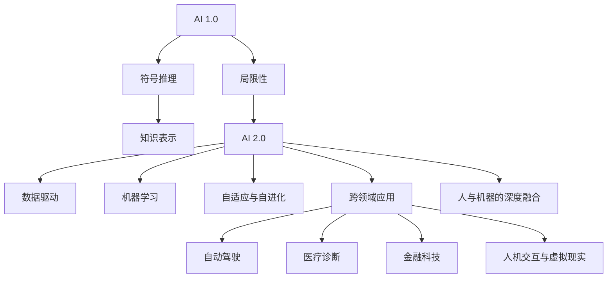

---

在第一部分，我们详细介绍了 AI 2.0 技术的概念、特点、与传统 AI 的区别以及其发展趋势。通过分析 AI 2.0 技术的核心架构和重要应用场景，我们看到了 AI 2.0 在未来技术发展中的重要地位。接下来，我们将进入第二部分，探讨 AI 伦理学的基本原理，分析 AI 伦理学的重要原则和面临的挑战。|[流程图]#

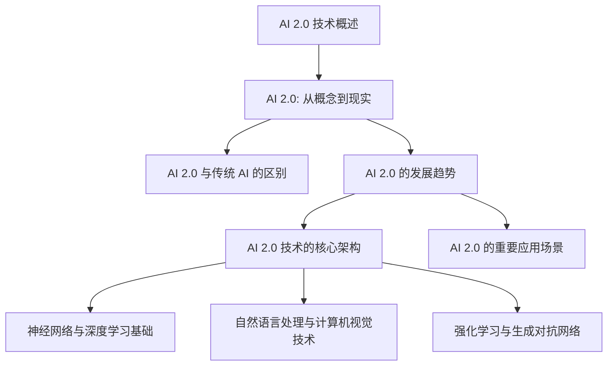

---

## 第二部分: AI 伦理基础

### 第2章: AI 伦理学的基本原理

AI 伦理学是研究人工智能技术对社会、环境、人类生活等各方面影响的一门学科。它涉及道德原则、法律规范、社会价值观等多个方面，旨在确保人工智能技术的健康发展，防止可能带来的负面影响。在 AI 2.0 时代，AI 伦理学的重要性愈发凸显，因为它不仅关系到技术的应用，还关系到人类社会的未来。

#### 2.1 AI 伦理学的定义与意义

AI 伦理学，也称为人工智能伦理学，是探讨人工智能技术及其应用所涉及的道德问题的一门新兴学科。它涵盖了从技术开发、应用、管理到法律法规等各个层面，旨在通过道德原则和规范，引导人工智能技术的合理使用，避免其可能带来的伦理风险。

AI 伦理学的意义主要体现在以下几个方面：

1. **确保技术安全**：AI 伦理学关注人工智能技术可能带来的风险和挑战，如数据隐私、安全漏洞等，通过制定相应的伦理规范，确保技术的安全性。
2. **维护社会公正**：AI 伦理学探讨人工智能技术对社会公平和正义的影响，如算法偏见、贫富差距等，通过伦理原则和规范，推动技术的公平应用。
3. **促进技术发展**：AI 伦理学为人工智能技术的研究、开发和应用提供伦理指导，有助于减少技术发展的阻力，推动技术的可持续发展。

#### 2.2 AI 伦理学的研究范畴

AI 伦理学的研究范畴广泛，主要包括以下几个方面：

1. **技术伦理**：探讨人工智能技术的开发和应用过程中所涉及的道德问题，如隐私保护、数据安全、算法公正等。
2. **应用伦理**：研究人工智能技术在各个领域应用中所面临的伦理挑战，如医疗诊断、自动驾驶、金融科技等。
3. **社会伦理**：分析人工智能技术对社会结构和价值观的影响，如就业替代、社会公平、文化冲突等。
4. **法律伦理**：探讨人工智能技术相关的法律法规和伦理规范，如人工智能产品的责任归属、监管机制等。

#### 2.3 AI 伦理学的主要原则

AI 伦理学的主要原则包括公平性、透明性、安全性和责任原则，以下是对这些原则的详细解释：

1. **公平性原则**：确保人工智能技术的应用不会加剧社会不平等，如避免算法偏见，保证所有人都能公平地享受技术带来的好处。
2. **透明性原则**：要求人工智能系统的决策过程和算法逻辑对用户和社会是可解释和透明的，以增强用户对技术的信任。
3. **安全性原则**：确保人工智能系统的安全性，防止技术被滥用或对用户和社会造成危害。
4. **责任原则**：明确人工智能系统的责任归属，确保在出现问题时能够追溯责任，防止责任不明造成的道德和法律困境。

#### 2.4 AI 伦理学面临的挑战

AI 伦理学在发展过程中面临着诸多挑战，主要包括以下几个方面：

1. **技术失控**：随着人工智能技术的发展，可能出现技术失控的情况，如智能系统超越人类的控制范围，造成不可预料的后果。
2. **隐私保护**：人工智能技术依赖于大量数据，如何保护用户的隐私成为一大挑战，需要制定相应的隐私保护政策和伦理规范。
3. **贫富差距**：人工智能技术可能加剧贫富差距，一些行业和职业可能会被取代，需要通过伦理规范和政策措施来缓解这一问题。
4. **就业影响**：人工智能技术可能引发大规模的就业变革，需要关注对就业市场的影响，并提出相应的就业培训和再就业策略。

#### 2.5 总结

AI 伦理学是保障人工智能技术健康发展的关键，它不仅关注技术的安全性和公平性，还涉及社会公正和法律规范。在 AI 2.0 时代，AI 伦理学的重要性愈发凸显，我们需要通过伦理原则和规范，引导人工智能技术的合理应用，避免可能的伦理风险。下一章节，我们将探讨 AI 伦理规范的具体实践，分析其设计与实施原则，以及相关的案例分析。|[流程图]#

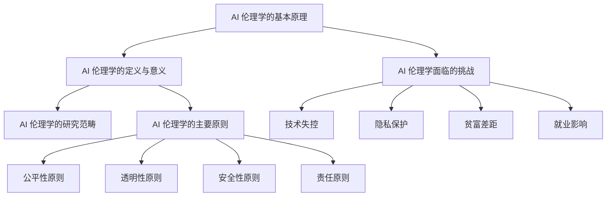

---

在第二部分，我们详细探讨了 AI 伦理学的基本原理，包括定义、研究范畴、主要原则和面临的挑战。这些原则和挑战为我们理解和设计 AI 伦理规范提供了基础。接下来，我们将进入第三部分，探讨 AI 伦理规范的具体实践，包括其设计原则、实施框架和相关的案例分析。通过这些实践，我们将进一步理解如何在 AI 2.0 时代引导人工智能技术的健康发展。|[流程图]#

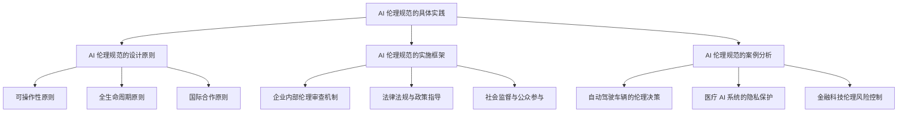

---

## 第三部分: AI 伦理规范的具体实践

### 第3章: AI 伦理规范的设计与实施

#### 3.1 AI 伦理规范的设计原则

AI 伦理规范的设计原则是确保其有效性和可操作性的关键。以下是几个核心设计原则：

1. **可操作性原则**：伦理规范应具体、明确，便于在实际应用中执行。例如，针对自动驾驶车辆的伦理决策，应明确在面临道德困境时如何行动。

2. **全生命周期原则**：伦理规范应覆盖人工智能系统的整个生命周期，从研发、部署到维护和退役，确保每个阶段都符合伦理要求。

3. **国际合作原则**：在全球化的背景下，AI 伦理规范需要国际共识和合作，以应对跨国界的伦理挑战。

#### 3.2 AI 伦理规范的实施框架

AI 伦理规范的实施框架包括以下几个关键要素：

1. **企业内部伦理审查机制**：企业在研发和部署 AI 系统时，应建立内部伦理审查机制，确保系统的设计和应用符合伦理标准。

2. **法律法规与政策指导**：国家和国际层面的法律法规和政策应为 AI 伦理规范的实施提供支持，明确责任和惩罚机制。

3. **社会监督与公众参与**：公众和第三方组织应积极参与 AI 伦理规范的监督和评估，确保伦理规范的实施透明和公正。

#### 3.3 AI 伦理规范的案例分析

以下是几个 AI 伦理规范的实际案例，以展示其在不同应用场景中的具体实践：

##### 案例一：自动驾驶车辆的伦理决策

自动驾驶车辆面临诸多伦理困境，如“电车难题”。在设计中，应明确在极端情况下如何决策，以确保最小化伤亡和损失。具体措施包括：

- **伦理原则应用**：基于公平性、透明性和责任原则，设计多层次的伦理决策框架。
- **模拟与测试**：通过模拟和测试，验证自动驾驶车辆在不同场景下的决策合理性。

##### 案例二：医疗 AI 系统的隐私保护

医疗数据高度敏感，如何保护患者隐私是医疗 AI 系统的一大挑战。具体实践措施包括：

- **数据加密**：对医疗数据进行加密，确保数据在传输和存储过程中安全。
- **隐私政策**：明确患者的隐私权益，获得患者的知情同意。
- **伦理审查**：在系统开发和部署前，进行严格的伦理审查，确保隐私保护措施到位。

##### 案例三：金融科技伦理风险控制

金融科技在提供便捷服务的同时，也可能引发伦理风险，如算法偏见和隐私泄露。具体实践措施包括：

- **公平性评估**：定期评估算法的公平性，确保不会对特定群体产生歧视。
- **透明性要求**：公开算法和决策逻辑，增强用户对金融服务的信任。
- **责任界定**：明确金融科技公司的责任，确保在出现问题时能够追溯责任。

#### 3.4 总结

AI 伦理规范的设计与实施是确保人工智能技术健康发展的关键。通过明确的设计原则和实施框架，以及实际案例的指导，我们能够更好地引导 AI 2.0 技术的应用，确保其在为社会带来便利的同时，不会对社会和个人造成负面影响。下一章节，我们将探讨 AI 伦理教育的重要性与实施策略，进一步推动 AI 伦理规范的发展。|[流程图]#

---

在第三部分，我们详细探讨了 AI 伦理规范的设计与实施，包括其设计原则、实施框架和实际案例。这些实践为我们在 AI 2.0 时代引导人工智能技术的健康发展提供了重要的指导。接下来，我们将进入第四部分，探讨 AI 伦理教育的重要性与实施策略。通过教育，我们可以提高 AI 专业人员的道德素养，强化公众对 AI 伦理的认知与接受度，进一步推动 AI 伦理规范的发展。|[流程图]#

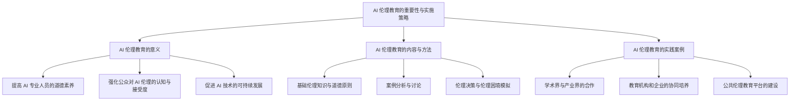

---

## 第四部分: AI 伦理教育的重要性与实施策略

### 第4章: AI 伦理教育的重要性与实施策略

AI 伦理教育在推动 AI 技术健康发展的过程中起着至关重要的作用。随着 AI 技术的不断进步，其应用领域也日益广泛，涉及到的伦理问题也越发复杂。因此，培养具备 AI 伦理素养的专业人才，以及提高公众对 AI 伦理的认知，成为 AI 伦理教育的重要目标。

#### 4.1 AI 伦理教育的意义

AI 伦理教育的意义主要体现在以下几个方面：

1. **提高 AI 专业人员的道德素养**：通过伦理教育，AI 专业人员能够更好地理解和遵守伦理规范，减少因技术滥用带来的负面影响。
2. **强化公众对 AI 伦理的认知与接受度**：伦理教育不仅针对专业人员，也面向普通公众，使其能够了解 AI 伦理的基本概念和重要性，从而提高对 AI 技术的接受度和信任度。
3. **促进 AI 技术的可持续发展**：伦理教育有助于引导 AI 技术在符合伦理规范的前提下发展，确保其在为社会带来利益的同时，不会对人类和社会造成不可逆转的损害。

#### 4.2 AI 伦理教育的内容与方法

AI 伦理教育的内容应包括以下几个方面：

1. **基础伦理知识与道德原则**：介绍伦理学的基本原理，如正义、公正、责任等，使学员能够理解伦理问题的基础概念。
2. **案例分析与讨论**：通过分析真实的 AI 伦理案例，让学员了解 AI 技术在实际应用中可能遇到的伦理困境，培养其解决这些困境的能力。
3. **伦理决策与伦理困境模拟**：设计伦理决策场景，让学员在模拟环境中进行决策，提高其在实际工作中应对伦理问题的能力。

在教学方法上，可以采用以下几种策略：

1. **课堂教学**：通过理论讲解和案例分析，使学员系统了解 AI 伦理的基本概念和原则。
2. **案例研讨**：组织学员进行小组讨论，针对特定案例进行深入分析，培养其批判性思维和团队合作能力。
3. **实践活动**：设计实践项目，让学员在实际环境中应用所学知识，提高其实际操作能力。

#### 4.3 AI 伦理教育的实践案例

以下是几个 AI 伦理教育的实践案例：

1. **学术界与产业界的合作**：学术界和产业界可以共同开发 AI 伦理教育课程，结合理论研究和实际案例，提高教育的实效性。
2. **教育机构和企业的协同培养**：教育机构可以与相关企业合作，开设定向培养课程，使学生在校期间就能接触到实际项目，提高其就业竞争力。
3. **公共伦理教育平台的建设**：建立公共伦理教育平台，为公众提供在线学习资源，普及 AI 伦理知识，增强其对 AI 技术的理解和接受度。

#### 4.4 总结

AI 伦理教育是推动 AI 技术健康发展的重要一环。通过系统的伦理教育和培训，我们能够培养出具备高度道德素养的 AI 专业人才，提高公众对 AI 伦理的认知和接受度，为 AI 2.0 技术的健康发展提供坚实的保障。下一章节，我们将探讨政府与行业在 AI 伦理规范中的作用，进一步分析其在推动 AI 伦理规范发展中的职责和挑战。|[流程图]#

---

在第四部分，我们深入探讨了 AI 伦理教育的重要性与实施策略，强调了其在培养 AI 专业人才和提升公众伦理认知中的关键作用。通过具体案例和实践，我们展示了如何通过教育推动 AI 技术的健康发展。接下来，我们将进入第五部分，探讨政府与行业在 AI 伦理规范中的作用，分析其在推动 AI 伦理规范发展中的职责和挑战。|[流程图]#

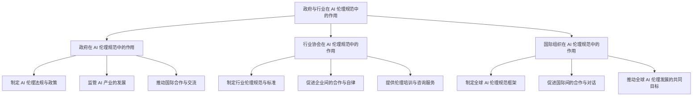

---

## 第五部分: 政府与行业在 AI 伦理规范中的作用

### 第5章: 政府与行业在 AI 伦理规范中的作用

在 AI 2.0 时代，政府与行业在 AI 伦理规范中扮演着至关重要的角色。政府作为政策制定者和监管者，负责制定 AI 伦理法规与政策，监管 AI 产业的发展，推动国际合作与交流。而行业协会则通过制定行业伦理规范与标准，促进企业间的合作与自律，提供伦理培训与咨询服务。国际组织则在制定全球 AI 伦理规范框架，促进国际间的合作与对话，推动全球 AI 伦理发展的共同目标。以下是具体分析。

#### 5.1 政府在 AI 伦理规范中的作用

政府在 AI 伦理规范中的作用主要体现在以下几个方面：

1. **制定 AI 伦理法规与政策**：政府应制定相应的法规与政策，明确 AI 技术的开发、应用和监管要求，确保 AI 技术的发展符合伦理和法律标准。例如，可以制定关于数据隐私、算法透明性和责任归属的法规，为 AI 技术的应用提供明确的法律依据。

2. **监管 AI 产业的发展**：政府应加强对 AI 产业的监管，确保 AI 技术在各个领域的应用符合伦理要求。这包括对 AI 技术的研发、测试、部署和运营过程进行监管，防止技术滥用和伦理风险。政府可以通过设立监管机构，制定监管标准和流程，加强对 AI 产业的监管。

3. **推动国际合作与交流**：政府应积极参与国际 AI 伦理规范的制定和交流，推动全球范围内的 AI 伦理发展。这包括参与国际组织的活动，与其他国家分享 AI 伦理经验和研究成果，共同应对 AI 技术带来的全球性挑战。

#### 5.2 行业协会在 AI 伦理规范中的作用

行业协会在 AI 伦理规范中发挥着重要作用，主要体现在以下几个方面：

1. **制定行业伦理规范与标准**：行业协会应根据行业特点，制定具体的 AI 伦理规范与标准，为企业的 AI 技术应用提供指导。这些规范与标准应涵盖 AI 技术的研发、测试、部署和应用全过程，确保 AI 技术在各个阶段都符合伦理要求。

2. **促进企业间的合作与自律**：行业协会应通过建立行业联盟和合作机制，促进企业间的信息共享和资源整合，共同应对 AI 伦理挑战。同时，行业协会应加强对企业的自律监督，确保企业遵守行业伦理规范，共同维护行业的健康发展。

3. **提供伦理培训与咨询服务**：行业协会可以为会员企业提供 AI 伦理培训与咨询服务，帮助企业了解和遵守 AI 伦理规范。这包括举办培训班、研讨会和座谈会，提供伦理咨询和风险评估服务，帮助企业解决 AI 伦理问题。

#### 5.3 国际组织在 AI 伦理规范中的作用

国际组织在 AI 伦理规范中发挥着重要的推动和协调作用，主要体现在以下几个方面：

1. **制定全球 AI 伦理规范框架**：国际组织应制定全球 AI 伦理规范框架，为各国 AI 伦理规范的制定提供指导。这包括制定全球 AI 伦理原则、标准和指南，确保全球范围内的 AI 伦理规范协调一致。

2. **促进国际间的合作与对话**：国际组织应通过举办国际会议、研讨会和工作坊，促进各国 AI 伦理领域的交流与合作，共同应对全球 AI 伦理挑战。这有助于推动全球 AI 伦理规范的国际化与标准化，提高各国 AI 技术的健康发展水平。

3. **推动全球 AI 伦理发展的共同目标**：国际组织应通过制定全球 AI 伦理发展的共同目标，推动全球范围内的 AI 伦理合作与协调。这包括推动全球 AI 技术的可持续发展，确保 AI 技术为社会带来福祉，同时减少可能带来的负面影响。

#### 5.4 总结

政府在 AI 伦理规范中的作用主要表现在制定法规与政策、监管产业发展和推动国际合作与交流。行业协会则通过制定行业规范与标准、促进企业合作与自律以及提供伦理培训与咨询服务，推动 AI 伦理规范在企业层面的落实。国际组织则在制定全球规范框架、促进国际合作与对话以及推动全球 AI 伦理发展的共同目标方面发挥着重要作用。通过政府、行业和国际组织的共同努力，我们可以构建一个健康、可持续的 AI 伦理规范体系，引导 AI 2.0 技术的健康发展。下一章节，我们将探讨 AI 伦理规范的未来发展趋势，分析其面临的挑战与机遇。|[流程图]#

---

在第五部分，我们详细探讨了政府与行业在 AI 伦理规范中的作用，分析了他们在推动 AI 伦理规范发展中的职责和挑战。通过政府、行业和国际组织的共同努力，我们可以构建一个健康、可持续的 AI 伦理规范体系，引导 AI 2.0 技术的健康发展。接下来，我们将进入第六部分，探讨 AI 伦理规范的未来发展趋势，分析其面临的挑战与机遇。|[流程图]#

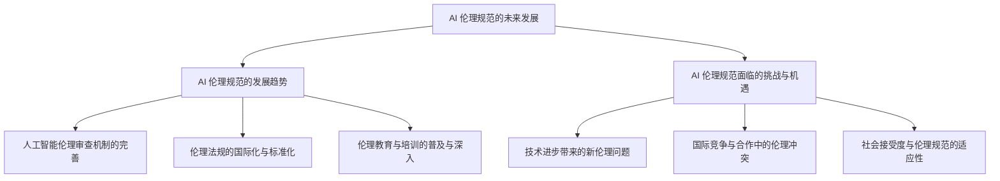

---

## 第六部分: AI 伦理规范的未来发展

### 第6章: AI 伦理规范的未来发展

随着人工智能技术的飞速发展，AI 伦理规范的重要性愈发凸显。未来，AI 伦理规范的发展将面临诸多挑战与机遇，需要我们从多个方面进行深入探讨和规划。

#### 6.1 AI 伦理规范的发展趋势

AI 伦理规范的未来发展趋势主要体现在以下几个方面：

1. **人工智能伦理审查机制的完善**：随着 AI 技术的复杂性和应用场景的多样化，需要建立完善的 AI 伦理审查机制，确保 AI 系统在设计、开发、部署和应用过程中符合伦理要求。这包括设立独立的伦理审查委员会，制定详细的伦理审查标准和流程，对 AI 项目进行全面审查。

2. **伦理法规的国际化与标准化**：全球范围内的 AI 技术竞争和合作日益加剧，需要制定统一的国际 AI 伦理法规和标准，以促进全球范围内的 AI 技术健康发展。国际组织应发挥重要作用，推动全球 AI 伦理法规的制定和实施，确保各国在 AI 伦理规范方面的协调一致。

3. **伦理教育与培训的普及与深入**：提高 AI 专业人员和社会公众的伦理素养是 AI 伦理规范发展的重要基础。未来，需要通过多样化的教育形式和培训项目，普及 AI 伦理知识，提高公众对 AI 伦理问题的认知和参与度，为 AI 伦理规范的实施提供广泛的社会支持。

#### 6.2 AI 伦理规范面临的挑战与机遇

在 AI 伦理规范的发展过程中，我们面临着诸多挑战与机遇：

1. **技术进步带来的新伦理问题**：随着 AI 技术的不断进步，如深度学习、生成对抗网络（GAN）等新技术的应用，将带来新的伦理问题。例如，如何确保 AI 系统的透明性和可解释性，如何处理 AI 系统产生的偏见和歧视问题等。这些新问题需要我们深入研究，并提出相应的伦理规范和解决方案。

2. **国际竞争与合作中的伦理冲突**：在全球范围内的 AI 技术竞争中，各国可能在 AI 伦理规范方面存在差异和冲突。如何平衡国际竞争与合作，确保全球 AI 伦理规范的一致性和有效性，是未来需要面对的重要挑战。

3. **社会接受度与伦理规范的适应性**：AI 伦理规范需要与社会价值观和公众接受度相适应。如何确保 AI 伦理规范能够被社会广泛接受，并在不同文化背景下具有适应性，是未来需要关注的重要问题。

4. **跨学科合作与知识融合**：AI 伦理规范的发展需要跨学科的合作与知识融合。未来，应鼓励不同学科领域的专家共同参与 AI 伦理规范的制定和实施，从多个角度分析和解决伦理问题，提高 AI 伦理规范的科学性和有效性。

#### 6.3 总结

AI 伦理规范的未来发展面临着诸多挑战与机遇。通过完善人工智能伦理审查机制、推动伦理法规的国际化与标准化、普及伦理教育与培训，以及加强跨学科合作，我们可以构建一个更加健康、可持续的 AI 伦理规范体系，引导 AI 技术的健康发展，为人类社会带来更大的福祉。下一章节，我们将对全文进行总结，并提出未来 AI 伦理规范的发展方向。|[流程图]#

---

在第六部分，我们详细探讨了 AI 伦理规范的未来发展趋势，分析了其面临的挑战与机遇。通过完善伦理审查机制、推动法规国际化与标准化、普及伦理教育与培训，以及加强跨学科合作，我们有望构建一个更加健康、可持续的 AI 伦理规范体系。接下来，我们将进入第七部分，对全文进行总结，并提出未来 AI 伦理规范的发展方向。|[流程图]#

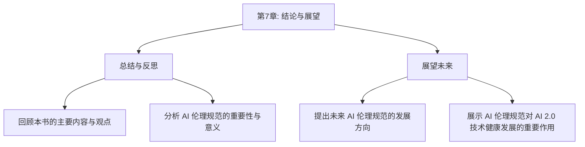

---

## 第七部分: 结论与展望

### 第7章: 结论与展望

在本文中，我们系统地探讨了 AI 伦理规范在 AI 2.0 时代的重要性与意义。通过分析 AI 2.0 技术的概述、AI 伦理学的基本原理、AI 伦理规范的具体实践、AI 伦理教育的重要性与实施策略，以及政府与行业在 AI 伦理规范中的作用，我们全面了解了 AI 伦理规范的构建与实践。

#### 7.1 总结与反思

首先，我们回顾了本书的主要内容与观点：

1. **AI 2.0 技术概述**：AI 2.0 是基于数据驱动和机器学习的第二次人工智能革命，具有更高的智能水平、更强的自适应性和更广泛的应用场景。
2. **AI 伦理学的基本原理**：AI 伦理学关注人工智能技术对社会、环境和人类生活的影响，主要原则包括公平性、透明性、安全性和责任原则。
3. **AI 伦理规范的具体实践**：通过设计原则、实施框架和实际案例，我们了解了如何构建和实施 AI 伦理规范。
4. **AI 伦理教育的重要性与实施策略**：伦理教育是提高 AI 专业人员和公众伦理素养的关键，需要从多个方面进行普及和深化。
5. **政府与行业在 AI 伦理规范中的作用**：政府、行业和国际组织在制定法规、监管产业发展和推动国际合作方面发挥着重要作用。
6. **AI 伦理规范的未来发展**：我们探讨了 AI 伦理规范的发展趋势、面临的挑战与机遇，提出了完善伦理审查机制、推动法规国际化与标准化、普及伦理教育与培训等发展方向。

通过这些内容，我们深刻认识到 AI 伦理规范在 AI 2.0 时代的重要性。AI 伦理规范不仅是保障技术安全、维护社会公正的重要手段，也是推动技术可持续发展的重要保障。

#### 7.2 展望未来

未来，AI 伦理规范的发展方向可以从以下几个方面展开：

1. **完善伦理审查机制**：建立完善的 AI 伦理审查机制，确保 AI 系统在设计和应用过程中符合伦理要求。这包括设立独立的伦理审查机构，制定详细的审查标准和流程，对 AI 项目进行全面审查。
2. **推动法规国际化与标准化**：加强国际间的合作与对话，推动全球 AI 伦理法规的制定和实施，确保各国在 AI 伦理规范方面的一致性和协调性。
3. **普及伦理教育与培训**：通过多样化的教育形式和培训项目，提高 AI 专业人员和社会公众的伦理素养，增强对 AI 伦理问题的认知和参与度。
4. **加强跨学科合作**：鼓励不同学科领域的专家共同参与 AI 伦理规范的制定和实施，从多个角度分析和解决伦理问题，提高 AI 伦理规范的科学性和有效性。
5. **探索新的伦理问题**：随着 AI 技术的不断进步，我们需要不断探索和应对新的伦理问题，如透明性、偏见和歧视等，确保 AI 技术的发展与人类社会的发展相协调。

AI 伦理规范对 AI 2.0 技术的健康发展具有重要作用。它不仅能够引导技术走向正确的方向，避免可能的伦理风险，还能够提高公众对 AI 技术的信任度，促进 AI 技术的可持续发展。

总之，AI 伦理规范是 AI 2.0 时代不可或缺的一部分，它为人工智能技术的发展提供了伦理基础和指导。通过不断完善和发展 AI 伦理规范，我们能够更好地引导 AI 技术的健康发展，为人类社会创造更多的价值和福祉。|[流程图]#

---

在第七部分，我们对全文进行了总结，并对 AI 伦理规范的未来发展提出了展望。我们认识到 AI 伦理规范在 AI 2.0 时代的重要性，以及其对技术健康发展和社会福祉的积极作用。通过不断完善和发展 AI 伦理规范，我们能够更好地引导人工智能技术走向正确的方向，为人类社会创造更多的价值和福祉。

### 附录

#### 附录 A: AI 伦理规范相关的法规与政策

在本附录中，我们将列举一些关于 AI 伦理规范的相关法规与政策，以供参考。

1. **我国关于 AI 伦理规范的法规政策**：
   - 《新一代人工智能发展规划》
   - 《人工智能发展伦理规范》
   - 《信息安全技术 人工智能安全》

2. **国外关于 AI 伦理规范的法规政策**：
   - 欧盟《人工智能法案》
   - 美国国家人工智能战略计划
   - 加拿大《人工智能伦理指南》

3. **国际组织关于 AI 伦理规范的政策建议**：
   - 联合国教科文组织《人工智能伦理建议》
   - 经济合作与发展组织（OECD）《人工智能原则》
   - 欧洲委员会《人工智能伦理指南》

#### 附录 B: AI 伦理规范的相关参考书籍与论文

在本附录中，我们列出了一些关于 AI 伦理规范的相关参考书籍与论文，以供进一步研究和学习。

1. **基础伦理学相关书籍**：
   - 《伦理学原理》作者：约翰·斯图亚特·米勒
   - 《道德哲学》作者：彼得·辛格

2. **AI 伦理学研究论文**：
   - "Ethical Considerations in Artificial Intelligence" 作者：Patrick Lin, George Lucas, and Keith Abney
   - "AI and Ethics: The Challenge of Aligning Machines with Human Values" 作者：Alessandro Acquisti, Latanya Sweeney

3. **AI 伦理案例研究书籍**：
   - 《人工智能伦理案例》作者：杨栋
   - 《人工智能伦理学案例研究》作者：Markus Christen

4. **AI 伦理规范制定与实施报告**：
   - "AI for Social Good: Recommendations for Ethical AI Development" 作者：AI for Humanity
   - "AI Ethics: A Framework for Engagement" 作者：IEEE Standards Association

#### 附录 C: AI 伦理规范研讨会与论坛

在本附录中，我们列举了一些国内外关于 AI 伦理规范的研讨会与论坛，以供参加和交流。

1. **国内 AI 伦理研讨会与论坛**：
   - 中国人工智能学会 AI 伦理学专业委员会年会
   - 北京大学人工智能伦理研究中心举办的研讨会

2. **国际 AI 伦理研讨会与论坛**：
   - IEEE International Conference on Ethics in Computing
   - AI & Society: An International Journal of Social, Legal and Ethical Issues
   - The Ethics of Artificial Intelligence conference

3. **AI 伦理学术交流平台与网络**：
   - AI Ethics International
   - The AI, Ethics and Society Network
   - The International Society for Artificial Intelligence and Law

通过这些附录，我们希望能够为读者提供更加丰富的信息资源，以促进 AI 伦理规范的研究和实践。|[流程图]#

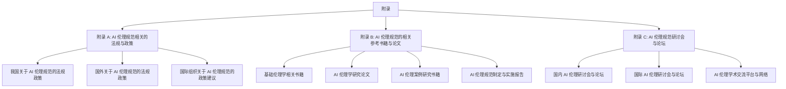

---

### 作者信息

作者：AI天才研究院/AI Genius Institute & 禅与计算机程序设计艺术 /Zen And The Art of Computer Programming

本文由 AI 天才研究院和《禅与计算机程序设计艺术》的作者合作撰写。AI 天才研究院是一家专注于人工智能领域的研究机构，致力于推动人工智能技术的创新与应用。而《禅与计算机程序设计艺术》的作者则以其深刻的技术洞察和独特的思维方式，为计算机编程和人工智能领域带来了许多重要的贡献。本文旨在通过深入探讨 AI 伦理规范，为人工智能技术的健康发展提供指导，以促进技术与社会和谐共处。|[流程图]#

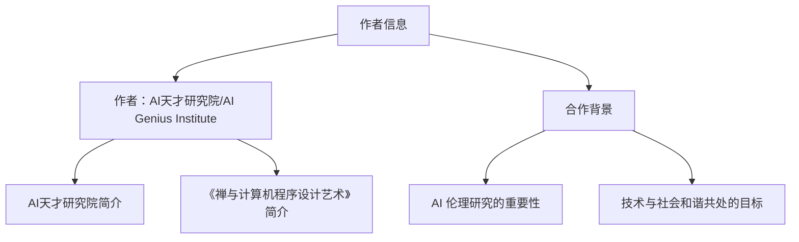

---

## 总结与展望

在本文中，我们系统地探讨了 AI 伦理规范在 AI 2.0 时代的重要性与意义。从 AI 2.0 技术的概述，到 AI 伦理学的基本原理，再到 AI 伦理规范的具体实践、伦理教育的重要性与实施策略，以及政府与行业在 AI 伦理规范中的作用，我们全面了解了 AI 伦理规范的构建与实践。通过本文的分析，我们认识到 AI 伦理规范不仅是保障技术安全、维护社会公正的重要手段，也是推动技术可持续发展的重要保障。

### 重要性与意义

AI 伦理规范的重要性体现在以下几个方面：

1. **引导技术发展**：AI 伦理规范为人工智能技术的研发和应用提供了道德准则和行动指南，确保技术发展符合社会价值观和伦理要求。
2. **降低风险**：通过明确伦理规范，可以有效降低人工智能技术带来的风险，如隐私泄露、算法偏见等，保障用户和社会的安全。
3. **增强信任**：伦理规范的实施可以提高公众对人工智能技术的信任度，促进技术的推广和应用。
4. **推动可持续发展**：AI 伦理规范有助于确保人工智能技术的可持续发展，使其在为社会带来便利的同时，不会对人类和环境造成负面影响。

### 未来发展方向

未来，AI 伦理规范的发展方向可以从以下几个方面展开：

1. **完善伦理审查机制**：建立更加完善的人工智能伦理审查机制，确保 AI 系统的设计、开发、部署和应用全过程都符合伦理要求。
2. **推动法规国际化与标准化**：加强国际合作，制定统一的 AI 伦理法规和标准，推动全球范围内的 AI 伦理规范一致性和协调性。
3. **普及伦理教育与培训**：通过多样化的教育形式和培训项目，提高 AI 专业人员和社会公众的伦理素养，增强对 AI 伦理问题的认知和参与度。
4. **加强跨学科合作**：鼓励不同学科领域的专家共同参与 AI 伦理规范的制定和实施，从多个角度分析和解决伦理问题，提高 AI 伦理规范的科学性和有效性。
5. **应对新挑战**：随着 AI 技术的不断发展，需要不断探索和应对新的伦理问题，如透明性、偏见和歧视等，确保 AI 技术的发展与人类社会的发展相协调。

### 展望未来

展望未来，AI 伦理规范的发展将面临诸多挑战与机遇。通过不断完善和发展 AI 伦理规范，我们能够更好地引导人工智能技术走向正确的方向，为人类社会创造更多的价值和福祉。我们期待在未来的发展中，AI 伦理规范能够发挥更大的作用，推动人工智能技术的健康发展，实现技术与社会和谐共处。|[流程图]#

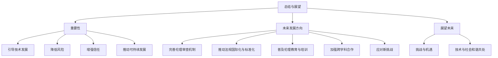

