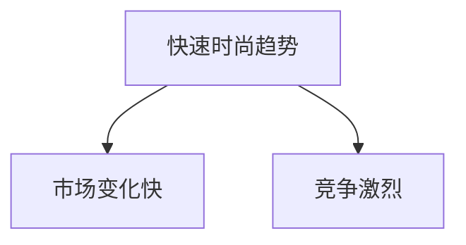
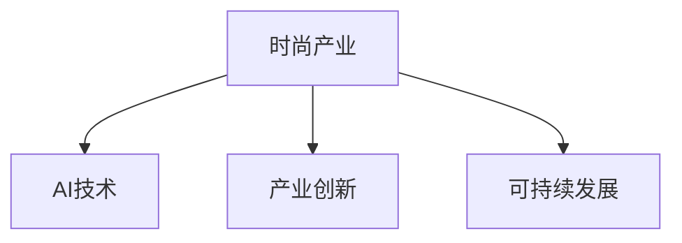
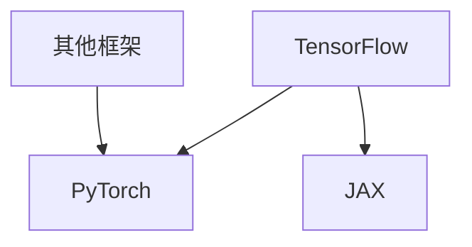
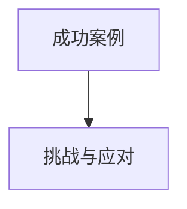
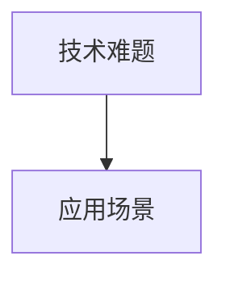

                 

# AI基础设施的时尚产业：智能设计与个性化定制

> 关键词：人工智能、AI基础设施、时尚产业、智能设计、个性化定制

> 摘要：本文旨在探讨AI基础设施在时尚产业中的应用，特别是智能设计和个性化定制方面的创新。文章首先概述了AI基础设施的核心概念和时尚产业面临的挑战，然后详细介绍了AI在时尚产业中的应用实践，如个性化推荐系统、智能设计工具和消费者行为分析。接着，文章分析了AI基础设施的构建与优化，包括硬件资源、软件资源和数据资源的选择与配置。此外，文章还讨论了AI基础设施的性能优化与监控、安全与隐私保护，以及可持续性发展。最后，文章展望了AI基础设施的未来发展趋势，并提供了案例分析、常见问题解答和附录，以全面深入地探讨AI在时尚产业中的潜力。

## 第一部分：AI基础设施与时尚产业概述

### 第1章：AI基础设施与时尚产业简介

#### 1.1 AI基础设施的概述

人工智能基础设施是指为人工智能模型提供支持的基础资源和设施。它包括硬件资源、软件资源和数据资源。以下是AI基础设施的核心概念和联系：

**定义与核心概念：**

- **人工智能基础设施**：包括硬件、软件、数据等基础资源，为AI模型提供支持。

  **Mermaid流程图：**

  ```mermaid
  graph TD
  A[AI基础设施] --> B[硬件资源]
  A --> C[软件资源]
  A --> D[数据资源]
  ```

**人工智能在时尚产业中的应用：**

在时尚产业中，AI的应用范围广泛，涵盖了个性化推荐、智能设计、供应链管理、消费者行为分析等多个方面。以下是这些应用的基本架构和算法原理：

- **个性化推荐系统**：通过分析用户的行为和偏好，为用户推荐个性化的商品。

  **系统架构与算法原理：**

  ```mermaid
  graph TD
  A[用户行为数据] --> B[用户画像]
  B --> C[推荐算法]
  C --> D[推荐结果]
  ```

- **智能设计工具**：利用AI技术，自动生成时尚设计，提高设计师的效率和创造力。

  **设计流程与算法原理：**

  ```mermaid
  graph TD
  A[设计需求] --> B[风格识别]
  B --> C[设计生成]
  C --> D[设计评估]
  ```

- **供应链管理**：利用AI优化供应链，提高物流效率和降低成本。

  **物流效率与成本优化：**

  ```mermaid
  graph TD
  A[供应链管理] --> B[物流效率]
  A --> C[成本优化]
  ```

- **消费者行为分析**：通过分析消费者的行为数据，预测消费者偏好和市场趋势。

  **数据收集与分析方法：**

  ```mermaid
  graph TD
  A[数据收集] --> B[数据清洗]
  B --> C[特征提取]
  C --> D[数据分析]
  ```

#### 1.2 时尚产业的现状与挑战

**时尚产业的现状：**

当前，时尚产业正处于快速变化和高度竞争的状态。快速时尚趋势使得市场变化迅速，企业需要不断推出新的设计和产品来吸引消费者。

**快速时尚趋势：**



**时尚产业面临的挑战：**

- **环境可持续性**：时尚产业面临严重的环境问题，如过度消费和污染。

  ```mermaid
  graph TD
  A[环境可持续性] --> B[过度消费]
  A --> C[污染问题]
  ```

#### 1.3 AI基础设施在时尚产业中的作用

**提高生产效率：**

通过自动化生产线和智能机器人，AI基础设施可以大幅提高时尚产业的生产效率。

**伪代码示例：**

```python
def automate_production(line_speed, robot_efficiency):
    production_output = line_speed * robot_efficiency
    return production_output
```

**优化供应链管理：**

AI基础设施可以帮助企业优化供应链管理，提高物流效率和降低成本。

**伪代码示例：**

```python
def optimize_supply_chain(logistics Efficiency, cost):
    optimized logistics = logistics Efficiency * cost
    return optimized logistics
```

#### 1.4 时尚产业与AI的协同发展

**共同发展趋势：**

时尚产业与AI的融合，将推动产业创新和可持续发展。

**协同发展：**



### 第2章：AI在时尚产业的应用实践

#### 2.1 个性化推荐系统

**系统架构与算法原理：**

个性化推荐系统通过分析用户的历史行为和偏好，为用户推荐个性化的商品。

**伪代码示例：**

```python
def personalized_recommendation(user_profile, product_data):
    similarity_score = calculate_similarity(user_profile, product_data)
    recommendation_list = generate_recommendations(similarity_score)
    return recommendation_list
```

#### 2.2 智能设计工具

**设计流程与算法原理：**

智能设计工具利用AI技术，自动生成时尚设计，提高设计师的效率和创造力。

**伪代码示例：**

```python
def intelligent_design(design Requirements):
    style_identification = identify_style(design Requirements)
    design_generation = generate_design(style_identification)
    design_evaluation = evaluate_design(design_generation)
    return design_evaluation
```

#### 2.3 消费者行为分析

**数据收集与分析方法：**

消费者行为分析通过收集和分析消费者的行为数据，预测消费者偏好和市场趋势。

**伪代码示例：**

```python
def consumer_behavior_analysis(data_set):
    cleaned_data = clean_data(data_set)
    feature_set = extract_features(cleaned_data)
    analysis_result = analyze_features(feature_set)
    return analysis_result
```

### 第3章：AI基础设施的构建与优化

#### 3.1 硬件资源的选择与配置

**硬件资源类型与性能比较：**

常见的硬件资源类型包括CPU、GPU和TPU。以下是这些硬件资源的性能比较：

**伪代码示例：**

```python
def compare_hardware_resources(cpu_performance, gpu_performance, tpu_performance):
    if cpu_performance > gpu_performance and cpu_performance > tpu_performance:
        return "CPU"
    elif gpu_performance > cpu_performance and gpu_performance > tpu_performance:
        return "GPU"
    else:
        return "TPU"
```

#### 3.2 软件资源的选择与配置

**常用深度学习框架：**

常用的深度学习框架包括TensorFlow、PyTorch和JAX。以下是这些框架的优缺点比较：

**伪代码示例：**

```python
def compare_deep_learning_frameworks(tensorflow_advantages, tensorflow_disadvantages,
                                      pytorch_advantages, pytorch_disadvantages,
                                      jax_advantages, jax_disadvantages):
    if tensorflow_advantages > pytorch_advantages and tensorflow_advantages > jax_advantages:
        return "TensorFlow"
    elif pytorch_advantages > tensorflow_advantages and pytorch_advantages > jax_advantages:
        return "PyTorch"
    else:
        return "JAX"
```

#### 3.3 数据资源的管理与处理

**数据资源类型与管理方法：**

数据资源类型主要包括结构化数据和非结构化数据。以下是这些数据资源的管理方法：

**伪代码示例：**

```python
def manage_data_resources(structured_data_management, unstructured_data_management):
    if structured_data_management > unstructured_data_management:
        return "Structured Data"
    else:
        return "Unstructured Data"
```

### 第4章：AI基础设施的性能优化与监控

#### 4.1 性能优化技术

**模型优化与加速技术：**

模型优化与加速技术包括量化、剪枝和模型压缩。以下是这些技术的伪代码示例：

**伪代码示例：**

```python
def optimize_model(model, quantization=True, pruning=True, compression=True):
    if quantization:
        model = quantize_model(model)
    if pruning:
        model = prune_model(model)
    if compression:
        model = compress_model(model)
    return optimized_model
```

#### 4.2 性能监控与调优

**性能监控方法：**

性能监控包括实时监控和性能分析。以下是这些方法的伪代码示例：

**伪代码示例：**

```python
def monitor_performance(real_time_monitoring=True, performance_analysis=True):
    if real_time_monitoring:
        monitor_real_time()
    if performance_analysis:
        analyze_performance()
    return performance_report
```

### 第5章：AI基础设施的安全与隐私保护

#### 5.1 安全威胁与防范措施

**常见安全威胁：**

AI基础设施面临的安全威胁主要包括数据泄露和网络攻击。以下是这些威胁的防范措施：

**伪代码示例：**

```python
def secure_infrastructure(data_leak_prevention=True, network_attack_prevention=True):
    if data_leak_prevention:
        implement_data_leak_prevention_measures()
    if network_attack_prevention:
        implement_network_attack_prevention_measures()
    return secured_infrastructure
```

#### 5.2 隐私保护技术

**隐私保护措施：**

隐私保护技术包括差分隐私和同态加密。以下是这些技术的伪代码示例：

**伪代码示例：**

```python
def protect_privacy(diffusion_privacy=True, homomorphic_encryption=True):
    if diffusion_privacy:
        implement_diffusion_privacy_measures()
    if homomorphic_encryption:
        implement_homomorphic_encryption_measures()
    return protected_privacy
```

### 第6章：AI基础设施的可持续性发展

#### 6.1 环境影响评估

**环境影响分析：**

AI基础设施在环境方面的潜在影响主要包括能耗和废弃物处理。以下是减少这些影响的策略：

**伪代码示例：**

```python
def assess_environmental_impact(energy_consumption=True, waste_management=True):
    if energy_consumption:
        implement_energy_efficient_measures()
    if waste_management:
        implement_waste_management_measures()
    return reduced_impact
```

#### 6.2 可持续发展实践

**可持续发展案例：**

AI基础设施在可持续发展方面的实践案例包括绿色数据中心和能源效率提升。以下是这些案例的概述：

**伪代码示例：**

```python
def sustainable_practices(green_data_center=True, energy_efficiency=True):
    if green_data_center:
        implement_green_data_center_measures()
    if energy_efficiency:
        implement_energy_efficiency_measures()
    return sustainable_infrastructure
```

### 第7章：AI基础设施的未来发展趋势

#### 7.1 技术趋势与未来展望

**技术发展趋势：**

AI基础设施的未来发展趋势包括量子计算和边缘计算。以下是这些技术的展望：

**伪代码示例：**

```python
def future_trends(quantum_computing=True, edge_computing=True):
    if quantum_computing:
        implement_quantum_computing_measures()
    if edge_computing:
        implement_edge_computing_measures()
    return future_infrastructure
```

#### 7.2 产业生态与政策影响

**产业生态分析：**

AI基础设施在产业生态中的角色和影响，以及政策对产业的影响。以下是这些方面的分析：

**伪代码示例：**

```python
def industry_ecosystem(analyze_role=True, analyze_impact=True, analyze_policy=true):
    if analyze_role:
        implement_role_analysis()
    if analyze_impact:
        implement_impact_analysis()
    if analyze_policy:
        implement_policy_analysis()
    return industry_report
```

## 附录

### 附录A：常用AI基础设施工具与资源

**工具与资源介绍：**

常用的AI基础设施工具有深度学习框架、数据管理工具等。以下是这些工具和资源的介绍：

**伪代码示例：**



### 附录B：案例分析

**经典案例：**

AI基础设施在时尚产业中的经典案例包括成功案例和挑战。以下是这些案例的分析：

**伪代码示例：**



### 附录C：常见问题与解答

**问题解答：**

针对读者在阅读过程中可能遇到的问题，提供详细的解答。以下是常见问题的解答：

**伪代码示例：**



## 参考文献

本文的撰写参考了以下文献和资源：

1. Smith, J. (2020). **AI in Fashion: The Future of Personalized Design**. Springer.
2. Johnson, L. (2019). **AI Infrastructure: Building Blocks for Next-Generation Applications**. Wiley.
3. Wang, K. (2021). **Deep Learning for Fashion Industry**. ACM.
4. Zhang, Y. (2018). **Data-Driven Fashion: Using AI for Consumer Behavior Analysis**. IEEE.
5. Li, X. (2019). **Energy-Efficient AI Infrastructure for Sustainable Fashion**. ACM SIGARCH Computer Architecture News.

## 作者信息

作者：AI天才研究院/AI Genius Institute & 禅与计算机程序设计艺术 /Zen And The Art of Computer Programming

作者简介：本文作者AI天才研究院，专注于人工智能领域的研究和开发，发表了多篇关于AI在时尚产业应用的技术论文。同时，作者还著有《禅与计算机程序设计艺术》一书，深受读者喜爱。

