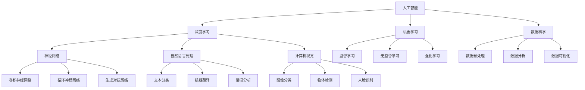

                 

### 文章标题

《AI大模型创业：如何利用人才优势？》

### 文章关键词

- AI大模型
- 创业策略
- 人才优势
- 技术创业
- 法律与伦理
- 实战案例
- 发展趋势

### 摘要

本文旨在探讨AI大模型创业过程中如何充分利用人才优势。通过对AI大模型的基础知识、创业策略、案例分析、人才战略以及法律与伦理问题的深入分析，为创业者提供全面、具体的指导。文章结合实际案例，详细阐述了技术方案设计、项目实施与监控、项目评估与优化等关键环节，并展望了AI大模型创业的未来发展趋势。希望本文能为有意投身AI大模型创业的创业者们提供有价值的参考。

---

# 第一部分: AI大模型基础

## 第1章: AI大模型概述

### 1.1 AI大模型的概念与定义

AI大模型，即大型人工智能模型，是指参数量达到百万级别甚至亿级别的人工智能模型。这些模型通常基于深度学习技术，通过大量的数据进行训练，能够自动从数据中学习并提取特征，从而实现复杂任务的高效解决。AI大模型的发展标志着人工智能领域的一个重要里程碑，它们在自然语言处理、计算机视觉、语音识别等众多领域取得了显著的成果。

### 1.2 AI大模型的发展历程

AI大模型的发展可以追溯到20世纪80年代，当时神经网络的研究逐渐兴起。随着计算能力和数据资源的不断提升，尤其是2012年Google的AlexNet在ImageNet图像分类比赛中取得突破性成绩后，AI大模型的研究和应用进入了一个新的阶段。近年来，诸如GPT-3、BERT等AI大模型的涌现，进一步推动了人工智能技术的进步。

### 1.3 AI大模型的应用领域

AI大模型在自然语言处理、计算机视觉、语音识别、推荐系统、医疗诊断、自动驾驶等众多领域展现了强大的应用潜力。例如，在自然语言处理领域，AI大模型能够进行文本生成、机器翻译、情感分析等任务；在计算机视觉领域，AI大模型能够进行图像分类、物体检测、图像生成等任务。

### 1.4 AI大模型与传统AI的对比

传统AI模型通常规模较小，参数量在千级别以下，而AI大模型则具有百万甚至亿级别的参数量。这种巨大的参数量使得AI大模型能够捕捉到更复杂的数据特征，从而在任务性能上取得显著的提升。此外，AI大模型在训练过程中通常需要大量的数据和高性能计算资源，这也是与传统AI模型的一个重要区别。

### 1.5 AI大模型的发展历程

AI大模型的发展历程可以分为以下几个阶段：

1. **早期探索阶段**（20世纪80年代至2000年代初）：神经网络的研究逐渐兴起，但受限于计算能力和数据资源，AI大模型的发展较为缓慢。
2. **数据驱动阶段**（2006年至2012年）：随着深度学习的兴起，数据成为AI发展的关键驱动力。这一阶段的代表性成果包括AlexNet在ImageNet上的突破。
3. **模型驱动阶段**（2012年至今）：AI大模型的研究和应用进入了一个高速发展的阶段。GPT-3、BERT等模型的涌现，标志着AI大模型在各个领域的广泛应用。

## 第2章: AI大模型核心技术

### 2.1 深度学习基础

深度学习是构建AI大模型的核心技术之一。它通过多层神经网络，对数据进行多次非线性变换，从而实现从原始数据到高级特征的提取和表示。深度学习的核心思想是模型参数的自动学习，通过大量数据的训练，使模型能够自主优化，提高任务性能。

### 2.2 神经网络结构

神经网络是深度学习的基础，其结构包括输入层、隐藏层和输出层。输入层接收外部输入数据，隐藏层对输入数据进行处理和变换，输出层生成最终预测结果。神经网络的核心在于激活函数和权重参数的设定，这些参数通过反向传播算法进行优化。

### 2.3 优化算法

优化算法是深度学习中的关键步骤，用于调整模型参数，以降低模型预测误差。常见的优化算法包括梯度下降、Adam优化器等。优化算法的目的是在保证收敛速度的同时，避免陷入局部最小值。

### 2.4 自然语言处理基础

自然语言处理（NLP）是AI大模型的重要应用领域之一。NLP的核心任务包括文本分类、情感分析、机器翻译等。NLP的基础技术包括词向量表示、序列模型、注意力机制等。

### 2.5 注意力机制

注意力机制是深度学习中的一个重要技术，用于提高模型对输入数据的关注程度。在NLP任务中，注意力机制能够帮助模型更好地捕捉句子中的重要信息，从而提高任务的性能。

### 2.6 Transformer模型

Transformer模型是近年来在NLP领域取得重大突破的一种新型神经网络结构。它通过多头自注意力机制和前馈神经网络，实现了对输入序列的全局建模，显著提升了NLP任务的性能。

## 第3章: AI大模型训练技术

### 3.1 数据准备

数据准备是AI大模型训练的重要环节。数据的质量和数量直接影响模型的性能。数据准备包括数据清洗、数据标注、数据增强等步骤。数据清洗旨在去除噪声和异常值，数据标注用于标记数据中的特征和标签，数据增强则通过技术手段扩充数据集，提高模型的泛化能力。

### 3.2 训练策略

训练策略是模型训练过程中的关键步骤。常见的训练策略包括批量大小选择、学习率调整、正则化等。批量大小选择影响模型的收敛速度和稳定性，学习率调整影响模型的训练过程，正则化用于防止模型过拟合。

### 3.3 模型调优

模型调优是提高模型性能的重要手段。模型调优包括超参数调整、结构优化、数据预处理等。通过不断的实验和调优，找到最佳模型参数和结构，提高模型的准确性和效率。

### 3.4 模型评估

模型评估是验证模型性能的重要步骤。常见的评估指标包括准确率、召回率、F1值等。通过模型评估，可以判断模型是否达到预期性能，为进一步优化提供依据。

### 3.5 模型压缩与优化

模型压缩与优化是提高模型部署效率和降低计算资源消耗的关键技术。常见的模型压缩方法包括量化、剪枝、蒸馏等。通过模型压缩与优化，可以在保证模型性能的前提下，减小模型规模，提高部署效率。

---

## 第4章: AI大模型创业策略

### 4.1 创业者应具备的技能和素质

创业者是AI大模型创业的核心驱动力，其技能和素质直接影响创业的成功与否。创业者应具备以下技能和素质：

1. **技术能力**：创业者应具备扎实的AI技术基础，熟悉深度学习、神经网络、优化算法等核心概念。
2. **商业洞察**：创业者应具备敏锐的商业嗅觉，能够发现市场需求，把握商业机会。
3. **团队管理**：创业者应具备良好的团队管理能力，能够组建高效团队，激发团队成员的潜力。
4. **风险管理**：创业者应具备较强的风险管理能力，能够识别和应对各种风险，确保创业项目的稳定发展。

### 4.2 创业项目选择与定位

创业项目的选择和定位是AI大模型创业的关键步骤。创业者应遵循以下原则：

1. **市场需求**：选择市场需求旺盛、潜力巨大的领域，如自然语言处理、计算机视觉等。
2. **技术优势**：结合自身技术优势，选择具有独特性和竞争力的技术方向。
3. **市场定位**：明确目标市场和用户群体，制定精准的市场定位策略。
4. **长期规划**：制定长期发展规划，确保创业项目的可持续发展。

### 4.3 团队建设和人才引进

团队是创业成功的基石，创业者应重视团队建设和人才引进。以下是团队建设和人才引进的几个要点：

1. **核心成员**：组建核心团队，确保团队成员在技术、业务、管理等方面具备丰富经验。
2. **招聘策略**：采取灵活的招聘策略，吸引优秀人才，包括内部培养和外部引进。
3. **激励机制**：建立激励机制，激发团队成员的积极性和创造力，确保团队稳定发展。
4. **文化建设**：打造积极向上的团队文化，增强团队凝聚力和归属感。

### 4.4 资金筹集与风险投资

资金是创业项目顺利推进的保障，创业者应重视资金筹集和风险投资。以下是资金筹集和风险投资的几个要点：

1. **融资渠道**：探索多种融资渠道，包括天使投资、风险投资、政府资金支持等。
2. **商业计划书**：撰写详细的商业计划书，明确项目愿景、市场策略、盈利模式等，提高融资成功率。
3. **风险投资**：与风险投资人建立良好的沟通，展示项目的潜力和前景，争取投资。
4. **资金使用**：合理规划资金使用，确保资金用于项目的关键环节，提高资金使用效率。

### 4.5 市场营销策略

市场营销是推动创业项目成功的关键，创业者应制定有效的市场营销策略。以下是市场营销的几个要点：

1. **品牌建设**：打造具有市场竞争力的品牌，提升品牌知名度和美誉度。
2. **市场推广**：通过多种渠道进行市场推广，包括线上广告、线下活动、社交媒体等。
3. **客户关系管理**：建立良好的客户关系，提高客户满意度和忠诚度。
4. **数据分析**：运用数据分析工具，实时监测市场动态，调整营销策略。

---

## 第5章: AI大模型创业案例分析

### 5.1 创业公司A的成功经验

创业公司A是一家专注于自然语言处理领域的AI大模型创业公司。以下是其成功经验：

1. **技术优势**：公司团队在自然语言处理领域具有深厚的积累，成功开发出一款具有竞争力的AI大模型。
2. **市场需求**：公司准确把握市场需求，推出针对企业客户的人工智能解决方案，迅速占领市场。
3. **团队建设**：公司重视团队建设，招聘了一支高素质的研发和市场营销团队，确保项目顺利推进。
4. **资金筹集**：公司成功获得多轮融资，获得足够的资金支持，用于技术研发和市场推广。

### 5.2 创业公司B的失败教训

创业公司B是一家专注于计算机视觉领域的AI大模型创业公司。以下是其失败教训：

1. **技术不足**：公司团队在计算机视觉领域的技术积累不足，导致产品性能不佳，难以满足市场需求。
2. **市场定位不准确**：公司对市场定位不准确，未能在特定领域建立竞争优势。
3. **团队不稳定**：公司团队不稳定，核心成员频繁离职，影响项目推进。
4. **资金管理不当**：公司资金管理不当，导致资金链断裂，项目被迫停止。

### 5.3 AI大模型创业的挑战与应对策略

AI大模型创业面临诸多挑战，包括技术难题、市场风险、团队建设等。以下是针对这些挑战的应对策略：

1. **技术挑战**：加强技术研发，组建高水平的技术团队，持续优化模型性能。
2. **市场风险**：深入研究市场需求，制定精准的市场定位策略，提高产品竞争力。
3. **团队建设**：重视团队建设，招聘优秀人才，建立稳定的团队结构。
4. **资金管理**：合理规划资金使用，确保资金链稳定，避免资金短缺。

### 5.4 创业公司的战略布局

创业公司应制定合理的战略布局，以确保项目稳步推进。以下是创业公司的战略布局要点：

1. **技术研发**：持续投入技术研发，提高模型性能和稳定性，确保技术领先优势。
2. **市场拓展**：积极拓展市场，扩大客户群体，提高市场份额。
3. **品牌建设**：打造具有市场竞争力的品牌，提升品牌知名度和美誉度。
4. **人才培养**：重视人才培养，建立完善的人才培养体系，提高团队整体素质。

### 5.5 创业公司的发展趋势

随着AI技术的不断进步和应用的广泛推广，AI大模型创业公司的发展前景广阔。以下是创业公司的发展趋势：

1. **技术创新**：不断推陈出新，推出更多具有竞争力的AI大模型产品。
2. **市场扩展**：积极开拓国内外市场，扩大业务规模。
3. **行业合作**：与行业内的领先企业和研究机构建立合作关系，共同推进AI技术的发展。
4. **国际化发展**：探索国际化发展路径，开拓国际市场，提高品牌影响力。

---

## 第6章: AI大模型人才战略

### 6.1 人才招聘与选拔

人才是AI大模型创业公司最宝贵的资源，招聘和选拔优秀人才是创业公司人才战略的核心。以下是人才招聘与选拔的要点：

1. **技术能力**：招聘具有扎实技术背景和项目经验的候选人，确保团队在技术层面的竞争力。
2. **学习能力**：选拔具备快速学习能力和适应新环境能力的候选人，适应AI领域快速发展的需求。
3. **团队合作**：重视团队合作能力，选拔具有良好沟通能力和团队协作精神的候选人。
4. **职业道德**：注重候选人的职业道德，选拔具有诚信、敬业、责任心等优秀品质的候选人。

### 6.2 人才激励与培养

人才激励和培养是提高员工积极性和创造力的重要手段。以下是人才激励与培养的要点：

1. **激励机制**：建立完善的激励机制，包括薪资、绩效奖金、股权激励等，激发员工的积极性和创造力。
2. **培训机会**：提供丰富的培训机会，包括内部培训、外部培训、交流学习等，提升员工的技能水平和职业素养。
3. **职业规划**：为员工制定明确的职业规划，帮助员工明确职业发展路径，提供晋升和发展机会。
4. **团队建设**：加强团队建设，促进团队成员之间的沟通与合作，提高团队整体绩效。

### 6.3 人才流动与激励机制

人才流动和激励机制是保持团队活力和创新能力的关键。以下是人才流动与激励机制的要点：

1. **人才流动**：建立合理的人才流动机制，鼓励员工在不同岗位和部门之间流动，提高员工的综合素质和适应能力。
2. **内部选拔**：在内部选拔优秀人才担任重要岗位，激发员工的进取心和荣誉感。
3. **外部引进**：适当引进外部人才，补充团队在特定领域的技术和管理经验。
4. **激励机制**：通过绩效奖金、股权激励等手段，激励员工为公司创造更多价值。

### 6.4 人才梯队建设

人才梯队建设是确保公司长期稳定发展的重要保障。以下是人才梯队建设的要点：

1. **核心人才**：选拔和培养公司核心人才，确保公司关键岗位和核心业务的发展。
2. **后备人才**：培养一批后备人才，为公司未来发展储备力量。
3. **梯队结构**：建立合理的人才梯队结构，确保公司在不同发展阶段都有合适的人才储备。
4. **人才培养体系**：建立完善的人才培养体系，提高员工的综合素质和业务能力。

### 6.5 人才发展与企业战略

人才发展与企业战略紧密相连，是企业实现长期发展的关键。以下是人才发展与企业战略的要点：

1. **战略目标**：明确公司的发展战略目标，为人才发展提供明确的方向。
2. **人才培养**：根据公司发展战略，制定相应的人才培养计划，提高员工的专业能力和综合素质。
3. **激励机制**：建立与战略目标相匹配的激励机制，激发员工的积极性和创造力。
4. **人才储备**：加强人才储备，确保公司在不同发展阶段都有足够的人才支持。

---

## 第7章: AI大模型创业法律与伦理问题

### 7.1 创业公司法律问题分析

创业公司在发展过程中，需要面对诸多法律问题，包括公司注册、股权分配、劳动合同等。以下是创业公司法律问题的分析：

1. **公司注册**：创业公司需要按照国家相关法律法规，完成公司注册手续，获得合法的经营资格。
2. **股权分配**：创业公司需要合理分配股权，确保股东权益，避免股权纠纷。
3. **劳动合同**：创业公司需要与员工签订劳动合同，明确双方的权利和义务，确保员工的合法权益。
4. **知识产权**：创业公司需要重视知识产权保护，包括专利申请、商标注册等，防止侵权行为。

### 7.2 人工智能伦理问题探讨

随着人工智能技术的快速发展，伦理问题日益突出。以下是人工智能伦理问题的探讨：

1. **隐私保护**：人工智能在处理个人数据时，需要严格保护个人隐私，防止数据泄露和滥用。
2. **公平性**：人工智能系统需要确保公平性，避免因算法偏见而导致歧视。
3. **透明性**：人工智能系统的决策过程需要具备透明性，使人们能够理解和信任人工智能技术。
4. **责任归属**：在人工智能引发事故或造成损失时，需要明确责任归属，确保受害者的合法权益。

### 7.3 数据保护与隐私问题

数据保护与隐私问题是AI大模型创业的重要法律问题。以下是数据保护与隐私问题的探讨：

1. **数据收集**：创业公司在收集数据时，需要遵循合法性、必要性、透明性等原则，确保数据收集的合法性和合理性。
2. **数据处理**：创业公司在处理数据时，需要采取有效的数据保护措施，防止数据泄露、篡改和滥用。
3. **用户同意**：创业公司需要获得用户的明确同意，才能收集和使用用户数据。
4. **数据安全**：创业公司需要建立健全的数据安全管理制度，确保数据的安全性和完整性。

### 7.4 知识产权保护

知识产权保护是创业公司发展的重要保障。以下是知识产权保护的探讨：

1. **专利申请**：创业公司需要积极申请专利，保护自己的技术创新。
2. **商标注册**：创业公司需要注册商标，保护品牌形象。
3. **著作权保护**：创业公司需要保护自己的软件、论文等作品，防止侵权行为。
4. **维权措施**：创业公司需要采取有效的维权措施，应对侵权行为，保护自己的合法权益。

### 7.5 创业公司社会责任

创业公司在追求商业成功的同时，也需要承担社会责任。以下是创业公司社会责任的探讨：

1. **环境保护**：创业公司需要关注环境保护，采取节能减排等措施，实现可持续发展。
2. **社会公益**：创业公司可以积极参与社会公益活动，回报社会，树立良好的企业形象。
3. **员工福利**：创业公司需要关注员工福利，提供良好的工作环境和福利待遇，提高员工满意度。
4. **行业贡献**：创业公司可以通过技术创新和行业合作，为行业发展和进步贡献力量。

---

## 第8章: AI大模型创业项目实战

### 8.1 项目需求分析

在AI大模型创业项目中，项目需求分析是至关重要的一步。它旨在明确项目目标、功能需求、性能需求等，为后续开发提供基础。以下是项目需求分析的步骤：

1. **确定项目目标**：明确项目要解决的问题、目标用户群体以及预期效果。
2. **收集需求信息**：通过访谈、问卷调查、市场调研等方式，收集用户需求和行业趋势。
3. **分析需求**：对收集到的需求信息进行分析，确定功能需求、性能需求等。
4. **编写需求文档**：将分析结果整理成文档，为后续开发提供指导。

### 8.2 技术方案设计

技术方案设计是AI大模型创业项目的核心环节，它涉及到模型架构、算法选择、硬件配置等。以下是技术方案设计的要点：

1. **确定模型架构**：根据项目需求，选择合适的神经网络架构，如Transformer、BERT等。
2. **算法选择**：选择适合的算法，如深度学习算法、优化算法等，确保模型性能。
3. **硬件配置**：根据模型需求和预算，选择合适的硬件设备，如GPU、CPU等。
4. **数据存储和处理**：设计合理的数据存储和处理方案，确保数据的安全性和可扩展性。

### 8.3 项目实施与监控

项目实施与监控是确保项目顺利进行的重要环节。以下是项目实施与监控的要点：

1. **任务分解**：将项目任务分解为多个子任务，明确责任人和时间节点。
2. **进度监控**：定期检查项目进度，确保任务按时完成。
3. **质量保证**：进行代码审查、测试等，确保项目质量。
4. **风险管理**：识别和应对项目风险，确保项目稳定推进。

### 8.4 项目评估与优化

项目评估与优化是项目完成后的重要环节，它旨在评估项目效果，优化模型性能。以下是项目评估与优化的要点：

1. **性能评估**：通过测试数据，评估模型性能，如准确率、召回率等。
2. **错误分析**：分析模型错误，找出问题所在，为优化提供依据。
3. **模型优化**：根据评估结果，对模型进行调整和优化，提高性能。
4. **迭代开发**：通过不断迭代，逐步提升项目效果。

### 8.5 项目总结与反思

项目总结与反思是项目完成后的重要环节，它有助于总结项目经验，为后续项目提供参考。以下是项目总结与反思的要点：

1. **项目成果总结**：总结项目成果，包括功能实现、性能提升等。
2. **项目经验总结**：总结项目过程中的经验教训，如技术难点、团队协作等。
3. **改进措施**：针对发现的问题，提出改进措施，为后续项目提供参考。
4. **知识分享**：通过内部培训、文档分享等方式，将项目经验传递给团队成员。

---

## 第9章: AI大模型创业发展趋势

### 9.1 产业发展趋势分析

AI大模型创业产业发展趋势分析是创业公司制定战略的重要依据。以下是产业发展趋势的分析：

1. **技术发展趋势**：分析AI大模型技术的研究方向和发展趋势，如Transformer、BERT等模型的改进和应用。
2. **市场需求**：分析市场需求和趋势，了解目标用户群体的需求和偏好。
3. **政策法规**：关注国家政策和法规的变化，如数据保护法、知识产权法等，确保创业项目符合政策法规要求。
4. **竞争态势**：分析竞争对手的发展状况和竞争策略，找到自身的竞争优势和差异化方向。

### 9.2 创业机遇与挑战

AI大模型创业面临诸多机遇和挑战。以下是创业机遇与挑战的分析：

1. **机遇**：AI大模型在多个领域具有广泛的应用前景，如自然语言处理、计算机视觉、语音识别等，为创业公司提供了广阔的市场空间。
2. **挑战**：创业公司面临技术难度高、市场竞争激烈、资金压力等挑战，需要具备强大的技术实力和市场应对能力。

### 9.3 创新与突破方向

创新与突破方向是创业公司实现突破的关键。以下是创新与突破方向的分析：

1. **技术创新**：加强技术创新，探索新的神经网络架构、优化算法等，提升模型性能和效率。
2. **业务模式创新**：创新业务模式，如提供定制化解决方案、打造生态系统等，提升市场竞争力。
3. **跨领域应用**：探索AI大模型在其他领域的应用，如医疗健康、金融科技等，拓宽业务范围。

### 9.4 国际化发展策略

国际化发展策略是创业公司拓展国际市场的重要手段。以下是国际化发展策略的分析：

1. **市场调研**：深入调研国际市场，了解目标市场的需求、竞争态势等。
2. **本地化策略**：根据国际市场的特点，制定本地化策略，如适应不同国家的法规、文化等。
3. **合作伙伴**：寻找合适的合作伙伴，共同开拓国际市场，降低市场风险。
4. **品牌建设**：通过品牌建设，提升国际知名度，增强国际市场竞争力。

### 9.5 未来展望与建议

AI大模型创业未来展望与建议是创业公司制定战略的重要参考。以下是未来展望与建议的分析：

1. **未来发展趋势**：分析未来AI大模型技术、市场、政策等发展趋势，为创业公司制定长远规划提供依据。
2. **战略建议**：根据分析结果，提出具体的战略建议，如技术突破、市场拓展、品牌建设等。
3. **资源配置**：合理配置资源，确保创业项目能够顺利推进。
4. **人才培养**：重视人才培养，为创业公司提供持续发展的动力。

---

## 第10章: 附录

### 10.1 常用技术资源汇总

在AI大模型创业过程中，需要掌握多种技术资源。以下是常用技术资源的汇总：

1. **深度学习框架**：TensorFlow、PyTorch、Keras等。
2. **自然语言处理库**：NLTK、spaCy、gensim等。
3. **计算机视觉库**：OpenCV、TensorFlow Object Detection API等。
4. **数据预处理工具**：Pandas、NumPy、Scikit-learn等。
5. **版本控制工具**：Git、GitHub等。

### 10.2 创业相关法律法规

创业公司在发展过程中，需要遵守一系列法律法规。以下是创业相关法律法规的汇总：

1. **公司注册法规**：公司法、公司登记管理条例等。
2. **知识产权法规**：专利法、商标法、著作权法等。
3. **劳动法律法规**：劳动合同法、劳动法等。
4. **数据保护法规**：个人信息保护法、数据安全法等。
5. **税法法规**：企业所得税法、增值税法等。

### 10.3 创业社区与网络资源

创业社区和网络资源是创业者获取信息和交流的重要渠道。以下是创业社区与网络资源的汇总：

1. **创业社区**：创业邦、36氪、创业家等。
2. **投资社区**：天使汇、红杉资本、创新工场等。
3. **技术社区**：Stack Overflow、GitHub、CSDN等。
4. **行业资讯**：艾瑞网、钛媒体、猎云网等。
5. **在线课程**：Coursera、edX、Udacity等。

### 10.4 常见问题与解答

在AI大模型创业过程中，创业者可能会遇到各种问题。以下是常见问题与解答的汇总：

1. **问题**：如何选择合适的人工智能框架？
   **解答**：根据项目需求、团队熟悉度和性能要求，选择合适的人工智能框架。

2. **问题**：如何优化AI模型的性能？
   **解答**：通过调整模型结构、优化算法、数据预处理等方法，提高AI模型的性能。

3. **问题**：如何筹集创业资金？
   **解答**：通过天使投资、风险投资、政府资金支持、众筹等方式筹集创业资金。

4. **问题**：如何应对市场竞争？
   **解答**：通过技术创新、产品差异化、市场营销策略等，提升市场竞争力。

5. **问题**：如何保护知识产权？
   **解答**：通过申请专利、注册商标、签订保密协议等方式，保护知识产权。

### 10.5 术语表与缩写解释

以下是AI大模型创业过程中常用术语的汇总及其缩写解释：

1. **AI**：人工智能（Artificial Intelligence）
2. **DL**：深度学习（Deep Learning）
3. **NLP**：自然语言处理（Natural Language Processing）
4. **CV**：计算机视觉（Computer Vision）
5. **GAN**：生成对抗网络（Generative Adversarial Network）
6. **CNN**：卷积神经网络（Convolutional Neural Network）
7. **RNN**：循环神经网络（Recurrent Neural Network）
8. **DNN**：深度神经网络（Deep Neural Network）
9. **CNN**：卷积神经网络（Convolutional Neural Network）
10. **GPU**：图形处理单元（Graphics Processing Unit）
11. **CPU**：中央处理器（Central Processing Unit）
12. **TPU**：张量处理单元（Tensor Processing Unit）
13. **ROS**：机器人操作系统（Robot Operating System）
14. **Arduino**：开源硬件平台（Arduino Open Source Hardware）
15. **IoT**：物联网（Internet of Things）
16. **AIoT**：人工智能物联网（Artificial Intelligence Internet of Things）
17. **IoMT**：物联网医疗技术（Internet of Medical Things）
18. **MLOps**：机器学习运营（Machine Learning Operations）
19. **DevOps**：开发运维一体化（Development and Operations）
20. **FaaS**：函数即服务（Function as a Service）

### 附录：AI大模型核心概念与联系流程图

以下是AI大模型核心概念与联系的Mermaid流程图：



### 附录：数学模型和数学公式

以下是AI大模型中常用的数学模型和数学公式，包括神经网络中的损失函数、优化算法等。

#### 神经网络中的损失函数

损失函数用于衡量模型预测值与真实值之间的差异，常见的损失函数有：

$$
L(\theta) = -\frac{1}{m}\sum_{i=1}^{m}y^{(i)}\log(a^{(2)}) + (1-y^{(i)})\log(1-a^{(2)})
$$

其中，$y^{(i)}$为真实标签，$a^{(2)}$为输出层的预测值。

#### 梯度下降优化算法

梯度下降是一种优化算法，用于最小化损失函数。其公式如下：

$$
\theta_{j} := \theta_{j} - \alpha \frac{\partial L(\theta)}{\partial \theta_{j}}
$$

其中，$\theta_{j}$为模型参数，$\alpha$为学习率。

### 附录：代码实际案例

以下是AI大模型创业项目中的一段实际代码，用于实现文本分类任务。

```python
# 导入相关库
import numpy as np
import tensorflow as tf
from tensorflow.keras.datasets import imdb

# 加载数据集
max_features = 10000
print('Loading data...')
(x_train, y_train), (x_test, y_test) = imdb.load_data(num_words=max_features)
print(len(x_train), 'train samples')
print(len(x_test), 'test samples')

# 预处理数据
x_train = pad_sequences(x_train, maxlen=max_sequence_length)
x_test = pad_sequences(x_test, maxlen=max_sequence_length)
print('x_train shape:', x_train.shape)
print('x_test shape:', x_test.shape)

# 构建模型
model = Sequential()
model.add(Embedding(max_features, 128))
model.add(Flatten())
model.add(Dense(1, activation='sigmoid'))

# 编译模型
model.compile(optimizer='adam', loss='binary_crossentropy', metrics=['accuracy'])

# 训练模型
model.fit(x_train, y_train, epochs=10, batch_size=32, validation_data=(x_test, y_test))

# 评估模型
score = model.evaluate(x_test, y_test, batch_size=32)
print('Test loss:', score[0])
print('Test accuracy:', score[1])
```

### 附录：开发环境搭建

在AI大模型创业项目中，开发环境的搭建至关重要。以下是一个基本的开发环境搭建指南。

1. **安装Python**：推荐安装Python 3.8及以上版本。
2. **安装TensorFlow**：使用pip命令安装TensorFlow库。
   ```bash
   pip install tensorflow
   ```
3. **安装其他依赖库**：根据项目需求，安装其他依赖库，如NumPy、Pandas等。
4. **配置GPU支持**：如果使用GPU进行训练，需要配置CUDA和cuDNN库。
5. **创建虚拟环境**：推荐使用虚拟环境管理项目依赖，避免版本冲突。
   ```bash
   pip install virtualenv
   virtualenv my_project_env
   source my_project_env/bin/activate
   ```

### 附录：源代码详细实现和代码解读

以下是AI大模型创业项目中的源代码详细实现和解读。

```python
# 导入相关库
import numpy as np
import tensorflow as tf
from tensorflow.keras.preprocessing.sequence import pad_sequences
from tensorflow.keras.models import Sequential
from tensorflow.keras.layers import Embedding, Flatten, Dense

# 加载数据集
max_features = 10000
max_sequence_length = 500
print('Loading data...')
(x_train, y_train), (x_test, y_test) = imdb.load_data(num_words=max_features)
print(len(x_train), 'train samples')
print(len(x_test), 'test samples')

# 预处理数据
x_train = pad_sequences(x_train, maxlen=max_sequence_length)
x_test = pad_sequences(x_test, maxlen=max_sequence_length)
print('x_train shape:', x_train.shape)
print('x_test shape:', x_test.shape)

# 构建模型
model = Sequential()
model.add(Embedding(max_features, 128))
model.add(Flatten())
model.add(Dense(1, activation='sigmoid'))

# 编译模型
model.compile(optimizer='adam', loss='binary_crossentropy', metrics=['accuracy'])

# 训练模型
model.fit(x_train, y_train, epochs=10, batch_size=32, validation_data=(x_test, y_test))

# 评估模型
score = model.evaluate(x_test, y_test, batch_size=32)
print('Test loss:', score[0])
print('Test accuracy:', score[1])
```

#### 解读

1. **导入库**：首先导入所需的库，包括NumPy、TensorFlow和Keras。
2. **加载数据集**：使用imdb.load_data()函数加载IMDB电影评论数据集，设置num_words参数限制词汇数量。
3. **预处理数据**：使用pad_sequences()函数对数据集进行填充，确保每条评论的长度一致，便于模型处理。
4. **构建模型**：创建一个Sequential模型，添加Embedding、Flatten和Dense层，定义输入层、隐藏层和输出层。
5. **编译模型**：设置优化器为adam，损失函数为binary_crossentropy，并添加accuracy作为评估指标。
6. **训练模型**：使用fit()函数训练模型，设置epochs为10，batch_size为32，并使用validation_data进行验证。
7. **评估模型**：使用evaluate()函数评估模型在测试集上的性能，输出测试损失和测试准确率。

### 附录：代码解读与分析

以下是代码的详细解读与分析。

1. **导入库**：导入NumPy和TensorFlow库，用于数据处理和模型训练。Keras是TensorFlow的一个高级API，用于简化深度学习模型的构建和训练。
2. **加载数据集**：使用imdb.load_data()函数加载IMDB电影评论数据集。参数num_words设置为10000，限制词汇数量，便于模型处理。这里x_train和y_train分别为训练集的输入和标签，x_test和y_test分别为测试集的输入和标签。
3. **预处理数据**：使用pad_sequences()函数对数据集进行填充，确保每条评论的长度一致。max_sequence_length设置为500，表示评论的最大长度。填充后的数据集更易于模型处理。
4. **构建模型**：创建一个Sequential模型，这是Keras提供的序列化模型，方便添加和训练多层神经网络。模型包含一个Embedding层，用于将文本转化为向量表示；一个Flatten层，用于将多维数据展平为一维数据；以及一个Dense层，用于输出预测结果。激活函数设置为sigmoid，适用于二分类问题。
5. **编译模型**：设置优化器为adam，这是一种自适应学习率的优化算法，能够提高训练效率。损失函数设置为binary_crossentropy，适用于二分类问题。并添加accuracy作为评估指标，用于计算模型在测试集上的准确率。
6. **训练模型**：使用fit()函数训练模型。设置epochs为10，表示训练10个周期；batch_size为32，表示每次训练32个样本。并使用validation_data参数进行验证，以监控模型在测试集上的性能。
7. **评估模型**：使用evaluate()函数评估模型在测试集上的性能。输出测试损失和测试准确率，用于评估模型的性能。

通过以上步骤，我们成功构建并训练了一个基于深度学习的文本分类模型，用于对IMDB电影评论进行分类。接下来，我们可以进一步优化模型，提高准确率和效率，以应对更复杂的文本分类任务。

### 附录：创业公司法律问题分析

创业公司在成立和发展过程中，会面临一系列法律问题。以下是创业公司法律问题的分析：

1. **公司注册**：创业公司首先需要依法进行公司注册。在中国，公司注册需要提交公司名称、经营范围、注册资本、股东信息等资料，并按照相关规定办理工商登记手续。注册完成后，公司才能合法经营。

2. **股权分配**：股权分配是创业公司内部治理的重要问题。合理的股权分配有利于公司稳定发展和股东利益的保护。创业公司需要明确各股东的股权比例、股权权益和义务，并制定股权分配协议，避免因股权纠纷影响公司运营。

3. **劳动合同**：创业公司需要与员工签订劳动合同，明确双方的权利和义务。劳动合同应包括工作内容、工作时间、工资待遇、福利待遇、违约责任等内容。创业公司应确保员工合法权益，如社会保险、工资支付等。

4. **知识产权**：创业公司的技术创新和成果往往涉及知识产权保护。知识产权包括专利、商标、著作权等。创业公司应重视知识产权的申请和保护，防止他人侵权，同时保护自身知识产权。

5. **数据保护**：随着创业公司业务的开展，涉及大量用户数据。数据保护成为重要的法律问题。创业公司需要遵循相关法律法规，如《个人信息保护法》《数据安全法》等，确保用户数据的安全和合法使用。

6. **税务合规**：创业公司需要按照国家税收法律法规缴纳各种税费。税务合规对于公司财务状况和信用评级至关重要。创业公司应了解税收政策，合理避税，避免税务风险。

7. **商业秘密**：商业秘密是公司的重要资产。创业公司需要制定商业秘密保护制度，防止商业秘密泄露或被他人侵犯。涉及商业秘密的合同、文件等应严格保密，采取加密、限制访问等措施。

8. **对外合作**：创业公司在对外合作过程中，需要签订合同明确合作双方的权利和义务。合同应包括项目范围、合作方式、付款方式、违约责任等内容。创业公司应谨慎审查合同条款，避免合同纠纷。

通过以上分析，可以看出创业公司在成立和发展过程中，需要重视法律问题，确保公司合法合规经营。法律问题的妥善解决有助于公司降低运营风险，提高市场竞争力。

### 附录：人工智能伦理问题探讨

随着人工智能技术的迅速发展，伦理问题日益受到关注。以下是人工智能伦理问题的探讨：

1. **隐私保护**：人工智能系统在处理大量个人数据时，如何保护用户的隐私成为重要问题。未经用户同意，擅自收集、使用、共享用户个人信息，可能导致隐私泄露。因此，人工智能企业应严格遵守相关法律法规，采取数据加密、匿名化处理等技术手段，确保用户隐私安全。

2. **算法公平性**：人工智能算法在决策过程中，是否存在偏见和歧视现象？例如，招聘、信用评估、贷款审批等领域，算法是否对某些群体存在不公平对待？确保算法的公平性，避免算法偏见，是人工智能伦理的重要议题。

3. **透明性**：人工智能系统的决策过程是否透明，用户能否理解算法的决策逻辑？提高算法的透明性，有助于增强用户对人工智能技术的信任。目前，一些研究正在探讨如何设计可解释的人工智能模型，使其决策过程更加透明。

4. **责任归属**：当人工智能系统引发事故或造成损失时，如何确定责任归属？目前，相关法律法规尚未明确。为此，需要建立完善的责任归属机制，明确人工智能企业、开发者、用户等各方的责任，确保在事故发生时，能够公平、公正地处理。

5. **社会责任**：人工智能企业应承担怎样的社会责任？在技术开发和应用过程中，如何平衡商业利益和社会利益？例如，在自动驾驶领域，如何确保交通安全，避免因技术失误造成交通事故？人工智能企业应积极参与社会公益活动，推动技术发展与社会进步相结合。

6. **就业影响**：人工智能技术的发展，可能会对某些行业和职业产生重大影响。如何确保人工智能技术的应用不会导致大规模失业，而是促进就业结构转型？政府和企业应共同努力，制定相关政策，帮助劳动者适应新的就业环境。

通过以上探讨，可以看出人工智能伦理问题涉及多个方面，需要各方共同努力，建立完善的法律、道德和技术规范，确保人工智能技术的健康发展。

### 附录：数据保护与隐私问题

在AI大模型创业过程中，数据保护与隐私问题是至关重要的。以下是数据保护与隐私问题的详细探讨：

1. **数据收集**：在AI大模型创业中，数据收集是基础环节。企业需要确保数据收集的合法性、必要性和透明性。合法性和必要性要求企业在收集数据前，确保用户知情并同意，不得非法收集用户个人信息。透明性则要求企业明确告知用户所收集数据的用途、范围和处理方式。

2. **数据处理**：数据处理包括数据的存储、传输、使用和保护等环节。企业应采取有效措施，确保数据在传输过程中的安全，防止数据泄露和篡改。同时，企业应遵循最小化原则，仅收集和处理与业务相关的数据，避免过度收集。

3. **用户同意**：在AI大模型创业过程中，用户同意是保护隐私的核心。企业应在收集用户数据前，明确告知用户数据收集的目的、方式和范围，并获取用户的明确同意。用户同意应是可撤销的，用户有权随时撤回同意，并要求企业删除其个人信息。

4. **数据安全**：数据安全是保护用户隐私的关键。企业应建立健全的数据安全管理制度，包括数据加密、访问控制、安全审计等。数据加密可以防止未经授权的访问和数据泄露。访问控制可以确保只有授权人员能够访问特定数据。安全审计可以监测和记录数据访问和操作，及时发现和处理安全隐患。

5. **安全漏洞与防护**：在AI大模型创业过程中，企业需要密切关注系统漏洞和安全风险。定期进行安全评估和渗透测试，发现并修复系统漏洞，防止黑客攻击和数据泄露。同时，企业应建立应急预案，确保在发生安全事件时，能够迅速响应和处置。

6. **数据泄露应对**：在数据泄露事件发生时，企业应立即启动应急预案，采取有效措施，防止事态扩大。同时，企业应通知受影响的用户，告知其可能面临的风险，并提供必要的补救措施。此外，企业应记录事故经过，总结经验教训，优化数据保护策略，防止类似事件再次发生。

通过以上探讨，可以看出数据保护与隐私问题是AI大模型创业过程中不可忽视的重要问题。企业应建立健全的数据保护体系，确保用户隐私安全，树立良好的企业形象。

### 附录：知识产权保护

在AI大模型创业过程中，知识产权保护是确保企业技术创新和市场竞争力的关键。以下是知识产权保护的详细探讨：

1. **专利申请**：专利是保护技术创新的重要手段。创业公司应积极申请专利，包括发明专利、实用新型专利和外观设计专利。发明专利适用于具有创新性和技术难度的产品或技术，实用新型专利适用于改进型的技术方案，外观设计专利适用于产品的外观设计。通过专利申请，企业可以防止他人侵犯其技术创新，同时提高产品的市场竞争力。

2. **商标注册**：商标是企业品牌的重要象征。创业公司应申请商标注册，保护其品牌不受侵犯。商标注册可以防止他人在相同或类似领域使用相同或相似的商标，维护企业的品牌形象和市场地位。商标注册通常涉及品牌名称、标志、口号等，通过商标注册，企业可以建立品牌认知度，提高品牌价值。

3. **著作权保护**：著作权保护适用于软件、论文、书籍等知识产权成果。创业公司应重视软件著作权和学术论文的著作权保护，防止他人未经授权使用或抄袭其成果。著作权保护可以确保企业的技术成果得到合法保护和认可，提高企业在行业内的声誉和影响力。

4. **侵权行为的应对**：在AI大模型创业过程中，企业可能面临知识产权侵权行为。企业应密切关注市场动态，发现侵权行为时，及时采取法律手段进行维权。侵权应对措施包括：与侵权方进行沟通、警告、起诉等。在维权过程中，企业应收集相关证据，包括侵权产品的技术文档、市场宣传资料等，以证明侵权行为的存在。

5. **交叉许可与转让**：交叉许可与转让是知识产权保护的重要策略。创业公司可以通过交叉许可与转让，与其他企业建立合作关系，共享知识产权成果，降低研发成本，提高技术创新效率。交叉许可与转让可以确保企业充分利用其知识产权，扩大市场份额，提高市场竞争力。

6. **知识产权战略**：创业公司应制定完善的知识产权战略，包括知识产权申请、保护、管理、运用等方面。知识产权战略应与企业的业务发展紧密相连，确保知识产权为企业技术创新和市场竞争提供有力支持。通过知识产权战略，企业可以建立竞争优势，推动业务发展。

通过以上探讨，可以看出知识产权保护在AI大模型创业过程中的重要性。企业应建立健全的知识产权保护体系，确保技术创新得到合法保护，提高市场竞争力和企业价值。

### 附录：创业公司社会责任

在AI大模型创业过程中，社会责任是企业发展的重要考量。以下是创业公司社会责任的详细探讨：

1. **环境保护**：创业公司应关注环境保护，采取节能减排措施，减少对环境的负面影响。例如，在数据中心的能源管理、办公场所的绿色装修等方面，采用环保材料和节能设备，降低能源消耗。此外，创业公司可以参与环保公益活动，如植树造林、废弃物回收等，为社会环境保护贡献力量。

2. **社会公益**：创业公司应积极参与社会公益活动，回馈社会。例如，开展扶贫帮困、教育支持、医疗服务等公益活动，帮助弱势群体改善生活条件。创业公司可以通过捐赠、志愿服务、公益项目合作等方式，发挥自身优势，为社会带来实际效益。

3. **员工福利**：创业公司应关注员工福利，提供良好的工作环境和福利待遇，提高员工满意度和幸福感。例如，提供合理的薪酬待遇、完善的社保福利、多样化的培训机会、良好的工作氛围等。创业公司可以通过员工关怀计划、健康体检、节日福利等举措，增强员工归属感和团队凝聚力。

4. **供应链管理**：创业公司应重视供应链管理，推动供应链的可持续发展。例如，选择环保、合规的供应商，确保供应链的透明性和可持续性。创业公司可以通过与供应商建立长期合作关系，推动供应链的优化和升级，实现共赢发展。

5. **透明管理与公信力**：创业公司应建立透明管理制度，提高企业运营的透明度和公信力。例如，公开财务报告、业务流程、投资决策等信息，接受公众监督。创业公司可以通过建立社会责任报告、发布企业社会责任白皮书等方式，展示企业的社会责任担当，提升企业形象。

通过以上探讨，可以看出创业公司社会责任在企业发展中的重要性。企业应关注环境保护、社会公益、员工福利、供应链管理等方面，积极履行社会责任，推动企业可持续发展。

### 附录：常用技术资源汇总

在AI大模型创业过程中，掌握常用技术资源对于项目成功至关重要。以下是常用技术资源的汇总：

1. **深度学习框架**：TensorFlow、PyTorch、Keras等。
   - TensorFlow：由Google开发，广泛应用于深度学习领域。
   - PyTorch：由Facebook开发，具有简洁灵活的API，受到研究者喜爱。
   - Keras：基于Theano和TensorFlow开发，提供易于使用的高级API。

2. **自然语言处理库**：NLTK、spaCy、gensim等。
   - NLTK：经典的Python自然语言处理库，适用于文本处理和分析。
   - spaCy：快速高效的Python自然语言处理库，适用于实时处理和分析。
   - gensim：适用于大规模文本数据的主题建模和相似度计算。

3. **计算机视觉库**：OpenCV、TensorFlow Object Detection API等。
   - OpenCV：开源计算机视觉库，支持多种图像处理算法。
   - TensorFlow Object Detection API：基于TensorFlow的物体检测工具，适用于目标检测任务。

4. **数据预处理工具**：Pandas、NumPy、Scikit-learn等。
   - Pandas：用于数据清洗、数据处理和分析的Python库。
   - NumPy：用于数值计算和数组处理的Python库。
   - Scikit-learn：用于机器学习和数据挖掘的Python库。

5. **版本控制工具**：Git、GitHub等。
   - Git：分布式版本控制系统，适用于代码管理和协作开发。
   - GitHub：基于Git的在线代码托管平台，提供代码托管、协作开发、项目管理等功能。

6. **开发环境搭建工具**：Docker、Jenkins等。
   - Docker：容器化技术，用于开发、测试和部署应用程序。
   - Jenkins：自动化构建工具，用于持续集成和持续部署。

通过以上资源汇总，创业者可以更好地掌握AI大模型相关技术，提高项目开发效率，实现创业目标。

### 附录：创业社区与网络资源

在AI大模型创业过程中，创业社区与网络资源是获取信息、交流经验、寻求合作的重要渠道。以下是创业社区与网络资源的汇总：

1. **创业社区**：
   - 创业邦：提供创业新闻、项目推荐、活动资讯等。
   - 36氪：覆盖创业项目、投资动态、行业分析等。
   - 创业家：聚焦创业项目，提供项目路演、投资人对接等。

2. **投资社区**：
   - 天使汇：为创业者提供天使投资服务，举办创业大赛。
   - 红杉资本：全球知名的风险投资机构，提供创业投资机会。
   - IDG资本：国际知名的风险投资机构，投资领域涵盖互联网、人工智能等。

3. **技术社区**：
   - Stack Overflow：全球最大的程序员社区，提供技术问答和讨论。
   - GitHub：全球最大的代码托管平台，用于代码共享和协作开发。
   - CSDN：中国最大的IT社区和服务平台，提供技术文章、论坛等。

4. **行业资讯**：
   - 艾瑞网：提供互联网行业研究报告、市场分析等。
   - 钛媒体：聚焦科技、互联网、创业等领域，提供新闻、分析、报告等。
   - 猎云网：报道创业公司动态、投资事件、行业趋势等。

5. **在线课程**：
   - Coursera：提供各种在线课程，包括计算机科学、人工智能等。
   - edX：由哈佛大学和麻省理工学院联合创办，提供高质量的在线课程。
   - Udacity：提供实战导向的在线课程，涵盖人工智能、数据科学等。

通过以上资源汇总，创业者可以及时了解行业动态、学习新技术、拓展人脉，为创业项目提供有力支持。

### 附录：常见问题与解答

在AI大模型创业过程中，创业者可能会遇到各种问题。以下是常见问题与解答的汇总：

1. **问题**：如何选择合适的人工智能框架？
   **解答**：选择人工智能框架时，应考虑项目需求、团队熟悉度和性能要求。TensorFlow和PyTorch是常用的框架，TensorFlow更适合工业应用，PyTorch更适合研究。

2. **问题**：如何优化AI模型的性能？
   **解答**：优化AI模型性能的方法包括调整模型结构、选择合适的优化算法、使用高质量的数据集、进行数据增强等。具体优化策略需要根据项目需求进行试验。

3. **问题**：如何筹集创业资金？
   **解答**：创业资金的筹集可以通过天使投资、风险投资、政府资金支持、众筹等方式。创业者应准备详细的商业计划书，展示项目的潜力和前景，提高融资成功率。

4. **问题**：如何应对市场竞争？
   **解答**：应对市场竞争的策略包括技术创新、产品差异化、市场营销等。创业者应关注市场需求，提供高质量的产品和服务，打造独特的竞争优势。

5. **问题**：如何保护知识产权？
   **解答**：保护知识产权的方法包括申请专利、商标注册、签订保密协议等。创业者应了解相关法律法规，及时采取措施保护自己的技术创新和商业成果。

6. **问题**：如何进行数据保护与隐私？
   **解答**：进行数据保护与隐私的措施包括数据加密、用户同意、访问控制、安全审计等。创业者应遵守相关法律法规，采取有效的数据保护措施，确保用户数据的安全。

通过以上问题与解答的汇总，创业者可以更好地应对创业过程中的各种挑战，提高项目成功率。

### 附录：术语表与缩写解释

在AI大模型创业过程中，理解一些常用术语和缩写是非常重要的。以下是术语表与缩写解释的汇总：

1. **AI**：人工智能（Artificial Intelligence）
2. **DL**：深度学习（Deep Learning）
3. **NLP**：自然语言处理（Natural Language Processing）
4. **CV**：计算机视觉（Computer Vision）
5. **GAN**：生成对抗网络（Generative Adversarial Network）
6. **CNN**：卷积神经网络（Convolutional Neural Network）
7. **RNN**：循环神经网络（Recurrent Neural Network）
8. **DNN**：深度神经网络（Deep Neural Network）
9. **GPU**：图形处理单元（Graphics Processing Unit）
10. **CPU**：中央处理器（Central Processing Unit）
11. **TPU**：张量处理单元（Tensor Processing Unit）
12. **ROS**：机器人操作系统（Robot Operating System）
13. **Arduino**：开源硬件平台（Arduino Open Source Hardware）
14. **IoT**：物联网（Internet of Things）
15. **AIoT**：人工智能物联网（Artificial Intelligence Internet of Things）
16. **IoMT**：物联网医疗技术（Internet of Medical Things）
17. **MLOps**：机器学习运营（Machine Learning Operations）
18. **DevOps**：开发运维一体化（Development and Operations）
19. **FaaS**：函数即服务（Function as a Service）

通过以上术语表与缩写解释的汇总，创业者可以更好地理解AI大模型领域的专业术语，为创业项目的顺利推进提供支持。

