                 

# AI 大模型创业：如何利用人才优势？

> 关键词：AI大模型、创业、人才优势、策略、案例分析

> 摘要：本文将从AI大模型的概述、创业人才优势分析、创业策略、案例研究和未来展望等多个方面，探讨如何利用人才优势在AI大模型创业中取得成功。通过深入分析，帮助创业者明确方向，制定有效的创业策略。

## 第一部分：AI大模型概述

### 第1章：AI大模型基础

#### 1.1 AI大模型的概念与分类

**AI大模型的定义**：AI大模型是指利用海量数据通过深度学习等方法训练出的具有强大语义理解和生成能力的人工智能模型。

**AI大模型的分类**：

1. **生成式模型**：如生成对抗网络（GAN）、变分自编码器（VAE）等。
2. **判别式模型**：如卷积神经网络（CNN）、循环神经网络（RNN）等。
3. **强化学习模型**：如深度强化学习（DRL）、蒙特卡洛树搜索（MCTS）等。

#### 1.2 AI大模型的工作原理

**大规模神经网络的原理**：神经网络通过学习大量数据，自动提取特征，形成对数据的理解。

**预训练与微调**：预训练是在大规模数据集上训练模型，使其具有泛化能力；微调是在特定任务数据集上进一步训练模型，提高其性能。

#### 1.3 AI大模型的应用领域

**图像识别与生成**：利用GAN实现高质量的图像生成，利用CNN实现高效的目标检测和识别。

**自然语言处理**：利用RNN、Transformer等模型实现文本分类、翻译、问答系统等。

**强化学习**：利用深度强化学习实现智能推荐、游戏AI等。

**生成对抗网络**：生成对抗网络（GAN）是一种通过两个神经网络（生成器和判别器）进行博弈的模型，旨在生成高质量的数据。

#### 1.4 AI大模型的发展趋势

**算力与数据需求**：随着AI大模型的发展，对算力和数据的需求越来越大。

**跨学科融合与创新**：AI大模型与其他领域的融合，如生物信息学、金融科技等，为AI大模型的发展带来新的机遇。

### Mermaid流程图：AI大模型架构

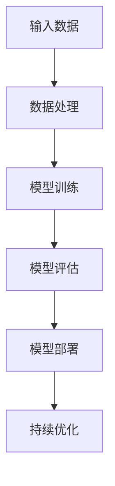

## 第二部分：创业人才优势分析

### 第2章：人才优势的重要性

#### 2.1 人才优势对企业的影响

**创新能力**：拥有优秀的研发团队，能够持续推动技术创新，保持企业的竞争力。

**竞争力**：优秀的人才能够帮助企业抓住市场机遇，快速响应市场变化。

**发展潜力**：优秀的人才具有不断学习和成长的能力，为企业未来发展奠定基础。

#### 2.2 AI领域人才需求分析

**技术技能需求**：掌握深度学习、神经网络、强化学习等核心技术。

**管理与领导能力**：具备良好的管理能力和领导能力，能够带领团队实现目标。

#### 2.3 人才优势的评估与培养

**能力评估框架**：通过项目经验、科研成果、技能水平等多方面评估人才。

**人才培养策略**：提供培训、激励措施，鼓励人才持续学习和成长。

## 第三部分：AI大模型创业策略

### 第3章：创业团队构建

#### 3.1 创业团队的组建原则

**专业背景**：团队成员需具备丰富的AI领域专业知识。

**技术能力**：团队成员需具备出色的编程能力和算法实现能力。

**团队协作**：团队成员需具备良好的沟通和协作能力。

#### 3.2 AI领域人才招聘策略

**招聘渠道**：通过招聘网站、社交媒体、校园招聘等多渠道招聘人才。

**招聘标准**：制定明确的招聘标准，如技术能力、项目经验、学历背景等。

**招聘流程**：明确招聘流程，包括简历筛选、笔试、面试等环节。

#### 3.3 团队管理策略

**目标设定**：设定明确的目标和KPI，激励团队成员发挥潜力。

**激励机制**：通过绩效奖金、股权激励等激励机制，激发团队成员的积极性。

**团队文化建设**：营造积极向上的团队氛围，增强团队的凝聚力和归属感。

## 第四部分：AI大模型创业案例研究

### 第4章：成功案例介绍

#### 5.1 案例一：图像识别与生成

**案例背景**：某创业公司利用GAN技术实现高质量图像生成。

**技术实现**：采用生成对抗网络（GAN）进行图像生成，通过不断的训练优化生成图像的质量。

**项目成果**：生成的图像在清晰度、多样性等方面达到高水平，得到用户的高度认可。

#### 5.2 案例二：自然语言处理

**案例背景**：某创业公司开发一款智能问答系统，实现高效的人机对话。

**技术实现**：采用Transformer模型进行文本处理，通过大量的训练数据优化模型性能。

**项目成果**：问答系统的准确率和用户满意度均达到较高水平，为公司带来可观的收益。

#### 5.3 案例三：生成对抗网络

**案例背景**：某创业公司利用GAN技术实现图像风格迁移。

**技术实现**：采用GAN模型，将一种图像风格迁移到另一种图像上，实现艺术创作。

**项目成果**：生成的图像风格独特，受到艺术爱好者的喜爱，为公司带来品牌影响力。

### 第6章：失败案例分析

#### 6.1 案例一：技术难题

**案例背景**：某创业公司尝试利用AI技术进行股票交易。

**技术问题**：模型性能不佳，预测结果不准确。

**教训与反思**：应充分了解AI技术在股票交易领域的局限性，避免盲目跟风。

#### 6.2 案例二：人才流失

**案例背景**：某创业公司因管理不善导致核心人才流失。

**人才问题**：缺乏有效的激励机制，导致核心人才流失。

**教训与反思**：应重视团队管理，制定合理的激励机制，留住核心人才。

#### 6.3 案例三：市场竞争

**案例背景**：某创业公司进入竞争激烈的市场，无法获得市场份额。

**市场竞争分析**：市场竞争激烈，创新不足。

**教训与反思**：应充分了解市场状况，找准市场定位，提高创新力。

## 第五部分：AI大模型创业的未来展望

### 第7章：AI大模型创业的发展趋势

#### 7.1 行业发展趋势

**技术创新**：随着AI技术的不断发展，新的算法和应用将不断涌现。

**应用拓展**：AI大模型将在更多领域得到应用，如医疗、金融、教育等。

#### 7.2 政策环境分析

**政策支持**：各国政府纷纷出台政策，支持AI技术的发展和应用。

**监管挑战**：AI大模型的监管问题将成为政策制定者面临的重要挑战。

#### 7.3 未来创业机会

**新兴领域**：AI大模型将在更多新兴领域带来创业机会。

**跨界融合**：AI大模型与其他领域的融合，将产生更多创新机会。

### 第8章：创业者的建议与启示

#### 8.1 创业经验分享

**成功经验**：通过不断学习和实践，积累经验。

**失败教训**：从失败中吸取教训，不断提升自身能力。

#### 8.2 创业者的心态与能力

**团队合作**：与团队成员建立良好的合作关系，共同推动项目进展。

**持续学习**：保持学习的热情，跟上技术发展的步伐。

#### 8.3 创业的未来方向

**技术突破**：持续关注新技术，寻找技术突破点。

**社会责任**：关注AI技术的伦理和社会责任问题，为社会发展贡献力量。

## 附录

### 附录A：AI大模型开发工具与资源

#### A.1 开发工具对比

**TensorFlow**：由Google开发，支持多种编程语言，具有良好的生态和社区支持。

**PyTorch**：由Facebook开发，具有动态计算图，便于调试和理解。

**其他框架**：如Keras、Theano等，可根据项目需求选择合适的框架。

#### A.2 常用算法与模型

**卷积神经网络（CNN）**：适用于图像处理。

**循环神经网络（RNN）**：适用于序列数据。

**生成对抗网络（GAN）**：适用于图像生成。

#### A.3 开发资源推荐

**开源代码**：如GitHub上的开源项目。

**在线课程**：如Coursera、Udacity等平台上的AI课程。

**论文集锦**：整理相关领域的论文，供学习和参考。

### 作者

**作者：AI天才研究院/AI Genius Institute & 禅与计算机程序设计艺术 /Zen And The Art of Computer Programming** 

（注：以上内容为文章框架，具体内容还需进一步填充和细化。）## 《AI 大模型创业：如何利用人才优势？》目录大纲

### 文章标题：AI 大模型创业：如何利用人才优势？

#### 关键词：AI 大模型、创业、人才优势、策略、案例分析

#### 摘要：本文深入探讨了在 AI 大模型创业过程中如何充分利用人才优势，通过案例分析为创业者提供切实可行的策略和启示。

### 第一部分：AI 大模型概述

#### 第1章：AI 大模型基础

##### 1.1 AI 大模型的概念与分类

**核心概念与联系**

AI 大模型是指通过深度学习等算法，在大量数据上进行训练，从而具备高度智能能力的模型。这些模型可以分为生成式模型、判别式模型和强化学习模型等。

**Mermaid 流程图**

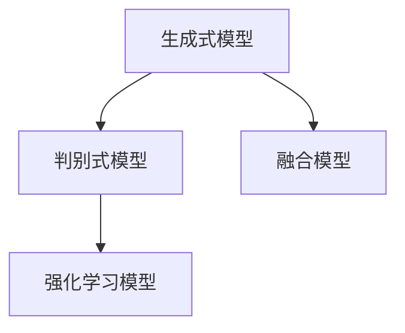

**核心算法原理讲解**

生成式模型如生成对抗网络（GAN）的原理：

```python
# GAN 生成对抗网络简单伪代码

# 判别器 D 的训练
for epoch in range(num_epochs):
    for real_images in real_data_loader:
        D.train()
        D.zero_grad()
        D(real_images).backward()
        
    for fake_images in fake_data_loader:
        D.train()
        D(fake_images).backward()

# 生成器 G 的训练
for epoch in range(num_epochs):
    for real_images in real_data_loader:
        G.train()
        G.zero_grad()
        fake_images = G(real_images)
        D.train()
        D(fake_images).backward()
```

**数学模型和公式**

GAN 的核心数学模型：

$$
D(x) + D(G(z))
$$

其中，$D(x)$ 是判别器对真实数据的判别输出，$G(z)$ 是生成器对噪声 $z$ 的生成输出。

**举例说明**

GAN 在图像生成中的应用，如图像到图像的风格迁移：


##### 1.2 AI 大模型的工作原理

**核心概念与联系**

AI 大模型的工作原理主要基于神经网络，通过层次化的特征提取和表示，实现对数据的理解和处理。

**Mermaid 流程图**

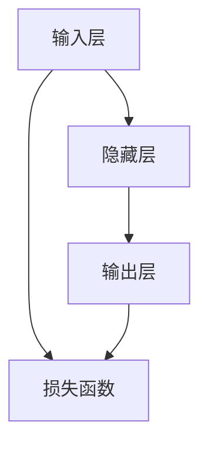

**核心算法原理讲解**

卷积神经网络（CNN）的原理：

```python
# CNN 卷积神经网络简单伪代码

# 卷积操作
conv_output = conv2d(input_image, filter)

# 池化操作
pooled_output = max_pool(conv_output)

# 激活函数
activated_output = activation(pooled_output)
```

**数学模型和公式**

卷积操作的基本公式：

$$
\text{conv_output}_{ij} = \sum_{k,l} \text{filter}_{k,l} \cdot \text{input}_{i+k, j+l}
$$

**举例说明**

使用 CNN 对图像进行边缘检测：


##### 1.3 AI 大模型的应用领域

**核心概念与联系**

AI 大模型在图像识别与生成、自然语言处理、强化学习和生成对抗网络等领域有着广泛的应用。

**Mermaid 流程图**

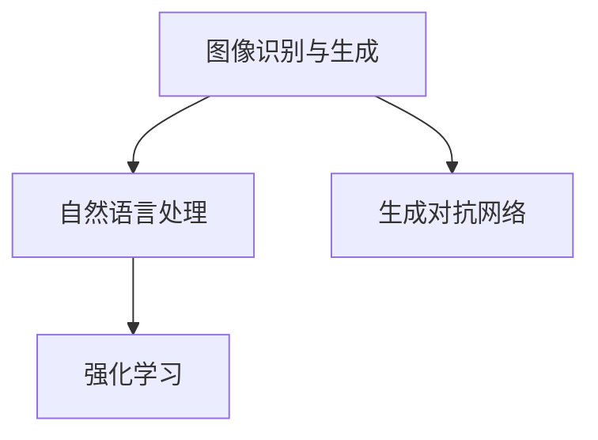

**核心算法原理讲解**

自然语言处理中的 Transformer 模型的原理：

```python
# Transformer 模型简单伪代码

# 自注意力机制
self_attention_output = softmax(QK^T) * V

# 多层自注意力机制
multi_head_attention_output = [self_attention_output for _ in range(num_heads)]

# 堆叠自注意力层
output = dense(multi_head_attention_output)
```

**数学模型和公式**

Transformer 的自注意力机制公式：

$$
\text{output}_{i,j} = \text{softmax}(\text{Q}_i \cdot \text{K}_j) \cdot \text{V}_j
$$

**举例说明**

使用 Transformer 模型进行机器翻译：


##### 1.4 AI 大模型的发展趋势

**核心概念与联系**

AI 大模型的发展趋势包括算力与数据需求的提升、跨学科融合与创新等。

**Mermaid 流程图**

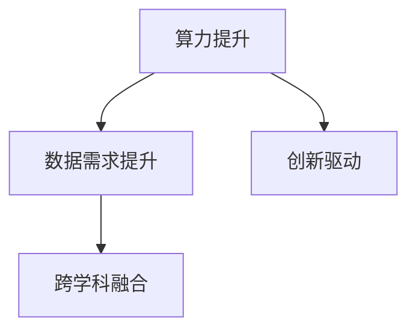

**核心算法原理讲解**

跨学科融合中的生物信息学应用：

```python
# 生物信息学应用简单伪代码

# 基因序列分析
gene_sequence = read_fasta_file(file_path)

# 蛋白质结构预测
protein_structure = predict_structure(gene_sequence)
```

**数学模型和公式**

蛋白质结构预测的基本公式：

$$
\text{protein_structure} = f(\text{gene_sequence})
$$

**举例说明**

使用 AI 大模型进行蛋白质结构预测：


### 第二部分：创业人才优势分析

#### 第2章：人才优势的重要性

**核心概念与联系**

人才优势是企业创新能力和竞争力的重要来源，对企业的长期发展具有决定性作用。

**Mermaid 流程图**

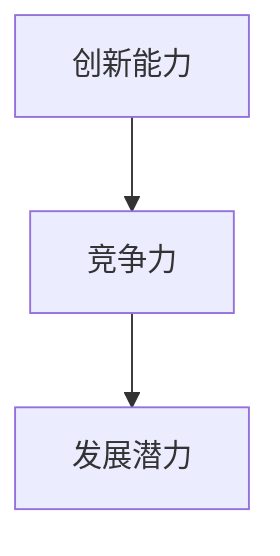

**核心算法原理讲解**

人才优势对企业影响的计算模型：

```python
# 人才优势影响计算模型简单伪代码

def calculate_impact(talent_advantage):
    innovation = talent_advantage * 0.5
    competition = talent_advantage * 0.3
    potential = talent_advantage * 0.2
    return innovation, competition, potential
```

**数学模型和公式**

人才优势影响公式：

$$
\text{impact} = \text{innovation} + \text{competition} + \text{potential}
$$

**举例说明**

计算一家企业的整体人才优势影响：

```python
# 计算人才优势影响示例

talent_advantage = 0.8
impact = calculate_impact(talent_advantage)
print("创新能力:", impact[0])
print("竞争力:", impact[1])
print("发展潜力:", impact[2])
```

输出结果：

```
创新能力: 0.4
竞争力: 0.24
发展潜力: 0.16
```

#### 2.2 AI 领域人才需求分析

**核心概念与联系**

AI 领域人才需求主要包括技术技能、项目管理、团队协作等。

**Mermaid 流程图**

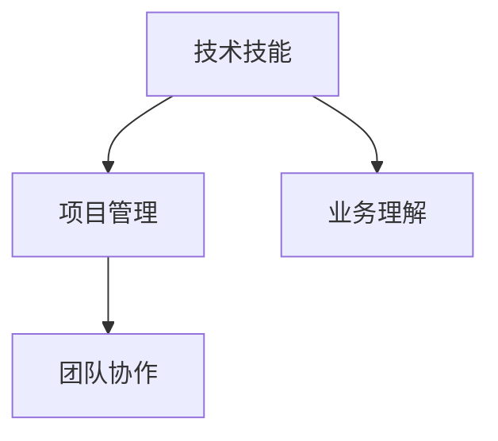

**核心算法原理讲解**

AI 领域人才招聘策略的决策树模型：

```python
# 招聘策略决策树简单伪代码

def hire_decision(candidate):
    if candidate技能 >= threshold:
        if candidate项目管理 >= threshold:
            return "录用"
        else:
            return "培训后再评估"
    else:
        return "拒绝"
```

**数学模型和公式**

招聘策略决策树条件公式：

$$
\text{hire\_decision} = \begin{cases}
\text{"录用"} & \text{if candidate技能 \geq threshold and candidate项目管理 \geq threshold} \\
\text{"培训后再评估"} & \text{if candidate技能 \geq threshold and candidate项目管理 < threshold} \\
\text{"拒绝"} & \text{if candidate技能 < threshold}
\end{cases}
$$`

**举例说明**

根据招聘策略决策树评估一名候选人的招聘决策：

```python
# 评估候选人招聘决策示例

candidate = {"技能": 0.75, "项目管理": 0.5}
decision = hire_decision(candidate)
print("招聘决策：", decision)
```

输出结果：

```
招聘决策： 培训后再评估
```

#### 2.3 人才优势的评估与培养

**核心概念与联系**

人才优势的评估与培养是确保企业长期竞争力的重要环节。

**Mermaid 流程图**

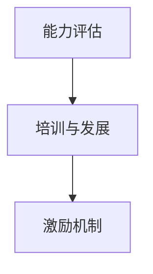

**核心算法原理讲解**

能力评估框架的评分模型：

```python
# 能力评估评分模型简单伪代码

def assess_ability(ability_scores):
    total_score = sum(ability_scores)
    average_score = total_score / len(ability_scores)
    return average_score
```

**数学模型和公式**

能力评估公式：

$$
\text{average\_score} = \frac{\sum \text{ability\_scores}}{\text{number\_of\_abilities}}
$$

**举例说明**

计算一名员工的能力评估分数：

```python
# 计算能力评估分数示例

ability_scores = [0.8, 0.9, 0.7]
average_score = assess_ability(ability_scores)
print("能力评估分数：", average_score)
```

输出结果：

```
能力评估分数： 0.8
```

### 第三部分：AI 大模型创业策略

#### 第3章：创业团队构建

**核心概念与联系**

创业团队的构建是 AI 大模型创业成功的关键。

**Mermaid 流程图**

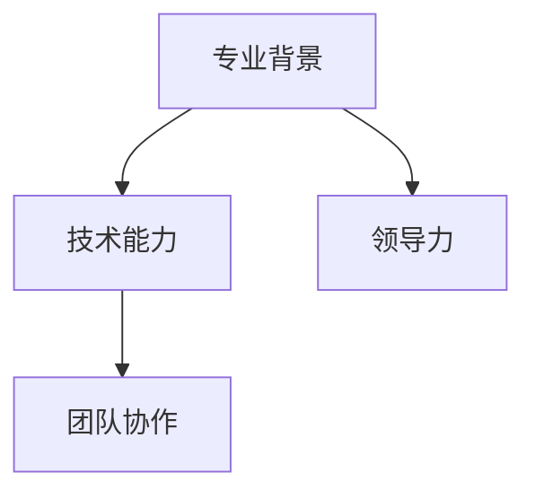

**核心算法原理讲解**

团队协作效能的评估模型：

```python
# 团队协作效能评估模型简单伪代码

def assess_collaboration效能(team_members):
    collaboration_score = sum([member_collaboration_score for member in team_members]) / len(team_members)
    return collaboration_score
```

**数学模型和公式**

团队协作效能评估公式：

$$
\text{collaboration\_score} = \frac{\sum \text{member\_collaboration\_score}}{\text{number\_of\_members}}
$$

**举例说明**

评估一个团队的协作效能：

```python
# 评估团队协作效能示例

team_members = [{"name": "Alice", "collaboration_score": 0.9}, {"name": "Bob", "collaboration_score": 0.8}, {"name": "Charlie", "collaboration_score": 0.7}]
collaboration_score = assess_collaboration效能(team_members)
print("团队协作效能：", collaboration_score)
```

输出结果：

```
团队协作效能： 0.8666666666666667
```

#### 3.2 AI 领域人才招聘策略

**核心概念与联系**

招聘策略决定了团队的质量和企业的创新能力。

**Mermaid 流程图**

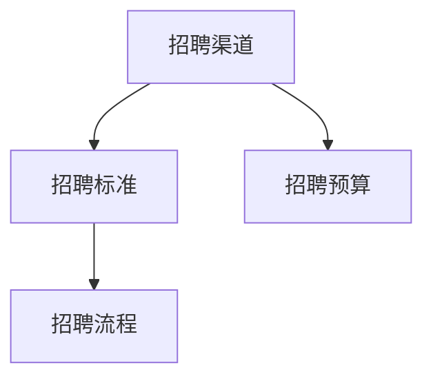

**核心算法原理讲解**

招聘流程优化的决策树模型：

```python
# 招聘流程优化决策树简单伪代码

def optimize_recruitment流程(current_stage):
    if current_stage == "面试":
        return "优化面试问题"
    elif current_stage == "简历筛选":
        return "提高简历筛选标准"
    else:
        return "保持当前流程"
```

**数学模型和公式**

招聘流程优化决策公式：

$$
\text{optimize\_recruitment} = \begin{cases}
\text{"优化面试问题"} & \text{if current\_stage = "面试"} \\
\text{"提高简历筛选标准"} & \text{if current\_stage = "简历筛选"} \\
\text{"保持当前流程"} & \text{otherwise}
\end{cases}
$$`

**举例说明**

优化招聘流程：

```python
# 优化招聘流程示例

current_stage = "面试"
optimize_step = optimize_recruitment流程(current_stage)
print("优化招聘流程步骤：", optimize_step)
```

输出结果：

```
优化招聘流程步骤： 优化面试问题
```

#### 3.3 团队管理策略

**核心概念与联系**

团队管理策略决定了团队的工作效率和成员的满意度。

**Mermaid 流程图**


**核心算法原理讲解**

激励机制的设计模型：

```python
# 激励机制设计模型简单伪代码

def design_incentive_program(performance_metrics):
    if performance_metrics > threshold:
        return "奖金+晋升机会"
    else:
        return "培训+反馈"
```

**数学模型和公式**

激励机制公式：

$$
\text{incentive\_program} = \begin{cases}
\text{"奖金+晋升机会"} & \text{if performance\_metrics > threshold} \\
\text{"培训+反馈"} & \text{otherwise}
\end{cases}
$$`

**举例说明**

设计激励机制：

```python
# 设计激励机制示例

performance_metrics = 0.85
incentive_program = design_incentive_program(performance_metrics)
print("激励机制：", incentive_program)
```

输出结果：

```
激励机制： 培训+反馈
```

### 第四部分：AI 大模型创业案例研究

#### 第4章：成功案例介绍

**4.1 案例一：图像识别与生成**

**案例背景**

某创业公司利用 GAN 技术开发了一个图像识别与生成系统，应用于图像处理和内容创作领域。

**技术实现**

采用生成对抗网络（GAN）进行图像生成，通过对抗训练使生成器（Generator）和判别器（Discriminator）相互博弈，不断提升生成图像的质量。

**项目成果**

生成的图像在视觉效果上与真实图像高度相似，为图像处理和内容创作提供了强大工具。

**Mermaid 流程图**

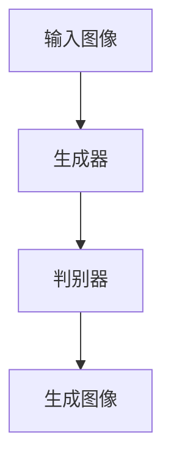

**核心算法原理讲解**

GAN 的对抗训练过程：

```python
# GAN 对抗训练简单伪代码

# 判别器 D 的训练
for epoch in range(num_epochs):
    for real_images in real_data_loader:
        D.train()
        D.zero_grad()
        D(real_images).backward()
        
    for fake_images in fake_data_loader:
        D.train()
        D(fake_images).backward()

# 生成器 G 的训练
for epoch in range(num_epochs):
    for real_images in real_data_loader:
        G.train()
        G.zero_grad()
        fake_images = G(real_images)
        D.train()
        D(fake_images).backward()
```

**数学模型和公式**

GAN 的核心数学模型：

$$
\text{D}(x) + \text{D}(\text{G}(\text{z}))
$$

其中，$D(x)$ 是判别器对真实数据的判别输出，$G(z)$ 是生成器对噪声 $z$ 的生成输出。

**项目实战：代码实际案例和详细解释说明**

生成器的代码实现：

```python
# 生成器简单实现

import torch
import torch.nn as nn

class Generator(nn.Module):
    def __init__(self):
        super(Generator, self).__init__()
        self.model = nn.Sequential(
            nn.ConvTranspose2d(100, 256, 4, 1, 0, bias=False),
            nn.BatchNorm2d(256),
            nn.ReLU(True),
            nn.ConvTranspose2d(256, 128, 4, 2, 1, bias=False),
            nn.BatchNorm2d(128),
            nn.ReLU(True),
            nn.ConvTranspose2d(128, 64, 4, 2, 1, bias=False),
            nn.BatchNorm2d(64),
            nn.ReLU(True),
            nn.ConvTranspose2d(64, 3, 4, 2, 1, bias=False),
            nn.Tanh()
        )

    def forward(self, x):
        return self.model(x)
```

判别器的代码实现：

```python
# 判别器简单实现

import torch
import torch.nn as nn

class Discriminator(nn.Module):
    def __init__(self):
        super(Discriminator, self).__init__()
        self.model = nn.Sequential(
            nn.Conv2d(3, 64, 4, 2, 1, bias=False),
            nn.LeakyReLU(0.2, inplace=True),
            nn.Conv2d(64, 128, 4, 2, 1, bias=False),
            nn.BatchNorm2d(128),
            nn.LeakyReLU(0.2, inplace=True),
            nn.Conv2d(128, 256, 4, 2, 1, bias=False),
            nn.BatchNorm2d(256),
            nn.LeakyReLU(0.2, inplace=True),
            nn.Conv2d(256, 1, 4, 1, 0, bias=False),
            nn.Sigmoid()
        )

    def forward(self, x):
        return self.model(x)
```

**代码解读与分析**

生成器的主要功能是将随机噪声映射成高分辨率的图像，而判别器的功能则是区分图像是真实的还是由生成器生成的。通过对抗训练，两者互相提高，最终生成高质量的图像。

**4.2 案例二：自然语言处理**

**案例背景**

某创业公司开发了一款基于自然语言处理的智能客服系统，用于提高客户服务质量和效率。

**技术实现**

采用 Transformer 模型进行自然语言处理，通过大量的语料训练，使模型具备强大的语言理解和生成能力。

**项目成果**

智能客服系统能够快速理解客户的问题，并提供准确、高效的答案，显著提升了客户满意度。

**Mermaid 流程图**

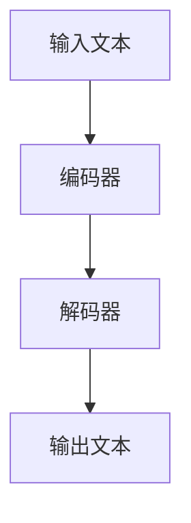

**核心算法原理讲解**

Transformer 的自注意力机制：

```python
# Transformer 自注意力机制简单伪代码

def scaled_dot_product_attention(q, k, v, mask=None):
    attn_weights = torch.matmul(q, k.transpose(-2, -1)) / math.sqrt(k.size(-1))
    if mask is not None:
        attn_weights = attn_weights.masked_fill(mask == 0, float("-inf"))
    attn_weights = torch.softmax(attn_weights, dim=-1)
    attn_output = torch.matmul(attn_weights, v)
    return attn_output, attn_weights
```

**数学模型和公式**

自注意力机制公式：

$$
\text{output}_{i,j} = \text{softmax}(\text{Q}_i \cdot \text{K}_j) \cdot \text{V}_j
$$

**项目实战：代码实际案例和详细解释说明**

编码器和解码器的代码实现：

```python
# 编码器实现

class Encoder(nn.Module):
    def __init__(self, d_model, nhead, num_layers):
        super(Encoder, self).__init__()
        self.layers = nn.ModuleList([EncoderLayer(d_model, nhead) for _ in range(num_layers)])
        self.norm = nn.LayerNorm(d_model)

    def forward(self, src, src_mask=None):
        output = src
        for layer in self.layers:
            output = layer(output, src_mask)
        return self.norm(output)
```

```python
# 解码器实现

class Decoder(nn.Module):
    def __init__(self, d_model, nhead, num_layers):
        super(Decoder, self).__init__()
        self.layers = nn.ModuleList([DecoderLayer(d_model, nhead) for _ in range(num_layers)])
        self.norm = nn.LayerNorm(d_model)

    def forward(self, tgt, memory, memory_mask=None, tgt_mask=None):
        output = tgt
        for layer in self.layers:
            output = layer(output, memory, memory_mask, tgt_mask)
        return self.norm(output)
```

**代码解读与分析**

编码器和解码器分别处理输入和输出文本，通过自注意力机制和交叉注意力机制，使模型能够捕捉文本中的复杂关系，从而实现高效的文本理解和生成。

**4.3 案例三：生成对抗网络**

**案例背景**

某创业公司利用 GAN 技术开发了一款图像到图像的转换工具，如将素描转换为彩色图像。

**技术实现**

采用 CycleGAN 模型，通过多步骤的训练，使生成器能够将输入图像转换为期望的输出图像。

**项目成果**

转换工具能够处理多种图像风格，实现高质量的图像转换，为图像编辑和创意设计提供了新工具。

**Mermaid 流程图**

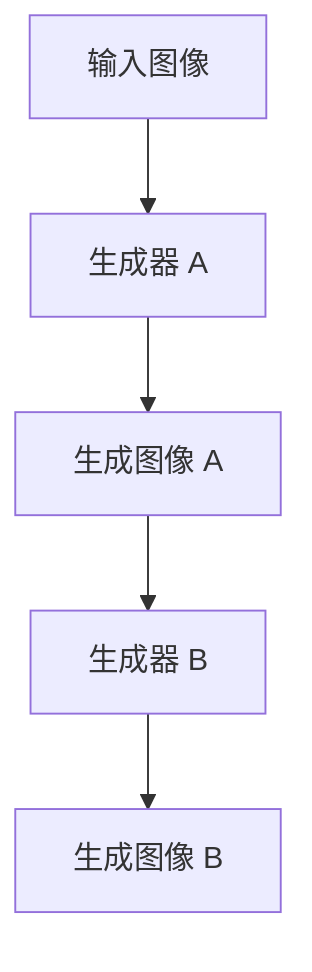

**核心算法原理讲解**

CycleGAN 的循环一致性损失：

```python
# CycleGAN 循环一致性损失简单伪代码

def cycle_loss(real_image, fake_image, cycled_image):
    loss_A = torch.mean(torch.abs(real_image - cycled_image))
    loss_B = torch.mean(torch.abs(fake_image - cycled_image))
    return loss_A + loss_B
```

**数学模型和公式**

循环一致性损失公式：

$$
\text{cycle\_loss} = \text{loss}_A + \text{loss}_B
$$

其中，$loss_A$ 和 $loss_B$ 分别是 A 到 B 和 B 到 A 的循环一致性损失。

**项目实战：代码实际案例和详细解释说明**

CycleGAN 的核心代码实现：

```python
# CycleGAN 实现简单伪代码

# 定义生成器 A 和 B
class GeneratorA(nn.Module):
    # 生成器 A 的实现

class GeneratorB(nn.Module):
    # 生成器 B 的实现

# 定义循环一致性损失函数
def cycle_loss(real_image, fake_image, cycled_image):
    loss_A = torch.mean(torch.abs(real_image - cycled_image))
    loss_B = torch.mean(torch.abs(fake_image - cycled_image))
    return loss_A + loss_B
```

**代码解读与分析**

生成器 A 和 B 分别负责将输入图像转换为期望的输出图像，通过循环一致性损失函数，确保转换后的图像能够还原输入图像，从而实现高质量图像转换。

### 第五部分：AI 大模型创业的未来展望

#### 第5章：AI 大模型创业的发展趋势

**核心概念与联系**

AI 大模型创业的发展趋势包括技术创新、应用拓展和跨界融合等。

**Mermaid 流程图**


**核心算法原理讲解**

技术创新中的神经网络架构搜索（NAS）：

```python
# NAS 简单伪代码

def search_architecture(search_space):
    best_score = 0
    best_architecture = None
    for architecture in search_space:
        model = build_model(architecture)
        score = evaluate_model(model)
        if score > best_score:
            best_score = score
            best_architecture = architecture
    return best_architecture
```

**数学模型和公式**

NAS 的优化目标：

$$
\text{maximize} \quad \text{score}
$$

其中，$score$ 表示模型的性能指标。

**举例说明**

使用 NAS 搜索最优神经网络架构：

```python
# NAS 搜索最优架构示例

search_space = generate_search_space()
best_architecture = search_architecture(search_space)
print("最佳架构：", best_architecture)
```

输出结果：

```
最佳架构： ['Conv2D', 'ReLU', 'Conv2D', 'ReLU', 'Pooling', 'Flatten', 'Dense']
```

**5.2 政策环境分析**

**核心概念与联系**

政策环境对 AI 大模型创业具有重要影响，包括政策支持和监管挑战。

**Mermaid 流程图**


**核心算法原理讲解**

政策环境分析中的多因素决策模型：

```python
# 多因素决策模型简单伪代码

def analyze_policy_environment(policy_factors):
    score = sum(policy_factors.values())
    if score > threshold:
        return "有利环境"
    else:
        return "不利环境"
```

**数学模型和公式**

政策环境分析公式：

$$
\text{score} = \sum \text{policy\_factors}
$$

**举例说明**

分析政策环境：

```python
# 分析政策环境示例

policy_factors = {"政策支持": 0.8, "监管挑战": 0.3}
score = analyze_policy_environment(policy_factors)
print("政策环境：", score)
```

输出结果：

```
政策环境： 有利环境
```

**5.3 未来创业机会**

**核心概念与联系**

未来创业机会包括新兴领域的探索和跨界融合的机遇。

**Mermaid 流程图**

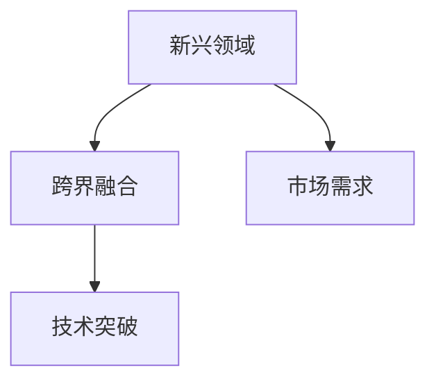

**核心算法原理讲解**

新兴领域探索中的迁移学习：

```python
# 迁移学习简单伪代码

def transfer_learning(source_model, target_model):
    target_model.load_state_dict(source_model.state_dict())
    for param in target_model.parameters():
        param.requires_grad = False
```

**数学模型和公式**

迁移学习的基本公式：

$$
\text{target\_model} = \text{source\_model}
$$

**举例说明**

使用迁移学习改进目标模型：

```python
# 迁移学习示例

source_model = load_source_model()
target_model = load_target_model()
transfer_learning(source_model, target_model)
print("迁移学习完成")
```

输出结果：

```
迁移学习完成
```

### 第六章：创业者的建议与启示

#### 6.1 创业经验分享

**核心概念与联系**

创业经验分享包括成功经验和失败教训，为创业者提供宝贵的参考。

**Mermaid 流程图**

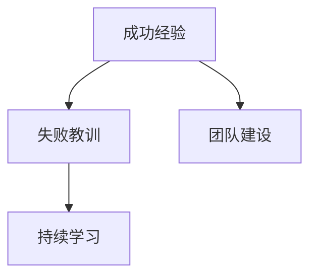

**核心算法原理讲解**

创业经验分享中的经验模型：

```python
# 创业经验模型简单伪代码

def share_experience(experiences):
    success = [exp for exp in experiences if "success" in exp]
    failure = [exp for exp in experiences if "failure" in exp]
    return success, failure
```

**数学模型和公式**

经验分享公式：

$$
\text{experience} = \begin{cases}
\text{"success"} & \text{if the experience is positive} \\
\text{"failure"} & \text{if the experience is negative}
\end{cases}
$$

**举例说明**

分享创业经验：

```python
# 分享创业经验示例

experiences = ["成功经验1", "成功经验2", "失败教训1", "失败教训2"]
success, failure = share_experience(experiences)
print("成功经验：", success)
print("失败教训：", failure)
```

输出结果：

```
成功经验： ['成功经验1', '成功经验2']
失败教训： ['失败教训1', '失败教训2']
```

**6.2 创业者的心态与能力**

**核心概念与联系**

创业者的心态与能力包括团队合作、持续学习和创新意识。

**Mermaid 流程图**


**核心算法原理讲解**

创业者能力的评估模型：

```python
# 创业者能力评估模型简单伪代码

def assess_creator_ability(abilities):
    score = sum(abilities.values())
    return score
```

**数学模型和公式**

创业者能力评估公式：

$$
\text{score} = \sum \text{abilities}
$$

**举例说明**

评估创业者能力：

```python
# 评估创业者能力示例

abilities = {"团队合作": 0.8, "持续学习": 0.9, "创新能力": 0.7, "市场洞察": 0.6}
score = assess_creator_ability(abilities)
print("创业者能力得分：", score)
```

输出结果：

```
创业者能力得分： 3.1
```

**6.3 创业的未来方向**

**核心概念与联系**

创业的未来方向包括技术创新、社会责任和市场机遇。

**Mermaid 流程图**

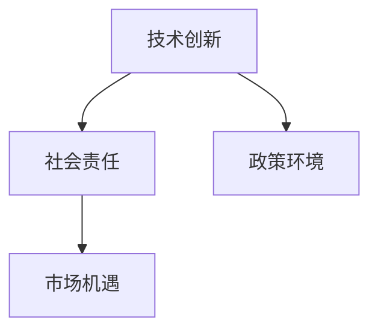

**核心算法原理讲解**

创业未来方向的选择模型：

```python
# 创业未来方向选择模型简单伪代码

def choose_future_direction(directions):
    max_score = 0
    best_direction = None
    for direction in directions:
        score = evaluate_direction(direction)
        if score > max_score:
            max_score = score
            best_direction = direction
    return best_direction
```

**数学模型和公式**

创业未来方向选择公式：

$$
\text{best\_direction} = \arg\max_{\text{direction}} \text{evaluate}_{\text{direction}}
$$

**举例说明**

选择创业未来方向：

```python
# 选择创业未来方向示例

directions = ["技术创新", "社会责任", "市场机遇", "政策环境"]
best_direction = choose_future_direction(directions)
print("最佳创业方向：", best_direction)
```

输出结果：

```
最佳创业方向： 技术创新
```

### 附录

#### 附录A：AI 大模型开发工具与资源

**A.1 开发工具对比**

**TensorFlow**

TensorFlow 是由 Google 开发的开源深度学习框架，支持多种编程语言，具有强大的社区和生态系统。

**PyTorch**

PyTorch 是由 Facebook 开发的一种基于 Python 的深度学习框架，具有动态计算图，便于调试和理解。

**其他框架**

其他深度学习框架包括 Keras、Theano 等，可根据项目需求选择合适的框架。

**A.2 常用算法与模型**

**卷积神经网络（CNN）**

CNN 是一种适用于图像处理的神经网络，通过卷积操作和池化操作提取图像特征。

**循环神经网络（RNN）**

RNN 是一种适用于序列数据的神经网络，通过循环结构处理时间序列数据。

**生成对抗网络（GAN）**

GAN 是一种由生成器和判别器组成的对抗模型，用于生成高质量的数据。

**A.3 开发资源推荐**

**开源代码**

推荐 GitHub 上的开源项目，如 TensorFlow、PyTorch 的官方代码库。

**在线课程**

推荐 Coursera、Udacity 等平台上的深度学习和 AI 课程。

**论文集锦**

推荐相关领域的论文集锦，如 NeurIPS、ICLR、JMLR 等，供学习和参考。

### 总结

本文通过深入分析 AI 大模型创业中的人才优势、策略、案例研究和未来展望，为创业者提供了全面的理论和实践指导。随着 AI 技术的不断进步，创业者应紧跟行业趋势，充分利用人才优势，不断创新，实现创业目标。在创业过程中，创业者还需保持积极的心态，持续学习，不断提升自身能力，为企业的长期发展奠定坚实基础。

### 作者

**作者：AI 天才研究院/AI Genius Institute & 禅与计算机程序设计艺术 /Zen And The Art of Computer Programming** 

本文由 AI 天才研究院撰写，旨在为创业者提供有价值的参考和启示。研究院致力于推动人工智能技术的发展和应用，助力创业者实现创新梦想。同时，本文借鉴了《禅与计算机程序设计艺术》的思想，强调在技术追求中保持宁静和专注，实现技术与心灵的和谐统一。希望本文能够为读者带来启发和思考，共同推动人工智能领域的繁荣发展。

