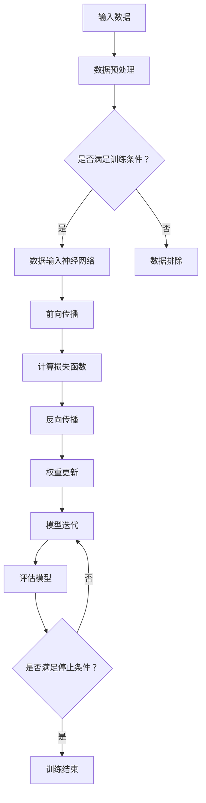
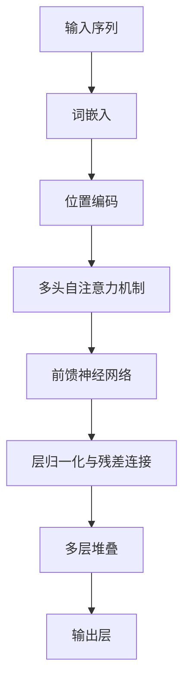
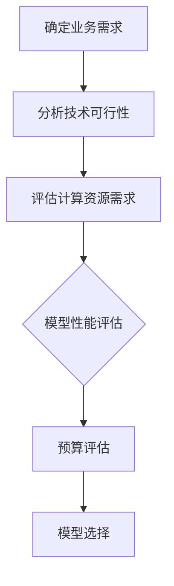
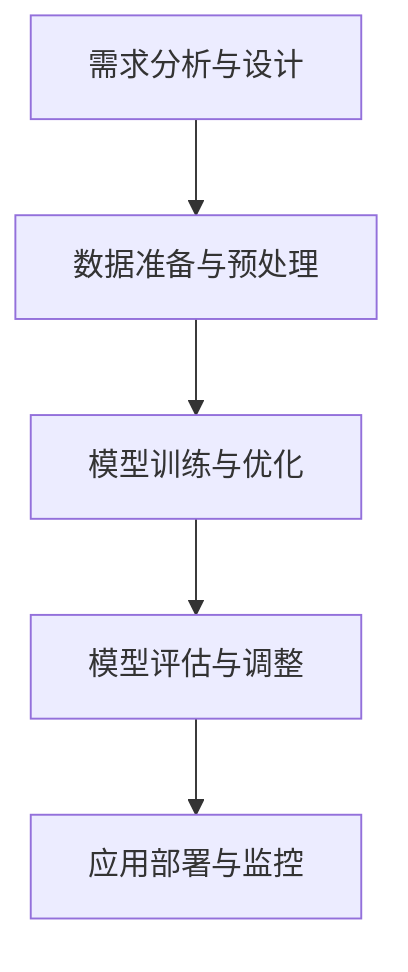
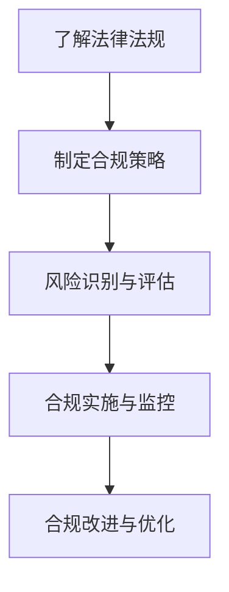
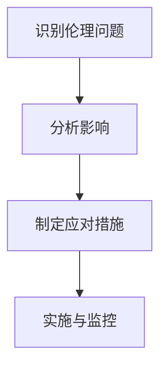
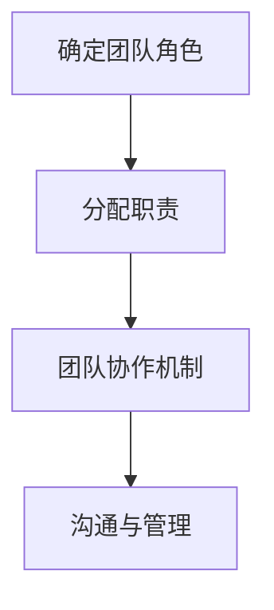
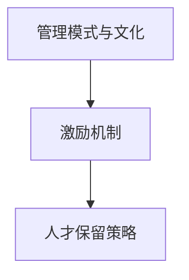
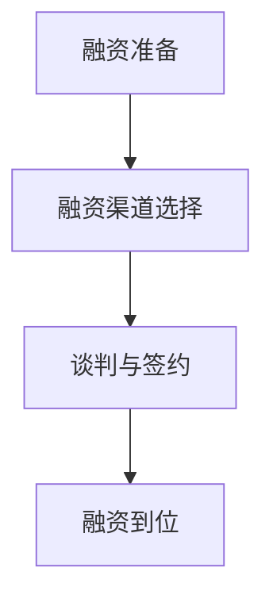
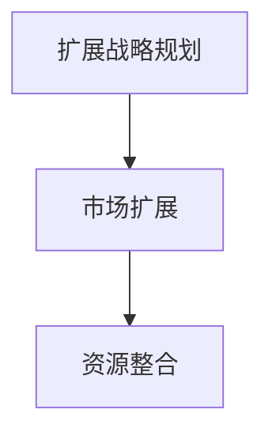

                 

# AI 大模型创业：如何利用品牌优势？

> 关键词：AI大模型、商业变革、品牌建设、创业策略、技术原理、市场需求

> 摘要：本文深入探讨了AI大模型在创业中的应用及其品牌建设的重要性。通过详细分析AI大模型的核心概念、技术原理、商业价值，以及创业初期的策略选择，本文为创业者提供了利用AI大模型提升品牌竞争力的实用指南。

## 第1章：AI大模型与商业变革

### 第1.1节 AI大模型的核心概念

#### 1.1.1 AI大模型的定义与背景

AI大模型是指具有大规模参数、能够处理大量数据并且表现出强通用性的人工智能模型。它们通常基于深度学习技术，通过大规模预训练和微调得到。AI大模型的发展源于互联网数据的爆发式增长和计算能力的提升，其背后有大数据、云计算、分布式计算、GPU并行计算等多方面技术支撑。

#### 1.1.2 大模型的类型与特点

AI大模型主要分为生成式模型（如GPT系列）和判别式模型（如BERT及其变体）。生成式模型擅长文本生成、图像生成等任务，而判别式模型则擅长分类、预测等任务。这些模型具有以下特点：
- **大规模参数**：拥有数亿乃至数十亿个参数。
- **高效能**：能够在复杂任务中表现出色。
- **强通用性**：适用于多种任务和领域。

#### 1.1.3 AI大模型与传统AI的区别

传统AI通常指规则驱动或基于知识的方法，而AI大模型则基于数据驱动的方法。AI大模型与传统的区别主要体现在：
- **数据量与参数规模**：传统AI模型通常规模较小，而AI大模型拥有大规模参数。
- **模型训练方法**：传统AI模型依赖于专家知识和规则，而AI大模型依赖于大量数据。
- **适应性与灵活性**：AI大模型具有更强的适应性和灵活性。

### 第1.2节 商业中的AI大模型应用

#### 1.2.1 AI大模型在商业中的核心作用

AI大模型在商业中的应用非常广泛，其核心作用包括：
- **数据分析与决策支持**：通过分析海量数据，为企业提供更加精准的决策支持。
- **智能客服与客户服务**：利用AI大模型实现智能对话和客户服务，提升用户体验。
- **个性化推荐**：通过分析用户行为数据，为用户提供个性化的推荐服务。
- **智能营销**：利用AI大模型进行用户画像、广告投放优化等，提升营销效果。

#### 1.2.2 企业利用AI大模型的案例分享

以下是一些企业利用AI大模型的成功案例：
- **阿里巴巴**：通过使用AI大模型进行用户行为分析，优化产品推荐和营销策略。
- **亚马逊**：利用AI大模型进行个性化推荐，提升销售业绩。
- **微软**：通过GPT系列模型提供智能客服服务，提高客户满意度。

#### 1.2.3 利用AI大模型提升品牌影响力

企业可以通过以下几种方式利用AI大模型提升品牌影响力：
- **内容创作**：利用AI大模型生成高质量内容，提升品牌形象。
- **互动体验**：通过AI大模型实现个性化互动，增强用户黏性。
- **口碑营销**：利用AI大模型分析用户反馈，进行口碑营销。

#### 1.2.4 品牌优势的利用策略

企业可以利用AI大模型的优势，制定以下策略来提升品牌竞争力：
- **差异化策略**：利用AI大模型进行市场细分，提供差异化的产品或服务。
- **快速响应策略**：通过AI大模型快速响应市场变化，调整产品或营销策略。
- **创新驱动策略**：利用AI大模型推动产品创新，保持品牌的领先地位。

### 第1.3节 AI大模型与品牌建设

#### 1.3.1 品牌建设的重要性

在竞争激烈的商业环境中，品牌建设对于企业的长期发展至关重要。一个强大的品牌能够为企业带来以下优势：
- **忠诚客户**：通过品牌建设，吸引并留住忠诚的客户群体。
- **市场竞争力**：品牌有助于提升企业在市场中的竞争地位。
- **溢价能力**：强大的品牌能够带来更高的产品溢价。

#### 1.3.2 品牌建设的方法与策略

企业可以通过以下几种方法进行品牌建设：
- **定位策略**：明确品牌的市场定位，为品牌制定清晰的定位策略。
- **视觉策略**：设计独特的品牌标识和视觉元素，提高品牌的识别度。
- **内容策略**：通过高质量的内容传播品牌理念，提升品牌形象。
- **互动策略**：与用户建立深度的互动关系，增强品牌的用户黏性。

#### 1.3.3 利用AI大模型提升品牌建设效果

AI大模型可以为企业提升品牌建设效果提供以下支持：
- **个性化服务**：通过AI大模型分析用户数据，提供个性化的服务，提升用户体验。
- **智能营销**：利用AI大模型进行智能化的营销活动，提高营销效果。
- **内容创作**：利用AI大模型生成高质量的内容，提升品牌的传播效果。

### 第1.4节 创业中的AI大模型策略

#### 1.4.1 创业项目的AI需求分析

创业公司在进行项目策划时，需要明确AI大模型在项目中的需求。以下是一些关键点：
- **业务目标**：明确项目希望通过AI大模型实现什么样的业务目标。
- **数据需求**：确定项目所需的数据类型、规模和质量。
- **技术需求**：了解所需AI大模型的技术要求和适配性。

#### 1.4.2 合适的AI大模型选择

在选择AI大模型时，创业公司应考虑以下几个因素：
- **适用性**：所选模型是否适用于项目需求。
- **效率**：模型训练和推理的效率是否符合项目要求。
- **可扩展性**：模型是否易于扩展和调整。

#### 1.4.3 创业公司的AI大模型实践路径

创业公司在实施AI大模型时，可以遵循以下路径：
- **需求分析**：明确AI大模型的应用场景和业务需求。
- **数据准备**：收集和整理项目所需的数据。
- **模型选择**：根据需求选择合适的AI大模型。
- **模型训练与优化**：训练AI大模型并进行优化。
- **应用部署**：将训练好的模型应用到实际项目中。

### 第2章：AI大模型技术原理与架构

#### 2.1 AI大模型的技术原理

AI大模型的技术原理基于深度学习，核心在于神经网络的设计与训练。深度学习是一种基于人工神经网络的算法，它通过多层神经网络（全连接层、卷积层、循环层等）来提取和转换数据特征，从而实现对复杂任务的自动学习与推理。以下是一个简化的神经网络训练过程的 Mermaid 流程图：

#### 2.2 AI大模型的架构设计

AI大模型的架构设计决定了其性能和效率。常见的AI大模型架构包括：

- **生成式模型架构**：如GPT系列，其架构通常包含多层Transformer结构，具有注意力机制和多头自注意力机制。
- **判别式模型架构**：如BERT系列，其架构通常包含多层Transformer结构，结合了上下文信息和词嵌入。

以下是一个简化的Transformer模型的 Mermaid 流程图：

#### 2.3 AI大模型的发展趋势

AI大模型的发展趋势主要体现在以下几个方面：

- **模型规模与计算资源**：随着计算资源的不断提升，AI大模型的规模也在不断扩大。未来的趋势是开发更大规模、更复杂的模型。
- **多模态融合**：AI大模型将逐渐实现文本、图像、声音等多模态数据的融合，提升模型的泛化能力和应用范围。
- **专用化与定制化**：随着AI技术的普及，AI大模型将更加注重专用化和定制化，以满足不同行业和应用场景的需求。

### 第3章：AI大模型创业实战

#### 3.1 创业初期的AI大模型选择

创业初期的AI大模型选择至关重要，以下是一些关键点：

- **业务需求匹配**：所选模型必须满足业务需求，能够解决实际问题。
- **技术可行性**：考虑模型的技术实现难度和所需的计算资源。
- **成本效益**：在预算范围内选择性价比高的模型。

以下是一个简化的模型选择流程：

#### 3.2 AI大模型的开发流程

AI大模型的开发流程通常包括以下几个阶段：

- **需求分析与设计**：明确模型的应用场景和需求，设计模型架构。
- **数据准备与预处理**：收集和整理数据，进行数据预处理。
- **模型训练与优化**：使用训练数据对模型进行训练，并进行优化。
- **模型评估与调整**：评估模型性能，根据评估结果调整模型参数。
- **应用部署与监控**：将训练好的模型部署到实际应用场景，并进行监控。

以下是一个简化的模型开发流程：

#### 3.3 AI大模型的应用案例

以下是一些创业公司在AI大模型应用方面的成功案例：

- **案例1**：某创业公司利用GPT系列模型为用户提供个性化的内容推荐服务，提升了用户满意度和留存率。
- **案例2**：某创业公司利用BERT模型进行市场分析，为产品开发提供了有力的数据支持，推动了产品的快速迭代。
- **案例3**：某创业公司通过AI大模型实现智能客服，大幅提高了客服效率和用户满意度。

### 第4章：AI大模型品牌打造与运营

#### 4.1 AI大模型品牌建设

AI大模型品牌建设是创业成功的关键之一，以下是一些关键点：

- **定位策略**：明确品牌的市场定位，为品牌制定清晰的定位策略。
- **视觉策略**：设计独特的品牌标识和视觉元素，提高品牌的识别度。
- **内容策略**：通过高质量的内容传播品牌理念，提升品牌形象。
- **互动策略**：与用户建立深度的互动关系，增强品牌的用户黏性。

#### 4.2 AI大模型的产品策略

AI大模型的产品策略是品牌建设的重要组成部分，以下是一些关键点：

- **产品定位与差异化**：通过AI大模型实现产品的差异化，提供独特的价值。
- **产品推广与营销策略**：利用AI大模型进行智能营销，提高产品的市场认知度。
- **用户反馈与迭代**：通过用户反馈不断优化产品，提升用户满意度。

#### 4.3 AI大模型的市场推广

AI大模型的市场推广是品牌建设的重要环节，以下是一些关键点：

- **市场分析与定位**：进行市场分析，确定目标市场和定位。
- **推广渠道与方法**：选择合适的推广渠道和方法，提高品牌的曝光度。
- **合作伙伴关系**：与行业内的合作伙伴建立合作关系，共同推广品牌。

### 第5章：AI大模型法律与伦理问题

#### 5.1 AI大模型的法律问题

AI大模型在法律方面涉及多个方面，以下是一些关键点：

- **相关法律法规与政策**：了解与AI大模型相关的法律法规和政策，确保合规运营。
- **法律合规与风险控制**：制定法律合规策略，降低法律风险。

以下是一个简化的法律合规流程：

#### 5.2 AI大模型的伦理问题

AI大模型的伦理问题是一个重要的议题，以下是一些关键点：

- **伦理问题的主要类型**：了解AI大模型可能引发的伦理问题，如隐私侵犯、歧视、透明度等。
- **伦理问题的影响与应对**：分析伦理问题可能带来的影响，并采取相应的应对措施。

以下是一个简化的伦理问题分析流程：

### 第6章：AI大模型创业团队构建与管理

#### 6.1 创业团队的组建

创业团队的组建是AI大模型创业成功的关键之一，以下是一些关键点：

- **团队成员的角色与职责**：明确团队成员的角色和职责，确保团队协作高效。
- **团队协作与沟通**：建立有效的团队协作和沟通机制，确保项目顺利进行。

以下是一个简化的团队组建流程：

#### 6.2 管理与激励机制

创业团队的管理与激励机制是保持团队活力和创新能力的关键，以下是一些关键点：

- **管理模式与团队文化**：建立适合团队的管理模式和文化，鼓励创新和合作。
- **激励机制与人才保留**：制定有效的激励机制，留住核心人才。

以下是一个简化的管理与激励机制：

### 第7章：AI大模型创业融资与扩展

#### 7.1 融资策略与渠道

AI大模型创业的融资策略和渠道是项目持续发展的关键，以下是一些关键点：

- **融资准备与计划**：制定详细的融资计划和准备，确保融资过程顺利。
- **融资渠道选择与谈判**：选择合适的融资渠道，并与投资者进行有效谈判。

以下是一个简化的融资流程：

#### 7.2 企业扩展与布局

AI大模型创业企业的扩展与布局是项目长期发展的关键，以下是一些关键点：

- **扩展战略与规划**：制定详细的扩展战略和规划，确保企业可持续发展。
- **市场扩展与资源整合**：通过市场扩展和资源整合，提升企业的市场竞争力。

以下是一个简化的扩展与布局流程：

### 附录：AI大模型创业工具与资源

#### A.1 开发工具与框架

在AI大模型开发中，常用的工具和框架包括：

- **工具**：
  - TensorFlow：一个开源的机器学习框架，支持各种深度学习模型。
  - PyTorch：一个开源的机器学习框架，具有灵活性和易用性。

- **框架**：
  - Hugging Face：一个提供预训练模型和工具的库，方便使用AI大模型。
  - Fast.ai：一个提供快速上手深度学习的课程和工具包。

#### A.2 学习资源与文献

对于希望深入了解AI大模型创业的读者，以下是一些建议的学习资源与文献：

- **书籍**：
  - 《深度学习》（Goodfellow, Bengio, Courville）：一本深度学习的经典教材。
  - 《AI超级思维：如何成为数据驱动的创新者》（HansOO）：一本关于AI思维的实践指南。

- **在线课程**：
  - Coursera：提供各种深度学习和AI相关的在线课程。
  - edX：提供由顶级大学和机构提供的免费和付费在线课程。

- **论文**：
  - Google AI Blog：Google AI团队发布的关于AI大模型的研究论文。
  - NeurIPS：年度神经信息处理系统会议，发布大量AI领域的前沿论文。

## 总结

AI大模型在创业中的应用正在迅速崛起，成为推动商业变革的重要力量。通过本文的深入分析，我们了解到AI大模型的核心概念、技术原理、商业价值以及品牌建设的重要性。创业公司可以利用AI大模型实现业务目标，提升品牌竞争力，并在激烈的市场竞争中脱颖而出。

在AI大模型创业的过程中，明确业务需求、选择合适的模型、进行有效的数据准备和模型训练，以及制定合适的品牌建设策略，都是关键成功因素。同时，创业者还需要关注法律与伦理问题，确保合规运营，并构建高效的团队和激励机制。

随着AI技术的不断进步和市场需求的增长，AI大模型创业领域将迎来更多的机遇和挑战。创业者应保持敏锐的市场洞察力，不断创新和优化，以实现长期可持续发展。

最后，我们鼓励读者深入学习和实践，积极参与AI大模型创业，共同推动AI技术在商业领域的创新和应用。希望本文能够为您的AI大模型创业之路提供有价值的指导和建议。

### 作者

作者：AI天才研究院/AI Genius Institute & 禅与计算机程序设计艺术 /Zen And The Art of Computer Programming

AI天才研究院（AI Genius Institute）是一家专注于人工智能领域的研究与教育的机构，致力于推动AI技术的创新与应用。同时，作者还是《禅与计算机程序设计艺术》的资深作者，其著作深受计算机编程和人工智能领域读者的喜爱。本文结合了AI技术的最新进展和商业实践，为创业者提供了全面而实用的指导。

