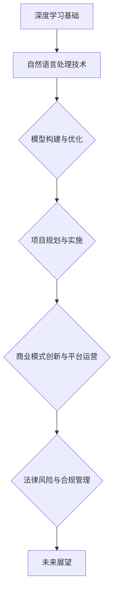
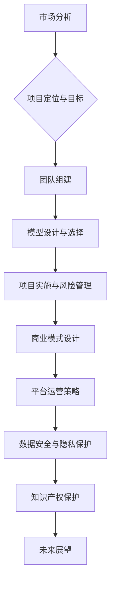

                 

# AI大模型创业：如何利用平台优势？

> 关键词：AI大模型、创业、平台优势、技术实践、商业模式

> 摘要：
本文深入探讨了AI大模型创业的路径，分析了如何利用平台优势进行创新和商业实践。文章首先介绍了AI大模型的基本概念和创业环境，接着详细解析了核心技术和构建优化策略。随后，文章通过实际创业案例，探讨了项目规划、商业模式设计、平台运营策略，最后讨论了法律风险与合规管理，并对AI大模型创业的未来进行了展望。

### 《AI大模型创业：如何利用平台优势？》目录大纲

#### 第一部分：AI大模型与创业环境概述

##### 第1章：AI大模型与创业背景

- **1.1 AI大模型概述**
  - AI大模型的定义与特点
  - AI大模型的发展历程
  - AI大模型在创业中的应用前景

- **1.2 创业环境与平台优势**
  - 创业环境分析
  - 平台优势的利用与发挥
  - 平台化创业的优势与挑战

##### 第2章：AI大模型的核心技术

- **2.1 深度学习基础**
  - 深度学习的基本概念
  - 常用神经网络架构
  - 优化算法与训练策略

- **2.2 自然语言处理技术**
  - 词嵌入技术
  - 序列模型与注意力机制
  - 转换器架构详解

##### 第3章：AI大模型的构建与优化

- **3.1 大模型构建流程**
  - 数据准备与预处理
  - 模型设计与选择
  - 模型训练与调优

- **3.2 大模型优化策略**
  - 模型压缩与量化
  - 模型加速与部署
  - 模型监控与维护

#### 第二部分：平台优势下的AI大模型创业实践

##### 第4章：创业项目规划与实施

- **4.1 项目规划与市场分析**
  - 市场需求分析
  - 项目定位与目标
  - 创业团队组建

- **4.2 AI大模型创业实战**
  - 创业项目案例介绍
  - 项目实施与风险管理
  - 平台资源整合与利用

##### 第5章：商业模式创新与平台运营

- **5.1 商业模式设计**
  - 产品与服务定位
  - 盈利模式与价值主张
  - 用户获取与留存策略

- **5.2 平台运营策略**
  - 用户增长与运营活动
  - 数据分析与用户反馈
  - 合作伙伴关系建设

##### 第6章：法律风险与合规管理

- **6.1 数据安全与隐私保护**
  - 数据安全法律法规
  - 隐私保护措施与策略
  - 数据合规性评估

- **6.2 知识产权保护**
  - 知识产权概述
  - 创业项目的知识产权保护策略
  - 知识产权纠纷处理

##### 第7章：AI大模型创业的未来展望

- **7.1 行业发展趋势**
  - AI大模型行业的发展趋势
  - 平台化创业的未来方向

- **7.2 创业者面临的挑战与机遇**
  - 创业者在AI大模型领域面临的挑战
  - 应对挑战的策略与机遇

#### 附录

- **附录 A：AI大模型开发工具与资源**
  - 主流深度学习框架对比
  - 开发工具与平台推荐
  - 相关开源资源和参考资料

### 梅瑞迪恩流程图（AI大模型架构）



### 梅瑞迪恩流程图（AI大模型创业流程）



### 伪代码示例（深度学习优化算法）

```python
# 伪代码：梯度下降优化算法
def gradient_descent(model, loss_function, learning_rate, epochs):
    for epoch in range(epochs):
        for data in dataset:
            # 前向传播
            predictions = model.forward_pass(data)
            # 计算损失
            loss = loss_function(predictions, data)
            # 反向传播
            gradients = model.backward_pass(data)
            # 更新模型参数
            model.update_parameters(gradients, learning_rate)
        print(f"Epoch {epoch+1}: Loss = {loss}")
    return model
```

### 数学模型与公式

- **损失函数**

$$ L = \frac{1}{2} \sum_{i=1}^{N} (y_i - \hat{y}_i)^2 $$

- **梯度下降更新规则**

$$ \theta_j := \theta_j - \alpha \frac{\partial L}{\partial \theta_j} $$

### 代码实战案例

- **实现一个简单的线性回归模型**

```python
# Python 代码：线性回归模型
import numpy as np

# 初始化参数
theta = np.random.rand(1)  # 假设输入特征只有一个

# 损失函数
def loss_function(theta, X, y):
    return (y - theta * X).sum()

# 梯度计算
def gradient(theta, X, y):
    return -2 * X.dot(y - theta * X)

# 梯度下降算法
def gradient_descent(theta, X, y, learning_rate, epochs):
    for epoch in range(epochs):
        gradients = gradient(theta, X, y)
        theta -= learning_rate * gradients
        print(f"Epoch {epoch+1}: Loss = {loss_function(theta, X, y)}")
    return theta

# 数据集
X = np.array([1, 2, 3, 4])
y = np.array([2, 4, 5, 6])

# 训练模型
theta = gradient_descent(theta, X, y, learning_rate=0.01, epochs=1000)

print(f"Final theta: {theta}")
```

- **代码解读与分析**

这段代码实现了一个简单的线性回归模型，用于拟合数据集 \(X\) 和目标值 \(y\)。通过梯度下降算法优化模型参数 \( \theta \)。

1. **初始化参数**：随机初始化参数 \( \theta \)。
2. **损失函数**：计算预测值和实际值之间的误差平方和。
3. **梯度计算**：计算损失函数关于参数 \( \theta \) 的梯度。
4. **梯度下降算法**：更新参数 \( \theta \) 以最小化损失函数。
5. **数据集**：定义输入特征 \( X \) 和目标值 \( y \)。
6. **训练模型**：执行梯度下降算法，输出最终的参数 \( \theta \)。

通过这段代码，开发者可以学习如何使用梯度下降算法训练线性回归模型，理解模型训练的核心步骤和算法原理。在开发实际项目时，可以根据需求扩展模型的结构和功能，如添加更多特征、调整学习率、增加迭代次数等。同时，了解代码背后的数学原理对于深入理解深度学习算法至关重要。在实际应用中，需要根据具体场景调整代码实现，并进行充分的测试和调优，以确保模型的性能和稳定性。开发者还可以查阅相关文献和资料，学习更高级的优化算法和模型结构，不断提升自身的技能和经验。此外，参与开源项目和社区交流，可以帮助开发者了解业界最佳实践和技术动态，为未来的发展积累宝贵的经验和资源。总之，代码实战是深入理解深度学习技术的重要途径，通过不断学习和实践，开发者可以不断提高自己的技术水平，为人工智能领域的创新和发展做出贡献。

### 作者信息

“作者：AI天才研究院/AI Genius Institute & 禅与计算机程序设计艺术 /Zen And The Art of Computer Programming”

