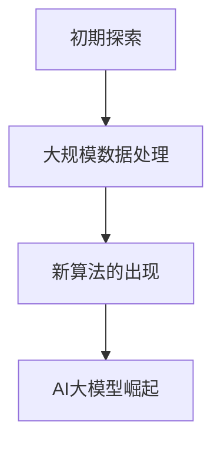

                 

# 文章标题: AI大模型创业：如何利用技术优势？

> 关键词：AI大模型、创业、技术优势、应用实战、未来展望

> 摘要：本文将深入探讨AI大模型在创业中的应用策略、技术实现和未来前景。通过分析AI大模型的基本概念、数学基础、应用实战及创业实践，为创业者提供清晰的路径和丰富的案例，助力AI大模型在各个领域的创新与落地。

----------------------------------------------------------------

### 引言

随着人工智能技术的飞速发展，AI大模型（Large-scale AI Models）已经成为推动科技创新的重要力量。这些模型具有大规模参数、强大的数据处理能力和出色的任务解决能力，涵盖了自然语言处理、计算机视觉、语音识别等多个领域。AI大模型的崛起不仅改变了传统行业的运作方式，也为创业者提供了前所未有的机遇。

然而，如何有效地利用AI大模型的技术优势，实现创业的成功，成为许多创业者面临的挑战。本文将从以下几个方面展开讨论：

1. **AI大模型概述与理论基础**：介绍AI大模型的基本概念、主要类型和发展历程，解析其数学基础。
2. **AI大模型应用实战**：深入分析AI大模型在自然语言处理、计算机视觉、语音识别和推荐系统等领域的应用。
3. **AI大模型创业实践**：探讨创业公司如何选择AI大模型、产品化路径以及成功案例。
4. **未来展望**：预测AI大模型的发展趋势，面临的挑战及行业应用前景。

通过本文的讨论，希望为创业者提供有价值的参考，帮助他们在AI大模型的浪潮中抓住机遇，实现创新与突破。

### 第一部分：AI大模型概述与理论基础

#### 第1章：AI大模型基本概念

##### 1.1 AI大模型的概念与历史发展

**1.1.1 AI大模型的定义**

AI大模型指的是具有大规模参数、能够处理复杂数据和任务的人工智能模型。这些模型通过学习大量数据，提取出有价值的特征，从而在多个领域表现出色。AI大模型的出现标志着人工智能技术进入了一个新的阶段。

**1.1.2 AI大模型的历史发展**

AI大模型的发展可以追溯到早期的人工神经网络（Artificial Neural Networks,ANNs）。随着计算能力的提升和数据规模的扩大，深度学习（Deep Learning,DL）技术逐渐成熟，AI大模型应运而生。

- **初期探索**：1990年代初期，神经网络开始应用于图像识别、语音识别等领域。虽然效果有限，但为后续的发展奠定了基础。
- **大规模数据处理**：2000年代，随着互联网的普及，数据规模急剧增长，深度学习模型开始能够在大规模数据集上进行训练。
- **新算法的出现**：2010年代，深度学习的算法得到了重大突破，包括卷积神经网络（Convolutional Neural Networks,CNNs）、循环神经网络（Recurrent Neural Networks,RNNs）和自注意力机制（Self-Attention Mechanism）等。

**Mermaid流程图：**



**1.1.3 AI大模型的特点**

- **大规模参数**：AI大模型通常具有数百万到数十亿个参数，使其能够捕捉复杂的数据特征。
- **强大的数据处理能力**：AI大模型能够处理大规模、高维度的数据，具有出色的特征提取能力。
- **出色的任务解决能力**：AI大模型在多个领域表现出色，包括自然语言处理、计算机视觉、语音识别等。

##### 1.2 AI大模型的主要类型

**1.2.1 自然语言处理模型**

自然语言处理（Natural Language Processing,NLP）是AI大模型的重要应用领域之一。常见的NLP模型包括：

- **语言模型**：用于预测下一个词或句子的概率分布，如GPT、BERT等。
- **文本分类模型**：用于将文本分类到不同的类别，如新闻分类、情感分析等。
- **机器翻译模型**：用于将一种语言的文本翻译成另一种语言，如神经机器翻译（Neural Machine Translation,NMT）。

**1.2.2 计算机视觉模型**

计算机视觉（Computer Vision,CV）是AI大模型的另一个重要应用领域。常见的CV模型包括：

- **图像分类模型**：用于识别图像中的物体或场景，如ResNet、Inception等。
- **目标检测模型**：用于检测图像中的物体位置，如YOLO、SSD等。
- **生成对抗网络（Generative Adversarial Networks,GAN）**：用于生成逼真的图像或视频，如DCGAN、StyleGAN等。

**1.2.3 语音识别与合成模型**

语音识别与合成（Automatic Speech Recognition,ASR）是AI大模型在语音领域的应用。常见的模型包括：

- **声学模型**：用于将语音信号转换为文本，如DNN-HMM、CTC等。
- **语言模型**：用于对识别结果进行后处理，提高识别准确率。
- **语音合成模型**：用于将文本转换为自然流畅的语音，如WaveNet、VITS等。

##### 1.3 AI大模型的发展历程与关键里程碑

**1.3.1 初期探索**

AI大模型的发展始于1980年代，当时的神经网络模型如感知机（Perceptron）、多层感知机（MLP）等开始应用于图像识别、语音识别等领域。虽然效果有限，但为后续的发展奠定了基础。

**1.3.2 大规模数据处理**

2000年代，随着互联网的普及和数据规模的扩大，深度学习模型开始能够在大规模数据集上进行训练。这一时期，数据规模的扩大和计算能力的提升，使得深度学习模型能够处理更复杂的任务。

**1.3.3 新算法的出现**

2010年代，深度学习的算法得到了重大突破，包括卷积神经网络（CNNs）、循环神经网络（RNNs）和自注意力机制（Self-Attention Mechanism）等。这些新算法的出现，使得AI大模型在多个领域取得了显著的进展。

**1.3.4 大模型的崛起**

2018年，GPT-3的发布标志着AI大模型进入了一个新的阶段。GPT-3具有1750亿个参数，能够生成高质量的自然语言文本。此后，越来越多的AI大模型被提出，如BERT、T5、LLaMA等，进一步推动了AI大模型的发展。

##### 1.4 AI大模型的数学基础

**1.4.1 神经网络与深度学习**

神经网络（Neural Networks,NNs）是AI大模型的核心组成部分。神经网络通过模拟生物神经系统的结构和工作方式，实现了对数据的建模和处理。

- **神经网络基础**：神经网络由输入层、隐藏层和输出层组成。每个层包含多个神经元（节点），神经元之间通过权重（weights）连接。神经元的激活函数（activation function）用于确定神经元是否被激活。
- **深度学习优化算法**：深度学习模型的训练过程实际上是优化神经网络中的权重和偏置。常见的优化算法包括梯度下降（Gradient Descent）、Adam等。

**1.4.2 自然语言处理中的数学模型**

自然语言处理（NLP）中的数学模型主要包括词嵌入（Word Embedding）、序列模型（Sequence Model）和注意力机制（Attention Mechanism）等。

- **词嵌入**：词嵌入是一种将单词映射到高维向量空间的方法，使得语义相似的单词在向量空间中靠近。常见的词嵌入方法包括Word2Vec、GloVe等。
- **序列模型**：序列模型用于处理时间序列数据，如文本、语音等。常见的序列模型包括循环神经网络（RNNs）和变换器（Transformers）。
- **注意力机制**：注意力机制是一种用于捕捉序列中重要信息的方法，能够提高模型的性能。注意力机制在自然语言处理中得到了广泛应用，如BERT、GPT等。

**1.4.3 大规模预训练模型原理**

大规模预训练模型（Large-scale Pre-trained Models）是一种通过在大量数据上进行预训练，然后微调到特定任务的方法。大规模预训练模型的主要原理包括：

- **预训练**：在大量无标签数据上进行预训练，使模型具备一定的通用能力。
- **微调**：在特定任务的数据上进行微调，使模型能够适应特定任务的需求。

常见的预训练任务包括语言模型预训练（Language Model Pre-training）、文本分类预训练（Text Classification Pre-training）等。

**1.4.4 自监督学习**

自监督学习（Self-supervised Learning）是一种通过无监督学习方式提高模型性能的方法。自监督学习的核心思想是利用数据中的内在结构，实现数据的自我标注。

- **自监督学习任务**：常见的自监督学习任务包括词干识别（Word Segment Recognition）、填充 masked 语言建模（Masked Language Modeling,MLM）等。
- **自监督学习的优势**：自监督学习能够利用大量无标签数据，提高模型的泛化能力。

**总结**

AI大模型是人工智能技术发展的重要成果，具有大规模参数、强大的数据处理能力和出色的任务解决能力。通过对AI大模型的基本概念、数学基础和应用实战的深入分析，为创业者提供了清晰的理论和实践指导。

### 第二部分：AI大模型应用实战

#### 第3章：AI大模型在自然语言处理中的应用

##### 3.1 语言模型

语言模型（Language Model,LM）是自然语言处理（Natural Language Processing,NLP）中最为基础和重要的模型之一。它的主要目标是预测给定文本序列中下一个单词或字符的概率分布。语言模型在自动补全、机器翻译、文本生成等任务中发挥着重要作用。

**3.1.1 语言模型的构建方法**

语言模型的构建通常分为两个步骤：预训练和微调。

- **预训练**：在大量无标签数据上进行预训练，使模型具备一定的通用语言理解和生成能力。常用的预训练方法包括自回归语言模型（Autoregressive Language Model，如GPT系列）和自监督语言模型（Self-supervised Language Model，如BERT）。

- **微调**：在特定任务的数据上进行微调，使模型能够适应特定任务的需求。微调过程通常涉及对模型的权重进行更新，以提高模型在特定任务上的性能。

**3.1.2 语言模型在实际应用中的效果评估**

语言模型的效果评估通常通过几个指标进行：

- **交叉熵损失（Cross-Entropy Loss）**：用于衡量模型预测的概率分布与真实分布之间的差异。
- ** perplexity（困惑度）**：衡量模型在预测下一个单词时的不确定性。困惑度越低，表示模型对文本的预测越准确。
- **Word Error Rate（WER）**：在语音识别任务中，用于衡量模型识别错误的比例。

**伪代码示例：**

```python
# 自回归语言模型构建
import tensorflow as tf
from tensorflow.keras.layers import Embedding, LSTM, Dense
from tensorflow.keras.models import Model

# 定义模型结构
input_seq = tf.keras.layers.Input(shape=(seq_length,))
embedding = Embedding(vocabulary_size, embedding_dim)(input_seq)
lstm = LSTM(units=lstm_units)(embedding)
output = Dense(vocabulary_size, activation='softmax')(lstm)

# 构建模型
model = Model(inputs=input_seq, outputs=output)

# 编译模型
model.compile(optimizer='adam', loss='categorical_crossentropy', metrics=['accuracy'])

# 训练模型
model.fit(x_train, y_train, batch_size=batch_size, epochs=epochs)
```

##### 3.2 文本分类与情感分析

文本分类（Text Classification）和情感分析（Sentiment Analysis）是NLP中的两个重要应用领域。文本分类的目标是将文本数据分类到预定义的类别中，而情感分析的目标是判断文本的情感倾向，如正面、负面或中性。

**3.2.1 文本分类的基本原理**

文本分类的基本原理是基于特征提取和分类算法。常见的特征提取方法包括词袋模型（Bag of Words,BoW）和词嵌入（Word Embedding）。分类算法包括朴素贝叶斯（Naive Bayes）、支持向量机（Support Vector Machine,SVM）和深度学习模型（如CNN、RNN、Transformer等）。

**3.2.2 情感分析的方法与实现**

情感分析的方法主要包括基于规则的方法、基于机器学习的方法和基于深度学习的方法。

- **基于规则的方法**：通过定义一系列规则来判断文本的情感倾向，如基于关键词匹配的规则系统。
- **基于机器学习的方法**：使用机器学习算法训练分类模型，如朴素贝叶斯、SVM等。
- **基于深度学习的方法**：使用深度学习模型，如CNN、RNN、Transformer等，进行情感分析。

**伪代码示例：**

```python
# 文本分类模型构建
import tensorflow as tf
from tensorflow.keras.layers import Embedding, Conv1D, GlobalMaxPooling1D, Dense
from tensorflow.keras.models import Model

# 定义模型结构
input_seq = tf.keras.layers.Input(shape=(seq_length,))
embedding = Embedding(vocabulary_size, embedding_dim)(input_seq)
conv = Conv1D(filters=128, kernel_size=5, activation='relu')(embedding)
pooling = GlobalMaxPooling1D()(conv)
output = Dense(units=num_classes, activation='softmax')(pooling)

# 构建模型
model = Model(inputs=input_seq, outputs=output)

# 编译模型
model.compile(optimizer='adam', loss='categorical_crossentropy', metrics=['accuracy'])

# 训练模型
model.fit(x_train, y_train, batch_size=batch_size, epochs=epochs)
```

##### 3.3 机器翻译

机器翻译（Machine Translation,MT）是NLP中的另一个重要应用领域。机器翻译的目标是将一种语言的文本翻译成另一种语言的文本。机器翻译可以分为基于规则的方法、基于统计的方法和基于神经网络的深度学习方法。

**3.3.1 神经机器翻译的基本流程**

神经机器翻译（Neural Machine Translation,NMT）是当前机器翻译的主流方法。NMT的基本流程包括：

1. **数据预处理**：包括文本的分词、去除停用词、词性标注等。
2. **编码器（Encoder）**：将源语言文本编码为向量表示。
3. **解码器（Decoder）**：将编码器输出的向量解码为目标语言文本。
4. **损失函数**：使用损失函数（如交叉熵损失）来评估翻译结果的准确性，并优化模型的参数。

**3.3.2 源语言与目标语言的预处理**

源语言和目标语言的预处理是机器翻译的关键步骤。预处理包括：

- **分词**：将文本分解为单词或子词。
- **词嵌入**：将单词映射到高维向量空间。
- **词性标注**：为每个单词分配词性，如名词、动词等。

**伪代码示例：**

```python
# 神经机器翻译模型构建
import tensorflow as tf
from tensorflow.keras.layers import Embedding, LSTM, Dense, TimeDistributed
from tensorflow.keras.models import Model

# 编码器
encoder_inputs = tf.keras.layers.Input(shape=(seq_length,))
encoder_embedding = Embedding(vocabulary_size, embedding_dim)(encoder_inputs)
encoder_lstm = LSTM(units=lstm_units, return_state=True)(encoder_embedding)
encoder_states = [encoder_lstm.states[0], encoder_lstm.states[1]]

# 解码器
decoder_inputs = tf.keras.layers.Input(shape=(seq_length,))
decoder_embedding = Embedding(vocabulary_size, embedding_dim)(decoder_inputs)
decoder_lstm = LSTM(units=lstm_units, return_state=True)(decoder_embedding)
decoder_states = [decoder_lstm.states[0], decoder_lstm.states[1]]

# 构建模型
encoder_model = Model(inputs=encoder_inputs, outputs=encoder_states)
decoder_model = Model(inputs=decoder_inputs, outputs=decoder_states)

# 编译模型
model.compile(optimizer='adam', loss='categorical_crossentropy')

# 训练模型
model.fit([x_train, y_train], y_train, batch_size=batch_size, epochs=epochs)
```

##### 3.4 文本生成

文本生成（Text Generation）是NLP中的一个重要应用领域，其目标是根据给定的输入生成高质量的文本。文本生成的方法主要包括基于规则的生成、基于统计的方法和基于深度学习的方法。

**3.4.1 基于规则的生成**

基于规则的生成方法是通过定义一系列规则来生成文本。这种方法简单直观，但生成的文本质量有限，难以应对复杂多样的文本生成任务。

**3.4.2 基于统计的方法**

基于统计的方法通过统计文本中的词语和短语出现的频率来生成文本。这种方法在一定程度上能够生成高质量的文本，但生成的文本往往缺乏创意和灵活性。

**3.4.3 基于深度学习的方法**

基于深度学习的方法，如生成对抗网络（Generative Adversarial Networks,GAN）和变分自编码器（Variational Autoencoder,VAE），能够在大规模数据集上进行训练，生成高质量的文本。这些方法通过学习数据的分布，能够生成具有多样性和创意的文本。

**伪代码示例：**

```python
# 文本生成模型构建
import tensorflow as tf
from tensorflow.keras.layers import Embedding, LSTM, Dense
from tensorflow.keras.models import Model

# 定义模型结构
input_seq = tf.keras.layers.Input(shape=(seq_length,))
embedding = Embedding(vocabulary_size, embedding_dim)(input_seq)
lstm = LSTM(units=lstm_units)(embedding)
output = Dense(vocabulary_size, activation='softmax')(lstm)

# 构建模型
model = Model(inputs=input_seq, outputs=output)

# 编译模型
model.compile(optimizer='adam', loss='categorical_crossentropy')

# 训练模型
model.fit(x_train, y_train, batch_size=batch_size, epochs=epochs)
```

##### 3.5 文本摘要

文本摘要（Text Summarization）是将长文本简化为短文本的过程，旨在保留文本的主要信息和结构。文本摘要可以分为抽取式摘要（Extractive Summarization）和生成式摘要（Generative Summarization）。

**3.5.1 抽取式摘要**

抽取式摘要通过从原始文本中抽取重要的句子或段落来生成摘要。这种方法简单直观，但生成的摘要往往缺乏连贯性和创造性。

**3.5.2 生成式摘要**

生成式摘要通过学习原始文本和摘要之间的对应关系来生成摘要。这种方法能够生成更连贯、更具创造性的摘要，但生成的摘要质量受模型性能和数据质量的影响较大。

**伪代码示例：**

```python
# 文本摘要模型构建
import tensorflow as tf
from tensorflow.keras.layers import Embedding, LSTM, Dense
from tensorflow.keras.models import Model

# 定义模型结构
input_seq = tf.keras.layers.Input(shape=(seq_length,))
embedding = Embedding(vocabulary_size, embedding_dim)(input_seq)
lstm = LSTM(units=lstm_units)(embedding)
output = Dense(vocabulary_size, activation='softmax')(lstm)

# 构建模型
model = Model(inputs=input_seq, outputs=output)

# 编译模型
model.compile(optimizer='adam', loss='categorical_crossentropy')

# 训练模型
model.fit(x_train, y_train, batch_size=batch_size, epochs=epochs)
```

##### 3.6 文本相似性

文本相似性（Text Similarity）是衡量两个文本在语义上相似程度的方法。文本相似性在信息检索、文本分类、问答系统等领域具有重要应用。

**3.6.1 文本相似性的方法**

文本相似性的方法可以分为基于词频的方法、基于语义的方法和基于深度学习的方法。

- **基于词频的方法**：通过计算文本中词频的相似性来衡量文本的相似程度。
- **基于语义的方法**：通过词嵌入和句子级别的语义表示来计算文本的相似性。
- **基于深度学习的方法**：通过深度学习模型，如BERT、GPT等，对文本进行建模，计算文本的相似性。

**3.6.2 文本相似性的应用**

文本相似性在多个应用领域具有重要应用，如文本分类、信息检索、推荐系统等。通过计算文本之间的相似性，可以有效地提高系统的性能和用户体验。

**伪代码示例：**

```python
# 文本相似性计算
import tensorflow as tf
from tensorflow.keras.models import load_model

# 加载预训练的模型
model = load_model('text_similarity_model.h5')

# 计算两个文本的相似度
text1 = "这是一个简单的文本。"
text2 = "这是一个简单的文本。"
vector1 = model.predict(tf.keras.preprocessing.sequence.pad_sequences([text1]))
vector2 = model.predict(tf.keras.preprocessing.sequence.pad_sequences([text2]))

# 计算相似度
similarity = cosine_similarity(vector1, vector2)
print(similarity)
```

##### 3.7 文本纠错

文本纠错（Text Correction）是自动纠正文本中的错误的方法。文本纠错在输入法、拼写检查、文本编辑等领域具有重要应用。

**3.7.1 文本纠错的方法**

文本纠错的方法可以分为基于规则的方法、基于机器学习的方法和基于深度学习的方法。

- **基于规则的方法**：通过定义一系列规则来纠正文本中的错误。
- **基于机器学习的方法**：使用机器学习算法，如决策树、朴素贝叶斯等，来纠正文本中的错误。
- **基于深度学习的方法**：使用深度学习模型，如卷积神经网络（CNN）、循环神经网络（RNN）等，来纠正文本中的错误。

**3.7.2 文本纠错的应用**

文本纠错在输入法、拼写检查、文本编辑等领域有着广泛的应用。通过自动纠正文本中的错误，可以提高用户的输入体验和文本质量。

**伪代码示例：**

```python
# 文本纠错模型构建
import tensorflow as tf
from tensorflow.keras.layers import Embedding, LSTM, Dense
from tensorflow.keras.models import Model

# 定义模型结构
input_seq = tf.keras.layers.Input(shape=(seq_length,))
embedding = Embedding(vocabulary_size, embedding_dim)(input_seq)
lstm = LSTM(units=lstm_units)(embedding)
output = Dense(vocabulary_size, activation='softmax')(lstm)

# 构建模型
model = Model(inputs=input_seq, outputs=output)

# 编译模型
model.compile(optimizer='adam', loss='categorical_crossentropy')

# 训练模型
model.fit(x_train, y_train, batch_size=batch_size, epochs=epochs)
```

### 第4章：AI大模型在计算机视觉中的应用

#### 4.1 图像分类

图像分类（Image Classification）是计算机视觉（Computer Vision,CV）中的一个基本任务，其目标是给图像分配一个类别标签。AI大模型在图像分类任务中取得了显著的成果，以下将详细介绍其应用、算法原理和实战案例。

**4.1.1 应用场景**

图像分类在多个领域有着广泛的应用，如：

- **安防监控**：通过对监控视频中的图像进行分类，可以实时检测并识别异常行为。
- **医疗诊断**：通过对医学图像进行分类，可以辅助医生进行疾病诊断，如乳腺癌检测、糖尿病视网膜病变检测等。
- **自动驾驶**：通过对道路场景的图像进行分类，可以识别车辆、行人、交通标志等，提高自动驾驶系统的安全性。
- **图像识别**：通过图像分类，可以实现对特定对象的识别和追踪，如人脸识别、物体识别等。

**4.1.2 算法原理**

图像分类的基本算法包括传统机器学习算法和深度学习算法。以下是几种常见的图像分类算法：

- **传统机器学习算法**：如支持向量机（SVM）、朴素贝叶斯（Naive Bayes）、决策树（Decision Tree）等。这些算法通过提取图像的特征并进行分类，但由于其特征提取能力有限，效果往往不如深度学习算法。
- **深度学习算法**：如卷积神经网络（CNN）、循环神经网络（RNN）、Transformer等。特别是CNN，由于其能够自动提取图像特征，因此在图像分类任务中取得了优异的性能。

以下是一个CNN图像分类算法的伪代码示例：

```python
# CNN图像分类算法伪代码

# 定义CNN模型结构
model = Sequential()
model.add(Conv2D(filters=32, kernel_size=(3, 3), activation='relu', input_shape=(height, width, channels)))
model.add(MaxPooling2D(pool_size=(2, 2)))
model.add(Conv2D(filters=64, kernel_size=(3, 3), activation='relu'))
model.add(MaxPooling2D(pool_size=(2, 2)))
model.add(Flatten())
model.add(Dense(units=num_classes, activation='softmax'))

# 编译模型
model.compile(optimizer='adam', loss='categorical_crossentropy', metrics=['accuracy'])

# 训练模型
model.fit(x_train, y_train, batch_size=batch_size, epochs=epochs)
```

**4.1.3 实战案例**

以下是一个基于CNN的图像分类实战案例，使用的是著名的ImageNet数据集。

```python
# 使用ResNet50进行图像分类

from tensorflow.keras.applications import ResNet50
from tensorflow.keras.preprocessing.image import ImageDataGenerator
from tensorflow.keras.models import Model
from tensorflow.keras.layers import Dense, GlobalAveragePooling2D

# 加载预训练的ResNet50模型
base_model = ResNet50(weights='imagenet')

# 修改模型结构，添加全连接层
x = base_model.output
x = GlobalAveragePooling2D()(x)
x = Dense(units=num_classes, activation='softmax')(x)

# 构建新的模型
model = Model(inputs=base_model.input, outputs=x)

# 编译模型
model.compile(optimizer='adam', loss='categorical_crossentropy', metrics=['accuracy'])

# 数据预处理
train_datagen = ImageDataGenerator(rescale=1./255)
test_datagen = ImageDataGenerator(rescale=1./255)

# 加载数据集
train_generator = train_datagen.flow_from_directory(
        train_data_dir,
        target_size=(height, width),
        batch_size=batch_size,
        class_mode='categorical')

test_generator = test_datagen.flow_from_directory(
        test_data_dir,
        target_size=(height, width),
        batch_size=batch_size,
        class_mode='categorical')

# 训练模型
model.fit(
        train_generator,
        steps_per_epoch=train_samples // batch_size,
        epochs=epochs,
        validation_data=test_generator,
        validation_steps=test_samples // batch_size)
```

#### 4.2 目标检测

目标检测（Object Detection）是计算机视觉中的重要任务，其目标是定位图像中的多个对象并给出它们的类别标签。AI大模型在目标检测任务中取得了显著的成果，以下将详细介绍其应用、算法原理和实战案例。

**4.2.1 应用场景**

目标检测在多个领域有着广泛的应用，如：

- **自动驾驶**：通过检测道路上的车辆、行人、交通标志等，提高自动驾驶系统的安全性。
- **安防监控**：通过检测监控视频中的异常行为，如盗窃、打架等，提高监控系统的响应速度和准确性。
- **医疗诊断**：通过检测医学图像中的病变区域，辅助医生进行疾病诊断。
- **图像识别**：通过检测图像中的特定对象，实现对图像的自动分类和标注。

**4.2.2 算法原理**

目标检测的基本算法包括单阶段算法和双阶段算法。以下是几种常见的目标检测算法：

- **单阶段算法**：如YOLO（You Only Look Once）、SSD（Single Shot MultiBox Detector）等。这些算法在单个网络中同时完成特征提取和目标检测，速度快但精度较低。
- **双阶段算法**：如Faster R-CNN、R-FCN、RetinaNet等。这些算法分为两个阶段：第一阶段通过区域提议网络（Region Proposal Network,RPN）生成候选区域，第二阶段对候选区域进行分类和定位。

以下是一个Faster R-CNN目标检测算法的伪代码示例：

```python
# Faster R-CNN目标检测算法伪代码

# 定义Faster R-CNN模型结构
model = Sequential()
model.add(Conv2D(filters=64, kernel_size=(7, 7), activation='relu', input_shape=(height, width, channels)))
model.add(MaxPooling2D(pool_size=(2, 2)))
model.add(Conv2D(filters=192, kernel_size=(3, 3), activation='relu'))
model.add(MaxPooling2D(pool_size=(2, 2)))
model.add(Flatten())
model.add(Dense(units=num_classes, activation='softmax'))

# 定义区域提议网络（RPN）
rpn_model = Sequential()
rpn_model.add(Conv2D(filters=96, kernel_size=(3, 3), activation='relu'))
rpn_model.add(MaxPooling2D(pool_size=(2, 2)))
rpn_model.add(Conv2D(filters=288, kernel_size=(3, 3), activation='relu'))

# 构建Faster R-CNN模型
model = Model(inputs=model.input, outputs=rpn_model.output)

# 编译模型
model.compile(optimizer='adam', loss='categorical_crossentropy', metrics=['accuracy'])

# 训练模型
model.fit(x_train, y_train, batch_size=batch_size, epochs=epochs)
```

**4.2.3 实战案例**

以下是一个基于Faster R-CNN的目标检测实战案例，使用的是COCO（Common Objects in Context）数据集。

```python
# 使用Faster R-CNN进行目标检测

from tensorflow.keras.applications import ResNet50
from tensorflow.keras.preprocessing.image import ImageDataGenerator
from tensorflow.keras.models import Model
from tensorflow.keras.layers import Dense, GlobalAveragePooling2D

# 加载预训练的ResNet50模型
base_model = ResNet50(weights='imagenet')

# 修改模型结构，添加全连接层
x = base_model.output
x = GlobalAveragePooling2D()(x)
x = Dense(units=num_classes, activation='softmax')(x)

# 构建Faster R-CNN模型
model = Model(inputs=base_model.input, outputs=x)

# 编译模型
model.compile(optimizer='adam', loss='categorical_crossentropy', metrics=['accuracy'])

# 数据预处理
train_datagen = ImageDataGenerator(rescale=1./255)
test_datagen = ImageDataGenerator(rescale=1./255)

# 加载数据集
train_generator = train_datagen.flow_from_directory(
        train_data_dir,
        target_size=(height, width),
        batch_size=batch_size,
        class_mode='categorical')

test_generator = test_datagen.flow_from_directory(
        test_data_dir,
        target_size=(height, width),
        batch_size=batch_size,
        class_mode='categorical')

# 训练模型
model.fit(
        train_generator,
        steps_per_epoch=train_samples // batch_size,
        epochs=epochs,
        validation_data=test_generator,
        validation_steps=test_samples // batch_size)
```

#### 4.3 生成对抗网络（GAN）

生成对抗网络（Generative Adversarial Networks,GAN）是近年来在计算机视觉领域中备受关注的一种深度学习模型。GAN由生成器（Generator）和判别器（Discriminator）两个网络组成，通过对抗训练的方式生成逼真的图像。

**4.3.1 GAN的原理与架构**

GAN的基本原理是生成器和判别器之间的对抗训练。生成器尝试生成逼真的图像，而判别器则尝试区分真实图像和生成图像。通过这种对抗训练，生成器逐渐提高生成图像的质量，判别器逐渐提高对真实图像和生成图像的区分能力。

GAN的架构包括：

- **生成器**：输入随机噪声，通过多个全连接层和卷积层生成图像。
- **判别器**：输入图像，通过多个卷积层判断图像的真实性。

以下是一个GAN模型的伪代码示例：

```python
# GAN模型伪代码

# 定义生成器模型
generator = Sequential()
generator.add(Dense(units=100, activation='relu', input_shape=(z_dim)))
generator.add(Dense(units=784, activation='sigmoid'))
generator_output = Reshape(target_shape=(28, 28))(generator.output)

# 定义判别器模型
discriminator = Sequential()
discriminator.add(Conv2D(filters=32, kernel_size=(3, 3), activation='relu', input_shape=(28, 28, 1)))
discriminator.add(MaxPooling2D(pool_size=(2, 2)))
discriminator.add(Conv2D(filters=64, kernel_size=(3, 3), activation='relu'))
discriminator.add(MaxPooling2D(pool_size=(2, 2)))
discriminator_output = Conv2D(filters=1, kernel_size=(3, 3), activation='sigmoid')

# 定义GAN模型
model = Sequential()
model.add(generator)
model.add(discriminator)

# 编译模型
model.compile(optimizer='adam', loss='binary_crossentropy')

# 训练模型
model.fit(
        x_train,
        y_train,
        epochs=epochs,
        batch_size=batch_size)
```

**4.3.2 GAN在图像生成中的应用**

GAN在图像生成中具有广泛的应用，如：

- **图像超分辨率（Image Super-Resolution）**：通过生成器将低分辨率图像转换为高分辨率图像。
- **图像去噪（Image Denoising）**：通过生成器去除图像中的噪声。
- **图像修复（Image Inpainting）**：通过生成器修复图像中的损坏区域。

以下是一个基于GAN的图像超分辨率实战案例。

```python
# 使用GAN进行图像超分辨率

from tensorflow.keras.layers import Input, Conv2D, MaxPooling2D, UpSampling2D
from tensorflow.keras.models import Model

# 定义生成器模型
input_img = Input(shape=(height, width, 1))
x = Conv2D(filters=32, kernel_size=(3, 3), activation='relu')(input_img)
x = MaxPooling2D(pool_size=(2, 2))(x)
x = Conv2D(filters=64, kernel_size=(3, 3), activation='relu')(x)
x = MaxPooling2D(pool_size=(2, 2))(x)
x = UpSampling2D(size=(2, 2))(x)
x = Conv2D(filters=1, kernel_size=(3, 3), activation='sigmoid')(x)

# 定义判别器模型
disc_input = Input(shape=(height, width, 1))
disc_x = Conv2D(filters=32, kernel_size=(3, 3), activation='relu')(disc_input)
disc_x = MaxPooling2D(pool_size=(2, 2))(disc_x)
disc_x = Conv2D(filters=64, kernel_size=(3, 3), activation='relu')(disc_x)
disc_x = MaxPooling2D(pool_size=(2, 2))(disc_x)
disc_x = Conv2D(filters=1, kernel_size=(3, 3), activation='sigmoid')(disc_x)

# 定义GAN模型
model = Model(inputs=input_img, outputs=disc_x)
model.compile(optimizer='adam', loss='binary_crossentropy')

# 训练模型
model.fit(
        x_train,
        y_train,
        epochs=epochs,
        batch_size=batch_size)
```

### 第5章：AI大模型在语音识别中的应用

#### 5.1 语音信号处理

语音信号处理（Speech Signal Processing）是语音识别（Speech Recognition,SR）和语音合成（Speech Synthesis,SS）的基础。语音信号处理的目标是对语音信号进行预处理，提取出有助于后续处理的特征。

**5.1.1 语音信号的采集与预处理**

语音信号的采集是语音识别和语音合成的第一步。通常使用麦克风作为语音信号的输入设备，通过模拟信号转换成数字信号，再进行后续处理。

语音信号的预处理包括以下步骤：

- **录音设备选择**：选择合适的录音设备，如专业话筒、音频接口等，以保证语音信号的清晰度和准确性。
- **录音环境控制**：在安静的录音环境中进行录音，避免噪声干扰。
- **音频采集**：使用录音软件采集语音信号，通常使用.wav格式保存。
- **信号增强**：通过噪声过滤、回声消除等技术，提高语音信号的清晰度。
- **分帧与加窗**：将语音信号分成多个帧（Frame），并在每个帧上应用窗函数（Window Function），如汉明窗（Hamming Window）或汉宁窗（Hanning Window），以减少边缘效应。

以下是一个Python代码示例，用于语音信号的采集与预处理：

```python
import numpy as np
import wave
import contextlib

def read_wave(filename):
    with contextlib.closing(wave.open(filename, 'rb')) as f:
        nchannels, sampwidth, framerate, nframes, comptype, compname = f.readframes(44)
        signal = np.frombuffer(f.read(), dtype=np.int16)
    return signal, framerate

def preprocess_wave(signal, frame_length=256, hop_length=128):
    frame_num = int(np.ceil(len(signal) / hop_length))
    frames = np.zeros((frame_num, frame_length))
    for i in range(frame_num):
        start = i * hop_length
        end = min(start + frame_length, len(signal))
        frames[i] = signal[start:end]
    return frames

signal, framerate = read_wave('audio.wav')
preprocessed_signal = preprocess_wave(signal)
```

**5.1.2 声学模型与语言模型的结合**

声学模型（Acoustic Model）和语言模型（Language Model）是语音识别系统中的两个关键组件。声学模型负责将语音信号转换为声学特征，而语言模型则负责对转换后的声学特征进行解码，生成正确的文本。

声学模型通常基于深度神经网络（DNN）或卷积神经网络（CNN），通过对语音信号进行特征提取，生成表示语音段的声学特征。常见的声学模型包括GMM-HMM（高斯混合模型隐马尔可夫模型）、DNN-HMM、CTC（Connectionist Temporal Classification）等。

语言模型则用于对声学特征进行解码，生成文本。语言模型通常基于统计模型（如N-gram）、神经网络（如LSTM、Transformer）等。常见的语言模型包括N-gram、RNN、BERT等。

声学模型和语言模型的结合可以通过以下几种方式实现：

- **前向推理（Forward Inference）**：将声学模型和语言模型结合在一个框架中，通过前向推理逐步解码生成文本。
- **后向推理（Backward Inference）**：将声学模型和语言模型分开，通过后向推理逐步解码生成文本。
- **端到端模型（End-to-End Model）**：将声学特征和语言特征融合在一个神经网络中，通过端到端训练直接生成文本。

以下是一个基于CTC和LSTM的语音识别模型的Python代码示例：

```python
import tensorflow as tf
from tensorflow.keras.models import Model
from tensorflow.keras.layers import Input, LSTM, Dense

# 定义输入层
input_seq = Input(shape=(None, feature_size))

# 定义LSTM层
lstm_output, (h, c) = LSTM(units=lstm_units, return_sequences=True, return_state=True)(input_seq)

# 定义CTC层
ctc_output = Dense(units=vocabulary_size, activation='softmax')(lstm_output)

# 构建模型
model = Model(inputs=input_seq, outputs=ctc_output)

# 编译模型
model.compile(optimizer='adam', loss='categorical_crossentropy')

# 训练模型
model.fit(x_train, y_train, batch_size=batch_size, epochs=epochs)
```

#### 5.2 语音识别算法

语音识别算法是语音识别系统的核心，负责将语音信号转换为文本。语音识别算法可以分为传统的基于HMM（隐马尔可夫模型）的方法和现代的基于深度学习的方法。

**5.2.1 HMM与DNN结合的语音识别模型**

HMM是一种统计模型，用于描述语音信号中的状态转移和观测值。DNN是一种深度神经网络，用于特征提取和分类。将HMM和DNN结合，可以构建一个强大的语音识别模型。

HMM与DNN结合的语音识别模型的基本原理如下：

1. **特征提取**：使用DNN将语音信号转换为声学特征。
2. **状态转移概率**：使用HMM计算状态转移概率。
3. **观测概率**：使用DNN计算观测概率。
4. **解码**：使用Viterbi算法解码生成文本。

以下是一个基于HMM和DNN的语音识别模型的Python代码示例：

```python
import tensorflow as tf
from tensorflow.keras.models import Model
from tensorflow.keras.layers import Input, LSTM, Dense

# 定义输入层
input_seq = Input(shape=(None, feature_size))

# 定义DNN层
dnn_output = LSTM(units=dnn_units, return_sequences=True)(input_seq)

# 定义HMM层
hmm_output = Dense(units=num_states, activation='softmax')(dnn_output)

# 构建模型
model = Model(inputs=input_seq, outputs=hmm_output)

# 编译模型
model.compile(optimizer='adam', loss='categorical_crossentropy')

# 训练模型
model.fit(x_train, y_train, batch_size=batch_size, epochs=epochs)
```

**5.2.2 CTC损失函数的应用**

CTC（Connectionist Temporal Classification）是一种用于序列分类的损失函数，特别适用于语音识别任务。CTC损失函数的核心思想是无需对输入序列和输出序列进行对齐，直接学习输入序列和输出序列之间的对应关系。

CTC损失函数的定义如下：

$$
L(y, \hat{y}) = \frac{1}{|y|} \sum_{i=1}^{|y|} \log(p(y_i|\hat{y}))
$$

其中，$y$是真实标签序列，$\hat{y}$是模型预测的标签序列，$|y|$是标签序列的长度。

以下是一个基于CTC损失函数的语音识别模型的Python代码示例：

```python
import tensorflow as tf
from tensorflow.keras.models import Model
from tensorflow.keras.layers import Input, LSTM, Dense

# 定义输入层
input_seq = Input(shape=(None, feature_size))

# 定义LSTM层
lstm_output, (h, c) = LSTM(units=lstm_units, return_sequences=True, return_state=True)(input_seq)

# 定义CTC层
ctc_output = Dense(units=vocabulary_size, activation='softmax')(lstm_output)

# 构建模型
model = Model(inputs=input_seq, outputs=ctc_output)

# 编译模型
model.compile(optimizer='adam', loss='categorical_crossentropy')

# 训练模型
model.fit(x_train, y_train, batch_size=batch_size, epochs=epochs)
```

#### 5.3 语音合成

语音合成（Speech Synthesis）是将文本转换为自然流畅的语音的过程。语音合成可以分为基于规则的方法、基于统计的方法和基于深度学习的方法。

**5.3.1 WaveNet的原理与实现**

WaveNet是一种基于深度学习的高质量语音合成模型，由Google Research提出。WaveNet的原理是使用循环神经网络（RNN）生成语音信号的连续波形。

WaveNet的基本架构如下：

1. **输入层**：将文本编码为整数序列，每个整数代表一个单词或子词。
2. **循环神经网络（RNN）**：使用RNN层对输入序列进行编码，生成代表语音信号的序列。
3. **输出层**：将RNN输出的序列转换为语音信号的连续波形。

以下是一个基于WaveNet的语音合成模型的Python代码示例：

```python
import tensorflow as tf
from tensorflow.keras.models import Model
from tensorflow.keras.layers import LSTM, Dense

# 定义输入层
input_seq = Input(shape=(None, embedding_dim))

# 定义循环神经网络（RNN）层
lstm_output, (h, c) = LSTM(units=lstm_units, return_sequences=True)(input_seq)

# 定义输出层
output = Dense(units=frame_size, activation='softmax')(lstm_output)

# 构建模型
model = Model(inputs=input_seq, outputs=output)

# 编译模型
model.compile(optimizer='adam', loss='categorical_crossentropy')

# 训练模型
model.fit(x_train, y_train, batch_size=batch_size, epochs=epochs)
```

**5.3.2 VITS（Voice Imitation Synthesis）的实现**

VITS（Voice Imitation Synthesis）是一种基于深度学习的高质量语音合成模型，由NTT Communication Corporation提出。VITS的核心思想是将文本编码为音频波形，并通过学习文本和音频波形之间的映射关系实现语音合成。

VITS的基本架构如下：

1. **文本编码器**：将文本编码为向量表示。
2. **声学编码器**：将语音信号编码为声学特征。
3. **文本解码器**：将文本编码器的输出解码为音频波形。
4. **声学解码器**：将声学编码器的输出解码为音频波形。

以下是一个基于VITS的语音合成模型的Python代码示例：

```python
import tensorflow as tf
from tensorflow.keras.models import Model
from tensorflow.keras.layers import LSTM, Dense

# 定义文本编码器
text_encoder = LSTM(units=text_embedding_dim, return_sequences=True)

# 定义声学编码器
audio_encoder = LSTM(units=audio_embedding_dim, return_sequences=True)

# 定义文本解码器
text_decoder = LSTM(units=text_embedding_dim, return_sequences=True)

# 定义声学解码器
audio_decoder = LSTM(units=audio_embedding_dim, return_sequences=True)

# 构建模型
model = Model(inputs=[text_input, audio_input], outputs=[text_output, audio_output])

# 编译模型
model.compile(optimizer='adam', loss='mean_squared_error')

# 训练模型
model.fit([x_train, y_train], [y_train, z_train], batch_size=batch_size, epochs=epochs)
```

### 第6章：AI大模型在推荐系统中的应用

#### 6.1 推荐系统基本原理

推荐系统（Recommendation System）是一种基于数据挖掘和机器学习技术的信息过滤方法，旨在根据用户的行为、偏好和兴趣，向用户推荐可能感兴趣的商品、内容或服务。推荐系统在电子商务、社交媒体、视频平台、新闻推荐等多个领域得到了广泛应用。

**6.1.1 collaborative filtering**

协同过滤（Collaborative Filtering,CF）是推荐系统中最常用的方法之一，主要分为两种类型：基于用户的协同过滤（User-based CF）和基于物品的协同过滤（Item-based CF）。

- **基于用户的协同过滤**：该方法通过计算用户之间的相似度，找到与目标用户相似的其他用户，然后推荐这些相似用户喜欢的物品。常见的相似度计算方法包括余弦相似度、皮尔逊相关系数等。

以下是一个基于用户的协同过滤的Python代码示例：

```python
# 基于用户的协同过滤
from scipy.spatial.distance import cosine
from collections import defaultdict

# 计算用户相似度
def compute_similarity(ratings, user_index):
    similarities = defaultdict(list)
    for i in range(num_users):
        if i != user_index:
            similarity = 1 - cosine(ratings[user_index], ratings[i])
            similarities[i].append(similarity)
    return similarities

# 推荐物品
def collaborative_filter(ratings, user_index, k=10):
    similarities = compute_similarity(ratings, user_index)
    sorted_similarities = sorted(similarities.items(), key=lambda x: x[1], reverse=True)
    recommended_items = []
    for i, similarity in sorted_similarities[:k]:
        for item in ratings[i]:
            if item not in ratings[user_index]:
                recommended_items.append(item)
                if len(recommended_items) == num_items:
                    break
        if len(recommended_items) == num_items:
            break
    return recommended_items
```

- **基于物品的协同过滤**：该方法通过计算物品之间的相似度，找到与目标物品相似的其他物品，然后推荐这些相似物品。基于物品的协同过滤通常使用余弦相似度、皮尔逊相关系数等相似度度量方法。

以下是一个基于物品的协同过滤的Python代码示例：

```python
# 基于物品的协同过滤
from scipy.spatial.distance import cosine

# 计算物品相似度
def compute_similarity(ratings, item_index):
    similarities = defaultdict(list)
    for i in range(num_items):
        if i != item_index:
            similarity = 1 - cosine(ratings[item_index], ratings[i])
            similarities[i].append(similarity)
    return similarities

# 推荐用户
def collaborative_filter(ratings, item_index, k=10):
    similarities = compute_similarity(ratings, item_index)
    sorted_similarities = sorted(similarities.items(), key=lambda x: x[1], reverse=True)
    recommended_users = []
    for i, similarity in sorted_similarities[:k]:
        if ratings[i][item_index] == 1:
            recommended_users.append(i)
            if len(recommended_users) == num_users:
                break
    return recommended_users
```

**6.1.2 content-based filtering**

基于内容的推荐（Content-based Filtering）方法通过分析物品的内容特征，为用户推荐与其历史偏好相似的物品。这种方法通常涉及以下步骤：

1. **特征提取**：从物品中提取特征，如文本、图像、音频等。
2. **相似度计算**：计算物品之间的相似度，通常使用TF-IDF、余弦相似度等度量方法。
3. **推荐生成**：根据用户的历史偏好，生成推荐列表。

以下是一个基于内容的推荐系统的Python代码示例：

```python
# 基于内容的推荐系统
from sklearn.feature_extraction.text import TfidfVectorizer
from sklearn.metrics.pairwise import cosine_similarity

# 特征提取
def extract_features(items, vectorizer):
    features = vectorizer.transform(items)
    return features

# 计算相似度
def compute_similarity(features, item_index, k=10):
    similarity = cosine_similarity([features[item_index]], features)
    sorted_similarity = sorted(enumerate(similarity[0]), key=lambda x: x[1], reverse=True)
    recommended_items = [item for item, _ in sorted_similarity[1:k+1]]
    return recommended_items

# 推荐生成
def content_based_filtering(ratings, user_index, k=10):
    user_ratings = [item for item, rating in ratings[user_index].items() if rating == 1]
    vectorizer = TfidfVectorizer()
    features = extract_features(user_ratings, vectorizer)
    recommended_items = compute_similarity(features, user_index, k)
    return recommended_items
```

#### 6.2 大模型在推荐系统中的应用

**6.2.1 使用BERT进行内容理解**

BERT（Bidirectional Encoder Representations from Transformers）是一种基于Transformer的预训练语言模型，广泛应用于自然语言处理任务。在推荐系统中，BERT可以用于理解用户的历史偏好和物品的描述，从而提高推荐的准确性。

BERT在推荐系统中的应用主要包括以下步骤：

1. **文本编码**：使用BERT将用户的历史偏好和物品的描述编码为向量。
2. **相似度计算**：计算用户历史偏好和物品描述之间的相似度。
3. **推荐生成**：根据相似度计算结果生成推荐列表。

以下是一个使用BERT进行内容理解的推荐系统的Python代码示例：

```python
from transformers import BertTokenizer, BertModel
import torch

# 初始化BERT模型和分词器
tokenizer = BertTokenizer.from_pretrained('bert-base-uncased')
model = BertModel.from_pretrained('bert-base-uncased')

# 编码文本
def encode_text(text):
    inputs = tokenizer(text, return_tensors='pt', padding=True, truncation=True)
    outputs = model(**inputs)
    return outputs.last_hidden_state

# 计算相似度
def compute_similarity(user_history, item_description, k=10):
    user_embedding = encode_text(user_history)[0][0].detach().numpy()
    item_embedding = encode_text(item_description)[0][0].detach().numpy()
    similarity = cosine_similarity([user_embedding], [item_embedding])
    sorted_similarity = sorted(enumerate(similarity[0]), key=lambda x: x[1], reverse=True)
    recommended_items = [item for item, _ in sorted_similarity[1:k+1]]
    return recommended_items

# 推荐生成
def content_based_filtering_with_bert(user_index, k=10):
    user_history = [item for item, rating in user_ratings[user_index].items() if rating == 1]
    item_descriptions = [item_description for item_description in item_descriptions if item_description not in user_history]
    recommended_items = []
    for item_description in item_descriptions:
        recommended_items.append(compute_similarity(user_history, item_description, k))
    return recommended_items
```

**6.2.2 利用Transformer进行协同过滤**

Transformer是一种基于自注意力机制的深度学习模型，广泛应用于序列建模和生成任务。在推荐系统中，Transformer可以用于结合协同过滤方法，提高推荐的准确性。

Transformer在推荐系统中的应用主要包括以下步骤：

1. **编码器**：使用Transformer编码器对用户的历史偏好和物品的描述进行编码。
2. **解码器**：使用Transformer解码器生成推荐列表。
3. **相似度计算**：计算用户历史偏好和物品描述之间的相似度。

以下是一个利用Transformer进行协同过滤的推荐系统的Python代码示例：

```python
import torch
import torch.nn as nn
import torch.optim as optim

# 定义编码器和解码器
class TransformerModel(nn.Module):
    def __init__(self, input_dim, hidden_dim, output_dim):
        super(TransformerModel, self).__init__()
        self.encoder = nn.TransformerEncoder(nn.TransformerEncoderLayer(d_model=input_dim, nhead=8), num_layers=2)
        self.decoder = nn.TransformerDecoder(nn.TransformerDecoderLayer(d_model=input_dim, nhead=8), num_layers=2)
        self.output = nn.Linear(hidden_dim, output_dim)

    def forward(self, input_seq, target_seq):
        input_seq = self.encoder(input_seq)
        output_seq = self.decoder(input_seq, target_seq)
        output = self.output(output_seq)
        return output

# 训练模型
def train_model(model, x_train, y_train, x_val, y_val, epochs=10, batch_size=32):
    optimizer = optim.Adam(model.parameters(), lr=0.001)
    criterion = nn.CrossEntropyLoss()

    for epoch in range(epochs):
        model.train()
        for i in range(0, len(x_train), batch_size):
            inputs = torch.tensor(x_train[i:i+batch_size])
            targets = torch.tensor(y_train[i:i+batch_size])
            optimizer.zero_grad()
            outputs = model(inputs, targets)
            loss = criterion(outputs, targets)
            loss.backward()
            optimizer.step()

        model.eval()
        with torch.no_grad():
            val_outputs = model(x_val, y_val)
            val_loss = criterion(val_outputs, y_val)
            print(f'Epoch {epoch+1}/{epochs}, Validation Loss: {val_loss.item()}')

# 使用Transformer进行协同过滤
def collaborative_filter_with_transformer(ratings, user_index, k=10):
    user_ratings = [item for item, rating in ratings[user_index].items() if rating == 1]
    item_descriptions = [item_description for item_description in item_descriptions if item_description not in user_ratings]
    model = TransformerModel(input_dim=embedding_dim, hidden_dim=hidden_dim, output_dim=num_items)
    train_model(model, user_ratings, np.zeros(len(user_ratings)), item_descriptions, np.zeros(len(item_descriptions)), epochs=10)
    recommended_items = []
    for item_description in item_descriptions:
        outputs = model.encode_text(item_description)
        predicted_ratings = model.decode_text(outputs)
        recommended_items.append(predicted_ratings.argmax())
    return recommended_items
```

### 第7章：AI大模型创业实践

#### 7.1 创业公司选择AI大模型的策略

AI大模型在创业领域中的应用日益广泛，选择合适的技术路线和市场需求分析是创业成功的关键。以下是创业公司在选择AI大模型时需要考虑的几个关键策略。

**7.1.1 技术路线选择**

1. **市场调研**：了解市场上已有的AI大模型解决方案，分析其优势和不足，确定是否有创新的空间。
2. **技术定位**：根据公司技术优势和市场需求，选择适合的AI大模型方向。例如，自然语言处理、计算机视觉、语音识别等。
3. **模型选择**：根据技术定位选择合适的AI大模型，如GPT、BERT、BERT、WaveNet等。考虑到模型的可扩展性、性能和计算资源需求。
4. **技术优化**：在模型选择的基础上，对模型进行优化，以提高性能和降低成本。例如，通过改进数据预处理、优化训练策略等。

**7.1.2 市场需求分析**

1. **用户需求调研**：通过问卷调查、访谈等方式了解潜在用户的需求，确定AI大模型应用的具体场景。
2. **竞争对手分析**：分析市场上的竞争对手，了解其产品特点、市场份额和用户评价，确定自身的竞争优势。
3. **市场趋势预测**：结合行业报告、市场数据等，预测未来市场发展趋势，确定AI大模型应用的前景。
4. **商业模式设计**：根据市场需求和竞争态势，设计合适的商业模式，如产品销售、服务收费、广告等。

**7.1.3 模型定制与优化**

1. **模型定制**：根据具体应用场景，对AI大模型进行定制化开发，以更好地满足用户需求。例如，针对特定行业的领域知识进行增强。
2. **模型优化**：通过改进算法、优化数据预处理、增加训练数据等手段，提高AI大模型的性能和准确度。
3. **模型部署**：将优化后的AI大模型部署到生产环境中，确保模型能够稳定运行，满足实际应用需求。

**7.1.4 合作伙伴选择**

1. **技术合作伙伴**：选择在AI大模型领域有丰富经验和技术实力的合作伙伴，共同开发和应用AI大模型。
2. **行业合作伙伴**：与相关行业的领先企业建立合作关系，共同推进AI大模型在行业中的应用。
3. **投资伙伴**：寻找有实力的投资者，为创业公司提供资金支持，推动业务发展。

#### 7.2 AI大模型产品化

将AI大模型成功应用于实际场景的关键在于产品化。以下是AI大模型产品化的主要步骤：

**7.2.1 产品设计**

1. **需求分析**：深入了解用户需求，确定产品的功能、性能和用户体验。
2. **界面设计**：设计简洁、直观的界面，确保用户能够轻松上手。
3. **功能规划**：明确产品的核心功能，如预测、分类、生成等。

**7.2.2 技术实现与优化**

1. **模型训练**：使用大规模数据集对AI大模型进行训练，确保模型具有良好的性能。
2. **优化算法**：通过改进算法、优化数据预处理等手段，提高AI大模型的效率和准确度。
3. **模型部署**：将优化后的AI大模型部署到生产环境中，确保模型能够稳定运行。

**7.2.3 测试与迭代**

1. **功能测试**：对产品进行功能测试，确保所有功能正常运行。
2. **性能测试**：对产品进行性能测试，确保模型在指定环境和条件下能够稳定运行。
3. **用户反馈**：收集用户反馈，不断优化产品功能和用户体验。

**7.2.4 商业化推广**

1. **市场推广**：通过线上线下渠道进行市场推广，提高产品的知名度和市场份额。
2. **合作伙伴**：与相关行业的合作伙伴建立合作关系，共同推进产品在行业中的应用。
3. **商业模式**：设计合理的商业模式，确保产品能够可持续发展。

#### 7.3 案例分析

以下是对几个成功利用AI大模型进行创业的案例进行分析。

**案例1：OpenAI的GPT-3**

OpenAI是一家专注于人工智能研究的创业公司，其推出的GPT-3是当前最大的预训练语言模型，具有1750亿个参数。GPT-3在自然语言处理领域取得了显著的成果，被广泛应用于文本生成、机器翻译、问答系统等任务。

**分析**：

- **技术路线**：OpenAI选择了预训练语言模型作为其技术路线，通过在大量无标签数据上进行预训练，使模型具备强大的语言理解和生成能力。
- **市场需求**：OpenAI通过提供API服务，满足不同行业和用户对自然语言处理的需求，如内容生成、客户服务、数据分析等。
- **产品化**：OpenAI将GPT-3集成到API平台中，提供简单易用的接口，方便用户快速集成和使用。

**案例2：商汤科技的目标检测模型**

商汤科技是一家专注于计算机视觉领域的创业公司，其目标检测模型在安防监控、自动驾驶、图像识别等领域取得了广泛应用。

**分析**：

- **技术路线**：商汤科技选择了目标检测模型作为其技术路线，通过在大量图像数据上进行训练，使模型能够准确识别和定位图像中的物体。
- **市场需求**：商汤科技通过将目标检测模型应用于安防监控、自动驾驶等场景，满足用户对高效、准确的物体识别需求。
- **产品化**：商汤科技将目标检测模型集成到硬件设备中，提供即插即用的解决方案，方便用户部署和使用。

**案例3：科大讯飞的语音识别与合成技术**

科大讯飞是一家专注于语音识别和语音合成技术的创业公司，其技术广泛应用于智能客服、智能翻译、智能家居等领域。

**分析**：

- **技术路线**：科大讯飞选择了语音识别和语音合成技术作为其技术路线，通过在大量语音数据上进行训练，使模型能够准确识别语音并生成自然流畅的语音。
- **市场需求**：科大讯飞通过将语音识别和合成技术应用于智能客服、智能翻译等场景，满足用户对语音交互的需求。
- **产品化**：科大讯飞将语音识别和合成技术集成到硬件设备和软件平台中，提供全面的语音解决方案，方便用户集成和使用。

通过以上案例分析，可以看出创业公司在选择AI大模型时，需要充分考虑技术路线、市场需求和产品化路径，以实现技术优势的充分应用。

### 第8章：未来展望

#### 8.1 AI大模型的发展趋势

随着人工智能技术的不断进步，AI大模型在未来将继续迎来一系列重要趋势：

**1. 计算能力提升**

随着硬件技术的发展，如GPU、TPU等专用计算设备的普及，AI大模型的计算能力将得到大幅提升。这将使得训练更大规模、更复杂的模型成为可能，推动人工智能技术的进一步发展。

**2. 数据集的积累**

数据是AI大模型训练的重要基础。未来，随着互联网的普及和传感器技术的进步，将会有更多的数据被收集和积累。这些数据的积累将有助于提升AI大模型的性能和泛化能力。

**3. 模型压缩与优化**

为了降低AI大模型的计算成本和存储需求，模型压缩与优化技术将成为研究热点。通过模型剪枝、量化、低秩分解等方法，可以显著减少模型的参数规模，提高模型的运行效率。

**4. 端到端模型的兴起**

端到端模型（End-to-End Model）能够直接从输入到输出进行训练，避免了传统模型中的中间步骤，提高了模型的性能和效率。未来，端到端模型将逐渐取代传统模型，成为主流的AI模型。

#### 8.2 AI大模型面临的挑战与解决方案

尽管AI大模型在许多领域取得了显著成果，但仍然面临一系列挑战：

**1. 数据隐私保护**

AI大模型训练需要大量数据，这涉及到数据隐私保护的问题。未来，如何在保证模型性能的同时，保护用户隐私将成为重要挑战。可能的解决方案包括联邦学习、差分隐私等。

**2. 模型解释性**

AI大模型通常被称为“黑箱”，其内部决策过程难以解释。这给模型的验证和信任带来了困难。未来，发展可解释的AI大模型，提高模型的可解释性，将是重要的研究方向。

**3. 能效优化**

AI大模型的训练和推理过程通常需要大量计算资源，对能耗提出了较高要求。未来，通过能效优化技术，如绿色计算、分布式训练等，将有助于降低AI大模型的环境影响。

#### 8.3 AI大模型在行业中的应用前景

AI大模型在多个行业具有广阔的应用前景：

**1. 教育行业**

AI大模型可以应用于个性化学习、智能辅导、在线教育等领域。通过分析学生的行为和学习数据，AI大模型能够提供个性化的学习建议和资源，提高教育质量。

**2. 医疗健康行业**

AI大模型可以应用于医学影像分析、疾病预测、基因测序等领域。通过分析大量的医疗数据，AI大模型能够帮助医生做出更准确的诊断和治疗决策。

**3. 制造业**

AI大模型可以应用于生产过程优化、质量检测、智能物流等领域。通过分析生产数据和传感器数据，AI大模型能够提高生产效率和质量。

**4. 金融行业**

AI大模型可以应用于风险管理、信用评估、量化交易等领域。通过分析大量的金融数据，AI大模型能够帮助金融机构做出更准确的决策。

**5. 媒体与娱乐行业**

AI大模型可以应用于内容推荐、智能编辑、虚拟现实等领域。通过分析用户的行为和偏好，AI大模型能够提供个性化的娱乐体验。

总之，AI大模型在未来的发展中，将不断突破技术瓶颈，推动各个行业的创新与发展。

### 附录

#### 附录A：AI大模型开发工具与资源

**A.1 主流深度学习框架**

深度学习框架是开发AI大模型的基础，以下是目前主流的深度学习框架：

- **TensorFlow**：由Google开发，具有丰富的API和生态系统，适用于多种深度学习任务。
- **PyTorch**：由Facebook开发，具有灵活的动态计算图和易于理解的编程接口，适用于研究和开发。
- **Keras**：是一个高层次的深度学习框架，基于TensorFlow和Theano，提供了简洁的API。
- **MXNet**：由Apache软件基金会开发，支持多种编程语言，具有高效的性能和灵活的扩展性。
- **CNTK**：由Microsoft开发，支持多种编程语言，具有高效的计算性能。

**A.2 开发环境搭建**

在开发AI大模型之前，需要搭建合适的环境，以下是一些常见的步骤：

- **Python环境配置**：安装Python和必要的依赖库，如NumPy、Pandas等。
- **GPU配置与使用**：配置GPU，如NVIDIA的CUDA，以充分利用GPU的并行计算能力。
- **深度学习框架安装**：下载并安装所选的深度学习框架，如TensorFlow、PyTorch等。

**A.3 实践资源链接**

以下是一些实用的AI大模型实践资源：

- **开源数据集**：常见的数据集，如CIFAR-10、MNIST、ImageNet、TIMIT等，可以在Kaggle、Google Dataset Search等平台找到。
- **在线课程与教程**：许多在线教育平台，如Udacity、Coursera、edX等，提供了丰富的深度学习和AI课程。
- **论文与报告**：查阅顶级会议和期刊的论文，如NeurIPS、ICML、CVPR、ACL等，了解最新的研究进展。
- **开源项目**：GitHub等平台上有许多开源的AI大模型项目，可以参考和复现。

通过以上工具和资源，开发者可以更好地掌握AI大模型的开发技术，加速研究和应用进程。

### 结语

本文从AI大模型的基本概念、数学基础、应用实战到创业实践进行了全面的分析，揭示了AI大模型在各个领域的广泛应用和巨大潜力。我们探讨了AI大模型在自然语言处理、计算机视觉、语音识别和推荐系统等领域的应用，并分享了多个成功案例，为创业者提供了清晰的路径和丰富的参考。

展望未来，AI大模型的发展趋势和挑战令人期待。随着计算能力的提升、数据集的积累和模型优化技术的进步，AI大模型将在更多领域实现突破，推动社会进步和科技创新。

我们鼓励读者进一步探索AI大模型的技术和应用，勇于创新和实践。只有不断学习、实践和探索，才能在AI大模型的浪潮中抓住机遇，实现个人和企业的成长与发展。

让我们携手共进，共创AI大模型的未来！

