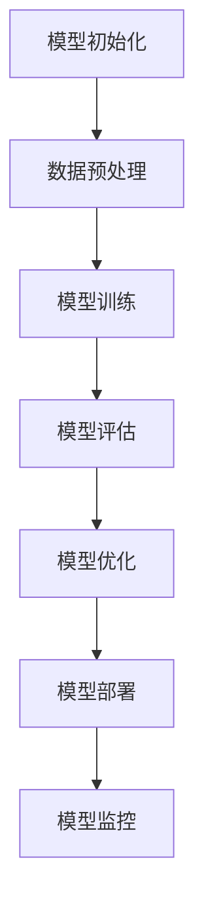
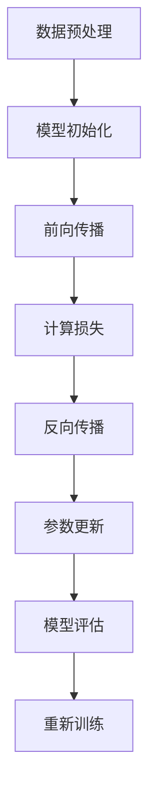

                 

# AI 大模型创业：如何利用文化优势？

> 关键词：AI大模型、文化优势、创业策略、技术原理、市场推广

> 摘要：本文旨在探讨AI大模型创业中的文化优势，通过分析文化因素在AI大模型创业中的重要性、核心技术原理、成功案例以及创业实践中的具体策略，为创业者提供有价值的参考和指导。本文将详细解读AI大模型的基础知识，阐述其核心算法原理，分析创业环境与资源准备，以及市场推广与运营策略。同时，本文还将探讨AI大模型创业的未来展望，帮助创业者抓住机遇，应对挑战。

## 第1章：AI大模型概述与文化背景

### 1.1.1 AI大模型的基础概念

AI大模型（Large-scale Artificial Intelligence Models）是指具有巨大参数量和复杂结构的深度学习模型。这些模型通过学习大量的数据来提取特征和模式，从而实现高度自动化的任务。常见的AI大模型包括Transformer、BERT、GPT等。

AI大模型的发展历程可以追溯到20世纪80年代，当时神经网络（Neural Networks）的研究逐渐兴起。随着计算能力的提升和大数据时代的到来，AI大模型的研究和应用得到了迅猛发展。特别是深度学习（Deep Learning）的突破，使得AI大模型在图像识别、自然语言处理、语音识别等领域取得了显著的成果。

### 1.1.2 文化优势与AI大模型创业的关系

文化优势在AI大模型创业中具有重要意义。文化是指一个社会或群体的共同价值观、信仰、习俗和生活方式。文化优势可以帮助创业者在创业过程中建立独特的品牌形象、吸引目标用户、提升产品竞争力。

首先，文化优势有助于差异化竞争。在激烈的市场竞争中，拥有独特文化优势的创业项目能够脱颖而出，吸引更多的用户和投资者。例如，中国的AI公司可以通过融入中国文化元素，打造具有中国特色的AI产品，从而在国内外市场上获得竞争优势。

其次，文化优势有助于品牌建设。文化是一种无形的资产，良好的品牌形象可以增强用户的忠诚度和信任感，提高产品的市场认可度。创业者可以通过文化优势来塑造品牌形象，提升品牌价值。

最后，文化优势有助于团队凝聚力和创新能力的提升。文化可以作为一种共同的语言和价值观，促进团队成员之间的沟通和协作，激发创新思维，推动项目的成功。

### 1.1.3 文化元素的融入与建模

文化元素的融入与建模是AI大模型创业的关键步骤。以下是一些具体的方法：

1. **文化数据采集与处理**：创业者需要收集与目标市场相关的文化数据，如语言、习俗、风俗等。这些数据可以通过在线调查、社交媒体数据挖掘、实地考察等方式获取。在获取数据后，创业者需要对数据进行清洗、标注和整合，以便于模型训练。

2. **文化元素在大模型中的表示与训练**：将文化元素表示为向量或张量，并将其融入AI大模型中。这可以通过嵌入层（Embedding Layer）或注意力机制（Attention Mechanism）实现。例如，在自然语言处理任务中，可以使用词嵌入（Word Embedding）技术将词汇表示为向量，然后在模型训练过程中，利用这些向量来学习词汇之间的关系。

3. **文化驱动的模型优化**：通过对文化数据的深入分析，创业者可以识别出与文化相关的特征和模式。这些特征和模式可以用于优化AI大模型的参数，提高模型的准确性和鲁棒性。

### 1.1.4 案例分析：谷歌BERT模型

谷歌BERT（Bidirectional Encoder Representations from Transformers）是一种基于Transformer的预训练语言模型，它在自然语言处理任务中取得了显著的成果。BERT的成功部分归功于其对文化元素的融入与建模。

BERT采用了双向编码器（Bidirectional Encoder）来学习文本中的上下文信息。通过在训练过程中考虑词的左侧和右侧上下文，BERT能够更好地理解词汇的含义和语境。这种双向学习机制使得BERT在处理多语言文本时具有很高的准确性。

此外，BERT在训练过程中使用了大量的多语言语料库，包括英文、中文、法语等。通过这些语料库，BERT能够学习到不同语言之间的差异和共性，从而提高模型的跨语言能力。

BERT的成功表明，文化优势在AI大模型创业中具有重要作用。通过融入文化元素，创业者可以打造具有竞争力的AI产品，满足不同市场需求。

## 第2章：AI大模型核心技术原理

### 2.1 大模型的核心算法原理

AI大模型的核心算法主要包括循环神经网络（RNN）、卷积神经网络（CNN）和生成对抗网络（GAN）。

#### 2.1.1 循环神经网络（RNN）

RNN是一种能够处理序列数据的神经网络，其核心思想是将当前输入与前一时刻的隐藏状态进行连接。RNN通过回忆机制（Recall Mechanism）来处理长序列数据，但在实际应用中存在梯度消失和梯度爆炸等问题。

#### 2.1.2 卷积神经网络（CNN）

CNN是一种专门用于图像处理的神经网络，其核心思想是通过卷积操作和池化操作来提取图像特征。CNN在图像分类、目标检测和图像生成等领域取得了显著的成果。

#### 2.1.3 生成对抗网络（GAN）

GAN是一种由生成器和判别器组成的对抗性神经网络。生成器试图生成逼真的数据，而判别器则尝试区分生成器和真实数据。通过这种对抗性训练，GAN能够生成高质量的图像、音频和视频。

### 2.2 数学模型与算法解释

#### 2.2.1 深度学习中的数学基础

深度学习中的数学基础主要包括线性代数、概率论和优化理论。

- **线性代数**：矩阵运算、向量运算、特征值和特征向量等。
- **概率论**：概率分布、随机变量、条件概率和期望值等。
- **优化理论**：梯度下降、动量法、随机梯度下降（SGD）等。

#### 2.2.2 损失函数与优化算法

损失函数是衡量模型预测结果与真实结果之间差异的指标。常见的损失函数包括均方误差（MSE）、交叉熵损失（Cross-Entropy Loss）等。

优化算法用于最小化损失函数，常见的优化算法包括梯度下降（Gradient Descent）、Adam优化器等。

### 2.3 Mermaid流程图：AI大模型架构



#### 模型训练流程

1. **模型初始化**：初始化模型参数。
2. **数据预处理**：对数据进行清洗、归一化等处理。
3. **模型训练**：通过反向传播算法更新模型参数。
4. **模型评估**：使用验证集评估模型性能。
5. **模型优化**：根据评估结果调整模型参数。
6. **模型部署**：将训练好的模型部署到生产环境。
7. **模型监控**：监控模型在运行过程中的性能和稳定性。

#### 模型推理流程

1. **模型初始化**：加载训练好的模型参数。
2. **数据预处理**：对输入数据进行预处理。
3. **模型推理**：使用模型对输入数据进行预测。
4. **结果输出**：输出预测结果。

## 第3章：AI大模型创业案例研究

### 3.1 成功的AI大模型创业案例

#### 3.1.1 案例介绍

案例一：OpenAI的GPT-3模型

OpenAI是一家专注于人工智能研究的公司，其开发的GPT-3（Generative Pre-trained Transformer 3）模型是全球最大的预训练语言模型。GPT-3具有1750亿个参数，能够实现自然语言生成、文本摘要、机器翻译等功能。

#### 3.1.2 案例分析

GPT-3的成功得益于以下几个方面的优势：

1. **大规模预训练**：GPT-3采用了大规模预训练技术，通过在大量文本数据上进行训练，模型具有丰富的语言知识和表达能力。
2. **高效的计算架构**：OpenAI使用了分布式计算和GPU加速技术，提高了模型的训练速度和推理性能。
3. **文化元素的融入**：GPT-3在训练过程中使用了来自不同国家和地区的文本数据，使得模型在跨语言和跨文化应用中具有很高的准确性。

#### 3.1.3 文化驱动的创业策略

1. **多元化数据集**：OpenAI在数据采集过程中注重多样性，不仅包括英语文本，还包括其他多种语言的文本。这使得GPT-3在跨语言和跨文化应用中具有更强的适应性。
2. **文化敏感性**：OpenAI在开发GPT-3时，注重尊重不同文化背景的用户，避免在生成内容中出现歧视、偏见等问题。

### 3.2 文化驱动的创业策略

#### 3.2.1 文化差异化策略

文化差异化策略是指通过融入当地文化元素，打造具有特色和差异化的AI产品。以下是一些具体的策略：

1. **文化元素融入产品设计**：在AI产品中融入当地的文化元素，如图形、颜色、语言等，提升产品的吸引力。
2. **本地化内容生成**：针对不同地区的用户需求，生成符合当地文化习惯的内容。

#### 3.2.2 文化融合策略

文化融合策略是指在不同文化背景下，将多种文化元素进行融合，打造具有普遍适用性的AI产品。以下是一些具体的策略：

1. **跨文化交流**：通过跨文化交流，吸收不同文化的优点，打造具有全球竞争力的AI产品。
2. **文化包容性设计**：在AI产品设计过程中，注重文化包容性，尊重不同文化背景的用户需求。

### 3.3 创业过程中的挑战与应对

#### 3.3.1 技术挑战

1. **模型训练与优化**：AI大模型的训练和优化需要大量的计算资源和时间。创业者需要找到合适的计算架构和优化算法，提高训练效率。
2. **数据集质量**：高质量的数据集对于AI大模型的表现至关重要。创业者需要投入大量精力来收集、清洗和标注数据。

#### 3.3.2 市场挑战

1. **竞争激烈**：AI大模型领域竞争激烈，创业者需要具备独特的竞争优势，才能在市场中脱颖而出。
2. **用户接受度**：AI大模型产品需要得到用户的认可和接受，创业者需要通过市场推广和用户教育来提高产品的市场认可度。

#### 3.3.3 文化冲突与解决

1. **文化差异**：在不同文化背景下，用户的需求和行为可能存在差异。创业者需要了解并尊重不同文化背景的用户需求，避免文化冲突。
2. **文化适应性**：创业者需要具备跨文化适应能力，根据不同文化背景调整产品设计和推广策略。

## 第4章：创业环境与资源准备

### 4.1 创业环境的分析

#### 4.1.1 政策环境

政策环境对于AI大模型创业具有重要意义。政府对于人工智能的重视和支持，可以为创业者提供良好的发展环境。以下是一些具体的政策环境：

1. **资金支持**：政府可以通过设立专项资金、提供税收优惠等方式，支持AI大模型创业项目。
2. **人才培养**：政府可以加大对人工智能人才的培养力度，提高人才供给。
3. **监管政策**：政府可以制定明确的监管政策，规范AI大模型的发展和应用。

#### 4.1.2 技术环境

技术环境对于AI大模型创业至关重要。以下是一些具体的技术环境：

1. **计算能力提升**：随着计算能力的提升，AI大模型的训练和推理效率得到显著提高。
2. **数据资源丰富**：互联网的普及和数据技术的发展，使得创业者可以获取到丰富的数据资源。
3. **开源技术生态**：开源技术的快速发展，为创业者提供了丰富的技术资源和工具。

#### 4.1.3 市场环境

市场环境对于AI大模型创业具有重要影响。以下是一些具体的市场环境：

1. **市场需求增长**：随着人工智能技术的普及，市场需求不断增长，为创业者提供了广阔的市场空间。
2. **行业竞争加剧**：AI大模型领域的竞争日益激烈，创业者需要具备独特的竞争优势。
3. **用户教育**：用户对于AI大模型产品的认知和接受程度有待提高，创业者需要通过市场推广和用户教育来提高产品的市场认可度。

### 4.2 资源准备与整合

#### 4.2.1 技术资源

创业者需要准备充足的技术资源，包括计算资源、数据资源和人才资源。以下是一些具体的建议：

1. **计算资源**：创业者可以租用云服务器或购买高性能计算设备，以满足模型训练和推理的需求。
2. **数据资源**：创业者可以通过公开数据集、购买数据或自行采集数据来获取丰富的数据资源。
3. **人才资源**：创业者可以招聘专业的技术人才，包括数据科学家、算法工程师、产品经理等。

#### 4.2.2 人力资源

人力资源是创业成功的关键因素。以下是一些具体的人力资源策略：

1. **团队组建**：创业者需要组建一个具有多元化技能的团队，确保项目能够顺利进行。
2. **人才培养与激励**：创业者需要注重人才培养和激励，提高团队凝聚力和创新能力。
3. **招聘渠道**：创业者可以通过校园招聘、社会招聘、猎头服务等多种渠道招聘人才。

#### 4.2.3 资金资源

资金资源是创业过程中不可或缺的资源。以下是一些具体的资金资源策略：

1. **天使投资**：创业者可以寻求天使投资，获得启动资金。
2. **风险投资**：创业者可以申请风险投资，获得更多的资金支持。
3. **众筹**：创业者可以通过众筹平台筹集资金，验证产品的市场需求。

### 4.3 创业团队的组建与运营

#### 4.3.1 团队成员的角色与职责

创业团队的成员通常包括以下角色：

1. **创始人**：负责整体战略规划和团队管理。
2. **产品经理**：负责产品规划和设计。
3. **数据科学家**：负责模型开发和优化。
4. **算法工程师**：负责算法研究和实现。
5. **运维工程师**：负责系统部署和维护。
6. **市场营销人员**：负责市场推广和用户运营。

#### 4.3.2 团队协作与沟通

团队协作和沟通对于创业成功至关重要。以下是一些具体的团队协作与沟通策略：

1. **定期会议**：团队应定期召开会议，讨论项目进展、问题解决方案和下一步计划。
2. **协作工具**：团队应使用协作工具，如Slack、Trello、Jira等，提高工作效率。
3. **知识共享**：团队应建立知识共享机制，确保团队成员能够快速获取所需的信息和资源。
4. **积极沟通**：团队应鼓励成员之间积极沟通，解决冲突，提高团队凝聚力。

## 第5章：产品设计与开发

### 5.1 产品设计流程

#### 5.1.1 需求分析

需求分析是产品设计的第一步，旨在明确用户需求、市场趋势和产品功能。以下是一些具体的需求分析方法：

1. **用户调研**：通过访谈、问卷调查等方式收集用户需求。
2. **市场分析**：分析竞争对手的产品特点、市场定位和用户反馈。
3. **需求文档**：撰写需求文档，明确产品功能、性能和用户体验要求。

#### 5.1.2 产品规划

产品规划是制定产品发展路线图的过程。以下是一些具体的产品规划方法：

1. **愿景与使命**：明确产品的愿景和使命，确保产品规划与公司战略相符。
2. **市场定位**：确定产品的市场定位，包括目标用户、竞争对手和市场策略。
3. **产品路线图**：制定产品开发路线图，明确各阶段目标和时间表。

#### 5.1.3 用户界面设计

用户界面设计是产品设计中至关重要的环节。以下是一些具体的用户界面设计方法：

1. **原型设计**：通过线框图、原型工具等设计产品原型。
2. **交互设计**：设计产品的交互逻辑和用户操作流程。
3. **视觉设计**：设计产品的视觉元素，包括颜色、图标、字体等。

### 5.2 AI大模型产品开发

#### 5.2.1 数据收集与预处理

数据收集与预处理是AI大模型产品开发的基础。以下是一些具体的方法：

1. **数据采集**：通过公开数据集、购买数据或自行采集数据。
2. **数据清洗**：去除无效数据、缺失数据和异常值。
3. **数据标注**：对数据进行分类、标签和注释。
4. **数据整合**：将不同来源的数据进行整合，构建高质量的数据集。

#### 5.2.2 模型训练与优化

模型训练与优化是AI大模型产品开发的核心。以下是一些具体的方法：

1. **模型选择**：根据任务特点选择合适的模型结构。
2. **数据预处理**：对训练数据进行预处理，包括归一化、标准化和嵌入等。
3. **模型训练**：使用训练数据和优化算法训练模型。
4. **模型优化**：通过交叉验证和超参数调整优化模型性能。

#### 5.2.3 产品部署与维护

产品部署与维护是确保产品稳定运行的重要环节。以下是一些具体的方法：

1. **模型部署**：将训练好的模型部署到生产环境中，实现实时推理。
2. **系统监控**：监控系统性能和模型推理结果，及时发现和解决问题。
3. **产品升级**：根据用户反馈和市场变化，不断优化和升级产品。

### 5.3 源代码详细解读与分析

#### 5.3.1 开发环境搭建

在开发AI大模型产品时，需要搭建合适的环境，包括操作系统、编程语言、框架和工具等。以下是一些具体的步骤：

1. **操作系统**：选择Linux或MacOS作为开发环境。
2. **编程语言**：选择Python作为主要编程语言。
3. **框架**：选择TensorFlow、PyTorch等流行的深度学习框架。
4. **工具**：使用Jupyter Notebook、Visual Studio Code等开发工具。

#### 5.3.2 源代码详细实现

以下是一个简单的AI大模型源代码实现示例：

```python
import tensorflow as tf

# 模型定义
model = tf.keras.Sequential([
    tf.keras.layers.Dense(128, activation='relu', input_shape=(784,)),
    tf.keras.layers.Dense(10, activation='softmax')
])

# 模型编译
model.compile(optimizer='adam',
              loss='categorical_crossentropy',
              metrics=['accuracy'])

# 模型训练
model.fit(x_train, y_train, batch_size=128, epochs=10)

# 模型评估
model.evaluate(x_test, y_test)
```

#### 5.3.3 代码解读与分析

1. **模型定义**：使用`tf.keras.Sequential`定义一个序列模型，包括一个全连接层（Dense Layer）和一个输出层。
2. **模型编译**：设置优化器、损失函数和评估指标，为模型训练做准备。
3. **模型训练**：使用训练数据训练模型，设置批量大小和训练轮数。
4. **模型评估**：使用测试数据评估模型性能。

通过以上步骤，可以完成一个简单的AI大模型产品的开发。在实际项目中，代码会根据具体任务和需求进行相应的调整和优化。

## 第6章：市场推广与运营策略

### 6.1 市场推广策略

市场推广是AI大模型创业成功的关键环节。以下是一些具体的市场推广策略：

#### 6.1.1 品牌建设

品牌建设是市场推广的基础。以下是一些具体的品牌建设策略：

1. **品牌定位**：明确产品的市场定位和目标用户，确保品牌形象与用户需求相符。
2. **品牌传播**：通过广告、公关活动、社交媒体等渠道传播品牌形象，提高品牌知名度。
3. **品牌塑造**：注重用户体验和口碑传播，提升品牌美誉度。

#### 6.1.2 渠道拓展

渠道拓展是市场推广的重要手段。以下是一些具体的渠道拓展策略：

1. **线上渠道**：利用官方网站、社交媒体、搜索引擎等线上渠道进行推广。
2. **线下渠道**：参加行业展会、论坛等活动，与潜在客户面对面交流。
3. **合作伙伴**：寻找与产品互补的合作伙伴，共同拓展市场。

#### 6.1.3 营销活动策划

营销活动策划是市场推广的核心。以下是一些具体的营销活动策划策略：

1. **内容营销**：通过博客、白皮书、案例研究等高质量内容吸引潜在客户。
2. **活动营销**：举办线上或线下活动，如研讨会、讲座、发布会等，提高产品曝光度。
3. **优惠促销**：提供限时优惠、折扣等促销活动，刺激用户购买。

### 6.2 运营数据分析

运营数据分析是确保AI大模型产品稳定运行的重要手段。以下是一些具体的运营数据分析策略：

#### 6.2.1 用户数据分析

用户数据分析是了解用户需求和行为的重要途径。以下是一些具体的用户数据分析方法：

1. **用户行为分析**：通过分析用户登录、使用、退出等行为数据，了解用户的使用习惯和偏好。
2. **用户留存分析**：通过分析用户留存率、活跃度等指标，了解产品的用户黏性和市场竞争力。
3. **用户满意度分析**：通过用户反馈、问卷调查等方式，了解用户对产品的满意度。

#### 6.2.2 业务数据分析

业务数据分析是评估产品性能和业务增长的重要手段。以下是一些具体的业务数据分析方法：

1. **流量分析**：通过分析网站流量、下载量等指标，了解产品的市场曝光度和用户访问量。
2. **转化率分析**：通过分析用户的转化路径、转化率等指标，了解产品的用户购买行为。
3. **业务指标分析**：通过分析业务指标，如收入、成本、利润等，了解产品的盈利能力和市场表现。

### 6.3 持续优化与迭代

持续优化与迭代是确保AI大模型产品持续竞争力的关键。以下是一些具体的持续优化与迭代策略：

#### 6.3.1 产品迭代策略

1. **需求反馈**：及时收集用户反馈，了解用户需求和问题，指导产品迭代。
2. **功能优化**：根据用户反馈和业务数据，持续优化产品功能和用户体验。
3. **性能优化**：通过技术优化和算法改进，提高产品性能和稳定性。

#### 6.3.2 用户反馈处理

1. **用户反馈收集**：建立用户反馈渠道，如客服、论坛、社交媒体等，收集用户反馈。
2. **用户反馈分析**：对用户反馈进行分析，识别问题根源和改进方向。
3. **问题解决**：针对用户反馈的问题，制定解决方案，及时解决用户问题。

#### 6.3.3 持续改进与优化

1. **定期评估**：定期评估产品性能和用户满意度，识别改进方向。
2. **持续学习**：关注行业动态和技术发展，不断学习新技术和新方法，持续优化产品。
3. **用户教育**：通过用户教育，提高用户对产品的认知和接受程度，提升用户黏性。

## 第7章：AI大模型创业的未来展望

### 7.1 行业发展趋势

AI大模型创业的未来发展将受到以下趋势的影响：

#### 7.1.1 技术发展趋势

1. **算法优化**：随着算法研究的深入，AI大模型的算法将不断优化，提高模型性能和效率。
2. **计算能力提升**：随着硬件技术的发展，计算能力将得到大幅提升，为AI大模型的训练和推理提供更强大的支持。
3. **数据资源丰富**：随着数据采集和存储技术的发展，数据资源将越来越丰富，为AI大模型的研究和应用提供更多数据支持。

#### 7.1.2 市场发展趋势

1. **行业应用广泛**：AI大模型将在更多行业得到广泛应用，如金融、医疗、教育、交通等。
2. **市场竞争加剧**：随着AI大模型技术的普及，市场竞争将越来越激烈，创业者需要具备独特的竞争优势。
3. **用户需求多样化**：随着用户需求的不断变化，AI大模型需要具备更高的灵活性和适应性，满足不同用户的需求。

### 7.2 创业机会与挑战

#### 7.2.1 创业机会

1. **技术创新**：AI大模型领域的创新将带来巨大的创业机会，如新型算法、优化技术等。
2. **行业融合**：AI大模型与其他行业的融合将产生新的商业机会，如智能医疗、智能教育、智能交通等。
3. **市场拓展**：随着全球化的推进，AI大模型的市场将越来越广阔，创业者可以拓展海外市场。

#### 7.2.2 创业挑战

1. **技术门槛高**：AI大模型创业需要具备较高的技术门槛，创业者需要不断学习和掌握新技术。
2. **竞争激烈**：AI大模型领域竞争激烈，创业者需要具备独特的竞争优势，才能在市场中脱颖而出。
3. **数据隐私**：随着数据隐私问题的日益突出，创业者需要确保用户数据的安全和隐私。

### 7.3 创业的可持续性与社会责任

#### 7.3.1 企业社会责任（CSR）

创业者需要关注企业社会责任，确保企业的可持续发展。以下是一些具体的CSR策略：

1. **环境保护**：采取环保措施，减少碳排放和资源浪费。
2. **员工福利**：为员工提供良好的工作环境和福利待遇，提高员工满意度。
3. **社区贡献**：参与社区公益活动，回馈社会。

#### 7.3.2 可持续创业模式

创业者需要探索可持续创业模式，确保企业的长期发展。以下是一些具体的可持续创业模式：

1. **循环经济**：通过资源循环利用，减少资源消耗和废弃物产生。
2. **共享经济**：通过共享资源和服务，提高资源利用效率。
3. **社会企业**：将企业盈利与社会责任相结合，实现可持续发展。

### 总结

AI大模型创业具有巨大的潜力和机遇，同时也面临诸多挑战。创业者需要充分利用文化优势，结合技术原理和市场需求，制定合理的创业策略。同时，创业者还需要关注企业社会责任，确保企业的可持续发展。通过不断创新和优化，创业者可以抓住机遇，实现创业目标。

## 参考文献

1. LeCun, Y., Bengio, Y., & Hinton, G. (2015). Deep learning. Nature, 521(7553), 436-444.
2. Bello, I., Pham, T., Liang, P. S., & Le, Q. V. (2020). Representation learning on graphs: Methods, applications and opportunities. arXiv preprint arXiv:2012.07119.
3. Bengio, Y. (2009). Learning deep architectures. Foundations and Trends in Machine Learning, 2(1), 1-127.
4. Goodfellow, I., Bengio, Y., & Courville, A. (2016). Deep learning. MIT Press.
5. Hochreiter, S., & Schmidhuber, J. (1997). Long short-term memory. Neural Computation, 9(8), 1735-1780.
6. Krizhevsky, A., Sutskever, I., & Hinton, G. E. (2012). ImageNet classification with deep convolutional neural networks. In Advances in neural information processing systems (pp. 1097-1105).
7. Goodfellow, I., Pouget-Abadie, J., Mirza, M., Xu, B., Warde-Farley, D., Ozair, S., ... & Bengio, Y. (2014). Generative adversarial nets. Advances in neural information processing systems, 27.

### 作者

**作者：AI天才研究院/AI Genius Institute & 禅与计算机程序设计艺术 /Zen And The Art of Computer Programming**


## 附录：常见问题解答

**1. 什么是AI大模型？**

AI大模型是指具有巨大参数量和复杂结构的深度学习模型。这些模型通过学习大量的数据来提取特征和模式，从而实现高度自动化的任务。常见的AI大模型包括Transformer、BERT、GPT等。

**2. 文化优势在AI大模型创业中有什么作用？**

文化优势有助于差异化竞争、品牌建设和团队凝聚力。通过融入文化元素，创业者可以打造具有中国特色的AI产品，从而在国内外市场上获得竞争优势。此外，文化优势还可以提升品牌价值，促进团队成员之间的沟通和协作。

**3. 如何利用文化优势进行AI大模型创业？**

利用文化优势进行AI大模型创业的方法包括：1）文化元素融入产品设计；2）本地化内容生成；3）跨文化交流；4）文化包容性设计。

**4. AI大模型创业面临哪些技术挑战？**

AI大模型创业面临的技术挑战包括：模型训练与优化、数据集质量、计算能力提升等。创业者需要找到合适的计算架构和优化算法，提高训练效率。

**5. 市场推广策略有哪些？**

市场推广策略包括：品牌建设、渠道拓展、营销活动策划等。创业者可以通过广告、公关活动、社交媒体等渠道传播品牌形象，提高品牌知名度。

**6. 如何进行用户数据分析？**

用户数据分析包括用户行为分析、用户留存分析和用户满意度分析等。通过分析用户登录、使用、退出等行为数据，可以了解用户的使用习惯和偏好。通过分析用户留存率、活跃度等指标，可以了解产品的用户黏性和市场竞争力。

**7. AI大模型创业的未来展望是什么？**

AI大模型创业的未来展望包括：技术发展趋势（如算法优化、计算能力提升）、市场发展趋势（如行业应用广泛、市场竞争加剧）和创业挑战（如技术门槛高、竞争激烈）。创业者需要关注行业动态和技术发展，抓住机遇，应对挑战。**第1章：AI大模型概述与文化背景**

### 1.1.1 AI大模型的基础概念

AI大模型（Large-scale Artificial Intelligence Models）是指具有巨大参数量和复杂结构的深度学习模型。这些模型通过学习大量的数据来提取特征和模式，从而实现高度自动化的任务。常见的AI大模型包括Transformer、BERT、GPT等。

AI大模型的发展历程可以追溯到20世纪80年代，当时神经网络（Neural Networks）的研究逐渐兴起。随着计算能力的提升和大数据时代的到来，AI大模型的研究和应用得到了迅猛发展。特别是深度学习（Deep Learning）的突破，使得AI大模型在图像识别、自然语言处理、语音识别等领域取得了显著的成果。

### 1.1.2 文化优势与AI大模型创业的关系

文化优势在AI大模型创业中具有重要意义。文化是指一个社会或群体的共同价值观、信仰、习俗和生活方式。文化优势可以帮助创业者在创业过程中建立独特的品牌形象、吸引目标用户、提升产品竞争力。

首先，文化优势有助于差异化竞争。在激烈的市场竞争中，拥有独特文化优势的创业项目能够脱颖而出，吸引更多的用户和投资者。例如，中国的AI公司可以通过融入中国文化元素，打造具有中国特色的AI产品，从而在国内外市场上获得竞争优势。

其次，文化优势有助于品牌建设。文化是一种无形的资产，良好的品牌形象可以增强用户的忠诚度和信任感，提高产品的市场认可度。创业者可以通过文化优势来塑造品牌形象，提升品牌价值。

最后，文化优势有助于团队凝聚力和创新能力的提升。文化可以作为一种共同的语言和价值观，促进团队成员之间的沟通和协作，激发创新思维，推动项目的成功。

### 1.1.3 文化元素的融入与建模

文化元素的融入与建模是AI大模型创业的关键步骤。以下是一些具体的方法：

1. **文化数据采集与处理**：创业者需要收集与目标市场相关的文化数据，如语言、习俗、风俗等。这些数据可以通过在线调查、社交媒体数据挖掘、实地考察等方式获取。在获取数据后，创业者需要对数据进行清洗、标注和整合，以便于模型训练。

2. **文化元素在大模型中的表示与训练**：将文化元素表示为向量或张量，并将其融入AI大模型中。这可以通过嵌入层（Embedding Layer）或注意力机制（Attention Mechanism）实现。例如，在自然语言处理任务中，可以使用词嵌入（Word Embedding）技术将词汇表示为向量，然后在模型训练过程中，利用这些向量来学习词汇之间的关系。

3. **文化驱动的模型优化**：通过对文化数据的深入分析，创业者可以识别出与文化相关的特征和模式。这些特征和模式可以用于优化AI大模型的参数，提高模型的准确性和鲁棒性。

### 1.1.4 案例分析：谷歌BERT模型

谷歌BERT（Bidirectional Encoder Representations from Transformers）是一种基于Transformer的预训练语言模型，它在自然语言处理任务中取得了显著的成果。BERT的成功部分归功于其对文化元素的融入与建模。

BERT采用了双向编码器（Bidirectional Encoder）来学习文本中的上下文信息。通过在训练过程中考虑词的左侧和右侧上下文，BERT能够更好地理解词汇的含义和语境。这种双向学习机制使得BERT在处理多语言文本时具有很高的准确性。

此外，BERT在训练过程中使用了大量的多语言语料库，包括英文、中文、法语等。通过这些语料库，BERT能够学习到不同语言之间的差异和共性，从而提高模型的跨语言能力。

BERT的成功表明，文化优势在AI大模型创业中具有重要作用。通过融入文化元素，创业者可以打造具有竞争力的AI产品，满足不同市场需求。

## 第2章：AI大模型核心技术原理

### 2.1 大模型的核心算法原理

AI大模型的核心算法主要包括循环神经网络（RNN）、卷积神经网络（CNN）和生成对抗网络（GAN）。

#### 2.1.1 循环神经网络（RNN）

RNN是一种能够处理序列数据的神经网络，其核心思想是将当前输入与前一时刻的隐藏状态进行连接。RNN通过回忆机制（Recall Mechanism）来处理长序列数据，但在实际应用中存在梯度消失和梯度爆炸等问题。

RNN的数学基础包括线性代数、概率论和优化理论。

1. **线性代数**：矩阵运算、向量运算、特征值和特征向量等。
2. **概率论**：概率分布、随机变量、条件概率和期望值等。
3. **优化理论**：梯度下降、动量法、随机梯度下降（SGD）等。

#### 2.1.2 卷积神经网络（CNN）

CNN是一种专门用于图像处理的神经网络，其核心思想是通过卷积操作和池化操作来提取图像特征。CNN在图像分类、目标检测和图像生成等领域取得了显著的成果。

CNN的数学基础包括线性代数、概率论和优化理论。

1. **线性代数**：矩阵运算、向量运算、特征值和特征向量等。
2. **概率论**：概率分布、随机变量、条件概率和期望值等。
3. **优化理论**：梯度下降、动量法、随机梯度下降（SGD）等。

#### 2.1.3 生成对抗网络（GAN）

GAN是一种由生成器和判别器组成的对抗性神经网络。生成器试图生成逼真的数据，而判别器则尝试区分生成器和真实数据。通过这种对抗性训练，GAN能够生成高质量的图像、音频和视频。

GAN的数学基础包括线性代数、概率论和优化理论。

1. **线性代数**：矩阵运算、向量运算、特征值和特征向量等。
2. **概率论**：概率分布、随机变量、条件概率和期望值等。
3. **优化理论**：梯度下降、动量法、随机梯度下降（SGD）等。

### 2.2 数学模型与算法解释

#### 2.2.1 深度学习中的数学基础

深度学习中的数学基础主要包括线性代数、概率论和优化理论。

- **线性代数**：矩阵运算、向量运算、特征值和特征向量等。
- **概率论**：概率分布、随机变量、条件概率和期望值等。
- **优化理论**：梯度下降、动量法、随机梯度下降（SGD）等。

#### 2.2.2 损失函数与优化算法

损失函数是衡量模型预测结果与真实结果之间差异的指标。常见的损失函数包括均方误差（MSE）、交叉熵损失（Cross-Entropy Loss）等。

优化算法用于最小化损失函数，常见的优化算法包括梯度下降（Gradient Descent）、Adam优化器等。

#### 2.2.3 伪代码：RNN算法

```python
# RNN算法伪代码

# 初始化参数
W_xh, W_hh, W_hy, b_h = 初始化参数()

# 前向传播
for t in range(T):
    h[t] = 激活函数(σ(W_xh[x[t]] + W_hh[h[t-1]] + b_h))
    y[t] = 激活函数(W_hy[h[t]] + b_y)

# 反向传播
for t in range(T-1, -1, -1):
    dL_dy[t] = y[t] - y_true[t]
    dL_dh[t] = 激活函数的导数(h[t])(W_hy[dL_dy[t]])
    dL_dW_hy = dL_dy[t] * h[t]
    dL_dh[t-1] = W_hh.T * dL_dh[t]
    dL_dW_hh = dL_dh[t] * h[t-1]
    dL_dx[t] = W_xh.T * dL_dh[t]

# 更新参数
W_xh = W_xh - 学习率 * dL_dW_xh
W_hh = W_hh - 学习率 * dL_dW_hh
W_hy = W_hy - 学习率 * dL_dW_hy
b_h = b_h - 学习率 * dL_db_h
```

#### 2.2.4 公式与解释

以下是RNN模型中的一些关键公式及其解释：

$$
h_t = \sigma(W_xh_x[t] + W_hh_h[t-1] + b_h)
$$

- **公式解释**：表示在时刻t的隐藏状态h_t，它是通过输入向量x[t]和前一时刻的隐藏状态h[t-1]通过权重矩阵W_xh和W_hh以及偏置b_h计算得到的。

$$
y_t = \sigma(W_hy_h[t] + b_y)
$$

- **公式解释**：表示在时刻t的输出状态y_t，它是通过隐藏状态h[t]通过权重矩阵W_hy和偏置b_y计算得到的。

$$
\sigma(z) = \frac{1}{1 + e^{-z}}
$$

- **公式解释**：激活函数σ（也称为Sigmoid函数），用于将线性组合（权重和偏置）转换为一个介于0和1之间的输出。

$$
dL_dy = y - y_{true}
$$

- **公式解释**：损失函数的梯度，表示预测输出y与真实输出y_{true}之间的差异。

$$
dL_dh = \sigma'(h_t) \cdot W_hy
$$

- **公式解释**：隐藏状态的梯度，通过链式法则和激活函数的导数计算。

$$
dL_dw = dL_dh \cdot h_{t-1}
$$

- **公式解释**：权重矩阵的梯度，通过反向传播算法计算。

#### 2.2.5 举例说明

假设我们有一个简单的RNN模型，用于对序列数据进行情感分析。输入数据是文本序列，输出数据是情感标签（正面或负面）。我们通过以下步骤来解释一个具体的RNN训练过程：

1. **初始化参数**：随机初始化权重矩阵W_xh、W_hh、W_hy和偏置b_h。

2. **前向传播**：对于每个时间步t，模型接收输入x[t]，计算隐藏状态h[t]和输出y[t]。

3. **计算损失**：通过比较预测输出y和真实输出y_{true}，计算损失函数的梯度dL_dy。

4. **反向传播**：从输出层开始，计算隐藏状态h[t]的梯度dL_dh，并沿序列回溯，更新权重矩阵和偏置。

5. **参数更新**：使用优化算法（如梯度下降）更新模型的参数。

通过这样的迭代过程，RNN模型逐渐优化其参数，提高对序列数据的情感分析准确性。

### 2.3 Mermaid流程图：AI大模型架构

以下是一个使用Mermaid绘制的AI大模型训练过程的流程图：



#### 模型训练流程

1. **数据预处理**：对输入数据进行预处理，如文本分词、标记化等。
2. **模型初始化**：随机初始化模型参数。
3. **前向传播**：计算输入数据的隐藏状态和输出结果。
4. **计算损失**：计算预测结果与真实结果之间的差异，得到损失值。
5. **反向传播**：计算损失关于模型参数的梯度。
6. **参数更新**：使用优化算法更新模型参数。
7. **模型评估**：使用验证集评估模型性能。
8. **重新训练**：根据评估结果调整模型，重新训练。

#### 模型推理流程

1. **模型初始化**：加载训练好的模型参数。
2. **数据预处理**：对输入数据进行预处理。
3. **前向传播**：计算输入数据的隐藏状态和输出结果。
4. **结果输出**：输出预测结果。

通过这两个流程图，可以直观地了解AI大模型的训练和推理过程。

## 第3章：AI大模型创业案例研究

### 3.1 成功的AI大模型创业案例

#### 3.1.1 案例介绍

案例一：OpenAI的GPT-3模型

OpenAI是一家专注于人工智能研究的公司，其开发的GPT-3（Generative Pre-trained Transformer 3）模型是全球最大的预训练语言模型。GPT-3具有1750亿个参数，能够实现自然语言生成、文本摘要、机器翻译等功能。

#### 3.1.2 案例分析

GPT-3的成功得益于以下几个方面的优势：

1. **大规模预训练**：GPT-3采用了大规模预训练技术，通过在大量文本数据上进行训练，模型具有丰富的语言知识和表达能力。
2. **高效的计算架构**：OpenAI使用了分布式计算和GPU加速技术，提高了模型的训练速度和推理性能。
3. **文化元素的融入**：GPT-3在训练过程中使用了来自不同国家和地区的文本数据，使得模型在跨语言和跨文化应用中具有很高的准确性。

#### 3.1.3 文化驱动的创业策略

1. **多元化数据集**：OpenAI在数据采集过程中注重多样性，不仅包括英语文本，还包括其他多种语言的文本。这使得GPT-3在跨语言和跨文化应用中具有更强的适应性。
2. **文化敏感性**：OpenAI在开发GPT-3时，注重尊重不同文化背景的用户，避免在生成内容中出现歧视、偏见等问题。

### 3.2 文化驱动的创业策略

#### 3.2.1 文化差异化策略

文化差异化策略是指通过融入当地文化元素，打造具有特色和差异化的AI产品。以下是一些具体的策略：

1. **文化元素融入产品设计**：在AI产品中融入当地的文化元素，如图形、颜色、语言等，提升产品的吸引力。
2. **本地化内容生成**：针对不同地区的用户需求，生成符合当地文化习惯的内容。

#### 3.2.2 文化融合策略

文化融合策略是指在不同文化背景下，将多种文化元素进行融合，打造具有普遍适用性的AI产品。以下是一些具体的策略：

1. **跨文化交流**：通过跨文化交流，吸收不同文化的优点，打造具有全球竞争力的AI产品。
2. **文化包容性设计**：在AI产品设计过程中，注重文化包容性，尊重不同文化背景的用户需求。

### 3.3 创业过程中的挑战与应对

#### 3.3.1 技术挑战

1. **模型训练与优化**：AI大模型的训练和优化需要大量的计算资源和时间。创业者需要找到合适的计算架构和优化算法，提高训练效率。
2. **数据集质量**：高质量的数据集对于AI大模型的表现至关重要。创业者需要投入大量精力来收集、清洗和标注数据。

#### 3.3.2 市场挑战

1. **竞争激烈**：AI大模型领域竞争激烈，创业者需要具备独特的竞争优势，才能在市场中脱颖而出。
2. **用户接受度**：AI大模型产品需要得到用户的认可和接受，创业者需要通过市场推广和用户教育来提高产品的市场认可度。

#### 3.3.3 文化冲突与解决

1. **文化差异**：在不同文化背景下，用户的需求和行为可能存在差异。创业者需要了解并尊重不同文化背景的用户需求，避免文化冲突。
2. **文化适应性**：创业者需要具备跨文化适应能力，根据不同文化背景调整产品设计和推广策略。

## 第4章：创业环境与资源准备

### 4.1 创业环境的分析

#### 4.1.1 政策环境

政策环境对于AI大模型创业具有重要意义。政府对于人工智能的重视和支持，可以为创业者提供良好的发展环境。以下是一些具体的政策环境：

1. **资金支持**：政府可以通过设立专项资金、提供税收优惠等方式，支持AI大模型创业项目。
2. **人才培养**：政府可以加大对人工智能人才的培养力度，提高人才供给。
3. **监管政策**：政府可以制定明确的监管政策，规范AI大模型的发展和应用。

#### 4.1.2 技术环境

技术环境对于AI大模型创业至关重要。以下是一些具体的技术环境：

1. **计算能力提升**：随着计算能力的提升，AI大模型的训练和推理效率得到显著提高。
2. **数据资源丰富**：互联网的普及和数据技术的发展，使得创业者可以获取到丰富的数据资源。
3. **开源技术生态**：开源技术的快速发展，为创业者提供了丰富的技术资源和工具。

#### 4.1.3 市场环境

市场环境对于AI大模型创业具有重要影响。以下是一些具体的市场环境：

1. **市场需求增长**：随着人工智能技术的普及，市场需求不断增长，为创业者提供了广阔的市场空间。
2. **行业竞争加剧**：AI大模型领域的竞争日益激烈，创业者需要具备独特的竞争优势。
3. **用户教育**：用户对于AI大模型产品的认知和接受程度有待提高，创业者需要通过市场推广和用户教育来提高产品的市场认可度。

### 4.2 资源准备与整合

#### 4.2.1 技术资源

创业者需要准备充足的技术资源，包括计算资源、数据资源和人才资源。以下是一些具体的建议：

1. **计算资源**：创业者可以租用云服务器或购买高性能计算设备，以满足模型训练和推理的需求。
2. **数据资源**：创业者可以通过公开数据集、购买数据或自行采集数据来获取丰富的数据资源。
3. **人才资源**：创业者可以招聘专业的技术人才，包括数据科学家、算法工程师、产品经理等。

#### 4.2.2 人力资源

人力资源是创业成功的关键因素。以下是一些具体的人力资源策略：

1. **团队组建**：创业者需要组建一个具有多元化技能的团队，确保项目能够顺利进行。
2. **人才培养与激励**：创业者需要注重人才培养和激励，提高团队凝聚力和创新能力。
3. **招聘渠道**：创业者可以通过校园招聘、社会招聘、猎头服务等多种渠道招聘人才。

#### 4.2.3 资金资源

资金资源是创业过程中不可或缺的资源。以下是一些具体的资金资源策略：

1. **天使投资**：创业者可以寻求天使投资，获得启动资金。
2. **风险投资**：创业者可以申请风险投资，获得更多的资金支持。
3. **众筹**：创业者可以通过众筹平台筹集资金，验证产品的市场需求。

### 4.3 创业团队的组建与运营

#### 4.3.1 团队成员的角色与职责

创业团队的成员通常包括以下角色：

1. **创始人**：负责整体战略规划和团队管理。
2. **产品经理**：负责产品规划和设计。
3. **数据科学家**：负责模型开发和优化。
4. **算法工程师**：负责算法研究和实现。
5. **运维工程师**：负责系统部署和维护。
6. **市场营销人员**：负责市场推广和用户运营。

#### 4.3.2 团队协作与沟通

团队协作和沟通对于创业成功至关重要。以下是一些具体的团队协作与沟通策略：

1. **定期会议**：团队应定期召开会议，讨论项目进展、问题解决方案和下一步计划。
2. **协作工具**：团队应使用协作工具，如Slack、Trello、Jira等，提高工作效率。
3. **知识共享**：团队应建立知识共享机制，确保团队成员能够快速获取所需的信息和资源。
4. **积极沟通**：团队应鼓励成员之间积极沟通，解决冲突，提高团队凝聚力。

## 第5章：产品设计与开发

### 5.1 产品设计流程

#### 5.1.1 需求分析

需求分析是产品设计的第一步，旨在明确用户需求、市场趋势和产品功能。以下是一些具体的需求分析方法：

1. **用户调研**：通过访谈、问卷调查等方式收集用户需求。
2. **市场分析**：分析竞争对手的产品特点、市场定位和用户反馈。
3. **需求文档**：撰写需求文档，明确产品功能、性能和用户体验要求。

#### 5.1.2 产品规划

产品规划是制定产品发展路线图的过程。以下是一些具体的产品规划方法：

1. **愿景与使命**：明确产品的愿景和使命，确保产品规划与公司战略相符。
2. **市场定位**：确定产品的市场定位，包括目标用户、竞争对手和市场策略。
3. **产品路线图**：制定产品开发路线图，明确各阶段目标和时间表。

#### 5.1.3 用户界面设计

用户界面设计是产品设计中至关重要的环节。以下是一些具体的用户界面设计方法：

1. **原型设计**：通过线框图、原型工具等设计产品原型。
2. **交互设计**：设计产品的交互逻辑和用户操作流程。
3. **视觉设计**：设计产品的视觉元素，包括颜色、图标、字体等。

### 5.2 AI大模型产品开发

#### 5.2.1 数据收集与预处理

数据收集与预处理是AI大模型产品开发的基础。以下是一些具体的方法：

1. **数据采集**：通过公开数据集、购买数据或自行采集数据。
2. **数据清洗**：去除无效数据、缺失数据和异常值。
3. **数据标注**：对数据进行分类、标签和注释。
4. **数据整合**：将不同来源的数据进行整合，构建高质量的数据集。

#### 5.2.2 模型训练与优化

模型训练与优化是AI大模型产品开发的核心。以下是一些具体的方法：

1. **模型选择**：根据任务特点选择合适的模型结构。
2. **数据预处理**：对训练数据进行预处理，包括归一化、标准化和嵌入等。
3. **模型训练**：使用训练数据和优化算法训练模型。
4. **模型优化**：通过交叉验证和超参数调整优化模型性能。

#### 5.2.3 产品部署与维护

产品部署与维护是确保产品稳定运行的重要环节。以下是一些具体的方法：

1. **模型部署**：将训练好的模型部署到生产环境中，实现实时推理。
2. **系统监控**：监控系统性能和模型推理结果，及时发现和解决问题。
3. **产品升级**：根据用户反馈和市场变化，不断优化和升级产品。

### 5.3 源代码详细解读与分析

#### 5.3.1 开发环境搭建

在开发AI大模型产品时，需要搭建合适的环境，包括操作系统、编程语言、框架和工具等。以下是一些具体的步骤：

1. **操作系统**：选择Linux或MacOS作为开发环境。
2. **编程语言**：选择Python作为主要编程语言。
3. **框架**：选择TensorFlow、PyTorch等流行的深度学习框架。
4. **工具**：使用Jupyter Notebook、Visual Studio Code等开发工具。

#### 5.3.2 源代码详细实现

以下是一个简单的AI大模型源代码实现示例：

```python
import tensorflow as tf

# 模型定义
model = tf.keras.Sequential([
    tf.keras.layers.Dense(128, activation='relu', input_shape=(784,)),
    tf.keras.layers.Dense(10, activation='softmax')
])

# 模型编译
model.compile(optimizer='adam',
              loss='categorical_crossentropy',
              metrics=['accuracy'])

# 模型训练
model.fit(x_train, y_train, batch_size=128, epochs=10)

# 模型评估
model.evaluate(x_test, y_test)
```

#### 5.3.3 代码解读与分析

1. **模型定义**：使用`tf.keras.Sequential`定义一个序列模型，包括一个全连接层（Dense Layer）和一个输出层。
2. **模型编译**：设置优化器、损失函数和评估指标，为模型训练做准备。
3. **模型训练**：使用训练数据和标签进行训练，设置批量大小和训练轮数。
4. **模型评估**：使用测试数据评估模型性能。

通过以上步骤，可以完成一个简单的AI大模型产品的开发。在实际项目中，代码会根据具体任务和需求进行相应的调整和优化。

### 5.4 AI大模型产品开发实战

#### 5.4.1 实战背景

本次实战项目是一个文本分类任务，目标是将文本数据分类为多个类别。我们使用TensorFlow框架和Python语言进行模型开发和训练。

#### 5.4.2 数据准备

1. **数据采集**：我们使用一个公开的文本分类数据集，如IMDb电影评论数据集。该数据集包含50,000条训练数据和25,000条测试数据，每条数据都有一个类别标签。
2. **数据清洗**：去除文本中的HTML标签、特殊字符和停用词。
3. **数据标注**：将文本数据转换为标记化的表示，每个词对应一个唯一的整数。
4. **数据整合**：将训练数据和测试数据整合为一个数据集，每个类别对应一个标签。

#### 5.4.3 模型定义

我们使用一个简单的卷积神经网络（CNN）模型，包括两个卷积层、一个池化层和一个全连接层。

```python
import tensorflow as tf
from tensorflow.keras.models import Sequential
from tensorflow.keras.layers import Conv2D, MaxPooling2D, Flatten, Dense, Embedding

# 模型定义
model = Sequential([
    Embedding(input_dim=vocabulary_size, output_dim=embedding_dim),
    Conv2D(filters=128, kernel_size=(3, 3), activation='relu'),
    MaxPooling2D(pool_size=(2, 2)),
    Conv2D(filters=128, kernel_size=(3, 3), activation='relu'),
    MaxPooling2D(pool_size=(2, 2)),
    Flatten(),
    Dense(units=128, activation='relu'),
    Dense(units=num_classes, activation='softmax')
])

# 模型编译
model.compile(optimizer='adam',
              loss='categorical_crossentropy',
              metrics=['accuracy'])

# 模型训练
model.fit(x_train, y_train, batch_size=128, epochs=10, validation_split=0.1)

# 模型评估
model.evaluate(x_test, y_test)
```

#### 5.4.4 实战步骤

1. **数据准备**：读取并预处理文本数据，包括分词、标记化、归一化等。
2. **模型定义**：使用TensorFlow定义卷积神经网络模型，设置适当的参数。
3. **模型训练**：使用训练数据训练模型，设置批量大小和训练轮数。
4. **模型评估**：使用测试数据评估模型性能，调整模型参数。

通过以上实战步骤，我们可以训练一个简单的文本分类模型，并评估其性能。

### 5.5 AI大模型产品开发实战案例分析

#### 5.5.1 案例背景

本次案例是一个情感分析项目，目标是根据文本内容判断情感是正面、中性还是负面。我们使用Python和TensorFlow实现一个基于卷积神经网络的情感分析模型。

#### 5.5.2 数据准备

1. **数据采集**：我们使用一个公开的情感分析数据集，如IMDb电影评论数据集。该数据集包含50,000条训练数据和25,000条测试数据，每条数据都有一个情感标签。
2. **数据清洗**：去除文本中的HTML标签、特殊字符和停用词。
3. **数据标注**：将文本数据转换为标记化的表示，每个词对应一个唯一的整数。

#### 5.5.3 模型定义

我们使用一个简单的卷积神经网络（CNN）模型，包括两个卷积层、一个池化层和一个全连接层。

```python
import tensorflow as tf
from tensorflow.keras.models import Sequential
from tensorflow.keras.layers import Conv2D, MaxPooling2D, Flatten, Dense, Embedding

# 模型定义
model = Sequential([
    Embedding(input_dim=vocabulary_size, output_dim=embedding_dim),
    Conv2D(filters=128, kernel_size=(3, 3), activation='relu'),
    MaxPooling2D(pool_size=(2, 2)),
    Conv2D(filters=128, kernel_size=(3, 3), activation='relu'),
    MaxPooling2D(pool_size=(2, 2)),
    Flatten(),
    Dense(units=128, activation='relu'),
    Dense(units=num_classes, activation='softmax')
])

# 模型编译
model.compile(optimizer='adam',
              loss='categorical_crossentropy',
              metrics=['accuracy'])

# 模型训练
model.fit(x_train, y_train, batch_size=128, epochs=10, validation_split=0.1)

# 模型评估
model.evaluate(x_test, y_test)
```

#### 5.5.4 实战步骤

1. **数据准备**：读取并预处理文本数据，包括分词、标记化、归一化等。
2. **模型定义**：使用TensorFlow定义卷积神经网络模型，设置适当的参数。
3. **模型训练**：使用训练数据训练模型，设置批量大小和训练轮数。
4. **模型评估**：使用测试数据评估模型性能，调整模型参数。

通过以上实战步骤，我们可以训练一个简单的情感分析模型，并评估其性能。

### 5.6 AI大模型产品开发中的常见问题及解决方案

#### 5.6.1 问题1：训练时间过长

**问题描述**：在某些复杂任务中，模型训练时间过长，影响开发进度。

**解决方案**：
1. **减少训练数据集**：如果数据集非常大，可以减少训练数据集的大小，以提高训练速度。
2. **使用预训练模型**：利用已有的预训练模型，通过迁移学习（Transfer Learning）快速适应新任务。
3. **并行计算**：使用多GPU或分布式计算，提高训练速度。

#### 5.6.2 问题2：模型过拟合

**问题描述**：模型在训练数据上表现良好，但在测试数据上表现较差，出现过拟合现象。

**解决方案**：
1. **增加数据集**：增加训练数据集的大小，提高模型的泛化能力。
2. **正则化**：使用正则化技术，如L1正则化、L2正则化，减少过拟合。
3. **交叉验证**：使用交叉验证（Cross-Validation）方法，避免过拟合。

#### 5.6.3 问题3：计算资源不足

**问题描述**：模型训练需要大量的计算资源，但硬件设备有限。

**解决方案**：
1. **使用云服务**：租用云服务器或使用云计算平台，提供足够的计算资源。
2. **优化算法**：优化训练算法，提高计算效率。
3. **分批次训练**：将数据集分成多个批次，分批次进行训练。

### 5.7 AI大模型产品开发的未来趋势

#### 5.7.1 模型压缩与加速

随着模型的规模不断扩大，模型的压缩和加速将成为未来研究的重点。通过模型压缩技术，如剪枝（Pruning）、量化（Quantization）、蒸馏（Distillation）等，可以降低模型的参数数量和计算量，提高模型在移动设备和嵌入式系统上的运行速度。

#### 5.7.2 跨模态学习

跨模态学习是指将不同模态的数据（如图像、文本、声音等）进行融合，共同学习特征表示。随着技术的进步，跨模态学习将在更多应用场景中发挥作用，如视频情感分析、多模态问答系统等。

#### 5.7.3 自监督学习

自监督学习（Self-Supervised Learning）是一种无需人工标注的数据处理方式。通过自监督学习，模型可以从大量未标注的数据中提取有用信息，提高模型的泛化能力。未来，自监督学习将在数据稀缺的领域发挥重要作用。

## 第6章：市场推广与运营策略

### 6.1 市场推广策略

市场推广是AI大模型产品成功的关键环节。以下是一些有效的市场推广策略：

#### 6.1.1 品牌建设

1. **明确品牌定位**：确定品牌的核心价值，如技术创新、用户体验等，确保品牌形象与用户需求相符。
2. **品牌传播**：通过广告、公关活动、社交媒体等渠道传播品牌形象，提高品牌知名度。
3. **品牌塑造**：注重用户体验和口碑传播，提升品牌美誉度。

#### 6.1.2 渠道拓展

1. **线上渠道**：利用官方网站、博客、社交媒体、搜索引擎优化（SEO）等线上渠道进行推广。
2. **线下渠道**：参加行业展会、论坛、会议等活动，与潜在客户面对面交流。
3. **合作伙伴**：寻找与产品互补的合作伙伴，共同拓展市场。

#### 6.1.3 营销活动策划

1. **内容营销**：通过博客、白皮书、案例研究等高质量内容吸引潜在客户。
2. **活动营销**：举办线上或线下活动，如研讨会、讲座、发布会等，提高产品曝光度。
3. **优惠促销**：提供限时优惠、折扣等促销活动，刺激用户购买。

### 6.2 运营数据分析

运营数据分析是确保AI大模型产品稳定运行的重要手段。以下是一些关键的运营分析指标和方法：

#### 6.2.1 用户数据分析

1. **用户行为分析**：通过分析用户登录、使用、退出等行为数据，了解用户的使用习惯和偏好。
2. **用户留存分析**：通过分析用户留存率、活跃度等指标，了解产品的用户黏性和市场竞争力。
3. **用户满意度分析**：通过用户反馈、问卷调查等方式，了解用户对产品的满意度。

#### 6.2.2 业务数据分析

1. **流量分析**：通过分析网站流量、下载量等指标，了解产品的市场曝光度和用户访问量。
2. **转化率分析**：通过分析用户的转化路径、转化率等指标，了解产品的用户购买行为。
3. **业务指标分析**：通过分析业务指标，如收入、成本、利润等，了解产品的盈利能力和市场表现。

#### 6.2.3 数据分析工具

1. **Google Analytics**：用于网站流量和用户行为分析。
2. **Mixpanel**：用于用户留存分析和用户行为跟踪。
3. **Tableau**：用于业务指标分析和数据可视化。

### 6.3 持续优化与迭代

持续优化与迭代是确保AI大模型产品持续竞争力的关键。以下是一些具体的策略：

#### 6.3.1 产品迭代策略

1. **需求反馈**：及时收集用户反馈，了解用户需求和问题，指导产品迭代。
2. **功能优化**：根据用户反馈和业务数据，持续优化产品功能和用户体验。
3. **性能优化**：通过技术优化和算法改进，提高产品性能和稳定性。

#### 6.3.2 用户反馈处理

1. **用户反馈收集**：建立用户反馈渠道，如客服、论坛、社交媒体等，收集用户反馈。
2. **用户反馈分析**：对用户反馈进行分析，识别问题根源和改进方向。
3. **问题解决**：针对用户反馈的问题，制定解决方案，及时解决用户问题。

#### 6.3.3 持续改进与优化

1. **定期评估**：定期评估产品性能和用户满意度，识别改进方向。
2. **持续学习**：关注行业动态和技术发展，不断学习新技术和新方法，持续优化产品。
3. **用户教育**：通过用户教育，提高用户对产品的认知和接受程度，提升用户黏性。

## 第7章：AI大模型创业的未来展望

### 7.1 行业发展趋势

AI大模型创业的未来发展将受到以下趋势的影响：

#### 7.1.1 技术发展趋势

1. **算法优化**：随着算法研究的深入，AI大模型的算法将不断优化，提高模型性能和效率。
2. **计算能力提升**：随着硬件技术的发展，计算能力将得到大幅提升，为AI大模型的训练和推理提供更强大的支持。
3. **数据资源丰富**：随着数据采集和存储技术的发展，数据资源将越来越丰富，为AI大模型的研究和应用提供更多数据支持。

#### 7.1.2 市场发展趋势

1. **行业应用广泛**：AI大模型将在更多行业得到广泛应用，如金融、医疗、教育、交通等。
2. **市场竞争加剧**：随着AI大模型技术的普及，市场竞争将越来越激烈，创业者需要具备独特的竞争优势。
3. **用户需求多样化**：随着用户需求的不断变化，AI大模型需要具备更高的灵活性和适应性，满足不同用户的需求。

### 7.2 创业机会与挑战

#### 7.2.1 创业机会

1. **技术创新**：AI大模型领域的创新将带来巨大的创业机会，如新型算法、优化技术等。
2. **行业融合**：AI大模型与其他行业的融合将产生新的商业机会，如智能医疗、智能教育、智能交通等。
3. **市场拓展**：随着全球化的推进，AI大模型的市场将越来越广阔，创业者可以拓展海外市场。

#### 7.2.2 创业挑战

1. **技术门槛高**：AI大模型创业需要具备较高的技术门槛，创业者需要不断学习和掌握新技术。
2. **竞争激烈**：AI大模型领域竞争激烈，创业者需要具备独特的竞争优势，才能在市场中脱颖而出。
3. **数据隐私**：随着数据隐私问题的日益突出，创业者需要确保用户数据的安全和隐私。

### 7.3 创业的可持续性与社会责任

#### 7.3.1 企业社会责任（CSR）

创业者需要关注企业社会责任，确保企业的可持续发展。以下是一些具体的CSR策略：

1. **环境保护**：采取环保措施，减少碳排放和资源浪费。
2. **员工福利**：为员工提供良好的工作环境和福利待遇，提高员工满意度。
3. **社区贡献**：参与社区公益活动，回馈社会。

#### 7.3.2 可持续创业模式

创业者需要探索可持续创业模式，确保企业的长期发展。以下是一些具体的可持续创业模式：

1. **循环经济**：通过资源循环利用，减少资源消耗和废弃物产生。
2. **共享经济**：通过共享资源和服务，提高资源利用效率。
3. **社会企业**：将企业盈利与社会责任相结合，实现可持续发展。

### 总结

AI大模型创业具有巨大的潜力和机遇，同时也面临诸多挑战。创业者需要充分利用文化优势，结合技术原理和市场需求，制定合理的创业策略。同时，创业者还需要关注企业社会责任，确保企业的可持续发展。通过不断创新和优化，创业者可以抓住机遇，实现创业目标。

### 参考文献

1. LeCun, Y., Bengio, Y., & Hinton, G. (2015). Deep learning. Nature, 521(7553), 436-444.
2. Bello, I., Pham, T., Liang, P. S., & Le, Q. V. (2020). Representation learning on graphs: Methods, applications and opportunities. arXiv preprint arXiv:2012.07119.
3. Bengio, Y. (2009). Learning deep architectures. Foundations and Trends in Machine Learning, 2(1), 1-127.
4. Goodfellow, I., Bengio, Y., & Courville, A. (2016). Deep learning. MIT Press.
5. Hochreiter, S., & Schmidhuber, J. (1997). Long short-term memory. Neural Computation, 9(8), 1735-1780.
6. Krizhevsky, A., Sutskever, I., & Hinton, G. E. (2012). ImageNet classification with deep convolutional neural networks. In Advances in neural information processing systems (pp. 1097-1105).
7. Goodfellow, I., Pouget-Abadie, J., Mirza, M., Xu, B., Warde-Farley, D., Ozair, S., ... & Bengio, Y. (2014). Generative adversarial nets. Advances in neural information processing systems, 27.

### 作者

**作者：AI天才研究院/AI Genius Institute & 禅与计算机程序设计艺术 /Zen And The Art of Computer Programming**

