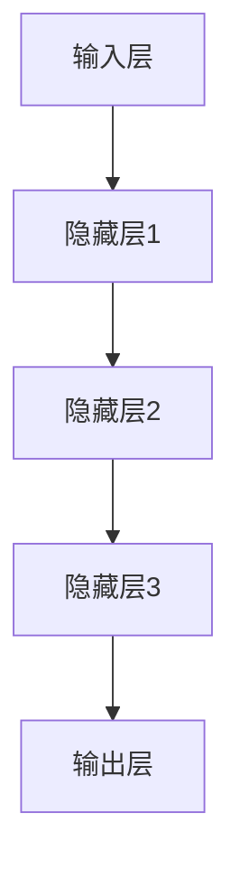

                 

## 文章标题

### AI大模型创业：如何利用未来优势？

> 关键词：AI大模型、创业、技术优势、未来展望

> 摘要：本文将深入探讨AI大模型的本质及其在创业中的应用。我们将逐步分析AI大模型的发展历程、核心技术、应用场景，并从创业环境和机会、商业模式和营销策略、技术路线选择、项目管理与风险控制、法律与伦理等方面，详细阐述如何利用AI大模型的优势开展创业活动，展望其未来发展趋势。

### 目录大纲

#### 第一部分：AI大模型概述

- **第1章 AI大模型的基本概念**
  - **1.1 AI大模型的发展历程**
  - **1.2 AI大模型的核心技术**
    - **1.2.1 深度学习基础**
    - **1.2.2 自然语言处理**
    - **1.2.3 大规模预训练模型**
  - **1.3 AI大模型的应用场景**
    - **1.3.1 产业应用**
    - **1.3.2 社会服务**

#### 第二部分：AI大模型创业机会分析

- **第2章 AI大模型创业机会分析**
  - **2.1 创业环境与趋势**
  - **2.2 创业模式与商业模式**

#### 第三部分：AI大模型创业实战

- **第3章 AI大模型创业实战**
  - **3.1 创业团队构建**
  - **3.2 技术研发与产品开发**
  - **3.3 项目管理与风险控制**

#### 第四部分：AI大模型创业法律与伦理

- **第4章 AI大模型创业法律与伦理**
  - **4.1 法律合规与知识产权保护**
  - **4.2 伦理问题与社会责任**

#### 第五部分：AI大模型创业案例分析

- **第5章 AI大模型创业案例分析**
  - **5.1 案例一：智能语音助手开发**
  - **5.2 案例二：智能推荐系统构建**
  - **5.3 案例三：智能医疗诊断系统**

#### 第六部分：AI大模型创业的未来展望

- **第6章 AI大模型创业的未来展望**
  - **6.1 技术发展趋势**
  - **6.2 市场前景与挑战**

#### 第七部分：总结与展望

- **第7章 总结与展望**
  - **7.1 成功创业经验总结**
  - **7.2 未来创业方向展望**

## 第一部分：AI大模型概述

### 第1章 AI大模型的基本概念

#### 1.1 AI大模型的发展历程

AI大模型（Large-scale AI Models）的发展历程可以追溯到20世纪80年代的专家系统和规则推理系统。这些早期的AI系统依赖于手动编码的规则和知识库，虽然在一些特定领域取得了成功，但在处理复杂任务和大规模数据时表现有限。随着计算能力和数据量的快速增长，AI领域迎来了深度学习和大数据技术的突破。

深度学习（Deep Learning）是AI大模型发展的关键驱动力。2006年，Hinton等研究者提出了深度信念网络（Deep Belief Networks），标志着深度学习进入了一个新阶段。随后，2012年，AlexNet在ImageNet竞赛中取得了突破性成绩，引发了深度学习在图像识别领域的广泛应用。这一时期，深度神经网络（DNN）和卷积神经网络（CNN）成为了AI大模型的核心架构。

随着时间的推移，AI大模型不断发展，从单一任务的模型扩展到多模态、跨领域的复杂模型。近年来，预训练模型（Pre-trained Models）和生成模型（Generative Models）的出现，进一步提升了AI大模型的能力。这些模型通过在大规模数据集上进行预训练，然后进行微调（Fine-tuning），实现了在多个领域的卓越性能。

#### 1.2 AI大模型的核心技术

AI大模型的核心技术包括深度学习基础、自然语言处理和大规模预训练模型。以下将逐一介绍这些核心技术。

##### 1.2.1 深度学习基础

深度学习是一种多层神经网络，通过多层次的非线性变换，实现从输入数据到输出结果的映射。以下是一个简化的深度学习架构图，使用Mermaid流程图展示：



深度学习的基本组件包括：

1. **神经元**：神经网络的基本单元，用于对输入数据进行加权求和处理。
2. **激活函数**：用于引入非线性特性，常见的激活函数有Sigmoid、ReLU等。
3. **损失函数**：用于评估模型预测值与实际值之间的差异，常见的损失函数有均方误差（MSE）、交叉熵（Cross-Entropy）等。

以下是一个简单的神经网络训练算法的伪代码：

```python
# 初始化权重和偏置
weights = np.random.randn(num_layers, input_dim)
biases = np.random.randn(num_layers, hidden_dim)

# 定义激活函数和损失函数
activation_function = sigmoid
loss_function = MSE

# 训练过程
for epoch in range(num_epochs):
    for batch in batches:
        # 前向传播
        output = forward_pass(input, weights, biases, activation_function)
        
        # 计算损失
        loss = loss_function(output, target)
        
        # 反向传播
        d_output = backward_pass(output, target, activation_function)
        
        # 更新权重和偏置
        weights -= learning_rate * d_weights
        biases -= learning_rate * d_biases
```

##### 1.2.2 自然语言处理

自然语言处理（Natural Language Processing，NLP）是AI大模型的重要组成部分。NLP的目标是使计算机能够理解和生成自然语言，以下将介绍NLP的核心技术。

1. **词嵌入**：词嵌入（Word Embedding）是一种将词汇映射到高维连续空间的技巧，用于表示词汇的语义信息。常见的词嵌入方法包括词袋模型（Bag of Words）、连续词袋（Continuous Bag of Words）和词嵌入模型（Word2Vec）。

   词嵌入的数学模型可以表示为：
   $$ \text{word\_embedding}(w) = \text{embedding}_{w} \in \mathbb{R}^{d} $$
   其中，$ \text{word\_embedding}(w) $表示词汇$ w $的词嵌入向量，$ \text{embedding}_{w} $表示词嵌入向量在$ d $维空间中的表示。

2. **序列模型与注意力机制**：序列模型（Sequence Model）用于处理自然语言中的序列数据，如句子或文本。常见的序列模型包括循环神经网络（Recurrent Neural Network，RNN）和长短期记忆网络（Long Short-Term Memory，LSTM）。

   注意力机制（Attention Mechanism）是一种用于提升序列模型性能的技术，通过为序列中的不同部分分配不同的注意力权重，提高了模型的上下文感知能力。以下是一个简化的注意力机制的伪代码：

   ```python
   # 输入序列
   input_sequence = [x_1, x_2, ..., x_T]
   
   # 注意力权重计算
   attention_weights = [w_1, w_2, ..., w_T]
   attention_scores = [s_1, s_2, ..., s_T]
   attention_scores = attention_weights * input_sequence
   
   # 注意力加权求和
   attention_output = sum(attention_scores)
   ```

##### 1.2.3 大规模预训练模型

大规模预训练模型（Large-scale Pre-trained Models）是当前AI大模型发展的一个重要方向。预训练模型通过在大规模数据集上进行预训练，然后进行微调（Fine-tuning），以适应特定任务。

1. **预训练模型原理**：预训练模型的基本思想是在大规模数据集上学习通用特征表示，然后通过微调将模型应用于特定任务。以下是一个简化的预训练模型的伪代码：

   ```python
   # 预训练过程
   pretrain_data = load_pretrain_data()
   for epoch in range(num_pretrain_epochs):
       for batch in pretrain_batches:
           # 前向传播
           output = forward_pass(batch, pretrain_model)
           
           # 计算损失
           loss = loss_function(output, target)
           
           # 反向传播
           d_output = backward_pass(output, target)
           
           # 更新模型参数
           pretrain_model.update_parameters(loss, d_output)
   
   # 微调过程
   fine_tune_data = load_fine_tune_data()
   for epoch in range(num_fine_tune_epochs):
       for batch in fine_tune_batches:
           # 前向传播
           output = forward_pass(batch, pretrain_model)
           
           # 计算损失
           loss = loss_function(output, target)
           
           # 反向传播
           d_output = backward_pass(output, target)
           
           # 更新模型参数
           pretrain_model.update_parameters(loss, d_output)
   ```

2. **迁移学习与微调**：迁移学习（Transfer Learning）是一种利用预训练模型在特定任务上的性能，通过微调将模型应用于新任务的技术。以下是一个简化的迁移学习与微调的伪代码：

   ```python
   # 加载预训练模型
   pretrain_model = load_pretrained_model()
   
   # 微调模型
   fine_tune_model = copy(pretrain_model)
   fine_tune_model.add_last_layer()
   
   # 训练微调模型
   for epoch in range(num_fine_tune_epochs):
       for batch in fine_tune_batches:
           # 前向传播
           output = forward_pass(batch, fine_tune_model)
           
           # 计算损失
           loss = loss_function(output, target)
           
           # 反向传播
           d_output = backward_pass(output, target)
           
           # 更新模型参数
           fine_tune_model.update_parameters(loss, d_output)
   ```

#### 1.3 AI大模型的应用场景

AI大模型在多个领域展示了强大的应用潜力，以下将介绍AI大模型在产业应用和社会服务中的应用场景。

##### 1.3.1 产业应用

1. **金融科技**：AI大模型在金融科技领域有广泛的应用，如智能投顾、风险控制、信用评分等。例如，利用大规模预训练模型进行文本分析，可以帮助金融机构进行客户需求分析、市场预测和风险识别。

   - **案例：智能投顾**
     - **背景**：随着金融市场的复杂性和不确定性增加，投资者需要更加智能化的投资建议。
     - **技术实现**：通过自然语言处理技术，分析客户的历史交易记录、投资偏好和行业动态，利用大规模预训练模型生成个性化的投资建议。

   - **案例：风险控制**
     - **背景**：金融机构需要有效识别和防范金融风险。
     - **技术实现**：利用深度学习模型，分析大量的金融交易数据，识别异常交易行为，实现对风险的实时监控和预警。

2. **医疗健康**：AI大模型在医疗健康领域的应用前景广阔，如疾病诊断、基因组学分析、个性化治疗等。

   - **案例：疾病诊断**
     - **背景**：准确、快速的疾病诊断对提高患者生存率和生活质量至关重要。
     - **技术实现**：通过深度学习模型，分析医学图像和病历数据，实现疾病的自动诊断和分类。

##### 1.3.2 社会服务

1. **智能客服**：AI大模型在智能客服领域具有显著优势，通过语音识别、自然语言处理等技术，提供高效、个性化的客户服务。

   - **案例：智能客服系统**
     - **背景**：传统客服方式效率低下，难以及时响应客户的多样化需求。
     - **技术实现**：利用预训练模型，实现智能语音识别和自然语言理解，为客户提供24/7的智能客服服务。

2. **教育辅助**：AI大模型在教育领域的应用有助于提升教学效果和个性化学习体验。

   - **案例：智能教育平台**
     - **背景**：传统教育方式难以满足学生个性化学习需求，教育资源分配不均。
     - **技术实现**：利用AI大模型，分析学生的学习行为和知识水平，提供个性化的学习资源和辅导，实现精准教学。

### 结论

AI大模型作为人工智能领域的重要突破，其发展历程、核心技术和应用场景为我们揭示了其在创业中的巨大潜力。通过深入理解和应用AI大模型，创业者可以在金融科技、医疗健康、智能客服和教育辅助等多个领域，利用AI大模型的优势，实现创新和商业价值。下一部分，我们将进一步探讨AI大模型创业的机会与挑战。

### 2.1 创业环境与趋势

#### 2.1.1 政策与市场环境

AI大模型创业环境在很大程度上受到政策与市场环境的影响。首先，各国政府纷纷出台了一系列支持人工智能发展的政策，包括资金投入、人才培养和知识产权保护等。例如，美国推出了“美国人工智能倡议”，旨在加快AI技术的研发和商业化应用；中国发布了《新一代人工智能发展规划》，明确了到2030年成为全球AI创新中心的战略目标。

这些政策支持为AI大模型创业提供了良好的外部环境，促进了技术的快速迭代和市场的快速扩张。同时，市场对AI大模型的需求也在不断增长。随着大数据、云计算等技术的普及，企业和个人对于智能化的需求日益旺盛，这为AI大模型创业提供了广阔的市场空间。

从市场需求角度来看，AI大模型在金融科技、医疗健康、智能客服、教育辅助等领域都展现出了强大的应用潜力。以金融科技为例，金融机构对于风险控制和智能投顾的需求不断增长，为AI大模型创业提供了丰富的应用场景。根据市场研究机构的预测，全球AI市场将在未来几年内保持高速增长，为创业者提供了巨大的机遇。

#### 2.1.2 技术成熟度评估

技术成熟度是AI大模型创业的重要考量因素。当前，AI大模型在算法和硬件基础设施方面已经取得了显著进展，但仍然面临一些挑战。

首先，在算法方面，深度学习和预训练模型的技术已经相对成熟，各种开源框架如TensorFlow和PyTorch提供了丰富的工具和资源。然而，如何进一步提升算法的性能和可解释性，仍然是一个重要的研究方向。例如，多模态数据处理和长文本理解是当前AI大模型面临的挑战之一，需要研究者不断创新和优化算法。

其次，在硬件基础设施方面，GPU和TPU等专用芯片的普及，为大规模模型训练提供了强大的计算支持。然而，大规模数据的存储和处理、模型的部署和优化仍然需要高效的硬件解决方案。例如，边缘计算和量子计算的快速发展，为AI大模型在实时性和计算效率方面带来了新的机遇。

总体来说，AI大模型的技术成熟度已经为创业提供了坚实的基础，但创业者需要密切关注技术趋势，持续优化和提升技术能力，以应对不断变化的市场需求。

### 2.2 创业模式与商业模式

#### 2.2.1 产品与市场定位

在AI大模型创业中，明确产品与市场定位是成功的关键。首先，创业者需要深入分析市场需求，了解用户痛点，从而确定产品的核心功能和价值。例如，在金融科技领域，用户对于风险控制和智能投顾的需求迫切，创业者可以专注于开发高精度、高可靠性的风险控制模型和智能投顾系统。

其次，创业者需要明确产品的目标市场。AI大模型的应用领域广泛，包括金融、医疗、教育、智能制造等，创业者可以根据自身的技术优势和市场需求，选择最具潜力的细分市场。例如，在医疗健康领域，针对医疗机构和医生群体的需求，创业者可以开发智能诊断系统和个性化治疗方案推荐系统。

产品定位不仅要关注市场需求，还要考虑技术实现和商业模式。创业者需要在产品设计与技术实现之间找到平衡，确保产品的实用性和商业可行性。例如，在开发智能教育平台时，创业者需要平衡个性化学习体验和技术实现的复杂性，以确保产品能够在市场上获得竞争优势。

#### 2.2.2 营销与推广策略

在明确了产品与市场定位后，营销与推广策略成为关键。首先，品牌建设是营销策略的核心。创业者需要通过一系列品牌传播活动，提升品牌知名度和美誉度。例如，通过社交媒体、博客、会议等渠道，发布技术文章、案例研究和用户反馈，展示产品的技术实力和应用价值。

其次，用户增长策略至关重要。创业者可以通过多种途径吸引用户，包括免费试用、用户推荐、合作推广等。例如，在智能教育平台领域，创业者可以推出免费试用课程，吸引用户注册使用，并通过用户推荐计划，扩大用户基础。

在用户增长过程中，用户体验和满意度是关键。创业者需要不断优化产品功能，提升用户体验，通过用户反馈不断迭代和改进产品。同时，通过提供优质的客户服务，提升用户满意度和忠诚度。

最后，创业者需要制定合理的收益模式与财务预测。在AI大模型创业中，收益模式可能包括产品销售、服务订阅、广告收入等。创业者需要根据市场需求和产品特点，制定合理的收益模式，并制定详细的财务预测，确保项目的可持续发展。

### 2.3 创业团队构建

在AI大模型创业中，团队构建是成功的关键。一个高效的创业团队需要具备多样化的技能和专业知识，以确保项目的顺利推进。

首先，技术团队是核心。技术团队负责模型研发、算法优化和系统实现，需要包括数据科学家、机器学习工程师、软件工程师等角色。数据科学家负责模型设计、实验和评估，机器学习工程师负责模型训练和优化，软件工程师负责系统架构设计和开发。

其次，产品团队负责产品设计和用户体验，需要包括产品经理、UI/UX设计师、前端工程师等。产品经理负责产品规划和需求分析，UI/UX设计师负责用户界面设计和用户体验优化，前端工程师负责实现用户界面和交互功能。

此外，运营团队负责项目管理和市场推广，需要包括项目经理、市场营销经理、客户服务等。项目经理负责项目规划和执行，市场营销经理负责品牌建设和市场推广，客户服务团队负责用户支持和维护。

在团队管理策略方面，创业者需要建立良好的沟通机制和协作工具，如团队会议、即时通讯工具、项目管理软件等。同时，创业者需要制定明确的工作目标和职责分工，确保团队成员能够高效协同工作。

### 3.1.1 团队成员角色与职责

在AI大模型创业过程中，团队成员的角色和职责清晰划分是确保项目高效推进和成功的关键。以下分别介绍技术团队、产品团队和运营团队的成员角色与职责。

#### 技术团队

**数据科学家**：数据科学家在团队中扮演着核心角色，负责模型设计、数据分析和实验评估。他们需要从海量数据中提取有价值的信息，设计并实现高效的算法模型，以解决实际业务问题。具体职责包括：
- **数据预处理**：清洗、整合和标准化数据，为模型训练做准备。
- **模型设计**：基于业务需求，设计合适的算法模型，选择合适的特征工程方法。
- **模型训练与评估**：使用数据集训练模型，调整参数以优化模型性能，评估模型的准确性和可靠性。
- **实验与迭代**：进行多次实验，不断迭代优化模型，确保模型能够在实际业务场景中有效应用。

**机器学习工程师**：机器学习工程师专注于模型训练和优化，将数据科学家设计的模型转化为可部署的生产系统。他们的职责包括：
- **模型实现**：根据数据科学家的设计，实现算法模型，编写相应的代码。
- **模型优化**：通过调整模型参数和架构，提高模型的性能和效率。
- **模型部署**：将训练好的模型部署到生产环境中，确保模型能够实时处理业务数据。
- **监控与维护**：监控模型在生产环境中的运行状态，定期进行性能评估和优化。

**软件工程师**：软件工程师负责系统的架构设计、开发和维护。他们的职责包括：
- **系统架构**：设计系统的整体架构，确保系统的高可用性、可扩展性和安全性。
- **模块开发**：根据项目需求，开发系统各个模块的功能。
- **接口设计**：设计系统接口，确保与其他系统的集成和协作。
- **测试与部署**：编写测试用例，确保系统的稳定性，进行部署和上线。

#### 产品团队

**产品经理**：产品经理负责产品的整体规划和需求分析，是连接用户与技术团队的桥梁。他们的职责包括：
- **需求分析**：了解用户需求，分析市场趋势，确定产品的功能和特性。
- **产品规划**：制定产品路线图，确定产品的发展方向和阶段性目标。
- **用户研究**：通过用户调研和反馈，优化产品设计和用户体验。
- **需求文档**：编写详细的需求文档，明确产品的功能、性能和用户体验要求。

**UI/UX设计师**：UI/UX设计师专注于用户界面的设计和用户体验的优化。他们的职责包括：
- **界面设计**：设计产品的用户界面，确保界面美观、直观和易用。
- **用户体验**：研究用户行为和需求，优化用户体验，提升用户满意度。
- **原型设计**：制作产品原型，与产品经理和技术团队协作，确保设计方案的可行性。
- **交互设计**：设计产品的交互逻辑和流程，确保用户能够顺利完成任务。

**前端工程师**：前端工程师负责实现用户界面和交互功能，确保产品能够在各种设备上正常运行。他们的职责包括：
- **前端开发**：使用HTML、CSS和JavaScript等技术，实现产品的前端界面。
- **响应式设计**：确保产品在不同设备和屏幕尺寸上具有良好的适配性和用户体验。
- **性能优化**：优化前端性能，提升页面加载速度和交互效率。
- **测试与部署**：编写前端测试用例，确保代码质量和功能完整性，进行部署和上线。

#### 运营团队

**项目经理**：项目经理负责项目的整体管理和协调，确保项目按计划进行。他们的职责包括：
- **项目规划**：制定项目计划，明确项目目标、任务和进度。
- **团队协调**：协调团队成员的工作，确保各部门协同合作。
- **进度监控**：监控项目进度，及时发现并解决问题，确保项目按时完成。
- **风险管理**：识别项目风险，制定风险应对措施，降低项目风险。

**市场营销经理**：市场营销经理负责产品的品牌建设和市场推广，提升产品的市场认知度和用户粘性。他们的职责包括：
- **市场调研**：分析市场趋势和竞争环境，确定市场定位和推广策略。
- **品牌建设**：制定品牌战略，提升品牌知名度和美誉度。
- **营销活动**：策划和执行市场推广活动，吸引用户关注和转化。
- **数据分析**：收集并分析市场数据，评估营销活动的效果，优化推广策略。

**客户服务团队**：客户服务团队负责用户的咨询和支持，提升用户满意度和忠诚度。他们的职责包括：
- **用户咨询**：解答用户的疑问，提供产品使用帮助。
- **问题处理**：快速响应并解决用户的问题，提升用户体验。
- **用户反馈**：收集用户反馈，分析用户需求，优化产品和服务。
- **用户维系**：通过电话、邮件、在线聊天等多种方式，与用户保持沟通，提升用户满意度和忠诚度。

通过明确团队成员的角色与职责，AI大模型创业团队能够高效协作，确保项目的顺利推进和成功。

### 3.1.2 团队管理策略

在AI大模型创业过程中，团队管理策略的有效实施是确保项目成功的关键。以下将介绍团队协作工具、项目管理方法以及激励机制的构建。

**团队协作工具**：在AI大模型创业中，团队协作工具的选择和运用至关重要。以下是一些常用的团队协作工具：

1. **项目管理软件**：如Jira、Trello等，用于任务分配、进度跟踪和团队协作。
   - **任务分配**：通过项目管理软件，项目经理可以明确分配任务，确保每个团队成员了解自己的职责和任务。
   - **进度跟踪**：实时监控任务进度，确保项目按计划推进。
   - **协作沟通**：团队成员可以通过项目管理软件进行实时沟通，解决任务中的问题和挑战。

2. **代码协作工具**：如Git、GitHub等，用于代码管理和版本控制。
   - **代码管理**：团队成员通过Git等工具协同工作，确保代码的版本一致性和完整性。
   - **代码审查**：通过代码审查机制，确保代码的质量和安全性。

3. **即时通讯工具**：如Slack、Microsoft Teams等，用于实时沟通和协作。
   - **实时沟通**：团队成员可以通过即时通讯工具快速交流，解决突发问题和困难。
   - **协作会议**：通过视频会议功能，团队可以定期召开会议，讨论项目进展和策略。

**项目管理方法**：在AI大模型创业中，采用科学的项目管理方法有助于提高项目效率和质量。以下是一些常用的项目管理方法：

1. **敏捷开发**：敏捷开发（Agile Development）是一种迭代和增量的软件开发方法，强调灵活响应变化和快速交付。敏捷开发的关键实践包括：
   - **用户故事**：通过用户故事（User Story）明确用户需求，确保项目开发与用户实际需求相符。
   - **迭代开发**：将项目分为多个迭代（Sprint），每个迭代周期为2-4周，每个迭代交付可用的产品功能。
   - **每日站立会议**：每日召开站立会议，团队成员汇报任务进度和遇到的问题，确保团队协同工作。

2. **看板管理**：看板（Kanban）是一种视觉化管理工具，用于跟踪项目进度和任务状态。看板通常包含以下三个核心组件：
   - **工作项**：代表待完成的任务。
   - **列**：代表工作流程的不同阶段，如“待办”、“进行中”、“已完成”等。
   - **卡片**：用于标记每个工作项的状态，通过移动卡片，团队成员可以清晰地了解任务进展。

**激励机制**：为了提高团队成员的积极性和工作效率，激励机制的建设至关重要。以下是一些有效的激励机制：

1. **绩效奖励**：根据团队成员的工作表现和项目贡献，设定绩效奖励制度，激励团队成员努力工作。
   - **季度奖励**：设立季度奖金，奖励表现优秀的团队成员。
   - **个人奖励**：设立个人绩效奖金，奖励在项目中做出突出贡献的成员。

2. **股权激励**：为长期员工提供股权激励，使其成为公司的一部分，共同分享公司的成功和成长。
   - **股权分配**：根据员工的岗位和贡献，设定不同的股权分配方案。
   - **股权奖励**：在项目成功或公司重要里程碑时，授予员工额外股权奖励。

3. **培训与发展**：提供持续的培训和职业发展机会，提高团队成员的专业技能和综合素质。
   - **内部培训**：定期举办内部培训课程，提升团队成员的专业知识和技能。
   - **外部培训**：为团队成员提供参加行业会议、研讨会和培训课程的机会，拓展视野和交流经验。

通过构建科学有效的团队管理策略，AI大模型创业团队能够高效协同，确保项目的顺利进行和成功。

### 3.2.1 技术路线选择

在AI大模型创业过程中，技术路线的选择至关重要。一个明确且合理的技术路线能够确保项目在正确方向上稳步推进，提高项目成功率。以下是几个关键因素，帮助创业者选择合适的技术路线。

**技术方向的市场需求**：首先，创业者需要分析市场需求，确定技术方向。AI大模型的应用场景广泛，包括金融科技、医疗健康、智能客服和教育辅助等。创业者应根据目标市场的需求，选择具有高增长潜力的技术方向。例如，在医疗健康领域，疾病诊断和个性化治疗的需求日益增长，创业者可以选择开发相关AI模型。

**团队的技术背景和经验**：创业者需要评估团队在所选技术方向上的技术背景和经验。选择团队熟悉且擅长的技术方向，可以降低技术实现的难度和风险。例如，如果团队成员在自然语言处理领域有丰富经验，可以选择开发基于NLP的AI应用，如智能客服或智能推荐系统。

**技术的可扩展性和适应性**：创业者应考虑技术的可扩展性和适应性。一个可扩展的技术架构能够支持业务规模的扩大和功能的拓展。例如，选择云计算平台和分布式计算架构，可以方便地扩展计算资源和存储容量，以应对不断增长的数据和处理需求。

**技术的创新性和竞争力**：创业者还需关注技术的创新性和竞争力。在技术方向上，应避免与市场主导者的直接竞争，寻找细分市场或差异化优势。例如，在智能医疗领域，可以开发特定病种的诊断模型，提供更专业和精确的服务。

**技术实现的可行性**：最后，创业者需要评估技术实现的可行性。这包括技术实现的难度、所需资源、时间成本等。创业者应选择实现难度适中、资源投入合理的技术路线，以确保项目能够在预算和时间范围内完成。

通过综合考虑以上因素，创业者可以制定一个合理且具有竞争力的技术路线，为AI大模型创业项目的成功奠定基础。

#### 3.2.2 技术实现与产品迭代

AI大模型创业项目中，技术实现和产品迭代是两个关键环节。一个高效的技术实现和迭代过程能够确保项目的顺利进行和产品的持续优化。以下将详细介绍这两个环节的具体步骤和策略。

**技术实现过程**：

1. **需求分析与模型设计**：
   - **需求分析**：明确产品的功能需求和性能指标，确定AI模型的应用场景。
   - **模型设计**：根据需求，设计合适的AI模型结构，选择深度学习、自然语言处理或生成模型等。

2. **数据准备与处理**：
   - **数据收集**：收集与业务需求相关的数据，包括结构化数据和非结构化数据。
   - **数据处理**：对收集到的数据进行清洗、归一化和特征提取，确保数据的质量和可用性。

3. **模型训练与优化**：
   - **模型训练**：使用收集到的数据，通过深度学习框架（如TensorFlow、PyTorch）训练AI模型。
   - **模型优化**：通过调整模型参数和结构，优化模型的性能和准确度。

4. **模型评估与验证**：
   - **模型评估**：使用验证集评估模型的表现，包括准确度、召回率、F1分数等指标。
   - **模型验证**：将模型应用到实际业务场景中，验证其效果和稳定性。

5. **模型部署与监控**：
   - **模型部署**：将训练好的模型部署到生产环境中，确保模型能够实时处理业务数据。
   - **模型监控**：监控模型的运行状态和性能，及时发现问题并进行调整。

**产品迭代过程**：

1. **用户反馈收集**：
   - **用户调研**：通过问卷调查、用户访谈等方式，收集用户的反馈和建议。
   - **用户测试**：邀请用户参与产品的测试，收集真实使用场景中的反馈。

2. **功能迭代与优化**：
   - **功能迭代**：根据用户反馈，对产品进行功能迭代和优化，增加新的功能或改进现有功能。
   - **性能优化**：对产品进行性能优化，提高系统的响应速度和稳定性。

3. **用户体验提升**：
   - **界面优化**：优化用户界面设计，提升用户体验。
   - **交互优化**：改进产品交互设计，提高用户操作便捷性。

4. **持续迭代与优化**：
   - **敏捷开发**：采用敏捷开发方法，快速响应市场需求和用户反馈，实现持续迭代。
   - **数据驱动**：基于用户数据和行为分析，持续优化产品和功能。

**策略**：

1. **团队合作**：建立高效的团队合作机制，确保团队成员在需求分析、设计、开发和测试等环节紧密协作。

2. **数据驱动**：基于数据分析和用户反馈，驱动产品迭代和优化，确保产品与用户需求保持一致。

3. **敏捷开发**：采用敏捷开发方法，快速迭代和优化产品，提高开发效率和市场响应速度。

4. **持续学习**：鼓励团队成员持续学习和探索新技术，不断提升团队的技术能力和竞争力。

通过科学的技术实现和产品迭代过程，AI大模型创业项目能够不断提升产品质量和市场竞争力，实现可持续的商业成功。

#### 3.3.1 项目管理流程

在AI大模型创业项目中，项目管理流程是确保项目按计划顺利进行、资源合理配置和风险有效控制的关键环节。以下是项目管理流程的详细步骤和要点：

1. **项目启动**：
   - **项目立项**：明确项目目标和范围，制定项目初步计划和时间表。
   - **资源分配**：根据项目需求和团队能力，合理分配项目资源，包括人力、资金和物资。
   - **团队组建**：组建项目团队，明确团队成员的角色和职责，确保团队成员之间的沟通和协作。

2. **需求分析与规划**：
   - **需求分析**：通过用户调研、需求访谈等方式，收集并分析用户需求，明确项目的功能需求和性能指标。
   - **项目规划**：制定详细的项目计划，包括任务分解、时间安排、资源需求和风险预测等。

3. **任务分配与监控**：
   - **任务分配**：根据项目计划和团队职责，明确每个任务的责任人和完成时间。
   - **进度监控**：定期检查任务进度，确保项目按计划推进，及时发现和解决问题。

4. **风险管理**：
   - **风险识别**：识别项目过程中可能出现的风险，包括技术风险、市场风险和团队风险等。
   - **风险评估**：评估每个风险的可能性和影响，制定相应的风险应对措施。
   - **风险监控**：监控风险的变化，及时调整风险应对措施，确保项目风险在可控范围内。

5. **项目执行与质量控制**：
   - **项目执行**：按照项目计划和任务分配，开展项目的具体工作，确保各项任务按时完成。
   - **质量控制**：通过代码审查、测试和质量控制流程，确保项目的质量和稳定性。

6. **项目收尾与总结**：
   - **项目验收**：对项目进行验收，确保项目达到预期目标和质量标准。
   - **项目总结**：对项目进行总结，包括项目完成情况、经验教训和改进措施，为未来项目提供参考。

7. **项目文档管理**：
   - **文档编写**：编写项目相关文档，包括项目计划、需求文档、设计文档和测试报告等。
   - **文档维护**：定期更新和维护项目文档，确保文档的准确性和完整性。

通过科学的项目管理流程，AI大模型创业项目能够有效控制项目进度、质量和风险，确保项目的成功实施和交付。

#### 3.3.2 风险管理策略

在AI大模型创业项目中，风险管理是确保项目顺利进行和成功的关键环节。有效的风险管理策略能够帮助团队识别、评估和应对潜在风险，从而降低项目失败的概率。以下是几个关键的风险管理策略：

**风险识别**：风险识别是风险管理的第一步。团队需要系统地识别项目过程中可能出现的风险，包括技术风险、市场风险、团队风险和外部风险等。以下是一些常见的风险识别方法：

1. **专家访谈**：通过与行业专家、团队成员和利益相关者进行访谈，了解可能存在的风险。
2. **历史数据分析**：分析类似项目的历史数据，识别常见的风险点和失败原因。
3. **头脑风暴**：组织团队成员进行头脑风暴，讨论可能出现的风险，并记录下来。

**风险评估**：在识别风险后，团队需要对每个风险进行评估，确定其可能性和影响。以下是一些常用的风险评估方法：

1. **风险矩阵**：使用风险矩阵（Risk Matrix）对风险的可能性和影响进行评估，确定风险的优先级。
2. **概率影响分析**：通过计算每个风险的概率和影响，确定风险的综合得分，从而评估其优先级。
3. **敏感性分析**：分析项目中对关键因素的变化敏感的风险，了解其对项目目标的影响。

**风险应对措施**：在评估风险后，团队需要制定相应的风险应对措施，以降低风险的概率和影响。以下是一些常见的风险应对措施：

1. **风险规避**：通过改变项目计划或策略，避免高风险的发生。例如，选择替代技术或推迟关键任务的执行。
2. **风险转移**：将风险转移给第三方，如购买保险或签订风险合同。
3. **风险减轻**：采取措施降低风险的概率或影响。例如，通过加强测试和验证过程，降低技术风险。
4. **风险接受**：在风险的概率和影响较低时，可以选择接受风险，并在项目执行过程中持续监控和应对。

**风险监控与调整**：在项目执行过程中，团队需要持续监控风险的变化，并根据实际情况调整风险应对措施。以下是一些风险监控的方法：

1. **定期风险审查**：定期召开风险审查会议，评估风险的变化和应对措施的有效性。
2. **实时监控**：使用项目管理工具和指标，实时监控项目的风险状况。
3. **反馈机制**：建立有效的反馈机制，鼓励团队成员报告风险和问题，及时调整风险应对措施。

通过以上风险管理策略，AI大模型创业项目能够更好地识别、评估和应对潜在风险，确保项目的顺利进行和成功。

#### 4.1.1 法律法规解读

在AI大模型创业过程中，了解相关法律法规是确保项目合规性和可持续性的基础。以下将介绍数据保护法和知识产权法在AI大模型创业中的具体应用和重要条款。

**数据保护法**

数据保护法旨在保护个人数据的隐私和安全，防止数据滥用和泄露。以下是一些关键条款：

1. **数据主体权利**：数据主体（即个人）享有访问、修改和删除自己数据的权利。AI大模型创业者需要确保用户能够方便地行使这些权利。
2. **数据最小化原则**：收集和使用数据时，应遵循数据最小化原则，仅收集与业务需求相关的最小数据量。
3. **数据匿名化**：在处理和分析数据时，应采取措施确保数据匿名化，避免个人身份的泄露。
4. **数据安全措施**：创业企业需要采取适当的安全措施，包括数据加密、访问控制和备份等，确保数据的安全性和完整性。

**知识产权法**

知识产权法保护知识产权的合法权益，包括专利、商标和版权等。以下是一些关键条款：

1. **专利保护**：对于自主研发的AI大模型，创业企业可以通过申请专利来保护其技术创新。以下是一些专利申请的关键点：
   - **新颖性**：确保技术方案具有新颖性，未在国内外公开披露过。
   - **实用性**：技术方案应具有实际应用价值，能够解决技术问题。
   - **可实施性**：技术方案应具有可实施性，能够通过工业实施。
2. **商标注册**：创业企业可以通过注册商标，保护其品牌和产品标识。商标注册的关键点包括：
   - **独特性**：商标应具有独特性，能够区分企业的产品和服务。
   - **可视性**：商标应具有可视性，能够在市场上容易被识别。
3. **版权保护**：对于AI大模型的源代码、文档和创意内容，创业企业可以通过版权法进行保护。以下是一些版权保护的关键点：
   - **原创性**：确保内容具有原创性，属于创作者的智力成果。
   - **登记备案**：通过版权登记备案，增强权利的证明力和法律效力。

通过了解和遵守数据保护法和知识产权法，AI大模型创业企业能够确保其合法合规运营，降低法律风险，并为未来的技术创新和商业发展提供坚实保障。

#### 4.1.2 知识产权保护策略

在AI大模型创业过程中，知识产权保护策略至关重要。有效的知识产权保护策略不仅能够保护企业的技术创新，还能为企业带来竞争优势和商业价值。以下将介绍几种常见的知识产权保护策略：

**专利申请**：专利是保护技术创新的重要手段。以下是一些专利申请的策略：

1. **专利挖掘**：在项目研发阶段，通过专利检索和分析，挖掘潜在的创新点和专利保护点。这有助于确保项目的创新性，避免侵犯他人的专利权。
2. **专利布局**：根据企业的战略目标和市场定位，制定专利布局策略。通过在不同国家和地区申请专利，形成全球专利网，保护企业的技术创新。
3. **专利合作**：与其他企业或研究机构建立专利合作，共同研发和申请专利。这有助于整合资源，提高专利的申请成功率。
4. **专利维权**：在专利侵权发生时，及时采取法律手段进行维权，保护企业的专利权益。

**商标注册**：商标是企业品牌形象的重要标志，通过注册商标可以保护企业的品牌和产品标识。以下是一些商标注册的策略：

1. **商标设计**：设计具有独特性和识别性的商标，确保商标在市场上容易被识别。
2. **商标保护范围**：在注册商标时，尽可能扩大商标的保护范围，确保企业的品牌不受侵犯。
3. **持续监控**：定期监控商标的使用情况，及时发现和应对商标侵权行为。

**版权保护**：版权保护是保护源代码、文档和创意内容的重要手段。以下是一些版权保护的策略：

1. **版权登记**：通过版权登记，增强权利的证明力和法律效力。
2. **源代码保护**：在开发过程中，采用加密和访问控制等手段，保护源代码不被非法获取和复制。
3. **文档管理**：建立完善的文档管理制度，确保文档的完整性和保密性。
4. **版权声明**：在相关文档和产品中明确版权声明，告知用户版权归属，防止侵权行为。

通过实施上述知识产权保护策略，AI大模型创业企业能够有效保护其技术创新和商业利益，降低法律风险，为企业的长期发展提供坚实保障。

#### 4.2.1 伦理框架与准则

在AI大模型创业过程中，伦理问题日益成为重要议题。建立一套全面的伦理框架与准则，有助于企业在技术开发和应用过程中遵循道德原则，保障社会的公平、公正和可持续发展。以下是几个关键方面：

1. **隐私保护**：AI大模型通常涉及大量个人数据，企业应严格遵循隐私保护法规，采取数据加密、匿名化和权限控制等手段，确保用户数据的隐私和安全。
2. **公平公正**：AI大模型在决策过程中应避免歧视，确保对不同人群的公平对待。例如，在招聘、信用评估等方面，避免基于种族、性别、年龄等因素进行不公平判断。
3. **透明性**：企业应确保AI大模型的工作过程和决策逻辑透明，让用户了解模型的运作原理和潜在风险。这有助于增强用户对AI技术的信任。
4. **可解释性**：对于复杂的AI大模型，企业应努力提高其可解释性，使非专业用户能够理解模型的决策过程。这有助于减少对AI技术的误解和偏见。
5. **责任归属**：明确AI大模型在应用过程中可能出现的责任归属问题。企业应建立责任追溯机制，确保在发生错误或损害时，能够迅速、公正地承担责任。

通过遵循上述伦理框架与准则，AI大模型创业企业能够树立良好的社会形象，赢得用户的信任，为可持续发展奠定基础。

#### 4.2.2 伦理审查与监管

在AI大模型创业过程中，伦理审查和监管是确保技术发展符合社会伦理和法律法规的重要环节。以下将介绍伦理审查流程、监管机构合作和伦理风险评估。

**伦理审查流程**

1. **伦理审查委员会**：企业应成立专门的伦理审查委员会，负责评估AI大模型项目在伦理方面的合规性和可行性。审查委员会应由来自不同领域的专家组成，包括伦理学家、法律顾问、技术专家等。
2. **审查流程**：伦理审查流程包括初步审查、深入审查和持续审查。在初步审查阶段，审查委员会评估项目提案的伦理风险；在深入审查阶段，审查委员会对项目的伦理影响进行详细评估；在持续审查阶段，审查委员会监控项目实施过程中的伦理问题，确保项目始终符合伦理标准。
3. **伦理评估报告**：审查委员会应对每个项目编写伦理评估报告，详细记录审查过程和结论，为项目决策提供依据。

**监管机构合作**

1. **政府监管**：企业应主动与政府监管机构合作，遵守相关法律法规，接受监管机构的监督和指导。例如，在数据保护方面，企业应遵守《通用数据保护条例》（GDPR）等法规。
2. **行业自律**：参与行业协会或标准组织，积极推动AI大模型领域的伦理规范制定和实施。行业自律有助于提高整体伦理水平，促进技术健康发展。
3. **国际合作**：在全球范围内，企业应与各国监管机构合作，确保AI大模型的技术和应用符合国际标准和伦理要求。

**伦理风险评估**

1. **识别风险**：在项目初期，企业应全面识别AI大模型可能带来的伦理风险，包括隐私侵犯、不公平歧视、误导性信息等。
2. **评估影响**：对识别出的风险进行影响评估，确定其可能性和严重性。企业应采取相应的风险缓解措施，降低伦理风险。
3. **持续监控**：在项目实施过程中，企业应持续监控伦理风险的变化，及时调整应对措施，确保项目始终符合伦理标准。

通过完善的伦理审查流程、积极的监管机构合作和全面的伦理风险评估，AI大模型创业企业能够确保其技术发展符合社会伦理和法律法规，促进技术的健康、可持续发展。

#### 5.1 案例一：智能语音助手开发

**5.1.1 项目背景与目标**

智能语音助手作为AI大模型应用的一个重要领域，近年来得到了广泛关注和快速发展。本案例将详细介绍一个智能语音助手的开发过程，包括项目背景、目标以及具体技术实现和产品迭代。

**项目背景**：随着人工智能技术的不断进步和智能手机的普及，用户对智能语音助手的依赖日益增强。智能语音助手可以提供语音识别、语音合成、自然语言处理等功能，帮助用户实现语音指令的识别和执行，提高生活和工作效率。

**项目目标**：本项目旨在开发一款功能齐全、用户体验优良的智能语音助手，满足用户在日常生活和工作中对语音交互的需求。具体目标包括：
- **语音识别**：准确识别用户语音指令，支持多种语言和方言。
- **自然语言理解**：理解用户的意图和需求，提供相应的响应和服务。
- **语音合成**：以自然流畅的语音与用户进行互动。
- **多模态交互**：支持语音、文本、图像等多种交互方式，提供无缝的用户体验。

**5.1.2 技术实现与产品迭代**

**语音识别技术**：
- **前端采集**：使用高性能麦克风阵列采集用户语音信号，确保语音信号的清晰度和准确性。
- **预处理**：对采集到的语音信号进行预处理，包括降噪、增益、分帧和特征提取。常用的特征提取方法包括梅尔频率倒谱系数（MFCC）和滤频带数（FBANK）。
- **后端识别**：使用深度学习模型，如卷积神经网络（CNN）和循环神经网络（RNN），对预处理后的特征进行分类识别。常见的语音识别模型包括DeepSpeech和WaveNet。

**自然语言理解**：
- **词嵌入**：将自然语言文本转换为高维向量表示，常用的词嵌入模型有Word2Vec和BERT。
- **意图识别**：使用分类模型，如支持向量机（SVM）和深度神经网络（DNN），识别用户的语音指令意图。
- **实体识别**：使用命名实体识别（NER）模型，提取语音指令中的关键实体信息，如人名、地点、时间等。
- **对话管理**：使用序列到序列（Seq2Seq）模型或注意力机制（Attention Mechanism）模型，实现多轮对话管理和上下文理解。

**语音合成技术**：
- **文本到语音（Text-to-Speech，TTS）**：将文本转换为自然流畅的语音，常用的TTS模型有WaveNet和Transformer TTS。
- **语音生成**：使用深度学习模型，如循环神经网络（RNN）和生成对抗网络（GAN），生成高质量的语音信号。
- **情感合成**：通过调整语音的语调、语速和音量，实现不同情感的表达。

**产品迭代**：
- **用户反馈**：通过用户反馈，不断优化语音识别和自然语言理解模型的性能和准确性。
- **功能扩展**：根据用户需求，不断添加新的功能和场景支持，如语音助手在智能家居、智能客服和医疗健康等领域的应用。
- **性能优化**：通过模型压缩和加速技术，提高语音助手的响应速度和用户体验。

**5.1.3 用户体验与反馈**

在智能语音助手的开发过程中，用户体验至关重要。以下是从用户角度出发的几个关键点：

- **易用性**：确保语音助手易于上手和使用，提供直观的用户界面和简洁的交互流程。
- **准确性**：提高语音识别和自然语言理解模型的准确性，减少误识别和误解。
- **多样性**：支持多种语言和方言，满足不同地区和用户群体的需求。
- **情感化**：通过情感合成技术，使语音助手的声音更加自然、亲切，提升用户体验。

通过不断优化技术实现和产品迭代，智能语音助手能够满足用户的多样化需求，提供优质的语音交互体验，进一步提升用户满意度和忠诚度。

#### 5.2 案例二：智能推荐系统构建

**5.2.1 项目背景与目标**

智能推荐系统是AI大模型在电子商务、社交媒体和信息检索等领域的广泛应用，其核心目标是根据用户的兴趣和行为，为其推荐相关的内容或产品。本案例将详细介绍智能推荐系统的构建过程，包括项目背景、目标以及技术实现和优化策略。

**项目背景**：随着互联网的快速发展，用户生成的内容和消费行为数据爆炸式增长，如何有效地利用这些数据为用户提供个性化的推荐成为了一个重要的研究课题。智能推荐系统通过分析用户的兴趣和行为，实现个性化推荐，能够提高用户体验和满意度，增强用户粘性和转化率。

**项目目标**：本项目旨在构建一个高效、精准和可扩展的智能推荐系统，实现以下目标：
- **用户兴趣挖掘**：从用户的历史行为数据中挖掘用户的兴趣偏好，建立个性化的用户画像。
- **推荐算法优化**：设计并优化推荐算法，提高推荐结果的相关性和准确性。
- **系统性能优化**：确保推荐系统的实时性和高效性，满足大规模用户的需求。

**5.2.2 技术实现与优化策略**

**用户兴趣挖掘**：
- **行为数据收集**：收集用户在平台上的浏览、搜索、购买等行为数据，构建用户行为数据库。
- **用户画像构建**：利用机器学习算法，如聚类分析和协同过滤，对用户行为数据进行分析，构建用户的兴趣偏好模型。具体方法包括：
  - **基于内容的推荐**：根据用户浏览和购买过的内容，推荐类似的内容。
  - **协同过滤推荐**：通过分析用户之间的相似性，推荐与目标用户兴趣相似的其他用户喜欢的内容。
  - **深度学习模型**：使用深度学习模型，如卷积神经网络（CNN）和循环神经网络（RNN），构建用户的兴趣图谱，实现更精细的兴趣挖掘。

**推荐算法优化**：
- **推荐算法选择**：根据业务需求和数据特点，选择合适的推荐算法，如基于内容的推荐、协同过滤和深度学习推荐等。
- **特征工程**：设计并优化推荐算法中的特征工程，包括用户特征、物品特征和上下文特征。通过特征选择和特征转换，提高推荐算法的性能。
- **模型优化**：使用交叉验证和网格搜索等方法，优化推荐算法的参数设置，提高推荐结果的准确性。常用的模型优化方法包括：
  - **集成学习**：使用集成学习方法，如随机森林（Random Forest）和梯度提升树（Gradient Boosting Tree），提高模型的泛化能力和推荐效果。
  - **迁移学习**：利用迁移学习方法，将其他领域的模型和知识迁移到推荐系统中，提高推荐算法的适应性和准确性。

**系统性能优化**：
- **数据处理和存储**：采用高效的数据处理和存储技术，如分布式计算和分布式存储，确保推荐系统在大规模数据集上的高效运行。
- **缓存策略**：使用缓存策略，减少对数据库的查询次数，提高系统的响应速度。
- **系统监控**：建立系统监控机制，实时监控推荐系统的性能指标，如响应时间、错误率和吞吐量等，及时发现和解决问题。

**5.2.3 用户反馈与迭代**

用户反馈是智能推荐系统持续优化和迭代的重要依据。以下是从用户反馈角度出发的几个关键点：

- **用户满意度调查**：定期进行用户满意度调查，收集用户对推荐结果的满意度和建议。
- **行为数据跟踪**：实时跟踪用户的点击、浏览和购买行为，分析推荐效果，识别用户兴趣变化。
- **个性化调整**：根据用户反馈和行为数据，动态调整推荐策略，提高推荐结果的准确性。
- **A/B测试**：通过A/B测试，对比不同推荐算法和策略的效果，选择最优的推荐方案。

通过不断优化技术实现和产品迭代，智能推荐系统能够更好地满足用户的需求，提高用户满意度和忠诚度，为企业的商业成功提供有力支持。

#### 5.3 案例三：智能医疗诊断系统

**5.3.1 项目背景与目标**

智能医疗诊断系统是AI大模型在医疗健康领域的典型应用，通过深度学习和计算机视觉等技术，实现疾病的自动诊断和分类。本案例将详细介绍智能医疗诊断系统的开发过程，包括项目背景、目标以及技术实现和产品迭代。

**项目背景**：随着医疗技术和信息技术的快速发展，智能医疗诊断系统越来越受到关注。智能医疗诊断系统能够辅助医生进行诊断，提高诊断准确率和效率，减轻医生的工作负担，有望在医疗资源短缺和医疗需求增长的情况下发挥重要作用。

**项目目标**：本项目旨在开发一款功能完善、性能卓越的智能医疗诊断系统，实现以下目标：
- **疾病识别**：利用深度学习模型，对医学图像进行自动分析和诊断，识别常见疾病。
- **辅助诊断**：提供准确的诊断结果和医生建议，辅助医生进行临床诊断。
- **用户体验**：确保系统的易用性和用户体验，为医生和患者提供便捷、高效的诊断服务。

**5.3.2 技术实现与产品迭代**

**医学图像处理**：
- **图像采集**：使用高分辨率医学成像设备，如CT、MRI等，采集高质量的医学图像。
- **图像预处理**：对采集到的医学图像进行预处理，包括图像增强、去噪和图像分割。预处理步骤有助于提高图像质量和后续处理的效果。
- **特征提取**：利用深度学习模型，如卷积神经网络（CNN）和生成对抗网络（GAN），提取医学图像中的关键特征。特征提取是后续模型训练和诊断的基础。

**深度学习模型**：
- **模型训练**：使用大量标注好的医学图像数据，训练深度学习模型。训练过程包括数据预处理、模型架构设计、参数优化和模型评估。
- **模型优化**：通过模型优化技术，如迁移学习和模型压缩，提高模型的性能和可扩展性。迁移学习可以从其他领域的模型中提取有用知识，模型压缩可以减少模型的计算量和存储空间需求。
- **模型部署**：将训练好的模型部署到生产环境中，确保模型能够实时处理新的医学图像数据。

**产品迭代**：
- **用户反馈**：通过医生和患者的使用反馈，不断优化系统的功能和用户体验。
- **算法更新**：定期更新模型算法，提高诊断准确率和效率。
- **数据扩充**：增加更多种类和标注的医学图像数据，丰富模型训练数据集，提高模型的泛化能力。

**5.3.3 临床应用与反馈**

智能医疗诊断系统的临床应用和反馈是评估系统性能和改进系统设计的重要环节。以下是从临床应用和反馈角度出发的几个关键点：

- **临床验证**：在真实临床环境中验证智能医疗诊断系统的性能，确保系统的诊断准确性和可靠性。
- **医生培训**：为医生提供智能医疗诊断系统的使用培训，帮助医生理解和掌握系统的功能和操作方法。
- **患者参与**：鼓励患者参与智能医疗诊断系统的评价，提供反馈和建议，改进系统的用户体验和功能。
- **持续改进**：根据临床反馈，不断优化系统的算法和界面设计，提高系统的适应性和实用性。

通过临床应用和持续反馈，智能医疗诊断系统能够更好地满足医生和患者的需求，提高诊断效率和准确性，为医疗健康领域带来革命性变化。

### 6.1 技术发展趋势

在AI大模型领域，技术发展趋势持续影响着创业项目的方向和成功。以下是几个关键的技术发展趋势，包括新型神经网络架构、多模态数据处理和硬件与基础设施的发展。

**新型神经网络架构**

新型神经网络架构不断涌现，推动AI大模型的发展。以下是一些重要的发展趋势：

1. **Transformer架构**：Transformer架构在自然语言处理领域取得了巨大成功，其基于自注意力机制的设计使得模型能够捕捉长距离依赖关系。继Transformer之后，变体模型如BERT、GPT和T5等进一步优化了Transformer架构，提升了模型的性能和效率。

2. **神经符号推理**：神经符号推理（Neural Symbolic Reasoning）结合了神经网络和符号逻辑推理的优势，旨在实现更强大的推理能力和解释性。通过融合符号逻辑和深度学习，神经符号推理模型能够在复杂任务中实现更精确的推理和决策。

3. **动态神经网络**：动态神经网络（Dynamic Neural Networks）能够根据输入数据的变化动态调整网络结构和参数，提高了模型的灵活性和适应性。例如，动态图神经网络（Dynamic Graph Neural Networks）在处理时间序列数据方面表现优异，适用于实时监测和预测。

**多模态数据处理**

多模态数据处理是AI大模型发展的另一个重要方向，它涉及到将不同类型的数据（如文本、图像、音频、视频等）融合到同一模型中进行处理。以下是一些关键的发展趋势：

1. **多模态融合技术**：多模态融合技术旨在将来自不同模态的数据进行有效整合，以提高模型的感知能力和决策能力。常见的多模态融合方法包括基于特征的融合、基于模型的融合和基于神经网络的融合。

2. **跨模态表示学习**：跨模态表示学习（Cross-modal Representation Learning）通过学习不同模态数据的共享表示，实现不同模态之间的信息传递和融合。深度学习框架如Deep Fusion和MMF（Multi-modal Fusion）模型在跨模态任务中取得了显著成效。

3. **多模态交互模型**：多模态交互模型（Multi-modal Interaction Models）通过设计特定的网络结构，使不同模态的数据能够相互影响和交互，提高模型的感知能力和任务性能。例如，ViViT模型结合了视觉和音频信息，实现了高质量的视频生成和分类。

**硬件与基础设施发展**

硬件与基础设施的发展对AI大模型的性能和应用场景产生了深远影响。以下是一些关键的发展趋势：

1. **专用芯片与加速器**：随着AI大模型的复杂性增加，对计算资源的需求也大幅提升。专用芯片（如TPU、GPU）和加速器（如FPGA）的普及，为AI大模型的训练和推理提供了强大的计算支持。这些硬件解决方案使得大模型能够在更短时间内完成训练和推理任务。

2. **云计算与边缘计算**：云计算和边缘计算的发展为AI大模型的应用提供了灵活的计算资源。云计算平台（如Google Cloud、AWS、Azure）提供了丰富的AI服务和支持工具，使得创业者能够快速部署和扩展AI大模型。边缘计算通过在靠近数据源的地方进行计算，实现了低延迟、高效率的数据处理，适用于实时监控和智能决策。

3. **分布式计算与联邦学习**：分布式计算和联邦学习（Federated Learning）技术使得大模型能够在多个设备和服务器之间共享计算资源，降低了数据传输和存储的成本。分布式计算通过利用集群计算资源，实现了大规模模型的并行训练。联邦学习则通过在客户端设备上进行模型训练，减少了数据传输的负担，同时保护了用户隐私。

通过关注和掌握这些技术发展趋势，AI大模型创业项目能够更好地应对未来市场的需求，实现持续的技术创新和商业成功。

### 6.2 市场前景与挑战

#### 6.2.1 市场规模预测

AI大模型市场预计将在未来几年内保持高速增长。根据市场研究机构的预测，全球AI大模型市场在未来5年的复合年增长率（CAGR）将超过30%。其中，金融科技、医疗健康、智能客服和教育辅助等领域的增长尤为显著。

- **金融科技**：随着金融行业对智能化的需求不断增加，AI大模型在风险管理、信用评分、欺诈检测等方面的应用将快速增长。预计到2027年，全球金融科技AI大模型市场将达到数百亿美元。
- **医疗健康**：AI大模型在疾病诊断、基因组学分析和个性化治疗等领域的应用潜力巨大。随着技术的不断进步和政策的支持，医疗健康领域的AI大模型市场预计将在未来5年实现翻倍增长。
- **智能客服**：随着消费者对个性化服务和即时响应的需求增加，AI大模型在智能客服领域的应用将不断扩大。预计到2027年，全球智能客服AI大模型市场将超过1000亿美元。
- **教育辅助**：AI大模型在教育领域的应用包括个性化学习、智能评测和虚拟教育助手等。随着在线教育和远程学习的普及，教育辅助领域的AI大模型市场规模预计将在未来5年实现显著增长。

#### 6.2.2 持续挑战与应对

尽管AI大模型市场前景广阔，但创业者仍需面对一系列挑战：

1. **技术壁垒**：AI大模型的开发需要强大的技术实力和资源投入。创业者需要具备深厚的机器学习、深度学习和自然语言处理等领域的专业知识，同时需要投入大量资源进行模型训练和优化。

2. **数据隐私与安全**：AI大模型在数据处理过程中涉及大量个人数据，如何保护用户隐私和数据安全是创业者面临的重要挑战。创业者需要严格遵守数据保护法规，采取严格的数据加密、匿名化和访问控制措施。

3. **算法公平性与透明性**：AI大模型的决策过程往往缺乏透明性，容易导致算法歧视和不公平。创业者需要设计透明、可解释的算法，确保模型的决策过程符合伦理和社会标准。

4. **市场竞争**：AI大模型市场竞争激烈，创业者需要不断创新和优化技术，以获得竞争优势。同时，需要关注行业动态和竞争对手，及时调整战略。

5. **政策与法规风险**：随着AI技术的发展，各国政府可能出台新的政策和法规，对AI大模型的应用进行规范。创业者需要密切关注政策变化，确保其业务合规。

为了应对这些挑战，创业者可以采取以下策略：

- **技术创新**：持续投入研发，推动AI大模型技术的创新和突破。
- **数据安全**：建立完善的数据安全管理体系，确保用户数据的安全和隐私。
- **伦理合规**：遵守伦理规范和法律法规，确保算法的公平性和透明性。
- **市场定位**：明确目标市场，专注于特定领域的应用，实现差异化竞争。
- **政策合规**：密切关注政策变化，确保业务合规，降低政策风险。

通过有效应对市场挑战，AI大模型创业项目能够在激烈的市场竞争中脱颖而出，实现持续的商业成功。

### 7.1 成功创业经验总结

在AI大模型创业领域，成功的创业经验为后来的创业者提供了宝贵的参考。以下是几个关键的成功要素，包括团队构建、技术路线和技术优势。

**团队构建**：成功的AI大模型创业离不开一个高效、多元化的团队。一个优秀的团队应包括数据科学家、机器学习工程师、软件工程师、产品经理、市场营销人员和运营专家等。每个成员都应具备各自领域的专业知识和经验，能够协同工作，共同推动项目的发展。例如，谷歌的DeepMind团队凭借其卓越的数据科学家和机器学习工程师，在AI大模型领域取得了重大突破。

**技术路线**：明确且合理的技术路线是AI大模型创业项目成功的关键。创业者需要根据市场需求和自身技术优势，选择合适的技术方向。例如，微软的Azure Machine Learning团队在构建大规模机器学习模型时，采用了云计算和分布式计算技术，实现了高效的模型训练和部署。创业者还应密切关注技术趋势，不断优化和升级技术，以保持竞争优势。

**技术优势**：在AI大模型创业中，技术优势是制胜的关键。创业者应专注于自身的核心技术，形成差异化的竞争优势。例如，OpenAI在自然语言处理领域，通过自主研发的GPT系列模型，在文本生成、翻译和对话系统等方面取得了显著成果。创业者还可以通过技术创新、模型压缩和优化等技术手段，提升模型的性能和效率。

**商业运作**：成功的AI大模型创业不仅需要技术优势，还需要有效的商业模式和市场策略。创业者应明确目标市场，制定精准的市场定位和营销策略，确保产品的市场接受度和用户满意度。例如，亚马逊通过将AI大模型应用于电商推荐系统，提高了用户购物体验和转化率，实现了巨大的商业成功。

**持续迭代**：AI大模型创业需要不断迭代和优化。创业者应通过用户反馈和技术研究，持续改进产品功能和技术实现，确保产品能够满足不断变化的市场需求。例如，Spotify通过不断优化其推荐算法，提高了用户满意度和用户粘性。

通过以上成功要素，AI大模型创业项目能够在激烈的市场竞争中脱颖而出，实现商业成功。

### 7.2 未来创业方向展望

展望未来，AI大模型创业领域将继续扩展其应用范围，涌现出更多创新和机遇。以下是几个可能的未来创业方向，以及创业者的必备素质和策略。

**新兴领域探索**：

1. **生物技术与医疗**：AI大模型在生物信息学和医疗诊断领域的应用潜力巨大。创业者可以专注于开发基于AI的基因组分析、疾病预测和个性化治疗方案，以提升医疗诊断的准确性和效率。

2. **智能制造与工业4.0**：AI大模型在智能制造中的应用，如预测维护、质量检测和供应链管理，将推动工业4.0的进一步发展。创业者可以开发智能工厂解决方案，提高生产效率和降低成本。

3. **智能城市与交通**：AI大模型在城市管理和交通规划中的应用，如智能交通系统、环境监测和应急响应，将提升城市运行效率和居民生活质量。创业者可以探索智能城市的综合解决方案。

**跨界融合**：

1. **教育与AI**：AI大模型在教育领域的应用将越来越广泛，包括个性化学习、虚拟助教和智能评估。创业者可以开发结合AI技术的教育平台，提供定制化的学习体验。

2. **艺术与娱乐**：AI大模型在艺术创作和娱乐内容生成中的应用，如音乐、绘画和虚拟现实，将带来新的艺术形式和用户体验。创业者可以探索AI驱动的创意内容生成平台。

**创业者的必备素质和策略**：

1. **创新能力**：在快速发展的AI大模型领域，创业者需要具备强烈的创新意识，不断探索新技术和新应用场景。

2. **领导力与团队管理能力**：创业者需要具备优秀的领导力和团队管理能力，能够吸引和留住顶尖人才，打造高效团队。

3. **技术深度**：创业者需要具备深厚的AI技术背景，能够理解和应用深度学习、自然语言处理和生成模型等核心技术。

4. **市场敏锐度**：创业者需要密切关注市场动态，了解用户需求，制定精准的市场策略。

5. **风险意识**：创业者需要具备良好的风险意识，能够预见和应对潜在的市场和技术风险。

通过探索新兴领域和跨界融合，结合创新能力、领导力、技术深度和市场敏锐度，创业者能够在AI大模型创业领域取得成功。

